cola Report for GDS4589
==================

**Date**: 2019-12-25 21:43:45 CET, **cola version**: 1.3.2

----------------------------------------------------------------

<style type='text/css'>

body, td, th {
   font-family: Arial,Helvetica,sans-serif;
   background-color: white;
   font-size: 13px;
  max-width: 800px;
  margin: auto;
  margin-left:210px;
  padding: 0px 10px 0px 10px;
  border-left: 1px solid #EEEEEE;
  line-height: 150%;
}

tt, code, pre {
   font-family: 'DejaVu Sans Mono', 'Droid Sans Mono', 'Lucida Console', Consolas, Monaco, 

monospace;
}

h1 {
   font-size:2.2em;
}

h2 {
   font-size:1.8em;
}

h3 {
   font-size:1.4em;
}

h4 {
   font-size:1.0em;
}

h5 {
   font-size:0.9em;
}

h6 {
   font-size:0.8em;
}

a {
  text-decoration: none;
  color: #0366d6;
}

a:hover {
  text-decoration: underline;
}

a:visited {
   color: #0366d6;
}

pre, img {
  max-width: 100%;
}
pre {
  overflow-x: auto;
}
pre code {
   display: block; padding: 0.5em;
}

code {
  font-size: 92%;
  border: 1px solid #ccc;
}

code[class] {
  background-color: #F8F8F8;
}

table, td, th {
  border: 1px solid #ccc;
}

blockquote {
   color:#666666;
   margin:0;
   padding-left: 1em;
   border-left: 0.5em #EEE solid;
}

hr {
   height: 0px;
   border-bottom: none;
   border-top-width: thin;
   border-top-style: dotted;
   border-top-color: #999999;
}

@media print {
   * {
      background: transparent !important;
      color: black !important;
      filter:none !important;
      -ms-filter: none !important;
   }

   body {
      font-size:12pt;
      max-width:100%;
   }

   a, a:visited {
      text-decoration: underline;
   }

   hr {
      visibility: hidden;
      page-break-before: always;
   }

   pre, blockquote {
      padding-right: 1em;
      page-break-inside: avoid;
   }

   tr, img {
      page-break-inside: avoid;
   }

   img {
      max-width: 100% !important;
   }

   @page :left {
      margin: 15mm 20mm 15mm 10mm;
   }

   @page :right {
      margin: 15mm 10mm 15mm 20mm;
   }

   p, h2, h3 {
      orphans: 3; widows: 3;
   }

   h2, h3 {
      page-break-after: avoid;
   }
}
</style>


## Summary


All available functions which can be applied to this `res_list` object:


```r
res_list
```

```
#> A 'ConsensusPartitionList' object with 24 methods.
#>   On a matrix with 51941 rows and 103 columns.
#>   Top rows are extracted by 'SD, CV, MAD, ATC' methods.
#>   Subgroups are detected by 'hclust, kmeans, skmeans, pam, mclust, NMF' method.
#>   Number of partitions are tried for k = 2, 3, 4, 5, 6.
#>   Performed in total 30000 partitions by row resampling.
#> 
#> Following methods can be applied to this 'ConsensusPartitionList' object:
#>  [1] "cola_report"           "collect_classes"       "collect_plots"         "collect_stats"        
#>  [5] "colnames"              "functional_enrichment" "get_anno_col"          "get_anno"             
#>  [9] "get_classes"           "get_matrix"            "get_membership"        "get_stats"            
#> [13] "is_best_k"             "is_stable_k"           "ncol"                  "nrow"                 
#> [17] "rownames"              "show"                  "suggest_best_k"        "test_to_known_factors"
#> [21] "top_rows_heatmap"      "top_rows_overlap"     
#> 
#> You can get result for a single method by, e.g. object["SD", "hclust"] or object["SD:hclust"]
#> or a subset of methods by object[c("SD", "CV")], c("hclust", "kmeans")]
```

The call of `run_all_consensus_partition_methods()` was:


```
#> run_all_consensus_partition_methods(data = mat, mc.cores = 4, anno = anno)
```

Dimension of the input matrix:


```r
mat = get_matrix(res_list)
dim(mat)
```

```
#> [1] 51941   103
```

### Density distribution

The density distribution for each sample is visualized as in one column in the
following heatmap. The clustering is based on the distance which is the
Kolmogorov-Smirnov statistic between two distributions.


```r
library(ComplexHeatmap)
densityHeatmap(mat, top_annotation = HeatmapAnnotation(df = get_anno(res_list), 
    col = get_anno_col(res_list)), ylab = "value", cluster_columns = TRUE, show_column_names = FALSE,
    mc.cores = 4)
```

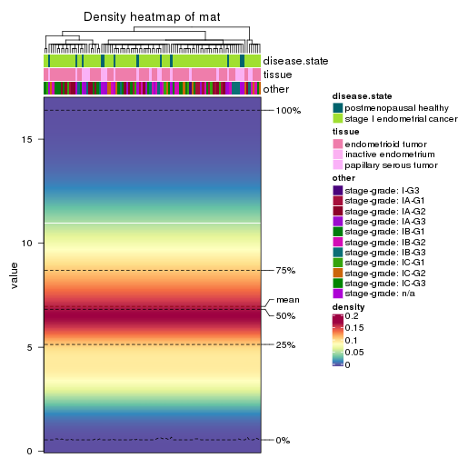


### Suggest the best k


Folowing table shows the best `k` (number of partitions) for each combination
of top-value methods and partition methods. Clicking on the method name in
the table goes to the section for a single combination of methods.

[The cola vignette](http://bioconductor.org/packages/devel/bioc/vignettes/cola/inst/doc/cola.html#toc_13)
explains the definition of the metrics used for determining the best
number of partitions.


```r
suggest_best_k(res_list)
```


|                            | The best k| 1-PAC| Mean silhouette| Concordance|   |Optional k |
|:---------------------------|----------:|-----:|---------------:|-----------:|:--|:----------|
|[ATC:kmeans](#ATC-kmeans)   |          3| 1.000|           0.994|       0.997|** |           |
|[ATC:NMF](#ATC-NMF)         |          2| 0.999|           0.970|       0.986|** |           |
|[MAD:mclust](#MAD-mclust)   |          3| 0.991|           0.932|       0.966|** |           |
|[ATC:pam](#ATC-pam)         |          3| 0.986|           0.955|       0.982|** |2          |
|[ATC:mclust](#ATC-mclust)   |          3| 0.979|           0.933|       0.956|** |2          |
|[SD:skmeans](#SD-skmeans)   |          2| 0.915|           0.900|       0.956|*  |           |
|[ATC:skmeans](#ATC-skmeans) |          5| 0.900|           0.883|       0.953|*  |2,3        |
|[MAD:skmeans](#MAD-skmeans) |          2| 0.800|           0.868|       0.940|   |           |
|[CV:skmeans](#CV-skmeans)   |          3| 0.793|           0.846|       0.925|   |           |
|[SD:mclust](#SD-mclust)     |          5| 0.752|           0.809|       0.885|   |           |
|[CV:mclust](#CV-mclust)     |          3| 0.724|           0.787|       0.909|   |           |
|[MAD:pam](#MAD-pam)         |          2| 0.704|           0.848|       0.928|   |           |
|[ATC:hclust](#ATC-hclust)   |          3| 0.610|           0.839|       0.873|   |           |
|[SD:pam](#SD-pam)           |          4| 0.603|           0.661|       0.845|   |           |
|[MAD:hclust](#MAD-hclust)   |          6| 0.585|           0.551|       0.704|   |           |
|[MAD:NMF](#MAD-NMF)         |          2| 0.564|           0.805|       0.906|   |           |
|[MAD:kmeans](#MAD-kmeans)   |          3| 0.544|           0.708|       0.842|   |           |
|[SD:NMF](#SD-NMF)           |          2| 0.530|           0.842|       0.921|   |           |
|[CV:pam](#CV-pam)           |          5| 0.519|           0.454|       0.731|   |           |
|[CV:NMF](#CV-NMF)           |          2| 0.495|           0.782|       0.841|   |           |
|[CV:kmeans](#CV-kmeans)     |          3| 0.478|           0.714|       0.833|   |           |
|[SD:kmeans](#SD-kmeans)     |          2| 0.227|           0.678|       0.811|   |           |
|[SD:hclust](#SD-hclust)     |          2| 0.164|           0.629|       0.789|   |           |
|[CV:hclust](#CV-hclust)     |          2| 0.093|           0.458|       0.723|   |           |

\*\*: 1-PAC > 0.95, \*: 1-PAC > 0.9


### CDF of consensus matrices

Cumulative distribution function curves of consensus matrix for all methods.


```r
collect_plots(res_list, fun = plot_ecdf)
```

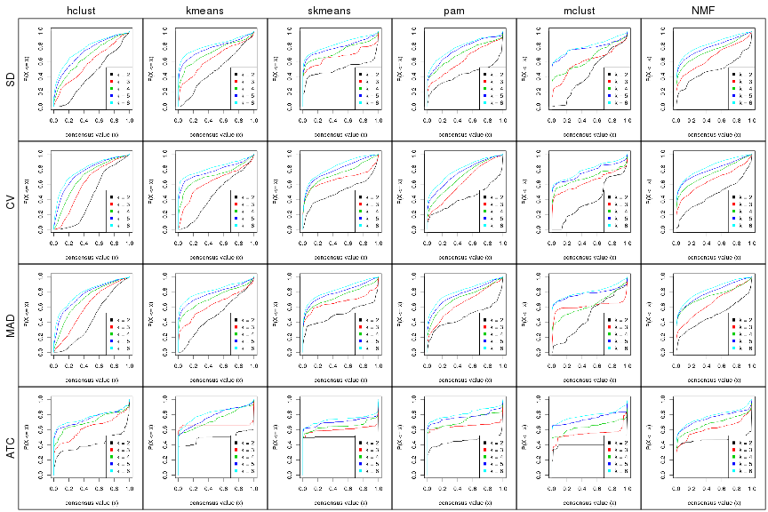


### Consensus heatmap

Consensus heatmaps for all methods. ([What is a consensus heatmap?](http://bioconductor.org/packages/devel/bioc/vignettes/cola/inst/doc/cola.html#toc_9))


<style type='text/css'>


.ui-helper-hidden {
	display: none;
}
.ui-helper-hidden-accessible {
	border: 0;
	clip: rect(0 0 0 0);
	height: 1px;
	margin: -1px;
	overflow: hidden;
	padding: 0;
	position: absolute;
	width: 1px;
}
.ui-helper-reset {
	margin: 0;
	padding: 0;
	border: 0;
	outline: 0;
	line-height: 1.3;
	text-decoration: none;
	font-size: 100%;
	list-style: none;
}
.ui-helper-clearfix:before,
.ui-helper-clearfix:after {
	content: "";
	display: table;
	border-collapse: collapse;
}
.ui-helper-clearfix:after {
	clear: both;
}
.ui-helper-zfix {
	width: 100%;
	height: 100%;
	top: 0;
	left: 0;
	position: absolute;
	opacity: 0;
	filter:Alpha(Opacity=0); 
}

.ui-front {
	z-index: 100;
}


.ui-state-disabled {
	cursor: default !important;
	pointer-events: none;
}


.ui-icon {
	display: inline-block;
	vertical-align: middle;
	margin-top: -.25em;
	position: relative;
	text-indent: -99999px;
	overflow: hidden;
	background-repeat: no-repeat;
}

.ui-widget-icon-block {
	left: 50%;
	margin-left: -8px;
	display: block;
}


.ui-widget-overlay {
	position: fixed;
	top: 0;
	left: 0;
	width: 100%;
	height: 100%;
}
.ui-accordion .ui-accordion-header {
	display: block;
	cursor: pointer;
	position: relative;
	margin: 2px 0 0 0;
	padding: .5em .5em .5em .7em;
	font-size: 100%;
}
.ui-accordion .ui-accordion-content {
	padding: 1em 2.2em;
	border-top: 0;
	overflow: auto;
}
.ui-autocomplete {
	position: absolute;
	top: 0;
	left: 0;
	cursor: default;
}
.ui-menu {
	list-style: none;
	padding: 0;
	margin: 0;
	display: block;
	outline: 0;
}
.ui-menu .ui-menu {
	position: absolute;
}
.ui-menu .ui-menu-item {
	margin: 0;
	cursor: pointer;
	
	list-style-image: url("data:image/gif;base64,R0lGODlhAQABAIAAAAAAAP///yH5BAEAAAAALAAAAAABAAEAAAIBRAA7");
}
.ui-menu .ui-menu-item-wrapper {
	position: relative;
	padding: 3px 1em 3px .4em;
}
.ui-menu .ui-menu-divider {
	margin: 5px 0;
	height: 0;
	font-size: 0;
	line-height: 0;
	border-width: 1px 0 0 0;
}
.ui-menu .ui-state-focus,
.ui-menu .ui-state-active {
	margin: -1px;
}


.ui-menu-icons {
	position: relative;
}
.ui-menu-icons .ui-menu-item-wrapper {
	padding-left: 2em;
}


.ui-menu .ui-icon {
	position: absolute;
	top: 0;
	bottom: 0;
	left: .2em;
	margin: auto 0;
}


.ui-menu .ui-menu-icon {
	left: auto;
	right: 0;
}
.ui-button {
	padding: .4em 1em;
	display: inline-block;
	position: relative;
	line-height: normal;
	margin-right: .1em;
	cursor: pointer;
	vertical-align: middle;
	text-align: center;
	-webkit-user-select: none;
	-moz-user-select: none;
	-ms-user-select: none;
	user-select: none;

	
	overflow: visible;
}

.ui-button,
.ui-button:link,
.ui-button:visited,
.ui-button:hover,
.ui-button:active {
	text-decoration: none;
}


.ui-button-icon-only {
	width: 2em;
	box-sizing: border-box;
	text-indent: -9999px;
	white-space: nowrap;
}


input.ui-button.ui-button-icon-only {
	text-indent: 0;
}


.ui-button-icon-only .ui-icon {
	position: absolute;
	top: 50%;
	left: 50%;
	margin-top: -8px;
	margin-left: -8px;
}

.ui-button.ui-icon-notext .ui-icon {
	padding: 0;
	width: 2.1em;
	height: 2.1em;
	text-indent: -9999px;
	white-space: nowrap;

}

input.ui-button.ui-icon-notext .ui-icon {
	width: auto;
	height: auto;
	text-indent: 0;
	white-space: normal;
	padding: .4em 1em;
}


input.ui-button::-moz-focus-inner,
button.ui-button::-moz-focus-inner {
	border: 0;
	padding: 0;
}
.ui-controlgroup {
	vertical-align: middle;
	display: inline-block;
}
.ui-controlgroup > .ui-controlgroup-item {
	float: left;
	margin-left: 0;
	margin-right: 0;
}
.ui-controlgroup > .ui-controlgroup-item:focus,
.ui-controlgroup > .ui-controlgroup-item.ui-visual-focus {
	z-index: 9999;
}
.ui-controlgroup-vertical > .ui-controlgroup-item {
	display: block;
	float: none;
	width: 100%;
	margin-top: 0;
	margin-bottom: 0;
	text-align: left;
}
.ui-controlgroup-vertical .ui-controlgroup-item {
	box-sizing: border-box;
}
.ui-controlgroup .ui-controlgroup-label {
	padding: .4em 1em;
}
.ui-controlgroup .ui-controlgroup-label span {
	font-size: 80%;
}
.ui-controlgroup-horizontal .ui-controlgroup-label + .ui-controlgroup-item {
	border-left: none;
}
.ui-controlgroup-vertical .ui-controlgroup-label + .ui-controlgroup-item {
	border-top: none;
}
.ui-controlgroup-horizontal .ui-controlgroup-label.ui-widget-content {
	border-right: none;
}
.ui-controlgroup-vertical .ui-controlgroup-label.ui-widget-content {
	border-bottom: none;
}


.ui-controlgroup-vertical .ui-spinner-input {

	
	width: 75%;
	width: calc( 100% - 2.4em );
}
.ui-controlgroup-vertical .ui-spinner .ui-spinner-up {
	border-top-style: solid;
}

.ui-checkboxradio-label .ui-icon-background {
	box-shadow: inset 1px 1px 1px #ccc;
	border-radius: .12em;
	border: none;
}
.ui-checkboxradio-radio-label .ui-icon-background {
	width: 16px;
	height: 16px;
	border-radius: 1em;
	overflow: visible;
	border: none;
}
.ui-checkboxradio-radio-label.ui-checkboxradio-checked .ui-icon,
.ui-checkboxradio-radio-label.ui-checkboxradio-checked:hover .ui-icon {
	background-image: none;
	width: 8px;
	height: 8px;
	border-width: 4px;
	border-style: solid;
}
.ui-checkboxradio-disabled {
	pointer-events: none;
}
.ui-datepicker {
	width: 17em;
	padding: .2em .2em 0;
	display: none;
}
.ui-datepicker .ui-datepicker-header {
	position: relative;
	padding: .2em 0;
}
.ui-datepicker .ui-datepicker-prev,
.ui-datepicker .ui-datepicker-next {
	position: absolute;
	top: 2px;
	width: 1.8em;
	height: 1.8em;
}
.ui-datepicker .ui-datepicker-prev-hover,
.ui-datepicker .ui-datepicker-next-hover {
	top: 1px;
}
.ui-datepicker .ui-datepicker-prev {
	left: 2px;
}
.ui-datepicker .ui-datepicker-next {
	right: 2px;
}
.ui-datepicker .ui-datepicker-prev-hover {
	left: 1px;
}
.ui-datepicker .ui-datepicker-next-hover {
	right: 1px;
}
.ui-datepicker .ui-datepicker-prev span,
.ui-datepicker .ui-datepicker-next span {
	display: block;
	position: absolute;
	left: 50%;
	margin-left: -8px;
	top: 50%;
	margin-top: -8px;
}
.ui-datepicker .ui-datepicker-title {
	margin: 0 2.3em;
	line-height: 1.8em;
	text-align: center;
}
.ui-datepicker .ui-datepicker-title select {
	font-size: 1em;
	margin: 1px 0;
}
.ui-datepicker select.ui-datepicker-month,
.ui-datepicker select.ui-datepicker-year {
	width: 45%;
}
.ui-datepicker table {
	width: 100%;
	font-size: .9em;
	border-collapse: collapse;
	margin: 0 0 .4em;
}
.ui-datepicker th {
	padding: .7em .3em;
	text-align: center;
	font-weight: bold;
	border: 0;
}
.ui-datepicker td {
	border: 0;
	padding: 1px;
}
.ui-datepicker td span,
.ui-datepicker td a {
	display: block;
	padding: .2em;
	text-align: right;
	text-decoration: none;
}
.ui-datepicker .ui-datepicker-buttonpane {
	background-image: none;
	margin: .7em 0 0 0;
	padding: 0 .2em;
	border-left: 0;
	border-right: 0;
	border-bottom: 0;
}
.ui-datepicker .ui-datepicker-buttonpane button {
	float: right;
	margin: .5em .2em .4em;
	cursor: pointer;
	padding: .2em .6em .3em .6em;
	width: auto;
	overflow: visible;
}
.ui-datepicker .ui-datepicker-buttonpane button.ui-datepicker-current {
	float: left;
}


.ui-datepicker.ui-datepicker-multi {
	width: auto;
}
.ui-datepicker-multi .ui-datepicker-group {
	float: left;
}
.ui-datepicker-multi .ui-datepicker-group table {
	width: 95%;
	margin: 0 auto .4em;
}
.ui-datepicker-multi-2 .ui-datepicker-group {
	width: 50%;
}
.ui-datepicker-multi-3 .ui-datepicker-group {
	width: 33.3%;
}
.ui-datepicker-multi-4 .ui-datepicker-group {
	width: 25%;
}
.ui-datepicker-multi .ui-datepicker-group-last .ui-datepicker-header,
.ui-datepicker-multi .ui-datepicker-group-middle .ui-datepicker-header {
	border-left-width: 0;
}
.ui-datepicker-multi .ui-datepicker-buttonpane {
	clear: left;
}
.ui-datepicker-row-break {
	clear: both;
	width: 100%;
	font-size: 0;
}


.ui-datepicker-rtl {
	direction: rtl;
}
.ui-datepicker-rtl .ui-datepicker-prev {
	right: 2px;
	left: auto;
}
.ui-datepicker-rtl .ui-datepicker-next {
	left: 2px;
	right: auto;
}
.ui-datepicker-rtl .ui-datepicker-prev:hover {
	right: 1px;
	left: auto;
}
.ui-datepicker-rtl .ui-datepicker-next:hover {
	left: 1px;
	right: auto;
}
.ui-datepicker-rtl .ui-datepicker-buttonpane {
	clear: right;
}
.ui-datepicker-rtl .ui-datepicker-buttonpane button {
	float: left;
}
.ui-datepicker-rtl .ui-datepicker-buttonpane button.ui-datepicker-current,
.ui-datepicker-rtl .ui-datepicker-group {
	float: right;
}
.ui-datepicker-rtl .ui-datepicker-group-last .ui-datepicker-header,
.ui-datepicker-rtl .ui-datepicker-group-middle .ui-datepicker-header {
	border-right-width: 0;
	border-left-width: 1px;
}


.ui-datepicker .ui-icon {
	display: block;
	text-indent: -99999px;
	overflow: hidden;
	background-repeat: no-repeat;
	left: .5em;
	top: .3em;
}
.ui-dialog {
	position: absolute;
	top: 0;
	left: 0;
	padding: .2em;
	outline: 0;
}
.ui-dialog .ui-dialog-titlebar {
	padding: .4em 1em;
	position: relative;
}
.ui-dialog .ui-dialog-title {
	float: left;
	margin: .1em 0;
	white-space: nowrap;
	width: 90%;
	overflow: hidden;
	text-overflow: ellipsis;
}
.ui-dialog .ui-dialog-titlebar-close {
	position: absolute;
	right: .3em;
	top: 50%;
	width: 20px;
	margin: -10px 0 0 0;
	padding: 1px;
	height: 20px;
}
.ui-dialog .ui-dialog-content {
	position: relative;
	border: 0;
	padding: .5em 1em;
	background: none;
	overflow: auto;
}
.ui-dialog .ui-dialog-buttonpane {
	text-align: left;
	border-width: 1px 0 0 0;
	background-image: none;
	margin-top: .5em;
	padding: .3em 1em .5em .4em;
}
.ui-dialog .ui-dialog-buttonpane .ui-dialog-buttonset {
	float: right;
}
.ui-dialog .ui-dialog-buttonpane button {
	margin: .5em .4em .5em 0;
	cursor: pointer;
}
.ui-dialog .ui-resizable-n {
	height: 2px;
	top: 0;
}
.ui-dialog .ui-resizable-e {
	width: 2px;
	right: 0;
}
.ui-dialog .ui-resizable-s {
	height: 2px;
	bottom: 0;
}
.ui-dialog .ui-resizable-w {
	width: 2px;
	left: 0;
}
.ui-dialog .ui-resizable-se,
.ui-dialog .ui-resizable-sw,
.ui-dialog .ui-resizable-ne,
.ui-dialog .ui-resizable-nw {
	width: 7px;
	height: 7px;
}
.ui-dialog .ui-resizable-se {
	right: 0;
	bottom: 0;
}
.ui-dialog .ui-resizable-sw {
	left: 0;
	bottom: 0;
}
.ui-dialog .ui-resizable-ne {
	right: 0;
	top: 0;
}
.ui-dialog .ui-resizable-nw {
	left: 0;
	top: 0;
}
.ui-draggable .ui-dialog-titlebar {
	cursor: move;
}
.ui-draggable-handle {
	-ms-touch-action: none;
	touch-action: none;
}
.ui-resizable {
	position: relative;
}
.ui-resizable-handle {
	position: absolute;
	font-size: 0.1px;
	display: block;
	-ms-touch-action: none;
	touch-action: none;
}
.ui-resizable-disabled .ui-resizable-handle,
.ui-resizable-autohide .ui-resizable-handle {
	display: none;
}
.ui-resizable-n {
	cursor: n-resize;
	height: 7px;
	width: 100%;
	top: -5px;
	left: 0;
}
.ui-resizable-s {
	cursor: s-resize;
	height: 7px;
	width: 100%;
	bottom: -5px;
	left: 0;
}
.ui-resizable-e {
	cursor: e-resize;
	width: 7px;
	right: -5px;
	top: 0;
	height: 100%;
}
.ui-resizable-w {
	cursor: w-resize;
	width: 7px;
	left: -5px;
	top: 0;
	height: 100%;
}
.ui-resizable-se {
	cursor: se-resize;
	width: 12px;
	height: 12px;
	right: 1px;
	bottom: 1px;
}
.ui-resizable-sw {
	cursor: sw-resize;
	width: 9px;
	height: 9px;
	left: -5px;
	bottom: -5px;
}
.ui-resizable-nw {
	cursor: nw-resize;
	width: 9px;
	height: 9px;
	left: -5px;
	top: -5px;
}
.ui-resizable-ne {
	cursor: ne-resize;
	width: 9px;
	height: 9px;
	right: -5px;
	top: -5px;
}
.ui-progressbar {
	height: 2em;
	text-align: left;
	overflow: hidden;
}
.ui-progressbar .ui-progressbar-value {
	margin: -1px;
	height: 100%;
}
.ui-progressbar .ui-progressbar-overlay {
	background: url("");
	height: 100%;
	filter: alpha(opacity=25); 
	opacity: 0.25;
}
.ui-progressbar-indeterminate .ui-progressbar-value {
	background-image: none;
}
.ui-selectable {
	-ms-touch-action: none;
	touch-action: none;
}
.ui-selectable-helper {
	position: absolute;
	z-index: 100;
	border: 1px dotted black;
}
.ui-selectmenu-menu {
	padding: 0;
	margin: 0;
	position: absolute;
	top: 0;
	left: 0;
	display: none;
}
.ui-selectmenu-menu .ui-menu {
	overflow: auto;
	overflow-x: hidden;
	padding-bottom: 1px;
}
.ui-selectmenu-menu .ui-menu .ui-selectmenu-optgroup {
	font-size: 1em;
	font-weight: bold;
	line-height: 1.5;
	padding: 2px 0.4em;
	margin: 0.5em 0 0 0;
	height: auto;
	border: 0;
}
.ui-selectmenu-open {
	display: block;
}
.ui-selectmenu-text {
	display: block;
	margin-right: 20px;
	overflow: hidden;
	text-overflow: ellipsis;
}
.ui-selectmenu-button.ui-button {
	text-align: left;
	white-space: nowrap;
	width: 14em;
}
.ui-selectmenu-icon.ui-icon {
	float: right;
	margin-top: 0;
}
.ui-slider {
	position: relative;
	text-align: left;
}
.ui-slider .ui-slider-handle {
	position: absolute;
	z-index: 2;
	width: 1.2em;
	height: 1.2em;
	cursor: default;
	-ms-touch-action: none;
	touch-action: none;
}
.ui-slider .ui-slider-range {
	position: absolute;
	z-index: 1;
	font-size: .7em;
	display: block;
	border: 0;
	background-position: 0 0;
}


.ui-slider.ui-state-disabled .ui-slider-handle,
.ui-slider.ui-state-disabled .ui-slider-range {
	filter: inherit;
}

.ui-slider-horizontal {
	height: .8em;
}
.ui-slider-horizontal .ui-slider-handle {
	top: -.3em;
	margin-left: -.6em;
}
.ui-slider-horizontal .ui-slider-range {
	top: 0;
	height: 100%;
}
.ui-slider-horizontal .ui-slider-range-min {
	left: 0;
}
.ui-slider-horizontal .ui-slider-range-max {
	right: 0;
}

.ui-slider-vertical {
	width: .8em;
	height: 100px;
}
.ui-slider-vertical .ui-slider-handle {
	left: -.3em;
	margin-left: 0;
	margin-bottom: -.6em;
}
.ui-slider-vertical .ui-slider-range {
	left: 0;
	width: 100%;
}
.ui-slider-vertical .ui-slider-range-min {
	bottom: 0;
}
.ui-slider-vertical .ui-slider-range-max {
	top: 0;
}
.ui-sortable-handle {
	-ms-touch-action: none;
	touch-action: none;
}
.ui-spinner {
	position: relative;
	display: inline-block;
	overflow: hidden;
	padding: 0;
	vertical-align: middle;
}
.ui-spinner-input {
	border: none;
	background: none;
	color: inherit;
	padding: .222em 0;
	margin: .2em 0;
	vertical-align: middle;
	margin-left: .4em;
	margin-right: 2em;
}
.ui-spinner-button {
	width: 1.6em;
	height: 50%;
	font-size: .5em;
	padding: 0;
	margin: 0;
	text-align: center;
	position: absolute;
	cursor: default;
	display: block;
	overflow: hidden;
	right: 0;
}

.ui-spinner a.ui-spinner-button {
	border-top-style: none;
	border-bottom-style: none;
	border-right-style: none;
}
.ui-spinner-up {
	top: 0;
}
.ui-spinner-down {
	bottom: 0;
}
.ui-tabs {
	position: relative;
	padding: .2em;
}
.ui-tabs .ui-tabs-nav {
	margin: 0;
	padding: .2em .2em 0;
}
.ui-tabs .ui-tabs-nav li {
	list-style: none;
	float: left;
	position: relative;
	top: 0;
	margin: 1px .2em 0 0;
	border-bottom-width: 0;
	padding: 0;
	white-space: nowrap;
}
.ui-tabs .ui-tabs-nav .ui-tabs-anchor {
	float: left;
	padding: .5em 1em;
	text-decoration: none;
}
.ui-tabs .ui-tabs-nav li.ui-tabs-active {
	margin-bottom: -1px;
	padding-bottom: 1px;
}
.ui-tabs .ui-tabs-nav li.ui-tabs-active .ui-tabs-anchor,
.ui-tabs .ui-tabs-nav li.ui-state-disabled .ui-tabs-anchor,
.ui-tabs .ui-tabs-nav li.ui-tabs-loading .ui-tabs-anchor {
	cursor: text;
}
.ui-tabs-collapsible .ui-tabs-nav li.ui-tabs-active .ui-tabs-anchor {
	cursor: pointer;
}
.ui-tabs .ui-tabs-panel {
	display: block;
	border-width: 0;
	padding: 1em 1.4em;
	background: none;
}
.ui-tooltip {
	padding: 8px;
	position: absolute;
	z-index: 9999;
	max-width: 300px;
}
body .ui-tooltip {
	border-width: 2px;
}

.ui-widget {
	font-family: Arial,Helvetica,sans-serif;
	font-size: 1em;
}
.ui-widget .ui-widget {
	font-size: 1em;
}
.ui-widget input,
.ui-widget select,
.ui-widget textarea,
.ui-widget button {
	font-family: Arial,Helvetica,sans-serif;
	font-size: 1em;
}
.ui-widget.ui-widget-content {
	border: 1px solid #c5c5c5;
}
.ui-widget-content {
	border: 1px solid #dddddd;
	background: #ffffff;
	color: #333333;
}
.ui-widget-content a {
	color: #333333;
}
.ui-widget-header {
	border: 1px solid #dddddd;
	background: #e9e9e9;
	color: #333333;
	font-weight: bold;
}
.ui-widget-header a {
	color: #333333;
}


.ui-state-default,
.ui-widget-content .ui-state-default,
.ui-widget-header .ui-state-default,
.ui-button,


html .ui-button.ui-state-disabled:hover,
html .ui-button.ui-state-disabled:active {
	border: 1px solid #c5c5c5;
	background: #f6f6f6;
	font-weight: normal;
	color: #454545;
}
.ui-state-default a,
.ui-state-default a:link,
.ui-state-default a:visited,
a.ui-button,
a:link.ui-button,
a:visited.ui-button,
.ui-button {
	color: #454545;
	text-decoration: none;
}
.ui-state-hover,
.ui-widget-content .ui-state-hover,
.ui-widget-header .ui-state-hover,
.ui-state-focus,
.ui-widget-content .ui-state-focus,
.ui-widget-header .ui-state-focus,
.ui-button:hover,
.ui-button:focus {
	border: 1px solid #cccccc;
	background: #ededed;
	font-weight: normal;
	color: #2b2b2b;
}
.ui-state-hover a,
.ui-state-hover a:hover,
.ui-state-hover a:link,
.ui-state-hover a:visited,
.ui-state-focus a,
.ui-state-focus a:hover,
.ui-state-focus a:link,
.ui-state-focus a:visited,
a.ui-button:hover,
a.ui-button:focus {
	color: #2b2b2b;
	text-decoration: none;
}

.ui-visual-focus {
	box-shadow: 0 0 3px 1px rgb(94, 158, 214);
}
.ui-state-active,
.ui-widget-content .ui-state-active,
.ui-widget-header .ui-state-active,
a.ui-button:active,
.ui-button:active,
.ui-button.ui-state-active:hover {
	border: 1px solid #003eff;
	background: #007fff;
	font-weight: normal;
	color: #ffffff;
}
.ui-icon-background,
.ui-state-active .ui-icon-background {
	border: #003eff;
	background-color: #ffffff;
}
.ui-state-active a,
.ui-state-active a:link,
.ui-state-active a:visited {
	color: #ffffff;
	text-decoration: none;
}


.ui-state-highlight,
.ui-widget-content .ui-state-highlight,
.ui-widget-header .ui-state-highlight {
	border: 1px solid #dad55e;
	background: #fffa90;
	color: #777620;
}
.ui-state-checked {
	border: 1px solid #dad55e;
	background: #fffa90;
}
.ui-state-highlight a,
.ui-widget-content .ui-state-highlight a,
.ui-widget-header .ui-state-highlight a {
	color: #777620;
}
.ui-state-error,
.ui-widget-content .ui-state-error,
.ui-widget-header .ui-state-error {
	border: 1px solid #f1a899;
	background: #fddfdf;
	color: #5f3f3f;
}
.ui-state-error a,
.ui-widget-content .ui-state-error a,
.ui-widget-header .ui-state-error a {
	color: #5f3f3f;
}
.ui-state-error-text,
.ui-widget-content .ui-state-error-text,
.ui-widget-header .ui-state-error-text {
	color: #5f3f3f;
}
.ui-priority-primary,
.ui-widget-content .ui-priority-primary,
.ui-widget-header .ui-priority-primary {
	font-weight: bold;
}
.ui-priority-secondary,
.ui-widget-content .ui-priority-secondary,
.ui-widget-header .ui-priority-secondary {
	opacity: .7;
	filter:Alpha(Opacity=70); 
	font-weight: normal;
}
.ui-state-disabled,
.ui-widget-content .ui-state-disabled,
.ui-widget-header .ui-state-disabled {
	opacity: .35;
	filter:Alpha(Opacity=35); 
	background-image: none;
}
.ui-state-disabled .ui-icon {
	filter:Alpha(Opacity=35); 
}


.ui-icon {
	width: 16px;
	height: 16px;
}
.ui-icon,
.ui-widget-content .ui-icon {
	background-image: url("images/ui-icons_444444_256x240.png");
}
.ui-widget-header .ui-icon {
	background-image: url("images/ui-icons_444444_256x240.png");
}
.ui-state-hover .ui-icon,
.ui-state-focus .ui-icon,
.ui-button:hover .ui-icon,
.ui-button:focus .ui-icon {
	background-image: url("images/ui-icons_555555_256x240.png");
}
.ui-state-active .ui-icon,
.ui-button:active .ui-icon {
	background-image: url("images/ui-icons_ffffff_256x240.png");
}
.ui-state-highlight .ui-icon,
.ui-button .ui-state-highlight.ui-icon {
	background-image: url("images/ui-icons_777620_256x240.png");
}
.ui-state-error .ui-icon,
.ui-state-error-text .ui-icon {
	background-image: url("images/ui-icons_cc0000_256x240.png");
}
.ui-button .ui-icon {
	background-image: url("images/ui-icons_777777_256x240.png");
}


.ui-icon-blank { background-position: 16px 16px; }
.ui-icon-caret-1-n { background-position: 0 0; }
.ui-icon-caret-1-ne { background-position: -16px 0; }
.ui-icon-caret-1-e { background-position: -32px 0; }
.ui-icon-caret-1-se { background-position: -48px 0; }
.ui-icon-caret-1-s { background-position: -65px 0; }
.ui-icon-caret-1-sw { background-position: -80px 0; }
.ui-icon-caret-1-w { background-position: -96px 0; }
.ui-icon-caret-1-nw { background-position: -112px 0; }
.ui-icon-caret-2-n-s { background-position: -128px 0; }
.ui-icon-caret-2-e-w { background-position: -144px 0; }
.ui-icon-triangle-1-n { background-position: 0 -16px; }
.ui-icon-triangle-1-ne { background-position: -16px -16px; }
.ui-icon-triangle-1-e { background-position: -32px -16px; }
.ui-icon-triangle-1-se { background-position: -48px -16px; }
.ui-icon-triangle-1-s { background-position: -65px -16px; }
.ui-icon-triangle-1-sw { background-position: -80px -16px; }
.ui-icon-triangle-1-w { background-position: -96px -16px; }
.ui-icon-triangle-1-nw { background-position: -112px -16px; }
.ui-icon-triangle-2-n-s { background-position: -128px -16px; }
.ui-icon-triangle-2-e-w { background-position: -144px -16px; }
.ui-icon-arrow-1-n { background-position: 0 -32px; }
.ui-icon-arrow-1-ne { background-position: -16px -32px; }
.ui-icon-arrow-1-e { background-position: -32px -32px; }
.ui-icon-arrow-1-se { background-position: -48px -32px; }
.ui-icon-arrow-1-s { background-position: -65px -32px; }
.ui-icon-arrow-1-sw { background-position: -80px -32px; }
.ui-icon-arrow-1-w { background-position: -96px -32px; }
.ui-icon-arrow-1-nw { background-position: -112px -32px; }
.ui-icon-arrow-2-n-s { background-position: -128px -32px; }
.ui-icon-arrow-2-ne-sw { background-position: -144px -32px; }
.ui-icon-arrow-2-e-w { background-position: -160px -32px; }
.ui-icon-arrow-2-se-nw { background-position: -176px -32px; }
.ui-icon-arrowstop-1-n { background-position: -192px -32px; }
.ui-icon-arrowstop-1-e { background-position: -208px -32px; }
.ui-icon-arrowstop-1-s { background-position: -224px -32px; }
.ui-icon-arrowstop-1-w { background-position: -240px -32px; }
.ui-icon-arrowthick-1-n { background-position: 1px -48px; }
.ui-icon-arrowthick-1-ne { background-position: -16px -48px; }
.ui-icon-arrowthick-1-e { background-position: -32px -48px; }
.ui-icon-arrowthick-1-se { background-position: -48px -48px; }
.ui-icon-arrowthick-1-s { background-position: -64px -48px; }
.ui-icon-arrowthick-1-sw { background-position: -80px -48px; }
.ui-icon-arrowthick-1-w { background-position: -96px -48px; }
.ui-icon-arrowthick-1-nw { background-position: -112px -48px; }
.ui-icon-arrowthick-2-n-s { background-position: -128px -48px; }
.ui-icon-arrowthick-2-ne-sw { background-position: -144px -48px; }
.ui-icon-arrowthick-2-e-w { background-position: -160px -48px; }
.ui-icon-arrowthick-2-se-nw { background-position: -176px -48px; }
.ui-icon-arrowthickstop-1-n { background-position: -192px -48px; }
.ui-icon-arrowthickstop-1-e { background-position: -208px -48px; }
.ui-icon-arrowthickstop-1-s { background-position: -224px -48px; }
.ui-icon-arrowthickstop-1-w { background-position: -240px -48px; }
.ui-icon-arrowreturnthick-1-w { background-position: 0 -64px; }
.ui-icon-arrowreturnthick-1-n { background-position: -16px -64px; }
.ui-icon-arrowreturnthick-1-e { background-position: -32px -64px; }
.ui-icon-arrowreturnthick-1-s { background-position: -48px -64px; }
.ui-icon-arrowreturn-1-w { background-position: -64px -64px; }
.ui-icon-arrowreturn-1-n { background-position: -80px -64px; }
.ui-icon-arrowreturn-1-e { background-position: -96px -64px; }
.ui-icon-arrowreturn-1-s { background-position: -112px -64px; }
.ui-icon-arrowrefresh-1-w { background-position: -128px -64px; }
.ui-icon-arrowrefresh-1-n { background-position: -144px -64px; }
.ui-icon-arrowrefresh-1-e { background-position: -160px -64px; }
.ui-icon-arrowrefresh-1-s { background-position: -176px -64px; }
.ui-icon-arrow-4 { background-position: 0 -80px; }
.ui-icon-arrow-4-diag { background-position: -16px -80px; }
.ui-icon-extlink { background-position: -32px -80px; }
.ui-icon-newwin { background-position: -48px -80px; }
.ui-icon-refresh { background-position: -64px -80px; }
.ui-icon-shuffle { background-position: -80px -80px; }
.ui-icon-transfer-e-w { background-position: -96px -80px; }
.ui-icon-transferthick-e-w { background-position: -112px -80px; }
.ui-icon-folder-collapsed { background-position: 0 -96px; }
.ui-icon-folder-open { background-position: -16px -96px; }
.ui-icon-document { background-position: -32px -96px; }
.ui-icon-document-b { background-position: -48px -96px; }
.ui-icon-note { background-position: -64px -96px; }
.ui-icon-mail-closed { background-position: -80px -96px; }
.ui-icon-mail-open { background-position: -96px -96px; }
.ui-icon-suitcase { background-position: -112px -96px; }
.ui-icon-comment { background-position: -128px -96px; }
.ui-icon-person { background-position: -144px -96px; }
.ui-icon-print { background-position: -160px -96px; }
.ui-icon-trash { background-position: -176px -96px; }
.ui-icon-locked { background-position: -192px -96px; }
.ui-icon-unlocked { background-position: -208px -96px; }
.ui-icon-bookmark { background-position: -224px -96px; }
.ui-icon-tag { background-position: -240px -96px; }
.ui-icon-home { background-position: 0 -112px; }
.ui-icon-flag { background-position: -16px -112px; }
.ui-icon-calendar { background-position: -32px -112px; }
.ui-icon-cart { background-position: -48px -112px; }
.ui-icon-pencil { background-position: -64px -112px; }
.ui-icon-clock { background-position: -80px -112px; }
.ui-icon-disk { background-position: -96px -112px; }
.ui-icon-calculator { background-position: -112px -112px; }
.ui-icon-zoomin { background-position: -128px -112px; }
.ui-icon-zoomout { background-position: -144px -112px; }
.ui-icon-search { background-position: -160px -112px; }
.ui-icon-wrench { background-position: -176px -112px; }
.ui-icon-gear { background-position: -192px -112px; }
.ui-icon-heart { background-position: -208px -112px; }
.ui-icon-star { background-position: -224px -112px; }
.ui-icon-link { background-position: -240px -112px; }
.ui-icon-cancel { background-position: 0 -128px; }
.ui-icon-plus { background-position: -16px -128px; }
.ui-icon-plusthick { background-position: -32px -128px; }
.ui-icon-minus { background-position: -48px -128px; }
.ui-icon-minusthick { background-position: -64px -128px; }
.ui-icon-close { background-position: -80px -128px; }
.ui-icon-closethick { background-position: -96px -128px; }
.ui-icon-key { background-position: -112px -128px; }
.ui-icon-lightbulb { background-position: -128px -128px; }
.ui-icon-scissors { background-position: -144px -128px; }
.ui-icon-clipboard { background-position: -160px -128px; }
.ui-icon-copy { background-position: -176px -128px; }
.ui-icon-contact { background-position: -192px -128px; }
.ui-icon-image { background-position: -208px -128px; }
.ui-icon-video { background-position: -224px -128px; }
.ui-icon-script { background-position: -240px -128px; }
.ui-icon-alert { background-position: 0 -144px; }
.ui-icon-info { background-position: -16px -144px; }
.ui-icon-notice { background-position: -32px -144px; }
.ui-icon-help { background-position: -48px -144px; }
.ui-icon-check { background-position: -64px -144px; }
.ui-icon-bullet { background-position: -80px -144px; }
.ui-icon-radio-on { background-position: -96px -144px; }
.ui-icon-radio-off { background-position: -112px -144px; }
.ui-icon-pin-w { background-position: -128px -144px; }
.ui-icon-pin-s { background-position: -144px -144px; }
.ui-icon-play { background-position: 0 -160px; }
.ui-icon-pause { background-position: -16px -160px; }
.ui-icon-seek-next { background-position: -32px -160px; }
.ui-icon-seek-prev { background-position: -48px -160px; }
.ui-icon-seek-end { background-position: -64px -160px; }
.ui-icon-seek-start { background-position: -80px -160px; }

.ui-icon-seek-first { background-position: -80px -160px; }
.ui-icon-stop { background-position: -96px -160px; }
.ui-icon-eject { background-position: -112px -160px; }
.ui-icon-volume-off { background-position: -128px -160px; }
.ui-icon-volume-on { background-position: -144px -160px; }
.ui-icon-power { background-position: 0 -176px; }
.ui-icon-signal-diag { background-position: -16px -176px; }
.ui-icon-signal { background-position: -32px -176px; }
.ui-icon-battery-0 { background-position: -48px -176px; }
.ui-icon-battery-1 { background-position: -64px -176px; }
.ui-icon-battery-2 { background-position: -80px -176px; }
.ui-icon-battery-3 { background-position: -96px -176px; }
.ui-icon-circle-plus { background-position: 0 -192px; }
.ui-icon-circle-minus { background-position: -16px -192px; }
.ui-icon-circle-close { background-position: -32px -192px; }
.ui-icon-circle-triangle-e { background-position: -48px -192px; }
.ui-icon-circle-triangle-s { background-position: -64px -192px; }
.ui-icon-circle-triangle-w { background-position: -80px -192px; }
.ui-icon-circle-triangle-n { background-position: -96px -192px; }
.ui-icon-circle-arrow-e { background-position: -112px -192px; }
.ui-icon-circle-arrow-s { background-position: -128px -192px; }
.ui-icon-circle-arrow-w { background-position: -144px -192px; }
.ui-icon-circle-arrow-n { background-position: -160px -192px; }
.ui-icon-circle-zoomin { background-position: -176px -192px; }
.ui-icon-circle-zoomout { background-position: -192px -192px; }
.ui-icon-circle-check { background-position: -208px -192px; }
.ui-icon-circlesmall-plus { background-position: 0 -208px; }
.ui-icon-circlesmall-minus { background-position: -16px -208px; }
.ui-icon-circlesmall-close { background-position: -32px -208px; }
.ui-icon-squaresmall-plus { background-position: -48px -208px; }
.ui-icon-squaresmall-minus { background-position: -64px -208px; }
.ui-icon-squaresmall-close { background-position: -80px -208px; }
.ui-icon-grip-dotted-vertical { background-position: 0 -224px; }
.ui-icon-grip-dotted-horizontal { background-position: -16px -224px; }
.ui-icon-grip-solid-vertical { background-position: -32px -224px; }
.ui-icon-grip-solid-horizontal { background-position: -48px -224px; }
.ui-icon-gripsmall-diagonal-se { background-position: -64px -224px; }
.ui-icon-grip-diagonal-se { background-position: -80px -224px; }


.ui-corner-all,
.ui-corner-top,
.ui-corner-left,
.ui-corner-tl {
	border-top-left-radius: 3px;
}
.ui-corner-all,
.ui-corner-top,
.ui-corner-right,
.ui-corner-tr {
	border-top-right-radius: 3px;
}
.ui-corner-all,
.ui-corner-bottom,
.ui-corner-left,
.ui-corner-bl {
	border-bottom-left-radius: 3px;
}
.ui-corner-all,
.ui-corner-bottom,
.ui-corner-right,
.ui-corner-br {
	border-bottom-right-radius: 3px;
}


.ui-widget-overlay {
	background: #aaaaaa;
	opacity: .3;
	filter: Alpha(Opacity=30); 
}
.ui-widget-shadow {
	-webkit-box-shadow: 0px 0px 5px #666666;
	box-shadow: 0px 0px 5px #666666;
} 
</style>
<script src='js/jquery-1.12.4.js'></script>
<script src='js/jquery-ui.js'></script>

<script>
$( function() {
	$( '#tabs-collect-consensus-heatmap' ).tabs();
} );
</script>
<div id='tabs-collect-consensus-heatmap'>
<ul>
<li><a href='#tab-collect-consensus-heatmap-1'>k = 2</a></li>
<li><a href='#tab-collect-consensus-heatmap-2'>k = 3</a></li>
<li><a href='#tab-collect-consensus-heatmap-3'>k = 4</a></li>
<li><a href='#tab-collect-consensus-heatmap-4'>k = 5</a></li>
<li><a href='#tab-collect-consensus-heatmap-5'>k = 6</a></li>
</ul>
<div id='tab-collect-consensus-heatmap-1'>
<pre><code class="r">collect_plots(res_list, k = 2, fun = consensus_heatmap, mc.cores = 4)
</code></pre>

<p>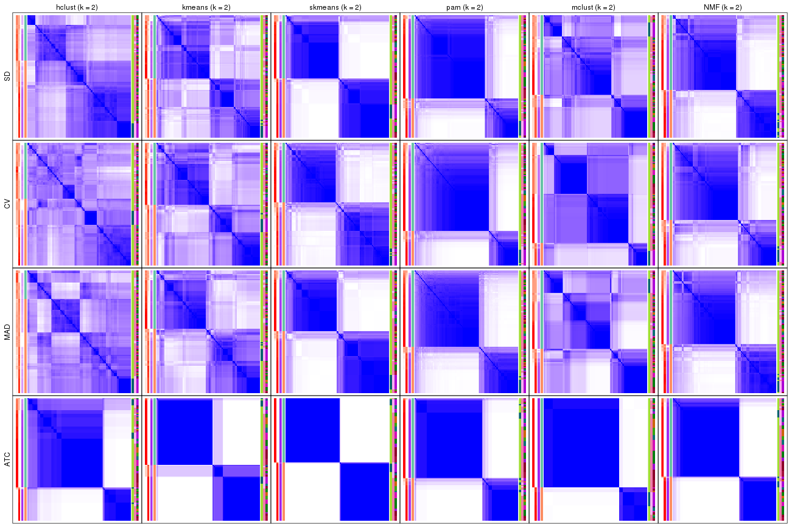</p>

</div>
<div id='tab-collect-consensus-heatmap-2'>
<pre><code class="r">collect_plots(res_list, k = 3, fun = consensus_heatmap, mc.cores = 4)
</code></pre>

<p>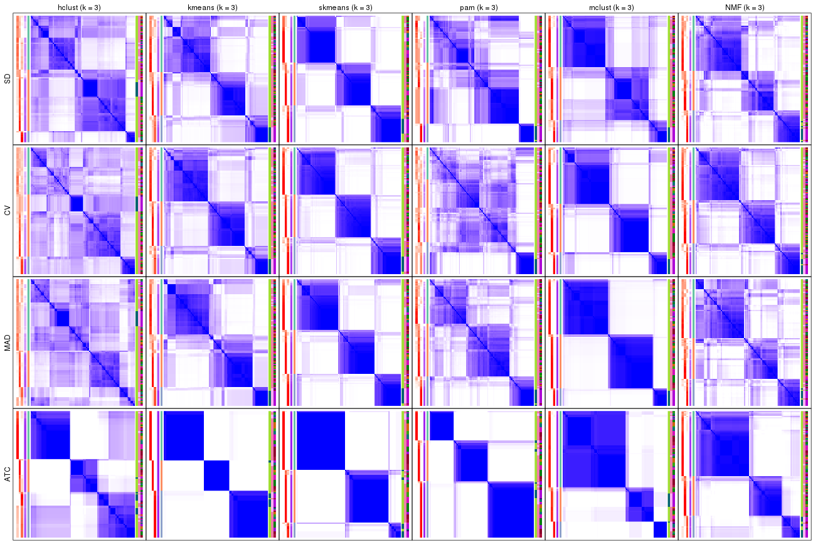</p>

</div>
<div id='tab-collect-consensus-heatmap-3'>
<pre><code class="r">collect_plots(res_list, k = 4, fun = consensus_heatmap, mc.cores = 4)
</code></pre>

<p>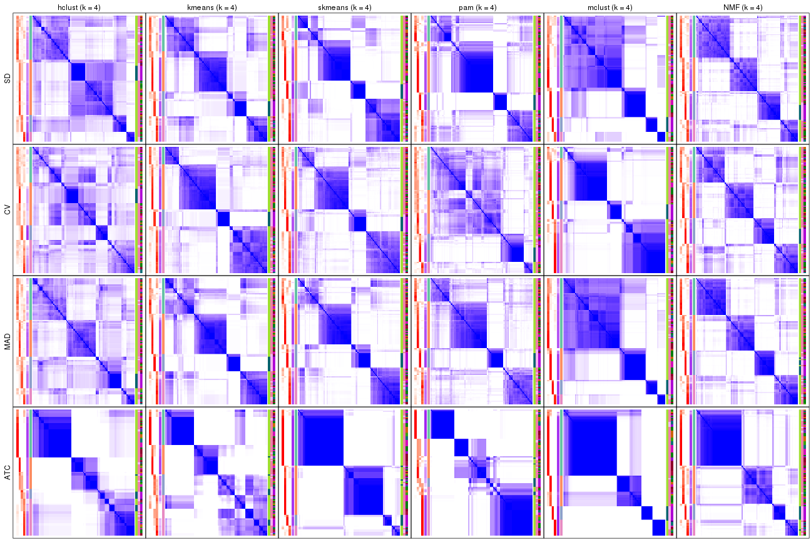</p>

</div>
<div id='tab-collect-consensus-heatmap-4'>
<pre><code class="r">collect_plots(res_list, k = 5, fun = consensus_heatmap, mc.cores = 4)
</code></pre>

<p>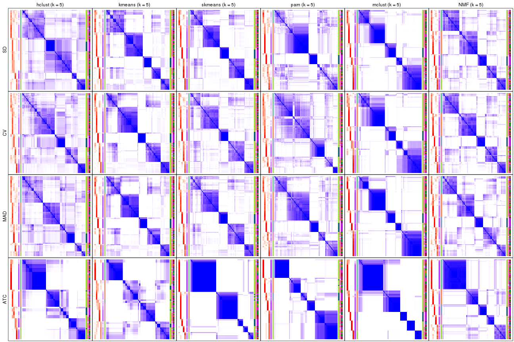</p>

</div>
<div id='tab-collect-consensus-heatmap-5'>
<pre><code class="r">collect_plots(res_list, k = 6, fun = consensus_heatmap, mc.cores = 4)
</code></pre>

<p>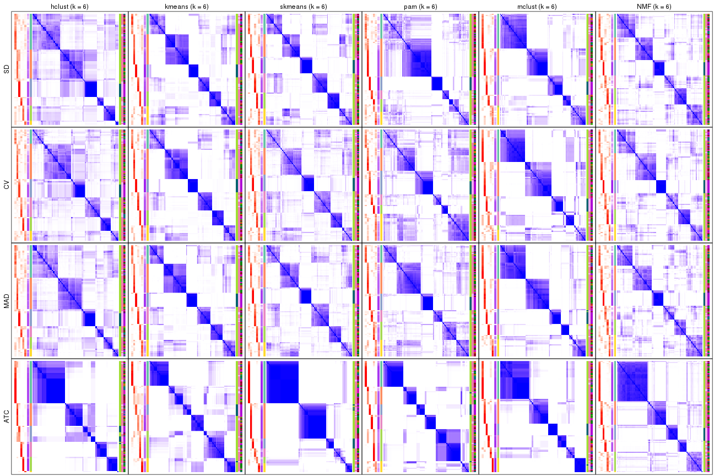</p>

</div>
</div>


### Membership heatmap

Membership heatmaps for all methods. ([What is a membership heatmap?](http://bioconductor.org/packages/devel/bioc/vignettes/cola/inst/doc/cola.html#toc_12))


<script>
$( function() {
	$( '#tabs-collect-membership-heatmap' ).tabs();
} );
</script>
<div id='tabs-collect-membership-heatmap'>
<ul>
<li><a href='#tab-collect-membership-heatmap-1'>k = 2</a></li>
<li><a href='#tab-collect-membership-heatmap-2'>k = 3</a></li>
<li><a href='#tab-collect-membership-heatmap-3'>k = 4</a></li>
<li><a href='#tab-collect-membership-heatmap-4'>k = 5</a></li>
<li><a href='#tab-collect-membership-heatmap-5'>k = 6</a></li>
</ul>
<div id='tab-collect-membership-heatmap-1'>
<pre><code class="r">collect_plots(res_list, k = 2, fun = membership_heatmap, mc.cores = 4)
</code></pre>

<p>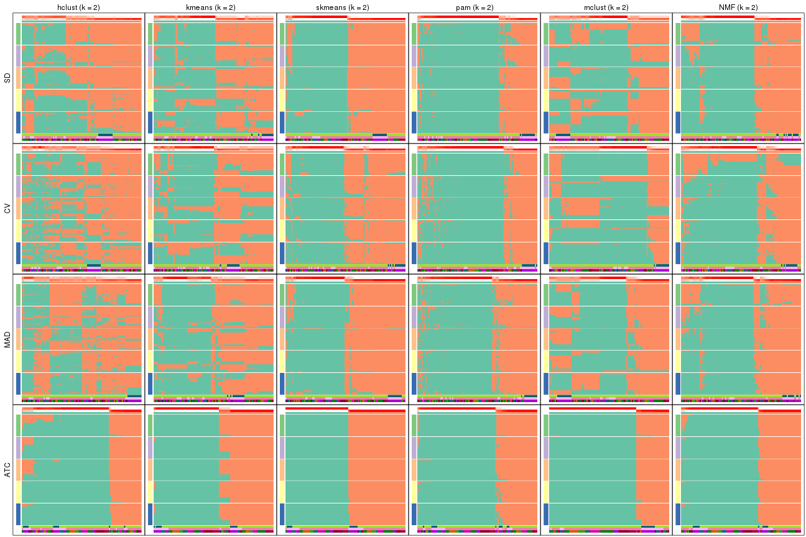</p>

</div>
<div id='tab-collect-membership-heatmap-2'>
<pre><code class="r">collect_plots(res_list, k = 3, fun = membership_heatmap, mc.cores = 4)
</code></pre>

<p>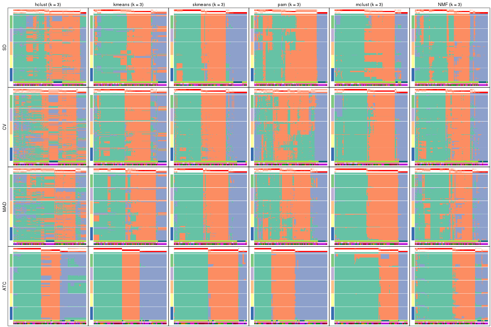</p>

</div>
<div id='tab-collect-membership-heatmap-3'>
<pre><code class="r">collect_plots(res_list, k = 4, fun = membership_heatmap, mc.cores = 4)
</code></pre>

<p>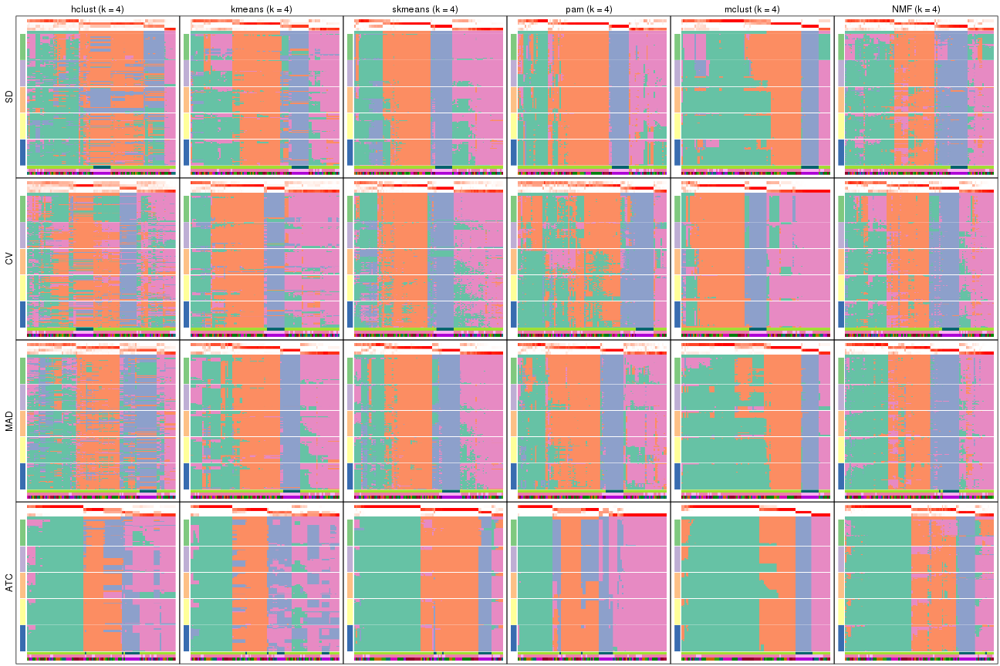</p>

</div>
<div id='tab-collect-membership-heatmap-4'>
<pre><code class="r">collect_plots(res_list, k = 5, fun = membership_heatmap, mc.cores = 4)
</code></pre>

<p>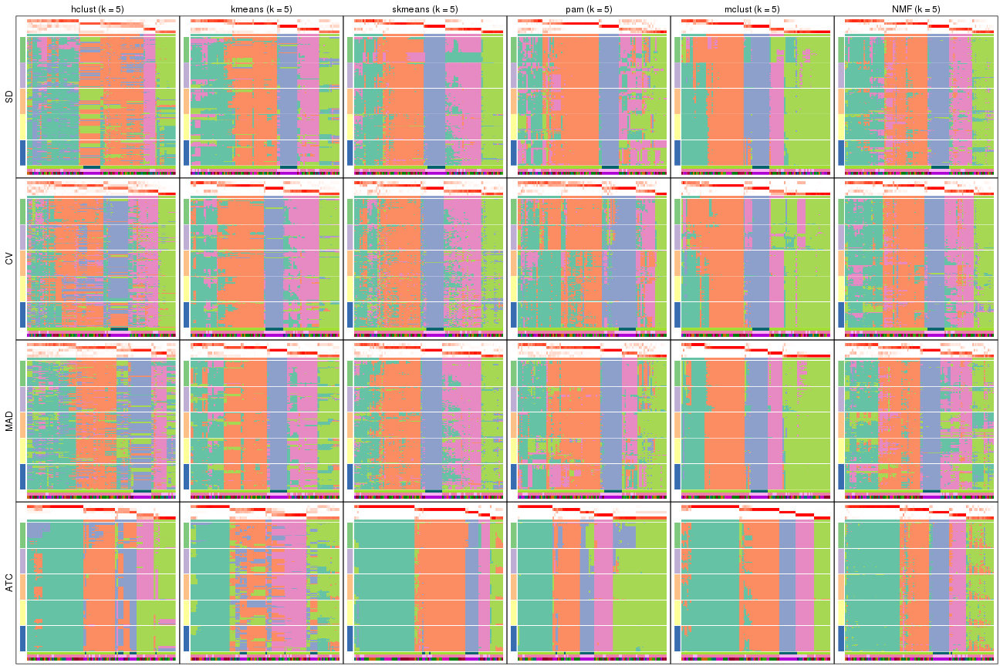</p>

</div>
<div id='tab-collect-membership-heatmap-5'>
<pre><code class="r">collect_plots(res_list, k = 6, fun = membership_heatmap, mc.cores = 4)
</code></pre>

<p>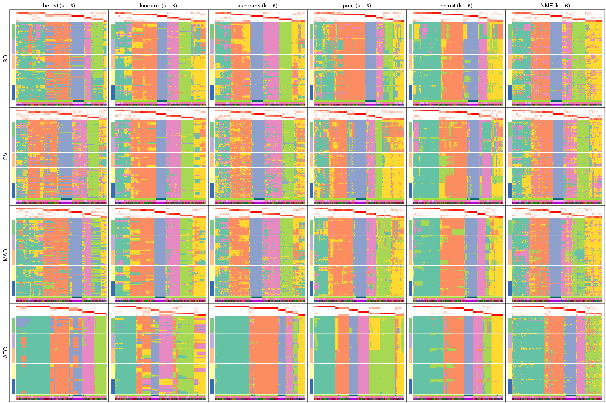</p>

</div>
</div>


### Signature heatmap

Signature heatmaps for all methods. ([What is a signature heatmap?](http://bioconductor.org/packages/devel/bioc/vignettes/cola/inst/doc/cola.html#toc_22))


Note in following heatmaps, rows are scaled.


<script>
$( function() {
	$( '#tabs-collect-get-signatures' ).tabs();
} );
</script>
<div id='tabs-collect-get-signatures'>
<ul>
<li><a href='#tab-collect-get-signatures-1'>k = 2</a></li>
<li><a href='#tab-collect-get-signatures-2'>k = 3</a></li>
<li><a href='#tab-collect-get-signatures-3'>k = 4</a></li>
<li><a href='#tab-collect-get-signatures-4'>k = 5</a></li>
<li><a href='#tab-collect-get-signatures-5'>k = 6</a></li>
</ul>
<div id='tab-collect-get-signatures-1'>
<pre><code class="r">collect_plots(res_list, k = 2, fun = get_signatures, mc.cores = 4)
</code></pre>

<p>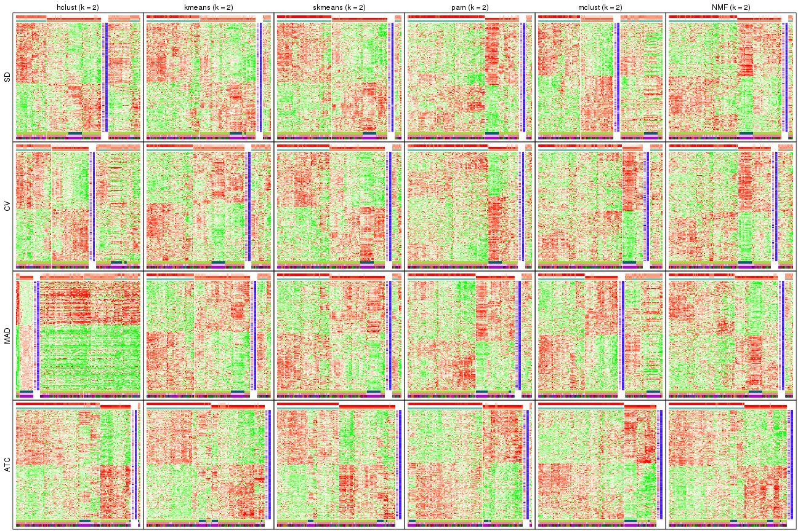</p>

</div>
<div id='tab-collect-get-signatures-2'>
<pre><code class="r">collect_plots(res_list, k = 3, fun = get_signatures, mc.cores = 4)
</code></pre>

<p>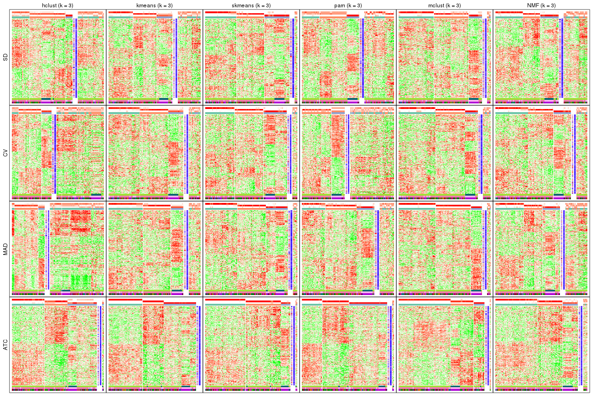</p>

</div>
<div id='tab-collect-get-signatures-3'>
<pre><code class="r">collect_plots(res_list, k = 4, fun = get_signatures, mc.cores = 4)
</code></pre>

<p>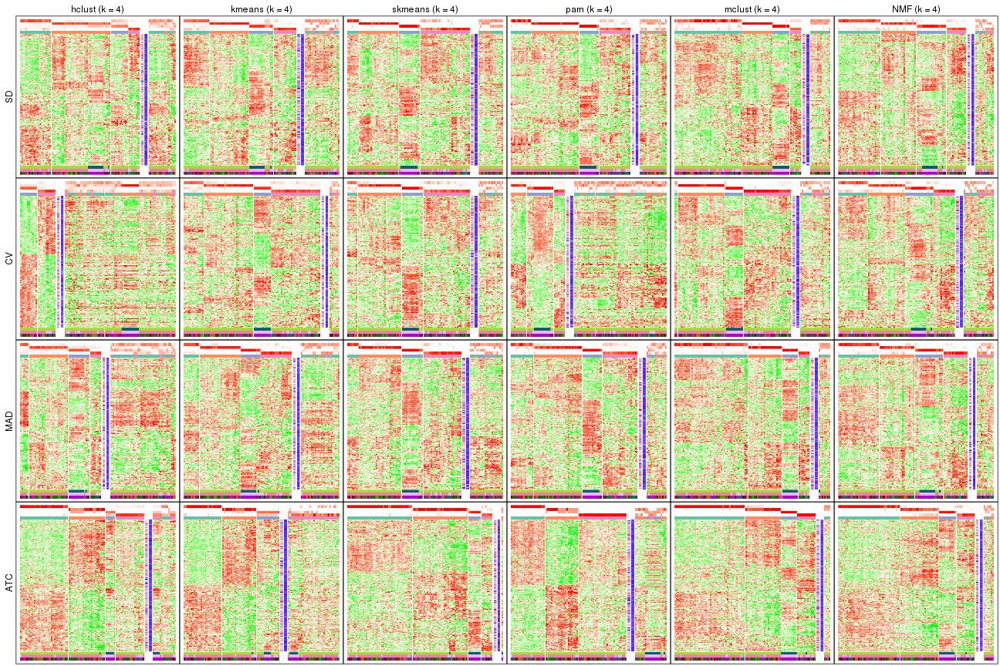</p>

</div>
<div id='tab-collect-get-signatures-4'>
<pre><code class="r">collect_plots(res_list, k = 5, fun = get_signatures, mc.cores = 4)
</code></pre>

<p>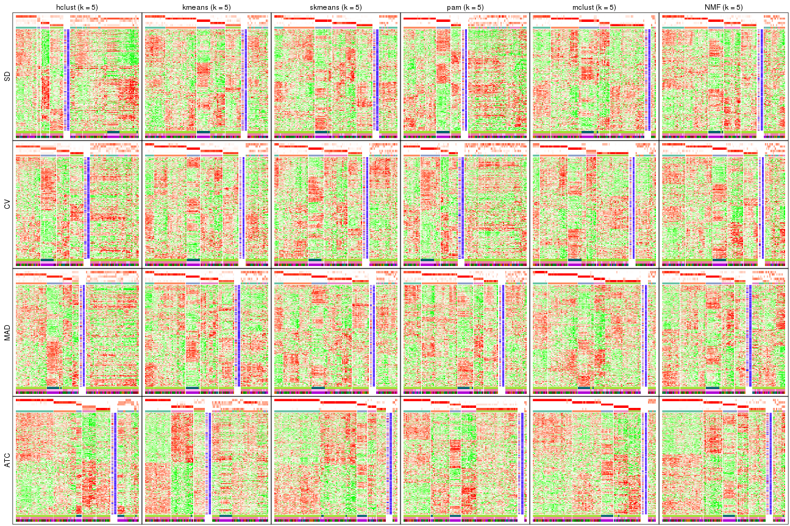</p>

</div>
<div id='tab-collect-get-signatures-5'>
<pre><code class="r">collect_plots(res_list, k = 6, fun = get_signatures, mc.cores = 4)
</code></pre>

<p></p>

</div>
</div>


### Statistics table

The statistics used for measuring the stability of consensus partitioning.
([How are they
defined?](http://bioconductor.org/packages/devel/bioc/vignettes/cola/inst/doc/cola.html#toc_13))


<script>
$( function() {
	$( '#tabs-get-stats-from-consensus-partition-list' ).tabs();
} );
</script>
<div id='tabs-get-stats-from-consensus-partition-list'>
<ul>
<li><a href='#tab-get-stats-from-consensus-partition-list-1'>k = 2</a></li>
<li><a href='#tab-get-stats-from-consensus-partition-list-2'>k = 3</a></li>
<li><a href='#tab-get-stats-from-consensus-partition-list-3'>k = 4</a></li>
<li><a href='#tab-get-stats-from-consensus-partition-list-4'>k = 5</a></li>
<li><a href='#tab-get-stats-from-consensus-partition-list-5'>k = 6</a></li>
</ul>
<div id='tab-get-stats-from-consensus-partition-list-1'>
<pre><code class="r">get_stats(res_list, k = 2)
</code></pre>

<pre><code>#&gt;             k  1-PAC mean_silhouette concordance area_increased  Rand Jaccard
#&gt; SD:NMF      2 0.5301           0.842       0.921          0.488 0.520   0.520
#&gt; CV:NMF      2 0.4955           0.782       0.841          0.461 0.530   0.530
#&gt; MAD:NMF     2 0.5638           0.805       0.906          0.487 0.516   0.516
#&gt; ATC:NMF     2 0.9994           0.970       0.986          0.467 0.535   0.535
#&gt; SD:skmeans  2 0.9147           0.900       0.956          0.504 0.496   0.496
#&gt; CV:skmeans  2 0.6244           0.831       0.914          0.504 0.496   0.496
#&gt; MAD:skmeans 2 0.8000           0.868       0.940          0.504 0.495   0.495
#&gt; ATC:skmeans 2 1.0000           0.997       0.998          0.504 0.496   0.496
#&gt; SD:mclust   2 0.2032           0.595       0.778          0.444 0.541   0.541
#&gt; CV:mclust   2 0.2929           0.673       0.823          0.386 0.696   0.696
#&gt; MAD:mclust  2 0.2891           0.580       0.810          0.478 0.535   0.535
#&gt; ATC:mclust  2 1.0000           0.991       0.995          0.397 0.600   0.600
#&gt; SD:kmeans   2 0.2268           0.678       0.811          0.483 0.496   0.496
#&gt; CV:kmeans   2 0.2004           0.630       0.767          0.462 0.495   0.495
#&gt; MAD:kmeans  2 0.2554           0.687       0.825          0.487 0.496   0.496
#&gt; ATC:kmeans  2 0.8358           0.949       0.974          0.494 0.499   0.499
#&gt; SD:pam      2 0.7309           0.878       0.938          0.427 0.560   0.560
#&gt; CV:pam      2 0.6190           0.838       0.926          0.421 0.591   0.591
#&gt; MAD:pam     2 0.7043           0.848       0.928          0.474 0.525   0.525
#&gt; ATC:pam     2 0.9601           0.949       0.977          0.452 0.541   0.541
#&gt; SD:hclust   2 0.1637           0.629       0.789          0.426 0.530   0.530
#&gt; CV:hclust   2 0.0934           0.458       0.723          0.443 0.499   0.499
#&gt; MAD:hclust  2 0.0848           0.342       0.664          0.446 0.639   0.639
#&gt; ATC:hclust  2 0.8353           0.890       0.947          0.419 0.600   0.600
</code></pre>

</div>
<div id='tab-get-stats-from-consensus-partition-list-2'>
<pre><code class="r">get_stats(res_list, k = 3)
</code></pre>

<pre><code>#&gt;             k  1-PAC mean_silhouette concordance area_increased  Rand Jaccard
#&gt; SD:NMF      3 0.5569           0.640       0.843          0.356 0.689   0.471
#&gt; CV:NMF      3 0.5919           0.723       0.870          0.421 0.678   0.461
#&gt; MAD:NMF     3 0.4686           0.606       0.816          0.354 0.688   0.475
#&gt; ATC:NMF     3 0.7008           0.852       0.916          0.314 0.777   0.611
#&gt; SD:skmeans  3 0.7691           0.841       0.926          0.325 0.693   0.457
#&gt; CV:skmeans  3 0.7934           0.846       0.925          0.326 0.716   0.488
#&gt; MAD:skmeans 3 0.7421           0.860       0.934          0.318 0.741   0.525
#&gt; ATC:skmeans 3 0.9712           0.945       0.975          0.195 0.889   0.780
#&gt; SD:mclust   3 0.4740           0.802       0.885          0.348 0.711   0.516
#&gt; CV:mclust   3 0.7240           0.787       0.909          0.639 0.657   0.512
#&gt; MAD:mclust  3 0.9912           0.932       0.966          0.277 0.736   0.555
#&gt; ATC:mclust  3 0.9792           0.933       0.956          0.387 0.772   0.643
#&gt; SD:kmeans   3 0.4774           0.652       0.800          0.328 0.785   0.595
#&gt; CV:kmeans   3 0.4777           0.714       0.833          0.364 0.771   0.573
#&gt; MAD:kmeans  3 0.5445           0.708       0.842          0.297 0.833   0.680
#&gt; ATC:kmeans  3 1.0000           0.994       0.997          0.338 0.706   0.481
#&gt; SD:pam      3 0.4659           0.509       0.769          0.454 0.642   0.451
#&gt; CV:pam      3 0.3348           0.368       0.681          0.495 0.640   0.454
#&gt; MAD:pam     3 0.4313           0.656       0.827          0.374 0.700   0.486
#&gt; ATC:pam     3 0.9856           0.955       0.982          0.434 0.760   0.576
#&gt; SD:hclust   3 0.3079           0.581       0.766          0.373 0.725   0.551
#&gt; CV:hclust   3 0.0979           0.467       0.632          0.380 0.803   0.638
#&gt; MAD:hclust  3 0.1503           0.454       0.619          0.369 0.621   0.472
#&gt; ATC:hclust  3 0.6104           0.839       0.873          0.488 0.721   0.540
</code></pre>

</div>
<div id='tab-get-stats-from-consensus-partition-list-3'>
<pre><code class="r">get_stats(res_list, k = 4)
</code></pre>

<pre><code>#&gt;             k 1-PAC mean_silhouette concordance area_increased  Rand Jaccard
#&gt; SD:NMF      4 0.601           0.700       0.812         0.1277 0.811   0.521
#&gt; CV:NMF      4 0.593           0.633       0.812         0.1342 0.808   0.510
#&gt; MAD:NMF     4 0.691           0.762       0.877         0.1362 0.803   0.510
#&gt; ATC:NMF     4 0.784           0.803       0.886         0.1114 0.870   0.687
#&gt; SD:skmeans  4 0.740           0.701       0.842         0.1068 0.897   0.707
#&gt; CV:skmeans  4 0.612           0.681       0.790         0.1080 0.924   0.775
#&gt; MAD:skmeans 4 0.698           0.652       0.845         0.1152 0.860   0.619
#&gt; ATC:skmeans 4 0.878           0.902       0.951         0.0747 0.951   0.877
#&gt; SD:mclust   4 0.582           0.718       0.842         0.0771 0.664   0.388
#&gt; CV:mclust   4 0.770           0.744       0.880         0.0918 0.943   0.847
#&gt; MAD:mclust  4 0.585           0.787       0.886         0.0298 0.702   0.442
#&gt; ATC:mclust  4 0.839           0.897       0.956         0.1579 0.856   0.696
#&gt; SD:kmeans   4 0.652           0.619       0.784         0.1303 0.862   0.629
#&gt; CV:kmeans   4 0.666           0.765       0.833         0.1372 0.913   0.762
#&gt; MAD:kmeans  4 0.657           0.640       0.826         0.1527 0.796   0.518
#&gt; ATC:kmeans  4 0.661           0.564       0.778         0.1165 0.819   0.533
#&gt; SD:pam      4 0.603           0.661       0.845         0.1324 0.707   0.392
#&gt; CV:pam      4 0.418           0.409       0.716         0.1134 0.713   0.391
#&gt; MAD:pam     4 0.575           0.690       0.829         0.1124 0.857   0.624
#&gt; ATC:pam     4 0.830           0.686       0.848         0.1156 0.934   0.815
#&gt; SD:hclust   4 0.365           0.591       0.694         0.1506 0.869   0.704
#&gt; CV:hclust   4 0.276           0.312       0.564         0.1386 0.695   0.370
#&gt; MAD:hclust  4 0.334           0.507       0.684         0.1677 0.824   0.591
#&gt; ATC:hclust  4 0.718           0.719       0.834         0.1378 0.954   0.862
</code></pre>

</div>
<div id='tab-get-stats-from-consensus-partition-list-4'>
<pre><code class="r">get_stats(res_list, k = 5)
</code></pre>

<pre><code>#&gt;             k 1-PAC mean_silhouette concordance area_increased  Rand Jaccard
#&gt; SD:NMF      5 0.684           0.684       0.828         0.0669 0.904   0.661
#&gt; CV:NMF      5 0.678           0.673       0.823         0.0687 0.891   0.614
#&gt; MAD:NMF     5 0.627           0.601       0.727         0.0640 0.911   0.673
#&gt; ATC:NMF     5 0.789           0.785       0.892         0.1031 0.868   0.613
#&gt; SD:skmeans  5 0.761           0.750       0.853         0.0703 0.888   0.618
#&gt; CV:skmeans  5 0.645           0.607       0.781         0.0740 0.898   0.652
#&gt; MAD:skmeans 5 0.686           0.697       0.824         0.0714 0.906   0.665
#&gt; ATC:skmeans 5 0.900           0.883       0.953         0.0869 0.931   0.809
#&gt; SD:mclust   5 0.752           0.809       0.885         0.2032 0.758   0.436
#&gt; CV:mclust   5 0.752           0.664       0.817         0.1008 0.874   0.627
#&gt; MAD:mclust  5 0.868           0.840       0.931         0.2295 0.799   0.504
#&gt; ATC:mclust  5 0.889           0.876       0.950         0.1664 0.827   0.558
#&gt; SD:kmeans   5 0.677           0.699       0.806         0.0778 0.863   0.551
#&gt; CV:kmeans   5 0.745           0.670       0.828         0.0892 0.893   0.656
#&gt; MAD:kmeans  5 0.700           0.674       0.820         0.0768 0.891   0.625
#&gt; ATC:kmeans  5 0.693           0.509       0.732         0.0590 0.894   0.640
#&gt; SD:pam      5 0.597           0.499       0.752         0.0836 0.907   0.694
#&gt; CV:pam      5 0.519           0.454       0.731         0.0775 0.873   0.606
#&gt; MAD:pam     5 0.610           0.666       0.794         0.0679 0.943   0.796
#&gt; ATC:pam     5 0.838           0.858       0.922         0.0638 0.928   0.762
#&gt; SD:hclust   5 0.449           0.340       0.665         0.0905 0.976   0.928
#&gt; CV:hclust   5 0.461           0.528       0.671         0.0971 0.784   0.386
#&gt; MAD:hclust  5 0.517           0.511       0.675         0.0759 0.962   0.863
#&gt; ATC:hclust  5 0.756           0.726       0.812         0.0557 0.920   0.737
</code></pre>

</div>
<div id='tab-get-stats-from-consensus-partition-list-5'>
<pre><code class="r">get_stats(res_list, k = 6)
</code></pre>

<pre><code>#&gt;             k 1-PAC mean_silhouette concordance area_increased  Rand Jaccard
#&gt; SD:NMF      6 0.694           0.592       0.773         0.0489 0.890   0.550
#&gt; CV:NMF      6 0.679           0.547       0.741         0.0505 0.913   0.628
#&gt; MAD:NMF     6 0.659           0.555       0.735         0.0469 0.899   0.576
#&gt; ATC:NMF     6 0.768           0.671       0.850         0.0355 0.973   0.890
#&gt; SD:skmeans  6 0.765           0.590       0.787         0.0527 0.903   0.582
#&gt; CV:skmeans  6 0.668           0.521       0.705         0.0466 0.914   0.631
#&gt; MAD:skmeans 6 0.700           0.542       0.737         0.0473 0.917   0.638
#&gt; ATC:skmeans 6 0.875           0.861       0.932         0.0442 0.958   0.859
#&gt; SD:mclust   6 0.721           0.626       0.804         0.0402 0.992   0.964
#&gt; CV:mclust   6 0.707           0.567       0.755         0.0413 0.939   0.760
#&gt; MAD:mclust  6 0.776           0.741       0.850         0.0389 0.982   0.921
#&gt; ATC:mclust  6 0.850           0.849       0.924         0.0576 0.932   0.744
#&gt; SD:kmeans   6 0.750           0.693       0.784         0.0499 0.914   0.644
#&gt; CV:kmeans   6 0.770           0.698       0.822         0.0537 0.904   0.608
#&gt; MAD:kmeans  6 0.754           0.681       0.802         0.0527 0.921   0.656
#&gt; ATC:kmeans  6 0.755           0.686       0.772         0.0465 0.846   0.443
#&gt; SD:pam      6 0.677           0.575       0.781         0.0422 0.891   0.602
#&gt; CV:pam      6 0.593           0.541       0.747         0.0570 0.886   0.563
#&gt; MAD:pam     6 0.655           0.650       0.785         0.0530 0.921   0.674
#&gt; ATC:pam     6 0.838           0.739       0.871         0.0592 0.947   0.778
#&gt; SD:hclust   6 0.540           0.567       0.697         0.0557 0.870   0.603
#&gt; CV:hclust   6 0.585           0.507       0.680         0.0457 0.940   0.746
#&gt; MAD:hclust  6 0.585           0.551       0.704         0.0389 0.939   0.762
#&gt; ATC:hclust  6 0.789           0.743       0.876         0.0232 0.981   0.923
</code></pre>

</div>
</div>

Following heatmap plots the partition for each combination of methods and the
lightness correspond to the silhouette scores for samples in each method. On
top the consensus subgroup is inferred from all methods by taking the mean
silhouette scores as weight.


<script>
$( function() {
	$( '#tabs-collect-stats-from-consensus-partition-list' ).tabs();
} );
</script>
<div id='tabs-collect-stats-from-consensus-partition-list'>
<ul>
<li><a href='#tab-collect-stats-from-consensus-partition-list-1'>k = 2</a></li>
<li><a href='#tab-collect-stats-from-consensus-partition-list-2'>k = 3</a></li>
<li><a href='#tab-collect-stats-from-consensus-partition-list-3'>k = 4</a></li>
<li><a href='#tab-collect-stats-from-consensus-partition-list-4'>k = 5</a></li>
<li><a href='#tab-collect-stats-from-consensus-partition-list-5'>k = 6</a></li>
</ul>
<div id='tab-collect-stats-from-consensus-partition-list-1'>
<pre><code class="r">collect_stats(res_list, k = 2)
</code></pre>

<p>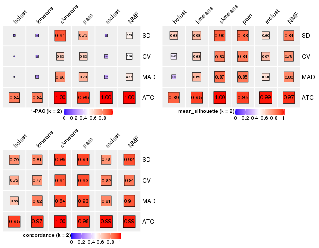</p>

</div>
<div id='tab-collect-stats-from-consensus-partition-list-2'>
<pre><code class="r">collect_stats(res_list, k = 3)
</code></pre>

<p>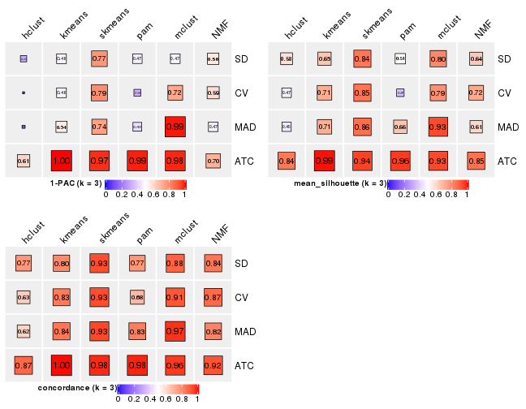</p>

</div>
<div id='tab-collect-stats-from-consensus-partition-list-3'>
<pre><code class="r">collect_stats(res_list, k = 4)
</code></pre>

<p>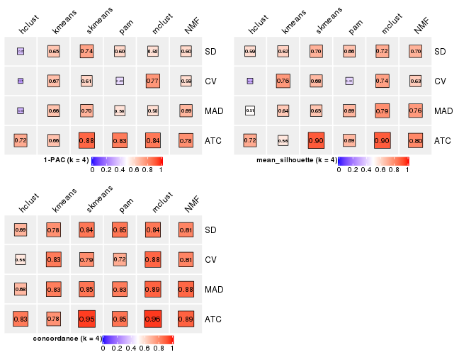</p>

</div>
<div id='tab-collect-stats-from-consensus-partition-list-4'>
<pre><code class="r">collect_stats(res_list, k = 5)
</code></pre>

<p>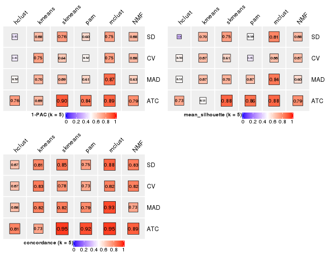</p>

</div>
<div id='tab-collect-stats-from-consensus-partition-list-5'>
<pre><code class="r">collect_stats(res_list, k = 6)
</code></pre>

<p>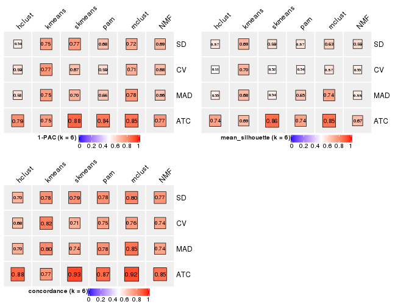</p>

</div>
</div>

### Partition from all methods


Collect partitions from all methods:


<script>
$( function() {
	$( '#tabs-collect-classes-from-consensus-partition-list' ).tabs();
} );
</script>
<div id='tabs-collect-classes-from-consensus-partition-list'>
<ul>
<li><a href='#tab-collect-classes-from-consensus-partition-list-1'>k = 2</a></li>
<li><a href='#tab-collect-classes-from-consensus-partition-list-2'>k = 3</a></li>
<li><a href='#tab-collect-classes-from-consensus-partition-list-3'>k = 4</a></li>
<li><a href='#tab-collect-classes-from-consensus-partition-list-4'>k = 5</a></li>
<li><a href='#tab-collect-classes-from-consensus-partition-list-5'>k = 6</a></li>
</ul>
<div id='tab-collect-classes-from-consensus-partition-list-1'>
<pre><code class="r">collect_classes(res_list, k = 2)
</code></pre>

<p>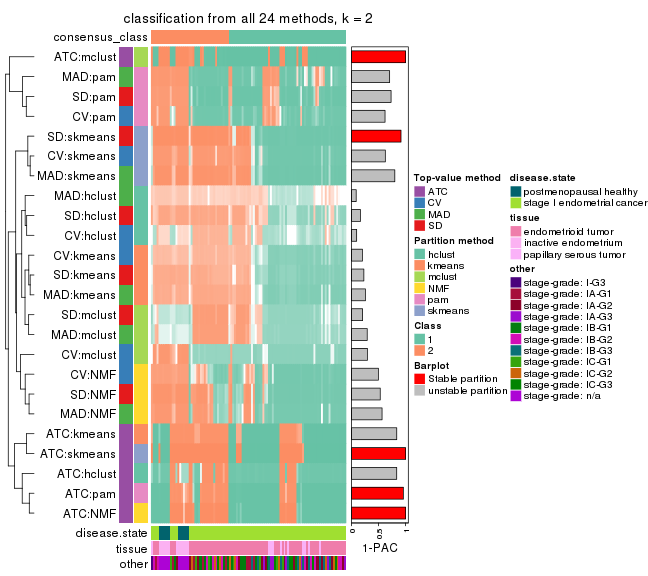</p>

</div>
<div id='tab-collect-classes-from-consensus-partition-list-2'>
<pre><code class="r">collect_classes(res_list, k = 3)
</code></pre>

<p>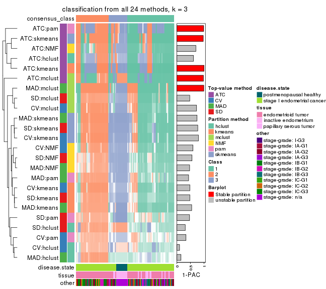</p>

</div>
<div id='tab-collect-classes-from-consensus-partition-list-3'>
<pre><code class="r">collect_classes(res_list, k = 4)
</code></pre>

<p>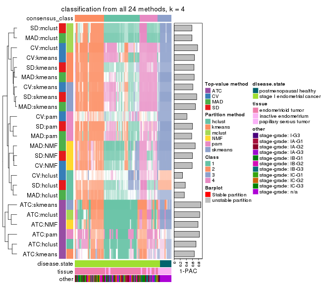</p>

</div>
<div id='tab-collect-classes-from-consensus-partition-list-4'>
<pre><code class="r">collect_classes(res_list, k = 5)
</code></pre>

<p>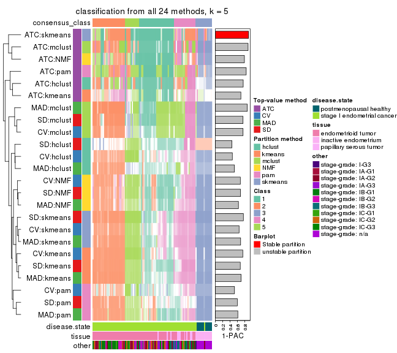</p>

</div>
<div id='tab-collect-classes-from-consensus-partition-list-5'>
<pre><code class="r">collect_classes(res_list, k = 6)
</code></pre>

<p>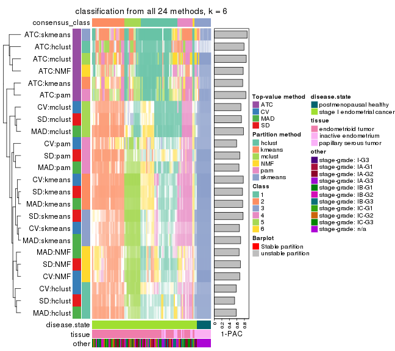</p>

</div>
</div>


### Top rows overlap


Overlap of top rows from different top-row methods:


<script>
$( function() {
	$( '#tabs-top-rows-overlap-by-euler' ).tabs();
} );
</script>
<div id='tabs-top-rows-overlap-by-euler'>
<ul>
<li><a href='#tab-top-rows-overlap-by-euler-1'>top_n = 1000</a></li>
<li><a href='#tab-top-rows-overlap-by-euler-2'>top_n = 2000</a></li>
<li><a href='#tab-top-rows-overlap-by-euler-3'>top_n = 3000</a></li>
<li><a href='#tab-top-rows-overlap-by-euler-4'>top_n = 4000</a></li>
<li><a href='#tab-top-rows-overlap-by-euler-5'>top_n = 5000</a></li>
</ul>
<div id='tab-top-rows-overlap-by-euler-1'>
<pre><code class="r">top_rows_overlap(res_list, top_n = 1000, method = &quot;euler&quot;)
</code></pre>

<p>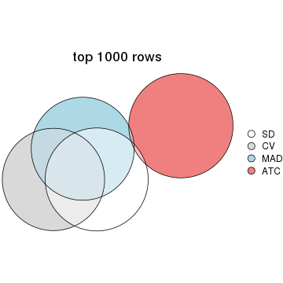</p>

</div>
<div id='tab-top-rows-overlap-by-euler-2'>
<pre><code class="r">top_rows_overlap(res_list, top_n = 2000, method = &quot;euler&quot;)
</code></pre>

<p>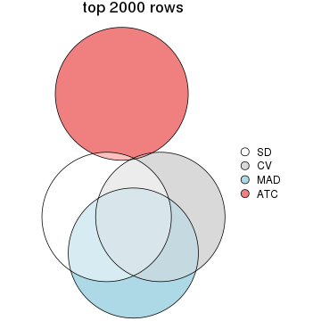</p>

</div>
<div id='tab-top-rows-overlap-by-euler-3'>
<pre><code class="r">top_rows_overlap(res_list, top_n = 3000, method = &quot;euler&quot;)
</code></pre>

<p>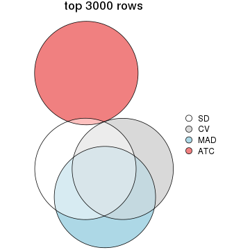</p>

</div>
<div id='tab-top-rows-overlap-by-euler-4'>
<pre><code class="r">top_rows_overlap(res_list, top_n = 4000, method = &quot;euler&quot;)
</code></pre>

<p>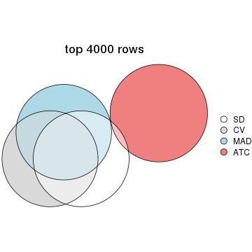</p>

</div>
<div id='tab-top-rows-overlap-by-euler-5'>
<pre><code class="r">top_rows_overlap(res_list, top_n = 5000, method = &quot;euler&quot;)
</code></pre>

<p>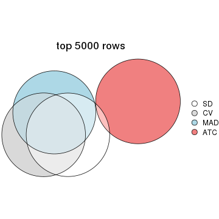</p>

</div>
</div>

Also visualize the correspondance of rankings between different top-row methods:


<script>
$( function() {
	$( '#tabs-top-rows-overlap-by-correspondance' ).tabs();
} );
</script>
<div id='tabs-top-rows-overlap-by-correspondance'>
<ul>
<li><a href='#tab-top-rows-overlap-by-correspondance-1'>top_n = 1000</a></li>
<li><a href='#tab-top-rows-overlap-by-correspondance-2'>top_n = 2000</a></li>
<li><a href='#tab-top-rows-overlap-by-correspondance-3'>top_n = 3000</a></li>
<li><a href='#tab-top-rows-overlap-by-correspondance-4'>top_n = 4000</a></li>
<li><a href='#tab-top-rows-overlap-by-correspondance-5'>top_n = 5000</a></li>
</ul>
<div id='tab-top-rows-overlap-by-correspondance-1'>
<pre><code class="r">top_rows_overlap(res_list, top_n = 1000, method = &quot;correspondance&quot;)
</code></pre>

<p>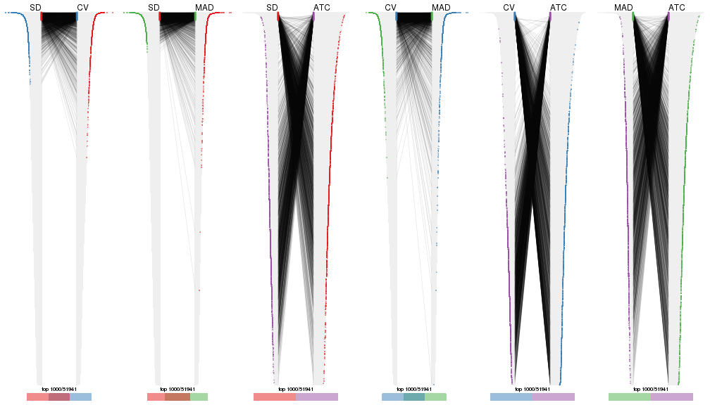</p>

</div>
<div id='tab-top-rows-overlap-by-correspondance-2'>
<pre><code class="r">top_rows_overlap(res_list, top_n = 2000, method = &quot;correspondance&quot;)
</code></pre>

<p>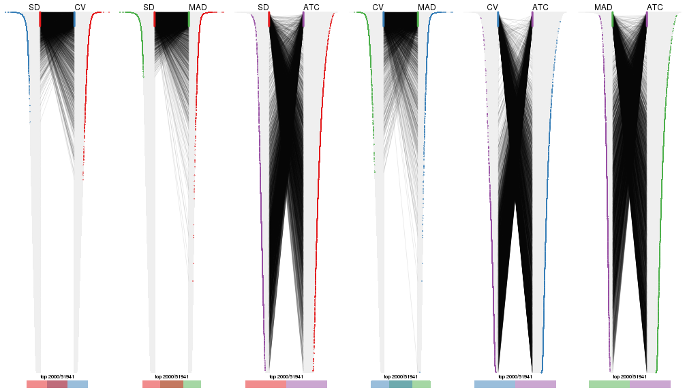</p>

</div>
<div id='tab-top-rows-overlap-by-correspondance-3'>
<pre><code class="r">top_rows_overlap(res_list, top_n = 3000, method = &quot;correspondance&quot;)
</code></pre>

<p>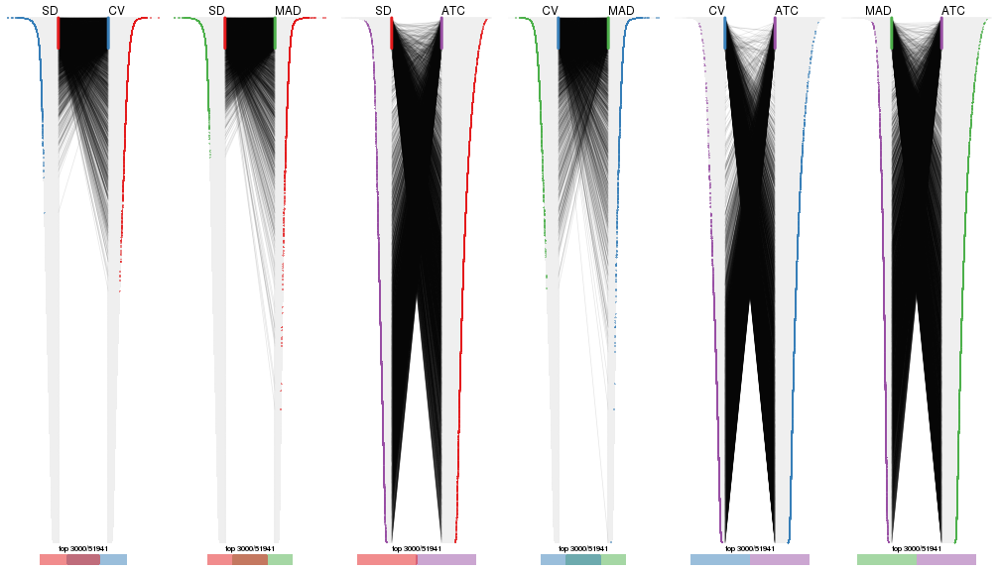</p>

</div>
<div id='tab-top-rows-overlap-by-correspondance-4'>
<pre><code class="r">top_rows_overlap(res_list, top_n = 4000, method = &quot;correspondance&quot;)
</code></pre>

<p>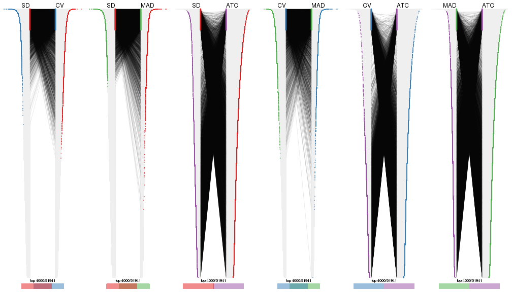</p>

</div>
<div id='tab-top-rows-overlap-by-correspondance-5'>
<pre><code class="r">top_rows_overlap(res_list, top_n = 5000, method = &quot;correspondance&quot;)
</code></pre>

<p>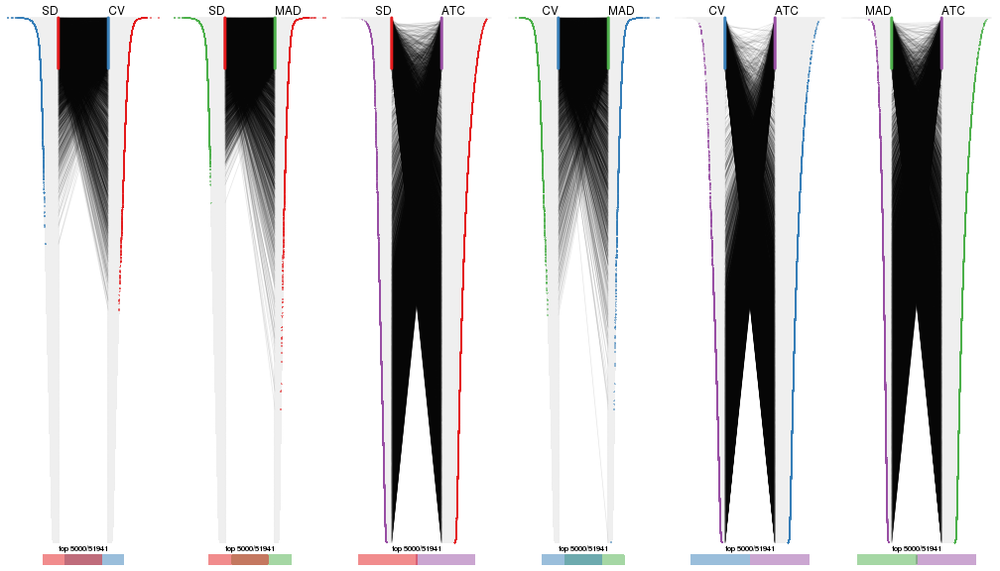</p>

</div>
</div>


Heatmaps of the top rows:


<script>
$( function() {
	$( '#tabs-top-rows-heatmap' ).tabs();
} );
</script>
<div id='tabs-top-rows-heatmap'>
<ul>
<li><a href='#tab-top-rows-heatmap-1'>top_n = 1000</a></li>
<li><a href='#tab-top-rows-heatmap-2'>top_n = 2000</a></li>
<li><a href='#tab-top-rows-heatmap-3'>top_n = 3000</a></li>
<li><a href='#tab-top-rows-heatmap-4'>top_n = 4000</a></li>
<li><a href='#tab-top-rows-heatmap-5'>top_n = 5000</a></li>
</ul>
<div id='tab-top-rows-heatmap-1'>
<pre><code class="r">top_rows_heatmap(res_list, top_n = 1000)
</code></pre>

<p>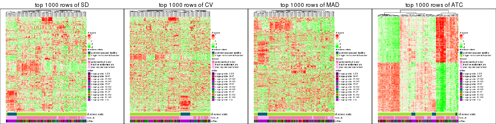</p>

</div>
<div id='tab-top-rows-heatmap-2'>
<pre><code class="r">top_rows_heatmap(res_list, top_n = 2000)
</code></pre>

<p>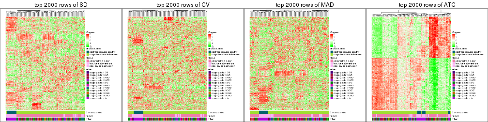</p>

</div>
<div id='tab-top-rows-heatmap-3'>
<pre><code class="r">top_rows_heatmap(res_list, top_n = 3000)
</code></pre>

<p>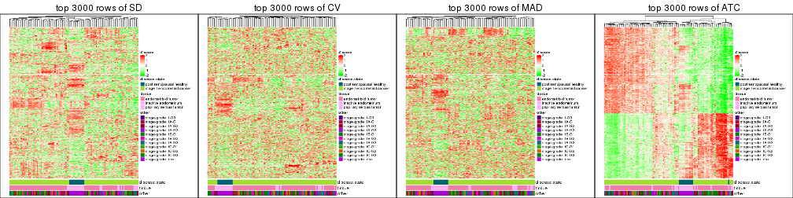</p>

</div>
<div id='tab-top-rows-heatmap-4'>
<pre><code class="r">top_rows_heatmap(res_list, top_n = 4000)
</code></pre>

<p>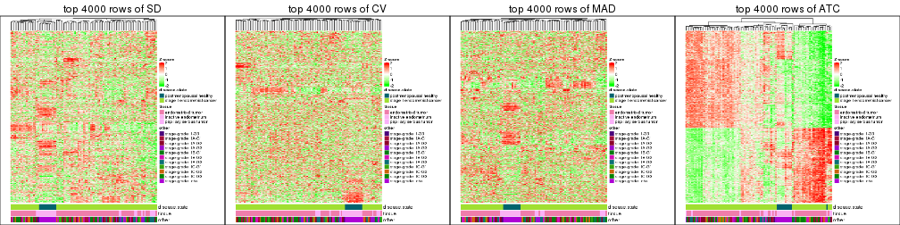</p>

</div>
<div id='tab-top-rows-heatmap-5'>
<pre><code class="r">top_rows_heatmap(res_list, top_n = 5000)
</code></pre>

<p>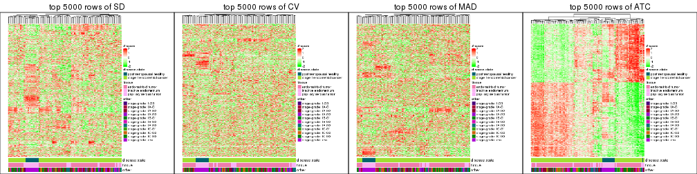</p>

</div>
</div>


### Test to known annotations


Test correlation between subgroups and known annotations. If the known
annotation is numeric, one-way ANOVA test is applied, and if the known
annotation is discrete, chi-squared contingency table test is applied.


<script>
$( function() {
	$( '#tabs-test-to-known-factors-from-consensus-partition-list' ).tabs();
} );
</script>
<div id='tabs-test-to-known-factors-from-consensus-partition-list'>
<ul>
<li><a href='#tab-test-to-known-factors-from-consensus-partition-list-1'>k = 2</a></li>
<li><a href='#tab-test-to-known-factors-from-consensus-partition-list-2'>k = 3</a></li>
<li><a href='#tab-test-to-known-factors-from-consensus-partition-list-3'>k = 4</a></li>
<li><a href='#tab-test-to-known-factors-from-consensus-partition-list-4'>k = 5</a></li>
<li><a href='#tab-test-to-known-factors-from-consensus-partition-list-5'>k = 6</a></li>
</ul>
<div id='tab-test-to-known-factors-from-consensus-partition-list-1'>
<pre><code class="r">test_to_known_factors(res_list, k = 2)
</code></pre>

<pre><code>#&gt;               n disease.state(p) tissue(p) other(p) k
#&gt; SD:NMF       99         1.97e-05  1.50e-05 7.31e-07 2
#&gt; CV:NMF       90         4.08e-07  4.56e-07 2.98e-06 2
#&gt; MAD:NMF      96         2.05e-05  1.57e-05 3.00e-07 2
#&gt; ATC:NMF     103         4.46e-01  5.56e-01 7.07e-01 2
#&gt; SD:skmeans   97         7.96e-04  6.10e-05 2.11e-07 2
#&gt; CV:skmeans   95         1.03e-03  6.48e-05 2.49e-07 2
#&gt; MAD:skmeans  95         1.03e-03  3.96e-05 7.66e-07 2
#&gt; ATC:skmeans 103         6.27e-01  7.00e-01 8.46e-01 2
#&gt; SD:mclust    66               NA  3.93e-03 5.09e-04 2
#&gt; CV:mclust    92         9.20e-13  3.91e-13 1.23e-09 2
#&gt; MAD:mclust   70               NA  6.83e-03 1.87e-04 2
#&gt; ATC:mclust  103         1.30e-08  3.82e-11 1.52e-06 2
#&gt; SD:kmeans    96         9.06e-04  6.30e-05 2.95e-07 2
#&gt; CV:kmeans    86         1.14e-03  1.73e-05 9.57e-07 2
#&gt; MAD:kmeans   91         1.74e-03  6.86e-05 5.73e-07 2
#&gt; ATC:kmeans  103         9.88e-01  9.19e-01 7.95e-01 2
#&gt; SD:pam       98         1.67e-07  9.17e-08 5.91e-05 2
#&gt; CV:pam       97         8.07e-09  5.07e-10 4.14e-07 2
#&gt; MAD:pam      94         4.12e-06  1.42e-06 1.45e-03 2
#&gt; ATC:pam     101         6.44e-01  7.28e-01 7.85e-01 2
#&gt; SD:hclust    75         1.22e-02  2.31e-03 3.80e-05 2
#&gt; CV:hclust    64               NA  2.60e-02 7.18e-02 2
#&gt; MAD:hclust   15         2.17e-03  2.17e-03 5.53e-04 2
#&gt; ATC:hclust  101         2.98e-01  3.55e-01 3.52e-01 2
</code></pre>

</div>
<div id='tab-test-to-known-factors-from-consensus-partition-list-2'>
<pre><code class="r">test_to_known_factors(res_list, k = 3)
</code></pre>

<pre><code>#&gt;               n disease.state(p) tissue(p) other(p) k
#&gt; SD:NMF       75         3.36e-08  4.19e-08 3.01e-07 3
#&gt; CV:NMF       90         1.32e-10  2.45e-11 5.10e-10 3
#&gt; MAD:NMF      77         5.87e-09  1.01e-08 5.73e-08 3
#&gt; ATC:NMF      98         6.35e-14  8.69e-14 8.14e-08 3
#&gt; SD:skmeans  100         1.23e-07  5.81e-09 4.48e-08 3
#&gt; CV:skmeans   97         4.70e-08  1.50e-09 1.74e-07 3
#&gt; MAD:skmeans  98         5.99e-09  4.25e-10 1.99e-08 3
#&gt; ATC:skmeans 101         9.80e-15  6.60e-14 3.83e-09 3
#&gt; SD:mclust    99         4.15e-16  5.02e-18 1.37e-13 3
#&gt; CV:mclust    94         1.85e-16  9.80e-18 6.87e-14 3
#&gt; MAD:mclust   99         2.42e-20  1.26e-21 3.30e-16 3
#&gt; ATC:mclust  102         2.62e-07  2.37e-11 3.96e-05 3
#&gt; SD:kmeans    76         5.21e-10  1.54e-10 1.26e-09 3
#&gt; CV:kmeans    89         1.32e-12  4.99e-14 2.60e-11 3
#&gt; MAD:kmeans   89         1.39e-15  2.08e-16 1.46e-14 3
#&gt; ATC:kmeans  103         1.15e-03  6.16e-03 1.82e-01 3
#&gt; SD:pam       68         6.61e-12  4.31e-12 3.74e-07 3
#&gt; CV:pam       52         2.39e-08  1.24e-09 5.65e-05 3
#&gt; MAD:pam      86         4.23e-10  1.42e-11 5.49e-10 3
#&gt; ATC:pam     101         7.40e-02  1.96e-01 4.52e-01 3
#&gt; SD:hclust    72         7.78e-03  1.75e-04 7.26e-04 3
#&gt; CV:hclust    47               NA        NA 4.01e-01 3
#&gt; MAD:hclust   39               NA  1.78e-04 1.47e-01 3
#&gt; ATC:hclust  101         1.60e-04  3.58e-04 5.69e-02 3
</code></pre>

</div>
<div id='tab-test-to-known-factors-from-consensus-partition-list-3'>
<pre><code class="r">test_to_known_factors(res_list, k = 4)
</code></pre>

<pre><code>#&gt;               n disease.state(p) tissue(p) other(p) k
#&gt; SD:NMF       90         7.26e-10  2.23e-09 1.03e-07 4
#&gt; CV:NMF       82         1.86e-09  6.08e-09 1.07e-05 4
#&gt; MAD:NMF      91         1.26e-10  2.48e-10 4.65e-07 4
#&gt; ATC:NMF      96         4.60e-17  5.43e-20 3.74e-10 4
#&gt; SD:skmeans   86         3.05e-14  3.60e-15 1.87e-12 4
#&gt; CV:skmeans   86         3.05e-14  1.78e-15 5.96e-12 4
#&gt; MAD:skmeans  80         3.30e-13  2.34e-14 8.63e-11 4
#&gt; ATC:skmeans 102         9.96e-18  5.60e-20 4.64e-11 4
#&gt; SD:mclust    89         3.59e-19  9.26e-19 9.81e-13 4
#&gt; CV:mclust    82         4.39e-16  2.28e-17 5.58e-12 4
#&gt; MAD:mclust   95         1.85e-20  3.77e-20 4.27e-14 4
#&gt; ATC:mclust   99         1.86e-19  1.61e-22 9.29e-12 4
#&gt; SD:kmeans    79         3.64e-11  2.36e-12 4.37e-08 4
#&gt; CV:kmeans    96         1.13e-20  2.74e-22 1.24e-15 4
#&gt; MAD:kmeans   76         1.27e-13  1.22e-15 2.23e-09 4
#&gt; ATC:kmeans   67         1.44e-03  3.95e-03 1.02e-01 4
#&gt; SD:pam       84         4.27e-15  1.20e-17 8.35e-11 4
#&gt; CV:pam       38         1.55e-04  5.56e-05 1.20e-02 4
#&gt; MAD:pam      89         5.11e-16  1.04e-18 4.36e-13 4
#&gt; ATC:pam      81               NA  5.92e-01 7.25e-01 4
#&gt; SD:hclust    84         2.91e-03  6.61e-05 2.38e-03 4
#&gt; CV:hclust    25               NA  1.21e-01 3.86e-01 4
#&gt; MAD:hclust   57         3.05e-09  5.03e-11 3.43e-07 4
#&gt; ATC:hclust   87         1.79e-13  3.95e-12 2.20e-06 4
</code></pre>

</div>
<div id='tab-test-to-known-factors-from-consensus-partition-list-4'>
<pre><code class="r">test_to_known_factors(res_list, k = 5)
</code></pre>

<pre><code>#&gt;               n disease.state(p) tissue(p) other(p) k
#&gt; SD:NMF       84         2.27e-14  5.88e-14 2.01e-08 5
#&gt; CV:NMF       85         6.23e-16  1.02e-15 1.07e-09 5
#&gt; MAD:NMF      74         1.49e-12  9.01e-13 3.83e-08 5
#&gt; ATC:NMF      92         1.27e-15  2.21e-17 1.99e-07 5
#&gt; SD:skmeans   87         1.07e-13  9.29e-15 8.86e-08 5
#&gt; CV:skmeans   78         2.79e-13  1.12e-14 2.59e-07 5
#&gt; MAD:skmeans  84         2.27e-14  2.37e-15 3.36e-08 5
#&gt; ATC:skmeans  99         4.35e-15  7.05e-17 8.12e-08 5
#&gt; SD:mclust    99         1.44e-12  2.47e-13 1.14e-08 5
#&gt; CV:mclust    85         2.56e-12  1.42e-12 3.11e-09 5
#&gt; MAD:mclust   96         1.49e-16  7.09e-17 1.00e-11 5
#&gt; ATC:mclust   96         4.34e-18  2.56e-21 3.37e-10 5
#&gt; SD:kmeans    85         1.52e-17  6.13e-18 1.87e-11 5
#&gt; CV:kmeans    83         4.03e-17  6.09e-18 1.73e-09 5
#&gt; MAD:kmeans   79         9.30e-15  2.99e-16 9.24e-09 5
#&gt; ATC:kmeans   53         4.31e-01  6.96e-01 6.20e-01 5
#&gt; SD:pam       51         1.10e-10  2.23e-10 2.64e-05 5
#&gt; CV:pam       48         6.91e-06  5.60e-07 4.31e-04 5
#&gt; MAD:pam      84         2.27e-14  9.12e-16 2.33e-09 5
#&gt; ATC:pam     101         2.30e-17  3.45e-15 1.29e-08 5
#&gt; SD:hclust    42               NA  1.14e-02 1.49e-01 5
#&gt; CV:hclust    60         1.13e-10  7.55e-12 6.42e-06 5
#&gt; MAD:hclust   56         6.20e-10  3.65e-13 5.00e-09 5
#&gt; ATC:hclust   84         2.47e-17  1.73e-15 1.00e-08 5
</code></pre>

</div>
<div id='tab-test-to-known-factors-from-consensus-partition-list-5'>
<pre><code class="r">test_to_known_factors(res_list, k = 6)
</code></pre>

<pre><code>#&gt;              n disease.state(p) tissue(p) other(p) k
#&gt; SD:NMF      74         3.90e-13  2.49e-13 1.43e-09 6
#&gt; CV:NMF      58         3.15e-11  3.68e-12 2.82e-06 6
#&gt; MAD:NMF     66         6.95e-13  1.08e-12 1.76e-07 6
#&gt; ATC:NMF     72         1.59e-15  9.18e-18 5.34e-09 6
#&gt; SD:skmeans  62         2.21e-10  1.48e-10 8.94e-06 6
#&gt; CV:skmeans  55         4.07e-09  5.32e-11 6.62e-05 6
#&gt; MAD:skmeans 66         4.18e-11  4.68e-12 7.79e-06 6
#&gt; ATC:skmeans 98         1.22e-15  4.09e-17 3.28e-08 6
#&gt; SD:mclust   78         5.17e-11  6.06e-11 3.44e-09 6
#&gt; CV:mclust   75         1.99e-15  4.68e-15 2.25e-10 6
#&gt; MAD:mclust  93         1.57e-18  1.66e-18 4.09e-16 6
#&gt; ATC:mclust  95         3.42e-17  2.96e-19 7.66e-09 6
#&gt; SD:kmeans   81         5.18e-16  8.57e-20 3.80e-11 6
#&gt; CV:kmeans   79         1.36e-15  2.24e-17 1.17e-10 6
#&gt; MAD:kmeans  85         7.53e-17  5.71e-19 1.56e-11 6
#&gt; ATC:kmeans  86         7.22e-14  1.51e-11 2.30e-06 6
#&gt; SD:pam      64         7.85e-12  1.27e-15 4.77e-10 6
#&gt; CV:pam      66         5.18e-08  9.66e-11 5.33e-05 6
#&gt; MAD:pam     83         1.55e-13  3.27e-15 1.10e-08 6
#&gt; ATC:pam     90         4.16e-16  1.65e-15 1.83e-08 6
#&gt; SD:hclust   62         8.58e-10  5.28e-13 1.09e-06 6
#&gt; CV:hclust   58         2.65e-10  1.19e-11 5.26e-06 6
#&gt; MAD:hclust  67         1.11e-10  1.34e-14 3.19e-07 6
#&gt; ATC:hclust  81         1.83e-01  2.56e-01 6.02e-01 6
</code></pre>

</div>
</div>


 
## Results for each method


---------------------------------------------------


### SD:hclust


The object with results only for a single top-value method and a single partition method 
can be extracted as:

```r
res = res_list["SD", "hclust"]
# you can also extract it by
# res = res_list["SD:hclust"]
```

A summary of `res` and all the functions that can be applied to it:

```r
res
```

```
#> A 'ConsensusPartition' object with k = 2, 3, 4, 5, 6.
#>   On a matrix with 51941 rows and 103 columns.
#>   Top rows (1000, 2000, 3000, 4000, 5000) are extracted by 'SD' method.
#>   Subgroups are detected by 'hclust' method.
#>   Performed in total 1250 partitions by row resampling.
#>   Best k for subgroups seems to be 2.
#> 
#> Following methods can be applied to this 'ConsensusPartition' object:
#>  [1] "cola_report"             "collect_classes"         "collect_plots"          
#>  [4] "collect_stats"           "colnames"                "compare_signatures"     
#>  [7] "consensus_heatmap"       "dimension_reduction"     "functional_enrichment"  
#> [10] "get_anno_col"            "get_anno"                "get_classes"            
#> [13] "get_consensus"           "get_matrix"              "get_membership"         
#> [16] "get_param"               "get_signatures"          "get_stats"              
#> [19] "is_best_k"               "is_stable_k"             "membership_heatmap"     
#> [22] "ncol"                    "nrow"                    "plot_ecdf"              
#> [25] "rownames"                "select_partition_number" "show"                   
#> [28] "suggest_best_k"          "test_to_known_factors"
```

`collect_plots()` function collects all the plots made from `res` for all `k` (number of partitions)
into one single page to provide an easy and fast comparison between different `k`.

```r
collect_plots(res)
```

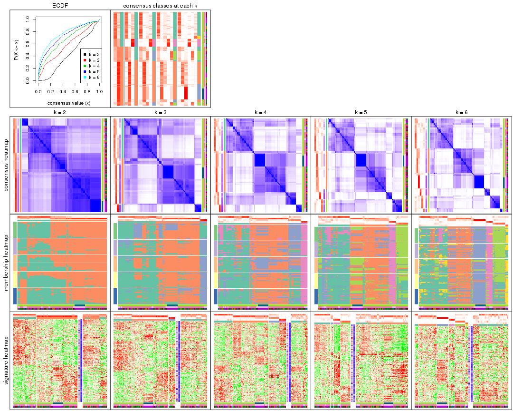

The plots are:

- The first row: a plot of the ECDF (empirical cumulative distribution
  function) curves of the consensus matrix for each `k` and the heatmap of
  predicted classes for each `k`.
- The second row: heatmaps of the consensus matrix for each `k`.
- The third row: heatmaps of the membership matrix for each `k`.
- The fouth row: heatmaps of the signatures for each `k`.

All the plots in panels can be made by individual functions and they are
plotted later in this section.

`select_partition_number()` produces several plots showing different
statistics for choosing "optimized" `k`. There are following statistics:

- ECDF curves of the consensus matrix for each `k`;
- 1-PAC. [The PAC
  score](https://en.wikipedia.org/wiki/Consensus_clustering#Over-interpretation_potential_of_consensus_clustering)
  measures the proportion of the ambiguous subgrouping.
- Mean silhouette score.
- Concordance. The mean probability of fiting the consensus class ids in all
  partitions.
- Area increased. Denote $A_k$ as the area under the ECDF curve for current
  `k`, the area increased is defined as $A_k - A_{k-1}$.
- Rand index. The percent of pairs of samples that are both in a same cluster
  or both are not in a same cluster in the partition of k and k-1.
- Jaccard index. The ratio of pairs of samples are both in a same cluster in
  the partition of k and k-1 and the pairs of samples are both in a same
  cluster in the partition k or k-1.

The detailed explanations of these statistics can be found in [the _cola_
vignette](http://bioconductor.org/packages/devel/bioc/vignettes/cola/inst/doc/cola.html#toc_13).

Generally speaking, lower PAC score, higher mean silhouette score or higher
concordance corresponds to better partition. Rand index and Jaccard index
measure how similar the current partition is compared to partition with `k-1`.
If they are too similar, we won't accept `k` is better than `k-1`.

```r
select_partition_number(res)
```

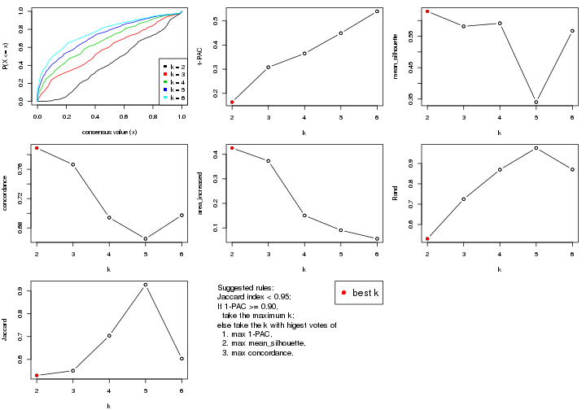

The numeric values for all these statistics can be obtained by `get_stats()`.

```r
get_stats(res)
```

```
#>   k 1-PAC mean_silhouette concordance area_increased  Rand Jaccard
#> 2 2 0.164           0.629       0.789         0.4257 0.530   0.530
#> 3 3 0.308           0.581       0.766         0.3731 0.725   0.551
#> 4 4 0.365           0.591       0.694         0.1506 0.869   0.704
#> 5 5 0.449           0.340       0.665         0.0905 0.976   0.928
#> 6 6 0.540           0.567       0.697         0.0557 0.870   0.603
```

`suggest_best_k()` suggests the best $k$ based on these statistics. The rules are as follows:

- All $k$ with Jaccard index larger than 0.95 are removed because increasing
  $k$ does not provide enough extra information. If all $k$ are removed, it is
  marked as no subgroup is detected.
- For all $k$ with 1-PAC score larger than 0.9, the maximal $k$ is taken as
  the best $k$, and other $k$ are marked as optional $k$.
- If it does not fit the second rule. The $k$ with the maximal vote of the
  highest 1-PAC score, highest mean silhouette, and highest concordance is
  taken as the best $k$.

```r
suggest_best_k(res)
```

```
#> [1] 2
```


Following shows the table of the partitions (You need to click the **show/hide
code output** link to see it). The membership matrix (columns with name `p*`)
is inferred by
[`clue::cl_consensus()`](https://www.rdocumentation.org/link/cl_consensus?package=clue)
function with the `SE` method. Basically the value in the membership matrix
represents the probability to belong to a certain group. The finall class
label for an item is determined with the group with highest probability it
belongs to.

In `get_classes()` function, the entropy is calculated from the membership
matrix and the silhouette score is calculated from the consensus matrix.


<script>
$( function() {
	$( '#tabs-SD-hclust-get-classes' ).tabs();
} );
</script>
<div id='tabs-SD-hclust-get-classes'>
<ul>
<li><a href='#tab-SD-hclust-get-classes-1'>k = 2</a></li>
<li><a href='#tab-SD-hclust-get-classes-2'>k = 3</a></li>
<li><a href='#tab-SD-hclust-get-classes-3'>k = 4</a></li>
<li><a href='#tab-SD-hclust-get-classes-4'>k = 5</a></li>
<li><a href='#tab-SD-hclust-get-classes-5'>k = 6</a></li>
</ul>

<div id='tab-SD-hclust-get-classes-1'>
<p><a id='tab-SD-hclust-get-classes-1-a' style='color:#0366d6' href='#'>show/hide code output</a></p>
<pre><code class="r">cbind(get_classes(res, k = 2), get_membership(res, k = 2))
</code></pre>

<pre><code>#&gt;           class entropy silhouette    p1    p2
#&gt; GSM425907     2  0.1414     0.7575 0.020 0.980
#&gt; GSM425908     2  0.1843     0.7539 0.028 0.972
#&gt; GSM425909     2  0.8016     0.6282 0.244 0.756
#&gt; GSM425910     1  0.9998     0.0640 0.508 0.492
#&gt; GSM425911     2  0.8861     0.5243 0.304 0.696
#&gt; GSM425912     2  0.9909     0.1667 0.444 0.556
#&gt; GSM425913     2  0.2778     0.7766 0.048 0.952
#&gt; GSM425914     2  0.9129     0.4882 0.328 0.672
#&gt; GSM425915     2  0.9460     0.4405 0.364 0.636
#&gt; GSM425874     1  0.9710     0.3759 0.600 0.400
#&gt; GSM425875     2  0.9358     0.4717 0.352 0.648
#&gt; GSM425876     1  0.9358     0.5311 0.648 0.352
#&gt; GSM425877     1  0.6801     0.7233 0.820 0.180
#&gt; GSM425878     1  0.8016     0.7259 0.756 0.244
#&gt; GSM425879     2  0.1184     0.7659 0.016 0.984
#&gt; GSM425880     2  0.9358     0.4717 0.352 0.648
#&gt; GSM425881     2  0.9608     0.3297 0.384 0.616
#&gt; GSM425882     2  0.2948     0.7746 0.052 0.948
#&gt; GSM425883     1  0.7883     0.7260 0.764 0.236
#&gt; GSM425884     1  0.7056     0.7279 0.808 0.192
#&gt; GSM425885     2  0.8144     0.4580 0.252 0.748
#&gt; GSM425848     1  0.7453     0.7313 0.788 0.212
#&gt; GSM425849     1  0.8016     0.7264 0.756 0.244
#&gt; GSM425850     1  0.8499     0.6748 0.724 0.276
#&gt; GSM425851     1  0.6148     0.7174 0.848 0.152
#&gt; GSM425852     2  0.9358     0.4717 0.352 0.648
#&gt; GSM425893     2  0.5842     0.7333 0.140 0.860
#&gt; GSM425894     2  0.2423     0.7695 0.040 0.960
#&gt; GSM425895     2  0.3114     0.7751 0.056 0.944
#&gt; GSM425896     2  0.1414     0.7575 0.020 0.980
#&gt; GSM425897     2  0.0938     0.7684 0.012 0.988
#&gt; GSM425898     2  0.2423     0.7695 0.040 0.960
#&gt; GSM425899     2  0.5519     0.7472 0.128 0.872
#&gt; GSM425900     2  0.4022     0.7731 0.080 0.920
#&gt; GSM425901     2  0.8016     0.6282 0.244 0.756
#&gt; GSM425902     1  0.9686     0.3818 0.604 0.396
#&gt; GSM425903     2  0.9460     0.4405 0.364 0.636
#&gt; GSM425904     2  0.9358     0.4717 0.352 0.648
#&gt; GSM425905     2  0.1633     0.7609 0.024 0.976
#&gt; GSM425906     2  0.3879     0.7731 0.076 0.924
#&gt; GSM425863     1  0.7674     0.7294 0.776 0.224
#&gt; GSM425864     2  0.0938     0.7633 0.012 0.988
#&gt; GSM425865     2  0.1184     0.7659 0.016 0.984
#&gt; GSM425866     2  0.9358     0.4717 0.352 0.648
#&gt; GSM425867     2  0.9661     0.3863 0.392 0.608
#&gt; GSM425868     2  0.6048     0.6420 0.148 0.852
#&gt; GSM425869     2  0.2236     0.7551 0.036 0.964
#&gt; GSM425870     2  0.8763     0.5365 0.296 0.704
#&gt; GSM425871     1  0.8386     0.7038 0.732 0.268
#&gt; GSM425872     2  0.2603     0.7687 0.044 0.956
#&gt; GSM425873     1  0.8909     0.6150 0.692 0.308
#&gt; GSM425843     1  0.6801     0.7233 0.820 0.180
#&gt; GSM425844     1  0.8386     0.7038 0.732 0.268
#&gt; GSM425845     2  0.9775     0.3461 0.412 0.588
#&gt; GSM425846     2  0.5408     0.7460 0.124 0.876
#&gt; GSM425847     1  0.9998     0.0844 0.508 0.492
#&gt; GSM425886     2  0.7139     0.6857 0.196 0.804
#&gt; GSM425887     2  0.3274     0.7750 0.060 0.940
#&gt; GSM425888     2  0.9635     0.3255 0.388 0.612
#&gt; GSM425889     1  0.7674     0.7264 0.776 0.224
#&gt; GSM425890     1  0.9248     0.5846 0.660 0.340
#&gt; GSM425891     2  0.2423     0.7762 0.040 0.960
#&gt; GSM425892     2  0.4815     0.7021 0.104 0.896
#&gt; GSM425853     1  0.9963     0.1765 0.536 0.464
#&gt; GSM425854     2  0.2603     0.7758 0.044 0.956
#&gt; GSM425855     1  0.7219     0.7228 0.800 0.200
#&gt; GSM425856     2  0.9358     0.4717 0.352 0.648
#&gt; GSM425857     2  0.3733     0.7611 0.072 0.928
#&gt; GSM425858     2  0.3733     0.7715 0.072 0.928
#&gt; GSM425859     2  0.2043     0.7594 0.032 0.968
#&gt; GSM425860     2  0.9977     0.1037 0.472 0.528
#&gt; GSM425861     2  0.9635     0.3255 0.388 0.612
#&gt; GSM425862     1  0.7674     0.7264 0.776 0.224
#&gt; GSM425837     1  0.6712     0.7284 0.824 0.176
#&gt; GSM425838     1  0.9661     0.3842 0.608 0.392
#&gt; GSM425839     2  0.1843     0.7621 0.028 0.972
#&gt; GSM425840     1  0.7219     0.7228 0.800 0.200
#&gt; GSM425841     1  0.9686     0.3816 0.604 0.396
#&gt; GSM425842     1  0.8608     0.6512 0.716 0.284
#&gt; GSM425917     2  0.3733     0.7771 0.072 0.928
#&gt; GSM425922     1  0.9661     0.3838 0.608 0.392
#&gt; GSM425919     1  0.6148     0.7174 0.848 0.152
#&gt; GSM425920     1  0.7602     0.7153 0.780 0.220
#&gt; GSM425923     1  0.7528     0.7216 0.784 0.216
#&gt; GSM425916     1  0.6148     0.7150 0.848 0.152
#&gt; GSM425918     1  0.8144     0.7019 0.748 0.252
#&gt; GSM425921     1  0.9661     0.3838 0.608 0.392
#&gt; GSM425925     1  0.9661     0.3838 0.608 0.392
#&gt; GSM425926     1  0.9661     0.3838 0.608 0.392
#&gt; GSM425927     1  0.7602     0.7153 0.780 0.220
#&gt; GSM425924     2  0.4022     0.7739 0.080 0.920
#&gt; GSM425928     2  0.3584     0.7786 0.068 0.932
#&gt; GSM425929     2  0.3584     0.7786 0.068 0.932
#&gt; GSM425930     2  0.3584     0.7786 0.068 0.932
#&gt; GSM425931     2  0.3584     0.7786 0.068 0.932
#&gt; GSM425932     2  0.3584     0.7786 0.068 0.932
#&gt; GSM425933     2  0.3584     0.7786 0.068 0.932
#&gt; GSM425934     2  0.3584     0.7786 0.068 0.932
#&gt; GSM425935     2  0.3584     0.7786 0.068 0.932
#&gt; GSM425936     2  0.3584     0.7786 0.068 0.932
#&gt; GSM425937     2  0.3584     0.7786 0.068 0.932
#&gt; GSM425938     2  0.3584     0.7786 0.068 0.932
#&gt; GSM425939     2  0.3584     0.7786 0.068 0.932
</code></pre>

<script>
$('#tab-SD-hclust-get-classes-1-a').parent().next().next().hide();
$('#tab-SD-hclust-get-classes-1-a').click(function(){
  $('#tab-SD-hclust-get-classes-1-a').parent().next().next().toggle();
  return(false);
});
</script>
</div>

<div id='tab-SD-hclust-get-classes-2'>
<p><a id='tab-SD-hclust-get-classes-2-a' style='color:#0366d6' href='#'>show/hide code output</a></p>
<pre><code class="r">cbind(get_classes(res, k = 3), get_membership(res, k = 3))
</code></pre>

<pre><code>#&gt;           class entropy silhouette    p1    p2    p3
#&gt; GSM425907     2  0.1163     0.7902 0.000 0.972 0.028
#&gt; GSM425908     2  0.1529     0.7897 0.000 0.960 0.040
#&gt; GSM425909     2  0.7184     0.3044 0.472 0.504 0.024
#&gt; GSM425910     1  0.8038     0.5110 0.620 0.280 0.100
#&gt; GSM425911     2  0.6235     0.1842 0.436 0.564 0.000
#&gt; GSM425912     1  0.6608     0.3807 0.628 0.356 0.016
#&gt; GSM425913     2  0.4399     0.7823 0.092 0.864 0.044
#&gt; GSM425914     2  0.6302     0.0381 0.480 0.520 0.000
#&gt; GSM425915     1  0.6062     0.1092 0.616 0.384 0.000
#&gt; GSM425874     3  0.0747     0.8984 0.000 0.016 0.984
#&gt; GSM425875     1  0.6359     0.0403 0.592 0.404 0.004
#&gt; GSM425876     1  0.6250     0.5782 0.776 0.120 0.104
#&gt; GSM425877     1  0.5016     0.5590 0.760 0.000 0.240
#&gt; GSM425878     1  0.6445     0.5254 0.672 0.020 0.308
#&gt; GSM425879     2  0.1453     0.7939 0.008 0.968 0.024
#&gt; GSM425880     1  0.6359     0.0403 0.592 0.404 0.004
#&gt; GSM425881     1  0.7546     0.2501 0.560 0.396 0.044
#&gt; GSM425882     2  0.4179     0.7909 0.072 0.876 0.052
#&gt; GSM425883     1  0.6978     0.5237 0.632 0.032 0.336
#&gt; GSM425884     1  0.5244     0.5537 0.756 0.004 0.240
#&gt; GSM425885     2  0.7013     0.4134 0.028 0.608 0.364
#&gt; GSM425848     1  0.6113     0.5400 0.688 0.012 0.300
#&gt; GSM425849     1  0.6369     0.5213 0.668 0.016 0.316
#&gt; GSM425850     1  0.6254     0.5835 0.756 0.056 0.188
#&gt; GSM425851     1  0.5621     0.4942 0.692 0.000 0.308
#&gt; GSM425852     1  0.6359     0.0403 0.592 0.404 0.004
#&gt; GSM425893     2  0.4968     0.7155 0.188 0.800 0.012
#&gt; GSM425894     2  0.4830     0.7761 0.068 0.848 0.084
#&gt; GSM425895     2  0.5207     0.7627 0.124 0.824 0.052
#&gt; GSM425896     2  0.1774     0.7916 0.016 0.960 0.024
#&gt; GSM425897     2  0.0747     0.7938 0.016 0.984 0.000
#&gt; GSM425898     2  0.4830     0.7761 0.068 0.848 0.084
#&gt; GSM425899     2  0.7666     0.6513 0.148 0.684 0.168
#&gt; GSM425900     2  0.5514     0.7449 0.156 0.800 0.044
#&gt; GSM425901     2  0.7184     0.3044 0.472 0.504 0.024
#&gt; GSM425902     3  0.2050     0.8824 0.020 0.028 0.952
#&gt; GSM425903     1  0.6062     0.1092 0.616 0.384 0.000
#&gt; GSM425904     1  0.6359     0.0403 0.592 0.404 0.004
#&gt; GSM425905     2  0.1031     0.7911 0.000 0.976 0.024
#&gt; GSM425906     2  0.5743     0.7293 0.172 0.784 0.044
#&gt; GSM425863     1  0.6673     0.5132 0.636 0.020 0.344
#&gt; GSM425864     2  0.1585     0.7933 0.008 0.964 0.028
#&gt; GSM425865     2  0.2050     0.7949 0.020 0.952 0.028
#&gt; GSM425866     1  0.6359     0.0403 0.592 0.404 0.004
#&gt; GSM425867     1  0.5722     0.3141 0.704 0.292 0.004
#&gt; GSM425868     2  0.5295     0.7132 0.036 0.808 0.156
#&gt; GSM425869     2  0.3031     0.7835 0.012 0.912 0.076
#&gt; GSM425870     2  0.6192     0.2321 0.420 0.580 0.000
#&gt; GSM425871     1  0.6148     0.5675 0.728 0.028 0.244
#&gt; GSM425872     2  0.5093     0.7705 0.076 0.836 0.088
#&gt; GSM425873     1  0.5764     0.5836 0.800 0.076 0.124
#&gt; GSM425843     1  0.5016     0.5590 0.760 0.000 0.240
#&gt; GSM425844     1  0.6148     0.5675 0.728 0.028 0.244
#&gt; GSM425845     1  0.5443     0.3690 0.736 0.260 0.004
#&gt; GSM425846     2  0.7245     0.6726 0.168 0.712 0.120
#&gt; GSM425847     1  0.7128     0.4917 0.664 0.284 0.052
#&gt; GSM425886     2  0.7102     0.4178 0.420 0.556 0.024
#&gt; GSM425887     2  0.5497     0.7495 0.148 0.804 0.048
#&gt; GSM425888     1  0.8028     0.2808 0.560 0.368 0.072
#&gt; GSM425889     1  0.6896     0.4540 0.588 0.020 0.392
#&gt; GSM425890     3  0.9399    -0.1260 0.372 0.176 0.452
#&gt; GSM425891     2  0.4859     0.7730 0.116 0.840 0.044
#&gt; GSM425892     2  0.4172     0.7323 0.004 0.840 0.156
#&gt; GSM425853     1  0.8542     0.5254 0.608 0.220 0.172
#&gt; GSM425854     2  0.4087     0.7917 0.068 0.880 0.052
#&gt; GSM425855     1  0.5775     0.5623 0.728 0.012 0.260
#&gt; GSM425856     1  0.6359     0.0403 0.592 0.404 0.004
#&gt; GSM425857     2  0.6535     0.6496 0.220 0.728 0.052
#&gt; GSM425858     2  0.5734     0.7345 0.164 0.788 0.048
#&gt; GSM425859     2  0.3272     0.7843 0.016 0.904 0.080
#&gt; GSM425860     1  0.7153     0.4544 0.652 0.300 0.048
#&gt; GSM425861     1  0.8028     0.2808 0.560 0.368 0.072
#&gt; GSM425862     1  0.6896     0.4540 0.588 0.020 0.392
#&gt; GSM425837     1  0.5553     0.5500 0.724 0.004 0.272
#&gt; GSM425838     3  0.2434     0.8796 0.024 0.036 0.940
#&gt; GSM425839     2  0.3550     0.7855 0.024 0.896 0.080
#&gt; GSM425840     1  0.5775     0.5623 0.728 0.012 0.260
#&gt; GSM425841     3  0.1315     0.8976 0.008 0.020 0.972
#&gt; GSM425842     1  0.5659     0.5845 0.796 0.052 0.152
#&gt; GSM425917     2  0.4172     0.7785 0.156 0.840 0.004
#&gt; GSM425922     3  0.0000     0.9013 0.000 0.000 1.000
#&gt; GSM425919     1  0.5621     0.4942 0.692 0.000 0.308
#&gt; GSM425920     1  0.5597     0.5768 0.764 0.020 0.216
#&gt; GSM425923     1  0.6189     0.4393 0.632 0.004 0.364
#&gt; GSM425916     1  0.5678     0.4797 0.684 0.000 0.316
#&gt; GSM425918     1  0.7555     0.3215 0.520 0.040 0.440
#&gt; GSM425921     3  0.0000     0.9013 0.000 0.000 1.000
#&gt; GSM425925     3  0.0000     0.9013 0.000 0.000 1.000
#&gt; GSM425926     3  0.0000     0.9013 0.000 0.000 1.000
#&gt; GSM425927     1  0.5597     0.5768 0.764 0.020 0.216
#&gt; GSM425924     2  0.4293     0.7755 0.164 0.832 0.004
#&gt; GSM425928     2  0.3941     0.7797 0.156 0.844 0.000
#&gt; GSM425929     2  0.3941     0.7797 0.156 0.844 0.000
#&gt; GSM425930     2  0.3941     0.7797 0.156 0.844 0.000
#&gt; GSM425931     2  0.3941     0.7797 0.156 0.844 0.000
#&gt; GSM425932     2  0.3941     0.7797 0.156 0.844 0.000
#&gt; GSM425933     2  0.3941     0.7797 0.156 0.844 0.000
#&gt; GSM425934     2  0.3941     0.7797 0.156 0.844 0.000
#&gt; GSM425935     2  0.3941     0.7797 0.156 0.844 0.000
#&gt; GSM425936     2  0.3941     0.7797 0.156 0.844 0.000
#&gt; GSM425937     2  0.3941     0.7797 0.156 0.844 0.000
#&gt; GSM425938     2  0.3941     0.7797 0.156 0.844 0.000
#&gt; GSM425939     2  0.3941     0.7797 0.156 0.844 0.000
</code></pre>

<script>
$('#tab-SD-hclust-get-classes-2-a').parent().next().next().hide();
$('#tab-SD-hclust-get-classes-2-a').click(function(){
  $('#tab-SD-hclust-get-classes-2-a').parent().next().next().toggle();
  return(false);
});
</script>
</div>

<div id='tab-SD-hclust-get-classes-3'>
<p><a id='tab-SD-hclust-get-classes-3-a' style='color:#0366d6' href='#'>show/hide code output</a></p>
<pre><code class="r">cbind(get_classes(res, k = 4), get_membership(res, k = 4))
</code></pre>

<pre><code>#&gt;           class entropy silhouette    p1    p2    p3    p4
#&gt; GSM425907     2   0.267     0.7055 0.000 0.892 0.100 0.008
#&gt; GSM425908     2   0.304     0.7030 0.000 0.880 0.100 0.020
#&gt; GSM425909     3   0.636     0.7288 0.180 0.164 0.656 0.000
#&gt; GSM425910     1   0.657     0.2400 0.632 0.164 0.204 0.000
#&gt; GSM425911     2   0.762    -0.0764 0.356 0.436 0.208 0.000
#&gt; GSM425912     1   0.690     0.2608 0.552 0.336 0.108 0.004
#&gt; GSM425913     2   0.350     0.6839 0.052 0.872 0.072 0.004
#&gt; GSM425914     1   0.765    -0.1238 0.400 0.392 0.208 0.000
#&gt; GSM425915     3   0.648     0.7706 0.324 0.092 0.584 0.000
#&gt; GSM425874     4   0.230     0.9549 0.028 0.028 0.012 0.932
#&gt; GSM425875     3   0.611     0.8055 0.284 0.080 0.636 0.000
#&gt; GSM425876     1   0.455     0.5349 0.804 0.104 0.092 0.000
#&gt; GSM425877     1   0.292     0.6299 0.896 0.000 0.044 0.060
#&gt; GSM425878     1   0.534     0.6269 0.768 0.032 0.044 0.156
#&gt; GSM425879     2   0.201     0.7102 0.000 0.920 0.080 0.000
#&gt; GSM425880     3   0.611     0.8055 0.284 0.080 0.636 0.000
#&gt; GSM425881     1   0.708     0.2071 0.476 0.412 0.108 0.004
#&gt; GSM425882     2   0.341     0.7027 0.060 0.884 0.040 0.016
#&gt; GSM425883     1   0.612     0.5696 0.656 0.020 0.044 0.280
#&gt; GSM425884     1   0.303     0.6147 0.888 0.004 0.088 0.020
#&gt; GSM425885     2   0.848     0.1894 0.032 0.428 0.236 0.304
#&gt; GSM425848     1   0.491     0.6220 0.788 0.012 0.056 0.144
#&gt; GSM425849     1   0.534     0.6256 0.764 0.028 0.044 0.164
#&gt; GSM425850     1   0.406     0.6122 0.856 0.052 0.064 0.028
#&gt; GSM425851     1   0.579     0.4700 0.680 0.000 0.244 0.076
#&gt; GSM425852     3   0.617     0.8041 0.284 0.084 0.632 0.000
#&gt; GSM425893     2   0.563     0.5935 0.140 0.724 0.136 0.000
#&gt; GSM425894     2   0.369     0.6785 0.024 0.872 0.068 0.036
#&gt; GSM425895     2   0.423     0.6505 0.080 0.836 0.076 0.008
#&gt; GSM425896     2   0.277     0.7039 0.000 0.880 0.116 0.004
#&gt; GSM425897     2   0.294     0.7061 0.004 0.868 0.128 0.000
#&gt; GSM425898     2   0.369     0.6785 0.024 0.872 0.068 0.036
#&gt; GSM425899     2   0.693     0.5310 0.120 0.688 0.084 0.108
#&gt; GSM425900     2   0.453     0.6301 0.112 0.804 0.084 0.000
#&gt; GSM425901     3   0.636     0.7288 0.180 0.164 0.656 0.000
#&gt; GSM425902     4   0.330     0.9404 0.048 0.028 0.032 0.892
#&gt; GSM425903     3   0.648     0.7706 0.324 0.092 0.584 0.000
#&gt; GSM425904     3   0.611     0.8055 0.284 0.080 0.636 0.000
#&gt; GSM425905     2   0.233     0.7085 0.000 0.908 0.088 0.004
#&gt; GSM425906     2   0.481     0.6088 0.132 0.784 0.084 0.000
#&gt; GSM425863     1   0.577     0.5694 0.668 0.012 0.036 0.284
#&gt; GSM425864     2   0.201     0.7095 0.000 0.920 0.080 0.000
#&gt; GSM425865     2   0.233     0.7106 0.004 0.908 0.088 0.000
#&gt; GSM425866     3   0.614     0.8035 0.288 0.080 0.632 0.000
#&gt; GSM425867     3   0.652     0.5673 0.412 0.076 0.512 0.000
#&gt; GSM425868     2   0.617     0.6301 0.036 0.728 0.112 0.124
#&gt; GSM425869     2   0.267     0.6989 0.004 0.912 0.052 0.032
#&gt; GSM425870     2   0.763    -0.0617 0.340 0.444 0.216 0.000
#&gt; GSM425871     1   0.419     0.6309 0.848 0.028 0.048 0.076
#&gt; GSM425872     2   0.421     0.6666 0.040 0.848 0.076 0.036
#&gt; GSM425873     1   0.380     0.5807 0.856 0.068 0.072 0.004
#&gt; GSM425843     1   0.292     0.6299 0.896 0.000 0.044 0.060
#&gt; GSM425844     1   0.419     0.6309 0.848 0.028 0.048 0.076
#&gt; GSM425845     3   0.650     0.4697 0.444 0.072 0.484 0.000
#&gt; GSM425846     2   0.641     0.5556 0.132 0.720 0.080 0.068
#&gt; GSM425847     1   0.666     0.3561 0.616 0.276 0.100 0.008
#&gt; GSM425886     3   0.659     0.6220 0.148 0.228 0.624 0.000
#&gt; GSM425887     2   0.447     0.6339 0.100 0.816 0.080 0.004
#&gt; GSM425888     1   0.773     0.2237 0.476 0.384 0.108 0.032
#&gt; GSM425889     1   0.616     0.5071 0.616 0.012 0.044 0.328
#&gt; GSM425890     1   0.907     0.1313 0.412 0.152 0.108 0.328
#&gt; GSM425891     2   0.397     0.6606 0.076 0.840 0.084 0.000
#&gt; GSM425892     2   0.557     0.6453 0.012 0.752 0.120 0.116
#&gt; GSM425853     1   0.780     0.1018 0.540 0.080 0.312 0.068
#&gt; GSM425854     2   0.339     0.6968 0.052 0.884 0.052 0.012
#&gt; GSM425855     1   0.349     0.6304 0.864 0.000 0.044 0.092
#&gt; GSM425856     3   0.611     0.8055 0.284 0.080 0.636 0.000
#&gt; GSM425857     3   0.539     0.1149 0.000 0.368 0.612 0.020
#&gt; GSM425858     2   0.471     0.6174 0.116 0.800 0.080 0.004
#&gt; GSM425859     2   0.250     0.6984 0.004 0.920 0.044 0.032
#&gt; GSM425860     1   0.708     0.0527 0.564 0.184 0.252 0.000
#&gt; GSM425861     1   0.773     0.2237 0.476 0.384 0.108 0.032
#&gt; GSM425862     1   0.616     0.5071 0.616 0.012 0.044 0.328
#&gt; GSM425837     1   0.346     0.6364 0.864 0.000 0.040 0.096
#&gt; GSM425838     4   0.476     0.8717 0.112 0.028 0.048 0.812
#&gt; GSM425839     2   0.273     0.6985 0.008 0.912 0.048 0.032
#&gt; GSM425840     1   0.349     0.6304 0.864 0.000 0.044 0.092
#&gt; GSM425841     4   0.273     0.9541 0.036 0.028 0.020 0.916
#&gt; GSM425842     1   0.417     0.6084 0.852 0.044 0.064 0.040
#&gt; GSM425917     2   0.573     0.5989 0.040 0.648 0.308 0.004
#&gt; GSM425922     4   0.121     0.9600 0.032 0.004 0.000 0.964
#&gt; GSM425919     1   0.579     0.4700 0.680 0.000 0.244 0.076
#&gt; GSM425920     1   0.303     0.6234 0.900 0.012 0.056 0.032
#&gt; GSM425923     1   0.553     0.5702 0.728 0.000 0.104 0.168
#&gt; GSM425916     1   0.588     0.4593 0.676 0.000 0.240 0.084
#&gt; GSM425918     1   0.734     0.4043 0.556 0.020 0.116 0.308
#&gt; GSM425921     4   0.111     0.9602 0.028 0.004 0.000 0.968
#&gt; GSM425925     4   0.126     0.9608 0.028 0.008 0.000 0.964
#&gt; GSM425926     4   0.136     0.9609 0.032 0.008 0.000 0.960
#&gt; GSM425927     1   0.303     0.6234 0.900 0.012 0.056 0.032
#&gt; GSM425924     2   0.589     0.5919 0.048 0.640 0.308 0.004
#&gt; GSM425928     2   0.558     0.5988 0.040 0.648 0.312 0.000
#&gt; GSM425929     2   0.558     0.5988 0.040 0.648 0.312 0.000
#&gt; GSM425930     2   0.558     0.5988 0.040 0.648 0.312 0.000
#&gt; GSM425931     2   0.558     0.5988 0.040 0.648 0.312 0.000
#&gt; GSM425932     2   0.558     0.5988 0.040 0.648 0.312 0.000
#&gt; GSM425933     2   0.558     0.5988 0.040 0.648 0.312 0.000
#&gt; GSM425934     2   0.558     0.5988 0.040 0.648 0.312 0.000
#&gt; GSM425935     2   0.558     0.5988 0.040 0.648 0.312 0.000
#&gt; GSM425936     2   0.558     0.5988 0.040 0.648 0.312 0.000
#&gt; GSM425937     2   0.558     0.5988 0.040 0.648 0.312 0.000
#&gt; GSM425938     2   0.558     0.5988 0.040 0.648 0.312 0.000
#&gt; GSM425939     2   0.558     0.5988 0.040 0.648 0.312 0.000
</code></pre>

<script>
$('#tab-SD-hclust-get-classes-3-a').parent().next().next().hide();
$('#tab-SD-hclust-get-classes-3-a').click(function(){
  $('#tab-SD-hclust-get-classes-3-a').parent().next().next().toggle();
  return(false);
});
</script>
</div>

<div id='tab-SD-hclust-get-classes-4'>
<p><a id='tab-SD-hclust-get-classes-4-a' style='color:#0366d6' href='#'>show/hide code output</a></p>
<pre><code class="r">cbind(get_classes(res, k = 5), get_membership(res, k = 5))
</code></pre>

<pre><code>#&gt;           class entropy silhouette    p1    p2    p3    p4    p5
#&gt; GSM425907     2   0.376   0.247878 0.000 0.772 0.208 0.000 0.020
#&gt; GSM425908     2   0.398   0.243896 0.000 0.760 0.216 0.004 0.020
#&gt; GSM425909     5   0.462   0.734173 0.136 0.096 0.008 0.000 0.760
#&gt; GSM425910     1   0.713   0.240813 0.568 0.116 0.124 0.000 0.192
#&gt; GSM425911     2   0.830  -0.105517 0.300 0.352 0.160 0.000 0.188
#&gt; GSM425912     1   0.718   0.301926 0.504 0.172 0.272 0.000 0.052
#&gt; GSM425913     2   0.606  -0.519093 0.032 0.524 0.396 0.004 0.044
#&gt; GSM425914     1   0.825  -0.048489 0.348 0.316 0.148 0.000 0.188
#&gt; GSM425915     5   0.454   0.781148 0.264 0.020 0.012 0.000 0.704
#&gt; GSM425874     4   0.325   0.919148 0.028 0.000 0.072 0.868 0.032
#&gt; GSM425875     5   0.355   0.811532 0.236 0.000 0.004 0.000 0.760
#&gt; GSM425876     1   0.508   0.516762 0.748 0.084 0.128 0.000 0.040
#&gt; GSM425877     1   0.421   0.585303 0.824 0.020 0.084 0.052 0.020
#&gt; GSM425878     1   0.486   0.591554 0.764 0.004 0.100 0.112 0.020
#&gt; GSM425879     2   0.400   0.208175 0.000 0.740 0.240 0.000 0.020
#&gt; GSM425880     5   0.355   0.811532 0.236 0.000 0.004 0.000 0.760
#&gt; GSM425881     1   0.732   0.020089 0.424 0.180 0.352 0.000 0.044
#&gt; GSM425882     2   0.554  -0.153121 0.048 0.624 0.308 0.004 0.016
#&gt; GSM425883     1   0.643   0.529476 0.612 0.008 0.112 0.236 0.032
#&gt; GSM425884     1   0.419   0.575292 0.816 0.016 0.104 0.012 0.052
#&gt; GSM425885     2   0.883   0.059531 0.024 0.356 0.148 0.236 0.236
#&gt; GSM425848     1   0.508   0.581197 0.760 0.008 0.096 0.104 0.032
#&gt; GSM425849     1   0.484   0.590015 0.756 0.000 0.104 0.120 0.020
#&gt; GSM425850     1   0.445   0.576634 0.800 0.028 0.124 0.020 0.028
#&gt; GSM425851     1   0.784   0.221570 0.448 0.044 0.320 0.032 0.156
#&gt; GSM425852     5   0.371   0.810995 0.236 0.004 0.004 0.000 0.756
#&gt; GSM425893     2   0.655   0.023601 0.120 0.628 0.168 0.000 0.084
#&gt; GSM425894     2   0.591  -0.529870 0.008 0.496 0.436 0.016 0.044
#&gt; GSM425895     2   0.618  -0.594051 0.048 0.520 0.392 0.004 0.036
#&gt; GSM425896     2   0.406   0.262052 0.000 0.764 0.196 0.000 0.040
#&gt; GSM425897     2   0.366   0.302643 0.000 0.804 0.160 0.000 0.036
#&gt; GSM425898     2   0.591  -0.529870 0.008 0.496 0.436 0.016 0.044
#&gt; GSM425899     3   0.775   0.783236 0.096 0.340 0.464 0.048 0.052
#&gt; GSM425900     2   0.646  -0.752777 0.072 0.452 0.436 0.000 0.040
#&gt; GSM425901     5   0.462   0.734173 0.136 0.096 0.008 0.000 0.760
#&gt; GSM425902     4   0.395   0.896607 0.036 0.000 0.088 0.828 0.048
#&gt; GSM425903     5   0.454   0.781148 0.264 0.020 0.012 0.000 0.704
#&gt; GSM425904     5   0.355   0.811532 0.236 0.000 0.004 0.000 0.760
#&gt; GSM425905     2   0.394   0.214967 0.000 0.748 0.232 0.000 0.020
#&gt; GSM425906     3   0.667   0.693141 0.092 0.428 0.440 0.000 0.040
#&gt; GSM425863     1   0.613   0.527212 0.628 0.004 0.100 0.240 0.028
#&gt; GSM425864     2   0.385   0.220981 0.000 0.752 0.232 0.000 0.016
#&gt; GSM425865     2   0.410   0.212840 0.004 0.744 0.232 0.000 0.020
#&gt; GSM425866     5   0.364   0.807512 0.248 0.000 0.004 0.000 0.748
#&gt; GSM425867     5   0.618   0.584778 0.348 0.052 0.048 0.000 0.552
#&gt; GSM425868     2   0.695   0.102097 0.028 0.592 0.236 0.100 0.044
#&gt; GSM425869     2   0.523  -0.294781 0.000 0.568 0.392 0.012 0.028
#&gt; GSM425870     2   0.831  -0.098066 0.288 0.356 0.156 0.000 0.200
#&gt; GSM425871     1   0.412   0.593958 0.804 0.000 0.128 0.048 0.020
#&gt; GSM425872     2   0.602  -0.608014 0.012 0.468 0.460 0.016 0.044
#&gt; GSM425873     1   0.425   0.551865 0.816 0.052 0.088 0.004 0.040
#&gt; GSM425843     1   0.421   0.585303 0.824 0.020 0.084 0.052 0.020
#&gt; GSM425844     1   0.412   0.593958 0.804 0.000 0.128 0.048 0.020
#&gt; GSM425845     5   0.642   0.495924 0.376 0.060 0.052 0.000 0.512
#&gt; GSM425846     3   0.732   0.820184 0.104 0.368 0.464 0.024 0.040
#&gt; GSM425847     1   0.663   0.387483 0.572 0.116 0.264 0.000 0.048
#&gt; GSM425886     5   0.545   0.664519 0.108 0.176 0.020 0.000 0.696
#&gt; GSM425887     2   0.631  -0.640673 0.068 0.504 0.392 0.000 0.036
#&gt; GSM425888     1   0.733   0.055872 0.424 0.124 0.396 0.012 0.044
#&gt; GSM425889     1   0.643   0.462931 0.568 0.000 0.112 0.288 0.032
#&gt; GSM425890     1   0.949  -0.000882 0.324 0.144 0.184 0.252 0.096
#&gt; GSM425891     2   0.621  -0.637456 0.048 0.480 0.428 0.000 0.044
#&gt; GSM425892     2   0.633   0.173471 0.008 0.644 0.208 0.084 0.056
#&gt; GSM425853     1   0.755   0.040274 0.500 0.056 0.088 0.040 0.316
#&gt; GSM425854     2   0.588  -0.416905 0.036 0.556 0.372 0.004 0.032
#&gt; GSM425855     1   0.414   0.587587 0.832 0.016 0.052 0.068 0.032
#&gt; GSM425856     5   0.361   0.809430 0.244 0.000 0.004 0.000 0.752
#&gt; GSM425857     5   0.511   0.213757 0.000 0.360 0.032 0.008 0.600
#&gt; GSM425858     2   0.657  -0.762748 0.088 0.444 0.432 0.000 0.036
#&gt; GSM425859     2   0.522  -0.293139 0.000 0.572 0.388 0.012 0.028
#&gt; GSM425860     1   0.746   0.041943 0.500 0.160 0.088 0.000 0.252
#&gt; GSM425861     1   0.733   0.055872 0.424 0.124 0.396 0.012 0.044
#&gt; GSM425862     1   0.643   0.462931 0.568 0.000 0.112 0.288 0.032
#&gt; GSM425837     1   0.480   0.589395 0.780 0.008 0.108 0.072 0.032
#&gt; GSM425838     4   0.654   0.770005 0.104 0.012 0.144 0.656 0.084
#&gt; GSM425839     2   0.530  -0.321545 0.000 0.564 0.392 0.012 0.032
#&gt; GSM425840     1   0.414   0.587587 0.832 0.016 0.052 0.068 0.032
#&gt; GSM425841     4   0.355   0.912541 0.032 0.000 0.076 0.852 0.040
#&gt; GSM425842     1   0.448   0.569264 0.816 0.036 0.076 0.032 0.040
#&gt; GSM425917     2   0.320   0.453202 0.012 0.820 0.000 0.000 0.168
#&gt; GSM425922     4   0.130   0.925582 0.028 0.000 0.016 0.956 0.000
#&gt; GSM425919     1   0.784   0.221570 0.448 0.044 0.320 0.032 0.156
#&gt; GSM425920     1   0.309   0.588878 0.880 0.012 0.072 0.012 0.024
#&gt; GSM425923     1   0.726   0.448028 0.588 0.024 0.192 0.120 0.076
#&gt; GSM425916     1   0.781   0.214578 0.448 0.036 0.320 0.036 0.160
#&gt; GSM425918     1   0.835   0.287936 0.464 0.040 0.156 0.244 0.096
#&gt; GSM425921     4   0.120   0.925878 0.028 0.000 0.012 0.960 0.000
#&gt; GSM425925     4   0.140   0.927104 0.028 0.000 0.020 0.952 0.000
#&gt; GSM425926     4   0.149   0.927208 0.028 0.000 0.024 0.948 0.000
#&gt; GSM425927     1   0.309   0.588878 0.880 0.012 0.072 0.012 0.024
#&gt; GSM425924     2   0.340   0.448097 0.020 0.812 0.000 0.000 0.168
#&gt; GSM425928     2   0.313   0.454558 0.008 0.820 0.000 0.000 0.172
#&gt; GSM425929     2   0.313   0.454558 0.008 0.820 0.000 0.000 0.172
#&gt; GSM425930     2   0.313   0.454558 0.008 0.820 0.000 0.000 0.172
#&gt; GSM425931     2   0.313   0.454558 0.008 0.820 0.000 0.000 0.172
#&gt; GSM425932     2   0.313   0.454558 0.008 0.820 0.000 0.000 0.172
#&gt; GSM425933     2   0.313   0.454558 0.008 0.820 0.000 0.000 0.172
#&gt; GSM425934     2   0.313   0.454558 0.008 0.820 0.000 0.000 0.172
#&gt; GSM425935     2   0.313   0.454558 0.008 0.820 0.000 0.000 0.172
#&gt; GSM425936     2   0.313   0.454558 0.008 0.820 0.000 0.000 0.172
#&gt; GSM425937     2   0.313   0.454558 0.008 0.820 0.000 0.000 0.172
#&gt; GSM425938     2   0.313   0.454558 0.008 0.820 0.000 0.000 0.172
#&gt; GSM425939     2   0.313   0.454558 0.008 0.820 0.000 0.000 0.172
</code></pre>

<script>
$('#tab-SD-hclust-get-classes-4-a').parent().next().next().hide();
$('#tab-SD-hclust-get-classes-4-a').click(function(){
  $('#tab-SD-hclust-get-classes-4-a').parent().next().next().toggle();
  return(false);
});
</script>
</div>

<div id='tab-SD-hclust-get-classes-5'>
<p><a id='tab-SD-hclust-get-classes-5-a' style='color:#0366d6' href='#'>show/hide code output</a></p>
<pre><code class="r">cbind(get_classes(res, k = 6), get_membership(res, k = 6))
</code></pre>

<pre><code>#&gt;           class entropy silhouette    p1    p2    p3    p4    p5    p6
#&gt; GSM425907     2  0.5106     0.5064 0.000 0.500 0.440 0.000 0.040 0.020
#&gt; GSM425908     2  0.5238     0.4988 0.000 0.496 0.436 0.000 0.040 0.028
#&gt; GSM425909     5  0.4367     0.7420 0.076 0.024 0.148 0.000 0.752 0.000
#&gt; GSM425910     1  0.7204     0.2816 0.552 0.068 0.136 0.008 0.180 0.056
#&gt; GSM425911     1  0.8367     0.0167 0.296 0.216 0.272 0.004 0.172 0.040
#&gt; GSM425912     1  0.6588     0.4096 0.552 0.280 0.076 0.008 0.028 0.056
#&gt; GSM425913     2  0.4508     0.7259 0.044 0.740 0.180 0.000 0.008 0.028
#&gt; GSM425914     1  0.8327     0.0486 0.340 0.188 0.248 0.004 0.176 0.044
#&gt; GSM425915     5  0.4783     0.7916 0.224 0.016 0.076 0.000 0.684 0.000
#&gt; GSM425874     4  0.3308     0.8316 0.016 0.052 0.000 0.856 0.056 0.020
#&gt; GSM425875     5  0.4249     0.8202 0.188 0.008 0.068 0.000 0.736 0.000
#&gt; GSM425876     1  0.4504     0.5127 0.788 0.060 0.068 0.008 0.012 0.064
#&gt; GSM425877     1  0.4320     0.4276 0.740 0.004 0.008 0.028 0.016 0.204
#&gt; GSM425878     1  0.4416     0.4930 0.796 0.052 0.004 0.056 0.024 0.068
#&gt; GSM425879     2  0.4877     0.5623 0.004 0.536 0.420 0.000 0.028 0.012
#&gt; GSM425880     5  0.4249     0.8202 0.188 0.008 0.068 0.000 0.736 0.000
#&gt; GSM425881     1  0.6624     0.2687 0.472 0.376 0.068 0.008 0.024 0.052
#&gt; GSM425882     2  0.5791     0.6547 0.052 0.584 0.312 0.008 0.024 0.020
#&gt; GSM425883     1  0.6819     0.3839 0.576 0.064 0.004 0.188 0.040 0.128
#&gt; GSM425884     1  0.3442     0.3488 0.756 0.000 0.004 0.004 0.004 0.232
#&gt; GSM425885     3  0.8782     0.0439 0.024 0.236 0.332 0.168 0.180 0.060
#&gt; GSM425848     1  0.5666     0.4563 0.704 0.044 0.008 0.076 0.044 0.124
#&gt; GSM425849     1  0.4389     0.4914 0.792 0.056 0.000 0.056 0.024 0.072
#&gt; GSM425850     1  0.4063     0.5259 0.808 0.076 0.016 0.008 0.012 0.080
#&gt; GSM425851     6  0.3900     0.7909 0.232 0.000 0.040 0.000 0.000 0.728
#&gt; GSM425852     5  0.4402     0.8190 0.188 0.008 0.080 0.000 0.724 0.000
#&gt; GSM425893     2  0.7175     0.3950 0.136 0.404 0.360 0.000 0.080 0.020
#&gt; GSM425894     2  0.3449     0.7206 0.016 0.820 0.140 0.012 0.008 0.004
#&gt; GSM425895     2  0.4738     0.7163 0.052 0.728 0.176 0.000 0.008 0.036
#&gt; GSM425896     2  0.5216     0.4902 0.000 0.488 0.444 0.000 0.048 0.020
#&gt; GSM425897     3  0.4537    -0.2277 0.000 0.384 0.584 0.000 0.020 0.012
#&gt; GSM425898     2  0.3449     0.7206 0.016 0.820 0.140 0.012 0.008 0.004
#&gt; GSM425899     2  0.5115     0.6137 0.108 0.752 0.056 0.028 0.028 0.028
#&gt; GSM425900     2  0.4520     0.6942 0.084 0.760 0.120 0.000 0.008 0.028
#&gt; GSM425901     5  0.4367     0.7420 0.076 0.024 0.148 0.000 0.752 0.000
#&gt; GSM425902     4  0.4641     0.7823 0.028 0.064 0.000 0.776 0.068 0.064
#&gt; GSM425903     5  0.4783     0.7916 0.224 0.016 0.076 0.000 0.684 0.000
#&gt; GSM425904     5  0.4249     0.8202 0.188 0.008 0.068 0.000 0.736 0.000
#&gt; GSM425905     2  0.4810     0.5579 0.000 0.536 0.420 0.000 0.032 0.012
#&gt; GSM425906     2  0.4669     0.6750 0.104 0.748 0.112 0.000 0.008 0.028
#&gt; GSM425863     1  0.6558     0.3786 0.592 0.044 0.004 0.188 0.036 0.136
#&gt; GSM425864     2  0.4883     0.5525 0.004 0.532 0.424 0.000 0.028 0.012
#&gt; GSM425865     2  0.5125     0.5565 0.012 0.528 0.416 0.000 0.032 0.012
#&gt; GSM425866     5  0.4337     0.8167 0.200 0.008 0.068 0.000 0.724 0.000
#&gt; GSM425867     5  0.5980     0.5893 0.324 0.004 0.100 0.000 0.536 0.036
#&gt; GSM425868     2  0.7239     0.4526 0.028 0.452 0.356 0.076 0.040 0.048
#&gt; GSM425869     2  0.3667     0.7155 0.000 0.776 0.192 0.008 0.016 0.008
#&gt; GSM425870     3  0.8390    -0.2019 0.276 0.216 0.284 0.004 0.180 0.040
#&gt; GSM425871     1  0.3733     0.4970 0.800 0.068 0.000 0.012 0.000 0.120
#&gt; GSM425872     2  0.3481     0.7145 0.020 0.828 0.124 0.012 0.008 0.008
#&gt; GSM425873     1  0.3481     0.5268 0.856 0.036 0.040 0.008 0.016 0.044
#&gt; GSM425843     1  0.4320     0.4276 0.740 0.004 0.008 0.028 0.016 0.204
#&gt; GSM425844     1  0.3733     0.4970 0.800 0.068 0.000 0.012 0.000 0.120
#&gt; GSM425845     5  0.6133     0.4893 0.360 0.004 0.108 0.000 0.492 0.036
#&gt; GSM425846     2  0.4791     0.6294 0.116 0.760 0.072 0.016 0.020 0.016
#&gt; GSM425847     1  0.5916     0.4486 0.624 0.244 0.040 0.008 0.020 0.064
#&gt; GSM425886     5  0.5108     0.6694 0.064 0.064 0.180 0.000 0.692 0.000
#&gt; GSM425887     2  0.4999     0.7062 0.076 0.712 0.168 0.000 0.008 0.036
#&gt; GSM425888     1  0.6011     0.2981 0.472 0.424 0.012 0.016 0.020 0.056
#&gt; GSM425889     1  0.6973     0.3143 0.532 0.052 0.000 0.224 0.048 0.144
#&gt; GSM425890     6  0.8968     0.3131 0.276 0.104 0.100 0.172 0.036 0.312
#&gt; GSM425891     2  0.4522     0.7188 0.056 0.744 0.164 0.000 0.004 0.032
#&gt; GSM425892     2  0.6707     0.4203 0.008 0.468 0.376 0.036 0.068 0.044
#&gt; GSM425853     1  0.7340     0.0462 0.472 0.032 0.092 0.020 0.312 0.072
#&gt; GSM425854     2  0.4418     0.7292 0.036 0.732 0.204 0.000 0.012 0.016
#&gt; GSM425855     1  0.4642     0.4729 0.772 0.024 0.008 0.052 0.028 0.116
#&gt; GSM425856     5  0.4308     0.8184 0.196 0.008 0.068 0.000 0.728 0.000
#&gt; GSM425857     5  0.5171     0.1416 0.000 0.068 0.400 0.000 0.524 0.008
#&gt; GSM425858     2  0.4584     0.6921 0.096 0.752 0.116 0.000 0.004 0.032
#&gt; GSM425859     2  0.3385     0.7201 0.000 0.792 0.184 0.004 0.016 0.004
#&gt; GSM425860     1  0.7386     0.0821 0.476 0.048 0.196 0.004 0.228 0.048
#&gt; GSM425861     1  0.6011     0.2981 0.472 0.424 0.012 0.016 0.020 0.056
#&gt; GSM425862     1  0.6973     0.3143 0.532 0.052 0.000 0.224 0.048 0.144
#&gt; GSM425837     1  0.5018     0.4215 0.700 0.012 0.004 0.032 0.044 0.208
#&gt; GSM425838     4  0.8606     0.3032 0.136 0.124 0.000 0.332 0.228 0.180
#&gt; GSM425839     2  0.3435     0.7210 0.004 0.792 0.184 0.004 0.012 0.004
#&gt; GSM425840     1  0.4642     0.4729 0.772 0.024 0.008 0.052 0.028 0.116
#&gt; GSM425841     4  0.3981     0.8158 0.028 0.048 0.000 0.820 0.064 0.040
#&gt; GSM425842     1  0.3407     0.5367 0.864 0.032 0.024 0.024 0.016 0.040
#&gt; GSM425917     3  0.0146     0.8542 0.000 0.000 0.996 0.000 0.000 0.004
#&gt; GSM425922     4  0.1242     0.8388 0.008 0.012 0.000 0.960 0.008 0.012
#&gt; GSM425919     6  0.3900     0.7909 0.232 0.000 0.040 0.000 0.000 0.728
#&gt; GSM425920     1  0.2822     0.4925 0.856 0.032 0.000 0.004 0.000 0.108
#&gt; GSM425923     1  0.6070    -0.1405 0.496 0.016 0.008 0.072 0.020 0.388
#&gt; GSM425916     6  0.3533     0.7766 0.236 0.000 0.012 0.004 0.000 0.748
#&gt; GSM425918     1  0.7690    -0.2456 0.404 0.036 0.036 0.164 0.032 0.328
#&gt; GSM425921     4  0.1242     0.8414 0.012 0.012 0.000 0.960 0.008 0.008
#&gt; GSM425925     4  0.0725     0.8444 0.012 0.012 0.000 0.976 0.000 0.000
#&gt; GSM425926     4  0.0767     0.8443 0.008 0.012 0.000 0.976 0.000 0.004
#&gt; GSM425927     1  0.2822     0.4925 0.856 0.032 0.000 0.004 0.000 0.108
#&gt; GSM425924     3  0.0405     0.8457 0.008 0.000 0.988 0.000 0.000 0.004
#&gt; GSM425928     3  0.0000     0.8582 0.000 0.000 1.000 0.000 0.000 0.000
#&gt; GSM425929     3  0.0000     0.8582 0.000 0.000 1.000 0.000 0.000 0.000
#&gt; GSM425930     3  0.0000     0.8582 0.000 0.000 1.000 0.000 0.000 0.000
#&gt; GSM425931     3  0.0000     0.8582 0.000 0.000 1.000 0.000 0.000 0.000
#&gt; GSM425932     3  0.0000     0.8582 0.000 0.000 1.000 0.000 0.000 0.000
#&gt; GSM425933     3  0.0000     0.8582 0.000 0.000 1.000 0.000 0.000 0.000
#&gt; GSM425934     3  0.0000     0.8582 0.000 0.000 1.000 0.000 0.000 0.000
#&gt; GSM425935     3  0.0000     0.8582 0.000 0.000 1.000 0.000 0.000 0.000
#&gt; GSM425936     3  0.0000     0.8582 0.000 0.000 1.000 0.000 0.000 0.000
#&gt; GSM425937     3  0.0000     0.8582 0.000 0.000 1.000 0.000 0.000 0.000
#&gt; GSM425938     3  0.0000     0.8582 0.000 0.000 1.000 0.000 0.000 0.000
#&gt; GSM425939     3  0.0000     0.8582 0.000 0.000 1.000 0.000 0.000 0.000
</code></pre>

<script>
$('#tab-SD-hclust-get-classes-5-a').parent().next().next().hide();
$('#tab-SD-hclust-get-classes-5-a').click(function(){
  $('#tab-SD-hclust-get-classes-5-a').parent().next().next().toggle();
  return(false);
});
</script>
</div>
</div>

Heatmaps for the consensus matrix. It visualizes the probability of two
samples to be in a same group.


<script>
$( function() {
	$( '#tabs-SD-hclust-consensus-heatmap' ).tabs();
} );
</script>
<div id='tabs-SD-hclust-consensus-heatmap'>
<ul>
<li><a href='#tab-SD-hclust-consensus-heatmap-1'>k = 2</a></li>
<li><a href='#tab-SD-hclust-consensus-heatmap-2'>k = 3</a></li>
<li><a href='#tab-SD-hclust-consensus-heatmap-3'>k = 4</a></li>
<li><a href='#tab-SD-hclust-consensus-heatmap-4'>k = 5</a></li>
<li><a href='#tab-SD-hclust-consensus-heatmap-5'>k = 6</a></li>
</ul>
<div id='tab-SD-hclust-consensus-heatmap-1'>
<pre><code class="r">consensus_heatmap(res, k = 2)
</code></pre>

<p>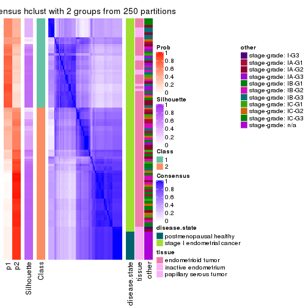</p>

</div>
<div id='tab-SD-hclust-consensus-heatmap-2'>
<pre><code class="r">consensus_heatmap(res, k = 3)
</code></pre>

<p>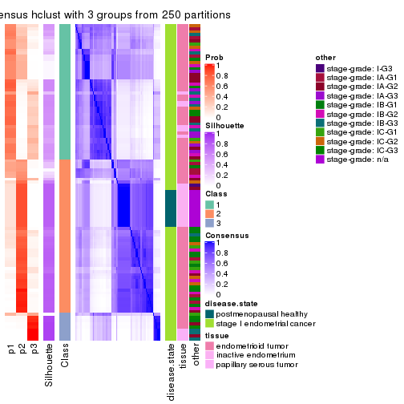</p>

</div>
<div id='tab-SD-hclust-consensus-heatmap-3'>
<pre><code class="r">consensus_heatmap(res, k = 4)
</code></pre>

<p>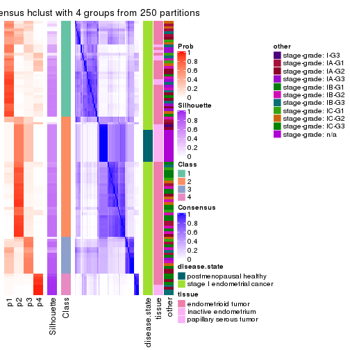</p>

</div>
<div id='tab-SD-hclust-consensus-heatmap-4'>
<pre><code class="r">consensus_heatmap(res, k = 5)
</code></pre>

<p>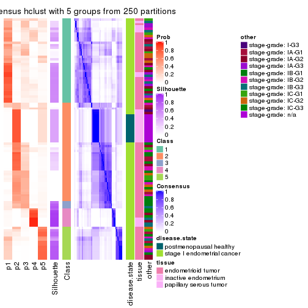</p>

</div>
<div id='tab-SD-hclust-consensus-heatmap-5'>
<pre><code class="r">consensus_heatmap(res, k = 6)
</code></pre>

<p>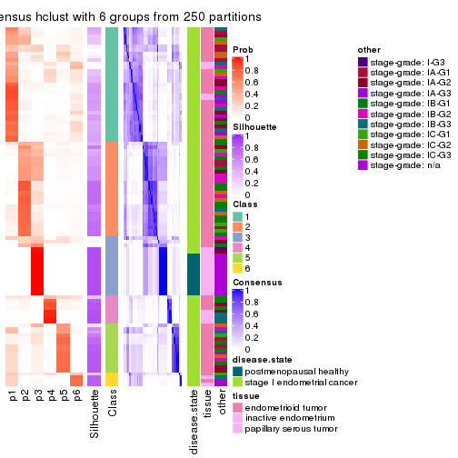</p>

</div>
</div>

Heatmaps for the membership of samples in all partitions to see how consistent they are:


<script>
$( function() {
	$( '#tabs-SD-hclust-membership-heatmap' ).tabs();
} );
</script>
<div id='tabs-SD-hclust-membership-heatmap'>
<ul>
<li><a href='#tab-SD-hclust-membership-heatmap-1'>k = 2</a></li>
<li><a href='#tab-SD-hclust-membership-heatmap-2'>k = 3</a></li>
<li><a href='#tab-SD-hclust-membership-heatmap-3'>k = 4</a></li>
<li><a href='#tab-SD-hclust-membership-heatmap-4'>k = 5</a></li>
<li><a href='#tab-SD-hclust-membership-heatmap-5'>k = 6</a></li>
</ul>
<div id='tab-SD-hclust-membership-heatmap-1'>
<pre><code class="r">membership_heatmap(res, k = 2)
</code></pre>

<p>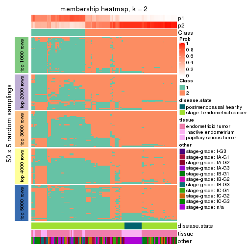</p>

</div>
<div id='tab-SD-hclust-membership-heatmap-2'>
<pre><code class="r">membership_heatmap(res, k = 3)
</code></pre>

<p>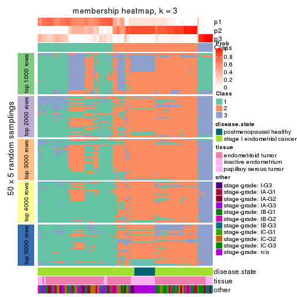</p>

</div>
<div id='tab-SD-hclust-membership-heatmap-3'>
<pre><code class="r">membership_heatmap(res, k = 4)
</code></pre>

<p>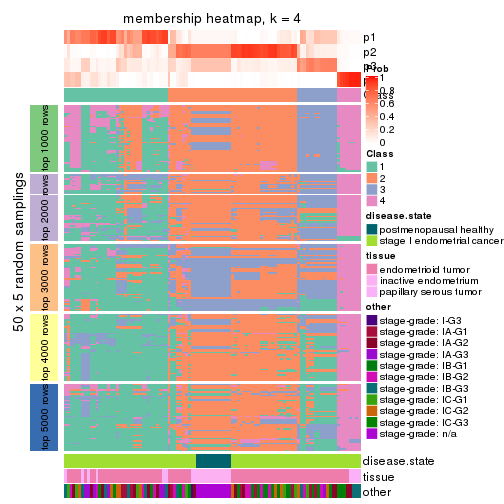</p>

</div>
<div id='tab-SD-hclust-membership-heatmap-4'>
<pre><code class="r">membership_heatmap(res, k = 5)
</code></pre>

<p>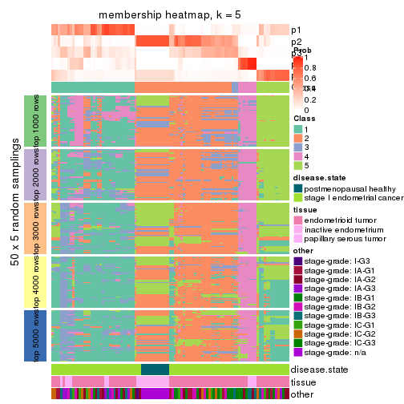</p>

</div>
<div id='tab-SD-hclust-membership-heatmap-5'>
<pre><code class="r">membership_heatmap(res, k = 6)
</code></pre>

<p>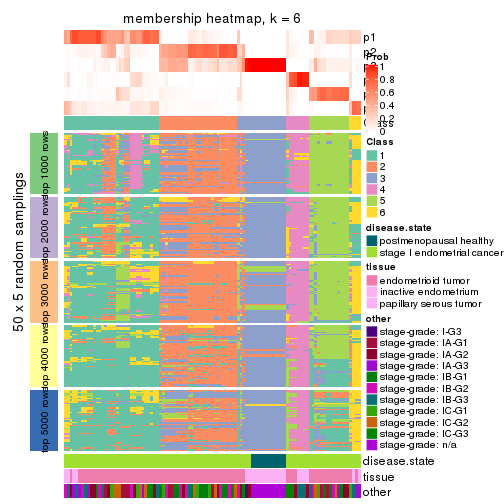</p>

</div>
</div>

As soon as we have had the classes for columns, we can look for signatures
which are significantly different between classes which can be candidate marks
for certain classes. Following are the heatmaps for signatures.


Signature heatmaps where rows are scaled:


<script>
$( function() {
	$( '#tabs-SD-hclust-get-signatures' ).tabs();
} );
</script>
<div id='tabs-SD-hclust-get-signatures'>
<ul>
<li><a href='#tab-SD-hclust-get-signatures-1'>k = 2</a></li>
<li><a href='#tab-SD-hclust-get-signatures-2'>k = 3</a></li>
<li><a href='#tab-SD-hclust-get-signatures-3'>k = 4</a></li>
<li><a href='#tab-SD-hclust-get-signatures-4'>k = 5</a></li>
<li><a href='#tab-SD-hclust-get-signatures-5'>k = 6</a></li>
</ul>
<div id='tab-SD-hclust-get-signatures-1'>
<pre><code class="r">get_signatures(res, k = 2)
</code></pre>

<p>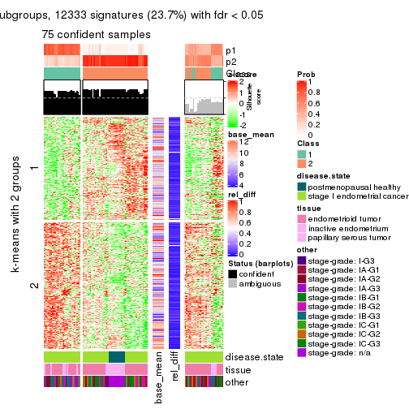</p>

</div>
<div id='tab-SD-hclust-get-signatures-2'>
<pre><code class="r">get_signatures(res, k = 3)
</code></pre>

<p>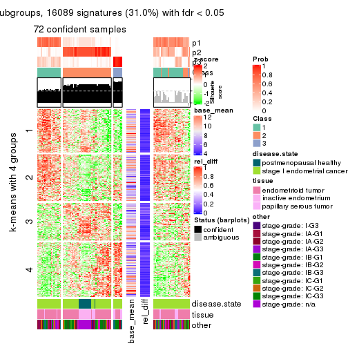</p>

</div>
<div id='tab-SD-hclust-get-signatures-3'>
<pre><code class="r">get_signatures(res, k = 4)
</code></pre>

<p>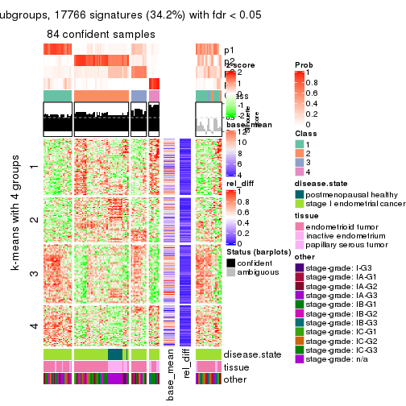</p>

</div>
<div id='tab-SD-hclust-get-signatures-4'>
<pre><code class="r">get_signatures(res, k = 5)
</code></pre>

<p>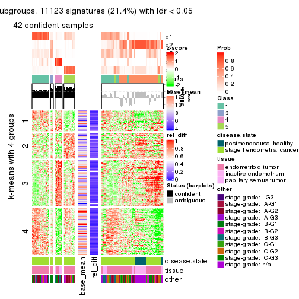</p>

</div>
<div id='tab-SD-hclust-get-signatures-5'>
<pre><code class="r">get_signatures(res, k = 6)
</code></pre>

<p>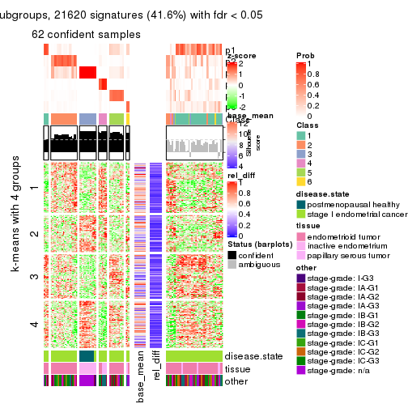</p>

</div>
</div>


Signature heatmaps where rows are not scaled:


<script>
$( function() {
	$( '#tabs-SD-hclust-get-signatures-no-scale' ).tabs();
} );
</script>
<div id='tabs-SD-hclust-get-signatures-no-scale'>
<ul>
<li><a href='#tab-SD-hclust-get-signatures-no-scale-1'>k = 2</a></li>
<li><a href='#tab-SD-hclust-get-signatures-no-scale-2'>k = 3</a></li>
<li><a href='#tab-SD-hclust-get-signatures-no-scale-3'>k = 4</a></li>
<li><a href='#tab-SD-hclust-get-signatures-no-scale-4'>k = 5</a></li>
<li><a href='#tab-SD-hclust-get-signatures-no-scale-5'>k = 6</a></li>
</ul>
<div id='tab-SD-hclust-get-signatures-no-scale-1'>
<pre><code class="r">get_signatures(res, k = 2, scale_rows = FALSE)
</code></pre>

<p>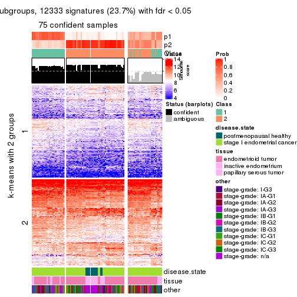</p>

</div>
<div id='tab-SD-hclust-get-signatures-no-scale-2'>
<pre><code class="r">get_signatures(res, k = 3, scale_rows = FALSE)
</code></pre>

<p>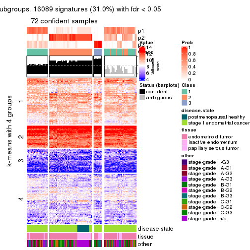</p>

</div>
<div id='tab-SD-hclust-get-signatures-no-scale-3'>
<pre><code class="r">get_signatures(res, k = 4, scale_rows = FALSE)
</code></pre>

<p>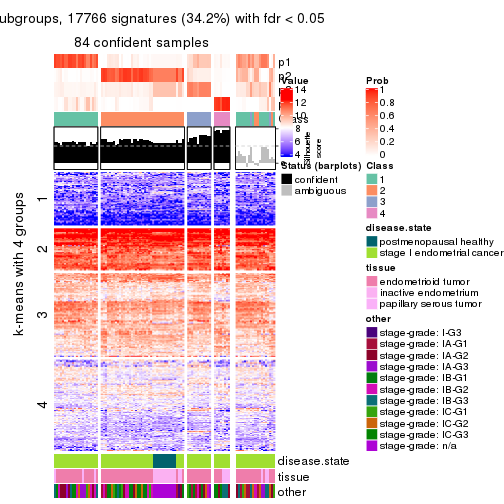</p>

</div>
<div id='tab-SD-hclust-get-signatures-no-scale-4'>
<pre><code class="r">get_signatures(res, k = 5, scale_rows = FALSE)
</code></pre>

<p>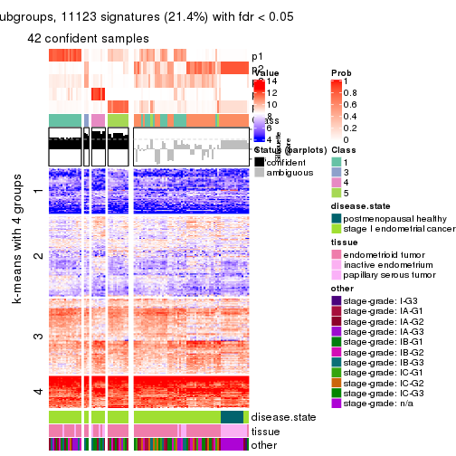</p>

</div>
<div id='tab-SD-hclust-get-signatures-no-scale-5'>
<pre><code class="r">get_signatures(res, k = 6, scale_rows = FALSE)
</code></pre>

<p>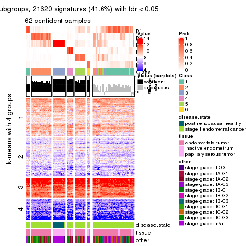</p>

</div>
</div>


Compare the overlap of signatures from different k:

```r
compare_signatures(res)
```

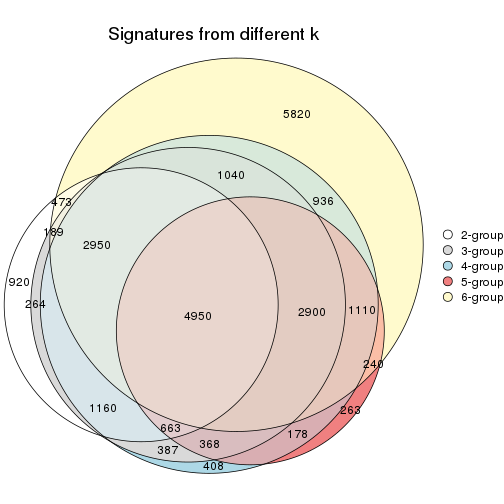

`get_signature()` returns a data frame invisibly. TO get the list of signatures, the function
call should be assigned to a variable explicitly. In following code, if `plot` argument is set
to `FALSE`, no heatmap is plotted while only the differential analysis is performed.

```r
# code only for demonstration
tb = get_signature(res, k = ..., plot = FALSE)
```

An example of the output of `tb` is:

```
#>   which_row         fdr    mean_1    mean_2 scaled_mean_1 scaled_mean_2 km
#> 1        38 0.042760348  8.373488  9.131774    -0.5533452     0.5164555  1
#> 2        40 0.018707592  7.106213  8.469186    -0.6173731     0.5762149  1
#> 3        55 0.019134737 10.221463 11.207825    -0.6159697     0.5749050  1
#> 4        59 0.006059896  5.921854  7.869574    -0.6899429     0.6439467  1
#> 5        60 0.018055526  8.928898 10.211722    -0.6204761     0.5791110  1
#> 6        98 0.009384629 15.714769 14.887706     0.6635654    -0.6193277  2
...
```

The columns in `tb` are:

1. `which_row`: row indices corresponding to the input matrix.
2. `fdr`: FDR for the differential test. 
3. `mean_x`: The mean value in group x.
4. `scaled_mean_x`: The mean value in group x after rows are scaled.
5. `km`: Row groups if k-means clustering is applied to rows.


UMAP plot which shows how samples are separated.


<script>
$( function() {
	$( '#tabs-SD-hclust-dimension-reduction' ).tabs();
} );
</script>
<div id='tabs-SD-hclust-dimension-reduction'>
<ul>
<li><a href='#tab-SD-hclust-dimension-reduction-1'>k = 2</a></li>
<li><a href='#tab-SD-hclust-dimension-reduction-2'>k = 3</a></li>
<li><a href='#tab-SD-hclust-dimension-reduction-3'>k = 4</a></li>
<li><a href='#tab-SD-hclust-dimension-reduction-4'>k = 5</a></li>
<li><a href='#tab-SD-hclust-dimension-reduction-5'>k = 6</a></li>
</ul>
<div id='tab-SD-hclust-dimension-reduction-1'>
<pre><code class="r">dimension_reduction(res, k = 2, method = &quot;UMAP&quot;)
</code></pre>

<p>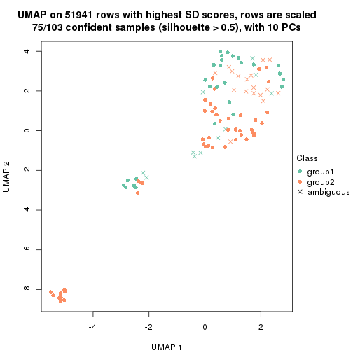</p>

</div>
<div id='tab-SD-hclust-dimension-reduction-2'>
<pre><code class="r">dimension_reduction(res, k = 3, method = &quot;UMAP&quot;)
</code></pre>

<p>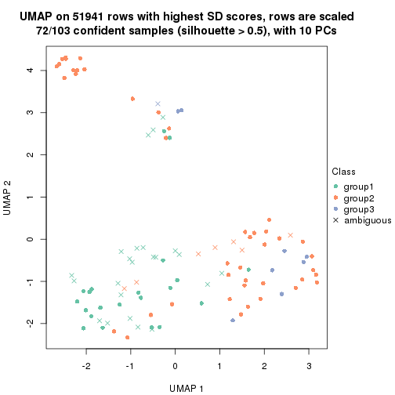</p>

</div>
<div id='tab-SD-hclust-dimension-reduction-3'>
<pre><code class="r">dimension_reduction(res, k = 4, method = &quot;UMAP&quot;)
</code></pre>

<p>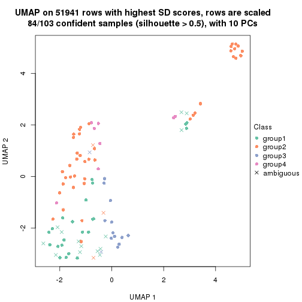</p>

</div>
<div id='tab-SD-hclust-dimension-reduction-4'>
<pre><code class="r">dimension_reduction(res, k = 5, method = &quot;UMAP&quot;)
</code></pre>

<p>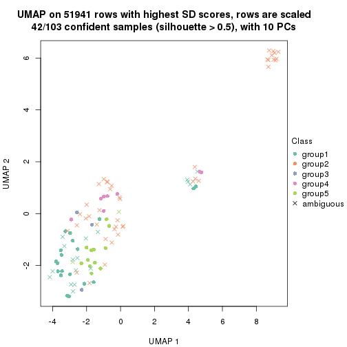</p>

</div>
<div id='tab-SD-hclust-dimension-reduction-5'>
<pre><code class="r">dimension_reduction(res, k = 6, method = &quot;UMAP&quot;)
</code></pre>

<p>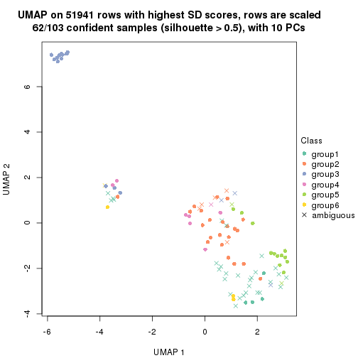</p>

</div>
</div>


Following heatmap shows how subgroups are split when increasing `k`:

```r
collect_classes(res)
```

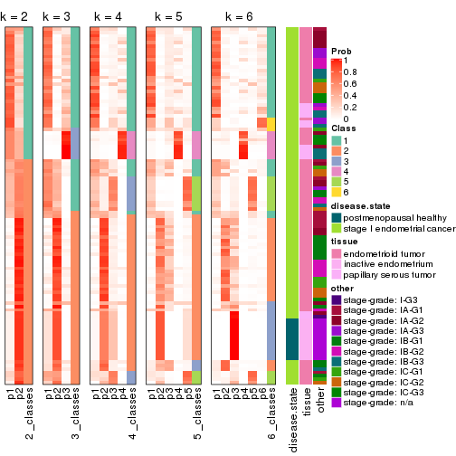


Test correlation between subgroups and known annotations. If the known
annotation is numeric, one-way ANOVA test is applied, and if the known
annotation is discrete, chi-squared contingency table test is applied.

```r
test_to_known_factors(res)
```

```
#>            n disease.state(p) tissue(p) other(p) k
#> SD:hclust 75         1.22e-02  2.31e-03 3.80e-05 2
#> SD:hclust 72         7.78e-03  1.75e-04 7.26e-04 3
#> SD:hclust 84         2.91e-03  6.61e-05 2.38e-03 4
#> SD:hclust 42               NA  1.14e-02 1.49e-01 5
#> SD:hclust 62         8.58e-10  5.28e-13 1.09e-06 6
```


If matrix rows can be associated to genes, consider to use `functional_enrichment(res,
...)` to perform function enrichment for the signature genes. See [this vignette](http://bioconductor.org/packages/devel/bioc/vignettes/cola/inst/doc/functional_enrichment.html) for more detailed explanations.


 

---------------------------------------------------


### SD:kmeans


The object with results only for a single top-value method and a single partition method 
can be extracted as:

```r
res = res_list["SD", "kmeans"]
# you can also extract it by
# res = res_list["SD:kmeans"]
```

A summary of `res` and all the functions that can be applied to it:

```r
res
```

```
#> A 'ConsensusPartition' object with k = 2, 3, 4, 5, 6.
#>   On a matrix with 51941 rows and 103 columns.
#>   Top rows (1000, 2000, 3000, 4000, 5000) are extracted by 'SD' method.
#>   Subgroups are detected by 'kmeans' method.
#>   Performed in total 1250 partitions by row resampling.
#>   Best k for subgroups seems to be 2.
#> 
#> Following methods can be applied to this 'ConsensusPartition' object:
#>  [1] "cola_report"             "collect_classes"         "collect_plots"          
#>  [4] "collect_stats"           "colnames"                "compare_signatures"     
#>  [7] "consensus_heatmap"       "dimension_reduction"     "functional_enrichment"  
#> [10] "get_anno_col"            "get_anno"                "get_classes"            
#> [13] "get_consensus"           "get_matrix"              "get_membership"         
#> [16] "get_param"               "get_signatures"          "get_stats"              
#> [19] "is_best_k"               "is_stable_k"             "membership_heatmap"     
#> [22] "ncol"                    "nrow"                    "plot_ecdf"              
#> [25] "rownames"                "select_partition_number" "show"                   
#> [28] "suggest_best_k"          "test_to_known_factors"
```

`collect_plots()` function collects all the plots made from `res` for all `k` (number of partitions)
into one single page to provide an easy and fast comparison between different `k`.

```r
collect_plots(res)
```

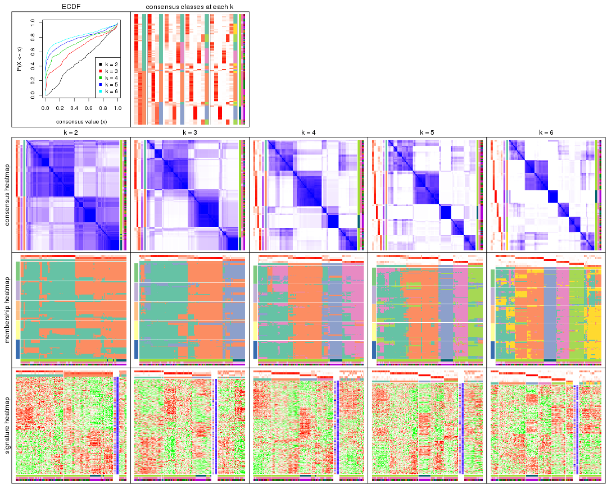

The plots are:

- The first row: a plot of the ECDF (empirical cumulative distribution
  function) curves of the consensus matrix for each `k` and the heatmap of
  predicted classes for each `k`.
- The second row: heatmaps of the consensus matrix for each `k`.
- The third row: heatmaps of the membership matrix for each `k`.
- The fouth row: heatmaps of the signatures for each `k`.

All the plots in panels can be made by individual functions and they are
plotted later in this section.

`select_partition_number()` produces several plots showing different
statistics for choosing "optimized" `k`. There are following statistics:

- ECDF curves of the consensus matrix for each `k`;
- 1-PAC. [The PAC
  score](https://en.wikipedia.org/wiki/Consensus_clustering#Over-interpretation_potential_of_consensus_clustering)
  measures the proportion of the ambiguous subgrouping.
- Mean silhouette score.
- Concordance. The mean probability of fiting the consensus class ids in all
  partitions.
- Area increased. Denote $A_k$ as the area under the ECDF curve for current
  `k`, the area increased is defined as $A_k - A_{k-1}$.
- Rand index. The percent of pairs of samples that are both in a same cluster
  or both are not in a same cluster in the partition of k and k-1.
- Jaccard index. The ratio of pairs of samples are both in a same cluster in
  the partition of k and k-1 and the pairs of samples are both in a same
  cluster in the partition k or k-1.

The detailed explanations of these statistics can be found in [the _cola_
vignette](http://bioconductor.org/packages/devel/bioc/vignettes/cola/inst/doc/cola.html#toc_13).

Generally speaking, lower PAC score, higher mean silhouette score or higher
concordance corresponds to better partition. Rand index and Jaccard index
measure how similar the current partition is compared to partition with `k-1`.
If they are too similar, we won't accept `k` is better than `k-1`.

```r
select_partition_number(res)
```

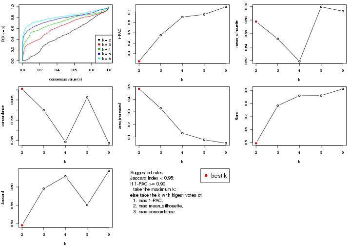

The numeric values for all these statistics can be obtained by `get_stats()`.

```r
get_stats(res)
```

```
#>   k 1-PAC mean_silhouette concordance area_increased  Rand Jaccard
#> 2 2 0.227           0.678       0.811         0.4832 0.496   0.496
#> 3 3 0.477           0.652       0.800         0.3281 0.785   0.595
#> 4 4 0.652           0.619       0.784         0.1303 0.862   0.629
#> 5 5 0.677           0.699       0.806         0.0778 0.863   0.551
#> 6 6 0.750           0.693       0.784         0.0499 0.914   0.644
```

`suggest_best_k()` suggests the best $k$ based on these statistics. The rules are as follows:

- All $k$ with Jaccard index larger than 0.95 are removed because increasing
  $k$ does not provide enough extra information. If all $k$ are removed, it is
  marked as no subgroup is detected.
- For all $k$ with 1-PAC score larger than 0.9, the maximal $k$ is taken as
  the best $k$, and other $k$ are marked as optional $k$.
- If it does not fit the second rule. The $k$ with the maximal vote of the
  highest 1-PAC score, highest mean silhouette, and highest concordance is
  taken as the best $k$.

```r
suggest_best_k(res)
```

```
#> [1] 2
```


Following shows the table of the partitions (You need to click the **show/hide
code output** link to see it). The membership matrix (columns with name `p*`)
is inferred by
[`clue::cl_consensus()`](https://www.rdocumentation.org/link/cl_consensus?package=clue)
function with the `SE` method. Basically the value in the membership matrix
represents the probability to belong to a certain group. The finall class
label for an item is determined with the group with highest probability it
belongs to.

In `get_classes()` function, the entropy is calculated from the membership
matrix and the silhouette score is calculated from the consensus matrix.


<script>
$( function() {
	$( '#tabs-SD-kmeans-get-classes' ).tabs();
} );
</script>
<div id='tabs-SD-kmeans-get-classes'>
<ul>
<li><a href='#tab-SD-kmeans-get-classes-1'>k = 2</a></li>
<li><a href='#tab-SD-kmeans-get-classes-2'>k = 3</a></li>
<li><a href='#tab-SD-kmeans-get-classes-3'>k = 4</a></li>
<li><a href='#tab-SD-kmeans-get-classes-4'>k = 5</a></li>
<li><a href='#tab-SD-kmeans-get-classes-5'>k = 6</a></li>
</ul>

<div id='tab-SD-kmeans-get-classes-1'>
<p><a id='tab-SD-kmeans-get-classes-1-a' style='color:#0366d6' href='#'>show/hide code output</a></p>
<pre><code class="r">cbind(get_classes(res, k = 2), get_membership(res, k = 2))
</code></pre>

<pre><code>#&gt;           class entropy silhouette    p1    p2
#&gt; GSM425907     2  0.3733     0.7394 0.072 0.928
#&gt; GSM425908     2  0.7883     0.6622 0.236 0.764
#&gt; GSM425909     2  0.7453     0.7419 0.212 0.788
#&gt; GSM425910     1  0.9977    -0.2309 0.528 0.472
#&gt; GSM425911     2  0.7674     0.7417 0.224 0.776
#&gt; GSM425912     2  0.9896     0.5265 0.440 0.560
#&gt; GSM425913     2  0.6623     0.7083 0.172 0.828
#&gt; GSM425914     2  0.8861     0.6904 0.304 0.696
#&gt; GSM425915     2  0.7376     0.7334 0.208 0.792
#&gt; GSM425874     1  0.7674     0.7122 0.776 0.224
#&gt; GSM425875     1  0.1633     0.7905 0.976 0.024
#&gt; GSM425876     1  0.3584     0.7757 0.932 0.068
#&gt; GSM425877     1  0.0672     0.7991 0.992 0.008
#&gt; GSM425878     1  0.1184     0.8042 0.984 0.016
#&gt; GSM425879     2  0.3584     0.7419 0.068 0.932
#&gt; GSM425880     1  0.7139     0.5997 0.804 0.196
#&gt; GSM425881     1  0.9170     0.4665 0.668 0.332
#&gt; GSM425882     2  0.7883     0.6622 0.236 0.764
#&gt; GSM425883     1  0.1633     0.8037 0.976 0.024
#&gt; GSM425884     1  0.0672     0.7991 0.992 0.008
#&gt; GSM425885     1  0.9977     0.1355 0.528 0.472
#&gt; GSM425848     1  0.6148     0.7549 0.848 0.152
#&gt; GSM425849     1  0.5178     0.7731 0.884 0.116
#&gt; GSM425850     1  0.1633     0.8018 0.976 0.024
#&gt; GSM425851     1  0.0376     0.8009 0.996 0.004
#&gt; GSM425852     1  0.7219     0.5934 0.800 0.200
#&gt; GSM425893     2  0.6343     0.7549 0.160 0.840
#&gt; GSM425894     2  0.7883     0.6622 0.236 0.764
#&gt; GSM425895     2  0.7883     0.6622 0.236 0.764
#&gt; GSM425896     2  0.2948     0.7374 0.052 0.948
#&gt; GSM425897     2  0.3584     0.7397 0.068 0.932
#&gt; GSM425898     2  0.7883     0.6622 0.236 0.764
#&gt; GSM425899     1  0.8499     0.6624 0.724 0.276
#&gt; GSM425900     2  0.8661     0.6164 0.288 0.712
#&gt; GSM425901     2  0.6801     0.7446 0.180 0.820
#&gt; GSM425902     1  0.7674     0.7122 0.776 0.224
#&gt; GSM425903     2  0.8555     0.6905 0.280 0.720
#&gt; GSM425904     1  0.7139     0.5997 0.804 0.196
#&gt; GSM425905     2  0.4939     0.7339 0.108 0.892
#&gt; GSM425906     2  0.7528     0.7051 0.216 0.784
#&gt; GSM425863     1  0.2423     0.8007 0.960 0.040
#&gt; GSM425864     2  0.3584     0.7397 0.068 0.932
#&gt; GSM425865     2  0.7453     0.6820 0.212 0.788
#&gt; GSM425866     1  0.4562     0.7267 0.904 0.096
#&gt; GSM425867     2  0.8267     0.6765 0.260 0.740
#&gt; GSM425868     2  0.7883     0.6622 0.236 0.764
#&gt; GSM425869     2  0.7883     0.6622 0.236 0.764
#&gt; GSM425870     2  0.6712     0.7324 0.176 0.824
#&gt; GSM425871     1  0.5737     0.7658 0.864 0.136
#&gt; GSM425872     2  0.7883     0.6622 0.236 0.764
#&gt; GSM425873     1  0.1843     0.8000 0.972 0.028
#&gt; GSM425843     1  0.0672     0.7991 0.992 0.008
#&gt; GSM425844     1  0.1184     0.8043 0.984 0.016
#&gt; GSM425845     1  0.9993    -0.2483 0.516 0.484
#&gt; GSM425846     1  0.8443     0.6671 0.728 0.272
#&gt; GSM425847     1  0.6438     0.6774 0.836 0.164
#&gt; GSM425886     2  0.6343     0.7502 0.160 0.840
#&gt; GSM425887     1  0.9954    -0.0233 0.540 0.460
#&gt; GSM425888     1  0.8661     0.5791 0.712 0.288
#&gt; GSM425889     1  0.6438     0.7471 0.836 0.164
#&gt; GSM425890     1  0.7674     0.7122 0.776 0.224
#&gt; GSM425891     2  0.5946     0.7252 0.144 0.856
#&gt; GSM425892     2  0.7883     0.6622 0.236 0.764
#&gt; GSM425853     1  0.0938     0.7977 0.988 0.012
#&gt; GSM425854     2  0.7883     0.6622 0.236 0.764
#&gt; GSM425855     1  0.2236     0.8016 0.964 0.036
#&gt; GSM425856     1  0.4562     0.7267 0.904 0.096
#&gt; GSM425857     2  0.6148     0.7333 0.152 0.848
#&gt; GSM425858     2  0.9977     0.0634 0.472 0.528
#&gt; GSM425859     2  0.7883     0.6622 0.236 0.764
#&gt; GSM425860     2  0.9710     0.5706 0.400 0.600
#&gt; GSM425861     1  0.6048     0.7607 0.852 0.148
#&gt; GSM425862     1  0.6531     0.7444 0.832 0.168
#&gt; GSM425837     1  0.0376     0.8009 0.996 0.004
#&gt; GSM425838     1  0.7674     0.7122 0.776 0.224
#&gt; GSM425839     2  0.7883     0.6622 0.236 0.764
#&gt; GSM425840     1  0.0000     0.8020 1.000 0.000
#&gt; GSM425841     1  0.7674     0.7122 0.776 0.224
#&gt; GSM425842     1  0.1414     0.8012 0.980 0.020
#&gt; GSM425917     2  0.9170     0.6940 0.332 0.668
#&gt; GSM425922     1  0.7674     0.7122 0.776 0.224
#&gt; GSM425919     1  0.0672     0.7991 0.992 0.008
#&gt; GSM425920     1  0.0376     0.8009 0.996 0.004
#&gt; GSM425923     1  0.0938     0.8042 0.988 0.012
#&gt; GSM425916     1  0.0376     0.8009 0.996 0.004
#&gt; GSM425918     1  0.0938     0.8042 0.988 0.012
#&gt; GSM425921     1  0.7674     0.7122 0.776 0.224
#&gt; GSM425925     1  0.6531     0.7444 0.832 0.168
#&gt; GSM425926     1  0.7602     0.7153 0.780 0.220
#&gt; GSM425927     1  0.0672     0.7991 0.992 0.008
#&gt; GSM425924     1  0.9815     0.0875 0.580 0.420
#&gt; GSM425928     2  0.7376     0.7272 0.208 0.792
#&gt; GSM425929     2  0.7376     0.7272 0.208 0.792
#&gt; GSM425930     2  0.7376     0.7272 0.208 0.792
#&gt; GSM425931     2  0.7376     0.7272 0.208 0.792
#&gt; GSM425932     2  0.7376     0.7272 0.208 0.792
#&gt; GSM425933     2  0.7376     0.7272 0.208 0.792
#&gt; GSM425934     2  0.7056     0.7309 0.192 0.808
#&gt; GSM425935     2  0.6247     0.7389 0.156 0.844
#&gt; GSM425936     2  0.7376     0.7272 0.208 0.792
#&gt; GSM425937     2  0.7376     0.7272 0.208 0.792
#&gt; GSM425938     2  0.7376     0.7272 0.208 0.792
#&gt; GSM425939     2  0.7376     0.7272 0.208 0.792
</code></pre>

<script>
$('#tab-SD-kmeans-get-classes-1-a').parent().next().next().hide();
$('#tab-SD-kmeans-get-classes-1-a').click(function(){
  $('#tab-SD-kmeans-get-classes-1-a').parent().next().next().toggle();
  return(false);
});
</script>
</div>

<div id='tab-SD-kmeans-get-classes-2'>
<p><a id='tab-SD-kmeans-get-classes-2-a' style='color:#0366d6' href='#'>show/hide code output</a></p>
<pre><code class="r">cbind(get_classes(res, k = 3), get_membership(res, k = 3))
</code></pre>

<pre><code>#&gt;           class entropy silhouette    p1    p2    p3
#&gt; GSM425907     2  0.0475   7.94e-01 0.004 0.992 0.004
#&gt; GSM425908     2  0.1129   8.01e-01 0.020 0.976 0.004
#&gt; GSM425909     3  0.6659   6.65e-01 0.028 0.304 0.668
#&gt; GSM425910     1  0.7360   9.64e-05 0.528 0.440 0.032
#&gt; GSM425911     2  0.0000   7.93e-01 0.000 1.000 0.000
#&gt; GSM425912     2  0.6798   3.43e-01 0.400 0.584 0.016
#&gt; GSM425913     2  0.0661   7.97e-01 0.008 0.988 0.004
#&gt; GSM425914     2  0.6529   4.05e-01 0.368 0.620 0.012
#&gt; GSM425915     3  0.5860   7.61e-01 0.024 0.228 0.748
#&gt; GSM425874     1  0.8622   4.58e-01 0.572 0.296 0.132
#&gt; GSM425875     1  0.5012   6.60e-01 0.788 0.008 0.204
#&gt; GSM425876     1  0.5253   6.05e-01 0.792 0.188 0.020
#&gt; GSM425877     1  0.1031   7.70e-01 0.976 0.000 0.024
#&gt; GSM425878     1  0.0892   7.65e-01 0.980 0.000 0.020
#&gt; GSM425879     2  0.0237   7.92e-01 0.000 0.996 0.004
#&gt; GSM425880     1  0.6540   3.65e-01 0.584 0.008 0.408
#&gt; GSM425881     2  0.7063   2.15e-01 0.464 0.516 0.020
#&gt; GSM425882     2  0.1877   7.91e-01 0.032 0.956 0.012
#&gt; GSM425883     1  0.3340   7.53e-01 0.880 0.000 0.120
#&gt; GSM425884     1  0.0892   7.65e-01 0.980 0.000 0.020
#&gt; GSM425885     2  0.9070  -1.73e-01 0.428 0.436 0.136
#&gt; GSM425848     1  0.4915   7.33e-01 0.832 0.036 0.132
#&gt; GSM425849     1  0.1525   7.67e-01 0.964 0.004 0.032
#&gt; GSM425850     1  0.1636   7.61e-01 0.964 0.016 0.020
#&gt; GSM425851     1  0.2796   7.58e-01 0.908 0.000 0.092
#&gt; GSM425852     1  0.6467   3.70e-01 0.604 0.008 0.388
#&gt; GSM425893     2  0.0237   7.92e-01 0.000 0.996 0.004
#&gt; GSM425894     2  0.1129   8.01e-01 0.020 0.976 0.004
#&gt; GSM425895     2  0.1129   8.01e-01 0.020 0.976 0.004
#&gt; GSM425896     2  0.0237   7.92e-01 0.000 0.996 0.004
#&gt; GSM425897     2  0.0237   7.92e-01 0.000 0.996 0.004
#&gt; GSM425898     2  0.1129   8.01e-01 0.020 0.976 0.004
#&gt; GSM425899     2  0.5486   6.62e-01 0.196 0.780 0.024
#&gt; GSM425900     2  0.2959   7.50e-01 0.100 0.900 0.000
#&gt; GSM425901     3  0.6659   6.65e-01 0.028 0.304 0.668
#&gt; GSM425902     1  0.8622   4.58e-01 0.572 0.296 0.132
#&gt; GSM425903     3  0.8464   4.10e-01 0.280 0.128 0.592
#&gt; GSM425904     1  0.6553   3.57e-01 0.580 0.008 0.412
#&gt; GSM425905     2  0.0475   7.94e-01 0.004 0.992 0.004
#&gt; GSM425906     2  0.0747   7.97e-01 0.016 0.984 0.000
#&gt; GSM425863     1  0.0747   7.69e-01 0.984 0.000 0.016
#&gt; GSM425864     2  0.0237   7.92e-01 0.000 0.996 0.004
#&gt; GSM425865     2  0.0661   7.97e-01 0.008 0.988 0.004
#&gt; GSM425866     1  0.6318   4.61e-01 0.636 0.008 0.356
#&gt; GSM425867     3  0.5000   6.71e-01 0.124 0.044 0.832
#&gt; GSM425868     2  0.3973   7.31e-01 0.032 0.880 0.088
#&gt; GSM425869     2  0.1315   8.00e-01 0.020 0.972 0.008
#&gt; GSM425870     3  0.6890   7.41e-01 0.028 0.340 0.632
#&gt; GSM425871     1  0.2400   7.65e-01 0.932 0.004 0.064
#&gt; GSM425872     2  0.1129   8.01e-01 0.020 0.976 0.004
#&gt; GSM425873     1  0.1636   7.62e-01 0.964 0.016 0.020
#&gt; GSM425843     1  0.0892   7.65e-01 0.980 0.000 0.020
#&gt; GSM425844     1  0.2711   7.59e-01 0.912 0.000 0.088
#&gt; GSM425845     1  0.9285   8.07e-02 0.448 0.160 0.392
#&gt; GSM425846     2  0.5384   6.66e-01 0.188 0.788 0.024
#&gt; GSM425847     1  0.6849   1.77e-01 0.600 0.380 0.020
#&gt; GSM425886     3  0.5948   6.52e-01 0.000 0.360 0.640
#&gt; GSM425887     2  0.6869   3.09e-01 0.424 0.560 0.016
#&gt; GSM425888     2  0.6952   1.79e-01 0.480 0.504 0.016
#&gt; GSM425889     1  0.3784   7.49e-01 0.864 0.004 0.132
#&gt; GSM425890     1  0.8435   4.79e-01 0.592 0.284 0.124
#&gt; GSM425891     2  0.0424   7.98e-01 0.008 0.992 0.000
#&gt; GSM425892     2  0.1129   8.01e-01 0.020 0.976 0.004
#&gt; GSM425853     1  0.2280   7.53e-01 0.940 0.008 0.052
#&gt; GSM425854     2  0.0892   8.00e-01 0.020 0.980 0.000
#&gt; GSM425855     1  0.1031   7.70e-01 0.976 0.000 0.024
#&gt; GSM425856     1  0.6318   4.61e-01 0.636 0.008 0.356
#&gt; GSM425857     3  0.7715   4.02e-01 0.048 0.428 0.524
#&gt; GSM425858     2  0.5723   6.17e-01 0.240 0.744 0.016
#&gt; GSM425859     2  0.1129   8.01e-01 0.020 0.976 0.004
#&gt; GSM425860     2  0.8059   1.74e-01 0.444 0.492 0.064
#&gt; GSM425861     1  0.6627   3.09e-01 0.644 0.336 0.020
#&gt; GSM425862     1  0.3784   7.49e-01 0.864 0.004 0.132
#&gt; GSM425837     1  0.0892   7.69e-01 0.980 0.000 0.020
#&gt; GSM425838     1  0.8512   4.60e-01 0.580 0.296 0.124
#&gt; GSM425839     2  0.1129   8.01e-01 0.020 0.976 0.004
#&gt; GSM425840     1  0.0592   7.68e-01 0.988 0.000 0.012
#&gt; GSM425841     1  0.8622   4.58e-01 0.572 0.296 0.132
#&gt; GSM425842     1  0.1129   7.64e-01 0.976 0.004 0.020
#&gt; GSM425917     3  0.8901   5.27e-01 0.232 0.196 0.572
#&gt; GSM425922     1  0.8546   4.77e-01 0.584 0.284 0.132
#&gt; GSM425919     1  0.0892   7.65e-01 0.980 0.000 0.020
#&gt; GSM425920     1  0.1163   7.69e-01 0.972 0.000 0.028
#&gt; GSM425923     1  0.3192   7.53e-01 0.888 0.000 0.112
#&gt; GSM425916     1  0.2796   7.58e-01 0.908 0.000 0.092
#&gt; GSM425918     1  0.2959   7.55e-01 0.900 0.000 0.100
#&gt; GSM425921     1  0.8546   4.77e-01 0.584 0.284 0.132
#&gt; GSM425925     1  0.3784   7.49e-01 0.864 0.004 0.132
#&gt; GSM425926     1  0.8520   4.82e-01 0.588 0.280 0.132
#&gt; GSM425927     1  0.1129   7.64e-01 0.976 0.004 0.020
#&gt; GSM425924     3  0.8630   3.68e-01 0.328 0.120 0.552
#&gt; GSM425928     3  0.5578   8.34e-01 0.012 0.240 0.748
#&gt; GSM425929     3  0.5578   8.34e-01 0.012 0.240 0.748
#&gt; GSM425930     3  0.5578   8.34e-01 0.012 0.240 0.748
#&gt; GSM425931     3  0.5578   8.34e-01 0.012 0.240 0.748
#&gt; GSM425932     3  0.5578   8.34e-01 0.012 0.240 0.748
#&gt; GSM425933     3  0.5578   8.34e-01 0.012 0.240 0.748
#&gt; GSM425934     3  0.5325   8.26e-01 0.004 0.248 0.748
#&gt; GSM425935     3  0.5578   8.34e-01 0.012 0.240 0.748
#&gt; GSM425936     3  0.5578   8.34e-01 0.012 0.240 0.748
#&gt; GSM425937     3  0.5578   8.34e-01 0.012 0.240 0.748
#&gt; GSM425938     3  0.5578   8.34e-01 0.012 0.240 0.748
#&gt; GSM425939     3  0.5578   8.34e-01 0.012 0.240 0.748
</code></pre>

<script>
$('#tab-SD-kmeans-get-classes-2-a').parent().next().next().hide();
$('#tab-SD-kmeans-get-classes-2-a').click(function(){
  $('#tab-SD-kmeans-get-classes-2-a').parent().next().next().toggle();
  return(false);
});
</script>
</div>

<div id='tab-SD-kmeans-get-classes-3'>
<p><a id='tab-SD-kmeans-get-classes-3-a' style='color:#0366d6' href='#'>show/hide code output</a></p>
<pre><code class="r">cbind(get_classes(res, k = 4), get_membership(res, k = 4))
</code></pre>

<pre><code>#&gt;           class entropy silhouette    p1    p2    p3    p4
#&gt; GSM425907     2  0.0804     0.8662 0.012 0.980 0.000 0.008
#&gt; GSM425908     2  0.0804     0.8662 0.012 0.980 0.000 0.008
#&gt; GSM425909     3  0.7782     0.5193 0.268 0.212 0.508 0.012
#&gt; GSM425910     1  0.4877     0.5234 0.752 0.204 0.000 0.044
#&gt; GSM425911     2  0.2011     0.8438 0.080 0.920 0.000 0.000
#&gt; GSM425912     2  0.6137     0.1488 0.448 0.504 0.000 0.048
#&gt; GSM425913     2  0.1022     0.8642 0.032 0.968 0.000 0.000
#&gt; GSM425914     2  0.5686     0.4008 0.376 0.592 0.000 0.032
#&gt; GSM425915     3  0.7380     0.5190 0.288 0.200 0.512 0.000
#&gt; GSM425874     4  0.2011     0.7390 0.000 0.080 0.000 0.920
#&gt; GSM425875     1  0.4781     0.5191 0.796 0.004 0.088 0.112
#&gt; GSM425876     1  0.5396     0.5436 0.740 0.156 0.000 0.104
#&gt; GSM425877     4  0.5292    -0.2280 0.480 0.000 0.008 0.512
#&gt; GSM425878     1  0.4564     0.5401 0.672 0.000 0.000 0.328
#&gt; GSM425879     2  0.1211     0.8630 0.040 0.960 0.000 0.000
#&gt; GSM425880     1  0.4867     0.5137 0.784 0.004 0.144 0.068
#&gt; GSM425881     2  0.6147     0.1037 0.464 0.488 0.000 0.048
#&gt; GSM425882     2  0.1716     0.8604 0.064 0.936 0.000 0.000
#&gt; GSM425883     4  0.3933     0.5940 0.200 0.000 0.008 0.792
#&gt; GSM425884     1  0.4543     0.5441 0.676 0.000 0.000 0.324
#&gt; GSM425885     4  0.3074     0.6636 0.000 0.152 0.000 0.848
#&gt; GSM425848     4  0.1545     0.7399 0.040 0.008 0.000 0.952
#&gt; GSM425849     1  0.4888     0.4702 0.588 0.000 0.000 0.412
#&gt; GSM425850     1  0.4797     0.5657 0.720 0.020 0.000 0.260
#&gt; GSM425851     4  0.4769     0.4618 0.308 0.000 0.008 0.684
#&gt; GSM425852     1  0.4037     0.5289 0.832 0.000 0.112 0.056
#&gt; GSM425893     2  0.2149     0.8362 0.088 0.912 0.000 0.000
#&gt; GSM425894     2  0.0895     0.8660 0.004 0.976 0.000 0.020
#&gt; GSM425895     2  0.0804     0.8694 0.008 0.980 0.000 0.012
#&gt; GSM425896     2  0.0657     0.8670 0.012 0.984 0.000 0.004
#&gt; GSM425897     2  0.0592     0.8678 0.016 0.984 0.000 0.000
#&gt; GSM425898     2  0.0779     0.8675 0.004 0.980 0.000 0.016
#&gt; GSM425899     2  0.2882     0.8247 0.084 0.892 0.000 0.024
#&gt; GSM425900     2  0.2125     0.8495 0.076 0.920 0.000 0.004
#&gt; GSM425901     3  0.7782     0.5193 0.268 0.212 0.508 0.012
#&gt; GSM425902     4  0.2149     0.7341 0.000 0.088 0.000 0.912
#&gt; GSM425903     1  0.5990     0.0165 0.608 0.056 0.336 0.000
#&gt; GSM425904     1  0.4916     0.5106 0.780 0.004 0.148 0.068
#&gt; GSM425905     2  0.0188     0.8690 0.004 0.996 0.000 0.000
#&gt; GSM425906     2  0.1557     0.8580 0.056 0.944 0.000 0.000
#&gt; GSM425863     1  0.4967     0.4032 0.548 0.000 0.000 0.452
#&gt; GSM425864     2  0.0469     0.8676 0.012 0.988 0.000 0.000
#&gt; GSM425865     2  0.0657     0.8670 0.012 0.984 0.000 0.004
#&gt; GSM425866     1  0.4592     0.5242 0.804 0.004 0.128 0.064
#&gt; GSM425867     3  0.4843     0.4519 0.396 0.000 0.604 0.000
#&gt; GSM425868     2  0.1302     0.8559 0.000 0.956 0.000 0.044
#&gt; GSM425869     2  0.1022     0.8623 0.000 0.968 0.000 0.032
#&gt; GSM425870     3  0.7728     0.2833 0.232 0.352 0.416 0.000
#&gt; GSM425871     1  0.5163     0.1669 0.516 0.000 0.004 0.480
#&gt; GSM425872     2  0.0779     0.8675 0.004 0.980 0.000 0.016
#&gt; GSM425873     1  0.4767     0.5656 0.724 0.020 0.000 0.256
#&gt; GSM425843     1  0.4643     0.5287 0.656 0.000 0.000 0.344
#&gt; GSM425844     4  0.5007     0.3573 0.356 0.000 0.008 0.636
#&gt; GSM425845     1  0.3377     0.5118 0.848 0.012 0.140 0.000
#&gt; GSM425846     2  0.3161     0.8153 0.124 0.864 0.000 0.012
#&gt; GSM425847     1  0.5677     0.4919 0.680 0.256 0.000 0.064
#&gt; GSM425886     3  0.7421     0.5224 0.268 0.220 0.512 0.000
#&gt; GSM425887     2  0.6052     0.2994 0.396 0.556 0.000 0.048
#&gt; GSM425888     2  0.6271     0.1297 0.452 0.492 0.000 0.056
#&gt; GSM425889     4  0.0817     0.7407 0.024 0.000 0.000 0.976
#&gt; GSM425890     4  0.2302     0.7506 0.008 0.060 0.008 0.924
#&gt; GSM425891     2  0.1022     0.8642 0.032 0.968 0.000 0.000
#&gt; GSM425892     2  0.0804     0.8662 0.012 0.980 0.000 0.008
#&gt; GSM425853     1  0.4122     0.5772 0.760 0.000 0.004 0.236
#&gt; GSM425854     2  0.0927     0.8684 0.008 0.976 0.000 0.016
#&gt; GSM425855     4  0.4967    -0.1617 0.452 0.000 0.000 0.548
#&gt; GSM425856     1  0.4644     0.5224 0.800 0.004 0.132 0.064
#&gt; GSM425857     1  0.9995    -0.3031 0.264 0.244 0.240 0.252
#&gt; GSM425858     2  0.3501     0.7995 0.132 0.848 0.000 0.020
#&gt; GSM425859     2  0.0707     0.8655 0.000 0.980 0.000 0.020
#&gt; GSM425860     1  0.5592     0.4267 0.656 0.300 0.000 0.044
#&gt; GSM425861     1  0.6316     0.4351 0.612 0.300 0.000 0.088
#&gt; GSM425862     4  0.0817     0.7407 0.024 0.000 0.000 0.976
#&gt; GSM425837     1  0.4916     0.4448 0.576 0.000 0.000 0.424
#&gt; GSM425838     4  0.2342     0.7418 0.008 0.080 0.000 0.912
#&gt; GSM425839     2  0.0657     0.8683 0.004 0.984 0.000 0.012
#&gt; GSM425840     1  0.4790     0.4932 0.620 0.000 0.000 0.380
#&gt; GSM425841     4  0.2011     0.7390 0.000 0.080 0.000 0.920
#&gt; GSM425842     1  0.4331     0.5589 0.712 0.000 0.000 0.288
#&gt; GSM425917     3  0.7043     0.5544 0.060 0.080 0.652 0.208
#&gt; GSM425922     4  0.1637     0.7495 0.000 0.060 0.000 0.940
#&gt; GSM425919     1  0.4917     0.5291 0.656 0.000 0.008 0.336
#&gt; GSM425920     1  0.5244     0.3289 0.556 0.000 0.008 0.436
#&gt; GSM425923     4  0.3545     0.6359 0.164 0.000 0.008 0.828
#&gt; GSM425916     4  0.4769     0.4618 0.308 0.000 0.008 0.684
#&gt; GSM425918     4  0.4567     0.5093 0.276 0.000 0.008 0.716
#&gt; GSM425921     4  0.1637     0.7495 0.000 0.060 0.000 0.940
#&gt; GSM425925     4  0.0336     0.7432 0.008 0.000 0.000 0.992
#&gt; GSM425926     4  0.1637     0.7495 0.000 0.060 0.000 0.940
#&gt; GSM425927     1  0.4454     0.5536 0.692 0.000 0.000 0.308
#&gt; GSM425924     3  0.7598     0.3636 0.164 0.028 0.576 0.232
#&gt; GSM425928     3  0.2081     0.8102 0.000 0.084 0.916 0.000
#&gt; GSM425929     3  0.2081     0.8102 0.000 0.084 0.916 0.000
#&gt; GSM425930     3  0.2081     0.8102 0.000 0.084 0.916 0.000
#&gt; GSM425931     3  0.2081     0.8102 0.000 0.084 0.916 0.000
#&gt; GSM425932     3  0.2081     0.8102 0.000 0.084 0.916 0.000
#&gt; GSM425933     3  0.2081     0.8102 0.000 0.084 0.916 0.000
#&gt; GSM425934     3  0.2081     0.8102 0.000 0.084 0.916 0.000
#&gt; GSM425935     3  0.2081     0.8102 0.000 0.084 0.916 0.000
#&gt; GSM425936     3  0.2081     0.8102 0.000 0.084 0.916 0.000
#&gt; GSM425937     3  0.2081     0.8102 0.000 0.084 0.916 0.000
#&gt; GSM425938     3  0.2081     0.8102 0.000 0.084 0.916 0.000
#&gt; GSM425939     3  0.2081     0.8102 0.000 0.084 0.916 0.000
</code></pre>

<script>
$('#tab-SD-kmeans-get-classes-3-a').parent().next().next().hide();
$('#tab-SD-kmeans-get-classes-3-a').click(function(){
  $('#tab-SD-kmeans-get-classes-3-a').parent().next().next().toggle();
  return(false);
});
</script>
</div>

<div id='tab-SD-kmeans-get-classes-4'>
<p><a id='tab-SD-kmeans-get-classes-4-a' style='color:#0366d6' href='#'>show/hide code output</a></p>
<pre><code class="r">cbind(get_classes(res, k = 5), get_membership(res, k = 5))
</code></pre>

<pre><code>#&gt;           class entropy silhouette    p1    p2    p3    p4    p5
#&gt; GSM425907     2  0.3609     0.8486 0.036 0.836 0.000 0.016 0.112
#&gt; GSM425908     2  0.3609     0.8486 0.036 0.836 0.000 0.016 0.112
#&gt; GSM425909     5  0.4801     0.7257 0.000 0.064 0.204 0.008 0.724
#&gt; GSM425910     1  0.2761     0.5971 0.872 0.024 0.000 0.000 0.104
#&gt; GSM425911     2  0.4587     0.8031 0.096 0.744 0.000 0.000 0.160
#&gt; GSM425912     1  0.5607     0.1444 0.540 0.380 0.000 0.000 0.080
#&gt; GSM425913     2  0.1018     0.8676 0.016 0.968 0.000 0.000 0.016
#&gt; GSM425914     2  0.6299     0.3459 0.380 0.464 0.000 0.000 0.156
#&gt; GSM425915     5  0.4539     0.7259 0.008 0.044 0.212 0.000 0.736
#&gt; GSM425874     4  0.0510     0.8660 0.000 0.016 0.000 0.984 0.000
#&gt; GSM425875     5  0.5106     0.7394 0.260 0.000 0.012 0.052 0.676
#&gt; GSM425876     1  0.1788     0.6307 0.932 0.008 0.000 0.004 0.056
#&gt; GSM425877     1  0.6186     0.4169 0.548 0.000 0.004 0.300 0.148
#&gt; GSM425878     1  0.2761     0.6626 0.872 0.000 0.000 0.104 0.024
#&gt; GSM425879     2  0.3192     0.8504 0.040 0.848 0.000 0.000 0.112
#&gt; GSM425880     5  0.5103     0.7803 0.244 0.000 0.052 0.016 0.688
#&gt; GSM425881     1  0.5359     0.1605 0.532 0.412 0.000 0.000 0.056
#&gt; GSM425882     2  0.3164     0.8537 0.044 0.852 0.000 0.000 0.104
#&gt; GSM425883     4  0.5756     0.2439 0.312 0.000 0.000 0.576 0.112
#&gt; GSM425884     1  0.3222     0.6603 0.852 0.000 0.004 0.108 0.036
#&gt; GSM425885     4  0.2623     0.7796 0.004 0.096 0.000 0.884 0.016
#&gt; GSM425848     4  0.3154     0.7987 0.104 0.012 0.000 0.860 0.024
#&gt; GSM425849     1  0.4181     0.5724 0.712 0.000 0.000 0.268 0.020
#&gt; GSM425850     1  0.2459     0.6549 0.904 0.004 0.000 0.040 0.052
#&gt; GSM425851     1  0.6437     0.1913 0.464 0.000 0.004 0.376 0.156
#&gt; GSM425852     5  0.4587     0.7223 0.276 0.000 0.024 0.008 0.692
#&gt; GSM425893     2  0.3710     0.8360 0.048 0.808 0.000 0.000 0.144
#&gt; GSM425894     2  0.0671     0.8651 0.004 0.980 0.000 0.016 0.000
#&gt; GSM425895     2  0.0451     0.8659 0.004 0.988 0.000 0.008 0.000
#&gt; GSM425896     2  0.3609     0.8486 0.036 0.836 0.000 0.016 0.112
#&gt; GSM425897     2  0.3115     0.8507 0.036 0.852 0.000 0.000 0.112
#&gt; GSM425898     2  0.0867     0.8638 0.008 0.976 0.000 0.008 0.008
#&gt; GSM425899     2  0.2213     0.8465 0.040 0.924 0.004 0.016 0.016
#&gt; GSM425900     2  0.2632     0.8171 0.072 0.888 0.000 0.000 0.040
#&gt; GSM425901     5  0.4801     0.7257 0.000 0.064 0.204 0.008 0.724
#&gt; GSM425902     4  0.1124     0.8569 0.000 0.036 0.000 0.960 0.004
#&gt; GSM425903     5  0.4735     0.7819 0.132 0.012 0.100 0.000 0.756
#&gt; GSM425904     5  0.5176     0.7844 0.236 0.000 0.060 0.016 0.688
#&gt; GSM425905     2  0.2707     0.8629 0.024 0.888 0.000 0.008 0.080
#&gt; GSM425906     2  0.2830     0.8083 0.080 0.876 0.000 0.000 0.044
#&gt; GSM425863     1  0.4668     0.4712 0.624 0.000 0.000 0.352 0.024
#&gt; GSM425864     2  0.3396     0.8506 0.036 0.844 0.000 0.008 0.112
#&gt; GSM425865     2  0.3396     0.8506 0.036 0.844 0.000 0.008 0.112
#&gt; GSM425866     5  0.5138     0.7725 0.260 0.000 0.048 0.016 0.676
#&gt; GSM425867     5  0.4866     0.6853 0.052 0.000 0.284 0.000 0.664
#&gt; GSM425868     2  0.1012     0.8663 0.000 0.968 0.000 0.020 0.012
#&gt; GSM425869     2  0.0671     0.8659 0.000 0.980 0.000 0.016 0.004
#&gt; GSM425870     2  0.8213     0.2622 0.164 0.388 0.172 0.000 0.276
#&gt; GSM425871     1  0.3326     0.6495 0.824 0.000 0.000 0.152 0.024
#&gt; GSM425872     2  0.0867     0.8638 0.008 0.976 0.000 0.008 0.008
#&gt; GSM425873     1  0.2299     0.6507 0.912 0.004 0.000 0.032 0.052
#&gt; GSM425843     1  0.3595     0.6550 0.828 0.000 0.004 0.120 0.048
#&gt; GSM425844     1  0.6109     0.3137 0.532 0.000 0.000 0.320 0.148
#&gt; GSM425845     5  0.4481     0.7557 0.232 0.000 0.048 0.000 0.720
#&gt; GSM425846     2  0.2260     0.8427 0.048 0.920 0.004 0.012 0.016
#&gt; GSM425847     1  0.4010     0.5605 0.784 0.160 0.000 0.000 0.056
#&gt; GSM425886     5  0.4801     0.7257 0.000 0.064 0.204 0.008 0.724
#&gt; GSM425887     2  0.5304     0.2892 0.384 0.560 0.000 0.000 0.056
#&gt; GSM425888     1  0.5337     0.1270 0.508 0.440 0.000 0.000 0.052
#&gt; GSM425889     4  0.1965     0.8446 0.052 0.000 0.000 0.924 0.024
#&gt; GSM425890     4  0.2899     0.8014 0.028 0.004 0.000 0.872 0.096
#&gt; GSM425891     2  0.1753     0.8690 0.032 0.936 0.000 0.000 0.032
#&gt; GSM425892     2  0.3507     0.8521 0.036 0.844 0.000 0.016 0.104
#&gt; GSM425853     1  0.2974     0.6411 0.868 0.000 0.000 0.052 0.080
#&gt; GSM425854     2  0.0451     0.8659 0.004 0.988 0.000 0.008 0.000
#&gt; GSM425855     1  0.5113     0.4208 0.576 0.000 0.000 0.380 0.044
#&gt; GSM425856     5  0.5138     0.7725 0.260 0.000 0.048 0.016 0.676
#&gt; GSM425857     5  0.5591     0.7138 0.000 0.084 0.100 0.096 0.720
#&gt; GSM425858     2  0.3289     0.7796 0.108 0.844 0.000 0.000 0.048
#&gt; GSM425859     2  0.0671     0.8659 0.000 0.980 0.000 0.016 0.004
#&gt; GSM425860     1  0.4605     0.5123 0.732 0.192 0.000 0.000 0.076
#&gt; GSM425861     1  0.4969     0.4628 0.652 0.292 0.000 0.000 0.056
#&gt; GSM425862     4  0.1965     0.8446 0.052 0.000 0.000 0.924 0.024
#&gt; GSM425837     1  0.4798     0.5616 0.684 0.000 0.004 0.268 0.044
#&gt; GSM425838     4  0.1836     0.8559 0.032 0.036 0.000 0.932 0.000
#&gt; GSM425839     2  0.0451     0.8659 0.004 0.988 0.000 0.008 0.000
#&gt; GSM425840     1  0.4393     0.6212 0.752 0.000 0.004 0.192 0.052
#&gt; GSM425841     4  0.0794     0.8615 0.000 0.028 0.000 0.972 0.000
#&gt; GSM425842     1  0.2376     0.6575 0.904 0.000 0.000 0.044 0.052
#&gt; GSM425917     3  0.7076     0.4629 0.076 0.008 0.588 0.176 0.152
#&gt; GSM425922     4  0.0566     0.8640 0.000 0.004 0.000 0.984 0.012
#&gt; GSM425919     1  0.5113     0.5864 0.708 0.000 0.004 0.128 0.160
#&gt; GSM425920     1  0.5491     0.5472 0.668 0.000 0.004 0.176 0.152
#&gt; GSM425923     4  0.6229     0.1841 0.312 0.000 0.004 0.536 0.148
#&gt; GSM425916     1  0.6447     0.1757 0.456 0.000 0.004 0.384 0.156
#&gt; GSM425918     1  0.6438     0.1163 0.436 0.000 0.004 0.408 0.152
#&gt; GSM425921     4  0.0451     0.8645 0.000 0.004 0.000 0.988 0.008
#&gt; GSM425925     4  0.0898     0.8611 0.020 0.000 0.000 0.972 0.008
#&gt; GSM425926     4  0.0162     0.8661 0.000 0.004 0.000 0.996 0.000
#&gt; GSM425927     1  0.1872     0.6714 0.928 0.000 0.000 0.052 0.020
#&gt; GSM425924     3  0.8132     0.0976 0.272 0.000 0.404 0.176 0.148
#&gt; GSM425928     3  0.0290     0.9097 0.000 0.008 0.992 0.000 0.000
#&gt; GSM425929     3  0.0290     0.9097 0.000 0.008 0.992 0.000 0.000
#&gt; GSM425930     3  0.0290     0.9097 0.000 0.008 0.992 0.000 0.000
#&gt; GSM425931     3  0.0290     0.9097 0.000 0.008 0.992 0.000 0.000
#&gt; GSM425932     3  0.0290     0.9097 0.000 0.008 0.992 0.000 0.000
#&gt; GSM425933     3  0.0290     0.9097 0.000 0.008 0.992 0.000 0.000
#&gt; GSM425934     3  0.0290     0.9097 0.000 0.008 0.992 0.000 0.000
#&gt; GSM425935     3  0.0290     0.9097 0.000 0.008 0.992 0.000 0.000
#&gt; GSM425936     3  0.0290     0.9097 0.000 0.008 0.992 0.000 0.000
#&gt; GSM425937     3  0.0290     0.9097 0.000 0.008 0.992 0.000 0.000
#&gt; GSM425938     3  0.0290     0.9097 0.000 0.008 0.992 0.000 0.000
#&gt; GSM425939     3  0.0290     0.9097 0.000 0.008 0.992 0.000 0.000
</code></pre>

<script>
$('#tab-SD-kmeans-get-classes-4-a').parent().next().next().hide();
$('#tab-SD-kmeans-get-classes-4-a').click(function(){
  $('#tab-SD-kmeans-get-classes-4-a').parent().next().next().toggle();
  return(false);
});
</script>
</div>

<div id='tab-SD-kmeans-get-classes-5'>
<p><a id='tab-SD-kmeans-get-classes-5-a' style='color:#0366d6' href='#'>show/hide code output</a></p>
<pre><code class="r">cbind(get_classes(res, k = 6), get_membership(res, k = 6))
</code></pre>

<pre><code>#&gt;           class entropy silhouette    p1    p2    p3    p4    p5    p6
#&gt; GSM425907     2  0.4100     0.7932 0.008 0.756 0.000 0.004 0.052 0.180
#&gt; GSM425908     2  0.4100     0.7932 0.008 0.756 0.000 0.004 0.052 0.180
#&gt; GSM425909     5  0.2759     0.8998 0.012 0.032 0.044 0.008 0.892 0.012
#&gt; GSM425910     6  0.2806     0.5288 0.136 0.004 0.000 0.000 0.016 0.844
#&gt; GSM425911     2  0.4990     0.5754 0.012 0.552 0.000 0.000 0.048 0.388
#&gt; GSM425912     6  0.3979     0.5777 0.028 0.256 0.000 0.000 0.004 0.712
#&gt; GSM425913     2  0.1267     0.8169 0.000 0.940 0.000 0.000 0.000 0.060
#&gt; GSM425914     6  0.3404     0.4009 0.000 0.224 0.000 0.000 0.016 0.760
#&gt; GSM425915     5  0.3052     0.8993 0.012 0.040 0.044 0.004 0.876 0.024
#&gt; GSM425874     4  0.0820     0.8696 0.012 0.016 0.000 0.972 0.000 0.000
#&gt; GSM425875     5  0.1714     0.9042 0.024 0.000 0.000 0.024 0.936 0.016
#&gt; GSM425876     6  0.3470     0.4711 0.248 0.000 0.000 0.000 0.012 0.740
#&gt; GSM425877     1  0.3852     0.6071 0.796 0.000 0.000 0.120 0.064 0.020
#&gt; GSM425878     1  0.5765     0.1587 0.464 0.000 0.000 0.044 0.064 0.428
#&gt; GSM425879     2  0.3867     0.7947 0.008 0.760 0.000 0.000 0.040 0.192
#&gt; GSM425880     5  0.1887     0.9082 0.024 0.000 0.008 0.020 0.932 0.016
#&gt; GSM425881     6  0.4219     0.5768 0.036 0.304 0.000 0.000 0.000 0.660
#&gt; GSM425882     2  0.4139     0.7850 0.008 0.732 0.000 0.000 0.048 0.212
#&gt; GSM425883     1  0.6206     0.4082 0.472 0.000 0.000 0.296 0.016 0.216
#&gt; GSM425884     1  0.5099     0.3453 0.588 0.000 0.000 0.016 0.060 0.336
#&gt; GSM425885     4  0.2653     0.8379 0.004 0.060 0.000 0.888 0.024 0.024
#&gt; GSM425848     4  0.4873     0.6495 0.172 0.004 0.000 0.716 0.072 0.036
#&gt; GSM425849     6  0.7018    -0.2299 0.304 0.000 0.000 0.232 0.072 0.392
#&gt; GSM425850     6  0.3809     0.4517 0.264 0.000 0.000 0.008 0.012 0.716
#&gt; GSM425851     1  0.1787     0.6101 0.920 0.000 0.000 0.068 0.004 0.008
#&gt; GSM425852     5  0.2123     0.8902 0.052 0.000 0.000 0.012 0.912 0.024
#&gt; GSM425893     2  0.4380     0.7737 0.012 0.716 0.000 0.000 0.056 0.216
#&gt; GSM425894     2  0.0748     0.8166 0.000 0.976 0.000 0.016 0.004 0.004
#&gt; GSM425895     2  0.0508     0.8166 0.000 0.984 0.000 0.012 0.000 0.004
#&gt; GSM425896     2  0.4255     0.7896 0.012 0.748 0.000 0.004 0.056 0.180
#&gt; GSM425897     2  0.4239     0.7878 0.012 0.736 0.000 0.000 0.056 0.196
#&gt; GSM425898     2  0.0993     0.8093 0.000 0.964 0.000 0.012 0.000 0.024
#&gt; GSM425899     2  0.2685     0.7528 0.000 0.872 0.000 0.044 0.004 0.080
#&gt; GSM425900     2  0.2631     0.6803 0.000 0.820 0.000 0.000 0.000 0.180
#&gt; GSM425901     5  0.2759     0.8998 0.012 0.032 0.044 0.008 0.892 0.012
#&gt; GSM425902     4  0.1381     0.8667 0.004 0.020 0.000 0.952 0.004 0.020
#&gt; GSM425903     5  0.2750     0.9038 0.012 0.008 0.036 0.004 0.888 0.052
#&gt; GSM425904     5  0.1887     0.9082 0.024 0.000 0.008 0.020 0.932 0.016
#&gt; GSM425905     2  0.3279     0.8103 0.008 0.816 0.000 0.000 0.028 0.148
#&gt; GSM425906     2  0.3023     0.6080 0.000 0.768 0.000 0.000 0.000 0.232
#&gt; GSM425863     1  0.7075     0.3082 0.340 0.000 0.000 0.268 0.068 0.324
#&gt; GSM425864     2  0.3960     0.7942 0.008 0.760 0.000 0.000 0.052 0.180
#&gt; GSM425865     2  0.3960     0.7942 0.008 0.760 0.000 0.000 0.052 0.180
#&gt; GSM425866     5  0.1774     0.9069 0.024 0.000 0.004 0.020 0.936 0.016
#&gt; GSM425867     5  0.2526     0.8909 0.004 0.000 0.096 0.000 0.876 0.024
#&gt; GSM425868     2  0.1337     0.8197 0.008 0.956 0.000 0.008 0.016 0.012
#&gt; GSM425869     2  0.0862     0.8183 0.000 0.972 0.000 0.016 0.008 0.004
#&gt; GSM425870     6  0.6024     0.1765 0.012 0.236 0.056 0.000 0.092 0.604
#&gt; GSM425871     1  0.5169     0.1229 0.476 0.000 0.000 0.044 0.020 0.460
#&gt; GSM425872     2  0.1074     0.8074 0.000 0.960 0.000 0.012 0.000 0.028
#&gt; GSM425873     6  0.3882     0.4566 0.260 0.000 0.000 0.012 0.012 0.716
#&gt; GSM425843     1  0.5324     0.4612 0.640 0.000 0.000 0.052 0.060 0.248
#&gt; GSM425844     1  0.3207     0.5874 0.828 0.000 0.000 0.044 0.004 0.124
#&gt; GSM425845     5  0.2265     0.8893 0.004 0.008 0.008 0.000 0.896 0.084
#&gt; GSM425846     2  0.2145     0.7733 0.000 0.900 0.000 0.028 0.000 0.072
#&gt; GSM425847     6  0.4043     0.5690 0.128 0.116 0.000 0.000 0.000 0.756
#&gt; GSM425886     5  0.2759     0.8998 0.012 0.032 0.044 0.008 0.892 0.012
#&gt; GSM425887     6  0.4241     0.5124 0.020 0.348 0.000 0.004 0.000 0.628
#&gt; GSM425888     6  0.4209     0.4693 0.012 0.396 0.000 0.004 0.000 0.588
#&gt; GSM425889     4  0.3875     0.7624 0.124 0.000 0.000 0.796 0.052 0.028
#&gt; GSM425890     4  0.4094     0.5885 0.324 0.000 0.000 0.652 0.000 0.024
#&gt; GSM425891     2  0.1957     0.8160 0.000 0.888 0.000 0.000 0.000 0.112
#&gt; GSM425892     2  0.3911     0.7990 0.008 0.772 0.000 0.004 0.044 0.172
#&gt; GSM425853     6  0.6378    -0.1113 0.356 0.000 0.000 0.020 0.216 0.408
#&gt; GSM425854     2  0.0508     0.8166 0.000 0.984 0.000 0.012 0.000 0.004
#&gt; GSM425855     1  0.6916     0.4270 0.428 0.000 0.000 0.272 0.068 0.232
#&gt; GSM425856     5  0.1774     0.9069 0.024 0.000 0.004 0.020 0.936 0.016
#&gt; GSM425857     5  0.2921     0.8935 0.012 0.036 0.024 0.024 0.888 0.016
#&gt; GSM425858     2  0.3601     0.4214 0.000 0.684 0.000 0.004 0.000 0.312
#&gt; GSM425859     2  0.0862     0.8183 0.000 0.972 0.000 0.016 0.008 0.004
#&gt; GSM425860     6  0.3917     0.5922 0.080 0.132 0.000 0.000 0.008 0.780
#&gt; GSM425861     6  0.4586     0.5827 0.052 0.260 0.000 0.012 0.000 0.676
#&gt; GSM425862     4  0.3875     0.7624 0.124 0.000 0.000 0.796 0.052 0.028
#&gt; GSM425837     1  0.6422     0.4815 0.536 0.000 0.000 0.148 0.072 0.244
#&gt; GSM425838     4  0.2775     0.8539 0.060 0.016 0.000 0.884 0.012 0.028
#&gt; GSM425839     2  0.0653     0.8170 0.000 0.980 0.000 0.012 0.004 0.004
#&gt; GSM425840     1  0.6035     0.4498 0.564 0.000 0.000 0.104 0.060 0.272
#&gt; GSM425841     4  0.0717     0.8698 0.008 0.016 0.000 0.976 0.000 0.000
#&gt; GSM425842     6  0.3948     0.4390 0.272 0.000 0.000 0.012 0.012 0.704
#&gt; GSM425917     1  0.4817     0.1309 0.564 0.000 0.388 0.036 0.000 0.012
#&gt; GSM425922     4  0.1556     0.8463 0.080 0.000 0.000 0.920 0.000 0.000
#&gt; GSM425919     1  0.1493     0.6013 0.936 0.000 0.000 0.004 0.004 0.056
#&gt; GSM425920     1  0.1949     0.5958 0.904 0.000 0.000 0.004 0.004 0.088
#&gt; GSM425923     1  0.3129     0.5276 0.820 0.000 0.000 0.152 0.004 0.024
#&gt; GSM425916     1  0.1788     0.6083 0.916 0.000 0.000 0.076 0.004 0.004
#&gt; GSM425918     1  0.1814     0.5993 0.900 0.000 0.000 0.100 0.000 0.000
#&gt; GSM425921     4  0.1556     0.8463 0.080 0.000 0.000 0.920 0.000 0.000
#&gt; GSM425925     4  0.0964     0.8610 0.016 0.000 0.000 0.968 0.012 0.004
#&gt; GSM425926     4  0.0820     0.8703 0.016 0.012 0.000 0.972 0.000 0.000
#&gt; GSM425927     6  0.4408    -0.0496 0.468 0.000 0.000 0.012 0.008 0.512
#&gt; GSM425924     1  0.4885     0.4016 0.656 0.000 0.268 0.028 0.000 0.048
#&gt; GSM425928     3  0.0508     0.9887 0.004 0.000 0.984 0.000 0.000 0.012
#&gt; GSM425929     3  0.0000     0.9974 0.000 0.000 1.000 0.000 0.000 0.000
#&gt; GSM425930     3  0.0000     0.9974 0.000 0.000 1.000 0.000 0.000 0.000
#&gt; GSM425931     3  0.0000     0.9974 0.000 0.000 1.000 0.000 0.000 0.000
#&gt; GSM425932     3  0.0000     0.9974 0.000 0.000 1.000 0.000 0.000 0.000
#&gt; GSM425933     3  0.0000     0.9974 0.000 0.000 1.000 0.000 0.000 0.000
#&gt; GSM425934     3  0.0000     0.9974 0.000 0.000 1.000 0.000 0.000 0.000
#&gt; GSM425935     3  0.0146     0.9955 0.000 0.000 0.996 0.000 0.000 0.004
#&gt; GSM425936     3  0.0000     0.9974 0.000 0.000 1.000 0.000 0.000 0.000
#&gt; GSM425937     3  0.0000     0.9974 0.000 0.000 1.000 0.000 0.000 0.000
#&gt; GSM425938     3  0.0508     0.9887 0.004 0.000 0.984 0.000 0.000 0.012
#&gt; GSM425939     3  0.0000     0.9974 0.000 0.000 1.000 0.000 0.000 0.000
</code></pre>

<script>
$('#tab-SD-kmeans-get-classes-5-a').parent().next().next().hide();
$('#tab-SD-kmeans-get-classes-5-a').click(function(){
  $('#tab-SD-kmeans-get-classes-5-a').parent().next().next().toggle();
  return(false);
});
</script>
</div>
</div>

Heatmaps for the consensus matrix. It visualizes the probability of two
samples to be in a same group.


<script>
$( function() {
	$( '#tabs-SD-kmeans-consensus-heatmap' ).tabs();
} );
</script>
<div id='tabs-SD-kmeans-consensus-heatmap'>
<ul>
<li><a href='#tab-SD-kmeans-consensus-heatmap-1'>k = 2</a></li>
<li><a href='#tab-SD-kmeans-consensus-heatmap-2'>k = 3</a></li>
<li><a href='#tab-SD-kmeans-consensus-heatmap-3'>k = 4</a></li>
<li><a href='#tab-SD-kmeans-consensus-heatmap-4'>k = 5</a></li>
<li><a href='#tab-SD-kmeans-consensus-heatmap-5'>k = 6</a></li>
</ul>
<div id='tab-SD-kmeans-consensus-heatmap-1'>
<pre><code class="r">consensus_heatmap(res, k = 2)
</code></pre>

<p>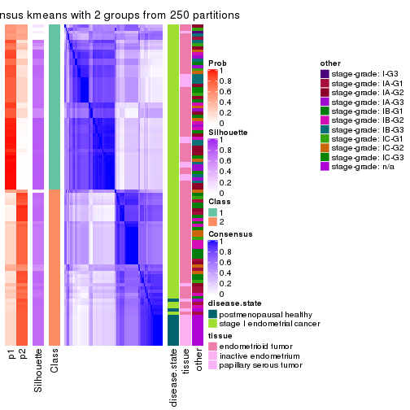</p>

</div>
<div id='tab-SD-kmeans-consensus-heatmap-2'>
<pre><code class="r">consensus_heatmap(res, k = 3)
</code></pre>

<p>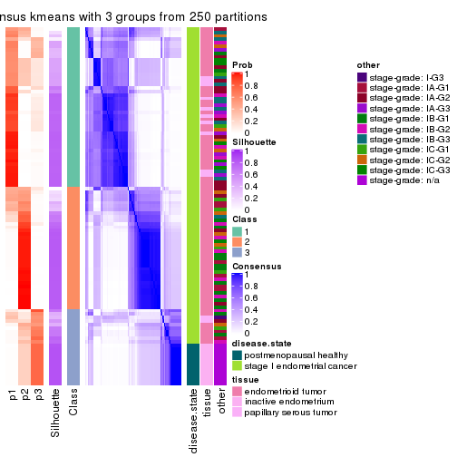</p>

</div>
<div id='tab-SD-kmeans-consensus-heatmap-3'>
<pre><code class="r">consensus_heatmap(res, k = 4)
</code></pre>

<p>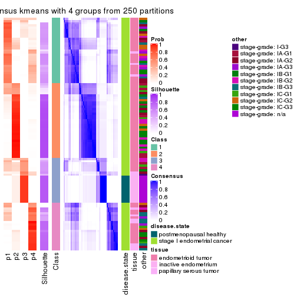</p>

</div>
<div id='tab-SD-kmeans-consensus-heatmap-4'>
<pre><code class="r">consensus_heatmap(res, k = 5)
</code></pre>

<p>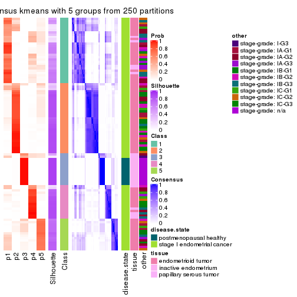</p>

</div>
<div id='tab-SD-kmeans-consensus-heatmap-5'>
<pre><code class="r">consensus_heatmap(res, k = 6)
</code></pre>

<p>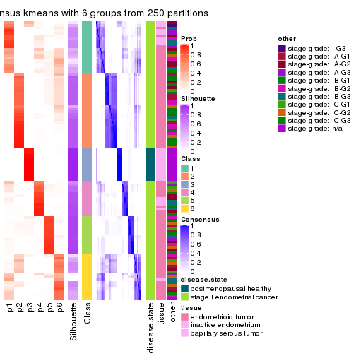</p>

</div>
</div>

Heatmaps for the membership of samples in all partitions to see how consistent they are:


<script>
$( function() {
	$( '#tabs-SD-kmeans-membership-heatmap' ).tabs();
} );
</script>
<div id='tabs-SD-kmeans-membership-heatmap'>
<ul>
<li><a href='#tab-SD-kmeans-membership-heatmap-1'>k = 2</a></li>
<li><a href='#tab-SD-kmeans-membership-heatmap-2'>k = 3</a></li>
<li><a href='#tab-SD-kmeans-membership-heatmap-3'>k = 4</a></li>
<li><a href='#tab-SD-kmeans-membership-heatmap-4'>k = 5</a></li>
<li><a href='#tab-SD-kmeans-membership-heatmap-5'>k = 6</a></li>
</ul>
<div id='tab-SD-kmeans-membership-heatmap-1'>
<pre><code class="r">membership_heatmap(res, k = 2)
</code></pre>

<p>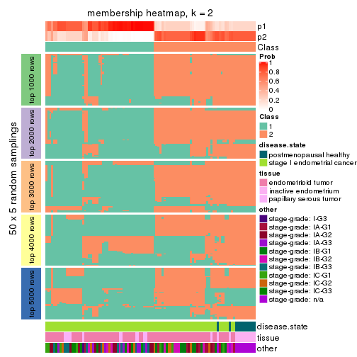</p>

</div>
<div id='tab-SD-kmeans-membership-heatmap-2'>
<pre><code class="r">membership_heatmap(res, k = 3)
</code></pre>

<p>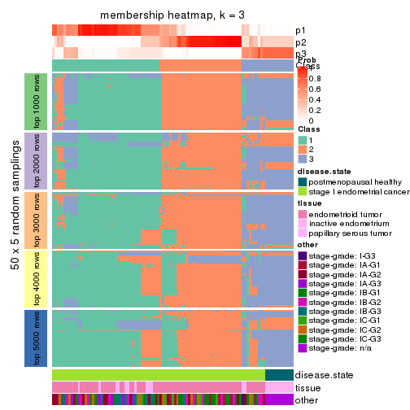</p>

</div>
<div id='tab-SD-kmeans-membership-heatmap-3'>
<pre><code class="r">membership_heatmap(res, k = 4)
</code></pre>

<p>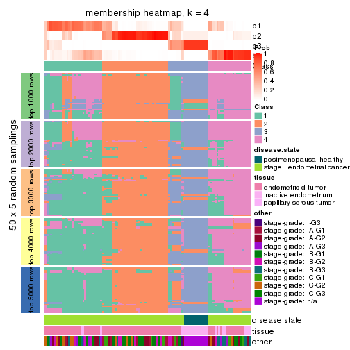</p>

</div>
<div id='tab-SD-kmeans-membership-heatmap-4'>
<pre><code class="r">membership_heatmap(res, k = 5)
</code></pre>

<p>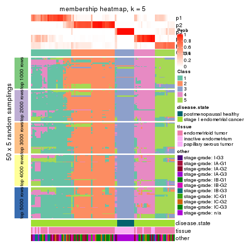</p>

</div>
<div id='tab-SD-kmeans-membership-heatmap-5'>
<pre><code class="r">membership_heatmap(res, k = 6)
</code></pre>

<p>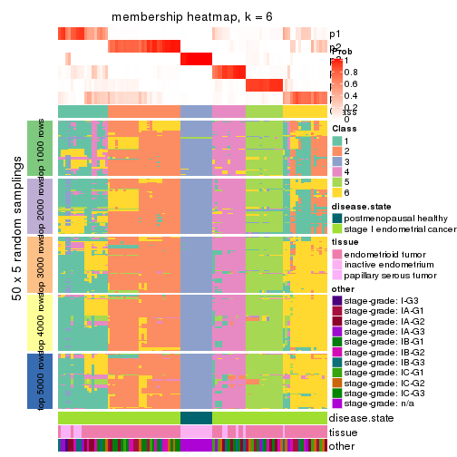</p>

</div>
</div>

As soon as we have had the classes for columns, we can look for signatures
which are significantly different between classes which can be candidate marks
for certain classes. Following are the heatmaps for signatures.


Signature heatmaps where rows are scaled:


<script>
$( function() {
	$( '#tabs-SD-kmeans-get-signatures' ).tabs();
} );
</script>
<div id='tabs-SD-kmeans-get-signatures'>
<ul>
<li><a href='#tab-SD-kmeans-get-signatures-1'>k = 2</a></li>
<li><a href='#tab-SD-kmeans-get-signatures-2'>k = 3</a></li>
<li><a href='#tab-SD-kmeans-get-signatures-3'>k = 4</a></li>
<li><a href='#tab-SD-kmeans-get-signatures-4'>k = 5</a></li>
<li><a href='#tab-SD-kmeans-get-signatures-5'>k = 6</a></li>
</ul>
<div id='tab-SD-kmeans-get-signatures-1'>
<pre><code class="r">get_signatures(res, k = 2)
</code></pre>

<p>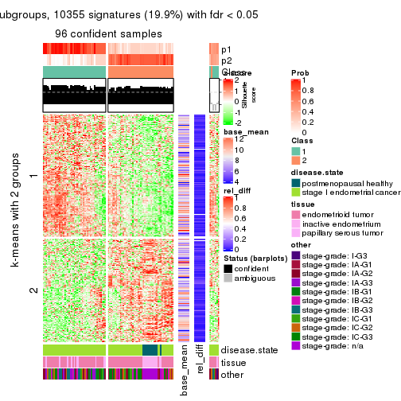</p>

</div>
<div id='tab-SD-kmeans-get-signatures-2'>
<pre><code class="r">get_signatures(res, k = 3)
</code></pre>

<p>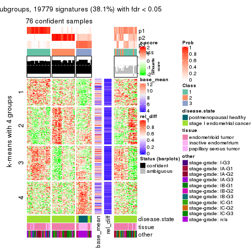</p>

</div>
<div id='tab-SD-kmeans-get-signatures-3'>
<pre><code class="r">get_signatures(res, k = 4)
</code></pre>

<p>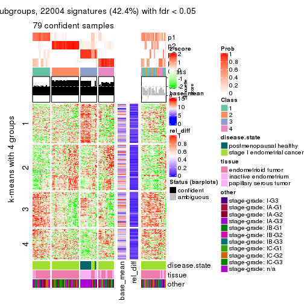</p>

</div>
<div id='tab-SD-kmeans-get-signatures-4'>
<pre><code class="r">get_signatures(res, k = 5)
</code></pre>

<p>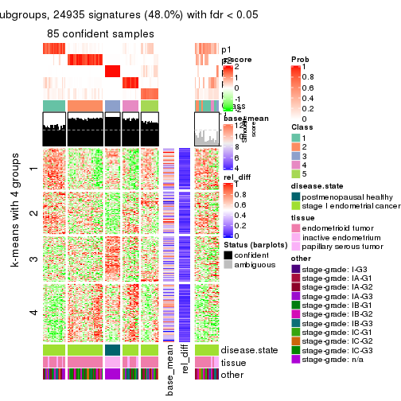</p>

</div>
<div id='tab-SD-kmeans-get-signatures-5'>
<pre><code class="r">get_signatures(res, k = 6)
</code></pre>

<p>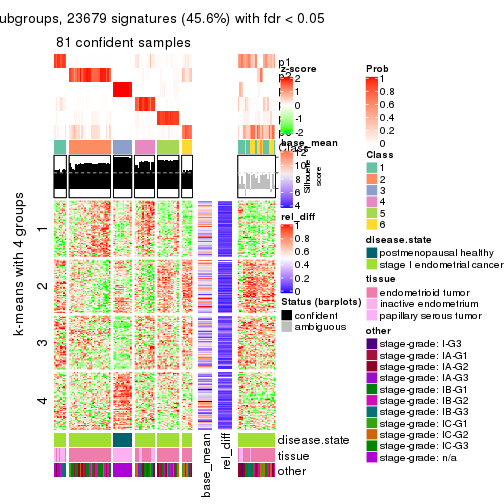</p>

</div>
</div>


Signature heatmaps where rows are not scaled:


<script>
$( function() {
	$( '#tabs-SD-kmeans-get-signatures-no-scale' ).tabs();
} );
</script>
<div id='tabs-SD-kmeans-get-signatures-no-scale'>
<ul>
<li><a href='#tab-SD-kmeans-get-signatures-no-scale-1'>k = 2</a></li>
<li><a href='#tab-SD-kmeans-get-signatures-no-scale-2'>k = 3</a></li>
<li><a href='#tab-SD-kmeans-get-signatures-no-scale-3'>k = 4</a></li>
<li><a href='#tab-SD-kmeans-get-signatures-no-scale-4'>k = 5</a></li>
<li><a href='#tab-SD-kmeans-get-signatures-no-scale-5'>k = 6</a></li>
</ul>
<div id='tab-SD-kmeans-get-signatures-no-scale-1'>
<pre><code class="r">get_signatures(res, k = 2, scale_rows = FALSE)
</code></pre>

<p>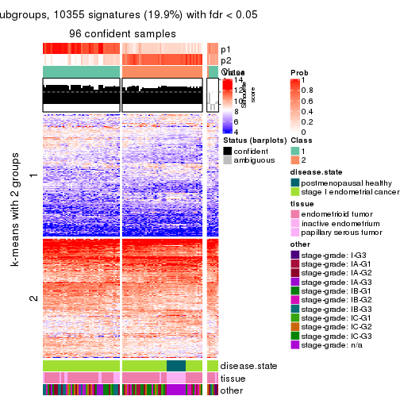</p>

</div>
<div id='tab-SD-kmeans-get-signatures-no-scale-2'>
<pre><code class="r">get_signatures(res, k = 3, scale_rows = FALSE)
</code></pre>

<p>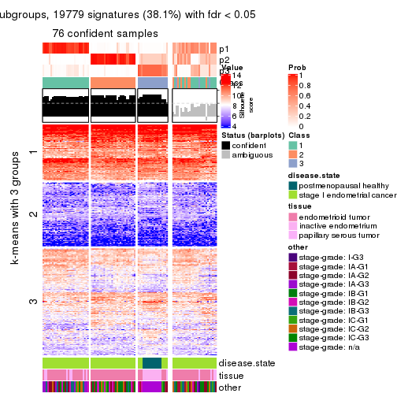</p>

</div>
<div id='tab-SD-kmeans-get-signatures-no-scale-3'>
<pre><code class="r">get_signatures(res, k = 4, scale_rows = FALSE)
</code></pre>

<p>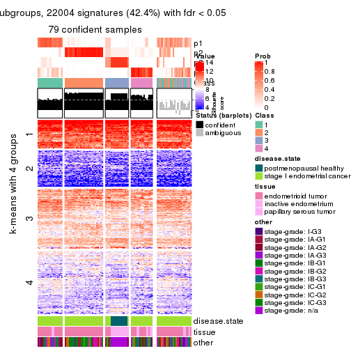</p>

</div>
<div id='tab-SD-kmeans-get-signatures-no-scale-4'>
<pre><code class="r">get_signatures(res, k = 5, scale_rows = FALSE)
</code></pre>

<p>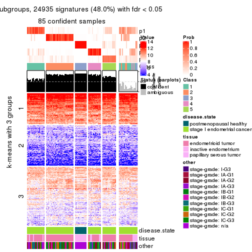</p>

</div>
<div id='tab-SD-kmeans-get-signatures-no-scale-5'>
<pre><code class="r">get_signatures(res, k = 6, scale_rows = FALSE)
</code></pre>

<p>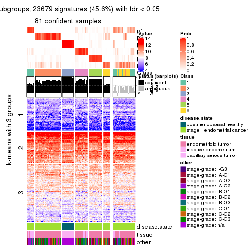</p>

</div>
</div>


Compare the overlap of signatures from different k:

```r
compare_signatures(res)
```

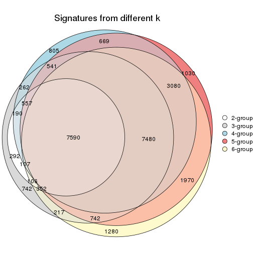

`get_signature()` returns a data frame invisibly. TO get the list of signatures, the function
call should be assigned to a variable explicitly. In following code, if `plot` argument is set
to `FALSE`, no heatmap is plotted while only the differential analysis is performed.

```r
# code only for demonstration
tb = get_signature(res, k = ..., plot = FALSE)
```

An example of the output of `tb` is:

```
#>   which_row         fdr    mean_1    mean_2 scaled_mean_1 scaled_mean_2 km
#> 1        38 0.042760348  8.373488  9.131774    -0.5533452     0.5164555  1
#> 2        40 0.018707592  7.106213  8.469186    -0.6173731     0.5762149  1
#> 3        55 0.019134737 10.221463 11.207825    -0.6159697     0.5749050  1
#> 4        59 0.006059896  5.921854  7.869574    -0.6899429     0.6439467  1
#> 5        60 0.018055526  8.928898 10.211722    -0.6204761     0.5791110  1
#> 6        98 0.009384629 15.714769 14.887706     0.6635654    -0.6193277  2
...
```

The columns in `tb` are:

1. `which_row`: row indices corresponding to the input matrix.
2. `fdr`: FDR for the differential test. 
3. `mean_x`: The mean value in group x.
4. `scaled_mean_x`: The mean value in group x after rows are scaled.
5. `km`: Row groups if k-means clustering is applied to rows.


UMAP plot which shows how samples are separated.


<script>
$( function() {
	$( '#tabs-SD-kmeans-dimension-reduction' ).tabs();
} );
</script>
<div id='tabs-SD-kmeans-dimension-reduction'>
<ul>
<li><a href='#tab-SD-kmeans-dimension-reduction-1'>k = 2</a></li>
<li><a href='#tab-SD-kmeans-dimension-reduction-2'>k = 3</a></li>
<li><a href='#tab-SD-kmeans-dimension-reduction-3'>k = 4</a></li>
<li><a href='#tab-SD-kmeans-dimension-reduction-4'>k = 5</a></li>
<li><a href='#tab-SD-kmeans-dimension-reduction-5'>k = 6</a></li>
</ul>
<div id='tab-SD-kmeans-dimension-reduction-1'>
<pre><code class="r">dimension_reduction(res, k = 2, method = &quot;UMAP&quot;)
</code></pre>

<p>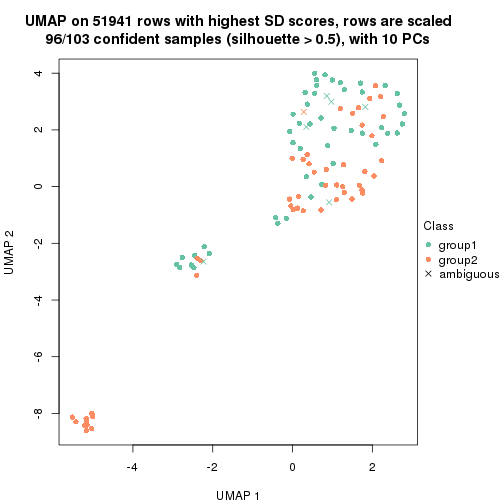</p>

</div>
<div id='tab-SD-kmeans-dimension-reduction-2'>
<pre><code class="r">dimension_reduction(res, k = 3, method = &quot;UMAP&quot;)
</code></pre>

<p>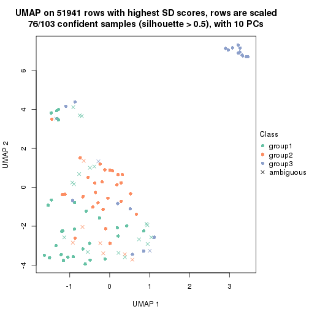</p>

</div>
<div id='tab-SD-kmeans-dimension-reduction-3'>
<pre><code class="r">dimension_reduction(res, k = 4, method = &quot;UMAP&quot;)
</code></pre>

<p>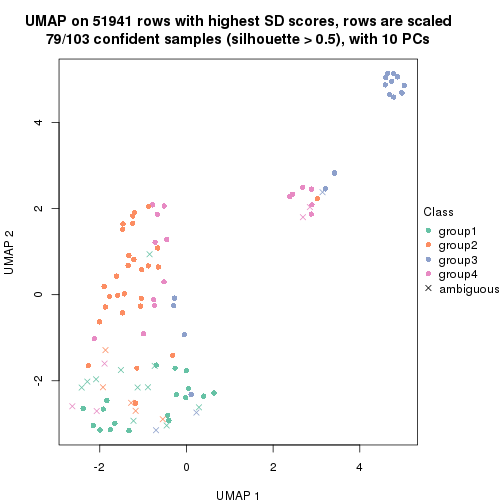</p>

</div>
<div id='tab-SD-kmeans-dimension-reduction-4'>
<pre><code class="r">dimension_reduction(res, k = 5, method = &quot;UMAP&quot;)
</code></pre>

<p>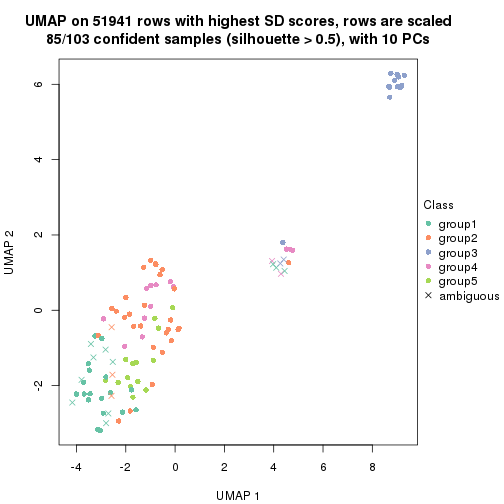</p>

</div>
<div id='tab-SD-kmeans-dimension-reduction-5'>
<pre><code class="r">dimension_reduction(res, k = 6, method = &quot;UMAP&quot;)
</code></pre>

<p>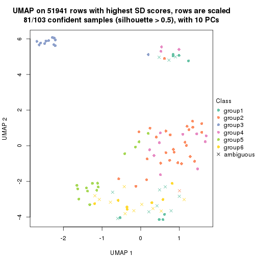</p>

</div>
</div>


Following heatmap shows how subgroups are split when increasing `k`:

```r
collect_classes(res)
```

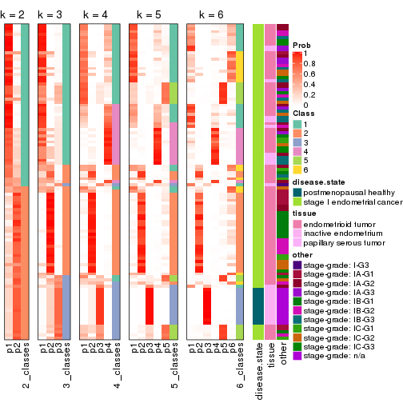


Test correlation between subgroups and known annotations. If the known
annotation is numeric, one-way ANOVA test is applied, and if the known
annotation is discrete, chi-squared contingency table test is applied.

```r
test_to_known_factors(res)
```

```
#>            n disease.state(p) tissue(p) other(p) k
#> SD:kmeans 96         9.06e-04  6.30e-05 2.95e-07 2
#> SD:kmeans 76         5.21e-10  1.54e-10 1.26e-09 3
#> SD:kmeans 79         3.64e-11  2.36e-12 4.37e-08 4
#> SD:kmeans 85         1.52e-17  6.13e-18 1.87e-11 5
#> SD:kmeans 81         5.18e-16  8.57e-20 3.80e-11 6
```


If matrix rows can be associated to genes, consider to use `functional_enrichment(res,
...)` to perform function enrichment for the signature genes. See [this vignette](http://bioconductor.org/packages/devel/bioc/vignettes/cola/inst/doc/functional_enrichment.html) for more detailed explanations.


 

---------------------------------------------------


### SD:skmeans*


The object with results only for a single top-value method and a single partition method 
can be extracted as:

```r
res = res_list["SD", "skmeans"]
# you can also extract it by
# res = res_list["SD:skmeans"]
```

A summary of `res` and all the functions that can be applied to it:

```r
res
```

```
#> A 'ConsensusPartition' object with k = 2, 3, 4, 5, 6.
#>   On a matrix with 51941 rows and 103 columns.
#>   Top rows (1000, 2000, 3000, 4000, 5000) are extracted by 'SD' method.
#>   Subgroups are detected by 'skmeans' method.
#>   Performed in total 1250 partitions by row resampling.
#>   Best k for subgroups seems to be 2.
#> 
#> Following methods can be applied to this 'ConsensusPartition' object:
#>  [1] "cola_report"             "collect_classes"         "collect_plots"          
#>  [4] "collect_stats"           "colnames"                "compare_signatures"     
#>  [7] "consensus_heatmap"       "dimension_reduction"     "functional_enrichment"  
#> [10] "get_anno_col"            "get_anno"                "get_classes"            
#> [13] "get_consensus"           "get_matrix"              "get_membership"         
#> [16] "get_param"               "get_signatures"          "get_stats"              
#> [19] "is_best_k"               "is_stable_k"             "membership_heatmap"     
#> [22] "ncol"                    "nrow"                    "plot_ecdf"              
#> [25] "rownames"                "select_partition_number" "show"                   
#> [28] "suggest_best_k"          "test_to_known_factors"
```

`collect_plots()` function collects all the plots made from `res` for all `k` (number of partitions)
into one single page to provide an easy and fast comparison between different `k`.

```r
collect_plots(res)
```

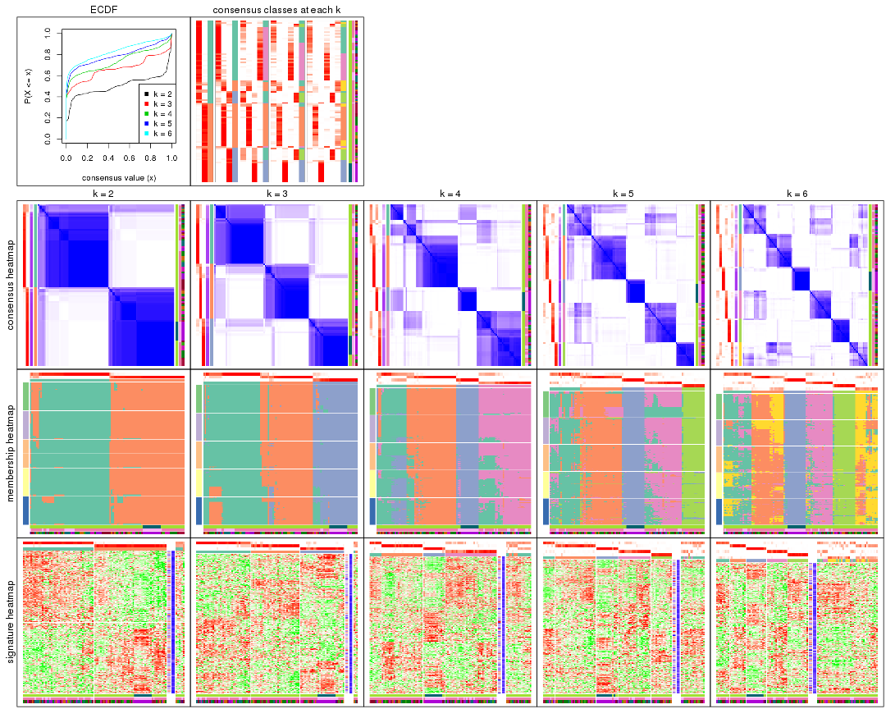

The plots are:

- The first row: a plot of the ECDF (empirical cumulative distribution
  function) curves of the consensus matrix for each `k` and the heatmap of
  predicted classes for each `k`.
- The second row: heatmaps of the consensus matrix for each `k`.
- The third row: heatmaps of the membership matrix for each `k`.
- The fouth row: heatmaps of the signatures for each `k`.

All the plots in panels can be made by individual functions and they are
plotted later in this section.

`select_partition_number()` produces several plots showing different
statistics for choosing "optimized" `k`. There are following statistics:

- ECDF curves of the consensus matrix for each `k`;
- 1-PAC. [The PAC
  score](https://en.wikipedia.org/wiki/Consensus_clustering#Over-interpretation_potential_of_consensus_clustering)
  measures the proportion of the ambiguous subgrouping.
- Mean silhouette score.
- Concordance. The mean probability of fiting the consensus class ids in all
  partitions.
- Area increased. Denote $A_k$ as the area under the ECDF curve for current
  `k`, the area increased is defined as $A_k - A_{k-1}$.
- Rand index. The percent of pairs of samples that are both in a same cluster
  or both are not in a same cluster in the partition of k and k-1.
- Jaccard index. The ratio of pairs of samples are both in a same cluster in
  the partition of k and k-1 and the pairs of samples are both in a same
  cluster in the partition k or k-1.

The detailed explanations of these statistics can be found in [the _cola_
vignette](http://bioconductor.org/packages/devel/bioc/vignettes/cola/inst/doc/cola.html#toc_13).

Generally speaking, lower PAC score, higher mean silhouette score or higher
concordance corresponds to better partition. Rand index and Jaccard index
measure how similar the current partition is compared to partition with `k-1`.
If they are too similar, we won't accept `k` is better than `k-1`.

```r
select_partition_number(res)
```

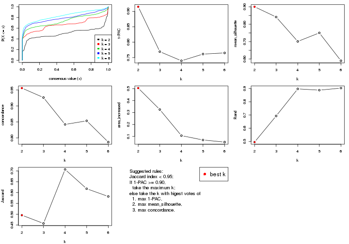

The numeric values for all these statistics can be obtained by `get_stats()`.

```r
get_stats(res)
```

```
#>   k 1-PAC mean_silhouette concordance area_increased  Rand Jaccard
#> 2 2 0.915           0.900       0.956         0.5044 0.496   0.496
#> 3 3 0.769           0.841       0.926         0.3248 0.693   0.457
#> 4 4 0.740           0.701       0.842         0.1068 0.897   0.707
#> 5 5 0.761           0.750       0.853         0.0703 0.888   0.618
#> 6 6 0.765           0.590       0.787         0.0527 0.903   0.582
```

`suggest_best_k()` suggests the best $k$ based on these statistics. The rules are as follows:

- All $k$ with Jaccard index larger than 0.95 are removed because increasing
  $k$ does not provide enough extra information. If all $k$ are removed, it is
  marked as no subgroup is detected.
- For all $k$ with 1-PAC score larger than 0.9, the maximal $k$ is taken as
  the best $k$, and other $k$ are marked as optional $k$.
- If it does not fit the second rule. The $k$ with the maximal vote of the
  highest 1-PAC score, highest mean silhouette, and highest concordance is
  taken as the best $k$.

```r
suggest_best_k(res)
```

```
#> [1] 2
```


Following shows the table of the partitions (You need to click the **show/hide
code output** link to see it). The membership matrix (columns with name `p*`)
is inferred by
[`clue::cl_consensus()`](https://www.rdocumentation.org/link/cl_consensus?package=clue)
function with the `SE` method. Basically the value in the membership matrix
represents the probability to belong to a certain group. The finall class
label for an item is determined with the group with highest probability it
belongs to.

In `get_classes()` function, the entropy is calculated from the membership
matrix and the silhouette score is calculated from the consensus matrix.


<script>
$( function() {
	$( '#tabs-SD-skmeans-get-classes' ).tabs();
} );
</script>
<div id='tabs-SD-skmeans-get-classes'>
<ul>
<li><a href='#tab-SD-skmeans-get-classes-1'>k = 2</a></li>
<li><a href='#tab-SD-skmeans-get-classes-2'>k = 3</a></li>
<li><a href='#tab-SD-skmeans-get-classes-3'>k = 4</a></li>
<li><a href='#tab-SD-skmeans-get-classes-4'>k = 5</a></li>
<li><a href='#tab-SD-skmeans-get-classes-5'>k = 6</a></li>
</ul>

<div id='tab-SD-skmeans-get-classes-1'>
<p><a id='tab-SD-skmeans-get-classes-1-a' style='color:#0366d6' href='#'>show/hide code output</a></p>
<pre><code class="r">cbind(get_classes(res, k = 2), get_membership(res, k = 2))
</code></pre>

<pre><code>#&gt;           class entropy silhouette    p1    p2
#&gt; GSM425907     2  0.0000      0.967 0.000 1.000
#&gt; GSM425908     2  0.1843      0.958 0.028 0.972
#&gt; GSM425909     2  0.0938      0.962 0.012 0.988
#&gt; GSM425910     1  0.9815      0.330 0.580 0.420
#&gt; GSM425911     2  0.0000      0.967 0.000 1.000
#&gt; GSM425912     2  0.6343      0.806 0.160 0.840
#&gt; GSM425913     2  0.0000      0.967 0.000 1.000
#&gt; GSM425914     2  0.2603      0.939 0.044 0.956
#&gt; GSM425915     2  0.0000      0.967 0.000 1.000
#&gt; GSM425874     1  0.2423      0.918 0.960 0.040
#&gt; GSM425875     1  0.0000      0.938 1.000 0.000
#&gt; GSM425876     1  0.2043      0.923 0.968 0.032
#&gt; GSM425877     1  0.0000      0.938 1.000 0.000
#&gt; GSM425878     1  0.0000      0.938 1.000 0.000
#&gt; GSM425879     2  0.0000      0.967 0.000 1.000
#&gt; GSM425880     1  0.1843      0.925 0.972 0.028
#&gt; GSM425881     1  0.7528      0.715 0.784 0.216
#&gt; GSM425882     2  0.2043      0.956 0.032 0.968
#&gt; GSM425883     1  0.0000      0.938 1.000 0.000
#&gt; GSM425884     1  0.0000      0.938 1.000 0.000
#&gt; GSM425885     2  0.9850      0.230 0.428 0.572
#&gt; GSM425848     1  0.0000      0.938 1.000 0.000
#&gt; GSM425849     1  0.0000      0.938 1.000 0.000
#&gt; GSM425850     1  0.0000      0.938 1.000 0.000
#&gt; GSM425851     1  0.0000      0.938 1.000 0.000
#&gt; GSM425852     1  0.2043      0.923 0.968 0.032
#&gt; GSM425893     2  0.0000      0.967 0.000 1.000
#&gt; GSM425894     2  0.1843      0.958 0.028 0.972
#&gt; GSM425895     2  0.1843      0.958 0.028 0.972
#&gt; GSM425896     2  0.0000      0.967 0.000 1.000
#&gt; GSM425897     2  0.0000      0.967 0.000 1.000
#&gt; GSM425898     2  0.1843      0.958 0.028 0.972
#&gt; GSM425899     1  0.0000      0.938 1.000 0.000
#&gt; GSM425900     2  0.3733      0.926 0.072 0.928
#&gt; GSM425901     2  0.2603      0.938 0.044 0.956
#&gt; GSM425902     1  0.2603      0.915 0.956 0.044
#&gt; GSM425903     2  0.2603      0.939 0.044 0.956
#&gt; GSM425904     1  0.1843      0.925 0.972 0.028
#&gt; GSM425905     2  0.0000      0.967 0.000 1.000
#&gt; GSM425906     2  0.0000      0.967 0.000 1.000
#&gt; GSM425863     1  0.0000      0.938 1.000 0.000
#&gt; GSM425864     2  0.0000      0.967 0.000 1.000
#&gt; GSM425865     2  0.0000      0.967 0.000 1.000
#&gt; GSM425866     1  0.1843      0.925 0.972 0.028
#&gt; GSM425867     2  0.2778      0.936 0.048 0.952
#&gt; GSM425868     2  0.2778      0.944 0.048 0.952
#&gt; GSM425869     2  0.1843      0.958 0.028 0.972
#&gt; GSM425870     2  0.0000      0.967 0.000 1.000
#&gt; GSM425871     1  0.0000      0.938 1.000 0.000
#&gt; GSM425872     2  0.1843      0.958 0.028 0.972
#&gt; GSM425873     1  0.0000      0.938 1.000 0.000
#&gt; GSM425843     1  0.0000      0.938 1.000 0.000
#&gt; GSM425844     1  0.0000      0.938 1.000 0.000
#&gt; GSM425845     1  0.9815      0.330 0.580 0.420
#&gt; GSM425846     1  0.0000      0.938 1.000 0.000
#&gt; GSM425847     1  0.3114      0.902 0.944 0.056
#&gt; GSM425886     2  0.0000      0.967 0.000 1.000
#&gt; GSM425887     1  0.9944      0.185 0.544 0.456
#&gt; GSM425888     1  0.4939      0.852 0.892 0.108
#&gt; GSM425889     1  0.0000      0.938 1.000 0.000
#&gt; GSM425890     1  0.2603      0.915 0.956 0.044
#&gt; GSM425891     2  0.0000      0.967 0.000 1.000
#&gt; GSM425892     2  0.1843      0.958 0.028 0.972
#&gt; GSM425853     1  0.1184      0.931 0.984 0.016
#&gt; GSM425854     2  0.1843      0.958 0.028 0.972
#&gt; GSM425855     1  0.0000      0.938 1.000 0.000
#&gt; GSM425856     1  0.1843      0.925 0.972 0.028
#&gt; GSM425857     2  0.3274      0.922 0.060 0.940
#&gt; GSM425858     1  0.9922      0.211 0.552 0.448
#&gt; GSM425859     2  0.1843      0.958 0.028 0.972
#&gt; GSM425860     2  0.7299      0.738 0.204 0.796
#&gt; GSM425861     1  0.0000      0.938 1.000 0.000
#&gt; GSM425862     1  0.0000      0.938 1.000 0.000
#&gt; GSM425837     1  0.0000      0.938 1.000 0.000
#&gt; GSM425838     1  0.2778      0.912 0.952 0.048
#&gt; GSM425839     2  0.1843      0.958 0.028 0.972
#&gt; GSM425840     1  0.0000      0.938 1.000 0.000
#&gt; GSM425841     1  0.2603      0.915 0.956 0.044
#&gt; GSM425842     1  0.0000      0.938 1.000 0.000
#&gt; GSM425917     2  0.0000      0.967 0.000 1.000
#&gt; GSM425922     1  0.2603      0.915 0.956 0.044
#&gt; GSM425919     1  0.0000      0.938 1.000 0.000
#&gt; GSM425920     1  0.0000      0.938 1.000 0.000
#&gt; GSM425923     1  0.0000      0.938 1.000 0.000
#&gt; GSM425916     1  0.0000      0.938 1.000 0.000
#&gt; GSM425918     1  0.0000      0.938 1.000 0.000
#&gt; GSM425921     1  0.2603      0.915 0.956 0.044
#&gt; GSM425925     1  0.0000      0.938 1.000 0.000
#&gt; GSM425926     1  0.2043      0.923 0.968 0.032
#&gt; GSM425927     1  0.0000      0.938 1.000 0.000
#&gt; GSM425924     1  0.9732      0.366 0.596 0.404
#&gt; GSM425928     2  0.0000      0.967 0.000 1.000
#&gt; GSM425929     2  0.0000      0.967 0.000 1.000
#&gt; GSM425930     2  0.0000      0.967 0.000 1.000
#&gt; GSM425931     2  0.0000      0.967 0.000 1.000
#&gt; GSM425932     2  0.0000      0.967 0.000 1.000
#&gt; GSM425933     2  0.0000      0.967 0.000 1.000
#&gt; GSM425934     2  0.0000      0.967 0.000 1.000
#&gt; GSM425935     2  0.0000      0.967 0.000 1.000
#&gt; GSM425936     2  0.0000      0.967 0.000 1.000
#&gt; GSM425937     2  0.0000      0.967 0.000 1.000
#&gt; GSM425938     2  0.0000      0.967 0.000 1.000
#&gt; GSM425939     2  0.0000      0.967 0.000 1.000
</code></pre>

<script>
$('#tab-SD-skmeans-get-classes-1-a').parent().next().next().hide();
$('#tab-SD-skmeans-get-classes-1-a').click(function(){
  $('#tab-SD-skmeans-get-classes-1-a').parent().next().next().toggle();
  return(false);
});
</script>
</div>

<div id='tab-SD-skmeans-get-classes-2'>
<p><a id='tab-SD-skmeans-get-classes-2-a' style='color:#0366d6' href='#'>show/hide code output</a></p>
<pre><code class="r">cbind(get_classes(res, k = 3), get_membership(res, k = 3))
</code></pre>

<pre><code>#&gt;           class entropy silhouette    p1    p2    p3
#&gt; GSM425907     2  0.0000     0.9026 0.000 1.000 0.000
#&gt; GSM425908     2  0.0000     0.9026 0.000 1.000 0.000
#&gt; GSM425909     3  0.0000     0.9325 0.000 0.000 1.000
#&gt; GSM425910     3  0.7605     0.6312 0.252 0.088 0.660
#&gt; GSM425911     2  0.5327     0.6280 0.000 0.728 0.272
#&gt; GSM425912     2  0.5178     0.6679 0.256 0.744 0.000
#&gt; GSM425913     2  0.0000     0.9026 0.000 1.000 0.000
#&gt; GSM425914     2  0.6949     0.6974 0.112 0.732 0.156
#&gt; GSM425915     3  0.0000     0.9325 0.000 0.000 1.000
#&gt; GSM425874     1  0.5138     0.7048 0.748 0.252 0.000
#&gt; GSM425875     1  0.3482     0.7937 0.872 0.000 0.128
#&gt; GSM425876     1  0.3039     0.8588 0.920 0.044 0.036
#&gt; GSM425877     1  0.0000     0.9142 1.000 0.000 0.000
#&gt; GSM425878     1  0.0000     0.9142 1.000 0.000 0.000
#&gt; GSM425879     2  0.0892     0.8939 0.000 0.980 0.020
#&gt; GSM425880     3  0.2448     0.8931 0.076 0.000 0.924
#&gt; GSM425881     2  0.5216     0.6630 0.260 0.740 0.000
#&gt; GSM425882     2  0.0000     0.9026 0.000 1.000 0.000
#&gt; GSM425883     1  0.0000     0.9142 1.000 0.000 0.000
#&gt; GSM425884     1  0.0000     0.9142 1.000 0.000 0.000
#&gt; GSM425885     2  0.6291    -0.0536 0.468 0.532 0.000
#&gt; GSM425848     1  0.2878     0.8509 0.904 0.096 0.000
#&gt; GSM425849     1  0.0000     0.9142 1.000 0.000 0.000
#&gt; GSM425850     1  0.0000     0.9142 1.000 0.000 0.000
#&gt; GSM425851     1  0.0000     0.9142 1.000 0.000 0.000
#&gt; GSM425852     3  0.1411     0.9162 0.036 0.000 0.964
#&gt; GSM425893     2  0.5529     0.5917 0.000 0.704 0.296
#&gt; GSM425894     2  0.0000     0.9026 0.000 1.000 0.000
#&gt; GSM425895     2  0.0000     0.9026 0.000 1.000 0.000
#&gt; GSM425896     2  0.0592     0.8969 0.000 0.988 0.012
#&gt; GSM425897     2  0.1163     0.8886 0.000 0.972 0.028
#&gt; GSM425898     2  0.0000     0.9026 0.000 1.000 0.000
#&gt; GSM425899     2  0.1753     0.8679 0.048 0.952 0.000
#&gt; GSM425900     2  0.0424     0.8994 0.008 0.992 0.000
#&gt; GSM425901     3  0.0000     0.9325 0.000 0.000 1.000
#&gt; GSM425902     1  0.5291     0.6836 0.732 0.268 0.000
#&gt; GSM425903     3  0.0000     0.9325 0.000 0.000 1.000
#&gt; GSM425904     3  0.1643     0.9130 0.044 0.000 0.956
#&gt; GSM425905     2  0.0000     0.9026 0.000 1.000 0.000
#&gt; GSM425906     2  0.0237     0.9012 0.004 0.996 0.000
#&gt; GSM425863     1  0.0000     0.9142 1.000 0.000 0.000
#&gt; GSM425864     2  0.0237     0.9013 0.000 0.996 0.004
#&gt; GSM425865     2  0.0000     0.9026 0.000 1.000 0.000
#&gt; GSM425866     3  0.5465     0.6569 0.288 0.000 0.712
#&gt; GSM425867     3  0.0000     0.9325 0.000 0.000 1.000
#&gt; GSM425868     2  0.0000     0.9026 0.000 1.000 0.000
#&gt; GSM425869     2  0.0000     0.9026 0.000 1.000 0.000
#&gt; GSM425870     3  0.0000     0.9325 0.000 0.000 1.000
#&gt; GSM425871     1  0.0000     0.9142 1.000 0.000 0.000
#&gt; GSM425872     2  0.0000     0.9026 0.000 1.000 0.000
#&gt; GSM425873     1  0.0000     0.9142 1.000 0.000 0.000
#&gt; GSM425843     1  0.0000     0.9142 1.000 0.000 0.000
#&gt; GSM425844     1  0.0000     0.9142 1.000 0.000 0.000
#&gt; GSM425845     3  0.4887     0.7347 0.228 0.000 0.772
#&gt; GSM425846     2  0.0000     0.9026 0.000 1.000 0.000
#&gt; GSM425847     2  0.6307     0.1623 0.488 0.512 0.000
#&gt; GSM425886     3  0.0000     0.9325 0.000 0.000 1.000
#&gt; GSM425887     2  0.5016     0.6864 0.240 0.760 0.000
#&gt; GSM425888     2  0.5254     0.6580 0.264 0.736 0.000
#&gt; GSM425889     1  0.0000     0.9142 1.000 0.000 0.000
#&gt; GSM425890     1  0.5098     0.7095 0.752 0.248 0.000
#&gt; GSM425891     2  0.0000     0.9026 0.000 1.000 0.000
#&gt; GSM425892     2  0.0000     0.9026 0.000 1.000 0.000
#&gt; GSM425853     1  0.1031     0.8981 0.976 0.000 0.024
#&gt; GSM425854     2  0.0000     0.9026 0.000 1.000 0.000
#&gt; GSM425855     1  0.0000     0.9142 1.000 0.000 0.000
#&gt; GSM425856     3  0.5529     0.6444 0.296 0.000 0.704
#&gt; GSM425857     3  0.2537     0.8719 0.000 0.080 0.920
#&gt; GSM425858     2  0.1753     0.8741 0.048 0.952 0.000
#&gt; GSM425859     2  0.0000     0.9026 0.000 1.000 0.000
#&gt; GSM425860     3  0.7975     0.6336 0.204 0.140 0.656
#&gt; GSM425861     1  0.5988     0.3105 0.632 0.368 0.000
#&gt; GSM425862     1  0.0237     0.9121 0.996 0.004 0.000
#&gt; GSM425837     1  0.0000     0.9142 1.000 0.000 0.000
#&gt; GSM425838     1  0.5178     0.6998 0.744 0.256 0.000
#&gt; GSM425839     2  0.0000     0.9026 0.000 1.000 0.000
#&gt; GSM425840     1  0.0000     0.9142 1.000 0.000 0.000
#&gt; GSM425841     1  0.5216     0.6944 0.740 0.260 0.000
#&gt; GSM425842     1  0.0000     0.9142 1.000 0.000 0.000
#&gt; GSM425917     3  0.2796     0.8716 0.092 0.000 0.908
#&gt; GSM425922     1  0.5058     0.7142 0.756 0.244 0.000
#&gt; GSM425919     1  0.0000     0.9142 1.000 0.000 0.000
#&gt; GSM425920     1  0.0000     0.9142 1.000 0.000 0.000
#&gt; GSM425923     1  0.0000     0.9142 1.000 0.000 0.000
#&gt; GSM425916     1  0.0000     0.9142 1.000 0.000 0.000
#&gt; GSM425918     1  0.0000     0.9142 1.000 0.000 0.000
#&gt; GSM425921     1  0.5058     0.7142 0.756 0.244 0.000
#&gt; GSM425925     1  0.0000     0.9142 1.000 0.000 0.000
#&gt; GSM425926     1  0.5058     0.7142 0.756 0.244 0.000
#&gt; GSM425927     1  0.0000     0.9142 1.000 0.000 0.000
#&gt; GSM425924     3  0.1964     0.9012 0.056 0.000 0.944
#&gt; GSM425928     3  0.0000     0.9325 0.000 0.000 1.000
#&gt; GSM425929     3  0.0000     0.9325 0.000 0.000 1.000
#&gt; GSM425930     3  0.0000     0.9325 0.000 0.000 1.000
#&gt; GSM425931     3  0.0000     0.9325 0.000 0.000 1.000
#&gt; GSM425932     3  0.0000     0.9325 0.000 0.000 1.000
#&gt; GSM425933     3  0.0000     0.9325 0.000 0.000 1.000
#&gt; GSM425934     3  0.0000     0.9325 0.000 0.000 1.000
#&gt; GSM425935     3  0.0000     0.9325 0.000 0.000 1.000
#&gt; GSM425936     3  0.0000     0.9325 0.000 0.000 1.000
#&gt; GSM425937     3  0.0000     0.9325 0.000 0.000 1.000
#&gt; GSM425938     3  0.0000     0.9325 0.000 0.000 1.000
#&gt; GSM425939     3  0.0000     0.9325 0.000 0.000 1.000
</code></pre>

<script>
$('#tab-SD-skmeans-get-classes-2-a').parent().next().next().hide();
$('#tab-SD-skmeans-get-classes-2-a').click(function(){
  $('#tab-SD-skmeans-get-classes-2-a').parent().next().next().toggle();
  return(false);
});
</script>
</div>

<div id='tab-SD-skmeans-get-classes-3'>
<p><a id='tab-SD-skmeans-get-classes-3-a' style='color:#0366d6' href='#'>show/hide code output</a></p>
<pre><code class="r">cbind(get_classes(res, k = 4), get_membership(res, k = 4))
</code></pre>

<pre><code>#&gt;           class entropy silhouette    p1    p2    p3    p4
#&gt; GSM425907     2  0.0188    0.89507 0.004 0.996 0.000 0.000
#&gt; GSM425908     2  0.0188    0.89507 0.004 0.996 0.000 0.000
#&gt; GSM425909     1  0.5163    0.30938 0.516 0.004 0.480 0.000
#&gt; GSM425910     1  0.0188    0.57593 0.996 0.000 0.004 0.000
#&gt; GSM425911     2  0.3149    0.81801 0.088 0.880 0.032 0.000
#&gt; GSM425912     2  0.5570    0.36382 0.440 0.540 0.000 0.020
#&gt; GSM425913     2  0.0336    0.89362 0.008 0.992 0.000 0.000
#&gt; GSM425914     2  0.4961    0.38565 0.448 0.552 0.000 0.000
#&gt; GSM425915     1  0.4998    0.29671 0.512 0.000 0.488 0.000
#&gt; GSM425874     4  0.1022    0.78577 0.000 0.032 0.000 0.968
#&gt; GSM425875     1  0.1584    0.57918 0.952 0.000 0.012 0.036
#&gt; GSM425876     1  0.2053    0.50322 0.924 0.004 0.000 0.072
#&gt; GSM425877     4  0.2647    0.77743 0.120 0.000 0.000 0.880
#&gt; GSM425878     4  0.4948    0.57746 0.440 0.000 0.000 0.560
#&gt; GSM425879     2  0.0592    0.89204 0.016 0.984 0.000 0.000
#&gt; GSM425880     1  0.4718    0.50271 0.708 0.000 0.280 0.012
#&gt; GSM425881     2  0.5716    0.37945 0.420 0.552 0.000 0.028
#&gt; GSM425882     2  0.0188    0.89507 0.004 0.996 0.000 0.000
#&gt; GSM425883     4  0.0469    0.79500 0.012 0.000 0.000 0.988
#&gt; GSM425884     4  0.4972    0.55868 0.456 0.000 0.000 0.544
#&gt; GSM425885     4  0.4137    0.61780 0.012 0.208 0.000 0.780
#&gt; GSM425848     4  0.1174    0.78738 0.020 0.012 0.000 0.968
#&gt; GSM425849     4  0.4843    0.61114 0.396 0.000 0.000 0.604
#&gt; GSM425850     4  0.4994    0.53318 0.480 0.000 0.000 0.520
#&gt; GSM425851     4  0.1022    0.79465 0.032 0.000 0.000 0.968
#&gt; GSM425852     1  0.4877    0.40158 0.592 0.000 0.408 0.000
#&gt; GSM425893     2  0.5722    0.60629 0.136 0.716 0.148 0.000
#&gt; GSM425894     2  0.0000    0.89514 0.000 1.000 0.000 0.000
#&gt; GSM425895     2  0.0000    0.89514 0.000 1.000 0.000 0.000
#&gt; GSM425896     2  0.0376    0.89384 0.004 0.992 0.004 0.000
#&gt; GSM425897     2  0.0336    0.89454 0.008 0.992 0.000 0.000
#&gt; GSM425898     2  0.0000    0.89514 0.000 1.000 0.000 0.000
#&gt; GSM425899     2  0.2282    0.85435 0.024 0.924 0.000 0.052
#&gt; GSM425900     2  0.1209    0.88322 0.032 0.964 0.004 0.000
#&gt; GSM425901     1  0.5163    0.30938 0.516 0.004 0.480 0.000
#&gt; GSM425902     4  0.1661    0.77353 0.004 0.052 0.000 0.944
#&gt; GSM425903     1  0.4907    0.39155 0.580 0.000 0.420 0.000
#&gt; GSM425904     1  0.5038    0.46865 0.652 0.000 0.336 0.012
#&gt; GSM425905     2  0.0000    0.89514 0.000 1.000 0.000 0.000
#&gt; GSM425906     2  0.1109    0.88504 0.028 0.968 0.004 0.000
#&gt; GSM425863     4  0.4697    0.64642 0.356 0.000 0.000 0.644
#&gt; GSM425864     2  0.0188    0.89507 0.004 0.996 0.000 0.000
#&gt; GSM425865     2  0.0188    0.89507 0.004 0.996 0.000 0.000
#&gt; GSM425866     1  0.1284    0.58206 0.964 0.000 0.024 0.012
#&gt; GSM425867     1  0.4992    0.31980 0.524 0.000 0.476 0.000
#&gt; GSM425868     2  0.1867    0.84675 0.000 0.928 0.000 0.072
#&gt; GSM425869     2  0.0000    0.89514 0.000 1.000 0.000 0.000
#&gt; GSM425870     3  0.2408    0.80979 0.104 0.000 0.896 0.000
#&gt; GSM425871     4  0.3444    0.75401 0.184 0.000 0.000 0.816
#&gt; GSM425872     2  0.0000    0.89514 0.000 1.000 0.000 0.000
#&gt; GSM425873     4  0.4992    0.53722 0.476 0.000 0.000 0.524
#&gt; GSM425843     4  0.4967    0.56406 0.452 0.000 0.000 0.548
#&gt; GSM425844     4  0.0921    0.79454 0.028 0.000 0.000 0.972
#&gt; GSM425845     1  0.0817    0.58016 0.976 0.000 0.024 0.000
#&gt; GSM425846     2  0.2334    0.84295 0.088 0.908 0.000 0.004
#&gt; GSM425847     1  0.6915   -0.14899 0.476 0.416 0.000 0.108
#&gt; GSM425886     1  0.5163    0.30938 0.516 0.004 0.480 0.000
#&gt; GSM425887     2  0.5217    0.48209 0.380 0.608 0.000 0.012
#&gt; GSM425888     2  0.5756    0.40947 0.400 0.568 0.000 0.032
#&gt; GSM425889     4  0.0188    0.79364 0.004 0.000 0.000 0.996
#&gt; GSM425890     4  0.0817    0.78876 0.000 0.024 0.000 0.976
#&gt; GSM425891     2  0.0336    0.89362 0.008 0.992 0.000 0.000
#&gt; GSM425892     2  0.0188    0.89507 0.004 0.996 0.000 0.000
#&gt; GSM425853     1  0.1302    0.54744 0.956 0.000 0.000 0.044
#&gt; GSM425854     2  0.0000    0.89514 0.000 1.000 0.000 0.000
#&gt; GSM425855     4  0.2530    0.77874 0.112 0.000 0.000 0.888
#&gt; GSM425856     1  0.1488    0.58233 0.956 0.000 0.032 0.012
#&gt; GSM425857     1  0.6283    0.32842 0.512 0.024 0.444 0.020
#&gt; GSM425858     2  0.2610    0.83916 0.088 0.900 0.000 0.012
#&gt; GSM425859     2  0.0000    0.89514 0.000 1.000 0.000 0.000
#&gt; GSM425860     1  0.5677    0.02224 0.504 0.016 0.476 0.004
#&gt; GSM425861     1  0.7613   -0.00022 0.448 0.340 0.000 0.212
#&gt; GSM425862     4  0.0188    0.79364 0.004 0.000 0.000 0.996
#&gt; GSM425837     4  0.4776    0.63409 0.376 0.000 0.000 0.624
#&gt; GSM425838     4  0.1211    0.78223 0.000 0.040 0.000 0.960
#&gt; GSM425839     2  0.0000    0.89514 0.000 1.000 0.000 0.000
#&gt; GSM425840     4  0.4277    0.70128 0.280 0.000 0.000 0.720
#&gt; GSM425841     4  0.1302    0.77950 0.000 0.044 0.000 0.956
#&gt; GSM425842     4  0.4989    0.54151 0.472 0.000 0.000 0.528
#&gt; GSM425917     3  0.4673    0.52196 0.008 0.000 0.700 0.292
#&gt; GSM425922     4  0.0817    0.78876 0.000 0.024 0.000 0.976
#&gt; GSM425919     4  0.4746    0.64331 0.368 0.000 0.000 0.632
#&gt; GSM425920     4  0.3219    0.76386 0.164 0.000 0.000 0.836
#&gt; GSM425923     4  0.0000    0.79372 0.000 0.000 0.000 1.000
#&gt; GSM425916     4  0.1022    0.79465 0.032 0.000 0.000 0.968
#&gt; GSM425918     4  0.0336    0.79453 0.008 0.000 0.000 0.992
#&gt; GSM425921     4  0.0817    0.78876 0.000 0.024 0.000 0.976
#&gt; GSM425925     4  0.0000    0.79372 0.000 0.000 0.000 1.000
#&gt; GSM425926     4  0.0817    0.78876 0.000 0.024 0.000 0.976
#&gt; GSM425927     4  0.4989    0.54151 0.472 0.000 0.000 0.528
#&gt; GSM425924     3  0.3577    0.71625 0.012 0.000 0.832 0.156
#&gt; GSM425928     3  0.0000    0.93514 0.000 0.000 1.000 0.000
#&gt; GSM425929     3  0.0000    0.93514 0.000 0.000 1.000 0.000
#&gt; GSM425930     3  0.0000    0.93514 0.000 0.000 1.000 0.000
#&gt; GSM425931     3  0.0000    0.93514 0.000 0.000 1.000 0.000
#&gt; GSM425932     3  0.0000    0.93514 0.000 0.000 1.000 0.000
#&gt; GSM425933     3  0.0000    0.93514 0.000 0.000 1.000 0.000
#&gt; GSM425934     3  0.0000    0.93514 0.000 0.000 1.000 0.000
#&gt; GSM425935     3  0.0000    0.93514 0.000 0.000 1.000 0.000
#&gt; GSM425936     3  0.0000    0.93514 0.000 0.000 1.000 0.000
#&gt; GSM425937     3  0.0000    0.93514 0.000 0.000 1.000 0.000
#&gt; GSM425938     3  0.0000    0.93514 0.000 0.000 1.000 0.000
#&gt; GSM425939     3  0.0000    0.93514 0.000 0.000 1.000 0.000
</code></pre>

<script>
$('#tab-SD-skmeans-get-classes-3-a').parent().next().next().hide();
$('#tab-SD-skmeans-get-classes-3-a').click(function(){
  $('#tab-SD-skmeans-get-classes-3-a').parent().next().next().toggle();
  return(false);
});
</script>
</div>

<div id='tab-SD-skmeans-get-classes-4'>
<p><a id='tab-SD-skmeans-get-classes-4-a' style='color:#0366d6' href='#'>show/hide code output</a></p>
<pre><code class="r">cbind(get_classes(res, k = 5), get_membership(res, k = 5))
</code></pre>

<pre><code>#&gt;           class entropy silhouette    p1    p2    p3    p4    p5
#&gt; GSM425907     2  0.2802     0.8757 0.100 0.876 0.000 0.008 0.016
#&gt; GSM425908     2  0.3016     0.8746 0.100 0.868 0.000 0.016 0.016
#&gt; GSM425909     5  0.0880     0.9400 0.000 0.000 0.032 0.000 0.968
#&gt; GSM425910     1  0.1638     0.6319 0.932 0.004 0.000 0.000 0.064
#&gt; GSM425911     2  0.5389     0.7292 0.204 0.688 0.016 0.000 0.092
#&gt; GSM425912     1  0.3612     0.4602 0.732 0.268 0.000 0.000 0.000
#&gt; GSM425913     2  0.1357     0.8825 0.048 0.948 0.000 0.000 0.004
#&gt; GSM425914     1  0.5432     0.0611 0.564 0.376 0.004 0.000 0.056
#&gt; GSM425915     5  0.1043     0.9375 0.000 0.000 0.040 0.000 0.960
#&gt; GSM425874     4  0.0609     0.8041 0.000 0.020 0.000 0.980 0.000
#&gt; GSM425875     5  0.0703     0.9381 0.024 0.000 0.000 0.000 0.976
#&gt; GSM425876     1  0.0324     0.6459 0.992 0.000 0.000 0.004 0.004
#&gt; GSM425877     4  0.4382     0.6137 0.288 0.000 0.000 0.688 0.024
#&gt; GSM425878     1  0.4193     0.4052 0.684 0.000 0.000 0.304 0.012
#&gt; GSM425879     2  0.2470     0.8764 0.104 0.884 0.000 0.000 0.012
#&gt; GSM425880     5  0.0798     0.9416 0.016 0.000 0.008 0.000 0.976
#&gt; GSM425881     1  0.3949     0.4857 0.668 0.332 0.000 0.000 0.000
#&gt; GSM425882     2  0.3201     0.8647 0.132 0.844 0.000 0.008 0.016
#&gt; GSM425883     4  0.2358     0.7833 0.104 0.000 0.000 0.888 0.008
#&gt; GSM425884     1  0.4141     0.4947 0.736 0.000 0.000 0.236 0.028
#&gt; GSM425885     4  0.3132     0.6392 0.000 0.172 0.000 0.820 0.008
#&gt; GSM425848     4  0.1662     0.7907 0.004 0.004 0.000 0.936 0.056
#&gt; GSM425849     4  0.4537     0.3542 0.396 0.000 0.000 0.592 0.012
#&gt; GSM425850     1  0.2286     0.6301 0.888 0.000 0.000 0.108 0.004
#&gt; GSM425851     4  0.4290     0.5855 0.304 0.000 0.000 0.680 0.016
#&gt; GSM425852     5  0.1012     0.9427 0.012 0.000 0.020 0.000 0.968
#&gt; GSM425893     2  0.6265     0.5307 0.124 0.564 0.016 0.000 0.296
#&gt; GSM425894     2  0.0703     0.8769 0.000 0.976 0.000 0.024 0.000
#&gt; GSM425895     2  0.0290     0.8788 0.000 0.992 0.000 0.008 0.000
#&gt; GSM425896     2  0.2802     0.8745 0.100 0.876 0.000 0.008 0.016
#&gt; GSM425897     2  0.2967     0.8740 0.104 0.868 0.012 0.000 0.016
#&gt; GSM425898     2  0.0693     0.8771 0.008 0.980 0.000 0.012 0.000
#&gt; GSM425899     2  0.3997     0.7584 0.064 0.812 0.000 0.112 0.012
#&gt; GSM425900     2  0.2179     0.8298 0.100 0.896 0.000 0.004 0.000
#&gt; GSM425901     5  0.0955     0.9402 0.000 0.004 0.028 0.000 0.968
#&gt; GSM425902     4  0.1121     0.7926 0.000 0.044 0.000 0.956 0.000
#&gt; GSM425903     5  0.0955     0.9423 0.004 0.000 0.028 0.000 0.968
#&gt; GSM425904     5  0.0807     0.9424 0.012 0.000 0.012 0.000 0.976
#&gt; GSM425905     2  0.2069     0.8821 0.076 0.912 0.000 0.000 0.012
#&gt; GSM425906     2  0.2377     0.8098 0.128 0.872 0.000 0.000 0.000
#&gt; GSM425863     4  0.4270     0.5322 0.320 0.000 0.000 0.668 0.012
#&gt; GSM425864     2  0.2519     0.8756 0.100 0.884 0.000 0.000 0.016
#&gt; GSM425865     2  0.2802     0.8745 0.100 0.876 0.000 0.008 0.016
#&gt; GSM425866     5  0.0794     0.9365 0.028 0.000 0.000 0.000 0.972
#&gt; GSM425867     5  0.1544     0.9193 0.000 0.000 0.068 0.000 0.932
#&gt; GSM425868     2  0.2911     0.7967 0.004 0.852 0.000 0.136 0.008
#&gt; GSM425869     2  0.0880     0.8744 0.000 0.968 0.000 0.032 0.000
#&gt; GSM425870     3  0.4768     0.7128 0.180 0.012 0.740 0.000 0.068
#&gt; GSM425871     1  0.4434    -0.0194 0.536 0.000 0.000 0.460 0.004
#&gt; GSM425872     2  0.0912     0.8762 0.012 0.972 0.000 0.016 0.000
#&gt; GSM425873     1  0.1768     0.6430 0.924 0.000 0.000 0.072 0.004
#&gt; GSM425843     1  0.4511     0.2712 0.628 0.000 0.000 0.356 0.016
#&gt; GSM425844     4  0.4339     0.5237 0.336 0.000 0.000 0.652 0.012
#&gt; GSM425845     5  0.1410     0.9186 0.060 0.000 0.000 0.000 0.940
#&gt; GSM425846     2  0.3099     0.7947 0.124 0.848 0.000 0.028 0.000
#&gt; GSM425847     1  0.2233     0.6444 0.892 0.104 0.000 0.004 0.000
#&gt; GSM425886     5  0.0955     0.9402 0.000 0.004 0.028 0.000 0.968
#&gt; GSM425887     1  0.4692     0.1358 0.528 0.460 0.000 0.004 0.008
#&gt; GSM425888     1  0.4356     0.4762 0.648 0.340 0.000 0.012 0.000
#&gt; GSM425889     4  0.0451     0.8079 0.008 0.000 0.000 0.988 0.004
#&gt; GSM425890     4  0.0693     0.8073 0.000 0.012 0.000 0.980 0.008
#&gt; GSM425891     2  0.1851     0.8824 0.088 0.912 0.000 0.000 0.000
#&gt; GSM425892     2  0.3059     0.8763 0.096 0.868 0.000 0.020 0.016
#&gt; GSM425853     5  0.5037     0.3188 0.376 0.000 0.000 0.040 0.584
#&gt; GSM425854     2  0.0162     0.8794 0.000 0.996 0.000 0.004 0.000
#&gt; GSM425855     4  0.3659     0.6781 0.220 0.000 0.000 0.768 0.012
#&gt; GSM425856     5  0.0794     0.9365 0.028 0.000 0.000 0.000 0.972
#&gt; GSM425857     5  0.1419     0.9311 0.000 0.012 0.016 0.016 0.956
#&gt; GSM425858     2  0.3561     0.6079 0.260 0.740 0.000 0.000 0.000
#&gt; GSM425859     2  0.0510     0.8780 0.000 0.984 0.000 0.016 0.000
#&gt; GSM425860     1  0.4801     0.4542 0.692 0.028 0.264 0.000 0.016
#&gt; GSM425861     1  0.4384     0.6114 0.728 0.228 0.000 0.044 0.000
#&gt; GSM425862     4  0.0324     0.8080 0.004 0.000 0.000 0.992 0.004
#&gt; GSM425837     4  0.4599     0.4833 0.356 0.000 0.000 0.624 0.020
#&gt; GSM425838     4  0.1041     0.7983 0.000 0.032 0.000 0.964 0.004
#&gt; GSM425839     2  0.0290     0.8788 0.000 0.992 0.000 0.008 0.000
#&gt; GSM425840     4  0.4613     0.4714 0.360 0.000 0.000 0.620 0.020
#&gt; GSM425841     4  0.1043     0.7941 0.000 0.040 0.000 0.960 0.000
#&gt; GSM425842     1  0.2439     0.6246 0.876 0.000 0.000 0.120 0.004
#&gt; GSM425917     3  0.1251     0.9407 0.000 0.000 0.956 0.036 0.008
#&gt; GSM425922     4  0.0404     0.8068 0.000 0.012 0.000 0.988 0.000
#&gt; GSM425919     1  0.5155     0.4097 0.660 0.000 0.036 0.284 0.020
#&gt; GSM425920     1  0.4815    -0.0681 0.524 0.000 0.000 0.456 0.020
#&gt; GSM425923     4  0.1942     0.7934 0.068 0.000 0.000 0.920 0.012
#&gt; GSM425916     4  0.4138     0.6254 0.276 0.000 0.000 0.708 0.016
#&gt; GSM425918     4  0.2522     0.7763 0.108 0.000 0.000 0.880 0.012
#&gt; GSM425921     4  0.0404     0.8068 0.000 0.012 0.000 0.988 0.000
#&gt; GSM425925     4  0.0671     0.8075 0.016 0.000 0.000 0.980 0.004
#&gt; GSM425926     4  0.0404     0.8068 0.000 0.012 0.000 0.988 0.000
#&gt; GSM425927     1  0.2563     0.6233 0.872 0.000 0.000 0.120 0.008
#&gt; GSM425924     3  0.0798     0.9584 0.000 0.000 0.976 0.016 0.008
#&gt; GSM425928     3  0.0000     0.9776 0.000 0.000 1.000 0.000 0.000
#&gt; GSM425929     3  0.0000     0.9776 0.000 0.000 1.000 0.000 0.000
#&gt; GSM425930     3  0.0000     0.9776 0.000 0.000 1.000 0.000 0.000
#&gt; GSM425931     3  0.0000     0.9776 0.000 0.000 1.000 0.000 0.000
#&gt; GSM425932     3  0.0000     0.9776 0.000 0.000 1.000 0.000 0.000
#&gt; GSM425933     3  0.0000     0.9776 0.000 0.000 1.000 0.000 0.000
#&gt; GSM425934     3  0.0000     0.9776 0.000 0.000 1.000 0.000 0.000
#&gt; GSM425935     3  0.0000     0.9776 0.000 0.000 1.000 0.000 0.000
#&gt; GSM425936     3  0.0000     0.9776 0.000 0.000 1.000 0.000 0.000
#&gt; GSM425937     3  0.0000     0.9776 0.000 0.000 1.000 0.000 0.000
#&gt; GSM425938     3  0.0000     0.9776 0.000 0.000 1.000 0.000 0.000
#&gt; GSM425939     3  0.0000     0.9776 0.000 0.000 1.000 0.000 0.000
</code></pre>

<script>
$('#tab-SD-skmeans-get-classes-4-a').parent().next().next().hide();
$('#tab-SD-skmeans-get-classes-4-a').click(function(){
  $('#tab-SD-skmeans-get-classes-4-a').parent().next().next().toggle();
  return(false);
});
</script>
</div>

<div id='tab-SD-skmeans-get-classes-5'>
<p><a id='tab-SD-skmeans-get-classes-5-a' style='color:#0366d6' href='#'>show/hide code output</a></p>
<pre><code class="r">cbind(get_classes(res, k = 6), get_membership(res, k = 6))
</code></pre>

<pre><code>#&gt;           class entropy silhouette    p1    p2    p3    p4    p5    p6
#&gt; GSM425907     2  0.0405    0.66836 0.000 0.988 0.000 0.004 0.000 0.008
#&gt; GSM425908     2  0.0405    0.66836 0.000 0.988 0.000 0.004 0.000 0.008
#&gt; GSM425909     5  0.0260    0.94370 0.000 0.000 0.008 0.000 0.992 0.000
#&gt; GSM425910     1  0.6687    0.07901 0.404 0.172 0.000 0.000 0.056 0.368
#&gt; GSM425911     2  0.4311    0.42811 0.020 0.760 0.008 0.000 0.052 0.160
#&gt; GSM425912     6  0.5227    0.32747 0.188 0.200 0.000 0.000 0.000 0.612
#&gt; GSM425913     2  0.3810    0.33234 0.000 0.572 0.000 0.000 0.000 0.428
#&gt; GSM425914     6  0.5749    0.16130 0.092 0.424 0.000 0.000 0.024 0.460
#&gt; GSM425915     5  0.0547    0.93871 0.000 0.000 0.020 0.000 0.980 0.000
#&gt; GSM425874     4  0.0260    0.82427 0.008 0.000 0.000 0.992 0.000 0.000
#&gt; GSM425875     5  0.0551    0.93906 0.004 0.000 0.000 0.004 0.984 0.008
#&gt; GSM425876     1  0.3714    0.46340 0.656 0.000 0.000 0.000 0.004 0.340
#&gt; GSM425877     1  0.4278    0.35407 0.624 0.000 0.000 0.352 0.008 0.016
#&gt; GSM425878     1  0.4024    0.63844 0.776 0.000 0.000 0.084 0.012 0.128
#&gt; GSM425879     2  0.0458    0.66643 0.000 0.984 0.000 0.000 0.000 0.016
#&gt; GSM425880     5  0.0146    0.94377 0.000 0.000 0.004 0.000 0.996 0.000
#&gt; GSM425881     6  0.3231    0.43654 0.200 0.016 0.000 0.000 0.000 0.784
#&gt; GSM425882     2  0.1644    0.62141 0.004 0.920 0.000 0.000 0.000 0.076
#&gt; GSM425883     4  0.4264    0.66438 0.184 0.000 0.000 0.732 0.004 0.080
#&gt; GSM425884     1  0.3080    0.64946 0.848 0.000 0.000 0.040 0.012 0.100
#&gt; GSM425885     4  0.2512    0.72692 0.008 0.116 0.000 0.868 0.000 0.008
#&gt; GSM425848     4  0.1592    0.81477 0.020 0.000 0.000 0.940 0.032 0.008
#&gt; GSM425849     4  0.5467    0.20819 0.320 0.000 0.000 0.556 0.008 0.116
#&gt; GSM425850     1  0.3699    0.46896 0.660 0.000 0.000 0.000 0.004 0.336
#&gt; GSM425851     1  0.3405    0.49856 0.724 0.000 0.000 0.272 0.000 0.004
#&gt; GSM425852     5  0.1010    0.92613 0.036 0.000 0.004 0.000 0.960 0.000
#&gt; GSM425893     2  0.4387    0.39896 0.004 0.732 0.008 0.000 0.188 0.068
#&gt; GSM425894     2  0.4532    0.25096 0.000 0.500 0.000 0.032 0.000 0.468
#&gt; GSM425895     2  0.4336    0.24853 0.000 0.504 0.000 0.020 0.000 0.476
#&gt; GSM425896     2  0.0146    0.66507 0.000 0.996 0.000 0.000 0.000 0.004
#&gt; GSM425897     2  0.0806    0.65559 0.000 0.972 0.008 0.000 0.000 0.020
#&gt; GSM425898     6  0.4405   -0.26475 0.000 0.472 0.000 0.024 0.000 0.504
#&gt; GSM425899     6  0.6057    0.14908 0.020 0.224 0.000 0.200 0.004 0.552
#&gt; GSM425900     6  0.3774    0.12880 0.000 0.328 0.000 0.008 0.000 0.664
#&gt; GSM425901     5  0.0260    0.94370 0.000 0.000 0.008 0.000 0.992 0.000
#&gt; GSM425902     4  0.1053    0.81846 0.012 0.004 0.000 0.964 0.000 0.020
#&gt; GSM425903     5  0.0260    0.94370 0.000 0.000 0.008 0.000 0.992 0.000
#&gt; GSM425904     5  0.0146    0.94377 0.000 0.000 0.004 0.000 0.996 0.000
#&gt; GSM425905     2  0.1075    0.66004 0.000 0.952 0.000 0.000 0.000 0.048
#&gt; GSM425906     6  0.3789    0.14644 0.008 0.332 0.000 0.000 0.000 0.660
#&gt; GSM425863     4  0.5354    0.36753 0.288 0.000 0.000 0.588 0.008 0.116
#&gt; GSM425864     2  0.0000    0.66652 0.000 1.000 0.000 0.000 0.000 0.000
#&gt; GSM425865     2  0.0146    0.66724 0.000 0.996 0.000 0.000 0.000 0.004
#&gt; GSM425866     5  0.0291    0.94181 0.004 0.000 0.000 0.000 0.992 0.004
#&gt; GSM425867     5  0.1471    0.90302 0.000 0.000 0.064 0.000 0.932 0.004
#&gt; GSM425868     2  0.5945    0.31050 0.012 0.524 0.000 0.200 0.000 0.264
#&gt; GSM425869     2  0.4788    0.34506 0.000 0.548 0.000 0.056 0.000 0.396
#&gt; GSM425870     3  0.6930    0.21017 0.020 0.336 0.444 0.000 0.052 0.148
#&gt; GSM425871     1  0.4627    0.60718 0.696 0.000 0.000 0.196 0.004 0.104
#&gt; GSM425872     6  0.4449   -0.19532 0.000 0.440 0.000 0.028 0.000 0.532
#&gt; GSM425873     1  0.3652    0.47424 0.672 0.000 0.000 0.000 0.004 0.324
#&gt; GSM425843     1  0.3972    0.63065 0.776 0.000 0.000 0.144 0.012 0.068
#&gt; GSM425844     1  0.3905    0.52943 0.716 0.000 0.000 0.256 0.004 0.024
#&gt; GSM425845     5  0.0935    0.92329 0.004 0.000 0.000 0.000 0.964 0.032
#&gt; GSM425846     6  0.4931    0.18916 0.012 0.276 0.000 0.072 0.000 0.640
#&gt; GSM425847     6  0.4088   -0.04635 0.436 0.004 0.000 0.000 0.004 0.556
#&gt; GSM425886     5  0.0405    0.94308 0.000 0.004 0.008 0.000 0.988 0.000
#&gt; GSM425887     6  0.3852    0.49463 0.116 0.088 0.000 0.000 0.008 0.788
#&gt; GSM425888     6  0.2009    0.49548 0.068 0.024 0.000 0.000 0.000 0.908
#&gt; GSM425889     4  0.1765    0.81656 0.052 0.000 0.000 0.924 0.000 0.024
#&gt; GSM425890     4  0.2146    0.76982 0.116 0.000 0.000 0.880 0.000 0.004
#&gt; GSM425891     2  0.3288    0.51345 0.000 0.724 0.000 0.000 0.000 0.276
#&gt; GSM425892     2  0.0993    0.66614 0.000 0.964 0.000 0.012 0.000 0.024
#&gt; GSM425853     5  0.4947   -0.00362 0.456 0.000 0.000 0.000 0.480 0.064
#&gt; GSM425854     2  0.4039    0.35418 0.000 0.568 0.000 0.008 0.000 0.424
#&gt; GSM425855     4  0.4855    0.41528 0.316 0.000 0.000 0.616 0.008 0.060
#&gt; GSM425856     5  0.0291    0.94181 0.004 0.000 0.000 0.000 0.992 0.004
#&gt; GSM425857     5  0.0862    0.93520 0.000 0.008 0.004 0.016 0.972 0.000
#&gt; GSM425858     6  0.3141    0.35772 0.012 0.200 0.000 0.000 0.000 0.788
#&gt; GSM425859     2  0.4025    0.36813 0.000 0.576 0.000 0.008 0.000 0.416
#&gt; GSM425860     6  0.6438    0.10532 0.272 0.036 0.168 0.000 0.008 0.516
#&gt; GSM425861     6  0.3329    0.40996 0.220 0.008 0.000 0.000 0.004 0.768
#&gt; GSM425862     4  0.1682    0.81815 0.052 0.000 0.000 0.928 0.000 0.020
#&gt; GSM425837     1  0.5157    0.23451 0.548 0.000 0.000 0.384 0.024 0.044
#&gt; GSM425838     4  0.1464    0.81474 0.036 0.016 0.000 0.944 0.000 0.004
#&gt; GSM425839     2  0.3986    0.29510 0.000 0.532 0.000 0.004 0.000 0.464
#&gt; GSM425840     1  0.5207    0.25202 0.528 0.000 0.000 0.396 0.012 0.064
#&gt; GSM425841     4  0.0405    0.82219 0.008 0.000 0.000 0.988 0.000 0.004
#&gt; GSM425842     1  0.3565    0.52037 0.716 0.000 0.000 0.004 0.004 0.276
#&gt; GSM425917     3  0.2882    0.81937 0.120 0.000 0.848 0.028 0.000 0.004
#&gt; GSM425922     4  0.0937    0.81777 0.040 0.000 0.000 0.960 0.000 0.000
#&gt; GSM425919     1  0.2808    0.63918 0.868 0.000 0.008 0.092 0.004 0.028
#&gt; GSM425920     1  0.3166    0.60985 0.816 0.000 0.000 0.156 0.004 0.024
#&gt; GSM425923     4  0.3955    0.21757 0.436 0.000 0.000 0.560 0.000 0.004
#&gt; GSM425916     1  0.3646    0.46384 0.700 0.000 0.000 0.292 0.004 0.004
#&gt; GSM425918     1  0.4083    0.06383 0.532 0.000 0.000 0.460 0.000 0.008
#&gt; GSM425921     4  0.0547    0.82269 0.020 0.000 0.000 0.980 0.000 0.000
#&gt; GSM425925     4  0.1219    0.81843 0.048 0.000 0.000 0.948 0.000 0.004
#&gt; GSM425926     4  0.0260    0.82427 0.008 0.000 0.000 0.992 0.000 0.000
#&gt; GSM425927     1  0.2902    0.57875 0.800 0.000 0.000 0.000 0.004 0.196
#&gt; GSM425924     3  0.2355    0.84568 0.112 0.000 0.876 0.008 0.000 0.004
#&gt; GSM425928     3  0.0000    0.94192 0.000 0.000 1.000 0.000 0.000 0.000
#&gt; GSM425929     3  0.0000    0.94192 0.000 0.000 1.000 0.000 0.000 0.000
#&gt; GSM425930     3  0.0000    0.94192 0.000 0.000 1.000 0.000 0.000 0.000
#&gt; GSM425931     3  0.0000    0.94192 0.000 0.000 1.000 0.000 0.000 0.000
#&gt; GSM425932     3  0.0000    0.94192 0.000 0.000 1.000 0.000 0.000 0.000
#&gt; GSM425933     3  0.0000    0.94192 0.000 0.000 1.000 0.000 0.000 0.000
#&gt; GSM425934     3  0.0000    0.94192 0.000 0.000 1.000 0.000 0.000 0.000
#&gt; GSM425935     3  0.0000    0.94192 0.000 0.000 1.000 0.000 0.000 0.000
#&gt; GSM425936     3  0.0000    0.94192 0.000 0.000 1.000 0.000 0.000 0.000
#&gt; GSM425937     3  0.0000    0.94192 0.000 0.000 1.000 0.000 0.000 0.000
#&gt; GSM425938     3  0.0000    0.94192 0.000 0.000 1.000 0.000 0.000 0.000
#&gt; GSM425939     3  0.0000    0.94192 0.000 0.000 1.000 0.000 0.000 0.000
</code></pre>

<script>
$('#tab-SD-skmeans-get-classes-5-a').parent().next().next().hide();
$('#tab-SD-skmeans-get-classes-5-a').click(function(){
  $('#tab-SD-skmeans-get-classes-5-a').parent().next().next().toggle();
  return(false);
});
</script>
</div>
</div>

Heatmaps for the consensus matrix. It visualizes the probability of two
samples to be in a same group.


<script>
$( function() {
	$( '#tabs-SD-skmeans-consensus-heatmap' ).tabs();
} );
</script>
<div id='tabs-SD-skmeans-consensus-heatmap'>
<ul>
<li><a href='#tab-SD-skmeans-consensus-heatmap-1'>k = 2</a></li>
<li><a href='#tab-SD-skmeans-consensus-heatmap-2'>k = 3</a></li>
<li><a href='#tab-SD-skmeans-consensus-heatmap-3'>k = 4</a></li>
<li><a href='#tab-SD-skmeans-consensus-heatmap-4'>k = 5</a></li>
<li><a href='#tab-SD-skmeans-consensus-heatmap-5'>k = 6</a></li>
</ul>
<div id='tab-SD-skmeans-consensus-heatmap-1'>
<pre><code class="r">consensus_heatmap(res, k = 2)
</code></pre>

<p>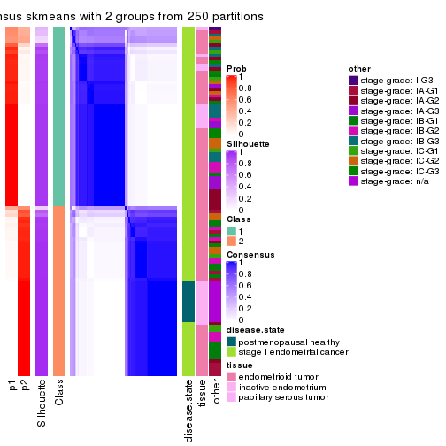</p>

</div>
<div id='tab-SD-skmeans-consensus-heatmap-2'>
<pre><code class="r">consensus_heatmap(res, k = 3)
</code></pre>

<p>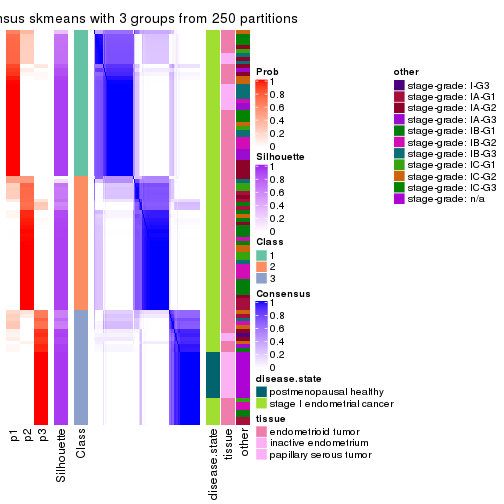</p>

</div>
<div id='tab-SD-skmeans-consensus-heatmap-3'>
<pre><code class="r">consensus_heatmap(res, k = 4)
</code></pre>

<p>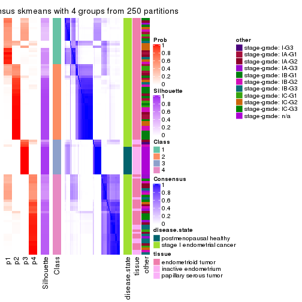</p>

</div>
<div id='tab-SD-skmeans-consensus-heatmap-4'>
<pre><code class="r">consensus_heatmap(res, k = 5)
</code></pre>

<p>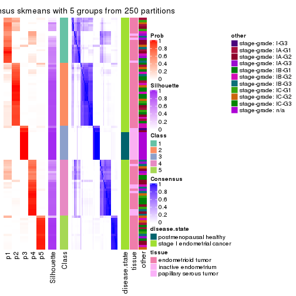</p>

</div>
<div id='tab-SD-skmeans-consensus-heatmap-5'>
<pre><code class="r">consensus_heatmap(res, k = 6)
</code></pre>

<p>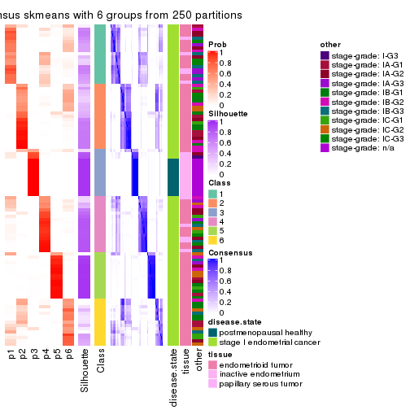</p>

</div>
</div>

Heatmaps for the membership of samples in all partitions to see how consistent they are:


<script>
$( function() {
	$( '#tabs-SD-skmeans-membership-heatmap' ).tabs();
} );
</script>
<div id='tabs-SD-skmeans-membership-heatmap'>
<ul>
<li><a href='#tab-SD-skmeans-membership-heatmap-1'>k = 2</a></li>
<li><a href='#tab-SD-skmeans-membership-heatmap-2'>k = 3</a></li>
<li><a href='#tab-SD-skmeans-membership-heatmap-3'>k = 4</a></li>
<li><a href='#tab-SD-skmeans-membership-heatmap-4'>k = 5</a></li>
<li><a href='#tab-SD-skmeans-membership-heatmap-5'>k = 6</a></li>
</ul>
<div id='tab-SD-skmeans-membership-heatmap-1'>
<pre><code class="r">membership_heatmap(res, k = 2)
</code></pre>

<p>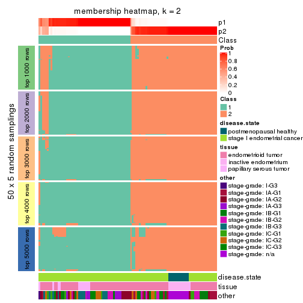</p>

</div>
<div id='tab-SD-skmeans-membership-heatmap-2'>
<pre><code class="r">membership_heatmap(res, k = 3)
</code></pre>

<p>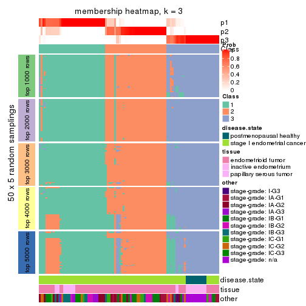</p>

</div>
<div id='tab-SD-skmeans-membership-heatmap-3'>
<pre><code class="r">membership_heatmap(res, k = 4)
</code></pre>

<p>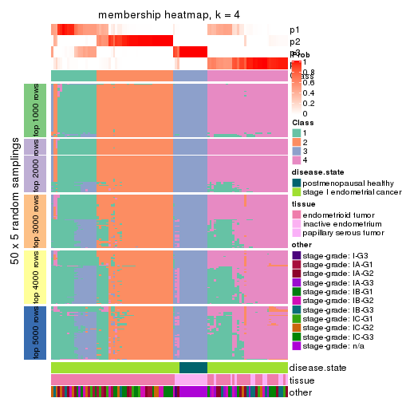</p>

</div>
<div id='tab-SD-skmeans-membership-heatmap-4'>
<pre><code class="r">membership_heatmap(res, k = 5)
</code></pre>

<p>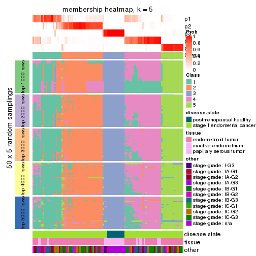</p>

</div>
<div id='tab-SD-skmeans-membership-heatmap-5'>
<pre><code class="r">membership_heatmap(res, k = 6)
</code></pre>

<p>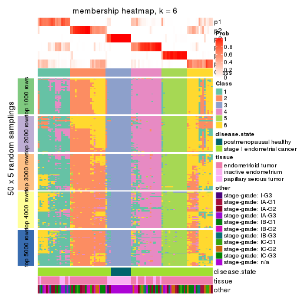</p>

</div>
</div>

As soon as we have had the classes for columns, we can look for signatures
which are significantly different between classes which can be candidate marks
for certain classes. Following are the heatmaps for signatures.


Signature heatmaps where rows are scaled:


<script>
$( function() {
	$( '#tabs-SD-skmeans-get-signatures' ).tabs();
} );
</script>
<div id='tabs-SD-skmeans-get-signatures'>
<ul>
<li><a href='#tab-SD-skmeans-get-signatures-1'>k = 2</a></li>
<li><a href='#tab-SD-skmeans-get-signatures-2'>k = 3</a></li>
<li><a href='#tab-SD-skmeans-get-signatures-3'>k = 4</a></li>
<li><a href='#tab-SD-skmeans-get-signatures-4'>k = 5</a></li>
<li><a href='#tab-SD-skmeans-get-signatures-5'>k = 6</a></li>
</ul>
<div id='tab-SD-skmeans-get-signatures-1'>
<pre><code class="r">get_signatures(res, k = 2)
</code></pre>

<p>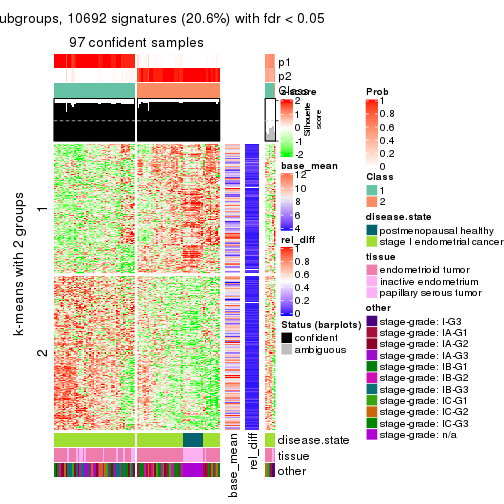</p>

</div>
<div id='tab-SD-skmeans-get-signatures-2'>
<pre><code class="r">get_signatures(res, k = 3)
</code></pre>

<p>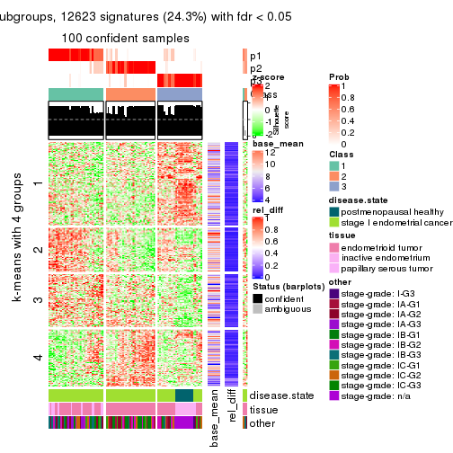</p>

</div>
<div id='tab-SD-skmeans-get-signatures-3'>
<pre><code class="r">get_signatures(res, k = 4)
</code></pre>

<p>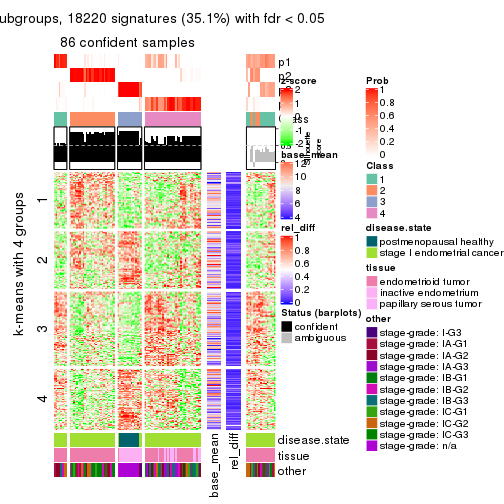</p>

</div>
<div id='tab-SD-skmeans-get-signatures-4'>
<pre><code class="r">get_signatures(res, k = 5)
</code></pre>

<p>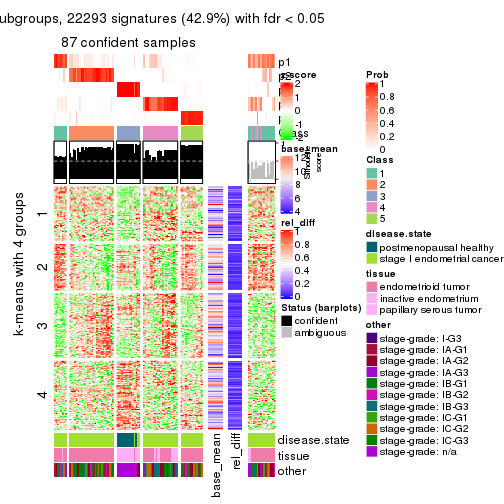</p>

</div>
<div id='tab-SD-skmeans-get-signatures-5'>
<pre><code class="r">get_signatures(res, k = 6)
</code></pre>

<p>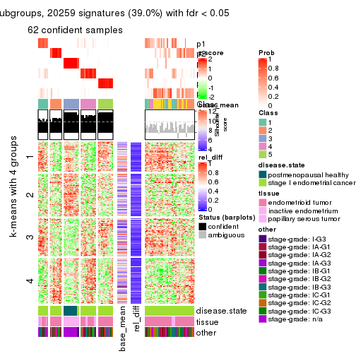</p>

</div>
</div>


Signature heatmaps where rows are not scaled:


<script>
$( function() {
	$( '#tabs-SD-skmeans-get-signatures-no-scale' ).tabs();
} );
</script>
<div id='tabs-SD-skmeans-get-signatures-no-scale'>
<ul>
<li><a href='#tab-SD-skmeans-get-signatures-no-scale-1'>k = 2</a></li>
<li><a href='#tab-SD-skmeans-get-signatures-no-scale-2'>k = 3</a></li>
<li><a href='#tab-SD-skmeans-get-signatures-no-scale-3'>k = 4</a></li>
<li><a href='#tab-SD-skmeans-get-signatures-no-scale-4'>k = 5</a></li>
<li><a href='#tab-SD-skmeans-get-signatures-no-scale-5'>k = 6</a></li>
</ul>
<div id='tab-SD-skmeans-get-signatures-no-scale-1'>
<pre><code class="r">get_signatures(res, k = 2, scale_rows = FALSE)
</code></pre>

<p>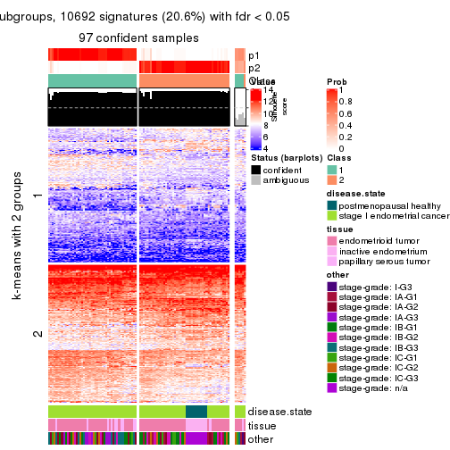</p>

</div>
<div id='tab-SD-skmeans-get-signatures-no-scale-2'>
<pre><code class="r">get_signatures(res, k = 3, scale_rows = FALSE)
</code></pre>

<p>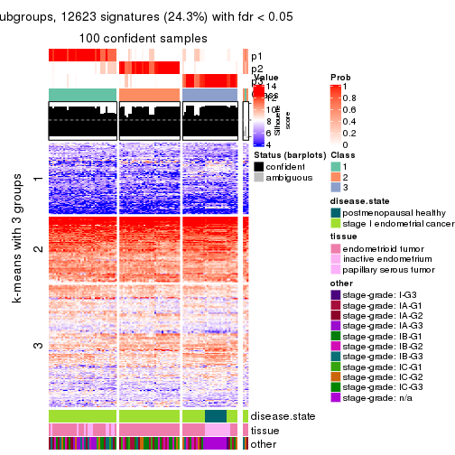</p>

</div>
<div id='tab-SD-skmeans-get-signatures-no-scale-3'>
<pre><code class="r">get_signatures(res, k = 4, scale_rows = FALSE)
</code></pre>

<p>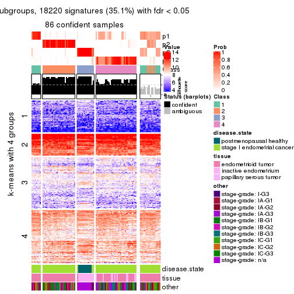</p>

</div>
<div id='tab-SD-skmeans-get-signatures-no-scale-4'>
<pre><code class="r">get_signatures(res, k = 5, scale_rows = FALSE)
</code></pre>

<p>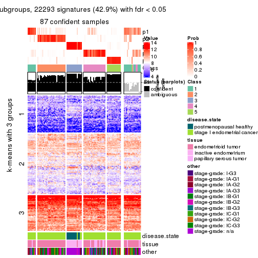</p>

</div>
<div id='tab-SD-skmeans-get-signatures-no-scale-5'>
<pre><code class="r">get_signatures(res, k = 6, scale_rows = FALSE)
</code></pre>

<p>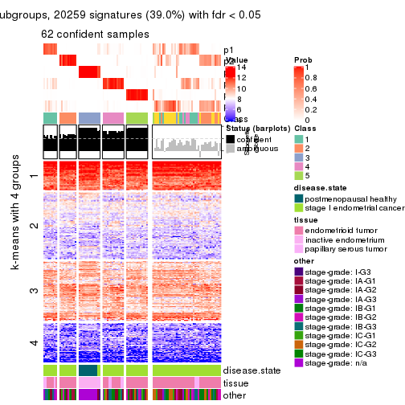</p>

</div>
</div>


Compare the overlap of signatures from different k:

```r
compare_signatures(res)
```

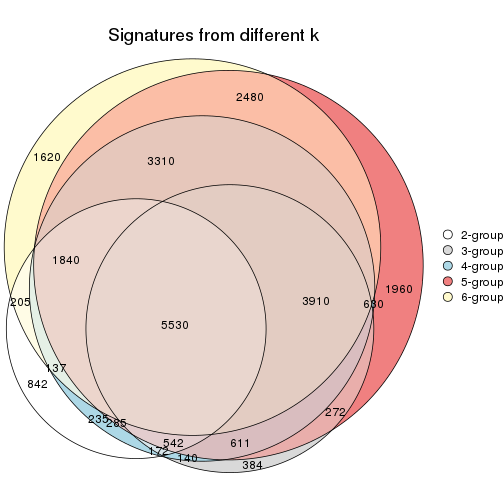

`get_signature()` returns a data frame invisibly. TO get the list of signatures, the function
call should be assigned to a variable explicitly. In following code, if `plot` argument is set
to `FALSE`, no heatmap is plotted while only the differential analysis is performed.

```r
# code only for demonstration
tb = get_signature(res, k = ..., plot = FALSE)
```

An example of the output of `tb` is:

```
#>   which_row         fdr    mean_1    mean_2 scaled_mean_1 scaled_mean_2 km
#> 1        38 0.042760348  8.373488  9.131774    -0.5533452     0.5164555  1
#> 2        40 0.018707592  7.106213  8.469186    -0.6173731     0.5762149  1
#> 3        55 0.019134737 10.221463 11.207825    -0.6159697     0.5749050  1
#> 4        59 0.006059896  5.921854  7.869574    -0.6899429     0.6439467  1
#> 5        60 0.018055526  8.928898 10.211722    -0.6204761     0.5791110  1
#> 6        98 0.009384629 15.714769 14.887706     0.6635654    -0.6193277  2
...
```

The columns in `tb` are:

1. `which_row`: row indices corresponding to the input matrix.
2. `fdr`: FDR for the differential test. 
3. `mean_x`: The mean value in group x.
4. `scaled_mean_x`: The mean value in group x after rows are scaled.
5. `km`: Row groups if k-means clustering is applied to rows.


UMAP plot which shows how samples are separated.


<script>
$( function() {
	$( '#tabs-SD-skmeans-dimension-reduction' ).tabs();
} );
</script>
<div id='tabs-SD-skmeans-dimension-reduction'>
<ul>
<li><a href='#tab-SD-skmeans-dimension-reduction-1'>k = 2</a></li>
<li><a href='#tab-SD-skmeans-dimension-reduction-2'>k = 3</a></li>
<li><a href='#tab-SD-skmeans-dimension-reduction-3'>k = 4</a></li>
<li><a href='#tab-SD-skmeans-dimension-reduction-4'>k = 5</a></li>
<li><a href='#tab-SD-skmeans-dimension-reduction-5'>k = 6</a></li>
</ul>
<div id='tab-SD-skmeans-dimension-reduction-1'>
<pre><code class="r">dimension_reduction(res, k = 2, method = &quot;UMAP&quot;)
</code></pre>

<p>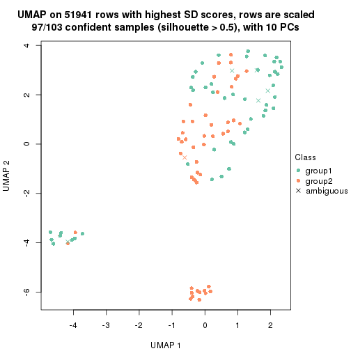</p>

</div>
<div id='tab-SD-skmeans-dimension-reduction-2'>
<pre><code class="r">dimension_reduction(res, k = 3, method = &quot;UMAP&quot;)
</code></pre>

<p>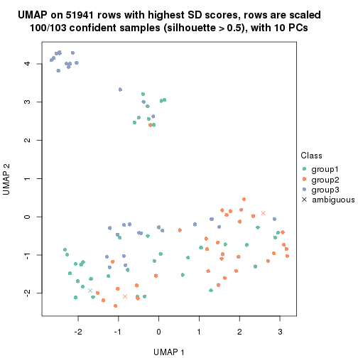</p>

</div>
<div id='tab-SD-skmeans-dimension-reduction-3'>
<pre><code class="r">dimension_reduction(res, k = 4, method = &quot;UMAP&quot;)
</code></pre>

<p>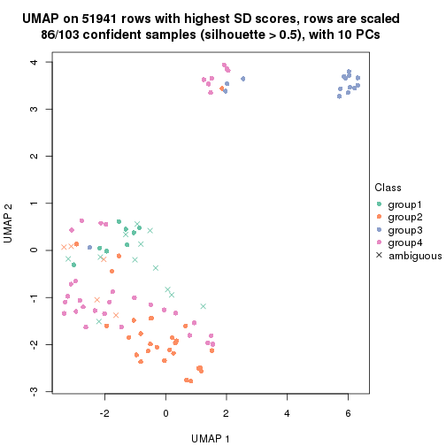</p>

</div>
<div id='tab-SD-skmeans-dimension-reduction-4'>
<pre><code class="r">dimension_reduction(res, k = 5, method = &quot;UMAP&quot;)
</code></pre>

<p>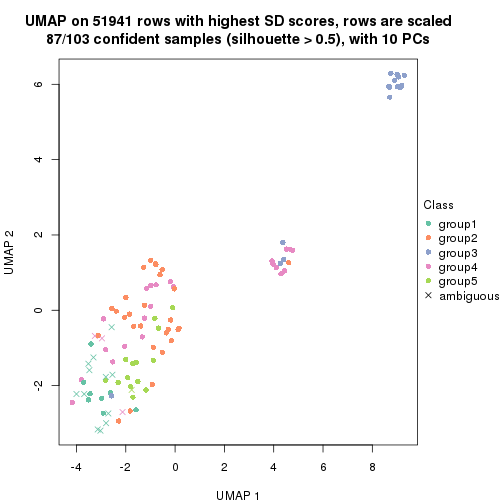</p>

</div>
<div id='tab-SD-skmeans-dimension-reduction-5'>
<pre><code class="r">dimension_reduction(res, k = 6, method = &quot;UMAP&quot;)
</code></pre>

<p>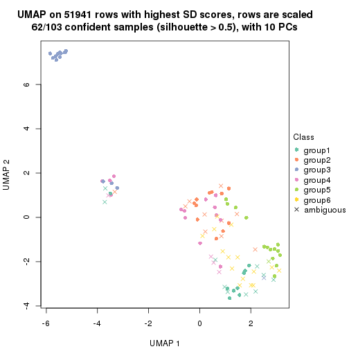</p>

</div>
</div>


Following heatmap shows how subgroups are split when increasing `k`:

```r
collect_classes(res)
```

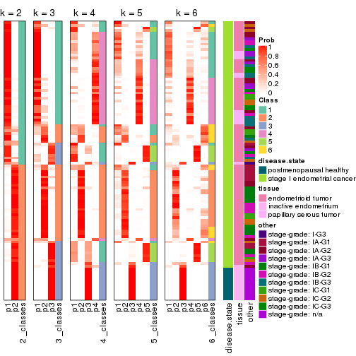


Test correlation between subgroups and known annotations. If the known
annotation is numeric, one-way ANOVA test is applied, and if the known
annotation is discrete, chi-squared contingency table test is applied.

```r
test_to_known_factors(res)
```

```
#>              n disease.state(p) tissue(p) other(p) k
#> SD:skmeans  97         7.96e-04  6.10e-05 2.11e-07 2
#> SD:skmeans 100         1.23e-07  5.81e-09 4.48e-08 3
#> SD:skmeans  86         3.05e-14  3.60e-15 1.87e-12 4
#> SD:skmeans  87         1.07e-13  9.29e-15 8.86e-08 5
#> SD:skmeans  62         2.21e-10  1.48e-10 8.94e-06 6
```


If matrix rows can be associated to genes, consider to use `functional_enrichment(res,
...)` to perform function enrichment for the signature genes. See [this vignette](http://bioconductor.org/packages/devel/bioc/vignettes/cola/inst/doc/functional_enrichment.html) for more detailed explanations.


 

---------------------------------------------------


### SD:pam


The object with results only for a single top-value method and a single partition method 
can be extracted as:

```r
res = res_list["SD", "pam"]
# you can also extract it by
# res = res_list["SD:pam"]
```

A summary of `res` and all the functions that can be applied to it:

```r
res
```

```
#> A 'ConsensusPartition' object with k = 2, 3, 4, 5, 6.
#>   On a matrix with 51941 rows and 103 columns.
#>   Top rows (1000, 2000, 3000, 4000, 5000) are extracted by 'SD' method.
#>   Subgroups are detected by 'pam' method.
#>   Performed in total 1250 partitions by row resampling.
#>   Best k for subgroups seems to be 4.
#> 
#> Following methods can be applied to this 'ConsensusPartition' object:
#>  [1] "cola_report"             "collect_classes"         "collect_plots"          
#>  [4] "collect_stats"           "colnames"                "compare_signatures"     
#>  [7] "consensus_heatmap"       "dimension_reduction"     "functional_enrichment"  
#> [10] "get_anno_col"            "get_anno"                "get_classes"            
#> [13] "get_consensus"           "get_matrix"              "get_membership"         
#> [16] "get_param"               "get_signatures"          "get_stats"              
#> [19] "is_best_k"               "is_stable_k"             "membership_heatmap"     
#> [22] "ncol"                    "nrow"                    "plot_ecdf"              
#> [25] "rownames"                "select_partition_number" "show"                   
#> [28] "suggest_best_k"          "test_to_known_factors"
```

`collect_plots()` function collects all the plots made from `res` for all `k` (number of partitions)
into one single page to provide an easy and fast comparison between different `k`.

```r
collect_plots(res)
```

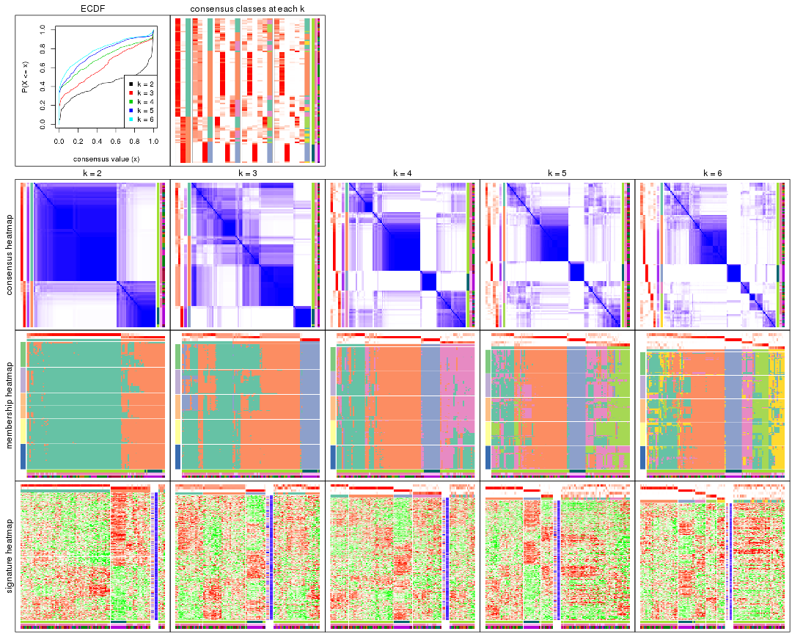

The plots are:

- The first row: a plot of the ECDF (empirical cumulative distribution
  function) curves of the consensus matrix for each `k` and the heatmap of
  predicted classes for each `k`.
- The second row: heatmaps of the consensus matrix for each `k`.
- The third row: heatmaps of the membership matrix for each `k`.
- The fouth row: heatmaps of the signatures for each `k`.

All the plots in panels can be made by individual functions and they are
plotted later in this section.

`select_partition_number()` produces several plots showing different
statistics for choosing "optimized" `k`. There are following statistics:

- ECDF curves of the consensus matrix for each `k`;
- 1-PAC. [The PAC
  score](https://en.wikipedia.org/wiki/Consensus_clustering#Over-interpretation_potential_of_consensus_clustering)
  measures the proportion of the ambiguous subgrouping.
- Mean silhouette score.
- Concordance. The mean probability of fiting the consensus class ids in all
  partitions.
- Area increased. Denote $A_k$ as the area under the ECDF curve for current
  `k`, the area increased is defined as $A_k - A_{k-1}$.
- Rand index. The percent of pairs of samples that are both in a same cluster
  or both are not in a same cluster in the partition of k and k-1.
- Jaccard index. The ratio of pairs of samples are both in a same cluster in
  the partition of k and k-1 and the pairs of samples are both in a same
  cluster in the partition k or k-1.

The detailed explanations of these statistics can be found in [the _cola_
vignette](http://bioconductor.org/packages/devel/bioc/vignettes/cola/inst/doc/cola.html#toc_13).

Generally speaking, lower PAC score, higher mean silhouette score or higher
concordance corresponds to better partition. Rand index and Jaccard index
measure how similar the current partition is compared to partition with `k-1`.
If they are too similar, we won't accept `k` is better than `k-1`.

```r
select_partition_number(res)
```

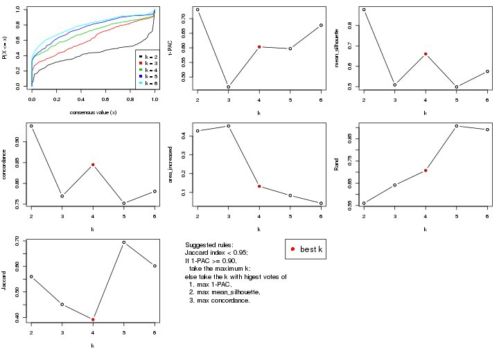

The numeric values for all these statistics can be obtained by `get_stats()`.

```r
get_stats(res)
```

```
#>   k 1-PAC mean_silhouette concordance area_increased  Rand Jaccard
#> 2 2 0.731           0.878       0.938         0.4275 0.560   0.560
#> 3 3 0.466           0.509       0.769         0.4536 0.642   0.451
#> 4 4 0.603           0.661       0.845         0.1324 0.707   0.392
#> 5 5 0.597           0.499       0.752         0.0836 0.907   0.694
#> 6 6 0.677           0.575       0.781         0.0422 0.891   0.602
```

`suggest_best_k()` suggests the best $k$ based on these statistics. The rules are as follows:

- All $k$ with Jaccard index larger than 0.95 are removed because increasing
  $k$ does not provide enough extra information. If all $k$ are removed, it is
  marked as no subgroup is detected.
- For all $k$ with 1-PAC score larger than 0.9, the maximal $k$ is taken as
  the best $k$, and other $k$ are marked as optional $k$.
- If it does not fit the second rule. The $k$ with the maximal vote of the
  highest 1-PAC score, highest mean silhouette, and highest concordance is
  taken as the best $k$.

```r
suggest_best_k(res)
```

```
#> [1] 4
```


Following shows the table of the partitions (You need to click the **show/hide
code output** link to see it). The membership matrix (columns with name `p*`)
is inferred by
[`clue::cl_consensus()`](https://www.rdocumentation.org/link/cl_consensus?package=clue)
function with the `SE` method. Basically the value in the membership matrix
represents the probability to belong to a certain group. The finall class
label for an item is determined with the group with highest probability it
belongs to.

In `get_classes()` function, the entropy is calculated from the membership
matrix and the silhouette score is calculated from the consensus matrix.


<script>
$( function() {
	$( '#tabs-SD-pam-get-classes' ).tabs();
} );
</script>
<div id='tabs-SD-pam-get-classes'>
<ul>
<li><a href='#tab-SD-pam-get-classes-1'>k = 2</a></li>
<li><a href='#tab-SD-pam-get-classes-2'>k = 3</a></li>
<li><a href='#tab-SD-pam-get-classes-3'>k = 4</a></li>
<li><a href='#tab-SD-pam-get-classes-4'>k = 5</a></li>
<li><a href='#tab-SD-pam-get-classes-5'>k = 6</a></li>
</ul>

<div id='tab-SD-pam-get-classes-1'>
<p><a id='tab-SD-pam-get-classes-1-a' style='color:#0366d6' href='#'>show/hide code output</a></p>
<pre><code class="r">cbind(get_classes(res, k = 2), get_membership(res, k = 2))
</code></pre>

<pre><code>#&gt;           class entropy silhouette    p1    p2
#&gt; GSM425907     1  0.0000      0.959 1.000 0.000
#&gt; GSM425908     1  0.0000      0.959 1.000 0.000
#&gt; GSM425909     2  0.2423      0.874 0.040 0.960
#&gt; GSM425910     1  0.0000      0.959 1.000 0.000
#&gt; GSM425911     1  0.0000      0.959 1.000 0.000
#&gt; GSM425912     1  0.0000      0.959 1.000 0.000
#&gt; GSM425913     1  0.0000      0.959 1.000 0.000
#&gt; GSM425914     1  0.0000      0.959 1.000 0.000
#&gt; GSM425915     2  0.3274      0.873 0.060 0.940
#&gt; GSM425874     1  0.0938      0.956 0.988 0.012
#&gt; GSM425875     1  0.4815      0.873 0.896 0.104
#&gt; GSM425876     1  0.2423      0.931 0.960 0.040
#&gt; GSM425877     2  0.6048      0.824 0.148 0.852
#&gt; GSM425878     1  0.0672      0.957 0.992 0.008
#&gt; GSM425879     1  0.6438      0.770 0.836 0.164
#&gt; GSM425880     2  0.5178      0.844 0.116 0.884
#&gt; GSM425881     1  0.0000      0.959 1.000 0.000
#&gt; GSM425882     1  0.0000      0.959 1.000 0.000
#&gt; GSM425883     1  0.5629      0.847 0.868 0.132
#&gt; GSM425884     2  0.9661      0.477 0.392 0.608
#&gt; GSM425885     1  0.0938      0.956 0.988 0.012
#&gt; GSM425848     1  0.3584      0.914 0.932 0.068
#&gt; GSM425849     1  0.0938      0.956 0.988 0.012
#&gt; GSM425850     1  0.0000      0.959 1.000 0.000
#&gt; GSM425851     1  0.9881      0.227 0.564 0.436
#&gt; GSM425852     2  0.0938      0.876 0.012 0.988
#&gt; GSM425893     1  0.0000      0.959 1.000 0.000
#&gt; GSM425894     1  0.0000      0.959 1.000 0.000
#&gt; GSM425895     1  0.0000      0.959 1.000 0.000
#&gt; GSM425896     1  0.3274      0.912 0.940 0.060
#&gt; GSM425897     1  0.0000      0.959 1.000 0.000
#&gt; GSM425898     1  0.0000      0.959 1.000 0.000
#&gt; GSM425899     1  0.0000      0.959 1.000 0.000
#&gt; GSM425900     1  0.0000      0.959 1.000 0.000
#&gt; GSM425901     2  0.2778      0.872 0.048 0.952
#&gt; GSM425902     1  0.0938      0.956 0.988 0.012
#&gt; GSM425903     2  0.8443      0.717 0.272 0.728
#&gt; GSM425904     2  0.4939      0.848 0.108 0.892
#&gt; GSM425905     1  0.0376      0.957 0.996 0.004
#&gt; GSM425906     1  0.0000      0.959 1.000 0.000
#&gt; GSM425863     1  0.0938      0.956 0.988 0.012
#&gt; GSM425864     1  0.0000      0.959 1.000 0.000
#&gt; GSM425865     1  0.0000      0.959 1.000 0.000
#&gt; GSM425866     1  0.8813      0.507 0.700 0.300
#&gt; GSM425867     2  0.0000      0.874 0.000 1.000
#&gt; GSM425868     1  0.0938      0.956 0.988 0.012
#&gt; GSM425869     1  0.5842      0.807 0.860 0.140
#&gt; GSM425870     2  0.5408      0.840 0.124 0.876
#&gt; GSM425871     1  0.0938      0.956 0.988 0.012
#&gt; GSM425872     1  0.0000      0.959 1.000 0.000
#&gt; GSM425873     1  0.0000      0.959 1.000 0.000
#&gt; GSM425843     1  0.3584      0.914 0.932 0.068
#&gt; GSM425844     1  0.0938      0.956 0.988 0.012
#&gt; GSM425845     1  0.0938      0.953 0.988 0.012
#&gt; GSM425846     1  0.0000      0.959 1.000 0.000
#&gt; GSM425847     1  0.0000      0.959 1.000 0.000
#&gt; GSM425886     2  0.9087      0.583 0.324 0.676
#&gt; GSM425887     1  0.0000      0.959 1.000 0.000
#&gt; GSM425888     1  0.0000      0.959 1.000 0.000
#&gt; GSM425889     2  0.9358      0.562 0.352 0.648
#&gt; GSM425890     1  0.1184      0.955 0.984 0.016
#&gt; GSM425891     1  0.0938      0.953 0.988 0.012
#&gt; GSM425892     1  0.0000      0.959 1.000 0.000
#&gt; GSM425853     1  0.0938      0.956 0.988 0.012
#&gt; GSM425854     1  0.0000      0.959 1.000 0.000
#&gt; GSM425855     2  0.9358      0.580 0.352 0.648
#&gt; GSM425856     1  0.0376      0.958 0.996 0.004
#&gt; GSM425857     1  0.9815      0.267 0.580 0.420
#&gt; GSM425858     1  0.0000      0.959 1.000 0.000
#&gt; GSM425859     1  0.0000      0.959 1.000 0.000
#&gt; GSM425860     2  0.7815      0.760 0.232 0.768
#&gt; GSM425861     1  0.0000      0.959 1.000 0.000
#&gt; GSM425862     1  0.4431      0.889 0.908 0.092
#&gt; GSM425837     1  0.3274      0.925 0.940 0.060
#&gt; GSM425838     1  0.0938      0.956 0.988 0.012
#&gt; GSM425839     1  0.0376      0.957 0.996 0.004
#&gt; GSM425840     2  0.9710      0.479 0.400 0.600
#&gt; GSM425841     1  0.0938      0.956 0.988 0.012
#&gt; GSM425842     1  0.0938      0.956 0.988 0.012
#&gt; GSM425917     2  0.0938      0.879 0.012 0.988
#&gt; GSM425922     1  0.1633      0.952 0.976 0.024
#&gt; GSM425919     2  0.6887      0.803 0.184 0.816
#&gt; GSM425920     2  0.9933      0.313 0.452 0.548
#&gt; GSM425923     1  0.3114      0.926 0.944 0.056
#&gt; GSM425916     2  0.4022      0.861 0.080 0.920
#&gt; GSM425918     1  0.0938      0.956 0.988 0.012
#&gt; GSM425921     1  0.3114      0.928 0.944 0.056
#&gt; GSM425925     1  0.0938      0.956 0.988 0.012
#&gt; GSM425926     1  0.1414      0.953 0.980 0.020
#&gt; GSM425927     1  0.3733      0.898 0.928 0.072
#&gt; GSM425924     2  0.0938      0.879 0.012 0.988
#&gt; GSM425928     2  0.0938      0.879 0.012 0.988
#&gt; GSM425929     2  0.0938      0.879 0.012 0.988
#&gt; GSM425930     2  0.0938      0.879 0.012 0.988
#&gt; GSM425931     2  0.0376      0.876 0.004 0.996
#&gt; GSM425932     2  0.0938      0.879 0.012 0.988
#&gt; GSM425933     2  0.0938      0.879 0.012 0.988
#&gt; GSM425934     2  0.0938      0.879 0.012 0.988
#&gt; GSM425935     2  0.0938      0.879 0.012 0.988
#&gt; GSM425936     2  0.0938      0.879 0.012 0.988
#&gt; GSM425937     2  0.0938      0.879 0.012 0.988
#&gt; GSM425938     2  0.0672      0.878 0.008 0.992
#&gt; GSM425939     2  0.0938      0.879 0.012 0.988
</code></pre>

<script>
$('#tab-SD-pam-get-classes-1-a').parent().next().next().hide();
$('#tab-SD-pam-get-classes-1-a').click(function(){
  $('#tab-SD-pam-get-classes-1-a').parent().next().next().toggle();
  return(false);
});
</script>
</div>

<div id='tab-SD-pam-get-classes-2'>
<p><a id='tab-SD-pam-get-classes-2-a' style='color:#0366d6' href='#'>show/hide code output</a></p>
<pre><code class="r">cbind(get_classes(res, k = 3), get_membership(res, k = 3))
</code></pre>

<pre><code>#&gt;           class entropy silhouette    p1    p2    p3
#&gt; GSM425907     2  0.6295     0.6822 0.472 0.528 0.000
#&gt; GSM425908     2  0.6295     0.6822 0.472 0.528 0.000
#&gt; GSM425909     1  0.8939     0.5524 0.560 0.264 0.176
#&gt; GSM425910     1  0.0747     0.3822 0.984 0.016 0.000
#&gt; GSM425911     2  0.6299     0.6800 0.476 0.524 0.000
#&gt; GSM425912     1  0.6299    -0.6519 0.524 0.476 0.000
#&gt; GSM425913     2  0.6295     0.6822 0.472 0.528 0.000
#&gt; GSM425914     1  0.2356     0.2645 0.928 0.072 0.000
#&gt; GSM425915     1  0.5541     0.4465 0.740 0.008 0.252
#&gt; GSM425874     2  0.0424     0.3513 0.008 0.992 0.000
#&gt; GSM425875     1  0.6973     0.5971 0.564 0.416 0.020
#&gt; GSM425876     1  0.2066     0.4390 0.940 0.060 0.000
#&gt; GSM425877     1  0.6516     0.5936 0.516 0.480 0.004
#&gt; GSM425878     2  0.5948     0.5966 0.360 0.640 0.000
#&gt; GSM425879     2  0.6295     0.6822 0.472 0.528 0.000
#&gt; GSM425880     1  0.8938     0.5616 0.552 0.284 0.164
#&gt; GSM425881     1  0.6204    -0.5896 0.576 0.424 0.000
#&gt; GSM425882     2  0.6305     0.6792 0.484 0.516 0.000
#&gt; GSM425883     1  0.6302     0.5939 0.520 0.480 0.000
#&gt; GSM425884     1  0.6302     0.5939 0.520 0.480 0.000
#&gt; GSM425885     2  0.4555     0.5223 0.200 0.800 0.000
#&gt; GSM425848     2  0.6204    -0.5311 0.424 0.576 0.000
#&gt; GSM425849     2  0.6307    -0.5917 0.488 0.512 0.000
#&gt; GSM425850     2  0.6299     0.6801 0.476 0.524 0.000
#&gt; GSM425851     2  0.3083     0.3567 0.024 0.916 0.060
#&gt; GSM425852     2  0.9606    -0.4322 0.340 0.448 0.212
#&gt; GSM425893     1  0.6307    -0.6678 0.512 0.488 0.000
#&gt; GSM425894     2  0.6295     0.6822 0.472 0.528 0.000
#&gt; GSM425895     2  0.6305     0.6792 0.484 0.516 0.000
#&gt; GSM425896     2  0.6302     0.6769 0.480 0.520 0.000
#&gt; GSM425897     2  0.6299     0.6800 0.476 0.524 0.000
#&gt; GSM425898     2  0.6302     0.6808 0.480 0.520 0.000
#&gt; GSM425899     2  0.6305     0.6786 0.484 0.516 0.000
#&gt; GSM425900     2  0.6302     0.6808 0.480 0.520 0.000
#&gt; GSM425901     1  0.9243     0.5188 0.528 0.264 0.208
#&gt; GSM425902     2  0.3412     0.4632 0.124 0.876 0.000
#&gt; GSM425903     1  0.4702     0.4869 0.788 0.000 0.212
#&gt; GSM425904     1  0.8984     0.5612 0.524 0.328 0.148
#&gt; GSM425905     2  0.6295     0.6822 0.472 0.528 0.000
#&gt; GSM425906     2  0.6295     0.6822 0.472 0.528 0.000
#&gt; GSM425863     1  0.6302     0.5939 0.520 0.480 0.000
#&gt; GSM425864     2  0.6299     0.6800 0.476 0.524 0.000
#&gt; GSM425865     2  0.6295     0.6822 0.472 0.528 0.000
#&gt; GSM425866     1  0.7032     0.5884 0.676 0.272 0.052
#&gt; GSM425867     1  0.6305     0.0554 0.516 0.000 0.484
#&gt; GSM425868     2  0.5760     0.6003 0.328 0.672 0.000
#&gt; GSM425869     2  0.6295     0.6822 0.472 0.528 0.000
#&gt; GSM425870     1  0.6452     0.4226 0.704 0.032 0.264
#&gt; GSM425871     2  0.3482     0.4666 0.128 0.872 0.000
#&gt; GSM425872     2  0.6305     0.6805 0.484 0.516 0.000
#&gt; GSM425873     1  0.4605     0.5402 0.796 0.204 0.000
#&gt; GSM425843     1  0.6302     0.5939 0.520 0.480 0.000
#&gt; GSM425844     2  0.1860     0.3942 0.052 0.948 0.000
#&gt; GSM425845     1  0.0000     0.3851 1.000 0.000 0.000
#&gt; GSM425846     2  0.6302     0.6808 0.480 0.520 0.000
#&gt; GSM425847     1  0.6079    -0.5362 0.612 0.388 0.000
#&gt; GSM425886     3  0.4068     0.8480 0.120 0.016 0.864
#&gt; GSM425887     1  0.0424     0.3807 0.992 0.008 0.000
#&gt; GSM425888     2  0.6302     0.6808 0.480 0.520 0.000
#&gt; GSM425889     1  0.6302     0.5939 0.520 0.480 0.000
#&gt; GSM425890     2  0.4121     0.4996 0.168 0.832 0.000
#&gt; GSM425891     2  0.6295     0.6822 0.472 0.528 0.000
#&gt; GSM425892     2  0.6295     0.6822 0.472 0.528 0.000
#&gt; GSM425853     1  0.5465     0.5521 0.712 0.288 0.000
#&gt; GSM425854     2  0.6302     0.6808 0.480 0.520 0.000
#&gt; GSM425855     1  0.6302     0.5939 0.520 0.480 0.000
#&gt; GSM425856     1  0.3038     0.4746 0.896 0.104 0.000
#&gt; GSM425857     2  0.5956     0.4741 0.264 0.720 0.016
#&gt; GSM425858     2  0.6305     0.6792 0.484 0.516 0.000
#&gt; GSM425859     2  0.6295     0.6822 0.472 0.528 0.000
#&gt; GSM425860     1  0.4353     0.4939 0.836 0.008 0.156
#&gt; GSM425861     1  0.3412     0.4945 0.876 0.124 0.000
#&gt; GSM425862     2  0.2711     0.2018 0.088 0.912 0.000
#&gt; GSM425837     1  0.6302     0.5939 0.520 0.480 0.000
#&gt; GSM425838     2  0.4178     0.5018 0.172 0.828 0.000
#&gt; GSM425839     2  0.6295     0.6822 0.472 0.528 0.000
#&gt; GSM425840     1  0.6302     0.5939 0.520 0.480 0.000
#&gt; GSM425841     2  0.1411     0.3900 0.036 0.964 0.000
#&gt; GSM425842     1  0.5465     0.5793 0.712 0.288 0.000
#&gt; GSM425917     3  0.0000     0.9739 0.000 0.000 1.000
#&gt; GSM425922     2  0.0000     0.3542 0.000 1.000 0.000
#&gt; GSM425919     1  0.7778     0.4042 0.644 0.092 0.264
#&gt; GSM425920     2  0.5553    -0.0246 0.272 0.724 0.004
#&gt; GSM425923     1  0.6307     0.5891 0.512 0.488 0.000
#&gt; GSM425916     2  0.8068    -0.5921 0.456 0.480 0.064
#&gt; GSM425918     2  0.5678    -0.3719 0.316 0.684 0.000
#&gt; GSM425921     2  0.0592     0.3474 0.012 0.988 0.000
#&gt; GSM425925     1  0.6302     0.5939 0.520 0.480 0.000
#&gt; GSM425926     2  0.0424     0.3513 0.008 0.992 0.000
#&gt; GSM425927     1  0.4629     0.5347 0.808 0.188 0.004
#&gt; GSM425924     3  0.6181     0.7256 0.104 0.116 0.780
#&gt; GSM425928     3  0.0000     0.9739 0.000 0.000 1.000
#&gt; GSM425929     3  0.0000     0.9739 0.000 0.000 1.000
#&gt; GSM425930     3  0.0000     0.9739 0.000 0.000 1.000
#&gt; GSM425931     3  0.0000     0.9739 0.000 0.000 1.000
#&gt; GSM425932     3  0.0000     0.9739 0.000 0.000 1.000
#&gt; GSM425933     3  0.0000     0.9739 0.000 0.000 1.000
#&gt; GSM425934     3  0.0000     0.9739 0.000 0.000 1.000
#&gt; GSM425935     3  0.0000     0.9739 0.000 0.000 1.000
#&gt; GSM425936     3  0.0000     0.9739 0.000 0.000 1.000
#&gt; GSM425937     3  0.0000     0.9739 0.000 0.000 1.000
#&gt; GSM425938     3  0.0000     0.9739 0.000 0.000 1.000
#&gt; GSM425939     3  0.0000     0.9739 0.000 0.000 1.000
</code></pre>

<script>
$('#tab-SD-pam-get-classes-2-a').parent().next().next().hide();
$('#tab-SD-pam-get-classes-2-a').click(function(){
  $('#tab-SD-pam-get-classes-2-a').parent().next().next().toggle();
  return(false);
});
</script>
</div>

<div id='tab-SD-pam-get-classes-3'>
<p><a id='tab-SD-pam-get-classes-3-a' style='color:#0366d6' href='#'>show/hide code output</a></p>
<pre><code class="r">cbind(get_classes(res, k = 4), get_membership(res, k = 4))
</code></pre>

<pre><code>#&gt;           class entropy silhouette    p1    p2    p3    p4
#&gt; GSM425907     2  0.0000     0.8691 0.000 1.000 0.000 0.000
#&gt; GSM425908     2  0.0336     0.8650 0.000 0.992 0.000 0.008
#&gt; GSM425909     1  0.0000     0.6742 1.000 0.000 0.000 0.000
#&gt; GSM425910     1  0.4967     0.2725 0.548 0.452 0.000 0.000
#&gt; GSM425911     2  0.0000     0.8691 0.000 1.000 0.000 0.000
#&gt; GSM425912     2  0.1211     0.8372 0.040 0.960 0.000 0.000
#&gt; GSM425913     2  0.0000     0.8691 0.000 1.000 0.000 0.000
#&gt; GSM425914     2  0.4948     0.0111 0.440 0.560 0.000 0.000
#&gt; GSM425915     1  0.0000     0.6742 1.000 0.000 0.000 0.000
#&gt; GSM425874     4  0.3801     0.5960 0.000 0.220 0.000 0.780
#&gt; GSM425875     1  0.2469     0.5982 0.892 0.000 0.000 0.108
#&gt; GSM425876     1  0.5657     0.5070 0.644 0.312 0.000 0.044
#&gt; GSM425877     4  0.4632     0.6411 0.308 0.004 0.000 0.688
#&gt; GSM425878     2  0.2542     0.7963 0.012 0.904 0.000 0.084
#&gt; GSM425879     2  0.0000     0.8691 0.000 1.000 0.000 0.000
#&gt; GSM425880     1  0.0000     0.6742 1.000 0.000 0.000 0.000
#&gt; GSM425881     2  0.2125     0.7995 0.076 0.920 0.000 0.004
#&gt; GSM425882     2  0.0188     0.8670 0.000 0.996 0.000 0.004
#&gt; GSM425883     4  0.4999     0.2815 0.492 0.000 0.000 0.508
#&gt; GSM425884     4  0.4972     0.3909 0.456 0.000 0.000 0.544
#&gt; GSM425885     2  0.4406     0.6491 0.028 0.780 0.000 0.192
#&gt; GSM425848     4  0.5499     0.6740 0.216 0.072 0.000 0.712
#&gt; GSM425849     4  0.4748     0.6668 0.268 0.016 0.000 0.716
#&gt; GSM425850     2  0.0000     0.8691 0.000 1.000 0.000 0.000
#&gt; GSM425851     4  0.5321     0.5498 0.000 0.140 0.112 0.748
#&gt; GSM425852     1  0.3479     0.5946 0.840 0.148 0.000 0.012
#&gt; GSM425893     2  0.4713     0.3319 0.360 0.640 0.000 0.000
#&gt; GSM425894     2  0.0000     0.8691 0.000 1.000 0.000 0.000
#&gt; GSM425895     2  0.0188     0.8670 0.000 0.996 0.000 0.004
#&gt; GSM425896     2  0.0000     0.8691 0.000 1.000 0.000 0.000
#&gt; GSM425897     2  0.0000     0.8691 0.000 1.000 0.000 0.000
#&gt; GSM425898     2  0.0000     0.8691 0.000 1.000 0.000 0.000
#&gt; GSM425899     2  0.0336     0.8645 0.008 0.992 0.000 0.000
#&gt; GSM425900     2  0.0000     0.8691 0.000 1.000 0.000 0.000
#&gt; GSM425901     1  0.0188     0.6723 0.996 0.000 0.000 0.004
#&gt; GSM425902     2  0.7338    -0.0706 0.156 0.440 0.000 0.404
#&gt; GSM425903     1  0.0000     0.6742 1.000 0.000 0.000 0.000
#&gt; GSM425904     1  0.0000     0.6742 1.000 0.000 0.000 0.000
#&gt; GSM425905     2  0.0000     0.8691 0.000 1.000 0.000 0.000
#&gt; GSM425906     2  0.0000     0.8691 0.000 1.000 0.000 0.000
#&gt; GSM425863     4  0.4679     0.5868 0.352 0.000 0.000 0.648
#&gt; GSM425864     2  0.0000     0.8691 0.000 1.000 0.000 0.000
#&gt; GSM425865     2  0.0000     0.8691 0.000 1.000 0.000 0.000
#&gt; GSM425866     1  0.0000     0.6742 1.000 0.000 0.000 0.000
#&gt; GSM425867     1  0.3610     0.5870 0.800 0.000 0.200 0.000
#&gt; GSM425868     2  0.1302     0.8380 0.000 0.956 0.000 0.044
#&gt; GSM425869     2  0.0000     0.8691 0.000 1.000 0.000 0.000
#&gt; GSM425870     1  0.5674     0.6079 0.720 0.148 0.132 0.000
#&gt; GSM425871     2  0.4761     0.3219 0.000 0.628 0.000 0.372
#&gt; GSM425872     2  0.0000     0.8691 0.000 1.000 0.000 0.000
#&gt; GSM425873     1  0.7380     0.2260 0.512 0.200 0.000 0.288
#&gt; GSM425843     4  0.4454     0.6383 0.308 0.000 0.000 0.692
#&gt; GSM425844     4  0.3052     0.6348 0.004 0.136 0.000 0.860
#&gt; GSM425845     1  0.2704     0.6576 0.876 0.124 0.000 0.000
#&gt; GSM425846     2  0.0000     0.8691 0.000 1.000 0.000 0.000
#&gt; GSM425847     2  0.2831     0.7394 0.120 0.876 0.000 0.004
#&gt; GSM425886     1  0.4804     0.0981 0.616 0.000 0.384 0.000
#&gt; GSM425887     2  0.5151    -0.0864 0.464 0.532 0.000 0.004
#&gt; GSM425888     2  0.0000     0.8691 0.000 1.000 0.000 0.000
#&gt; GSM425889     4  0.4585     0.6195 0.332 0.000 0.000 0.668
#&gt; GSM425890     4  0.4898     0.1488 0.000 0.416 0.000 0.584
#&gt; GSM425891     2  0.0000     0.8691 0.000 1.000 0.000 0.000
#&gt; GSM425892     2  0.0000     0.8691 0.000 1.000 0.000 0.000
#&gt; GSM425853     1  0.7191     0.3270 0.500 0.352 0.000 0.148
#&gt; GSM425854     2  0.0000     0.8691 0.000 1.000 0.000 0.000
#&gt; GSM425855     4  0.4304     0.6566 0.284 0.000 0.000 0.716
#&gt; GSM425856     1  0.3710     0.5996 0.804 0.192 0.000 0.004
#&gt; GSM425857     1  0.6215     0.3257 0.600 0.328 0.000 0.072
#&gt; GSM425858     2  0.0188     0.8670 0.000 0.996 0.000 0.004
#&gt; GSM425859     2  0.0000     0.8691 0.000 1.000 0.000 0.000
#&gt; GSM425860     2  0.6145    -0.1884 0.460 0.492 0.000 0.048
#&gt; GSM425861     1  0.7688     0.2220 0.456 0.284 0.000 0.260
#&gt; GSM425862     4  0.2216     0.6693 0.000 0.092 0.000 0.908
#&gt; GSM425837     4  0.4643     0.5983 0.344 0.000 0.000 0.656
#&gt; GSM425838     2  0.4898     0.2874 0.000 0.584 0.000 0.416
#&gt; GSM425839     2  0.0000     0.8691 0.000 1.000 0.000 0.000
#&gt; GSM425840     4  0.4277     0.6602 0.280 0.000 0.000 0.720
#&gt; GSM425841     4  0.4454     0.5003 0.000 0.308 0.000 0.692
#&gt; GSM425842     1  0.6780     0.3825 0.604 0.164 0.000 0.232
#&gt; GSM425917     3  0.3486     0.8021 0.000 0.000 0.812 0.188
#&gt; GSM425922     4  0.0592     0.6682 0.000 0.016 0.000 0.984
#&gt; GSM425919     2  0.8437    -0.2490 0.360 0.412 0.192 0.036
#&gt; GSM425920     4  0.3818     0.6547 0.048 0.108 0.000 0.844
#&gt; GSM425923     4  0.1716     0.6868 0.064 0.000 0.000 0.936
#&gt; GSM425916     4  0.1716     0.6868 0.064 0.000 0.000 0.936
#&gt; GSM425918     4  0.2124     0.6858 0.040 0.028 0.000 0.932
#&gt; GSM425921     4  0.0188     0.6665 0.000 0.004 0.000 0.996
#&gt; GSM425925     4  0.3528     0.6850 0.192 0.000 0.000 0.808
#&gt; GSM425926     4  0.3764     0.5985 0.000 0.216 0.000 0.784
#&gt; GSM425927     4  0.7111     0.3446 0.364 0.136 0.000 0.500
#&gt; GSM425924     3  0.5400     0.5166 0.000 0.020 0.608 0.372
#&gt; GSM425928     3  0.0000     0.9569 0.000 0.000 1.000 0.000
#&gt; GSM425929     3  0.0000     0.9569 0.000 0.000 1.000 0.000
#&gt; GSM425930     3  0.0000     0.9569 0.000 0.000 1.000 0.000
#&gt; GSM425931     3  0.0000     0.9569 0.000 0.000 1.000 0.000
#&gt; GSM425932     3  0.0000     0.9569 0.000 0.000 1.000 0.000
#&gt; GSM425933     3  0.0000     0.9569 0.000 0.000 1.000 0.000
#&gt; GSM425934     3  0.0000     0.9569 0.000 0.000 1.000 0.000
#&gt; GSM425935     3  0.0000     0.9569 0.000 0.000 1.000 0.000
#&gt; GSM425936     3  0.0000     0.9569 0.000 0.000 1.000 0.000
#&gt; GSM425937     3  0.0000     0.9569 0.000 0.000 1.000 0.000
#&gt; GSM425938     3  0.0000     0.9569 0.000 0.000 1.000 0.000
#&gt; GSM425939     3  0.0000     0.9569 0.000 0.000 1.000 0.000
</code></pre>

<script>
$('#tab-SD-pam-get-classes-3-a').parent().next().next().hide();
$('#tab-SD-pam-get-classes-3-a').click(function(){
  $('#tab-SD-pam-get-classes-3-a').parent().next().next().toggle();
  return(false);
});
</script>
</div>

<div id='tab-SD-pam-get-classes-4'>
<p><a id='tab-SD-pam-get-classes-4-a' style='color:#0366d6' href='#'>show/hide code output</a></p>
<pre><code class="r">cbind(get_classes(res, k = 5), get_membership(res, k = 5))
</code></pre>

<pre><code>#&gt;           class entropy silhouette    p1    p2    p3    p4    p5
#&gt; GSM425907     2  0.0162     0.8114 0.000 0.996 0.000 0.004 0.000
#&gt; GSM425908     2  0.0609     0.8064 0.000 0.980 0.000 0.020 0.000
#&gt; GSM425909     5  0.1341     0.6589 0.000 0.000 0.000 0.056 0.944
#&gt; GSM425910     2  0.6863    -0.1318 0.032 0.448 0.000 0.132 0.388
#&gt; GSM425911     2  0.0404     0.8082 0.000 0.988 0.000 0.012 0.000
#&gt; GSM425912     2  0.1934     0.7727 0.004 0.928 0.000 0.052 0.016
#&gt; GSM425913     2  0.0000     0.8119 0.000 1.000 0.000 0.000 0.000
#&gt; GSM425914     2  0.7128    -0.1101 0.016 0.400 0.000 0.256 0.328
#&gt; GSM425915     5  0.0000     0.6707 0.000 0.000 0.000 0.000 1.000
#&gt; GSM425874     4  0.5891    -0.0871 0.328 0.120 0.000 0.552 0.000
#&gt; GSM425875     5  0.4054     0.5128 0.020 0.000 0.000 0.248 0.732
#&gt; GSM425876     5  0.7687     0.1477 0.100 0.160 0.000 0.280 0.460
#&gt; GSM425877     1  0.6829     0.2509 0.496 0.016 0.000 0.272 0.216
#&gt; GSM425878     2  0.6369     0.3553 0.196 0.572 0.000 0.220 0.012
#&gt; GSM425879     2  0.0162     0.8112 0.000 0.996 0.000 0.004 0.000
#&gt; GSM425880     5  0.1851     0.6483 0.000 0.000 0.000 0.088 0.912
#&gt; GSM425881     2  0.6286     0.4163 0.092 0.604 0.000 0.260 0.044
#&gt; GSM425882     2  0.4876     0.5527 0.080 0.700 0.000 0.220 0.000
#&gt; GSM425883     4  0.6596     0.2039 0.236 0.000 0.000 0.456 0.308
#&gt; GSM425884     1  0.5917     0.2033 0.564 0.000 0.000 0.132 0.304
#&gt; GSM425885     2  0.5711     0.4169 0.060 0.668 0.000 0.224 0.048
#&gt; GSM425848     1  0.6902     0.0811 0.428 0.032 0.000 0.404 0.136
#&gt; GSM425849     1  0.6714     0.2446 0.520 0.024 0.000 0.300 0.156
#&gt; GSM425850     2  0.3731     0.6522 0.160 0.800 0.000 0.040 0.000
#&gt; GSM425851     1  0.2835     0.4185 0.868 0.112 0.016 0.004 0.000
#&gt; GSM425852     5  0.2843     0.6354 0.048 0.076 0.000 0.000 0.876
#&gt; GSM425893     2  0.6285     0.1217 0.012 0.484 0.000 0.108 0.396
#&gt; GSM425894     2  0.0000     0.8119 0.000 1.000 0.000 0.000 0.000
#&gt; GSM425895     2  0.4982     0.5413 0.088 0.692 0.000 0.220 0.000
#&gt; GSM425896     2  0.0324     0.8105 0.000 0.992 0.000 0.004 0.004
#&gt; GSM425897     2  0.0404     0.8102 0.000 0.988 0.000 0.012 0.000
#&gt; GSM425898     2  0.0000     0.8119 0.000 1.000 0.000 0.000 0.000
#&gt; GSM425899     2  0.0162     0.8110 0.000 0.996 0.000 0.004 0.000
#&gt; GSM425900     2  0.1041     0.7950 0.004 0.964 0.000 0.032 0.000
#&gt; GSM425901     5  0.1478     0.6553 0.000 0.000 0.000 0.064 0.936
#&gt; GSM425902     4  0.4349     0.1738 0.032 0.052 0.000 0.796 0.120
#&gt; GSM425903     5  0.0000     0.6707 0.000 0.000 0.000 0.000 1.000
#&gt; GSM425904     5  0.2179     0.6657 0.000 0.000 0.000 0.112 0.888
#&gt; GSM425905     2  0.0000     0.8119 0.000 1.000 0.000 0.000 0.000
#&gt; GSM425906     2  0.0000     0.8119 0.000 1.000 0.000 0.000 0.000
#&gt; GSM425863     4  0.6303     0.1485 0.268 0.000 0.000 0.528 0.204
#&gt; GSM425864     2  0.0162     0.8114 0.000 0.996 0.000 0.004 0.000
#&gt; GSM425865     2  0.0162     0.8114 0.000 0.996 0.000 0.004 0.000
#&gt; GSM425866     5  0.2448     0.6423 0.020 0.000 0.000 0.088 0.892
#&gt; GSM425867     5  0.4290     0.4792 0.000 0.000 0.304 0.016 0.680
#&gt; GSM425868     2  0.5450     0.4774 0.132 0.652 0.000 0.216 0.000
#&gt; GSM425869     2  0.0000     0.8119 0.000 1.000 0.000 0.000 0.000
#&gt; GSM425870     5  0.6007     0.4639 0.000 0.188 0.164 0.016 0.632
#&gt; GSM425871     4  0.6549     0.1280 0.360 0.204 0.000 0.436 0.000
#&gt; GSM425872     2  0.0000     0.8119 0.000 1.000 0.000 0.000 0.000
#&gt; GSM425873     4  0.8186     0.1324 0.232 0.116 0.000 0.352 0.300
#&gt; GSM425843     1  0.5490     0.3309 0.652 0.000 0.000 0.148 0.200
#&gt; GSM425844     1  0.3389     0.4216 0.836 0.048 0.000 0.116 0.000
#&gt; GSM425845     5  0.5596     0.4530 0.008 0.120 0.000 0.216 0.656
#&gt; GSM425846     2  0.0324     0.8104 0.004 0.992 0.000 0.004 0.000
#&gt; GSM425847     2  0.6363     0.4713 0.124 0.636 0.000 0.180 0.060
#&gt; GSM425886     5  0.4525     0.4664 0.000 0.000 0.220 0.056 0.724
#&gt; GSM425887     4  0.8093     0.0834 0.092 0.288 0.000 0.332 0.288
#&gt; GSM425888     2  0.0162     0.8114 0.004 0.996 0.000 0.000 0.000
#&gt; GSM425889     4  0.6458     0.1858 0.240 0.000 0.000 0.500 0.260
#&gt; GSM425890     1  0.6358    -0.0589 0.492 0.180 0.000 0.328 0.000
#&gt; GSM425891     2  0.0000     0.8119 0.000 1.000 0.000 0.000 0.000
#&gt; GSM425892     2  0.0162     0.8114 0.000 0.996 0.000 0.004 0.000
#&gt; GSM425853     5  0.8292    -0.1947 0.192 0.152 0.000 0.328 0.328
#&gt; GSM425854     2  0.0000     0.8119 0.000 1.000 0.000 0.000 0.000
#&gt; GSM425855     1  0.4703     0.3513 0.632 0.000 0.000 0.340 0.028
#&gt; GSM425856     5  0.6196     0.3670 0.028 0.280 0.000 0.100 0.592
#&gt; GSM425857     5  0.4955     0.4618 0.012 0.164 0.000 0.092 0.732
#&gt; GSM425858     2  0.4810     0.5587 0.084 0.712 0.000 0.204 0.000
#&gt; GSM425859     2  0.0162     0.8114 0.000 0.996 0.000 0.004 0.000
#&gt; GSM425860     2  0.7659    -0.0599 0.072 0.432 0.000 0.196 0.300
#&gt; GSM425861     4  0.8164     0.1609 0.124 0.212 0.000 0.376 0.288
#&gt; GSM425862     4  0.5218     0.1282 0.296 0.072 0.000 0.632 0.000
#&gt; GSM425837     4  0.6406     0.0426 0.328 0.000 0.000 0.484 0.188
#&gt; GSM425838     4  0.5993     0.1023 0.244 0.156 0.000 0.596 0.004
#&gt; GSM425839     2  0.0000     0.8119 0.000 1.000 0.000 0.000 0.000
#&gt; GSM425840     1  0.5887     0.3232 0.596 0.000 0.000 0.240 0.164
#&gt; GSM425841     4  0.6221    -0.0464 0.300 0.172 0.000 0.528 0.000
#&gt; GSM425842     4  0.7299     0.1992 0.244 0.032 0.000 0.436 0.288
#&gt; GSM425917     3  0.3336     0.7242 0.228 0.000 0.772 0.000 0.000
#&gt; GSM425922     1  0.4597     0.2614 0.564 0.012 0.000 0.424 0.000
#&gt; GSM425919     2  0.9489    -0.2469 0.296 0.296 0.156 0.152 0.100
#&gt; GSM425920     1  0.3749     0.4293 0.828 0.108 0.000 0.052 0.012
#&gt; GSM425923     1  0.2471     0.4484 0.864 0.000 0.000 0.136 0.000
#&gt; GSM425916     1  0.1186     0.4746 0.964 0.000 0.020 0.008 0.008
#&gt; GSM425918     1  0.0963     0.4742 0.964 0.000 0.000 0.036 0.000
#&gt; GSM425921     1  0.4305     0.2290 0.512 0.000 0.000 0.488 0.000
#&gt; GSM425925     4  0.4482    -0.2192 0.348 0.000 0.000 0.636 0.016
#&gt; GSM425926     4  0.5820    -0.0717 0.308 0.120 0.000 0.572 0.000
#&gt; GSM425927     1  0.6304     0.3004 0.652 0.072 0.000 0.132 0.144
#&gt; GSM425924     3  0.5375     0.2369 0.468 0.008 0.492 0.028 0.004
#&gt; GSM425928     3  0.0000     0.9444 0.000 0.000 1.000 0.000 0.000
#&gt; GSM425929     3  0.0000     0.9444 0.000 0.000 1.000 0.000 0.000
#&gt; GSM425930     3  0.0000     0.9444 0.000 0.000 1.000 0.000 0.000
#&gt; GSM425931     3  0.0000     0.9444 0.000 0.000 1.000 0.000 0.000
#&gt; GSM425932     3  0.0000     0.9444 0.000 0.000 1.000 0.000 0.000
#&gt; GSM425933     3  0.0000     0.9444 0.000 0.000 1.000 0.000 0.000
#&gt; GSM425934     3  0.0000     0.9444 0.000 0.000 1.000 0.000 0.000
#&gt; GSM425935     3  0.0000     0.9444 0.000 0.000 1.000 0.000 0.000
#&gt; GSM425936     3  0.0000     0.9444 0.000 0.000 1.000 0.000 0.000
#&gt; GSM425937     3  0.0000     0.9444 0.000 0.000 1.000 0.000 0.000
#&gt; GSM425938     3  0.0000     0.9444 0.000 0.000 1.000 0.000 0.000
#&gt; GSM425939     3  0.0000     0.9444 0.000 0.000 1.000 0.000 0.000
</code></pre>

<script>
$('#tab-SD-pam-get-classes-4-a').parent().next().next().hide();
$('#tab-SD-pam-get-classes-4-a').click(function(){
  $('#tab-SD-pam-get-classes-4-a').parent().next().next().toggle();
  return(false);
});
</script>
</div>

<div id='tab-SD-pam-get-classes-5'>
<p><a id='tab-SD-pam-get-classes-5-a' style='color:#0366d6' href='#'>show/hide code output</a></p>
<pre><code class="r">cbind(get_classes(res, k = 6), get_membership(res, k = 6))
</code></pre>

<pre><code>#&gt;           class entropy silhouette    p1    p2    p3    p4    p5    p6
#&gt; GSM425907     2  0.0858    0.83653 0.028 0.968 0.000 0.004 0.000 0.000
#&gt; GSM425908     2  0.1498    0.82878 0.028 0.940 0.000 0.032 0.000 0.000
#&gt; GSM425909     5  0.0000    0.65723 0.000 0.000 0.000 0.000 1.000 0.000
#&gt; GSM425910     1  0.5652    0.28917 0.540 0.368 0.000 0.016 0.028 0.048
#&gt; GSM425911     2  0.1500    0.82593 0.052 0.936 0.000 0.012 0.000 0.000
#&gt; GSM425912     2  0.2669    0.71400 0.156 0.836 0.000 0.008 0.000 0.000
#&gt; GSM425913     2  0.0363    0.83983 0.012 0.988 0.000 0.000 0.000 0.000
#&gt; GSM425914     1  0.4835    0.36537 0.628 0.320 0.000 0.012 0.020 0.020
#&gt; GSM425915     5  0.4204    0.60760 0.272 0.000 0.000 0.016 0.692 0.020
#&gt; GSM425874     4  0.1789    0.85329 0.000 0.032 0.000 0.924 0.000 0.044
#&gt; GSM425875     1  0.5631   -0.26572 0.512 0.000 0.000 0.044 0.388 0.056
#&gt; GSM425876     1  0.5566    0.33553 0.664 0.056 0.000 0.016 0.064 0.200
#&gt; GSM425877     6  0.5260    0.00994 0.440 0.000 0.000 0.096 0.000 0.464
#&gt; GSM425878     2  0.6509    0.09070 0.236 0.452 0.000 0.032 0.000 0.280
#&gt; GSM425879     2  0.1151    0.83442 0.032 0.956 0.000 0.012 0.000 0.000
#&gt; GSM425880     5  0.4620    0.49182 0.384 0.000 0.000 0.016 0.580 0.020
#&gt; GSM425881     2  0.4181    0.19371 0.476 0.512 0.000 0.012 0.000 0.000
#&gt; GSM425882     2  0.4012    0.53026 0.344 0.640 0.000 0.016 0.000 0.000
#&gt; GSM425883     1  0.5311    0.33893 0.700 0.004 0.000 0.112 0.112 0.072
#&gt; GSM425884     1  0.4432    0.09094 0.544 0.000 0.000 0.020 0.004 0.432
#&gt; GSM425885     2  0.5982    0.49526 0.144 0.644 0.000 0.132 0.064 0.016
#&gt; GSM425848     1  0.6943    0.18234 0.528 0.012 0.000 0.176 0.112 0.172
#&gt; GSM425849     1  0.6473    0.23985 0.540 0.080 0.000 0.156 0.000 0.224
#&gt; GSM425850     2  0.5443    0.32575 0.128 0.580 0.000 0.008 0.000 0.284
#&gt; GSM425851     6  0.1471    0.57282 0.000 0.064 0.004 0.000 0.000 0.932
#&gt; GSM425852     5  0.5481    0.57897 0.188 0.088 0.000 0.008 0.668 0.048
#&gt; GSM425893     2  0.6207    0.11786 0.196 0.448 0.000 0.016 0.340 0.000
#&gt; GSM425894     2  0.0363    0.83796 0.012 0.988 0.000 0.000 0.000 0.000
#&gt; GSM425895     2  0.3905    0.52793 0.316 0.668 0.000 0.016 0.000 0.000
#&gt; GSM425896     2  0.1003    0.83590 0.028 0.964 0.000 0.004 0.004 0.000
#&gt; GSM425897     2  0.1225    0.83423 0.036 0.952 0.000 0.012 0.000 0.000
#&gt; GSM425898     2  0.0000    0.83934 0.000 1.000 0.000 0.000 0.000 0.000
#&gt; GSM425899     2  0.0547    0.83650 0.020 0.980 0.000 0.000 0.000 0.000
#&gt; GSM425900     2  0.1267    0.81670 0.060 0.940 0.000 0.000 0.000 0.000
#&gt; GSM425901     5  0.0000    0.65723 0.000 0.000 0.000 0.000 1.000 0.000
#&gt; GSM425902     4  0.3138    0.72437 0.144 0.016 0.000 0.828 0.004 0.008
#&gt; GSM425903     5  0.4117    0.60862 0.272 0.000 0.000 0.012 0.696 0.020
#&gt; GSM425904     5  0.1501    0.63691 0.076 0.000 0.000 0.000 0.924 0.000
#&gt; GSM425905     2  0.0858    0.83653 0.028 0.968 0.000 0.004 0.000 0.000
#&gt; GSM425906     2  0.0000    0.83934 0.000 1.000 0.000 0.000 0.000 0.000
#&gt; GSM425863     1  0.3974    0.34308 0.772 0.004 0.000 0.116 0.000 0.108
#&gt; GSM425864     2  0.0858    0.83653 0.028 0.968 0.000 0.004 0.000 0.000
#&gt; GSM425865     2  0.0858    0.83653 0.028 0.968 0.000 0.004 0.000 0.000
#&gt; GSM425866     5  0.4959    0.46706 0.388 0.000 0.000 0.016 0.556 0.040
#&gt; GSM425867     5  0.6907    0.30209 0.308 0.000 0.312 0.016 0.344 0.020
#&gt; GSM425868     2  0.3950    0.53604 0.312 0.672 0.000 0.008 0.000 0.008
#&gt; GSM425869     2  0.0146    0.83928 0.004 0.996 0.000 0.000 0.000 0.000
#&gt; GSM425870     5  0.8180    0.14625 0.276 0.208 0.152 0.012 0.332 0.020
#&gt; GSM425871     1  0.6742   -0.16966 0.420 0.104 0.000 0.108 0.000 0.368
#&gt; GSM425872     2  0.0146    0.83967 0.000 0.996 0.000 0.004 0.000 0.000
#&gt; GSM425873     1  0.3840    0.38567 0.784 0.056 0.000 0.012 0.000 0.148
#&gt; GSM425843     6  0.4466    0.15945 0.336 0.000 0.000 0.044 0.000 0.620
#&gt; GSM425844     6  0.3828    0.52648 0.252 0.016 0.000 0.008 0.000 0.724
#&gt; GSM425845     1  0.5920    0.10496 0.584 0.096 0.000 0.016 0.276 0.028
#&gt; GSM425846     2  0.0146    0.84001 0.004 0.996 0.000 0.000 0.000 0.000
#&gt; GSM425847     2  0.5193    0.35485 0.332 0.576 0.000 0.008 0.000 0.084
#&gt; GSM425886     5  0.0000    0.65723 0.000 0.000 0.000 0.000 1.000 0.000
#&gt; GSM425887     1  0.3261    0.43221 0.780 0.204 0.000 0.016 0.000 0.000
#&gt; GSM425888     2  0.0458    0.83684 0.016 0.984 0.000 0.000 0.000 0.000
#&gt; GSM425889     1  0.6848    0.19149 0.512 0.000 0.000 0.184 0.152 0.152
#&gt; GSM425890     1  0.7734   -0.03888 0.264 0.248 0.000 0.248 0.000 0.240
#&gt; GSM425891     2  0.0363    0.83964 0.012 0.988 0.000 0.000 0.000 0.000
#&gt; GSM425892     2  0.0777    0.83748 0.024 0.972 0.000 0.004 0.000 0.000
#&gt; GSM425853     1  0.5075    0.42159 0.732 0.108 0.000 0.032 0.028 0.100
#&gt; GSM425854     2  0.0458    0.83684 0.016 0.984 0.000 0.000 0.000 0.000
#&gt; GSM425855     6  0.5682    0.28127 0.408 0.004 0.000 0.136 0.000 0.452
#&gt; GSM425856     1  0.7140   -0.13821 0.408 0.216 0.000 0.016 0.308 0.052
#&gt; GSM425857     5  0.0000    0.65723 0.000 0.000 0.000 0.000 1.000 0.000
#&gt; GSM425858     2  0.3351    0.57672 0.288 0.712 0.000 0.000 0.000 0.000
#&gt; GSM425859     2  0.0603    0.83645 0.016 0.980 0.000 0.004 0.000 0.000
#&gt; GSM425860     1  0.4669    0.35695 0.608 0.352 0.000 0.016 0.004 0.020
#&gt; GSM425861     1  0.3121    0.44428 0.796 0.192 0.000 0.004 0.000 0.008
#&gt; GSM425862     1  0.6543    0.07600 0.440 0.052 0.000 0.352 0.000 0.156
#&gt; GSM425837     1  0.4680    0.29621 0.684 0.000 0.000 0.132 0.000 0.184
#&gt; GSM425838     4  0.3936    0.79933 0.060 0.020 0.000 0.796 0.004 0.120
#&gt; GSM425839     2  0.0260    0.83878 0.008 0.992 0.000 0.000 0.000 0.000
#&gt; GSM425840     1  0.5160    0.05707 0.564 0.000 0.000 0.104 0.000 0.332
#&gt; GSM425841     4  0.2122    0.81884 0.000 0.076 0.000 0.900 0.000 0.024
#&gt; GSM425842     1  0.3981    0.39888 0.788 0.020 0.000 0.080 0.000 0.112
#&gt; GSM425917     3  0.3371    0.56892 0.000 0.000 0.708 0.000 0.000 0.292
#&gt; GSM425922     4  0.2597    0.80359 0.000 0.000 0.000 0.824 0.000 0.176
#&gt; GSM425919     6  0.6144    0.39523 0.176 0.116 0.084 0.008 0.000 0.616
#&gt; GSM425920     6  0.3752    0.56341 0.116 0.060 0.000 0.020 0.000 0.804
#&gt; GSM425923     6  0.3253    0.52302 0.192 0.000 0.000 0.020 0.000 0.788
#&gt; GSM425916     6  0.0291    0.58592 0.004 0.000 0.000 0.004 0.000 0.992
#&gt; GSM425918     6  0.2377    0.57445 0.124 0.004 0.000 0.004 0.000 0.868
#&gt; GSM425921     4  0.2454    0.81514 0.000 0.000 0.000 0.840 0.000 0.160
#&gt; GSM425925     4  0.3041    0.74642 0.040 0.000 0.000 0.832 0.000 0.128
#&gt; GSM425926     4  0.1341    0.84773 0.000 0.024 0.000 0.948 0.000 0.028
#&gt; GSM425927     6  0.4877    0.29344 0.388 0.040 0.000 0.012 0.000 0.560
#&gt; GSM425924     6  0.5304    0.33156 0.104 0.004 0.336 0.000 0.000 0.556
#&gt; GSM425928     3  0.0000    0.97326 0.000 0.000 1.000 0.000 0.000 0.000
#&gt; GSM425929     3  0.0000    0.97326 0.000 0.000 1.000 0.000 0.000 0.000
#&gt; GSM425930     3  0.0000    0.97326 0.000 0.000 1.000 0.000 0.000 0.000
#&gt; GSM425931     3  0.0000    0.97326 0.000 0.000 1.000 0.000 0.000 0.000
#&gt; GSM425932     3  0.0000    0.97326 0.000 0.000 1.000 0.000 0.000 0.000
#&gt; GSM425933     3  0.0000    0.97326 0.000 0.000 1.000 0.000 0.000 0.000
#&gt; GSM425934     3  0.0000    0.97326 0.000 0.000 1.000 0.000 0.000 0.000
#&gt; GSM425935     3  0.0000    0.97326 0.000 0.000 1.000 0.000 0.000 0.000
#&gt; GSM425936     3  0.0000    0.97326 0.000 0.000 1.000 0.000 0.000 0.000
#&gt; GSM425937     3  0.0000    0.97326 0.000 0.000 1.000 0.000 0.000 0.000
#&gt; GSM425938     3  0.0000    0.97326 0.000 0.000 1.000 0.000 0.000 0.000
#&gt; GSM425939     3  0.0000    0.97326 0.000 0.000 1.000 0.000 0.000 0.000
</code></pre>

<script>
$('#tab-SD-pam-get-classes-5-a').parent().next().next().hide();
$('#tab-SD-pam-get-classes-5-a').click(function(){
  $('#tab-SD-pam-get-classes-5-a').parent().next().next().toggle();
  return(false);
});
</script>
</div>
</div>

Heatmaps for the consensus matrix. It visualizes the probability of two
samples to be in a same group.


<script>
$( function() {
	$( '#tabs-SD-pam-consensus-heatmap' ).tabs();
} );
</script>
<div id='tabs-SD-pam-consensus-heatmap'>
<ul>
<li><a href='#tab-SD-pam-consensus-heatmap-1'>k = 2</a></li>
<li><a href='#tab-SD-pam-consensus-heatmap-2'>k = 3</a></li>
<li><a href='#tab-SD-pam-consensus-heatmap-3'>k = 4</a></li>
<li><a href='#tab-SD-pam-consensus-heatmap-4'>k = 5</a></li>
<li><a href='#tab-SD-pam-consensus-heatmap-5'>k = 6</a></li>
</ul>
<div id='tab-SD-pam-consensus-heatmap-1'>
<pre><code class="r">consensus_heatmap(res, k = 2)
</code></pre>

<p>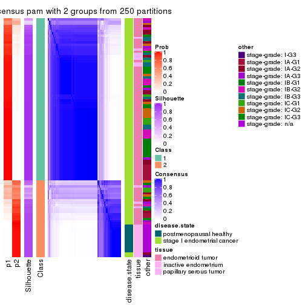</p>

</div>
<div id='tab-SD-pam-consensus-heatmap-2'>
<pre><code class="r">consensus_heatmap(res, k = 3)
</code></pre>

<p>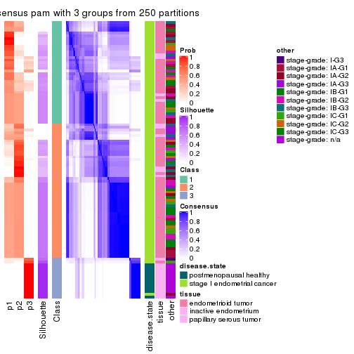</p>

</div>
<div id='tab-SD-pam-consensus-heatmap-3'>
<pre><code class="r">consensus_heatmap(res, k = 4)
</code></pre>

<p>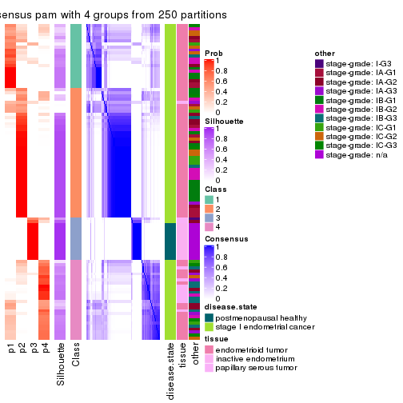</p>

</div>
<div id='tab-SD-pam-consensus-heatmap-4'>
<pre><code class="r">consensus_heatmap(res, k = 5)
</code></pre>

<p>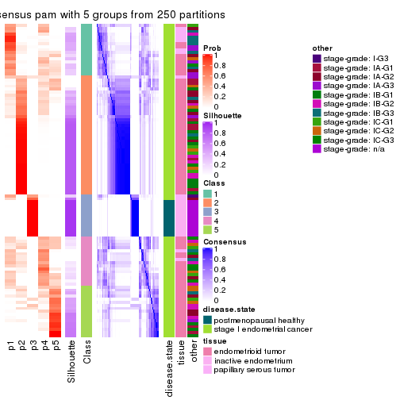</p>

</div>
<div id='tab-SD-pam-consensus-heatmap-5'>
<pre><code class="r">consensus_heatmap(res, k = 6)
</code></pre>

<p>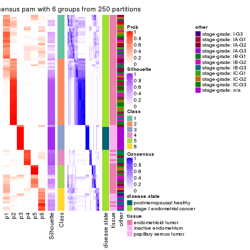</p>

</div>
</div>

Heatmaps for the membership of samples in all partitions to see how consistent they are:


<script>
$( function() {
	$( '#tabs-SD-pam-membership-heatmap' ).tabs();
} );
</script>
<div id='tabs-SD-pam-membership-heatmap'>
<ul>
<li><a href='#tab-SD-pam-membership-heatmap-1'>k = 2</a></li>
<li><a href='#tab-SD-pam-membership-heatmap-2'>k = 3</a></li>
<li><a href='#tab-SD-pam-membership-heatmap-3'>k = 4</a></li>
<li><a href='#tab-SD-pam-membership-heatmap-4'>k = 5</a></li>
<li><a href='#tab-SD-pam-membership-heatmap-5'>k = 6</a></li>
</ul>
<div id='tab-SD-pam-membership-heatmap-1'>
<pre><code class="r">membership_heatmap(res, k = 2)
</code></pre>

<p>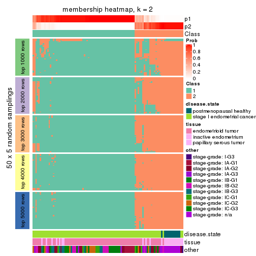</p>

</div>
<div id='tab-SD-pam-membership-heatmap-2'>
<pre><code class="r">membership_heatmap(res, k = 3)
</code></pre>

<p>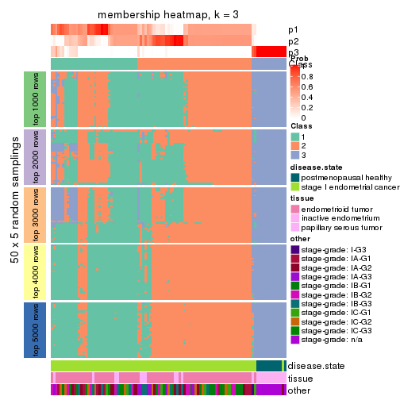</p>

</div>
<div id='tab-SD-pam-membership-heatmap-3'>
<pre><code class="r">membership_heatmap(res, k = 4)
</code></pre>

<p>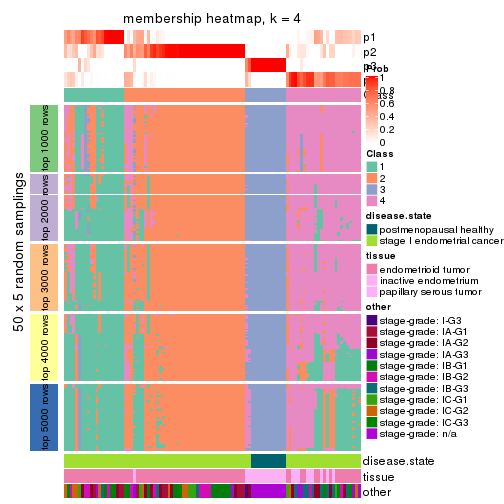</p>

</div>
<div id='tab-SD-pam-membership-heatmap-4'>
<pre><code class="r">membership_heatmap(res, k = 5)
</code></pre>

<p>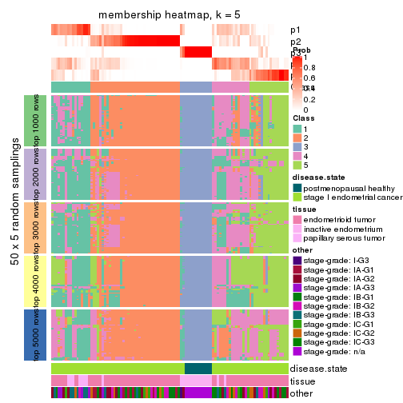</p>

</div>
<div id='tab-SD-pam-membership-heatmap-5'>
<pre><code class="r">membership_heatmap(res, k = 6)
</code></pre>

<p>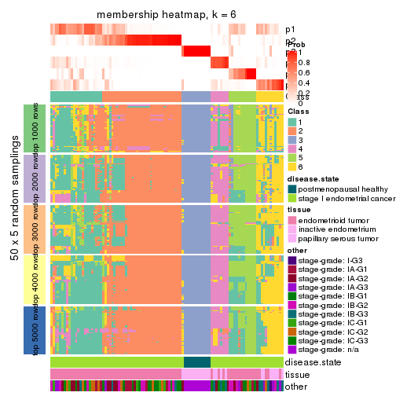</p>

</div>
</div>

As soon as we have had the classes for columns, we can look for signatures
which are significantly different between classes which can be candidate marks
for certain classes. Following are the heatmaps for signatures.


Signature heatmaps where rows are scaled:


<script>
$( function() {
	$( '#tabs-SD-pam-get-signatures' ).tabs();
} );
</script>
<div id='tabs-SD-pam-get-signatures'>
<ul>
<li><a href='#tab-SD-pam-get-signatures-1'>k = 2</a></li>
<li><a href='#tab-SD-pam-get-signatures-2'>k = 3</a></li>
<li><a href='#tab-SD-pam-get-signatures-3'>k = 4</a></li>
<li><a href='#tab-SD-pam-get-signatures-4'>k = 5</a></li>
<li><a href='#tab-SD-pam-get-signatures-5'>k = 6</a></li>
</ul>
<div id='tab-SD-pam-get-signatures-1'>
<pre><code class="r">get_signatures(res, k = 2)
</code></pre>

<p>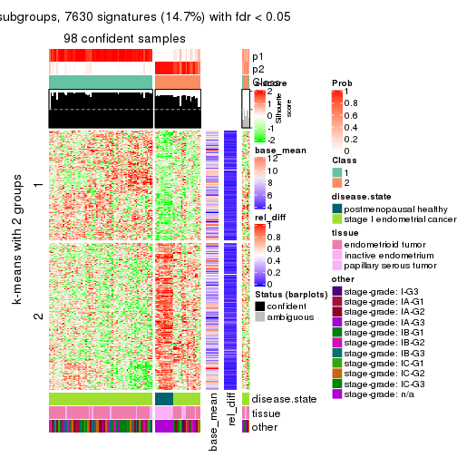</p>

</div>
<div id='tab-SD-pam-get-signatures-2'>
<pre><code class="r">get_signatures(res, k = 3)
</code></pre>

<p>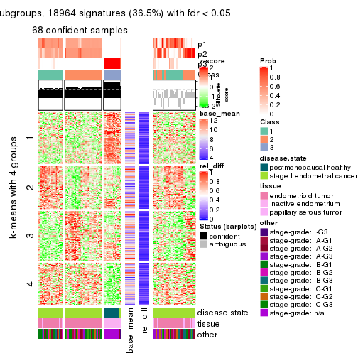</p>

</div>
<div id='tab-SD-pam-get-signatures-3'>
<pre><code class="r">get_signatures(res, k = 4)
</code></pre>

<p>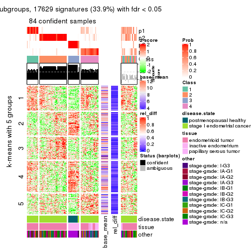</p>

</div>
<div id='tab-SD-pam-get-signatures-4'>
<pre><code class="r">get_signatures(res, k = 5)
</code></pre>

<p>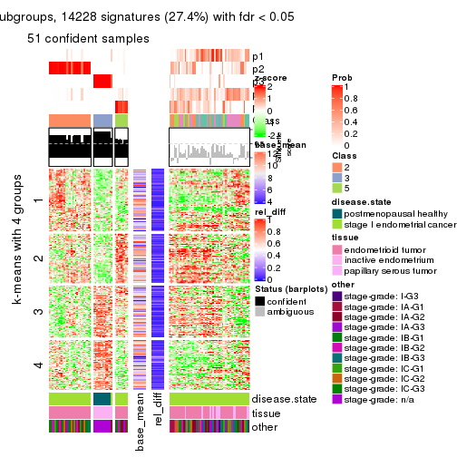</p>

</div>
<div id='tab-SD-pam-get-signatures-5'>
<pre><code class="r">get_signatures(res, k = 6)
</code></pre>

<p>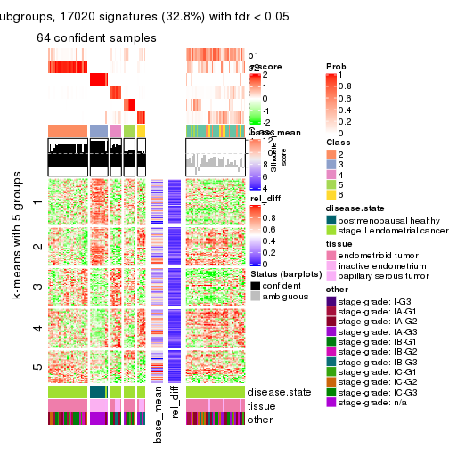</p>

</div>
</div>


Signature heatmaps where rows are not scaled:


<script>
$( function() {
	$( '#tabs-SD-pam-get-signatures-no-scale' ).tabs();
} );
</script>
<div id='tabs-SD-pam-get-signatures-no-scale'>
<ul>
<li><a href='#tab-SD-pam-get-signatures-no-scale-1'>k = 2</a></li>
<li><a href='#tab-SD-pam-get-signatures-no-scale-2'>k = 3</a></li>
<li><a href='#tab-SD-pam-get-signatures-no-scale-3'>k = 4</a></li>
<li><a href='#tab-SD-pam-get-signatures-no-scale-4'>k = 5</a></li>
<li><a href='#tab-SD-pam-get-signatures-no-scale-5'>k = 6</a></li>
</ul>
<div id='tab-SD-pam-get-signatures-no-scale-1'>
<pre><code class="r">get_signatures(res, k = 2, scale_rows = FALSE)
</code></pre>

<p>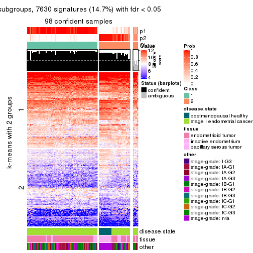</p>

</div>
<div id='tab-SD-pam-get-signatures-no-scale-2'>
<pre><code class="r">get_signatures(res, k = 3, scale_rows = FALSE)
</code></pre>

<p>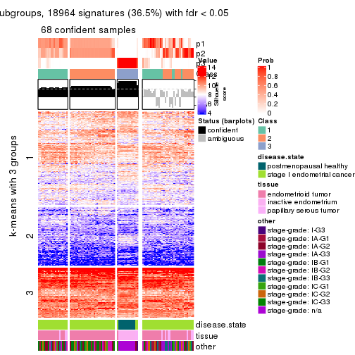</p>

</div>
<div id='tab-SD-pam-get-signatures-no-scale-3'>
<pre><code class="r">get_signatures(res, k = 4, scale_rows = FALSE)
</code></pre>

<p>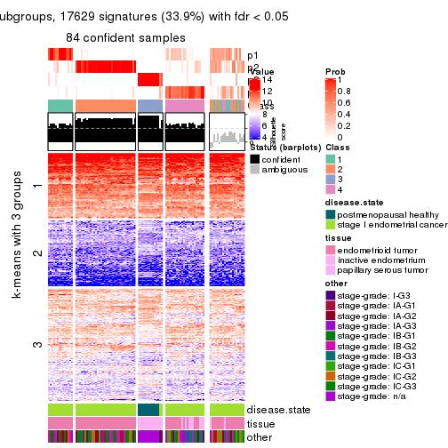</p>

</div>
<div id='tab-SD-pam-get-signatures-no-scale-4'>
<pre><code class="r">get_signatures(res, k = 5, scale_rows = FALSE)
</code></pre>

<p>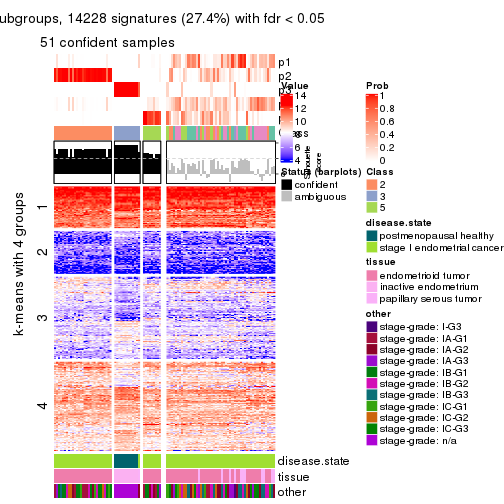</p>

</div>
<div id='tab-SD-pam-get-signatures-no-scale-5'>
<pre><code class="r">get_signatures(res, k = 6, scale_rows = FALSE)
</code></pre>

<p>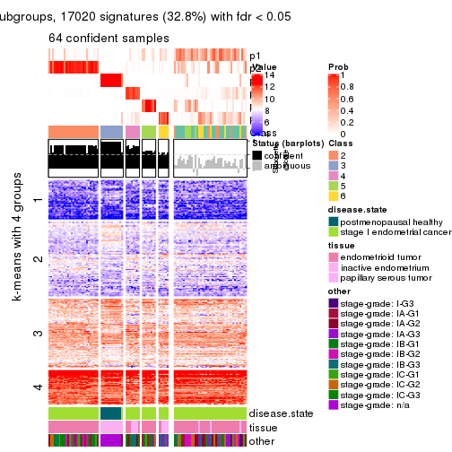</p>

</div>
</div>


Compare the overlap of signatures from different k:

```r
compare_signatures(res)
```

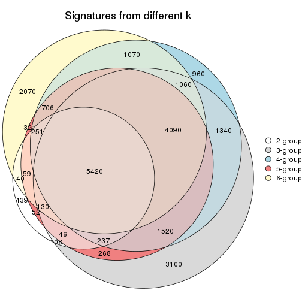

`get_signature()` returns a data frame invisibly. TO get the list of signatures, the function
call should be assigned to a variable explicitly. In following code, if `plot` argument is set
to `FALSE`, no heatmap is plotted while only the differential analysis is performed.

```r
# code only for demonstration
tb = get_signature(res, k = ..., plot = FALSE)
```

An example of the output of `tb` is:

```
#>   which_row         fdr    mean_1    mean_2 scaled_mean_1 scaled_mean_2 km
#> 1        38 0.042760348  8.373488  9.131774    -0.5533452     0.5164555  1
#> 2        40 0.018707592  7.106213  8.469186    -0.6173731     0.5762149  1
#> 3        55 0.019134737 10.221463 11.207825    -0.6159697     0.5749050  1
#> 4        59 0.006059896  5.921854  7.869574    -0.6899429     0.6439467  1
#> 5        60 0.018055526  8.928898 10.211722    -0.6204761     0.5791110  1
#> 6        98 0.009384629 15.714769 14.887706     0.6635654    -0.6193277  2
...
```

The columns in `tb` are:

1. `which_row`: row indices corresponding to the input matrix.
2. `fdr`: FDR for the differential test. 
3. `mean_x`: The mean value in group x.
4. `scaled_mean_x`: The mean value in group x after rows are scaled.
5. `km`: Row groups if k-means clustering is applied to rows.


UMAP plot which shows how samples are separated.


<script>
$( function() {
	$( '#tabs-SD-pam-dimension-reduction' ).tabs();
} );
</script>
<div id='tabs-SD-pam-dimension-reduction'>
<ul>
<li><a href='#tab-SD-pam-dimension-reduction-1'>k = 2</a></li>
<li><a href='#tab-SD-pam-dimension-reduction-2'>k = 3</a></li>
<li><a href='#tab-SD-pam-dimension-reduction-3'>k = 4</a></li>
<li><a href='#tab-SD-pam-dimension-reduction-4'>k = 5</a></li>
<li><a href='#tab-SD-pam-dimension-reduction-5'>k = 6</a></li>
</ul>
<div id='tab-SD-pam-dimension-reduction-1'>
<pre><code class="r">dimension_reduction(res, k = 2, method = &quot;UMAP&quot;)
</code></pre>

<p>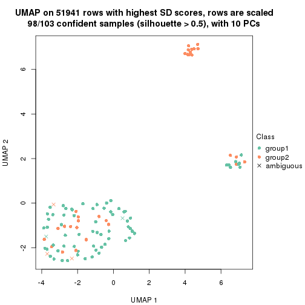</p>

</div>
<div id='tab-SD-pam-dimension-reduction-2'>
<pre><code class="r">dimension_reduction(res, k = 3, method = &quot;UMAP&quot;)
</code></pre>

<p>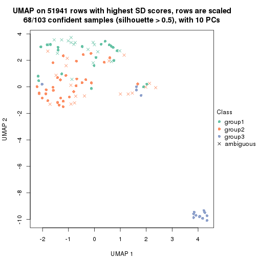</p>

</div>
<div id='tab-SD-pam-dimension-reduction-3'>
<pre><code class="r">dimension_reduction(res, k = 4, method = &quot;UMAP&quot;)
</code></pre>

<p>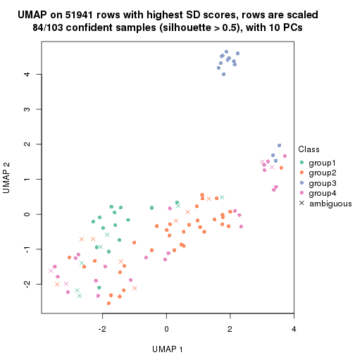</p>

</div>
<div id='tab-SD-pam-dimension-reduction-4'>
<pre><code class="r">dimension_reduction(res, k = 5, method = &quot;UMAP&quot;)
</code></pre>

<p>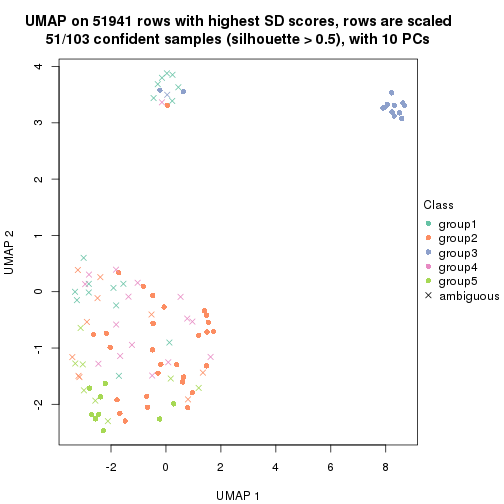</p>

</div>
<div id='tab-SD-pam-dimension-reduction-5'>
<pre><code class="r">dimension_reduction(res, k = 6, method = &quot;UMAP&quot;)
</code></pre>

<p>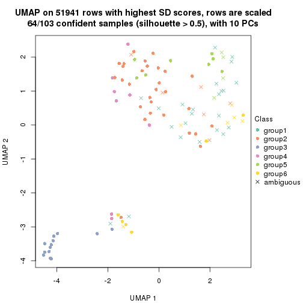</p>

</div>
</div>


Following heatmap shows how subgroups are split when increasing `k`:

```r
collect_classes(res)
```

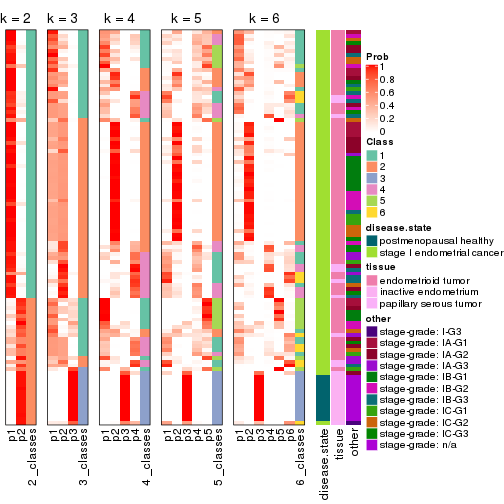


Test correlation between subgroups and known annotations. If the known
annotation is numeric, one-way ANOVA test is applied, and if the known
annotation is discrete, chi-squared contingency table test is applied.

```r
test_to_known_factors(res)
```

```
#>         n disease.state(p) tissue(p) other(p) k
#> SD:pam 98         1.67e-07  9.17e-08 5.91e-05 2
#> SD:pam 68         6.61e-12  4.31e-12 3.74e-07 3
#> SD:pam 84         4.27e-15  1.20e-17 8.35e-11 4
#> SD:pam 51         1.10e-10  2.23e-10 2.64e-05 5
#> SD:pam 64         7.85e-12  1.27e-15 4.77e-10 6
```


If matrix rows can be associated to genes, consider to use `functional_enrichment(res,
...)` to perform function enrichment for the signature genes. See [this vignette](http://bioconductor.org/packages/devel/bioc/vignettes/cola/inst/doc/functional_enrichment.html) for more detailed explanations.


 

---------------------------------------------------


### SD:mclust


The object with results only for a single top-value method and a single partition method 
can be extracted as:

```r
res = res_list["SD", "mclust"]
# you can also extract it by
# res = res_list["SD:mclust"]
```

A summary of `res` and all the functions that can be applied to it:

```r
res
```

```
#> A 'ConsensusPartition' object with k = 2, 3, 4, 5, 6.
#>   On a matrix with 51941 rows and 103 columns.
#>   Top rows (1000, 2000, 3000, 4000, 5000) are extracted by 'SD' method.
#>   Subgroups are detected by 'mclust' method.
#>   Performed in total 1250 partitions by row resampling.
#>   Best k for subgroups seems to be 5.
#> 
#> Following methods can be applied to this 'ConsensusPartition' object:
#>  [1] "cola_report"             "collect_classes"         "collect_plots"          
#>  [4] "collect_stats"           "colnames"                "compare_signatures"     
#>  [7] "consensus_heatmap"       "dimension_reduction"     "functional_enrichment"  
#> [10] "get_anno_col"            "get_anno"                "get_classes"            
#> [13] "get_consensus"           "get_matrix"              "get_membership"         
#> [16] "get_param"               "get_signatures"          "get_stats"              
#> [19] "is_best_k"               "is_stable_k"             "membership_heatmap"     
#> [22] "ncol"                    "nrow"                    "plot_ecdf"              
#> [25] "rownames"                "select_partition_number" "show"                   
#> [28] "suggest_best_k"          "test_to_known_factors"
```

`collect_plots()` function collects all the plots made from `res` for all `k` (number of partitions)
into one single page to provide an easy and fast comparison between different `k`.

```r
collect_plots(res)
```

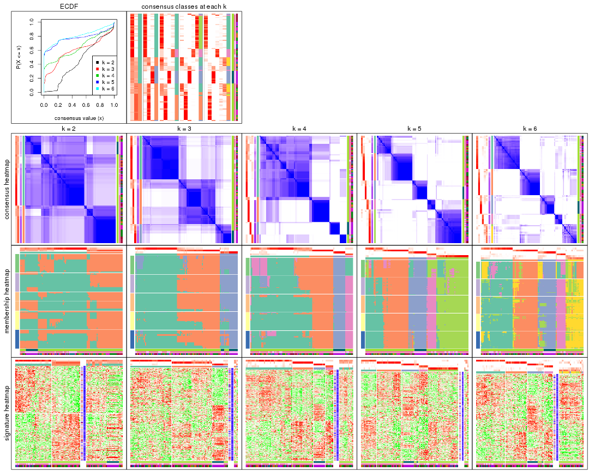

The plots are:

- The first row: a plot of the ECDF (empirical cumulative distribution
  function) curves of the consensus matrix for each `k` and the heatmap of
  predicted classes for each `k`.
- The second row: heatmaps of the consensus matrix for each `k`.
- The third row: heatmaps of the membership matrix for each `k`.
- The fouth row: heatmaps of the signatures for each `k`.

All the plots in panels can be made by individual functions and they are
plotted later in this section.

`select_partition_number()` produces several plots showing different
statistics for choosing "optimized" `k`. There are following statistics:

- ECDF curves of the consensus matrix for each `k`;
- 1-PAC. [The PAC
  score](https://en.wikipedia.org/wiki/Consensus_clustering#Over-interpretation_potential_of_consensus_clustering)
  measures the proportion of the ambiguous subgrouping.
- Mean silhouette score.
- Concordance. The mean probability of fiting the consensus class ids in all
  partitions.
- Area increased. Denote $A_k$ as the area under the ECDF curve for current
  `k`, the area increased is defined as $A_k - A_{k-1}$.
- Rand index. The percent of pairs of samples that are both in a same cluster
  or both are not in a same cluster in the partition of k and k-1.
- Jaccard index. The ratio of pairs of samples are both in a same cluster in
  the partition of k and k-1 and the pairs of samples are both in a same
  cluster in the partition k or k-1.

The detailed explanations of these statistics can be found in [the _cola_
vignette](http://bioconductor.org/packages/devel/bioc/vignettes/cola/inst/doc/cola.html#toc_13).

Generally speaking, lower PAC score, higher mean silhouette score or higher
concordance corresponds to better partition. Rand index and Jaccard index
measure how similar the current partition is compared to partition with `k-1`.
If they are too similar, we won't accept `k` is better than `k-1`.

```r
select_partition_number(res)
```

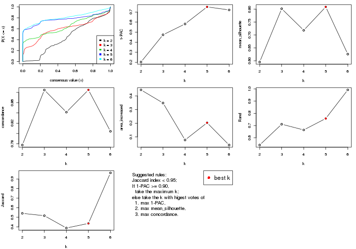

The numeric values for all these statistics can be obtained by `get_stats()`.

```r
get_stats(res)
```

```
#>   k 1-PAC mean_silhouette concordance area_increased  Rand Jaccard
#> 2 2 0.203           0.595       0.778         0.4439 0.541   0.541
#> 3 3 0.474           0.802       0.885         0.3478 0.711   0.516
#> 4 4 0.582           0.718       0.842         0.0771 0.664   0.388
#> 5 5 0.752           0.809       0.885         0.2032 0.758   0.436
#> 6 6 0.721           0.626       0.804         0.0402 0.992   0.964
```

`suggest_best_k()` suggests the best $k$ based on these statistics. The rules are as follows:

- All $k$ with Jaccard index larger than 0.95 are removed because increasing
  $k$ does not provide enough extra information. If all $k$ are removed, it is
  marked as no subgroup is detected.
- For all $k$ with 1-PAC score larger than 0.9, the maximal $k$ is taken as
  the best $k$, and other $k$ are marked as optional $k$.
- If it does not fit the second rule. The $k$ with the maximal vote of the
  highest 1-PAC score, highest mean silhouette, and highest concordance is
  taken as the best $k$.

```r
suggest_best_k(res)
```

```
#> [1] 5
```


Following shows the table of the partitions (You need to click the **show/hide
code output** link to see it). The membership matrix (columns with name `p*`)
is inferred by
[`clue::cl_consensus()`](https://www.rdocumentation.org/link/cl_consensus?package=clue)
function with the `SE` method. Basically the value in the membership matrix
represents the probability to belong to a certain group. The finall class
label for an item is determined with the group with highest probability it
belongs to.

In `get_classes()` function, the entropy is calculated from the membership
matrix and the silhouette score is calculated from the consensus matrix.


<script>
$( function() {
	$( '#tabs-SD-mclust-get-classes' ).tabs();
} );
</script>
<div id='tabs-SD-mclust-get-classes'>
<ul>
<li><a href='#tab-SD-mclust-get-classes-1'>k = 2</a></li>
<li><a href='#tab-SD-mclust-get-classes-2'>k = 3</a></li>
<li><a href='#tab-SD-mclust-get-classes-3'>k = 4</a></li>
<li><a href='#tab-SD-mclust-get-classes-4'>k = 5</a></li>
<li><a href='#tab-SD-mclust-get-classes-5'>k = 6</a></li>
</ul>

<div id='tab-SD-mclust-get-classes-1'>
<p><a id='tab-SD-mclust-get-classes-1-a' style='color:#0366d6' href='#'>show/hide code output</a></p>
<pre><code class="r">cbind(get_classes(res, k = 2), get_membership(res, k = 2))
</code></pre>

<pre><code>#&gt;           class entropy silhouette    p1    p2
#&gt; GSM425907     2  0.7139     0.8599 0.196 0.804
#&gt; GSM425908     2  0.7139     0.8599 0.196 0.804
#&gt; GSM425909     1  0.9977     0.2711 0.528 0.472
#&gt; GSM425910     1  0.9522     0.0622 0.628 0.372
#&gt; GSM425911     2  0.7139     0.8599 0.196 0.804
#&gt; GSM425912     2  0.9933     0.4922 0.452 0.548
#&gt; GSM425913     2  0.7139     0.8599 0.196 0.804
#&gt; GSM425914     2  0.7883     0.8157 0.236 0.764
#&gt; GSM425915     2  0.9775     0.0614 0.412 0.588
#&gt; GSM425874     1  0.0000     0.7078 1.000 0.000
#&gt; GSM425875     1  0.8327     0.5599 0.736 0.264
#&gt; GSM425876     1  0.9460     0.0884 0.636 0.364
#&gt; GSM425877     1  0.0000     0.7078 1.000 0.000
#&gt; GSM425878     1  0.3879     0.6687 0.924 0.076
#&gt; GSM425879     2  0.7139     0.8599 0.196 0.804
#&gt; GSM425880     1  0.7453     0.6133 0.788 0.212
#&gt; GSM425881     2  0.9896     0.5110 0.440 0.560
#&gt; GSM425882     2  0.7139     0.8599 0.196 0.804
#&gt; GSM425883     1  0.2043     0.6973 0.968 0.032
#&gt; GSM425884     1  0.2603     0.6915 0.956 0.044
#&gt; GSM425885     1  0.4022     0.6823 0.920 0.080
#&gt; GSM425848     1  0.3114     0.6854 0.944 0.056
#&gt; GSM425849     1  0.3431     0.6787 0.936 0.064
#&gt; GSM425850     1  0.8909     0.2533 0.692 0.308
#&gt; GSM425851     1  0.0000     0.7078 1.000 0.000
#&gt; GSM425852     1  0.7528     0.6137 0.784 0.216
#&gt; GSM425893     2  0.7299     0.8332 0.204 0.796
#&gt; GSM425894     2  0.7139     0.8599 0.196 0.804
#&gt; GSM425895     2  0.7139     0.8599 0.196 0.804
#&gt; GSM425896     2  0.6973     0.8503 0.188 0.812
#&gt; GSM425897     2  0.7139     0.8599 0.196 0.804
#&gt; GSM425898     2  0.7139     0.8599 0.196 0.804
#&gt; GSM425899     2  0.9993     0.4182 0.484 0.516
#&gt; GSM425900     2  0.7139     0.8599 0.196 0.804
#&gt; GSM425901     1  0.9970     0.2771 0.532 0.468
#&gt; GSM425902     1  0.0000     0.7078 1.000 0.000
#&gt; GSM425903     2  0.8955     0.4424 0.312 0.688
#&gt; GSM425904     1  0.7299     0.6183 0.796 0.204
#&gt; GSM425905     2  0.7139     0.8599 0.196 0.804
#&gt; GSM425906     2  0.7139     0.8599 0.196 0.804
#&gt; GSM425863     1  0.3274     0.6801 0.940 0.060
#&gt; GSM425864     2  0.7139     0.8599 0.196 0.804
#&gt; GSM425865     2  0.7139     0.8599 0.196 0.804
#&gt; GSM425866     1  0.8861     0.4959 0.696 0.304
#&gt; GSM425867     1  1.0000     0.2416 0.500 0.500
#&gt; GSM425868     2  0.8661     0.7410 0.288 0.712
#&gt; GSM425869     2  0.7139     0.8599 0.196 0.804
#&gt; GSM425870     2  0.8661     0.4811 0.288 0.712
#&gt; GSM425871     1  0.4690     0.6448 0.900 0.100
#&gt; GSM425872     2  0.7139     0.8599 0.196 0.804
#&gt; GSM425873     1  0.9323     0.1397 0.652 0.348
#&gt; GSM425843     1  0.2778     0.6883 0.952 0.048
#&gt; GSM425844     1  0.0000     0.7078 1.000 0.000
#&gt; GSM425845     1  0.9896     0.1197 0.560 0.440
#&gt; GSM425846     2  0.9933     0.4860 0.452 0.548
#&gt; GSM425847     1  0.9754    -0.0896 0.592 0.408
#&gt; GSM425886     1  0.9970     0.2771 0.532 0.468
#&gt; GSM425887     2  0.9933     0.4916 0.452 0.548
#&gt; GSM425888     2  0.9909     0.5033 0.444 0.556
#&gt; GSM425889     1  0.0000     0.7078 1.000 0.000
#&gt; GSM425890     1  0.0000     0.7078 1.000 0.000
#&gt; GSM425891     2  0.7139     0.8599 0.196 0.804
#&gt; GSM425892     2  0.7139     0.8599 0.196 0.804
#&gt; GSM425853     1  0.7745     0.4717 0.772 0.228
#&gt; GSM425854     2  0.7139     0.8599 0.196 0.804
#&gt; GSM425855     1  0.1843     0.6991 0.972 0.028
#&gt; GSM425856     1  0.8909     0.4884 0.692 0.308
#&gt; GSM425857     1  0.9954     0.2860 0.540 0.460
#&gt; GSM425858     2  0.9775     0.5613 0.412 0.588
#&gt; GSM425859     2  0.7139     0.8599 0.196 0.804
#&gt; GSM425860     1  0.9608     0.0321 0.616 0.384
#&gt; GSM425861     1  0.9850    -0.1684 0.572 0.428
#&gt; GSM425862     1  0.0000     0.7078 1.000 0.000
#&gt; GSM425837     1  0.1184     0.7050 0.984 0.016
#&gt; GSM425838     1  0.0000     0.7078 1.000 0.000
#&gt; GSM425839     2  0.7139     0.8599 0.196 0.804
#&gt; GSM425840     1  0.0672     0.7063 0.992 0.008
#&gt; GSM425841     1  0.0000     0.7078 1.000 0.000
#&gt; GSM425842     1  0.7950     0.4284 0.760 0.240
#&gt; GSM425917     1  0.8608     0.4897 0.716 0.284
#&gt; GSM425922     1  0.0000     0.7078 1.000 0.000
#&gt; GSM425919     1  0.0672     0.7063 0.992 0.008
#&gt; GSM425920     1  0.0672     0.7063 0.992 0.008
#&gt; GSM425923     1  0.0000     0.7078 1.000 0.000
#&gt; GSM425916     1  0.0000     0.7078 1.000 0.000
#&gt; GSM425918     1  0.0000     0.7078 1.000 0.000
#&gt; GSM425921     1  0.0000     0.7078 1.000 0.000
#&gt; GSM425925     1  0.0000     0.7078 1.000 0.000
#&gt; GSM425926     1  0.0000     0.7078 1.000 0.000
#&gt; GSM425927     1  0.5408     0.6144 0.876 0.124
#&gt; GSM425924     1  0.5059     0.6653 0.888 0.112
#&gt; GSM425928     1  0.9686     0.4498 0.604 0.396
#&gt; GSM425929     1  0.9933     0.4251 0.548 0.452
#&gt; GSM425930     1  0.9933     0.4251 0.548 0.452
#&gt; GSM425931     1  0.9933     0.4251 0.548 0.452
#&gt; GSM425932     1  0.9933     0.4251 0.548 0.452
#&gt; GSM425933     1  0.9933     0.4251 0.548 0.452
#&gt; GSM425934     1  0.9933     0.4251 0.548 0.452
#&gt; GSM425935     1  0.9358     0.4633 0.648 0.352
#&gt; GSM425936     1  0.9933     0.4251 0.548 0.452
#&gt; GSM425937     1  0.9933     0.4251 0.548 0.452
#&gt; GSM425938     1  0.9732     0.4467 0.596 0.404
#&gt; GSM425939     1  0.9933     0.4251 0.548 0.452
</code></pre>

<script>
$('#tab-SD-mclust-get-classes-1-a').parent().next().next().hide();
$('#tab-SD-mclust-get-classes-1-a').click(function(){
  $('#tab-SD-mclust-get-classes-1-a').parent().next().next().toggle();
  return(false);
});
</script>
</div>

<div id='tab-SD-mclust-get-classes-2'>
<p><a id='tab-SD-mclust-get-classes-2-a' style='color:#0366d6' href='#'>show/hide code output</a></p>
<pre><code class="r">cbind(get_classes(res, k = 3), get_membership(res, k = 3))
</code></pre>

<pre><code>#&gt;           class entropy silhouette    p1    p2    p3
#&gt; GSM425907     2  0.0000      0.792 0.000 1.000 0.000
#&gt; GSM425908     2  0.0000      0.792 0.000 1.000 0.000
#&gt; GSM425909     3  0.7902      0.664 0.208 0.132 0.660
#&gt; GSM425910     2  0.7924      0.634 0.304 0.612 0.084
#&gt; GSM425911     2  0.4873      0.803 0.152 0.824 0.024
#&gt; GSM425912     2  0.4452      0.799 0.192 0.808 0.000
#&gt; GSM425913     2  0.0592      0.797 0.012 0.988 0.000
#&gt; GSM425914     2  0.4291      0.809 0.152 0.840 0.008
#&gt; GSM425915     3  0.9014      0.489 0.208 0.232 0.560
#&gt; GSM425874     1  0.1129      0.935 0.976 0.020 0.004
#&gt; GSM425875     1  0.4164      0.799 0.848 0.008 0.144
#&gt; GSM425876     2  0.7287      0.547 0.408 0.560 0.032
#&gt; GSM425877     1  0.0000      0.929 1.000 0.000 0.000
#&gt; GSM425878     1  0.0000      0.929 1.000 0.000 0.000
#&gt; GSM425879     2  0.3038      0.814 0.104 0.896 0.000
#&gt; GSM425880     1  0.4700      0.758 0.812 0.008 0.180
#&gt; GSM425881     2  0.4504      0.797 0.196 0.804 0.000
#&gt; GSM425882     2  0.3686      0.812 0.140 0.860 0.000
#&gt; GSM425883     1  0.0892      0.936 0.980 0.020 0.000
#&gt; GSM425884     1  0.0000      0.929 1.000 0.000 0.000
#&gt; GSM425885     1  0.2400      0.894 0.932 0.064 0.004
#&gt; GSM425848     1  0.0892      0.936 0.980 0.020 0.000
#&gt; GSM425849     1  0.0892      0.936 0.980 0.020 0.000
#&gt; GSM425850     2  0.6286      0.465 0.464 0.536 0.000
#&gt; GSM425851     1  0.1482      0.932 0.968 0.020 0.012
#&gt; GSM425852     1  0.5384      0.746 0.788 0.024 0.188
#&gt; GSM425893     2  0.5119      0.799 0.152 0.816 0.032
#&gt; GSM425894     2  0.0000      0.792 0.000 1.000 0.000
#&gt; GSM425895     2  0.0000      0.792 0.000 1.000 0.000
#&gt; GSM425896     2  0.1289      0.781 0.000 0.968 0.032
#&gt; GSM425897     2  0.0000      0.792 0.000 1.000 0.000
#&gt; GSM425898     2  0.0000      0.792 0.000 1.000 0.000
#&gt; GSM425899     2  0.5988      0.623 0.368 0.632 0.000
#&gt; GSM425900     2  0.3816      0.811 0.148 0.852 0.000
#&gt; GSM425901     3  0.7169      0.701 0.208 0.088 0.704
#&gt; GSM425902     1  0.1129      0.935 0.976 0.020 0.004
#&gt; GSM425903     2  0.8427      0.600 0.208 0.620 0.172
#&gt; GSM425904     1  0.5062      0.753 0.800 0.016 0.184
#&gt; GSM425905     2  0.0000      0.792 0.000 1.000 0.000
#&gt; GSM425906     2  0.3816      0.811 0.148 0.852 0.000
#&gt; GSM425863     1  0.0000      0.929 1.000 0.000 0.000
#&gt; GSM425864     2  0.0000      0.792 0.000 1.000 0.000
#&gt; GSM425865     2  0.0000      0.792 0.000 1.000 0.000
#&gt; GSM425866     1  0.5330      0.767 0.812 0.044 0.144
#&gt; GSM425867     3  0.6341      0.667 0.252 0.032 0.716
#&gt; GSM425868     2  0.3816      0.803 0.148 0.852 0.000
#&gt; GSM425869     2  0.0000      0.792 0.000 1.000 0.000
#&gt; GSM425870     2  0.6567      0.756 0.160 0.752 0.088
#&gt; GSM425871     1  0.0892      0.936 0.980 0.020 0.000
#&gt; GSM425872     2  0.0892      0.799 0.020 0.980 0.000
#&gt; GSM425873     2  0.6825      0.368 0.492 0.496 0.012
#&gt; GSM425843     1  0.0000      0.929 1.000 0.000 0.000
#&gt; GSM425844     1  0.0892      0.936 0.980 0.020 0.000
#&gt; GSM425845     2  0.8776      0.562 0.296 0.560 0.144
#&gt; GSM425846     2  0.5926      0.642 0.356 0.644 0.000
#&gt; GSM425847     2  0.5016      0.777 0.240 0.760 0.000
#&gt; GSM425886     3  0.7782      0.674 0.208 0.124 0.668
#&gt; GSM425887     2  0.4452      0.799 0.192 0.808 0.000
#&gt; GSM425888     2  0.4654      0.794 0.208 0.792 0.000
#&gt; GSM425889     1  0.0892      0.936 0.980 0.020 0.000
#&gt; GSM425890     1  0.1129      0.935 0.976 0.020 0.004
#&gt; GSM425891     2  0.3038      0.814 0.104 0.896 0.000
#&gt; GSM425892     2  0.0000      0.792 0.000 1.000 0.000
#&gt; GSM425853     1  0.3213      0.877 0.912 0.028 0.060
#&gt; GSM425854     2  0.0000      0.792 0.000 1.000 0.000
#&gt; GSM425855     1  0.0000      0.929 1.000 0.000 0.000
#&gt; GSM425856     1  0.7039      0.641 0.728 0.128 0.144
#&gt; GSM425857     3  0.8132      0.211 0.444 0.068 0.488
#&gt; GSM425858     2  0.4452      0.799 0.192 0.808 0.000
#&gt; GSM425859     2  0.0000      0.792 0.000 1.000 0.000
#&gt; GSM425860     2  0.5269      0.788 0.200 0.784 0.016
#&gt; GSM425861     2  0.6192      0.557 0.420 0.580 0.000
#&gt; GSM425862     1  0.0892      0.936 0.980 0.020 0.000
#&gt; GSM425837     1  0.0000      0.929 1.000 0.000 0.000
#&gt; GSM425838     1  0.1129      0.935 0.976 0.020 0.004
#&gt; GSM425839     2  0.0000      0.792 0.000 1.000 0.000
#&gt; GSM425840     1  0.0000      0.929 1.000 0.000 0.000
#&gt; GSM425841     1  0.1129      0.935 0.976 0.020 0.004
#&gt; GSM425842     1  0.3116      0.821 0.892 0.108 0.000
#&gt; GSM425917     1  0.6195      0.598 0.704 0.020 0.276
#&gt; GSM425922     1  0.1129      0.935 0.976 0.020 0.004
#&gt; GSM425919     1  0.0424      0.928 0.992 0.000 0.008
#&gt; GSM425920     1  0.0000      0.929 1.000 0.000 0.000
#&gt; GSM425923     1  0.0892      0.936 0.980 0.020 0.000
#&gt; GSM425916     1  0.1129      0.935 0.976 0.020 0.004
#&gt; GSM425918     1  0.0892      0.936 0.980 0.020 0.000
#&gt; GSM425921     1  0.1129      0.935 0.976 0.020 0.004
#&gt; GSM425925     1  0.0892      0.936 0.980 0.020 0.000
#&gt; GSM425926     1  0.1129      0.935 0.976 0.020 0.004
#&gt; GSM425927     1  0.0237      0.929 0.996 0.004 0.000
#&gt; GSM425924     1  0.4679      0.813 0.832 0.020 0.148
#&gt; GSM425928     3  0.4485      0.782 0.136 0.020 0.844
#&gt; GSM425929     3  0.0000      0.820 0.000 0.000 1.000
#&gt; GSM425930     3  0.0000      0.820 0.000 0.000 1.000
#&gt; GSM425931     3  0.0000      0.820 0.000 0.000 1.000
#&gt; GSM425932     3  0.0000      0.820 0.000 0.000 1.000
#&gt; GSM425933     3  0.0000      0.820 0.000 0.000 1.000
#&gt; GSM425934     3  0.0000      0.820 0.000 0.000 1.000
#&gt; GSM425935     3  0.4934      0.767 0.156 0.024 0.820
#&gt; GSM425936     3  0.0000      0.820 0.000 0.000 1.000
#&gt; GSM425937     3  0.0000      0.820 0.000 0.000 1.000
#&gt; GSM425938     3  0.3832      0.799 0.100 0.020 0.880
#&gt; GSM425939     3  0.0000      0.820 0.000 0.000 1.000
</code></pre>

<script>
$('#tab-SD-mclust-get-classes-2-a').parent().next().next().hide();
$('#tab-SD-mclust-get-classes-2-a').click(function(){
  $('#tab-SD-mclust-get-classes-2-a').parent().next().next().toggle();
  return(false);
});
</script>
</div>

<div id='tab-SD-mclust-get-classes-3'>
<p><a id='tab-SD-mclust-get-classes-3-a' style='color:#0366d6' href='#'>show/hide code output</a></p>
<pre><code class="r">cbind(get_classes(res, k = 4), get_membership(res, k = 4))
</code></pre>

<pre><code>#&gt;           class entropy silhouette    p1    p2    p3    p4
#&gt; GSM425907     2  0.0000      0.904 0.000 1.000 0.000 0.000
#&gt; GSM425908     2  0.0000      0.904 0.000 1.000 0.000 0.000
#&gt; GSM425909     1  0.8533      0.598 0.536 0.100 0.164 0.200
#&gt; GSM425910     1  0.5148      0.690 0.736 0.208 0.000 0.056
#&gt; GSM425911     1  0.5000      0.290 0.504 0.496 0.000 0.000
#&gt; GSM425912     1  0.4888      0.463 0.588 0.412 0.000 0.000
#&gt; GSM425913     2  0.0000      0.904 0.000 1.000 0.000 0.000
#&gt; GSM425914     1  0.4907      0.449 0.580 0.420 0.000 0.000
#&gt; GSM425915     1  0.8203      0.599 0.548 0.060 0.192 0.200
#&gt; GSM425874     4  0.3610      0.998 0.200 0.000 0.000 0.800
#&gt; GSM425875     1  0.3610      0.711 0.800 0.000 0.000 0.200
#&gt; GSM425876     1  0.4617      0.699 0.764 0.204 0.000 0.032
#&gt; GSM425877     1  0.0000      0.732 1.000 0.000 0.000 0.000
#&gt; GSM425878     1  0.0000      0.732 1.000 0.000 0.000 0.000
#&gt; GSM425879     2  0.0000      0.904 0.000 1.000 0.000 0.000
#&gt; GSM425880     1  0.3791      0.710 0.796 0.000 0.004 0.200
#&gt; GSM425881     1  0.4830      0.493 0.608 0.392 0.000 0.000
#&gt; GSM425882     2  0.0817      0.878 0.024 0.976 0.000 0.000
#&gt; GSM425883     1  0.0469      0.734 0.988 0.012 0.000 0.000
#&gt; GSM425884     1  0.0000      0.732 1.000 0.000 0.000 0.000
#&gt; GSM425885     1  0.7314     -0.345 0.424 0.152 0.000 0.424
#&gt; GSM425848     1  0.2124      0.703 0.924 0.008 0.000 0.068
#&gt; GSM425849     1  0.0000      0.732 1.000 0.000 0.000 0.000
#&gt; GSM425850     1  0.1302      0.737 0.956 0.044 0.000 0.000
#&gt; GSM425851     1  0.1792      0.699 0.932 0.000 0.000 0.068
#&gt; GSM425852     1  0.4709      0.706 0.768 0.008 0.024 0.200
#&gt; GSM425893     2  0.4967     -0.175 0.452 0.548 0.000 0.000
#&gt; GSM425894     2  0.0000      0.904 0.000 1.000 0.000 0.000
#&gt; GSM425895     2  0.0000      0.904 0.000 1.000 0.000 0.000
#&gt; GSM425896     2  0.0000      0.904 0.000 1.000 0.000 0.000
#&gt; GSM425897     2  0.0000      0.904 0.000 1.000 0.000 0.000
#&gt; GSM425898     2  0.0000      0.904 0.000 1.000 0.000 0.000
#&gt; GSM425899     1  0.4992      0.342 0.524 0.476 0.000 0.000
#&gt; GSM425900     2  0.4985     -0.220 0.468 0.532 0.000 0.000
#&gt; GSM425901     1  0.8912      0.560 0.500 0.132 0.168 0.200
#&gt; GSM425902     4  0.3610      0.998 0.200 0.000 0.000 0.800
#&gt; GSM425903     1  0.7671      0.646 0.608 0.064 0.128 0.200
#&gt; GSM425904     1  0.3933      0.709 0.792 0.000 0.008 0.200
#&gt; GSM425905     2  0.0000      0.904 0.000 1.000 0.000 0.000
#&gt; GSM425906     2  0.4981     -0.207 0.464 0.536 0.000 0.000
#&gt; GSM425863     1  0.0000      0.732 1.000 0.000 0.000 0.000
#&gt; GSM425864     2  0.0000      0.904 0.000 1.000 0.000 0.000
#&gt; GSM425865     2  0.0000      0.904 0.000 1.000 0.000 0.000
#&gt; GSM425866     1  0.3610      0.711 0.800 0.000 0.000 0.200
#&gt; GSM425867     1  0.8000      0.588 0.548 0.040 0.212 0.200
#&gt; GSM425868     2  0.0817      0.879 0.000 0.976 0.000 0.024
#&gt; GSM425869     2  0.0000      0.904 0.000 1.000 0.000 0.000
#&gt; GSM425870     1  0.6938      0.584 0.592 0.260 0.144 0.004
#&gt; GSM425871     1  0.0000      0.732 1.000 0.000 0.000 0.000
#&gt; GSM425872     2  0.0000      0.904 0.000 1.000 0.000 0.000
#&gt; GSM425873     1  0.1978      0.739 0.928 0.068 0.000 0.004
#&gt; GSM425843     1  0.0000      0.732 1.000 0.000 0.000 0.000
#&gt; GSM425844     1  0.1474      0.708 0.948 0.000 0.000 0.052
#&gt; GSM425845     1  0.5218      0.708 0.736 0.064 0.000 0.200
#&gt; GSM425846     1  0.4977      0.375 0.540 0.460 0.000 0.000
#&gt; GSM425847     1  0.4643      0.565 0.656 0.344 0.000 0.000
#&gt; GSM425886     1  0.9378      0.477 0.440 0.188 0.172 0.200
#&gt; GSM425887     1  0.4888      0.463 0.588 0.412 0.000 0.000
#&gt; GSM425888     1  0.4830      0.493 0.608 0.392 0.000 0.000
#&gt; GSM425889     1  0.2281      0.684 0.904 0.000 0.000 0.096
#&gt; GSM425890     4  0.3688      0.985 0.208 0.000 0.000 0.792
#&gt; GSM425891     2  0.0336      0.896 0.008 0.992 0.000 0.000
#&gt; GSM425892     2  0.0000      0.904 0.000 1.000 0.000 0.000
#&gt; GSM425853     1  0.2469      0.731 0.892 0.000 0.000 0.108
#&gt; GSM425854     2  0.0000      0.904 0.000 1.000 0.000 0.000
#&gt; GSM425855     1  0.0000      0.732 1.000 0.000 0.000 0.000
#&gt; GSM425856     1  0.3610      0.711 0.800 0.000 0.000 0.200
#&gt; GSM425857     1  0.9136      0.502 0.456 0.184 0.120 0.240
#&gt; GSM425858     1  0.4961      0.387 0.552 0.448 0.000 0.000
#&gt; GSM425859     2  0.0000      0.904 0.000 1.000 0.000 0.000
#&gt; GSM425860     1  0.4193      0.652 0.732 0.268 0.000 0.000
#&gt; GSM425861     1  0.4746      0.531 0.632 0.368 0.000 0.000
#&gt; GSM425862     1  0.3486      0.607 0.812 0.000 0.000 0.188
#&gt; GSM425837     1  0.0000      0.732 1.000 0.000 0.000 0.000
#&gt; GSM425838     4  0.3610      0.998 0.200 0.000 0.000 0.800
#&gt; GSM425839     2  0.0000      0.904 0.000 1.000 0.000 0.000
#&gt; GSM425840     1  0.0000      0.732 1.000 0.000 0.000 0.000
#&gt; GSM425841     4  0.3610      0.998 0.200 0.000 0.000 0.800
#&gt; GSM425842     1  0.0000      0.732 1.000 0.000 0.000 0.000
#&gt; GSM425917     1  0.7048      0.577 0.592 0.040 0.304 0.064
#&gt; GSM425922     4  0.3610      0.998 0.200 0.000 0.000 0.800
#&gt; GSM425919     1  0.0000      0.732 1.000 0.000 0.000 0.000
#&gt; GSM425920     1  0.0000      0.732 1.000 0.000 0.000 0.000
#&gt; GSM425923     1  0.1792      0.699 0.932 0.000 0.000 0.068
#&gt; GSM425916     1  0.1792      0.699 0.932 0.000 0.000 0.068
#&gt; GSM425918     1  0.1792      0.699 0.932 0.000 0.000 0.068
#&gt; GSM425921     4  0.3610      0.998 0.200 0.000 0.000 0.800
#&gt; GSM425925     1  0.3569      0.598 0.804 0.000 0.000 0.196
#&gt; GSM425926     4  0.3610      0.998 0.200 0.000 0.000 0.800
#&gt; GSM425927     1  0.0000      0.732 1.000 0.000 0.000 0.000
#&gt; GSM425924     1  0.4793      0.687 0.756 0.040 0.204 0.000
#&gt; GSM425928     3  0.0188      0.954 0.000 0.004 0.996 0.000
#&gt; GSM425929     3  0.0000      0.959 0.000 0.000 1.000 0.000
#&gt; GSM425930     3  0.0000      0.959 0.000 0.000 1.000 0.000
#&gt; GSM425931     3  0.0000      0.959 0.000 0.000 1.000 0.000
#&gt; GSM425932     3  0.0000      0.959 0.000 0.000 1.000 0.000
#&gt; GSM425933     3  0.0000      0.959 0.000 0.000 1.000 0.000
#&gt; GSM425934     3  0.0336      0.950 0.008 0.000 0.992 0.000
#&gt; GSM425935     3  0.4868      0.537 0.212 0.040 0.748 0.000
#&gt; GSM425936     3  0.0000      0.959 0.000 0.000 1.000 0.000
#&gt; GSM425937     3  0.0000      0.959 0.000 0.000 1.000 0.000
#&gt; GSM425938     3  0.0000      0.959 0.000 0.000 1.000 0.000
#&gt; GSM425939     3  0.0000      0.959 0.000 0.000 1.000 0.000
</code></pre>

<script>
$('#tab-SD-mclust-get-classes-3-a').parent().next().next().hide();
$('#tab-SD-mclust-get-classes-3-a').click(function(){
  $('#tab-SD-mclust-get-classes-3-a').parent().next().next().toggle();
  return(false);
});
</script>
</div>

<div id='tab-SD-mclust-get-classes-4'>
<p><a id='tab-SD-mclust-get-classes-4-a' style='color:#0366d6' href='#'>show/hide code output</a></p>
<pre><code class="r">cbind(get_classes(res, k = 5), get_membership(res, k = 5))
</code></pre>

<pre><code>#&gt;           class entropy silhouette    p1    p2    p3    p4    p5
#&gt; GSM425907     2  0.0000     0.9346 0.000 1.000 0.000 0.000 0.000
#&gt; GSM425908     2  0.0000     0.9346 0.000 1.000 0.000 0.000 0.000
#&gt; GSM425909     3  0.6632     0.6208 0.132 0.176 0.616 0.076 0.000
#&gt; GSM425910     1  0.2011     0.8094 0.908 0.088 0.000 0.004 0.000
#&gt; GSM425911     2  0.3821     0.7072 0.216 0.764 0.000 0.020 0.000
#&gt; GSM425912     1  0.3109     0.8376 0.800 0.200 0.000 0.000 0.000
#&gt; GSM425913     2  0.0000     0.9346 0.000 1.000 0.000 0.000 0.000
#&gt; GSM425914     1  0.2625     0.8156 0.876 0.108 0.000 0.016 0.000
#&gt; GSM425915     3  0.4413     0.7223 0.232 0.000 0.724 0.044 0.000
#&gt; GSM425874     4  0.2280     0.8868 0.000 0.000 0.000 0.880 0.120
#&gt; GSM425875     5  0.4069     0.7572 0.136 0.000 0.000 0.076 0.788
#&gt; GSM425876     1  0.3919     0.7560 0.820 0.056 0.000 0.016 0.108
#&gt; GSM425877     5  0.1341     0.8661 0.000 0.000 0.000 0.056 0.944
#&gt; GSM425878     5  0.0000     0.8800 0.000 0.000 0.000 0.000 1.000
#&gt; GSM425879     2  0.1597     0.8956 0.048 0.940 0.000 0.012 0.000
#&gt; GSM425880     5  0.4025     0.7594 0.132 0.000 0.000 0.076 0.792
#&gt; GSM425881     1  0.3242     0.8274 0.784 0.216 0.000 0.000 0.000
#&gt; GSM425882     2  0.0000     0.9346 0.000 1.000 0.000 0.000 0.000
#&gt; GSM425883     5  0.0290     0.8782 0.008 0.000 0.000 0.000 0.992
#&gt; GSM425884     5  0.0000     0.8800 0.000 0.000 0.000 0.000 1.000
#&gt; GSM425885     4  0.3266     0.8723 0.004 0.000 0.000 0.796 0.200
#&gt; GSM425848     5  0.0000     0.8800 0.000 0.000 0.000 0.000 1.000
#&gt; GSM425849     5  0.0000     0.8800 0.000 0.000 0.000 0.000 1.000
#&gt; GSM425850     1  0.3143     0.6392 0.796 0.000 0.000 0.000 0.204
#&gt; GSM425851     5  0.1965     0.8479 0.000 0.000 0.000 0.096 0.904
#&gt; GSM425852     5  0.4025     0.7594 0.132 0.000 0.000 0.076 0.792
#&gt; GSM425893     2  0.2448     0.8556 0.088 0.892 0.000 0.020 0.000
#&gt; GSM425894     2  0.0000     0.9346 0.000 1.000 0.000 0.000 0.000
#&gt; GSM425895     2  0.0000     0.9346 0.000 1.000 0.000 0.000 0.000
#&gt; GSM425896     2  0.2270     0.8628 0.076 0.904 0.000 0.020 0.000
#&gt; GSM425897     2  0.1549     0.8988 0.040 0.944 0.000 0.016 0.000
#&gt; GSM425898     2  0.0000     0.9346 0.000 1.000 0.000 0.000 0.000
#&gt; GSM425899     2  0.0671     0.9199 0.016 0.980 0.000 0.000 0.004
#&gt; GSM425900     1  0.4307     0.3071 0.500 0.500 0.000 0.000 0.000
#&gt; GSM425901     3  0.6501     0.6388 0.132 0.160 0.632 0.076 0.000
#&gt; GSM425902     4  0.3109     0.8746 0.000 0.000 0.000 0.800 0.200
#&gt; GSM425903     1  0.2046     0.6979 0.916 0.000 0.016 0.068 0.000
#&gt; GSM425904     5  0.4025     0.7594 0.132 0.000 0.000 0.076 0.792
#&gt; GSM425905     2  0.0000     0.9346 0.000 1.000 0.000 0.000 0.000
#&gt; GSM425906     2  0.4305    -0.3309 0.488 0.512 0.000 0.000 0.000
#&gt; GSM425863     5  0.0000     0.8800 0.000 0.000 0.000 0.000 1.000
#&gt; GSM425864     2  0.0898     0.9180 0.020 0.972 0.000 0.008 0.000
#&gt; GSM425865     2  0.0000     0.9346 0.000 1.000 0.000 0.000 0.000
#&gt; GSM425866     5  0.4985     0.6540 0.244 0.000 0.000 0.076 0.680
#&gt; GSM425867     3  0.4025     0.7617 0.132 0.000 0.792 0.076 0.000
#&gt; GSM425868     2  0.0000     0.9346 0.000 1.000 0.000 0.000 0.000
#&gt; GSM425869     2  0.0000     0.9346 0.000 1.000 0.000 0.000 0.000
#&gt; GSM425870     1  0.4216     0.7825 0.804 0.104 0.072 0.020 0.000
#&gt; GSM425871     5  0.0000     0.8800 0.000 0.000 0.000 0.000 1.000
#&gt; GSM425872     2  0.0000     0.9346 0.000 1.000 0.000 0.000 0.000
#&gt; GSM425873     1  0.3196     0.6540 0.804 0.004 0.000 0.000 0.192
#&gt; GSM425843     5  0.0290     0.8799 0.000 0.000 0.000 0.008 0.992
#&gt; GSM425844     5  0.0000     0.8800 0.000 0.000 0.000 0.000 1.000
#&gt; GSM425845     1  0.1671     0.7032 0.924 0.000 0.000 0.076 0.000
#&gt; GSM425846     2  0.3612     0.5265 0.268 0.732 0.000 0.000 0.000
#&gt; GSM425847     1  0.3109     0.8376 0.800 0.200 0.000 0.000 0.000
#&gt; GSM425886     3  0.6859     0.5807 0.132 0.208 0.584 0.076 0.000
#&gt; GSM425887     1  0.3109     0.8376 0.800 0.200 0.000 0.000 0.000
#&gt; GSM425888     1  0.3480     0.7987 0.752 0.248 0.000 0.000 0.000
#&gt; GSM425889     5  0.0880     0.8645 0.000 0.000 0.000 0.032 0.968
#&gt; GSM425890     4  0.2179     0.8851 0.000 0.000 0.000 0.888 0.112
#&gt; GSM425891     2  0.0000     0.9346 0.000 1.000 0.000 0.000 0.000
#&gt; GSM425892     2  0.0000     0.9346 0.000 1.000 0.000 0.000 0.000
#&gt; GSM425853     5  0.2359     0.8426 0.060 0.000 0.000 0.036 0.904
#&gt; GSM425854     2  0.0000     0.9346 0.000 1.000 0.000 0.000 0.000
#&gt; GSM425855     5  0.0000     0.8800 0.000 0.000 0.000 0.000 1.000
#&gt; GSM425856     5  0.5290     0.5799 0.300 0.000 0.000 0.076 0.624
#&gt; GSM425857     4  0.7964     0.0618 0.132 0.184 0.240 0.444 0.000
#&gt; GSM425858     1  0.4138     0.6003 0.616 0.384 0.000 0.000 0.000
#&gt; GSM425859     2  0.0000     0.9346 0.000 1.000 0.000 0.000 0.000
#&gt; GSM425860     1  0.2929     0.8385 0.820 0.180 0.000 0.000 0.000
#&gt; GSM425861     1  0.3109     0.8376 0.800 0.200 0.000 0.000 0.000
#&gt; GSM425862     5  0.2424     0.7665 0.000 0.000 0.000 0.132 0.868
#&gt; GSM425837     5  0.0000     0.8800 0.000 0.000 0.000 0.000 1.000
#&gt; GSM425838     4  0.3109     0.8746 0.000 0.000 0.000 0.800 0.200
#&gt; GSM425839     2  0.0000     0.9346 0.000 1.000 0.000 0.000 0.000
#&gt; GSM425840     5  0.0290     0.8799 0.000 0.000 0.000 0.008 0.992
#&gt; GSM425841     4  0.3109     0.8746 0.000 0.000 0.000 0.800 0.200
#&gt; GSM425842     5  0.4201     0.2672 0.408 0.000 0.000 0.000 0.592
#&gt; GSM425917     3  0.2990     0.7829 0.008 0.000 0.868 0.024 0.100
#&gt; GSM425922     4  0.2127     0.8832 0.000 0.000 0.000 0.892 0.108
#&gt; GSM425919     5  0.1965     0.8479 0.000 0.000 0.000 0.096 0.904
#&gt; GSM425920     5  0.1410     0.8641 0.000 0.000 0.000 0.060 0.940
#&gt; GSM425923     5  0.0510     0.8790 0.000 0.000 0.000 0.016 0.984
#&gt; GSM425916     5  0.1965     0.8479 0.000 0.000 0.000 0.096 0.904
#&gt; GSM425918     5  0.0609     0.8781 0.000 0.000 0.000 0.020 0.980
#&gt; GSM425921     4  0.2179     0.8861 0.000 0.000 0.000 0.888 0.112
#&gt; GSM425925     5  0.2179     0.7916 0.000 0.000 0.000 0.112 0.888
#&gt; GSM425926     4  0.2179     0.8861 0.000 0.000 0.000 0.888 0.112
#&gt; GSM425927     5  0.0693     0.8787 0.012 0.000 0.000 0.008 0.980
#&gt; GSM425924     5  0.4735     0.5568 0.008 0.000 0.304 0.024 0.664
#&gt; GSM425928     3  0.0000     0.8904 0.000 0.000 1.000 0.000 0.000
#&gt; GSM425929     3  0.0000     0.8904 0.000 0.000 1.000 0.000 0.000
#&gt; GSM425930     3  0.0000     0.8904 0.000 0.000 1.000 0.000 0.000
#&gt; GSM425931     3  0.0000     0.8904 0.000 0.000 1.000 0.000 0.000
#&gt; GSM425932     3  0.0000     0.8904 0.000 0.000 1.000 0.000 0.000
#&gt; GSM425933     3  0.0000     0.8904 0.000 0.000 1.000 0.000 0.000
#&gt; GSM425934     3  0.0000     0.8904 0.000 0.000 1.000 0.000 0.000
#&gt; GSM425935     3  0.0290     0.8856 0.008 0.000 0.992 0.000 0.000
#&gt; GSM425936     3  0.0000     0.8904 0.000 0.000 1.000 0.000 0.000
#&gt; GSM425937     3  0.0000     0.8904 0.000 0.000 1.000 0.000 0.000
#&gt; GSM425938     3  0.0000     0.8904 0.000 0.000 1.000 0.000 0.000
#&gt; GSM425939     3  0.0000     0.8904 0.000 0.000 1.000 0.000 0.000
</code></pre>

<script>
$('#tab-SD-mclust-get-classes-4-a').parent().next().next().hide();
$('#tab-SD-mclust-get-classes-4-a').click(function(){
  $('#tab-SD-mclust-get-classes-4-a').parent().next().next().toggle();
  return(false);
});
</script>
</div>

<div id='tab-SD-mclust-get-classes-5'>
<p><a id='tab-SD-mclust-get-classes-5-a' style='color:#0366d6' href='#'>show/hide code output</a></p>
<pre><code class="r">cbind(get_classes(res, k = 6), get_membership(res, k = 6))
</code></pre>

<pre><code>#&gt;           class entropy silhouette    p1    p2    p3    p4    p5    p6
#&gt; GSM425907     2  0.0000     0.8376 0.000 1.000 0.000 0.000 0.000 0.000
#&gt; GSM425908     2  0.0000     0.8376 0.000 1.000 0.000 0.000 0.000 0.000
#&gt; GSM425909     3  0.6810     0.5570 0.000 0.084 0.484 0.000 0.232 0.200
#&gt; GSM425910     6  0.3797     0.1026 0.000 0.000 0.000 0.000 0.420 0.580
#&gt; GSM425911     5  0.6018     0.1925 0.000 0.256 0.000 0.000 0.420 0.324
#&gt; GSM425912     6  0.4560     0.3720 0.000 0.200 0.000 0.000 0.108 0.692
#&gt; GSM425913     2  0.1701     0.7978 0.000 0.920 0.000 0.000 0.072 0.008
#&gt; GSM425914     6  0.3851    -0.2591 0.000 0.000 0.000 0.000 0.460 0.540
#&gt; GSM425915     3  0.5351     0.5328 0.000 0.000 0.588 0.000 0.176 0.236
#&gt; GSM425874     4  0.1141     0.8204 0.052 0.000 0.000 0.948 0.000 0.000
#&gt; GSM425875     1  0.3619     0.7362 0.744 0.000 0.000 0.000 0.024 0.232
#&gt; GSM425876     6  0.5269     0.2628 0.132 0.004 0.000 0.000 0.260 0.604
#&gt; GSM425877     1  0.3044     0.7967 0.836 0.000 0.000 0.116 0.048 0.000
#&gt; GSM425878     1  0.0806     0.8269 0.972 0.000 0.000 0.000 0.008 0.020
#&gt; GSM425879     2  0.3713     0.6521 0.000 0.744 0.000 0.000 0.224 0.032
#&gt; GSM425880     1  0.3806     0.7368 0.752 0.000 0.000 0.000 0.048 0.200
#&gt; GSM425881     6  0.3925     0.4021 0.000 0.200 0.000 0.000 0.056 0.744
#&gt; GSM425882     2  0.3727     0.6623 0.000 0.784 0.000 0.000 0.088 0.128
#&gt; GSM425883     1  0.0260     0.8292 0.992 0.000 0.000 0.008 0.000 0.000
#&gt; GSM425884     1  0.0632     0.8287 0.976 0.000 0.000 0.000 0.024 0.000
#&gt; GSM425885     4  0.2793     0.7949 0.200 0.000 0.000 0.800 0.000 0.000
#&gt; GSM425848     1  0.1007     0.8258 0.956 0.000 0.000 0.000 0.044 0.000
#&gt; GSM425849     1  0.0993     0.8258 0.964 0.000 0.000 0.000 0.012 0.024
#&gt; GSM425850     6  0.4699     0.2819 0.228 0.000 0.000 0.000 0.104 0.668
#&gt; GSM425851     1  0.4195     0.7300 0.724 0.000 0.000 0.200 0.076 0.000
#&gt; GSM425852     1  0.3512     0.7508 0.772 0.000 0.000 0.000 0.032 0.196
#&gt; GSM425893     2  0.5380     0.1405 0.000 0.500 0.000 0.000 0.384 0.116
#&gt; GSM425894     2  0.0000     0.8376 0.000 1.000 0.000 0.000 0.000 0.000
#&gt; GSM425895     2  0.0632     0.8292 0.000 0.976 0.000 0.000 0.024 0.000
#&gt; GSM425896     2  0.2793     0.6255 0.000 0.800 0.000 0.000 0.200 0.000
#&gt; GSM425897     2  0.2378     0.7237 0.000 0.848 0.000 0.000 0.152 0.000
#&gt; GSM425898     2  0.0000     0.8376 0.000 1.000 0.000 0.000 0.000 0.000
#&gt; GSM425899     2  0.4556     0.5197 0.000 0.688 0.000 0.000 0.100 0.212
#&gt; GSM425900     6  0.5758    -0.1096 0.000 0.368 0.000 0.000 0.176 0.456
#&gt; GSM425901     3  0.6776     0.5732 0.000 0.096 0.504 0.000 0.200 0.200
#&gt; GSM425902     4  0.2762     0.7979 0.196 0.000 0.000 0.804 0.000 0.000
#&gt; GSM425903     6  0.3923    -0.0724 0.000 0.000 0.004 0.000 0.416 0.580
#&gt; GSM425904     1  0.3867     0.7379 0.748 0.000 0.000 0.000 0.052 0.200
#&gt; GSM425905     2  0.0000     0.8376 0.000 1.000 0.000 0.000 0.000 0.000
#&gt; GSM425906     2  0.5872    -0.3604 0.000 0.404 0.000 0.000 0.196 0.400
#&gt; GSM425863     1  0.0622     0.8280 0.980 0.000 0.000 0.000 0.008 0.012
#&gt; GSM425864     2  0.1714     0.7655 0.000 0.908 0.000 0.000 0.092 0.000
#&gt; GSM425865     2  0.0000     0.8376 0.000 1.000 0.000 0.000 0.000 0.000
#&gt; GSM425866     1  0.4664     0.5758 0.584 0.000 0.000 0.000 0.052 0.364
#&gt; GSM425867     3  0.6515     0.4110 0.056 0.000 0.508 0.000 0.196 0.240
#&gt; GSM425868     2  0.0000     0.8376 0.000 1.000 0.000 0.000 0.000 0.000
#&gt; GSM425869     2  0.0000     0.8376 0.000 1.000 0.000 0.000 0.000 0.000
#&gt; GSM425870     5  0.4224    -0.0804 0.000 0.000 0.016 0.000 0.552 0.432
#&gt; GSM425871     1  0.1257     0.8223 0.952 0.000 0.000 0.000 0.028 0.020
#&gt; GSM425872     2  0.0937     0.8223 0.000 0.960 0.000 0.000 0.040 0.000
#&gt; GSM425873     6  0.5246     0.2733 0.212 0.000 0.000 0.000 0.180 0.608
#&gt; GSM425843     1  0.1657     0.8305 0.936 0.000 0.000 0.040 0.012 0.012
#&gt; GSM425844     1  0.0692     0.8300 0.976 0.000 0.000 0.004 0.020 0.000
#&gt; GSM425845     6  0.2969     0.2021 0.000 0.000 0.000 0.000 0.224 0.776
#&gt; GSM425846     2  0.5282    -0.0142 0.000 0.484 0.000 0.000 0.100 0.416
#&gt; GSM425847     6  0.4340     0.4079 0.000 0.200 0.000 0.000 0.088 0.712
#&gt; GSM425886     3  0.6972     0.5452 0.000 0.120 0.480 0.000 0.216 0.184
#&gt; GSM425887     6  0.4293     0.3781 0.000 0.200 0.000 0.000 0.084 0.716
#&gt; GSM425888     6  0.4144     0.3910 0.000 0.200 0.000 0.000 0.072 0.728
#&gt; GSM425889     1  0.1713     0.8189 0.928 0.000 0.000 0.028 0.044 0.000
#&gt; GSM425890     4  0.1075     0.8178 0.048 0.000 0.000 0.952 0.000 0.000
#&gt; GSM425891     2  0.3225     0.7127 0.000 0.828 0.000 0.000 0.080 0.092
#&gt; GSM425892     2  0.0000     0.8376 0.000 1.000 0.000 0.000 0.000 0.000
#&gt; GSM425853     1  0.3213     0.7771 0.820 0.000 0.000 0.000 0.048 0.132
#&gt; GSM425854     2  0.0000     0.8376 0.000 1.000 0.000 0.000 0.000 0.000
#&gt; GSM425855     1  0.0405     0.8279 0.988 0.000 0.000 0.004 0.008 0.000
#&gt; GSM425856     1  0.4541     0.5888 0.596 0.000 0.000 0.000 0.044 0.360
#&gt; GSM425857     4  0.8799    -0.1396 0.000 0.116 0.212 0.272 0.200 0.200
#&gt; GSM425858     6  0.4530     0.3448 0.000 0.208 0.000 0.000 0.100 0.692
#&gt; GSM425859     2  0.0000     0.8376 0.000 1.000 0.000 0.000 0.000 0.000
#&gt; GSM425860     6  0.5193     0.2224 0.000 0.104 0.000 0.000 0.344 0.552
#&gt; GSM425861     6  0.3875     0.4155 0.016 0.196 0.000 0.000 0.028 0.760
#&gt; GSM425862     1  0.2542     0.7854 0.876 0.000 0.000 0.080 0.044 0.000
#&gt; GSM425837     1  0.0146     0.8283 0.996 0.000 0.000 0.004 0.000 0.000
#&gt; GSM425838     4  0.2762     0.7979 0.196 0.000 0.000 0.804 0.000 0.000
#&gt; GSM425839     2  0.0000     0.8376 0.000 1.000 0.000 0.000 0.000 0.000
#&gt; GSM425840     1  0.0547     0.8301 0.980 0.000 0.000 0.020 0.000 0.000
#&gt; GSM425841     4  0.2762     0.7979 0.196 0.000 0.000 0.804 0.000 0.000
#&gt; GSM425842     1  0.5575    -0.0771 0.460 0.000 0.000 0.000 0.140 0.400
#&gt; GSM425917     3  0.6091     0.6039 0.100 0.000 0.584 0.084 0.232 0.000
#&gt; GSM425922     4  0.0632     0.7961 0.024 0.000 0.000 0.976 0.000 0.000
#&gt; GSM425919     1  0.2980     0.7790 0.808 0.000 0.000 0.180 0.012 0.000
#&gt; GSM425920     1  0.2100     0.8091 0.884 0.000 0.000 0.112 0.004 0.000
#&gt; GSM425923     1  0.3020     0.8034 0.844 0.000 0.000 0.076 0.080 0.000
#&gt; GSM425916     1  0.4166     0.7325 0.728 0.000 0.000 0.196 0.076 0.000
#&gt; GSM425918     1  0.2744     0.8123 0.864 0.000 0.000 0.072 0.064 0.000
#&gt; GSM425921     4  0.1075     0.8196 0.048 0.000 0.000 0.952 0.000 0.000
#&gt; GSM425925     1  0.2009     0.8061 0.908 0.000 0.000 0.068 0.024 0.000
#&gt; GSM425926     4  0.1075     0.8196 0.048 0.000 0.000 0.952 0.000 0.000
#&gt; GSM425927     1  0.5027     0.6297 0.696 0.000 0.000 0.032 0.112 0.160
#&gt; GSM425924     1  0.6229     0.4313 0.548 0.000 0.272 0.080 0.100 0.000
#&gt; GSM425928     3  0.2178     0.7897 0.000 0.000 0.868 0.000 0.132 0.000
#&gt; GSM425929     3  0.0000     0.8234 0.000 0.000 1.000 0.000 0.000 0.000
#&gt; GSM425930     3  0.0000     0.8234 0.000 0.000 1.000 0.000 0.000 0.000
#&gt; GSM425931     3  0.0000     0.8234 0.000 0.000 1.000 0.000 0.000 0.000
#&gt; GSM425932     3  0.0000     0.8234 0.000 0.000 1.000 0.000 0.000 0.000
#&gt; GSM425933     3  0.0000     0.8234 0.000 0.000 1.000 0.000 0.000 0.000
#&gt; GSM425934     3  0.0000     0.8234 0.000 0.000 1.000 0.000 0.000 0.000
#&gt; GSM425935     3  0.2793     0.7612 0.000 0.000 0.800 0.000 0.200 0.000
#&gt; GSM425936     3  0.0000     0.8234 0.000 0.000 1.000 0.000 0.000 0.000
#&gt; GSM425937     3  0.0000     0.8234 0.000 0.000 1.000 0.000 0.000 0.000
#&gt; GSM425938     3  0.1714     0.8027 0.000 0.000 0.908 0.000 0.092 0.000
#&gt; GSM425939     3  0.0000     0.8234 0.000 0.000 1.000 0.000 0.000 0.000
</code></pre>

<script>
$('#tab-SD-mclust-get-classes-5-a').parent().next().next().hide();
$('#tab-SD-mclust-get-classes-5-a').click(function(){
  $('#tab-SD-mclust-get-classes-5-a').parent().next().next().toggle();
  return(false);
});
</script>
</div>
</div>

Heatmaps for the consensus matrix. It visualizes the probability of two
samples to be in a same group.


<script>
$( function() {
	$( '#tabs-SD-mclust-consensus-heatmap' ).tabs();
} );
</script>
<div id='tabs-SD-mclust-consensus-heatmap'>
<ul>
<li><a href='#tab-SD-mclust-consensus-heatmap-1'>k = 2</a></li>
<li><a href='#tab-SD-mclust-consensus-heatmap-2'>k = 3</a></li>
<li><a href='#tab-SD-mclust-consensus-heatmap-3'>k = 4</a></li>
<li><a href='#tab-SD-mclust-consensus-heatmap-4'>k = 5</a></li>
<li><a href='#tab-SD-mclust-consensus-heatmap-5'>k = 6</a></li>
</ul>
<div id='tab-SD-mclust-consensus-heatmap-1'>
<pre><code class="r">consensus_heatmap(res, k = 2)
</code></pre>

<p>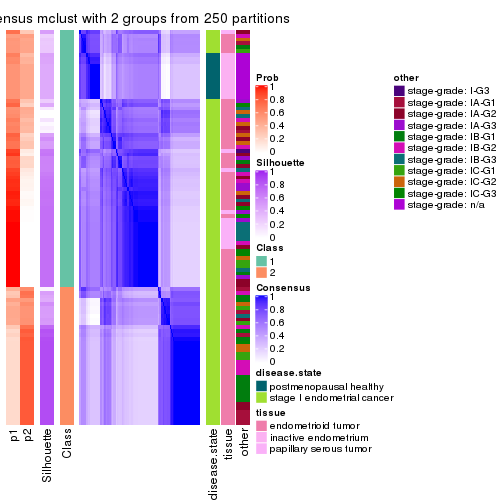</p>

</div>
<div id='tab-SD-mclust-consensus-heatmap-2'>
<pre><code class="r">consensus_heatmap(res, k = 3)
</code></pre>

<p>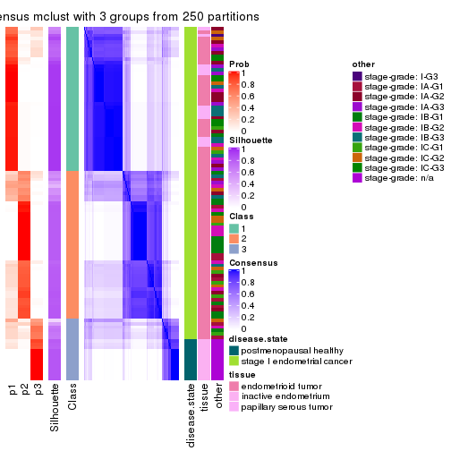</p>

</div>
<div id='tab-SD-mclust-consensus-heatmap-3'>
<pre><code class="r">consensus_heatmap(res, k = 4)
</code></pre>

<p>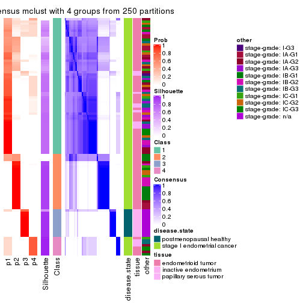</p>

</div>
<div id='tab-SD-mclust-consensus-heatmap-4'>
<pre><code class="r">consensus_heatmap(res, k = 5)
</code></pre>

<p>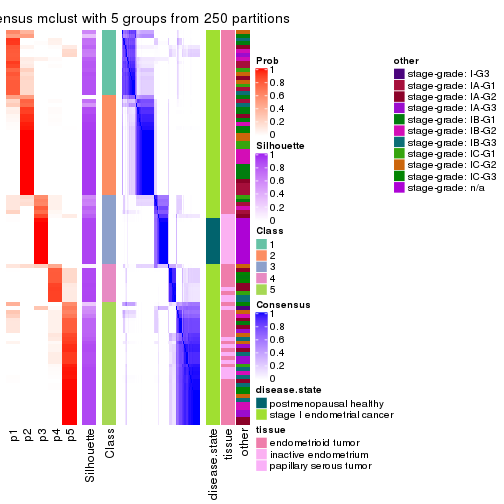</p>

</div>
<div id='tab-SD-mclust-consensus-heatmap-5'>
<pre><code class="r">consensus_heatmap(res, k = 6)
</code></pre>

<p>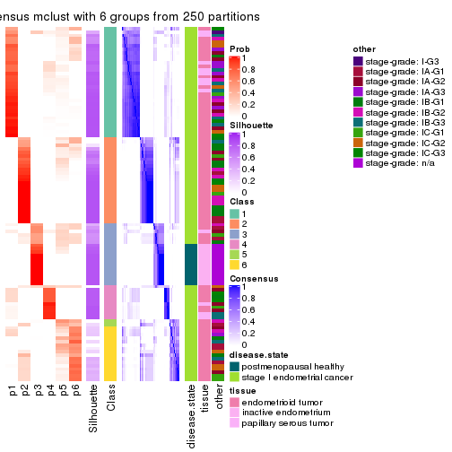</p>

</div>
</div>

Heatmaps for the membership of samples in all partitions to see how consistent they are:


<script>
$( function() {
	$( '#tabs-SD-mclust-membership-heatmap' ).tabs();
} );
</script>
<div id='tabs-SD-mclust-membership-heatmap'>
<ul>
<li><a href='#tab-SD-mclust-membership-heatmap-1'>k = 2</a></li>
<li><a href='#tab-SD-mclust-membership-heatmap-2'>k = 3</a></li>
<li><a href='#tab-SD-mclust-membership-heatmap-3'>k = 4</a></li>
<li><a href='#tab-SD-mclust-membership-heatmap-4'>k = 5</a></li>
<li><a href='#tab-SD-mclust-membership-heatmap-5'>k = 6</a></li>
</ul>
<div id='tab-SD-mclust-membership-heatmap-1'>
<pre><code class="r">membership_heatmap(res, k = 2)
</code></pre>

<p>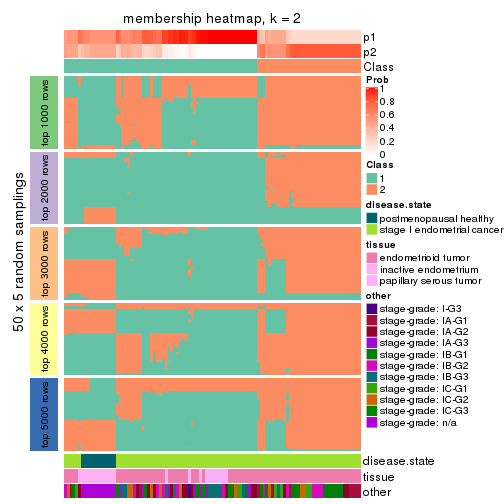</p>

</div>
<div id='tab-SD-mclust-membership-heatmap-2'>
<pre><code class="r">membership_heatmap(res, k = 3)
</code></pre>

<p>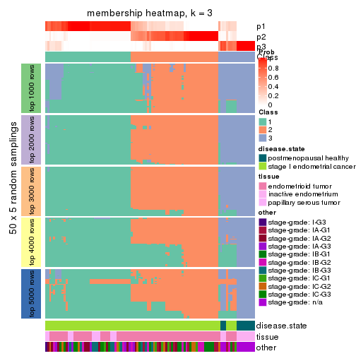</p>

</div>
<div id='tab-SD-mclust-membership-heatmap-3'>
<pre><code class="r">membership_heatmap(res, k = 4)
</code></pre>

<p>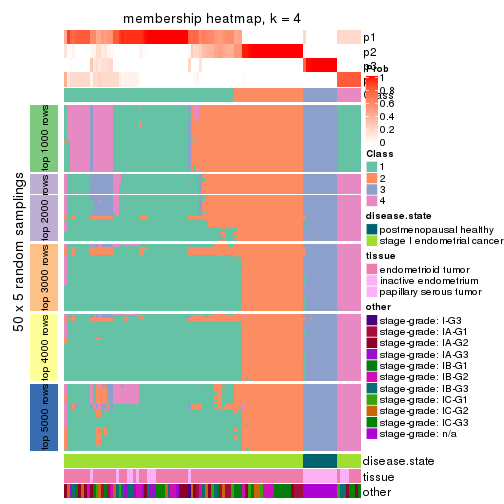</p>

</div>
<div id='tab-SD-mclust-membership-heatmap-4'>
<pre><code class="r">membership_heatmap(res, k = 5)
</code></pre>

<p>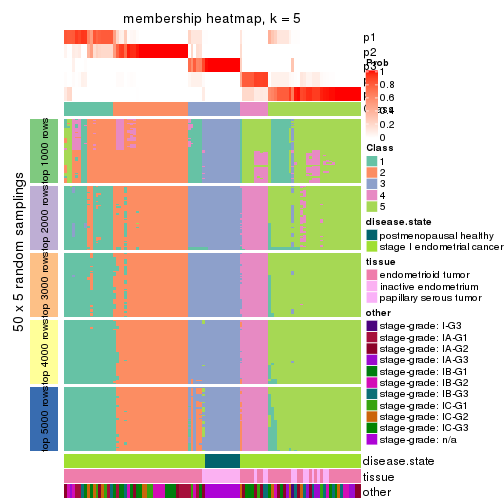</p>

</div>
<div id='tab-SD-mclust-membership-heatmap-5'>
<pre><code class="r">membership_heatmap(res, k = 6)
</code></pre>

<p>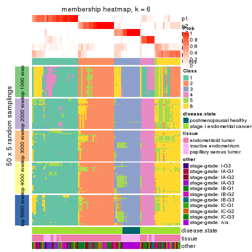</p>

</div>
</div>

As soon as we have had the classes for columns, we can look for signatures
which are significantly different between classes which can be candidate marks
for certain classes. Following are the heatmaps for signatures.


Signature heatmaps where rows are scaled:


<script>
$( function() {
	$( '#tabs-SD-mclust-get-signatures' ).tabs();
} );
</script>
<div id='tabs-SD-mclust-get-signatures'>
<ul>
<li><a href='#tab-SD-mclust-get-signatures-1'>k = 2</a></li>
<li><a href='#tab-SD-mclust-get-signatures-2'>k = 3</a></li>
<li><a href='#tab-SD-mclust-get-signatures-3'>k = 4</a></li>
<li><a href='#tab-SD-mclust-get-signatures-4'>k = 5</a></li>
<li><a href='#tab-SD-mclust-get-signatures-5'>k = 6</a></li>
</ul>
<div id='tab-SD-mclust-get-signatures-1'>
<pre><code class="r">get_signatures(res, k = 2)
</code></pre>

<p>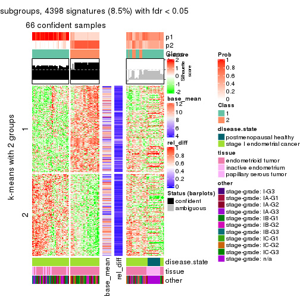</p>

</div>
<div id='tab-SD-mclust-get-signatures-2'>
<pre><code class="r">get_signatures(res, k = 3)
</code></pre>

<p>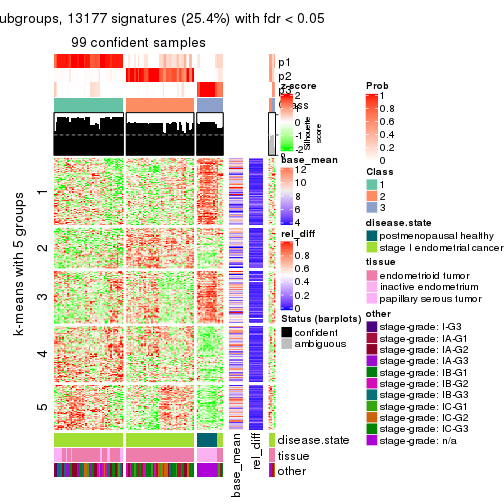</p>

</div>
<div id='tab-SD-mclust-get-signatures-3'>
<pre><code class="r">get_signatures(res, k = 4)
</code></pre>

<p>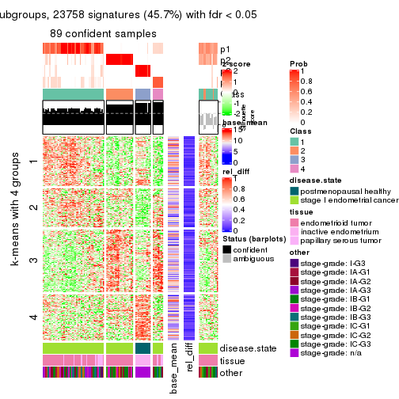</p>

</div>
<div id='tab-SD-mclust-get-signatures-4'>
<pre><code class="r">get_signatures(res, k = 5)
</code></pre>

<p>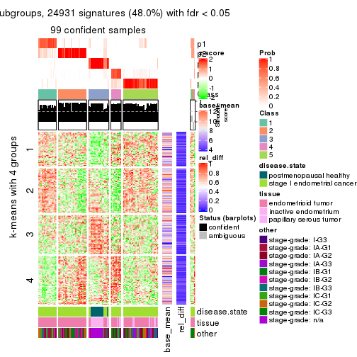</p>

</div>
<div id='tab-SD-mclust-get-signatures-5'>
<pre><code class="r">get_signatures(res, k = 6)
</code></pre>

<p>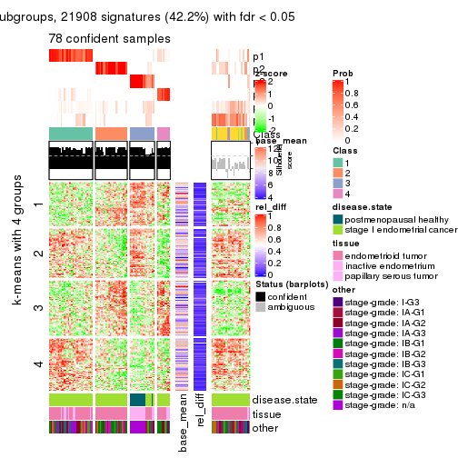</p>

</div>
</div>


Signature heatmaps where rows are not scaled:


<script>
$( function() {
	$( '#tabs-SD-mclust-get-signatures-no-scale' ).tabs();
} );
</script>
<div id='tabs-SD-mclust-get-signatures-no-scale'>
<ul>
<li><a href='#tab-SD-mclust-get-signatures-no-scale-1'>k = 2</a></li>
<li><a href='#tab-SD-mclust-get-signatures-no-scale-2'>k = 3</a></li>
<li><a href='#tab-SD-mclust-get-signatures-no-scale-3'>k = 4</a></li>
<li><a href='#tab-SD-mclust-get-signatures-no-scale-4'>k = 5</a></li>
<li><a href='#tab-SD-mclust-get-signatures-no-scale-5'>k = 6</a></li>
</ul>
<div id='tab-SD-mclust-get-signatures-no-scale-1'>
<pre><code class="r">get_signatures(res, k = 2, scale_rows = FALSE)
</code></pre>

<p>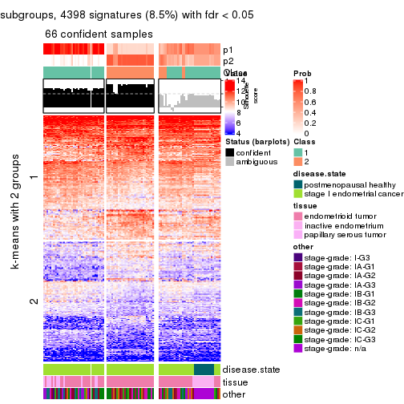</p>

</div>
<div id='tab-SD-mclust-get-signatures-no-scale-2'>
<pre><code class="r">get_signatures(res, k = 3, scale_rows = FALSE)
</code></pre>

<p>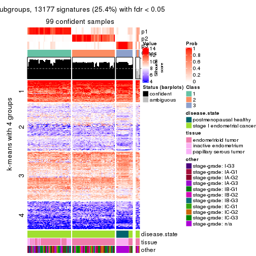</p>

</div>
<div id='tab-SD-mclust-get-signatures-no-scale-3'>
<pre><code class="r">get_signatures(res, k = 4, scale_rows = FALSE)
</code></pre>

<p>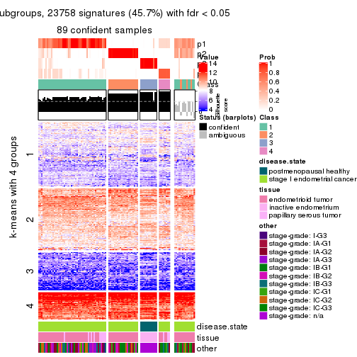</p>

</div>
<div id='tab-SD-mclust-get-signatures-no-scale-4'>
<pre><code class="r">get_signatures(res, k = 5, scale_rows = FALSE)
</code></pre>

<p>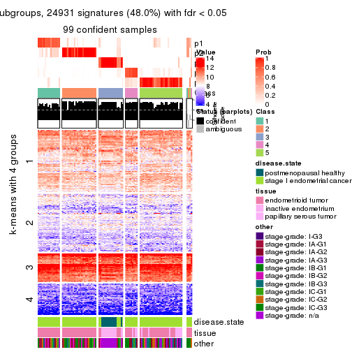</p>

</div>
<div id='tab-SD-mclust-get-signatures-no-scale-5'>
<pre><code class="r">get_signatures(res, k = 6, scale_rows = FALSE)
</code></pre>

<p>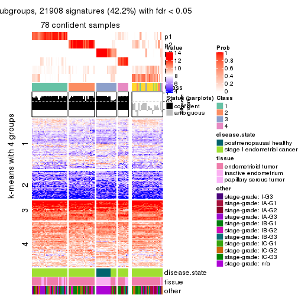</p>

</div>
</div>


Compare the overlap of signatures from different k:

```r
compare_signatures(res)
```

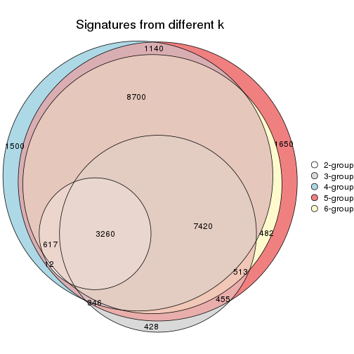

`get_signature()` returns a data frame invisibly. TO get the list of signatures, the function
call should be assigned to a variable explicitly. In following code, if `plot` argument is set
to `FALSE`, no heatmap is plotted while only the differential analysis is performed.

```r
# code only for demonstration
tb = get_signature(res, k = ..., plot = FALSE)
```

An example of the output of `tb` is:

```
#>   which_row         fdr    mean_1    mean_2 scaled_mean_1 scaled_mean_2 km
#> 1        38 0.042760348  8.373488  9.131774    -0.5533452     0.5164555  1
#> 2        40 0.018707592  7.106213  8.469186    -0.6173731     0.5762149  1
#> 3        55 0.019134737 10.221463 11.207825    -0.6159697     0.5749050  1
#> 4        59 0.006059896  5.921854  7.869574    -0.6899429     0.6439467  1
#> 5        60 0.018055526  8.928898 10.211722    -0.6204761     0.5791110  1
#> 6        98 0.009384629 15.714769 14.887706     0.6635654    -0.6193277  2
...
```

The columns in `tb` are:

1. `which_row`: row indices corresponding to the input matrix.
2. `fdr`: FDR for the differential test. 
3. `mean_x`: The mean value in group x.
4. `scaled_mean_x`: The mean value in group x after rows are scaled.
5. `km`: Row groups if k-means clustering is applied to rows.


UMAP plot which shows how samples are separated.


<script>
$( function() {
	$( '#tabs-SD-mclust-dimension-reduction' ).tabs();
} );
</script>
<div id='tabs-SD-mclust-dimension-reduction'>
<ul>
<li><a href='#tab-SD-mclust-dimension-reduction-1'>k = 2</a></li>
<li><a href='#tab-SD-mclust-dimension-reduction-2'>k = 3</a></li>
<li><a href='#tab-SD-mclust-dimension-reduction-3'>k = 4</a></li>
<li><a href='#tab-SD-mclust-dimension-reduction-4'>k = 5</a></li>
<li><a href='#tab-SD-mclust-dimension-reduction-5'>k = 6</a></li>
</ul>
<div id='tab-SD-mclust-dimension-reduction-1'>
<pre><code class="r">dimension_reduction(res, k = 2, method = &quot;UMAP&quot;)
</code></pre>

<p>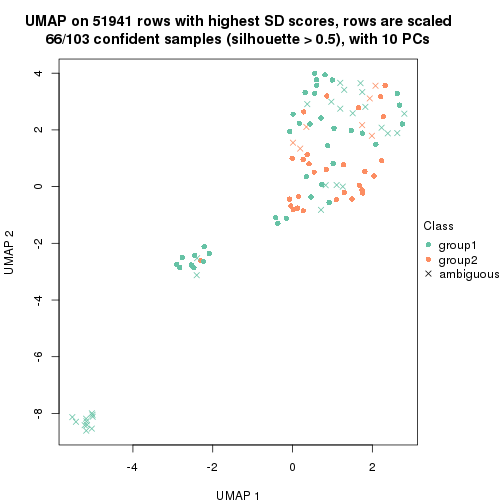</p>

</div>
<div id='tab-SD-mclust-dimension-reduction-2'>
<pre><code class="r">dimension_reduction(res, k = 3, method = &quot;UMAP&quot;)
</code></pre>

<p>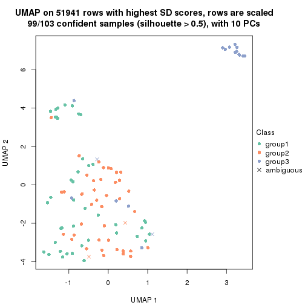</p>

</div>
<div id='tab-SD-mclust-dimension-reduction-3'>
<pre><code class="r">dimension_reduction(res, k = 4, method = &quot;UMAP&quot;)
</code></pre>

<p>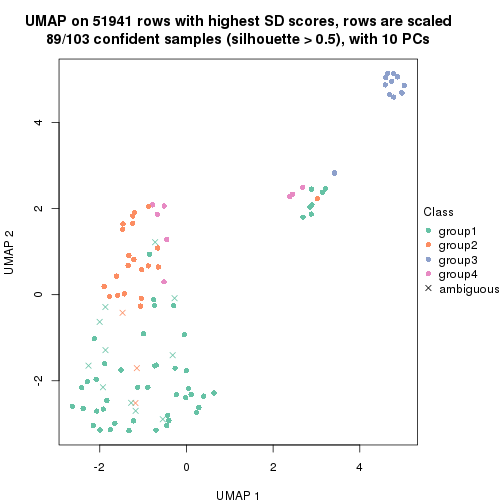</p>

</div>
<div id='tab-SD-mclust-dimension-reduction-4'>
<pre><code class="r">dimension_reduction(res, k = 5, method = &quot;UMAP&quot;)
</code></pre>

<p>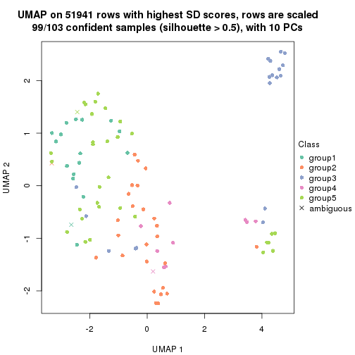</p>

</div>
<div id='tab-SD-mclust-dimension-reduction-5'>
<pre><code class="r">dimension_reduction(res, k = 6, method = &quot;UMAP&quot;)
</code></pre>

<p>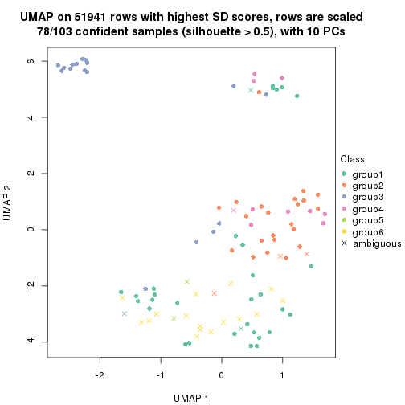</p>

</div>
</div>


Following heatmap shows how subgroups are split when increasing `k`:

```r
collect_classes(res)
```

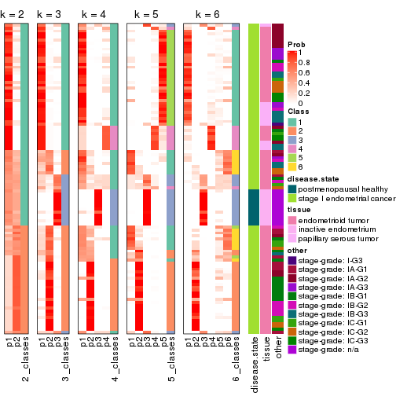


Test correlation between subgroups and known annotations. If the known
annotation is numeric, one-way ANOVA test is applied, and if the known
annotation is discrete, chi-squared contingency table test is applied.

```r
test_to_known_factors(res)
```

```
#>            n disease.state(p) tissue(p) other(p) k
#> SD:mclust 66               NA  3.93e-03 5.09e-04 2
#> SD:mclust 99         4.15e-16  5.02e-18 1.37e-13 3
#> SD:mclust 89         3.59e-19  9.26e-19 9.81e-13 4
#> SD:mclust 99         1.44e-12  2.47e-13 1.14e-08 5
#> SD:mclust 78         5.17e-11  6.06e-11 3.44e-09 6
```


If matrix rows can be associated to genes, consider to use `functional_enrichment(res,
...)` to perform function enrichment for the signature genes. See [this vignette](http://bioconductor.org/packages/devel/bioc/vignettes/cola/inst/doc/functional_enrichment.html) for more detailed explanations.


 

---------------------------------------------------


### SD:NMF


The object with results only for a single top-value method and a single partition method 
can be extracted as:

```r
res = res_list["SD", "NMF"]
# you can also extract it by
# res = res_list["SD:NMF"]
```

A summary of `res` and all the functions that can be applied to it:

```r
res
```

```
#> A 'ConsensusPartition' object with k = 2, 3, 4, 5, 6.
#>   On a matrix with 51941 rows and 103 columns.
#>   Top rows (1000, 2000, 3000, 4000, 5000) are extracted by 'SD' method.
#>   Subgroups are detected by 'NMF' method.
#>   Performed in total 1250 partitions by row resampling.
#>   Best k for subgroups seems to be 2.
#> 
#> Following methods can be applied to this 'ConsensusPartition' object:
#>  [1] "cola_report"             "collect_classes"         "collect_plots"          
#>  [4] "collect_stats"           "colnames"                "compare_signatures"     
#>  [7] "consensus_heatmap"       "dimension_reduction"     "functional_enrichment"  
#> [10] "get_anno_col"            "get_anno"                "get_classes"            
#> [13] "get_consensus"           "get_matrix"              "get_membership"         
#> [16] "get_param"               "get_signatures"          "get_stats"              
#> [19] "is_best_k"               "is_stable_k"             "membership_heatmap"     
#> [22] "ncol"                    "nrow"                    "plot_ecdf"              
#> [25] "rownames"                "select_partition_number" "show"                   
#> [28] "suggest_best_k"          "test_to_known_factors"
```

`collect_plots()` function collects all the plots made from `res` for all `k` (number of partitions)
into one single page to provide an easy and fast comparison between different `k`.

```r
collect_plots(res)
```

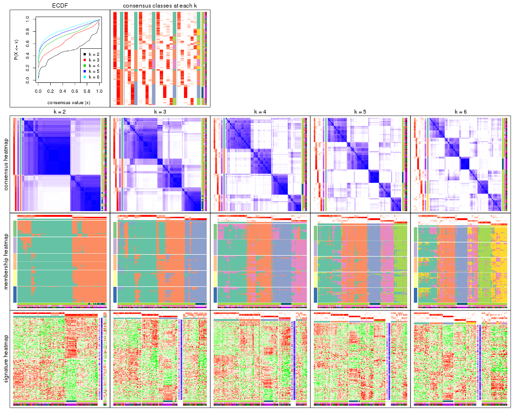

The plots are:

- The first row: a plot of the ECDF (empirical cumulative distribution
  function) curves of the consensus matrix for each `k` and the heatmap of
  predicted classes for each `k`.
- The second row: heatmaps of the consensus matrix for each `k`.
- The third row: heatmaps of the membership matrix for each `k`.
- The fouth row: heatmaps of the signatures for each `k`.

All the plots in panels can be made by individual functions and they are
plotted later in this section.

`select_partition_number()` produces several plots showing different
statistics for choosing "optimized" `k`. There are following statistics:

- ECDF curves of the consensus matrix for each `k`;
- 1-PAC. [The PAC
  score](https://en.wikipedia.org/wiki/Consensus_clustering#Over-interpretation_potential_of_consensus_clustering)
  measures the proportion of the ambiguous subgrouping.
- Mean silhouette score.
- Concordance. The mean probability of fiting the consensus class ids in all
  partitions.
- Area increased. Denote $A_k$ as the area under the ECDF curve for current
  `k`, the area increased is defined as $A_k - A_{k-1}$.
- Rand index. The percent of pairs of samples that are both in a same cluster
  or both are not in a same cluster in the partition of k and k-1.
- Jaccard index. The ratio of pairs of samples are both in a same cluster in
  the partition of k and k-1 and the pairs of samples are both in a same
  cluster in the partition k or k-1.

The detailed explanations of these statistics can be found in [the _cola_
vignette](http://bioconductor.org/packages/devel/bioc/vignettes/cola/inst/doc/cola.html#toc_13).

Generally speaking, lower PAC score, higher mean silhouette score or higher
concordance corresponds to better partition. Rand index and Jaccard index
measure how similar the current partition is compared to partition with `k-1`.
If they are too similar, we won't accept `k` is better than `k-1`.

```r
select_partition_number(res)
```

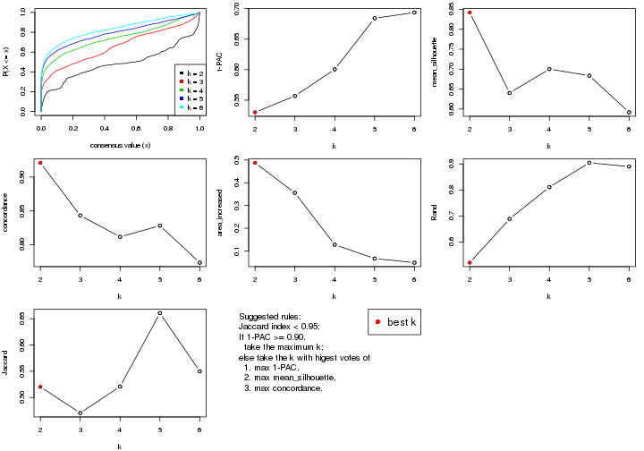

The numeric values for all these statistics can be obtained by `get_stats()`.

```r
get_stats(res)
```

```
#>   k 1-PAC mean_silhouette concordance area_increased  Rand Jaccard
#> 2 2 0.530           0.842       0.921         0.4877 0.520   0.520
#> 3 3 0.557           0.640       0.843         0.3556 0.689   0.471
#> 4 4 0.601           0.700       0.812         0.1277 0.811   0.521
#> 5 5 0.684           0.684       0.828         0.0669 0.904   0.661
#> 6 6 0.694           0.592       0.773         0.0489 0.890   0.550
```

`suggest_best_k()` suggests the best $k$ based on these statistics. The rules are as follows:

- All $k$ with Jaccard index larger than 0.95 are removed because increasing
  $k$ does not provide enough extra information. If all $k$ are removed, it is
  marked as no subgroup is detected.
- For all $k$ with 1-PAC score larger than 0.9, the maximal $k$ is taken as
  the best $k$, and other $k$ are marked as optional $k$.
- If it does not fit the second rule. The $k$ with the maximal vote of the
  highest 1-PAC score, highest mean silhouette, and highest concordance is
  taken as the best $k$.

```r
suggest_best_k(res)
```

```
#> [1] 2
```


Following shows the table of the partitions (You need to click the **show/hide
code output** link to see it). The membership matrix (columns with name `p*`)
is inferred by
[`clue::cl_consensus()`](https://www.rdocumentation.org/link/cl_consensus?package=clue)
function with the `SE` method. Basically the value in the membership matrix
represents the probability to belong to a certain group. The finall class
label for an item is determined with the group with highest probability it
belongs to.

In `get_classes()` function, the entropy is calculated from the membership
matrix and the silhouette score is calculated from the consensus matrix.


<script>
$( function() {
	$( '#tabs-SD-NMF-get-classes' ).tabs();
} );
</script>
<div id='tabs-SD-NMF-get-classes'>
<ul>
<li><a href='#tab-SD-NMF-get-classes-1'>k = 2</a></li>
<li><a href='#tab-SD-NMF-get-classes-2'>k = 3</a></li>
<li><a href='#tab-SD-NMF-get-classes-3'>k = 4</a></li>
<li><a href='#tab-SD-NMF-get-classes-4'>k = 5</a></li>
<li><a href='#tab-SD-NMF-get-classes-5'>k = 6</a></li>
</ul>

<div id='tab-SD-NMF-get-classes-1'>
<p><a id='tab-SD-NMF-get-classes-1-a' style='color:#0366d6' href='#'>show/hide code output</a></p>
<pre><code class="r">cbind(get_classes(res, k = 2), get_membership(res, k = 2))
</code></pre>

<pre><code>#&gt;           class entropy silhouette    p1    p2
#&gt; GSM425907     2  0.2236      0.919 0.036 0.964
#&gt; GSM425908     1  0.9491      0.510 0.632 0.368
#&gt; GSM425909     2  0.5629      0.840 0.132 0.868
#&gt; GSM425910     2  0.5946      0.842 0.144 0.856
#&gt; GSM425911     2  0.0672      0.929 0.008 0.992
#&gt; GSM425912     2  0.3431      0.906 0.064 0.936
#&gt; GSM425913     2  0.5408      0.853 0.124 0.876
#&gt; GSM425914     2  0.0672      0.929 0.008 0.992
#&gt; GSM425915     2  0.0938      0.930 0.012 0.988
#&gt; GSM425874     1  0.0376      0.898 0.996 0.004
#&gt; GSM425875     1  0.1184      0.892 0.984 0.016
#&gt; GSM425876     1  0.6148      0.786 0.848 0.152
#&gt; GSM425877     1  0.0376      0.897 0.996 0.004
#&gt; GSM425878     1  0.0000      0.898 1.000 0.000
#&gt; GSM425879     2  0.1633      0.923 0.024 0.976
#&gt; GSM425880     1  0.9323      0.441 0.652 0.348
#&gt; GSM425881     1  0.5629      0.823 0.868 0.132
#&gt; GSM425882     1  0.8499      0.675 0.724 0.276
#&gt; GSM425883     1  0.0000      0.898 1.000 0.000
#&gt; GSM425884     1  0.1633      0.888 0.976 0.024
#&gt; GSM425885     1  0.1633      0.892 0.976 0.024
#&gt; GSM425848     1  0.0672      0.898 0.992 0.008
#&gt; GSM425849     1  0.0000      0.898 1.000 0.000
#&gt; GSM425850     1  0.0000      0.898 1.000 0.000
#&gt; GSM425851     1  0.2423      0.879 0.960 0.040
#&gt; GSM425852     2  0.7745      0.721 0.228 0.772
#&gt; GSM425893     2  0.0000      0.929 0.000 1.000
#&gt; GSM425894     1  0.9248      0.568 0.660 0.340
#&gt; GSM425895     1  0.9248      0.568 0.660 0.340
#&gt; GSM425896     2  0.0000      0.929 0.000 1.000
#&gt; GSM425897     2  0.1184      0.926 0.016 0.984
#&gt; GSM425898     1  0.7453      0.754 0.788 0.212
#&gt; GSM425899     1  0.0376      0.898 0.996 0.004
#&gt; GSM425900     1  0.8144      0.704 0.748 0.252
#&gt; GSM425901     2  0.6343      0.808 0.160 0.840
#&gt; GSM425902     1  0.0376      0.898 0.996 0.004
#&gt; GSM425903     2  0.1184      0.929 0.016 0.984
#&gt; GSM425904     1  0.9732      0.289 0.596 0.404
#&gt; GSM425905     2  0.5842      0.835 0.140 0.860
#&gt; GSM425906     2  0.5737      0.845 0.136 0.864
#&gt; GSM425863     1  0.0000      0.898 1.000 0.000
#&gt; GSM425864     2  0.1633      0.923 0.024 0.976
#&gt; GSM425865     2  0.6148      0.820 0.152 0.848
#&gt; GSM425866     1  0.1843      0.887 0.972 0.028
#&gt; GSM425867     2  0.2043      0.922 0.032 0.968
#&gt; GSM425868     1  0.6343      0.805 0.840 0.160
#&gt; GSM425869     1  0.8144      0.709 0.748 0.252
#&gt; GSM425870     2  0.0376      0.929 0.004 0.996
#&gt; GSM425871     1  0.0000      0.898 1.000 0.000
#&gt; GSM425872     1  0.9087      0.596 0.676 0.324
#&gt; GSM425873     1  0.0000      0.898 1.000 0.000
#&gt; GSM425843     1  0.0000      0.898 1.000 0.000
#&gt; GSM425844     1  0.0376      0.898 0.996 0.004
#&gt; GSM425845     1  0.9922      0.134 0.552 0.448
#&gt; GSM425846     1  0.0938      0.896 0.988 0.012
#&gt; GSM425847     1  0.4690      0.848 0.900 0.100
#&gt; GSM425886     2  0.0672      0.931 0.008 0.992
#&gt; GSM425887     1  0.7453      0.752 0.788 0.212
#&gt; GSM425888     1  0.1633      0.891 0.976 0.024
#&gt; GSM425889     1  0.0376      0.898 0.996 0.004
#&gt; GSM425890     1  0.0376      0.898 0.996 0.004
#&gt; GSM425891     2  0.5519      0.850 0.128 0.872
#&gt; GSM425892     2  0.9209      0.454 0.336 0.664
#&gt; GSM425853     1  0.0376      0.897 0.996 0.004
#&gt; GSM425854     1  0.7139      0.771 0.804 0.196
#&gt; GSM425855     1  0.0000      0.898 1.000 0.000
#&gt; GSM425856     1  0.2043      0.885 0.968 0.032
#&gt; GSM425857     2  0.6247      0.815 0.156 0.844
#&gt; GSM425858     1  0.5737      0.820 0.864 0.136
#&gt; GSM425859     1  0.8144      0.708 0.748 0.252
#&gt; GSM425860     2  0.5946      0.843 0.144 0.856
#&gt; GSM425861     1  0.0672      0.896 0.992 0.008
#&gt; GSM425862     1  0.0376      0.898 0.996 0.004
#&gt; GSM425837     1  0.0376      0.897 0.996 0.004
#&gt; GSM425838     1  0.0376      0.898 0.996 0.004
#&gt; GSM425839     1  0.8861      0.632 0.696 0.304
#&gt; GSM425840     1  0.0000      0.898 1.000 0.000
#&gt; GSM425841     1  0.0376      0.898 0.996 0.004
#&gt; GSM425842     1  0.0000      0.898 1.000 0.000
#&gt; GSM425917     2  0.0672      0.931 0.008 0.992
#&gt; GSM425922     1  0.0376      0.898 0.996 0.004
#&gt; GSM425919     1  0.6048      0.785 0.852 0.148
#&gt; GSM425920     1  0.0000      0.898 1.000 0.000
#&gt; GSM425923     1  0.0000      0.898 1.000 0.000
#&gt; GSM425916     1  0.2043      0.884 0.968 0.032
#&gt; GSM425918     1  0.0000      0.898 1.000 0.000
#&gt; GSM425921     1  0.0376      0.898 0.996 0.004
#&gt; GSM425925     1  0.0376      0.898 0.996 0.004
#&gt; GSM425926     1  0.0376      0.898 0.996 0.004
#&gt; GSM425927     1  0.0000      0.898 1.000 0.000
#&gt; GSM425924     2  0.5519      0.847 0.128 0.872
#&gt; GSM425928     2  0.0672      0.931 0.008 0.992
#&gt; GSM425929     2  0.0938      0.930 0.012 0.988
#&gt; GSM425930     2  0.0938      0.930 0.012 0.988
#&gt; GSM425931     2  0.0672      0.931 0.008 0.992
#&gt; GSM425932     2  0.0376      0.929 0.004 0.996
#&gt; GSM425933     2  0.0938      0.930 0.012 0.988
#&gt; GSM425934     2  0.0376      0.929 0.004 0.996
#&gt; GSM425935     2  0.0000      0.929 0.000 1.000
#&gt; GSM425936     2  0.0000      0.929 0.000 1.000
#&gt; GSM425937     2  0.0672      0.931 0.008 0.992
#&gt; GSM425938     2  0.0672      0.931 0.008 0.992
#&gt; GSM425939     2  0.0938      0.930 0.012 0.988
</code></pre>

<script>
$('#tab-SD-NMF-get-classes-1-a').parent().next().next().hide();
$('#tab-SD-NMF-get-classes-1-a').click(function(){
  $('#tab-SD-NMF-get-classes-1-a').parent().next().next().toggle();
  return(false);
});
</script>
</div>

<div id='tab-SD-NMF-get-classes-2'>
<p><a id='tab-SD-NMF-get-classes-2-a' style='color:#0366d6' href='#'>show/hide code output</a></p>
<pre><code class="r">cbind(get_classes(res, k = 3), get_membership(res, k = 3))
</code></pre>

<pre><code>#&gt;           class entropy silhouette    p1    p2    p3
#&gt; GSM425907     2  0.1964     0.7395 0.000 0.944 0.056
#&gt; GSM425908     2  0.0424     0.7587 0.000 0.992 0.008
#&gt; GSM425909     3  0.1999     0.8565 0.012 0.036 0.952
#&gt; GSM425910     1  0.8384     0.2415 0.520 0.088 0.392
#&gt; GSM425911     3  0.6267     0.2066 0.000 0.452 0.548
#&gt; GSM425912     1  0.9370     0.0620 0.420 0.412 0.168
#&gt; GSM425913     2  0.3192     0.7005 0.000 0.888 0.112
#&gt; GSM425914     3  0.9111     0.1032 0.140 0.424 0.436
#&gt; GSM425915     3  0.0000     0.8666 0.000 0.000 1.000
#&gt; GSM425874     2  0.6260     0.2213 0.448 0.552 0.000
#&gt; GSM425875     1  0.1753     0.7907 0.952 0.000 0.048
#&gt; GSM425876     1  0.4095     0.7629 0.880 0.056 0.064
#&gt; GSM425877     1  0.0424     0.7964 0.992 0.000 0.008
#&gt; GSM425878     1  0.0747     0.7934 0.984 0.016 0.000
#&gt; GSM425879     2  0.5835     0.3556 0.000 0.660 0.340
#&gt; GSM425880     1  0.5948     0.4467 0.640 0.000 0.360
#&gt; GSM425881     1  0.6192     0.2740 0.580 0.420 0.000
#&gt; GSM425882     2  0.0592     0.7578 0.012 0.988 0.000
#&gt; GSM425883     1  0.0892     0.7952 0.980 0.020 0.000
#&gt; GSM425884     1  0.2261     0.7844 0.932 0.000 0.068
#&gt; GSM425885     2  0.4692     0.6577 0.168 0.820 0.012
#&gt; GSM425848     1  0.5835     0.3834 0.660 0.340 0.000
#&gt; GSM425849     1  0.1529     0.7851 0.960 0.040 0.000
#&gt; GSM425850     1  0.0592     0.7961 0.988 0.012 0.000
#&gt; GSM425851     1  0.2625     0.7754 0.916 0.000 0.084
#&gt; GSM425852     3  0.4702     0.6705 0.212 0.000 0.788
#&gt; GSM425893     3  0.6168     0.3129 0.000 0.412 0.588
#&gt; GSM425894     2  0.0592     0.7579 0.000 0.988 0.012
#&gt; GSM425895     2  0.0237     0.7593 0.004 0.996 0.000
#&gt; GSM425896     2  0.5138     0.5426 0.000 0.748 0.252
#&gt; GSM425897     2  0.5650     0.4182 0.000 0.688 0.312
#&gt; GSM425898     2  0.0237     0.7593 0.004 0.996 0.000
#&gt; GSM425899     1  0.6126     0.2374 0.600 0.400 0.000
#&gt; GSM425900     2  0.5291     0.4895 0.268 0.732 0.000
#&gt; GSM425901     3  0.2845     0.8371 0.012 0.068 0.920
#&gt; GSM425902     2  0.6215     0.2690 0.428 0.572 0.000
#&gt; GSM425903     3  0.3412     0.7818 0.124 0.000 0.876
#&gt; GSM425904     1  0.5948     0.4507 0.640 0.000 0.360
#&gt; GSM425905     2  0.1964     0.7392 0.000 0.944 0.056
#&gt; GSM425906     2  0.7318     0.4423 0.068 0.668 0.264
#&gt; GSM425863     1  0.0237     0.7952 0.996 0.004 0.000
#&gt; GSM425864     2  0.3941     0.6575 0.000 0.844 0.156
#&gt; GSM425865     2  0.1643     0.7453 0.000 0.956 0.044
#&gt; GSM425866     1  0.2066     0.7874 0.940 0.000 0.060
#&gt; GSM425867     3  0.2878     0.8078 0.096 0.000 0.904
#&gt; GSM425868     2  0.0424     0.7590 0.008 0.992 0.000
#&gt; GSM425869     2  0.0237     0.7592 0.000 0.996 0.004
#&gt; GSM425870     3  0.3272     0.8258 0.016 0.080 0.904
#&gt; GSM425871     1  0.1163     0.7904 0.972 0.028 0.000
#&gt; GSM425872     2  0.0661     0.7595 0.004 0.988 0.008
#&gt; GSM425873     1  0.1015     0.7972 0.980 0.008 0.012
#&gt; GSM425843     1  0.0424     0.7964 0.992 0.000 0.008
#&gt; GSM425844     1  0.1753     0.7808 0.952 0.048 0.000
#&gt; GSM425845     1  0.4931     0.6564 0.768 0.000 0.232
#&gt; GSM425846     1  0.6244     0.2125 0.560 0.440 0.000
#&gt; GSM425847     1  0.5450     0.6066 0.760 0.228 0.012
#&gt; GSM425886     3  0.2448     0.8346 0.000 0.076 0.924
#&gt; GSM425887     1  0.6260     0.2124 0.552 0.448 0.000
#&gt; GSM425888     1  0.6180     0.3019 0.584 0.416 0.000
#&gt; GSM425889     1  0.3752     0.7022 0.856 0.144 0.000
#&gt; GSM425890     2  0.6204     0.2773 0.424 0.576 0.000
#&gt; GSM425891     2  0.3879     0.6632 0.000 0.848 0.152
#&gt; GSM425892     2  0.1031     0.7537 0.000 0.976 0.024
#&gt; GSM425853     1  0.1163     0.7949 0.972 0.000 0.028
#&gt; GSM425854     2  0.0424     0.7585 0.008 0.992 0.000
#&gt; GSM425855     1  0.1163     0.7904 0.972 0.028 0.000
#&gt; GSM425856     1  0.2261     0.7844 0.932 0.000 0.068
#&gt; GSM425857     3  0.6879     0.2112 0.016 0.428 0.556
#&gt; GSM425858     2  0.5882     0.3234 0.348 0.652 0.000
#&gt; GSM425859     2  0.0475     0.7595 0.004 0.992 0.004
#&gt; GSM425860     1  0.9061     0.4008 0.548 0.188 0.264
#&gt; GSM425861     1  0.4887     0.6288 0.772 0.228 0.000
#&gt; GSM425862     1  0.4974     0.5828 0.764 0.236 0.000
#&gt; GSM425837     1  0.0424     0.7964 0.992 0.000 0.008
#&gt; GSM425838     2  0.6140     0.3165 0.404 0.596 0.000
#&gt; GSM425839     2  0.0592     0.7579 0.000 0.988 0.012
#&gt; GSM425840     1  0.0237     0.7952 0.996 0.004 0.000
#&gt; GSM425841     2  0.6215     0.2690 0.428 0.572 0.000
#&gt; GSM425842     1  0.1129     0.7950 0.976 0.020 0.004
#&gt; GSM425917     3  0.2200     0.8468 0.004 0.056 0.940
#&gt; GSM425922     2  0.6244     0.2401 0.440 0.560 0.000
#&gt; GSM425919     1  0.4062     0.7261 0.836 0.000 0.164
#&gt; GSM425920     1  0.0424     0.7964 0.992 0.000 0.008
#&gt; GSM425923     1  0.1163     0.7905 0.972 0.028 0.000
#&gt; GSM425916     1  0.1860     0.7896 0.948 0.000 0.052
#&gt; GSM425918     1  0.1163     0.7905 0.972 0.028 0.000
#&gt; GSM425921     2  0.6280     0.1831 0.460 0.540 0.000
#&gt; GSM425925     1  0.3686     0.7069 0.860 0.140 0.000
#&gt; GSM425926     1  0.6309    -0.0903 0.504 0.496 0.000
#&gt; GSM425927     1  0.0592     0.7963 0.988 0.000 0.012
#&gt; GSM425924     3  0.2878     0.8117 0.096 0.000 0.904
#&gt; GSM425928     3  0.1163     0.8607 0.000 0.028 0.972
#&gt; GSM425929     3  0.0237     0.8656 0.004 0.000 0.996
#&gt; GSM425930     3  0.0237     0.8656 0.004 0.000 0.996
#&gt; GSM425931     3  0.0000     0.8666 0.000 0.000 1.000
#&gt; GSM425932     3  0.0237     0.8663 0.000 0.004 0.996
#&gt; GSM425933     3  0.0000     0.8666 0.000 0.000 1.000
#&gt; GSM425934     3  0.0592     0.8653 0.000 0.012 0.988
#&gt; GSM425935     3  0.3038     0.8149 0.000 0.104 0.896
#&gt; GSM425936     3  0.0424     0.8658 0.000 0.008 0.992
#&gt; GSM425937     3  0.0000     0.8666 0.000 0.000 1.000
#&gt; GSM425938     3  0.0747     0.8646 0.000 0.016 0.984
#&gt; GSM425939     3  0.0237     0.8656 0.004 0.000 0.996
</code></pre>

<script>
$('#tab-SD-NMF-get-classes-2-a').parent().next().next().hide();
$('#tab-SD-NMF-get-classes-2-a').click(function(){
  $('#tab-SD-NMF-get-classes-2-a').parent().next().next().toggle();
  return(false);
});
</script>
</div>

<div id='tab-SD-NMF-get-classes-3'>
<p><a id='tab-SD-NMF-get-classes-3-a' style='color:#0366d6' href='#'>show/hide code output</a></p>
<pre><code class="r">cbind(get_classes(res, k = 4), get_membership(res, k = 4))
</code></pre>

<pre><code>#&gt;           class entropy silhouette    p1    p2    p3    p4
#&gt; GSM425907     2  0.5069     0.5599 0.000 0.664 0.016 0.320
#&gt; GSM425908     2  0.4916     0.3591 0.000 0.576 0.000 0.424
#&gt; GSM425909     3  0.3616     0.8251 0.036 0.000 0.852 0.112
#&gt; GSM425910     1  0.4425     0.7244 0.828 0.080 0.012 0.080
#&gt; GSM425911     2  0.1388     0.7972 0.028 0.960 0.012 0.000
#&gt; GSM425912     2  0.3975     0.6665 0.240 0.760 0.000 0.000
#&gt; GSM425913     2  0.0188     0.8032 0.000 0.996 0.004 0.000
#&gt; GSM425914     2  0.2593     0.7698 0.104 0.892 0.004 0.000
#&gt; GSM425915     3  0.3937     0.8362 0.024 0.024 0.852 0.100
#&gt; GSM425874     4  0.2611     0.7885 0.096 0.008 0.000 0.896
#&gt; GSM425875     1  0.4426     0.7526 0.772 0.000 0.024 0.204
#&gt; GSM425876     1  0.3099     0.7395 0.876 0.104 0.000 0.020
#&gt; GSM425877     1  0.4267     0.7341 0.788 0.000 0.024 0.188
#&gt; GSM425878     1  0.1867     0.7987 0.928 0.000 0.000 0.072
#&gt; GSM425879     2  0.0672     0.8036 0.000 0.984 0.008 0.008
#&gt; GSM425880     1  0.7414     0.2718 0.480 0.000 0.340 0.180
#&gt; GSM425881     2  0.4431     0.5839 0.304 0.696 0.000 0.000
#&gt; GSM425882     2  0.0817     0.8049 0.000 0.976 0.000 0.024
#&gt; GSM425883     1  0.4164     0.6679 0.736 0.000 0.000 0.264
#&gt; GSM425884     1  0.2125     0.7951 0.920 0.000 0.004 0.076
#&gt; GSM425885     4  0.2125     0.7117 0.004 0.076 0.000 0.920
#&gt; GSM425848     4  0.4290     0.5885 0.212 0.000 0.016 0.772
#&gt; GSM425849     1  0.2704     0.7812 0.876 0.000 0.000 0.124
#&gt; GSM425850     1  0.2124     0.7797 0.932 0.040 0.000 0.028
#&gt; GSM425851     1  0.7685     0.3192 0.456 0.000 0.288 0.256
#&gt; GSM425852     3  0.5277     0.7422 0.132 0.000 0.752 0.116
#&gt; GSM425893     2  0.3312     0.7597 0.008 0.884 0.068 0.040
#&gt; GSM425894     4  0.4730     0.2874 0.000 0.364 0.000 0.636
#&gt; GSM425895     2  0.2216     0.7928 0.000 0.908 0.000 0.092
#&gt; GSM425896     2  0.6403     0.5742 0.000 0.640 0.128 0.232
#&gt; GSM425897     2  0.1488     0.8002 0.000 0.956 0.032 0.012
#&gt; GSM425898     2  0.3975     0.6795 0.000 0.760 0.000 0.240
#&gt; GSM425899     4  0.4225     0.7370 0.184 0.024 0.000 0.792
#&gt; GSM425900     2  0.2345     0.7761 0.100 0.900 0.000 0.000
#&gt; GSM425901     3  0.3821     0.8195 0.040 0.000 0.840 0.120
#&gt; GSM425902     4  0.2676     0.7889 0.092 0.012 0.000 0.896
#&gt; GSM425903     3  0.6638     0.6502 0.224 0.020 0.656 0.100
#&gt; GSM425904     3  0.7564    -0.0293 0.388 0.000 0.420 0.192
#&gt; GSM425905     2  0.1716     0.8003 0.000 0.936 0.000 0.064
#&gt; GSM425906     2  0.1978     0.7877 0.068 0.928 0.004 0.000
#&gt; GSM425863     1  0.2704     0.7825 0.876 0.000 0.000 0.124
#&gt; GSM425864     2  0.2060     0.8007 0.000 0.932 0.016 0.052
#&gt; GSM425865     2  0.1867     0.7993 0.000 0.928 0.000 0.072
#&gt; GSM425866     1  0.3658     0.7647 0.836 0.000 0.020 0.144
#&gt; GSM425867     3  0.3601     0.8304 0.056 0.000 0.860 0.084
#&gt; GSM425868     4  0.4713     0.2971 0.000 0.360 0.000 0.640
#&gt; GSM425869     4  0.4134     0.5140 0.000 0.260 0.000 0.740
#&gt; GSM425870     3  0.6029     0.0220 0.032 0.480 0.484 0.004
#&gt; GSM425871     1  0.1489     0.7944 0.952 0.004 0.000 0.044
#&gt; GSM425872     2  0.3074     0.7626 0.000 0.848 0.000 0.152
#&gt; GSM425873     1  0.1151     0.7876 0.968 0.024 0.000 0.008
#&gt; GSM425843     1  0.1792     0.7931 0.932 0.000 0.000 0.068
#&gt; GSM425844     1  0.4262     0.6868 0.756 0.000 0.008 0.236
#&gt; GSM425845     1  0.3253     0.7535 0.876 0.008 0.016 0.100
#&gt; GSM425846     1  0.7295     0.2843 0.524 0.288 0.000 0.188
#&gt; GSM425847     1  0.3726     0.6505 0.788 0.212 0.000 0.000
#&gt; GSM425886     3  0.3720     0.8372 0.024 0.016 0.860 0.100
#&gt; GSM425887     2  0.4382     0.5949 0.296 0.704 0.000 0.000
#&gt; GSM425888     2  0.5535     0.3018 0.420 0.560 0.000 0.020
#&gt; GSM425889     4  0.4567     0.6009 0.244 0.000 0.016 0.740
#&gt; GSM425890     4  0.2675     0.7848 0.100 0.000 0.008 0.892
#&gt; GSM425891     2  0.0188     0.8032 0.000 0.996 0.004 0.000
#&gt; GSM425892     2  0.4382     0.6081 0.000 0.704 0.000 0.296
#&gt; GSM425853     1  0.2714     0.7845 0.884 0.000 0.004 0.112
#&gt; GSM425854     2  0.2647     0.7808 0.000 0.880 0.000 0.120
#&gt; GSM425855     1  0.3870     0.7301 0.788 0.000 0.004 0.208
#&gt; GSM425856     1  0.3757     0.7651 0.828 0.000 0.020 0.152
#&gt; GSM425857     4  0.5952     0.3842 0.028 0.028 0.276 0.668
#&gt; GSM425858     2  0.3123     0.7430 0.156 0.844 0.000 0.000
#&gt; GSM425859     2  0.4746     0.4845 0.000 0.632 0.000 0.368
#&gt; GSM425860     1  0.4758     0.6775 0.780 0.156 0.064 0.000
#&gt; GSM425861     1  0.4391     0.5923 0.740 0.252 0.000 0.008
#&gt; GSM425862     4  0.4284     0.6389 0.224 0.000 0.012 0.764
#&gt; GSM425837     1  0.3048     0.7918 0.876 0.000 0.016 0.108
#&gt; GSM425838     4  0.2089     0.7500 0.048 0.020 0.000 0.932
#&gt; GSM425839     2  0.2408     0.7878 0.000 0.896 0.000 0.104
#&gt; GSM425840     1  0.3351     0.7685 0.844 0.000 0.008 0.148
#&gt; GSM425841     4  0.2741     0.7885 0.096 0.012 0.000 0.892
#&gt; GSM425842     1  0.0657     0.7914 0.984 0.012 0.000 0.004
#&gt; GSM425917     3  0.2651     0.8136 0.004 0.004 0.896 0.096
#&gt; GSM425922     4  0.2860     0.7871 0.100 0.008 0.004 0.888
#&gt; GSM425919     1  0.4663     0.7531 0.788 0.000 0.148 0.064
#&gt; GSM425920     1  0.3105     0.7814 0.868 0.000 0.012 0.120
#&gt; GSM425923     1  0.5452     0.4652 0.616 0.000 0.024 0.360
#&gt; GSM425916     1  0.5576     0.6885 0.720 0.000 0.096 0.184
#&gt; GSM425918     1  0.5038     0.5929 0.684 0.000 0.020 0.296
#&gt; GSM425921     4  0.2530     0.7869 0.100 0.004 0.000 0.896
#&gt; GSM425925     4  0.5080     0.2042 0.420 0.004 0.000 0.576
#&gt; GSM425926     4  0.2593     0.7861 0.104 0.004 0.000 0.892
#&gt; GSM425927     1  0.1305     0.7945 0.960 0.000 0.004 0.036
#&gt; GSM425924     3  0.1610     0.8559 0.032 0.000 0.952 0.016
#&gt; GSM425928     3  0.0188     0.8718 0.000 0.000 0.996 0.004
#&gt; GSM425929     3  0.0707     0.8732 0.000 0.020 0.980 0.000
#&gt; GSM425930     3  0.0469     0.8743 0.000 0.012 0.988 0.000
#&gt; GSM425931     3  0.0000     0.8730 0.000 0.000 1.000 0.000
#&gt; GSM425932     3  0.0707     0.8732 0.000 0.020 0.980 0.000
#&gt; GSM425933     3  0.0592     0.8739 0.000 0.016 0.984 0.000
#&gt; GSM425934     3  0.1022     0.8688 0.000 0.032 0.968 0.000
#&gt; GSM425935     3  0.1302     0.8620 0.000 0.044 0.956 0.000
#&gt; GSM425936     3  0.0817     0.8719 0.000 0.024 0.976 0.000
#&gt; GSM425937     3  0.0469     0.8743 0.000 0.012 0.988 0.000
#&gt; GSM425938     3  0.0376     0.8744 0.000 0.004 0.992 0.004
#&gt; GSM425939     3  0.0336     0.8742 0.000 0.008 0.992 0.000
</code></pre>

<script>
$('#tab-SD-NMF-get-classes-3-a').parent().next().next().hide();
$('#tab-SD-NMF-get-classes-3-a').click(function(){
  $('#tab-SD-NMF-get-classes-3-a').parent().next().next().toggle();
  return(false);
});
</script>
</div>

<div id='tab-SD-NMF-get-classes-4'>
<p><a id='tab-SD-NMF-get-classes-4-a' style='color:#0366d6' href='#'>show/hide code output</a></p>
<pre><code class="r">cbind(get_classes(res, k = 5), get_membership(res, k = 5))
</code></pre>

<pre><code>#&gt;           class entropy silhouette    p1    p2    p3    p4    p5
#&gt; GSM425907     2  0.4885      0.381 0.000 0.572 0.000 0.400 0.028
#&gt; GSM425908     2  0.4803      0.298 0.000 0.536 0.000 0.444 0.020
#&gt; GSM425909     5  0.1549      0.837 0.000 0.000 0.040 0.016 0.944
#&gt; GSM425910     1  0.4428      0.641 0.756 0.084 0.000 0.000 0.160
#&gt; GSM425911     2  0.0613      0.774 0.008 0.984 0.004 0.000 0.004
#&gt; GSM425912     2  0.2690      0.701 0.156 0.844 0.000 0.000 0.000
#&gt; GSM425913     2  0.0162      0.774 0.000 0.996 0.004 0.000 0.000
#&gt; GSM425914     2  0.1270      0.764 0.052 0.948 0.000 0.000 0.000
#&gt; GSM425915     5  0.2690      0.787 0.000 0.000 0.156 0.000 0.844
#&gt; GSM425874     4  0.1329      0.800 0.032 0.004 0.000 0.956 0.008
#&gt; GSM425875     5  0.2127      0.833 0.108 0.000 0.000 0.000 0.892
#&gt; GSM425876     1  0.3002      0.731 0.856 0.116 0.000 0.000 0.028
#&gt; GSM425877     1  0.3938      0.686 0.796 0.000 0.024 0.164 0.016
#&gt; GSM425878     1  0.1430      0.765 0.944 0.000 0.000 0.004 0.052
#&gt; GSM425879     2  0.0162      0.774 0.000 0.996 0.004 0.000 0.000
#&gt; GSM425880     5  0.1740      0.852 0.056 0.000 0.012 0.000 0.932
#&gt; GSM425881     2  0.3395      0.616 0.236 0.764 0.000 0.000 0.000
#&gt; GSM425882     2  0.0579      0.775 0.008 0.984 0.000 0.008 0.000
#&gt; GSM425883     1  0.5530      0.252 0.532 0.004 0.024 0.420 0.020
#&gt; GSM425884     1  0.1502      0.763 0.940 0.000 0.000 0.004 0.056
#&gt; GSM425885     4  0.3841      0.690 0.000 0.032 0.000 0.780 0.188
#&gt; GSM425848     5  0.2915      0.765 0.024 0.000 0.000 0.116 0.860
#&gt; GSM425849     1  0.2228      0.765 0.912 0.000 0.000 0.040 0.048
#&gt; GSM425850     1  0.2338      0.743 0.884 0.112 0.000 0.000 0.004
#&gt; GSM425851     3  0.7225     -0.013 0.328 0.000 0.388 0.264 0.020
#&gt; GSM425852     5  0.2914      0.842 0.052 0.000 0.076 0.000 0.872
#&gt; GSM425893     2  0.5034      0.470 0.000 0.648 0.028 0.016 0.308
#&gt; GSM425894     4  0.4325      0.525 0.000 0.240 0.000 0.724 0.036
#&gt; GSM425895     2  0.1831      0.764 0.000 0.920 0.000 0.076 0.004
#&gt; GSM425896     2  0.7241      0.141 0.000 0.388 0.020 0.280 0.312
#&gt; GSM425897     2  0.0671      0.773 0.000 0.980 0.004 0.016 0.000
#&gt; GSM425898     2  0.4235      0.526 0.000 0.656 0.000 0.336 0.008
#&gt; GSM425899     4  0.3344      0.780 0.104 0.016 0.000 0.852 0.028
#&gt; GSM425900     2  0.0963      0.768 0.036 0.964 0.000 0.000 0.000
#&gt; GSM425901     5  0.1493      0.833 0.000 0.000 0.028 0.024 0.948
#&gt; GSM425902     4  0.1831      0.782 0.000 0.004 0.000 0.920 0.076
#&gt; GSM425903     5  0.2036      0.853 0.056 0.000 0.024 0.000 0.920
#&gt; GSM425904     5  0.1626      0.852 0.044 0.000 0.016 0.000 0.940
#&gt; GSM425905     2  0.1410      0.766 0.000 0.940 0.000 0.060 0.000
#&gt; GSM425906     2  0.0771      0.771 0.020 0.976 0.004 0.000 0.000
#&gt; GSM425863     1  0.3921      0.674 0.784 0.000 0.000 0.172 0.044
#&gt; GSM425864     2  0.2407      0.752 0.000 0.896 0.004 0.088 0.012
#&gt; GSM425865     2  0.1952      0.758 0.000 0.912 0.000 0.084 0.004
#&gt; GSM425866     5  0.2852      0.777 0.172 0.000 0.000 0.000 0.828
#&gt; GSM425867     5  0.4733      0.501 0.028 0.000 0.348 0.000 0.624
#&gt; GSM425868     4  0.3635      0.536 0.000 0.248 0.000 0.748 0.004
#&gt; GSM425869     4  0.3037      0.729 0.000 0.100 0.000 0.860 0.040
#&gt; GSM425870     2  0.4813      0.346 0.004 0.600 0.376 0.000 0.020
#&gt; GSM425871     1  0.1369      0.766 0.956 0.008 0.000 0.028 0.008
#&gt; GSM425872     2  0.3480      0.622 0.000 0.752 0.000 0.248 0.000
#&gt; GSM425873     1  0.2450      0.751 0.896 0.076 0.000 0.000 0.028
#&gt; GSM425843     1  0.1444      0.768 0.948 0.000 0.000 0.012 0.040
#&gt; GSM425844     1  0.4965      0.515 0.664 0.000 0.024 0.292 0.020
#&gt; GSM425845     5  0.4242      0.278 0.428 0.000 0.000 0.000 0.572
#&gt; GSM425846     2  0.6613      0.218 0.336 0.464 0.000 0.196 0.004
#&gt; GSM425847     1  0.3305      0.654 0.776 0.224 0.000 0.000 0.000
#&gt; GSM425886     5  0.2504      0.817 0.000 0.000 0.064 0.040 0.896
#&gt; GSM425887     2  0.3424      0.613 0.240 0.760 0.000 0.000 0.000
#&gt; GSM425888     2  0.4218      0.434 0.332 0.660 0.000 0.008 0.000
#&gt; GSM425889     4  0.5073      0.606 0.212 0.000 0.000 0.688 0.100
#&gt; GSM425890     4  0.2968      0.760 0.092 0.000 0.028 0.872 0.008
#&gt; GSM425891     2  0.0162      0.774 0.000 0.996 0.004 0.000 0.000
#&gt; GSM425892     2  0.4757      0.426 0.000 0.596 0.000 0.380 0.024
#&gt; GSM425853     1  0.3913      0.445 0.676 0.000 0.000 0.000 0.324
#&gt; GSM425854     2  0.1965      0.758 0.000 0.904 0.000 0.096 0.000
#&gt; GSM425855     1  0.3934      0.590 0.716 0.000 0.000 0.276 0.008
#&gt; GSM425856     5  0.1965      0.840 0.096 0.000 0.000 0.000 0.904
#&gt; GSM425857     5  0.2890      0.712 0.000 0.000 0.004 0.160 0.836
#&gt; GSM425858     2  0.1478      0.758 0.064 0.936 0.000 0.000 0.000
#&gt; GSM425859     2  0.4504      0.357 0.000 0.564 0.000 0.428 0.008
#&gt; GSM425860     1  0.3561      0.686 0.796 0.188 0.008 0.000 0.008
#&gt; GSM425861     1  0.4047      0.481 0.676 0.320 0.000 0.000 0.004
#&gt; GSM425862     4  0.5714      0.529 0.116 0.000 0.000 0.592 0.292
#&gt; GSM425837     1  0.2464      0.751 0.888 0.000 0.000 0.016 0.096
#&gt; GSM425838     4  0.3013      0.728 0.000 0.008 0.000 0.832 0.160
#&gt; GSM425839     2  0.1792      0.761 0.000 0.916 0.000 0.084 0.000
#&gt; GSM425840     1  0.2474      0.749 0.896 0.000 0.008 0.084 0.012
#&gt; GSM425841     4  0.1173      0.800 0.020 0.004 0.000 0.964 0.012
#&gt; GSM425842     1  0.1918      0.762 0.928 0.036 0.000 0.000 0.036
#&gt; GSM425917     3  0.4162      0.742 0.048 0.000 0.800 0.132 0.020
#&gt; GSM425922     4  0.2474      0.773 0.084 0.000 0.008 0.896 0.012
#&gt; GSM425919     1  0.5485      0.492 0.640 0.000 0.284 0.056 0.020
#&gt; GSM425920     1  0.3654      0.710 0.836 0.000 0.036 0.108 0.020
#&gt; GSM425923     1  0.5660      0.417 0.588 0.000 0.052 0.340 0.020
#&gt; GSM425916     1  0.6605      0.411 0.552 0.000 0.188 0.240 0.020
#&gt; GSM425918     1  0.5409      0.455 0.616 0.000 0.040 0.324 0.020
#&gt; GSM425921     4  0.1768      0.788 0.072 0.000 0.000 0.924 0.004
#&gt; GSM425925     4  0.4114      0.288 0.376 0.000 0.000 0.624 0.000
#&gt; GSM425926     4  0.1892      0.787 0.080 0.000 0.000 0.916 0.004
#&gt; GSM425927     1  0.0992      0.768 0.968 0.000 0.000 0.008 0.024
#&gt; GSM425924     3  0.3319      0.815 0.064 0.000 0.864 0.052 0.020
#&gt; GSM425928     3  0.0162      0.914 0.000 0.000 0.996 0.004 0.000
#&gt; GSM425929     3  0.0162      0.917 0.000 0.000 0.996 0.000 0.004
#&gt; GSM425930     3  0.0404      0.917 0.000 0.000 0.988 0.000 0.012
#&gt; GSM425931     3  0.0510      0.916 0.000 0.000 0.984 0.000 0.016
#&gt; GSM425932     3  0.0162      0.917 0.000 0.000 0.996 0.000 0.004
#&gt; GSM425933     3  0.0404      0.917 0.000 0.000 0.988 0.000 0.012
#&gt; GSM425934     3  0.0324      0.917 0.000 0.004 0.992 0.000 0.004
#&gt; GSM425935     3  0.0566      0.911 0.000 0.012 0.984 0.000 0.004
#&gt; GSM425936     3  0.0290      0.918 0.000 0.000 0.992 0.000 0.008
#&gt; GSM425937     3  0.0510      0.916 0.000 0.000 0.984 0.000 0.016
#&gt; GSM425938     3  0.0609      0.913 0.000 0.000 0.980 0.000 0.020
#&gt; GSM425939     3  0.0510      0.916 0.000 0.000 0.984 0.000 0.016
</code></pre>

<script>
$('#tab-SD-NMF-get-classes-4-a').parent().next().next().hide();
$('#tab-SD-NMF-get-classes-4-a').click(function(){
  $('#tab-SD-NMF-get-classes-4-a').parent().next().next().toggle();
  return(false);
});
</script>
</div>

<div id='tab-SD-NMF-get-classes-5'>
<p><a id='tab-SD-NMF-get-classes-5-a' style='color:#0366d6' href='#'>show/hide code output</a></p>
<pre><code class="r">cbind(get_classes(res, k = 6), get_membership(res, k = 6))
</code></pre>

<pre><code>#&gt;           class entropy silhouette    p1    p2    p3    p4    p5    p6
#&gt; GSM425907     4  0.4284   -0.01007 0.000 0.440 0.000 0.544 0.012 0.004
#&gt; GSM425908     4  0.4284    0.00868 0.004 0.440 0.000 0.544 0.012 0.000
#&gt; GSM425909     5  0.1320    0.85788 0.000 0.000 0.016 0.036 0.948 0.000
#&gt; GSM425910     1  0.5843    0.54666 0.632 0.112 0.000 0.008 0.196 0.052
#&gt; GSM425911     2  0.1381    0.73939 0.020 0.952 0.004 0.020 0.004 0.000
#&gt; GSM425912     2  0.3911    0.59754 0.172 0.772 0.008 0.004 0.000 0.044
#&gt; GSM425913     2  0.0976    0.73869 0.000 0.968 0.008 0.008 0.000 0.016
#&gt; GSM425914     2  0.2236    0.70591 0.088 0.896 0.004 0.004 0.004 0.004
#&gt; GSM425915     5  0.2051    0.83615 0.000 0.000 0.096 0.004 0.896 0.004
#&gt; GSM425874     6  0.4300    0.14410 0.012 0.000 0.000 0.456 0.004 0.528
#&gt; GSM425875     5  0.3168    0.75674 0.024 0.000 0.000 0.000 0.804 0.172
#&gt; GSM425876     1  0.4121    0.65432 0.792 0.108 0.000 0.004 0.052 0.044
#&gt; GSM425877     1  0.4364    0.65137 0.744 0.000 0.008 0.160 0.004 0.084
#&gt; GSM425878     1  0.3665    0.68984 0.820 0.000 0.000 0.040 0.048 0.092
#&gt; GSM425879     2  0.1584    0.74092 0.008 0.928 0.000 0.064 0.000 0.000
#&gt; GSM425880     5  0.0551    0.86675 0.004 0.000 0.008 0.000 0.984 0.004
#&gt; GSM425881     2  0.4466    0.55247 0.180 0.716 0.000 0.000 0.004 0.100
#&gt; GSM425882     2  0.2350    0.73064 0.020 0.880 0.000 0.100 0.000 0.000
#&gt; GSM425883     6  0.4800    0.51028 0.200 0.000 0.032 0.056 0.004 0.708
#&gt; GSM425884     1  0.2836    0.69702 0.872 0.000 0.000 0.060 0.052 0.016
#&gt; GSM425885     4  0.4178    0.49822 0.000 0.032 0.000 0.776 0.124 0.068
#&gt; GSM425848     5  0.3371    0.74597 0.004 0.008 0.000 0.180 0.796 0.012
#&gt; GSM425849     6  0.3680    0.53553 0.216 0.000 0.000 0.008 0.020 0.756
#&gt; GSM425850     1  0.4696    0.60659 0.728 0.124 0.000 0.004 0.016 0.128
#&gt; GSM425851     1  0.5060    0.45572 0.600 0.000 0.048 0.332 0.004 0.016
#&gt; GSM425852     5  0.1003    0.86657 0.016 0.000 0.020 0.000 0.964 0.000
#&gt; GSM425893     2  0.5876    0.36372 0.012 0.548 0.012 0.120 0.308 0.000
#&gt; GSM425894     6  0.5615    0.18198 0.000 0.116 0.004 0.368 0.004 0.508
#&gt; GSM425895     2  0.3416    0.66918 0.000 0.804 0.000 0.140 0.000 0.056
#&gt; GSM425896     4  0.5947    0.08569 0.000 0.340 0.004 0.460 0.196 0.000
#&gt; GSM425897     2  0.2006    0.72965 0.000 0.892 0.000 0.104 0.004 0.000
#&gt; GSM425898     6  0.5530    0.36631 0.000 0.216 0.000 0.224 0.000 0.560
#&gt; GSM425899     6  0.2488    0.62123 0.004 0.000 0.000 0.124 0.008 0.864
#&gt; GSM425900     6  0.3121    0.60146 0.008 0.192 0.004 0.000 0.000 0.796
#&gt; GSM425901     5  0.1524    0.85043 0.000 0.000 0.008 0.060 0.932 0.000
#&gt; GSM425902     6  0.3690    0.46374 0.000 0.000 0.000 0.288 0.012 0.700
#&gt; GSM425903     5  0.0820    0.86682 0.012 0.000 0.016 0.000 0.972 0.000
#&gt; GSM425904     5  0.0405    0.86642 0.000 0.000 0.008 0.000 0.988 0.004
#&gt; GSM425905     2  0.1765    0.73274 0.000 0.904 0.000 0.096 0.000 0.000
#&gt; GSM425906     2  0.1483    0.72859 0.008 0.944 0.012 0.000 0.000 0.036
#&gt; GSM425863     6  0.1500    0.64773 0.052 0.000 0.000 0.000 0.012 0.936
#&gt; GSM425864     2  0.2964    0.65623 0.000 0.792 0.000 0.204 0.004 0.000
#&gt; GSM425865     2  0.2631    0.68061 0.000 0.820 0.000 0.180 0.000 0.000
#&gt; GSM425866     5  0.1908    0.84266 0.056 0.000 0.000 0.000 0.916 0.028
#&gt; GSM425867     5  0.3667    0.68343 0.012 0.000 0.240 0.000 0.740 0.008
#&gt; GSM425868     4  0.4165    0.36083 0.004 0.292 0.000 0.676 0.000 0.028
#&gt; GSM425869     4  0.4441    0.42715 0.000 0.092 0.000 0.700 0.000 0.208
#&gt; GSM425870     2  0.4505    0.45851 0.028 0.652 0.304 0.000 0.016 0.000
#&gt; GSM425871     1  0.2429    0.69461 0.896 0.008 0.000 0.028 0.004 0.064
#&gt; GSM425872     6  0.4210    0.55585 0.000 0.080 0.008 0.164 0.000 0.748
#&gt; GSM425873     1  0.4663    0.62064 0.744 0.072 0.000 0.004 0.040 0.140
#&gt; GSM425843     1  0.4956    0.66145 0.704 0.000 0.000 0.072 0.048 0.176
#&gt; GSM425844     1  0.3747    0.59018 0.732 0.000 0.004 0.248 0.004 0.012
#&gt; GSM425845     5  0.5091    0.49068 0.220 0.000 0.000 0.004 0.640 0.136
#&gt; GSM425846     6  0.3272    0.64778 0.020 0.092 0.000 0.032 0.008 0.848
#&gt; GSM425847     1  0.5239    0.51460 0.624 0.248 0.000 0.004 0.004 0.120
#&gt; GSM425886     5  0.2350    0.82543 0.000 0.000 0.020 0.100 0.880 0.000
#&gt; GSM425887     2  0.5354    0.41599 0.164 0.624 0.000 0.004 0.004 0.204
#&gt; GSM425888     6  0.4518    0.53798 0.072 0.236 0.004 0.000 0.000 0.688
#&gt; GSM425889     6  0.2630    0.63555 0.004 0.000 0.000 0.092 0.032 0.872
#&gt; GSM425890     4  0.3808    0.25013 0.284 0.000 0.004 0.700 0.000 0.012
#&gt; GSM425891     2  0.0779    0.73923 0.000 0.976 0.008 0.008 0.000 0.008
#&gt; GSM425892     2  0.4169    0.15856 0.000 0.532 0.000 0.456 0.012 0.000
#&gt; GSM425853     1  0.5056    0.18107 0.508 0.000 0.000 0.004 0.424 0.064
#&gt; GSM425854     2  0.2744    0.69452 0.000 0.840 0.000 0.144 0.000 0.016
#&gt; GSM425855     6  0.1768    0.65119 0.040 0.000 0.004 0.020 0.004 0.932
#&gt; GSM425856     5  0.1633    0.85136 0.024 0.000 0.000 0.000 0.932 0.044
#&gt; GSM425857     5  0.3171    0.71159 0.000 0.012 0.000 0.204 0.784 0.000
#&gt; GSM425858     6  0.4527    0.16117 0.024 0.456 0.004 0.000 0.000 0.516
#&gt; GSM425859     2  0.4218    0.25108 0.000 0.556 0.000 0.428 0.000 0.016
#&gt; GSM425860     1  0.7407    0.37873 0.492 0.192 0.096 0.004 0.028 0.188
#&gt; GSM425861     6  0.4994    0.47247 0.208 0.108 0.000 0.004 0.008 0.672
#&gt; GSM425862     6  0.3405    0.61504 0.000 0.000 0.000 0.112 0.076 0.812
#&gt; GSM425837     1  0.6096    0.35967 0.480 0.000 0.000 0.016 0.180 0.324
#&gt; GSM425838     4  0.3145    0.52111 0.068 0.028 0.000 0.860 0.040 0.004
#&gt; GSM425839     2  0.3767    0.65873 0.000 0.788 0.004 0.128 0.000 0.080
#&gt; GSM425840     6  0.4705   -0.09070 0.464 0.000 0.004 0.012 0.016 0.504
#&gt; GSM425841     4  0.4124    0.27238 0.012 0.004 0.000 0.656 0.004 0.324
#&gt; GSM425842     1  0.3861    0.65791 0.808 0.044 0.000 0.004 0.036 0.108
#&gt; GSM425917     3  0.6049    0.30191 0.264 0.000 0.512 0.212 0.004 0.008
#&gt; GSM425922     4  0.5020    0.36884 0.192 0.000 0.012 0.680 0.004 0.112
#&gt; GSM425919     1  0.4086    0.63581 0.776 0.000 0.044 0.152 0.004 0.024
#&gt; GSM425920     1  0.3859    0.64937 0.788 0.000 0.012 0.148 0.004 0.048
#&gt; GSM425923     1  0.4871    0.50137 0.632 0.000 0.020 0.308 0.004 0.036
#&gt; GSM425916     1  0.4368    0.57690 0.704 0.000 0.024 0.248 0.004 0.020
#&gt; GSM425918     1  0.4334    0.54553 0.676 0.000 0.004 0.284 0.004 0.032
#&gt; GSM425921     4  0.5490    0.21110 0.104 0.000 0.008 0.564 0.004 0.320
#&gt; GSM425925     6  0.2068    0.64264 0.008 0.000 0.000 0.080 0.008 0.904
#&gt; GSM425926     4  0.4521   -0.04408 0.024 0.000 0.000 0.524 0.004 0.448
#&gt; GSM425927     1  0.2976    0.68759 0.852 0.000 0.000 0.020 0.020 0.108
#&gt; GSM425924     3  0.5063    0.52482 0.244 0.000 0.644 0.104 0.004 0.004
#&gt; GSM425928     3  0.0363    0.91628 0.000 0.000 0.988 0.012 0.000 0.000
#&gt; GSM425929     3  0.0291    0.92310 0.000 0.004 0.992 0.000 0.004 0.000
#&gt; GSM425930     3  0.0363    0.92209 0.000 0.000 0.988 0.000 0.012 0.000
#&gt; GSM425931     3  0.0458    0.91938 0.000 0.000 0.984 0.000 0.016 0.000
#&gt; GSM425932     3  0.0291    0.92310 0.000 0.004 0.992 0.000 0.004 0.000
#&gt; GSM425933     3  0.0291    0.92310 0.000 0.004 0.992 0.000 0.004 0.000
#&gt; GSM425934     3  0.0260    0.91901 0.000 0.008 0.992 0.000 0.000 0.000
#&gt; GSM425935     3  0.0260    0.91905 0.000 0.008 0.992 0.000 0.000 0.000
#&gt; GSM425936     3  0.0291    0.92310 0.000 0.004 0.992 0.000 0.004 0.000
#&gt; GSM425937     3  0.0363    0.92209 0.000 0.000 0.988 0.000 0.012 0.000
#&gt; GSM425938     3  0.0405    0.92229 0.000 0.000 0.988 0.004 0.008 0.000
#&gt; GSM425939     3  0.0363    0.92209 0.000 0.000 0.988 0.000 0.012 0.000
</code></pre>

<script>
$('#tab-SD-NMF-get-classes-5-a').parent().next().next().hide();
$('#tab-SD-NMF-get-classes-5-a').click(function(){
  $('#tab-SD-NMF-get-classes-5-a').parent().next().next().toggle();
  return(false);
});
</script>
</div>
</div>

Heatmaps for the consensus matrix. It visualizes the probability of two
samples to be in a same group.


<script>
$( function() {
	$( '#tabs-SD-NMF-consensus-heatmap' ).tabs();
} );
</script>
<div id='tabs-SD-NMF-consensus-heatmap'>
<ul>
<li><a href='#tab-SD-NMF-consensus-heatmap-1'>k = 2</a></li>
<li><a href='#tab-SD-NMF-consensus-heatmap-2'>k = 3</a></li>
<li><a href='#tab-SD-NMF-consensus-heatmap-3'>k = 4</a></li>
<li><a href='#tab-SD-NMF-consensus-heatmap-4'>k = 5</a></li>
<li><a href='#tab-SD-NMF-consensus-heatmap-5'>k = 6</a></li>
</ul>
<div id='tab-SD-NMF-consensus-heatmap-1'>
<pre><code class="r">consensus_heatmap(res, k = 2)
</code></pre>

<p>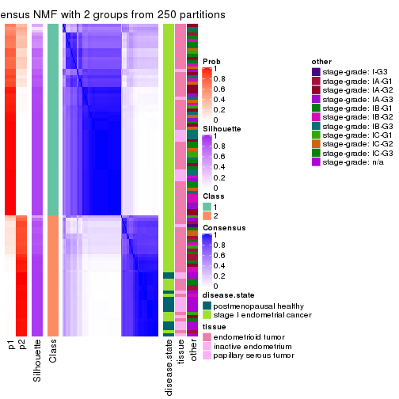</p>

</div>
<div id='tab-SD-NMF-consensus-heatmap-2'>
<pre><code class="r">consensus_heatmap(res, k = 3)
</code></pre>

<p>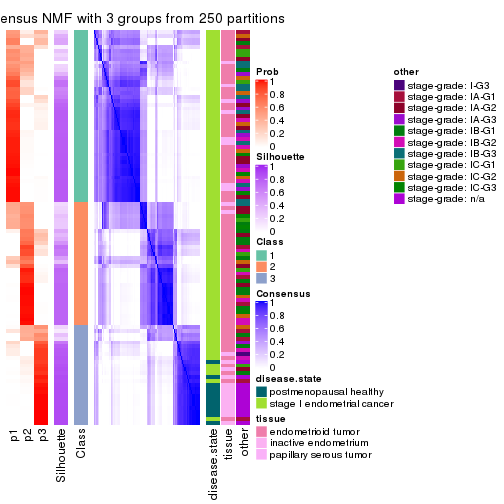</p>

</div>
<div id='tab-SD-NMF-consensus-heatmap-3'>
<pre><code class="r">consensus_heatmap(res, k = 4)
</code></pre>

<p>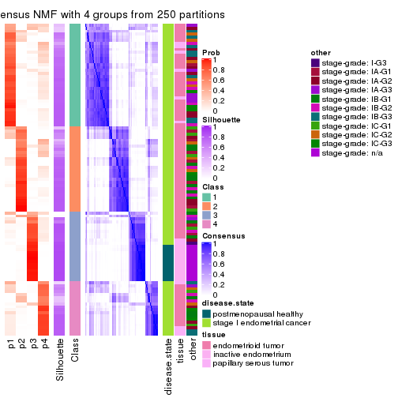</p>

</div>
<div id='tab-SD-NMF-consensus-heatmap-4'>
<pre><code class="r">consensus_heatmap(res, k = 5)
</code></pre>

<p>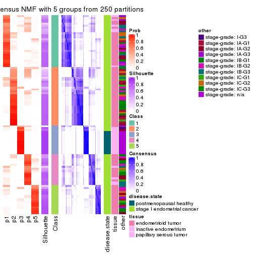</p>

</div>
<div id='tab-SD-NMF-consensus-heatmap-5'>
<pre><code class="r">consensus_heatmap(res, k = 6)
</code></pre>

<p>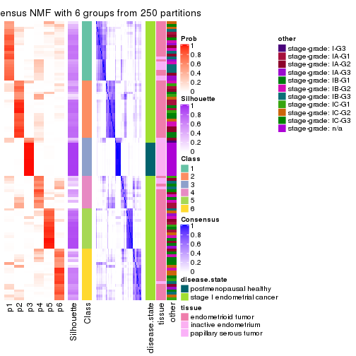</p>

</div>
</div>

Heatmaps for the membership of samples in all partitions to see how consistent they are:


<script>
$( function() {
	$( '#tabs-SD-NMF-membership-heatmap' ).tabs();
} );
</script>
<div id='tabs-SD-NMF-membership-heatmap'>
<ul>
<li><a href='#tab-SD-NMF-membership-heatmap-1'>k = 2</a></li>
<li><a href='#tab-SD-NMF-membership-heatmap-2'>k = 3</a></li>
<li><a href='#tab-SD-NMF-membership-heatmap-3'>k = 4</a></li>
<li><a href='#tab-SD-NMF-membership-heatmap-4'>k = 5</a></li>
<li><a href='#tab-SD-NMF-membership-heatmap-5'>k = 6</a></li>
</ul>
<div id='tab-SD-NMF-membership-heatmap-1'>
<pre><code class="r">membership_heatmap(res, k = 2)
</code></pre>

<p>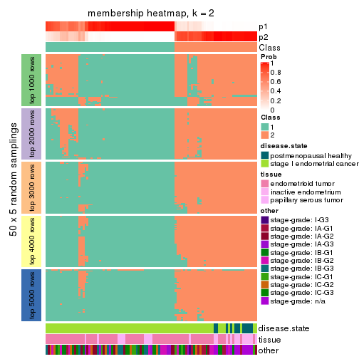</p>

</div>
<div id='tab-SD-NMF-membership-heatmap-2'>
<pre><code class="r">membership_heatmap(res, k = 3)
</code></pre>

<p>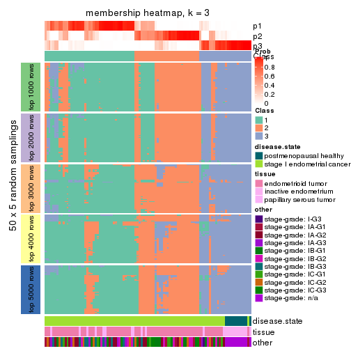</p>

</div>
<div id='tab-SD-NMF-membership-heatmap-3'>
<pre><code class="r">membership_heatmap(res, k = 4)
</code></pre>

<p>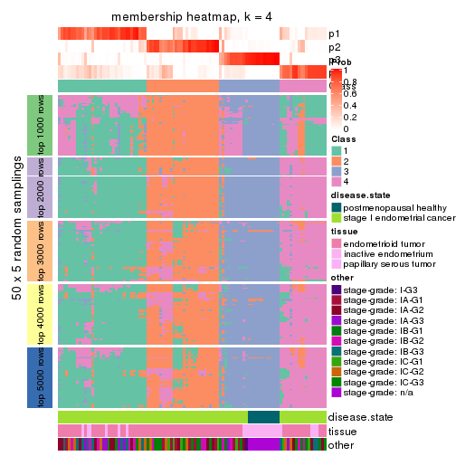</p>

</div>
<div id='tab-SD-NMF-membership-heatmap-4'>
<pre><code class="r">membership_heatmap(res, k = 5)
</code></pre>

<p>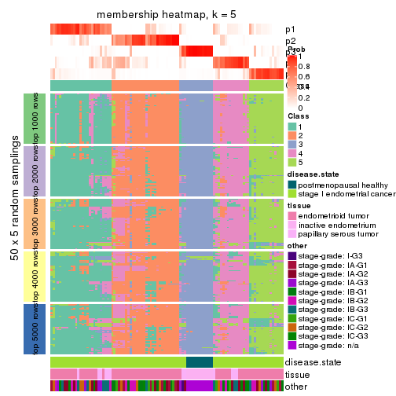</p>

</div>
<div id='tab-SD-NMF-membership-heatmap-5'>
<pre><code class="r">membership_heatmap(res, k = 6)
</code></pre>

<p>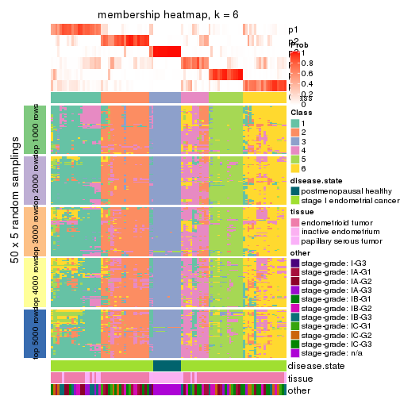</p>

</div>
</div>

As soon as we have had the classes for columns, we can look for signatures
which are significantly different between classes which can be candidate marks
for certain classes. Following are the heatmaps for signatures.


Signature heatmaps where rows are scaled:


<script>
$( function() {
	$( '#tabs-SD-NMF-get-signatures' ).tabs();
} );
</script>
<div id='tabs-SD-NMF-get-signatures'>
<ul>
<li><a href='#tab-SD-NMF-get-signatures-1'>k = 2</a></li>
<li><a href='#tab-SD-NMF-get-signatures-2'>k = 3</a></li>
<li><a href='#tab-SD-NMF-get-signatures-3'>k = 4</a></li>
<li><a href='#tab-SD-NMF-get-signatures-4'>k = 5</a></li>
<li><a href='#tab-SD-NMF-get-signatures-5'>k = 6</a></li>
</ul>
<div id='tab-SD-NMF-get-signatures-1'>
<pre><code class="r">get_signatures(res, k = 2)
</code></pre>

<p>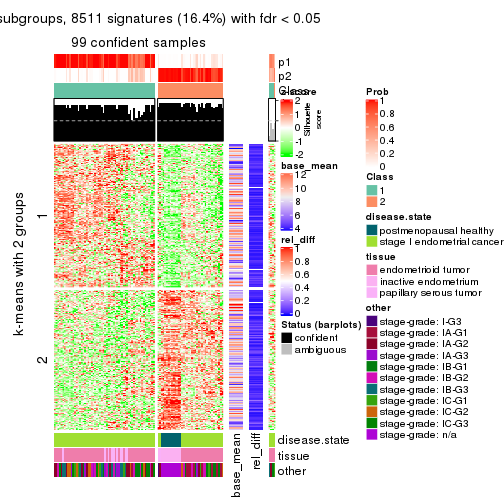</p>

</div>
<div id='tab-SD-NMF-get-signatures-2'>
<pre><code class="r">get_signatures(res, k = 3)
</code></pre>

<p>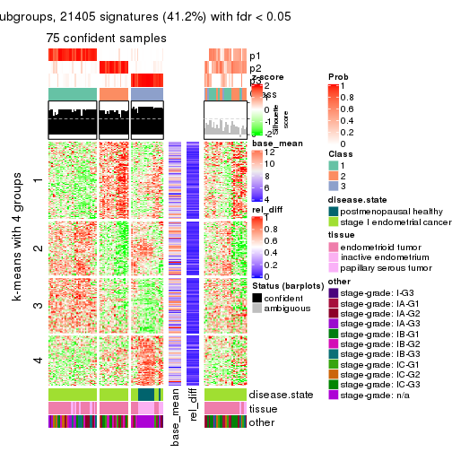</p>

</div>
<div id='tab-SD-NMF-get-signatures-3'>
<pre><code class="r">get_signatures(res, k = 4)
</code></pre>

<p>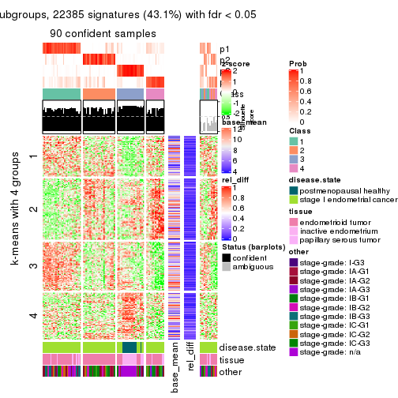</p>

</div>
<div id='tab-SD-NMF-get-signatures-4'>
<pre><code class="r">get_signatures(res, k = 5)
</code></pre>

<p>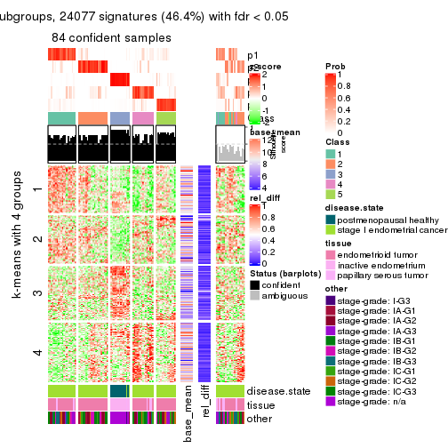</p>

</div>
<div id='tab-SD-NMF-get-signatures-5'>
<pre><code class="r">get_signatures(res, k = 6)
</code></pre>

<p>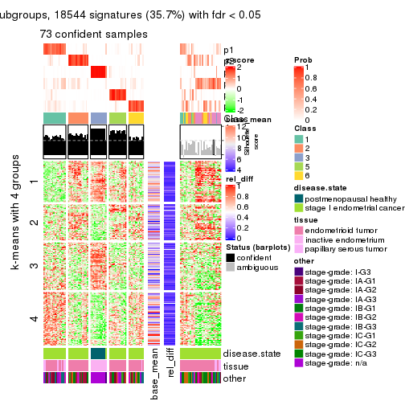</p>

</div>
</div>


Signature heatmaps where rows are not scaled:


<script>
$( function() {
	$( '#tabs-SD-NMF-get-signatures-no-scale' ).tabs();
} );
</script>
<div id='tabs-SD-NMF-get-signatures-no-scale'>
<ul>
<li><a href='#tab-SD-NMF-get-signatures-no-scale-1'>k = 2</a></li>
<li><a href='#tab-SD-NMF-get-signatures-no-scale-2'>k = 3</a></li>
<li><a href='#tab-SD-NMF-get-signatures-no-scale-3'>k = 4</a></li>
<li><a href='#tab-SD-NMF-get-signatures-no-scale-4'>k = 5</a></li>
<li><a href='#tab-SD-NMF-get-signatures-no-scale-5'>k = 6</a></li>
</ul>
<div id='tab-SD-NMF-get-signatures-no-scale-1'>
<pre><code class="r">get_signatures(res, k = 2, scale_rows = FALSE)
</code></pre>

<p>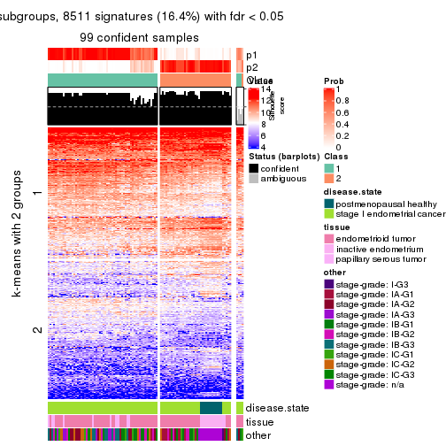</p>

</div>
<div id='tab-SD-NMF-get-signatures-no-scale-2'>
<pre><code class="r">get_signatures(res, k = 3, scale_rows = FALSE)
</code></pre>

<p>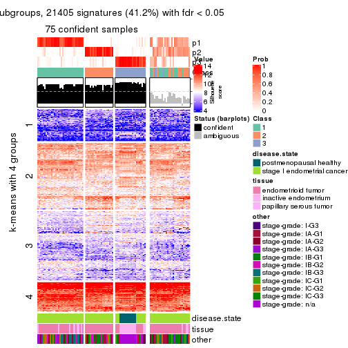</p>

</div>
<div id='tab-SD-NMF-get-signatures-no-scale-3'>
<pre><code class="r">get_signatures(res, k = 4, scale_rows = FALSE)
</code></pre>

<p>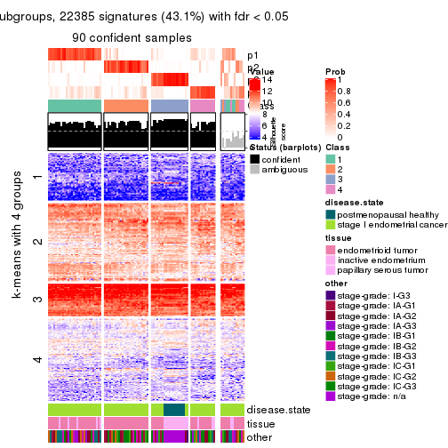</p>

</div>
<div id='tab-SD-NMF-get-signatures-no-scale-4'>
<pre><code class="r">get_signatures(res, k = 5, scale_rows = FALSE)
</code></pre>

<p>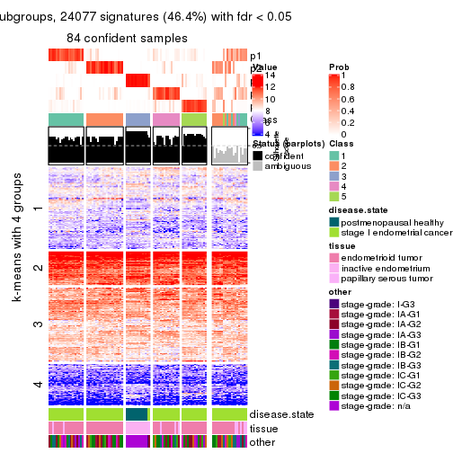</p>

</div>
<div id='tab-SD-NMF-get-signatures-no-scale-5'>
<pre><code class="r">get_signatures(res, k = 6, scale_rows = FALSE)
</code></pre>

<p>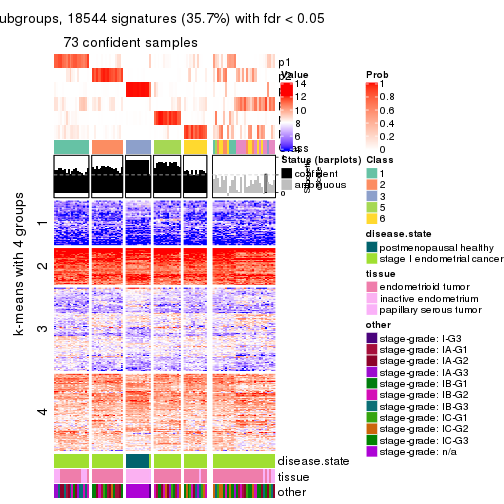</p>

</div>
</div>


Compare the overlap of signatures from different k:

```r
compare_signatures(res)
```

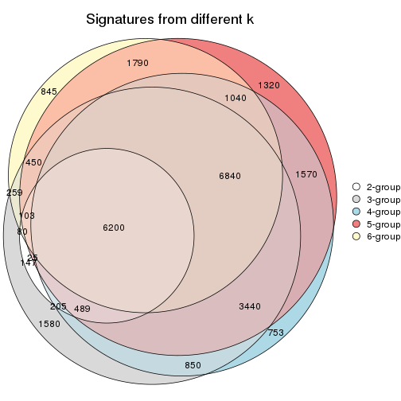

`get_signature()` returns a data frame invisibly. TO get the list of signatures, the function
call should be assigned to a variable explicitly. In following code, if `plot` argument is set
to `FALSE`, no heatmap is plotted while only the differential analysis is performed.

```r
# code only for demonstration
tb = get_signature(res, k = ..., plot = FALSE)
```

An example of the output of `tb` is:

```
#>   which_row         fdr    mean_1    mean_2 scaled_mean_1 scaled_mean_2 km
#> 1        38 0.042760348  8.373488  9.131774    -0.5533452     0.5164555  1
#> 2        40 0.018707592  7.106213  8.469186    -0.6173731     0.5762149  1
#> 3        55 0.019134737 10.221463 11.207825    -0.6159697     0.5749050  1
#> 4        59 0.006059896  5.921854  7.869574    -0.6899429     0.6439467  1
#> 5        60 0.018055526  8.928898 10.211722    -0.6204761     0.5791110  1
#> 6        98 0.009384629 15.714769 14.887706     0.6635654    -0.6193277  2
...
```

The columns in `tb` are:

1. `which_row`: row indices corresponding to the input matrix.
2. `fdr`: FDR for the differential test. 
3. `mean_x`: The mean value in group x.
4. `scaled_mean_x`: The mean value in group x after rows are scaled.
5. `km`: Row groups if k-means clustering is applied to rows.


UMAP plot which shows how samples are separated.


<script>
$( function() {
	$( '#tabs-SD-NMF-dimension-reduction' ).tabs();
} );
</script>
<div id='tabs-SD-NMF-dimension-reduction'>
<ul>
<li><a href='#tab-SD-NMF-dimension-reduction-1'>k = 2</a></li>
<li><a href='#tab-SD-NMF-dimension-reduction-2'>k = 3</a></li>
<li><a href='#tab-SD-NMF-dimension-reduction-3'>k = 4</a></li>
<li><a href='#tab-SD-NMF-dimension-reduction-4'>k = 5</a></li>
<li><a href='#tab-SD-NMF-dimension-reduction-5'>k = 6</a></li>
</ul>
<div id='tab-SD-NMF-dimension-reduction-1'>
<pre><code class="r">dimension_reduction(res, k = 2, method = &quot;UMAP&quot;)
</code></pre>

<p>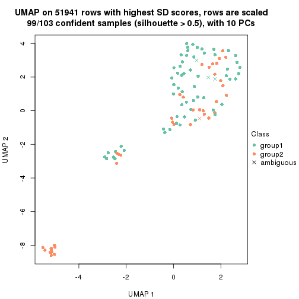</p>

</div>
<div id='tab-SD-NMF-dimension-reduction-2'>
<pre><code class="r">dimension_reduction(res, k = 3, method = &quot;UMAP&quot;)
</code></pre>

<p>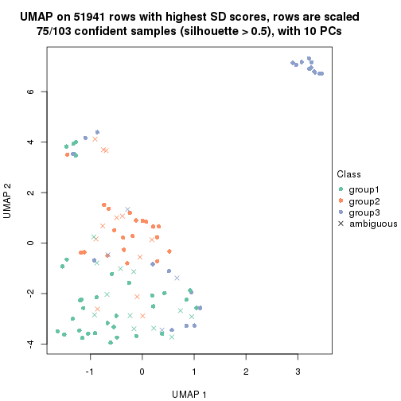</p>

</div>
<div id='tab-SD-NMF-dimension-reduction-3'>
<pre><code class="r">dimension_reduction(res, k = 4, method = &quot;UMAP&quot;)
</code></pre>

<p>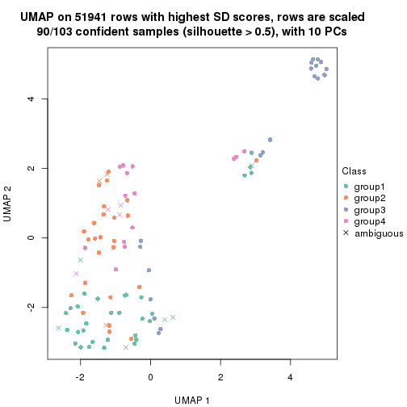</p>

</div>
<div id='tab-SD-NMF-dimension-reduction-4'>
<pre><code class="r">dimension_reduction(res, k = 5, method = &quot;UMAP&quot;)
</code></pre>

<p>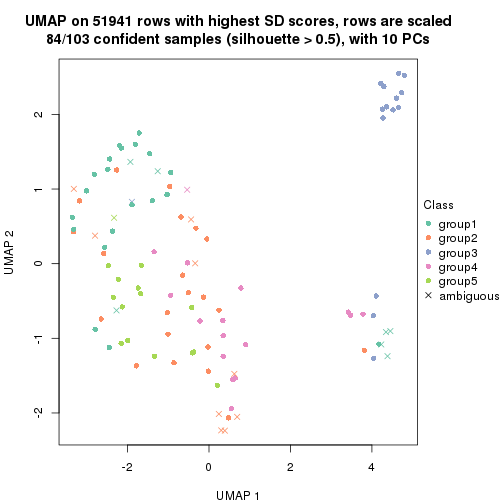</p>

</div>
<div id='tab-SD-NMF-dimension-reduction-5'>
<pre><code class="r">dimension_reduction(res, k = 6, method = &quot;UMAP&quot;)
</code></pre>

<p>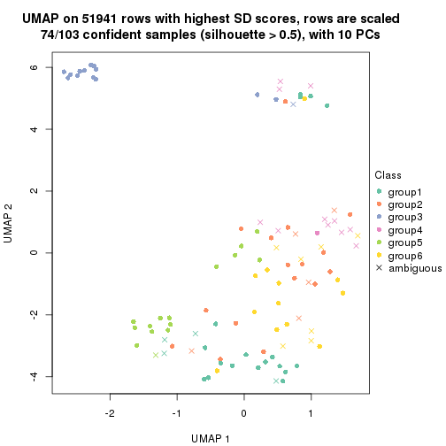</p>

</div>
</div>


Following heatmap shows how subgroups are split when increasing `k`:

```r
collect_classes(res)
```

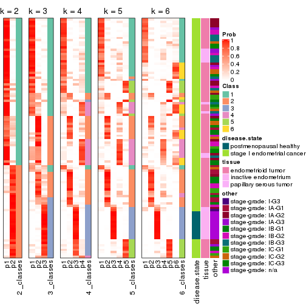


Test correlation between subgroups and known annotations. If the known
annotation is numeric, one-way ANOVA test is applied, and if the known
annotation is discrete, chi-squared contingency table test is applied.

```r
test_to_known_factors(res)
```

```
#>         n disease.state(p) tissue(p) other(p) k
#> SD:NMF 99         1.97e-05  1.50e-05 7.31e-07 2
#> SD:NMF 75         3.36e-08  4.19e-08 3.01e-07 3
#> SD:NMF 90         7.26e-10  2.23e-09 1.03e-07 4
#> SD:NMF 84         2.27e-14  5.88e-14 2.01e-08 5
#> SD:NMF 74         3.90e-13  2.49e-13 1.43e-09 6
```


If matrix rows can be associated to genes, consider to use `functional_enrichment(res,
...)` to perform function enrichment for the signature genes. See [this vignette](http://bioconductor.org/packages/devel/bioc/vignettes/cola/inst/doc/functional_enrichment.html) for more detailed explanations.


 

---------------------------------------------------


### CV:hclust


The object with results only for a single top-value method and a single partition method 
can be extracted as:

```r
res = res_list["CV", "hclust"]
# you can also extract it by
# res = res_list["CV:hclust"]
```

A summary of `res` and all the functions that can be applied to it:

```r
res
```

```
#> A 'ConsensusPartition' object with k = 2, 3, 4, 5, 6.
#>   On a matrix with 51941 rows and 103 columns.
#>   Top rows (1000, 2000, 3000, 4000, 5000) are extracted by 'CV' method.
#>   Subgroups are detected by 'hclust' method.
#>   Performed in total 1250 partitions by row resampling.
#>   Best k for subgroups seems to be 2.
#> 
#> Following methods can be applied to this 'ConsensusPartition' object:
#>  [1] "cola_report"             "collect_classes"         "collect_plots"          
#>  [4] "collect_stats"           "colnames"                "compare_signatures"     
#>  [7] "consensus_heatmap"       "dimension_reduction"     "functional_enrichment"  
#> [10] "get_anno_col"            "get_anno"                "get_classes"            
#> [13] "get_consensus"           "get_matrix"              "get_membership"         
#> [16] "get_param"               "get_signatures"          "get_stats"              
#> [19] "is_best_k"               "is_stable_k"             "membership_heatmap"     
#> [22] "ncol"                    "nrow"                    "plot_ecdf"              
#> [25] "rownames"                "select_partition_number" "show"                   
#> [28] "suggest_best_k"          "test_to_known_factors"
```

`collect_plots()` function collects all the plots made from `res` for all `k` (number of partitions)
into one single page to provide an easy and fast comparison between different `k`.

```r
collect_plots(res)
```

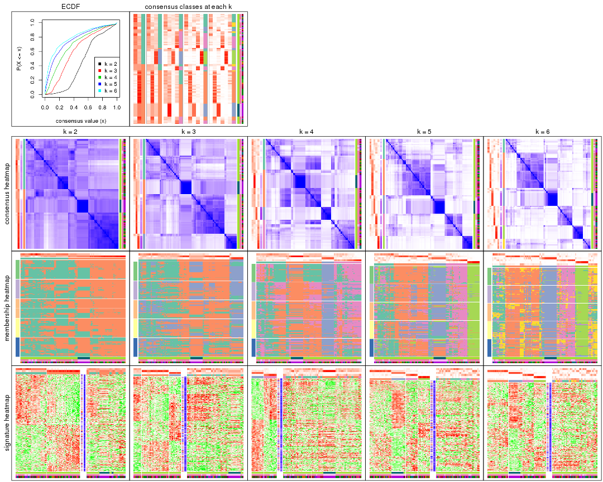

The plots are:

- The first row: a plot of the ECDF (empirical cumulative distribution
  function) curves of the consensus matrix for each `k` and the heatmap of
  predicted classes for each `k`.
- The second row: heatmaps of the consensus matrix for each `k`.
- The third row: heatmaps of the membership matrix for each `k`.
- The fouth row: heatmaps of the signatures for each `k`.

All the plots in panels can be made by individual functions and they are
plotted later in this section.

`select_partition_number()` produces several plots showing different
statistics for choosing "optimized" `k`. There are following statistics:

- ECDF curves of the consensus matrix for each `k`;
- 1-PAC. [The PAC
  score](https://en.wikipedia.org/wiki/Consensus_clustering#Over-interpretation_potential_of_consensus_clustering)
  measures the proportion of the ambiguous subgrouping.
- Mean silhouette score.
- Concordance. The mean probability of fiting the consensus class ids in all
  partitions.
- Area increased. Denote $A_k$ as the area under the ECDF curve for current
  `k`, the area increased is defined as $A_k - A_{k-1}$.
- Rand index. The percent of pairs of samples that are both in a same cluster
  or both are not in a same cluster in the partition of k and k-1.
- Jaccard index. The ratio of pairs of samples are both in a same cluster in
  the partition of k and k-1 and the pairs of samples are both in a same
  cluster in the partition k or k-1.

The detailed explanations of these statistics can be found in [the _cola_
vignette](http://bioconductor.org/packages/devel/bioc/vignettes/cola/inst/doc/cola.html#toc_13).

Generally speaking, lower PAC score, higher mean silhouette score or higher
concordance corresponds to better partition. Rand index and Jaccard index
measure how similar the current partition is compared to partition with `k-1`.
If they are too similar, we won't accept `k` is better than `k-1`.

```r
select_partition_number(res)
```

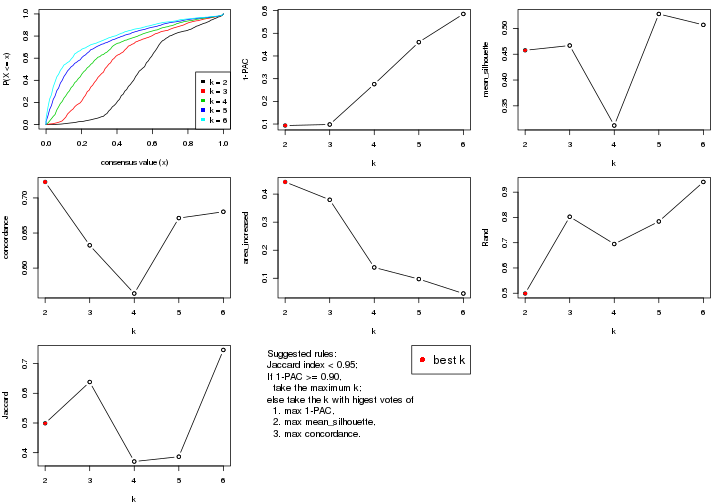

The numeric values for all these statistics can be obtained by `get_stats()`.

```r
get_stats(res)
```

```
#>   k  1-PAC mean_silhouette concordance area_increased  Rand Jaccard
#> 2 2 0.0934           0.458       0.723         0.4432 0.499   0.499
#> 3 3 0.0979           0.467       0.632         0.3797 0.803   0.638
#> 4 4 0.2758           0.312       0.564         0.1386 0.695   0.370
#> 5 5 0.4609           0.528       0.671         0.0971 0.784   0.386
#> 6 6 0.5853           0.507       0.680         0.0457 0.940   0.746
```

`suggest_best_k()` suggests the best $k$ based on these statistics. The rules are as follows:

- All $k$ with Jaccard index larger than 0.95 are removed because increasing
  $k$ does not provide enough extra information. If all $k$ are removed, it is
  marked as no subgroup is detected.
- For all $k$ with 1-PAC score larger than 0.9, the maximal $k$ is taken as
  the best $k$, and other $k$ are marked as optional $k$.
- If it does not fit the second rule. The $k$ with the maximal vote of the
  highest 1-PAC score, highest mean silhouette, and highest concordance is
  taken as the best $k$.

```r
suggest_best_k(res)
```

```
#> [1] 2
```


Following shows the table of the partitions (You need to click the **show/hide
code output** link to see it). The membership matrix (columns with name `p*`)
is inferred by
[`clue::cl_consensus()`](https://www.rdocumentation.org/link/cl_consensus?package=clue)
function with the `SE` method. Basically the value in the membership matrix
represents the probability to belong to a certain group. The finall class
label for an item is determined with the group with highest probability it
belongs to.

In `get_classes()` function, the entropy is calculated from the membership
matrix and the silhouette score is calculated from the consensus matrix.


<script>
$( function() {
	$( '#tabs-CV-hclust-get-classes' ).tabs();
} );
</script>
<div id='tabs-CV-hclust-get-classes'>
<ul>
<li><a href='#tab-CV-hclust-get-classes-1'>k = 2</a></li>
<li><a href='#tab-CV-hclust-get-classes-2'>k = 3</a></li>
<li><a href='#tab-CV-hclust-get-classes-3'>k = 4</a></li>
<li><a href='#tab-CV-hclust-get-classes-4'>k = 5</a></li>
<li><a href='#tab-CV-hclust-get-classes-5'>k = 6</a></li>
</ul>

<div id='tab-CV-hclust-get-classes-1'>
<p><a id='tab-CV-hclust-get-classes-1-a' style='color:#0366d6' href='#'>show/hide code output</a></p>
<pre><code class="r">cbind(get_classes(res, k = 2), get_membership(res, k = 2))
</code></pre>

<pre><code>#&gt;           class entropy silhouette    p1    p2
#&gt; GSM425907     2  0.1843     0.6663 0.028 0.972
#&gt; GSM425908     2  0.2778     0.6600 0.048 0.952
#&gt; GSM425909     1  0.9248     0.5591 0.660 0.340
#&gt; GSM425910     2  1.0000    -0.1943 0.496 0.504
#&gt; GSM425911     2  0.5629     0.6440 0.132 0.868
#&gt; GSM425912     2  0.6623     0.5885 0.172 0.828
#&gt; GSM425913     2  0.3114     0.6663 0.056 0.944
#&gt; GSM425914     2  0.9754     0.1821 0.408 0.592
#&gt; GSM425915     1  0.9323     0.5435 0.652 0.348
#&gt; GSM425874     2  0.9998    -0.3147 0.492 0.508
#&gt; GSM425875     1  0.9044     0.5753 0.680 0.320
#&gt; GSM425876     1  0.9815     0.3275 0.580 0.420
#&gt; GSM425877     1  0.7139     0.6050 0.804 0.196
#&gt; GSM425878     1  0.9522     0.5142 0.628 0.372
#&gt; GSM425879     2  0.2043     0.6662 0.032 0.968
#&gt; GSM425880     1  0.9044     0.5753 0.680 0.320
#&gt; GSM425881     2  0.6343     0.5987 0.160 0.840
#&gt; GSM425882     2  0.2236     0.6677 0.036 0.964
#&gt; GSM425883     1  0.9983     0.3688 0.524 0.476
#&gt; GSM425884     1  0.6531     0.5923 0.832 0.168
#&gt; GSM425885     2  0.9286     0.0933 0.344 0.656
#&gt; GSM425848     1  0.9686     0.5030 0.604 0.396
#&gt; GSM425849     1  0.9983     0.3879 0.524 0.476
#&gt; GSM425850     2  0.9998    -0.2192 0.492 0.508
#&gt; GSM425851     1  0.4690     0.5727 0.900 0.100
#&gt; GSM425852     1  0.9044     0.5735 0.680 0.320
#&gt; GSM425893     2  0.5519     0.6400 0.128 0.872
#&gt; GSM425894     2  0.0672     0.6608 0.008 0.992
#&gt; GSM425895     2  0.3584     0.6655 0.068 0.932
#&gt; GSM425896     2  0.4161     0.6582 0.084 0.916
#&gt; GSM425897     2  0.3879     0.6658 0.076 0.924
#&gt; GSM425898     2  0.0938     0.6618 0.012 0.988
#&gt; GSM425899     2  0.8081     0.3597 0.248 0.752
#&gt; GSM425900     2  0.3114     0.6663 0.056 0.944
#&gt; GSM425901     1  0.9209     0.5627 0.664 0.336
#&gt; GSM425902     2  0.9998    -0.3289 0.492 0.508
#&gt; GSM425903     1  0.9323     0.5435 0.652 0.348
#&gt; GSM425904     1  0.9044     0.5753 0.680 0.320
#&gt; GSM425905     2  0.1414     0.6641 0.020 0.980
#&gt; GSM425906     2  0.3879     0.6629 0.076 0.924
#&gt; GSM425863     1  0.9795     0.4730 0.584 0.416
#&gt; GSM425864     2  0.3733     0.6665 0.072 0.928
#&gt; GSM425865     2  0.4022     0.6601 0.080 0.920
#&gt; GSM425866     1  0.9044     0.5753 0.680 0.320
#&gt; GSM425867     1  0.8661     0.5300 0.712 0.288
#&gt; GSM425868     2  0.3584     0.6526 0.068 0.932
#&gt; GSM425869     2  0.0672     0.6623 0.008 0.992
#&gt; GSM425870     2  0.6148     0.6222 0.152 0.848
#&gt; GSM425871     1  0.9983     0.3215 0.524 0.476
#&gt; GSM425872     2  0.2603     0.6677 0.044 0.956
#&gt; GSM425873     1  0.9850     0.3210 0.572 0.428
#&gt; GSM425843     1  0.7528     0.6059 0.784 0.216
#&gt; GSM425844     1  0.9944     0.3598 0.544 0.456
#&gt; GSM425845     1  0.8555     0.5388 0.720 0.280
#&gt; GSM425846     2  0.5737     0.6010 0.136 0.864
#&gt; GSM425847     2  0.8608     0.4175 0.284 0.716
#&gt; GSM425886     1  0.9427     0.5363 0.640 0.360
#&gt; GSM425887     2  0.3733     0.6650 0.072 0.928
#&gt; GSM425888     2  0.6531     0.5931 0.168 0.832
#&gt; GSM425889     1  0.9710     0.4891 0.600 0.400
#&gt; GSM425890     1  0.8144     0.5946 0.748 0.252
#&gt; GSM425891     2  0.3584     0.6677 0.068 0.932
#&gt; GSM425892     2  0.6343     0.5524 0.160 0.840
#&gt; GSM425853     1  0.9087     0.5361 0.676 0.324
#&gt; GSM425854     2  0.1633     0.6673 0.024 0.976
#&gt; GSM425855     1  0.9393     0.5454 0.644 0.356
#&gt; GSM425856     1  0.9044     0.5753 0.680 0.320
#&gt; GSM425857     1  0.9491     0.5337 0.632 0.368
#&gt; GSM425858     2  0.3431     0.6661 0.064 0.936
#&gt; GSM425859     2  0.0672     0.6608 0.008 0.992
#&gt; GSM425860     1  0.9522     0.3861 0.628 0.372
#&gt; GSM425861     2  0.6531     0.5931 0.168 0.832
#&gt; GSM425862     1  0.9732     0.4853 0.596 0.404
#&gt; GSM425837     1  0.3274     0.5650 0.940 0.060
#&gt; GSM425838     2  0.9866    -0.1828 0.432 0.568
#&gt; GSM425839     2  0.0672     0.6608 0.008 0.992
#&gt; GSM425840     1  0.9393     0.5420 0.644 0.356
#&gt; GSM425841     2  0.9993    -0.3141 0.484 0.516
#&gt; GSM425842     1  0.9850     0.3359 0.572 0.428
#&gt; GSM425917     1  1.0000     0.0255 0.504 0.496
#&gt; GSM425922     1  0.9998     0.3157 0.508 0.492
#&gt; GSM425919     1  0.4690     0.5727 0.900 0.100
#&gt; GSM425920     1  0.8861     0.5598 0.696 0.304
#&gt; GSM425923     1  0.5059     0.5843 0.888 0.112
#&gt; GSM425916     1  0.1184     0.5469 0.984 0.016
#&gt; GSM425918     1  0.7815     0.6047 0.768 0.232
#&gt; GSM425921     1  1.0000     0.3013 0.500 0.500
#&gt; GSM425925     1  1.0000     0.3057 0.500 0.500
#&gt; GSM425926     2  0.9993    -0.2951 0.484 0.516
#&gt; GSM425927     1  0.8207     0.5308 0.744 0.256
#&gt; GSM425924     1  1.0000     0.0141 0.500 0.500
#&gt; GSM425928     2  0.9491     0.3240 0.368 0.632
#&gt; GSM425929     2  0.9460     0.3350 0.364 0.636
#&gt; GSM425930     2  0.9460     0.3350 0.364 0.636
#&gt; GSM425931     2  0.9460     0.3350 0.364 0.636
#&gt; GSM425932     2  0.9460     0.3350 0.364 0.636
#&gt; GSM425933     2  0.9460     0.3350 0.364 0.636
#&gt; GSM425934     2  0.9460     0.3350 0.364 0.636
#&gt; GSM425935     2  0.9460     0.3350 0.364 0.636
#&gt; GSM425936     2  0.9460     0.3350 0.364 0.636
#&gt; GSM425937     2  0.9460     0.3350 0.364 0.636
#&gt; GSM425938     2  0.9552     0.3019 0.376 0.624
#&gt; GSM425939     2  0.9460     0.3350 0.364 0.636
</code></pre>

<script>
$('#tab-CV-hclust-get-classes-1-a').parent().next().next().hide();
$('#tab-CV-hclust-get-classes-1-a').click(function(){
  $('#tab-CV-hclust-get-classes-1-a').parent().next().next().toggle();
  return(false);
});
</script>
</div>

<div id='tab-CV-hclust-get-classes-2'>
<p><a id='tab-CV-hclust-get-classes-2-a' style='color:#0366d6' href='#'>show/hide code output</a></p>
<pre><code class="r">cbind(get_classes(res, k = 3), get_membership(res, k = 3))
</code></pre>

<pre><code>#&gt;           class entropy silhouette    p1    p2    p3
#&gt; GSM425907     2   0.410    0.59352 0.060 0.880 0.060
#&gt; GSM425908     2   0.421    0.56141 0.088 0.872 0.040
#&gt; GSM425909     3   0.318    0.85433 0.016 0.076 0.908
#&gt; GSM425910     1   0.965    0.18854 0.408 0.384 0.208
#&gt; GSM425911     2   0.645    0.57001 0.052 0.736 0.212
#&gt; GSM425912     2   0.715    0.43991 0.176 0.716 0.108
#&gt; GSM425913     2   0.293    0.59811 0.036 0.924 0.040
#&gt; GSM425914     2   0.953    0.17236 0.300 0.480 0.220
#&gt; GSM425915     3   0.367    0.84127 0.020 0.092 0.888
#&gt; GSM425874     1   0.977    0.47015 0.400 0.368 0.232
#&gt; GSM425875     3   0.343    0.85421 0.032 0.064 0.904
#&gt; GSM425876     1   0.906    0.34467 0.524 0.316 0.160
#&gt; GSM425877     1   0.748    0.46445 0.688 0.108 0.204
#&gt; GSM425878     1   0.946    0.47889 0.500 0.256 0.244
#&gt; GSM425879     2   0.429    0.59798 0.068 0.872 0.060
#&gt; GSM425880     3   0.343    0.85421 0.032 0.064 0.904
#&gt; GSM425881     2   0.632    0.46418 0.160 0.764 0.076
#&gt; GSM425882     2   0.315    0.60262 0.048 0.916 0.036
#&gt; GSM425883     1   0.976    0.51203 0.420 0.344 0.236
#&gt; GSM425884     1   0.721    0.31891 0.668 0.060 0.272
#&gt; GSM425885     2   0.909   -0.19561 0.312 0.524 0.164
#&gt; GSM425848     1   0.956    0.52648 0.484 0.260 0.256
#&gt; GSM425849     1   0.982    0.51621 0.420 0.324 0.256
#&gt; GSM425850     1   0.944    0.37785 0.440 0.380 0.180
#&gt; GSM425851     1   0.671    0.31083 0.716 0.056 0.228
#&gt; GSM425852     3   0.535    0.78868 0.088 0.088 0.824
#&gt; GSM425893     2   0.649    0.56300 0.052 0.732 0.216
#&gt; GSM425894     2   0.260    0.60668 0.016 0.932 0.052
#&gt; GSM425895     2   0.313    0.59559 0.032 0.916 0.052
#&gt; GSM425896     2   0.597    0.58520 0.060 0.780 0.160
#&gt; GSM425897     2   0.563    0.59597 0.044 0.792 0.164
#&gt; GSM425898     2   0.234    0.60665 0.012 0.940 0.048
#&gt; GSM425899     2   0.830    0.06256 0.196 0.632 0.172
#&gt; GSM425900     2   0.293    0.59802 0.036 0.924 0.040
#&gt; GSM425901     3   0.309    0.85394 0.016 0.072 0.912
#&gt; GSM425902     1   0.985    0.48389 0.396 0.352 0.252
#&gt; GSM425903     3   0.367    0.84127 0.020 0.092 0.888
#&gt; GSM425904     3   0.343    0.85421 0.032 0.064 0.904
#&gt; GSM425905     2   0.359    0.58623 0.052 0.900 0.048
#&gt; GSM425906     2   0.419    0.58478 0.056 0.876 0.068
#&gt; GSM425863     1   0.968    0.51892 0.460 0.280 0.260
#&gt; GSM425864     2   0.553    0.59609 0.036 0.792 0.172
#&gt; GSM425865     2   0.523    0.59268 0.068 0.828 0.104
#&gt; GSM425866     3   0.343    0.85421 0.032 0.064 0.904
#&gt; GSM425867     3   0.893    0.26594 0.384 0.128 0.488
#&gt; GSM425868     2   0.445    0.53945 0.100 0.860 0.040
#&gt; GSM425869     2   0.277    0.60323 0.024 0.928 0.048
#&gt; GSM425870     2   0.698    0.55330 0.076 0.712 0.212
#&gt; GSM425871     1   0.945    0.47244 0.452 0.364 0.184
#&gt; GSM425872     2   0.350    0.61605 0.020 0.896 0.084
#&gt; GSM425873     1   0.903    0.33278 0.520 0.328 0.152
#&gt; GSM425843     1   0.752    0.46183 0.688 0.116 0.196
#&gt; GSM425844     1   0.950    0.47865 0.452 0.356 0.192
#&gt; GSM425845     3   0.908    0.25147 0.368 0.144 0.488
#&gt; GSM425846     2   0.611    0.44890 0.116 0.784 0.100
#&gt; GSM425847     2   0.829    0.22981 0.280 0.604 0.116
#&gt; GSM425886     3   0.338    0.84441 0.012 0.092 0.896
#&gt; GSM425887     2   0.325    0.59628 0.036 0.912 0.052
#&gt; GSM425888     2   0.652    0.45323 0.168 0.752 0.080
#&gt; GSM425889     1   0.963    0.51277 0.472 0.264 0.264
#&gt; GSM425890     1   0.861    0.48081 0.600 0.172 0.228
#&gt; GSM425891     2   0.398    0.59864 0.048 0.884 0.068
#&gt; GSM425892     2   0.686    0.39986 0.132 0.740 0.128
#&gt; GSM425853     1   0.939    0.22423 0.496 0.200 0.304
#&gt; GSM425854     2   0.245    0.61200 0.012 0.936 0.052
#&gt; GSM425855     1   0.921    0.52090 0.536 0.240 0.224
#&gt; GSM425856     3   0.343    0.85421 0.032 0.064 0.904
#&gt; GSM425857     3   0.422    0.79600 0.032 0.100 0.868
#&gt; GSM425858     2   0.301    0.59902 0.028 0.920 0.052
#&gt; GSM425859     2   0.234    0.60831 0.012 0.940 0.048
#&gt; GSM425860     1   0.969    0.00652 0.452 0.240 0.308
#&gt; GSM425861     2   0.652    0.45323 0.168 0.752 0.080
#&gt; GSM425862     1   0.965    0.51387 0.468 0.268 0.264
#&gt; GSM425837     1   0.605    0.29574 0.696 0.012 0.292
#&gt; GSM425838     2   0.967   -0.39701 0.344 0.436 0.220
#&gt; GSM425839     2   0.234    0.60831 0.012 0.940 0.048
#&gt; GSM425840     1   0.918    0.52245 0.540 0.240 0.220
#&gt; GSM425841     1   0.983    0.47605 0.388 0.368 0.244
#&gt; GSM425842     1   0.906    0.35599 0.520 0.324 0.156
#&gt; GSM425917     1   0.991   -0.14135 0.368 0.364 0.268
#&gt; GSM425922     1   0.953    0.47936 0.448 0.356 0.196
#&gt; GSM425919     1   0.671    0.31083 0.716 0.056 0.228
#&gt; GSM425920     1   0.869    0.47157 0.596 0.204 0.200
#&gt; GSM425923     1   0.714    0.39927 0.688 0.068 0.244
#&gt; GSM425916     1   0.528    0.32345 0.752 0.004 0.244
#&gt; GSM425918     1   0.844    0.45976 0.612 0.152 0.236
#&gt; GSM425921     1   0.968    0.47064 0.416 0.368 0.216
#&gt; GSM425925     1   0.971    0.47901 0.420 0.356 0.224
#&gt; GSM425926     1   0.962    0.45657 0.416 0.380 0.204
#&gt; GSM425927     1   0.751    0.37212 0.696 0.160 0.144
#&gt; GSM425924     2   0.994    0.12057 0.356 0.364 0.280
#&gt; GSM425928     2   0.964    0.29514 0.224 0.452 0.324
#&gt; GSM425929     2   0.963    0.30361 0.224 0.456 0.320
#&gt; GSM425930     2   0.963    0.30361 0.224 0.456 0.320
#&gt; GSM425931     2   0.963    0.30361 0.224 0.456 0.320
#&gt; GSM425932     2   0.963    0.30361 0.224 0.456 0.320
#&gt; GSM425933     2   0.963    0.30361 0.224 0.456 0.320
#&gt; GSM425934     2   0.963    0.30361 0.224 0.456 0.320
#&gt; GSM425935     2   0.963    0.30361 0.224 0.456 0.320
#&gt; GSM425936     2   0.963    0.30361 0.224 0.456 0.320
#&gt; GSM425937     2   0.963    0.30361 0.224 0.456 0.320
#&gt; GSM425938     2   0.961    0.27486 0.212 0.448 0.340
#&gt; GSM425939     2   0.963    0.30361 0.224 0.456 0.320
</code></pre>

<script>
$('#tab-CV-hclust-get-classes-2-a').parent().next().next().hide();
$('#tab-CV-hclust-get-classes-2-a').click(function(){
  $('#tab-CV-hclust-get-classes-2-a').parent().next().next().toggle();
  return(false);
});
</script>
</div>

<div id='tab-CV-hclust-get-classes-3'>
<p><a id='tab-CV-hclust-get-classes-3-a' style='color:#0366d6' href='#'>show/hide code output</a></p>
<pre><code class="r">cbind(get_classes(res, k = 4), get_membership(res, k = 4))
</code></pre>

<pre><code>#&gt;           class entropy silhouette    p1    p2    p3    p4
#&gt; GSM425907     2  0.8362     0.2497 0.316 0.368 0.016 0.300
#&gt; GSM425908     4  0.8380    -0.2978 0.312 0.320 0.016 0.352
#&gt; GSM425909     3  0.4500     0.9520 0.012 0.168 0.796 0.024
#&gt; GSM425910     1  0.8153     0.2522 0.516 0.308 0.076 0.100
#&gt; GSM425911     2  0.7153     0.3446 0.264 0.604 0.028 0.104
#&gt; GSM425912     1  0.8339     0.1149 0.508 0.272 0.056 0.164
#&gt; GSM425913     1  0.8335    -0.1580 0.392 0.368 0.024 0.216
#&gt; GSM425914     1  0.7680     0.0264 0.472 0.404 0.056 0.068
#&gt; GSM425915     3  0.4923     0.9304 0.016 0.208 0.756 0.020
#&gt; GSM425874     4  0.2174     0.5756 0.000 0.020 0.052 0.928
#&gt; GSM425875     3  0.4508     0.9536 0.012 0.152 0.804 0.032
#&gt; GSM425876     1  0.7300     0.2780 0.644 0.188 0.096 0.072
#&gt; GSM425877     1  0.8938    -0.1490 0.392 0.112 0.124 0.372
#&gt; GSM425878     1  0.8972    -0.0788 0.408 0.104 0.140 0.348
#&gt; GSM425879     2  0.8333     0.2616 0.316 0.384 0.016 0.284
#&gt; GSM425880     3  0.4508     0.9536 0.012 0.152 0.804 0.032
#&gt; GSM425881     1  0.8217     0.1007 0.516 0.256 0.044 0.184
#&gt; GSM425882     2  0.8576     0.2328 0.340 0.360 0.028 0.272
#&gt; GSM425883     4  0.6892     0.5288 0.116 0.124 0.072 0.688
#&gt; GSM425884     1  0.9214     0.0684 0.452 0.128 0.216 0.204
#&gt; GSM425885     4  0.6489     0.4113 0.108 0.156 0.036 0.700
#&gt; GSM425848     4  0.7609     0.4731 0.180 0.080 0.116 0.624
#&gt; GSM425849     4  0.6856     0.5039 0.168 0.048 0.108 0.676
#&gt; GSM425850     1  0.8933     0.0425 0.448 0.168 0.092 0.292
#&gt; GSM425851     1  0.9428     0.0738 0.400 0.284 0.156 0.160
#&gt; GSM425852     3  0.5770     0.8643 0.040 0.228 0.708 0.024
#&gt; GSM425893     2  0.6595     0.3849 0.232 0.652 0.016 0.100
#&gt; GSM425894     2  0.8151     0.2422 0.324 0.380 0.008 0.288
#&gt; GSM425895     1  0.8412    -0.1519 0.392 0.344 0.024 0.240
#&gt; GSM425896     2  0.7575     0.3644 0.236 0.556 0.016 0.192
#&gt; GSM425897     2  0.7312     0.3656 0.256 0.580 0.016 0.148
#&gt; GSM425898     2  0.8151     0.2345 0.332 0.376 0.008 0.284
#&gt; GSM425899     4  0.7934     0.2559 0.244 0.136 0.056 0.564
#&gt; GSM425900     1  0.8350    -0.1539 0.392 0.364 0.024 0.220
#&gt; GSM425901     3  0.4455     0.9519 0.012 0.164 0.800 0.024
#&gt; GSM425902     4  0.3687     0.5761 0.012 0.048 0.072 0.868
#&gt; GSM425903     3  0.4923     0.9304 0.016 0.208 0.756 0.020
#&gt; GSM425904     3  0.4508     0.9536 0.012 0.152 0.804 0.032
#&gt; GSM425905     2  0.8384     0.2291 0.328 0.344 0.016 0.312
#&gt; GSM425906     1  0.8349    -0.1168 0.412 0.356 0.028 0.204
#&gt; GSM425863     4  0.6582     0.5399 0.108 0.060 0.124 0.708
#&gt; GSM425864     2  0.7640     0.3519 0.264 0.560 0.028 0.148
#&gt; GSM425865     2  0.8534     0.2321 0.304 0.396 0.028 0.272
#&gt; GSM425866     3  0.4508     0.9536 0.012 0.152 0.804 0.032
#&gt; GSM425867     2  0.8157    -0.1895 0.284 0.424 0.280 0.012
#&gt; GSM425868     4  0.8421    -0.2573 0.284 0.316 0.020 0.380
#&gt; GSM425869     2  0.8266     0.2397 0.320 0.372 0.012 0.296
#&gt; GSM425870     2  0.6382     0.3637 0.260 0.652 0.016 0.072
#&gt; GSM425871     4  0.8055     0.2856 0.368 0.064 0.092 0.476
#&gt; GSM425872     2  0.8320     0.2092 0.336 0.432 0.028 0.204
#&gt; GSM425873     1  0.7288     0.2777 0.644 0.192 0.084 0.080
#&gt; GSM425843     1  0.8991    -0.1092 0.408 0.124 0.120 0.348
#&gt; GSM425844     4  0.8324     0.2865 0.348 0.080 0.100 0.472
#&gt; GSM425845     2  0.8440    -0.2197 0.304 0.372 0.304 0.020
#&gt; GSM425846     4  0.8621    -0.1032 0.344 0.236 0.036 0.384
#&gt; GSM425847     1  0.8253     0.2187 0.544 0.236 0.072 0.148
#&gt; GSM425886     3  0.4692     0.9388 0.012 0.196 0.772 0.020
#&gt; GSM425887     1  0.8398    -0.1512 0.396 0.344 0.024 0.236
#&gt; GSM425888     1  0.8334     0.1168 0.512 0.252 0.052 0.184
#&gt; GSM425889     4  0.6380     0.5390 0.104 0.052 0.124 0.720
#&gt; GSM425890     4  0.8428     0.3184 0.228 0.128 0.104 0.540
#&gt; GSM425891     1  0.8472    -0.1523 0.380 0.376 0.032 0.212
#&gt; GSM425892     4  0.8149    -0.0217 0.276 0.236 0.020 0.468
#&gt; GSM425853     1  0.9459     0.1578 0.400 0.276 0.168 0.156
#&gt; GSM425854     2  0.8483     0.2159 0.352 0.384 0.028 0.236
#&gt; GSM425855     4  0.8656     0.2994 0.304 0.120 0.100 0.476
#&gt; GSM425856     3  0.4508     0.9536 0.012 0.152 0.804 0.032
#&gt; GSM425857     3  0.5585     0.8975 0.012 0.192 0.732 0.064
#&gt; GSM425858     1  0.8420    -0.1608 0.400 0.352 0.028 0.220
#&gt; GSM425859     2  0.8134     0.2497 0.324 0.388 0.008 0.280
#&gt; GSM425860     2  0.7639    -0.1087 0.344 0.516 0.108 0.032
#&gt; GSM425861     1  0.8334     0.1168 0.512 0.252 0.052 0.184
#&gt; GSM425862     4  0.6455     0.5401 0.104 0.056 0.124 0.716
#&gt; GSM425837     1  0.9082    -0.0175 0.436 0.088 0.236 0.240
#&gt; GSM425838     4  0.4318     0.5259 0.088 0.016 0.060 0.836
#&gt; GSM425839     2  0.8134     0.2497 0.324 0.388 0.008 0.280
#&gt; GSM425840     4  0.8708     0.2904 0.308 0.124 0.100 0.468
#&gt; GSM425841     4  0.3037     0.5765 0.000 0.036 0.076 0.888
#&gt; GSM425842     1  0.7755     0.2670 0.612 0.188 0.104 0.096
#&gt; GSM425917     2  0.5981     0.2549 0.088 0.752 0.096 0.064
#&gt; GSM425922     4  0.2099     0.5644 0.012 0.008 0.044 0.936
#&gt; GSM425919     1  0.9428     0.0738 0.400 0.284 0.156 0.160
#&gt; GSM425920     1  0.9676    -0.0861 0.324 0.232 0.140 0.304
#&gt; GSM425923     4  0.9003     0.1641 0.328 0.104 0.148 0.420
#&gt; GSM425916     1  0.9426    -0.0736 0.392 0.148 0.164 0.296
#&gt; GSM425918     4  0.8774     0.2697 0.252 0.136 0.116 0.496
#&gt; GSM425921     4  0.1732     0.5727 0.004 0.008 0.040 0.948
#&gt; GSM425925     4  0.1975     0.5760 0.016 0.000 0.048 0.936
#&gt; GSM425926     4  0.1109     0.5701 0.004 0.000 0.028 0.968
#&gt; GSM425927     1  0.8199     0.1772 0.544 0.260 0.100 0.096
#&gt; GSM425924     2  0.5798     0.2667 0.092 0.764 0.076 0.068
#&gt; GSM425928     2  0.0779     0.4552 0.000 0.980 0.016 0.004
#&gt; GSM425929     2  0.0524     0.4596 0.000 0.988 0.008 0.004
#&gt; GSM425930     2  0.0524     0.4596 0.000 0.988 0.008 0.004
#&gt; GSM425931     2  0.0524     0.4596 0.000 0.988 0.008 0.004
#&gt; GSM425932     2  0.0524     0.4596 0.000 0.988 0.008 0.004
#&gt; GSM425933     2  0.0524     0.4596 0.000 0.988 0.008 0.004
#&gt; GSM425934     2  0.0524     0.4596 0.000 0.988 0.008 0.004
#&gt; GSM425935     2  0.0524     0.4596 0.000 0.988 0.008 0.004
#&gt; GSM425936     2  0.0524     0.4596 0.000 0.988 0.008 0.004
#&gt; GSM425937     2  0.0524     0.4596 0.000 0.988 0.008 0.004
#&gt; GSM425938     2  0.1022     0.4470 0.000 0.968 0.032 0.000
#&gt; GSM425939     2  0.0524     0.4596 0.000 0.988 0.008 0.004
</code></pre>

<script>
$('#tab-CV-hclust-get-classes-3-a').parent().next().next().hide();
$('#tab-CV-hclust-get-classes-3-a').click(function(){
  $('#tab-CV-hclust-get-classes-3-a').parent().next().next().toggle();
  return(false);
});
</script>
</div>

<div id='tab-CV-hclust-get-classes-4'>
<p><a id='tab-CV-hclust-get-classes-4-a' style='color:#0366d6' href='#'>show/hide code output</a></p>
<pre><code class="r">cbind(get_classes(res, k = 5), get_membership(res, k = 5))
</code></pre>

<pre><code>#&gt;           class entropy silhouette    p1    p2    p3    p4    p5
#&gt; GSM425907     2  0.4491    0.67970 0.008 0.780 0.088 0.120 0.004
#&gt; GSM425908     2  0.5021    0.65547 0.032 0.748 0.060 0.156 0.004
#&gt; GSM425909     5  0.0693    0.94422 0.000 0.008 0.012 0.000 0.980
#&gt; GSM425910     1  0.7386    0.42497 0.524 0.232 0.168 0.004 0.072
#&gt; GSM425911     2  0.6984    0.34566 0.088 0.540 0.292 0.004 0.076
#&gt; GSM425912     2  0.5882    0.32232 0.344 0.572 0.068 0.008 0.008
#&gt; GSM425913     2  0.3762    0.70156 0.064 0.852 0.044 0.016 0.024
#&gt; GSM425914     2  0.7937   -0.04337 0.328 0.368 0.232 0.004 0.068
#&gt; GSM425915     5  0.1857    0.91829 0.004 0.008 0.060 0.000 0.928
#&gt; GSM425874     4  0.2735    0.62753 0.000 0.084 0.000 0.880 0.036
#&gt; GSM425875     5  0.0451    0.94582 0.000 0.000 0.004 0.008 0.988
#&gt; GSM425876     1  0.4669    0.49993 0.760 0.152 0.076 0.004 0.008
#&gt; GSM425877     1  0.7100    0.16456 0.512 0.024 0.112 0.324 0.028
#&gt; GSM425878     1  0.7606    0.28112 0.520 0.092 0.048 0.284 0.056
#&gt; GSM425879     2  0.4675    0.67605 0.008 0.772 0.100 0.112 0.008
#&gt; GSM425880     5  0.0451    0.94582 0.000 0.000 0.004 0.008 0.988
#&gt; GSM425881     2  0.5698    0.36320 0.336 0.596 0.044 0.016 0.008
#&gt; GSM425882     2  0.4715    0.71037 0.048 0.796 0.048 0.092 0.016
#&gt; GSM425883     4  0.7144    0.53047 0.096 0.136 0.080 0.632 0.056
#&gt; GSM425884     1  0.7322    0.41185 0.584 0.016 0.136 0.164 0.100
#&gt; GSM425885     4  0.5889    0.37439 0.012 0.332 0.040 0.592 0.024
#&gt; GSM425848     4  0.7692    0.43762 0.220 0.076 0.060 0.556 0.088
#&gt; GSM425849     4  0.6908    0.48066 0.196 0.104 0.008 0.604 0.088
#&gt; GSM425850     1  0.7794    0.35518 0.544 0.184 0.056 0.164 0.052
#&gt; GSM425851     3  0.6105   -0.34240 0.424 0.004 0.464 0.108 0.000
#&gt; GSM425852     5  0.3446    0.82995 0.040 0.020 0.076 0.004 0.860
#&gt; GSM425893     2  0.6691    0.27049 0.040 0.540 0.336 0.016 0.068
#&gt; GSM425894     2  0.2665    0.71656 0.008 0.900 0.036 0.052 0.004
#&gt; GSM425895     2  0.3833    0.70797 0.052 0.852 0.036 0.040 0.020
#&gt; GSM425896     2  0.5959    0.42626 0.008 0.620 0.280 0.072 0.020
#&gt; GSM425897     2  0.5587    0.47775 0.016 0.656 0.268 0.016 0.044
#&gt; GSM425898     2  0.2881    0.71901 0.016 0.892 0.036 0.052 0.004
#&gt; GSM425899     4  0.7539    0.10952 0.088 0.404 0.028 0.420 0.060
#&gt; GSM425900     2  0.3561    0.70328 0.052 0.864 0.044 0.016 0.024
#&gt; GSM425901     5  0.0579    0.94438 0.000 0.008 0.008 0.000 0.984
#&gt; GSM425902     4  0.4227    0.62522 0.012 0.108 0.008 0.808 0.064
#&gt; GSM425903     5  0.1857    0.91829 0.004 0.008 0.060 0.000 0.928
#&gt; GSM425904     5  0.0451    0.94582 0.000 0.000 0.004 0.008 0.988
#&gt; GSM425905     2  0.4019    0.69080 0.004 0.808 0.064 0.120 0.004
#&gt; GSM425906     2  0.4465    0.66714 0.116 0.800 0.048 0.016 0.020
#&gt; GSM425863     4  0.6689    0.55667 0.144 0.076 0.028 0.656 0.096
#&gt; GSM425864     2  0.5879    0.49567 0.028 0.652 0.252 0.016 0.052
#&gt; GSM425865     2  0.5694    0.68061 0.036 0.736 0.080 0.108 0.040
#&gt; GSM425866     5  0.0451    0.94582 0.000 0.000 0.004 0.008 0.988
#&gt; GSM425867     1  0.7620    0.17331 0.328 0.032 0.324 0.004 0.312
#&gt; GSM425868     2  0.5277    0.62950 0.036 0.724 0.048 0.184 0.008
#&gt; GSM425869     2  0.3023    0.71562 0.008 0.880 0.044 0.064 0.004
#&gt; GSM425870     2  0.6716    0.22191 0.080 0.512 0.348 0.000 0.060
#&gt; GSM425871     1  0.8074    0.00145 0.400 0.144 0.032 0.360 0.064
#&gt; GSM425872     2  0.4509    0.70394 0.040 0.812 0.076 0.020 0.052
#&gt; GSM425873     1  0.4256    0.49572 0.788 0.148 0.052 0.004 0.008
#&gt; GSM425843     1  0.6956    0.23561 0.556 0.028 0.104 0.284 0.028
#&gt; GSM425844     1  0.8500   -0.01405 0.364 0.148 0.076 0.360 0.052
#&gt; GSM425845     1  0.7951    0.22790 0.340 0.052 0.276 0.008 0.324
#&gt; GSM425846     2  0.6241    0.52397 0.080 0.648 0.008 0.212 0.052
#&gt; GSM425847     1  0.6300    0.01051 0.492 0.416 0.060 0.012 0.020
#&gt; GSM425886     5  0.1522    0.92831 0.000 0.012 0.044 0.000 0.944
#&gt; GSM425887     2  0.3901    0.70789 0.056 0.848 0.036 0.040 0.020
#&gt; GSM425888     2  0.6006    0.33707 0.344 0.576 0.044 0.020 0.016
#&gt; GSM425889     4  0.6384    0.56714 0.140 0.064 0.028 0.680 0.088
#&gt; GSM425890     4  0.7276    0.23309 0.244 0.032 0.172 0.532 0.020
#&gt; GSM425891     2  0.4273    0.68617 0.084 0.820 0.052 0.012 0.032
#&gt; GSM425892     2  0.6442    0.40367 0.028 0.564 0.044 0.332 0.032
#&gt; GSM425853     1  0.8762    0.42395 0.456 0.076 0.196 0.108 0.164
#&gt; GSM425854     2  0.3183    0.72626 0.024 0.884 0.032 0.044 0.016
#&gt; GSM425855     4  0.8394    0.09559 0.364 0.084 0.096 0.388 0.068
#&gt; GSM425856     5  0.0451    0.94582 0.000 0.000 0.004 0.008 0.988
#&gt; GSM425857     5  0.2607    0.88811 0.000 0.032 0.024 0.040 0.904
#&gt; GSM425858     2  0.4268    0.70760 0.076 0.824 0.048 0.036 0.016
#&gt; GSM425859     2  0.2873    0.71395 0.008 0.892 0.044 0.048 0.008
#&gt; GSM425860     3  0.7707   -0.20398 0.380 0.088 0.412 0.012 0.108
#&gt; GSM425861     2  0.6006    0.33707 0.344 0.576 0.044 0.020 0.016
#&gt; GSM425862     4  0.6442    0.56803 0.140 0.068 0.028 0.676 0.088
#&gt; GSM425837     1  0.7299    0.32310 0.544 0.000 0.164 0.192 0.100
#&gt; GSM425838     4  0.5308    0.53046 0.064 0.176 0.008 0.724 0.028
#&gt; GSM425839     2  0.2873    0.71491 0.008 0.892 0.044 0.048 0.008
#&gt; GSM425840     4  0.8433    0.08023 0.368 0.088 0.096 0.380 0.068
#&gt; GSM425841     4  0.3449    0.62628 0.000 0.088 0.004 0.844 0.064
#&gt; GSM425842     1  0.5079    0.49715 0.752 0.148 0.064 0.016 0.020
#&gt; GSM425917     3  0.5367    0.58181 0.060 0.136 0.736 0.064 0.004
#&gt; GSM425922     4  0.2467    0.60849 0.016 0.052 0.024 0.908 0.000
#&gt; GSM425919     3  0.6105   -0.34240 0.424 0.004 0.464 0.108 0.000
#&gt; GSM425920     1  0.8553    0.21140 0.376 0.068 0.280 0.236 0.040
#&gt; GSM425923     4  0.7088   -0.09409 0.376 0.000 0.232 0.376 0.016
#&gt; GSM425916     1  0.6764    0.22198 0.440 0.000 0.320 0.236 0.004
#&gt; GSM425918     4  0.7687    0.14549 0.264 0.040 0.204 0.472 0.020
#&gt; GSM425921     4  0.2022    0.61900 0.004 0.048 0.004 0.928 0.016
#&gt; GSM425925     4  0.2769    0.62666 0.020 0.064 0.000 0.892 0.024
#&gt; GSM425926     4  0.1857    0.61711 0.008 0.060 0.000 0.928 0.004
#&gt; GSM425927     1  0.5282    0.45873 0.688 0.028 0.232 0.052 0.000
#&gt; GSM425924     3  0.5624    0.59627 0.052 0.136 0.728 0.068 0.016
#&gt; GSM425928     3  0.4787    0.79066 0.000 0.208 0.712 0.000 0.080
#&gt; GSM425929     3  0.4676    0.79591 0.000 0.208 0.720 0.000 0.072
#&gt; GSM425930     3  0.4676    0.79591 0.000 0.208 0.720 0.000 0.072
#&gt; GSM425931     3  0.4676    0.79591 0.000 0.208 0.720 0.000 0.072
#&gt; GSM425932     3  0.4676    0.79591 0.000 0.208 0.720 0.000 0.072
#&gt; GSM425933     3  0.4676    0.79591 0.000 0.208 0.720 0.000 0.072
#&gt; GSM425934     3  0.4676    0.79591 0.000 0.208 0.720 0.000 0.072
#&gt; GSM425935     3  0.4676    0.79591 0.000 0.208 0.720 0.000 0.072
#&gt; GSM425936     3  0.4676    0.79591 0.000 0.208 0.720 0.000 0.072
#&gt; GSM425937     3  0.4676    0.79591 0.000 0.208 0.720 0.000 0.072
#&gt; GSM425938     3  0.5043    0.77452 0.000 0.208 0.692 0.000 0.100
#&gt; GSM425939     3  0.4676    0.79591 0.000 0.208 0.720 0.000 0.072
</code></pre>

<script>
$('#tab-CV-hclust-get-classes-4-a').parent().next().next().hide();
$('#tab-CV-hclust-get-classes-4-a').click(function(){
  $('#tab-CV-hclust-get-classes-4-a').parent().next().next().toggle();
  return(false);
});
</script>
</div>

<div id='tab-CV-hclust-get-classes-5'>
<p><a id='tab-CV-hclust-get-classes-5-a' style='color:#0366d6' href='#'>show/hide code output</a></p>
<pre><code class="r">cbind(get_classes(res, k = 6), get_membership(res, k = 6))
</code></pre>

<pre><code>#&gt;           class entropy silhouette    p1    p2    p3    p4    p5    p6
#&gt; GSM425907     2   0.422     0.6518 0.008 0.796 0.072 0.032 0.004 0.088
#&gt; GSM425908     2   0.468     0.6221 0.012 0.764 0.044 0.064 0.004 0.112
#&gt; GSM425909     5   0.134     0.8859 0.008 0.004 0.040 0.000 0.948 0.000
#&gt; GSM425910     6   0.807     0.2570 0.208 0.140 0.184 0.004 0.048 0.416
#&gt; GSM425911     2   0.618     0.2078 0.008 0.440 0.404 0.000 0.020 0.128
#&gt; GSM425912     2   0.498     0.1537 0.004 0.488 0.036 0.004 0.004 0.464
#&gt; GSM425913     2   0.429     0.6553 0.000 0.776 0.064 0.016 0.016 0.128
#&gt; GSM425914     2   0.817    -0.1322 0.180 0.316 0.236 0.000 0.032 0.236
#&gt; GSM425915     5   0.242     0.8606 0.012 0.008 0.088 0.000 0.888 0.004
#&gt; GSM425874     4   0.225     0.6315 0.000 0.056 0.004 0.908 0.020 0.012
#&gt; GSM425875     5   0.079     0.8871 0.000 0.000 0.032 0.000 0.968 0.000
#&gt; GSM425876     6   0.580     0.4063 0.320 0.096 0.028 0.000 0.004 0.552
#&gt; GSM425877     1   0.715     0.2692 0.468 0.016 0.036 0.260 0.016 0.204
#&gt; GSM425878     6   0.796     0.1931 0.196 0.068 0.016 0.252 0.048 0.420
#&gt; GSM425879     2   0.440     0.6507 0.008 0.780 0.092 0.028 0.004 0.088
#&gt; GSM425880     5   0.079     0.8871 0.000 0.000 0.032 0.000 0.968 0.000
#&gt; GSM425881     2   0.444     0.2387 0.000 0.532 0.004 0.008 0.008 0.448
#&gt; GSM425882     2   0.422     0.6700 0.008 0.796 0.056 0.028 0.008 0.104
#&gt; GSM425883     4   0.686     0.5303 0.056 0.084 0.080 0.628 0.032 0.120
#&gt; GSM425884     1   0.714     0.1316 0.468 0.008 0.032 0.076 0.088 0.328
#&gt; GSM425885     4   0.686     0.3149 0.024 0.344 0.032 0.468 0.012 0.120
#&gt; GSM425848     4   0.766     0.4080 0.140 0.048 0.044 0.528 0.060 0.180
#&gt; GSM425849     4   0.671     0.4430 0.064 0.076 0.004 0.592 0.064 0.200
#&gt; GSM425850     6   0.787     0.4131 0.144 0.112 0.040 0.160 0.036 0.508
#&gt; GSM425851     1   0.471     0.4225 0.688 0.000 0.228 0.016 0.000 0.068
#&gt; GSM425852     5   0.347     0.7881 0.028 0.004 0.120 0.004 0.828 0.016
#&gt; GSM425893     2   0.563     0.1540 0.004 0.456 0.440 0.000 0.012 0.088
#&gt; GSM425894     2   0.228     0.6851 0.000 0.904 0.056 0.016 0.000 0.024
#&gt; GSM425895     2   0.407     0.6630 0.000 0.796 0.044 0.024 0.016 0.120
#&gt; GSM425896     2   0.537     0.3953 0.008 0.600 0.312 0.008 0.008 0.064
#&gt; GSM425897     2   0.506     0.4218 0.004 0.588 0.344 0.004 0.004 0.056
#&gt; GSM425898     2   0.253     0.6866 0.000 0.896 0.052 0.020 0.004 0.028
#&gt; GSM425899     4   0.691     0.1435 0.004 0.372 0.024 0.432 0.044 0.124
#&gt; GSM425900     2   0.399     0.6557 0.000 0.800 0.052 0.016 0.016 0.116
#&gt; GSM425901     5   0.127     0.8860 0.008 0.004 0.036 0.000 0.952 0.000
#&gt; GSM425902     4   0.351     0.6343 0.008 0.084 0.012 0.844 0.036 0.016
#&gt; GSM425903     5   0.242     0.8606 0.012 0.008 0.088 0.000 0.888 0.004
#&gt; GSM425904     5   0.079     0.8871 0.000 0.000 0.032 0.000 0.968 0.000
#&gt; GSM425905     2   0.388     0.6580 0.008 0.820 0.052 0.032 0.004 0.084
#&gt; GSM425906     2   0.478     0.5976 0.000 0.704 0.056 0.012 0.016 0.212
#&gt; GSM425863     4   0.624     0.5722 0.060 0.048 0.028 0.672 0.060 0.132
#&gt; GSM425864     2   0.531     0.4310 0.004 0.572 0.340 0.000 0.012 0.072
#&gt; GSM425865     2   0.549     0.6493 0.004 0.688 0.140 0.064 0.004 0.100
#&gt; GSM425866     5   0.079     0.8871 0.000 0.000 0.032 0.000 0.968 0.000
#&gt; GSM425867     3   0.794    -0.2207 0.248 0.012 0.316 0.004 0.272 0.148
#&gt; GSM425868     2   0.489     0.6103 0.016 0.752 0.040 0.100 0.004 0.088
#&gt; GSM425869     2   0.269     0.6815 0.000 0.884 0.052 0.036 0.000 0.028
#&gt; GSM425870     3   0.586    -0.1197 0.008 0.404 0.464 0.000 0.008 0.116
#&gt; GSM425871     6   0.770     0.1604 0.128 0.072 0.016 0.332 0.040 0.412
#&gt; GSM425872     2   0.492     0.6542 0.000 0.724 0.144 0.016 0.020 0.096
#&gt; GSM425873     6   0.551     0.4298 0.280 0.088 0.024 0.000 0.004 0.604
#&gt; GSM425843     1   0.739     0.2125 0.452 0.016 0.040 0.188 0.028 0.276
#&gt; GSM425844     6   0.801     0.1465 0.156 0.068 0.036 0.324 0.032 0.384
#&gt; GSM425845     5   0.828    -0.1999 0.244 0.032 0.256 0.004 0.300 0.164
#&gt; GSM425846     2   0.601     0.4329 0.000 0.616 0.020 0.216 0.040 0.108
#&gt; GSM425847     6   0.591     0.2323 0.068 0.344 0.020 0.004 0.020 0.544
#&gt; GSM425886     5   0.201     0.8716 0.008 0.008 0.076 0.000 0.908 0.000
#&gt; GSM425887     2   0.421     0.6631 0.004 0.792 0.044 0.024 0.016 0.120
#&gt; GSM425888     2   0.462     0.1845 0.000 0.508 0.004 0.008 0.016 0.464
#&gt; GSM425889     4   0.599     0.5734 0.076 0.028 0.028 0.688 0.056 0.124
#&gt; GSM425890     1   0.602     0.1556 0.452 0.016 0.080 0.432 0.004 0.016
#&gt; GSM425891     2   0.475     0.6232 0.000 0.716 0.076 0.008 0.016 0.184
#&gt; GSM425892     2   0.703     0.4143 0.024 0.540 0.072 0.208 0.008 0.148
#&gt; GSM425853     1   0.896     0.0101 0.312 0.036 0.172 0.068 0.152 0.260
#&gt; GSM425854     2   0.327     0.6888 0.000 0.852 0.060 0.016 0.008 0.064
#&gt; GSM425855     4   0.828     0.0902 0.220 0.044 0.060 0.384 0.040 0.252
#&gt; GSM425856     5   0.079     0.8871 0.000 0.000 0.032 0.000 0.968 0.000
#&gt; GSM425857     5   0.318     0.8367 0.008 0.032 0.040 0.012 0.872 0.036
#&gt; GSM425858     2   0.394     0.6620 0.000 0.796 0.044 0.016 0.012 0.132
#&gt; GSM425859     2   0.233     0.6838 0.000 0.900 0.060 0.012 0.000 0.028
#&gt; GSM425860     3   0.824    -0.1746 0.244 0.068 0.388 0.012 0.080 0.208
#&gt; GSM425861     2   0.462     0.1845 0.000 0.508 0.004 0.008 0.016 0.464
#&gt; GSM425862     4   0.613     0.5730 0.076 0.032 0.032 0.680 0.056 0.124
#&gt; GSM425837     1   0.642     0.3558 0.620 0.000 0.044 0.068 0.108 0.160
#&gt; GSM425838     4   0.728     0.3610 0.088 0.180 0.024 0.516 0.008 0.184
#&gt; GSM425839     2   0.233     0.6847 0.000 0.900 0.060 0.012 0.000 0.028
#&gt; GSM425840     4   0.831     0.0667 0.228 0.044 0.060 0.372 0.040 0.256
#&gt; GSM425841     4   0.276     0.6337 0.000 0.064 0.008 0.880 0.040 0.008
#&gt; GSM425842     6   0.609     0.4288 0.260 0.088 0.028 0.012 0.016 0.596
#&gt; GSM425917     3   0.477     0.5226 0.216 0.060 0.700 0.016 0.000 0.008
#&gt; GSM425922     4   0.320     0.5800 0.052 0.016 0.024 0.864 0.000 0.044
#&gt; GSM425919     1   0.471     0.4225 0.688 0.000 0.228 0.016 0.000 0.068
#&gt; GSM425920     1   0.813     0.2599 0.436 0.028 0.164 0.164 0.024 0.184
#&gt; GSM425923     1   0.504     0.4491 0.680 0.000 0.048 0.224 0.004 0.044
#&gt; GSM425916     1   0.330     0.4625 0.840 0.000 0.080 0.064 0.000 0.016
#&gt; GSM425918     1   0.645     0.2788 0.484 0.016 0.092 0.364 0.004 0.040
#&gt; GSM425921     4   0.194     0.6084 0.008 0.016 0.016 0.932 0.004 0.024
#&gt; GSM425925     4   0.274     0.6204 0.016 0.024 0.004 0.884 0.004 0.068
#&gt; GSM425926     4   0.217     0.6096 0.008 0.024 0.004 0.912 0.000 0.052
#&gt; GSM425927     1   0.607     0.1262 0.508 0.020 0.112 0.012 0.000 0.348
#&gt; GSM425924     3   0.486     0.5608 0.184 0.060 0.720 0.020 0.004 0.012
#&gt; GSM425928     3   0.221     0.8228 0.004 0.100 0.888 0.000 0.008 0.000
#&gt; GSM425929     3   0.196     0.8276 0.000 0.100 0.896 0.000 0.004 0.000
#&gt; GSM425930     3   0.196     0.8276 0.000 0.100 0.896 0.000 0.004 0.000
#&gt; GSM425931     3   0.196     0.8276 0.000 0.100 0.896 0.000 0.004 0.000
#&gt; GSM425932     3   0.196     0.8276 0.000 0.100 0.896 0.000 0.004 0.000
#&gt; GSM425933     3   0.196     0.8276 0.000 0.100 0.896 0.000 0.004 0.000
#&gt; GSM425934     3   0.196     0.8276 0.000 0.100 0.896 0.000 0.004 0.000
#&gt; GSM425935     3   0.196     0.8276 0.000 0.100 0.896 0.000 0.004 0.000
#&gt; GSM425936     3   0.196     0.8276 0.000 0.100 0.896 0.000 0.004 0.000
#&gt; GSM425937     3   0.196     0.8276 0.000 0.100 0.896 0.000 0.004 0.000
#&gt; GSM425938     3   0.265     0.8073 0.004 0.100 0.868 0.000 0.028 0.000
#&gt; GSM425939     3   0.196     0.8276 0.000 0.100 0.896 0.000 0.004 0.000
</code></pre>

<script>
$('#tab-CV-hclust-get-classes-5-a').parent().next().next().hide();
$('#tab-CV-hclust-get-classes-5-a').click(function(){
  $('#tab-CV-hclust-get-classes-5-a').parent().next().next().toggle();
  return(false);
});
</script>
</div>
</div>

Heatmaps for the consensus matrix. It visualizes the probability of two
samples to be in a same group.


<script>
$( function() {
	$( '#tabs-CV-hclust-consensus-heatmap' ).tabs();
} );
</script>
<div id='tabs-CV-hclust-consensus-heatmap'>
<ul>
<li><a href='#tab-CV-hclust-consensus-heatmap-1'>k = 2</a></li>
<li><a href='#tab-CV-hclust-consensus-heatmap-2'>k = 3</a></li>
<li><a href='#tab-CV-hclust-consensus-heatmap-3'>k = 4</a></li>
<li><a href='#tab-CV-hclust-consensus-heatmap-4'>k = 5</a></li>
<li><a href='#tab-CV-hclust-consensus-heatmap-5'>k = 6</a></li>
</ul>
<div id='tab-CV-hclust-consensus-heatmap-1'>
<pre><code class="r">consensus_heatmap(res, k = 2)
</code></pre>

<p>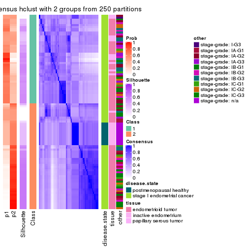</p>

</div>
<div id='tab-CV-hclust-consensus-heatmap-2'>
<pre><code class="r">consensus_heatmap(res, k = 3)
</code></pre>

<p>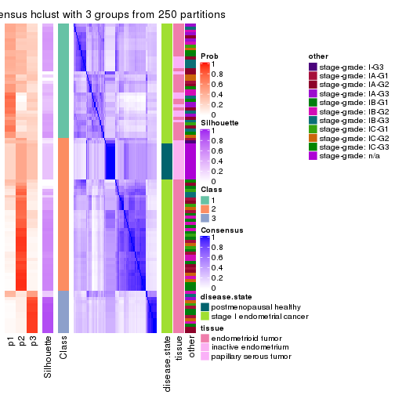</p>

</div>
<div id='tab-CV-hclust-consensus-heatmap-3'>
<pre><code class="r">consensus_heatmap(res, k = 4)
</code></pre>

<p>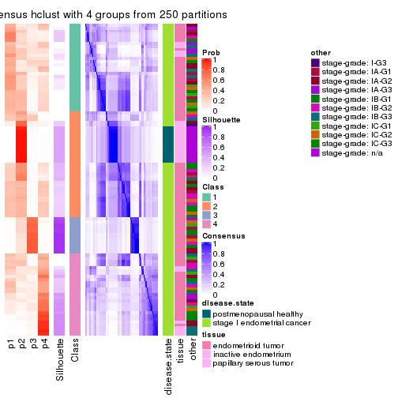</p>

</div>
<div id='tab-CV-hclust-consensus-heatmap-4'>
<pre><code class="r">consensus_heatmap(res, k = 5)
</code></pre>

<p>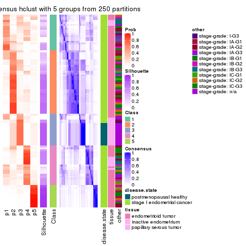</p>

</div>
<div id='tab-CV-hclust-consensus-heatmap-5'>
<pre><code class="r">consensus_heatmap(res, k = 6)
</code></pre>

<p>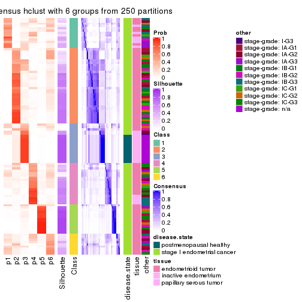</p>

</div>
</div>

Heatmaps for the membership of samples in all partitions to see how consistent they are:


<script>
$( function() {
	$( '#tabs-CV-hclust-membership-heatmap' ).tabs();
} );
</script>
<div id='tabs-CV-hclust-membership-heatmap'>
<ul>
<li><a href='#tab-CV-hclust-membership-heatmap-1'>k = 2</a></li>
<li><a href='#tab-CV-hclust-membership-heatmap-2'>k = 3</a></li>
<li><a href='#tab-CV-hclust-membership-heatmap-3'>k = 4</a></li>
<li><a href='#tab-CV-hclust-membership-heatmap-4'>k = 5</a></li>
<li><a href='#tab-CV-hclust-membership-heatmap-5'>k = 6</a></li>
</ul>
<div id='tab-CV-hclust-membership-heatmap-1'>
<pre><code class="r">membership_heatmap(res, k = 2)
</code></pre>

<p>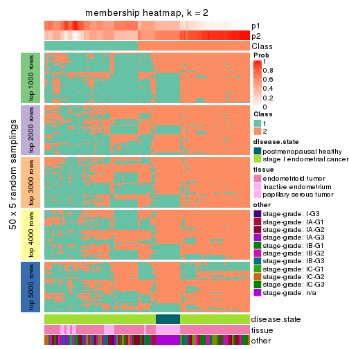</p>

</div>
<div id='tab-CV-hclust-membership-heatmap-2'>
<pre><code class="r">membership_heatmap(res, k = 3)
</code></pre>

<p>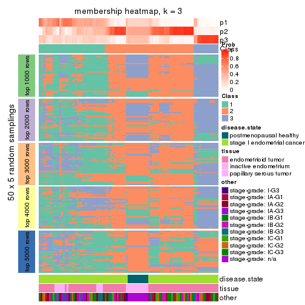</p>

</div>
<div id='tab-CV-hclust-membership-heatmap-3'>
<pre><code class="r">membership_heatmap(res, k = 4)
</code></pre>

<p>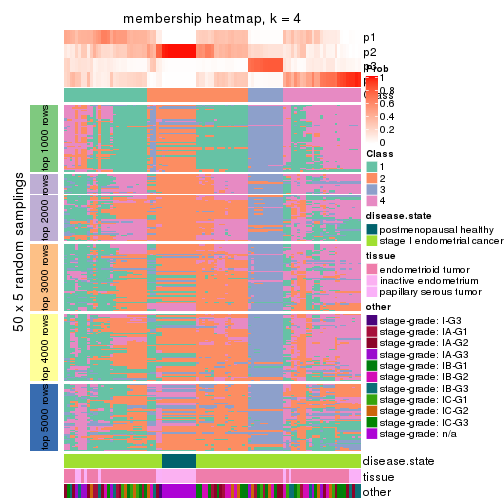</p>

</div>
<div id='tab-CV-hclust-membership-heatmap-4'>
<pre><code class="r">membership_heatmap(res, k = 5)
</code></pre>

<p>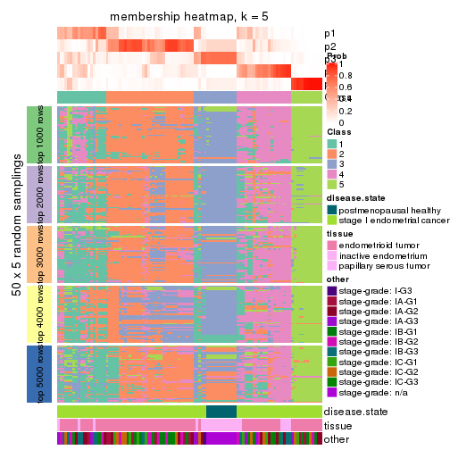</p>

</div>
<div id='tab-CV-hclust-membership-heatmap-5'>
<pre><code class="r">membership_heatmap(res, k = 6)
</code></pre>

<p>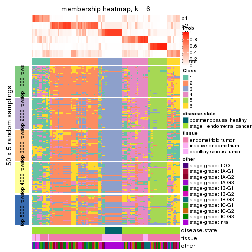</p>

</div>
</div>

As soon as we have had the classes for columns, we can look for signatures
which are significantly different between classes which can be candidate marks
for certain classes. Following are the heatmaps for signatures.


Signature heatmaps where rows are scaled:


<script>
$( function() {
	$( '#tabs-CV-hclust-get-signatures' ).tabs();
} );
</script>
<div id='tabs-CV-hclust-get-signatures'>
<ul>
<li><a href='#tab-CV-hclust-get-signatures-1'>k = 2</a></li>
<li><a href='#tab-CV-hclust-get-signatures-2'>k = 3</a></li>
<li><a href='#tab-CV-hclust-get-signatures-3'>k = 4</a></li>
<li><a href='#tab-CV-hclust-get-signatures-4'>k = 5</a></li>
<li><a href='#tab-CV-hclust-get-signatures-5'>k = 6</a></li>
</ul>
<div id='tab-CV-hclust-get-signatures-1'>
<pre><code class="r">get_signatures(res, k = 2)
</code></pre>

<p>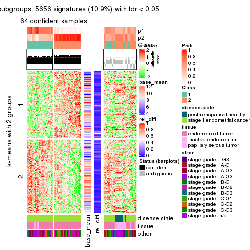</p>

</div>
<div id='tab-CV-hclust-get-signatures-2'>
<pre><code class="r">get_signatures(res, k = 3)
</code></pre>

<p>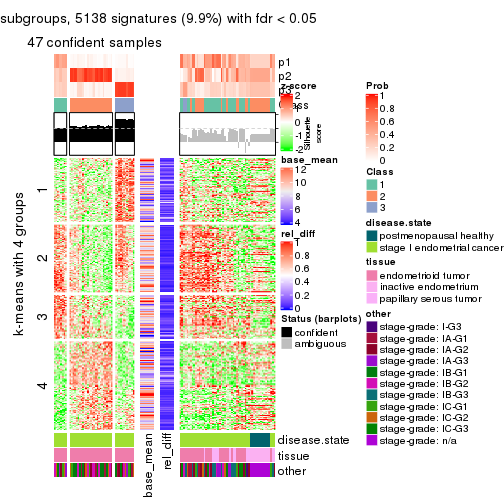</p>

</div>
<div id='tab-CV-hclust-get-signatures-3'>
<pre><code class="r">get_signatures(res, k = 4)
</code></pre>

<p>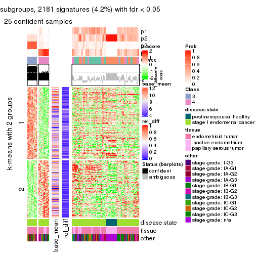</p>

</div>
<div id='tab-CV-hclust-get-signatures-4'>
<pre><code class="r">get_signatures(res, k = 5)
</code></pre>

<p>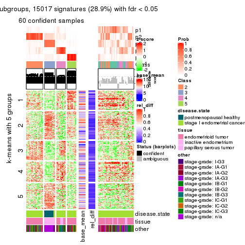</p>

</div>
<div id='tab-CV-hclust-get-signatures-5'>
<pre><code class="r">get_signatures(res, k = 6)
</code></pre>

<p>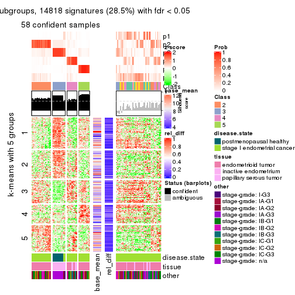</p>

</div>
</div>


Signature heatmaps where rows are not scaled:


<script>
$( function() {
	$( '#tabs-CV-hclust-get-signatures-no-scale' ).tabs();
} );
</script>
<div id='tabs-CV-hclust-get-signatures-no-scale'>
<ul>
<li><a href='#tab-CV-hclust-get-signatures-no-scale-1'>k = 2</a></li>
<li><a href='#tab-CV-hclust-get-signatures-no-scale-2'>k = 3</a></li>
<li><a href='#tab-CV-hclust-get-signatures-no-scale-3'>k = 4</a></li>
<li><a href='#tab-CV-hclust-get-signatures-no-scale-4'>k = 5</a></li>
<li><a href='#tab-CV-hclust-get-signatures-no-scale-5'>k = 6</a></li>
</ul>
<div id='tab-CV-hclust-get-signatures-no-scale-1'>
<pre><code class="r">get_signatures(res, k = 2, scale_rows = FALSE)
</code></pre>

<p>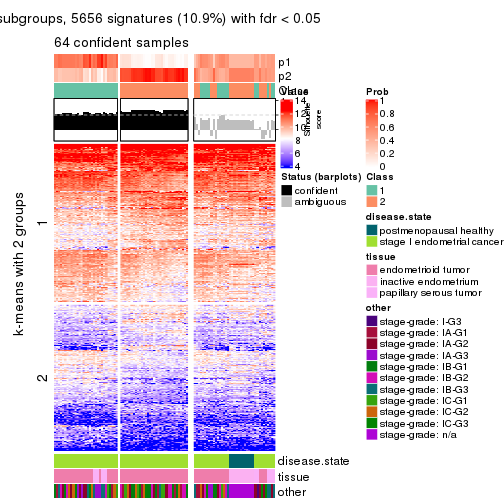</p>

</div>
<div id='tab-CV-hclust-get-signatures-no-scale-2'>
<pre><code class="r">get_signatures(res, k = 3, scale_rows = FALSE)
</code></pre>

<p>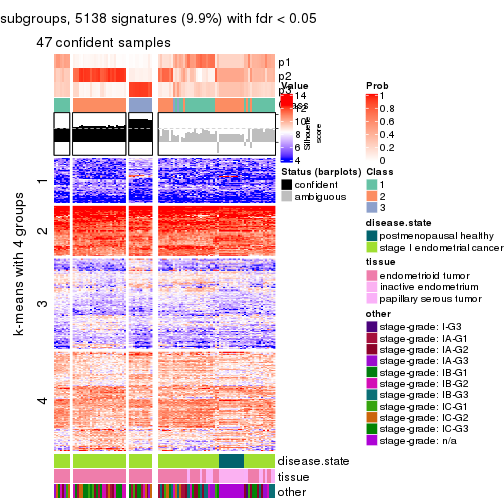</p>

</div>
<div id='tab-CV-hclust-get-signatures-no-scale-3'>
<pre><code class="r">get_signatures(res, k = 4, scale_rows = FALSE)
</code></pre>

<p>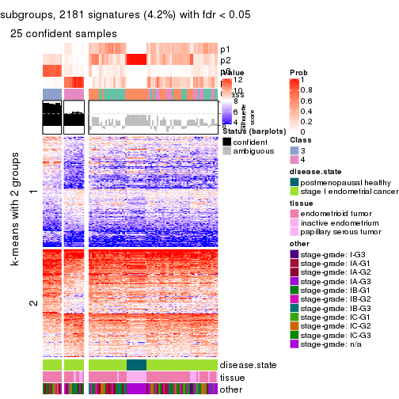</p>

</div>
<div id='tab-CV-hclust-get-signatures-no-scale-4'>
<pre><code class="r">get_signatures(res, k = 5, scale_rows = FALSE)
</code></pre>

<p>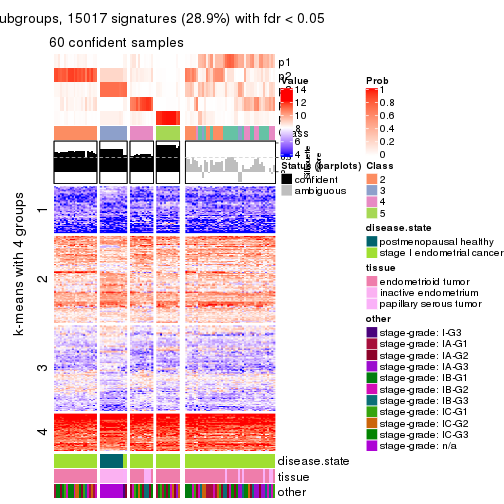</p>

</div>
<div id='tab-CV-hclust-get-signatures-no-scale-5'>
<pre><code class="r">get_signatures(res, k = 6, scale_rows = FALSE)
</code></pre>

<p>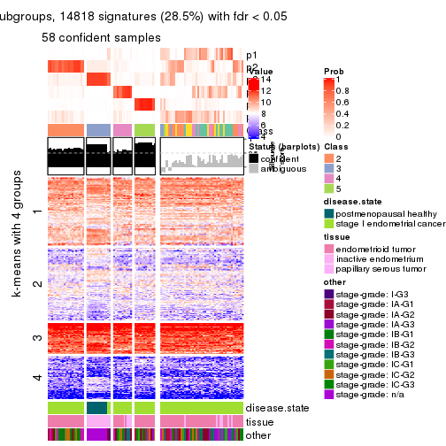</p>

</div>
</div>


Compare the overlap of signatures from different k:

```r
compare_signatures(res)
```

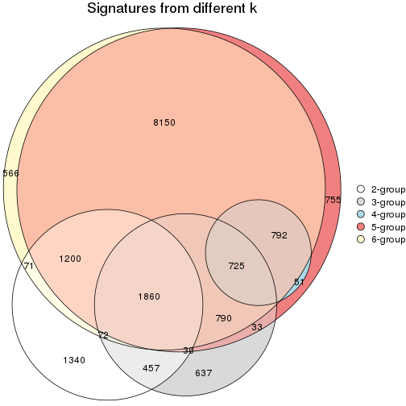

`get_signature()` returns a data frame invisibly. TO get the list of signatures, the function
call should be assigned to a variable explicitly. In following code, if `plot` argument is set
to `FALSE`, no heatmap is plotted while only the differential analysis is performed.

```r
# code only for demonstration
tb = get_signature(res, k = ..., plot = FALSE)
```

An example of the output of `tb` is:

```
#>   which_row         fdr    mean_1    mean_2 scaled_mean_1 scaled_mean_2 km
#> 1        38 0.042760348  8.373488  9.131774    -0.5533452     0.5164555  1
#> 2        40 0.018707592  7.106213  8.469186    -0.6173731     0.5762149  1
#> 3        55 0.019134737 10.221463 11.207825    -0.6159697     0.5749050  1
#> 4        59 0.006059896  5.921854  7.869574    -0.6899429     0.6439467  1
#> 5        60 0.018055526  8.928898 10.211722    -0.6204761     0.5791110  1
#> 6        98 0.009384629 15.714769 14.887706     0.6635654    -0.6193277  2
...
```

The columns in `tb` are:

1. `which_row`: row indices corresponding to the input matrix.
2. `fdr`: FDR for the differential test. 
3. `mean_x`: The mean value in group x.
4. `scaled_mean_x`: The mean value in group x after rows are scaled.
5. `km`: Row groups if k-means clustering is applied to rows.


UMAP plot which shows how samples are separated.


<script>
$( function() {
	$( '#tabs-CV-hclust-dimension-reduction' ).tabs();
} );
</script>
<div id='tabs-CV-hclust-dimension-reduction'>
<ul>
<li><a href='#tab-CV-hclust-dimension-reduction-1'>k = 2</a></li>
<li><a href='#tab-CV-hclust-dimension-reduction-2'>k = 3</a></li>
<li><a href='#tab-CV-hclust-dimension-reduction-3'>k = 4</a></li>
<li><a href='#tab-CV-hclust-dimension-reduction-4'>k = 5</a></li>
<li><a href='#tab-CV-hclust-dimension-reduction-5'>k = 6</a></li>
</ul>
<div id='tab-CV-hclust-dimension-reduction-1'>
<pre><code class="r">dimension_reduction(res, k = 2, method = &quot;UMAP&quot;)
</code></pre>

<p>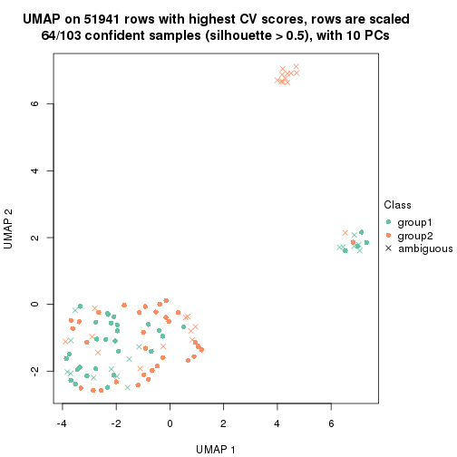</p>

</div>
<div id='tab-CV-hclust-dimension-reduction-2'>
<pre><code class="r">dimension_reduction(res, k = 3, method = &quot;UMAP&quot;)
</code></pre>

<p>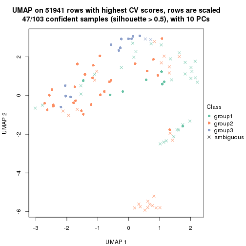</p>

</div>
<div id='tab-CV-hclust-dimension-reduction-3'>
<pre><code class="r">dimension_reduction(res, k = 4, method = &quot;UMAP&quot;)
</code></pre>

<p>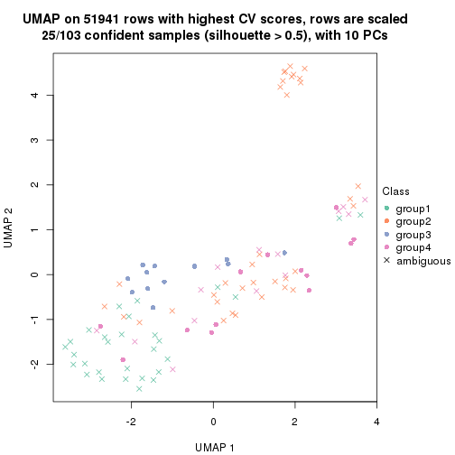</p>

</div>
<div id='tab-CV-hclust-dimension-reduction-4'>
<pre><code class="r">dimension_reduction(res, k = 5, method = &quot;UMAP&quot;)
</code></pre>

<p>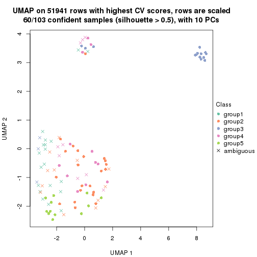</p>

</div>
<div id='tab-CV-hclust-dimension-reduction-5'>
<pre><code class="r">dimension_reduction(res, k = 6, method = &quot;UMAP&quot;)
</code></pre>

<p>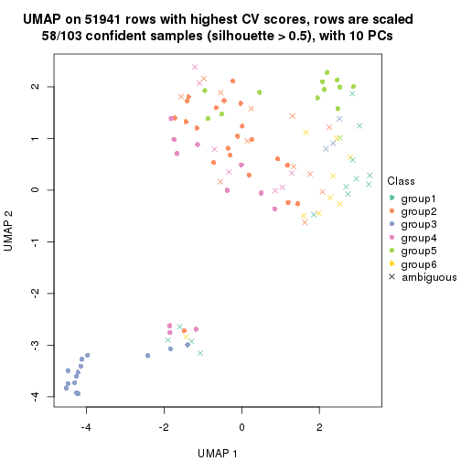</p>

</div>
</div>


Following heatmap shows how subgroups are split when increasing `k`:

```r
collect_classes(res)
```

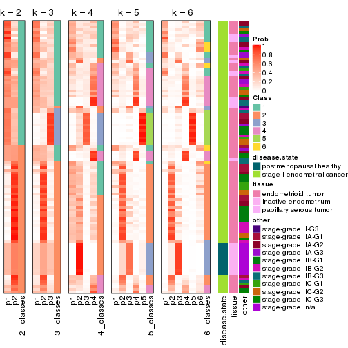


Test correlation between subgroups and known annotations. If the known
annotation is numeric, one-way ANOVA test is applied, and if the known
annotation is discrete, chi-squared contingency table test is applied.

```r
test_to_known_factors(res)
```

```
#>            n disease.state(p) tissue(p) other(p) k
#> CV:hclust 64               NA  2.60e-02 7.18e-02 2
#> CV:hclust 47               NA        NA 4.01e-01 3
#> CV:hclust 25               NA  1.21e-01 3.86e-01 4
#> CV:hclust 60         1.13e-10  7.55e-12 6.42e-06 5
#> CV:hclust 58         2.65e-10  1.19e-11 5.26e-06 6
```


If matrix rows can be associated to genes, consider to use `functional_enrichment(res,
...)` to perform function enrichment for the signature genes. See [this vignette](http://bioconductor.org/packages/devel/bioc/vignettes/cola/inst/doc/functional_enrichment.html) for more detailed explanations.


 

---------------------------------------------------


### CV:kmeans


The object with results only for a single top-value method and a single partition method 
can be extracted as:

```r
res = res_list["CV", "kmeans"]
# you can also extract it by
# res = res_list["CV:kmeans"]
```

A summary of `res` and all the functions that can be applied to it:

```r
res
```

```
#> A 'ConsensusPartition' object with k = 2, 3, 4, 5, 6.
#>   On a matrix with 51941 rows and 103 columns.
#>   Top rows (1000, 2000, 3000, 4000, 5000) are extracted by 'CV' method.
#>   Subgroups are detected by 'kmeans' method.
#>   Performed in total 1250 partitions by row resampling.
#>   Best k for subgroups seems to be 3.
#> 
#> Following methods can be applied to this 'ConsensusPartition' object:
#>  [1] "cola_report"             "collect_classes"         "collect_plots"          
#>  [4] "collect_stats"           "colnames"                "compare_signatures"     
#>  [7] "consensus_heatmap"       "dimension_reduction"     "functional_enrichment"  
#> [10] "get_anno_col"            "get_anno"                "get_classes"            
#> [13] "get_consensus"           "get_matrix"              "get_membership"         
#> [16] "get_param"               "get_signatures"          "get_stats"              
#> [19] "is_best_k"               "is_stable_k"             "membership_heatmap"     
#> [22] "ncol"                    "nrow"                    "plot_ecdf"              
#> [25] "rownames"                "select_partition_number" "show"                   
#> [28] "suggest_best_k"          "test_to_known_factors"
```

`collect_plots()` function collects all the plots made from `res` for all `k` (number of partitions)
into one single page to provide an easy and fast comparison between different `k`.

```r
collect_plots(res)
```

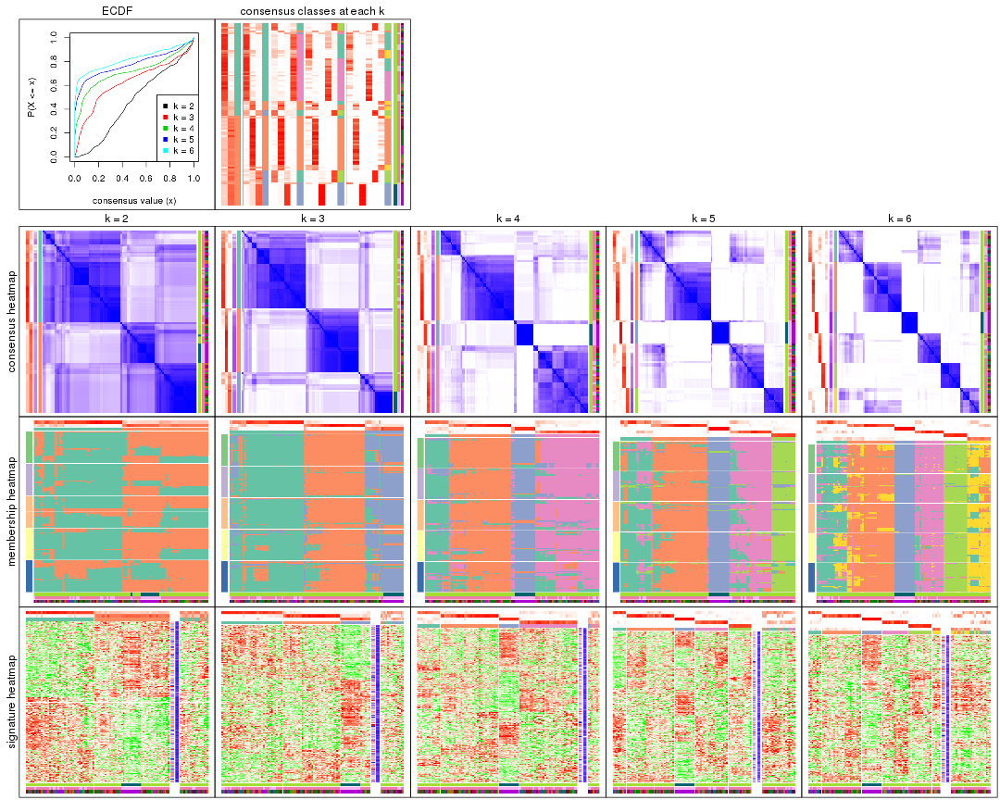

The plots are:

- The first row: a plot of the ECDF (empirical cumulative distribution
  function) curves of the consensus matrix for each `k` and the heatmap of
  predicted classes for each `k`.
- The second row: heatmaps of the consensus matrix for each `k`.
- The third row: heatmaps of the membership matrix for each `k`.
- The fouth row: heatmaps of the signatures for each `k`.

All the plots in panels can be made by individual functions and they are
plotted later in this section.

`select_partition_number()` produces several plots showing different
statistics for choosing "optimized" `k`. There are following statistics:

- ECDF curves of the consensus matrix for each `k`;
- 1-PAC. [The PAC
  score](https://en.wikipedia.org/wiki/Consensus_clustering#Over-interpretation_potential_of_consensus_clustering)
  measures the proportion of the ambiguous subgrouping.
- Mean silhouette score.
- Concordance. The mean probability of fiting the consensus class ids in all
  partitions.
- Area increased. Denote $A_k$ as the area under the ECDF curve for current
  `k`, the area increased is defined as $A_k - A_{k-1}$.
- Rand index. The percent of pairs of samples that are both in a same cluster
  or both are not in a same cluster in the partition of k and k-1.
- Jaccard index. The ratio of pairs of samples are both in a same cluster in
  the partition of k and k-1 and the pairs of samples are both in a same
  cluster in the partition k or k-1.

The detailed explanations of these statistics can be found in [the _cola_
vignette](http://bioconductor.org/packages/devel/bioc/vignettes/cola/inst/doc/cola.html#toc_13).

Generally speaking, lower PAC score, higher mean silhouette score or higher
concordance corresponds to better partition. Rand index and Jaccard index
measure how similar the current partition is compared to partition with `k-1`.
If they are too similar, we won't accept `k` is better than `k-1`.

```r
select_partition_number(res)
```

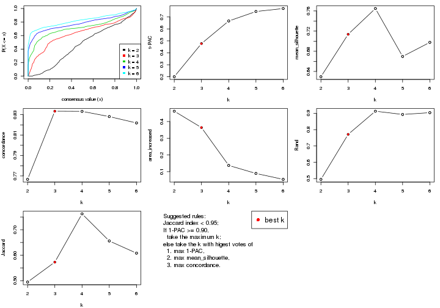

The numeric values for all these statistics can be obtained by `get_stats()`.

```r
get_stats(res)
```

```
#>   k 1-PAC mean_silhouette concordance area_increased  Rand Jaccard
#> 2 2 0.200           0.630       0.767         0.4620 0.495   0.495
#> 3 3 0.478           0.714       0.833         0.3639 0.771   0.573
#> 4 4 0.666           0.765       0.833         0.1372 0.913   0.762
#> 5 5 0.745           0.670       0.828         0.0892 0.893   0.656
#> 6 6 0.770           0.698       0.822         0.0537 0.904   0.608
```

`suggest_best_k()` suggests the best $k$ based on these statistics. The rules are as follows:

- All $k$ with Jaccard index larger than 0.95 are removed because increasing
  $k$ does not provide enough extra information. If all $k$ are removed, it is
  marked as no subgroup is detected.
- For all $k$ with 1-PAC score larger than 0.9, the maximal $k$ is taken as
  the best $k$, and other $k$ are marked as optional $k$.
- If it does not fit the second rule. The $k$ with the maximal vote of the
  highest 1-PAC score, highest mean silhouette, and highest concordance is
  taken as the best $k$.

```r
suggest_best_k(res)
```

```
#> [1] 3
```


Following shows the table of the partitions (You need to click the **show/hide
code output** link to see it). The membership matrix (columns with name `p*`)
is inferred by
[`clue::cl_consensus()`](https://www.rdocumentation.org/link/cl_consensus?package=clue)
function with the `SE` method. Basically the value in the membership matrix
represents the probability to belong to a certain group. The finall class
label for an item is determined with the group with highest probability it
belongs to.

In `get_classes()` function, the entropy is calculated from the membership
matrix and the silhouette score is calculated from the consensus matrix.


<script>
$( function() {
	$( '#tabs-CV-kmeans-get-classes' ).tabs();
} );
</script>
<div id='tabs-CV-kmeans-get-classes'>
<ul>
<li><a href='#tab-CV-kmeans-get-classes-1'>k = 2</a></li>
<li><a href='#tab-CV-kmeans-get-classes-2'>k = 3</a></li>
<li><a href='#tab-CV-kmeans-get-classes-3'>k = 4</a></li>
<li><a href='#tab-CV-kmeans-get-classes-4'>k = 5</a></li>
<li><a href='#tab-CV-kmeans-get-classes-5'>k = 6</a></li>
</ul>

<div id='tab-CV-kmeans-get-classes-1'>
<p><a id='tab-CV-kmeans-get-classes-1-a' style='color:#0366d6' href='#'>show/hide code output</a></p>
<pre><code class="r">cbind(get_classes(res, k = 2), get_membership(res, k = 2))
</code></pre>

<pre><code>#&gt;           class entropy silhouette    p1    p2
#&gt; GSM425907     2  0.8386     0.6587 0.268 0.732
#&gt; GSM425908     2  0.9087     0.6399 0.324 0.676
#&gt; GSM425909     2  0.9000     0.4741 0.316 0.684
#&gt; GSM425910     1  0.9209     0.2501 0.664 0.336
#&gt; GSM425911     2  0.8207     0.6614 0.256 0.744
#&gt; GSM425912     2  0.9754     0.5900 0.408 0.592
#&gt; GSM425913     2  0.9044     0.6438 0.320 0.680
#&gt; GSM425914     2  0.9608     0.6163 0.384 0.616
#&gt; GSM425915     2  0.7528     0.5796 0.216 0.784
#&gt; GSM425874     1  0.4939     0.7558 0.892 0.108
#&gt; GSM425875     1  0.5294     0.7131 0.880 0.120
#&gt; GSM425876     1  0.7745     0.5721 0.772 0.228
#&gt; GSM425877     1  0.2043     0.7873 0.968 0.032
#&gt; GSM425878     1  0.0672     0.7959 0.992 0.008
#&gt; GSM425879     2  0.8267     0.6593 0.260 0.740
#&gt; GSM425880     1  0.8813     0.4582 0.700 0.300
#&gt; GSM425881     1  0.9866     0.0531 0.568 0.432
#&gt; GSM425882     2  0.9087     0.6399 0.324 0.676
#&gt; GSM425883     1  0.1414     0.7950 0.980 0.020
#&gt; GSM425884     1  0.2043     0.7873 0.968 0.032
#&gt; GSM425885     1  0.9491     0.1554 0.632 0.368
#&gt; GSM425848     1  0.4298     0.7749 0.912 0.088
#&gt; GSM425849     1  0.4690     0.7600 0.900 0.100
#&gt; GSM425850     1  0.2948     0.7843 0.948 0.052
#&gt; GSM425851     1  0.2043     0.7873 0.968 0.032
#&gt; GSM425852     1  0.8763     0.4623 0.704 0.296
#&gt; GSM425893     2  0.4815     0.6350 0.104 0.896
#&gt; GSM425894     2  0.9044     0.6438 0.320 0.680
#&gt; GSM425895     2  0.9044     0.6438 0.320 0.680
#&gt; GSM425896     2  0.4815     0.6343 0.104 0.896
#&gt; GSM425897     2  0.8443     0.6584 0.272 0.728
#&gt; GSM425898     2  0.9044     0.6438 0.320 0.680
#&gt; GSM425899     1  0.7453     0.6256 0.788 0.212
#&gt; GSM425900     2  0.9129     0.6427 0.328 0.672
#&gt; GSM425901     2  0.9286     0.4222 0.344 0.656
#&gt; GSM425902     1  0.4939     0.7558 0.892 0.108
#&gt; GSM425903     2  0.7528     0.5907 0.216 0.784
#&gt; GSM425904     1  0.8813     0.4582 0.700 0.300
#&gt; GSM425905     2  0.9000     0.6460 0.316 0.684
#&gt; GSM425906     2  0.9087     0.6458 0.324 0.676
#&gt; GSM425863     1  0.1633     0.7944 0.976 0.024
#&gt; GSM425864     2  0.8813     0.6519 0.300 0.700
#&gt; GSM425865     2  0.9087     0.6399 0.324 0.676
#&gt; GSM425866     1  0.6531     0.6529 0.832 0.168
#&gt; GSM425867     2  0.7674     0.5543 0.224 0.776
#&gt; GSM425868     2  0.9775     0.4756 0.412 0.588
#&gt; GSM425869     2  0.9087     0.6399 0.324 0.676
#&gt; GSM425870     2  0.5629     0.6117 0.132 0.868
#&gt; GSM425871     1  0.3733     0.7779 0.928 0.072
#&gt; GSM425872     2  0.9044     0.6438 0.320 0.680
#&gt; GSM425873     1  0.5737     0.7231 0.864 0.136
#&gt; GSM425843     1  0.2043     0.7873 0.968 0.032
#&gt; GSM425844     1  0.0938     0.7959 0.988 0.012
#&gt; GSM425845     1  0.9866     0.1568 0.568 0.432
#&gt; GSM425846     1  0.8763     0.4970 0.704 0.296
#&gt; GSM425847     1  0.8909     0.3821 0.692 0.308
#&gt; GSM425886     2  0.7674     0.5858 0.224 0.776
#&gt; GSM425887     2  0.9775     0.4979 0.412 0.588
#&gt; GSM425888     1  0.9686     0.2011 0.604 0.396
#&gt; GSM425889     1  0.1414     0.7963 0.980 0.020
#&gt; GSM425890     1  0.4815     0.7588 0.896 0.104
#&gt; GSM425891     2  0.9000     0.6460 0.316 0.684
#&gt; GSM425892     2  0.9087     0.6399 0.324 0.676
#&gt; GSM425853     1  0.2778     0.7792 0.952 0.048
#&gt; GSM425854     2  0.9087     0.6399 0.324 0.676
#&gt; GSM425855     1  0.0376     0.7961 0.996 0.004
#&gt; GSM425856     1  0.5408     0.7103 0.876 0.124
#&gt; GSM425857     2  0.9393     0.2965 0.356 0.644
#&gt; GSM425858     2  0.9460     0.5793 0.364 0.636
#&gt; GSM425859     2  0.9044     0.6438 0.320 0.680
#&gt; GSM425860     2  0.9850     0.5395 0.428 0.572
#&gt; GSM425861     1  0.8661     0.5017 0.712 0.288
#&gt; GSM425862     1  0.2948     0.7881 0.948 0.052
#&gt; GSM425837     1  0.2778     0.7792 0.952 0.048
#&gt; GSM425838     1  0.4939     0.7558 0.892 0.108
#&gt; GSM425839     2  0.9044     0.6438 0.320 0.680
#&gt; GSM425840     1  0.1633     0.7907 0.976 0.024
#&gt; GSM425841     1  0.4939     0.7558 0.892 0.108
#&gt; GSM425842     1  0.2778     0.7911 0.952 0.048
#&gt; GSM425917     2  0.9922     0.4858 0.448 0.552
#&gt; GSM425922     1  0.4939     0.7558 0.892 0.108
#&gt; GSM425919     1  0.2043     0.7873 0.968 0.032
#&gt; GSM425920     1  0.2043     0.7873 0.968 0.032
#&gt; GSM425923     1  0.0938     0.7943 0.988 0.012
#&gt; GSM425916     1  0.2043     0.7873 0.968 0.032
#&gt; GSM425918     1  0.1184     0.7932 0.984 0.016
#&gt; GSM425921     1  0.4939     0.7558 0.892 0.108
#&gt; GSM425925     1  0.4690     0.7600 0.900 0.100
#&gt; GSM425926     1  0.4815     0.7572 0.896 0.104
#&gt; GSM425927     1  0.2043     0.7903 0.968 0.032
#&gt; GSM425924     1  0.9044     0.3726 0.680 0.320
#&gt; GSM425928     2  0.8081     0.5763 0.248 0.752
#&gt; GSM425929     2  0.7883     0.5861 0.236 0.764
#&gt; GSM425930     2  0.7815     0.5885 0.232 0.768
#&gt; GSM425931     2  0.8081     0.5763 0.248 0.752
#&gt; GSM425932     2  0.7745     0.5905 0.228 0.772
#&gt; GSM425933     2  0.7883     0.5861 0.236 0.764
#&gt; GSM425934     2  0.6973     0.6032 0.188 0.812
#&gt; GSM425935     2  0.7745     0.5905 0.228 0.772
#&gt; GSM425936     2  0.7815     0.5885 0.232 0.768
#&gt; GSM425937     2  0.8081     0.5763 0.248 0.752
#&gt; GSM425938     2  0.8016     0.5744 0.244 0.756
#&gt; GSM425939     2  0.8081     0.5763 0.248 0.752
</code></pre>

<script>
$('#tab-CV-kmeans-get-classes-1-a').parent().next().next().hide();
$('#tab-CV-kmeans-get-classes-1-a').click(function(){
  $('#tab-CV-kmeans-get-classes-1-a').parent().next().next().toggle();
  return(false);
});
</script>
</div>

<div id='tab-CV-kmeans-get-classes-2'>
<p><a id='tab-CV-kmeans-get-classes-2-a' style='color:#0366d6' href='#'>show/hide code output</a></p>
<pre><code class="r">cbind(get_classes(res, k = 3), get_membership(res, k = 3))
</code></pre>

<pre><code>#&gt;           class entropy silhouette    p1    p2    p3
#&gt; GSM425907     2  0.0592    0.88451 0.012 0.988 0.000
#&gt; GSM425908     2  0.1289    0.89167 0.032 0.968 0.000
#&gt; GSM425909     3  0.8307    0.56671 0.192 0.176 0.632
#&gt; GSM425910     1  0.7424    0.28874 0.572 0.388 0.040
#&gt; GSM425911     2  0.0237    0.87923 0.004 0.996 0.000
#&gt; GSM425912     2  0.5119    0.75806 0.160 0.812 0.028
#&gt; GSM425913     2  0.0592    0.88451 0.012 0.988 0.000
#&gt; GSM425914     2  0.4172    0.80387 0.104 0.868 0.028
#&gt; GSM425915     3  0.6025    0.62348 0.028 0.232 0.740
#&gt; GSM425874     1  0.5111    0.75551 0.808 0.168 0.024
#&gt; GSM425875     1  0.6016    0.57231 0.724 0.020 0.256
#&gt; GSM425876     1  0.7065    0.46855 0.644 0.316 0.040
#&gt; GSM425877     1  0.1267    0.83328 0.972 0.024 0.004
#&gt; GSM425878     1  0.2810    0.83192 0.928 0.036 0.036
#&gt; GSM425879     2  0.0424    0.88243 0.008 0.992 0.000
#&gt; GSM425880     3  0.7049    0.11867 0.452 0.020 0.528
#&gt; GSM425881     2  0.5402    0.75941 0.180 0.792 0.028
#&gt; GSM425882     2  0.1411    0.89054 0.036 0.964 0.000
#&gt; GSM425883     1  0.1399    0.83470 0.968 0.028 0.004
#&gt; GSM425884     1  0.2187    0.82962 0.948 0.024 0.028
#&gt; GSM425885     1  0.7001    0.43904 0.588 0.388 0.024
#&gt; GSM425848     1  0.4045    0.80136 0.872 0.104 0.024
#&gt; GSM425849     1  0.3148    0.83259 0.916 0.048 0.036
#&gt; GSM425850     1  0.2926    0.82656 0.924 0.036 0.040
#&gt; GSM425851     1  0.1620    0.83315 0.964 0.024 0.012
#&gt; GSM425852     3  0.6825   -0.00836 0.492 0.012 0.496
#&gt; GSM425893     2  0.1182    0.85457 0.012 0.976 0.012
#&gt; GSM425894     2  0.1289    0.89167 0.032 0.968 0.000
#&gt; GSM425895     2  0.1289    0.89167 0.032 0.968 0.000
#&gt; GSM425896     2  0.0000    0.87548 0.000 1.000 0.000
#&gt; GSM425897     2  0.0424    0.88243 0.008 0.992 0.000
#&gt; GSM425898     2  0.1289    0.89167 0.032 0.968 0.000
#&gt; GSM425899     1  0.7377    0.26695 0.516 0.452 0.032
#&gt; GSM425900     2  0.2096    0.88370 0.052 0.944 0.004
#&gt; GSM425901     3  0.8309    0.56762 0.188 0.180 0.632
#&gt; GSM425902     1  0.5111    0.75551 0.808 0.168 0.024
#&gt; GSM425903     3  0.7603    0.55031 0.096 0.236 0.668
#&gt; GSM425904     3  0.7049    0.11867 0.452 0.020 0.528
#&gt; GSM425905     2  0.0592    0.88451 0.012 0.988 0.000
#&gt; GSM425906     2  0.1525    0.88178 0.032 0.964 0.004
#&gt; GSM425863     1  0.2152    0.83626 0.948 0.036 0.016
#&gt; GSM425864     2  0.0424    0.88243 0.008 0.992 0.000
#&gt; GSM425865     2  0.1289    0.89167 0.032 0.968 0.000
#&gt; GSM425866     1  0.6416    0.48646 0.676 0.020 0.304
#&gt; GSM425867     3  0.2806    0.69309 0.040 0.032 0.928
#&gt; GSM425868     2  0.2866    0.85700 0.076 0.916 0.008
#&gt; GSM425869     2  0.1525    0.89009 0.032 0.964 0.004
#&gt; GSM425870     2  0.7223   -0.06477 0.028 0.548 0.424
#&gt; GSM425871     1  0.1832    0.83564 0.956 0.036 0.008
#&gt; GSM425872     2  0.1289    0.89167 0.032 0.968 0.000
#&gt; GSM425873     1  0.6482    0.60409 0.716 0.244 0.040
#&gt; GSM425843     1  0.2313    0.82884 0.944 0.024 0.032
#&gt; GSM425844     1  0.1585    0.83424 0.964 0.028 0.008
#&gt; GSM425845     1  0.9767   -0.08545 0.404 0.232 0.364
#&gt; GSM425846     2  0.4742    0.80190 0.104 0.848 0.048
#&gt; GSM425847     2  0.6897    0.60631 0.292 0.668 0.040
#&gt; GSM425886     3  0.7112    0.53560 0.044 0.308 0.648
#&gt; GSM425887     2  0.5060    0.78316 0.156 0.816 0.028
#&gt; GSM425888     2  0.5826    0.73002 0.204 0.764 0.032
#&gt; GSM425889     1  0.2434    0.83110 0.940 0.036 0.024
#&gt; GSM425890     1  0.4551    0.77773 0.840 0.140 0.020
#&gt; GSM425891     2  0.0592    0.88451 0.012 0.988 0.000
#&gt; GSM425892     2  0.1289    0.89167 0.032 0.968 0.000
#&gt; GSM425853     1  0.2383    0.82515 0.940 0.016 0.044
#&gt; GSM425854     2  0.1289    0.89167 0.032 0.968 0.000
#&gt; GSM425855     1  0.1525    0.83601 0.964 0.032 0.004
#&gt; GSM425856     1  0.6294    0.51732 0.692 0.020 0.288
#&gt; GSM425857     3  0.9517    0.30512 0.312 0.212 0.476
#&gt; GSM425858     2  0.3310    0.86340 0.064 0.908 0.028
#&gt; GSM425859     2  0.1289    0.89167 0.032 0.968 0.000
#&gt; GSM425860     2  0.8934    0.37797 0.236 0.568 0.196
#&gt; GSM425861     2  0.6744    0.58758 0.300 0.668 0.032
#&gt; GSM425862     1  0.2550    0.83050 0.936 0.040 0.024
#&gt; GSM425837     1  0.2297    0.82828 0.944 0.020 0.036
#&gt; GSM425838     1  0.5111    0.75551 0.808 0.168 0.024
#&gt; GSM425839     2  0.1289    0.89167 0.032 0.968 0.000
#&gt; GSM425840     1  0.2187    0.83269 0.948 0.028 0.024
#&gt; GSM425841     1  0.5111    0.75551 0.808 0.168 0.024
#&gt; GSM425842     1  0.2681    0.82590 0.932 0.028 0.040
#&gt; GSM425917     3  0.8984    0.21780 0.436 0.128 0.436
#&gt; GSM425922     1  0.4679    0.77393 0.832 0.148 0.020
#&gt; GSM425919     1  0.2313    0.82923 0.944 0.024 0.032
#&gt; GSM425920     1  0.1453    0.83274 0.968 0.024 0.008
#&gt; GSM425923     1  0.1585    0.83419 0.964 0.028 0.008
#&gt; GSM425916     1  0.1453    0.83327 0.968 0.024 0.008
#&gt; GSM425918     1  0.1399    0.83441 0.968 0.028 0.004
#&gt; GSM425921     1  0.4811    0.77243 0.828 0.148 0.024
#&gt; GSM425925     1  0.2492    0.83086 0.936 0.048 0.016
#&gt; GSM425926     1  0.4811    0.77243 0.828 0.148 0.024
#&gt; GSM425927     1  0.2550    0.82685 0.936 0.024 0.040
#&gt; GSM425924     1  0.8501   -0.14537 0.488 0.092 0.420
#&gt; GSM425928     3  0.5526    0.74877 0.036 0.172 0.792
#&gt; GSM425929     3  0.5526    0.74877 0.036 0.172 0.792
#&gt; GSM425930     3  0.5526    0.74877 0.036 0.172 0.792
#&gt; GSM425931     3  0.5526    0.74877 0.036 0.172 0.792
#&gt; GSM425932     3  0.5526    0.74877 0.036 0.172 0.792
#&gt; GSM425933     3  0.5526    0.74877 0.036 0.172 0.792
#&gt; GSM425934     3  0.5402    0.74067 0.028 0.180 0.792
#&gt; GSM425935     3  0.5526    0.74877 0.036 0.172 0.792
#&gt; GSM425936     3  0.5526    0.74877 0.036 0.172 0.792
#&gt; GSM425937     3  0.5526    0.74877 0.036 0.172 0.792
#&gt; GSM425938     3  0.5413    0.74749 0.036 0.164 0.800
#&gt; GSM425939     3  0.5526    0.74877 0.036 0.172 0.792
</code></pre>

<script>
$('#tab-CV-kmeans-get-classes-2-a').parent().next().next().hide();
$('#tab-CV-kmeans-get-classes-2-a').click(function(){
  $('#tab-CV-kmeans-get-classes-2-a').parent().next().next().toggle();
  return(false);
});
</script>
</div>

<div id='tab-CV-kmeans-get-classes-3'>
<p><a id='tab-CV-kmeans-get-classes-3-a' style='color:#0366d6' href='#'>show/hide code output</a></p>
<pre><code class="r">cbind(get_classes(res, k = 4), get_membership(res, k = 4))
</code></pre>

<pre><code>#&gt;           class entropy silhouette    p1    p2    p3    p4
#&gt; GSM425907     2  0.0895     0.8800 0.020 0.976 0.000 0.004
#&gt; GSM425908     2  0.0895     0.8800 0.020 0.976 0.000 0.004
#&gt; GSM425909     1  0.6587     0.8005 0.688 0.076 0.188 0.048
#&gt; GSM425910     4  0.8865     0.0994 0.328 0.292 0.044 0.336
#&gt; GSM425911     2  0.2401     0.8700 0.092 0.904 0.000 0.004
#&gt; GSM425912     2  0.6077     0.7390 0.200 0.708 0.028 0.064
#&gt; GSM425913     2  0.1661     0.8773 0.052 0.944 0.000 0.004
#&gt; GSM425914     2  0.5277     0.7775 0.196 0.748 0.016 0.040
#&gt; GSM425915     1  0.5696     0.7223 0.680 0.052 0.264 0.004
#&gt; GSM425874     4  0.4837     0.7125 0.076 0.120 0.008 0.796
#&gt; GSM425875     1  0.4399     0.7534 0.768 0.000 0.020 0.212
#&gt; GSM425876     4  0.8766     0.2607 0.320 0.248 0.044 0.388
#&gt; GSM425877     4  0.1452     0.7929 0.036 0.000 0.008 0.956
#&gt; GSM425878     4  0.4559     0.7447 0.164 0.004 0.040 0.792
#&gt; GSM425879     2  0.0921     0.8818 0.028 0.972 0.000 0.000
#&gt; GSM425880     1  0.5174     0.8307 0.760 0.000 0.124 0.116
#&gt; GSM425881     2  0.5708     0.7662 0.168 0.744 0.032 0.056
#&gt; GSM425882     2  0.2474     0.8784 0.056 0.920 0.016 0.008
#&gt; GSM425883     4  0.1545     0.7958 0.040 0.000 0.008 0.952
#&gt; GSM425884     4  0.5057     0.7208 0.204 0.004 0.044 0.748
#&gt; GSM425885     4  0.6290     0.5290 0.076 0.272 0.008 0.644
#&gt; GSM425848     4  0.4261     0.7442 0.100 0.060 0.008 0.832
#&gt; GSM425849     4  0.3749     0.7747 0.128 0.000 0.032 0.840
#&gt; GSM425850     4  0.5649     0.6642 0.280 0.004 0.044 0.672
#&gt; GSM425851     4  0.2813     0.7848 0.080 0.000 0.024 0.896
#&gt; GSM425852     1  0.5226     0.8302 0.756 0.000 0.128 0.116
#&gt; GSM425893     2  0.2520     0.8697 0.088 0.904 0.004 0.004
#&gt; GSM425894     2  0.0376     0.8806 0.004 0.992 0.000 0.004
#&gt; GSM425895     2  0.0188     0.8807 0.000 0.996 0.000 0.004
#&gt; GSM425896     2  0.0895     0.8800 0.020 0.976 0.000 0.004
#&gt; GSM425897     2  0.0895     0.8816 0.020 0.976 0.000 0.004
#&gt; GSM425898     2  0.0376     0.8806 0.004 0.992 0.000 0.004
#&gt; GSM425899     2  0.6666     0.2829 0.052 0.584 0.024 0.340
#&gt; GSM425900     2  0.2197     0.8700 0.080 0.916 0.000 0.004
#&gt; GSM425901     1  0.6587     0.8005 0.688 0.076 0.188 0.048
#&gt; GSM425902     4  0.4837     0.7125 0.076 0.120 0.008 0.796
#&gt; GSM425903     1  0.4728     0.7916 0.776 0.020 0.188 0.016
#&gt; GSM425904     1  0.5174     0.8307 0.760 0.000 0.124 0.116
#&gt; GSM425905     2  0.0779     0.8807 0.016 0.980 0.000 0.004
#&gt; GSM425906     2  0.2401     0.8656 0.092 0.904 0.000 0.004
#&gt; GSM425863     4  0.2563     0.7888 0.072 0.000 0.020 0.908
#&gt; GSM425864     2  0.1109     0.8820 0.028 0.968 0.000 0.004
#&gt; GSM425865     2  0.0895     0.8816 0.020 0.976 0.000 0.004
#&gt; GSM425866     1  0.4756     0.7906 0.772 0.000 0.052 0.176
#&gt; GSM425867     1  0.4877     0.6809 0.664 0.000 0.328 0.008
#&gt; GSM425868     2  0.1878     0.8605 0.008 0.944 0.008 0.040
#&gt; GSM425869     2  0.1271     0.8727 0.012 0.968 0.008 0.012
#&gt; GSM425870     2  0.6451     0.6390 0.136 0.656 0.204 0.004
#&gt; GSM425871     4  0.3215     0.7831 0.092 0.000 0.032 0.876
#&gt; GSM425872     2  0.0657     0.8822 0.012 0.984 0.000 0.004
#&gt; GSM425873     4  0.8457     0.3663 0.320 0.184 0.044 0.452
#&gt; GSM425843     4  0.4380     0.7455 0.164 0.004 0.032 0.800
#&gt; GSM425844     4  0.2943     0.7842 0.076 0.000 0.032 0.892
#&gt; GSM425845     1  0.3546     0.7495 0.876 0.012 0.052 0.060
#&gt; GSM425846     2  0.2262     0.8668 0.012 0.932 0.040 0.016
#&gt; GSM425847     2  0.7939     0.5260 0.268 0.544 0.044 0.144
#&gt; GSM425886     1  0.6232     0.7705 0.688 0.088 0.208 0.016
#&gt; GSM425887     2  0.5161     0.7959 0.156 0.776 0.028 0.040
#&gt; GSM425888     2  0.5947     0.7533 0.164 0.732 0.032 0.072
#&gt; GSM425889     4  0.2412     0.7732 0.084 0.000 0.008 0.908
#&gt; GSM425890     4  0.3974     0.7512 0.060 0.068 0.016 0.856
#&gt; GSM425891     2  0.1824     0.8759 0.060 0.936 0.000 0.004
#&gt; GSM425892     2  0.0779     0.8801 0.016 0.980 0.000 0.004
#&gt; GSM425853     4  0.4800     0.7258 0.196 0.000 0.044 0.760
#&gt; GSM425854     2  0.0564     0.8813 0.004 0.988 0.004 0.004
#&gt; GSM425855     4  0.1576     0.7969 0.048 0.000 0.004 0.948
#&gt; GSM425856     1  0.4679     0.7838 0.772 0.000 0.044 0.184
#&gt; GSM425857     1  0.6702     0.7770 0.704 0.092 0.120 0.084
#&gt; GSM425858     2  0.3446     0.8529 0.092 0.872 0.028 0.008
#&gt; GSM425859     2  0.0188     0.8807 0.000 0.996 0.000 0.004
#&gt; GSM425860     2  0.7950     0.4797 0.304 0.520 0.040 0.136
#&gt; GSM425861     2  0.6695     0.6937 0.200 0.672 0.036 0.092
#&gt; GSM425862     4  0.2412     0.7732 0.084 0.000 0.008 0.908
#&gt; GSM425837     4  0.3853     0.7494 0.160 0.000 0.020 0.820
#&gt; GSM425838     4  0.4837     0.7125 0.076 0.120 0.008 0.796
#&gt; GSM425839     2  0.0188     0.8807 0.000 0.996 0.000 0.004
#&gt; GSM425840     4  0.3266     0.7797 0.108 0.000 0.024 0.868
#&gt; GSM425841     4  0.4837     0.7125 0.076 0.120 0.008 0.796
#&gt; GSM425842     4  0.5722     0.6516 0.292 0.004 0.044 0.660
#&gt; GSM425917     3  0.7296     0.2220 0.060 0.040 0.496 0.404
#&gt; GSM425922     4  0.3974     0.7512 0.060 0.068 0.016 0.856
#&gt; GSM425919     4  0.4689     0.7488 0.168 0.004 0.044 0.784
#&gt; GSM425920     4  0.3215     0.7802 0.092 0.000 0.032 0.876
#&gt; GSM425923     4  0.0927     0.7900 0.016 0.000 0.008 0.976
#&gt; GSM425916     4  0.2376     0.7885 0.068 0.000 0.016 0.916
#&gt; GSM425918     4  0.1284     0.7921 0.024 0.000 0.012 0.964
#&gt; GSM425921     4  0.4265     0.7423 0.076 0.068 0.016 0.840
#&gt; GSM425925     4  0.2384     0.7763 0.072 0.004 0.008 0.916
#&gt; GSM425926     4  0.4019     0.7428 0.076 0.068 0.008 0.848
#&gt; GSM425927     4  0.5366     0.6990 0.240 0.004 0.044 0.712
#&gt; GSM425924     3  0.7136     0.0477 0.068 0.024 0.456 0.452
#&gt; GSM425928     3  0.1637     0.8868 0.000 0.060 0.940 0.000
#&gt; GSM425929     3  0.1637     0.8868 0.000 0.060 0.940 0.000
#&gt; GSM425930     3  0.1637     0.8868 0.000 0.060 0.940 0.000
#&gt; GSM425931     3  0.1637     0.8868 0.000 0.060 0.940 0.000
#&gt; GSM425932     3  0.1637     0.8868 0.000 0.060 0.940 0.000
#&gt; GSM425933     3  0.1637     0.8868 0.000 0.060 0.940 0.000
#&gt; GSM425934     3  0.1637     0.8868 0.000 0.060 0.940 0.000
#&gt; GSM425935     3  0.1637     0.8868 0.000 0.060 0.940 0.000
#&gt; GSM425936     3  0.1637     0.8868 0.000 0.060 0.940 0.000
#&gt; GSM425937     3  0.1637     0.8868 0.000 0.060 0.940 0.000
#&gt; GSM425938     3  0.1743     0.8806 0.004 0.056 0.940 0.000
#&gt; GSM425939     3  0.1637     0.8868 0.000 0.060 0.940 0.000
</code></pre>

<script>
$('#tab-CV-kmeans-get-classes-3-a').parent().next().next().hide();
$('#tab-CV-kmeans-get-classes-3-a').click(function(){
  $('#tab-CV-kmeans-get-classes-3-a').parent().next().next().toggle();
  return(false);
});
</script>
</div>

<div id='tab-CV-kmeans-get-classes-4'>
<p><a id='tab-CV-kmeans-get-classes-4-a' style='color:#0366d6' href='#'>show/hide code output</a></p>
<pre><code class="r">cbind(get_classes(res, k = 5), get_membership(res, k = 5))
</code></pre>

<pre><code>#&gt;           class entropy silhouette    p1    p2    p3    p4    p5
#&gt; GSM425907     2  0.2103     0.8545 0.056 0.920 0.004 0.000 0.020
#&gt; GSM425908     2  0.1934     0.8558 0.052 0.928 0.004 0.000 0.016
#&gt; GSM425909     5  0.2824     0.9230 0.000 0.028 0.068 0.016 0.888
#&gt; GSM425910     1  0.1300     0.5864 0.956 0.016 0.000 0.000 0.028
#&gt; GSM425911     2  0.3706     0.7918 0.184 0.792 0.004 0.000 0.020
#&gt; GSM425912     1  0.5047    -0.3747 0.504 0.468 0.004 0.000 0.024
#&gt; GSM425913     2  0.2110     0.8487 0.072 0.912 0.000 0.000 0.016
#&gt; GSM425914     2  0.5103     0.4554 0.444 0.524 0.004 0.000 0.028
#&gt; GSM425915     5  0.3222     0.9012 0.028 0.020 0.088 0.000 0.864
#&gt; GSM425874     4  0.2875     0.7133 0.008 0.052 0.000 0.884 0.056
#&gt; GSM425875     5  0.2464     0.9124 0.032 0.000 0.012 0.048 0.908
#&gt; GSM425876     1  0.1393     0.5903 0.956 0.012 0.000 0.008 0.024
#&gt; GSM425877     4  0.4238     0.6200 0.164 0.000 0.000 0.768 0.068
#&gt; GSM425878     1  0.5126     0.3718 0.636 0.000 0.000 0.300 0.064
#&gt; GSM425879     2  0.1901     0.8559 0.056 0.928 0.004 0.000 0.012
#&gt; GSM425880     5  0.2483     0.9294 0.028 0.000 0.048 0.016 0.908
#&gt; GSM425881     2  0.4897     0.3806 0.460 0.516 0.000 0.000 0.024
#&gt; GSM425882     2  0.1901     0.8592 0.056 0.928 0.004 0.000 0.012
#&gt; GSM425883     4  0.2966     0.6807 0.136 0.000 0.000 0.848 0.016
#&gt; GSM425884     1  0.4777     0.4455 0.680 0.000 0.000 0.268 0.052
#&gt; GSM425885     4  0.3829     0.5710 0.000 0.196 0.000 0.776 0.028
#&gt; GSM425848     4  0.3175     0.7174 0.020 0.044 0.000 0.872 0.064
#&gt; GSM425849     4  0.4114     0.6230 0.164 0.000 0.000 0.776 0.060
#&gt; GSM425850     1  0.2293     0.5802 0.900 0.000 0.000 0.084 0.016
#&gt; GSM425851     4  0.5452     0.0187 0.448 0.000 0.000 0.492 0.060
#&gt; GSM425852     5  0.2625     0.9271 0.040 0.000 0.048 0.012 0.900
#&gt; GSM425893     2  0.3381     0.8115 0.160 0.820 0.004 0.000 0.016
#&gt; GSM425894     2  0.0451     0.8555 0.004 0.988 0.000 0.000 0.008
#&gt; GSM425895     2  0.0324     0.8562 0.004 0.992 0.000 0.000 0.004
#&gt; GSM425896     2  0.2103     0.8545 0.056 0.920 0.004 0.000 0.020
#&gt; GSM425897     2  0.2005     0.8554 0.056 0.924 0.004 0.000 0.016
#&gt; GSM425898     2  0.0324     0.8562 0.004 0.992 0.000 0.000 0.004
#&gt; GSM425899     2  0.6894     0.2778 0.116 0.548 0.000 0.272 0.064
#&gt; GSM425900     2  0.2966     0.8009 0.136 0.848 0.000 0.000 0.016
#&gt; GSM425901     5  0.2824     0.9230 0.000 0.028 0.068 0.016 0.888
#&gt; GSM425902     4  0.2945     0.7110 0.008 0.056 0.000 0.880 0.056
#&gt; GSM425903     5  0.3151     0.9011 0.068 0.004 0.064 0.000 0.864
#&gt; GSM425904     5  0.2483     0.9294 0.028 0.000 0.048 0.016 0.908
#&gt; GSM425905     2  0.1569     0.8591 0.044 0.944 0.004 0.000 0.008
#&gt; GSM425906     2  0.3381     0.7846 0.176 0.808 0.000 0.000 0.016
#&gt; GSM425863     4  0.4289     0.6306 0.176 0.000 0.000 0.760 0.064
#&gt; GSM425864     2  0.2005     0.8554 0.056 0.924 0.004 0.000 0.016
#&gt; GSM425865     2  0.1901     0.8559 0.056 0.928 0.004 0.000 0.012
#&gt; GSM425866     5  0.2499     0.9165 0.036 0.000 0.016 0.040 0.908
#&gt; GSM425867     5  0.3039     0.8723 0.012 0.000 0.152 0.000 0.836
#&gt; GSM425868     2  0.0968     0.8523 0.004 0.972 0.000 0.012 0.012
#&gt; GSM425869     2  0.0566     0.8542 0.000 0.984 0.000 0.004 0.012
#&gt; GSM425870     2  0.6211     0.5098 0.364 0.532 0.076 0.000 0.028
#&gt; GSM425871     1  0.4966     0.1910 0.564 0.000 0.000 0.404 0.032
#&gt; GSM425872     2  0.0807     0.8556 0.012 0.976 0.000 0.000 0.012
#&gt; GSM425873     1  0.1612     0.5918 0.948 0.012 0.000 0.016 0.024
#&gt; GSM425843     1  0.5429     0.2441 0.564 0.000 0.000 0.368 0.068
#&gt; GSM425844     4  0.5161     0.0513 0.444 0.000 0.000 0.516 0.040
#&gt; GSM425845     5  0.2777     0.8729 0.120 0.000 0.016 0.000 0.864
#&gt; GSM425846     2  0.1386     0.8516 0.032 0.952 0.000 0.000 0.016
#&gt; GSM425847     1  0.3193     0.5387 0.840 0.132 0.000 0.000 0.028
#&gt; GSM425886     5  0.2775     0.9165 0.000 0.036 0.068 0.008 0.888
#&gt; GSM425887     2  0.4768     0.5224 0.384 0.592 0.000 0.000 0.024
#&gt; GSM425888     2  0.4752     0.4197 0.412 0.568 0.000 0.000 0.020
#&gt; GSM425889     4  0.2605     0.7211 0.044 0.004 0.000 0.896 0.056
#&gt; GSM425890     4  0.1117     0.7090 0.016 0.000 0.000 0.964 0.020
#&gt; GSM425891     2  0.2233     0.8481 0.080 0.904 0.000 0.000 0.016
#&gt; GSM425892     2  0.1630     0.8586 0.036 0.944 0.004 0.000 0.016
#&gt; GSM425853     1  0.5240     0.4116 0.656 0.000 0.000 0.252 0.092
#&gt; GSM425854     2  0.0451     0.8560 0.004 0.988 0.000 0.000 0.008
#&gt; GSM425855     4  0.4525     0.6050 0.220 0.000 0.000 0.724 0.056
#&gt; GSM425856     5  0.2499     0.9165 0.036 0.000 0.016 0.040 0.908
#&gt; GSM425857     5  0.3092     0.9182 0.000 0.036 0.048 0.036 0.880
#&gt; GSM425858     2  0.3011     0.7979 0.140 0.844 0.000 0.000 0.016
#&gt; GSM425859     2  0.0451     0.8555 0.004 0.988 0.000 0.000 0.008
#&gt; GSM425860     1  0.3400     0.5226 0.828 0.136 0.000 0.000 0.036
#&gt; GSM425861     1  0.4907    -0.2942 0.492 0.484 0.000 0.000 0.024
#&gt; GSM425862     4  0.2536     0.7208 0.044 0.004 0.000 0.900 0.052
#&gt; GSM425837     1  0.5737    -0.0770 0.464 0.000 0.000 0.452 0.084
#&gt; GSM425838     4  0.2838     0.7048 0.008 0.072 0.000 0.884 0.036
#&gt; GSM425839     2  0.0324     0.8562 0.004 0.992 0.000 0.000 0.004
#&gt; GSM425840     4  0.5587     0.1224 0.428 0.000 0.000 0.500 0.072
#&gt; GSM425841     4  0.2875     0.7133 0.008 0.052 0.000 0.884 0.056
#&gt; GSM425842     1  0.1893     0.5892 0.928 0.000 0.000 0.048 0.024
#&gt; GSM425917     3  0.7710    -0.0791 0.236 0.000 0.388 0.316 0.060
#&gt; GSM425922     4  0.1012     0.7099 0.012 0.000 0.000 0.968 0.020
#&gt; GSM425919     1  0.5188     0.3493 0.612 0.000 0.000 0.328 0.060
#&gt; GSM425920     1  0.5450     0.0553 0.496 0.000 0.000 0.444 0.060
#&gt; GSM425923     4  0.3365     0.6479 0.120 0.000 0.000 0.836 0.044
#&gt; GSM425916     4  0.5408     0.1230 0.408 0.000 0.000 0.532 0.060
#&gt; GSM425918     4  0.4337     0.5429 0.204 0.000 0.000 0.744 0.052
#&gt; GSM425921     4  0.0609     0.7191 0.000 0.000 0.000 0.980 0.020
#&gt; GSM425925     4  0.2609     0.7192 0.052 0.004 0.000 0.896 0.048
#&gt; GSM425926     4  0.1717     0.7249 0.008 0.004 0.000 0.936 0.052
#&gt; GSM425927     1  0.4035     0.5346 0.784 0.000 0.000 0.156 0.060
#&gt; GSM425924     4  0.7826    -0.0509 0.308 0.000 0.312 0.320 0.060
#&gt; GSM425928     3  0.0162     0.9427 0.000 0.000 0.996 0.000 0.004
#&gt; GSM425929     3  0.0162     0.9427 0.000 0.000 0.996 0.000 0.004
#&gt; GSM425930     3  0.0162     0.9427 0.000 0.000 0.996 0.000 0.004
#&gt; GSM425931     3  0.0162     0.9427 0.000 0.000 0.996 0.000 0.004
#&gt; GSM425932     3  0.0162     0.9427 0.000 0.000 0.996 0.000 0.004
#&gt; GSM425933     3  0.0162     0.9427 0.000 0.000 0.996 0.000 0.004
#&gt; GSM425934     3  0.0162     0.9427 0.000 0.000 0.996 0.000 0.004
#&gt; GSM425935     3  0.0000     0.9383 0.000 0.000 1.000 0.000 0.000
#&gt; GSM425936     3  0.0162     0.9427 0.000 0.000 0.996 0.000 0.004
#&gt; GSM425937     3  0.0162     0.9427 0.000 0.000 0.996 0.000 0.004
#&gt; GSM425938     3  0.0162     0.9427 0.000 0.000 0.996 0.000 0.004
#&gt; GSM425939     3  0.0162     0.9427 0.000 0.000 0.996 0.000 0.004
</code></pre>

<script>
$('#tab-CV-kmeans-get-classes-4-a').parent().next().next().hide();
$('#tab-CV-kmeans-get-classes-4-a').click(function(){
  $('#tab-CV-kmeans-get-classes-4-a').parent().next().next().toggle();
  return(false);
});
</script>
</div>

<div id='tab-CV-kmeans-get-classes-5'>
<p><a id='tab-CV-kmeans-get-classes-5-a' style='color:#0366d6' href='#'>show/hide code output</a></p>
<pre><code class="r">cbind(get_classes(res, k = 6), get_membership(res, k = 6))
</code></pre>

<pre><code>#&gt;           class entropy silhouette    p1    p2    p3    p4    p5    p6
#&gt; GSM425907     2  0.2900     0.7819 0.012 0.856 0.000 0.004 0.016 0.112
#&gt; GSM425908     2  0.2900     0.7819 0.012 0.856 0.000 0.004 0.016 0.112
#&gt; GSM425909     5  0.1121     0.9651 0.000 0.004 0.008 0.016 0.964 0.008
#&gt; GSM425910     6  0.4072     0.3670 0.292 0.000 0.004 0.004 0.016 0.684
#&gt; GSM425911     2  0.4473     0.5711 0.012 0.644 0.000 0.004 0.020 0.320
#&gt; GSM425912     6  0.3215     0.5396 0.004 0.240 0.000 0.000 0.000 0.756
#&gt; GSM425913     2  0.2902     0.6851 0.004 0.800 0.000 0.000 0.000 0.196
#&gt; GSM425914     6  0.3509     0.5054 0.000 0.240 0.000 0.000 0.016 0.744
#&gt; GSM425915     5  0.0909     0.9587 0.000 0.000 0.012 0.000 0.968 0.020
#&gt; GSM425874     4  0.0603     0.8418 0.004 0.016 0.000 0.980 0.000 0.000
#&gt; GSM425875     5  0.1857     0.9586 0.012 0.000 0.000 0.028 0.928 0.032
#&gt; GSM425876     6  0.4144     0.3535 0.308 0.000 0.004 0.004 0.016 0.668
#&gt; GSM425877     1  0.4189     0.2116 0.552 0.000 0.000 0.436 0.004 0.008
#&gt; GSM425878     1  0.6564     0.3583 0.388 0.000 0.004 0.288 0.016 0.304
#&gt; GSM425879     2  0.2945     0.7817 0.012 0.852 0.000 0.004 0.016 0.116
#&gt; GSM425880     5  0.1950     0.9616 0.012 0.000 0.008 0.020 0.928 0.032
#&gt; GSM425881     6  0.3756     0.4672 0.004 0.352 0.000 0.000 0.000 0.644
#&gt; GSM425882     2  0.2989     0.7844 0.012 0.848 0.000 0.004 0.016 0.120
#&gt; GSM425883     4  0.3934     0.5307 0.304 0.000 0.000 0.676 0.000 0.020
#&gt; GSM425884     1  0.5723     0.4589 0.576 0.000 0.004 0.116 0.020 0.284
#&gt; GSM425885     4  0.2531     0.7313 0.000 0.128 0.000 0.860 0.008 0.004
#&gt; GSM425848     4  0.1655     0.8387 0.052 0.008 0.000 0.932 0.000 0.008
#&gt; GSM425849     4  0.2803     0.7757 0.084 0.000 0.000 0.864 0.004 0.048
#&gt; GSM425850     6  0.4585     0.2400 0.352 0.000 0.004 0.020 0.012 0.612
#&gt; GSM425851     1  0.2030     0.6319 0.908 0.000 0.000 0.064 0.000 0.028
#&gt; GSM425852     5  0.0984     0.9642 0.012 0.000 0.008 0.012 0.968 0.000
#&gt; GSM425893     2  0.4432     0.6478 0.012 0.688 0.000 0.004 0.032 0.264
#&gt; GSM425894     2  0.0935     0.7852 0.004 0.964 0.000 0.000 0.000 0.032
#&gt; GSM425895     2  0.0790     0.7862 0.000 0.968 0.000 0.000 0.000 0.032
#&gt; GSM425896     2  0.3202     0.7709 0.012 0.832 0.000 0.004 0.020 0.132
#&gt; GSM425897     2  0.3032     0.7780 0.012 0.844 0.000 0.004 0.016 0.124
#&gt; GSM425898     2  0.0935     0.7852 0.004 0.964 0.000 0.000 0.000 0.032
#&gt; GSM425899     2  0.6373     0.0776 0.080 0.456 0.000 0.376 0.000 0.088
#&gt; GSM425900     2  0.3584     0.4977 0.004 0.688 0.000 0.000 0.000 0.308
#&gt; GSM425901     5  0.1121     0.9651 0.000 0.004 0.008 0.016 0.964 0.008
#&gt; GSM425902     4  0.1053     0.8435 0.012 0.020 0.000 0.964 0.000 0.004
#&gt; GSM425903     5  0.0891     0.9582 0.000 0.000 0.008 0.000 0.968 0.024
#&gt; GSM425904     5  0.1950     0.9616 0.012 0.000 0.008 0.020 0.928 0.032
#&gt; GSM425905     2  0.2619     0.7889 0.012 0.876 0.000 0.004 0.012 0.096
#&gt; GSM425906     2  0.3830     0.3543 0.004 0.620 0.000 0.000 0.000 0.376
#&gt; GSM425863     4  0.3039     0.7644 0.088 0.000 0.000 0.848 0.004 0.060
#&gt; GSM425864     2  0.2945     0.7817 0.012 0.852 0.000 0.004 0.016 0.116
#&gt; GSM425865     2  0.2945     0.7822 0.012 0.852 0.000 0.004 0.016 0.116
#&gt; GSM425866     5  0.1857     0.9586 0.012 0.000 0.000 0.028 0.928 0.032
#&gt; GSM425867     5  0.0935     0.9565 0.000 0.000 0.032 0.000 0.964 0.004
#&gt; GSM425868     2  0.0912     0.7931 0.004 0.972 0.000 0.008 0.004 0.012
#&gt; GSM425869     2  0.0653     0.7898 0.004 0.980 0.000 0.012 0.000 0.004
#&gt; GSM425870     6  0.4736     0.4189 0.012 0.252 0.020 0.000 0.032 0.684
#&gt; GSM425871     1  0.4747     0.5318 0.668 0.000 0.004 0.072 0.004 0.252
#&gt; GSM425872     2  0.2402     0.7207 0.004 0.856 0.000 0.000 0.000 0.140
#&gt; GSM425873     6  0.4267     0.3453 0.312 0.000 0.004 0.008 0.016 0.660
#&gt; GSM425843     1  0.5907     0.5281 0.548 0.000 0.000 0.236 0.016 0.200
#&gt; GSM425844     1  0.4016     0.6195 0.768 0.000 0.004 0.108 0.000 0.120
#&gt; GSM425845     5  0.1686     0.9496 0.012 0.000 0.000 0.000 0.924 0.064
#&gt; GSM425846     2  0.2738     0.6916 0.004 0.820 0.000 0.000 0.000 0.176
#&gt; GSM425847     6  0.3678     0.5730 0.128 0.084 0.000 0.000 0.000 0.788
#&gt; GSM425886     5  0.1235     0.9583 0.000 0.008 0.008 0.008 0.960 0.016
#&gt; GSM425887     6  0.3737     0.3963 0.000 0.392 0.000 0.000 0.000 0.608
#&gt; GSM425888     6  0.4010     0.3730 0.008 0.408 0.000 0.000 0.000 0.584
#&gt; GSM425889     4  0.1340     0.8391 0.040 0.000 0.000 0.948 0.004 0.008
#&gt; GSM425890     4  0.3221     0.6001 0.264 0.000 0.000 0.736 0.000 0.000
#&gt; GSM425891     2  0.3052     0.6646 0.004 0.780 0.000 0.000 0.000 0.216
#&gt; GSM425892     2  0.2610     0.7888 0.012 0.880 0.000 0.004 0.016 0.088
#&gt; GSM425853     1  0.6364     0.4008 0.512 0.000 0.004 0.104 0.064 0.316
#&gt; GSM425854     2  0.0865     0.7868 0.000 0.964 0.000 0.000 0.000 0.036
#&gt; GSM425855     4  0.4042     0.3393 0.316 0.000 0.000 0.664 0.004 0.016
#&gt; GSM425856     5  0.1857     0.9586 0.012 0.000 0.000 0.028 0.928 0.032
#&gt; GSM425857     5  0.1235     0.9638 0.000 0.008 0.008 0.016 0.960 0.008
#&gt; GSM425858     2  0.3684     0.4485 0.004 0.664 0.000 0.000 0.000 0.332
#&gt; GSM425859     2  0.0146     0.7906 0.000 0.996 0.000 0.000 0.000 0.004
#&gt; GSM425860     6  0.3414     0.5726 0.092 0.068 0.000 0.000 0.012 0.828
#&gt; GSM425861     6  0.3778     0.5549 0.016 0.288 0.000 0.000 0.000 0.696
#&gt; GSM425862     4  0.1410     0.8377 0.044 0.000 0.000 0.944 0.004 0.008
#&gt; GSM425837     1  0.5828     0.4673 0.524 0.000 0.000 0.308 0.012 0.156
#&gt; GSM425838     4  0.1616     0.8372 0.020 0.028 0.000 0.940 0.000 0.012
#&gt; GSM425839     2  0.0935     0.7852 0.004 0.964 0.000 0.000 0.000 0.032
#&gt; GSM425840     1  0.5600     0.2877 0.464 0.000 0.000 0.424 0.012 0.100
#&gt; GSM425841     4  0.0603     0.8418 0.004 0.016 0.000 0.980 0.000 0.000
#&gt; GSM425842     6  0.4453     0.2985 0.336 0.000 0.004 0.012 0.016 0.632
#&gt; GSM425917     1  0.4976     0.4475 0.656 0.000 0.252 0.072 0.000 0.020
#&gt; GSM425922     4  0.3101     0.6257 0.244 0.000 0.000 0.756 0.000 0.000
#&gt; GSM425919     1  0.1865     0.6248 0.920 0.000 0.000 0.040 0.000 0.040
#&gt; GSM425920     1  0.1984     0.6299 0.912 0.000 0.000 0.056 0.000 0.032
#&gt; GSM425923     1  0.3944     0.1489 0.568 0.000 0.000 0.428 0.000 0.004
#&gt; GSM425916     1  0.2831     0.6233 0.840 0.000 0.000 0.136 0.000 0.024
#&gt; GSM425918     1  0.3578     0.3831 0.660 0.000 0.000 0.340 0.000 0.000
#&gt; GSM425921     4  0.1327     0.8180 0.064 0.000 0.000 0.936 0.000 0.000
#&gt; GSM425925     4  0.0922     0.8425 0.024 0.000 0.000 0.968 0.004 0.004
#&gt; GSM425926     4  0.0260     0.8428 0.008 0.000 0.000 0.992 0.000 0.000
#&gt; GSM425927     1  0.4303     0.3425 0.640 0.000 0.000 0.012 0.016 0.332
#&gt; GSM425924     1  0.4810     0.5166 0.696 0.000 0.204 0.076 0.000 0.024
#&gt; GSM425928     3  0.0436     0.9946 0.004 0.000 0.988 0.000 0.004 0.004
#&gt; GSM425929     3  0.0146     0.9982 0.000 0.000 0.996 0.000 0.004 0.000
#&gt; GSM425930     3  0.0146     0.9982 0.000 0.000 0.996 0.000 0.004 0.000
#&gt; GSM425931     3  0.0146     0.9982 0.000 0.000 0.996 0.000 0.004 0.000
#&gt; GSM425932     3  0.0146     0.9982 0.000 0.000 0.996 0.000 0.004 0.000
#&gt; GSM425933     3  0.0146     0.9982 0.000 0.000 0.996 0.000 0.004 0.000
#&gt; GSM425934     3  0.0146     0.9982 0.000 0.000 0.996 0.000 0.004 0.000
#&gt; GSM425935     3  0.0436     0.9946 0.004 0.000 0.988 0.000 0.004 0.004
#&gt; GSM425936     3  0.0146     0.9982 0.000 0.000 0.996 0.000 0.004 0.000
#&gt; GSM425937     3  0.0146     0.9982 0.000 0.000 0.996 0.000 0.004 0.000
#&gt; GSM425938     3  0.0436     0.9946 0.004 0.000 0.988 0.000 0.004 0.004
#&gt; GSM425939     3  0.0146     0.9982 0.000 0.000 0.996 0.000 0.004 0.000
</code></pre>

<script>
$('#tab-CV-kmeans-get-classes-5-a').parent().next().next().hide();
$('#tab-CV-kmeans-get-classes-5-a').click(function(){
  $('#tab-CV-kmeans-get-classes-5-a').parent().next().next().toggle();
  return(false);
});
</script>
</div>
</div>

Heatmaps for the consensus matrix. It visualizes the probability of two
samples to be in a same group.


<script>
$( function() {
	$( '#tabs-CV-kmeans-consensus-heatmap' ).tabs();
} );
</script>
<div id='tabs-CV-kmeans-consensus-heatmap'>
<ul>
<li><a href='#tab-CV-kmeans-consensus-heatmap-1'>k = 2</a></li>
<li><a href='#tab-CV-kmeans-consensus-heatmap-2'>k = 3</a></li>
<li><a href='#tab-CV-kmeans-consensus-heatmap-3'>k = 4</a></li>
<li><a href='#tab-CV-kmeans-consensus-heatmap-4'>k = 5</a></li>
<li><a href='#tab-CV-kmeans-consensus-heatmap-5'>k = 6</a></li>
</ul>
<div id='tab-CV-kmeans-consensus-heatmap-1'>
<pre><code class="r">consensus_heatmap(res, k = 2)
</code></pre>

<p>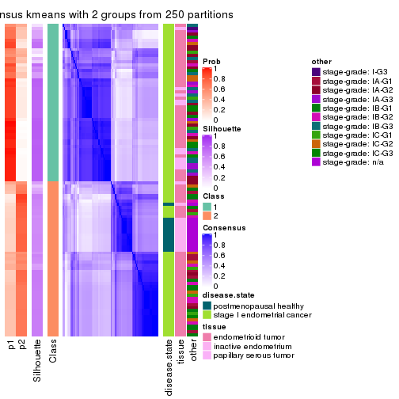</p>

</div>
<div id='tab-CV-kmeans-consensus-heatmap-2'>
<pre><code class="r">consensus_heatmap(res, k = 3)
</code></pre>

<p>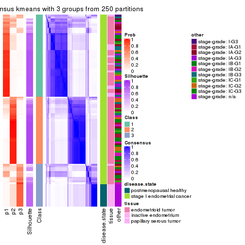</p>

</div>
<div id='tab-CV-kmeans-consensus-heatmap-3'>
<pre><code class="r">consensus_heatmap(res, k = 4)
</code></pre>

<p>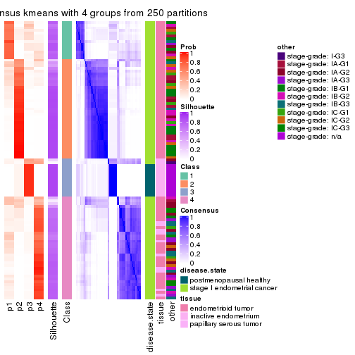</p>

</div>
<div id='tab-CV-kmeans-consensus-heatmap-4'>
<pre><code class="r">consensus_heatmap(res, k = 5)
</code></pre>

<p>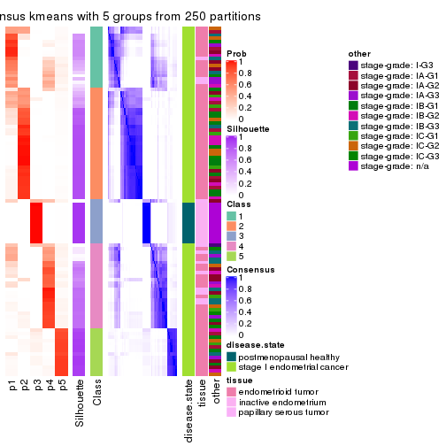</p>

</div>
<div id='tab-CV-kmeans-consensus-heatmap-5'>
<pre><code class="r">consensus_heatmap(res, k = 6)
</code></pre>

<p>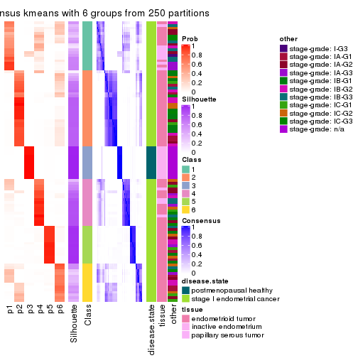</p>

</div>
</div>

Heatmaps for the membership of samples in all partitions to see how consistent they are:


<script>
$( function() {
	$( '#tabs-CV-kmeans-membership-heatmap' ).tabs();
} );
</script>
<div id='tabs-CV-kmeans-membership-heatmap'>
<ul>
<li><a href='#tab-CV-kmeans-membership-heatmap-1'>k = 2</a></li>
<li><a href='#tab-CV-kmeans-membership-heatmap-2'>k = 3</a></li>
<li><a href='#tab-CV-kmeans-membership-heatmap-3'>k = 4</a></li>
<li><a href='#tab-CV-kmeans-membership-heatmap-4'>k = 5</a></li>
<li><a href='#tab-CV-kmeans-membership-heatmap-5'>k = 6</a></li>
</ul>
<div id='tab-CV-kmeans-membership-heatmap-1'>
<pre><code class="r">membership_heatmap(res, k = 2)
</code></pre>

<p>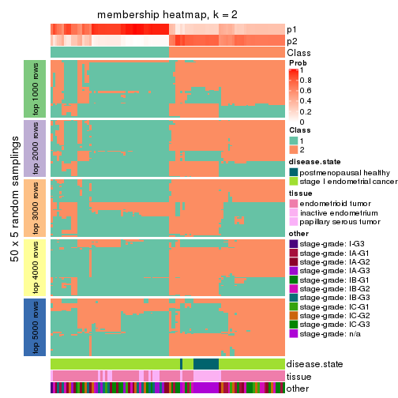</p>

</div>
<div id='tab-CV-kmeans-membership-heatmap-2'>
<pre><code class="r">membership_heatmap(res, k = 3)
</code></pre>

<p>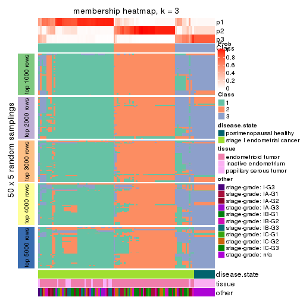</p>

</div>
<div id='tab-CV-kmeans-membership-heatmap-3'>
<pre><code class="r">membership_heatmap(res, k = 4)
</code></pre>

<p>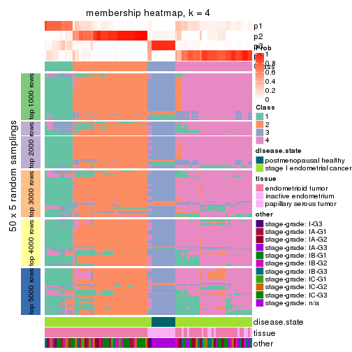</p>

</div>
<div id='tab-CV-kmeans-membership-heatmap-4'>
<pre><code class="r">membership_heatmap(res, k = 5)
</code></pre>

<p>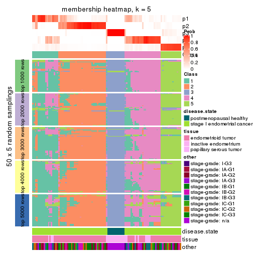</p>

</div>
<div id='tab-CV-kmeans-membership-heatmap-5'>
<pre><code class="r">membership_heatmap(res, k = 6)
</code></pre>

<p>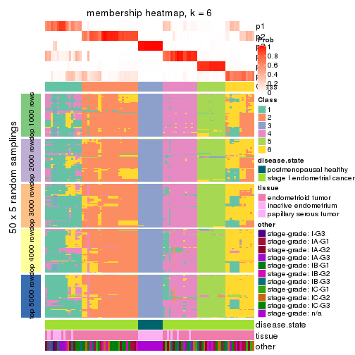</p>

</div>
</div>

As soon as we have had the classes for columns, we can look for signatures
which are significantly different between classes which can be candidate marks
for certain classes. Following are the heatmaps for signatures.


Signature heatmaps where rows are scaled:


<script>
$( function() {
	$( '#tabs-CV-kmeans-get-signatures' ).tabs();
} );
</script>
<div id='tabs-CV-kmeans-get-signatures'>
<ul>
<li><a href='#tab-CV-kmeans-get-signatures-1'>k = 2</a></li>
<li><a href='#tab-CV-kmeans-get-signatures-2'>k = 3</a></li>
<li><a href='#tab-CV-kmeans-get-signatures-3'>k = 4</a></li>
<li><a href='#tab-CV-kmeans-get-signatures-4'>k = 5</a></li>
<li><a href='#tab-CV-kmeans-get-signatures-5'>k = 6</a></li>
</ul>
<div id='tab-CV-kmeans-get-signatures-1'>
<pre><code class="r">get_signatures(res, k = 2)
</code></pre>

<p>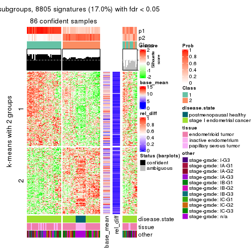</p>

</div>
<div id='tab-CV-kmeans-get-signatures-2'>
<pre><code class="r">get_signatures(res, k = 3)
</code></pre>

<p>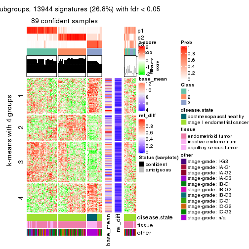</p>

</div>
<div id='tab-CV-kmeans-get-signatures-3'>
<pre><code class="r">get_signatures(res, k = 4)
</code></pre>

<p>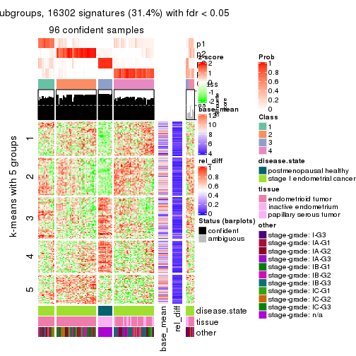</p>

</div>
<div id='tab-CV-kmeans-get-signatures-4'>
<pre><code class="r">get_signatures(res, k = 5)
</code></pre>

<p>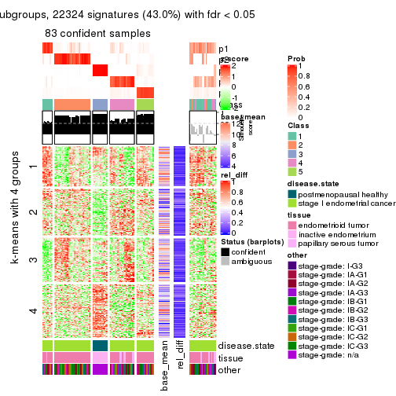</p>

</div>
<div id='tab-CV-kmeans-get-signatures-5'>
<pre><code class="r">get_signatures(res, k = 6)
</code></pre>

<p>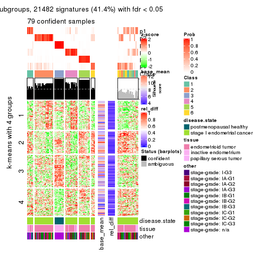</p>

</div>
</div>


Signature heatmaps where rows are not scaled:


<script>
$( function() {
	$( '#tabs-CV-kmeans-get-signatures-no-scale' ).tabs();
} );
</script>
<div id='tabs-CV-kmeans-get-signatures-no-scale'>
<ul>
<li><a href='#tab-CV-kmeans-get-signatures-no-scale-1'>k = 2</a></li>
<li><a href='#tab-CV-kmeans-get-signatures-no-scale-2'>k = 3</a></li>
<li><a href='#tab-CV-kmeans-get-signatures-no-scale-3'>k = 4</a></li>
<li><a href='#tab-CV-kmeans-get-signatures-no-scale-4'>k = 5</a></li>
<li><a href='#tab-CV-kmeans-get-signatures-no-scale-5'>k = 6</a></li>
</ul>
<div id='tab-CV-kmeans-get-signatures-no-scale-1'>
<pre><code class="r">get_signatures(res, k = 2, scale_rows = FALSE)
</code></pre>

<p>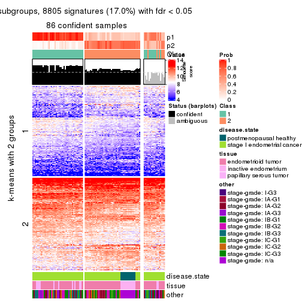</p>

</div>
<div id='tab-CV-kmeans-get-signatures-no-scale-2'>
<pre><code class="r">get_signatures(res, k = 3, scale_rows = FALSE)
</code></pre>

<p>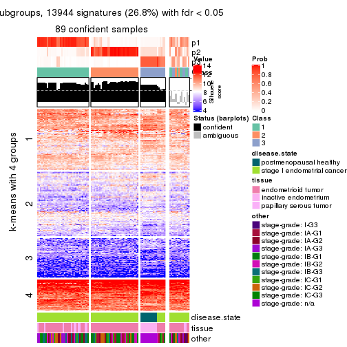</p>

</div>
<div id='tab-CV-kmeans-get-signatures-no-scale-3'>
<pre><code class="r">get_signatures(res, k = 4, scale_rows = FALSE)
</code></pre>

<p>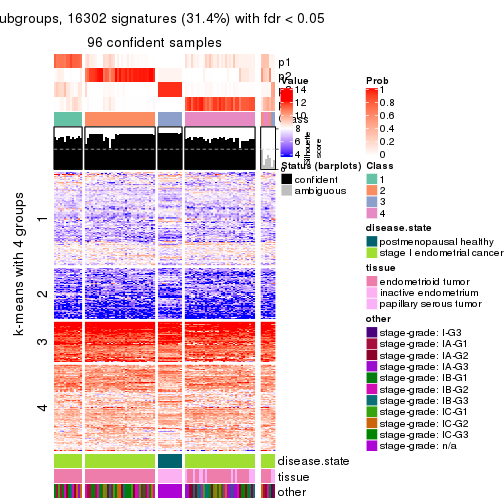</p>

</div>
<div id='tab-CV-kmeans-get-signatures-no-scale-4'>
<pre><code class="r">get_signatures(res, k = 5, scale_rows = FALSE)
</code></pre>

<p>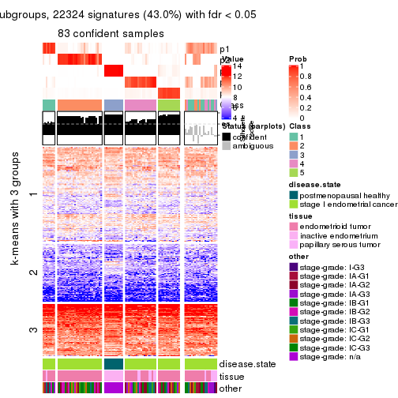</p>

</div>
<div id='tab-CV-kmeans-get-signatures-no-scale-5'>
<pre><code class="r">get_signatures(res, k = 6, scale_rows = FALSE)
</code></pre>

<p>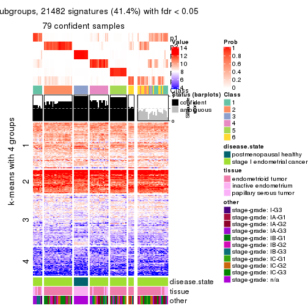</p>

</div>
</div>


Compare the overlap of signatures from different k:

```r
compare_signatures(res)
```

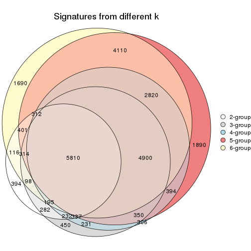

`get_signature()` returns a data frame invisibly. TO get the list of signatures, the function
call should be assigned to a variable explicitly. In following code, if `plot` argument is set
to `FALSE`, no heatmap is plotted while only the differential analysis is performed.

```r
# code only for demonstration
tb = get_signature(res, k = ..., plot = FALSE)
```

An example of the output of `tb` is:

```
#>   which_row         fdr    mean_1    mean_2 scaled_mean_1 scaled_mean_2 km
#> 1        38 0.042760348  8.373488  9.131774    -0.5533452     0.5164555  1
#> 2        40 0.018707592  7.106213  8.469186    -0.6173731     0.5762149  1
#> 3        55 0.019134737 10.221463 11.207825    -0.6159697     0.5749050  1
#> 4        59 0.006059896  5.921854  7.869574    -0.6899429     0.6439467  1
#> 5        60 0.018055526  8.928898 10.211722    -0.6204761     0.5791110  1
#> 6        98 0.009384629 15.714769 14.887706     0.6635654    -0.6193277  2
...
```

The columns in `tb` are:

1. `which_row`: row indices corresponding to the input matrix.
2. `fdr`: FDR for the differential test. 
3. `mean_x`: The mean value in group x.
4. `scaled_mean_x`: The mean value in group x after rows are scaled.
5. `km`: Row groups if k-means clustering is applied to rows.


UMAP plot which shows how samples are separated.


<script>
$( function() {
	$( '#tabs-CV-kmeans-dimension-reduction' ).tabs();
} );
</script>
<div id='tabs-CV-kmeans-dimension-reduction'>
<ul>
<li><a href='#tab-CV-kmeans-dimension-reduction-1'>k = 2</a></li>
<li><a href='#tab-CV-kmeans-dimension-reduction-2'>k = 3</a></li>
<li><a href='#tab-CV-kmeans-dimension-reduction-3'>k = 4</a></li>
<li><a href='#tab-CV-kmeans-dimension-reduction-4'>k = 5</a></li>
<li><a href='#tab-CV-kmeans-dimension-reduction-5'>k = 6</a></li>
</ul>
<div id='tab-CV-kmeans-dimension-reduction-1'>
<pre><code class="r">dimension_reduction(res, k = 2, method = &quot;UMAP&quot;)
</code></pre>

<p>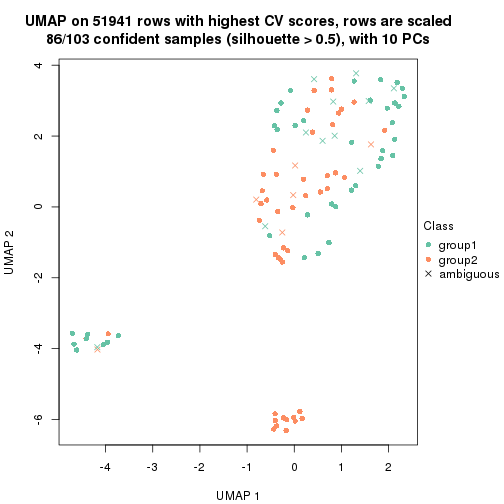</p>

</div>
<div id='tab-CV-kmeans-dimension-reduction-2'>
<pre><code class="r">dimension_reduction(res, k = 3, method = &quot;UMAP&quot;)
</code></pre>

<p>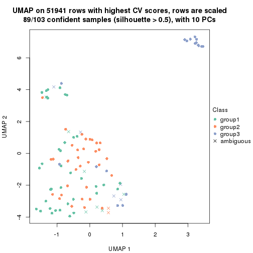</p>

</div>
<div id='tab-CV-kmeans-dimension-reduction-3'>
<pre><code class="r">dimension_reduction(res, k = 4, method = &quot;UMAP&quot;)
</code></pre>

<p>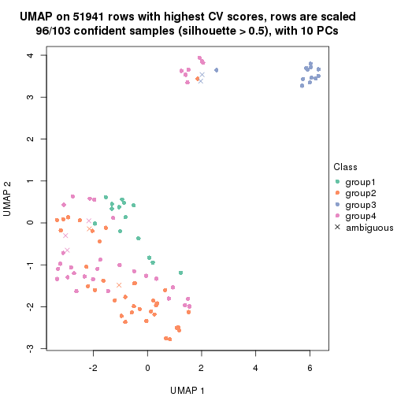</p>

</div>
<div id='tab-CV-kmeans-dimension-reduction-4'>
<pre><code class="r">dimension_reduction(res, k = 5, method = &quot;UMAP&quot;)
</code></pre>

<p>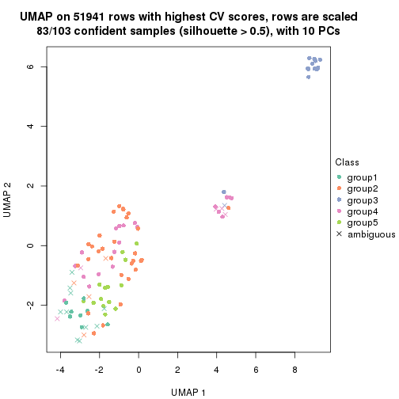</p>

</div>
<div id='tab-CV-kmeans-dimension-reduction-5'>
<pre><code class="r">dimension_reduction(res, k = 6, method = &quot;UMAP&quot;)
</code></pre>

<p>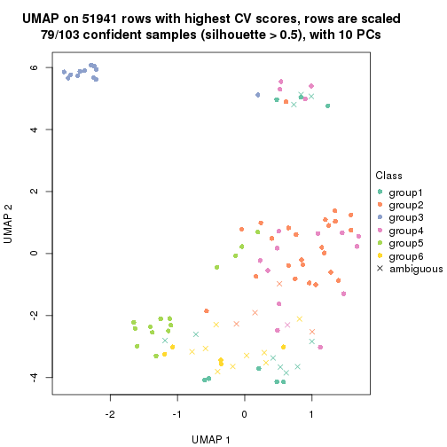</p>

</div>
</div>


Following heatmap shows how subgroups are split when increasing `k`:

```r
collect_classes(res)
```

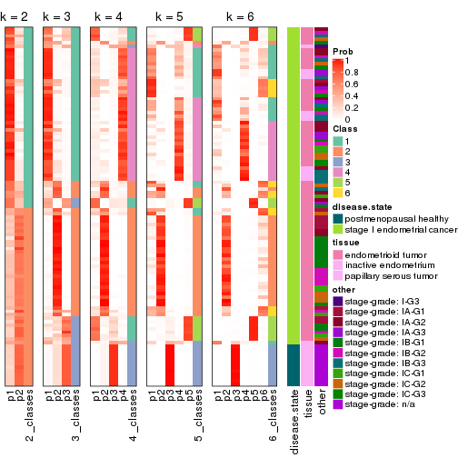


Test correlation between subgroups and known annotations. If the known
annotation is numeric, one-way ANOVA test is applied, and if the known
annotation is discrete, chi-squared contingency table test is applied.

```r
test_to_known_factors(res)
```

```
#>            n disease.state(p) tissue(p) other(p) k
#> CV:kmeans 86         1.14e-03  1.73e-05 9.57e-07 2
#> CV:kmeans 89         1.32e-12  4.99e-14 2.60e-11 3
#> CV:kmeans 96         1.13e-20  2.74e-22 1.24e-15 4
#> CV:kmeans 83         4.03e-17  6.09e-18 1.73e-09 5
#> CV:kmeans 79         1.36e-15  2.24e-17 1.17e-10 6
```


If matrix rows can be associated to genes, consider to use `functional_enrichment(res,
...)` to perform function enrichment for the signature genes. See [this vignette](http://bioconductor.org/packages/devel/bioc/vignettes/cola/inst/doc/functional_enrichment.html) for more detailed explanations.


 

---------------------------------------------------


### CV:skmeans


The object with results only for a single top-value method and a single partition method 
can be extracted as:

```r
res = res_list["CV", "skmeans"]
# you can also extract it by
# res = res_list["CV:skmeans"]
```

A summary of `res` and all the functions that can be applied to it:

```r
res
```

```
#> A 'ConsensusPartition' object with k = 2, 3, 4, 5, 6.
#>   On a matrix with 51941 rows and 103 columns.
#>   Top rows (1000, 2000, 3000, 4000, 5000) are extracted by 'CV' method.
#>   Subgroups are detected by 'skmeans' method.
#>   Performed in total 1250 partitions by row resampling.
#>   Best k for subgroups seems to be 3.
#> 
#> Following methods can be applied to this 'ConsensusPartition' object:
#>  [1] "cola_report"             "collect_classes"         "collect_plots"          
#>  [4] "collect_stats"           "colnames"                "compare_signatures"     
#>  [7] "consensus_heatmap"       "dimension_reduction"     "functional_enrichment"  
#> [10] "get_anno_col"            "get_anno"                "get_classes"            
#> [13] "get_consensus"           "get_matrix"              "get_membership"         
#> [16] "get_param"               "get_signatures"          "get_stats"              
#> [19] "is_best_k"               "is_stable_k"             "membership_heatmap"     
#> [22] "ncol"                    "nrow"                    "plot_ecdf"              
#> [25] "rownames"                "select_partition_number" "show"                   
#> [28] "suggest_best_k"          "test_to_known_factors"
```

`collect_plots()` function collects all the plots made from `res` for all `k` (number of partitions)
into one single page to provide an easy and fast comparison between different `k`.

```r
collect_plots(res)
```

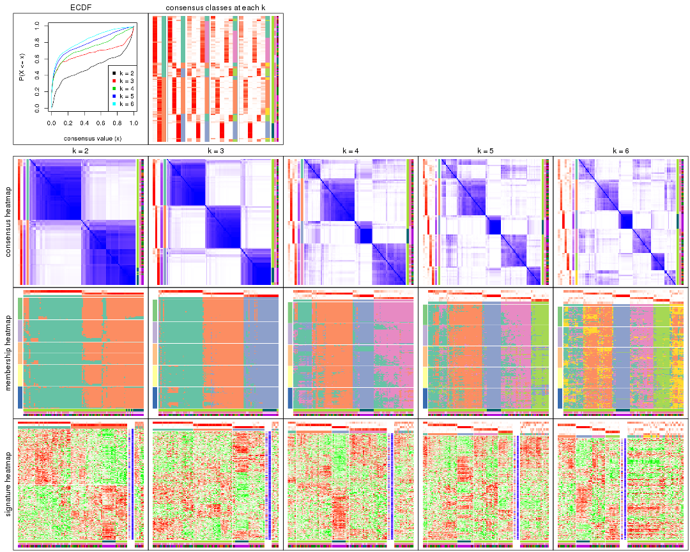

The plots are:

- The first row: a plot of the ECDF (empirical cumulative distribution
  function) curves of the consensus matrix for each `k` and the heatmap of
  predicted classes for each `k`.
- The second row: heatmaps of the consensus matrix for each `k`.
- The third row: heatmaps of the membership matrix for each `k`.
- The fouth row: heatmaps of the signatures for each `k`.

All the plots in panels can be made by individual functions and they are
plotted later in this section.

`select_partition_number()` produces several plots showing different
statistics for choosing "optimized" `k`. There are following statistics:

- ECDF curves of the consensus matrix for each `k`;
- 1-PAC. [The PAC
  score](https://en.wikipedia.org/wiki/Consensus_clustering#Over-interpretation_potential_of_consensus_clustering)
  measures the proportion of the ambiguous subgrouping.
- Mean silhouette score.
- Concordance. The mean probability of fiting the consensus class ids in all
  partitions.
- Area increased. Denote $A_k$ as the area under the ECDF curve for current
  `k`, the area increased is defined as $A_k - A_{k-1}$.
- Rand index. The percent of pairs of samples that are both in a same cluster
  or both are not in a same cluster in the partition of k and k-1.
- Jaccard index. The ratio of pairs of samples are both in a same cluster in
  the partition of k and k-1 and the pairs of samples are both in a same
  cluster in the partition k or k-1.

The detailed explanations of these statistics can be found in [the _cola_
vignette](http://bioconductor.org/packages/devel/bioc/vignettes/cola/inst/doc/cola.html#toc_13).

Generally speaking, lower PAC score, higher mean silhouette score or higher
concordance corresponds to better partition. Rand index and Jaccard index
measure how similar the current partition is compared to partition with `k-1`.
If they are too similar, we won't accept `k` is better than `k-1`.

```r
select_partition_number(res)
```

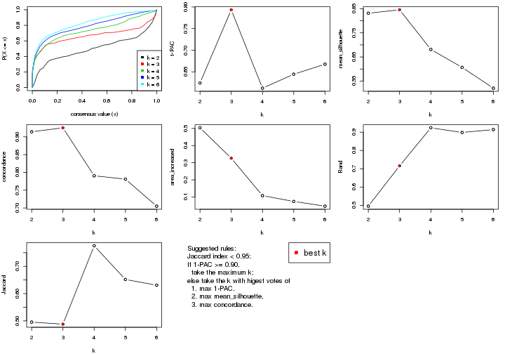

The numeric values for all these statistics can be obtained by `get_stats()`.

```r
get_stats(res)
```

```
#>   k 1-PAC mean_silhouette concordance area_increased  Rand Jaccard
#> 2 2 0.624           0.831       0.914         0.5036 0.496   0.496
#> 3 3 0.793           0.846       0.925         0.3263 0.716   0.488
#> 4 4 0.612           0.681       0.790         0.1080 0.924   0.775
#> 5 5 0.645           0.607       0.781         0.0740 0.898   0.652
#> 6 6 0.668           0.521       0.705         0.0466 0.914   0.631
```

`suggest_best_k()` suggests the best $k$ based on these statistics. The rules are as follows:

- All $k$ with Jaccard index larger than 0.95 are removed because increasing
  $k$ does not provide enough extra information. If all $k$ are removed, it is
  marked as no subgroup is detected.
- For all $k$ with 1-PAC score larger than 0.9, the maximal $k$ is taken as
  the best $k$, and other $k$ are marked as optional $k$.
- If it does not fit the second rule. The $k$ with the maximal vote of the
  highest 1-PAC score, highest mean silhouette, and highest concordance is
  taken as the best $k$.

```r
suggest_best_k(res)
```

```
#> [1] 3
```


Following shows the table of the partitions (You need to click the **show/hide
code output** link to see it). The membership matrix (columns with name `p*`)
is inferred by
[`clue::cl_consensus()`](https://www.rdocumentation.org/link/cl_consensus?package=clue)
function with the `SE` method. Basically the value in the membership matrix
represents the probability to belong to a certain group. The finall class
label for an item is determined with the group with highest probability it
belongs to.

In `get_classes()` function, the entropy is calculated from the membership
matrix and the silhouette score is calculated from the consensus matrix.


<script>
$( function() {
	$( '#tabs-CV-skmeans-get-classes' ).tabs();
} );
</script>
<div id='tabs-CV-skmeans-get-classes'>
<ul>
<li><a href='#tab-CV-skmeans-get-classes-1'>k = 2</a></li>
<li><a href='#tab-CV-skmeans-get-classes-2'>k = 3</a></li>
<li><a href='#tab-CV-skmeans-get-classes-3'>k = 4</a></li>
<li><a href='#tab-CV-skmeans-get-classes-4'>k = 5</a></li>
<li><a href='#tab-CV-skmeans-get-classes-5'>k = 6</a></li>
</ul>

<div id='tab-CV-skmeans-get-classes-1'>
<p><a id='tab-CV-skmeans-get-classes-1-a' style='color:#0366d6' href='#'>show/hide code output</a></p>
<pre><code class="r">cbind(get_classes(res, k = 2), get_membership(res, k = 2))
</code></pre>

<pre><code>#&gt;           class entropy silhouette    p1    p2
#&gt; GSM425907     2  0.0938     0.8928 0.012 0.988
#&gt; GSM425908     2  0.4939     0.8623 0.108 0.892
#&gt; GSM425909     2  0.7950     0.6925 0.240 0.760
#&gt; GSM425910     2  0.9954     0.0887 0.460 0.540
#&gt; GSM425911     2  0.0672     0.8922 0.008 0.992
#&gt; GSM425912     2  0.2236     0.8941 0.036 0.964
#&gt; GSM425913     2  0.2603     0.8886 0.044 0.956
#&gt; GSM425914     2  0.0672     0.8923 0.008 0.992
#&gt; GSM425915     2  0.2236     0.8917 0.036 0.964
#&gt; GSM425874     1  0.1184     0.9212 0.984 0.016
#&gt; GSM425875     1  0.3274     0.8880 0.940 0.060
#&gt; GSM425876     1  0.8909     0.5906 0.692 0.308
#&gt; GSM425877     1  0.0672     0.9187 0.992 0.008
#&gt; GSM425878     1  0.0938     0.9217 0.988 0.012
#&gt; GSM425879     2  0.0672     0.8923 0.008 0.992
#&gt; GSM425880     1  0.4939     0.8466 0.892 0.108
#&gt; GSM425881     2  0.9944     0.2102 0.456 0.544
#&gt; GSM425882     2  0.5737     0.8421 0.136 0.864
#&gt; GSM425883     1  0.1414     0.9200 0.980 0.020
#&gt; GSM425884     1  0.0938     0.9176 0.988 0.012
#&gt; GSM425885     1  0.9170     0.4425 0.668 0.332
#&gt; GSM425848     1  0.0938     0.9217 0.988 0.012
#&gt; GSM425849     1  0.1414     0.9198 0.980 0.020
#&gt; GSM425850     1  0.2423     0.9158 0.960 0.040
#&gt; GSM425851     1  0.0938     0.9179 0.988 0.012
#&gt; GSM425852     1  0.5946     0.8154 0.856 0.144
#&gt; GSM425893     2  0.0376     0.8924 0.004 0.996
#&gt; GSM425894     2  0.4431     0.8719 0.092 0.908
#&gt; GSM425895     2  0.4690     0.8672 0.100 0.900
#&gt; GSM425896     2  0.0672     0.8923 0.008 0.992
#&gt; GSM425897     2  0.0938     0.8928 0.012 0.988
#&gt; GSM425898     2  0.4562     0.8697 0.096 0.904
#&gt; GSM425899     1  0.2603     0.9058 0.956 0.044
#&gt; GSM425900     2  0.4022     0.8773 0.080 0.920
#&gt; GSM425901     2  0.8386     0.6470 0.268 0.732
#&gt; GSM425902     1  0.1184     0.9212 0.984 0.016
#&gt; GSM425903     2  0.1633     0.8918 0.024 0.976
#&gt; GSM425904     1  0.4939     0.8466 0.892 0.108
#&gt; GSM425905     2  0.1414     0.8929 0.020 0.980
#&gt; GSM425906     2  0.2603     0.8887 0.044 0.956
#&gt; GSM425863     1  0.1184     0.9212 0.984 0.016
#&gt; GSM425864     2  0.0672     0.8923 0.008 0.992
#&gt; GSM425865     2  0.3879     0.8786 0.076 0.924
#&gt; GSM425866     1  0.4298     0.8656 0.912 0.088
#&gt; GSM425867     2  0.3114     0.8861 0.056 0.944
#&gt; GSM425868     2  0.9909     0.2732 0.444 0.556
#&gt; GSM425869     2  0.4690     0.8672 0.100 0.900
#&gt; GSM425870     2  0.1184     0.8907 0.016 0.984
#&gt; GSM425871     1  0.2236     0.9107 0.964 0.036
#&gt; GSM425872     2  0.5408     0.8530 0.124 0.876
#&gt; GSM425873     1  0.2603     0.9097 0.956 0.044
#&gt; GSM425843     1  0.0672     0.9187 0.992 0.008
#&gt; GSM425844     1  0.1184     0.9214 0.984 0.016
#&gt; GSM425845     1  0.9954     0.2089 0.540 0.460
#&gt; GSM425846     1  0.4298     0.8777 0.912 0.088
#&gt; GSM425847     1  0.9000     0.5314 0.684 0.316
#&gt; GSM425886     2  0.2423     0.8913 0.040 0.960
#&gt; GSM425887     2  0.8713     0.6347 0.292 0.708
#&gt; GSM425888     1  0.9522     0.3940 0.628 0.372
#&gt; GSM425889     1  0.0938     0.9216 0.988 0.012
#&gt; GSM425890     1  0.1184     0.9212 0.984 0.016
#&gt; GSM425891     2  0.0938     0.8929 0.012 0.988
#&gt; GSM425892     2  0.4431     0.8729 0.092 0.908
#&gt; GSM425853     1  0.2423     0.9016 0.960 0.040
#&gt; GSM425854     2  0.4939     0.8624 0.108 0.892
#&gt; GSM425855     1  0.0672     0.9217 0.992 0.008
#&gt; GSM425856     1  0.3431     0.8845 0.936 0.064
#&gt; GSM425857     2  0.9815     0.2970 0.420 0.580
#&gt; GSM425858     2  0.6712     0.8035 0.176 0.824
#&gt; GSM425859     2  0.4690     0.8672 0.100 0.900
#&gt; GSM425860     2  0.3274     0.8820 0.060 0.940
#&gt; GSM425861     1  0.4690     0.8651 0.900 0.100
#&gt; GSM425862     1  0.1184     0.9212 0.984 0.016
#&gt; GSM425837     1  0.0376     0.9200 0.996 0.004
#&gt; GSM425838     1  0.1184     0.9212 0.984 0.016
#&gt; GSM425839     2  0.4690     0.8672 0.100 0.900
#&gt; GSM425840     1  0.0938     0.9201 0.988 0.012
#&gt; GSM425841     1  0.1184     0.9212 0.984 0.016
#&gt; GSM425842     1  0.2043     0.9154 0.968 0.032
#&gt; GSM425917     2  0.7815     0.7294 0.232 0.768
#&gt; GSM425922     1  0.1184     0.9212 0.984 0.016
#&gt; GSM425919     1  0.0938     0.9179 0.988 0.012
#&gt; GSM425920     1  0.0672     0.9187 0.992 0.008
#&gt; GSM425923     1  0.0376     0.9215 0.996 0.004
#&gt; GSM425916     1  0.0672     0.9187 0.992 0.008
#&gt; GSM425918     1  0.0000     0.9208 1.000 0.000
#&gt; GSM425921     1  0.1184     0.9212 0.984 0.016
#&gt; GSM425925     1  0.1184     0.9212 0.984 0.016
#&gt; GSM425926     1  0.1184     0.9212 0.984 0.016
#&gt; GSM425927     1  0.1184     0.9197 0.984 0.016
#&gt; GSM425924     1  0.9881     0.2508 0.564 0.436
#&gt; GSM425928     2  0.2603     0.8904 0.044 0.956
#&gt; GSM425929     2  0.2603     0.8904 0.044 0.956
#&gt; GSM425930     2  0.2423     0.8913 0.040 0.960
#&gt; GSM425931     2  0.2603     0.8904 0.044 0.956
#&gt; GSM425932     2  0.2236     0.8917 0.036 0.964
#&gt; GSM425933     2  0.2603     0.8904 0.044 0.956
#&gt; GSM425934     2  0.1843     0.8920 0.028 0.972
#&gt; GSM425935     2  0.2043     0.8928 0.032 0.968
#&gt; GSM425936     2  0.2236     0.8917 0.036 0.964
#&gt; GSM425937     2  0.2603     0.8904 0.044 0.956
#&gt; GSM425938     2  0.2603     0.8904 0.044 0.956
#&gt; GSM425939     2  0.2603     0.8904 0.044 0.956
</code></pre>

<script>
$('#tab-CV-skmeans-get-classes-1-a').parent().next().next().hide();
$('#tab-CV-skmeans-get-classes-1-a').click(function(){
  $('#tab-CV-skmeans-get-classes-1-a').parent().next().next().toggle();
  return(false);
});
</script>
</div>

<div id='tab-CV-skmeans-get-classes-2'>
<p><a id='tab-CV-skmeans-get-classes-2-a' style='color:#0366d6' href='#'>show/hide code output</a></p>
<pre><code class="r">cbind(get_classes(res, k = 3), get_membership(res, k = 3))
</code></pre>

<pre><code>#&gt;           class entropy silhouette    p1    p2    p3
#&gt; GSM425907     2  0.0424     0.9359 0.000 0.992 0.008
#&gt; GSM425908     2  0.0237     0.9365 0.004 0.996 0.000
#&gt; GSM425909     3  0.0424     0.9013 0.000 0.008 0.992
#&gt; GSM425910     3  0.9901     0.0985 0.268 0.348 0.384
#&gt; GSM425911     2  0.3340     0.8538 0.000 0.880 0.120
#&gt; GSM425912     2  0.2945     0.8901 0.088 0.908 0.004
#&gt; GSM425913     2  0.0237     0.9371 0.000 0.996 0.004
#&gt; GSM425914     2  0.4423     0.8630 0.048 0.864 0.088
#&gt; GSM425915     3  0.0000     0.9039 0.000 0.000 1.000
#&gt; GSM425874     1  0.3038     0.8738 0.896 0.104 0.000
#&gt; GSM425875     1  0.6267     0.0659 0.548 0.000 0.452
#&gt; GSM425876     1  0.8472     0.2448 0.540 0.360 0.100
#&gt; GSM425877     1  0.0237     0.9148 0.996 0.000 0.004
#&gt; GSM425878     1  0.0000     0.9151 1.000 0.000 0.000
#&gt; GSM425879     2  0.1643     0.9206 0.000 0.956 0.044
#&gt; GSM425880     3  0.3116     0.8462 0.108 0.000 0.892
#&gt; GSM425881     2  0.2590     0.9034 0.072 0.924 0.004
#&gt; GSM425882     2  0.0237     0.9372 0.004 0.996 0.000
#&gt; GSM425883     1  0.3933     0.8435 0.880 0.092 0.028
#&gt; GSM425884     1  0.0000     0.9151 1.000 0.000 0.000
#&gt; GSM425885     1  0.7021     0.2773 0.544 0.436 0.020
#&gt; GSM425848     1  0.1989     0.9034 0.948 0.048 0.004
#&gt; GSM425849     1  0.0424     0.9157 0.992 0.008 0.000
#&gt; GSM425850     1  0.1529     0.9013 0.960 0.040 0.000
#&gt; GSM425851     1  0.1529     0.9010 0.960 0.000 0.040
#&gt; GSM425852     3  0.1860     0.8820 0.052 0.000 0.948
#&gt; GSM425893     2  0.5431     0.6174 0.000 0.716 0.284
#&gt; GSM425894     2  0.0424     0.9359 0.000 0.992 0.008
#&gt; GSM425895     2  0.0000     0.9371 0.000 1.000 0.000
#&gt; GSM425896     2  0.2066     0.9033 0.000 0.940 0.060
#&gt; GSM425897     2  0.0892     0.9326 0.000 0.980 0.020
#&gt; GSM425898     2  0.0000     0.9371 0.000 1.000 0.000
#&gt; GSM425899     2  0.6225     0.1435 0.432 0.568 0.000
#&gt; GSM425900     2  0.0829     0.9358 0.004 0.984 0.012
#&gt; GSM425901     3  0.0424     0.9013 0.000 0.008 0.992
#&gt; GSM425902     1  0.3412     0.8600 0.876 0.124 0.000
#&gt; GSM425903     3  0.0237     0.9026 0.004 0.000 0.996
#&gt; GSM425904     3  0.2796     0.8576 0.092 0.000 0.908
#&gt; GSM425905     2  0.0000     0.9371 0.000 1.000 0.000
#&gt; GSM425906     2  0.1482     0.9305 0.012 0.968 0.020
#&gt; GSM425863     1  0.0000     0.9151 1.000 0.000 0.000
#&gt; GSM425864     2  0.0424     0.9365 0.000 0.992 0.008
#&gt; GSM425865     2  0.0000     0.9371 0.000 1.000 0.000
#&gt; GSM425866     3  0.5956     0.5627 0.324 0.004 0.672
#&gt; GSM425867     3  0.0000     0.9039 0.000 0.000 1.000
#&gt; GSM425868     2  0.0892     0.9288 0.020 0.980 0.000
#&gt; GSM425869     2  0.0000     0.9371 0.000 1.000 0.000
#&gt; GSM425870     3  0.4555     0.7087 0.000 0.200 0.800
#&gt; GSM425871     1  0.0000     0.9151 1.000 0.000 0.000
#&gt; GSM425872     2  0.0237     0.9371 0.000 0.996 0.004
#&gt; GSM425873     1  0.5070     0.6783 0.772 0.224 0.004
#&gt; GSM425843     1  0.0000     0.9151 1.000 0.000 0.000
#&gt; GSM425844     1  0.0592     0.9152 0.988 0.012 0.000
#&gt; GSM425845     3  0.3272     0.8627 0.080 0.016 0.904
#&gt; GSM425846     2  0.0424     0.9367 0.008 0.992 0.000
#&gt; GSM425847     2  0.4555     0.7784 0.200 0.800 0.000
#&gt; GSM425886     3  0.0237     0.9025 0.000 0.004 0.996
#&gt; GSM425887     2  0.2866     0.8989 0.076 0.916 0.008
#&gt; GSM425888     2  0.2772     0.8973 0.080 0.916 0.004
#&gt; GSM425889     1  0.0829     0.9138 0.984 0.004 0.012
#&gt; GSM425890     1  0.2356     0.8929 0.928 0.072 0.000
#&gt; GSM425891     2  0.0829     0.9358 0.004 0.984 0.012
#&gt; GSM425892     2  0.0000     0.9371 0.000 1.000 0.000
#&gt; GSM425853     1  0.1411     0.8997 0.964 0.000 0.036
#&gt; GSM425854     2  0.0000     0.9371 0.000 1.000 0.000
#&gt; GSM425855     1  0.0000     0.9151 1.000 0.000 0.000
#&gt; GSM425856     3  0.6180     0.3450 0.416 0.000 0.584
#&gt; GSM425857     3  0.3967     0.8501 0.044 0.072 0.884
#&gt; GSM425858     2  0.1267     0.9303 0.024 0.972 0.004
#&gt; GSM425859     2  0.0000     0.9371 0.000 1.000 0.000
#&gt; GSM425860     3  0.6495     0.6769 0.060 0.200 0.740
#&gt; GSM425861     2  0.5016     0.7196 0.240 0.760 0.000
#&gt; GSM425862     1  0.1163     0.9114 0.972 0.028 0.000
#&gt; GSM425837     1  0.0000     0.9151 1.000 0.000 0.000
#&gt; GSM425838     1  0.3412     0.8588 0.876 0.124 0.000
#&gt; GSM425839     2  0.0000     0.9371 0.000 1.000 0.000
#&gt; GSM425840     1  0.0000     0.9151 1.000 0.000 0.000
#&gt; GSM425841     1  0.3038     0.8739 0.896 0.104 0.000
#&gt; GSM425842     1  0.0747     0.9115 0.984 0.016 0.000
#&gt; GSM425917     3  0.6193     0.5715 0.292 0.016 0.692
#&gt; GSM425922     1  0.2711     0.8842 0.912 0.088 0.000
#&gt; GSM425919     1  0.2682     0.8682 0.920 0.004 0.076
#&gt; GSM425920     1  0.0000     0.9151 1.000 0.000 0.000
#&gt; GSM425923     1  0.0237     0.9148 0.996 0.000 0.004
#&gt; GSM425916     1  0.0424     0.9141 0.992 0.000 0.008
#&gt; GSM425918     1  0.0000     0.9151 1.000 0.000 0.000
#&gt; GSM425921     1  0.2356     0.8928 0.928 0.072 0.000
#&gt; GSM425925     1  0.0747     0.9149 0.984 0.016 0.000
#&gt; GSM425926     1  0.2796     0.8816 0.908 0.092 0.000
#&gt; GSM425927     1  0.0000     0.9151 1.000 0.000 0.000
#&gt; GSM425924     3  0.4291     0.7623 0.180 0.000 0.820
#&gt; GSM425928     3  0.0000     0.9039 0.000 0.000 1.000
#&gt; GSM425929     3  0.0000     0.9039 0.000 0.000 1.000
#&gt; GSM425930     3  0.0000     0.9039 0.000 0.000 1.000
#&gt; GSM425931     3  0.0000     0.9039 0.000 0.000 1.000
#&gt; GSM425932     3  0.0000     0.9039 0.000 0.000 1.000
#&gt; GSM425933     3  0.0000     0.9039 0.000 0.000 1.000
#&gt; GSM425934     3  0.0000     0.9039 0.000 0.000 1.000
#&gt; GSM425935     3  0.0000     0.9039 0.000 0.000 1.000
#&gt; GSM425936     3  0.0000     0.9039 0.000 0.000 1.000
#&gt; GSM425937     3  0.0000     0.9039 0.000 0.000 1.000
#&gt; GSM425938     3  0.0000     0.9039 0.000 0.000 1.000
#&gt; GSM425939     3  0.0000     0.9039 0.000 0.000 1.000
</code></pre>

<script>
$('#tab-CV-skmeans-get-classes-2-a').parent().next().next().hide();
$('#tab-CV-skmeans-get-classes-2-a').click(function(){
  $('#tab-CV-skmeans-get-classes-2-a').parent().next().next().toggle();
  return(false);
});
</script>
</div>

<div id='tab-CV-skmeans-get-classes-3'>
<p><a id='tab-CV-skmeans-get-classes-3-a' style='color:#0366d6' href='#'>show/hide code output</a></p>
<pre><code class="r">cbind(get_classes(res, k = 4), get_membership(res, k = 4))
</code></pre>

<pre><code>#&gt;           class entropy silhouette    p1    p2    p3    p4
#&gt; GSM425907     2  0.0376     0.8624 0.004 0.992 0.000 0.004
#&gt; GSM425908     2  0.0376     0.8624 0.004 0.992 0.000 0.004
#&gt; GSM425909     1  0.6421     0.4293 0.560 0.020 0.384 0.036
#&gt; GSM425910     1  0.7224     0.3865 0.660 0.156 0.104 0.080
#&gt; GSM425911     2  0.5332     0.7156 0.124 0.748 0.128 0.000
#&gt; GSM425912     2  0.5169     0.7457 0.212 0.744 0.020 0.024
#&gt; GSM425913     2  0.1767     0.8617 0.044 0.944 0.012 0.000
#&gt; GSM425914     2  0.6078     0.6943 0.204 0.692 0.096 0.008
#&gt; GSM425915     3  0.5396    -0.1786 0.464 0.012 0.524 0.000
#&gt; GSM425874     4  0.2926     0.7550 0.048 0.056 0.000 0.896
#&gt; GSM425875     1  0.5471     0.5822 0.724 0.004 0.064 0.208
#&gt; GSM425876     1  0.7577     0.2157 0.600 0.200 0.040 0.160
#&gt; GSM425877     4  0.2593     0.7971 0.104 0.000 0.004 0.892
#&gt; GSM425878     4  0.4564     0.7002 0.328 0.000 0.000 0.672
#&gt; GSM425879     2  0.1256     0.8636 0.028 0.964 0.008 0.000
#&gt; GSM425880     1  0.6214     0.5961 0.676 0.008 0.220 0.096
#&gt; GSM425881     2  0.4123     0.7673 0.220 0.772 0.000 0.008
#&gt; GSM425882     2  0.1022     0.8655 0.032 0.968 0.000 0.000
#&gt; GSM425883     4  0.5561     0.7225 0.128 0.028 0.080 0.764
#&gt; GSM425884     4  0.5137     0.5457 0.452 0.000 0.004 0.544
#&gt; GSM425885     4  0.6253     0.5082 0.088 0.240 0.008 0.664
#&gt; GSM425848     4  0.4137     0.7224 0.140 0.028 0.008 0.824
#&gt; GSM425849     4  0.3908     0.7700 0.212 0.004 0.000 0.784
#&gt; GSM425850     4  0.5851     0.5339 0.456 0.024 0.004 0.516
#&gt; GSM425851     4  0.4465     0.7728 0.144 0.000 0.056 0.800
#&gt; GSM425852     1  0.6290     0.4518 0.568 0.000 0.364 0.068
#&gt; GSM425893     2  0.7414     0.0641 0.340 0.480 0.180 0.000
#&gt; GSM425894     2  0.0707     0.8620 0.000 0.980 0.000 0.020
#&gt; GSM425895     2  0.0469     0.8645 0.012 0.988 0.000 0.000
#&gt; GSM425896     2  0.4285     0.7567 0.068 0.832 0.092 0.008
#&gt; GSM425897     2  0.1297     0.8613 0.016 0.964 0.020 0.000
#&gt; GSM425898     2  0.0524     0.8641 0.004 0.988 0.000 0.008
#&gt; GSM425899     2  0.6882     0.1725 0.108 0.500 0.000 0.392
#&gt; GSM425900     2  0.2876     0.8449 0.092 0.892 0.008 0.008
#&gt; GSM425901     1  0.6828     0.4581 0.564 0.032 0.356 0.048
#&gt; GSM425902     4  0.3611     0.7386 0.060 0.080 0.000 0.860
#&gt; GSM425903     1  0.5311     0.3991 0.596 0.004 0.392 0.008
#&gt; GSM425904     1  0.6478     0.5817 0.644 0.008 0.248 0.100
#&gt; GSM425905     2  0.0469     0.8636 0.012 0.988 0.000 0.000
#&gt; GSM425906     2  0.2983     0.8392 0.108 0.880 0.004 0.008
#&gt; GSM425863     4  0.3528     0.7800 0.192 0.000 0.000 0.808
#&gt; GSM425864     2  0.1109     0.8638 0.028 0.968 0.004 0.000
#&gt; GSM425865     2  0.0592     0.8644 0.016 0.984 0.000 0.000
#&gt; GSM425866     1  0.5459     0.6157 0.748 0.004 0.120 0.128
#&gt; GSM425867     3  0.4643     0.2444 0.344 0.000 0.656 0.000
#&gt; GSM425868     2  0.2593     0.8070 0.004 0.892 0.000 0.104
#&gt; GSM425869     2  0.0817     0.8603 0.000 0.976 0.000 0.024
#&gt; GSM425870     3  0.5171     0.5644 0.112 0.128 0.760 0.000
#&gt; GSM425871     4  0.4252     0.7448 0.252 0.004 0.000 0.744
#&gt; GSM425872     2  0.1771     0.8640 0.036 0.948 0.004 0.012
#&gt; GSM425873     1  0.7650    -0.1183 0.512 0.172 0.012 0.304
#&gt; GSM425843     4  0.4643     0.6745 0.344 0.000 0.000 0.656
#&gt; GSM425844     4  0.4377     0.7723 0.188 0.008 0.016 0.788
#&gt; GSM425845     1  0.4088     0.5774 0.824 0.008 0.144 0.024
#&gt; GSM425846     2  0.3037     0.8456 0.076 0.888 0.000 0.036
#&gt; GSM425847     2  0.7224     0.3255 0.408 0.480 0.012 0.100
#&gt; GSM425886     1  0.6062     0.2807 0.512 0.028 0.452 0.008
#&gt; GSM425887     2  0.4333     0.7736 0.208 0.776 0.008 0.008
#&gt; GSM425888     2  0.4951     0.7377 0.212 0.744 0.000 0.044
#&gt; GSM425889     4  0.2081     0.7798 0.084 0.000 0.000 0.916
#&gt; GSM425890     4  0.2231     0.7776 0.012 0.044 0.012 0.932
#&gt; GSM425891     2  0.1938     0.8606 0.052 0.936 0.012 0.000
#&gt; GSM425892     2  0.0779     0.8616 0.004 0.980 0.000 0.016
#&gt; GSM425853     1  0.4936     0.1005 0.672 0.000 0.012 0.316
#&gt; GSM425854     2  0.0188     0.8631 0.000 0.996 0.000 0.004
#&gt; GSM425855     4  0.2408     0.7991 0.104 0.000 0.000 0.896
#&gt; GSM425856     1  0.5368     0.6114 0.752 0.004 0.096 0.148
#&gt; GSM425857     1  0.8160     0.5169 0.552 0.072 0.240 0.136
#&gt; GSM425858     2  0.2401     0.8477 0.092 0.904 0.000 0.004
#&gt; GSM425859     2  0.0188     0.8625 0.004 0.996 0.000 0.000
#&gt; GSM425860     3  0.5649     0.3667 0.344 0.036 0.620 0.000
#&gt; GSM425861     2  0.7232     0.3975 0.320 0.516 0.000 0.164
#&gt; GSM425862     4  0.1637     0.7819 0.060 0.000 0.000 0.940
#&gt; GSM425837     4  0.4585     0.6839 0.332 0.000 0.000 0.668
#&gt; GSM425838     4  0.3647     0.7289 0.040 0.108 0.000 0.852
#&gt; GSM425839     2  0.0000     0.8628 0.000 1.000 0.000 0.000
#&gt; GSM425840     4  0.3688     0.7718 0.208 0.000 0.000 0.792
#&gt; GSM425841     4  0.3009     0.7572 0.052 0.056 0.000 0.892
#&gt; GSM425842     4  0.5897     0.4969 0.468 0.020 0.008 0.504
#&gt; GSM425917     3  0.4978     0.5850 0.052 0.004 0.764 0.180
#&gt; GSM425922     4  0.1936     0.7799 0.032 0.028 0.000 0.940
#&gt; GSM425919     4  0.7317     0.5003 0.268 0.000 0.204 0.528
#&gt; GSM425920     4  0.4472     0.7545 0.220 0.000 0.020 0.760
#&gt; GSM425923     4  0.2011     0.7963 0.080 0.000 0.000 0.920
#&gt; GSM425916     4  0.3161     0.7894 0.124 0.000 0.012 0.864
#&gt; GSM425918     4  0.2197     0.7953 0.080 0.000 0.004 0.916
#&gt; GSM425921     4  0.1833     0.7749 0.032 0.024 0.000 0.944
#&gt; GSM425925     4  0.2198     0.7938 0.072 0.008 0.000 0.920
#&gt; GSM425926     4  0.2411     0.7658 0.040 0.040 0.000 0.920
#&gt; GSM425927     4  0.4877     0.6180 0.408 0.000 0.000 0.592
#&gt; GSM425924     3  0.5003     0.5943 0.084 0.000 0.768 0.148
#&gt; GSM425928     3  0.0000     0.8421 0.000 0.000 1.000 0.000
#&gt; GSM425929     3  0.0000     0.8421 0.000 0.000 1.000 0.000
#&gt; GSM425930     3  0.0000     0.8421 0.000 0.000 1.000 0.000
#&gt; GSM425931     3  0.0000     0.8421 0.000 0.000 1.000 0.000
#&gt; GSM425932     3  0.0000     0.8421 0.000 0.000 1.000 0.000
#&gt; GSM425933     3  0.0000     0.8421 0.000 0.000 1.000 0.000
#&gt; GSM425934     3  0.0000     0.8421 0.000 0.000 1.000 0.000
#&gt; GSM425935     3  0.0000     0.8421 0.000 0.000 1.000 0.000
#&gt; GSM425936     3  0.0000     0.8421 0.000 0.000 1.000 0.000
#&gt; GSM425937     3  0.0000     0.8421 0.000 0.000 1.000 0.000
#&gt; GSM425938     3  0.0000     0.8421 0.000 0.000 1.000 0.000
#&gt; GSM425939     3  0.0000     0.8421 0.000 0.000 1.000 0.000
</code></pre>

<script>
$('#tab-CV-skmeans-get-classes-3-a').parent().next().next().hide();
$('#tab-CV-skmeans-get-classes-3-a').click(function(){
  $('#tab-CV-skmeans-get-classes-3-a').parent().next().next().toggle();
  return(false);
});
</script>
</div>

<div id='tab-CV-skmeans-get-classes-4'>
<p><a id='tab-CV-skmeans-get-classes-4-a' style='color:#0366d6' href='#'>show/hide code output</a></p>
<pre><code class="r">cbind(get_classes(res, k = 5), get_membership(res, k = 5))
</code></pre>

<pre><code>#&gt;           class entropy silhouette    p1    p2    p3    p4    p5
#&gt; GSM425907     2  0.1153     0.7912 0.008 0.964 0.004 0.024 0.000
#&gt; GSM425908     2  0.2263     0.7864 0.020 0.916 0.004 0.056 0.004
#&gt; GSM425909     5  0.2722     0.8311 0.000 0.020 0.108 0.000 0.872
#&gt; GSM425910     1  0.4552     0.5262 0.796 0.020 0.056 0.016 0.112
#&gt; GSM425911     2  0.6383     0.5784 0.180 0.640 0.084 0.000 0.096
#&gt; GSM425912     1  0.4738    -0.1221 0.564 0.420 0.004 0.000 0.012
#&gt; GSM425913     2  0.3129     0.7632 0.156 0.832 0.004 0.008 0.000
#&gt; GSM425914     2  0.6238     0.2930 0.404 0.500 0.052 0.000 0.044
#&gt; GSM425915     5  0.4066     0.6399 0.004 0.000 0.324 0.000 0.672
#&gt; GSM425874     4  0.2264     0.7121 0.004 0.060 0.000 0.912 0.024
#&gt; GSM425875     5  0.2326     0.8052 0.020 0.000 0.020 0.044 0.916
#&gt; GSM425876     1  0.1990     0.5511 0.920 0.008 0.000 0.004 0.068
#&gt; GSM425877     4  0.4455     0.6724 0.188 0.000 0.000 0.744 0.068
#&gt; GSM425878     1  0.6603    -0.0797 0.480 0.012 0.000 0.352 0.156
#&gt; GSM425879     2  0.2353     0.7982 0.028 0.920 0.032 0.008 0.012
#&gt; GSM425880     5  0.2341     0.8296 0.012 0.000 0.056 0.020 0.912
#&gt; GSM425881     1  0.4829    -0.2785 0.500 0.480 0.000 0.000 0.020
#&gt; GSM425882     2  0.3588     0.7711 0.144 0.824 0.004 0.008 0.020
#&gt; GSM425883     4  0.6273     0.6048 0.188 0.040 0.048 0.672 0.052
#&gt; GSM425884     1  0.6567     0.2082 0.524 0.000 0.008 0.236 0.232
#&gt; GSM425885     4  0.5235     0.5076 0.004 0.244 0.004 0.676 0.072
#&gt; GSM425848     4  0.4903     0.5921 0.036 0.012 0.000 0.680 0.272
#&gt; GSM425849     4  0.5702     0.5628 0.268 0.012 0.000 0.628 0.092
#&gt; GSM425850     1  0.4331     0.4862 0.780 0.008 0.000 0.140 0.072
#&gt; GSM425851     4  0.6495     0.3946 0.340 0.000 0.068 0.536 0.056
#&gt; GSM425852     5  0.4746     0.7758 0.048 0.000 0.164 0.032 0.756
#&gt; GSM425893     2  0.7757     0.0780 0.108 0.408 0.140 0.000 0.344
#&gt; GSM425894     2  0.2291     0.7801 0.008 0.908 0.000 0.072 0.012
#&gt; GSM425895     2  0.1974     0.7986 0.036 0.932 0.000 0.016 0.016
#&gt; GSM425896     2  0.4244     0.7266 0.020 0.824 0.052 0.024 0.080
#&gt; GSM425897     2  0.2910     0.7817 0.044 0.884 0.060 0.000 0.012
#&gt; GSM425898     2  0.2300     0.7964 0.040 0.920 0.004 0.024 0.012
#&gt; GSM425899     2  0.8264    -0.1315 0.204 0.344 0.000 0.312 0.140
#&gt; GSM425900     2  0.4340     0.7062 0.224 0.744 0.008 0.008 0.016
#&gt; GSM425901     5  0.2784     0.8322 0.000 0.016 0.108 0.004 0.872
#&gt; GSM425902     4  0.3443     0.7009 0.012 0.076 0.000 0.852 0.060
#&gt; GSM425903     5  0.3321     0.8211 0.032 0.000 0.136 0.000 0.832
#&gt; GSM425904     5  0.2492     0.8332 0.008 0.000 0.072 0.020 0.900
#&gt; GSM425905     2  0.0833     0.7950 0.016 0.976 0.004 0.004 0.000
#&gt; GSM425906     2  0.4387     0.6696 0.272 0.704 0.008 0.000 0.016
#&gt; GSM425863     4  0.5275     0.6335 0.216 0.008 0.000 0.684 0.092
#&gt; GSM425864     2  0.1565     0.7959 0.020 0.952 0.008 0.004 0.016
#&gt; GSM425865     2  0.2551     0.7885 0.104 0.884 0.004 0.004 0.004
#&gt; GSM425866     5  0.2342     0.8233 0.020 0.000 0.040 0.024 0.916
#&gt; GSM425867     5  0.4655     0.3022 0.012 0.000 0.476 0.000 0.512
#&gt; GSM425868     2  0.4804     0.5922 0.048 0.716 0.000 0.224 0.012
#&gt; GSM425869     2  0.2362     0.7733 0.008 0.900 0.000 0.084 0.008
#&gt; GSM425870     3  0.6623     0.4754 0.172 0.140 0.616 0.000 0.072
#&gt; GSM425871     1  0.5830    -0.1294 0.504 0.008 0.000 0.416 0.072
#&gt; GSM425872     2  0.4801     0.7376 0.152 0.764 0.016 0.012 0.056
#&gt; GSM425873     1  0.1885     0.5482 0.932 0.004 0.000 0.020 0.044
#&gt; GSM425843     1  0.6303    -0.0718 0.476 0.000 0.000 0.364 0.160
#&gt; GSM425844     4  0.5206     0.4277 0.384 0.000 0.004 0.572 0.040
#&gt; GSM425845     5  0.3684     0.7823 0.116 0.000 0.056 0.004 0.824
#&gt; GSM425846     2  0.5333     0.6753 0.188 0.708 0.000 0.072 0.032
#&gt; GSM425847     1  0.3606     0.4928 0.808 0.164 0.000 0.004 0.024
#&gt; GSM425886     5  0.3821     0.7647 0.000 0.020 0.216 0.000 0.764
#&gt; GSM425887     2  0.6087     0.3887 0.380 0.532 0.004 0.020 0.064
#&gt; GSM425888     1  0.4997    -0.2029 0.520 0.456 0.000 0.012 0.012
#&gt; GSM425889     4  0.3474     0.7162 0.044 0.004 0.000 0.836 0.116
#&gt; GSM425890     4  0.2418     0.7249 0.044 0.024 0.000 0.912 0.020
#&gt; GSM425891     2  0.3250     0.7591 0.168 0.820 0.008 0.000 0.004
#&gt; GSM425892     2  0.2376     0.7906 0.024 0.916 0.004 0.044 0.012
#&gt; GSM425853     5  0.6125     0.0505 0.380 0.000 0.008 0.104 0.508
#&gt; GSM425854     2  0.1393     0.7972 0.024 0.956 0.000 0.008 0.012
#&gt; GSM425855     4  0.5294     0.6299 0.244 0.004 0.000 0.664 0.088
#&gt; GSM425856     5  0.2444     0.8150 0.024 0.000 0.028 0.036 0.912
#&gt; GSM425857     5  0.3779     0.7827 0.000 0.068 0.032 0.060 0.840
#&gt; GSM425858     2  0.4040     0.6694 0.260 0.724 0.000 0.000 0.016
#&gt; GSM425859     2  0.0693     0.7933 0.000 0.980 0.000 0.012 0.008
#&gt; GSM425860     3  0.6212     0.1248 0.456 0.028 0.460 0.008 0.048
#&gt; GSM425861     1  0.5825     0.2867 0.632 0.264 0.000 0.076 0.028
#&gt; GSM425862     4  0.2813     0.7264 0.032 0.004 0.000 0.880 0.084
#&gt; GSM425837     4  0.6725     0.2942 0.288 0.000 0.000 0.420 0.292
#&gt; GSM425838     4  0.4533     0.6903 0.048 0.100 0.000 0.792 0.060
#&gt; GSM425839     2  0.1243     0.7968 0.028 0.960 0.000 0.008 0.004
#&gt; GSM425840     4  0.5981     0.4218 0.364 0.000 0.004 0.528 0.104
#&gt; GSM425841     4  0.2522     0.7085 0.004 0.076 0.000 0.896 0.024
#&gt; GSM425842     1  0.3033     0.5249 0.864 0.000 0.000 0.084 0.052
#&gt; GSM425917     3  0.4962     0.6607 0.064 0.000 0.740 0.168 0.028
#&gt; GSM425922     4  0.2082     0.7251 0.032 0.024 0.000 0.928 0.016
#&gt; GSM425919     1  0.7505     0.1601 0.488 0.000 0.196 0.240 0.076
#&gt; GSM425920     4  0.5406     0.2162 0.468 0.000 0.000 0.476 0.056
#&gt; GSM425923     4  0.3551     0.7003 0.136 0.000 0.000 0.820 0.044
#&gt; GSM425916     4  0.5226     0.5550 0.284 0.000 0.020 0.656 0.040
#&gt; GSM425918     4  0.4021     0.6812 0.168 0.000 0.000 0.780 0.052
#&gt; GSM425921     4  0.1012     0.7207 0.000 0.020 0.000 0.968 0.012
#&gt; GSM425925     4  0.3468     0.7259 0.092 0.012 0.000 0.848 0.048
#&gt; GSM425926     4  0.1865     0.7212 0.008 0.032 0.000 0.936 0.024
#&gt; GSM425927     1  0.4514     0.4006 0.740 0.000 0.000 0.188 0.072
#&gt; GSM425924     3  0.4980     0.6827 0.088 0.000 0.752 0.128 0.032
#&gt; GSM425928     3  0.0162     0.8870 0.000 0.000 0.996 0.004 0.000
#&gt; GSM425929     3  0.0000     0.8904 0.000 0.000 1.000 0.000 0.000
#&gt; GSM425930     3  0.0000     0.8904 0.000 0.000 1.000 0.000 0.000
#&gt; GSM425931     3  0.0000     0.8904 0.000 0.000 1.000 0.000 0.000
#&gt; GSM425932     3  0.0000     0.8904 0.000 0.000 1.000 0.000 0.000
#&gt; GSM425933     3  0.0000     0.8904 0.000 0.000 1.000 0.000 0.000
#&gt; GSM425934     3  0.0000     0.8904 0.000 0.000 1.000 0.000 0.000
#&gt; GSM425935     3  0.0324     0.8844 0.000 0.004 0.992 0.000 0.004
#&gt; GSM425936     3  0.0000     0.8904 0.000 0.000 1.000 0.000 0.000
#&gt; GSM425937     3  0.0000     0.8904 0.000 0.000 1.000 0.000 0.000
#&gt; GSM425938     3  0.0000     0.8904 0.000 0.000 1.000 0.000 0.000
#&gt; GSM425939     3  0.0000     0.8904 0.000 0.000 1.000 0.000 0.000
</code></pre>

<script>
$('#tab-CV-skmeans-get-classes-4-a').parent().next().next().hide();
$('#tab-CV-skmeans-get-classes-4-a').click(function(){
  $('#tab-CV-skmeans-get-classes-4-a').parent().next().next().toggle();
  return(false);
});
</script>
</div>

<div id='tab-CV-skmeans-get-classes-5'>
<p><a id='tab-CV-skmeans-get-classes-5-a' style='color:#0366d6' href='#'>show/hide code output</a></p>
<pre><code class="r">cbind(get_classes(res, k = 6), get_membership(res, k = 6))
</code></pre>

<pre><code>#&gt;           class entropy silhouette    p1    p2    p3    p4    p5    p6
#&gt; GSM425907     2  0.1452     0.6214 0.000 0.948 0.004 0.008 0.008 0.032
#&gt; GSM425908     2  0.2441     0.6211 0.012 0.900 0.000 0.024 0.008 0.056
#&gt; GSM425909     5  0.1799     0.8740 0.008 0.004 0.052 0.000 0.928 0.008
#&gt; GSM425910     6  0.6748    -0.1687 0.396 0.056 0.016 0.000 0.116 0.416
#&gt; GSM425911     2  0.6857     0.1598 0.052 0.528 0.048 0.000 0.108 0.264
#&gt; GSM425912     6  0.4707     0.4767 0.092 0.228 0.000 0.000 0.004 0.676
#&gt; GSM425913     2  0.4700     0.3999 0.012 0.628 0.012 0.020 0.000 0.328
#&gt; GSM425914     6  0.7121     0.2581 0.100 0.364 0.048 0.000 0.060 0.428
#&gt; GSM425915     5  0.3817     0.7532 0.004 0.004 0.220 0.000 0.748 0.024
#&gt; GSM425874     4  0.2572     0.6605 0.016 0.052 0.000 0.896 0.024 0.012
#&gt; GSM425875     5  0.2334     0.8473 0.040 0.000 0.008 0.032 0.908 0.012
#&gt; GSM425876     1  0.4752     0.2538 0.540 0.004 0.000 0.004 0.032 0.420
#&gt; GSM425877     4  0.5027     0.2818 0.412 0.000 0.000 0.532 0.024 0.032
#&gt; GSM425878     1  0.6762     0.3478 0.484 0.008 0.000 0.292 0.064 0.152
#&gt; GSM425879     2  0.2451     0.6228 0.008 0.904 0.028 0.000 0.024 0.036
#&gt; GSM425880     5  0.1251     0.8711 0.008 0.000 0.024 0.000 0.956 0.012
#&gt; GSM425881     6  0.5703     0.4407 0.124 0.276 0.000 0.008 0.012 0.580
#&gt; GSM425882     2  0.4762     0.4428 0.044 0.680 0.000 0.012 0.012 0.252
#&gt; GSM425883     4  0.6869     0.4443 0.192 0.032 0.048 0.584 0.024 0.120
#&gt; GSM425884     1  0.6600     0.4793 0.552 0.000 0.004 0.200 0.104 0.140
#&gt; GSM425885     4  0.5891     0.4616 0.032 0.224 0.000 0.632 0.068 0.044
#&gt; GSM425848     4  0.6305     0.4528 0.164 0.032 0.000 0.584 0.196 0.024
#&gt; GSM425849     4  0.6690     0.2161 0.328 0.020 0.000 0.484 0.052 0.116
#&gt; GSM425850     1  0.5953     0.3596 0.500 0.020 0.000 0.084 0.016 0.380
#&gt; GSM425851     1  0.5680     0.2530 0.556 0.000 0.048 0.348 0.020 0.028
#&gt; GSM425852     5  0.4974     0.7464 0.096 0.000 0.124 0.024 0.732 0.024
#&gt; GSM425893     2  0.7382     0.0508 0.024 0.408 0.068 0.004 0.332 0.164
#&gt; GSM425894     2  0.5396     0.5272 0.028 0.648 0.000 0.084 0.008 0.232
#&gt; GSM425895     2  0.3880     0.6013 0.012 0.760 0.000 0.024 0.004 0.200
#&gt; GSM425896     2  0.3024     0.5995 0.012 0.876 0.012 0.008 0.056 0.036
#&gt; GSM425897     2  0.3967     0.5951 0.020 0.808 0.004 0.020 0.032 0.116
#&gt; GSM425898     2  0.4491     0.5787 0.016 0.708 0.000 0.028 0.012 0.236
#&gt; GSM425899     2  0.8526    -0.0857 0.184 0.260 0.000 0.244 0.064 0.248
#&gt; GSM425900     6  0.4565    -0.0627 0.012 0.460 0.004 0.004 0.004 0.516
#&gt; GSM425901     5  0.1768     0.8737 0.000 0.008 0.044 0.004 0.932 0.012
#&gt; GSM425902     4  0.4630     0.6397 0.056 0.068 0.000 0.780 0.048 0.048
#&gt; GSM425903     5  0.2458     0.8696 0.012 0.008 0.052 0.000 0.900 0.028
#&gt; GSM425904     5  0.1476     0.8724 0.008 0.004 0.028 0.000 0.948 0.012
#&gt; GSM425905     2  0.2019     0.6266 0.000 0.900 0.000 0.012 0.000 0.088
#&gt; GSM425906     6  0.3944     0.0974 0.004 0.428 0.000 0.000 0.000 0.568
#&gt; GSM425863     4  0.5899     0.4243 0.292 0.000 0.000 0.560 0.044 0.104
#&gt; GSM425864     2  0.3202     0.6023 0.012 0.852 0.000 0.008 0.044 0.084
#&gt; GSM425865     2  0.4205     0.5691 0.040 0.776 0.000 0.032 0.008 0.144
#&gt; GSM425866     5  0.1690     0.8686 0.020 0.000 0.020 0.004 0.940 0.016
#&gt; GSM425867     5  0.4604     0.3424 0.008 0.000 0.432 0.000 0.536 0.024
#&gt; GSM425868     2  0.6959     0.3390 0.076 0.508 0.000 0.224 0.016 0.176
#&gt; GSM425869     2  0.4386     0.6038 0.012 0.760 0.000 0.076 0.012 0.140
#&gt; GSM425870     3  0.6982     0.2339 0.032 0.156 0.516 0.000 0.060 0.236
#&gt; GSM425871     1  0.5910     0.4520 0.544 0.000 0.000 0.252 0.016 0.188
#&gt; GSM425872     2  0.6437     0.2563 0.036 0.476 0.008 0.040 0.048 0.392
#&gt; GSM425873     1  0.4640     0.2499 0.532 0.004 0.000 0.004 0.024 0.436
#&gt; GSM425843     1  0.5691     0.4053 0.600 0.000 0.000 0.244 0.032 0.124
#&gt; GSM425844     1  0.5735     0.2254 0.468 0.000 0.000 0.408 0.016 0.108
#&gt; GSM425845     5  0.3374     0.8105 0.048 0.000 0.024 0.000 0.836 0.092
#&gt; GSM425846     2  0.6374     0.2189 0.048 0.472 0.000 0.084 0.016 0.380
#&gt; GSM425847     6  0.4587     0.2191 0.316 0.048 0.000 0.000 0.004 0.632
#&gt; GSM425886     5  0.2890     0.8522 0.004 0.016 0.096 0.000 0.864 0.020
#&gt; GSM425887     6  0.5888     0.4003 0.088 0.244 0.004 0.016 0.032 0.616
#&gt; GSM425888     6  0.4710     0.4379 0.072 0.208 0.000 0.020 0.000 0.700
#&gt; GSM425889     4  0.4798     0.6379 0.160 0.008 0.000 0.732 0.048 0.052
#&gt; GSM425890     4  0.3085     0.6247 0.148 0.004 0.008 0.828 0.000 0.012
#&gt; GSM425891     2  0.5518     0.3126 0.048 0.568 0.004 0.016 0.016 0.348
#&gt; GSM425892     2  0.4490     0.6066 0.024 0.780 0.004 0.076 0.020 0.096
#&gt; GSM425853     1  0.6961     0.2402 0.408 0.000 0.008 0.076 0.364 0.144
#&gt; GSM425854     2  0.3261     0.5965 0.000 0.780 0.000 0.016 0.000 0.204
#&gt; GSM425855     4  0.5737     0.4008 0.300 0.004 0.000 0.572 0.028 0.096
#&gt; GSM425856     5  0.2635     0.8428 0.056 0.000 0.012 0.016 0.892 0.024
#&gt; GSM425857     5  0.2450     0.8440 0.008 0.036 0.008 0.040 0.904 0.004
#&gt; GSM425858     6  0.4072    -0.0299 0.008 0.448 0.000 0.000 0.000 0.544
#&gt; GSM425859     2  0.2730     0.6168 0.000 0.836 0.000 0.012 0.000 0.152
#&gt; GSM425860     6  0.7886     0.0221 0.208 0.048 0.336 0.008 0.060 0.340
#&gt; GSM425861     6  0.5397     0.4427 0.148 0.084 0.000 0.068 0.008 0.692
#&gt; GSM425862     4  0.4444     0.6463 0.176 0.004 0.000 0.744 0.040 0.036
#&gt; GSM425837     1  0.6952     0.0680 0.408 0.000 0.000 0.320 0.196 0.076
#&gt; GSM425838     4  0.5025     0.6056 0.104 0.100 0.000 0.736 0.024 0.036
#&gt; GSM425839     2  0.3748     0.5728 0.016 0.748 0.000 0.012 0.000 0.224
#&gt; GSM425840     1  0.6007    -0.0432 0.464 0.000 0.000 0.404 0.048 0.084
#&gt; GSM425841     4  0.3411     0.6556 0.036 0.064 0.000 0.852 0.024 0.024
#&gt; GSM425842     1  0.4910     0.3908 0.584 0.000 0.000 0.020 0.036 0.360
#&gt; GSM425917     3  0.5336     0.5651 0.152 0.004 0.668 0.156 0.004 0.016
#&gt; GSM425922     4  0.2306     0.6472 0.096 0.004 0.000 0.888 0.004 0.008
#&gt; GSM425919     1  0.6185     0.4736 0.640 0.000 0.100 0.152 0.032 0.076
#&gt; GSM425920     1  0.4819     0.3932 0.648 0.000 0.004 0.276 0.004 0.068
#&gt; GSM425923     4  0.3972     0.4950 0.300 0.000 0.000 0.680 0.004 0.016
#&gt; GSM425916     1  0.4677     0.0153 0.524 0.000 0.008 0.444 0.004 0.020
#&gt; GSM425918     4  0.4144     0.3827 0.360 0.000 0.000 0.620 0.000 0.020
#&gt; GSM425921     4  0.1699     0.6593 0.060 0.004 0.000 0.928 0.004 0.004
#&gt; GSM425925     4  0.4206     0.6147 0.168 0.008 0.000 0.760 0.012 0.052
#&gt; GSM425926     4  0.2295     0.6698 0.048 0.024 0.000 0.908 0.016 0.004
#&gt; GSM425927     1  0.4988     0.5282 0.672 0.000 0.000 0.080 0.024 0.224
#&gt; GSM425924     3  0.4398     0.6631 0.164 0.004 0.740 0.084 0.000 0.008
#&gt; GSM425928     3  0.0291     0.9150 0.004 0.000 0.992 0.004 0.000 0.000
#&gt; GSM425929     3  0.0146     0.9181 0.004 0.000 0.996 0.000 0.000 0.000
#&gt; GSM425930     3  0.0000     0.9191 0.000 0.000 1.000 0.000 0.000 0.000
#&gt; GSM425931     3  0.0000     0.9191 0.000 0.000 1.000 0.000 0.000 0.000
#&gt; GSM425932     3  0.0000     0.9191 0.000 0.000 1.000 0.000 0.000 0.000
#&gt; GSM425933     3  0.0000     0.9191 0.000 0.000 1.000 0.000 0.000 0.000
#&gt; GSM425934     3  0.0000     0.9191 0.000 0.000 1.000 0.000 0.000 0.000
#&gt; GSM425935     3  0.0653     0.9080 0.004 0.012 0.980 0.004 0.000 0.000
#&gt; GSM425936     3  0.0000     0.9191 0.000 0.000 1.000 0.000 0.000 0.000
#&gt; GSM425937     3  0.0146     0.9181 0.004 0.000 0.996 0.000 0.000 0.000
#&gt; GSM425938     3  0.0146     0.9181 0.004 0.000 0.996 0.000 0.000 0.000
#&gt; GSM425939     3  0.0000     0.9191 0.000 0.000 1.000 0.000 0.000 0.000
</code></pre>

<script>
$('#tab-CV-skmeans-get-classes-5-a').parent().next().next().hide();
$('#tab-CV-skmeans-get-classes-5-a').click(function(){
  $('#tab-CV-skmeans-get-classes-5-a').parent().next().next().toggle();
  return(false);
});
</script>
</div>
</div>

Heatmaps for the consensus matrix. It visualizes the probability of two
samples to be in a same group.


<script>
$( function() {
	$( '#tabs-CV-skmeans-consensus-heatmap' ).tabs();
} );
</script>
<div id='tabs-CV-skmeans-consensus-heatmap'>
<ul>
<li><a href='#tab-CV-skmeans-consensus-heatmap-1'>k = 2</a></li>
<li><a href='#tab-CV-skmeans-consensus-heatmap-2'>k = 3</a></li>
<li><a href='#tab-CV-skmeans-consensus-heatmap-3'>k = 4</a></li>
<li><a href='#tab-CV-skmeans-consensus-heatmap-4'>k = 5</a></li>
<li><a href='#tab-CV-skmeans-consensus-heatmap-5'>k = 6</a></li>
</ul>
<div id='tab-CV-skmeans-consensus-heatmap-1'>
<pre><code class="r">consensus_heatmap(res, k = 2)
</code></pre>

<p>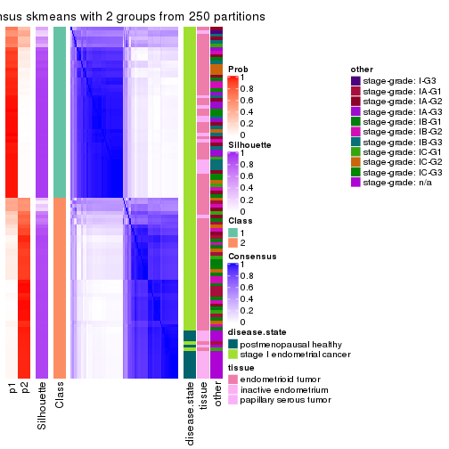</p>

</div>
<div id='tab-CV-skmeans-consensus-heatmap-2'>
<pre><code class="r">consensus_heatmap(res, k = 3)
</code></pre>

<p>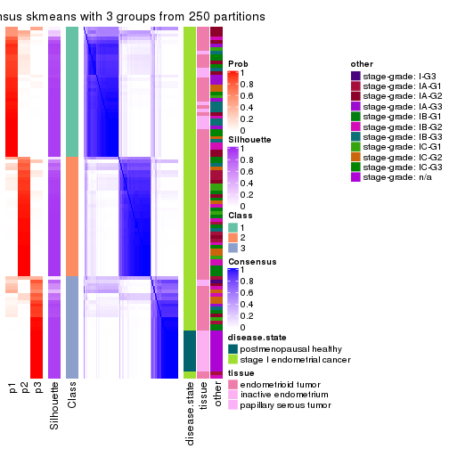</p>

</div>
<div id='tab-CV-skmeans-consensus-heatmap-3'>
<pre><code class="r">consensus_heatmap(res, k = 4)
</code></pre>

<p>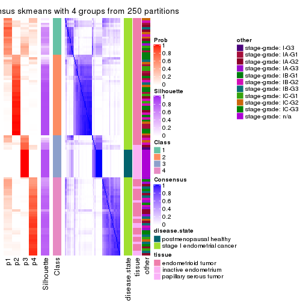</p>

</div>
<div id='tab-CV-skmeans-consensus-heatmap-4'>
<pre><code class="r">consensus_heatmap(res, k = 5)
</code></pre>

<p>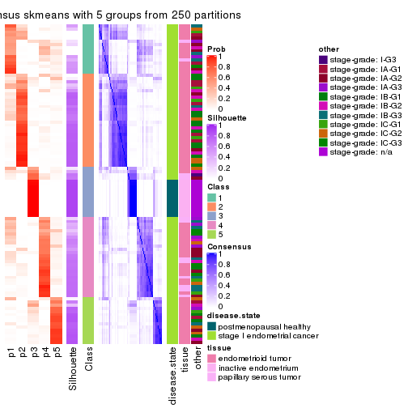</p>

</div>
<div id='tab-CV-skmeans-consensus-heatmap-5'>
<pre><code class="r">consensus_heatmap(res, k = 6)
</code></pre>

<p>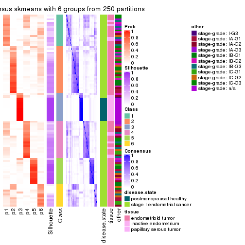</p>

</div>
</div>

Heatmaps for the membership of samples in all partitions to see how consistent they are:


<script>
$( function() {
	$( '#tabs-CV-skmeans-membership-heatmap' ).tabs();
} );
</script>
<div id='tabs-CV-skmeans-membership-heatmap'>
<ul>
<li><a href='#tab-CV-skmeans-membership-heatmap-1'>k = 2</a></li>
<li><a href='#tab-CV-skmeans-membership-heatmap-2'>k = 3</a></li>
<li><a href='#tab-CV-skmeans-membership-heatmap-3'>k = 4</a></li>
<li><a href='#tab-CV-skmeans-membership-heatmap-4'>k = 5</a></li>
<li><a href='#tab-CV-skmeans-membership-heatmap-5'>k = 6</a></li>
</ul>
<div id='tab-CV-skmeans-membership-heatmap-1'>
<pre><code class="r">membership_heatmap(res, k = 2)
</code></pre>

<p>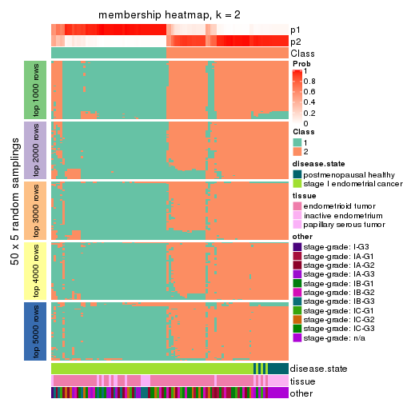</p>

</div>
<div id='tab-CV-skmeans-membership-heatmap-2'>
<pre><code class="r">membership_heatmap(res, k = 3)
</code></pre>

<p>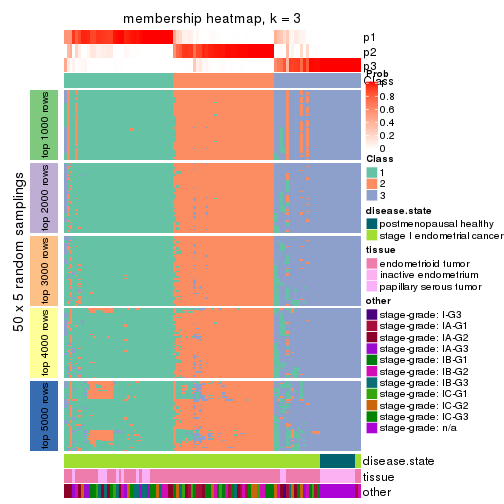</p>

</div>
<div id='tab-CV-skmeans-membership-heatmap-3'>
<pre><code class="r">membership_heatmap(res, k = 4)
</code></pre>

<p>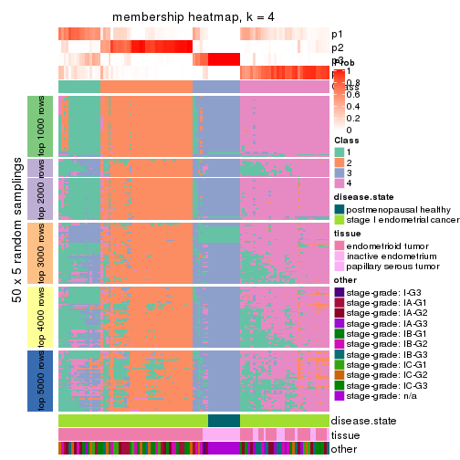</p>

</div>
<div id='tab-CV-skmeans-membership-heatmap-4'>
<pre><code class="r">membership_heatmap(res, k = 5)
</code></pre>

<p>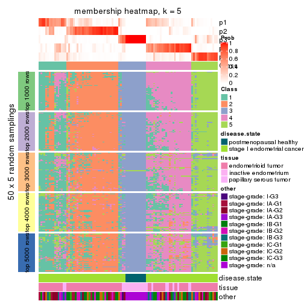</p>

</div>
<div id='tab-CV-skmeans-membership-heatmap-5'>
<pre><code class="r">membership_heatmap(res, k = 6)
</code></pre>

<p>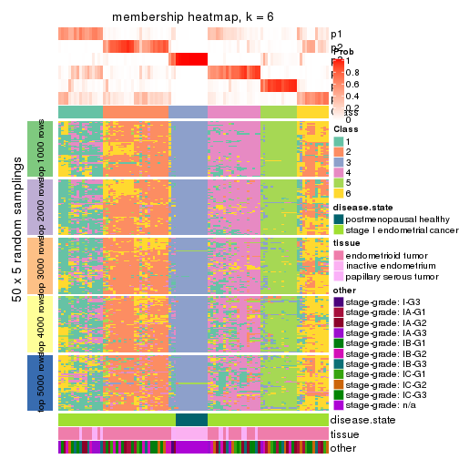</p>

</div>
</div>

As soon as we have had the classes for columns, we can look for signatures
which are significantly different between classes which can be candidate marks
for certain classes. Following are the heatmaps for signatures.


Signature heatmaps where rows are scaled:


<script>
$( function() {
	$( '#tabs-CV-skmeans-get-signatures' ).tabs();
} );
</script>
<div id='tabs-CV-skmeans-get-signatures'>
<ul>
<li><a href='#tab-CV-skmeans-get-signatures-1'>k = 2</a></li>
<li><a href='#tab-CV-skmeans-get-signatures-2'>k = 3</a></li>
<li><a href='#tab-CV-skmeans-get-signatures-3'>k = 4</a></li>
<li><a href='#tab-CV-skmeans-get-signatures-4'>k = 5</a></li>
<li><a href='#tab-CV-skmeans-get-signatures-5'>k = 6</a></li>
</ul>
<div id='tab-CV-skmeans-get-signatures-1'>
<pre><code class="r">get_signatures(res, k = 2)
</code></pre>

<p>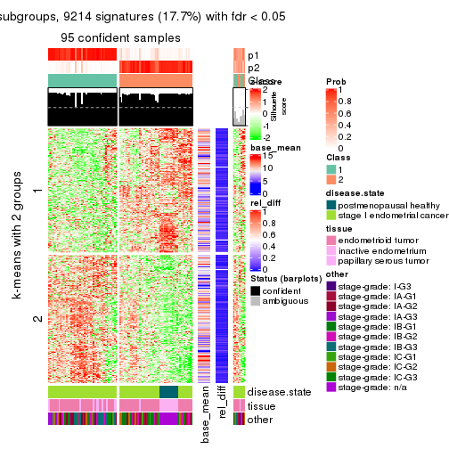</p>

</div>
<div id='tab-CV-skmeans-get-signatures-2'>
<pre><code class="r">get_signatures(res, k = 3)
</code></pre>

<p>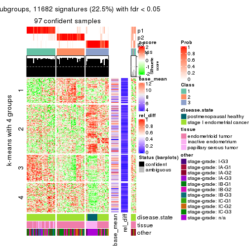</p>

</div>
<div id='tab-CV-skmeans-get-signatures-3'>
<pre><code class="r">get_signatures(res, k = 4)
</code></pre>

<p>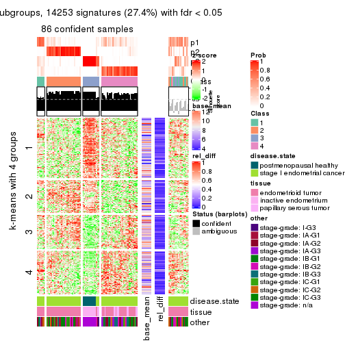</p>

</div>
<div id='tab-CV-skmeans-get-signatures-4'>
<pre><code class="r">get_signatures(res, k = 5)
</code></pre>

<p>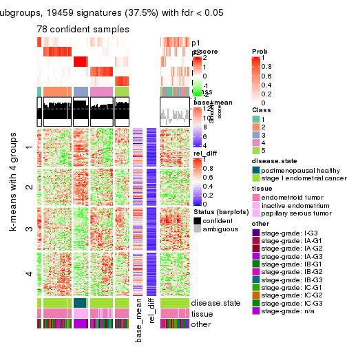</p>

</div>
<div id='tab-CV-skmeans-get-signatures-5'>
<pre><code class="r">get_signatures(res, k = 6)
</code></pre>

<p>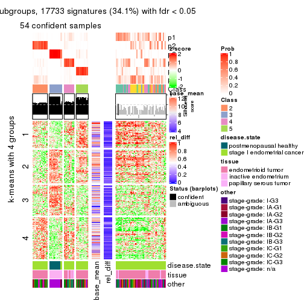</p>

</div>
</div>


Signature heatmaps where rows are not scaled:


<script>
$( function() {
	$( '#tabs-CV-skmeans-get-signatures-no-scale' ).tabs();
} );
</script>
<div id='tabs-CV-skmeans-get-signatures-no-scale'>
<ul>
<li><a href='#tab-CV-skmeans-get-signatures-no-scale-1'>k = 2</a></li>
<li><a href='#tab-CV-skmeans-get-signatures-no-scale-2'>k = 3</a></li>
<li><a href='#tab-CV-skmeans-get-signatures-no-scale-3'>k = 4</a></li>
<li><a href='#tab-CV-skmeans-get-signatures-no-scale-4'>k = 5</a></li>
<li><a href='#tab-CV-skmeans-get-signatures-no-scale-5'>k = 6</a></li>
</ul>
<div id='tab-CV-skmeans-get-signatures-no-scale-1'>
<pre><code class="r">get_signatures(res, k = 2, scale_rows = FALSE)
</code></pre>

<p>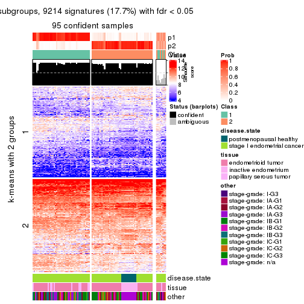</p>

</div>
<div id='tab-CV-skmeans-get-signatures-no-scale-2'>
<pre><code class="r">get_signatures(res, k = 3, scale_rows = FALSE)
</code></pre>

<p>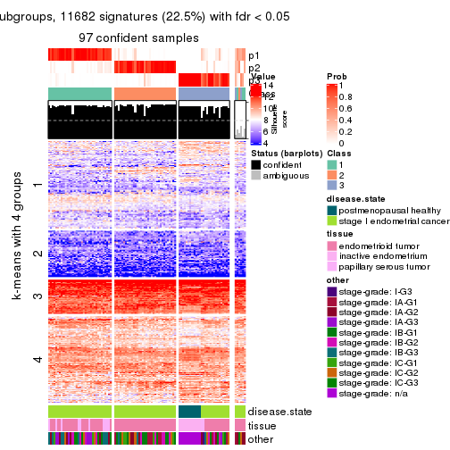</p>

</div>
<div id='tab-CV-skmeans-get-signatures-no-scale-3'>
<pre><code class="r">get_signatures(res, k = 4, scale_rows = FALSE)
</code></pre>

<p>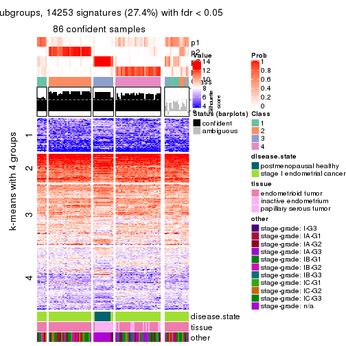</p>

</div>
<div id='tab-CV-skmeans-get-signatures-no-scale-4'>
<pre><code class="r">get_signatures(res, k = 5, scale_rows = FALSE)
</code></pre>

<p>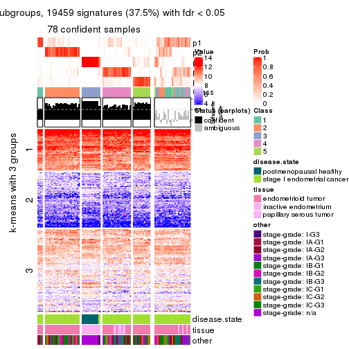</p>

</div>
<div id='tab-CV-skmeans-get-signatures-no-scale-5'>
<pre><code class="r">get_signatures(res, k = 6, scale_rows = FALSE)
</code></pre>

<p>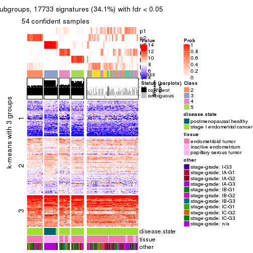</p>

</div>
</div>


Compare the overlap of signatures from different k:

```r
compare_signatures(res)
```

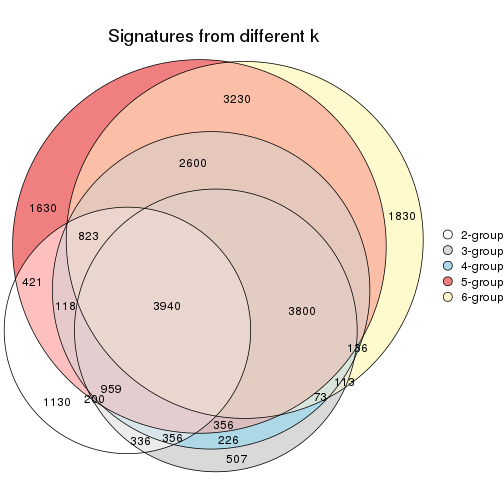

`get_signature()` returns a data frame invisibly. TO get the list of signatures, the function
call should be assigned to a variable explicitly. In following code, if `plot` argument is set
to `FALSE`, no heatmap is plotted while only the differential analysis is performed.

```r
# code only for demonstration
tb = get_signature(res, k = ..., plot = FALSE)
```

An example of the output of `tb` is:

```
#>   which_row         fdr    mean_1    mean_2 scaled_mean_1 scaled_mean_2 km
#> 1        38 0.042760348  8.373488  9.131774    -0.5533452     0.5164555  1
#> 2        40 0.018707592  7.106213  8.469186    -0.6173731     0.5762149  1
#> 3        55 0.019134737 10.221463 11.207825    -0.6159697     0.5749050  1
#> 4        59 0.006059896  5.921854  7.869574    -0.6899429     0.6439467  1
#> 5        60 0.018055526  8.928898 10.211722    -0.6204761     0.5791110  1
#> 6        98 0.009384629 15.714769 14.887706     0.6635654    -0.6193277  2
...
```

The columns in `tb` are:

1. `which_row`: row indices corresponding to the input matrix.
2. `fdr`: FDR for the differential test. 
3. `mean_x`: The mean value in group x.
4. `scaled_mean_x`: The mean value in group x after rows are scaled.
5. `km`: Row groups if k-means clustering is applied to rows.


UMAP plot which shows how samples are separated.


<script>
$( function() {
	$( '#tabs-CV-skmeans-dimension-reduction' ).tabs();
} );
</script>
<div id='tabs-CV-skmeans-dimension-reduction'>
<ul>
<li><a href='#tab-CV-skmeans-dimension-reduction-1'>k = 2</a></li>
<li><a href='#tab-CV-skmeans-dimension-reduction-2'>k = 3</a></li>
<li><a href='#tab-CV-skmeans-dimension-reduction-3'>k = 4</a></li>
<li><a href='#tab-CV-skmeans-dimension-reduction-4'>k = 5</a></li>
<li><a href='#tab-CV-skmeans-dimension-reduction-5'>k = 6</a></li>
</ul>
<div id='tab-CV-skmeans-dimension-reduction-1'>
<pre><code class="r">dimension_reduction(res, k = 2, method = &quot;UMAP&quot;)
</code></pre>

<p>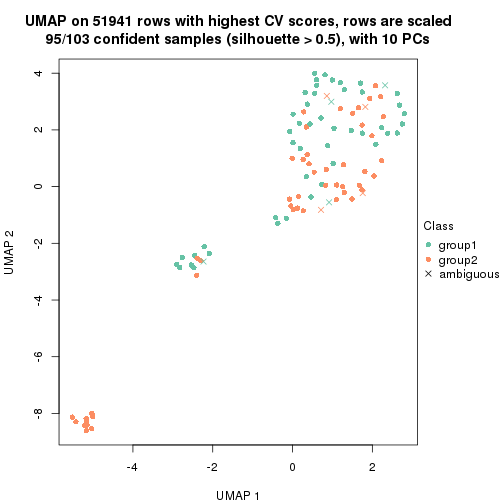</p>

</div>
<div id='tab-CV-skmeans-dimension-reduction-2'>
<pre><code class="r">dimension_reduction(res, k = 3, method = &quot;UMAP&quot;)
</code></pre>

<p>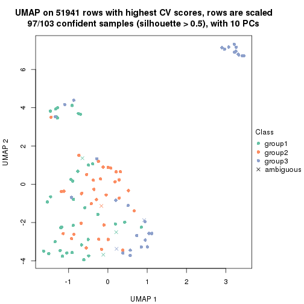</p>

</div>
<div id='tab-CV-skmeans-dimension-reduction-3'>
<pre><code class="r">dimension_reduction(res, k = 4, method = &quot;UMAP&quot;)
</code></pre>

<p>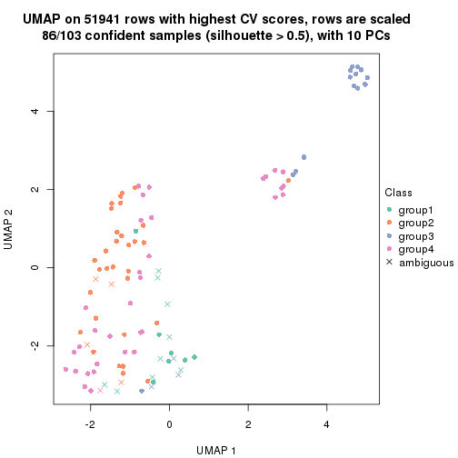</p>

</div>
<div id='tab-CV-skmeans-dimension-reduction-4'>
<pre><code class="r">dimension_reduction(res, k = 5, method = &quot;UMAP&quot;)
</code></pre>

<p>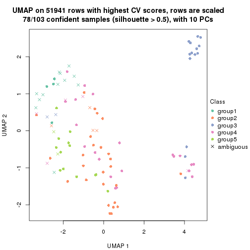</p>

</div>
<div id='tab-CV-skmeans-dimension-reduction-5'>
<pre><code class="r">dimension_reduction(res, k = 6, method = &quot;UMAP&quot;)
</code></pre>

<p>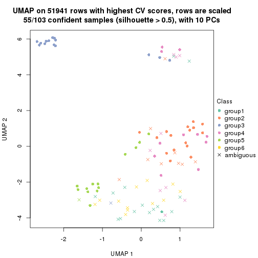</p>

</div>
</div>


Following heatmap shows how subgroups are split when increasing `k`:

```r
collect_classes(res)
```

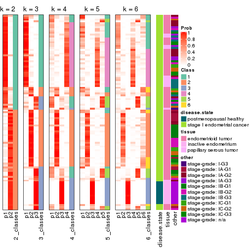


Test correlation between subgroups and known annotations. If the known
annotation is numeric, one-way ANOVA test is applied, and if the known
annotation is discrete, chi-squared contingency table test is applied.

```r
test_to_known_factors(res)
```

```
#>             n disease.state(p) tissue(p) other(p) k
#> CV:skmeans 95         1.03e-03  6.48e-05 2.49e-07 2
#> CV:skmeans 97         4.70e-08  1.50e-09 1.74e-07 3
#> CV:skmeans 86         3.05e-14  1.78e-15 5.96e-12 4
#> CV:skmeans 78         2.79e-13  1.12e-14 2.59e-07 5
#> CV:skmeans 55         4.07e-09  5.32e-11 6.62e-05 6
```


If matrix rows can be associated to genes, consider to use `functional_enrichment(res,
...)` to perform function enrichment for the signature genes. See [this vignette](http://bioconductor.org/packages/devel/bioc/vignettes/cola/inst/doc/functional_enrichment.html) for more detailed explanations.


 

---------------------------------------------------


### CV:pam


The object with results only for a single top-value method and a single partition method 
can be extracted as:

```r
res = res_list["CV", "pam"]
# you can also extract it by
# res = res_list["CV:pam"]
```

A summary of `res` and all the functions that can be applied to it:

```r
res
```

```
#> A 'ConsensusPartition' object with k = 2, 3, 4, 5, 6.
#>   On a matrix with 51941 rows and 103 columns.
#>   Top rows (1000, 2000, 3000, 4000, 5000) are extracted by 'CV' method.
#>   Subgroups are detected by 'pam' method.
#>   Performed in total 1250 partitions by row resampling.
#>   Best k for subgroups seems to be 5.
#> 
#> Following methods can be applied to this 'ConsensusPartition' object:
#>  [1] "cola_report"             "collect_classes"         "collect_plots"          
#>  [4] "collect_stats"           "colnames"                "compare_signatures"     
#>  [7] "consensus_heatmap"       "dimension_reduction"     "functional_enrichment"  
#> [10] "get_anno_col"            "get_anno"                "get_classes"            
#> [13] "get_consensus"           "get_matrix"              "get_membership"         
#> [16] "get_param"               "get_signatures"          "get_stats"              
#> [19] "is_best_k"               "is_stable_k"             "membership_heatmap"     
#> [22] "ncol"                    "nrow"                    "plot_ecdf"              
#> [25] "rownames"                "select_partition_number" "show"                   
#> [28] "suggest_best_k"          "test_to_known_factors"
```

`collect_plots()` function collects all the plots made from `res` for all `k` (number of partitions)
into one single page to provide an easy and fast comparison between different `k`.

```r
collect_plots(res)
```

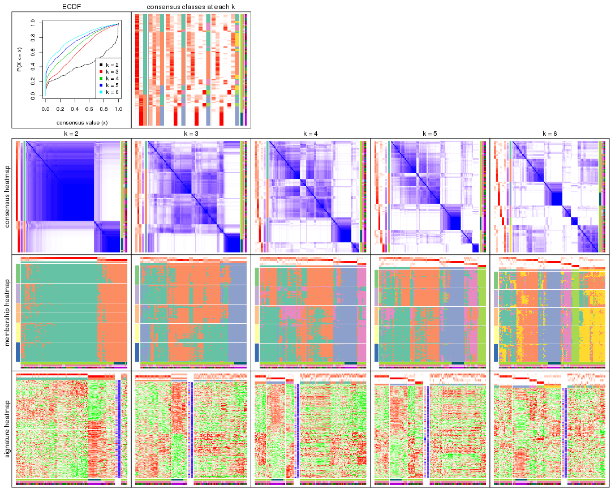

The plots are:

- The first row: a plot of the ECDF (empirical cumulative distribution
  function) curves of the consensus matrix for each `k` and the heatmap of
  predicted classes for each `k`.
- The second row: heatmaps of the consensus matrix for each `k`.
- The third row: heatmaps of the membership matrix for each `k`.
- The fouth row: heatmaps of the signatures for each `k`.

All the plots in panels can be made by individual functions and they are
plotted later in this section.

`select_partition_number()` produces several plots showing different
statistics for choosing "optimized" `k`. There are following statistics:

- ECDF curves of the consensus matrix for each `k`;
- 1-PAC. [The PAC
  score](https://en.wikipedia.org/wiki/Consensus_clustering#Over-interpretation_potential_of_consensus_clustering)
  measures the proportion of the ambiguous subgrouping.
- Mean silhouette score.
- Concordance. The mean probability of fiting the consensus class ids in all
  partitions.
- Area increased. Denote $A_k$ as the area under the ECDF curve for current
  `k`, the area increased is defined as $A_k - A_{k-1}$.
- Rand index. The percent of pairs of samples that are both in a same cluster
  or both are not in a same cluster in the partition of k and k-1.
- Jaccard index. The ratio of pairs of samples are both in a same cluster in
  the partition of k and k-1 and the pairs of samples are both in a same
  cluster in the partition k or k-1.

The detailed explanations of these statistics can be found in [the _cola_
vignette](http://bioconductor.org/packages/devel/bioc/vignettes/cola/inst/doc/cola.html#toc_13).

Generally speaking, lower PAC score, higher mean silhouette score or higher
concordance corresponds to better partition. Rand index and Jaccard index
measure how similar the current partition is compared to partition with `k-1`.
If they are too similar, we won't accept `k` is better than `k-1`.

```r
select_partition_number(res)
```

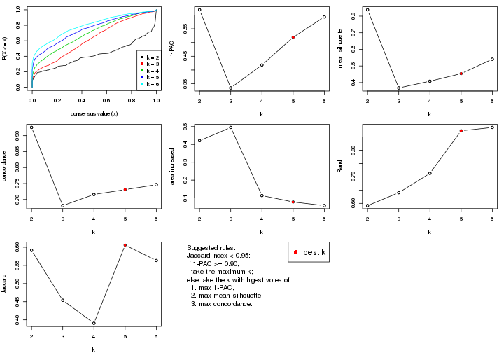

The numeric values for all these statistics can be obtained by `get_stats()`.

```r
get_stats(res)
```

```
#>   k 1-PAC mean_silhouette concordance area_increased  Rand Jaccard
#> 2 2 0.619           0.838       0.926         0.4211 0.591   0.591
#> 3 3 0.335           0.368       0.681         0.4954 0.640   0.454
#> 4 4 0.418           0.409       0.716         0.1134 0.713   0.391
#> 5 5 0.519           0.454       0.731         0.0775 0.873   0.606
#> 6 6 0.593           0.541       0.747         0.0570 0.886   0.563
```

`suggest_best_k()` suggests the best $k$ based on these statistics. The rules are as follows:

- All $k$ with Jaccard index larger than 0.95 are removed because increasing
  $k$ does not provide enough extra information. If all $k$ are removed, it is
  marked as no subgroup is detected.
- For all $k$ with 1-PAC score larger than 0.9, the maximal $k$ is taken as
  the best $k$, and other $k$ are marked as optional $k$.
- If it does not fit the second rule. The $k$ with the maximal vote of the
  highest 1-PAC score, highest mean silhouette, and highest concordance is
  taken as the best $k$.

```r
suggest_best_k(res)
```

```
#> [1] 5
```


Following shows the table of the partitions (You need to click the **show/hide
code output** link to see it). The membership matrix (columns with name `p*`)
is inferred by
[`clue::cl_consensus()`](https://www.rdocumentation.org/link/cl_consensus?package=clue)
function with the `SE` method. Basically the value in the membership matrix
represents the probability to belong to a certain group. The finall class
label for an item is determined with the group with highest probability it
belongs to.

In `get_classes()` function, the entropy is calculated from the membership
matrix and the silhouette score is calculated from the consensus matrix.


<script>
$( function() {
	$( '#tabs-CV-pam-get-classes' ).tabs();
} );
</script>
<div id='tabs-CV-pam-get-classes'>
<ul>
<li><a href='#tab-CV-pam-get-classes-1'>k = 2</a></li>
<li><a href='#tab-CV-pam-get-classes-2'>k = 3</a></li>
<li><a href='#tab-CV-pam-get-classes-3'>k = 4</a></li>
<li><a href='#tab-CV-pam-get-classes-4'>k = 5</a></li>
<li><a href='#tab-CV-pam-get-classes-5'>k = 6</a></li>
</ul>

<div id='tab-CV-pam-get-classes-1'>
<p><a id='tab-CV-pam-get-classes-1-a' style='color:#0366d6' href='#'>show/hide code output</a></p>
<pre><code class="r">cbind(get_classes(res, k = 2), get_membership(res, k = 2))
</code></pre>

<pre><code>#&gt;           class entropy silhouette    p1    p2
#&gt; GSM425907     1  0.0000    0.92493 1.000 0.000
#&gt; GSM425908     1  0.0000    0.92493 1.000 0.000
#&gt; GSM425909     1  0.9998    0.00709 0.508 0.492
#&gt; GSM425910     1  0.7139    0.74979 0.804 0.196
#&gt; GSM425911     1  0.0000    0.92493 1.000 0.000
#&gt; GSM425912     1  0.0000    0.92493 1.000 0.000
#&gt; GSM425913     1  0.5294    0.84145 0.880 0.120
#&gt; GSM425914     1  0.0000    0.92493 1.000 0.000
#&gt; GSM425915     2  0.1843    0.88371 0.028 0.972
#&gt; GSM425874     1  0.0000    0.92493 1.000 0.000
#&gt; GSM425875     1  0.3879    0.88417 0.924 0.076
#&gt; GSM425876     1  0.2043    0.91293 0.968 0.032
#&gt; GSM425877     1  0.8713    0.58643 0.708 0.292
#&gt; GSM425878     1  0.0000    0.92493 1.000 0.000
#&gt; GSM425879     1  0.0376    0.92419 0.996 0.004
#&gt; GSM425880     2  0.8555    0.64986 0.280 0.720
#&gt; GSM425881     1  0.0000    0.92493 1.000 0.000
#&gt; GSM425882     1  0.0000    0.92493 1.000 0.000
#&gt; GSM425883     1  0.2043    0.91347 0.968 0.032
#&gt; GSM425884     1  0.7219    0.75419 0.800 0.200
#&gt; GSM425885     1  0.0000    0.92493 1.000 0.000
#&gt; GSM425848     1  0.5842    0.82729 0.860 0.140
#&gt; GSM425849     1  0.0000    0.92493 1.000 0.000
#&gt; GSM425850     1  0.0000    0.92493 1.000 0.000
#&gt; GSM425851     2  0.9129    0.57270 0.328 0.672
#&gt; GSM425852     2  0.1184    0.88764 0.016 0.984
#&gt; GSM425893     1  0.1184    0.92071 0.984 0.016
#&gt; GSM425894     1  0.0000    0.92493 1.000 0.000
#&gt; GSM425895     1  0.0000    0.92493 1.000 0.000
#&gt; GSM425896     1  0.0938    0.92211 0.988 0.012
#&gt; GSM425897     1  0.0376    0.92419 0.996 0.004
#&gt; GSM425898     1  0.3733    0.88575 0.928 0.072
#&gt; GSM425899     1  0.6623    0.78310 0.828 0.172
#&gt; GSM425900     1  0.8081    0.66529 0.752 0.248
#&gt; GSM425901     1  0.9427    0.43762 0.640 0.360
#&gt; GSM425902     1  0.4161    0.87752 0.916 0.084
#&gt; GSM425903     1  0.9129    0.51538 0.672 0.328
#&gt; GSM425904     2  0.5842    0.80862 0.140 0.860
#&gt; GSM425905     1  0.0000    0.92493 1.000 0.000
#&gt; GSM425906     1  0.2043    0.91235 0.968 0.032
#&gt; GSM425863     1  0.0672    0.92362 0.992 0.008
#&gt; GSM425864     1  0.0000    0.92493 1.000 0.000
#&gt; GSM425865     1  0.0000    0.92493 1.000 0.000
#&gt; GSM425866     1  0.6801    0.78305 0.820 0.180
#&gt; GSM425867     2  0.0000    0.89023 0.000 1.000
#&gt; GSM425868     1  0.0000    0.92493 1.000 0.000
#&gt; GSM425869     1  0.1184    0.92059 0.984 0.016
#&gt; GSM425870     2  0.9580    0.45420 0.380 0.620
#&gt; GSM425871     1  0.0000    0.92493 1.000 0.000
#&gt; GSM425872     1  0.0376    0.92432 0.996 0.004
#&gt; GSM425873     1  0.0376    0.92419 0.996 0.004
#&gt; GSM425843     1  0.6887    0.77266 0.816 0.184
#&gt; GSM425844     1  0.1184    0.92092 0.984 0.016
#&gt; GSM425845     1  0.1184    0.92072 0.984 0.016
#&gt; GSM425846     1  0.0000    0.92493 1.000 0.000
#&gt; GSM425847     1  0.0000    0.92493 1.000 0.000
#&gt; GSM425886     1  0.8909    0.55726 0.692 0.308
#&gt; GSM425887     1  0.0000    0.92493 1.000 0.000
#&gt; GSM425888     1  0.0000    0.92493 1.000 0.000
#&gt; GSM425889     2  0.9460    0.46867 0.364 0.636
#&gt; GSM425890     1  0.0000    0.92493 1.000 0.000
#&gt; GSM425891     1  0.2236    0.91066 0.964 0.036
#&gt; GSM425892     1  0.0000    0.92493 1.000 0.000
#&gt; GSM425853     1  0.0672    0.92364 0.992 0.008
#&gt; GSM425854     1  0.0000    0.92493 1.000 0.000
#&gt; GSM425855     2  0.8763    0.60594 0.296 0.704
#&gt; GSM425856     1  0.2043    0.91308 0.968 0.032
#&gt; GSM425857     2  0.9552    0.47255 0.376 0.624
#&gt; GSM425858     1  0.0000    0.92493 1.000 0.000
#&gt; GSM425859     1  0.0000    0.92493 1.000 0.000
#&gt; GSM425860     2  0.7219    0.75141 0.200 0.800
#&gt; GSM425861     1  0.0000    0.92493 1.000 0.000
#&gt; GSM425862     1  0.0000    0.92493 1.000 0.000
#&gt; GSM425837     1  0.6531    0.79444 0.832 0.168
#&gt; GSM425838     1  0.0000    0.92493 1.000 0.000
#&gt; GSM425839     1  0.0938    0.92201 0.988 0.012
#&gt; GSM425840     2  0.2423    0.87797 0.040 0.960
#&gt; GSM425841     1  0.4298    0.87124 0.912 0.088
#&gt; GSM425842     1  0.1184    0.92027 0.984 0.016
#&gt; GSM425917     2  0.0672    0.88945 0.008 0.992
#&gt; GSM425922     1  0.7299    0.72910 0.796 0.204
#&gt; GSM425919     2  0.2043    0.88234 0.032 0.968
#&gt; GSM425920     2  0.8499    0.65835 0.276 0.724
#&gt; GSM425923     1  0.5178    0.85184 0.884 0.116
#&gt; GSM425916     2  0.1633    0.88379 0.024 0.976
#&gt; GSM425918     1  0.0000    0.92493 1.000 0.000
#&gt; GSM425921     1  0.9970    0.02282 0.532 0.468
#&gt; GSM425925     1  0.0000    0.92493 1.000 0.000
#&gt; GSM425926     1  0.0000    0.92493 1.000 0.000
#&gt; GSM425927     1  0.3584    0.89227 0.932 0.068
#&gt; GSM425924     2  0.0376    0.88997 0.004 0.996
#&gt; GSM425928     2  0.0000    0.89023 0.000 1.000
#&gt; GSM425929     2  0.0000    0.89023 0.000 1.000
#&gt; GSM425930     2  0.0000    0.89023 0.000 1.000
#&gt; GSM425931     2  0.0000    0.89023 0.000 1.000
#&gt; GSM425932     2  0.0000    0.89023 0.000 1.000
#&gt; GSM425933     2  0.0000    0.89023 0.000 1.000
#&gt; GSM425934     2  0.0000    0.89023 0.000 1.000
#&gt; GSM425935     2  0.0000    0.89023 0.000 1.000
#&gt; GSM425936     2  0.0000    0.89023 0.000 1.000
#&gt; GSM425937     2  0.0000    0.89023 0.000 1.000
#&gt; GSM425938     2  0.0000    0.89023 0.000 1.000
#&gt; GSM425939     2  0.0000    0.89023 0.000 1.000
</code></pre>

<script>
$('#tab-CV-pam-get-classes-1-a').parent().next().next().hide();
$('#tab-CV-pam-get-classes-1-a').click(function(){
  $('#tab-CV-pam-get-classes-1-a').parent().next().next().toggle();
  return(false);
});
</script>
</div>

<div id='tab-CV-pam-get-classes-2'>
<p><a id='tab-CV-pam-get-classes-2-a' style='color:#0366d6' href='#'>show/hide code output</a></p>
<pre><code class="r">cbind(get_classes(res, k = 3), get_membership(res, k = 3))
</code></pre>

<pre><code>#&gt;           class entropy silhouette    p1    p2    p3
#&gt; GSM425907     2  0.3340     0.6371 0.000 0.880 0.120
#&gt; GSM425908     2  0.6053     0.5920 0.020 0.720 0.260
#&gt; GSM425909     3  0.7493    -0.1418 0.092 0.232 0.676
#&gt; GSM425910     3  0.9858    -0.4427 0.256 0.348 0.396
#&gt; GSM425911     2  0.6045     0.5687 0.000 0.620 0.380
#&gt; GSM425912     2  0.6045     0.5687 0.000 0.620 0.380
#&gt; GSM425913     2  0.1031     0.5956 0.000 0.976 0.024
#&gt; GSM425914     2  0.6045     0.5687 0.000 0.620 0.380
#&gt; GSM425915     3  0.8434     0.4941 0.416 0.088 0.496
#&gt; GSM425874     2  0.5958     0.2783 0.300 0.692 0.008
#&gt; GSM425875     3  0.9789    -0.4862 0.368 0.236 0.396
#&gt; GSM425876     2  0.8943     0.3813 0.128 0.480 0.392
#&gt; GSM425877     1  0.7133     0.5102 0.712 0.096 0.192
#&gt; GSM425878     1  0.9775     0.2688 0.392 0.232 0.376
#&gt; GSM425879     2  0.6314     0.5607 0.004 0.604 0.392
#&gt; GSM425880     1  0.7782     0.3313 0.668 0.124 0.208
#&gt; GSM425881     2  0.6045     0.5687 0.000 0.620 0.380
#&gt; GSM425882     2  0.6205     0.5956 0.008 0.656 0.336
#&gt; GSM425883     2  0.8747     0.4500 0.112 0.492 0.396
#&gt; GSM425884     1  0.8211     0.4567 0.520 0.076 0.404
#&gt; GSM425885     2  0.4409     0.4549 0.172 0.824 0.004
#&gt; GSM425848     1  0.7953     0.4665 0.564 0.068 0.368
#&gt; GSM425849     1  0.8967     0.4169 0.488 0.132 0.380
#&gt; GSM425850     3  0.9969    -0.4580 0.308 0.320 0.372
#&gt; GSM425851     1  0.7841     0.3178 0.536 0.408 0.056
#&gt; GSM425852     1  0.7228    -0.3431 0.600 0.036 0.364
#&gt; GSM425893     2  0.6345     0.5566 0.004 0.596 0.400
#&gt; GSM425894     2  0.5016     0.6329 0.000 0.760 0.240
#&gt; GSM425895     2  0.5678     0.6065 0.000 0.684 0.316
#&gt; GSM425896     2  0.5988     0.5789 0.000 0.632 0.368
#&gt; GSM425897     2  0.5656     0.6123 0.004 0.712 0.284
#&gt; GSM425898     2  0.2584     0.6244 0.008 0.928 0.064
#&gt; GSM425899     2  0.7097     0.5075 0.172 0.720 0.108
#&gt; GSM425900     2  0.8675     0.3917 0.184 0.596 0.220
#&gt; GSM425901     3  0.9642    -0.4756 0.376 0.208 0.416
#&gt; GSM425902     2  0.8720     0.3686 0.252 0.584 0.164
#&gt; GSM425903     3  0.7770    -0.2028 0.080 0.292 0.628
#&gt; GSM425904     1  0.5538     0.2190 0.808 0.060 0.132
#&gt; GSM425905     2  0.1753     0.6254 0.000 0.952 0.048
#&gt; GSM425906     2  0.1860     0.6239 0.000 0.948 0.052
#&gt; GSM425863     1  0.9863     0.1748 0.400 0.340 0.260
#&gt; GSM425864     2  0.3752     0.6364 0.000 0.856 0.144
#&gt; GSM425865     2  0.2448     0.6328 0.000 0.924 0.076
#&gt; GSM425866     1  0.9147     0.3757 0.444 0.144 0.412
#&gt; GSM425867     3  0.6126     0.5855 0.400 0.000 0.600
#&gt; GSM425868     2  0.2448     0.5578 0.076 0.924 0.000
#&gt; GSM425869     2  0.2681     0.5986 0.040 0.932 0.028
#&gt; GSM425870     3  0.9937     0.1664 0.328 0.288 0.384
#&gt; GSM425871     2  0.8730    -0.1457 0.388 0.500 0.112
#&gt; GSM425872     2  0.0237     0.6007 0.000 0.996 0.004
#&gt; GSM425873     2  0.9518     0.2407 0.188 0.420 0.392
#&gt; GSM425843     1  0.9322     0.3680 0.444 0.164 0.392
#&gt; GSM425844     1  0.9229     0.4177 0.488 0.164 0.348
#&gt; GSM425845     2  0.7080     0.5293 0.024 0.564 0.412
#&gt; GSM425846     2  0.2400     0.6276 0.004 0.932 0.064
#&gt; GSM425847     2  0.5016     0.6339 0.000 0.760 0.240
#&gt; GSM425886     3  0.7534    -0.3655 0.048 0.368 0.584
#&gt; GSM425887     2  0.6379     0.5746 0.008 0.624 0.368
#&gt; GSM425888     2  0.3193     0.6293 0.004 0.896 0.100
#&gt; GSM425889     1  0.7246     0.4492 0.664 0.060 0.276
#&gt; GSM425890     2  0.6396     0.2298 0.320 0.664 0.016
#&gt; GSM425891     2  0.2866     0.6266 0.008 0.916 0.076
#&gt; GSM425892     2  0.0000     0.6025 0.000 1.000 0.000
#&gt; GSM425853     2  0.8973    -0.0388 0.364 0.500 0.136
#&gt; GSM425854     2  0.4654     0.6378 0.000 0.792 0.208
#&gt; GSM425855     1  0.8743     0.0504 0.512 0.116 0.372
#&gt; GSM425856     2  0.8084    -0.0660 0.384 0.544 0.072
#&gt; GSM425857     2  0.7923     0.2160 0.120 0.652 0.228
#&gt; GSM425858     2  0.5098     0.6322 0.000 0.752 0.248
#&gt; GSM425859     2  0.3116     0.6380 0.000 0.892 0.108
#&gt; GSM425860     1  0.9649    -0.3986 0.404 0.208 0.388
#&gt; GSM425861     2  0.6298     0.5611 0.004 0.608 0.388
#&gt; GSM425862     1  0.9532     0.3536 0.488 0.268 0.244
#&gt; GSM425837     1  0.9314     0.4218 0.492 0.180 0.328
#&gt; GSM425838     1  0.9721     0.3274 0.452 0.284 0.264
#&gt; GSM425839     2  0.0000     0.6025 0.000 1.000 0.000
#&gt; GSM425840     1  0.5860    -0.0942 0.748 0.024 0.228
#&gt; GSM425841     1  0.7309     0.2577 0.552 0.416 0.032
#&gt; GSM425842     3  0.9888    -0.4420 0.264 0.348 0.388
#&gt; GSM425917     3  0.6432     0.5686 0.428 0.004 0.568
#&gt; GSM425922     2  0.5588     0.3107 0.276 0.720 0.004
#&gt; GSM425919     3  0.7868     0.5334 0.420 0.056 0.524
#&gt; GSM425920     1  0.7603     0.1610 0.688 0.172 0.140
#&gt; GSM425923     1  0.8623     0.4794 0.584 0.144 0.272
#&gt; GSM425916     1  0.3851     0.1171 0.860 0.004 0.136
#&gt; GSM425918     2  0.9305    -0.0517 0.380 0.456 0.164
#&gt; GSM425921     1  0.6215     0.2503 0.572 0.428 0.000
#&gt; GSM425925     1  0.9280     0.3326 0.452 0.160 0.388
#&gt; GSM425926     2  0.6617     0.0859 0.388 0.600 0.012
#&gt; GSM425927     2  0.9752     0.2023 0.236 0.424 0.340
#&gt; GSM425924     3  0.6675     0.5800 0.404 0.012 0.584
#&gt; GSM425928     3  0.6140     0.5876 0.404 0.000 0.596
#&gt; GSM425929     3  0.6140     0.5876 0.404 0.000 0.596
#&gt; GSM425930     3  0.6140     0.5876 0.404 0.000 0.596
#&gt; GSM425931     3  0.6140     0.5876 0.404 0.000 0.596
#&gt; GSM425932     3  0.6140     0.5876 0.404 0.000 0.596
#&gt; GSM425933     3  0.6140     0.5876 0.404 0.000 0.596
#&gt; GSM425934     3  0.6140     0.5876 0.404 0.000 0.596
#&gt; GSM425935     3  0.6140     0.5876 0.404 0.000 0.596
#&gt; GSM425936     3  0.6140     0.5876 0.404 0.000 0.596
#&gt; GSM425937     3  0.6140     0.5876 0.404 0.000 0.596
#&gt; GSM425938     3  0.6140     0.5876 0.404 0.000 0.596
#&gt; GSM425939     3  0.6140     0.5876 0.404 0.000 0.596
</code></pre>

<script>
$('#tab-CV-pam-get-classes-2-a').parent().next().next().hide();
$('#tab-CV-pam-get-classes-2-a').click(function(){
  $('#tab-CV-pam-get-classes-2-a').parent().next().next().toggle();
  return(false);
});
</script>
</div>

<div id='tab-CV-pam-get-classes-3'>
<p><a id='tab-CV-pam-get-classes-3-a' style='color:#0366d6' href='#'>show/hide code output</a></p>
<pre><code class="r">cbind(get_classes(res, k = 4), get_membership(res, k = 4))
</code></pre>

<pre><code>#&gt;           class entropy silhouette    p1    p2    p3    p4
#&gt; GSM425907     2  0.3626     0.4285 0.184 0.812 0.000 0.004
#&gt; GSM425908     2  0.4741     0.1427 0.328 0.668 0.000 0.004
#&gt; GSM425909     4  0.4997     0.7467 0.104 0.012 0.092 0.792
#&gt; GSM425910     1  0.6538     0.3879 0.640 0.276 0.036 0.048
#&gt; GSM425911     1  0.5503     0.2027 0.516 0.468 0.000 0.016
#&gt; GSM425912     1  0.4994     0.1910 0.520 0.480 0.000 0.000
#&gt; GSM425913     2  0.0895     0.5291 0.004 0.976 0.020 0.000
#&gt; GSM425914     1  0.5161     0.1915 0.520 0.476 0.000 0.004
#&gt; GSM425915     3  0.4836     0.5085 0.000 0.008 0.672 0.320
#&gt; GSM425874     2  0.5807     0.2555 0.364 0.596 0.000 0.040
#&gt; GSM425875     1  0.6100     0.3574 0.624 0.072 0.000 0.304
#&gt; GSM425876     1  0.6688     0.2947 0.536 0.368 0.000 0.096
#&gt; GSM425877     1  0.8354     0.1965 0.544 0.076 0.192 0.188
#&gt; GSM425878     1  0.6723     0.3951 0.600 0.260 0.000 0.140
#&gt; GSM425879     1  0.5163     0.1880 0.516 0.480 0.000 0.004
#&gt; GSM425880     4  0.1624     0.7784 0.028 0.000 0.020 0.952
#&gt; GSM425881     1  0.5161     0.1915 0.520 0.476 0.000 0.004
#&gt; GSM425882     2  0.5151    -0.1137 0.464 0.532 0.000 0.004
#&gt; GSM425883     1  0.5488     0.3134 0.636 0.340 0.012 0.012
#&gt; GSM425884     1  0.6379     0.3974 0.668 0.076 0.020 0.236
#&gt; GSM425885     2  0.4767     0.3569 0.256 0.724 0.000 0.020
#&gt; GSM425848     1  0.5256     0.2880 0.700 0.040 0.000 0.260
#&gt; GSM425849     1  0.5690     0.4095 0.716 0.116 0.000 0.168
#&gt; GSM425850     1  0.6924     0.3551 0.536 0.340 0.000 0.124
#&gt; GSM425851     2  0.9420     0.0152 0.272 0.408 0.168 0.152
#&gt; GSM425852     3  0.5901     0.5775 0.084 0.004 0.692 0.220
#&gt; GSM425893     1  0.7420     0.2565 0.480 0.364 0.004 0.152
#&gt; GSM425894     2  0.4730     0.1811 0.364 0.636 0.000 0.000
#&gt; GSM425895     2  0.4730     0.0993 0.364 0.636 0.000 0.000
#&gt; GSM425896     1  0.6443     0.1848 0.472 0.468 0.004 0.056
#&gt; GSM425897     2  0.5375    -0.0218 0.416 0.572 0.004 0.008
#&gt; GSM425898     2  0.3495     0.4968 0.140 0.844 0.016 0.000
#&gt; GSM425899     2  0.6078     0.4483 0.168 0.724 0.036 0.072
#&gt; GSM425900     2  0.7636     0.0787 0.268 0.500 0.228 0.004
#&gt; GSM425901     4  0.2685     0.7868 0.040 0.004 0.044 0.912
#&gt; GSM425902     1  0.6847    -0.0987 0.500 0.428 0.036 0.036
#&gt; GSM425903     4  0.4932     0.7497 0.128 0.012 0.068 0.792
#&gt; GSM425904     4  0.1256     0.7760 0.028 0.000 0.008 0.964
#&gt; GSM425905     2  0.2944     0.5098 0.128 0.868 0.000 0.004
#&gt; GSM425906     2  0.2714     0.5188 0.112 0.884 0.004 0.000
#&gt; GSM425863     1  0.7049     0.2585 0.548 0.300 0.000 0.152
#&gt; GSM425864     2  0.3870     0.4030 0.208 0.788 0.000 0.004
#&gt; GSM425865     2  0.2266     0.5131 0.084 0.912 0.000 0.004
#&gt; GSM425866     4  0.2530     0.7045 0.112 0.000 0.000 0.888
#&gt; GSM425867     3  0.2149     0.7771 0.000 0.000 0.912 0.088
#&gt; GSM425868     2  0.1661     0.5147 0.052 0.944 0.000 0.004
#&gt; GSM425869     2  0.2944     0.5255 0.128 0.868 0.004 0.000
#&gt; GSM425870     3  0.8403     0.3042 0.128 0.224 0.544 0.104
#&gt; GSM425871     2  0.7113     0.0429 0.276 0.552 0.000 0.172
#&gt; GSM425872     2  0.0524     0.5323 0.000 0.988 0.004 0.008
#&gt; GSM425873     1  0.5632     0.3556 0.624 0.340 0.000 0.036
#&gt; GSM425843     1  0.6907     0.4130 0.644 0.144 0.020 0.192
#&gt; GSM425844     1  0.6475     0.3906 0.644 0.184 0.000 0.172
#&gt; GSM425845     1  0.7423     0.2724 0.476 0.344 0.000 0.180
#&gt; GSM425846     2  0.2255     0.5280 0.068 0.920 0.000 0.012
#&gt; GSM425847     2  0.4643     0.2192 0.344 0.656 0.000 0.000
#&gt; GSM425886     4  0.5297     0.7547 0.108 0.044 0.060 0.788
#&gt; GSM425887     1  0.5168     0.1646 0.504 0.492 0.000 0.004
#&gt; GSM425888     2  0.3583     0.4580 0.180 0.816 0.000 0.004
#&gt; GSM425889     1  0.6983     0.1540 0.616 0.036 0.272 0.076
#&gt; GSM425890     2  0.5673     0.2516 0.372 0.596 0.000 0.032
#&gt; GSM425891     2  0.2412     0.5269 0.084 0.908 0.008 0.000
#&gt; GSM425892     2  0.0188     0.5313 0.000 0.996 0.000 0.004
#&gt; GSM425853     2  0.7146     0.1030 0.228 0.560 0.000 0.212
#&gt; GSM425854     2  0.4661     0.2249 0.348 0.652 0.000 0.000
#&gt; GSM425855     1  0.6461    -0.1448 0.544 0.036 0.400 0.020
#&gt; GSM425856     4  0.7179     0.1314 0.140 0.380 0.000 0.480
#&gt; GSM425857     4  0.5138     0.7185 0.020 0.132 0.064 0.784
#&gt; GSM425858     2  0.4543     0.2456 0.324 0.676 0.000 0.000
#&gt; GSM425859     2  0.2714     0.4926 0.112 0.884 0.000 0.004
#&gt; GSM425860     3  0.4360     0.5557 0.008 0.248 0.744 0.000
#&gt; GSM425861     1  0.5399     0.2052 0.520 0.468 0.000 0.012
#&gt; GSM425862     1  0.6065     0.1656 0.644 0.276 0.000 0.080
#&gt; GSM425837     1  0.7215     0.3735 0.592 0.168 0.012 0.228
#&gt; GSM425838     1  0.5792     0.2081 0.648 0.296 0.000 0.056
#&gt; GSM425839     2  0.0188     0.5313 0.000 0.996 0.000 0.004
#&gt; GSM425840     3  0.6744     0.4504 0.312 0.012 0.592 0.084
#&gt; GSM425841     1  0.7356    -0.0783 0.468 0.368 0.000 0.164
#&gt; GSM425842     1  0.5592     0.3819 0.656 0.300 0.000 0.044
#&gt; GSM425917     3  0.1305     0.8128 0.036 0.004 0.960 0.000
#&gt; GSM425922     2  0.5630     0.2625 0.360 0.608 0.000 0.032
#&gt; GSM425919     3  0.3697     0.7329 0.048 0.100 0.852 0.000
#&gt; GSM425920     3  0.9209     0.2563 0.220 0.164 0.460 0.156
#&gt; GSM425923     1  0.6983     0.2846 0.656 0.128 0.036 0.180
#&gt; GSM425916     3  0.7108     0.3281 0.348 0.000 0.512 0.140
#&gt; GSM425918     2  0.7443    -0.0562 0.392 0.436 0.000 0.172
#&gt; GSM425921     2  0.7113     0.1176 0.448 0.456 0.016 0.080
#&gt; GSM425925     1  0.2300     0.3732 0.924 0.028 0.000 0.048
#&gt; GSM425926     2  0.6265     0.1671 0.444 0.500 0.000 0.056
#&gt; GSM425927     1  0.7524     0.2997 0.496 0.384 0.036 0.084
#&gt; GSM425924     3  0.0707     0.8196 0.000 0.020 0.980 0.000
#&gt; GSM425928     3  0.0000     0.8308 0.000 0.000 1.000 0.000
#&gt; GSM425929     3  0.0000     0.8308 0.000 0.000 1.000 0.000
#&gt; GSM425930     3  0.0000     0.8308 0.000 0.000 1.000 0.000
#&gt; GSM425931     3  0.0000     0.8308 0.000 0.000 1.000 0.000
#&gt; GSM425932     3  0.0000     0.8308 0.000 0.000 1.000 0.000
#&gt; GSM425933     3  0.0000     0.8308 0.000 0.000 1.000 0.000
#&gt; GSM425934     3  0.0000     0.8308 0.000 0.000 1.000 0.000
#&gt; GSM425935     3  0.0000     0.8308 0.000 0.000 1.000 0.000
#&gt; GSM425936     3  0.0000     0.8308 0.000 0.000 1.000 0.000
#&gt; GSM425937     3  0.0000     0.8308 0.000 0.000 1.000 0.000
#&gt; GSM425938     3  0.0000     0.8308 0.000 0.000 1.000 0.000
#&gt; GSM425939     3  0.0000     0.8308 0.000 0.000 1.000 0.000
</code></pre>

<script>
$('#tab-CV-pam-get-classes-3-a').parent().next().next().hide();
$('#tab-CV-pam-get-classes-3-a').click(function(){
  $('#tab-CV-pam-get-classes-3-a').parent().next().next().toggle();
  return(false);
});
</script>
</div>

<div id='tab-CV-pam-get-classes-4'>
<p><a id='tab-CV-pam-get-classes-4-a' style='color:#0366d6' href='#'>show/hide code output</a></p>
<pre><code class="r">cbind(get_classes(res, k = 5), get_membership(res, k = 5))
</code></pre>

<pre><code>#&gt;           class entropy silhouette    p1    p2    p3    p4    p5
#&gt; GSM425907     2  0.3814   0.407700 0.276 0.720 0.000 0.004 0.000
#&gt; GSM425908     2  0.4817  -0.000535 0.404 0.572 0.000 0.024 0.000
#&gt; GSM425909     5  0.0451   0.927938 0.004 0.000 0.008 0.000 0.988
#&gt; GSM425910     1  0.2770   0.494011 0.864 0.124 0.008 0.000 0.004
#&gt; GSM425911     1  0.4726   0.324403 0.580 0.400 0.000 0.000 0.020
#&gt; GSM425912     1  0.4227   0.305026 0.580 0.420 0.000 0.000 0.000
#&gt; GSM425913     2  0.0324   0.620531 0.004 0.992 0.000 0.004 0.000
#&gt; GSM425914     1  0.4210   0.307999 0.588 0.412 0.000 0.000 0.000
#&gt; GSM425915     3  0.4171   0.392910 0.000 0.000 0.604 0.000 0.396
#&gt; GSM425874     4  0.3878   0.617021 0.016 0.236 0.000 0.748 0.000
#&gt; GSM425875     1  0.3387   0.412658 0.852 0.020 0.000 0.028 0.100
#&gt; GSM425876     1  0.5426   0.393469 0.608 0.308 0.000 0.000 0.084
#&gt; GSM425877     4  0.7394   0.233099 0.380 0.020 0.184 0.400 0.016
#&gt; GSM425878     1  0.3827   0.411456 0.816 0.068 0.000 0.112 0.004
#&gt; GSM425879     1  0.4242   0.296989 0.572 0.428 0.000 0.000 0.000
#&gt; GSM425880     5  0.0324   0.929980 0.004 0.000 0.004 0.000 0.992
#&gt; GSM425881     1  0.4192   0.309831 0.596 0.404 0.000 0.000 0.000
#&gt; GSM425882     1  0.4437   0.194981 0.532 0.464 0.000 0.004 0.000
#&gt; GSM425883     1  0.5450   0.401252 0.660 0.252 0.016 0.072 0.000
#&gt; GSM425884     1  0.4468   0.229951 0.748 0.004 0.012 0.208 0.028
#&gt; GSM425885     2  0.4887   0.058800 0.048 0.692 0.000 0.252 0.008
#&gt; GSM425848     1  0.5915  -0.221088 0.484 0.000 0.000 0.412 0.104
#&gt; GSM425849     1  0.2964   0.330848 0.840 0.004 0.000 0.152 0.004
#&gt; GSM425850     1  0.4953   0.464380 0.712 0.196 0.000 0.088 0.004
#&gt; GSM425851     2  0.8433  -0.355098 0.320 0.324 0.116 0.232 0.008
#&gt; GSM425852     3  0.5844   0.529815 0.244 0.000 0.636 0.020 0.100
#&gt; GSM425893     1  0.6371   0.343175 0.516 0.268 0.000 0.000 0.216
#&gt; GSM425894     2  0.4321   0.214316 0.396 0.600 0.000 0.004 0.000
#&gt; GSM425895     2  0.4446   0.123811 0.400 0.592 0.000 0.008 0.000
#&gt; GSM425896     1  0.5657   0.313636 0.544 0.380 0.004 0.000 0.072
#&gt; GSM425897     1  0.4452   0.128806 0.500 0.496 0.000 0.000 0.004
#&gt; GSM425898     2  0.2646   0.605393 0.124 0.868 0.004 0.004 0.000
#&gt; GSM425899     2  0.4836   0.556003 0.076 0.756 0.016 0.148 0.004
#&gt; GSM425900     2  0.6465   0.122051 0.288 0.492 0.220 0.000 0.000
#&gt; GSM425901     5  0.0000   0.930839 0.000 0.000 0.000 0.000 1.000
#&gt; GSM425902     4  0.5786   0.616424 0.148 0.204 0.008 0.640 0.000
#&gt; GSM425903     5  0.0404   0.927237 0.012 0.000 0.000 0.000 0.988
#&gt; GSM425904     5  0.0000   0.930839 0.000 0.000 0.000 0.000 1.000
#&gt; GSM425905     2  0.2280   0.609201 0.120 0.880 0.000 0.000 0.000
#&gt; GSM425906     2  0.1908   0.619029 0.092 0.908 0.000 0.000 0.000
#&gt; GSM425863     1  0.6465   0.210473 0.576 0.220 0.000 0.184 0.020
#&gt; GSM425864     2  0.3752   0.385873 0.292 0.708 0.000 0.000 0.000
#&gt; GSM425865     2  0.2536   0.583263 0.128 0.868 0.000 0.004 0.000
#&gt; GSM425866     5  0.4967   0.521890 0.192 0.000 0.000 0.104 0.704
#&gt; GSM425867     3  0.2179   0.738444 0.000 0.000 0.888 0.000 0.112
#&gt; GSM425868     2  0.1753   0.596579 0.032 0.936 0.000 0.032 0.000
#&gt; GSM425869     2  0.2673   0.621761 0.060 0.892 0.004 0.044 0.000
#&gt; GSM425870     3  0.7569   0.304947 0.140 0.212 0.512 0.000 0.136
#&gt; GSM425871     1  0.6243  -0.049614 0.520 0.348 0.000 0.124 0.008
#&gt; GSM425872     2  0.0740   0.618215 0.004 0.980 0.000 0.008 0.008
#&gt; GSM425873     1  0.3366   0.473339 0.784 0.212 0.000 0.000 0.004
#&gt; GSM425843     1  0.4192   0.249197 0.764 0.012 0.008 0.204 0.012
#&gt; GSM425844     1  0.4929   0.037865 0.648 0.032 0.000 0.312 0.008
#&gt; GSM425845     1  0.6388   0.345893 0.508 0.284 0.000 0.000 0.208
#&gt; GSM425846     2  0.1770   0.626324 0.048 0.936 0.000 0.008 0.008
#&gt; GSM425847     2  0.4074   0.272509 0.364 0.636 0.000 0.000 0.000
#&gt; GSM425886     5  0.0404   0.927448 0.012 0.000 0.000 0.000 0.988
#&gt; GSM425887     1  0.4262   0.272636 0.560 0.440 0.000 0.000 0.000
#&gt; GSM425888     2  0.2719   0.585808 0.144 0.852 0.000 0.000 0.004
#&gt; GSM425889     1  0.6836  -0.207712 0.460 0.008 0.272 0.260 0.000
#&gt; GSM425890     4  0.5542   0.460494 0.072 0.396 0.000 0.532 0.000
#&gt; GSM425891     2  0.1697   0.626997 0.060 0.932 0.008 0.000 0.000
#&gt; GSM425892     2  0.0693   0.614669 0.012 0.980 0.000 0.008 0.000
#&gt; GSM425853     2  0.6795  -0.014564 0.388 0.452 0.000 0.132 0.028
#&gt; GSM425854     2  0.4126   0.250750 0.380 0.620 0.000 0.000 0.000
#&gt; GSM425855     3  0.7193  -0.074844 0.312 0.016 0.376 0.296 0.000
#&gt; GSM425856     2  0.7975  -0.158011 0.320 0.396 0.000 0.124 0.160
#&gt; GSM425857     5  0.0833   0.917715 0.004 0.016 0.000 0.004 0.976
#&gt; GSM425858     2  0.4182   0.292242 0.352 0.644 0.000 0.004 0.000
#&gt; GSM425859     2  0.3171   0.541883 0.176 0.816 0.000 0.008 0.000
#&gt; GSM425860     3  0.3885   0.518878 0.008 0.268 0.724 0.000 0.000
#&gt; GSM425861     1  0.4367   0.309047 0.580 0.416 0.000 0.000 0.004
#&gt; GSM425862     4  0.6646   0.442652 0.356 0.196 0.000 0.444 0.004
#&gt; GSM425837     1  0.5102   0.180082 0.724 0.048 0.004 0.196 0.028
#&gt; GSM425838     4  0.6434   0.517279 0.368 0.180 0.000 0.452 0.000
#&gt; GSM425839     2  0.0290   0.617841 0.000 0.992 0.000 0.008 0.000
#&gt; GSM425840     3  0.5938   0.434676 0.304 0.004 0.584 0.104 0.004
#&gt; GSM425841     4  0.3214   0.610997 0.036 0.120 0.000 0.844 0.000
#&gt; GSM425842     1  0.2127   0.493141 0.892 0.108 0.000 0.000 0.000
#&gt; GSM425917     3  0.2103   0.767068 0.020 0.004 0.920 0.056 0.000
#&gt; GSM425922     4  0.2629   0.609520 0.004 0.136 0.000 0.860 0.000
#&gt; GSM425919     3  0.3387   0.712507 0.028 0.100 0.852 0.020 0.000
#&gt; GSM425920     3  0.8485  -0.018643 0.208 0.136 0.344 0.304 0.008
#&gt; GSM425923     4  0.6191   0.330209 0.360 0.044 0.032 0.552 0.012
#&gt; GSM425916     3  0.6959  -0.019973 0.336 0.000 0.340 0.320 0.004
#&gt; GSM425918     4  0.7005   0.142323 0.232 0.372 0.000 0.384 0.012
#&gt; GSM425921     4  0.2020   0.608441 0.000 0.100 0.000 0.900 0.000
#&gt; GSM425925     4  0.4009   0.498147 0.312 0.004 0.000 0.684 0.000
#&gt; GSM425926     4  0.4302   0.628605 0.048 0.208 0.000 0.744 0.000
#&gt; GSM425927     1  0.6233   0.383139 0.592 0.308 0.032 0.052 0.016
#&gt; GSM425924     3  0.1267   0.784693 0.004 0.024 0.960 0.012 0.000
#&gt; GSM425928     3  0.0000   0.798995 0.000 0.000 1.000 0.000 0.000
#&gt; GSM425929     3  0.0000   0.798995 0.000 0.000 1.000 0.000 0.000
#&gt; GSM425930     3  0.0000   0.798995 0.000 0.000 1.000 0.000 0.000
#&gt; GSM425931     3  0.0000   0.798995 0.000 0.000 1.000 0.000 0.000
#&gt; GSM425932     3  0.0000   0.798995 0.000 0.000 1.000 0.000 0.000
#&gt; GSM425933     3  0.0000   0.798995 0.000 0.000 1.000 0.000 0.000
#&gt; GSM425934     3  0.0000   0.798995 0.000 0.000 1.000 0.000 0.000
#&gt; GSM425935     3  0.0000   0.798995 0.000 0.000 1.000 0.000 0.000
#&gt; GSM425936     3  0.0000   0.798995 0.000 0.000 1.000 0.000 0.000
#&gt; GSM425937     3  0.0000   0.798995 0.000 0.000 1.000 0.000 0.000
#&gt; GSM425938     3  0.0000   0.798995 0.000 0.000 1.000 0.000 0.000
#&gt; GSM425939     3  0.0000   0.798995 0.000 0.000 1.000 0.000 0.000
</code></pre>

<script>
$('#tab-CV-pam-get-classes-4-a').parent().next().next().hide();
$('#tab-CV-pam-get-classes-4-a').click(function(){
  $('#tab-CV-pam-get-classes-4-a').parent().next().next().toggle();
  return(false);
});
</script>
</div>

<div id='tab-CV-pam-get-classes-5'>
<p><a id='tab-CV-pam-get-classes-5-a' style='color:#0366d6' href='#'>show/hide code output</a></p>
<pre><code class="r">cbind(get_classes(res, k = 6), get_membership(res, k = 6))
</code></pre>

<pre><code>#&gt;           class entropy silhouette    p1    p2    p3    p4    p5    p6
#&gt; GSM425907     6  0.4305     0.1356 0.000 0.436 0.000 0.020 0.000 0.544
#&gt; GSM425908     6  0.4067     0.5364 0.000 0.260 0.000 0.040 0.000 0.700
#&gt; GSM425909     5  0.0000     0.9205 0.000 0.000 0.000 0.000 1.000 0.000
#&gt; GSM425910     6  0.3821     0.5348 0.148 0.080 0.000 0.000 0.000 0.772
#&gt; GSM425911     6  0.3109     0.6306 0.000 0.224 0.000 0.000 0.004 0.772
#&gt; GSM425912     6  0.3620     0.5708 0.000 0.352 0.000 0.000 0.000 0.648
#&gt; GSM425913     2  0.0260     0.7304 0.000 0.992 0.000 0.000 0.000 0.008
#&gt; GSM425914     6  0.3221     0.6273 0.000 0.264 0.000 0.000 0.000 0.736
#&gt; GSM425915     3  0.3890     0.4097 0.000 0.000 0.596 0.000 0.400 0.004
#&gt; GSM425874     4  0.0603     0.7287 0.004 0.016 0.000 0.980 0.000 0.000
#&gt; GSM425875     6  0.4668     0.2173 0.236 0.000 0.000 0.012 0.068 0.684
#&gt; GSM425876     6  0.4484     0.6278 0.012 0.252 0.000 0.000 0.048 0.688
#&gt; GSM425877     1  0.6967     0.4307 0.520 0.008 0.132 0.172 0.000 0.168
#&gt; GSM425878     6  0.4666     0.0124 0.388 0.048 0.000 0.000 0.000 0.564
#&gt; GSM425879     6  0.3482     0.5920 0.000 0.316 0.000 0.000 0.000 0.684
#&gt; GSM425880     5  0.0858     0.9084 0.004 0.000 0.000 0.000 0.968 0.028
#&gt; GSM425881     6  0.2854     0.6363 0.000 0.208 0.000 0.000 0.000 0.792
#&gt; GSM425882     6  0.3452     0.5937 0.004 0.256 0.000 0.004 0.000 0.736
#&gt; GSM425883     6  0.3340     0.6128 0.012 0.084 0.004 0.060 0.000 0.840
#&gt; GSM425884     1  0.4323     0.5018 0.600 0.000 0.004 0.020 0.000 0.376
#&gt; GSM425885     2  0.5567     0.3057 0.004 0.600 0.000 0.228 0.008 0.160
#&gt; GSM425848     1  0.6856     0.3292 0.372 0.000 0.000 0.260 0.048 0.320
#&gt; GSM425849     6  0.4957    -0.2435 0.412 0.000 0.000 0.068 0.000 0.520
#&gt; GSM425850     6  0.5767     0.1745 0.376 0.176 0.000 0.000 0.000 0.448
#&gt; GSM425851     1  0.4300     0.4854 0.780 0.132 0.024 0.036 0.000 0.028
#&gt; GSM425852     3  0.5832     0.4426 0.208 0.000 0.620 0.000 0.084 0.088
#&gt; GSM425893     6  0.5237     0.5510 0.000 0.172 0.000 0.000 0.220 0.608
#&gt; GSM425894     2  0.3717     0.1779 0.000 0.616 0.000 0.000 0.000 0.384
#&gt; GSM425895     2  0.3851    -0.0143 0.000 0.540 0.000 0.000 0.000 0.460
#&gt; GSM425896     6  0.3549     0.6210 0.000 0.192 0.000 0.004 0.028 0.776
#&gt; GSM425897     6  0.3608     0.5742 0.000 0.272 0.000 0.012 0.000 0.716
#&gt; GSM425898     2  0.1410     0.7306 0.000 0.944 0.008 0.004 0.000 0.044
#&gt; GSM425899     2  0.3025     0.6794 0.016 0.844 0.000 0.120 0.000 0.020
#&gt; GSM425900     6  0.5903     0.1410 0.000 0.364 0.208 0.000 0.000 0.428
#&gt; GSM425901     5  0.0000     0.9205 0.000 0.000 0.000 0.000 1.000 0.000
#&gt; GSM425902     4  0.3704     0.6761 0.040 0.072 0.000 0.820 0.000 0.068
#&gt; GSM425903     5  0.0146     0.9182 0.000 0.000 0.000 0.000 0.996 0.004
#&gt; GSM425904     5  0.0692     0.9124 0.004 0.000 0.000 0.000 0.976 0.020
#&gt; GSM425905     2  0.2632     0.6893 0.000 0.832 0.000 0.004 0.000 0.164
#&gt; GSM425906     2  0.0937     0.7284 0.000 0.960 0.000 0.000 0.000 0.040
#&gt; GSM425863     1  0.7245     0.2801 0.364 0.196 0.000 0.112 0.000 0.328
#&gt; GSM425864     6  0.4161     0.1187 0.000 0.448 0.000 0.012 0.000 0.540
#&gt; GSM425865     2  0.4049     0.4644 0.000 0.648 0.000 0.020 0.000 0.332
#&gt; GSM425866     5  0.4619     0.2750 0.348 0.000 0.000 0.000 0.600 0.052
#&gt; GSM425867     3  0.1957     0.7692 0.000 0.000 0.888 0.000 0.112 0.000
#&gt; GSM425868     2  0.3494     0.6289 0.004 0.792 0.000 0.036 0.000 0.168
#&gt; GSM425869     2  0.1682     0.7244 0.000 0.928 0.000 0.052 0.000 0.020
#&gt; GSM425870     3  0.6854     0.2771 0.000 0.192 0.504 0.000 0.120 0.184
#&gt; GSM425871     1  0.4943     0.5398 0.704 0.128 0.000 0.028 0.000 0.140
#&gt; GSM425872     2  0.0436     0.7278 0.000 0.988 0.000 0.004 0.004 0.004
#&gt; GSM425873     6  0.4626     0.6187 0.136 0.172 0.000 0.000 0.000 0.692
#&gt; GSM425843     1  0.3833     0.5146 0.648 0.000 0.000 0.008 0.000 0.344
#&gt; GSM425844     1  0.2959     0.5216 0.844 0.008 0.000 0.024 0.000 0.124
#&gt; GSM425845     6  0.5539     0.5281 0.000 0.260 0.000 0.000 0.188 0.552
#&gt; GSM425846     2  0.0858     0.7317 0.000 0.968 0.000 0.004 0.000 0.028
#&gt; GSM425847     2  0.3659     0.1926 0.000 0.636 0.000 0.000 0.000 0.364
#&gt; GSM425886     5  0.0146     0.9182 0.000 0.000 0.000 0.000 0.996 0.004
#&gt; GSM425887     6  0.3747     0.5111 0.000 0.396 0.000 0.000 0.000 0.604
#&gt; GSM425888     2  0.1267     0.7181 0.000 0.940 0.000 0.000 0.000 0.060
#&gt; GSM425889     1  0.7677     0.3161 0.340 0.004 0.216 0.172 0.000 0.268
#&gt; GSM425890     4  0.7196     0.2368 0.208 0.320 0.000 0.372 0.000 0.100
#&gt; GSM425891     2  0.0692     0.7318 0.000 0.976 0.004 0.000 0.000 0.020
#&gt; GSM425892     2  0.2094     0.6962 0.000 0.900 0.000 0.020 0.000 0.080
#&gt; GSM425853     1  0.5513     0.4814 0.548 0.324 0.000 0.000 0.008 0.120
#&gt; GSM425854     2  0.3765     0.0817 0.000 0.596 0.000 0.000 0.000 0.404
#&gt; GSM425855     3  0.7217    -0.0205 0.092 0.000 0.372 0.268 0.000 0.268
#&gt; GSM425856     1  0.6384     0.4698 0.528 0.272 0.000 0.000 0.072 0.128
#&gt; GSM425857     5  0.0000     0.9205 0.000 0.000 0.000 0.000 1.000 0.000
#&gt; GSM425858     2  0.3409     0.3782 0.000 0.700 0.000 0.000 0.000 0.300
#&gt; GSM425859     2  0.4209     0.3602 0.000 0.596 0.000 0.020 0.000 0.384
#&gt; GSM425860     3  0.3586     0.5382 0.000 0.268 0.720 0.000 0.000 0.012
#&gt; GSM425861     6  0.3515     0.5916 0.000 0.324 0.000 0.000 0.000 0.676
#&gt; GSM425862     4  0.6897     0.0564 0.276 0.064 0.000 0.424 0.000 0.236
#&gt; GSM425837     1  0.4720     0.5415 0.640 0.012 0.000 0.048 0.000 0.300
#&gt; GSM425838     4  0.6206     0.2958 0.216 0.056 0.000 0.564 0.000 0.164
#&gt; GSM425839     2  0.1686     0.7123 0.000 0.924 0.000 0.012 0.000 0.064
#&gt; GSM425840     3  0.5964     0.2760 0.300 0.004 0.556 0.040 0.000 0.100
#&gt; GSM425841     4  0.1088     0.7242 0.016 0.024 0.000 0.960 0.000 0.000
#&gt; GSM425842     6  0.3982     0.4437 0.200 0.060 0.000 0.000 0.000 0.740
#&gt; GSM425917     3  0.3538     0.6763 0.216 0.004 0.764 0.012 0.000 0.004
#&gt; GSM425922     4  0.2584     0.6849 0.144 0.004 0.000 0.848 0.000 0.004
#&gt; GSM425919     3  0.4630     0.6554 0.192 0.064 0.720 0.004 0.000 0.020
#&gt; GSM425920     1  0.5345     0.3877 0.688 0.076 0.176 0.048 0.000 0.012
#&gt; GSM425923     1  0.4216     0.2073 0.676 0.004 0.000 0.288 0.000 0.032
#&gt; GSM425916     1  0.5277     0.3947 0.664 0.000 0.212 0.060 0.000 0.064
#&gt; GSM425918     1  0.4907     0.4053 0.668 0.228 0.000 0.092 0.000 0.012
#&gt; GSM425921     4  0.2053     0.7028 0.108 0.000 0.000 0.888 0.000 0.004
#&gt; GSM425925     4  0.2867     0.6763 0.040 0.000 0.000 0.848 0.000 0.112
#&gt; GSM425926     4  0.0862     0.7280 0.008 0.016 0.000 0.972 0.000 0.004
#&gt; GSM425927     1  0.6463    -0.2063 0.380 0.220 0.024 0.000 0.000 0.376
#&gt; GSM425924     3  0.1788     0.7977 0.040 0.028 0.928 0.004 0.000 0.000
#&gt; GSM425928     3  0.0000     0.8276 0.000 0.000 1.000 0.000 0.000 0.000
#&gt; GSM425929     3  0.0000     0.8276 0.000 0.000 1.000 0.000 0.000 0.000
#&gt; GSM425930     3  0.0000     0.8276 0.000 0.000 1.000 0.000 0.000 0.000
#&gt; GSM425931     3  0.0000     0.8276 0.000 0.000 1.000 0.000 0.000 0.000
#&gt; GSM425932     3  0.0000     0.8276 0.000 0.000 1.000 0.000 0.000 0.000
#&gt; GSM425933     3  0.0000     0.8276 0.000 0.000 1.000 0.000 0.000 0.000
#&gt; GSM425934     3  0.0000     0.8276 0.000 0.000 1.000 0.000 0.000 0.000
#&gt; GSM425935     3  0.0000     0.8276 0.000 0.000 1.000 0.000 0.000 0.000
#&gt; GSM425936     3  0.0000     0.8276 0.000 0.000 1.000 0.000 0.000 0.000
#&gt; GSM425937     3  0.0000     0.8276 0.000 0.000 1.000 0.000 0.000 0.000
#&gt; GSM425938     3  0.0000     0.8276 0.000 0.000 1.000 0.000 0.000 0.000
#&gt; GSM425939     3  0.0000     0.8276 0.000 0.000 1.000 0.000 0.000 0.000
</code></pre>

<script>
$('#tab-CV-pam-get-classes-5-a').parent().next().next().hide();
$('#tab-CV-pam-get-classes-5-a').click(function(){
  $('#tab-CV-pam-get-classes-5-a').parent().next().next().toggle();
  return(false);
});
</script>
</div>
</div>

Heatmaps for the consensus matrix. It visualizes the probability of two
samples to be in a same group.


<script>
$( function() {
	$( '#tabs-CV-pam-consensus-heatmap' ).tabs();
} );
</script>
<div id='tabs-CV-pam-consensus-heatmap'>
<ul>
<li><a href='#tab-CV-pam-consensus-heatmap-1'>k = 2</a></li>
<li><a href='#tab-CV-pam-consensus-heatmap-2'>k = 3</a></li>
<li><a href='#tab-CV-pam-consensus-heatmap-3'>k = 4</a></li>
<li><a href='#tab-CV-pam-consensus-heatmap-4'>k = 5</a></li>
<li><a href='#tab-CV-pam-consensus-heatmap-5'>k = 6</a></li>
</ul>
<div id='tab-CV-pam-consensus-heatmap-1'>
<pre><code class="r">consensus_heatmap(res, k = 2)
</code></pre>

<p>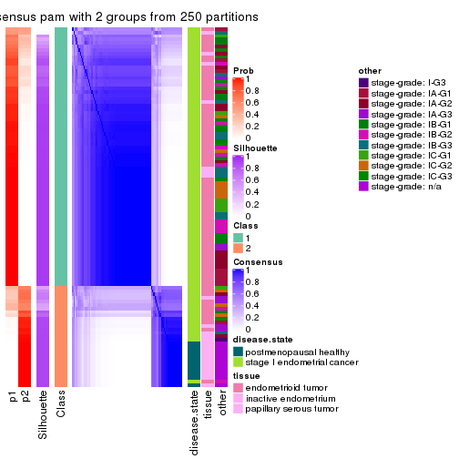</p>

</div>
<div id='tab-CV-pam-consensus-heatmap-2'>
<pre><code class="r">consensus_heatmap(res, k = 3)
</code></pre>

<p>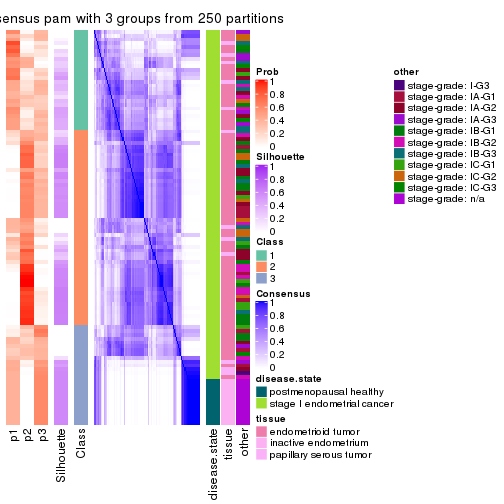</p>

</div>
<div id='tab-CV-pam-consensus-heatmap-3'>
<pre><code class="r">consensus_heatmap(res, k = 4)
</code></pre>

<p>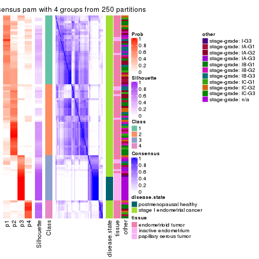</p>

</div>
<div id='tab-CV-pam-consensus-heatmap-4'>
<pre><code class="r">consensus_heatmap(res, k = 5)
</code></pre>

<p>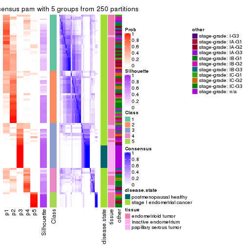</p>

</div>
<div id='tab-CV-pam-consensus-heatmap-5'>
<pre><code class="r">consensus_heatmap(res, k = 6)
</code></pre>

<p>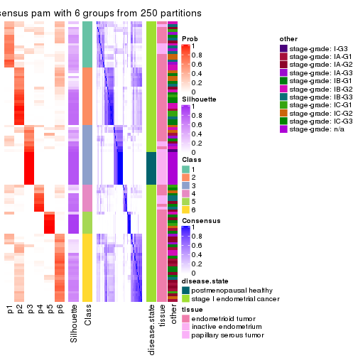</p>

</div>
</div>

Heatmaps for the membership of samples in all partitions to see how consistent they are:


<script>
$( function() {
	$( '#tabs-CV-pam-membership-heatmap' ).tabs();
} );
</script>
<div id='tabs-CV-pam-membership-heatmap'>
<ul>
<li><a href='#tab-CV-pam-membership-heatmap-1'>k = 2</a></li>
<li><a href='#tab-CV-pam-membership-heatmap-2'>k = 3</a></li>
<li><a href='#tab-CV-pam-membership-heatmap-3'>k = 4</a></li>
<li><a href='#tab-CV-pam-membership-heatmap-4'>k = 5</a></li>
<li><a href='#tab-CV-pam-membership-heatmap-5'>k = 6</a></li>
</ul>
<div id='tab-CV-pam-membership-heatmap-1'>
<pre><code class="r">membership_heatmap(res, k = 2)
</code></pre>

<p>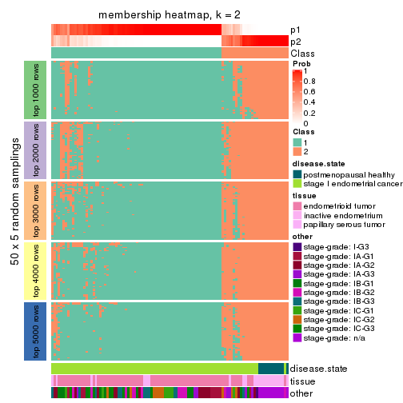</p>

</div>
<div id='tab-CV-pam-membership-heatmap-2'>
<pre><code class="r">membership_heatmap(res, k = 3)
</code></pre>

<p>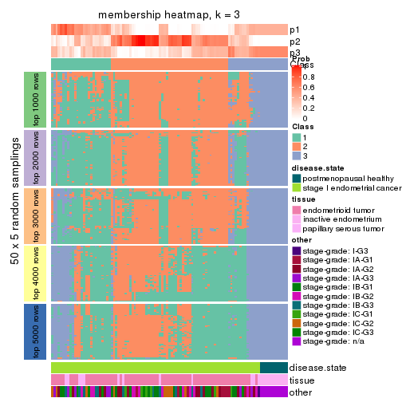</p>

</div>
<div id='tab-CV-pam-membership-heatmap-3'>
<pre><code class="r">membership_heatmap(res, k = 4)
</code></pre>

<p>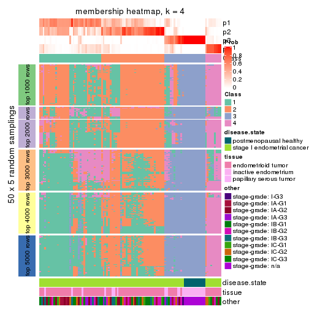</p>

</div>
<div id='tab-CV-pam-membership-heatmap-4'>
<pre><code class="r">membership_heatmap(res, k = 5)
</code></pre>

<p>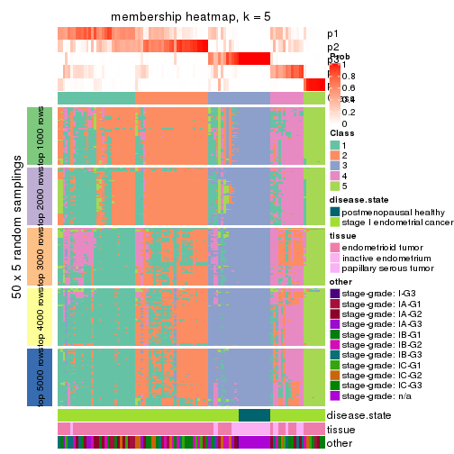</p>

</div>
<div id='tab-CV-pam-membership-heatmap-5'>
<pre><code class="r">membership_heatmap(res, k = 6)
</code></pre>

<p>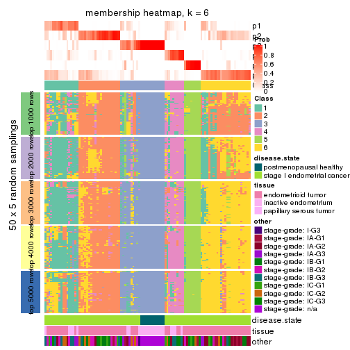</p>

</div>
</div>

As soon as we have had the classes for columns, we can look for signatures
which are significantly different between classes which can be candidate marks
for certain classes. Following are the heatmaps for signatures.


Signature heatmaps where rows are scaled:


<script>
$( function() {
	$( '#tabs-CV-pam-get-signatures' ).tabs();
} );
</script>
<div id='tabs-CV-pam-get-signatures'>
<ul>
<li><a href='#tab-CV-pam-get-signatures-1'>k = 2</a></li>
<li><a href='#tab-CV-pam-get-signatures-2'>k = 3</a></li>
<li><a href='#tab-CV-pam-get-signatures-3'>k = 4</a></li>
<li><a href='#tab-CV-pam-get-signatures-4'>k = 5</a></li>
<li><a href='#tab-CV-pam-get-signatures-5'>k = 6</a></li>
</ul>
<div id='tab-CV-pam-get-signatures-1'>
<pre><code class="r">get_signatures(res, k = 2)
</code></pre>

<p>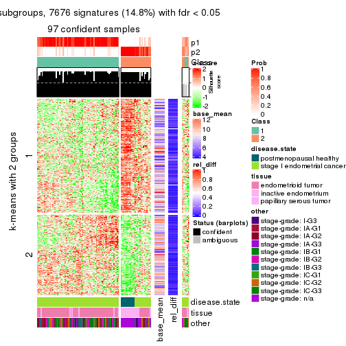</p>

</div>
<div id='tab-CV-pam-get-signatures-2'>
<pre><code class="r">get_signatures(res, k = 3)
</code></pre>

<p>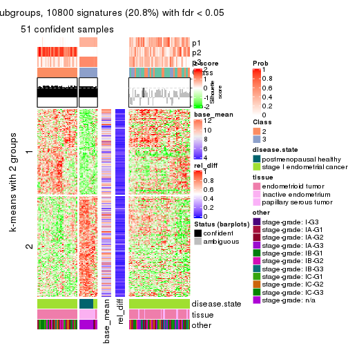</p>

</div>
<div id='tab-CV-pam-get-signatures-3'>
<pre><code class="r">get_signatures(res, k = 4)
</code></pre>

<p>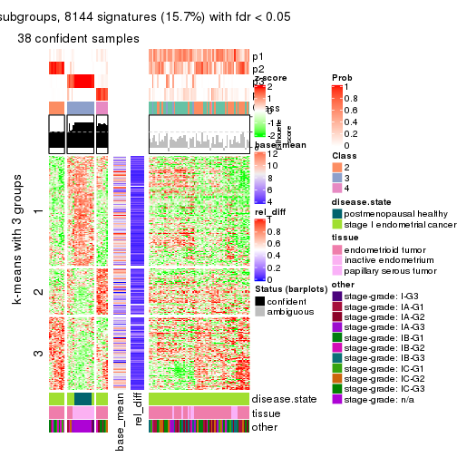</p>

</div>
<div id='tab-CV-pam-get-signatures-4'>
<pre><code class="r">get_signatures(res, k = 5)
</code></pre>

<p>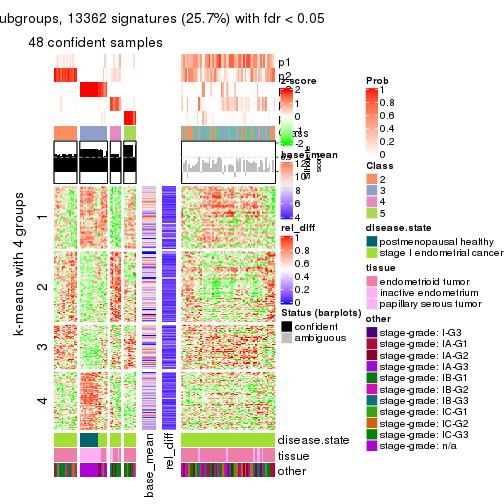</p>

</div>
<div id='tab-CV-pam-get-signatures-5'>
<pre><code class="r">get_signatures(res, k = 6)
</code></pre>

<p>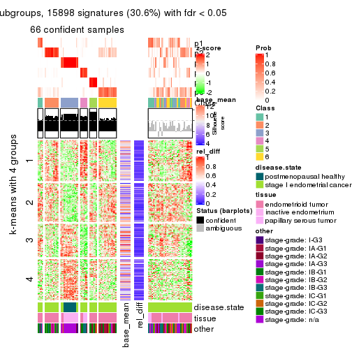</p>

</div>
</div>


Signature heatmaps where rows are not scaled:


<script>
$( function() {
	$( '#tabs-CV-pam-get-signatures-no-scale' ).tabs();
} );
</script>
<div id='tabs-CV-pam-get-signatures-no-scale'>
<ul>
<li><a href='#tab-CV-pam-get-signatures-no-scale-1'>k = 2</a></li>
<li><a href='#tab-CV-pam-get-signatures-no-scale-2'>k = 3</a></li>
<li><a href='#tab-CV-pam-get-signatures-no-scale-3'>k = 4</a></li>
<li><a href='#tab-CV-pam-get-signatures-no-scale-4'>k = 5</a></li>
<li><a href='#tab-CV-pam-get-signatures-no-scale-5'>k = 6</a></li>
</ul>
<div id='tab-CV-pam-get-signatures-no-scale-1'>
<pre><code class="r">get_signatures(res, k = 2, scale_rows = FALSE)
</code></pre>

<p>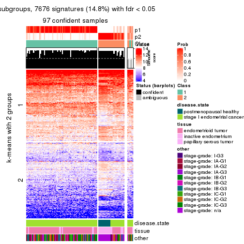</p>

</div>
<div id='tab-CV-pam-get-signatures-no-scale-2'>
<pre><code class="r">get_signatures(res, k = 3, scale_rows = FALSE)
</code></pre>

<p>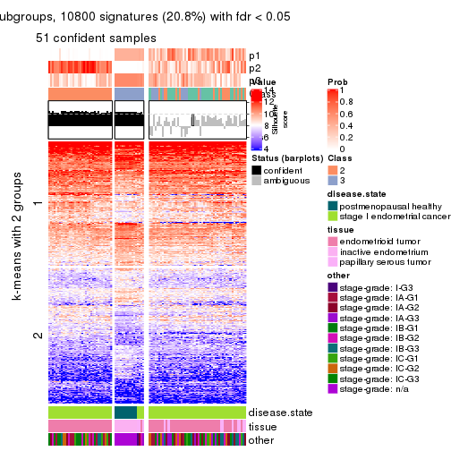</p>

</div>
<div id='tab-CV-pam-get-signatures-no-scale-3'>
<pre><code class="r">get_signatures(res, k = 4, scale_rows = FALSE)
</code></pre>

<p>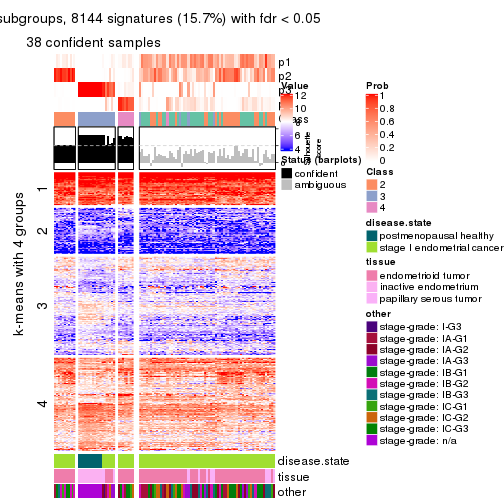</p>

</div>
<div id='tab-CV-pam-get-signatures-no-scale-4'>
<pre><code class="r">get_signatures(res, k = 5, scale_rows = FALSE)
</code></pre>

<p>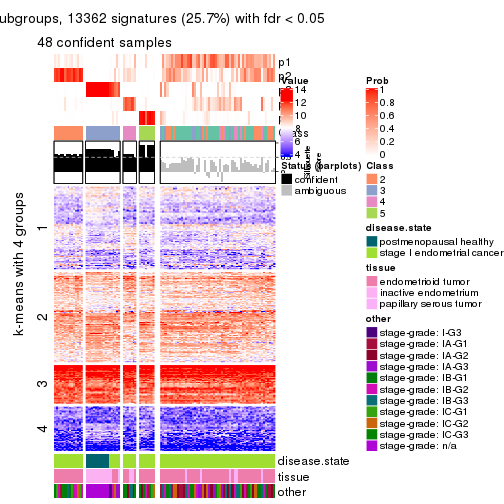</p>

</div>
<div id='tab-CV-pam-get-signatures-no-scale-5'>
<pre><code class="r">get_signatures(res, k = 6, scale_rows = FALSE)
</code></pre>

<p>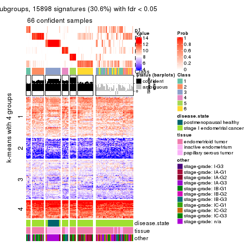</p>

</div>
</div>


Compare the overlap of signatures from different k:

```r
compare_signatures(res)
```

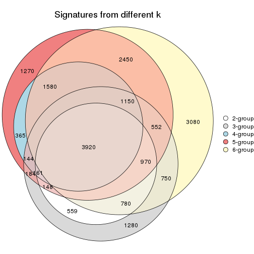

`get_signature()` returns a data frame invisibly. TO get the list of signatures, the function
call should be assigned to a variable explicitly. In following code, if `plot` argument is set
to `FALSE`, no heatmap is plotted while only the differential analysis is performed.

```r
# code only for demonstration
tb = get_signature(res, k = ..., plot = FALSE)
```

An example of the output of `tb` is:

```
#>   which_row         fdr    mean_1    mean_2 scaled_mean_1 scaled_mean_2 km
#> 1        38 0.042760348  8.373488  9.131774    -0.5533452     0.5164555  1
#> 2        40 0.018707592  7.106213  8.469186    -0.6173731     0.5762149  1
#> 3        55 0.019134737 10.221463 11.207825    -0.6159697     0.5749050  1
#> 4        59 0.006059896  5.921854  7.869574    -0.6899429     0.6439467  1
#> 5        60 0.018055526  8.928898 10.211722    -0.6204761     0.5791110  1
#> 6        98 0.009384629 15.714769 14.887706     0.6635654    -0.6193277  2
...
```

The columns in `tb` are:

1. `which_row`: row indices corresponding to the input matrix.
2. `fdr`: FDR for the differential test. 
3. `mean_x`: The mean value in group x.
4. `scaled_mean_x`: The mean value in group x after rows are scaled.
5. `km`: Row groups if k-means clustering is applied to rows.


UMAP plot which shows how samples are separated.


<script>
$( function() {
	$( '#tabs-CV-pam-dimension-reduction' ).tabs();
} );
</script>
<div id='tabs-CV-pam-dimension-reduction'>
<ul>
<li><a href='#tab-CV-pam-dimension-reduction-1'>k = 2</a></li>
<li><a href='#tab-CV-pam-dimension-reduction-2'>k = 3</a></li>
<li><a href='#tab-CV-pam-dimension-reduction-3'>k = 4</a></li>
<li><a href='#tab-CV-pam-dimension-reduction-4'>k = 5</a></li>
<li><a href='#tab-CV-pam-dimension-reduction-5'>k = 6</a></li>
</ul>
<div id='tab-CV-pam-dimension-reduction-1'>
<pre><code class="r">dimension_reduction(res, k = 2, method = &quot;UMAP&quot;)
</code></pre>

<p>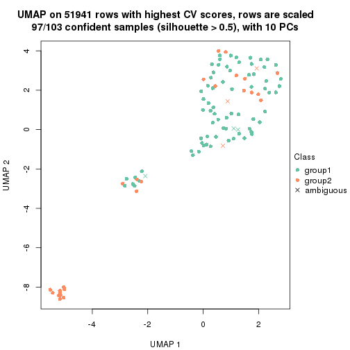</p>

</div>
<div id='tab-CV-pam-dimension-reduction-2'>
<pre><code class="r">dimension_reduction(res, k = 3, method = &quot;UMAP&quot;)
</code></pre>

<p>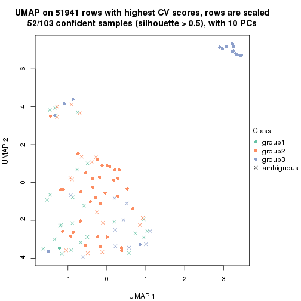</p>

</div>
<div id='tab-CV-pam-dimension-reduction-3'>
<pre><code class="r">dimension_reduction(res, k = 4, method = &quot;UMAP&quot;)
</code></pre>

<p>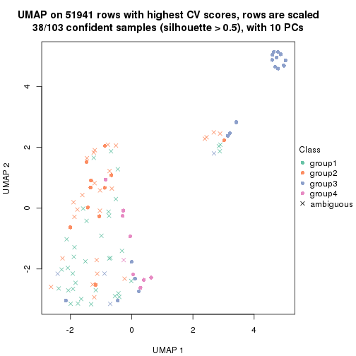</p>

</div>
<div id='tab-CV-pam-dimension-reduction-4'>
<pre><code class="r">dimension_reduction(res, k = 5, method = &quot;UMAP&quot;)
</code></pre>

<p>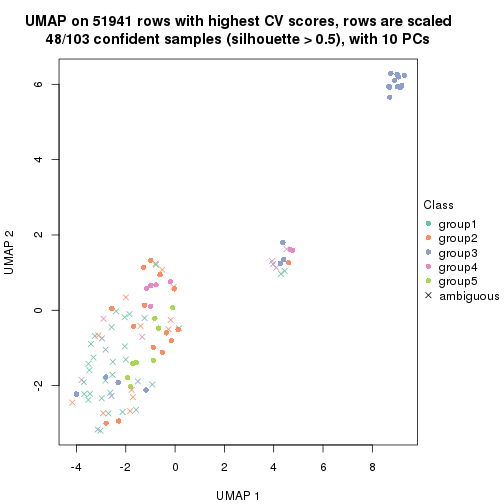</p>

</div>
<div id='tab-CV-pam-dimension-reduction-5'>
<pre><code class="r">dimension_reduction(res, k = 6, method = &quot;UMAP&quot;)
</code></pre>

<p>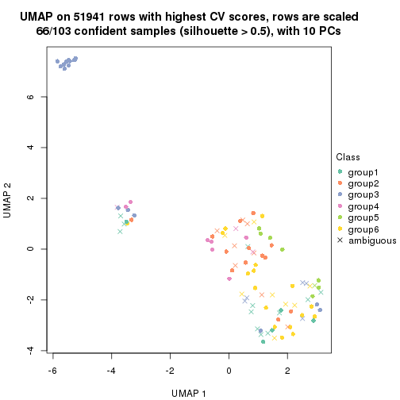</p>

</div>
</div>


Following heatmap shows how subgroups are split when increasing `k`:

```r
collect_classes(res)
```

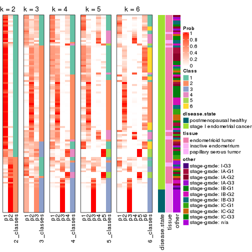


Test correlation between subgroups and known annotations. If the known
annotation is numeric, one-way ANOVA test is applied, and if the known
annotation is discrete, chi-squared contingency table test is applied.

```r
test_to_known_factors(res)
```

```
#>         n disease.state(p) tissue(p) other(p) k
#> CV:pam 97         8.07e-09  5.07e-10 4.14e-07 2
#> CV:pam 52         2.39e-08  1.24e-09 5.65e-05 3
#> CV:pam 38         1.55e-04  5.56e-05 1.20e-02 4
#> CV:pam 48         6.91e-06  5.60e-07 4.31e-04 5
#> CV:pam 66         5.18e-08  9.66e-11 5.33e-05 6
```


If matrix rows can be associated to genes, consider to use `functional_enrichment(res,
...)` to perform function enrichment for the signature genes. See [this vignette](http://bioconductor.org/packages/devel/bioc/vignettes/cola/inst/doc/functional_enrichment.html) for more detailed explanations.


 

---------------------------------------------------


### CV:mclust


The object with results only for a single top-value method and a single partition method 
can be extracted as:

```r
res = res_list["CV", "mclust"]
# you can also extract it by
# res = res_list["CV:mclust"]
```

A summary of `res` and all the functions that can be applied to it:

```r
res
```

```
#> A 'ConsensusPartition' object with k = 2, 3, 4, 5, 6.
#>   On a matrix with 51941 rows and 103 columns.
#>   Top rows (1000, 2000, 3000, 4000, 5000) are extracted by 'CV' method.
#>   Subgroups are detected by 'mclust' method.
#>   Performed in total 1250 partitions by row resampling.
#>   Best k for subgroups seems to be 3.
#> 
#> Following methods can be applied to this 'ConsensusPartition' object:
#>  [1] "cola_report"             "collect_classes"         "collect_plots"          
#>  [4] "collect_stats"           "colnames"                "compare_signatures"     
#>  [7] "consensus_heatmap"       "dimension_reduction"     "functional_enrichment"  
#> [10] "get_anno_col"            "get_anno"                "get_classes"            
#> [13] "get_consensus"           "get_matrix"              "get_membership"         
#> [16] "get_param"               "get_signatures"          "get_stats"              
#> [19] "is_best_k"               "is_stable_k"             "membership_heatmap"     
#> [22] "ncol"                    "nrow"                    "plot_ecdf"              
#> [25] "rownames"                "select_partition_number" "show"                   
#> [28] "suggest_best_k"          "test_to_known_factors"
```

`collect_plots()` function collects all the plots made from `res` for all `k` (number of partitions)
into one single page to provide an easy and fast comparison between different `k`.

```r
collect_plots(res)
```

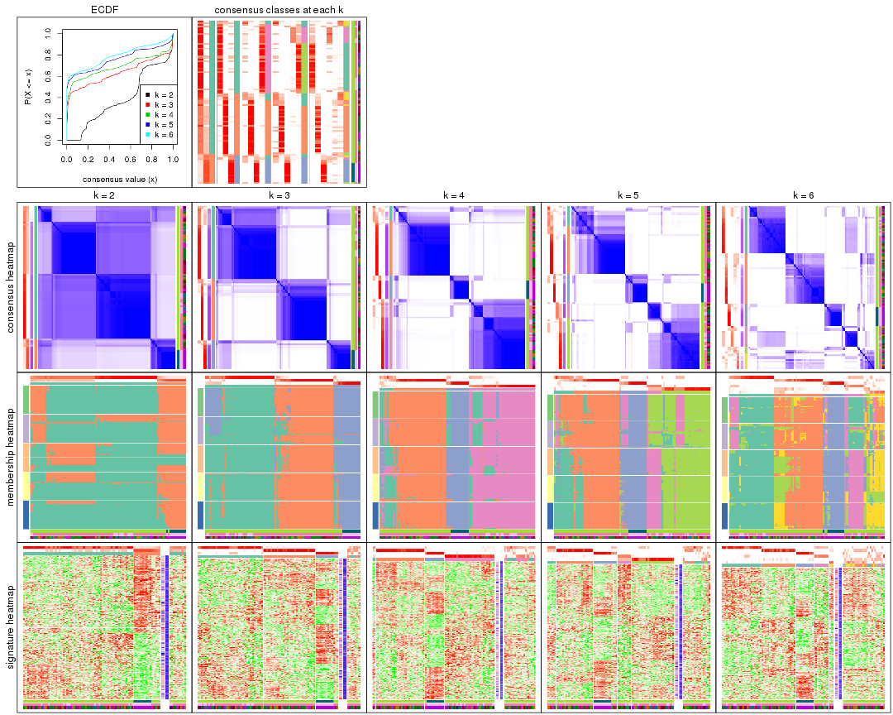

The plots are:

- The first row: a plot of the ECDF (empirical cumulative distribution
  function) curves of the consensus matrix for each `k` and the heatmap of
  predicted classes for each `k`.
- The second row: heatmaps of the consensus matrix for each `k`.
- The third row: heatmaps of the membership matrix for each `k`.
- The fouth row: heatmaps of the signatures for each `k`.

All the plots in panels can be made by individual functions and they are
plotted later in this section.

`select_partition_number()` produces several plots showing different
statistics for choosing "optimized" `k`. There are following statistics:

- ECDF curves of the consensus matrix for each `k`;
- 1-PAC. [The PAC
  score](https://en.wikipedia.org/wiki/Consensus_clustering#Over-interpretation_potential_of_consensus_clustering)
  measures the proportion of the ambiguous subgrouping.
- Mean silhouette score.
- Concordance. The mean probability of fiting the consensus class ids in all
  partitions.
- Area increased. Denote $A_k$ as the area under the ECDF curve for current
  `k`, the area increased is defined as $A_k - A_{k-1}$.
- Rand index. The percent of pairs of samples that are both in a same cluster
  or both are not in a same cluster in the partition of k and k-1.
- Jaccard index. The ratio of pairs of samples are both in a same cluster in
  the partition of k and k-1 and the pairs of samples are both in a same
  cluster in the partition k or k-1.

The detailed explanations of these statistics can be found in [the _cola_
vignette](http://bioconductor.org/packages/devel/bioc/vignettes/cola/inst/doc/cola.html#toc_13).

Generally speaking, lower PAC score, higher mean silhouette score or higher
concordance corresponds to better partition. Rand index and Jaccard index
measure how similar the current partition is compared to partition with `k-1`.
If they are too similar, we won't accept `k` is better than `k-1`.

```r
select_partition_number(res)
```

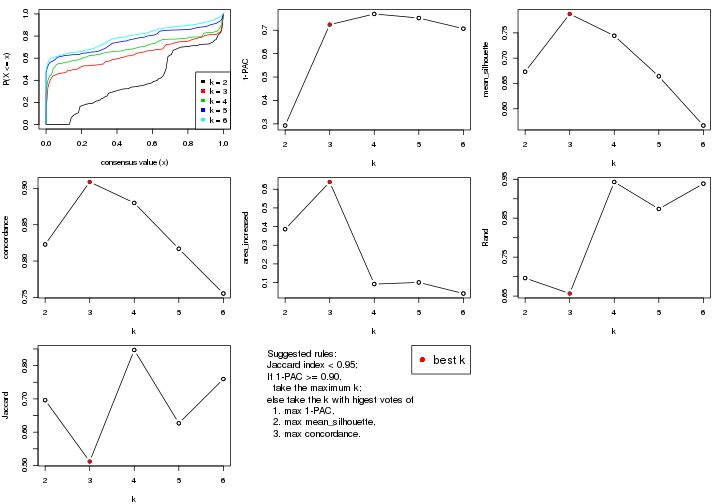

The numeric values for all these statistics can be obtained by `get_stats()`.

```r
get_stats(res)
```

```
#>   k 1-PAC mean_silhouette concordance area_increased  Rand Jaccard
#> 2 2 0.293           0.673       0.823         0.3862 0.696   0.696
#> 3 3 0.724           0.787       0.909         0.6391 0.657   0.512
#> 4 4 0.770           0.744       0.880         0.0918 0.943   0.847
#> 5 5 0.752           0.664       0.817         0.1008 0.874   0.627
#> 6 6 0.707           0.567       0.755         0.0413 0.939   0.760
```

`suggest_best_k()` suggests the best $k$ based on these statistics. The rules are as follows:

- All $k$ with Jaccard index larger than 0.95 are removed because increasing
  $k$ does not provide enough extra information. If all $k$ are removed, it is
  marked as no subgroup is detected.
- For all $k$ with 1-PAC score larger than 0.9, the maximal $k$ is taken as
  the best $k$, and other $k$ are marked as optional $k$.
- If it does not fit the second rule. The $k$ with the maximal vote of the
  highest 1-PAC score, highest mean silhouette, and highest concordance is
  taken as the best $k$.

```r
suggest_best_k(res)
```

```
#> [1] 3
```


Following shows the table of the partitions (You need to click the **show/hide
code output** link to see it). The membership matrix (columns with name `p*`)
is inferred by
[`clue::cl_consensus()`](https://www.rdocumentation.org/link/cl_consensus?package=clue)
function with the `SE` method. Basically the value in the membership matrix
represents the probability to belong to a certain group. The finall class
label for an item is determined with the group with highest probability it
belongs to.

In `get_classes()` function, the entropy is calculated from the membership
matrix and the silhouette score is calculated from the consensus matrix.


<script>
$( function() {
	$( '#tabs-CV-mclust-get-classes' ).tabs();
} );
</script>
<div id='tabs-CV-mclust-get-classes'>
<ul>
<li><a href='#tab-CV-mclust-get-classes-1'>k = 2</a></li>
<li><a href='#tab-CV-mclust-get-classes-2'>k = 3</a></li>
<li><a href='#tab-CV-mclust-get-classes-3'>k = 4</a></li>
<li><a href='#tab-CV-mclust-get-classes-4'>k = 5</a></li>
<li><a href='#tab-CV-mclust-get-classes-5'>k = 6</a></li>
</ul>

<div id='tab-CV-mclust-get-classes-1'>
<p><a id='tab-CV-mclust-get-classes-1-a' style='color:#0366d6' href='#'>show/hide code output</a></p>
<pre><code class="r">cbind(get_classes(res, k = 2), get_membership(res, k = 2))
</code></pre>

<pre><code>#&gt;           class entropy silhouette    p1    p2
#&gt; GSM425907     1  0.9044      0.685 0.680 0.320
#&gt; GSM425908     1  0.9044      0.685 0.680 0.320
#&gt; GSM425909     2  0.9393      0.652 0.356 0.644
#&gt; GSM425910     1  0.2236      0.758 0.964 0.036
#&gt; GSM425911     1  0.9044      0.685 0.680 0.320
#&gt; GSM425912     1  0.9044      0.685 0.680 0.320
#&gt; GSM425913     1  0.9044      0.685 0.680 0.320
#&gt; GSM425914     1  0.9044      0.685 0.680 0.320
#&gt; GSM425915     2  0.6973      0.873 0.188 0.812
#&gt; GSM425874     1  0.0938      0.753 0.988 0.012
#&gt; GSM425875     1  0.9209      0.108 0.664 0.336
#&gt; GSM425876     1  0.2043      0.759 0.968 0.032
#&gt; GSM425877     1  0.0000      0.759 1.000 0.000
#&gt; GSM425878     1  0.0000      0.759 1.000 0.000
#&gt; GSM425879     1  0.9044      0.685 0.680 0.320
#&gt; GSM425880     1  0.9209      0.108 0.664 0.336
#&gt; GSM425881     1  0.9044      0.685 0.680 0.320
#&gt; GSM425882     1  0.9044      0.685 0.680 0.320
#&gt; GSM425883     1  0.1414      0.760 0.980 0.020
#&gt; GSM425884     1  0.0000      0.759 1.000 0.000
#&gt; GSM425885     1  0.1184      0.759 0.984 0.016
#&gt; GSM425848     1  0.0000      0.759 1.000 0.000
#&gt; GSM425849     1  0.0000      0.759 1.000 0.000
#&gt; GSM425850     1  0.1843      0.760 0.972 0.028
#&gt; GSM425851     1  0.0000      0.759 1.000 0.000
#&gt; GSM425852     1  0.9732     -0.167 0.596 0.404
#&gt; GSM425893     1  0.9710      0.593 0.600 0.400
#&gt; GSM425894     1  0.9044      0.685 0.680 0.320
#&gt; GSM425895     1  0.9044      0.685 0.680 0.320
#&gt; GSM425896     1  0.9460      0.641 0.636 0.364
#&gt; GSM425897     1  0.9044      0.685 0.680 0.320
#&gt; GSM425898     1  0.9044      0.685 0.680 0.320
#&gt; GSM425899     1  0.2236      0.759 0.964 0.036
#&gt; GSM425900     1  0.9044      0.685 0.680 0.320
#&gt; GSM425901     2  0.9833      0.535 0.424 0.576
#&gt; GSM425902     1  0.0000      0.759 1.000 0.000
#&gt; GSM425903     2  0.8443      0.770 0.272 0.728
#&gt; GSM425904     1  0.9286      0.077 0.656 0.344
#&gt; GSM425905     1  0.9044      0.685 0.680 0.320
#&gt; GSM425906     1  0.9044      0.685 0.680 0.320
#&gt; GSM425863     1  0.0000      0.759 1.000 0.000
#&gt; GSM425864     1  0.9044      0.685 0.680 0.320
#&gt; GSM425865     1  0.9044      0.685 0.680 0.320
#&gt; GSM425866     1  0.9209      0.108 0.664 0.336
#&gt; GSM425867     2  0.6438      0.892 0.164 0.836
#&gt; GSM425868     1  0.8661      0.698 0.712 0.288
#&gt; GSM425869     1  0.9044      0.685 0.680 0.320
#&gt; GSM425870     2  0.9710      0.330 0.400 0.600
#&gt; GSM425871     1  0.0376      0.760 0.996 0.004
#&gt; GSM425872     1  0.9044      0.685 0.680 0.320
#&gt; GSM425873     1  0.1843      0.760 0.972 0.028
#&gt; GSM425843     1  0.0000      0.759 1.000 0.000
#&gt; GSM425844     1  0.0000      0.759 1.000 0.000
#&gt; GSM425845     1  0.9460      0.109 0.636 0.364
#&gt; GSM425846     1  0.8555      0.700 0.720 0.280
#&gt; GSM425847     1  0.3584      0.755 0.932 0.068
#&gt; GSM425886     2  0.8386      0.783 0.268 0.732
#&gt; GSM425887     1  0.8327      0.699 0.736 0.264
#&gt; GSM425888     1  0.8661      0.698 0.712 0.288
#&gt; GSM425889     1  0.0000      0.759 1.000 0.000
#&gt; GSM425890     1  0.0000      0.759 1.000 0.000
#&gt; GSM425891     1  0.9044      0.685 0.680 0.320
#&gt; GSM425892     1  0.9044      0.685 0.680 0.320
#&gt; GSM425853     1  0.3274      0.705 0.940 0.060
#&gt; GSM425854     1  0.9044      0.685 0.680 0.320
#&gt; GSM425855     1  0.0000      0.759 1.000 0.000
#&gt; GSM425856     1  0.9209      0.108 0.664 0.336
#&gt; GSM425857     1  0.9209      0.108 0.664 0.336
#&gt; GSM425858     1  0.9044      0.685 0.680 0.320
#&gt; GSM425859     1  0.9044      0.685 0.680 0.320
#&gt; GSM425860     1  0.6887      0.700 0.816 0.184
#&gt; GSM425861     1  0.3274      0.757 0.940 0.060
#&gt; GSM425862     1  0.0000      0.759 1.000 0.000
#&gt; GSM425837     1  0.0376      0.757 0.996 0.004
#&gt; GSM425838     1  0.0000      0.759 1.000 0.000
#&gt; GSM425839     1  0.9044      0.685 0.680 0.320
#&gt; GSM425840     1  0.0000      0.759 1.000 0.000
#&gt; GSM425841     1  0.0376      0.758 0.996 0.004
#&gt; GSM425842     1  0.1184      0.760 0.984 0.016
#&gt; GSM425917     1  0.9933     -0.257 0.548 0.452
#&gt; GSM425922     1  0.0376      0.758 0.996 0.004
#&gt; GSM425919     1  0.0672      0.755 0.992 0.008
#&gt; GSM425920     1  0.0000      0.759 1.000 0.000
#&gt; GSM425923     1  0.0000      0.759 1.000 0.000
#&gt; GSM425916     1  0.0000      0.759 1.000 0.000
#&gt; GSM425918     1  0.0000      0.759 1.000 0.000
#&gt; GSM425921     1  0.0672      0.755 0.992 0.008
#&gt; GSM425925     1  0.0672      0.755 0.992 0.008
#&gt; GSM425926     1  0.0938      0.753 0.988 0.012
#&gt; GSM425927     1  0.0376      0.760 0.996 0.004
#&gt; GSM425924     1  0.9850     -0.216 0.572 0.428
#&gt; GSM425928     2  0.5737      0.905 0.136 0.864
#&gt; GSM425929     2  0.5737      0.905 0.136 0.864
#&gt; GSM425930     2  0.5737      0.905 0.136 0.864
#&gt; GSM425931     2  0.5737      0.905 0.136 0.864
#&gt; GSM425932     2  0.5737      0.905 0.136 0.864
#&gt; GSM425933     2  0.5737      0.905 0.136 0.864
#&gt; GSM425934     2  0.5737      0.905 0.136 0.864
#&gt; GSM425935     2  0.6531      0.890 0.168 0.832
#&gt; GSM425936     2  0.5737      0.905 0.136 0.864
#&gt; GSM425937     2  0.5737      0.905 0.136 0.864
#&gt; GSM425938     2  0.5737      0.905 0.136 0.864
#&gt; GSM425939     2  0.5737      0.905 0.136 0.864
</code></pre>

<script>
$('#tab-CV-mclust-get-classes-1-a').parent().next().next().hide();
$('#tab-CV-mclust-get-classes-1-a').click(function(){
  $('#tab-CV-mclust-get-classes-1-a').parent().next().next().toggle();
  return(false);
});
</script>
</div>

<div id='tab-CV-mclust-get-classes-2'>
<p><a id='tab-CV-mclust-get-classes-2-a' style='color:#0366d6' href='#'>show/hide code output</a></p>
<pre><code class="r">cbind(get_classes(res, k = 3), get_membership(res, k = 3))
</code></pre>

<pre><code>#&gt;           class entropy silhouette    p1    p2    p3
#&gt; GSM425907     2  0.0000     0.9078 0.000 1.000 0.000
#&gt; GSM425908     2  0.0000     0.9078 0.000 1.000 0.000
#&gt; GSM425909     3  0.7329     0.1306 0.424 0.032 0.544
#&gt; GSM425910     2  0.7339     0.3192 0.392 0.572 0.036
#&gt; GSM425911     2  0.0000     0.9078 0.000 1.000 0.000
#&gt; GSM425912     2  0.0424     0.9033 0.008 0.992 0.000
#&gt; GSM425913     2  0.0000     0.9078 0.000 1.000 0.000
#&gt; GSM425914     2  0.0000     0.9078 0.000 1.000 0.000
#&gt; GSM425915     3  0.3310     0.8530 0.028 0.064 0.908
#&gt; GSM425874     1  0.0237     0.8787 0.996 0.004 0.000
#&gt; GSM425875     1  0.5982     0.5473 0.668 0.004 0.328
#&gt; GSM425876     2  0.7069     0.0850 0.472 0.508 0.020
#&gt; GSM425877     1  0.0424     0.8806 0.992 0.008 0.000
#&gt; GSM425878     1  0.0424     0.8806 0.992 0.008 0.000
#&gt; GSM425879     2  0.0000     0.9078 0.000 1.000 0.000
#&gt; GSM425880     1  0.6008     0.5399 0.664 0.004 0.332
#&gt; GSM425881     2  0.0000     0.9078 0.000 1.000 0.000
#&gt; GSM425882     2  0.0000     0.9078 0.000 1.000 0.000
#&gt; GSM425883     1  0.0592     0.8789 0.988 0.012 0.000
#&gt; GSM425884     1  0.0661     0.8795 0.988 0.008 0.004
#&gt; GSM425885     1  0.4164     0.7441 0.848 0.144 0.008
#&gt; GSM425848     1  0.0424     0.8806 0.992 0.008 0.000
#&gt; GSM425849     1  0.0424     0.8806 0.992 0.008 0.000
#&gt; GSM425850     1  0.4399     0.6939 0.812 0.188 0.000
#&gt; GSM425851     1  0.0829     0.8760 0.984 0.004 0.012
#&gt; GSM425852     1  0.5982     0.5473 0.668 0.004 0.328
#&gt; GSM425893     2  0.4063     0.7938 0.020 0.868 0.112
#&gt; GSM425894     2  0.0000     0.9078 0.000 1.000 0.000
#&gt; GSM425895     2  0.0000     0.9078 0.000 1.000 0.000
#&gt; GSM425896     2  0.3752     0.8121 0.020 0.884 0.096
#&gt; GSM425897     2  0.0000     0.9078 0.000 1.000 0.000
#&gt; GSM425898     2  0.0000     0.9078 0.000 1.000 0.000
#&gt; GSM425899     2  0.6309     0.0227 0.496 0.504 0.000
#&gt; GSM425900     2  0.0000     0.9078 0.000 1.000 0.000
#&gt; GSM425901     3  0.7049     0.0425 0.452 0.020 0.528
#&gt; GSM425902     1  0.0424     0.8806 0.992 0.008 0.000
#&gt; GSM425903     3  0.6843     0.4340 0.028 0.332 0.640
#&gt; GSM425904     1  0.6008     0.5399 0.664 0.004 0.332
#&gt; GSM425905     2  0.0000     0.9078 0.000 1.000 0.000
#&gt; GSM425906     2  0.0000     0.9078 0.000 1.000 0.000
#&gt; GSM425863     1  0.0424     0.8806 0.992 0.008 0.000
#&gt; GSM425864     2  0.0000     0.9078 0.000 1.000 0.000
#&gt; GSM425865     2  0.0000     0.9078 0.000 1.000 0.000
#&gt; GSM425866     1  0.5982     0.5473 0.668 0.004 0.328
#&gt; GSM425867     3  0.1525     0.8855 0.032 0.004 0.964
#&gt; GSM425868     2  0.3116     0.8307 0.108 0.892 0.000
#&gt; GSM425869     2  0.0000     0.9078 0.000 1.000 0.000
#&gt; GSM425870     2  0.6796     0.3761 0.020 0.612 0.368
#&gt; GSM425871     1  0.0424     0.8806 0.992 0.008 0.000
#&gt; GSM425872     2  0.0000     0.9078 0.000 1.000 0.000
#&gt; GSM425873     1  0.6633     0.1237 0.548 0.444 0.008
#&gt; GSM425843     1  0.0424     0.8806 0.992 0.008 0.000
#&gt; GSM425844     1  0.0424     0.8806 0.992 0.008 0.000
#&gt; GSM425845     1  0.9980    -0.0432 0.364 0.312 0.324
#&gt; GSM425846     2  0.3192     0.8277 0.112 0.888 0.000
#&gt; GSM425847     2  0.4121     0.7696 0.168 0.832 0.000
#&gt; GSM425886     3  0.3112     0.8596 0.028 0.056 0.916
#&gt; GSM425887     2  0.1163     0.8913 0.028 0.972 0.000
#&gt; GSM425888     2  0.0592     0.9007 0.012 0.988 0.000
#&gt; GSM425889     1  0.0424     0.8806 0.992 0.008 0.000
#&gt; GSM425890     1  0.0424     0.8806 0.992 0.008 0.000
#&gt; GSM425891     2  0.0000     0.9078 0.000 1.000 0.000
#&gt; GSM425892     2  0.0000     0.9078 0.000 1.000 0.000
#&gt; GSM425853     1  0.4755     0.7387 0.808 0.008 0.184
#&gt; GSM425854     2  0.0000     0.9078 0.000 1.000 0.000
#&gt; GSM425855     1  0.0424     0.8806 0.992 0.008 0.000
#&gt; GSM425856     1  0.5956     0.5537 0.672 0.004 0.324
#&gt; GSM425857     1  0.6180     0.5343 0.660 0.008 0.332
#&gt; GSM425858     2  0.0000     0.9078 0.000 1.000 0.000
#&gt; GSM425859     2  0.0000     0.9078 0.000 1.000 0.000
#&gt; GSM425860     2  0.7129     0.6464 0.180 0.716 0.104
#&gt; GSM425861     2  0.4504     0.7418 0.196 0.804 0.000
#&gt; GSM425862     1  0.0424     0.8806 0.992 0.008 0.000
#&gt; GSM425837     1  0.0661     0.8795 0.988 0.008 0.004
#&gt; GSM425838     1  0.0237     0.8787 0.996 0.004 0.000
#&gt; GSM425839     2  0.0000     0.9078 0.000 1.000 0.000
#&gt; GSM425840     1  0.0424     0.8806 0.992 0.008 0.000
#&gt; GSM425841     1  0.0237     0.8787 0.996 0.004 0.000
#&gt; GSM425842     1  0.1163     0.8690 0.972 0.028 0.000
#&gt; GSM425917     1  0.5588     0.6384 0.720 0.004 0.276
#&gt; GSM425922     1  0.0237     0.8787 0.996 0.004 0.000
#&gt; GSM425919     1  0.1647     0.8628 0.960 0.004 0.036
#&gt; GSM425920     1  0.0475     0.8790 0.992 0.004 0.004
#&gt; GSM425923     1  0.0424     0.8806 0.992 0.008 0.000
#&gt; GSM425916     1  0.1525     0.8653 0.964 0.004 0.032
#&gt; GSM425918     1  0.0424     0.8806 0.992 0.008 0.000
#&gt; GSM425921     1  0.0237     0.8787 0.996 0.004 0.000
#&gt; GSM425925     1  0.0424     0.8806 0.992 0.008 0.000
#&gt; GSM425926     1  0.0237     0.8787 0.996 0.004 0.000
#&gt; GSM425927     1  0.0424     0.8806 0.992 0.008 0.000
#&gt; GSM425924     1  0.5443     0.6554 0.736 0.004 0.260
#&gt; GSM425928     3  0.0000     0.9012 0.000 0.000 1.000
#&gt; GSM425929     3  0.0000     0.9012 0.000 0.000 1.000
#&gt; GSM425930     3  0.0000     0.9012 0.000 0.000 1.000
#&gt; GSM425931     3  0.0000     0.9012 0.000 0.000 1.000
#&gt; GSM425932     3  0.0000     0.9012 0.000 0.000 1.000
#&gt; GSM425933     3  0.0000     0.9012 0.000 0.000 1.000
#&gt; GSM425934     3  0.0000     0.9012 0.000 0.000 1.000
#&gt; GSM425935     3  0.0983     0.8924 0.016 0.004 0.980
#&gt; GSM425936     3  0.0000     0.9012 0.000 0.000 1.000
#&gt; GSM425937     3  0.0000     0.9012 0.000 0.000 1.000
#&gt; GSM425938     3  0.0592     0.8964 0.012 0.000 0.988
#&gt; GSM425939     3  0.0000     0.9012 0.000 0.000 1.000
</code></pre>

<script>
$('#tab-CV-mclust-get-classes-2-a').parent().next().next().hide();
$('#tab-CV-mclust-get-classes-2-a').click(function(){
  $('#tab-CV-mclust-get-classes-2-a').parent().next().next().toggle();
  return(false);
});
</script>
</div>

<div id='tab-CV-mclust-get-classes-3'>
<p><a id='tab-CV-mclust-get-classes-3-a' style='color:#0366d6' href='#'>show/hide code output</a></p>
<pre><code class="r">cbind(get_classes(res, k = 4), get_membership(res, k = 4))
</code></pre>

<pre><code>#&gt;           class entropy silhouette    p1    p2    p3    p4
#&gt; GSM425907     2  0.0000     0.9427 0.000 1.000 0.000 0.000
#&gt; GSM425908     2  0.0000     0.9427 0.000 1.000 0.000 0.000
#&gt; GSM425909     1  0.8797    -0.0238 0.376 0.048 0.344 0.232
#&gt; GSM425910     1  0.7033     0.4870 0.528 0.336 0.000 0.136
#&gt; GSM425911     2  0.0336     0.9379 0.000 0.992 0.000 0.008
#&gt; GSM425912     2  0.1042     0.9269 0.020 0.972 0.000 0.008
#&gt; GSM425913     2  0.0000     0.9427 0.000 1.000 0.000 0.000
#&gt; GSM425914     2  0.0927     0.9295 0.016 0.976 0.000 0.008
#&gt; GSM425915     3  0.6388     0.4360 0.360 0.056 0.576 0.008
#&gt; GSM425874     4  0.2530     0.7981 0.112 0.000 0.000 0.888
#&gt; GSM425875     4  0.4713     0.4876 0.360 0.000 0.000 0.640
#&gt; GSM425876     1  0.7307     0.5312 0.524 0.284 0.000 0.192
#&gt; GSM425877     4  0.0000     0.8480 0.000 0.000 0.000 1.000
#&gt; GSM425878     4  0.0000     0.8480 0.000 0.000 0.000 1.000
#&gt; GSM425879     2  0.0000     0.9427 0.000 1.000 0.000 0.000
#&gt; GSM425880     4  0.4776     0.4646 0.376 0.000 0.000 0.624
#&gt; GSM425881     2  0.1256     0.9201 0.028 0.964 0.000 0.008
#&gt; GSM425882     2  0.0000     0.9427 0.000 1.000 0.000 0.000
#&gt; GSM425883     4  0.0804     0.8411 0.012 0.008 0.000 0.980
#&gt; GSM425884     4  0.0188     0.8467 0.004 0.000 0.000 0.996
#&gt; GSM425885     4  0.3895     0.6369 0.012 0.184 0.000 0.804
#&gt; GSM425848     4  0.0779     0.8396 0.004 0.016 0.000 0.980
#&gt; GSM425849     4  0.0188     0.8464 0.000 0.004 0.000 0.996
#&gt; GSM425850     4  0.6010    -0.0875 0.472 0.040 0.000 0.488
#&gt; GSM425851     4  0.0000     0.8480 0.000 0.000 0.000 1.000
#&gt; GSM425852     4  0.5040     0.4752 0.364 0.008 0.000 0.628
#&gt; GSM425893     2  0.0672     0.9341 0.008 0.984 0.000 0.008
#&gt; GSM425894     2  0.0000     0.9427 0.000 1.000 0.000 0.000
#&gt; GSM425895     2  0.0000     0.9427 0.000 1.000 0.000 0.000
#&gt; GSM425896     2  0.0000     0.9427 0.000 1.000 0.000 0.000
#&gt; GSM425897     2  0.0000     0.9427 0.000 1.000 0.000 0.000
#&gt; GSM425898     2  0.0000     0.9427 0.000 1.000 0.000 0.000
#&gt; GSM425899     2  0.7164    -0.0499 0.240 0.556 0.000 0.204
#&gt; GSM425900     2  0.0672     0.9349 0.008 0.984 0.000 0.008
#&gt; GSM425901     1  0.8761     0.0782 0.376 0.040 0.276 0.308
#&gt; GSM425902     4  0.2654     0.7986 0.108 0.004 0.000 0.888
#&gt; GSM425903     1  0.7521    -0.0265 0.528 0.140 0.316 0.016
#&gt; GSM425904     4  0.4776     0.4646 0.376 0.000 0.000 0.624
#&gt; GSM425905     2  0.0000     0.9427 0.000 1.000 0.000 0.000
#&gt; GSM425906     2  0.0804     0.9324 0.012 0.980 0.000 0.008
#&gt; GSM425863     4  0.0000     0.8480 0.000 0.000 0.000 1.000
#&gt; GSM425864     2  0.0000     0.9427 0.000 1.000 0.000 0.000
#&gt; GSM425865     2  0.0000     0.9427 0.000 1.000 0.000 0.000
#&gt; GSM425866     4  0.4761     0.4706 0.372 0.000 0.000 0.628
#&gt; GSM425867     3  0.5783     0.5178 0.324 0.032 0.636 0.008
#&gt; GSM425868     2  0.0469     0.9312 0.000 0.988 0.000 0.012
#&gt; GSM425869     2  0.0000     0.9427 0.000 1.000 0.000 0.000
#&gt; GSM425870     2  0.4160     0.6757 0.016 0.808 0.168 0.008
#&gt; GSM425871     4  0.0000     0.8480 0.000 0.000 0.000 1.000
#&gt; GSM425872     2  0.0000     0.9427 0.000 1.000 0.000 0.000
#&gt; GSM425873     1  0.7372     0.5412 0.524 0.236 0.000 0.240
#&gt; GSM425843     4  0.0000     0.8480 0.000 0.000 0.000 1.000
#&gt; GSM425844     4  0.0000     0.8480 0.000 0.000 0.000 1.000
#&gt; GSM425845     1  0.3435     0.3987 0.864 0.036 0.000 0.100
#&gt; GSM425846     2  0.0804     0.9331 0.012 0.980 0.000 0.008
#&gt; GSM425847     1  0.6130     0.2838 0.512 0.440 0.000 0.048
#&gt; GSM425886     3  0.6539     0.4138 0.372 0.044 0.564 0.020
#&gt; GSM425887     2  0.1042     0.9271 0.020 0.972 0.000 0.008
#&gt; GSM425888     2  0.2859     0.8147 0.112 0.880 0.000 0.008
#&gt; GSM425889     4  0.0000     0.8480 0.000 0.000 0.000 1.000
#&gt; GSM425890     4  0.1635     0.8315 0.044 0.008 0.000 0.948
#&gt; GSM425891     2  0.0188     0.9407 0.000 0.996 0.000 0.004
#&gt; GSM425892     2  0.0000     0.9427 0.000 1.000 0.000 0.000
#&gt; GSM425853     4  0.0921     0.8366 0.028 0.000 0.000 0.972
#&gt; GSM425854     2  0.0000     0.9427 0.000 1.000 0.000 0.000
#&gt; GSM425855     4  0.0000     0.8480 0.000 0.000 0.000 1.000
#&gt; GSM425856     4  0.4713     0.4876 0.360 0.000 0.000 0.640
#&gt; GSM425857     4  0.5723     0.4106 0.388 0.032 0.000 0.580
#&gt; GSM425858     2  0.0524     0.9368 0.004 0.988 0.000 0.008
#&gt; GSM425859     2  0.0000     0.9427 0.000 1.000 0.000 0.000
#&gt; GSM425860     1  0.6484     0.3124 0.504 0.432 0.004 0.060
#&gt; GSM425861     2  0.5859    -0.2231 0.472 0.496 0.000 0.032
#&gt; GSM425862     4  0.0000     0.8480 0.000 0.000 0.000 1.000
#&gt; GSM425837     4  0.0000     0.8480 0.000 0.000 0.000 1.000
#&gt; GSM425838     4  0.2530     0.7981 0.112 0.000 0.000 0.888
#&gt; GSM425839     2  0.0000     0.9427 0.000 1.000 0.000 0.000
#&gt; GSM425840     4  0.0000     0.8480 0.000 0.000 0.000 1.000
#&gt; GSM425841     4  0.2530     0.7981 0.112 0.000 0.000 0.888
#&gt; GSM425842     4  0.5628     0.1188 0.420 0.024 0.000 0.556
#&gt; GSM425917     4  0.5453     0.4602 0.000 0.032 0.320 0.648
#&gt; GSM425922     4  0.2530     0.7981 0.112 0.000 0.000 0.888
#&gt; GSM425919     4  0.0000     0.8480 0.000 0.000 0.000 1.000
#&gt; GSM425920     4  0.0000     0.8480 0.000 0.000 0.000 1.000
#&gt; GSM425923     4  0.0000     0.8480 0.000 0.000 0.000 1.000
#&gt; GSM425916     4  0.0000     0.8480 0.000 0.000 0.000 1.000
#&gt; GSM425918     4  0.0000     0.8480 0.000 0.000 0.000 1.000
#&gt; GSM425921     4  0.2530     0.7981 0.112 0.000 0.000 0.888
#&gt; GSM425925     4  0.0937     0.8409 0.012 0.012 0.000 0.976
#&gt; GSM425926     4  0.2530     0.7981 0.112 0.000 0.000 0.888
#&gt; GSM425927     4  0.1042     0.8365 0.020 0.008 0.000 0.972
#&gt; GSM425924     4  0.4764     0.6234 0.000 0.032 0.220 0.748
#&gt; GSM425928     3  0.0188     0.8893 0.000 0.004 0.996 0.000
#&gt; GSM425929     3  0.0000     0.8933 0.000 0.000 1.000 0.000
#&gt; GSM425930     3  0.0000     0.8933 0.000 0.000 1.000 0.000
#&gt; GSM425931     3  0.0000     0.8933 0.000 0.000 1.000 0.000
#&gt; GSM425932     3  0.0000     0.8933 0.000 0.000 1.000 0.000
#&gt; GSM425933     3  0.0000     0.8933 0.000 0.000 1.000 0.000
#&gt; GSM425934     3  0.0000     0.8933 0.000 0.000 1.000 0.000
#&gt; GSM425935     3  0.1356     0.8446 0.000 0.032 0.960 0.008
#&gt; GSM425936     3  0.0000     0.8933 0.000 0.000 1.000 0.000
#&gt; GSM425937     3  0.0000     0.8933 0.000 0.000 1.000 0.000
#&gt; GSM425938     3  0.0000     0.8933 0.000 0.000 1.000 0.000
#&gt; GSM425939     3  0.0000     0.8933 0.000 0.000 1.000 0.000
</code></pre>

<script>
$('#tab-CV-mclust-get-classes-3-a').parent().next().next().hide();
$('#tab-CV-mclust-get-classes-3-a').click(function(){
  $('#tab-CV-mclust-get-classes-3-a').parent().next().next().toggle();
  return(false);
});
</script>
</div>

<div id='tab-CV-mclust-get-classes-4'>
<p><a id='tab-CV-mclust-get-classes-4-a' style='color:#0366d6' href='#'>show/hide code output</a></p>
<pre><code class="r">cbind(get_classes(res, k = 5), get_membership(res, k = 5))
</code></pre>

<pre><code>#&gt;           class entropy silhouette    p1    p2    p3    p4    p5
#&gt; GSM425907     2  0.0290     0.8526 0.000 0.992 0.000 0.008 0.000
#&gt; GSM425908     2  0.0000     0.8569 0.000 1.000 0.000 0.000 0.000
#&gt; GSM425909     3  0.7370     0.5220 0.360 0.056 0.480 0.040 0.064
#&gt; GSM425910     1  0.5108     0.6350 0.648 0.304 0.000 0.024 0.024
#&gt; GSM425911     2  0.2221     0.7968 0.036 0.912 0.000 0.052 0.000
#&gt; GSM425912     1  0.4287     0.4511 0.540 0.460 0.000 0.000 0.000
#&gt; GSM425913     2  0.0000     0.8569 0.000 1.000 0.000 0.000 0.000
#&gt; GSM425914     2  0.4738    -0.3295 0.464 0.520 0.000 0.016 0.000
#&gt; GSM425915     3  0.4555     0.6432 0.344 0.000 0.636 0.020 0.000
#&gt; GSM425874     4  0.4045     0.9088 0.000 0.000 0.000 0.644 0.356
#&gt; GSM425875     5  0.4327     0.5216 0.360 0.000 0.000 0.008 0.632
#&gt; GSM425876     1  0.5920     0.6349 0.644 0.240 0.000 0.044 0.072
#&gt; GSM425877     5  0.0609     0.7909 0.000 0.000 0.000 0.020 0.980
#&gt; GSM425878     5  0.0162     0.7931 0.004 0.000 0.000 0.000 0.996
#&gt; GSM425879     2  0.0880     0.8348 0.000 0.968 0.000 0.032 0.000
#&gt; GSM425880     5  0.4444     0.5154 0.364 0.000 0.000 0.012 0.624
#&gt; GSM425881     1  0.4307     0.3488 0.500 0.500 0.000 0.000 0.000
#&gt; GSM425882     2  0.0000     0.8569 0.000 1.000 0.000 0.000 0.000
#&gt; GSM425883     5  0.1310     0.7814 0.024 0.000 0.000 0.020 0.956
#&gt; GSM425884     5  0.0404     0.7930 0.012 0.000 0.000 0.000 0.988
#&gt; GSM425885     4  0.5324     0.8461 0.004 0.056 0.000 0.600 0.340
#&gt; GSM425848     5  0.4256    -0.5020 0.000 0.000 0.000 0.436 0.564
#&gt; GSM425849     5  0.0290     0.7901 0.000 0.000 0.000 0.008 0.992
#&gt; GSM425850     1  0.5049     0.0165 0.548 0.012 0.000 0.016 0.424
#&gt; GSM425851     5  0.1908     0.7649 0.000 0.000 0.000 0.092 0.908
#&gt; GSM425852     5  0.4538     0.5256 0.348 0.000 0.004 0.012 0.636
#&gt; GSM425893     2  0.3163     0.6732 0.012 0.824 0.000 0.164 0.000
#&gt; GSM425894     2  0.0000     0.8569 0.000 1.000 0.000 0.000 0.000
#&gt; GSM425895     2  0.0000     0.8569 0.000 1.000 0.000 0.000 0.000
#&gt; GSM425896     2  0.2732     0.6903 0.000 0.840 0.000 0.160 0.000
#&gt; GSM425897     2  0.0609     0.8445 0.000 0.980 0.000 0.020 0.000
#&gt; GSM425898     2  0.0000     0.8569 0.000 1.000 0.000 0.000 0.000
#&gt; GSM425899     2  0.3604     0.6564 0.008 0.836 0.000 0.056 0.100
#&gt; GSM425900     2  0.4045     0.1065 0.356 0.644 0.000 0.000 0.000
#&gt; GSM425901     3  0.7769     0.4358 0.368 0.044 0.408 0.156 0.024
#&gt; GSM425902     4  0.4074     0.9047 0.000 0.000 0.000 0.636 0.364
#&gt; GSM425903     1  0.4339    -0.1188 0.684 0.000 0.296 0.020 0.000
#&gt; GSM425904     5  0.4594     0.5116 0.364 0.000 0.004 0.012 0.620
#&gt; GSM425905     2  0.0000     0.8569 0.000 1.000 0.000 0.000 0.000
#&gt; GSM425906     2  0.4256    -0.2141 0.436 0.564 0.000 0.000 0.000
#&gt; GSM425863     5  0.0290     0.7901 0.000 0.000 0.000 0.008 0.992
#&gt; GSM425864     2  0.0162     0.8549 0.000 0.996 0.000 0.004 0.000
#&gt; GSM425865     2  0.0000     0.8569 0.000 1.000 0.000 0.000 0.000
#&gt; GSM425866     5  0.4430     0.5184 0.360 0.000 0.000 0.012 0.628
#&gt; GSM425867     3  0.4213     0.6713 0.308 0.000 0.680 0.012 0.000
#&gt; GSM425868     2  0.0324     0.8514 0.000 0.992 0.000 0.004 0.004
#&gt; GSM425869     2  0.0000     0.8569 0.000 1.000 0.000 0.000 0.000
#&gt; GSM425870     1  0.8308     0.4154 0.380 0.196 0.252 0.172 0.000
#&gt; GSM425871     5  0.0162     0.7916 0.000 0.000 0.000 0.004 0.996
#&gt; GSM425872     2  0.0000     0.8569 0.000 1.000 0.000 0.000 0.000
#&gt; GSM425873     1  0.5978     0.6123 0.644 0.200 0.000 0.024 0.132
#&gt; GSM425843     5  0.0451     0.7934 0.004 0.000 0.000 0.008 0.988
#&gt; GSM425844     5  0.0290     0.7921 0.000 0.000 0.000 0.008 0.992
#&gt; GSM425845     1  0.1357     0.3908 0.948 0.004 0.000 0.000 0.048
#&gt; GSM425846     2  0.0162     0.8542 0.004 0.996 0.000 0.000 0.000
#&gt; GSM425847     1  0.4875     0.6197 0.632 0.336 0.000 0.024 0.008
#&gt; GSM425886     3  0.5869     0.5928 0.356 0.052 0.564 0.028 0.000
#&gt; GSM425887     2  0.4307    -0.4144 0.500 0.500 0.000 0.000 0.000
#&gt; GSM425888     1  0.4291     0.4425 0.536 0.464 0.000 0.000 0.000
#&gt; GSM425889     5  0.0510     0.7855 0.000 0.000 0.000 0.016 0.984
#&gt; GSM425890     4  0.4074     0.8869 0.000 0.000 0.000 0.636 0.364
#&gt; GSM425891     2  0.0000     0.8569 0.000 1.000 0.000 0.000 0.000
#&gt; GSM425892     2  0.0000     0.8569 0.000 1.000 0.000 0.000 0.000
#&gt; GSM425853     5  0.0703     0.7905 0.024 0.000 0.000 0.000 0.976
#&gt; GSM425854     2  0.0000     0.8569 0.000 1.000 0.000 0.000 0.000
#&gt; GSM425855     5  0.0162     0.7927 0.000 0.000 0.000 0.004 0.996
#&gt; GSM425856     5  0.4211     0.5243 0.360 0.000 0.000 0.004 0.636
#&gt; GSM425857     4  0.4949     0.3248 0.368 0.000 0.028 0.600 0.004
#&gt; GSM425858     2  0.4045     0.1084 0.356 0.644 0.000 0.000 0.000
#&gt; GSM425859     2  0.0000     0.8569 0.000 1.000 0.000 0.000 0.000
#&gt; GSM425860     1  0.5059     0.6234 0.632 0.320 0.000 0.044 0.004
#&gt; GSM425861     1  0.4551     0.5924 0.616 0.368 0.000 0.000 0.016
#&gt; GSM425862     5  0.0290     0.7901 0.000 0.000 0.000 0.008 0.992
#&gt; GSM425837     5  0.0451     0.7930 0.008 0.000 0.000 0.004 0.988
#&gt; GSM425838     4  0.4074     0.9047 0.000 0.000 0.000 0.636 0.364
#&gt; GSM425839     2  0.0000     0.8569 0.000 1.000 0.000 0.000 0.000
#&gt; GSM425840     5  0.0162     0.7927 0.000 0.000 0.000 0.004 0.996
#&gt; GSM425841     4  0.4045     0.9088 0.000 0.000 0.000 0.644 0.356
#&gt; GSM425842     5  0.4708     0.0594 0.436 0.000 0.000 0.016 0.548
#&gt; GSM425917     3  0.6718     0.2113 0.012 0.000 0.468 0.176 0.344
#&gt; GSM425922     4  0.3999     0.9005 0.000 0.000 0.000 0.656 0.344
#&gt; GSM425919     5  0.2624     0.7437 0.012 0.000 0.000 0.116 0.872
#&gt; GSM425920     5  0.1704     0.7762 0.004 0.000 0.000 0.068 0.928
#&gt; GSM425923     5  0.0703     0.7894 0.000 0.000 0.000 0.024 0.976
#&gt; GSM425916     5  0.1908     0.7649 0.000 0.000 0.000 0.092 0.908
#&gt; GSM425918     5  0.0609     0.7909 0.000 0.000 0.000 0.020 0.980
#&gt; GSM425921     4  0.4045     0.9088 0.000 0.000 0.000 0.644 0.356
#&gt; GSM425925     5  0.1357     0.7513 0.004 0.000 0.000 0.048 0.948
#&gt; GSM425926     4  0.4045     0.9088 0.000 0.000 0.000 0.644 0.356
#&gt; GSM425927     5  0.1992     0.7725 0.032 0.000 0.000 0.044 0.924
#&gt; GSM425924     5  0.5948     0.4897 0.012 0.000 0.184 0.172 0.632
#&gt; GSM425928     3  0.0000     0.8398 0.000 0.000 1.000 0.000 0.000
#&gt; GSM425929     3  0.0000     0.8398 0.000 0.000 1.000 0.000 0.000
#&gt; GSM425930     3  0.0000     0.8398 0.000 0.000 1.000 0.000 0.000
#&gt; GSM425931     3  0.0000     0.8398 0.000 0.000 1.000 0.000 0.000
#&gt; GSM425932     3  0.0000     0.8398 0.000 0.000 1.000 0.000 0.000
#&gt; GSM425933     3  0.0000     0.8398 0.000 0.000 1.000 0.000 0.000
#&gt; GSM425934     3  0.0162     0.8380 0.004 0.000 0.996 0.000 0.000
#&gt; GSM425935     3  0.1124     0.8260 0.004 0.000 0.960 0.036 0.000
#&gt; GSM425936     3  0.0000     0.8398 0.000 0.000 1.000 0.000 0.000
#&gt; GSM425937     3  0.0000     0.8398 0.000 0.000 1.000 0.000 0.000
#&gt; GSM425938     3  0.0162     0.8388 0.000 0.000 0.996 0.004 0.000
#&gt; GSM425939     3  0.0000     0.8398 0.000 0.000 1.000 0.000 0.000
</code></pre>

<script>
$('#tab-CV-mclust-get-classes-4-a').parent().next().next().hide();
$('#tab-CV-mclust-get-classes-4-a').click(function(){
  $('#tab-CV-mclust-get-classes-4-a').parent().next().next().toggle();
  return(false);
});
</script>
</div>

<div id='tab-CV-mclust-get-classes-5'>
<p><a id='tab-CV-mclust-get-classes-5-a' style='color:#0366d6' href='#'>show/hide code output</a></p>
<pre><code class="r">cbind(get_classes(res, k = 6), get_membership(res, k = 6))
</code></pre>

<pre><code>#&gt;           class entropy silhouette    p1    p2    p3    p4    p5    p6
#&gt; GSM425907     2  0.1444     0.7051 0.000 0.928 0.000 0.000 0.072 0.000
#&gt; GSM425908     2  0.0458     0.7230 0.000 0.984 0.000 0.000 0.000 0.016
#&gt; GSM425909     4  0.6799    -0.3689 0.008 0.008 0.268 0.356 0.348 0.012
#&gt; GSM425910     6  0.3816     0.5029 0.012 0.200 0.000 0.000 0.028 0.760
#&gt; GSM425911     2  0.4513     0.4510 0.000 0.528 0.000 0.000 0.440 0.032
#&gt; GSM425912     2  0.6105    -0.0782 0.000 0.360 0.000 0.000 0.288 0.352
#&gt; GSM425913     2  0.2871     0.6610 0.000 0.804 0.000 0.000 0.192 0.004
#&gt; GSM425914     5  0.6109    -0.2807 0.000 0.316 0.000 0.000 0.376 0.308
#&gt; GSM425915     3  0.5728     0.4154 0.000 0.000 0.604 0.248 0.100 0.048
#&gt; GSM425874     4  0.3699     0.7503 0.336 0.000 0.000 0.660 0.000 0.004
#&gt; GSM425875     1  0.4331     0.5368 0.632 0.000 0.000 0.340 0.016 0.012
#&gt; GSM425876     6  0.4078     0.5274 0.068 0.180 0.000 0.000 0.004 0.748
#&gt; GSM425877     1  0.0870     0.8094 0.972 0.000 0.000 0.004 0.012 0.012
#&gt; GSM425878     1  0.0146     0.8110 0.996 0.000 0.000 0.000 0.000 0.004
#&gt; GSM425879     2  0.2006     0.6859 0.000 0.892 0.000 0.000 0.104 0.004
#&gt; GSM425880     1  0.4923     0.5050 0.596 0.000 0.000 0.340 0.052 0.012
#&gt; GSM425881     2  0.6101    -0.0337 0.000 0.372 0.000 0.000 0.288 0.340
#&gt; GSM425882     2  0.2703     0.6731 0.000 0.824 0.000 0.000 0.172 0.004
#&gt; GSM425883     1  0.1082     0.8055 0.956 0.000 0.000 0.004 0.000 0.040
#&gt; GSM425884     1  0.0363     0.8121 0.988 0.000 0.000 0.000 0.000 0.012
#&gt; GSM425885     4  0.4391     0.7283 0.320 0.028 0.000 0.644 0.000 0.008
#&gt; GSM425848     4  0.4384     0.5327 0.460 0.000 0.000 0.520 0.004 0.016
#&gt; GSM425849     1  0.0692     0.8063 0.976 0.000 0.000 0.020 0.000 0.004
#&gt; GSM425850     6  0.3992     0.3171 0.364 0.012 0.000 0.000 0.000 0.624
#&gt; GSM425851     1  0.2670     0.7638 0.872 0.000 0.000 0.004 0.040 0.084
#&gt; GSM425852     1  0.5486     0.4800 0.568 0.000 0.000 0.328 0.076 0.028
#&gt; GSM425893     2  0.4181     0.3936 0.000 0.512 0.000 0.000 0.476 0.012
#&gt; GSM425894     2  0.0790     0.7188 0.000 0.968 0.000 0.000 0.000 0.032
#&gt; GSM425895     2  0.0146     0.7246 0.000 0.996 0.000 0.000 0.000 0.004
#&gt; GSM425896     2  0.3490     0.5110 0.000 0.724 0.000 0.000 0.268 0.008
#&gt; GSM425897     2  0.1858     0.6960 0.000 0.904 0.000 0.000 0.092 0.004
#&gt; GSM425898     2  0.0260     0.7242 0.000 0.992 0.000 0.000 0.000 0.008
#&gt; GSM425899     2  0.6237     0.5110 0.104 0.656 0.000 0.076 0.076 0.088
#&gt; GSM425900     2  0.5943     0.1787 0.000 0.456 0.000 0.000 0.292 0.252
#&gt; GSM425901     4  0.6541    -0.3191 0.004 0.008 0.208 0.420 0.348 0.012
#&gt; GSM425902     4  0.3592     0.7462 0.344 0.000 0.000 0.656 0.000 0.000
#&gt; GSM425903     6  0.7237    -0.1249 0.000 0.000 0.276 0.272 0.092 0.360
#&gt; GSM425904     1  0.5220     0.4811 0.572 0.000 0.000 0.340 0.076 0.012
#&gt; GSM425905     2  0.0146     0.7246 0.000 0.996 0.000 0.000 0.000 0.004
#&gt; GSM425906     2  0.6056     0.0777 0.000 0.412 0.000 0.000 0.296 0.292
#&gt; GSM425863     1  0.0508     0.8093 0.984 0.000 0.000 0.012 0.000 0.004
#&gt; GSM425864     2  0.1444     0.7066 0.000 0.928 0.000 0.000 0.072 0.000
#&gt; GSM425865     2  0.0260     0.7242 0.000 0.992 0.000 0.000 0.000 0.008
#&gt; GSM425866     1  0.4411     0.5326 0.628 0.000 0.000 0.340 0.020 0.012
#&gt; GSM425867     3  0.5226     0.4828 0.020 0.000 0.660 0.244 0.020 0.056
#&gt; GSM425868     2  0.1806     0.6883 0.004 0.908 0.000 0.000 0.000 0.088
#&gt; GSM425869     2  0.0363     0.7237 0.000 0.988 0.000 0.000 0.000 0.012
#&gt; GSM425870     5  0.6112    -0.1551 0.000 0.056 0.120 0.000 0.556 0.268
#&gt; GSM425871     1  0.0146     0.8110 0.996 0.000 0.000 0.000 0.000 0.004
#&gt; GSM425872     2  0.2822     0.6967 0.000 0.852 0.000 0.000 0.108 0.040
#&gt; GSM425873     6  0.4121     0.5172 0.116 0.136 0.000 0.000 0.000 0.748
#&gt; GSM425843     1  0.0520     0.8127 0.984 0.000 0.000 0.000 0.008 0.008
#&gt; GSM425844     1  0.0291     0.8104 0.992 0.000 0.000 0.004 0.004 0.000
#&gt; GSM425845     6  0.4821     0.2596 0.020 0.004 0.000 0.312 0.032 0.632
#&gt; GSM425846     2  0.3916     0.6511 0.000 0.752 0.000 0.000 0.184 0.064
#&gt; GSM425847     6  0.3619     0.4306 0.000 0.316 0.000 0.000 0.004 0.680
#&gt; GSM425886     5  0.7005    -0.1902 0.000 0.012 0.288 0.280 0.384 0.036
#&gt; GSM425887     2  0.6109    -0.0340 0.000 0.356 0.000 0.000 0.292 0.352
#&gt; GSM425888     2  0.6109    -0.0743 0.000 0.356 0.000 0.000 0.292 0.352
#&gt; GSM425889     1  0.1010     0.7940 0.960 0.000 0.000 0.036 0.004 0.000
#&gt; GSM425890     4  0.3898     0.7461 0.336 0.000 0.000 0.652 0.000 0.012
#&gt; GSM425891     2  0.3266     0.6084 0.000 0.728 0.000 0.000 0.272 0.000
#&gt; GSM425892     2  0.0547     0.7222 0.000 0.980 0.000 0.000 0.000 0.020
#&gt; GSM425853     1  0.1176     0.8039 0.956 0.000 0.000 0.020 0.000 0.024
#&gt; GSM425854     2  0.0146     0.7246 0.000 0.996 0.000 0.000 0.000 0.004
#&gt; GSM425855     1  0.0146     0.8118 0.996 0.000 0.000 0.000 0.000 0.004
#&gt; GSM425856     1  0.4331     0.5368 0.632 0.000 0.000 0.340 0.016 0.012
#&gt; GSM425857     4  0.1956     0.2461 0.004 0.000 0.000 0.908 0.080 0.008
#&gt; GSM425858     2  0.5916     0.1967 0.000 0.464 0.000 0.000 0.292 0.244
#&gt; GSM425859     2  0.0146     0.7246 0.000 0.996 0.000 0.000 0.000 0.004
#&gt; GSM425860     6  0.4475     0.4599 0.000 0.200 0.000 0.000 0.100 0.700
#&gt; GSM425861     6  0.5968     0.2153 0.008 0.284 0.000 0.000 0.208 0.500
#&gt; GSM425862     1  0.0777     0.8034 0.972 0.000 0.000 0.024 0.004 0.000
#&gt; GSM425837     1  0.0458     0.8118 0.984 0.000 0.000 0.000 0.000 0.016
#&gt; GSM425838     4  0.3592     0.7462 0.344 0.000 0.000 0.656 0.000 0.000
#&gt; GSM425839     2  0.0146     0.7246 0.000 0.996 0.000 0.000 0.000 0.004
#&gt; GSM425840     1  0.0146     0.8110 0.996 0.000 0.000 0.000 0.000 0.004
#&gt; GSM425841     4  0.3699     0.7503 0.336 0.000 0.000 0.660 0.000 0.004
#&gt; GSM425842     6  0.3890     0.2495 0.400 0.004 0.000 0.000 0.000 0.596
#&gt; GSM425917     5  0.7239    -0.2596 0.056 0.000 0.356 0.020 0.368 0.200
#&gt; GSM425922     4  0.3912     0.7437 0.340 0.000 0.000 0.648 0.000 0.012
#&gt; GSM425919     1  0.2868     0.7548 0.852 0.000 0.000 0.004 0.032 0.112
#&gt; GSM425920     1  0.1442     0.8021 0.944 0.000 0.000 0.004 0.012 0.040
#&gt; GSM425923     1  0.0665     0.8094 0.980 0.000 0.000 0.004 0.008 0.008
#&gt; GSM425916     1  0.2617     0.7658 0.876 0.000 0.000 0.004 0.040 0.080
#&gt; GSM425918     1  0.0862     0.8098 0.972 0.000 0.000 0.004 0.016 0.008
#&gt; GSM425921     4  0.3789     0.7495 0.332 0.000 0.000 0.660 0.000 0.008
#&gt; GSM425925     1  0.0713     0.8002 0.972 0.000 0.000 0.028 0.000 0.000
#&gt; GSM425926     4  0.3699     0.7503 0.336 0.000 0.000 0.660 0.000 0.004
#&gt; GSM425927     1  0.3586     0.5010 0.720 0.000 0.000 0.000 0.012 0.268
#&gt; GSM425924     1  0.7127     0.2920 0.472 0.000 0.120 0.004 0.200 0.204
#&gt; GSM425928     3  0.2793     0.7135 0.000 0.000 0.800 0.000 0.200 0.000
#&gt; GSM425929     3  0.0000     0.8701 0.000 0.000 1.000 0.000 0.000 0.000
#&gt; GSM425930     3  0.0000     0.8701 0.000 0.000 1.000 0.000 0.000 0.000
#&gt; GSM425931     3  0.0000     0.8701 0.000 0.000 1.000 0.000 0.000 0.000
#&gt; GSM425932     3  0.0000     0.8701 0.000 0.000 1.000 0.000 0.000 0.000
#&gt; GSM425933     3  0.0000     0.8701 0.000 0.000 1.000 0.000 0.000 0.000
#&gt; GSM425934     3  0.0146     0.8677 0.000 0.000 0.996 0.000 0.000 0.004
#&gt; GSM425935     3  0.4613     0.5531 0.000 0.000 0.660 0.000 0.260 0.080
#&gt; GSM425936     3  0.0000     0.8701 0.000 0.000 1.000 0.000 0.000 0.000
#&gt; GSM425937     3  0.0000     0.8701 0.000 0.000 1.000 0.000 0.000 0.000
#&gt; GSM425938     3  0.1958     0.8037 0.000 0.000 0.896 0.000 0.100 0.004
#&gt; GSM425939     3  0.0000     0.8701 0.000 0.000 1.000 0.000 0.000 0.000
</code></pre>

<script>
$('#tab-CV-mclust-get-classes-5-a').parent().next().next().hide();
$('#tab-CV-mclust-get-classes-5-a').click(function(){
  $('#tab-CV-mclust-get-classes-5-a').parent().next().next().toggle();
  return(false);
});
</script>
</div>
</div>

Heatmaps for the consensus matrix. It visualizes the probability of two
samples to be in a same group.


<script>
$( function() {
	$( '#tabs-CV-mclust-consensus-heatmap' ).tabs();
} );
</script>
<div id='tabs-CV-mclust-consensus-heatmap'>
<ul>
<li><a href='#tab-CV-mclust-consensus-heatmap-1'>k = 2</a></li>
<li><a href='#tab-CV-mclust-consensus-heatmap-2'>k = 3</a></li>
<li><a href='#tab-CV-mclust-consensus-heatmap-3'>k = 4</a></li>
<li><a href='#tab-CV-mclust-consensus-heatmap-4'>k = 5</a></li>
<li><a href='#tab-CV-mclust-consensus-heatmap-5'>k = 6</a></li>
</ul>
<div id='tab-CV-mclust-consensus-heatmap-1'>
<pre><code class="r">consensus_heatmap(res, k = 2)
</code></pre>

<p>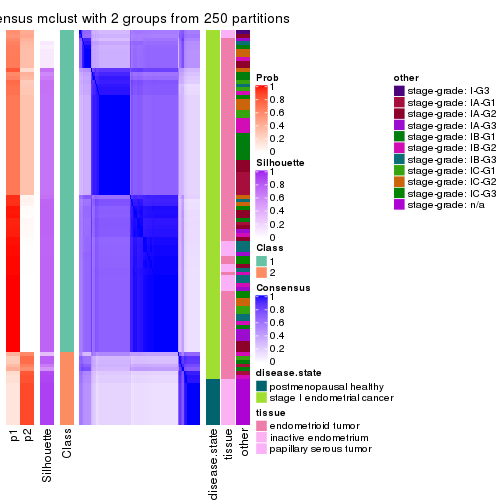</p>

</div>
<div id='tab-CV-mclust-consensus-heatmap-2'>
<pre><code class="r">consensus_heatmap(res, k = 3)
</code></pre>

<p>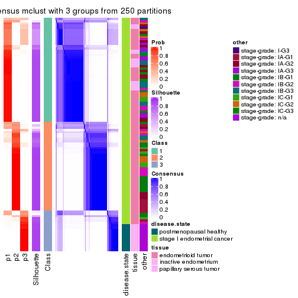</p>

</div>
<div id='tab-CV-mclust-consensus-heatmap-3'>
<pre><code class="r">consensus_heatmap(res, k = 4)
</code></pre>

<p>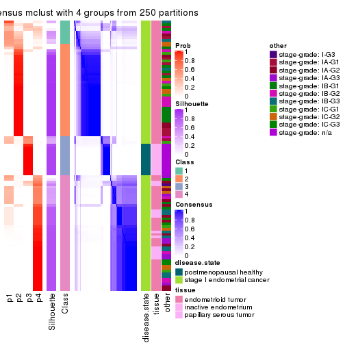</p>

</div>
<div id='tab-CV-mclust-consensus-heatmap-4'>
<pre><code class="r">consensus_heatmap(res, k = 5)
</code></pre>

<p>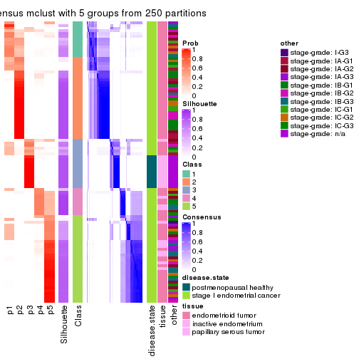</p>

</div>
<div id='tab-CV-mclust-consensus-heatmap-5'>
<pre><code class="r">consensus_heatmap(res, k = 6)
</code></pre>

<p>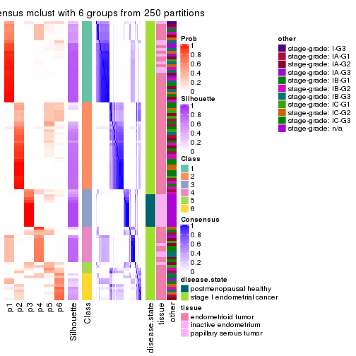</p>

</div>
</div>

Heatmaps for the membership of samples in all partitions to see how consistent they are:


<script>
$( function() {
	$( '#tabs-CV-mclust-membership-heatmap' ).tabs();
} );
</script>
<div id='tabs-CV-mclust-membership-heatmap'>
<ul>
<li><a href='#tab-CV-mclust-membership-heatmap-1'>k = 2</a></li>
<li><a href='#tab-CV-mclust-membership-heatmap-2'>k = 3</a></li>
<li><a href='#tab-CV-mclust-membership-heatmap-3'>k = 4</a></li>
<li><a href='#tab-CV-mclust-membership-heatmap-4'>k = 5</a></li>
<li><a href='#tab-CV-mclust-membership-heatmap-5'>k = 6</a></li>
</ul>
<div id='tab-CV-mclust-membership-heatmap-1'>
<pre><code class="r">membership_heatmap(res, k = 2)
</code></pre>

<p>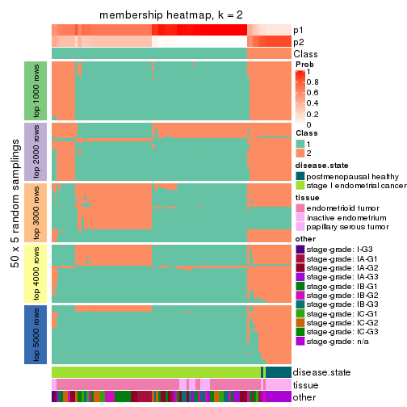</p>

</div>
<div id='tab-CV-mclust-membership-heatmap-2'>
<pre><code class="r">membership_heatmap(res, k = 3)
</code></pre>

<p>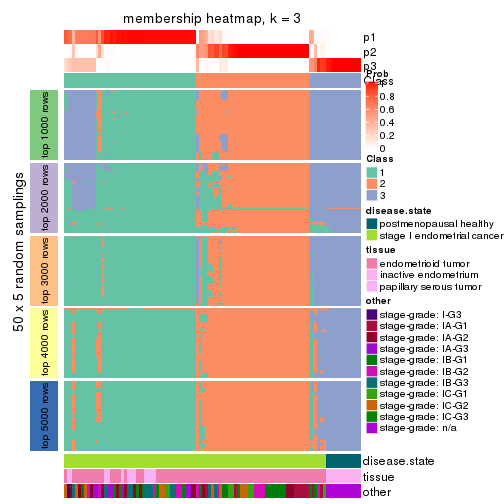</p>

</div>
<div id='tab-CV-mclust-membership-heatmap-3'>
<pre><code class="r">membership_heatmap(res, k = 4)
</code></pre>

<p>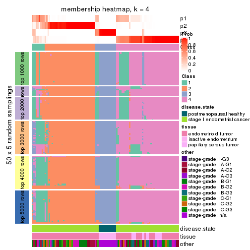</p>

</div>
<div id='tab-CV-mclust-membership-heatmap-4'>
<pre><code class="r">membership_heatmap(res, k = 5)
</code></pre>

<p></p>

</div>
<div id='tab-CV-mclust-membership-heatmap-5'>
<pre><code class="r">membership_heatmap(res, k = 6)
</code></pre>

<p>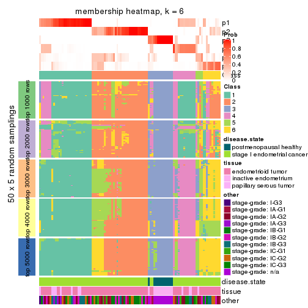</p>

</div>
</div>

As soon as we have had the classes for columns, we can look for signatures
which are significantly different between classes which can be candidate marks
for certain classes. Following are the heatmaps for signatures.


Signature heatmaps where rows are scaled:


<script>
$( function() {
	$( '#tabs-CV-mclust-get-signatures' ).tabs();
} );
</script>
<div id='tabs-CV-mclust-get-signatures'>
<ul>
<li><a href='#tab-CV-mclust-get-signatures-1'>k = 2</a></li>
<li><a href='#tab-CV-mclust-get-signatures-2'>k = 3</a></li>
<li><a href='#tab-CV-mclust-get-signatures-3'>k = 4</a></li>
<li><a href='#tab-CV-mclust-get-signatures-4'>k = 5</a></li>
<li><a href='#tab-CV-mclust-get-signatures-5'>k = 6</a></li>
</ul>
<div id='tab-CV-mclust-get-signatures-1'>
<pre><code class="r">get_signatures(res, k = 2)
</code></pre>

<p>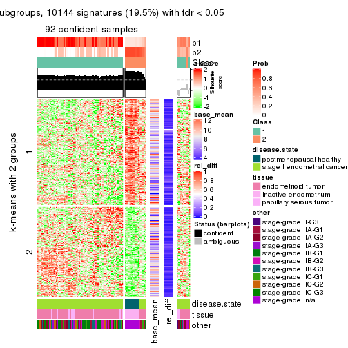</p>

</div>
<div id='tab-CV-mclust-get-signatures-2'>
<pre><code class="r">get_signatures(res, k = 3)
</code></pre>

<p>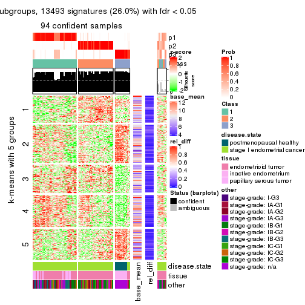</p>

</div>
<div id='tab-CV-mclust-get-signatures-3'>
<pre><code class="r">get_signatures(res, k = 4)
</code></pre>

<p>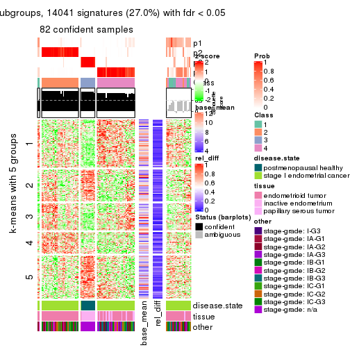</p>

</div>
<div id='tab-CV-mclust-get-signatures-4'>
<pre><code class="r">get_signatures(res, k = 5)
</code></pre>

<p>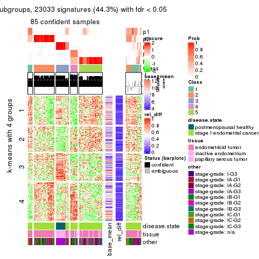</p>

</div>
<div id='tab-CV-mclust-get-signatures-5'>
<pre><code class="r">get_signatures(res, k = 6)
</code></pre>

<p>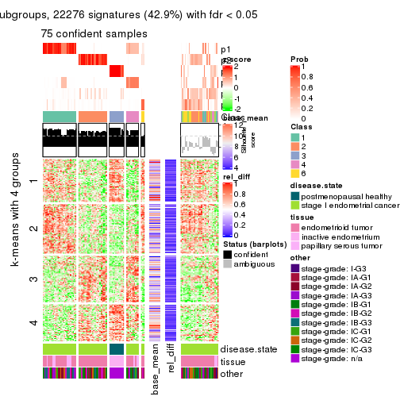</p>

</div>
</div>


Signature heatmaps where rows are not scaled:


<script>
$( function() {
	$( '#tabs-CV-mclust-get-signatures-no-scale' ).tabs();
} );
</script>
<div id='tabs-CV-mclust-get-signatures-no-scale'>
<ul>
<li><a href='#tab-CV-mclust-get-signatures-no-scale-1'>k = 2</a></li>
<li><a href='#tab-CV-mclust-get-signatures-no-scale-2'>k = 3</a></li>
<li><a href='#tab-CV-mclust-get-signatures-no-scale-3'>k = 4</a></li>
<li><a href='#tab-CV-mclust-get-signatures-no-scale-4'>k = 5</a></li>
<li><a href='#tab-CV-mclust-get-signatures-no-scale-5'>k = 6</a></li>
</ul>
<div id='tab-CV-mclust-get-signatures-no-scale-1'>
<pre><code class="r">get_signatures(res, k = 2, scale_rows = FALSE)
</code></pre>

<p>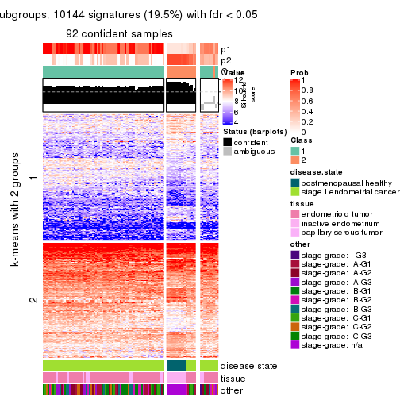</p>

</div>
<div id='tab-CV-mclust-get-signatures-no-scale-2'>
<pre><code class="r">get_signatures(res, k = 3, scale_rows = FALSE)
</code></pre>

<p>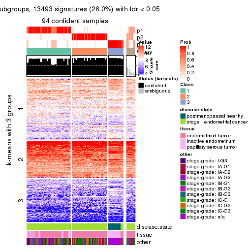</p>

</div>
<div id='tab-CV-mclust-get-signatures-no-scale-3'>
<pre><code class="r">get_signatures(res, k = 4, scale_rows = FALSE)
</code></pre>

<p>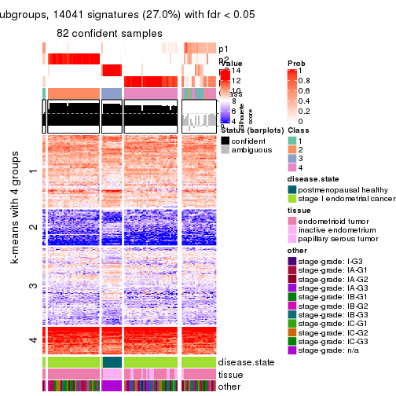</p>

</div>
<div id='tab-CV-mclust-get-signatures-no-scale-4'>
<pre><code class="r">get_signatures(res, k = 5, scale_rows = FALSE)
</code></pre>

<p>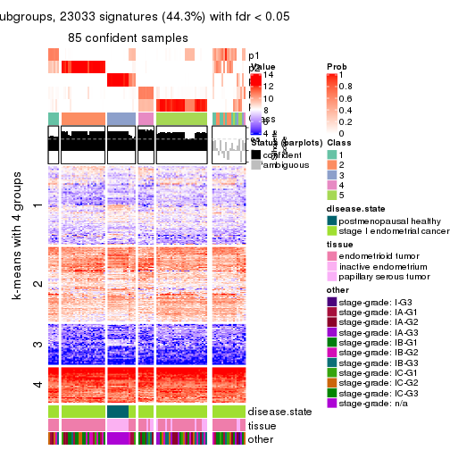</p>

</div>
<div id='tab-CV-mclust-get-signatures-no-scale-5'>
<pre><code class="r">get_signatures(res, k = 6, scale_rows = FALSE)
</code></pre>

<p>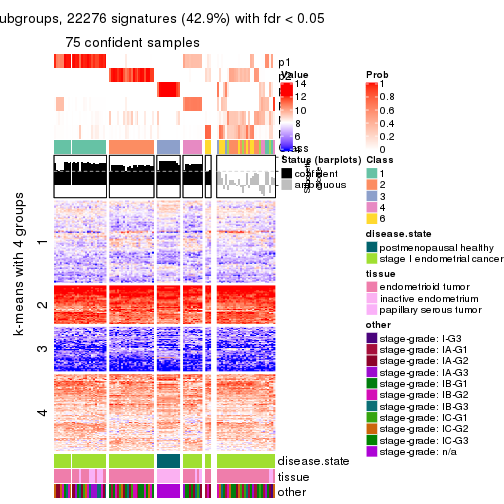</p>

</div>
</div>


Compare the overlap of signatures from different k:

```r
compare_signatures(res)
```

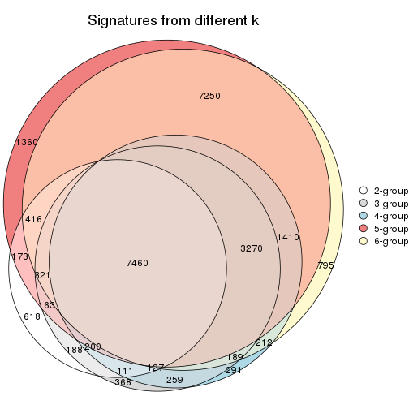

`get_signature()` returns a data frame invisibly. TO get the list of signatures, the function
call should be assigned to a variable explicitly. In following code, if `plot` argument is set
to `FALSE`, no heatmap is plotted while only the differential analysis is performed.

```r
# code only for demonstration
tb = get_signature(res, k = ..., plot = FALSE)
```

An example of the output of `tb` is:

```
#>   which_row         fdr    mean_1    mean_2 scaled_mean_1 scaled_mean_2 km
#> 1        38 0.042760348  8.373488  9.131774    -0.5533452     0.5164555  1
#> 2        40 0.018707592  7.106213  8.469186    -0.6173731     0.5762149  1
#> 3        55 0.019134737 10.221463 11.207825    -0.6159697     0.5749050  1
#> 4        59 0.006059896  5.921854  7.869574    -0.6899429     0.6439467  1
#> 5        60 0.018055526  8.928898 10.211722    -0.6204761     0.5791110  1
#> 6        98 0.009384629 15.714769 14.887706     0.6635654    -0.6193277  2
...
```

The columns in `tb` are:

1. `which_row`: row indices corresponding to the input matrix.
2. `fdr`: FDR for the differential test. 
3. `mean_x`: The mean value in group x.
4. `scaled_mean_x`: The mean value in group x after rows are scaled.
5. `km`: Row groups if k-means clustering is applied to rows.


UMAP plot which shows how samples are separated.


<script>
$( function() {
	$( '#tabs-CV-mclust-dimension-reduction' ).tabs();
} );
</script>
<div id='tabs-CV-mclust-dimension-reduction'>
<ul>
<li><a href='#tab-CV-mclust-dimension-reduction-1'>k = 2</a></li>
<li><a href='#tab-CV-mclust-dimension-reduction-2'>k = 3</a></li>
<li><a href='#tab-CV-mclust-dimension-reduction-3'>k = 4</a></li>
<li><a href='#tab-CV-mclust-dimension-reduction-4'>k = 5</a></li>
<li><a href='#tab-CV-mclust-dimension-reduction-5'>k = 6</a></li>
</ul>
<div id='tab-CV-mclust-dimension-reduction-1'>
<pre><code class="r">dimension_reduction(res, k = 2, method = &quot;UMAP&quot;)
</code></pre>

<p>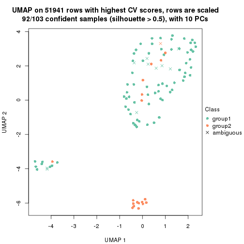</p>

</div>
<div id='tab-CV-mclust-dimension-reduction-2'>
<pre><code class="r">dimension_reduction(res, k = 3, method = &quot;UMAP&quot;)
</code></pre>

<p>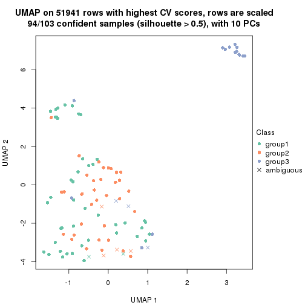</p>

</div>
<div id='tab-CV-mclust-dimension-reduction-3'>
<pre><code class="r">dimension_reduction(res, k = 4, method = &quot;UMAP&quot;)
</code></pre>

<p>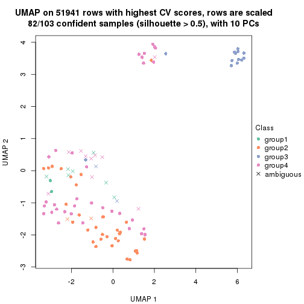</p>

</div>
<div id='tab-CV-mclust-dimension-reduction-4'>
<pre><code class="r">dimension_reduction(res, k = 5, method = &quot;UMAP&quot;)
</code></pre>

<p>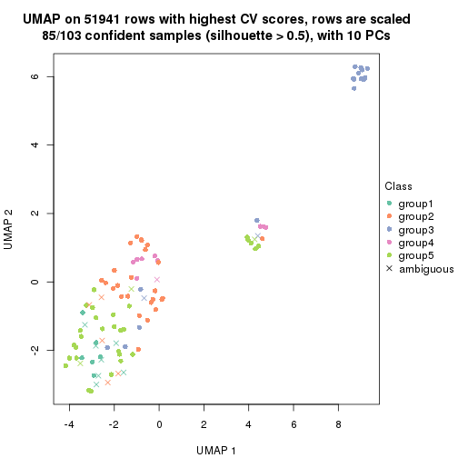</p>

</div>
<div id='tab-CV-mclust-dimension-reduction-5'>
<pre><code class="r">dimension_reduction(res, k = 6, method = &quot;UMAP&quot;)
</code></pre>

<p>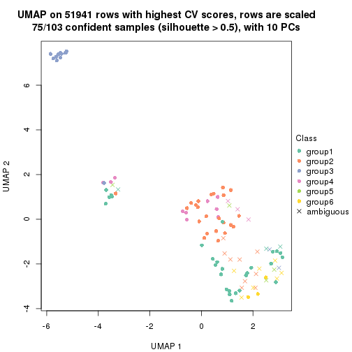</p>

</div>
</div>


Following heatmap shows how subgroups are split when increasing `k`:

```r
collect_classes(res)
```

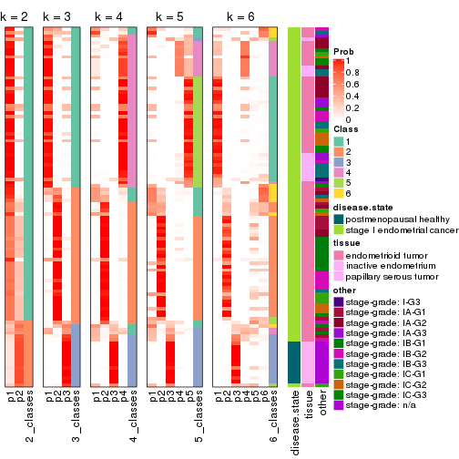


Test correlation between subgroups and known annotations. If the known
annotation is numeric, one-way ANOVA test is applied, and if the known
annotation is discrete, chi-squared contingency table test is applied.

```r
test_to_known_factors(res)
```

```
#>            n disease.state(p) tissue(p) other(p) k
#> CV:mclust 92         9.20e-13  3.91e-13 1.23e-09 2
#> CV:mclust 94         1.85e-16  9.80e-18 6.87e-14 3
#> CV:mclust 82         4.39e-16  2.28e-17 5.58e-12 4
#> CV:mclust 85         2.56e-12  1.42e-12 3.11e-09 5
#> CV:mclust 75         1.99e-15  4.68e-15 2.25e-10 6
```


If matrix rows can be associated to genes, consider to use `functional_enrichment(res,
...)` to perform function enrichment for the signature genes. See [this vignette](http://bioconductor.org/packages/devel/bioc/vignettes/cola/inst/doc/functional_enrichment.html) for more detailed explanations.


 

---------------------------------------------------


### CV:NMF


The object with results only for a single top-value method and a single partition method 
can be extracted as:

```r
res = res_list["CV", "NMF"]
# you can also extract it by
# res = res_list["CV:NMF"]
```

A summary of `res` and all the functions that can be applied to it:

```r
res
```

```
#> A 'ConsensusPartition' object with k = 2, 3, 4, 5, 6.
#>   On a matrix with 51941 rows and 103 columns.
#>   Top rows (1000, 2000, 3000, 4000, 5000) are extracted by 'CV' method.
#>   Subgroups are detected by 'NMF' method.
#>   Performed in total 1250 partitions by row resampling.
#>   Best k for subgroups seems to be 2.
#> 
#> Following methods can be applied to this 'ConsensusPartition' object:
#>  [1] "cola_report"             "collect_classes"         "collect_plots"          
#>  [4] "collect_stats"           "colnames"                "compare_signatures"     
#>  [7] "consensus_heatmap"       "dimension_reduction"     "functional_enrichment"  
#> [10] "get_anno_col"            "get_anno"                "get_classes"            
#> [13] "get_consensus"           "get_matrix"              "get_membership"         
#> [16] "get_param"               "get_signatures"          "get_stats"              
#> [19] "is_best_k"               "is_stable_k"             "membership_heatmap"     
#> [22] "ncol"                    "nrow"                    "plot_ecdf"              
#> [25] "rownames"                "select_partition_number" "show"                   
#> [28] "suggest_best_k"          "test_to_known_factors"
```

`collect_plots()` function collects all the plots made from `res` for all `k` (number of partitions)
into one single page to provide an easy and fast comparison between different `k`.

```r
collect_plots(res)
```

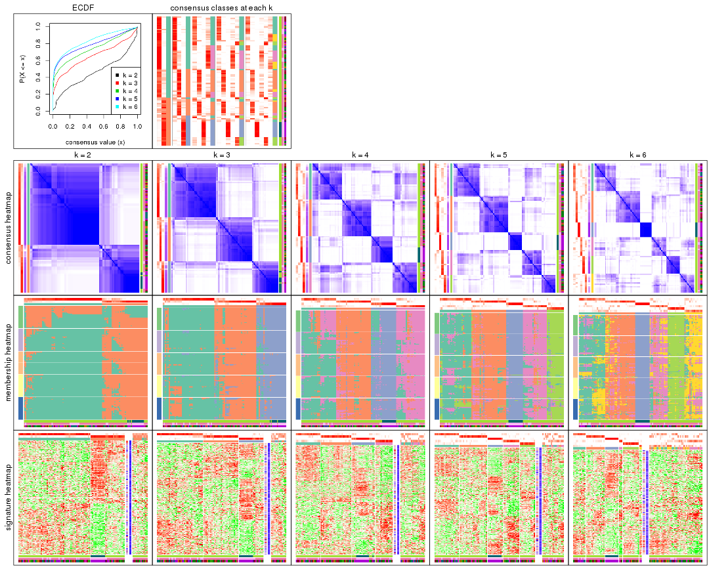

The plots are:

- The first row: a plot of the ECDF (empirical cumulative distribution
  function) curves of the consensus matrix for each `k` and the heatmap of
  predicted classes for each `k`.
- The second row: heatmaps of the consensus matrix for each `k`.
- The third row: heatmaps of the membership matrix for each `k`.
- The fouth row: heatmaps of the signatures for each `k`.

All the plots in panels can be made by individual functions and they are
plotted later in this section.

`select_partition_number()` produces several plots showing different
statistics for choosing "optimized" `k`. There are following statistics:

- ECDF curves of the consensus matrix for each `k`;
- 1-PAC. [The PAC
  score](https://en.wikipedia.org/wiki/Consensus_clustering#Over-interpretation_potential_of_consensus_clustering)
  measures the proportion of the ambiguous subgrouping.
- Mean silhouette score.
- Concordance. The mean probability of fiting the consensus class ids in all
  partitions.
- Area increased. Denote $A_k$ as the area under the ECDF curve for current
  `k`, the area increased is defined as $A_k - A_{k-1}$.
- Rand index. The percent of pairs of samples that are both in a same cluster
  or both are not in a same cluster in the partition of k and k-1.
- Jaccard index. The ratio of pairs of samples are both in a same cluster in
  the partition of k and k-1 and the pairs of samples are both in a same
  cluster in the partition k or k-1.

The detailed explanations of these statistics can be found in [the _cola_
vignette](http://bioconductor.org/packages/devel/bioc/vignettes/cola/inst/doc/cola.html#toc_13).

Generally speaking, lower PAC score, higher mean silhouette score or higher
concordance corresponds to better partition. Rand index and Jaccard index
measure how similar the current partition is compared to partition with `k-1`.
If they are too similar, we won't accept `k` is better than `k-1`.

```r
select_partition_number(res)
```

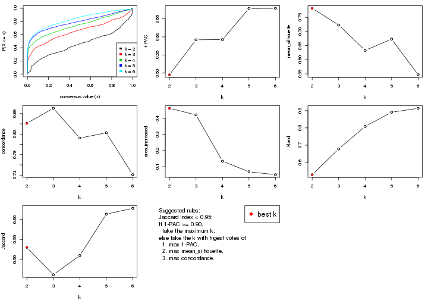

The numeric values for all these statistics can be obtained by `get_stats()`.

```r
get_stats(res)
```

```
#>   k 1-PAC mean_silhouette concordance area_increased  Rand Jaccard
#> 2 2 0.495           0.782       0.841         0.4611 0.530   0.530
#> 3 3 0.592           0.723       0.870         0.4205 0.678   0.461
#> 4 4 0.593           0.633       0.812         0.1342 0.808   0.510
#> 5 5 0.678           0.673       0.823         0.0687 0.891   0.614
#> 6 6 0.679           0.547       0.741         0.0505 0.913   0.628
```

`suggest_best_k()` suggests the best $k$ based on these statistics. The rules are as follows:

- All $k$ with Jaccard index larger than 0.95 are removed because increasing
  $k$ does not provide enough extra information. If all $k$ are removed, it is
  marked as no subgroup is detected.
- For all $k$ with 1-PAC score larger than 0.9, the maximal $k$ is taken as
  the best $k$, and other $k$ are marked as optional $k$.
- If it does not fit the second rule. The $k$ with the maximal vote of the
  highest 1-PAC score, highest mean silhouette, and highest concordance is
  taken as the best $k$.

```r
suggest_best_k(res)
```

```
#> [1] 2
```


Following shows the table of the partitions (You need to click the **show/hide
code output** link to see it). The membership matrix (columns with name `p*`)
is inferred by
[`clue::cl_consensus()`](https://www.rdocumentation.org/link/cl_consensus?package=clue)
function with the `SE` method. Basically the value in the membership matrix
represents the probability to belong to a certain group. The finall class
label for an item is determined with the group with highest probability it
belongs to.

In `get_classes()` function, the entropy is calculated from the membership
matrix and the silhouette score is calculated from the consensus matrix.


<script>
$( function() {
	$( '#tabs-CV-NMF-get-classes' ).tabs();
} );
</script>
<div id='tabs-CV-NMF-get-classes'>
<ul>
<li><a href='#tab-CV-NMF-get-classes-1'>k = 2</a></li>
<li><a href='#tab-CV-NMF-get-classes-2'>k = 3</a></li>
<li><a href='#tab-CV-NMF-get-classes-3'>k = 4</a></li>
<li><a href='#tab-CV-NMF-get-classes-4'>k = 5</a></li>
<li><a href='#tab-CV-NMF-get-classes-5'>k = 6</a></li>
</ul>

<div id='tab-CV-NMF-get-classes-1'>
<p><a id='tab-CV-NMF-get-classes-1-a' style='color:#0366d6' href='#'>show/hide code output</a></p>
<pre><code class="r">cbind(get_classes(res, k = 2), get_membership(res, k = 2))
</code></pre>

<pre><code>#&gt;           class entropy silhouette    p1    p2
#&gt; GSM425907     2  0.9323      0.472 0.348 0.652
#&gt; GSM425908     1  0.4161      0.873 0.916 0.084
#&gt; GSM425909     2  0.5294      0.796 0.120 0.880
#&gt; GSM425910     2  0.9491      0.483 0.368 0.632
#&gt; GSM425911     2  0.3584      0.810 0.068 0.932
#&gt; GSM425912     2  0.9580      0.398 0.380 0.620
#&gt; GSM425913     1  0.9933      0.181 0.548 0.452
#&gt; GSM425914     2  0.7139      0.710 0.196 0.804
#&gt; GSM425915     2  0.2043      0.839 0.032 0.968
#&gt; GSM425874     1  0.0000      0.904 1.000 0.000
#&gt; GSM425875     1  0.3733      0.853 0.928 0.072
#&gt; GSM425876     1  0.6973      0.791 0.812 0.188
#&gt; GSM425877     1  0.0672      0.900 0.992 0.008
#&gt; GSM425878     1  0.0000      0.904 1.000 0.000
#&gt; GSM425879     2  0.6973      0.718 0.188 0.812
#&gt; GSM425880     2  0.9732      0.442 0.404 0.596
#&gt; GSM425881     1  0.5059      0.854 0.888 0.112
#&gt; GSM425882     1  0.6247      0.819 0.844 0.156
#&gt; GSM425883     1  0.0000      0.904 1.000 0.000
#&gt; GSM425884     1  0.1414      0.894 0.980 0.020
#&gt; GSM425885     1  0.0000      0.904 1.000 0.000
#&gt; GSM425848     1  0.0000      0.904 1.000 0.000
#&gt; GSM425849     1  0.0000      0.904 1.000 0.000
#&gt; GSM425850     1  0.1414      0.897 0.980 0.020
#&gt; GSM425851     1  0.3114      0.869 0.944 0.056
#&gt; GSM425852     2  0.6623      0.762 0.172 0.828
#&gt; GSM425893     2  0.0672      0.825 0.008 0.992
#&gt; GSM425894     1  0.6438      0.811 0.836 0.164
#&gt; GSM425895     1  0.7139      0.773 0.804 0.196
#&gt; GSM425896     2  0.3431      0.813 0.064 0.936
#&gt; GSM425897     2  0.9608      0.387 0.384 0.616
#&gt; GSM425898     1  0.5737      0.838 0.864 0.136
#&gt; GSM425899     1  0.0000      0.904 1.000 0.000
#&gt; GSM425900     1  0.8813      0.606 0.700 0.300
#&gt; GSM425901     2  0.5519      0.792 0.128 0.872
#&gt; GSM425902     1  0.0000      0.904 1.000 0.000
#&gt; GSM425903     2  0.2043      0.839 0.032 0.968
#&gt; GSM425904     2  0.9580      0.490 0.380 0.620
#&gt; GSM425905     1  0.9323      0.499 0.652 0.348
#&gt; GSM425906     2  0.9998      0.014 0.492 0.508
#&gt; GSM425863     1  0.0000      0.904 1.000 0.000
#&gt; GSM425864     2  0.9552      0.410 0.376 0.624
#&gt; GSM425865     1  0.9087      0.556 0.676 0.324
#&gt; GSM425866     1  0.3733      0.853 0.928 0.072
#&gt; GSM425867     2  0.2043      0.839 0.032 0.968
#&gt; GSM425868     1  0.2043      0.892 0.968 0.032
#&gt; GSM425869     1  0.3431      0.882 0.936 0.064
#&gt; GSM425870     2  0.0000      0.825 0.000 1.000
#&gt; GSM425871     1  0.0672      0.902 0.992 0.008
#&gt; GSM425872     1  0.3584      0.882 0.932 0.068
#&gt; GSM425873     1  0.2043      0.892 0.968 0.032
#&gt; GSM425843     1  0.0000      0.904 1.000 0.000
#&gt; GSM425844     1  0.0000      0.904 1.000 0.000
#&gt; GSM425845     2  0.8608      0.670 0.284 0.716
#&gt; GSM425846     1  0.2043      0.892 0.968 0.032
#&gt; GSM425847     1  0.6712      0.799 0.824 0.176
#&gt; GSM425886     2  0.2236      0.837 0.036 0.964
#&gt; GSM425887     1  0.6148      0.824 0.848 0.152
#&gt; GSM425888     1  0.5294      0.849 0.880 0.120
#&gt; GSM425889     1  0.0000      0.904 1.000 0.000
#&gt; GSM425890     1  0.0000      0.904 1.000 0.000
#&gt; GSM425891     2  0.9944      0.163 0.456 0.544
#&gt; GSM425892     1  0.8608      0.637 0.716 0.284
#&gt; GSM425853     1  0.1843      0.889 0.972 0.028
#&gt; GSM425854     1  0.5178      0.852 0.884 0.116
#&gt; GSM425855     1  0.0000      0.904 1.000 0.000
#&gt; GSM425856     1  0.2603      0.878 0.956 0.044
#&gt; GSM425857     1  0.9775      0.119 0.588 0.412
#&gt; GSM425858     1  0.5294      0.849 0.880 0.120
#&gt; GSM425859     1  0.5059      0.855 0.888 0.112
#&gt; GSM425860     2  0.3584      0.810 0.068 0.932
#&gt; GSM425861     1  0.2423      0.891 0.960 0.040
#&gt; GSM425862     1  0.0000      0.904 1.000 0.000
#&gt; GSM425837     1  0.0672      0.900 0.992 0.008
#&gt; GSM425838     1  0.0000      0.904 1.000 0.000
#&gt; GSM425839     1  0.5842      0.833 0.860 0.140
#&gt; GSM425840     1  0.0000      0.904 1.000 0.000
#&gt; GSM425841     1  0.0000      0.904 1.000 0.000
#&gt; GSM425842     1  0.0000      0.904 1.000 0.000
#&gt; GSM425917     2  0.7299      0.754 0.204 0.796
#&gt; GSM425922     1  0.0000      0.904 1.000 0.000
#&gt; GSM425919     1  0.9686      0.176 0.604 0.396
#&gt; GSM425920     1  0.0000      0.904 1.000 0.000
#&gt; GSM425923     1  0.0376      0.902 0.996 0.004
#&gt; GSM425916     1  0.4690      0.822 0.900 0.100
#&gt; GSM425918     1  0.0376      0.902 0.996 0.004
#&gt; GSM425921     1  0.0000      0.904 1.000 0.000
#&gt; GSM425925     1  0.0000      0.904 1.000 0.000
#&gt; GSM425926     1  0.0000      0.904 1.000 0.000
#&gt; GSM425927     1  0.0000      0.904 1.000 0.000
#&gt; GSM425924     2  0.4815      0.812 0.104 0.896
#&gt; GSM425928     2  0.2043      0.839 0.032 0.968
#&gt; GSM425929     2  0.2043      0.839 0.032 0.968
#&gt; GSM425930     2  0.2043      0.839 0.032 0.968
#&gt; GSM425931     2  0.2043      0.839 0.032 0.968
#&gt; GSM425932     2  0.2043      0.839 0.032 0.968
#&gt; GSM425933     2  0.2043      0.839 0.032 0.968
#&gt; GSM425934     2  0.0376      0.827 0.004 0.996
#&gt; GSM425935     2  0.1843      0.837 0.028 0.972
#&gt; GSM425936     2  0.2043      0.839 0.032 0.968
#&gt; GSM425937     2  0.2043      0.839 0.032 0.968
#&gt; GSM425938     2  0.2043      0.839 0.032 0.968
#&gt; GSM425939     2  0.2043      0.839 0.032 0.968
</code></pre>

<script>
$('#tab-CV-NMF-get-classes-1-a').parent().next().next().hide();
$('#tab-CV-NMF-get-classes-1-a').click(function(){
  $('#tab-CV-NMF-get-classes-1-a').parent().next().next().toggle();
  return(false);
});
</script>
</div>

<div id='tab-CV-NMF-get-classes-2'>
<p><a id='tab-CV-NMF-get-classes-2-a' style='color:#0366d6' href='#'>show/hide code output</a></p>
<pre><code class="r">cbind(get_classes(res, k = 3), get_membership(res, k = 3))
</code></pre>

<pre><code>#&gt;           class entropy silhouette    p1    p2    p3
#&gt; GSM425907     2  0.1647     0.8355 0.004 0.960 0.036
#&gt; GSM425908     2  0.1289     0.8361 0.032 0.968 0.000
#&gt; GSM425909     3  0.2689     0.8351 0.032 0.036 0.932
#&gt; GSM425910     2  0.9651     0.1744 0.392 0.400 0.208
#&gt; GSM425911     2  0.4291     0.7225 0.000 0.820 0.180
#&gt; GSM425912     2  0.6911     0.6790 0.180 0.728 0.092
#&gt; GSM425913     2  0.0747     0.8397 0.000 0.984 0.016
#&gt; GSM425914     2  0.5955     0.7036 0.048 0.772 0.180
#&gt; GSM425915     3  0.0237     0.8522 0.000 0.004 0.996
#&gt; GSM425874     1  0.5291     0.6736 0.732 0.268 0.000
#&gt; GSM425875     1  0.1860     0.8264 0.948 0.000 0.052
#&gt; GSM425876     1  0.6865     0.2034 0.596 0.384 0.020
#&gt; GSM425877     1  0.0237     0.8473 0.996 0.000 0.004
#&gt; GSM425878     1  0.0000     0.8485 1.000 0.000 0.000
#&gt; GSM425879     2  0.2066     0.8240 0.000 0.940 0.060
#&gt; GSM425880     1  0.6309    -0.1774 0.500 0.000 0.500
#&gt; GSM425881     2  0.5138     0.6679 0.252 0.748 0.000
#&gt; GSM425882     2  0.0237     0.8421 0.004 0.996 0.000
#&gt; GSM425883     1  0.1753     0.8446 0.952 0.048 0.000
#&gt; GSM425884     1  0.0592     0.8456 0.988 0.000 0.012
#&gt; GSM425885     1  0.6260     0.3182 0.552 0.448 0.000
#&gt; GSM425848     1  0.3619     0.7996 0.864 0.136 0.000
#&gt; GSM425849     1  0.1289     0.8483 0.968 0.032 0.000
#&gt; GSM425850     1  0.1860     0.8330 0.948 0.052 0.000
#&gt; GSM425851     1  0.2680     0.8174 0.924 0.008 0.068
#&gt; GSM425852     3  0.5098     0.6719 0.248 0.000 0.752
#&gt; GSM425893     2  0.5098     0.6431 0.000 0.752 0.248
#&gt; GSM425894     2  0.0892     0.8401 0.020 0.980 0.000
#&gt; GSM425895     2  0.0237     0.8421 0.004 0.996 0.000
#&gt; GSM425896     2  0.2261     0.8208 0.000 0.932 0.068
#&gt; GSM425897     2  0.1643     0.8316 0.000 0.956 0.044
#&gt; GSM425898     2  0.0237     0.8421 0.004 0.996 0.000
#&gt; GSM425899     1  0.4291     0.7692 0.820 0.180 0.000
#&gt; GSM425900     2  0.1878     0.8369 0.044 0.952 0.004
#&gt; GSM425901     3  0.4628     0.7901 0.056 0.088 0.856
#&gt; GSM425902     1  0.5397     0.6577 0.720 0.280 0.000
#&gt; GSM425903     3  0.1289     0.8430 0.032 0.000 0.968
#&gt; GSM425904     3  0.6274     0.2585 0.456 0.000 0.544
#&gt; GSM425905     2  0.0237     0.8417 0.000 0.996 0.004
#&gt; GSM425906     2  0.3764     0.8096 0.040 0.892 0.068
#&gt; GSM425863     1  0.0237     0.8495 0.996 0.004 0.000
#&gt; GSM425864     2  0.1289     0.8358 0.000 0.968 0.032
#&gt; GSM425865     2  0.0237     0.8417 0.000 0.996 0.004
#&gt; GSM425866     1  0.2165     0.8172 0.936 0.000 0.064
#&gt; GSM425867     3  0.1964     0.8345 0.056 0.000 0.944
#&gt; GSM425868     2  0.5810     0.3903 0.336 0.664 0.000
#&gt; GSM425869     2  0.3412     0.7668 0.124 0.876 0.000
#&gt; GSM425870     3  0.6154     0.1719 0.000 0.408 0.592
#&gt; GSM425871     1  0.1031     0.8495 0.976 0.024 0.000
#&gt; GSM425872     2  0.2165     0.8209 0.064 0.936 0.000
#&gt; GSM425873     1  0.4589     0.7007 0.820 0.172 0.008
#&gt; GSM425843     1  0.0237     0.8473 0.996 0.000 0.004
#&gt; GSM425844     1  0.0892     0.8499 0.980 0.020 0.000
#&gt; GSM425845     3  0.7353     0.2750 0.436 0.032 0.532
#&gt; GSM425846     2  0.6235     0.1152 0.436 0.564 0.000
#&gt; GSM425847     2  0.6373     0.4080 0.408 0.588 0.004
#&gt; GSM425886     3  0.2625     0.8077 0.000 0.084 0.916
#&gt; GSM425887     2  0.4605     0.7253 0.204 0.796 0.000
#&gt; GSM425888     2  0.5650     0.5903 0.312 0.688 0.000
#&gt; GSM425889     1  0.1860     0.8443 0.948 0.052 0.000
#&gt; GSM425890     1  0.4931     0.7157 0.768 0.232 0.000
#&gt; GSM425891     2  0.1529     0.8344 0.000 0.960 0.040
#&gt; GSM425892     2  0.0424     0.8418 0.008 0.992 0.000
#&gt; GSM425853     1  0.1643     0.8313 0.956 0.000 0.044
#&gt; GSM425854     2  0.0237     0.8421 0.004 0.996 0.000
#&gt; GSM425855     1  0.0592     0.8498 0.988 0.012 0.000
#&gt; GSM425856     1  0.1753     0.8288 0.952 0.000 0.048
#&gt; GSM425857     3  0.9978     0.0244 0.336 0.304 0.360
#&gt; GSM425858     2  0.1860     0.8345 0.052 0.948 0.000
#&gt; GSM425859     2  0.0592     0.8416 0.012 0.988 0.000
#&gt; GSM425860     2  0.9447     0.2098 0.188 0.464 0.348
#&gt; GSM425861     1  0.6308    -0.1252 0.508 0.492 0.000
#&gt; GSM425862     1  0.2066     0.8416 0.940 0.060 0.000
#&gt; GSM425837     1  0.0592     0.8455 0.988 0.000 0.012
#&gt; GSM425838     1  0.5706     0.5953 0.680 0.320 0.000
#&gt; GSM425839     2  0.0237     0.8421 0.004 0.996 0.000
#&gt; GSM425840     1  0.0000     0.8485 1.000 0.000 0.000
#&gt; GSM425841     1  0.5216     0.6827 0.740 0.260 0.000
#&gt; GSM425842     1  0.0661     0.8473 0.988 0.008 0.004
#&gt; GSM425917     3  0.5325     0.6484 0.248 0.004 0.748
#&gt; GSM425922     1  0.4887     0.7207 0.772 0.228 0.000
#&gt; GSM425919     1  0.4605     0.6545 0.796 0.000 0.204
#&gt; GSM425920     1  0.0000     0.8485 1.000 0.000 0.000
#&gt; GSM425923     1  0.0424     0.8498 0.992 0.008 0.000
#&gt; GSM425916     1  0.2625     0.8000 0.916 0.000 0.084
#&gt; GSM425918     1  0.0424     0.8498 0.992 0.008 0.000
#&gt; GSM425921     1  0.4291     0.7655 0.820 0.180 0.000
#&gt; GSM425925     1  0.2356     0.8379 0.928 0.072 0.000
#&gt; GSM425926     1  0.4750     0.7349 0.784 0.216 0.000
#&gt; GSM425927     1  0.0475     0.8474 0.992 0.004 0.004
#&gt; GSM425924     3  0.4654     0.7205 0.208 0.000 0.792
#&gt; GSM425928     3  0.0237     0.8524 0.000 0.004 0.996
#&gt; GSM425929     3  0.0000     0.8532 0.000 0.000 1.000
#&gt; GSM425930     3  0.0000     0.8532 0.000 0.000 1.000
#&gt; GSM425931     3  0.0000     0.8532 0.000 0.000 1.000
#&gt; GSM425932     3  0.0237     0.8520 0.000 0.004 0.996
#&gt; GSM425933     3  0.0000     0.8532 0.000 0.000 1.000
#&gt; GSM425934     3  0.0892     0.8446 0.000 0.020 0.980
#&gt; GSM425935     3  0.3038     0.7866 0.000 0.104 0.896
#&gt; GSM425936     3  0.0424     0.8507 0.000 0.008 0.992
#&gt; GSM425937     3  0.0000     0.8532 0.000 0.000 1.000
#&gt; GSM425938     3  0.0000     0.8532 0.000 0.000 1.000
#&gt; GSM425939     3  0.0000     0.8532 0.000 0.000 1.000
</code></pre>

<script>
$('#tab-CV-NMF-get-classes-2-a').parent().next().next().hide();
$('#tab-CV-NMF-get-classes-2-a').click(function(){
  $('#tab-CV-NMF-get-classes-2-a').parent().next().next().toggle();
  return(false);
});
</script>
</div>

<div id='tab-CV-NMF-get-classes-3'>
<p><a id='tab-CV-NMF-get-classes-3-a' style='color:#0366d6' href='#'>show/hide code output</a></p>
<pre><code class="r">cbind(get_classes(res, k = 4), get_membership(res, k = 4))
</code></pre>

<pre><code>#&gt;           class entropy silhouette    p1    p2    p3    p4
#&gt; GSM425907     2  0.5137    0.65426 0.000 0.680 0.024 0.296
#&gt; GSM425908     4  0.4817    0.10495 0.000 0.388 0.000 0.612
#&gt; GSM425909     3  0.5539    0.76705 0.224 0.004 0.712 0.060
#&gt; GSM425910     1  0.3933    0.57853 0.796 0.196 0.004 0.004
#&gt; GSM425911     2  0.0672    0.84768 0.008 0.984 0.008 0.000
#&gt; GSM425912     2  0.2868    0.77478 0.136 0.864 0.000 0.000
#&gt; GSM425913     2  0.0376    0.84831 0.004 0.992 0.000 0.004
#&gt; GSM425914     2  0.1305    0.84061 0.036 0.960 0.004 0.000
#&gt; GSM425915     3  0.3610    0.80816 0.200 0.000 0.800 0.000
#&gt; GSM425874     4  0.0376    0.72163 0.004 0.004 0.000 0.992
#&gt; GSM425875     1  0.3047    0.60297 0.872 0.000 0.012 0.116
#&gt; GSM425876     1  0.4053    0.56494 0.768 0.228 0.000 0.004
#&gt; GSM425877     1  0.5236    0.37828 0.560 0.000 0.008 0.432
#&gt; GSM425878     1  0.4382    0.60164 0.704 0.000 0.000 0.296
#&gt; GSM425879     2  0.1388    0.84930 0.000 0.960 0.012 0.028
#&gt; GSM425880     1  0.6259    0.16696 0.616 0.000 0.300 0.084
#&gt; GSM425881     2  0.2814    0.78068 0.132 0.868 0.000 0.000
#&gt; GSM425882     2  0.0779    0.84982 0.004 0.980 0.000 0.016
#&gt; GSM425883     4  0.4781    0.34089 0.336 0.004 0.000 0.660
#&gt; GSM425884     1  0.2714    0.66127 0.884 0.000 0.004 0.112
#&gt; GSM425885     4  0.1722    0.69840 0.008 0.048 0.000 0.944
#&gt; GSM425848     4  0.3484    0.67115 0.144 0.004 0.008 0.844
#&gt; GSM425849     1  0.5143    0.27980 0.540 0.004 0.000 0.456
#&gt; GSM425850     1  0.4996    0.63500 0.752 0.056 0.000 0.192
#&gt; GSM425851     4  0.6005    0.27437 0.324 0.000 0.060 0.616
#&gt; GSM425852     3  0.5812    0.65114 0.328 0.000 0.624 0.048
#&gt; GSM425893     2  0.3009    0.80916 0.056 0.892 0.052 0.000
#&gt; GSM425894     4  0.4855    0.01508 0.000 0.400 0.000 0.600
#&gt; GSM425895     2  0.3123    0.81035 0.000 0.844 0.000 0.156
#&gt; GSM425896     2  0.6897    0.48970 0.000 0.544 0.124 0.332
#&gt; GSM425897     2  0.2546    0.84122 0.000 0.900 0.008 0.092
#&gt; GSM425898     2  0.3311    0.79927 0.000 0.828 0.000 0.172
#&gt; GSM425899     4  0.2882    0.70151 0.084 0.024 0.000 0.892
#&gt; GSM425900     2  0.1022    0.84251 0.032 0.968 0.000 0.000
#&gt; GSM425901     3  0.6713    0.69435 0.232 0.004 0.624 0.140
#&gt; GSM425902     4  0.0672    0.72076 0.008 0.008 0.000 0.984
#&gt; GSM425903     3  0.4999    0.69770 0.328 0.012 0.660 0.000
#&gt; GSM425904     1  0.6727   -0.23654 0.496 0.000 0.412 0.092
#&gt; GSM425905     2  0.1940    0.84540 0.000 0.924 0.000 0.076
#&gt; GSM425906     2  0.1211    0.83929 0.040 0.960 0.000 0.000
#&gt; GSM425863     1  0.4456    0.61072 0.716 0.004 0.000 0.280
#&gt; GSM425864     2  0.1743    0.84836 0.000 0.940 0.004 0.056
#&gt; GSM425865     2  0.1940    0.84599 0.000 0.924 0.000 0.076
#&gt; GSM425866     1  0.1970    0.63124 0.932 0.000 0.008 0.060
#&gt; GSM425867     3  0.3444    0.81674 0.184 0.000 0.816 0.000
#&gt; GSM425868     4  0.2408    0.66422 0.000 0.104 0.000 0.896
#&gt; GSM425869     4  0.3444    0.57563 0.000 0.184 0.000 0.816
#&gt; GSM425870     2  0.5281    0.12775 0.008 0.528 0.464 0.000
#&gt; GSM425871     1  0.4608    0.59085 0.692 0.004 0.000 0.304
#&gt; GSM425872     2  0.2773    0.83216 0.004 0.880 0.000 0.116
#&gt; GSM425873     1  0.4692    0.57631 0.756 0.212 0.000 0.032
#&gt; GSM425843     1  0.3908    0.64854 0.784 0.000 0.004 0.212
#&gt; GSM425844     4  0.4948   -0.00780 0.440 0.000 0.000 0.560
#&gt; GSM425845     1  0.1004    0.62237 0.972 0.024 0.004 0.000
#&gt; GSM425846     2  0.5916    0.57820 0.072 0.656 0.000 0.272
#&gt; GSM425847     1  0.5060    0.27158 0.584 0.412 0.000 0.004
#&gt; GSM425886     3  0.4789    0.78737 0.224 0.004 0.748 0.024
#&gt; GSM425887     2  0.2345    0.80718 0.100 0.900 0.000 0.000
#&gt; GSM425888     2  0.3764    0.68179 0.216 0.784 0.000 0.000
#&gt; GSM425889     4  0.3636    0.61510 0.172 0.000 0.008 0.820
#&gt; GSM425890     4  0.0707    0.72259 0.020 0.000 0.000 0.980
#&gt; GSM425891     2  0.0188    0.84782 0.004 0.996 0.000 0.000
#&gt; GSM425892     2  0.4998    0.29104 0.000 0.512 0.000 0.488
#&gt; GSM425853     1  0.1576    0.64094 0.948 0.000 0.004 0.048
#&gt; GSM425854     2  0.3208    0.81717 0.004 0.848 0.000 0.148
#&gt; GSM425855     1  0.4661    0.53662 0.652 0.000 0.000 0.348
#&gt; GSM425856     1  0.2412    0.62403 0.908 0.000 0.008 0.084
#&gt; GSM425857     4  0.5710    0.48760 0.228 0.008 0.060 0.704
#&gt; GSM425858     2  0.1022    0.84330 0.032 0.968 0.000 0.000
#&gt; GSM425859     2  0.4040    0.72909 0.000 0.752 0.000 0.248
#&gt; GSM425860     1  0.6120    0.15323 0.520 0.432 0.048 0.000
#&gt; GSM425861     1  0.5408    0.03691 0.500 0.488 0.000 0.012
#&gt; GSM425862     4  0.3751    0.60546 0.196 0.000 0.004 0.800
#&gt; GSM425837     1  0.2973    0.65745 0.856 0.000 0.000 0.144
#&gt; GSM425838     4  0.0188    0.72006 0.000 0.004 0.000 0.996
#&gt; GSM425839     2  0.2149    0.84226 0.000 0.912 0.000 0.088
#&gt; GSM425840     1  0.4454    0.59017 0.692 0.000 0.000 0.308
#&gt; GSM425841     4  0.0336    0.72244 0.008 0.000 0.000 0.992
#&gt; GSM425842     1  0.3245    0.66233 0.872 0.028 0.000 0.100
#&gt; GSM425917     3  0.5420    0.43944 0.024 0.000 0.624 0.352
#&gt; GSM425922     4  0.0921    0.72214 0.028 0.000 0.000 0.972
#&gt; GSM425919     1  0.5522    0.63031 0.716 0.000 0.080 0.204
#&gt; GSM425920     1  0.4406    0.59762 0.700 0.000 0.000 0.300
#&gt; GSM425923     4  0.4905    0.24642 0.364 0.000 0.004 0.632
#&gt; GSM425916     1  0.5894    0.36144 0.536 0.000 0.036 0.428
#&gt; GSM425918     4  0.4941    0.00524 0.436 0.000 0.000 0.564
#&gt; GSM425921     4  0.1022    0.71983 0.032 0.000 0.000 0.968
#&gt; GSM425925     4  0.4741    0.37427 0.328 0.004 0.000 0.668
#&gt; GSM425926     4  0.0921    0.72223 0.028 0.000 0.000 0.972
#&gt; GSM425927     1  0.4122    0.63350 0.760 0.000 0.004 0.236
#&gt; GSM425924     3  0.4030    0.76909 0.092 0.000 0.836 0.072
#&gt; GSM425928     3  0.0657    0.87651 0.000 0.004 0.984 0.012
#&gt; GSM425929     3  0.0188    0.87858 0.000 0.004 0.996 0.000
#&gt; GSM425930     3  0.0188    0.87858 0.000 0.004 0.996 0.000
#&gt; GSM425931     3  0.0188    0.87836 0.000 0.004 0.996 0.000
#&gt; GSM425932     3  0.0188    0.87858 0.000 0.004 0.996 0.000
#&gt; GSM425933     3  0.0188    0.87858 0.000 0.004 0.996 0.000
#&gt; GSM425934     3  0.0592    0.87395 0.000 0.016 0.984 0.000
#&gt; GSM425935     3  0.0804    0.87469 0.000 0.012 0.980 0.008
#&gt; GSM425936     3  0.0336    0.87763 0.000 0.008 0.992 0.000
#&gt; GSM425937     3  0.0000    0.87862 0.000 0.000 1.000 0.000
#&gt; GSM425938     3  0.0376    0.87809 0.000 0.004 0.992 0.004
#&gt; GSM425939     3  0.0000    0.87862 0.000 0.000 1.000 0.000
</code></pre>

<script>
$('#tab-CV-NMF-get-classes-3-a').parent().next().next().hide();
$('#tab-CV-NMF-get-classes-3-a').click(function(){
  $('#tab-CV-NMF-get-classes-3-a').parent().next().next().toggle();
  return(false);
});
</script>
</div>

<div id='tab-CV-NMF-get-classes-4'>
<p><a id='tab-CV-NMF-get-classes-4-a' style='color:#0366d6' href='#'>show/hide code output</a></p>
<pre><code class="r">cbind(get_classes(res, k = 5), get_membership(res, k = 5))
</code></pre>

<pre><code>#&gt;           class entropy silhouette    p1    p2    p3    p4    p5
#&gt; GSM425907     4  0.5099    -0.1894 0.000 0.484 0.012 0.488 0.016
#&gt; GSM425908     4  0.4037     0.4505 0.000 0.288 0.004 0.704 0.004
#&gt; GSM425909     5  0.1992     0.8482 0.000 0.000 0.044 0.032 0.924
#&gt; GSM425910     1  0.4863     0.5619 0.708 0.088 0.000 0.000 0.204
#&gt; GSM425911     2  0.0579     0.8113 0.000 0.984 0.008 0.000 0.008
#&gt; GSM425912     2  0.2674     0.7525 0.140 0.856 0.000 0.000 0.004
#&gt; GSM425913     2  0.0324     0.8116 0.000 0.992 0.000 0.004 0.004
#&gt; GSM425914     2  0.1341     0.8017 0.056 0.944 0.000 0.000 0.000
#&gt; GSM425915     5  0.3730     0.6451 0.000 0.000 0.288 0.000 0.712
#&gt; GSM425874     4  0.1356     0.7335 0.012 0.004 0.000 0.956 0.028
#&gt; GSM425875     5  0.1205     0.8549 0.040 0.000 0.000 0.004 0.956
#&gt; GSM425876     1  0.3116     0.7073 0.860 0.076 0.000 0.000 0.064
#&gt; GSM425877     1  0.4521     0.5365 0.664 0.000 0.012 0.316 0.008
#&gt; GSM425878     1  0.3323     0.7397 0.844 0.000 0.000 0.056 0.100
#&gt; GSM425879     2  0.1168     0.8100 0.000 0.960 0.008 0.032 0.000
#&gt; GSM425880     5  0.1278     0.8627 0.020 0.000 0.016 0.004 0.960
#&gt; GSM425881     2  0.2280     0.7722 0.120 0.880 0.000 0.000 0.000
#&gt; GSM425882     2  0.0000     0.8108 0.000 1.000 0.000 0.000 0.000
#&gt; GSM425883     4  0.4777     0.3175 0.356 0.000 0.016 0.620 0.008
#&gt; GSM425884     1  0.3039     0.7078 0.836 0.000 0.000 0.012 0.152
#&gt; GSM425885     4  0.2654     0.7130 0.000 0.048 0.000 0.888 0.064
#&gt; GSM425848     4  0.4902     0.0582 0.024 0.000 0.000 0.508 0.468
#&gt; GSM425849     1  0.5382     0.5783 0.640 0.000 0.000 0.260 0.100
#&gt; GSM425850     1  0.1753     0.7364 0.936 0.032 0.000 0.000 0.032
#&gt; GSM425851     1  0.5722     0.4713 0.600 0.000 0.088 0.304 0.008
#&gt; GSM425852     5  0.2464     0.8395 0.016 0.000 0.096 0.000 0.888
#&gt; GSM425893     2  0.3912     0.6550 0.000 0.768 0.020 0.004 0.208
#&gt; GSM425894     4  0.4533     0.4747 0.000 0.260 0.004 0.704 0.032
#&gt; GSM425895     2  0.3579     0.6749 0.000 0.756 0.000 0.240 0.004
#&gt; GSM425896     2  0.6939     0.2107 0.000 0.460 0.044 0.376 0.120
#&gt; GSM425897     2  0.2293     0.7969 0.000 0.900 0.016 0.084 0.000
#&gt; GSM425898     2  0.3521     0.6864 0.000 0.764 0.000 0.232 0.004
#&gt; GSM425899     4  0.5138     0.5527 0.252 0.036 0.000 0.684 0.028
#&gt; GSM425900     2  0.0880     0.8083 0.032 0.968 0.000 0.000 0.000
#&gt; GSM425901     5  0.2171     0.8347 0.000 0.000 0.024 0.064 0.912
#&gt; GSM425902     4  0.1697     0.7268 0.000 0.008 0.000 0.932 0.060
#&gt; GSM425903     5  0.2074     0.8556 0.044 0.000 0.036 0.000 0.920
#&gt; GSM425904     5  0.0854     0.8624 0.008 0.000 0.012 0.004 0.976
#&gt; GSM425905     2  0.1478     0.8062 0.000 0.936 0.000 0.064 0.000
#&gt; GSM425906     2  0.1357     0.8035 0.048 0.948 0.000 0.000 0.004
#&gt; GSM425863     1  0.3090     0.7404 0.860 0.000 0.000 0.088 0.052
#&gt; GSM425864     2  0.1704     0.8042 0.000 0.928 0.004 0.068 0.000
#&gt; GSM425865     2  0.1638     0.8057 0.000 0.932 0.004 0.064 0.000
#&gt; GSM425866     5  0.1571     0.8470 0.060 0.000 0.000 0.004 0.936
#&gt; GSM425867     5  0.4848     0.3583 0.024 0.000 0.420 0.000 0.556
#&gt; GSM425868     4  0.2672     0.7016 0.008 0.116 0.004 0.872 0.000
#&gt; GSM425869     4  0.3474     0.6737 0.000 0.116 0.004 0.836 0.044
#&gt; GSM425870     2  0.4620     0.3381 0.000 0.592 0.392 0.000 0.016
#&gt; GSM425871     1  0.2338     0.7214 0.884 0.004 0.000 0.112 0.000
#&gt; GSM425872     2  0.2471     0.7672 0.000 0.864 0.000 0.136 0.000
#&gt; GSM425873     1  0.2863     0.7174 0.876 0.064 0.000 0.000 0.060
#&gt; GSM425843     1  0.2249     0.7359 0.896 0.000 0.000 0.008 0.096
#&gt; GSM425844     1  0.4491     0.4496 0.624 0.000 0.004 0.364 0.008
#&gt; GSM425845     5  0.3266     0.7044 0.200 0.000 0.004 0.000 0.796
#&gt; GSM425846     2  0.4332     0.7181 0.064 0.768 0.000 0.164 0.004
#&gt; GSM425847     1  0.3916     0.5484 0.732 0.256 0.000 0.000 0.012
#&gt; GSM425886     5  0.2871     0.8222 0.000 0.000 0.088 0.040 0.872
#&gt; GSM425887     2  0.2127     0.7790 0.108 0.892 0.000 0.000 0.000
#&gt; GSM425888     2  0.3550     0.6502 0.236 0.760 0.000 0.000 0.004
#&gt; GSM425889     4  0.4054     0.6054 0.204 0.000 0.000 0.760 0.036
#&gt; GSM425890     4  0.3053     0.6841 0.128 0.000 0.012 0.852 0.008
#&gt; GSM425891     2  0.0000     0.8108 0.000 1.000 0.000 0.000 0.000
#&gt; GSM425892     2  0.4705     0.1502 0.000 0.504 0.004 0.484 0.008
#&gt; GSM425853     1  0.4273     0.2233 0.552 0.000 0.000 0.000 0.448
#&gt; GSM425854     2  0.3003     0.7350 0.000 0.812 0.000 0.188 0.000
#&gt; GSM425855     1  0.3527     0.6808 0.792 0.000 0.000 0.192 0.016
#&gt; GSM425856     5  0.1430     0.8514 0.052 0.000 0.000 0.004 0.944
#&gt; GSM425857     5  0.3689     0.6090 0.000 0.000 0.004 0.256 0.740
#&gt; GSM425858     2  0.1121     0.8066 0.044 0.956 0.000 0.000 0.000
#&gt; GSM425859     2  0.4114     0.4651 0.000 0.624 0.000 0.376 0.000
#&gt; GSM425860     1  0.6634     0.2341 0.516 0.352 0.064 0.000 0.068
#&gt; GSM425861     2  0.4740     0.1244 0.468 0.516 0.000 0.000 0.016
#&gt; GSM425862     4  0.4462     0.6096 0.196 0.000 0.000 0.740 0.064
#&gt; GSM425837     1  0.3527     0.6913 0.792 0.000 0.000 0.016 0.192
#&gt; GSM425838     4  0.1124     0.7320 0.000 0.004 0.000 0.960 0.036
#&gt; GSM425839     2  0.1908     0.7977 0.000 0.908 0.000 0.092 0.000
#&gt; GSM425840     1  0.3336     0.7399 0.844 0.000 0.000 0.096 0.060
#&gt; GSM425841     4  0.0898     0.7309 0.020 0.000 0.000 0.972 0.008
#&gt; GSM425842     1  0.1942     0.7360 0.920 0.012 0.000 0.000 0.068
#&gt; GSM425917     3  0.6150     0.4441 0.176 0.000 0.592 0.224 0.008
#&gt; GSM425922     4  0.3129     0.6637 0.156 0.000 0.004 0.832 0.008
#&gt; GSM425919     1  0.3661     0.7059 0.836 0.000 0.056 0.096 0.012
#&gt; GSM425920     1  0.3201     0.7032 0.844 0.000 0.016 0.132 0.008
#&gt; GSM425923     1  0.4865     0.2916 0.552 0.000 0.012 0.428 0.008
#&gt; GSM425916     1  0.5160     0.5695 0.672 0.000 0.064 0.256 0.008
#&gt; GSM425918     1  0.4617     0.5240 0.660 0.000 0.016 0.316 0.008
#&gt; GSM425921     4  0.2722     0.6915 0.120 0.000 0.004 0.868 0.008
#&gt; GSM425925     4  0.4371     0.3284 0.344 0.000 0.000 0.644 0.012
#&gt; GSM425926     4  0.1892     0.7145 0.080 0.000 0.000 0.916 0.004
#&gt; GSM425927     1  0.0955     0.7425 0.968 0.000 0.000 0.004 0.028
#&gt; GSM425924     3  0.5732     0.5067 0.224 0.000 0.640 0.128 0.008
#&gt; GSM425928     3  0.0566     0.9139 0.000 0.000 0.984 0.012 0.004
#&gt; GSM425929     3  0.0162     0.9210 0.000 0.000 0.996 0.000 0.004
#&gt; GSM425930     3  0.0290     0.9208 0.000 0.000 0.992 0.000 0.008
#&gt; GSM425931     3  0.0162     0.9218 0.000 0.000 0.996 0.000 0.004
#&gt; GSM425932     3  0.0000     0.9217 0.000 0.000 1.000 0.000 0.000
#&gt; GSM425933     3  0.0162     0.9218 0.000 0.000 0.996 0.000 0.004
#&gt; GSM425934     3  0.0451     0.9163 0.000 0.008 0.988 0.000 0.004
#&gt; GSM425935     3  0.0727     0.9144 0.000 0.012 0.980 0.004 0.004
#&gt; GSM425936     3  0.0162     0.9210 0.000 0.000 0.996 0.004 0.000
#&gt; GSM425937     3  0.0162     0.9218 0.000 0.000 0.996 0.000 0.004
#&gt; GSM425938     3  0.0290     0.9195 0.000 0.000 0.992 0.000 0.008
#&gt; GSM425939     3  0.0290     0.9208 0.000 0.000 0.992 0.000 0.008
</code></pre>

<script>
$('#tab-CV-NMF-get-classes-4-a').parent().next().next().hide();
$('#tab-CV-NMF-get-classes-4-a').click(function(){
  $('#tab-CV-NMF-get-classes-4-a').parent().next().next().toggle();
  return(false);
});
</script>
</div>

<div id='tab-CV-NMF-get-classes-5'>
<p><a id='tab-CV-NMF-get-classes-5-a' style='color:#0366d6' href='#'>show/hide code output</a></p>
<pre><code class="r">cbind(get_classes(res, k = 6), get_membership(res, k = 6))
</code></pre>

<pre><code>#&gt;           class entropy silhouette    p1    p2    p3    p4    p5    p6
#&gt; GSM425907     4  0.3899   -0.02358 0.000 0.404 0.000 0.592 0.004 0.000
#&gt; GSM425908     4  0.3585    0.47546 0.048 0.172 0.000 0.780 0.000 0.000
#&gt; GSM425909     5  0.0935    0.89622 0.000 0.000 0.004 0.032 0.964 0.000
#&gt; GSM425910     1  0.6515    0.42214 0.560 0.088 0.000 0.004 0.156 0.192
#&gt; GSM425911     2  0.2337    0.71324 0.016 0.908 0.000 0.048 0.016 0.012
#&gt; GSM425912     2  0.2575    0.68567 0.072 0.880 0.000 0.004 0.000 0.044
#&gt; GSM425913     2  0.1251    0.71344 0.008 0.956 0.000 0.012 0.000 0.024
#&gt; GSM425914     2  0.2512    0.69907 0.040 0.896 0.000 0.008 0.008 0.048
#&gt; GSM425915     5  0.1714    0.86939 0.000 0.000 0.092 0.000 0.908 0.000
#&gt; GSM425874     4  0.3903    0.36979 0.012 0.000 0.000 0.680 0.004 0.304
#&gt; GSM425875     5  0.2703    0.78322 0.000 0.000 0.000 0.004 0.824 0.172
#&gt; GSM425876     1  0.5239    0.51624 0.692 0.092 0.000 0.004 0.048 0.164
#&gt; GSM425877     1  0.4862    0.51229 0.664 0.000 0.000 0.172 0.000 0.164
#&gt; GSM425878     1  0.6016    0.45573 0.544 0.000 0.000 0.084 0.064 0.308
#&gt; GSM425879     2  0.2333    0.69919 0.000 0.872 0.004 0.120 0.004 0.000
#&gt; GSM425880     5  0.0405    0.90192 0.008 0.000 0.000 0.000 0.988 0.004
#&gt; GSM425881     2  0.3823    0.60458 0.044 0.760 0.000 0.004 0.000 0.192
#&gt; GSM425882     2  0.2269    0.71151 0.012 0.896 0.000 0.080 0.000 0.012
#&gt; GSM425883     6  0.6075    0.16156 0.312 0.004 0.004 0.208 0.000 0.472
#&gt; GSM425884     1  0.5272    0.56006 0.688 0.000 0.000 0.064 0.096 0.152
#&gt; GSM425885     4  0.1767    0.54564 0.000 0.012 0.000 0.932 0.020 0.036
#&gt; GSM425848     4  0.5384    0.30810 0.044 0.000 0.000 0.580 0.328 0.048
#&gt; GSM425849     6  0.4064    0.53705 0.092 0.000 0.000 0.132 0.008 0.768
#&gt; GSM425850     1  0.3859    0.56524 0.804 0.056 0.000 0.008 0.016 0.116
#&gt; GSM425851     1  0.3894    0.51391 0.740 0.000 0.004 0.220 0.000 0.036
#&gt; GSM425852     5  0.1899    0.89522 0.032 0.000 0.028 0.008 0.928 0.004
#&gt; GSM425893     2  0.5521    0.22651 0.004 0.508 0.004 0.076 0.400 0.008
#&gt; GSM425894     4  0.5415    0.28908 0.000 0.128 0.000 0.564 0.004 0.304
#&gt; GSM425895     2  0.5138    0.45273 0.000 0.604 0.000 0.268 0.000 0.128
#&gt; GSM425896     4  0.5367    0.02980 0.000 0.344 0.000 0.532 0.124 0.000
#&gt; GSM425897     2  0.2700    0.69226 0.000 0.836 0.000 0.156 0.004 0.004
#&gt; GSM425898     2  0.5655    0.26117 0.000 0.504 0.000 0.324 0.000 0.172
#&gt; GSM425899     6  0.4543    0.48192 0.056 0.012 0.000 0.204 0.008 0.720
#&gt; GSM425900     2  0.4320    0.14820 0.008 0.516 0.000 0.008 0.000 0.468
#&gt; GSM425901     5  0.1296    0.89201 0.000 0.000 0.004 0.044 0.948 0.004
#&gt; GSM425902     6  0.4581    0.00933 0.000 0.000 0.000 0.448 0.036 0.516
#&gt; GSM425903     5  0.0951    0.90014 0.020 0.000 0.008 0.000 0.968 0.004
#&gt; GSM425904     5  0.0436    0.90209 0.004 0.000 0.004 0.000 0.988 0.004
#&gt; GSM425905     2  0.2597    0.67378 0.000 0.824 0.000 0.176 0.000 0.000
#&gt; GSM425906     2  0.1296    0.70958 0.012 0.952 0.000 0.004 0.000 0.032
#&gt; GSM425863     6  0.2479    0.55488 0.064 0.000 0.000 0.028 0.016 0.892
#&gt; GSM425864     2  0.2878    0.68370 0.004 0.828 0.000 0.160 0.004 0.004
#&gt; GSM425865     2  0.2340    0.69407 0.000 0.852 0.000 0.148 0.000 0.000
#&gt; GSM425866     5  0.0508    0.90168 0.004 0.000 0.000 0.000 0.984 0.012
#&gt; GSM425867     5  0.4381    0.68231 0.024 0.000 0.236 0.000 0.708 0.032
#&gt; GSM425868     4  0.3847    0.54341 0.064 0.068 0.000 0.812 0.000 0.056
#&gt; GSM425869     4  0.3695    0.48560 0.000 0.044 0.000 0.776 0.004 0.176
#&gt; GSM425870     2  0.3451    0.66303 0.024 0.828 0.124 0.004 0.012 0.008
#&gt; GSM425871     1  0.2189    0.59085 0.904 0.004 0.000 0.032 0.000 0.060
#&gt; GSM425872     6  0.5543   -0.09891 0.008 0.444 0.000 0.088 0.004 0.456
#&gt; GSM425873     1  0.5511    0.43278 0.592 0.068 0.000 0.004 0.032 0.304
#&gt; GSM425843     1  0.5029    0.27596 0.484 0.000 0.000 0.000 0.072 0.444
#&gt; GSM425844     1  0.3745    0.49278 0.732 0.000 0.000 0.240 0.000 0.028
#&gt; GSM425845     5  0.3634    0.77112 0.072 0.004 0.000 0.004 0.808 0.112
#&gt; GSM425846     6  0.5138    0.36510 0.000 0.208 0.000 0.168 0.000 0.624
#&gt; GSM425847     1  0.5938    0.29198 0.520 0.296 0.000 0.004 0.008 0.172
#&gt; GSM425886     5  0.2019    0.86401 0.000 0.000 0.012 0.088 0.900 0.000
#&gt; GSM425887     2  0.4145    0.58680 0.052 0.740 0.000 0.004 0.004 0.200
#&gt; GSM425888     2  0.5395    0.14156 0.100 0.496 0.000 0.004 0.000 0.400
#&gt; GSM425889     6  0.4282    0.47850 0.036 0.000 0.000 0.200 0.028 0.736
#&gt; GSM425890     4  0.4334    0.13083 0.408 0.000 0.000 0.568 0.000 0.024
#&gt; GSM425891     2  0.0692    0.71174 0.000 0.976 0.000 0.004 0.000 0.020
#&gt; GSM425892     2  0.3997    0.23471 0.000 0.508 0.000 0.488 0.004 0.000
#&gt; GSM425853     1  0.5804    0.18091 0.436 0.000 0.000 0.004 0.404 0.156
#&gt; GSM425854     2  0.4697    0.45329 0.000 0.612 0.000 0.324 0.000 0.064
#&gt; GSM425855     6  0.3979    0.39805 0.256 0.000 0.000 0.036 0.000 0.708
#&gt; GSM425856     5  0.1268    0.89446 0.008 0.000 0.000 0.004 0.952 0.036
#&gt; GSM425857     5  0.2703    0.78603 0.000 0.000 0.004 0.172 0.824 0.000
#&gt; GSM425858     2  0.4026    0.41733 0.000 0.636 0.000 0.016 0.000 0.348
#&gt; GSM425859     2  0.4159    0.40647 0.000 0.588 0.000 0.396 0.000 0.016
#&gt; GSM425860     6  0.8265   -0.12407 0.252 0.176 0.216 0.004 0.032 0.320
#&gt; GSM425861     6  0.4204    0.44760 0.088 0.152 0.000 0.000 0.008 0.752
#&gt; GSM425862     6  0.4766    0.46371 0.052 0.000 0.000 0.204 0.040 0.704
#&gt; GSM425837     6  0.5280    0.08138 0.328 0.000 0.000 0.004 0.104 0.564
#&gt; GSM425838     4  0.1845    0.53489 0.072 0.000 0.000 0.916 0.008 0.004
#&gt; GSM425839     2  0.4209    0.62216 0.000 0.736 0.000 0.160 0.000 0.104
#&gt; GSM425840     6  0.4513    0.19435 0.304 0.000 0.000 0.024 0.020 0.652
#&gt; GSM425841     4  0.3778    0.40592 0.020 0.000 0.000 0.708 0.000 0.272
#&gt; GSM425842     1  0.4696    0.51445 0.688 0.032 0.000 0.008 0.024 0.248
#&gt; GSM425917     1  0.6502    0.20798 0.456 0.000 0.316 0.188 0.000 0.040
#&gt; GSM425922     4  0.4747    0.17782 0.376 0.000 0.000 0.568 0.000 0.056
#&gt; GSM425919     1  0.2745    0.59264 0.884 0.000 0.020 0.040 0.004 0.052
#&gt; GSM425920     1  0.2474    0.58398 0.880 0.000 0.000 0.040 0.000 0.080
#&gt; GSM425923     1  0.4595    0.43175 0.668 0.000 0.000 0.248 0.000 0.084
#&gt; GSM425916     1  0.3652    0.52891 0.760 0.000 0.008 0.212 0.000 0.020
#&gt; GSM425918     1  0.3488    0.54381 0.780 0.000 0.000 0.184 0.000 0.036
#&gt; GSM425921     4  0.5711    0.22020 0.180 0.000 0.000 0.492 0.000 0.328
#&gt; GSM425925     6  0.3652    0.49679 0.032 0.000 0.000 0.196 0.004 0.768
#&gt; GSM425926     4  0.4449    0.08070 0.028 0.000 0.000 0.532 0.000 0.440
#&gt; GSM425927     1  0.4313    0.48891 0.664 0.008 0.000 0.004 0.020 0.304
#&gt; GSM425924     1  0.5302    0.12423 0.500 0.000 0.424 0.056 0.000 0.020
#&gt; GSM425928     3  0.0146    0.99485 0.004 0.000 0.996 0.000 0.000 0.000
#&gt; GSM425929     3  0.0000    0.99772 0.000 0.000 1.000 0.000 0.000 0.000
#&gt; GSM425930     3  0.0146    0.99451 0.004 0.000 0.996 0.000 0.000 0.000
#&gt; GSM425931     3  0.0000    0.99772 0.000 0.000 1.000 0.000 0.000 0.000
#&gt; GSM425932     3  0.0000    0.99772 0.000 0.000 1.000 0.000 0.000 0.000
#&gt; GSM425933     3  0.0000    0.99772 0.000 0.000 1.000 0.000 0.000 0.000
#&gt; GSM425934     3  0.0000    0.99772 0.000 0.000 1.000 0.000 0.000 0.000
#&gt; GSM425935     3  0.0436    0.98906 0.000 0.004 0.988 0.004 0.000 0.004
#&gt; GSM425936     3  0.0146    0.99504 0.000 0.000 0.996 0.000 0.000 0.004
#&gt; GSM425937     3  0.0000    0.99772 0.000 0.000 1.000 0.000 0.000 0.000
#&gt; GSM425938     3  0.0000    0.99772 0.000 0.000 1.000 0.000 0.000 0.000
#&gt; GSM425939     3  0.0000    0.99772 0.000 0.000 1.000 0.000 0.000 0.000
</code></pre>

<script>
$('#tab-CV-NMF-get-classes-5-a').parent().next().next().hide();
$('#tab-CV-NMF-get-classes-5-a').click(function(){
  $('#tab-CV-NMF-get-classes-5-a').parent().next().next().toggle();
  return(false);
});
</script>
</div>
</div>

Heatmaps for the consensus matrix. It visualizes the probability of two
samples to be in a same group.


<script>
$( function() {
	$( '#tabs-CV-NMF-consensus-heatmap' ).tabs();
} );
</script>
<div id='tabs-CV-NMF-consensus-heatmap'>
<ul>
<li><a href='#tab-CV-NMF-consensus-heatmap-1'>k = 2</a></li>
<li><a href='#tab-CV-NMF-consensus-heatmap-2'>k = 3</a></li>
<li><a href='#tab-CV-NMF-consensus-heatmap-3'>k = 4</a></li>
<li><a href='#tab-CV-NMF-consensus-heatmap-4'>k = 5</a></li>
<li><a href='#tab-CV-NMF-consensus-heatmap-5'>k = 6</a></li>
</ul>
<div id='tab-CV-NMF-consensus-heatmap-1'>
<pre><code class="r">consensus_heatmap(res, k = 2)
</code></pre>

<p>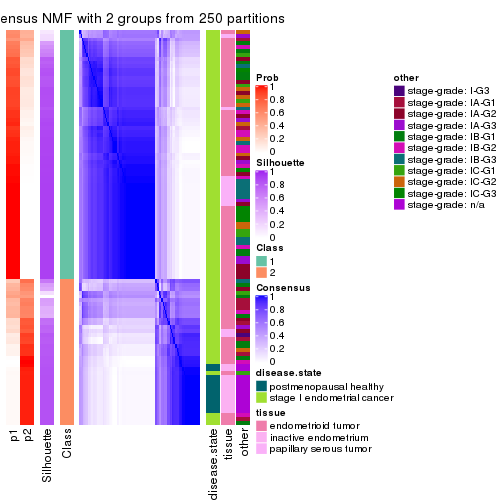</p>

</div>
<div id='tab-CV-NMF-consensus-heatmap-2'>
<pre><code class="r">consensus_heatmap(res, k = 3)
</code></pre>

<p>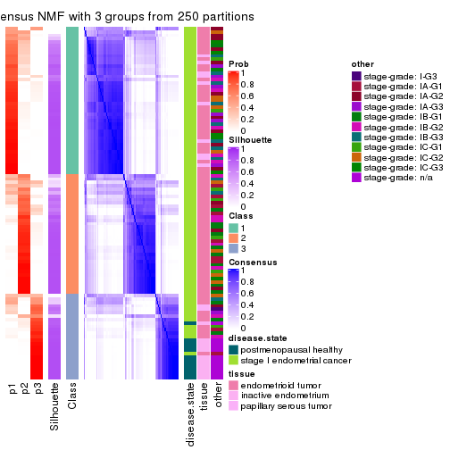</p>

</div>
<div id='tab-CV-NMF-consensus-heatmap-3'>
<pre><code class="r">consensus_heatmap(res, k = 4)
</code></pre>

<p>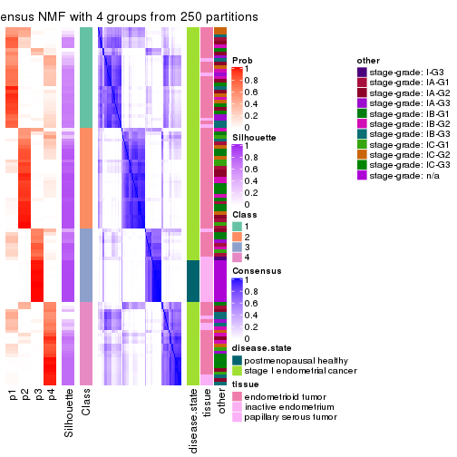</p>

</div>
<div id='tab-CV-NMF-consensus-heatmap-4'>
<pre><code class="r">consensus_heatmap(res, k = 5)
</code></pre>

<p>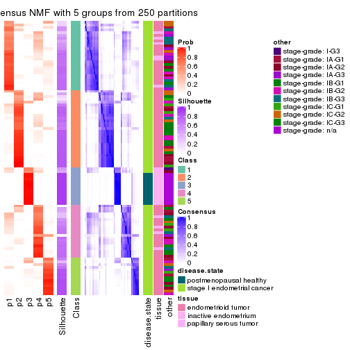</p>

</div>
<div id='tab-CV-NMF-consensus-heatmap-5'>
<pre><code class="r">consensus_heatmap(res, k = 6)
</code></pre>

<p>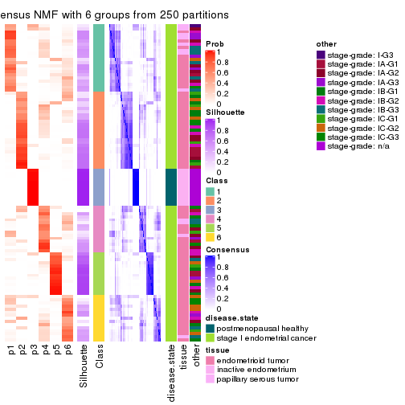</p>

</div>
</div>

Heatmaps for the membership of samples in all partitions to see how consistent they are:


<script>
$( function() {
	$( '#tabs-CV-NMF-membership-heatmap' ).tabs();
} );
</script>
<div id='tabs-CV-NMF-membership-heatmap'>
<ul>
<li><a href='#tab-CV-NMF-membership-heatmap-1'>k = 2</a></li>
<li><a href='#tab-CV-NMF-membership-heatmap-2'>k = 3</a></li>
<li><a href='#tab-CV-NMF-membership-heatmap-3'>k = 4</a></li>
<li><a href='#tab-CV-NMF-membership-heatmap-4'>k = 5</a></li>
<li><a href='#tab-CV-NMF-membership-heatmap-5'>k = 6</a></li>
</ul>
<div id='tab-CV-NMF-membership-heatmap-1'>
<pre><code class="r">membership_heatmap(res, k = 2)
</code></pre>

<p>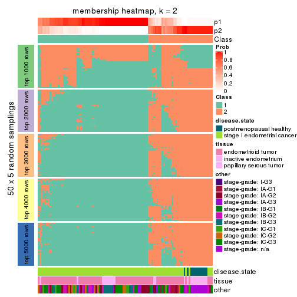</p>

</div>
<div id='tab-CV-NMF-membership-heatmap-2'>
<pre><code class="r">membership_heatmap(res, k = 3)
</code></pre>

<p>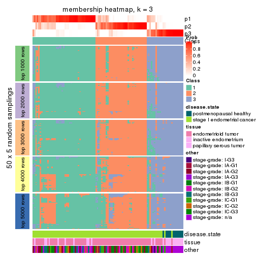</p>

</div>
<div id='tab-CV-NMF-membership-heatmap-3'>
<pre><code class="r">membership_heatmap(res, k = 4)
</code></pre>

<p>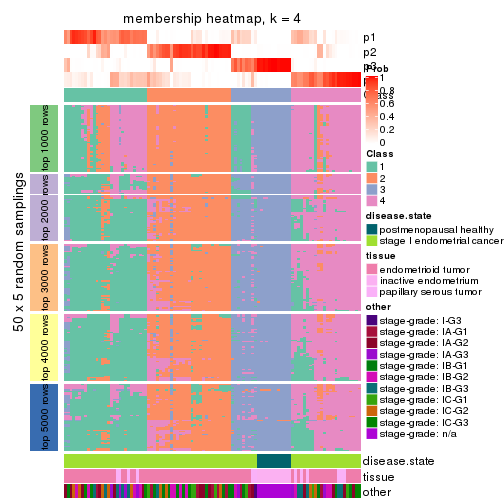</p>

</div>
<div id='tab-CV-NMF-membership-heatmap-4'>
<pre><code class="r">membership_heatmap(res, k = 5)
</code></pre>

<p>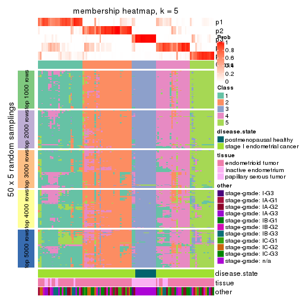</p>

</div>
<div id='tab-CV-NMF-membership-heatmap-5'>
<pre><code class="r">membership_heatmap(res, k = 6)
</code></pre>

<p>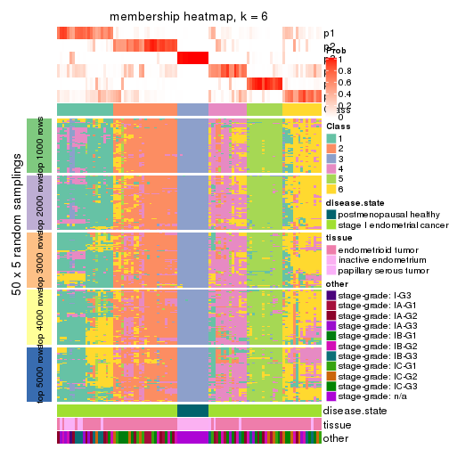</p>

</div>
</div>

As soon as we have had the classes for columns, we can look for signatures
which are significantly different between classes which can be candidate marks
for certain classes. Following are the heatmaps for signatures.


Signature heatmaps where rows are scaled:


<script>
$( function() {
	$( '#tabs-CV-NMF-get-signatures' ).tabs();
} );
</script>
<div id='tabs-CV-NMF-get-signatures'>
<ul>
<li><a href='#tab-CV-NMF-get-signatures-1'>k = 2</a></li>
<li><a href='#tab-CV-NMF-get-signatures-2'>k = 3</a></li>
<li><a href='#tab-CV-NMF-get-signatures-3'>k = 4</a></li>
<li><a href='#tab-CV-NMF-get-signatures-4'>k = 5</a></li>
<li><a href='#tab-CV-NMF-get-signatures-5'>k = 6</a></li>
</ul>
<div id='tab-CV-NMF-get-signatures-1'>
<pre><code class="r">get_signatures(res, k = 2)
</code></pre>

<p>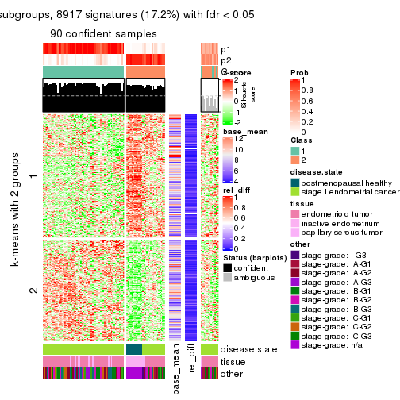</p>

</div>
<div id='tab-CV-NMF-get-signatures-2'>
<pre><code class="r">get_signatures(res, k = 3)
</code></pre>

<p>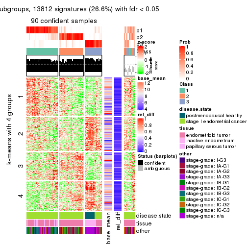</p>

</div>
<div id='tab-CV-NMF-get-signatures-3'>
<pre><code class="r">get_signatures(res, k = 4)
</code></pre>

<p>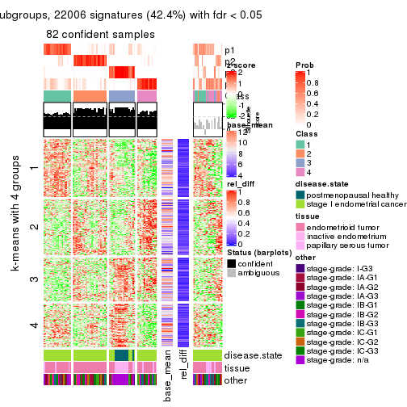</p>

</div>
<div id='tab-CV-NMF-get-signatures-4'>
<pre><code class="r">get_signatures(res, k = 5)
</code></pre>

<p>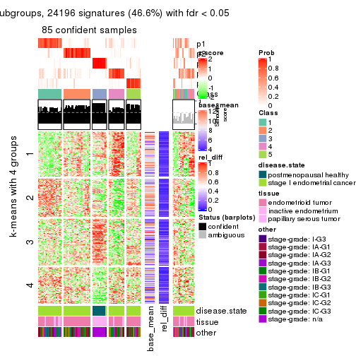</p>

</div>
<div id='tab-CV-NMF-get-signatures-5'>
<pre><code class="r">get_signatures(res, k = 6)
</code></pre>

<p>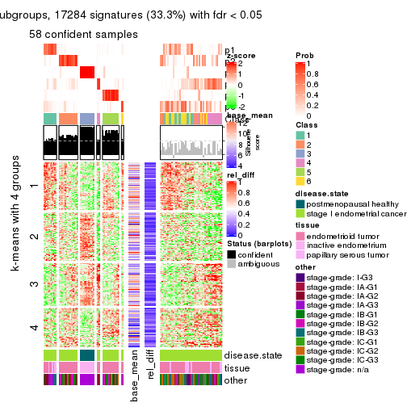</p>

</div>
</div>


Signature heatmaps where rows are not scaled:


<script>
$( function() {
	$( '#tabs-CV-NMF-get-signatures-no-scale' ).tabs();
} );
</script>
<div id='tabs-CV-NMF-get-signatures-no-scale'>
<ul>
<li><a href='#tab-CV-NMF-get-signatures-no-scale-1'>k = 2</a></li>
<li><a href='#tab-CV-NMF-get-signatures-no-scale-2'>k = 3</a></li>
<li><a href='#tab-CV-NMF-get-signatures-no-scale-3'>k = 4</a></li>
<li><a href='#tab-CV-NMF-get-signatures-no-scale-4'>k = 5</a></li>
<li><a href='#tab-CV-NMF-get-signatures-no-scale-5'>k = 6</a></li>
</ul>
<div id='tab-CV-NMF-get-signatures-no-scale-1'>
<pre><code class="r">get_signatures(res, k = 2, scale_rows = FALSE)
</code></pre>

<p>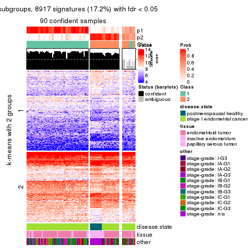</p>

</div>
<div id='tab-CV-NMF-get-signatures-no-scale-2'>
<pre><code class="r">get_signatures(res, k = 3, scale_rows = FALSE)
</code></pre>

<p>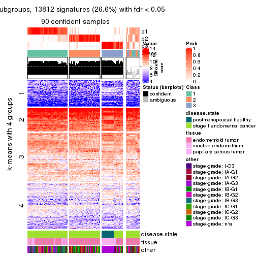</p>

</div>
<div id='tab-CV-NMF-get-signatures-no-scale-3'>
<pre><code class="r">get_signatures(res, k = 4, scale_rows = FALSE)
</code></pre>

<p>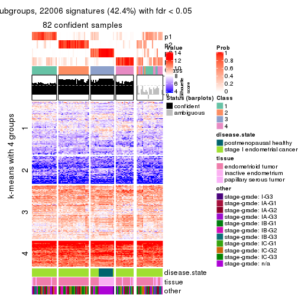</p>

</div>
<div id='tab-CV-NMF-get-signatures-no-scale-4'>
<pre><code class="r">get_signatures(res, k = 5, scale_rows = FALSE)
</code></pre>

<p>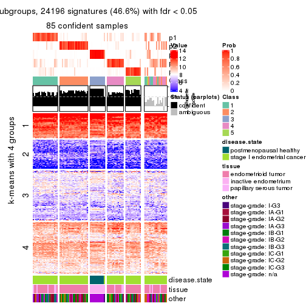</p>

</div>
<div id='tab-CV-NMF-get-signatures-no-scale-5'>
<pre><code class="r">get_signatures(res, k = 6, scale_rows = FALSE)
</code></pre>

<p>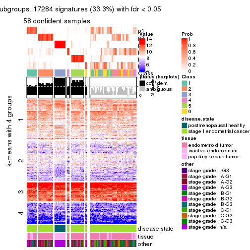</p>

</div>
</div>


Compare the overlap of signatures from different k:

```r
compare_signatures(res)
```

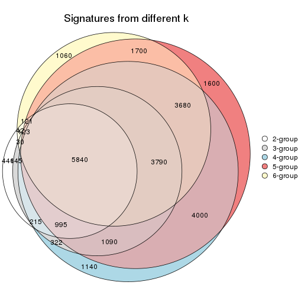

`get_signature()` returns a data frame invisibly. TO get the list of signatures, the function
call should be assigned to a variable explicitly. In following code, if `plot` argument is set
to `FALSE`, no heatmap is plotted while only the differential analysis is performed.

```r
# code only for demonstration
tb = get_signature(res, k = ..., plot = FALSE)
```

An example of the output of `tb` is:

```
#>   which_row         fdr    mean_1    mean_2 scaled_mean_1 scaled_mean_2 km
#> 1        38 0.042760348  8.373488  9.131774    -0.5533452     0.5164555  1
#> 2        40 0.018707592  7.106213  8.469186    -0.6173731     0.5762149  1
#> 3        55 0.019134737 10.221463 11.207825    -0.6159697     0.5749050  1
#> 4        59 0.006059896  5.921854  7.869574    -0.6899429     0.6439467  1
#> 5        60 0.018055526  8.928898 10.211722    -0.6204761     0.5791110  1
#> 6        98 0.009384629 15.714769 14.887706     0.6635654    -0.6193277  2
...
```

The columns in `tb` are:

1. `which_row`: row indices corresponding to the input matrix.
2. `fdr`: FDR for the differential test. 
3. `mean_x`: The mean value in group x.
4. `scaled_mean_x`: The mean value in group x after rows are scaled.
5. `km`: Row groups if k-means clustering is applied to rows.


UMAP plot which shows how samples are separated.


<script>
$( function() {
	$( '#tabs-CV-NMF-dimension-reduction' ).tabs();
} );
</script>
<div id='tabs-CV-NMF-dimension-reduction'>
<ul>
<li><a href='#tab-CV-NMF-dimension-reduction-1'>k = 2</a></li>
<li><a href='#tab-CV-NMF-dimension-reduction-2'>k = 3</a></li>
<li><a href='#tab-CV-NMF-dimension-reduction-3'>k = 4</a></li>
<li><a href='#tab-CV-NMF-dimension-reduction-4'>k = 5</a></li>
<li><a href='#tab-CV-NMF-dimension-reduction-5'>k = 6</a></li>
</ul>
<div id='tab-CV-NMF-dimension-reduction-1'>
<pre><code class="r">dimension_reduction(res, k = 2, method = &quot;UMAP&quot;)
</code></pre>

<p>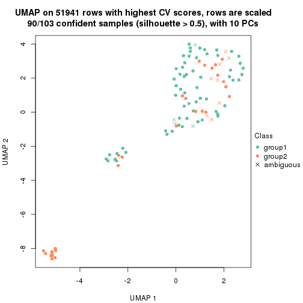</p>

</div>
<div id='tab-CV-NMF-dimension-reduction-2'>
<pre><code class="r">dimension_reduction(res, k = 3, method = &quot;UMAP&quot;)
</code></pre>

<p>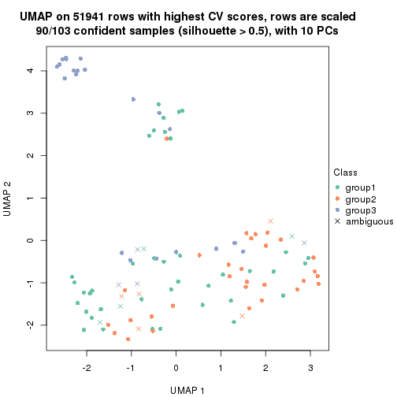</p>

</div>
<div id='tab-CV-NMF-dimension-reduction-3'>
<pre><code class="r">dimension_reduction(res, k = 4, method = &quot;UMAP&quot;)
</code></pre>

<p>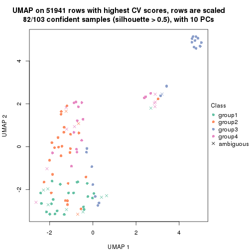</p>

</div>
<div id='tab-CV-NMF-dimension-reduction-4'>
<pre><code class="r">dimension_reduction(res, k = 5, method = &quot;UMAP&quot;)
</code></pre>

<p>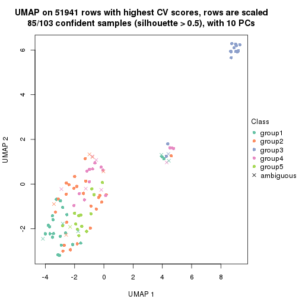</p>

</div>
<div id='tab-CV-NMF-dimension-reduction-5'>
<pre><code class="r">dimension_reduction(res, k = 6, method = &quot;UMAP&quot;)
</code></pre>

<p>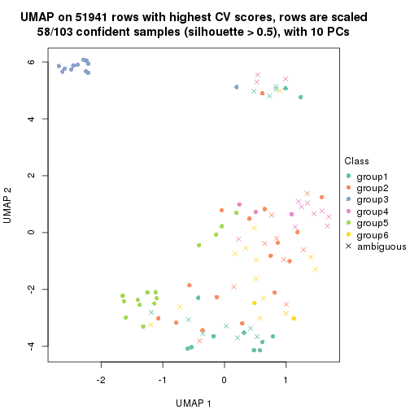</p>

</div>
</div>


Following heatmap shows how subgroups are split when increasing `k`:

```r
collect_classes(res)
```

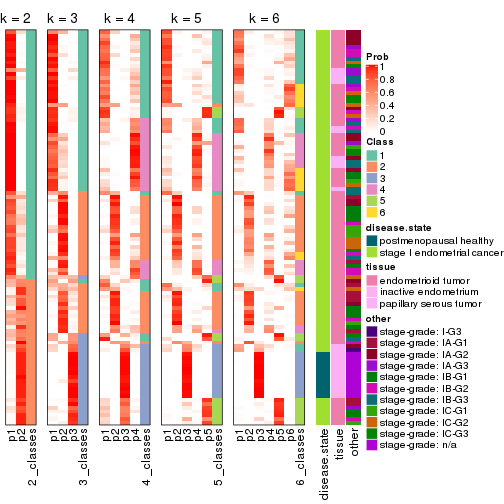


Test correlation between subgroups and known annotations. If the known
annotation is numeric, one-way ANOVA test is applied, and if the known
annotation is discrete, chi-squared contingency table test is applied.

```r
test_to_known_factors(res)
```

```
#>         n disease.state(p) tissue(p) other(p) k
#> CV:NMF 90         4.08e-07  4.56e-07 2.98e-06 2
#> CV:NMF 90         1.32e-10  2.45e-11 5.10e-10 3
#> CV:NMF 82         1.86e-09  6.08e-09 1.07e-05 4
#> CV:NMF 85         6.23e-16  1.02e-15 1.07e-09 5
#> CV:NMF 58         3.15e-11  3.68e-12 2.82e-06 6
```


If matrix rows can be associated to genes, consider to use `functional_enrichment(res,
...)` to perform function enrichment for the signature genes. See [this vignette](http://bioconductor.org/packages/devel/bioc/vignettes/cola/inst/doc/functional_enrichment.html) for more detailed explanations.


 

---------------------------------------------------


### MAD:hclust


The object with results only for a single top-value method and a single partition method 
can be extracted as:

```r
res = res_list["MAD", "hclust"]
# you can also extract it by
# res = res_list["MAD:hclust"]
```

A summary of `res` and all the functions that can be applied to it:

```r
res
```

```
#> A 'ConsensusPartition' object with k = 2, 3, 4, 5, 6.
#>   On a matrix with 51941 rows and 103 columns.
#>   Top rows (1000, 2000, 3000, 4000, 5000) are extracted by 'MAD' method.
#>   Subgroups are detected by 'hclust' method.
#>   Performed in total 1250 partitions by row resampling.
#>   Best k for subgroups seems to be 6.
#> 
#> Following methods can be applied to this 'ConsensusPartition' object:
#>  [1] "cola_report"             "collect_classes"         "collect_plots"          
#>  [4] "collect_stats"           "colnames"                "compare_signatures"     
#>  [7] "consensus_heatmap"       "dimension_reduction"     "functional_enrichment"  
#> [10] "get_anno_col"            "get_anno"                "get_classes"            
#> [13] "get_consensus"           "get_matrix"              "get_membership"         
#> [16] "get_param"               "get_signatures"          "get_stats"              
#> [19] "is_best_k"               "is_stable_k"             "membership_heatmap"     
#> [22] "ncol"                    "nrow"                    "plot_ecdf"              
#> [25] "rownames"                "select_partition_number" "show"                   
#> [28] "suggest_best_k"          "test_to_known_factors"
```

`collect_plots()` function collects all the plots made from `res` for all `k` (number of partitions)
into one single page to provide an easy and fast comparison between different `k`.

```r
collect_plots(res)
```

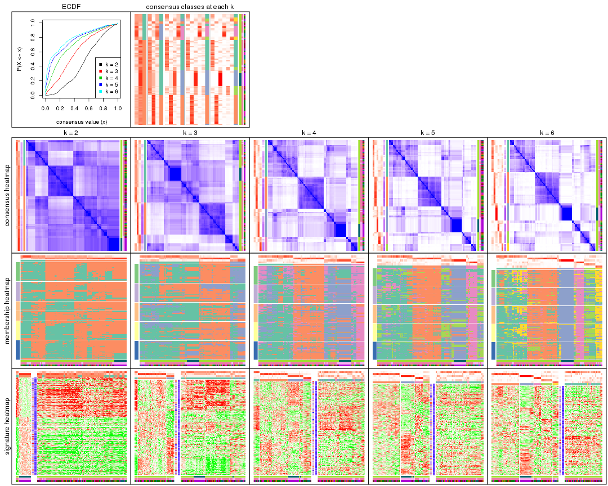

The plots are:

- The first row: a plot of the ECDF (empirical cumulative distribution
  function) curves of the consensus matrix for each `k` and the heatmap of
  predicted classes for each `k`.
- The second row: heatmaps of the consensus matrix for each `k`.
- The third row: heatmaps of the membership matrix for each `k`.
- The fouth row: heatmaps of the signatures for each `k`.

All the plots in panels can be made by individual functions and they are
plotted later in this section.

`select_partition_number()` produces several plots showing different
statistics for choosing "optimized" `k`. There are following statistics:

- ECDF curves of the consensus matrix for each `k`;
- 1-PAC. [The PAC
  score](https://en.wikipedia.org/wiki/Consensus_clustering#Over-interpretation_potential_of_consensus_clustering)
  measures the proportion of the ambiguous subgrouping.
- Mean silhouette score.
- Concordance. The mean probability of fiting the consensus class ids in all
  partitions.
- Area increased. Denote $A_k$ as the area under the ECDF curve for current
  `k`, the area increased is defined as $A_k - A_{k-1}$.
- Rand index. The percent of pairs of samples that are both in a same cluster
  or both are not in a same cluster in the partition of k and k-1.
- Jaccard index. The ratio of pairs of samples are both in a same cluster in
  the partition of k and k-1 and the pairs of samples are both in a same
  cluster in the partition k or k-1.

The detailed explanations of these statistics can be found in [the _cola_
vignette](http://bioconductor.org/packages/devel/bioc/vignettes/cola/inst/doc/cola.html#toc_13).

Generally speaking, lower PAC score, higher mean silhouette score or higher
concordance corresponds to better partition. Rand index and Jaccard index
measure how similar the current partition is compared to partition with `k-1`.
If they are too similar, we won't accept `k` is better than `k-1`.

```r
select_partition_number(res)
```

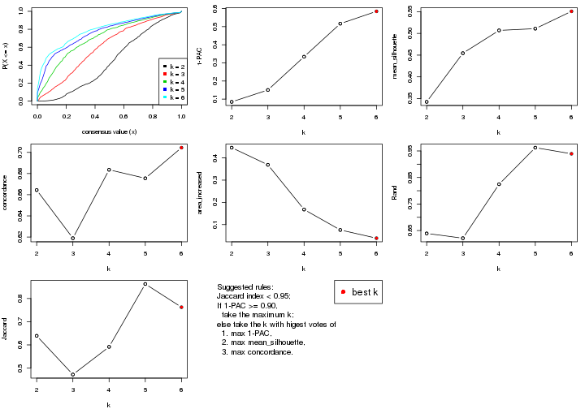

The numeric values for all these statistics can be obtained by `get_stats()`.

```r
get_stats(res)
```

```
#>   k  1-PAC mean_silhouette concordance area_increased  Rand Jaccard
#> 2 2 0.0848           0.342       0.664         0.4459 0.639   0.639
#> 3 3 0.1503           0.454       0.619         0.3688 0.621   0.472
#> 4 4 0.3341           0.507       0.684         0.1677 0.824   0.591
#> 5 5 0.5165           0.511       0.675         0.0759 0.962   0.863
#> 6 6 0.5846           0.551       0.704         0.0389 0.939   0.762
```

`suggest_best_k()` suggests the best $k$ based on these statistics. The rules are as follows:

- All $k$ with Jaccard index larger than 0.95 are removed because increasing
  $k$ does not provide enough extra information. If all $k$ are removed, it is
  marked as no subgroup is detected.
- For all $k$ with 1-PAC score larger than 0.9, the maximal $k$ is taken as
  the best $k$, and other $k$ are marked as optional $k$.
- If it does not fit the second rule. The $k$ with the maximal vote of the
  highest 1-PAC score, highest mean silhouette, and highest concordance is
  taken as the best $k$.

```r
suggest_best_k(res)
```

```
#> [1] 6
```


Following shows the table of the partitions (You need to click the **show/hide
code output** link to see it). The membership matrix (columns with name `p*`)
is inferred by
[`clue::cl_consensus()`](https://www.rdocumentation.org/link/cl_consensus?package=clue)
function with the `SE` method. Basically the value in the membership matrix
represents the probability to belong to a certain group. The finall class
label for an item is determined with the group with highest probability it
belongs to.

In `get_classes()` function, the entropy is calculated from the membership
matrix and the silhouette score is calculated from the consensus matrix.


<script>
$( function() {
	$( '#tabs-MAD-hclust-get-classes' ).tabs();
} );
</script>
<div id='tabs-MAD-hclust-get-classes'>
<ul>
<li><a href='#tab-MAD-hclust-get-classes-1'>k = 2</a></li>
<li><a href='#tab-MAD-hclust-get-classes-2'>k = 3</a></li>
<li><a href='#tab-MAD-hclust-get-classes-3'>k = 4</a></li>
<li><a href='#tab-MAD-hclust-get-classes-4'>k = 5</a></li>
<li><a href='#tab-MAD-hclust-get-classes-5'>k = 6</a></li>
</ul>

<div id='tab-MAD-hclust-get-classes-1'>
<p><a id='tab-MAD-hclust-get-classes-1-a' style='color:#0366d6' href='#'>show/hide code output</a></p>
<pre><code class="r">cbind(get_classes(res, k = 2), get_membership(res, k = 2))
</code></pre>

<pre><code>#&gt;           class entropy silhouette    p1    p2
#&gt; GSM425907     2   0.991     0.3826 0.444 0.556
#&gt; GSM425908     2   0.998     0.3612 0.476 0.524
#&gt; GSM425909     2   0.871     0.3779 0.292 0.708
#&gt; GSM425910     2   0.706     0.4031 0.192 0.808
#&gt; GSM425911     2   0.821     0.4851 0.256 0.744
#&gt; GSM425912     2   0.605     0.4767 0.148 0.852
#&gt; GSM425913     2   0.939     0.4400 0.356 0.644
#&gt; GSM425914     2   0.671     0.4349 0.176 0.824
#&gt; GSM425915     2   0.714     0.4832 0.196 0.804
#&gt; GSM425874     1   0.563     0.4573 0.868 0.132
#&gt; GSM425875     2   0.795     0.2853 0.240 0.760
#&gt; GSM425876     2   0.802     0.3047 0.244 0.756
#&gt; GSM425877     2   1.000    -0.4024 0.488 0.512
#&gt; GSM425878     2   0.981    -0.2354 0.420 0.580
#&gt; GSM425879     2   0.981     0.4014 0.420 0.580
#&gt; GSM425880     2   0.808     0.3017 0.248 0.752
#&gt; GSM425881     2   0.605     0.4913 0.148 0.852
#&gt; GSM425882     2   0.995     0.3747 0.460 0.540
#&gt; GSM425883     1   0.990     0.4584 0.560 0.440
#&gt; GSM425884     2   0.993    -0.3524 0.452 0.548
#&gt; GSM425885     1   0.932     0.0186 0.652 0.348
#&gt; GSM425848     1   0.996     0.4049 0.536 0.464
#&gt; GSM425849     2   1.000    -0.3470 0.492 0.508
#&gt; GSM425850     2   0.932     0.0641 0.348 0.652
#&gt; GSM425851     1   1.000     0.4194 0.504 0.496
#&gt; GSM425852     2   0.767     0.3427 0.224 0.776
#&gt; GSM425893     2   0.943     0.4418 0.360 0.640
#&gt; GSM425894     2   0.987     0.3856 0.432 0.568
#&gt; GSM425895     2   0.929     0.4463 0.344 0.656
#&gt; GSM425896     2   0.973     0.4134 0.404 0.596
#&gt; GSM425897     2   0.958     0.4282 0.380 0.620
#&gt; GSM425898     2   0.973     0.4042 0.404 0.596
#&gt; GSM425899     2   0.991     0.3823 0.444 0.556
#&gt; GSM425900     2   0.929     0.4465 0.344 0.656
#&gt; GSM425901     2   0.886     0.3718 0.304 0.696
#&gt; GSM425902     1   0.563     0.4573 0.868 0.132
#&gt; GSM425903     2   0.584     0.4422 0.140 0.860
#&gt; GSM425904     2   0.808     0.3017 0.248 0.752
#&gt; GSM425905     2   0.988     0.3891 0.436 0.564
#&gt; GSM425906     2   0.866     0.4683 0.288 0.712
#&gt; GSM425863     1   0.990     0.4491 0.560 0.440
#&gt; GSM425864     2   0.971     0.4208 0.400 0.600
#&gt; GSM425865     2   0.991     0.3952 0.444 0.556
#&gt; GSM425866     2   0.795     0.2853 0.240 0.760
#&gt; GSM425867     2   0.680     0.3851 0.180 0.820
#&gt; GSM425868     2   1.000     0.3557 0.488 0.512
#&gt; GSM425869     2   0.992     0.3691 0.448 0.552
#&gt; GSM425870     2   0.563     0.4982 0.132 0.868
#&gt; GSM425871     2   0.990    -0.1933 0.440 0.560
#&gt; GSM425872     2   0.969     0.4116 0.396 0.604
#&gt; GSM425873     2   0.913     0.0441 0.328 0.672
#&gt; GSM425843     2   1.000    -0.4024 0.488 0.512
#&gt; GSM425844     2   0.988    -0.2254 0.436 0.564
#&gt; GSM425845     2   0.689     0.3859 0.184 0.816
#&gt; GSM425846     2   0.993     0.3748 0.452 0.548
#&gt; GSM425847     2   0.625     0.4662 0.156 0.844
#&gt; GSM425886     2   0.760     0.4820 0.220 0.780
#&gt; GSM425887     2   0.929     0.4477 0.344 0.656
#&gt; GSM425888     2   0.605     0.4913 0.148 0.852
#&gt; GSM425889     1   0.955     0.5060 0.624 0.376
#&gt; GSM425890     1   0.971     0.5019 0.600 0.400
#&gt; GSM425891     2   0.943     0.4417 0.360 0.640
#&gt; GSM425892     1   0.998    -0.3203 0.524 0.476
#&gt; GSM425853     2   0.821     0.2589 0.256 0.744
#&gt; GSM425854     2   0.939     0.4427 0.356 0.644
#&gt; GSM425855     1   0.997     0.4066 0.532 0.468
#&gt; GSM425856     2   0.795     0.2853 0.240 0.760
#&gt; GSM425857     2   0.943     0.3517 0.360 0.640
#&gt; GSM425858     2   0.904     0.4583 0.320 0.680
#&gt; GSM425859     2   0.990     0.3766 0.440 0.560
#&gt; GSM425860     2   0.706     0.3880 0.192 0.808
#&gt; GSM425861     2   0.605     0.4913 0.148 0.852
#&gt; GSM425862     1   0.952     0.5057 0.628 0.372
#&gt; GSM425837     1   1.000     0.4252 0.512 0.488
#&gt; GSM425838     1   0.625     0.4044 0.844 0.156
#&gt; GSM425839     2   0.988     0.3766 0.436 0.564
#&gt; GSM425840     1   0.999     0.3850 0.520 0.480
#&gt; GSM425841     1   0.563     0.4573 0.868 0.132
#&gt; GSM425842     2   0.939    -0.0694 0.356 0.644
#&gt; GSM425917     2   0.529     0.4578 0.120 0.880
#&gt; GSM425922     1   0.563     0.4676 0.868 0.132
#&gt; GSM425919     1   1.000     0.4194 0.504 0.496
#&gt; GSM425920     2   0.994    -0.2852 0.456 0.544
#&gt; GSM425923     1   0.990     0.4756 0.560 0.440
#&gt; GSM425916     1   0.988     0.4545 0.564 0.436
#&gt; GSM425918     1   0.991     0.4759 0.556 0.444
#&gt; GSM425921     1   0.563     0.4676 0.868 0.132
#&gt; GSM425925     1   0.529     0.4654 0.880 0.120
#&gt; GSM425926     1   0.552     0.4650 0.872 0.128
#&gt; GSM425927     2   0.980    -0.2273 0.416 0.584
#&gt; GSM425924     2   0.552     0.4568 0.128 0.872
#&gt; GSM425928     2   0.358     0.5042 0.068 0.932
#&gt; GSM425929     2   0.358     0.5042 0.068 0.932
#&gt; GSM425930     2   0.358     0.5042 0.068 0.932
#&gt; GSM425931     2   0.358     0.5042 0.068 0.932
#&gt; GSM425932     2   0.358     0.5042 0.068 0.932
#&gt; GSM425933     2   0.358     0.5042 0.068 0.932
#&gt; GSM425934     2   0.358     0.5042 0.068 0.932
#&gt; GSM425935     2   0.358     0.5042 0.068 0.932
#&gt; GSM425936     2   0.358     0.5042 0.068 0.932
#&gt; GSM425937     2   0.358     0.5042 0.068 0.932
#&gt; GSM425938     2   0.358     0.5042 0.068 0.932
#&gt; GSM425939     2   0.358     0.5042 0.068 0.932
</code></pre>

<script>
$('#tab-MAD-hclust-get-classes-1-a').parent().next().next().hide();
$('#tab-MAD-hclust-get-classes-1-a').click(function(){
  $('#tab-MAD-hclust-get-classes-1-a').parent().next().next().toggle();
  return(false);
});
</script>
</div>

<div id='tab-MAD-hclust-get-classes-2'>
<p><a id='tab-MAD-hclust-get-classes-2-a' style='color:#0366d6' href='#'>show/hide code output</a></p>
<pre><code class="r">cbind(get_classes(res, k = 3), get_membership(res, k = 3))
</code></pre>

<pre><code>#&gt;           class entropy silhouette    p1    p2    p3
#&gt; GSM425907     2   0.249     0.8314 0.016 0.936 0.048
#&gt; GSM425908     2   0.344     0.8172 0.016 0.896 0.088
#&gt; GSM425909     1   0.880     0.3769 0.556 0.300 0.144
#&gt; GSM425910     1   0.749     0.4895 0.664 0.256 0.080
#&gt; GSM425911     2   0.710     0.4450 0.280 0.668 0.052
#&gt; GSM425912     1   0.832     0.3045 0.524 0.392 0.084
#&gt; GSM425913     2   0.429     0.8098 0.092 0.868 0.040
#&gt; GSM425914     1   0.788     0.4528 0.612 0.308 0.080
#&gt; GSM425915     1   0.787     0.3245 0.552 0.388 0.060
#&gt; GSM425874     3   0.540     0.6253 0.004 0.256 0.740
#&gt; GSM425875     1   0.625     0.4826 0.772 0.144 0.084
#&gt; GSM425876     1   0.683     0.4474 0.736 0.168 0.096
#&gt; GSM425877     1   0.721     0.0863 0.604 0.036 0.360
#&gt; GSM425878     1   0.748     0.1997 0.632 0.060 0.308
#&gt; GSM425879     2   0.281     0.8399 0.036 0.928 0.036
#&gt; GSM425880     1   0.699     0.4819 0.724 0.180 0.096
#&gt; GSM425881     1   0.846     0.1990 0.476 0.436 0.088
#&gt; GSM425882     2   0.401     0.8232 0.036 0.880 0.084
#&gt; GSM425883     3   0.862     0.2248 0.424 0.100 0.476
#&gt; GSM425884     1   0.695     0.1490 0.636 0.032 0.332
#&gt; GSM425885     2   0.762     0.1660 0.048 0.560 0.392
#&gt; GSM425848     1   0.841    -0.0672 0.508 0.088 0.404
#&gt; GSM425849     1   0.812     0.0122 0.532 0.072 0.396
#&gt; GSM425850     1   0.851     0.3154 0.604 0.152 0.244
#&gt; GSM425851     1   0.692    -0.0399 0.580 0.020 0.400
#&gt; GSM425852     1   0.691     0.4959 0.724 0.192 0.084
#&gt; GSM425893     2   0.504     0.7682 0.104 0.836 0.060
#&gt; GSM425894     2   0.266     0.8417 0.024 0.932 0.044
#&gt; GSM425895     2   0.550     0.7939 0.124 0.812 0.064
#&gt; GSM425896     2   0.369     0.8135 0.052 0.896 0.052
#&gt; GSM425897     2   0.421     0.7969 0.088 0.872 0.040
#&gt; GSM425898     2   0.338     0.8385 0.048 0.908 0.044
#&gt; GSM425899     2   0.581     0.7865 0.072 0.796 0.132
#&gt; GSM425900     2   0.494     0.8001 0.104 0.840 0.056
#&gt; GSM425901     1   0.899     0.3398 0.528 0.320 0.152
#&gt; GSM425902     3   0.550     0.6283 0.008 0.248 0.744
#&gt; GSM425903     1   0.728     0.5136 0.672 0.260 0.068
#&gt; GSM425904     1   0.699     0.4819 0.724 0.180 0.096
#&gt; GSM425905     2   0.253     0.8347 0.020 0.936 0.044
#&gt; GSM425906     2   0.596     0.6971 0.188 0.768 0.044
#&gt; GSM425863     3   0.858     0.1535 0.452 0.096 0.452
#&gt; GSM425864     2   0.338     0.8248 0.044 0.908 0.048
#&gt; GSM425865     2   0.397     0.8307 0.044 0.884 0.072
#&gt; GSM425866     1   0.625     0.4826 0.772 0.144 0.084
#&gt; GSM425867     1   0.666     0.5122 0.736 0.192 0.072
#&gt; GSM425868     2   0.400     0.8062 0.016 0.868 0.116
#&gt; GSM425869     2   0.341     0.8316 0.020 0.900 0.080
#&gt; GSM425870     1   0.792     0.2379 0.484 0.460 0.056
#&gt; GSM425871     1   0.833     0.1580 0.564 0.096 0.340
#&gt; GSM425872     2   0.380     0.8350 0.056 0.892 0.052
#&gt; GSM425873     1   0.736     0.3651 0.700 0.112 0.188
#&gt; GSM425843     1   0.721     0.0863 0.604 0.036 0.360
#&gt; GSM425844     1   0.818     0.1222 0.564 0.084 0.352
#&gt; GSM425845     1   0.719     0.5061 0.696 0.224 0.080
#&gt; GSM425846     2   0.611     0.7718 0.080 0.780 0.140
#&gt; GSM425847     1   0.831     0.3703 0.556 0.352 0.092
#&gt; GSM425886     1   0.805     0.2141 0.500 0.436 0.064
#&gt; GSM425887     2   0.566     0.7888 0.128 0.804 0.068
#&gt; GSM425888     1   0.845     0.2100 0.480 0.432 0.088
#&gt; GSM425889     3   0.867     0.3385 0.412 0.104 0.484
#&gt; GSM425890     3   0.749     0.3644 0.380 0.044 0.576
#&gt; GSM425891     2   0.460     0.8061 0.108 0.852 0.040
#&gt; GSM425892     2   0.579     0.7326 0.048 0.784 0.168
#&gt; GSM425853     1   0.641     0.4775 0.764 0.144 0.092
#&gt; GSM425854     2   0.521     0.8139 0.108 0.828 0.064
#&gt; GSM425855     1   0.813    -0.0375 0.528 0.072 0.400
#&gt; GSM425856     1   0.625     0.4826 0.772 0.144 0.084
#&gt; GSM425857     1   0.940     0.2198 0.452 0.372 0.176
#&gt; GSM425858     2   0.582     0.7621 0.144 0.792 0.064
#&gt; GSM425859     2   0.270     0.8386 0.016 0.928 0.056
#&gt; GSM425860     1   0.750     0.4937 0.672 0.240 0.088
#&gt; GSM425861     1   0.845     0.2100 0.480 0.432 0.088
#&gt; GSM425862     3   0.866     0.3459 0.408 0.104 0.488
#&gt; GSM425837     1   0.675    -0.0278 0.596 0.016 0.388
#&gt; GSM425838     3   0.687     0.5608 0.040 0.288 0.672
#&gt; GSM425839     2   0.238     0.8400 0.016 0.940 0.044
#&gt; GSM425840     1   0.818    -0.0218 0.532 0.076 0.392
#&gt; GSM425841     3   0.558     0.6250 0.008 0.256 0.736
#&gt; GSM425842     1   0.753     0.3220 0.676 0.096 0.228
#&gt; GSM425917     1   0.850     0.4314 0.576 0.304 0.120
#&gt; GSM425922     3   0.489     0.6368 0.000 0.228 0.772
#&gt; GSM425919     1   0.692    -0.0399 0.580 0.020 0.400
#&gt; GSM425920     1   0.777     0.1376 0.592 0.064 0.344
#&gt; GSM425923     3   0.667     0.2375 0.468 0.008 0.524
#&gt; GSM425916     1   0.652    -0.2190 0.508 0.004 0.488
#&gt; GSM425918     3   0.666     0.2416 0.460 0.008 0.532
#&gt; GSM425921     3   0.489     0.6368 0.000 0.228 0.772
#&gt; GSM425925     3   0.554     0.6362 0.012 0.236 0.752
#&gt; GSM425926     3   0.493     0.6354 0.000 0.232 0.768
#&gt; GSM425927     1   0.756     0.2524 0.644 0.072 0.284
#&gt; GSM425924     1   0.841     0.4329 0.580 0.308 0.112
#&gt; GSM425928     1   0.823     0.3589 0.536 0.384 0.080
#&gt; GSM425929     1   0.823     0.3589 0.536 0.384 0.080
#&gt; GSM425930     1   0.823     0.3589 0.536 0.384 0.080
#&gt; GSM425931     1   0.823     0.3589 0.536 0.384 0.080
#&gt; GSM425932     1   0.823     0.3589 0.536 0.384 0.080
#&gt; GSM425933     1   0.823     0.3589 0.536 0.384 0.080
#&gt; GSM425934     1   0.823     0.3589 0.536 0.384 0.080
#&gt; GSM425935     1   0.823     0.3589 0.536 0.384 0.080
#&gt; GSM425936     1   0.823     0.3589 0.536 0.384 0.080
#&gt; GSM425937     1   0.823     0.3589 0.536 0.384 0.080
#&gt; GSM425938     1   0.823     0.3589 0.536 0.384 0.080
#&gt; GSM425939     1   0.823     0.3589 0.536 0.384 0.080
</code></pre>

<script>
$('#tab-MAD-hclust-get-classes-2-a').parent().next().next().hide();
$('#tab-MAD-hclust-get-classes-2-a').click(function(){
  $('#tab-MAD-hclust-get-classes-2-a').parent().next().next().toggle();
  return(false);
});
</script>
</div>

<div id='tab-MAD-hclust-get-classes-3'>
<p><a id='tab-MAD-hclust-get-classes-3-a' style='color:#0366d6' href='#'>show/hide code output</a></p>
<pre><code class="r">cbind(get_classes(res, k = 4), get_membership(res, k = 4))
</code></pre>

<pre><code>#&gt;           class entropy silhouette    p1    p2    p3    p4
#&gt; GSM425907     2   0.299     0.8049 0.008 0.900 0.056 0.036
#&gt; GSM425908     2   0.326     0.8024 0.012 0.888 0.032 0.068
#&gt; GSM425909     3   0.838     0.4586 0.176 0.168 0.556 0.100
#&gt; GSM425910     1   0.574     0.4747 0.700 0.092 0.208 0.000
#&gt; GSM425911     2   0.789     0.1095 0.184 0.436 0.368 0.012
#&gt; GSM425912     1   0.665     0.3898 0.608 0.280 0.108 0.004
#&gt; GSM425913     2   0.418     0.8004 0.084 0.844 0.056 0.016
#&gt; GSM425914     1   0.640     0.4394 0.648 0.144 0.208 0.000
#&gt; GSM425915     3   0.751     0.4944 0.180 0.200 0.592 0.028
#&gt; GSM425874     4   0.338     0.6823 0.008 0.116 0.012 0.864
#&gt; GSM425875     1   0.734     0.0315 0.468 0.048 0.432 0.052
#&gt; GSM425876     1   0.373     0.5600 0.848 0.044 0.108 0.000
#&gt; GSM425877     1   0.628     0.4164 0.656 0.000 0.128 0.216
#&gt; GSM425878     1   0.501     0.5113 0.776 0.008 0.060 0.156
#&gt; GSM425879     2   0.339     0.8118 0.020 0.884 0.068 0.028
#&gt; GSM425880     3   0.755     0.1205 0.396 0.064 0.488 0.052
#&gt; GSM425881     1   0.678     0.2845 0.568 0.336 0.088 0.008
#&gt; GSM425882     2   0.408     0.8070 0.032 0.856 0.048 0.064
#&gt; GSM425883     1   0.764     0.0960 0.448 0.028 0.104 0.420
#&gt; GSM425884     1   0.550     0.4704 0.728 0.000 0.096 0.176
#&gt; GSM425885     2   0.696     0.0994 0.012 0.476 0.076 0.436
#&gt; GSM425848     1   0.733     0.3412 0.564 0.028 0.100 0.308
#&gt; GSM425849     1   0.556     0.4283 0.676 0.008 0.032 0.284
#&gt; GSM425850     1   0.591     0.5320 0.748 0.060 0.056 0.136
#&gt; GSM425851     3   0.804    -0.1928 0.312 0.008 0.424 0.256
#&gt; GSM425852     3   0.758     0.2159 0.368 0.080 0.508 0.044
#&gt; GSM425893     2   0.571     0.6049 0.032 0.692 0.256 0.020
#&gt; GSM425894     2   0.230     0.8196 0.012 0.932 0.024 0.032
#&gt; GSM425895     2   0.494     0.7876 0.124 0.800 0.044 0.032
#&gt; GSM425896     2   0.461     0.6958 0.004 0.768 0.204 0.024
#&gt; GSM425897     2   0.507     0.6420 0.012 0.720 0.252 0.016
#&gt; GSM425898     2   0.294     0.8170 0.028 0.908 0.032 0.032
#&gt; GSM425899     2   0.548     0.7482 0.056 0.764 0.032 0.148
#&gt; GSM425900     2   0.440     0.7912 0.100 0.832 0.044 0.024
#&gt; GSM425901     3   0.836     0.4759 0.148 0.184 0.560 0.108
#&gt; GSM425902     4   0.349     0.6818 0.008 0.116 0.016 0.860
#&gt; GSM425903     1   0.697    -0.0516 0.456 0.096 0.444 0.004
#&gt; GSM425904     3   0.755     0.1205 0.396 0.064 0.488 0.052
#&gt; GSM425905     2   0.290     0.8069 0.008 0.904 0.056 0.032
#&gt; GSM425906     2   0.545     0.7067 0.184 0.740 0.068 0.008
#&gt; GSM425863     1   0.732     0.2161 0.504 0.028 0.080 0.388
#&gt; GSM425864     2   0.472     0.7620 0.016 0.796 0.152 0.036
#&gt; GSM425865     2   0.423     0.8068 0.032 0.848 0.068 0.052
#&gt; GSM425866     1   0.734     0.0315 0.468 0.048 0.432 0.052
#&gt; GSM425867     1   0.589     0.3814 0.640 0.048 0.308 0.004
#&gt; GSM425868     2   0.404     0.7860 0.012 0.840 0.032 0.116
#&gt; GSM425869     2   0.252     0.8138 0.000 0.912 0.024 0.064
#&gt; GSM425870     3   0.796     0.0066 0.364 0.248 0.384 0.004
#&gt; GSM425871     1   0.586     0.4737 0.712 0.036 0.036 0.216
#&gt; GSM425872     2   0.312     0.8147 0.044 0.900 0.032 0.024
#&gt; GSM425873     1   0.419     0.5589 0.848 0.024 0.068 0.060
#&gt; GSM425843     1   0.628     0.4164 0.656 0.000 0.128 0.216
#&gt; GSM425844     1   0.657     0.4329 0.656 0.024 0.080 0.240
#&gt; GSM425845     1   0.594     0.4327 0.664 0.064 0.268 0.004
#&gt; GSM425846     2   0.568     0.7351 0.064 0.752 0.032 0.152
#&gt; GSM425847     1   0.631     0.4461 0.652 0.244 0.100 0.004
#&gt; GSM425886     3   0.762     0.5040 0.144 0.252 0.572 0.032
#&gt; GSM425887     2   0.491     0.7830 0.128 0.800 0.040 0.032
#&gt; GSM425888     1   0.664     0.2772 0.572 0.344 0.076 0.008
#&gt; GSM425889     4   0.788     0.1021 0.344 0.028 0.140 0.488
#&gt; GSM425890     4   0.785     0.3429 0.204 0.012 0.296 0.488
#&gt; GSM425891     2   0.487     0.7892 0.096 0.804 0.084 0.016
#&gt; GSM425892     2   0.592     0.7197 0.032 0.740 0.084 0.144
#&gt; GSM425853     1   0.703     0.2610 0.560 0.044 0.348 0.048
#&gt; GSM425854     2   0.454     0.8025 0.096 0.828 0.040 0.036
#&gt; GSM425855     1   0.687     0.3824 0.608 0.024 0.080 0.288
#&gt; GSM425856     1   0.734     0.0315 0.468 0.048 0.432 0.052
#&gt; GSM425857     3   0.833     0.4839 0.092 0.236 0.544 0.128
#&gt; GSM425858     2   0.500     0.7672 0.136 0.792 0.044 0.028
#&gt; GSM425859     2   0.193     0.8174 0.000 0.940 0.024 0.036
#&gt; GSM425860     1   0.564     0.4810 0.704 0.064 0.228 0.004
#&gt; GSM425861     1   0.664     0.2772 0.572 0.344 0.076 0.008
#&gt; GSM425862     4   0.787     0.1151 0.340 0.028 0.140 0.492
#&gt; GSM425837     1   0.723     0.2954 0.540 0.000 0.192 0.268
#&gt; GSM425838     4   0.512     0.6093 0.052 0.168 0.012 0.768
#&gt; GSM425839     2   0.202     0.8189 0.004 0.940 0.028 0.028
#&gt; GSM425840     1   0.677     0.3958 0.620 0.024 0.076 0.280
#&gt; GSM425841     4   0.349     0.6815 0.008 0.116 0.016 0.860
#&gt; GSM425842     1   0.433     0.5513 0.836 0.016 0.064 0.084
#&gt; GSM425917     3   0.539     0.6300 0.048 0.120 0.780 0.052
#&gt; GSM425922     4   0.253     0.6901 0.008 0.072 0.008 0.912
#&gt; GSM425919     3   0.804    -0.1928 0.312 0.008 0.424 0.256
#&gt; GSM425920     1   0.700     0.3519 0.612 0.008 0.184 0.196
#&gt; GSM425923     4   0.786     0.2016 0.276 0.000 0.340 0.384
#&gt; GSM425916     3   0.786    -0.3210 0.276 0.000 0.388 0.336
#&gt; GSM425918     4   0.783     0.2170 0.264 0.000 0.340 0.396
#&gt; GSM425921     4   0.253     0.6901 0.008 0.072 0.008 0.912
#&gt; GSM425925     4   0.307     0.6859 0.024 0.076 0.008 0.892
#&gt; GSM425926     4   0.238     0.6898 0.008 0.072 0.004 0.916
#&gt; GSM425927     1   0.519     0.5227 0.776 0.012 0.080 0.132
#&gt; GSM425924     3   0.539     0.6297 0.048 0.120 0.780 0.052
#&gt; GSM425928     3   0.340     0.6980 0.008 0.152 0.840 0.000
#&gt; GSM425929     3   0.340     0.6980 0.008 0.152 0.840 0.000
#&gt; GSM425930     3   0.340     0.6980 0.008 0.152 0.840 0.000
#&gt; GSM425931     3   0.340     0.6980 0.008 0.152 0.840 0.000
#&gt; GSM425932     3   0.340     0.6980 0.008 0.152 0.840 0.000
#&gt; GSM425933     3   0.340     0.6980 0.008 0.152 0.840 0.000
#&gt; GSM425934     3   0.340     0.6980 0.008 0.152 0.840 0.000
#&gt; GSM425935     3   0.340     0.6980 0.008 0.152 0.840 0.000
#&gt; GSM425936     3   0.340     0.6980 0.008 0.152 0.840 0.000
#&gt; GSM425937     3   0.340     0.6980 0.008 0.152 0.840 0.000
#&gt; GSM425938     3   0.340     0.6980 0.008 0.152 0.840 0.000
#&gt; GSM425939     3   0.340     0.6980 0.008 0.152 0.840 0.000
</code></pre>

<script>
$('#tab-MAD-hclust-get-classes-3-a').parent().next().next().hide();
$('#tab-MAD-hclust-get-classes-3-a').click(function(){
  $('#tab-MAD-hclust-get-classes-3-a').parent().next().next().toggle();
  return(false);
});
</script>
</div>

<div id='tab-MAD-hclust-get-classes-4'>
<p><a id='tab-MAD-hclust-get-classes-4-a' style='color:#0366d6' href='#'>show/hide code output</a></p>
<pre><code class="r">cbind(get_classes(res, k = 5), get_membership(res, k = 5))
</code></pre>

<pre><code>#&gt;           class entropy silhouette    p1    p2    p3    p4    p5
#&gt; GSM425907     2   0.391    0.79944 0.004 0.824 0.072 0.008 0.092
#&gt; GSM425908     2   0.440    0.79073 0.004 0.804 0.040 0.048 0.104
#&gt; GSM425909     3   0.757    0.40536 0.088 0.072 0.460 0.024 0.356
#&gt; GSM425910     1   0.512    0.46280 0.712 0.048 0.208 0.000 0.032
#&gt; GSM425911     3   0.741    0.04952 0.176 0.356 0.416 0.000 0.052
#&gt; GSM425912     1   0.585    0.39376 0.628 0.272 0.064 0.000 0.036
#&gt; GSM425913     2   0.333    0.80599 0.076 0.868 0.028 0.008 0.020
#&gt; GSM425914     1   0.582    0.45131 0.660 0.104 0.208 0.000 0.028
#&gt; GSM425915     3   0.753    0.44509 0.128 0.108 0.516 0.004 0.244
#&gt; GSM425874     4   0.284    0.68223 0.004 0.056 0.004 0.888 0.048
#&gt; GSM425875     1   0.714    0.00257 0.384 0.000 0.344 0.016 0.256
#&gt; GSM425876     1   0.313    0.48788 0.872 0.020 0.076 0.000 0.032
#&gt; GSM425877     1   0.668    0.15575 0.584 0.000 0.060 0.116 0.240
#&gt; GSM425878     1   0.533    0.40582 0.720 0.004 0.024 0.088 0.164
#&gt; GSM425879     2   0.374    0.81020 0.008 0.836 0.080 0.004 0.072
#&gt; GSM425880     3   0.718    0.10010 0.316 0.000 0.384 0.016 0.284
#&gt; GSM425881     1   0.589    0.29328 0.584 0.336 0.048 0.004 0.028
#&gt; GSM425882     2   0.512    0.79383 0.024 0.772 0.052 0.048 0.104
#&gt; GSM425883     1   0.775    0.08043 0.416 0.020 0.060 0.372 0.132
#&gt; GSM425884     1   0.570    0.29722 0.672 0.000 0.036 0.080 0.212
#&gt; GSM425885     4   0.731   -0.03375 0.000 0.392 0.072 0.416 0.120
#&gt; GSM425848     1   0.756    0.24391 0.524 0.016 0.064 0.232 0.164
#&gt; GSM425849     1   0.564    0.37888 0.644 0.004 0.000 0.216 0.136
#&gt; GSM425850     1   0.546    0.47208 0.752 0.032 0.048 0.108 0.060
#&gt; GSM425851     5   0.797    0.79261 0.220 0.000 0.284 0.096 0.400
#&gt; GSM425852     3   0.685    0.18411 0.276 0.000 0.420 0.004 0.300
#&gt; GSM425893     2   0.622    0.55237 0.032 0.596 0.288 0.004 0.080
#&gt; GSM425894     2   0.201    0.81950 0.012 0.936 0.016 0.024 0.012
#&gt; GSM425895     2   0.417    0.79232 0.104 0.820 0.020 0.016 0.040
#&gt; GSM425896     2   0.514    0.67462 0.000 0.684 0.228 0.004 0.084
#&gt; GSM425897     2   0.543    0.59082 0.004 0.636 0.288 0.004 0.068
#&gt; GSM425898     2   0.229    0.81544 0.028 0.924 0.012 0.024 0.012
#&gt; GSM425899     2   0.474    0.73107 0.048 0.776 0.016 0.140 0.020
#&gt; GSM425900     2   0.324    0.79057 0.088 0.868 0.012 0.016 0.016
#&gt; GSM425901     3   0.750    0.41864 0.060 0.088 0.460 0.028 0.364
#&gt; GSM425902     4   0.284    0.68342 0.004 0.052 0.004 0.888 0.052
#&gt; GSM425903     1   0.716   -0.00138 0.428 0.052 0.388 0.000 0.132
#&gt; GSM425904     3   0.718    0.10010 0.316 0.000 0.384 0.016 0.284
#&gt; GSM425905     2   0.379    0.80349 0.004 0.832 0.068 0.008 0.088
#&gt; GSM425906     2   0.458    0.70978 0.180 0.760 0.036 0.004 0.020
#&gt; GSM425863     1   0.750    0.18790 0.472 0.020 0.048 0.332 0.128
#&gt; GSM425864     2   0.506    0.74325 0.012 0.728 0.176 0.004 0.080
#&gt; GSM425865     2   0.478    0.79990 0.020 0.788 0.072 0.024 0.096
#&gt; GSM425866     1   0.714    0.00257 0.384 0.000 0.344 0.016 0.256
#&gt; GSM425867     1   0.566    0.36761 0.612 0.012 0.300 0.000 0.076
#&gt; GSM425868     2   0.508    0.76848 0.004 0.756 0.036 0.092 0.112
#&gt; GSM425869     2   0.264    0.81078 0.000 0.900 0.016 0.052 0.032
#&gt; GSM425870     3   0.733    0.00918 0.360 0.192 0.408 0.000 0.040
#&gt; GSM425871     1   0.560    0.40428 0.708 0.024 0.008 0.148 0.112
#&gt; GSM425872     2   0.225    0.81544 0.040 0.920 0.020 0.020 0.000
#&gt; GSM425873     1   0.314    0.47417 0.876 0.004 0.048 0.012 0.060
#&gt; GSM425843     1   0.668    0.15575 0.584 0.000 0.060 0.116 0.240
#&gt; GSM425844     1   0.633    0.31794 0.648 0.012 0.032 0.172 0.136
#&gt; GSM425845     1   0.530    0.43340 0.668 0.012 0.252 0.000 0.068
#&gt; GSM425846     2   0.475    0.71682 0.056 0.768 0.008 0.148 0.020
#&gt; GSM425847     1   0.549    0.41695 0.672 0.240 0.052 0.000 0.036
#&gt; GSM425886     3   0.762    0.45950 0.092 0.144 0.508 0.008 0.248
#&gt; GSM425887     2   0.413    0.78800 0.108 0.820 0.016 0.016 0.040
#&gt; GSM425888     1   0.566    0.27952 0.588 0.348 0.036 0.004 0.024
#&gt; GSM425889     4   0.797   -0.00748 0.280 0.012 0.072 0.436 0.200
#&gt; GSM425890     5   0.815    0.68651 0.132 0.004 0.156 0.320 0.388
#&gt; GSM425891     2   0.404    0.80099 0.088 0.824 0.064 0.004 0.020
#&gt; GSM425892     2   0.643    0.68357 0.004 0.656 0.096 0.108 0.136
#&gt; GSM425853     1   0.702    0.22386 0.476 0.000 0.288 0.024 0.212
#&gt; GSM425854     2   0.409    0.80475 0.084 0.832 0.020 0.024 0.040
#&gt; GSM425855     1   0.712    0.27180 0.564 0.012 0.052 0.228 0.144
#&gt; GSM425856     1   0.714    0.00257 0.384 0.000 0.344 0.016 0.256
#&gt; GSM425857     3   0.759    0.41703 0.028 0.120 0.440 0.044 0.368
#&gt; GSM425858     2   0.416    0.77123 0.124 0.812 0.012 0.020 0.032
#&gt; GSM425859     2   0.198    0.81826 0.004 0.936 0.016 0.024 0.020
#&gt; GSM425860     1   0.490    0.46499 0.716 0.020 0.220 0.000 0.044
#&gt; GSM425861     1   0.566    0.27952 0.588 0.348 0.036 0.004 0.024
#&gt; GSM425862     4   0.796   -0.00102 0.276 0.012 0.072 0.440 0.200
#&gt; GSM425837     1   0.766   -0.03417 0.452 0.000 0.100 0.148 0.300
#&gt; GSM425838     4   0.550    0.52037 0.020 0.064 0.004 0.672 0.240
#&gt; GSM425839     2   0.178    0.81940 0.004 0.944 0.020 0.020 0.012
#&gt; GSM425840     1   0.703    0.28632 0.576 0.012 0.052 0.224 0.136
#&gt; GSM425841     4   0.291    0.68243 0.004 0.056 0.004 0.884 0.052
#&gt; GSM425842     1   0.384    0.45202 0.836 0.004 0.044 0.024 0.092
#&gt; GSM425917     3   0.454    0.52564 0.028 0.036 0.804 0.028 0.104
#&gt; GSM425922     4   0.115    0.67251 0.004 0.008 0.000 0.964 0.024
#&gt; GSM425919     5   0.797    0.79261 0.220 0.000 0.284 0.096 0.400
#&gt; GSM425920     1   0.692    0.00253 0.576 0.004 0.076 0.104 0.240
#&gt; GSM425923     5   0.808    0.82142 0.184 0.000 0.176 0.200 0.440
#&gt; GSM425916     5   0.782    0.82757 0.192 0.000 0.200 0.132 0.476
#&gt; GSM425918     5   0.809    0.81492 0.172 0.000 0.176 0.216 0.436
#&gt; GSM425921     4   0.115    0.67251 0.004 0.008 0.000 0.964 0.024
#&gt; GSM425925     4   0.171    0.67069 0.024 0.012 0.000 0.944 0.020
#&gt; GSM425926     4   0.074    0.67649 0.004 0.008 0.000 0.980 0.008
#&gt; GSM425927     1   0.469    0.39478 0.768 0.000 0.036 0.052 0.144
#&gt; GSM425924     3   0.453    0.52827 0.028 0.040 0.804 0.024 0.104
#&gt; GSM425928     3   0.104    0.67484 0.000 0.040 0.960 0.000 0.000
#&gt; GSM425929     3   0.104    0.67484 0.000 0.040 0.960 0.000 0.000
#&gt; GSM425930     3   0.104    0.67484 0.000 0.040 0.960 0.000 0.000
#&gt; GSM425931     3   0.104    0.67484 0.000 0.040 0.960 0.000 0.000
#&gt; GSM425932     3   0.104    0.67484 0.000 0.040 0.960 0.000 0.000
#&gt; GSM425933     3   0.104    0.67484 0.000 0.040 0.960 0.000 0.000
#&gt; GSM425934     3   0.104    0.67484 0.000 0.040 0.960 0.000 0.000
#&gt; GSM425935     3   0.104    0.67484 0.000 0.040 0.960 0.000 0.000
#&gt; GSM425936     3   0.104    0.67484 0.000 0.040 0.960 0.000 0.000
#&gt; GSM425937     3   0.104    0.67484 0.000 0.040 0.960 0.000 0.000
#&gt; GSM425938     3   0.104    0.67484 0.000 0.040 0.960 0.000 0.000
#&gt; GSM425939     3   0.104    0.67484 0.000 0.040 0.960 0.000 0.000
</code></pre>

<script>
$('#tab-MAD-hclust-get-classes-4-a').parent().next().next().hide();
$('#tab-MAD-hclust-get-classes-4-a').click(function(){
  $('#tab-MAD-hclust-get-classes-4-a').parent().next().next().toggle();
  return(false);
});
</script>
</div>

<div id='tab-MAD-hclust-get-classes-5'>
<p><a id='tab-MAD-hclust-get-classes-5-a' style='color:#0366d6' href='#'>show/hide code output</a></p>
<pre><code class="r">cbind(get_classes(res, k = 6), get_membership(res, k = 6))
</code></pre>

<pre><code>#&gt;           class entropy silhouette    p1    p2    p3    p4    p5    p6
#&gt; GSM425907     2   0.440     0.7582 0.004 0.772 0.056 0.004 0.128 0.036
#&gt; GSM425908     2   0.480     0.7513 0.008 0.756 0.020 0.032 0.132 0.052
#&gt; GSM425909     5   0.542     0.6642 0.044 0.048 0.268 0.004 0.632 0.004
#&gt; GSM425910     1   0.414     0.4113 0.752 0.020 0.184 0.000 0.044 0.000
#&gt; GSM425911     3   0.715     0.0544 0.212 0.296 0.416 0.004 0.068 0.004
#&gt; GSM425912     1   0.478     0.4192 0.680 0.256 0.024 0.000 0.020 0.020
#&gt; GSM425913     2   0.319     0.7689 0.100 0.852 0.020 0.004 0.016 0.008
#&gt; GSM425914     1   0.496     0.3902 0.700 0.072 0.184 0.000 0.044 0.000
#&gt; GSM425915     5   0.629     0.5877 0.088 0.076 0.348 0.000 0.488 0.000
#&gt; GSM425874     4   0.322     0.7088 0.004 0.048 0.000 0.856 0.064 0.028
#&gt; GSM425875     5   0.605     0.6308 0.328 0.000 0.184 0.000 0.476 0.012
#&gt; GSM425876     1   0.224     0.5066 0.912 0.008 0.048 0.000 0.016 0.016
#&gt; GSM425877     1   0.599     0.1009 0.484 0.000 0.024 0.044 0.040 0.408
#&gt; GSM425878     1   0.527     0.4122 0.676 0.004 0.008 0.036 0.060 0.216
#&gt; GSM425879     2   0.444     0.7696 0.016 0.780 0.072 0.004 0.104 0.024
#&gt; GSM425880     5   0.595     0.6974 0.260 0.000 0.204 0.000 0.524 0.012
#&gt; GSM425881     1   0.485     0.3430 0.624 0.324 0.012 0.000 0.020 0.020
#&gt; GSM425882     2   0.539     0.7553 0.028 0.728 0.028 0.032 0.128 0.056
#&gt; GSM425883     1   0.769     0.0944 0.356 0.016 0.016 0.348 0.076 0.188
#&gt; GSM425884     1   0.523     0.2868 0.592 0.000 0.020 0.012 0.040 0.336
#&gt; GSM425885     2   0.763     0.0611 0.004 0.364 0.044 0.348 0.184 0.056
#&gt; GSM425848     1   0.764     0.2300 0.452 0.012 0.016 0.196 0.108 0.216
#&gt; GSM425849     1   0.630     0.3907 0.584 0.004 0.000 0.172 0.072 0.168
#&gt; GSM425850     1   0.538     0.4876 0.740 0.028 0.028 0.092 0.048 0.064
#&gt; GSM425851     6   0.532     0.7073 0.108 0.000 0.188 0.012 0.020 0.672
#&gt; GSM425852     5   0.600     0.6896 0.224 0.000 0.248 0.000 0.516 0.012
#&gt; GSM425893     2   0.659     0.5006 0.036 0.528 0.288 0.004 0.120 0.024
#&gt; GSM425894     2   0.162     0.7828 0.016 0.944 0.000 0.020 0.012 0.008
#&gt; GSM425895     2   0.399     0.7557 0.124 0.804 0.012 0.008 0.024 0.028
#&gt; GSM425896     2   0.561     0.6283 0.000 0.624 0.224 0.004 0.120 0.028
#&gt; GSM425897     2   0.597     0.5302 0.008 0.560 0.296 0.004 0.112 0.020
#&gt; GSM425898     2   0.202     0.7792 0.040 0.924 0.004 0.020 0.008 0.004
#&gt; GSM425899     2   0.435     0.6981 0.056 0.772 0.000 0.124 0.044 0.004
#&gt; GSM425900     2   0.282     0.7490 0.112 0.860 0.000 0.012 0.008 0.008
#&gt; GSM425901     5   0.527     0.6316 0.020 0.064 0.276 0.004 0.632 0.004
#&gt; GSM425902     4   0.310     0.7088 0.004 0.040 0.000 0.860 0.076 0.020
#&gt; GSM425903     1   0.682    -0.3524 0.396 0.036 0.284 0.000 0.280 0.004
#&gt; GSM425904     5   0.595     0.6974 0.260 0.000 0.204 0.000 0.524 0.012
#&gt; GSM425905     2   0.454     0.7642 0.012 0.772 0.060 0.004 0.116 0.036
#&gt; GSM425906     2   0.407     0.6573 0.208 0.748 0.016 0.000 0.012 0.016
#&gt; GSM425863     1   0.755     0.1847 0.408 0.016 0.012 0.316 0.084 0.164
#&gt; GSM425864     2   0.564     0.6970 0.020 0.664 0.176 0.008 0.116 0.016
#&gt; GSM425865     2   0.535     0.7586 0.028 0.728 0.068 0.016 0.124 0.036
#&gt; GSM425866     5   0.605     0.6308 0.328 0.000 0.184 0.000 0.476 0.012
#&gt; GSM425867     1   0.528     0.1843 0.616 0.000 0.248 0.000 0.128 0.008
#&gt; GSM425868     2   0.536     0.7373 0.008 0.720 0.020 0.072 0.128 0.052
#&gt; GSM425869     2   0.261     0.7753 0.000 0.888 0.000 0.044 0.048 0.020
#&gt; GSM425870     3   0.681    -0.0883 0.376 0.140 0.408 0.000 0.072 0.004
#&gt; GSM425871     1   0.594     0.4184 0.652 0.024 0.000 0.124 0.052 0.148
#&gt; GSM425872     2   0.174     0.7751 0.052 0.928 0.000 0.016 0.004 0.000
#&gt; GSM425873     1   0.301     0.4916 0.852 0.000 0.024 0.000 0.020 0.104
#&gt; GSM425843     1   0.599     0.1009 0.484 0.000 0.024 0.044 0.040 0.408
#&gt; GSM425844     1   0.633     0.3290 0.592 0.012 0.004 0.136 0.052 0.204
#&gt; GSM425845     1   0.502     0.2965 0.668 0.000 0.212 0.000 0.104 0.016
#&gt; GSM425846     2   0.447     0.6850 0.068 0.764 0.000 0.128 0.032 0.008
#&gt; GSM425847     1   0.434     0.4353 0.724 0.224 0.012 0.000 0.020 0.020
#&gt; GSM425886     5   0.640     0.5176 0.056 0.108 0.360 0.004 0.472 0.000
#&gt; GSM425887     2   0.404     0.7517 0.128 0.800 0.012 0.008 0.024 0.028
#&gt; GSM425888     1   0.472     0.3284 0.620 0.336 0.008 0.000 0.016 0.020
#&gt; GSM425889     4   0.804     0.0201 0.212 0.004 0.020 0.356 0.172 0.236
#&gt; GSM425890     6   0.548     0.6085 0.060 0.004 0.056 0.188 0.012 0.680
#&gt; GSM425891     2   0.388     0.7623 0.108 0.808 0.052 0.000 0.024 0.008
#&gt; GSM425892     2   0.676     0.6556 0.016 0.604 0.088 0.060 0.184 0.048
#&gt; GSM425853     1   0.646    -0.3807 0.440 0.000 0.184 0.008 0.348 0.020
#&gt; GSM425854     2   0.365     0.7675 0.096 0.832 0.004 0.016 0.020 0.032
#&gt; GSM425855     1   0.711     0.2653 0.492 0.008 0.012 0.196 0.064 0.228
#&gt; GSM425856     5   0.605     0.6308 0.328 0.000 0.184 0.000 0.476 0.012
#&gt; GSM425857     5   0.581     0.5549 0.004 0.096 0.272 0.020 0.596 0.012
#&gt; GSM425858     2   0.384     0.7286 0.144 0.800 0.004 0.012 0.016 0.024
#&gt; GSM425859     2   0.159     0.7824 0.004 0.944 0.000 0.016 0.024 0.012
#&gt; GSM425860     1   0.438     0.4009 0.736 0.004 0.192 0.000 0.052 0.016
#&gt; GSM425861     1   0.472     0.3284 0.620 0.336 0.008 0.000 0.016 0.020
#&gt; GSM425862     4   0.804     0.0256 0.208 0.004 0.020 0.356 0.176 0.236
#&gt; GSM425837     6   0.721    -0.0102 0.348 0.000 0.028 0.056 0.164 0.404
#&gt; GSM425838     4   0.708     0.3499 0.032 0.028 0.000 0.400 0.332 0.208
#&gt; GSM425839     2   0.131     0.7822 0.008 0.956 0.000 0.012 0.020 0.004
#&gt; GSM425840     1   0.705     0.2811 0.504 0.008 0.012 0.192 0.064 0.220
#&gt; GSM425841     4   0.322     0.7078 0.004 0.048 0.000 0.856 0.064 0.028
#&gt; GSM425842     1   0.371     0.4668 0.792 0.000 0.028 0.000 0.024 0.156
#&gt; GSM425917     3   0.342     0.6717 0.020 0.000 0.804 0.016 0.000 0.160
#&gt; GSM425922     4   0.194     0.7038 0.000 0.008 0.000 0.916 0.012 0.064
#&gt; GSM425919     6   0.532     0.7073 0.108 0.000 0.188 0.012 0.020 0.672
#&gt; GSM425920     1   0.580     0.0150 0.512 0.004 0.028 0.052 0.012 0.392
#&gt; GSM425923     6   0.488     0.7373 0.084 0.000 0.060 0.076 0.024 0.756
#&gt; GSM425916     6   0.376     0.7398 0.084 0.000 0.076 0.028 0.000 0.812
#&gt; GSM425918     6   0.502     0.7311 0.084 0.000 0.060 0.088 0.024 0.744
#&gt; GSM425921     4   0.214     0.7039 0.004 0.008 0.000 0.908 0.012 0.068
#&gt; GSM425925     4   0.169     0.7050 0.012 0.008 0.000 0.940 0.012 0.028
#&gt; GSM425926     4   0.123     0.7123 0.000 0.008 0.000 0.956 0.008 0.028
#&gt; GSM425927     1   0.372     0.4041 0.732 0.000 0.012 0.008 0.000 0.248
#&gt; GSM425924     3   0.344     0.6764 0.020 0.004 0.808 0.012 0.000 0.156
#&gt; GSM425928     3   0.000     0.8565 0.000 0.000 1.000 0.000 0.000 0.000
#&gt; GSM425929     3   0.000     0.8565 0.000 0.000 1.000 0.000 0.000 0.000
#&gt; GSM425930     3   0.000     0.8565 0.000 0.000 1.000 0.000 0.000 0.000
#&gt; GSM425931     3   0.000     0.8565 0.000 0.000 1.000 0.000 0.000 0.000
#&gt; GSM425932     3   0.000     0.8565 0.000 0.000 1.000 0.000 0.000 0.000
#&gt; GSM425933     3   0.000     0.8565 0.000 0.000 1.000 0.000 0.000 0.000
#&gt; GSM425934     3   0.000     0.8565 0.000 0.000 1.000 0.000 0.000 0.000
#&gt; GSM425935     3   0.000     0.8565 0.000 0.000 1.000 0.000 0.000 0.000
#&gt; GSM425936     3   0.000     0.8565 0.000 0.000 1.000 0.000 0.000 0.000
#&gt; GSM425937     3   0.000     0.8565 0.000 0.000 1.000 0.000 0.000 0.000
#&gt; GSM425938     3   0.000     0.8565 0.000 0.000 1.000 0.000 0.000 0.000
#&gt; GSM425939     3   0.000     0.8565 0.000 0.000 1.000 0.000 0.000 0.000
</code></pre>

<script>
$('#tab-MAD-hclust-get-classes-5-a').parent().next().next().hide();
$('#tab-MAD-hclust-get-classes-5-a').click(function(){
  $('#tab-MAD-hclust-get-classes-5-a').parent().next().next().toggle();
  return(false);
});
</script>
</div>
</div>

Heatmaps for the consensus matrix. It visualizes the probability of two
samples to be in a same group.


<script>
$( function() {
	$( '#tabs-MAD-hclust-consensus-heatmap' ).tabs();
} );
</script>
<div id='tabs-MAD-hclust-consensus-heatmap'>
<ul>
<li><a href='#tab-MAD-hclust-consensus-heatmap-1'>k = 2</a></li>
<li><a href='#tab-MAD-hclust-consensus-heatmap-2'>k = 3</a></li>
<li><a href='#tab-MAD-hclust-consensus-heatmap-3'>k = 4</a></li>
<li><a href='#tab-MAD-hclust-consensus-heatmap-4'>k = 5</a></li>
<li><a href='#tab-MAD-hclust-consensus-heatmap-5'>k = 6</a></li>
</ul>
<div id='tab-MAD-hclust-consensus-heatmap-1'>
<pre><code class="r">consensus_heatmap(res, k = 2)
</code></pre>

<p>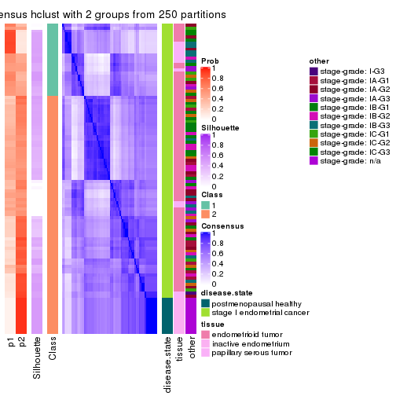</p>

</div>
<div id='tab-MAD-hclust-consensus-heatmap-2'>
<pre><code class="r">consensus_heatmap(res, k = 3)
</code></pre>

<p>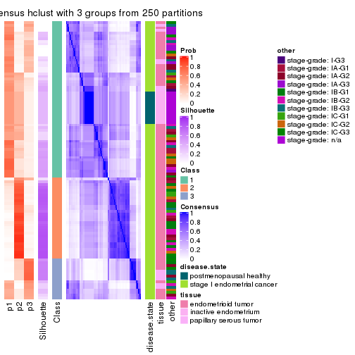</p>

</div>
<div id='tab-MAD-hclust-consensus-heatmap-3'>
<pre><code class="r">consensus_heatmap(res, k = 4)
</code></pre>

<p>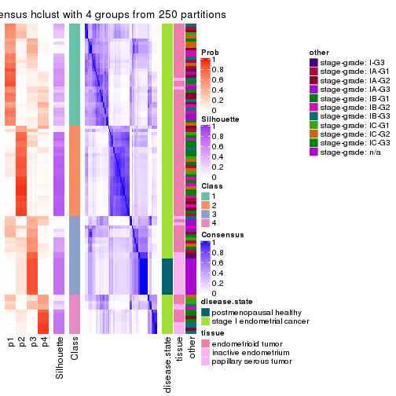</p>

</div>
<div id='tab-MAD-hclust-consensus-heatmap-4'>
<pre><code class="r">consensus_heatmap(res, k = 5)
</code></pre>

<p>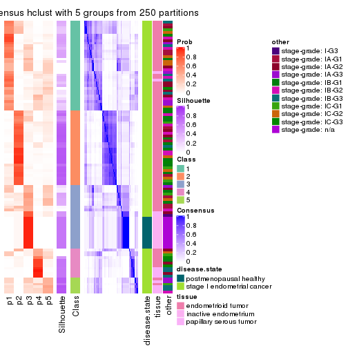</p>

</div>
<div id='tab-MAD-hclust-consensus-heatmap-5'>
<pre><code class="r">consensus_heatmap(res, k = 6)
</code></pre>

<p>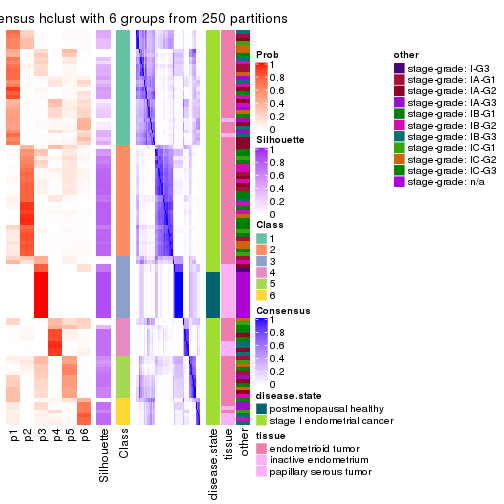</p>

</div>
</div>

Heatmaps for the membership of samples in all partitions to see how consistent they are:


<script>
$( function() {
	$( '#tabs-MAD-hclust-membership-heatmap' ).tabs();
} );
</script>
<div id='tabs-MAD-hclust-membership-heatmap'>
<ul>
<li><a href='#tab-MAD-hclust-membership-heatmap-1'>k = 2</a></li>
<li><a href='#tab-MAD-hclust-membership-heatmap-2'>k = 3</a></li>
<li><a href='#tab-MAD-hclust-membership-heatmap-3'>k = 4</a></li>
<li><a href='#tab-MAD-hclust-membership-heatmap-4'>k = 5</a></li>
<li><a href='#tab-MAD-hclust-membership-heatmap-5'>k = 6</a></li>
</ul>
<div id='tab-MAD-hclust-membership-heatmap-1'>
<pre><code class="r">membership_heatmap(res, k = 2)
</code></pre>

<p>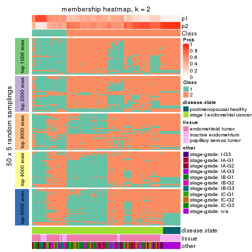</p>

</div>
<div id='tab-MAD-hclust-membership-heatmap-2'>
<pre><code class="r">membership_heatmap(res, k = 3)
</code></pre>

<p>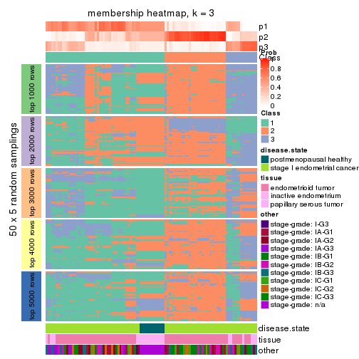</p>

</div>
<div id='tab-MAD-hclust-membership-heatmap-3'>
<pre><code class="r">membership_heatmap(res, k = 4)
</code></pre>

<p>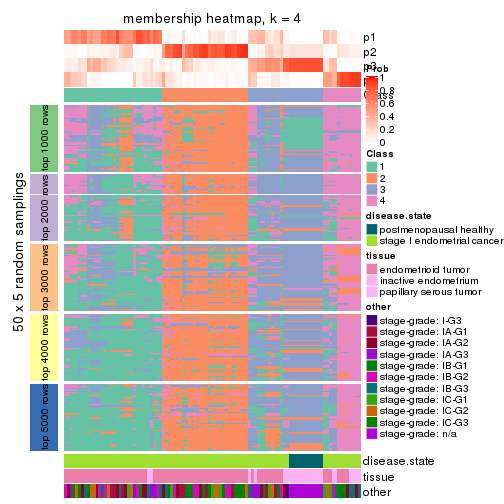</p>

</div>
<div id='tab-MAD-hclust-membership-heatmap-4'>
<pre><code class="r">membership_heatmap(res, k = 5)
</code></pre>

<p>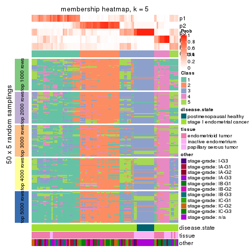</p>

</div>
<div id='tab-MAD-hclust-membership-heatmap-5'>
<pre><code class="r">membership_heatmap(res, k = 6)
</code></pre>

<p>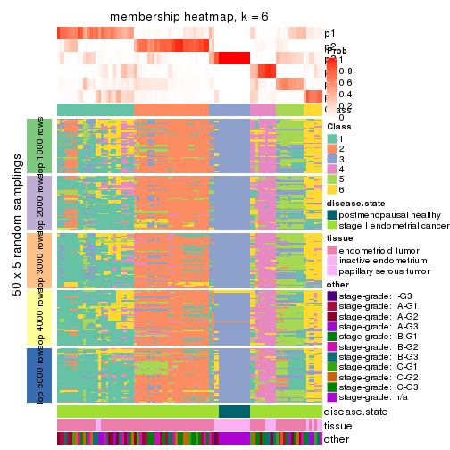</p>

</div>
</div>

As soon as we have had the classes for columns, we can look for signatures
which are significantly different between classes which can be candidate marks
for certain classes. Following are the heatmaps for signatures.


Signature heatmaps where rows are scaled:


<script>
$( function() {
	$( '#tabs-MAD-hclust-get-signatures' ).tabs();
} );
</script>
<div id='tabs-MAD-hclust-get-signatures'>
<ul>
<li><a href='#tab-MAD-hclust-get-signatures-1'>k = 2</a></li>
<li><a href='#tab-MAD-hclust-get-signatures-2'>k = 3</a></li>
<li><a href='#tab-MAD-hclust-get-signatures-3'>k = 4</a></li>
<li><a href='#tab-MAD-hclust-get-signatures-4'>k = 5</a></li>
<li><a href='#tab-MAD-hclust-get-signatures-5'>k = 6</a></li>
</ul>
<div id='tab-MAD-hclust-get-signatures-1'>
<pre><code class="r">get_signatures(res, k = 2)
</code></pre>

<p>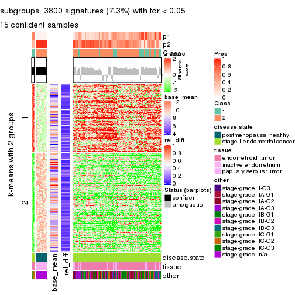</p>

</div>
<div id='tab-MAD-hclust-get-signatures-2'>
<pre><code class="r">get_signatures(res, k = 3)
</code></pre>

<p>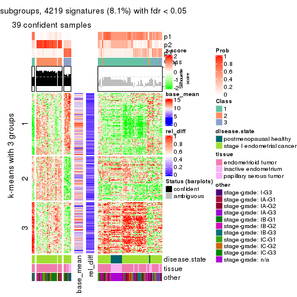</p>

</div>
<div id='tab-MAD-hclust-get-signatures-3'>
<pre><code class="r">get_signatures(res, k = 4)
</code></pre>

<p></p>

</div>
<div id='tab-MAD-hclust-get-signatures-4'>
<pre><code class="r">get_signatures(res, k = 5)
</code></pre>

<p>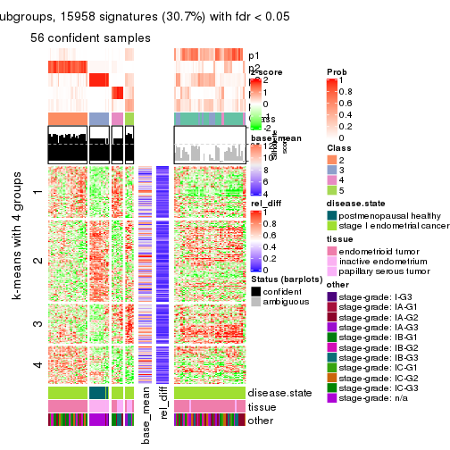</p>

</div>
<div id='tab-MAD-hclust-get-signatures-5'>
<pre><code class="r">get_signatures(res, k = 6)
</code></pre>

<p>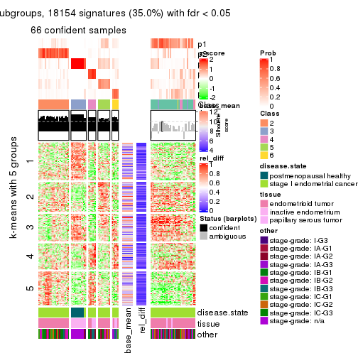</p>

</div>
</div>


Signature heatmaps where rows are not scaled:


<script>
$( function() {
	$( '#tabs-MAD-hclust-get-signatures-no-scale' ).tabs();
} );
</script>
<div id='tabs-MAD-hclust-get-signatures-no-scale'>
<ul>
<li><a href='#tab-MAD-hclust-get-signatures-no-scale-1'>k = 2</a></li>
<li><a href='#tab-MAD-hclust-get-signatures-no-scale-2'>k = 3</a></li>
<li><a href='#tab-MAD-hclust-get-signatures-no-scale-3'>k = 4</a></li>
<li><a href='#tab-MAD-hclust-get-signatures-no-scale-4'>k = 5</a></li>
<li><a href='#tab-MAD-hclust-get-signatures-no-scale-5'>k = 6</a></li>
</ul>
<div id='tab-MAD-hclust-get-signatures-no-scale-1'>
<pre><code class="r">get_signatures(res, k = 2, scale_rows = FALSE)
</code></pre>

<p>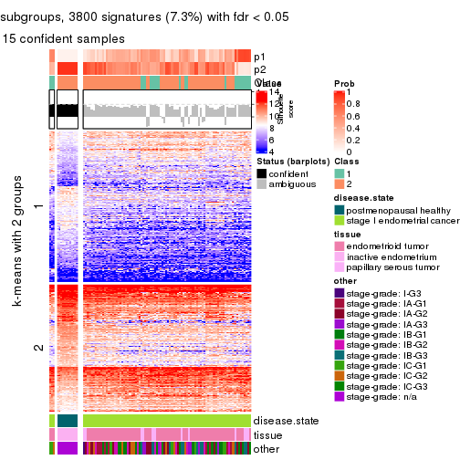</p>

</div>
<div id='tab-MAD-hclust-get-signatures-no-scale-2'>
<pre><code class="r">get_signatures(res, k = 3, scale_rows = FALSE)
</code></pre>

<p>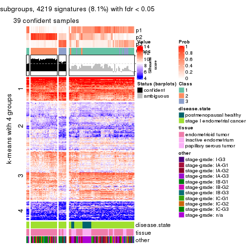</p>

</div>
<div id='tab-MAD-hclust-get-signatures-no-scale-3'>
<pre><code class="r">get_signatures(res, k = 4, scale_rows = FALSE)
</code></pre>

<p>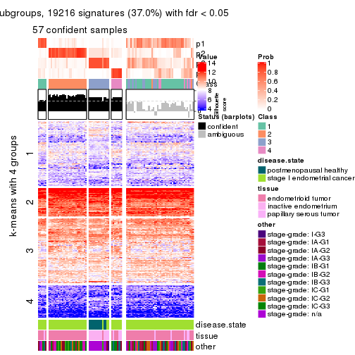</p>

</div>
<div id='tab-MAD-hclust-get-signatures-no-scale-4'>
<pre><code class="r">get_signatures(res, k = 5, scale_rows = FALSE)
</code></pre>

<p>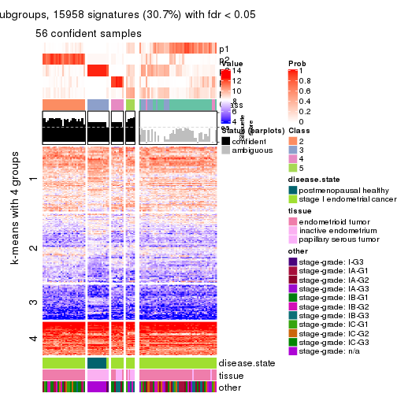</p>

</div>
<div id='tab-MAD-hclust-get-signatures-no-scale-5'>
<pre><code class="r">get_signatures(res, k = 6, scale_rows = FALSE)
</code></pre>

<p>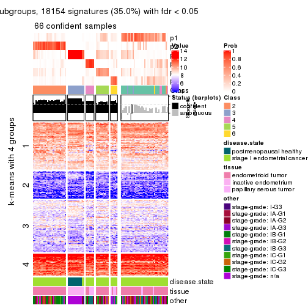</p>

</div>
</div>


Compare the overlap of signatures from different k:

```r
compare_signatures(res)
```

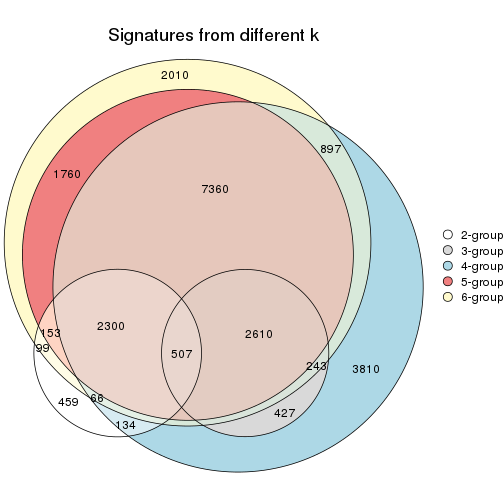

`get_signature()` returns a data frame invisibly. TO get the list of signatures, the function
call should be assigned to a variable explicitly. In following code, if `plot` argument is set
to `FALSE`, no heatmap is plotted while only the differential analysis is performed.

```r
# code only for demonstration
tb = get_signature(res, k = ..., plot = FALSE)
```

An example of the output of `tb` is:

```
#>   which_row         fdr    mean_1    mean_2 scaled_mean_1 scaled_mean_2 km
#> 1        38 0.042760348  8.373488  9.131774    -0.5533452     0.5164555  1
#> 2        40 0.018707592  7.106213  8.469186    -0.6173731     0.5762149  1
#> 3        55 0.019134737 10.221463 11.207825    -0.6159697     0.5749050  1
#> 4        59 0.006059896  5.921854  7.869574    -0.6899429     0.6439467  1
#> 5        60 0.018055526  8.928898 10.211722    -0.6204761     0.5791110  1
#> 6        98 0.009384629 15.714769 14.887706     0.6635654    -0.6193277  2
...
```

The columns in `tb` are:

1. `which_row`: row indices corresponding to the input matrix.
2. `fdr`: FDR for the differential test. 
3. `mean_x`: The mean value in group x.
4. `scaled_mean_x`: The mean value in group x after rows are scaled.
5. `km`: Row groups if k-means clustering is applied to rows.


UMAP plot which shows how samples are separated.


<script>
$( function() {
	$( '#tabs-MAD-hclust-dimension-reduction' ).tabs();
} );
</script>
<div id='tabs-MAD-hclust-dimension-reduction'>
<ul>
<li><a href='#tab-MAD-hclust-dimension-reduction-1'>k = 2</a></li>
<li><a href='#tab-MAD-hclust-dimension-reduction-2'>k = 3</a></li>
<li><a href='#tab-MAD-hclust-dimension-reduction-3'>k = 4</a></li>
<li><a href='#tab-MAD-hclust-dimension-reduction-4'>k = 5</a></li>
<li><a href='#tab-MAD-hclust-dimension-reduction-5'>k = 6</a></li>
</ul>
<div id='tab-MAD-hclust-dimension-reduction-1'>
<pre><code class="r">dimension_reduction(res, k = 2, method = &quot;UMAP&quot;)
</code></pre>

<p>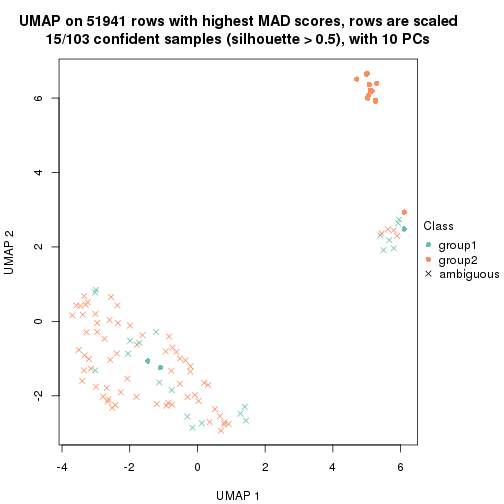</p>

</div>
<div id='tab-MAD-hclust-dimension-reduction-2'>
<pre><code class="r">dimension_reduction(res, k = 3, method = &quot;UMAP&quot;)
</code></pre>

<p>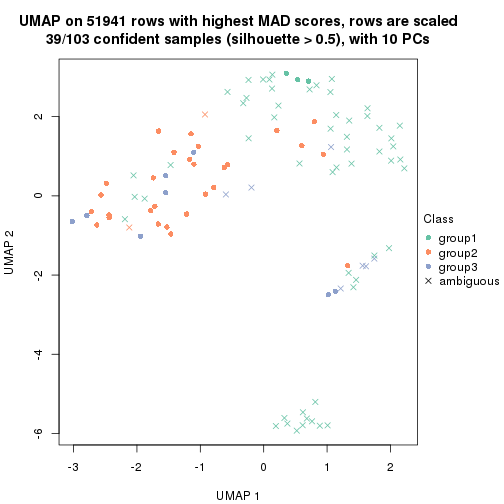</p>

</div>
<div id='tab-MAD-hclust-dimension-reduction-3'>
<pre><code class="r">dimension_reduction(res, k = 4, method = &quot;UMAP&quot;)
</code></pre>

<p>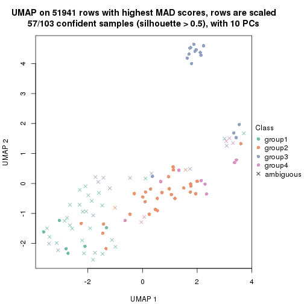</p>

</div>
<div id='tab-MAD-hclust-dimension-reduction-4'>
<pre><code class="r">dimension_reduction(res, k = 5, method = &quot;UMAP&quot;)
</code></pre>

<p>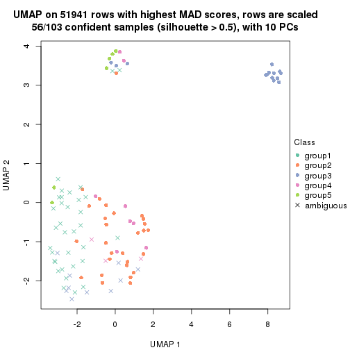</p>

</div>
<div id='tab-MAD-hclust-dimension-reduction-5'>
<pre><code class="r">dimension_reduction(res, k = 6, method = &quot;UMAP&quot;)
</code></pre>

<p>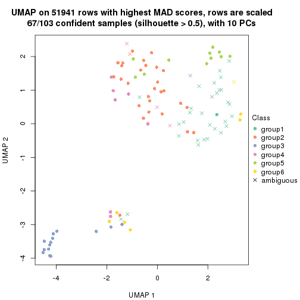</p>

</div>
</div>


Following heatmap shows how subgroups are split when increasing `k`:

```r
collect_classes(res)
```

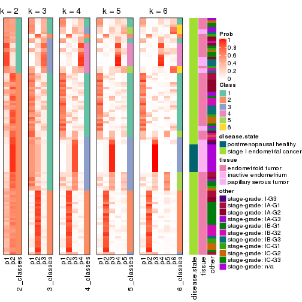


Test correlation between subgroups and known annotations. If the known
annotation is numeric, one-way ANOVA test is applied, and if the known
annotation is discrete, chi-squared contingency table test is applied.

```r
test_to_known_factors(res)
```

```
#>             n disease.state(p) tissue(p) other(p) k
#> MAD:hclust 15         2.17e-03  2.17e-03 5.53e-04 2
#> MAD:hclust 39               NA  1.78e-04 1.47e-01 3
#> MAD:hclust 57         3.05e-09  5.03e-11 3.43e-07 4
#> MAD:hclust 56         6.20e-10  3.65e-13 5.00e-09 5
#> MAD:hclust 67         1.11e-10  1.34e-14 3.19e-07 6
```


If matrix rows can be associated to genes, consider to use `functional_enrichment(res,
...)` to perform function enrichment for the signature genes. See [this vignette](http://bioconductor.org/packages/devel/bioc/vignettes/cola/inst/doc/functional_enrichment.html) for more detailed explanations.


 

---------------------------------------------------


### MAD:kmeans


The object with results only for a single top-value method and a single partition method 
can be extracted as:

```r
res = res_list["MAD", "kmeans"]
# you can also extract it by
# res = res_list["MAD:kmeans"]
```

A summary of `res` and all the functions that can be applied to it:

```r
res
```

```
#> A 'ConsensusPartition' object with k = 2, 3, 4, 5, 6.
#>   On a matrix with 51941 rows and 103 columns.
#>   Top rows (1000, 2000, 3000, 4000, 5000) are extracted by 'MAD' method.
#>   Subgroups are detected by 'kmeans' method.
#>   Performed in total 1250 partitions by row resampling.
#>   Best k for subgroups seems to be 3.
#> 
#> Following methods can be applied to this 'ConsensusPartition' object:
#>  [1] "cola_report"             "collect_classes"         "collect_plots"          
#>  [4] "collect_stats"           "colnames"                "compare_signatures"     
#>  [7] "consensus_heatmap"       "dimension_reduction"     "functional_enrichment"  
#> [10] "get_anno_col"            "get_anno"                "get_classes"            
#> [13] "get_consensus"           "get_matrix"              "get_membership"         
#> [16] "get_param"               "get_signatures"          "get_stats"              
#> [19] "is_best_k"               "is_stable_k"             "membership_heatmap"     
#> [22] "ncol"                    "nrow"                    "plot_ecdf"              
#> [25] "rownames"                "select_partition_number" "show"                   
#> [28] "suggest_best_k"          "test_to_known_factors"
```

`collect_plots()` function collects all the plots made from `res` for all `k` (number of partitions)
into one single page to provide an easy and fast comparison between different `k`.

```r
collect_plots(res)
```

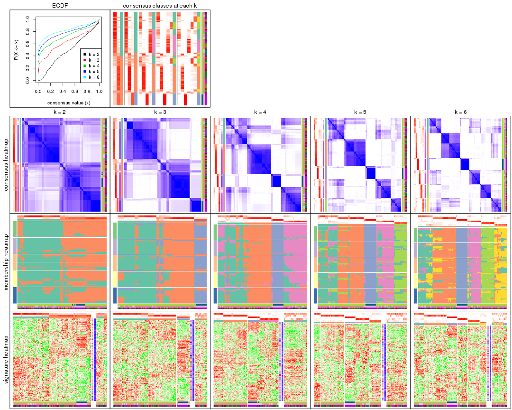

The plots are:

- The first row: a plot of the ECDF (empirical cumulative distribution
  function) curves of the consensus matrix for each `k` and the heatmap of
  predicted classes for each `k`.
- The second row: heatmaps of the consensus matrix for each `k`.
- The third row: heatmaps of the membership matrix for each `k`.
- The fouth row: heatmaps of the signatures for each `k`.

All the plots in panels can be made by individual functions and they are
plotted later in this section.

`select_partition_number()` produces several plots showing different
statistics for choosing "optimized" `k`. There are following statistics:

- ECDF curves of the consensus matrix for each `k`;
- 1-PAC. [The PAC
  score](https://en.wikipedia.org/wiki/Consensus_clustering#Over-interpretation_potential_of_consensus_clustering)
  measures the proportion of the ambiguous subgrouping.
- Mean silhouette score.
- Concordance. The mean probability of fiting the consensus class ids in all
  partitions.
- Area increased. Denote $A_k$ as the area under the ECDF curve for current
  `k`, the area increased is defined as $A_k - A_{k-1}$.
- Rand index. The percent of pairs of samples that are both in a same cluster
  or both are not in a same cluster in the partition of k and k-1.
- Jaccard index. The ratio of pairs of samples are both in a same cluster in
  the partition of k and k-1 and the pairs of samples are both in a same
  cluster in the partition k or k-1.

The detailed explanations of these statistics can be found in [the _cola_
vignette](http://bioconductor.org/packages/devel/bioc/vignettes/cola/inst/doc/cola.html#toc_13).

Generally speaking, lower PAC score, higher mean silhouette score or higher
concordance corresponds to better partition. Rand index and Jaccard index
measure how similar the current partition is compared to partition with `k-1`.
If they are too similar, we won't accept `k` is better than `k-1`.

```r
select_partition_number(res)
```

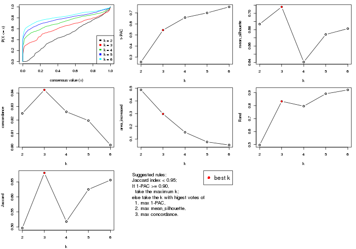

The numeric values for all these statistics can be obtained by `get_stats()`.

```r
get_stats(res)
```

```
#>   k 1-PAC mean_silhouette concordance area_increased  Rand Jaccard
#> 2 2 0.255           0.687       0.825         0.4866 0.496   0.496
#> 3 3 0.544           0.708       0.842         0.2974 0.833   0.680
#> 4 4 0.657           0.640       0.826         0.1527 0.796   0.518
#> 5 5 0.700           0.674       0.820         0.0768 0.891   0.625
#> 6 6 0.754           0.681       0.802         0.0527 0.921   0.656
```

`suggest_best_k()` suggests the best $k$ based on these statistics. The rules are as follows:

- All $k$ with Jaccard index larger than 0.95 are removed because increasing
  $k$ does not provide enough extra information. If all $k$ are removed, it is
  marked as no subgroup is detected.
- For all $k$ with 1-PAC score larger than 0.9, the maximal $k$ is taken as
  the best $k$, and other $k$ are marked as optional $k$.
- If it does not fit the second rule. The $k$ with the maximal vote of the
  highest 1-PAC score, highest mean silhouette, and highest concordance is
  taken as the best $k$.

```r
suggest_best_k(res)
```

```
#> [1] 3
```


Following shows the table of the partitions (You need to click the **show/hide
code output** link to see it). The membership matrix (columns with name `p*`)
is inferred by
[`clue::cl_consensus()`](https://www.rdocumentation.org/link/cl_consensus?package=clue)
function with the `SE` method. Basically the value in the membership matrix
represents the probability to belong to a certain group. The finall class
label for an item is determined with the group with highest probability it
belongs to.

In `get_classes()` function, the entropy is calculated from the membership
matrix and the silhouette score is calculated from the consensus matrix.


<script>
$( function() {
	$( '#tabs-MAD-kmeans-get-classes' ).tabs();
} );
</script>
<div id='tabs-MAD-kmeans-get-classes'>
<ul>
<li><a href='#tab-MAD-kmeans-get-classes-1'>k = 2</a></li>
<li><a href='#tab-MAD-kmeans-get-classes-2'>k = 3</a></li>
<li><a href='#tab-MAD-kmeans-get-classes-3'>k = 4</a></li>
<li><a href='#tab-MAD-kmeans-get-classes-4'>k = 5</a></li>
<li><a href='#tab-MAD-kmeans-get-classes-5'>k = 6</a></li>
</ul>

<div id='tab-MAD-kmeans-get-classes-1'>
<p><a id='tab-MAD-kmeans-get-classes-1-a' style='color:#0366d6' href='#'>show/hide code output</a></p>
<pre><code class="r">cbind(get_classes(res, k = 2), get_membership(res, k = 2))
</code></pre>

<pre><code>#&gt;           class entropy silhouette    p1    p2
#&gt; GSM425907     2  0.3114     0.7664 0.056 0.944
#&gt; GSM425908     2  0.5737     0.7476 0.136 0.864
#&gt; GSM425909     2  0.9635     0.5496 0.388 0.612
#&gt; GSM425910     1  0.9909    -0.1567 0.556 0.444
#&gt; GSM425911     2  0.5519     0.7661 0.128 0.872
#&gt; GSM425912     2  0.8608     0.7109 0.284 0.716
#&gt; GSM425913     2  0.3879     0.7661 0.076 0.924
#&gt; GSM425914     2  0.7950     0.7412 0.240 0.760
#&gt; GSM425915     2  0.8144     0.7317 0.252 0.748
#&gt; GSM425874     1  0.7453     0.7368 0.788 0.212
#&gt; GSM425875     1  0.0376     0.8200 0.996 0.004
#&gt; GSM425876     1  0.9129     0.2991 0.672 0.328
#&gt; GSM425877     1  0.0376     0.8236 0.996 0.004
#&gt; GSM425878     1  0.1184     0.8255 0.984 0.016
#&gt; GSM425879     2  0.2948     0.7664 0.052 0.948
#&gt; GSM425880     1  0.3114     0.7762 0.944 0.056
#&gt; GSM425881     2  0.9993     0.0477 0.484 0.516
#&gt; GSM425882     2  0.5737     0.7476 0.136 0.864
#&gt; GSM425883     1  0.4022     0.8178 0.920 0.080
#&gt; GSM425884     1  0.0376     0.8236 0.996 0.004
#&gt; GSM425885     2  0.9996    -0.0130 0.488 0.512
#&gt; GSM425848     1  0.5408     0.7972 0.876 0.124
#&gt; GSM425849     1  0.4690     0.8097 0.900 0.100
#&gt; GSM425850     1  0.2423     0.8252 0.960 0.040
#&gt; GSM425851     1  0.0376     0.8236 0.996 0.004
#&gt; GSM425852     1  0.4690     0.7251 0.900 0.100
#&gt; GSM425893     2  0.4815     0.7660 0.104 0.896
#&gt; GSM425894     2  0.5737     0.7476 0.136 0.864
#&gt; GSM425895     2  0.5737     0.7476 0.136 0.864
#&gt; GSM425896     2  0.2423     0.7638 0.040 0.960
#&gt; GSM425897     2  0.2948     0.7664 0.052 0.948
#&gt; GSM425898     2  0.5737     0.7476 0.136 0.864
#&gt; GSM425899     1  0.9732     0.4336 0.596 0.404
#&gt; GSM425900     2  0.5629     0.7494 0.132 0.868
#&gt; GSM425901     2  0.9815     0.4514 0.420 0.580
#&gt; GSM425902     1  0.7602     0.7307 0.780 0.220
#&gt; GSM425903     2  0.8499     0.7156 0.276 0.724
#&gt; GSM425904     1  0.2948     0.7803 0.948 0.052
#&gt; GSM425905     2  0.3584     0.7667 0.068 0.932
#&gt; GSM425906     2  0.3879     0.7661 0.076 0.924
#&gt; GSM425863     1  0.3733     0.8207 0.928 0.072
#&gt; GSM425864     2  0.2948     0.7664 0.052 0.948
#&gt; GSM425865     2  0.4298     0.7639 0.088 0.912
#&gt; GSM425866     1  0.0672     0.8178 0.992 0.008
#&gt; GSM425867     2  0.9129     0.6348 0.328 0.672
#&gt; GSM425868     2  0.5737     0.7476 0.136 0.864
#&gt; GSM425869     2  0.5737     0.7476 0.136 0.864
#&gt; GSM425870     2  0.6973     0.7324 0.188 0.812
#&gt; GSM425871     1  0.5629     0.7956 0.868 0.132
#&gt; GSM425872     2  0.5737     0.7476 0.136 0.864
#&gt; GSM425873     1  0.1184     0.8242 0.984 0.016
#&gt; GSM425843     1  0.0376     0.8236 0.996 0.004
#&gt; GSM425844     1  0.3584     0.8219 0.932 0.068
#&gt; GSM425845     1  0.9922    -0.1659 0.552 0.448
#&gt; GSM425846     1  0.9896     0.3349 0.560 0.440
#&gt; GSM425847     1  0.9754     0.0639 0.592 0.408
#&gt; GSM425886     2  0.7219     0.7507 0.200 0.800
#&gt; GSM425887     2  0.8909     0.5847 0.308 0.692
#&gt; GSM425888     2  0.9998    -0.0146 0.492 0.508
#&gt; GSM425889     1  0.5408     0.7992 0.876 0.124
#&gt; GSM425890     1  0.7299     0.7452 0.796 0.204
#&gt; GSM425891     2  0.3733     0.7665 0.072 0.928
#&gt; GSM425892     2  0.5737     0.7476 0.136 0.864
#&gt; GSM425853     1  0.0376     0.8200 0.996 0.004
#&gt; GSM425854     2  0.5737     0.7476 0.136 0.864
#&gt; GSM425855     1  0.3584     0.8217 0.932 0.068
#&gt; GSM425856     1  0.0672     0.8178 0.992 0.008
#&gt; GSM425857     2  0.9358     0.4718 0.352 0.648
#&gt; GSM425858     2  0.8267     0.6027 0.260 0.740
#&gt; GSM425859     2  0.5737     0.7476 0.136 0.864
#&gt; GSM425860     2  0.9580     0.6143 0.380 0.620
#&gt; GSM425861     1  0.9209     0.5267 0.664 0.336
#&gt; GSM425862     1  0.5629     0.7946 0.868 0.132
#&gt; GSM425837     1  0.0000     0.8220 1.000 0.000
#&gt; GSM425838     1  0.7602     0.7307 0.780 0.220
#&gt; GSM425839     2  0.5737     0.7476 0.136 0.864
#&gt; GSM425840     1  0.0376     0.8236 0.996 0.004
#&gt; GSM425841     1  0.7602     0.7307 0.780 0.220
#&gt; GSM425842     1  0.0938     0.8246 0.988 0.012
#&gt; GSM425917     2  0.8443     0.7066 0.272 0.728
#&gt; GSM425922     1  0.7602     0.7307 0.780 0.220
#&gt; GSM425919     1  0.0376     0.8236 0.996 0.004
#&gt; GSM425920     1  0.0376     0.8236 0.996 0.004
#&gt; GSM425923     1  0.2778     0.8251 0.952 0.048
#&gt; GSM425916     1  0.0376     0.8236 0.996 0.004
#&gt; GSM425918     1  0.2778     0.8251 0.952 0.048
#&gt; GSM425921     1  0.7602     0.7307 0.780 0.220
#&gt; GSM425925     1  0.6343     0.7739 0.840 0.160
#&gt; GSM425926     1  0.6973     0.7503 0.812 0.188
#&gt; GSM425927     1  0.0376     0.8236 0.996 0.004
#&gt; GSM425924     1  0.9522     0.2437 0.628 0.372
#&gt; GSM425928     2  0.8207     0.7033 0.256 0.744
#&gt; GSM425929     2  0.7883     0.7165 0.236 0.764
#&gt; GSM425930     2  0.7883     0.7165 0.236 0.764
#&gt; GSM425931     2  0.8207     0.7033 0.256 0.744
#&gt; GSM425932     2  0.7883     0.7165 0.236 0.764
#&gt; GSM425933     2  0.7883     0.7165 0.236 0.764
#&gt; GSM425934     2  0.7376     0.7260 0.208 0.792
#&gt; GSM425935     2  0.7376     0.7294 0.208 0.792
#&gt; GSM425936     2  0.7883     0.7165 0.236 0.764
#&gt; GSM425937     2  0.8207     0.7033 0.256 0.744
#&gt; GSM425938     2  0.8207     0.7033 0.256 0.744
#&gt; GSM425939     2  0.8207     0.7033 0.256 0.744
</code></pre>

<script>
$('#tab-MAD-kmeans-get-classes-1-a').parent().next().next().hide();
$('#tab-MAD-kmeans-get-classes-1-a').click(function(){
  $('#tab-MAD-kmeans-get-classes-1-a').parent().next().next().toggle();
  return(false);
});
</script>
</div>

<div id='tab-MAD-kmeans-get-classes-2'>
<p><a id='tab-MAD-kmeans-get-classes-2-a' style='color:#0366d6' href='#'>show/hide code output</a></p>
<pre><code class="r">cbind(get_classes(res, k = 3), get_membership(res, k = 3))
</code></pre>

<pre><code>#&gt;           class entropy silhouette    p1    p2    p3
#&gt; GSM425907     2  0.0661    0.78343 0.004 0.988 0.008
#&gt; GSM425908     2  0.0848    0.78466 0.008 0.984 0.008
#&gt; GSM425909     2  0.9969   -0.03237 0.320 0.372 0.308
#&gt; GSM425910     1  0.8328    0.06056 0.520 0.396 0.084
#&gt; GSM425911     2  0.0000    0.78328 0.000 1.000 0.000
#&gt; GSM425912     2  0.6487    0.57809 0.268 0.700 0.032
#&gt; GSM425913     2  0.0661    0.78343 0.004 0.988 0.008
#&gt; GSM425914     2  0.5982    0.61318 0.228 0.744 0.028
#&gt; GSM425915     2  0.6925    0.03403 0.016 0.532 0.452
#&gt; GSM425874     1  0.7169    0.66711 0.704 0.208 0.088
#&gt; GSM425875     1  0.2590    0.83113 0.924 0.004 0.072
#&gt; GSM425876     1  0.7980    0.20492 0.572 0.356 0.072
#&gt; GSM425877     1  0.1289    0.84608 0.968 0.000 0.032
#&gt; GSM425878     1  0.1031    0.84229 0.976 0.000 0.024
#&gt; GSM425879     2  0.0424    0.78222 0.000 0.992 0.008
#&gt; GSM425880     1  0.2945    0.82301 0.908 0.004 0.088
#&gt; GSM425881     2  0.6621    0.57495 0.284 0.684 0.032
#&gt; GSM425882     2  0.1015    0.78156 0.008 0.980 0.012
#&gt; GSM425883     1  0.2796    0.83722 0.908 0.000 0.092
#&gt; GSM425884     1  0.1289    0.84051 0.968 0.000 0.032
#&gt; GSM425885     2  0.8524   -0.15632 0.452 0.456 0.092
#&gt; GSM425848     1  0.3587    0.83079 0.892 0.020 0.088
#&gt; GSM425849     1  0.1129    0.84512 0.976 0.004 0.020
#&gt; GSM425850     1  0.2806    0.82397 0.928 0.032 0.040
#&gt; GSM425851     1  0.2448    0.83802 0.924 0.000 0.076
#&gt; GSM425852     1  0.3112    0.81256 0.900 0.004 0.096
#&gt; GSM425893     2  0.0000    0.78328 0.000 1.000 0.000
#&gt; GSM425894     2  0.0848    0.78466 0.008 0.984 0.008
#&gt; GSM425895     2  0.0661    0.78494 0.008 0.988 0.004
#&gt; GSM425896     2  0.0424    0.78222 0.000 0.992 0.008
#&gt; GSM425897     2  0.0424    0.78222 0.000 0.992 0.008
#&gt; GSM425898     2  0.0848    0.78466 0.008 0.984 0.008
#&gt; GSM425899     2  0.4662    0.71425 0.124 0.844 0.032
#&gt; GSM425900     2  0.1170    0.78027 0.008 0.976 0.016
#&gt; GSM425901     2  0.9975   -0.04070 0.332 0.364 0.304
#&gt; GSM425902     1  0.7169    0.66711 0.704 0.208 0.088
#&gt; GSM425903     2  0.9671    0.30907 0.248 0.460 0.292
#&gt; GSM425904     1  0.2945    0.82301 0.908 0.004 0.088
#&gt; GSM425905     2  0.0424    0.78222 0.000 0.992 0.008
#&gt; GSM425906     2  0.0661    0.78268 0.004 0.988 0.008
#&gt; GSM425863     1  0.1163    0.84693 0.972 0.000 0.028
#&gt; GSM425864     2  0.0424    0.78222 0.000 0.992 0.008
#&gt; GSM425865     2  0.0661    0.78343 0.004 0.988 0.008
#&gt; GSM425866     1  0.2772    0.82846 0.916 0.004 0.080
#&gt; GSM425867     3  0.3690    0.76554 0.100 0.016 0.884
#&gt; GSM425868     2  0.1905    0.77437 0.016 0.956 0.028
#&gt; GSM425869     2  0.1015    0.78385 0.008 0.980 0.012
#&gt; GSM425870     2  0.6661    0.13351 0.012 0.588 0.400
#&gt; GSM425871     1  0.2496    0.84208 0.928 0.004 0.068
#&gt; GSM425872     2  0.0848    0.78466 0.008 0.984 0.008
#&gt; GSM425873     1  0.2269    0.83320 0.944 0.016 0.040
#&gt; GSM425843     1  0.1163    0.84132 0.972 0.000 0.028
#&gt; GSM425844     1  0.2261    0.84008 0.932 0.000 0.068
#&gt; GSM425845     1  0.8515   -0.07128 0.476 0.432 0.092
#&gt; GSM425846     2  0.4295    0.72301 0.104 0.864 0.032
#&gt; GSM425847     2  0.7287    0.35040 0.408 0.560 0.032
#&gt; GSM425886     2  0.5591    0.43824 0.000 0.696 0.304
#&gt; GSM425887     2  0.6341    0.60235 0.252 0.716 0.032
#&gt; GSM425888     2  0.6653    0.56954 0.288 0.680 0.032
#&gt; GSM425889     1  0.2945    0.83608 0.908 0.004 0.088
#&gt; GSM425890     1  0.7169    0.66711 0.704 0.208 0.088
#&gt; GSM425891     2  0.0000    0.78328 0.000 1.000 0.000
#&gt; GSM425892     2  0.0848    0.78466 0.008 0.984 0.008
#&gt; GSM425853     1  0.2496    0.82947 0.928 0.004 0.068
#&gt; GSM425854     2  0.0424    0.78454 0.008 0.992 0.000
#&gt; GSM425855     1  0.1411    0.84700 0.964 0.000 0.036
#&gt; GSM425856     1  0.2772    0.82846 0.916 0.004 0.080
#&gt; GSM425857     2  0.9702    0.00531 0.364 0.416 0.220
#&gt; GSM425858     2  0.3530    0.74049 0.068 0.900 0.032
#&gt; GSM425859     2  0.0848    0.78466 0.008 0.984 0.008
#&gt; GSM425860     2  0.7534    0.41387 0.368 0.584 0.048
#&gt; GSM425861     1  0.7493   -0.16612 0.484 0.480 0.036
#&gt; GSM425862     1  0.2945    0.83608 0.908 0.004 0.088
#&gt; GSM425837     1  0.0592    0.84631 0.988 0.000 0.012
#&gt; GSM425838     1  0.7169    0.66711 0.704 0.208 0.088
#&gt; GSM425839     2  0.0848    0.78466 0.008 0.984 0.008
#&gt; GSM425840     1  0.0424    0.84492 0.992 0.000 0.008
#&gt; GSM425841     1  0.7169    0.66711 0.704 0.208 0.088
#&gt; GSM425842     1  0.1950    0.83612 0.952 0.008 0.040
#&gt; GSM425917     3  0.5757    0.84828 0.056 0.152 0.792
#&gt; GSM425922     1  0.7169    0.66711 0.704 0.208 0.088
#&gt; GSM425919     1  0.1163    0.84132 0.972 0.000 0.028
#&gt; GSM425920     1  0.1860    0.84391 0.948 0.000 0.052
#&gt; GSM425923     1  0.2537    0.83705 0.920 0.000 0.080
#&gt; GSM425916     1  0.2448    0.83802 0.924 0.000 0.076
#&gt; GSM425918     1  0.2537    0.83705 0.920 0.000 0.080
#&gt; GSM425921     1  0.7169    0.66711 0.704 0.208 0.088
#&gt; GSM425925     1  0.2945    0.83608 0.908 0.004 0.088
#&gt; GSM425926     1  0.7169    0.66711 0.704 0.208 0.088
#&gt; GSM425927     1  0.1765    0.83748 0.956 0.004 0.040
#&gt; GSM425924     3  0.6318    0.74127 0.172 0.068 0.760
#&gt; GSM425928     3  0.4293    0.95333 0.004 0.164 0.832
#&gt; GSM425929     3  0.4293    0.95333 0.004 0.164 0.832
#&gt; GSM425930     3  0.4293    0.95333 0.004 0.164 0.832
#&gt; GSM425931     3  0.4293    0.95333 0.004 0.164 0.832
#&gt; GSM425932     3  0.4293    0.95333 0.004 0.164 0.832
#&gt; GSM425933     3  0.4293    0.95333 0.004 0.164 0.832
#&gt; GSM425934     3  0.4293    0.95333 0.004 0.164 0.832
#&gt; GSM425935     3  0.4293    0.95333 0.004 0.164 0.832
#&gt; GSM425936     3  0.4293    0.95333 0.004 0.164 0.832
#&gt; GSM425937     3  0.4293    0.95333 0.004 0.164 0.832
#&gt; GSM425938     3  0.4293    0.95333 0.004 0.164 0.832
#&gt; GSM425939     3  0.4293    0.95333 0.004 0.164 0.832
</code></pre>

<script>
$('#tab-MAD-kmeans-get-classes-2-a').parent().next().next().hide();
$('#tab-MAD-kmeans-get-classes-2-a').click(function(){
  $('#tab-MAD-kmeans-get-classes-2-a').parent().next().next().toggle();
  return(false);
});
</script>
</div>

<div id='tab-MAD-kmeans-get-classes-3'>
<p><a id='tab-MAD-kmeans-get-classes-3-a' style='color:#0366d6' href='#'>show/hide code output</a></p>
<pre><code class="r">cbind(get_classes(res, k = 4), get_membership(res, k = 4))
</code></pre>

<pre><code>#&gt;           class entropy silhouette    p1    p2    p3    p4
#&gt; GSM425907     2  0.1042     0.8831 0.020 0.972 0.000 0.008
#&gt; GSM425908     2  0.1042     0.8831 0.020 0.972 0.000 0.008
#&gt; GSM425909     1  0.8391     0.3416 0.536 0.228 0.156 0.080
#&gt; GSM425910     1  0.0707     0.5748 0.980 0.000 0.000 0.020
#&gt; GSM425911     2  0.3649     0.7535 0.204 0.796 0.000 0.000
#&gt; GSM425912     2  0.5888     0.2431 0.424 0.540 0.000 0.036
#&gt; GSM425913     2  0.1004     0.8857 0.024 0.972 0.000 0.004
#&gt; GSM425914     1  0.5296    -0.2273 0.496 0.496 0.000 0.008
#&gt; GSM425915     1  0.6931     0.3013 0.588 0.228 0.184 0.000
#&gt; GSM425874     4  0.1716     0.7642 0.000 0.064 0.000 0.936
#&gt; GSM425875     1  0.3306     0.5551 0.840 0.000 0.004 0.156
#&gt; GSM425876     1  0.2282     0.5707 0.924 0.024 0.000 0.052
#&gt; GSM425877     4  0.4955     0.4224 0.344 0.000 0.008 0.648
#&gt; GSM425878     1  0.4996     0.0143 0.516 0.000 0.000 0.484
#&gt; GSM425879     2  0.1302     0.8824 0.044 0.956 0.000 0.000
#&gt; GSM425880     1  0.3306     0.5551 0.840 0.000 0.004 0.156
#&gt; GSM425881     2  0.5881     0.2462 0.420 0.544 0.000 0.036
#&gt; GSM425882     2  0.1211     0.8839 0.040 0.960 0.000 0.000
#&gt; GSM425883     4  0.1389     0.7821 0.048 0.000 0.000 0.952
#&gt; GSM425884     1  0.5288     0.0392 0.520 0.000 0.008 0.472
#&gt; GSM425885     4  0.4253     0.5650 0.016 0.208 0.000 0.776
#&gt; GSM425848     4  0.1557     0.7786 0.056 0.000 0.000 0.944
#&gt; GSM425849     4  0.4907     0.2359 0.420 0.000 0.000 0.580
#&gt; GSM425850     1  0.4730     0.2518 0.636 0.000 0.000 0.364
#&gt; GSM425851     4  0.2799     0.7599 0.108 0.000 0.008 0.884
#&gt; GSM425852     1  0.3597     0.5512 0.836 0.000 0.016 0.148
#&gt; GSM425893     2  0.2814     0.8186 0.132 0.868 0.000 0.000
#&gt; GSM425894     2  0.0921     0.8847 0.000 0.972 0.000 0.028
#&gt; GSM425895     2  0.0707     0.8870 0.000 0.980 0.000 0.020
#&gt; GSM425896     2  0.1151     0.8828 0.024 0.968 0.000 0.008
#&gt; GSM425897     2  0.1211     0.8837 0.040 0.960 0.000 0.000
#&gt; GSM425898     2  0.0707     0.8870 0.000 0.980 0.000 0.020
#&gt; GSM425899     2  0.1833     0.8737 0.024 0.944 0.000 0.032
#&gt; GSM425900     2  0.2174     0.8737 0.052 0.928 0.000 0.020
#&gt; GSM425901     1  0.8548     0.3351 0.524 0.228 0.156 0.092
#&gt; GSM425902     4  0.1716     0.7642 0.000 0.064 0.000 0.936
#&gt; GSM425903     1  0.2408     0.5638 0.920 0.036 0.044 0.000
#&gt; GSM425904     1  0.3306     0.5551 0.840 0.000 0.004 0.156
#&gt; GSM425905     2  0.0592     0.8878 0.016 0.984 0.000 0.000
#&gt; GSM425906     2  0.1576     0.8764 0.048 0.948 0.000 0.004
#&gt; GSM425863     4  0.4624     0.3951 0.340 0.000 0.000 0.660
#&gt; GSM425864     2  0.1022     0.8850 0.032 0.968 0.000 0.000
#&gt; GSM425865     2  0.0921     0.8854 0.028 0.972 0.000 0.000
#&gt; GSM425866     1  0.3157     0.5590 0.852 0.000 0.004 0.144
#&gt; GSM425867     1  0.4072     0.4008 0.748 0.000 0.252 0.000
#&gt; GSM425868     2  0.1022     0.8835 0.000 0.968 0.000 0.032
#&gt; GSM425869     2  0.0921     0.8847 0.000 0.972 0.000 0.028
#&gt; GSM425870     2  0.7519     0.1234 0.392 0.424 0.184 0.000
#&gt; GSM425871     4  0.3208     0.7345 0.148 0.000 0.004 0.848
#&gt; GSM425872     2  0.0707     0.8870 0.000 0.980 0.000 0.020
#&gt; GSM425873     1  0.4661     0.2773 0.652 0.000 0.000 0.348
#&gt; GSM425843     1  0.5295    -0.0149 0.504 0.000 0.008 0.488
#&gt; GSM425844     4  0.2859     0.7576 0.112 0.000 0.008 0.880
#&gt; GSM425845     1  0.0992     0.5752 0.976 0.012 0.004 0.008
#&gt; GSM425846     2  0.1174     0.8844 0.012 0.968 0.000 0.020
#&gt; GSM425847     1  0.6114     0.0756 0.524 0.428 0.000 0.048
#&gt; GSM425886     1  0.7910     0.1144 0.448 0.364 0.172 0.016
#&gt; GSM425887     2  0.5062     0.5415 0.300 0.680 0.000 0.020
#&gt; GSM425888     2  0.5764     0.4879 0.304 0.644 0.000 0.052
#&gt; GSM425889     4  0.0469     0.7844 0.012 0.000 0.000 0.988
#&gt; GSM425890     4  0.2156     0.7677 0.008 0.060 0.004 0.928
#&gt; GSM425891     2  0.1109     0.8855 0.028 0.968 0.000 0.004
#&gt; GSM425892     2  0.1042     0.8831 0.020 0.972 0.000 0.008
#&gt; GSM425853     1  0.3074     0.5524 0.848 0.000 0.000 0.152
#&gt; GSM425854     2  0.0707     0.8870 0.000 0.980 0.000 0.020
#&gt; GSM425855     4  0.4483     0.5089 0.284 0.000 0.004 0.712
#&gt; GSM425856     1  0.3306     0.5551 0.840 0.000 0.004 0.156
#&gt; GSM425857     1  0.8276     0.2015 0.428 0.240 0.020 0.312
#&gt; GSM425858     2  0.2563     0.8611 0.072 0.908 0.000 0.020
#&gt; GSM425859     2  0.0817     0.8861 0.000 0.976 0.000 0.024
#&gt; GSM425860     1  0.5256     0.4325 0.700 0.260 0.000 0.040
#&gt; GSM425861     1  0.6395    -0.0350 0.476 0.460 0.000 0.064
#&gt; GSM425862     4  0.0469     0.7844 0.012 0.000 0.000 0.988
#&gt; GSM425837     4  0.5281     0.0914 0.464 0.000 0.008 0.528
#&gt; GSM425838     4  0.2048     0.7673 0.008 0.064 0.000 0.928
#&gt; GSM425839     2  0.0707     0.8870 0.000 0.980 0.000 0.020
#&gt; GSM425840     4  0.5250     0.1778 0.440 0.000 0.008 0.552
#&gt; GSM425841     4  0.1716     0.7642 0.000 0.064 0.000 0.936
#&gt; GSM425842     1  0.4776     0.2425 0.624 0.000 0.000 0.376
#&gt; GSM425917     3  0.3945     0.7399 0.000 0.004 0.780 0.216
#&gt; GSM425922     4  0.1716     0.7642 0.000 0.064 0.000 0.936
#&gt; GSM425919     1  0.5292     0.0103 0.512 0.000 0.008 0.480
#&gt; GSM425920     4  0.3681     0.7020 0.176 0.000 0.008 0.816
#&gt; GSM425923     4  0.1807     0.7811 0.052 0.000 0.008 0.940
#&gt; GSM425916     4  0.2799     0.7599 0.108 0.000 0.008 0.884
#&gt; GSM425918     4  0.1970     0.7792 0.060 0.000 0.008 0.932
#&gt; GSM425921     4  0.1716     0.7642 0.000 0.064 0.000 0.936
#&gt; GSM425925     4  0.0336     0.7838 0.008 0.000 0.000 0.992
#&gt; GSM425926     4  0.1716     0.7642 0.000 0.064 0.000 0.936
#&gt; GSM425927     1  0.4964     0.2336 0.616 0.000 0.004 0.380
#&gt; GSM425924     3  0.4857     0.6900 0.024 0.004 0.740 0.232
#&gt; GSM425928     3  0.0469     0.9585 0.000 0.012 0.988 0.000
#&gt; GSM425929     3  0.0469     0.9585 0.000 0.012 0.988 0.000
#&gt; GSM425930     3  0.0469     0.9585 0.000 0.012 0.988 0.000
#&gt; GSM425931     3  0.0469     0.9585 0.000 0.012 0.988 0.000
#&gt; GSM425932     3  0.0469     0.9585 0.000 0.012 0.988 0.000
#&gt; GSM425933     3  0.0469     0.9585 0.000 0.012 0.988 0.000
#&gt; GSM425934     3  0.0469     0.9585 0.000 0.012 0.988 0.000
#&gt; GSM425935     3  0.0469     0.9585 0.000 0.012 0.988 0.000
#&gt; GSM425936     3  0.0469     0.9585 0.000 0.012 0.988 0.000
#&gt; GSM425937     3  0.0469     0.9585 0.000 0.012 0.988 0.000
#&gt; GSM425938     3  0.0469     0.9585 0.000 0.012 0.988 0.000
#&gt; GSM425939     3  0.0469     0.9585 0.000 0.012 0.988 0.000
</code></pre>

<script>
$('#tab-MAD-kmeans-get-classes-3-a').parent().next().next().hide();
$('#tab-MAD-kmeans-get-classes-3-a').click(function(){
  $('#tab-MAD-kmeans-get-classes-3-a').parent().next().next().toggle();
  return(false);
});
</script>
</div>

<div id='tab-MAD-kmeans-get-classes-4'>
<p><a id='tab-MAD-kmeans-get-classes-4-a' style='color:#0366d6' href='#'>show/hide code output</a></p>
<pre><code class="r">cbind(get_classes(res, k = 5), get_membership(res, k = 5))
</code></pre>

<pre><code>#&gt;           class entropy silhouette    p1    p2    p3    p4    p5
#&gt; GSM425907     2  0.3188     0.8684 0.028 0.860 0.000 0.012 0.100
#&gt; GSM425908     2  0.3272     0.8673 0.032 0.856 0.000 0.012 0.100
#&gt; GSM425909     5  0.4047     0.7457 0.016 0.088 0.024 0.040 0.832
#&gt; GSM425910     1  0.2068     0.4910 0.904 0.004 0.000 0.000 0.092
#&gt; GSM425911     2  0.5466     0.6825 0.192 0.656 0.000 0.000 0.152
#&gt; GSM425912     1  0.4849     0.2387 0.608 0.360 0.000 0.000 0.032
#&gt; GSM425913     2  0.0798     0.8853 0.008 0.976 0.000 0.000 0.016
#&gt; GSM425914     1  0.6094    -0.0872 0.488 0.384 0.000 0.000 0.128
#&gt; GSM425915     5  0.4228     0.7423 0.128 0.040 0.032 0.000 0.800
#&gt; GSM425874     4  0.1419     0.7771 0.016 0.012 0.000 0.956 0.016
#&gt; GSM425875     5  0.3656     0.7821 0.168 0.000 0.000 0.032 0.800
#&gt; GSM425876     1  0.1205     0.5381 0.956 0.004 0.000 0.000 0.040
#&gt; GSM425877     1  0.6261     0.0790 0.488 0.000 0.000 0.356 0.156
#&gt; GSM425878     1  0.4591     0.5337 0.748 0.000 0.000 0.132 0.120
#&gt; GSM425879     2  0.2959     0.8697 0.036 0.864 0.000 0.000 0.100
#&gt; GSM425880     5  0.3488     0.7905 0.168 0.000 0.000 0.024 0.808
#&gt; GSM425881     1  0.4866     0.2005 0.580 0.396 0.000 0.004 0.020
#&gt; GSM425882     2  0.3012     0.8682 0.036 0.860 0.000 0.000 0.104
#&gt; GSM425883     4  0.4069     0.7062 0.112 0.000 0.000 0.792 0.096
#&gt; GSM425884     1  0.4676     0.5276 0.740 0.000 0.000 0.140 0.120
#&gt; GSM425885     4  0.3319     0.6796 0.008 0.100 0.000 0.852 0.040
#&gt; GSM425848     4  0.2694     0.7640 0.032 0.004 0.000 0.888 0.076
#&gt; GSM425849     1  0.5452     0.3592 0.616 0.000 0.000 0.292 0.092
#&gt; GSM425850     1  0.1124     0.5789 0.960 0.000 0.000 0.036 0.004
#&gt; GSM425851     4  0.6063     0.3743 0.316 0.000 0.000 0.540 0.144
#&gt; GSM425852     5  0.3768     0.7281 0.228 0.000 0.004 0.008 0.760
#&gt; GSM425893     2  0.4179     0.8114 0.072 0.776 0.000 0.000 0.152
#&gt; GSM425894     2  0.0510     0.8843 0.000 0.984 0.000 0.016 0.000
#&gt; GSM425895     2  0.0579     0.8866 0.000 0.984 0.000 0.008 0.008
#&gt; GSM425896     2  0.3376     0.8646 0.032 0.848 0.000 0.012 0.108
#&gt; GSM425897     2  0.3141     0.8648 0.040 0.852 0.000 0.000 0.108
#&gt; GSM425898     2  0.0451     0.8844 0.000 0.988 0.000 0.008 0.004
#&gt; GSM425899     2  0.1471     0.8725 0.004 0.952 0.000 0.024 0.020
#&gt; GSM425900     2  0.1845     0.8570 0.056 0.928 0.000 0.000 0.016
#&gt; GSM425901     5  0.4020     0.7435 0.012 0.088 0.024 0.044 0.832
#&gt; GSM425902     4  0.1524     0.7752 0.016 0.016 0.000 0.952 0.016
#&gt; GSM425903     5  0.3521     0.7469 0.232 0.000 0.004 0.000 0.764
#&gt; GSM425904     5  0.3488     0.7905 0.168 0.000 0.000 0.024 0.808
#&gt; GSM425905     2  0.2344     0.8804 0.032 0.904 0.000 0.000 0.064
#&gt; GSM425906     2  0.2270     0.8460 0.076 0.904 0.000 0.000 0.020
#&gt; GSM425863     4  0.5473     0.1434 0.416 0.000 0.000 0.520 0.064
#&gt; GSM425864     2  0.3064     0.8662 0.036 0.856 0.000 0.000 0.108
#&gt; GSM425865     2  0.3012     0.8682 0.036 0.860 0.000 0.000 0.104
#&gt; GSM425866     5  0.3527     0.7885 0.172 0.000 0.000 0.024 0.804
#&gt; GSM425867     5  0.4555     0.7658 0.224 0.000 0.056 0.000 0.720
#&gt; GSM425868     2  0.1386     0.8855 0.000 0.952 0.000 0.016 0.032
#&gt; GSM425869     2  0.0671     0.8850 0.000 0.980 0.000 0.016 0.004
#&gt; GSM425870     1  0.7591    -0.1153 0.416 0.356 0.088 0.000 0.140
#&gt; GSM425871     1  0.5868     0.0364 0.516 0.000 0.000 0.380 0.104
#&gt; GSM425872     2  0.0579     0.8842 0.000 0.984 0.000 0.008 0.008
#&gt; GSM425873     1  0.1124     0.5763 0.960 0.000 0.000 0.036 0.004
#&gt; GSM425843     1  0.4676     0.5276 0.740 0.000 0.000 0.140 0.120
#&gt; GSM425844     4  0.6046     0.3347 0.344 0.000 0.000 0.524 0.132
#&gt; GSM425845     5  0.3707     0.7387 0.284 0.000 0.000 0.000 0.716
#&gt; GSM425846     2  0.0968     0.8807 0.004 0.972 0.000 0.012 0.012
#&gt; GSM425847     1  0.3727     0.4761 0.768 0.216 0.000 0.000 0.016
#&gt; GSM425886     5  0.4108     0.7025 0.028 0.112 0.028 0.012 0.820
#&gt; GSM425887     2  0.4944     0.4366 0.344 0.620 0.000 0.004 0.032
#&gt; GSM425888     2  0.4803    -0.0365 0.484 0.500 0.000 0.004 0.012
#&gt; GSM425889     4  0.1914     0.7782 0.032 0.004 0.000 0.932 0.032
#&gt; GSM425890     4  0.1764     0.7568 0.008 0.000 0.000 0.928 0.064
#&gt; GSM425891     2  0.1018     0.8865 0.016 0.968 0.000 0.000 0.016
#&gt; GSM425892     2  0.3079     0.8707 0.028 0.868 0.000 0.012 0.092
#&gt; GSM425853     5  0.4561     0.1739 0.488 0.000 0.000 0.008 0.504
#&gt; GSM425854     2  0.0290     0.8852 0.000 0.992 0.000 0.008 0.000
#&gt; GSM425855     4  0.5550     0.1960 0.400 0.000 0.000 0.528 0.072
#&gt; GSM425856     5  0.3488     0.7905 0.168 0.000 0.000 0.024 0.808
#&gt; GSM425857     5  0.3924     0.7221 0.000 0.096 0.008 0.080 0.816
#&gt; GSM425858     2  0.2289     0.8345 0.080 0.904 0.000 0.004 0.012
#&gt; GSM425859     2  0.0807     0.8865 0.000 0.976 0.000 0.012 0.012
#&gt; GSM425860     1  0.3641     0.4772 0.820 0.120 0.000 0.000 0.060
#&gt; GSM425861     1  0.4500     0.4098 0.664 0.316 0.000 0.004 0.016
#&gt; GSM425862     4  0.1914     0.7782 0.032 0.004 0.000 0.932 0.032
#&gt; GSM425837     1  0.5508     0.4055 0.636 0.000 0.000 0.244 0.120
#&gt; GSM425838     4  0.1617     0.7787 0.020 0.012 0.000 0.948 0.020
#&gt; GSM425839     2  0.0290     0.8852 0.000 0.992 0.000 0.008 0.000
#&gt; GSM425840     1  0.5365     0.4279 0.656 0.000 0.000 0.228 0.116
#&gt; GSM425841     4  0.1419     0.7771 0.016 0.012 0.000 0.956 0.016
#&gt; GSM425842     1  0.1648     0.5806 0.940 0.000 0.000 0.040 0.020
#&gt; GSM425917     3  0.4737     0.6714 0.008 0.000 0.732 0.196 0.064
#&gt; GSM425922     4  0.0771     0.7686 0.000 0.004 0.000 0.976 0.020
#&gt; GSM425919     1  0.5344     0.4850 0.672 0.000 0.000 0.168 0.160
#&gt; GSM425920     1  0.6140     0.1246 0.504 0.000 0.000 0.356 0.140
#&gt; GSM425923     4  0.4968     0.6239 0.152 0.000 0.000 0.712 0.136
#&gt; GSM425916     4  0.6006     0.4044 0.300 0.000 0.000 0.556 0.144
#&gt; GSM425918     4  0.5673     0.5012 0.252 0.000 0.000 0.616 0.132
#&gt; GSM425921     4  0.0566     0.7695 0.000 0.004 0.000 0.984 0.012
#&gt; GSM425925     4  0.1547     0.7792 0.032 0.004 0.000 0.948 0.016
#&gt; GSM425926     4  0.1306     0.7779 0.016 0.008 0.000 0.960 0.016
#&gt; GSM425927     1  0.3003     0.5757 0.864 0.000 0.000 0.044 0.092
#&gt; GSM425924     3  0.7168     0.4020 0.164 0.000 0.556 0.192 0.088
#&gt; GSM425928     3  0.0162     0.9414 0.004 0.000 0.996 0.000 0.000
#&gt; GSM425929     3  0.0000     0.9427 0.000 0.000 1.000 0.000 0.000
#&gt; GSM425930     3  0.0000     0.9427 0.000 0.000 1.000 0.000 0.000
#&gt; GSM425931     3  0.0000     0.9427 0.000 0.000 1.000 0.000 0.000
#&gt; GSM425932     3  0.0000     0.9427 0.000 0.000 1.000 0.000 0.000
#&gt; GSM425933     3  0.0000     0.9427 0.000 0.000 1.000 0.000 0.000
#&gt; GSM425934     3  0.0000     0.9427 0.000 0.000 1.000 0.000 0.000
#&gt; GSM425935     3  0.0162     0.9414 0.004 0.000 0.996 0.000 0.000
#&gt; GSM425936     3  0.0000     0.9427 0.000 0.000 1.000 0.000 0.000
#&gt; GSM425937     3  0.0000     0.9427 0.000 0.000 1.000 0.000 0.000
#&gt; GSM425938     3  0.0162     0.9414 0.004 0.000 0.996 0.000 0.000
#&gt; GSM425939     3  0.0000     0.9427 0.000 0.000 1.000 0.000 0.000
</code></pre>

<script>
$('#tab-MAD-kmeans-get-classes-4-a').parent().next().next().hide();
$('#tab-MAD-kmeans-get-classes-4-a').click(function(){
  $('#tab-MAD-kmeans-get-classes-4-a').parent().next().next().toggle();
  return(false);
});
</script>
</div>

<div id='tab-MAD-kmeans-get-classes-5'>
<p><a id='tab-MAD-kmeans-get-classes-5-a' style='color:#0366d6' href='#'>show/hide code output</a></p>
<pre><code class="r">cbind(get_classes(res, k = 6), get_membership(res, k = 6))
</code></pre>

<pre><code>#&gt;           class entropy silhouette    p1    p2    p3    p4    p5    p6
#&gt; GSM425907     2  0.5303     0.7418 0.076 0.692 0.000 0.000 0.112 0.120
#&gt; GSM425908     2  0.5342     0.7401 0.076 0.688 0.000 0.000 0.112 0.124
#&gt; GSM425909     5  0.1816     0.8378 0.012 0.016 0.004 0.028 0.936 0.004
#&gt; GSM425910     6  0.3481     0.5151 0.160 0.000 0.000 0.000 0.048 0.792
#&gt; GSM425911     6  0.6562    -0.2944 0.072 0.392 0.000 0.000 0.120 0.416
#&gt; GSM425912     6  0.2848     0.6347 0.008 0.160 0.000 0.000 0.004 0.828
#&gt; GSM425913     2  0.1606     0.7875 0.004 0.932 0.000 0.000 0.008 0.056
#&gt; GSM425914     6  0.3809     0.5755 0.044 0.104 0.000 0.000 0.044 0.808
#&gt; GSM425915     5  0.2236     0.8363 0.008 0.016 0.016 0.000 0.912 0.048
#&gt; GSM425874     4  0.0363     0.8187 0.000 0.012 0.000 0.988 0.000 0.000
#&gt; GSM425875     5  0.3084     0.8637 0.056 0.000 0.000 0.028 0.860 0.056
#&gt; GSM425876     6  0.3642     0.4739 0.204 0.000 0.000 0.000 0.036 0.760
#&gt; GSM425877     1  0.3980     0.6587 0.784 0.000 0.000 0.136 0.024 0.056
#&gt; GSM425878     1  0.5651     0.4475 0.520 0.000 0.000 0.064 0.040 0.376
#&gt; GSM425879     2  0.5557     0.7312 0.076 0.664 0.000 0.000 0.112 0.148
#&gt; GSM425880     5  0.3023     0.8639 0.056 0.000 0.000 0.028 0.864 0.052
#&gt; GSM425881     6  0.3404     0.6248 0.016 0.224 0.000 0.000 0.000 0.760
#&gt; GSM425882     2  0.5523     0.7336 0.076 0.668 0.000 0.000 0.112 0.144
#&gt; GSM425883     4  0.4926     0.3596 0.336 0.000 0.000 0.584 0.000 0.080
#&gt; GSM425884     1  0.5124     0.5700 0.636 0.000 0.000 0.044 0.044 0.276
#&gt; GSM425885     4  0.2357     0.7831 0.016 0.032 0.000 0.908 0.036 0.008
#&gt; GSM425848     4  0.2565     0.7810 0.072 0.004 0.000 0.888 0.024 0.012
#&gt; GSM425849     1  0.6478     0.3468 0.356 0.000 0.000 0.328 0.016 0.300
#&gt; GSM425850     6  0.3730     0.4298 0.236 0.000 0.000 0.008 0.016 0.740
#&gt; GSM425851     1  0.2416     0.6146 0.844 0.000 0.000 0.156 0.000 0.000
#&gt; GSM425852     5  0.3288     0.8408 0.096 0.000 0.000 0.012 0.836 0.056
#&gt; GSM425893     2  0.5922     0.6950 0.076 0.620 0.000 0.000 0.128 0.176
#&gt; GSM425894     2  0.0551     0.7929 0.000 0.984 0.000 0.008 0.004 0.004
#&gt; GSM425895     2  0.0291     0.7950 0.000 0.992 0.000 0.000 0.004 0.004
#&gt; GSM425896     2  0.5639     0.7232 0.076 0.656 0.000 0.000 0.124 0.144
#&gt; GSM425897     2  0.5731     0.7164 0.076 0.644 0.000 0.000 0.120 0.160
#&gt; GSM425898     2  0.1080     0.7843 0.000 0.960 0.000 0.004 0.004 0.032
#&gt; GSM425899     2  0.2325     0.7529 0.008 0.900 0.000 0.020 0.004 0.068
#&gt; GSM425900     2  0.2234     0.7262 0.000 0.872 0.000 0.000 0.004 0.124
#&gt; GSM425901     5  0.1816     0.8378 0.012 0.016 0.004 0.028 0.936 0.004
#&gt; GSM425902     4  0.0767     0.8181 0.004 0.012 0.000 0.976 0.000 0.008
#&gt; GSM425903     5  0.2165     0.8406 0.008 0.000 0.000 0.000 0.884 0.108
#&gt; GSM425904     5  0.3023     0.8639 0.056 0.000 0.000 0.028 0.864 0.052
#&gt; GSM425905     2  0.4683     0.7582 0.076 0.744 0.000 0.000 0.060 0.120
#&gt; GSM425906     2  0.2662     0.7165 0.004 0.840 0.000 0.000 0.004 0.152
#&gt; GSM425863     4  0.6115     0.0697 0.212 0.000 0.000 0.500 0.016 0.272
#&gt; GSM425864     2  0.5596     0.7285 0.076 0.660 0.000 0.000 0.116 0.148
#&gt; GSM425865     2  0.5489     0.7355 0.076 0.672 0.000 0.000 0.112 0.140
#&gt; GSM425866     5  0.3084     0.8637 0.056 0.000 0.000 0.028 0.860 0.056
#&gt; GSM425867     5  0.2925     0.8512 0.016 0.000 0.024 0.000 0.856 0.104
#&gt; GSM425868     2  0.2276     0.7919 0.020 0.908 0.000 0.004 0.052 0.016
#&gt; GSM425869     2  0.0520     0.7946 0.000 0.984 0.000 0.008 0.008 0.000
#&gt; GSM425870     6  0.5601     0.5058 0.068 0.108 0.044 0.000 0.076 0.704
#&gt; GSM425871     1  0.5787     0.4856 0.480 0.000 0.000 0.196 0.000 0.324
#&gt; GSM425872     2  0.1542     0.7724 0.000 0.936 0.000 0.008 0.004 0.052
#&gt; GSM425873     6  0.3833     0.4318 0.232 0.000 0.000 0.004 0.028 0.736
#&gt; GSM425843     1  0.5373     0.5667 0.612 0.000 0.000 0.064 0.040 0.284
#&gt; GSM425844     1  0.3490     0.6108 0.784 0.000 0.000 0.176 0.000 0.040
#&gt; GSM425845     5  0.2948     0.8017 0.008 0.000 0.000 0.000 0.804 0.188
#&gt; GSM425846     2  0.2202     0.7539 0.008 0.904 0.000 0.012 0.004 0.072
#&gt; GSM425847     6  0.3376     0.6076 0.092 0.092 0.000 0.000 0.000 0.816
#&gt; GSM425886     5  0.1766     0.8175 0.008 0.020 0.004 0.012 0.940 0.016
#&gt; GSM425887     6  0.3955     0.4397 0.008 0.384 0.000 0.000 0.000 0.608
#&gt; GSM425888     6  0.4366     0.3878 0.016 0.440 0.000 0.004 0.000 0.540
#&gt; GSM425889     4  0.1586     0.8128 0.040 0.004 0.000 0.940 0.004 0.012
#&gt; GSM425890     4  0.3717     0.4045 0.384 0.000 0.000 0.616 0.000 0.000
#&gt; GSM425891     2  0.2373     0.7818 0.008 0.880 0.000 0.000 0.008 0.104
#&gt; GSM425892     2  0.5303     0.7425 0.076 0.692 0.000 0.000 0.112 0.120
#&gt; GSM425853     5  0.6173     0.0916 0.308 0.000 0.000 0.012 0.460 0.220
#&gt; GSM425854     2  0.0000     0.7963 0.000 1.000 0.000 0.000 0.000 0.000
#&gt; GSM425855     4  0.6227    -0.1055 0.336 0.004 0.000 0.468 0.016 0.176
#&gt; GSM425856     5  0.3084     0.8637 0.056 0.000 0.000 0.028 0.860 0.056
#&gt; GSM425857     5  0.2156     0.8226 0.012 0.020 0.000 0.028 0.920 0.020
#&gt; GSM425858     2  0.2655     0.6996 0.008 0.848 0.000 0.000 0.004 0.140
#&gt; GSM425859     2  0.0260     0.7960 0.000 0.992 0.000 0.000 0.008 0.000
#&gt; GSM425860     6  0.2796     0.5825 0.100 0.020 0.000 0.000 0.016 0.864
#&gt; GSM425861     6  0.3819     0.6178 0.040 0.200 0.000 0.004 0.000 0.756
#&gt; GSM425862     4  0.1586     0.8128 0.040 0.004 0.000 0.940 0.004 0.012
#&gt; GSM425837     1  0.5441     0.6117 0.636 0.000 0.000 0.100 0.036 0.228
#&gt; GSM425838     4  0.1453     0.8123 0.040 0.008 0.000 0.944 0.008 0.000
#&gt; GSM425839     2  0.0291     0.7950 0.000 0.992 0.000 0.000 0.004 0.004
#&gt; GSM425840     1  0.5615     0.5830 0.592 0.000 0.000 0.100 0.032 0.276
#&gt; GSM425841     4  0.0363     0.8187 0.000 0.012 0.000 0.988 0.000 0.000
#&gt; GSM425842     6  0.4237     0.2712 0.308 0.000 0.000 0.004 0.028 0.660
#&gt; GSM425917     3  0.4847     0.1834 0.444 0.000 0.500 0.056 0.000 0.000
#&gt; GSM425922     4  0.1501     0.7891 0.076 0.000 0.000 0.924 0.000 0.000
#&gt; GSM425919     1  0.2955     0.6626 0.860 0.000 0.000 0.036 0.016 0.088
#&gt; GSM425920     1  0.3175     0.6643 0.832 0.000 0.000 0.088 0.000 0.080
#&gt; GSM425923     1  0.3215     0.5084 0.756 0.000 0.000 0.240 0.000 0.004
#&gt; GSM425916     1  0.2491     0.6098 0.836 0.000 0.000 0.164 0.000 0.000
#&gt; GSM425918     1  0.3052     0.5490 0.780 0.000 0.000 0.216 0.000 0.004
#&gt; GSM425921     4  0.1327     0.7970 0.064 0.000 0.000 0.936 0.000 0.000
#&gt; GSM425925     4  0.0912     0.8159 0.012 0.004 0.000 0.972 0.004 0.008
#&gt; GSM425926     4  0.0363     0.8187 0.000 0.012 0.000 0.988 0.000 0.000
#&gt; GSM425927     1  0.4875     0.2749 0.492 0.000 0.000 0.008 0.040 0.460
#&gt; GSM425924     1  0.4791     0.2607 0.612 0.000 0.328 0.052 0.000 0.008
#&gt; GSM425928     3  0.0260     0.9534 0.008 0.000 0.992 0.000 0.000 0.000
#&gt; GSM425929     3  0.0000     0.9569 0.000 0.000 1.000 0.000 0.000 0.000
#&gt; GSM425930     3  0.0000     0.9569 0.000 0.000 1.000 0.000 0.000 0.000
#&gt; GSM425931     3  0.0000     0.9569 0.000 0.000 1.000 0.000 0.000 0.000
#&gt; GSM425932     3  0.0000     0.9569 0.000 0.000 1.000 0.000 0.000 0.000
#&gt; GSM425933     3  0.0000     0.9569 0.000 0.000 1.000 0.000 0.000 0.000
#&gt; GSM425934     3  0.0000     0.9569 0.000 0.000 1.000 0.000 0.000 0.000
#&gt; GSM425935     3  0.0146     0.9553 0.004 0.000 0.996 0.000 0.000 0.000
#&gt; GSM425936     3  0.0000     0.9569 0.000 0.000 1.000 0.000 0.000 0.000
#&gt; GSM425937     3  0.0000     0.9569 0.000 0.000 1.000 0.000 0.000 0.000
#&gt; GSM425938     3  0.0260     0.9534 0.008 0.000 0.992 0.000 0.000 0.000
#&gt; GSM425939     3  0.0000     0.9569 0.000 0.000 1.000 0.000 0.000 0.000
</code></pre>

<script>
$('#tab-MAD-kmeans-get-classes-5-a').parent().next().next().hide();
$('#tab-MAD-kmeans-get-classes-5-a').click(function(){
  $('#tab-MAD-kmeans-get-classes-5-a').parent().next().next().toggle();
  return(false);
});
</script>
</div>
</div>

Heatmaps for the consensus matrix. It visualizes the probability of two
samples to be in a same group.


<script>
$( function() {
	$( '#tabs-MAD-kmeans-consensus-heatmap' ).tabs();
} );
</script>
<div id='tabs-MAD-kmeans-consensus-heatmap'>
<ul>
<li><a href='#tab-MAD-kmeans-consensus-heatmap-1'>k = 2</a></li>
<li><a href='#tab-MAD-kmeans-consensus-heatmap-2'>k = 3</a></li>
<li><a href='#tab-MAD-kmeans-consensus-heatmap-3'>k = 4</a></li>
<li><a href='#tab-MAD-kmeans-consensus-heatmap-4'>k = 5</a></li>
<li><a href='#tab-MAD-kmeans-consensus-heatmap-5'>k = 6</a></li>
</ul>
<div id='tab-MAD-kmeans-consensus-heatmap-1'>
<pre><code class="r">consensus_heatmap(res, k = 2)
</code></pre>

<p>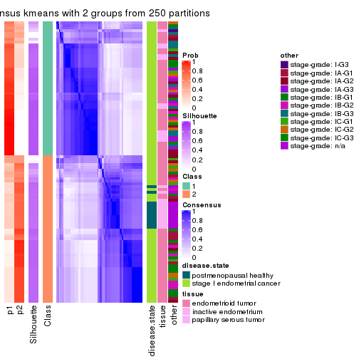</p>

</div>
<div id='tab-MAD-kmeans-consensus-heatmap-2'>
<pre><code class="r">consensus_heatmap(res, k = 3)
</code></pre>

<p>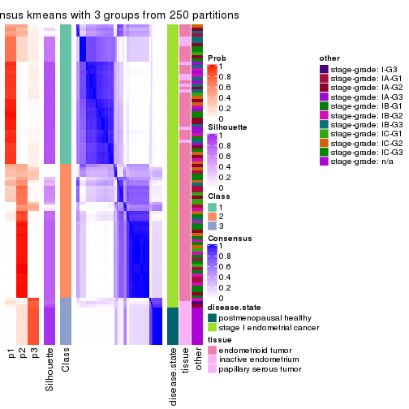</p>

</div>
<div id='tab-MAD-kmeans-consensus-heatmap-3'>
<pre><code class="r">consensus_heatmap(res, k = 4)
</code></pre>

<p>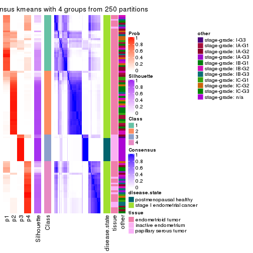</p>

</div>
<div id='tab-MAD-kmeans-consensus-heatmap-4'>
<pre><code class="r">consensus_heatmap(res, k = 5)
</code></pre>

<p>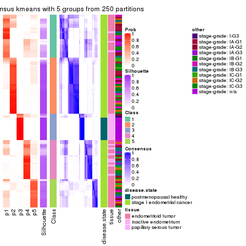</p>

</div>
<div id='tab-MAD-kmeans-consensus-heatmap-5'>
<pre><code class="r">consensus_heatmap(res, k = 6)
</code></pre>

<p>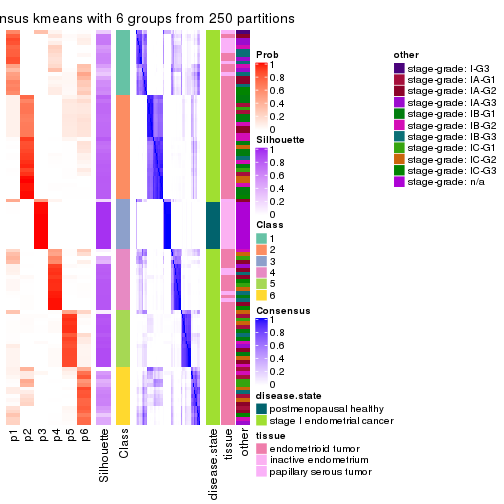</p>

</div>
</div>

Heatmaps for the membership of samples in all partitions to see how consistent they are:


<script>
$( function() {
	$( '#tabs-MAD-kmeans-membership-heatmap' ).tabs();
} );
</script>
<div id='tabs-MAD-kmeans-membership-heatmap'>
<ul>
<li><a href='#tab-MAD-kmeans-membership-heatmap-1'>k = 2</a></li>
<li><a href='#tab-MAD-kmeans-membership-heatmap-2'>k = 3</a></li>
<li><a href='#tab-MAD-kmeans-membership-heatmap-3'>k = 4</a></li>
<li><a href='#tab-MAD-kmeans-membership-heatmap-4'>k = 5</a></li>
<li><a href='#tab-MAD-kmeans-membership-heatmap-5'>k = 6</a></li>
</ul>
<div id='tab-MAD-kmeans-membership-heatmap-1'>
<pre><code class="r">membership_heatmap(res, k = 2)
</code></pre>

<p>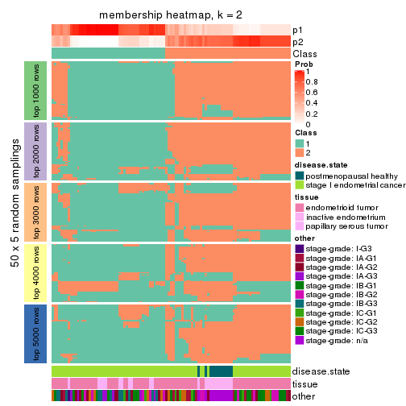</p>

</div>
<div id='tab-MAD-kmeans-membership-heatmap-2'>
<pre><code class="r">membership_heatmap(res, k = 3)
</code></pre>

<p>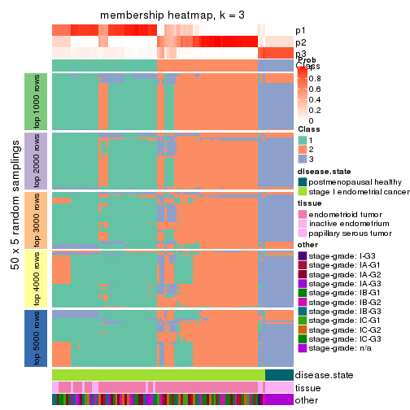</p>

</div>
<div id='tab-MAD-kmeans-membership-heatmap-3'>
<pre><code class="r">membership_heatmap(res, k = 4)
</code></pre>

<p>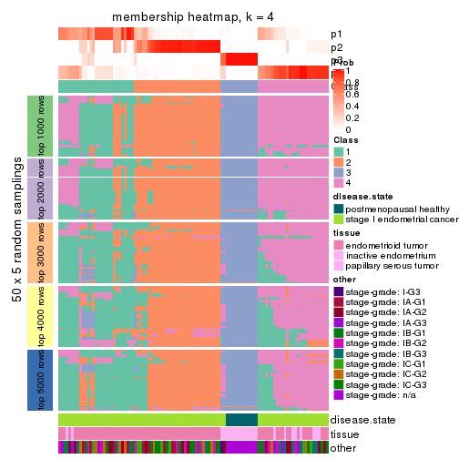</p>

</div>
<div id='tab-MAD-kmeans-membership-heatmap-4'>
<pre><code class="r">membership_heatmap(res, k = 5)
</code></pre>

<p>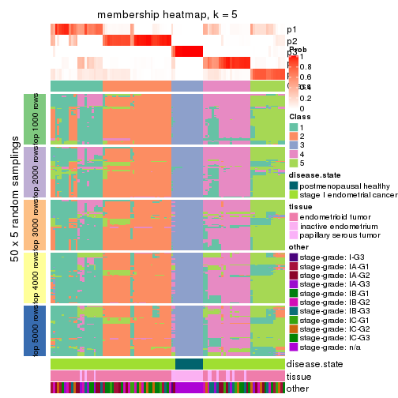</p>

</div>
<div id='tab-MAD-kmeans-membership-heatmap-5'>
<pre><code class="r">membership_heatmap(res, k = 6)
</code></pre>

<p>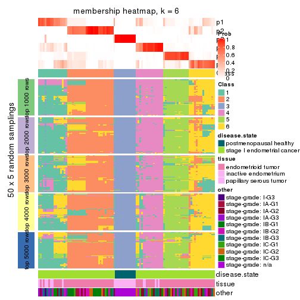</p>

</div>
</div>

As soon as we have had the classes for columns, we can look for signatures
which are significantly different between classes which can be candidate marks
for certain classes. Following are the heatmaps for signatures.


Signature heatmaps where rows are scaled:


<script>
$( function() {
	$( '#tabs-MAD-kmeans-get-signatures' ).tabs();
} );
</script>
<div id='tabs-MAD-kmeans-get-signatures'>
<ul>
<li><a href='#tab-MAD-kmeans-get-signatures-1'>k = 2</a></li>
<li><a href='#tab-MAD-kmeans-get-signatures-2'>k = 3</a></li>
<li><a href='#tab-MAD-kmeans-get-signatures-3'>k = 4</a></li>
<li><a href='#tab-MAD-kmeans-get-signatures-4'>k = 5</a></li>
<li><a href='#tab-MAD-kmeans-get-signatures-5'>k = 6</a></li>
</ul>
<div id='tab-MAD-kmeans-get-signatures-1'>
<pre><code class="r">get_signatures(res, k = 2)
</code></pre>

<p>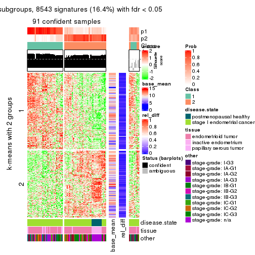</p>

</div>
<div id='tab-MAD-kmeans-get-signatures-2'>
<pre><code class="r">get_signatures(res, k = 3)
</code></pre>

<p>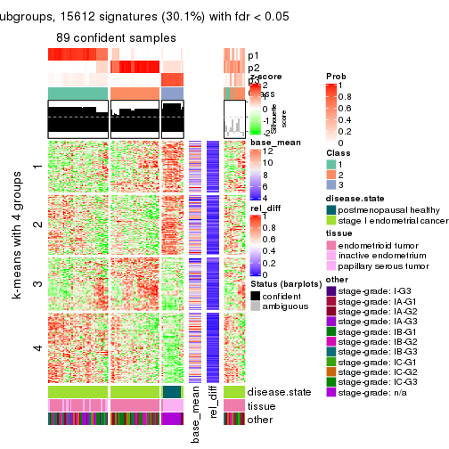</p>

</div>
<div id='tab-MAD-kmeans-get-signatures-3'>
<pre><code class="r">get_signatures(res, k = 4)
</code></pre>

<p>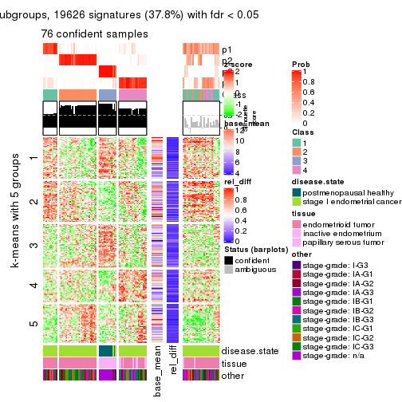</p>

</div>
<div id='tab-MAD-kmeans-get-signatures-4'>
<pre><code class="r">get_signatures(res, k = 5)
</code></pre>

<p>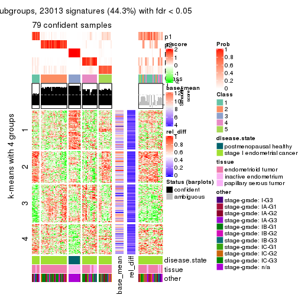</p>

</div>
<div id='tab-MAD-kmeans-get-signatures-5'>
<pre><code class="r">get_signatures(res, k = 6)
</code></pre>

<p>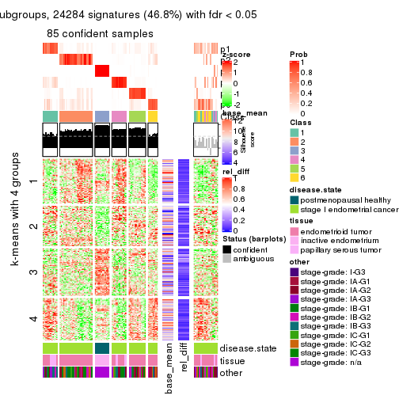</p>

</div>
</div>


Signature heatmaps where rows are not scaled:


<script>
$( function() {
	$( '#tabs-MAD-kmeans-get-signatures-no-scale' ).tabs();
} );
</script>
<div id='tabs-MAD-kmeans-get-signatures-no-scale'>
<ul>
<li><a href='#tab-MAD-kmeans-get-signatures-no-scale-1'>k = 2</a></li>
<li><a href='#tab-MAD-kmeans-get-signatures-no-scale-2'>k = 3</a></li>
<li><a href='#tab-MAD-kmeans-get-signatures-no-scale-3'>k = 4</a></li>
<li><a href='#tab-MAD-kmeans-get-signatures-no-scale-4'>k = 5</a></li>
<li><a href='#tab-MAD-kmeans-get-signatures-no-scale-5'>k = 6</a></li>
</ul>
<div id='tab-MAD-kmeans-get-signatures-no-scale-1'>
<pre><code class="r">get_signatures(res, k = 2, scale_rows = FALSE)
</code></pre>

<p>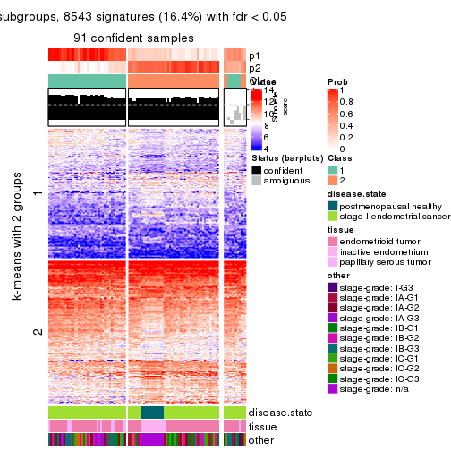</p>

</div>
<div id='tab-MAD-kmeans-get-signatures-no-scale-2'>
<pre><code class="r">get_signatures(res, k = 3, scale_rows = FALSE)
</code></pre>

<p>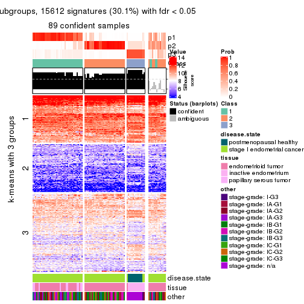</p>

</div>
<div id='tab-MAD-kmeans-get-signatures-no-scale-3'>
<pre><code class="r">get_signatures(res, k = 4, scale_rows = FALSE)
</code></pre>

<p>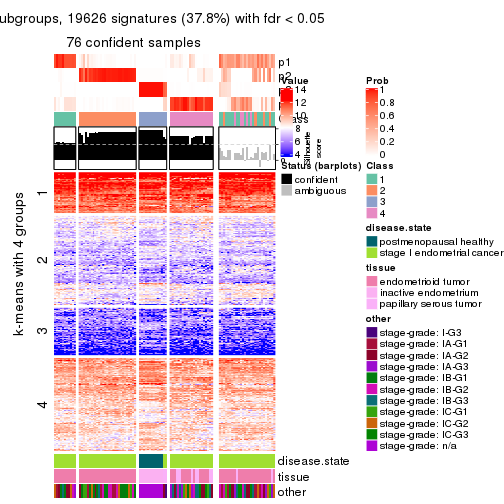</p>

</div>
<div id='tab-MAD-kmeans-get-signatures-no-scale-4'>
<pre><code class="r">get_signatures(res, k = 5, scale_rows = FALSE)
</code></pre>

<p>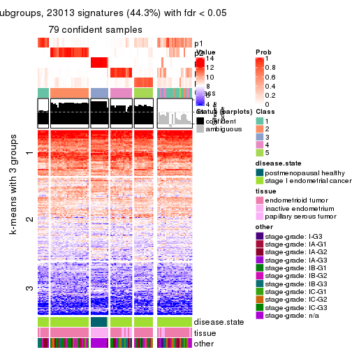</p>

</div>
<div id='tab-MAD-kmeans-get-signatures-no-scale-5'>
<pre><code class="r">get_signatures(res, k = 6, scale_rows = FALSE)
</code></pre>

<p>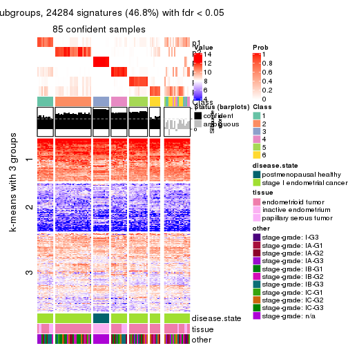</p>

</div>
</div>


Compare the overlap of signatures from different k:

```r
compare_signatures(res)
```

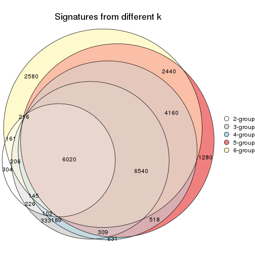

`get_signature()` returns a data frame invisibly. TO get the list of signatures, the function
call should be assigned to a variable explicitly. In following code, if `plot` argument is set
to `FALSE`, no heatmap is plotted while only the differential analysis is performed.

```r
# code only for demonstration
tb = get_signature(res, k = ..., plot = FALSE)
```

An example of the output of `tb` is:

```
#>   which_row         fdr    mean_1    mean_2 scaled_mean_1 scaled_mean_2 km
#> 1        38 0.042760348  8.373488  9.131774    -0.5533452     0.5164555  1
#> 2        40 0.018707592  7.106213  8.469186    -0.6173731     0.5762149  1
#> 3        55 0.019134737 10.221463 11.207825    -0.6159697     0.5749050  1
#> 4        59 0.006059896  5.921854  7.869574    -0.6899429     0.6439467  1
#> 5        60 0.018055526  8.928898 10.211722    -0.6204761     0.5791110  1
#> 6        98 0.009384629 15.714769 14.887706     0.6635654    -0.6193277  2
...
```

The columns in `tb` are:

1. `which_row`: row indices corresponding to the input matrix.
2. `fdr`: FDR for the differential test. 
3. `mean_x`: The mean value in group x.
4. `scaled_mean_x`: The mean value in group x after rows are scaled.
5. `km`: Row groups if k-means clustering is applied to rows.


UMAP plot which shows how samples are separated.


<script>
$( function() {
	$( '#tabs-MAD-kmeans-dimension-reduction' ).tabs();
} );
</script>
<div id='tabs-MAD-kmeans-dimension-reduction'>
<ul>
<li><a href='#tab-MAD-kmeans-dimension-reduction-1'>k = 2</a></li>
<li><a href='#tab-MAD-kmeans-dimension-reduction-2'>k = 3</a></li>
<li><a href='#tab-MAD-kmeans-dimension-reduction-3'>k = 4</a></li>
<li><a href='#tab-MAD-kmeans-dimension-reduction-4'>k = 5</a></li>
<li><a href='#tab-MAD-kmeans-dimension-reduction-5'>k = 6</a></li>
</ul>
<div id='tab-MAD-kmeans-dimension-reduction-1'>
<pre><code class="r">dimension_reduction(res, k = 2, method = &quot;UMAP&quot;)
</code></pre>

<p>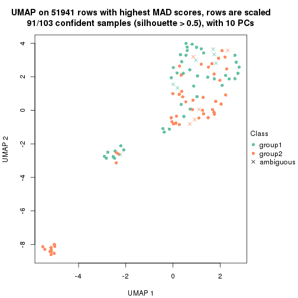</p>

</div>
<div id='tab-MAD-kmeans-dimension-reduction-2'>
<pre><code class="r">dimension_reduction(res, k = 3, method = &quot;UMAP&quot;)
</code></pre>

<p>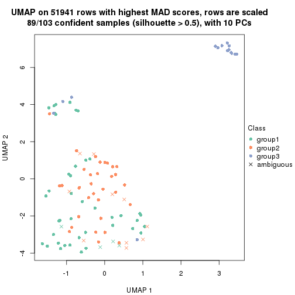</p>

</div>
<div id='tab-MAD-kmeans-dimension-reduction-3'>
<pre><code class="r">dimension_reduction(res, k = 4, method = &quot;UMAP&quot;)
</code></pre>

<p>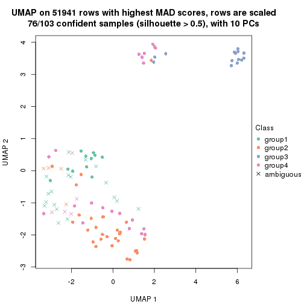</p>

</div>
<div id='tab-MAD-kmeans-dimension-reduction-4'>
<pre><code class="r">dimension_reduction(res, k = 5, method = &quot;UMAP&quot;)
</code></pre>

<p>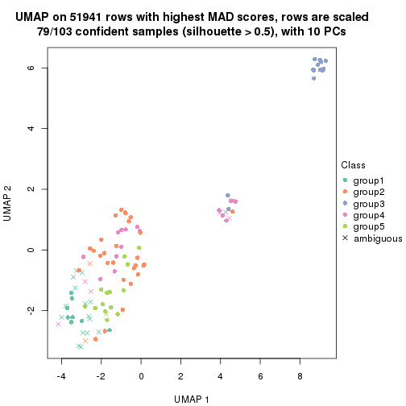</p>

</div>
<div id='tab-MAD-kmeans-dimension-reduction-5'>
<pre><code class="r">dimension_reduction(res, k = 6, method = &quot;UMAP&quot;)
</code></pre>

<p>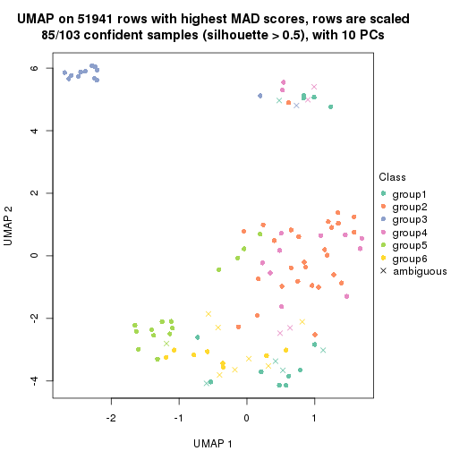</p>

</div>
</div>


Following heatmap shows how subgroups are split when increasing `k`:

```r
collect_classes(res)
```

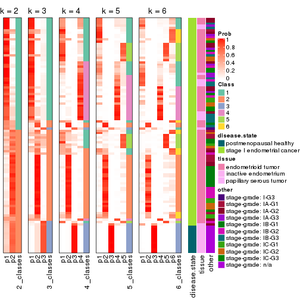


Test correlation between subgroups and known annotations. If the known
annotation is numeric, one-way ANOVA test is applied, and if the known
annotation is discrete, chi-squared contingency table test is applied.

```r
test_to_known_factors(res)
```

```
#>             n disease.state(p) tissue(p) other(p) k
#> MAD:kmeans 91         1.74e-03  6.86e-05 5.73e-07 2
#> MAD:kmeans 89         1.39e-15  2.08e-16 1.46e-14 3
#> MAD:kmeans 76         1.27e-13  1.22e-15 2.23e-09 4
#> MAD:kmeans 79         9.30e-15  2.99e-16 9.24e-09 5
#> MAD:kmeans 85         7.53e-17  5.71e-19 1.56e-11 6
```


If matrix rows can be associated to genes, consider to use `functional_enrichment(res,
...)` to perform function enrichment for the signature genes. See [this vignette](http://bioconductor.org/packages/devel/bioc/vignettes/cola/inst/doc/functional_enrichment.html) for more detailed explanations.


 

---------------------------------------------------


### MAD:skmeans


The object with results only for a single top-value method and a single partition method 
can be extracted as:

```r
res = res_list["MAD", "skmeans"]
# you can also extract it by
# res = res_list["MAD:skmeans"]
```

A summary of `res` and all the functions that can be applied to it:

```r
res
```

```
#> A 'ConsensusPartition' object with k = 2, 3, 4, 5, 6.
#>   On a matrix with 51941 rows and 103 columns.
#>   Top rows (1000, 2000, 3000, 4000, 5000) are extracted by 'MAD' method.
#>   Subgroups are detected by 'skmeans' method.
#>   Performed in total 1250 partitions by row resampling.
#>   Best k for subgroups seems to be 2.
#> 
#> Following methods can be applied to this 'ConsensusPartition' object:
#>  [1] "cola_report"             "collect_classes"         "collect_plots"          
#>  [4] "collect_stats"           "colnames"                "compare_signatures"     
#>  [7] "consensus_heatmap"       "dimension_reduction"     "functional_enrichment"  
#> [10] "get_anno_col"            "get_anno"                "get_classes"            
#> [13] "get_consensus"           "get_matrix"              "get_membership"         
#> [16] "get_param"               "get_signatures"          "get_stats"              
#> [19] "is_best_k"               "is_stable_k"             "membership_heatmap"     
#> [22] "ncol"                    "nrow"                    "plot_ecdf"              
#> [25] "rownames"                "select_partition_number" "show"                   
#> [28] "suggest_best_k"          "test_to_known_factors"
```

`collect_plots()` function collects all the plots made from `res` for all `k` (number of partitions)
into one single page to provide an easy and fast comparison between different `k`.

```r
collect_plots(res)
```

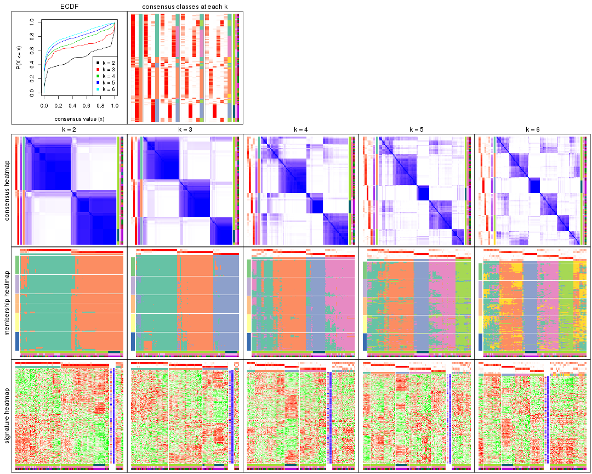

The plots are:

- The first row: a plot of the ECDF (empirical cumulative distribution
  function) curves of the consensus matrix for each `k` and the heatmap of
  predicted classes for each `k`.
- The second row: heatmaps of the consensus matrix for each `k`.
- The third row: heatmaps of the membership matrix for each `k`.
- The fouth row: heatmaps of the signatures for each `k`.

All the plots in panels can be made by individual functions and they are
plotted later in this section.

`select_partition_number()` produces several plots showing different
statistics for choosing "optimized" `k`. There are following statistics:

- ECDF curves of the consensus matrix for each `k`;
- 1-PAC. [The PAC
  score](https://en.wikipedia.org/wiki/Consensus_clustering#Over-interpretation_potential_of_consensus_clustering)
  measures the proportion of the ambiguous subgrouping.
- Mean silhouette score.
- Concordance. The mean probability of fiting the consensus class ids in all
  partitions.
- Area increased. Denote $A_k$ as the area under the ECDF curve for current
  `k`, the area increased is defined as $A_k - A_{k-1}$.
- Rand index. The percent of pairs of samples that are both in a same cluster
  or both are not in a same cluster in the partition of k and k-1.
- Jaccard index. The ratio of pairs of samples are both in a same cluster in
  the partition of k and k-1 and the pairs of samples are both in a same
  cluster in the partition k or k-1.

The detailed explanations of these statistics can be found in [the _cola_
vignette](http://bioconductor.org/packages/devel/bioc/vignettes/cola/inst/doc/cola.html#toc_13).

Generally speaking, lower PAC score, higher mean silhouette score or higher
concordance corresponds to better partition. Rand index and Jaccard index
measure how similar the current partition is compared to partition with `k-1`.
If they are too similar, we won't accept `k` is better than `k-1`.

```r
select_partition_number(res)
```

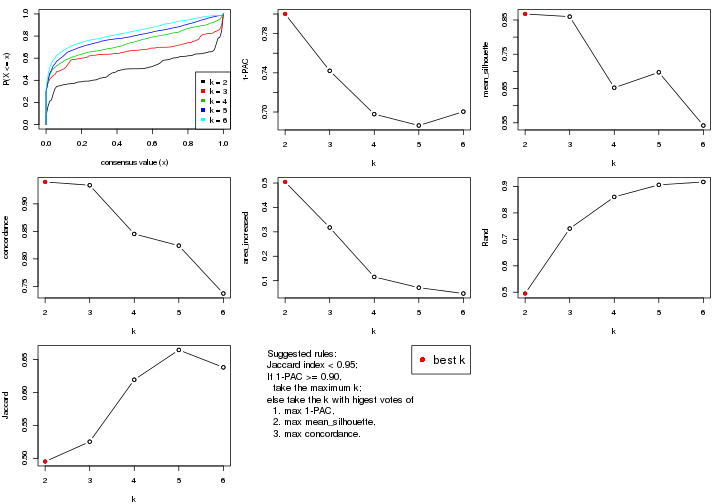

The numeric values for all these statistics can be obtained by `get_stats()`.

```r
get_stats(res)
```

```
#>   k 1-PAC mean_silhouette concordance area_increased  Rand Jaccard
#> 2 2 0.800           0.868       0.940         0.5044 0.495   0.495
#> 3 3 0.742           0.860       0.934         0.3177 0.741   0.525
#> 4 4 0.698           0.652       0.845         0.1152 0.860   0.619
#> 5 5 0.686           0.697       0.824         0.0714 0.906   0.665
#> 6 6 0.700           0.542       0.737         0.0473 0.917   0.638
```

`suggest_best_k()` suggests the best $k$ based on these statistics. The rules are as follows:

- All $k$ with Jaccard index larger than 0.95 are removed because increasing
  $k$ does not provide enough extra information. If all $k$ are removed, it is
  marked as no subgroup is detected.
- For all $k$ with 1-PAC score larger than 0.9, the maximal $k$ is taken as
  the best $k$, and other $k$ are marked as optional $k$.
- If it does not fit the second rule. The $k$ with the maximal vote of the
  highest 1-PAC score, highest mean silhouette, and highest concordance is
  taken as the best $k$.

```r
suggest_best_k(res)
```

```
#> [1] 2
```


Following shows the table of the partitions (You need to click the **show/hide
code output** link to see it). The membership matrix (columns with name `p*`)
is inferred by
[`clue::cl_consensus()`](https://www.rdocumentation.org/link/cl_consensus?package=clue)
function with the `SE` method. Basically the value in the membership matrix
represents the probability to belong to a certain group. The finall class
label for an item is determined with the group with highest probability it
belongs to.

In `get_classes()` function, the entropy is calculated from the membership
matrix and the silhouette score is calculated from the consensus matrix.


<script>
$( function() {
	$( '#tabs-MAD-skmeans-get-classes' ).tabs();
} );
</script>
<div id='tabs-MAD-skmeans-get-classes'>
<ul>
<li><a href='#tab-MAD-skmeans-get-classes-1'>k = 2</a></li>
<li><a href='#tab-MAD-skmeans-get-classes-2'>k = 3</a></li>
<li><a href='#tab-MAD-skmeans-get-classes-3'>k = 4</a></li>
<li><a href='#tab-MAD-skmeans-get-classes-4'>k = 5</a></li>
<li><a href='#tab-MAD-skmeans-get-classes-5'>k = 6</a></li>
</ul>

<div id='tab-MAD-skmeans-get-classes-1'>
<p><a id='tab-MAD-skmeans-get-classes-1-a' style='color:#0366d6' href='#'>show/hide code output</a></p>
<pre><code class="r">cbind(get_classes(res, k = 2), get_membership(res, k = 2))
</code></pre>

<pre><code>#&gt;           class entropy silhouette    p1    p2
#&gt; GSM425907     2  0.0000      0.936 0.000 1.000
#&gt; GSM425908     2  0.2423      0.923 0.040 0.960
#&gt; GSM425909     2  0.9000      0.540 0.316 0.684
#&gt; GSM425910     1  0.9881      0.294 0.564 0.436
#&gt; GSM425911     2  0.0000      0.936 0.000 1.000
#&gt; GSM425912     2  0.2778      0.912 0.048 0.952
#&gt; GSM425913     2  0.0000      0.936 0.000 1.000
#&gt; GSM425914     2  0.1414      0.929 0.020 0.980
#&gt; GSM425915     2  0.0376      0.936 0.004 0.996
#&gt; GSM425874     1  0.0938      0.927 0.988 0.012
#&gt; GSM425875     1  0.0376      0.929 0.996 0.004
#&gt; GSM425876     1  0.8144      0.682 0.748 0.252
#&gt; GSM425877     1  0.0000      0.930 1.000 0.000
#&gt; GSM425878     1  0.0000      0.930 1.000 0.000
#&gt; GSM425879     2  0.0000      0.936 0.000 1.000
#&gt; GSM425880     1  0.2423      0.908 0.960 0.040
#&gt; GSM425881     1  0.9491      0.443 0.632 0.368
#&gt; GSM425882     2  0.2423      0.923 0.040 0.960
#&gt; GSM425883     1  0.0000      0.930 1.000 0.000
#&gt; GSM425884     1  0.0000      0.930 1.000 0.000
#&gt; GSM425885     2  0.9815      0.327 0.420 0.580
#&gt; GSM425848     1  0.0376      0.930 0.996 0.004
#&gt; GSM425849     1  0.0376      0.930 0.996 0.004
#&gt; GSM425850     1  0.0376      0.930 0.996 0.004
#&gt; GSM425851     1  0.0000      0.930 1.000 0.000
#&gt; GSM425852     1  0.2603      0.905 0.956 0.044
#&gt; GSM425893     2  0.0000      0.936 0.000 1.000
#&gt; GSM425894     2  0.2423      0.923 0.040 0.960
#&gt; GSM425895     2  0.2423      0.923 0.040 0.960
#&gt; GSM425896     2  0.0000      0.936 0.000 1.000
#&gt; GSM425897     2  0.0000      0.936 0.000 1.000
#&gt; GSM425898     2  0.2423      0.923 0.040 0.960
#&gt; GSM425899     1  0.2778      0.903 0.952 0.048
#&gt; GSM425900     2  0.2043      0.928 0.032 0.968
#&gt; GSM425901     2  0.9358      0.464 0.352 0.648
#&gt; GSM425902     1  0.1414      0.924 0.980 0.020
#&gt; GSM425903     2  0.1633      0.927 0.024 0.976
#&gt; GSM425904     1  0.2423      0.908 0.960 0.040
#&gt; GSM425905     2  0.0000      0.936 0.000 1.000
#&gt; GSM425906     2  0.0000      0.936 0.000 1.000
#&gt; GSM425863     1  0.0376      0.930 0.996 0.004
#&gt; GSM425864     2  0.0000      0.936 0.000 1.000
#&gt; GSM425865     2  0.0000      0.936 0.000 1.000
#&gt; GSM425866     1  0.2423      0.908 0.960 0.040
#&gt; GSM425867     2  0.6623      0.785 0.172 0.828
#&gt; GSM425868     2  0.2948      0.916 0.052 0.948
#&gt; GSM425869     2  0.2423      0.923 0.040 0.960
#&gt; GSM425870     2  0.0376      0.936 0.004 0.996
#&gt; GSM425871     1  0.0376      0.930 0.996 0.004
#&gt; GSM425872     2  0.2423      0.923 0.040 0.960
#&gt; GSM425873     1  0.0000      0.930 1.000 0.000
#&gt; GSM425843     1  0.0000      0.930 1.000 0.000
#&gt; GSM425844     1  0.0000      0.930 1.000 0.000
#&gt; GSM425845     1  0.9710      0.398 0.600 0.400
#&gt; GSM425846     1  0.6531      0.780 0.832 0.168
#&gt; GSM425847     1  0.9358      0.471 0.648 0.352
#&gt; GSM425886     2  0.0376      0.936 0.004 0.996
#&gt; GSM425887     2  0.8763      0.585 0.296 0.704
#&gt; GSM425888     1  0.9393      0.470 0.644 0.356
#&gt; GSM425889     1  0.0376      0.930 0.996 0.004
#&gt; GSM425890     1  0.1633      0.921 0.976 0.024
#&gt; GSM425891     2  0.0000      0.936 0.000 1.000
#&gt; GSM425892     2  0.2043      0.926 0.032 0.968
#&gt; GSM425853     1  0.1414      0.921 0.980 0.020
#&gt; GSM425854     2  0.2423      0.923 0.040 0.960
#&gt; GSM425855     1  0.0376      0.930 0.996 0.004
#&gt; GSM425856     1  0.2423      0.908 0.960 0.040
#&gt; GSM425857     2  0.9323      0.465 0.348 0.652
#&gt; GSM425858     2  0.8608      0.610 0.284 0.716
#&gt; GSM425859     2  0.2423      0.923 0.040 0.960
#&gt; GSM425860     2  0.5178      0.845 0.116 0.884
#&gt; GSM425861     1  0.4431      0.864 0.908 0.092
#&gt; GSM425862     1  0.0376      0.930 0.996 0.004
#&gt; GSM425837     1  0.0000      0.930 1.000 0.000
#&gt; GSM425838     1  0.1414      0.924 0.980 0.020
#&gt; GSM425839     2  0.2423      0.923 0.040 0.960
#&gt; GSM425840     1  0.0000      0.930 1.000 0.000
#&gt; GSM425841     1  0.1414      0.924 0.980 0.020
#&gt; GSM425842     1  0.0000      0.930 1.000 0.000
#&gt; GSM425917     2  0.1184      0.934 0.016 0.984
#&gt; GSM425922     1  0.1414      0.924 0.980 0.020
#&gt; GSM425919     1  0.0000      0.930 1.000 0.000
#&gt; GSM425920     1  0.0000      0.930 1.000 0.000
#&gt; GSM425923     1  0.0000      0.930 1.000 0.000
#&gt; GSM425916     1  0.0000      0.930 1.000 0.000
#&gt; GSM425918     1  0.0000      0.930 1.000 0.000
#&gt; GSM425921     1  0.1414      0.924 0.980 0.020
#&gt; GSM425925     1  0.0376      0.930 0.996 0.004
#&gt; GSM425926     1  0.0376      0.930 0.996 0.004
#&gt; GSM425927     1  0.0000      0.930 1.000 0.000
#&gt; GSM425924     1  0.9209      0.502 0.664 0.336
#&gt; GSM425928     2  0.0376      0.936 0.004 0.996
#&gt; GSM425929     2  0.0376      0.936 0.004 0.996
#&gt; GSM425930     2  0.0376      0.936 0.004 0.996
#&gt; GSM425931     2  0.0376      0.936 0.004 0.996
#&gt; GSM425932     2  0.0376      0.936 0.004 0.996
#&gt; GSM425933     2  0.0376      0.936 0.004 0.996
#&gt; GSM425934     2  0.0376      0.936 0.004 0.996
#&gt; GSM425935     2  0.0376      0.936 0.004 0.996
#&gt; GSM425936     2  0.0376      0.936 0.004 0.996
#&gt; GSM425937     2  0.0376      0.936 0.004 0.996
#&gt; GSM425938     2  0.0376      0.936 0.004 0.996
#&gt; GSM425939     2  0.0376      0.936 0.004 0.996
</code></pre>

<script>
$('#tab-MAD-skmeans-get-classes-1-a').parent().next().next().hide();
$('#tab-MAD-skmeans-get-classes-1-a').click(function(){
  $('#tab-MAD-skmeans-get-classes-1-a').parent().next().next().toggle();
  return(false);
});
</script>
</div>

<div id='tab-MAD-skmeans-get-classes-2'>
<p><a id='tab-MAD-skmeans-get-classes-2-a' style='color:#0366d6' href='#'>show/hide code output</a></p>
<pre><code class="r">cbind(get_classes(res, k = 3), get_membership(res, k = 3))
</code></pre>

<pre><code>#&gt;           class entropy silhouette    p1    p2    p3
#&gt; GSM425907     2  0.0000      0.927 0.000 1.000 0.000
#&gt; GSM425908     2  0.0000      0.927 0.000 1.000 0.000
#&gt; GSM425909     3  0.0237      0.951 0.004 0.000 0.996
#&gt; GSM425910     3  0.5191      0.838 0.112 0.060 0.828
#&gt; GSM425911     2  0.4974      0.704 0.000 0.764 0.236
#&gt; GSM425912     2  0.4818      0.829 0.108 0.844 0.048
#&gt; GSM425913     2  0.0237      0.926 0.000 0.996 0.004
#&gt; GSM425914     2  0.6335      0.667 0.036 0.724 0.240
#&gt; GSM425915     3  0.0000      0.953 0.000 0.000 1.000
#&gt; GSM425874     1  0.3482      0.840 0.872 0.128 0.000
#&gt; GSM425875     1  0.1289      0.897 0.968 0.000 0.032
#&gt; GSM425876     1  0.8691     -0.081 0.448 0.104 0.448
#&gt; GSM425877     1  0.0000      0.913 1.000 0.000 0.000
#&gt; GSM425878     1  0.0000      0.913 1.000 0.000 0.000
#&gt; GSM425879     2  0.0592      0.923 0.000 0.988 0.012
#&gt; GSM425880     1  0.6204      0.294 0.576 0.000 0.424
#&gt; GSM425881     2  0.3619      0.834 0.136 0.864 0.000
#&gt; GSM425882     2  0.0000      0.927 0.000 1.000 0.000
#&gt; GSM425883     1  0.0661      0.910 0.988 0.008 0.004
#&gt; GSM425884     1  0.0000      0.913 1.000 0.000 0.000
#&gt; GSM425885     2  0.6204      0.188 0.424 0.576 0.000
#&gt; GSM425848     1  0.1031      0.905 0.976 0.024 0.000
#&gt; GSM425849     1  0.0000      0.913 1.000 0.000 0.000
#&gt; GSM425850     1  0.1163      0.900 0.972 0.028 0.000
#&gt; GSM425851     1  0.0892      0.906 0.980 0.000 0.020
#&gt; GSM425852     3  0.4974      0.678 0.236 0.000 0.764
#&gt; GSM425893     2  0.4750      0.730 0.000 0.784 0.216
#&gt; GSM425894     2  0.0000      0.927 0.000 1.000 0.000
#&gt; GSM425895     2  0.0000      0.927 0.000 1.000 0.000
#&gt; GSM425896     2  0.0747      0.920 0.000 0.984 0.016
#&gt; GSM425897     2  0.0747      0.921 0.000 0.984 0.016
#&gt; GSM425898     2  0.0000      0.927 0.000 1.000 0.000
#&gt; GSM425899     2  0.1964      0.891 0.056 0.944 0.000
#&gt; GSM425900     2  0.0424      0.924 0.000 0.992 0.008
#&gt; GSM425901     3  0.0829      0.946 0.012 0.004 0.984
#&gt; GSM425902     1  0.3686      0.830 0.860 0.140 0.000
#&gt; GSM425903     3  0.0237      0.951 0.000 0.004 0.996
#&gt; GSM425904     1  0.6291      0.170 0.532 0.000 0.468
#&gt; GSM425905     2  0.0000      0.927 0.000 1.000 0.000
#&gt; GSM425906     2  0.0592      0.923 0.000 0.988 0.012
#&gt; GSM425863     1  0.0000      0.913 1.000 0.000 0.000
#&gt; GSM425864     2  0.0237      0.926 0.000 0.996 0.004
#&gt; GSM425865     2  0.0000      0.927 0.000 1.000 0.000
#&gt; GSM425866     1  0.5178      0.643 0.744 0.000 0.256
#&gt; GSM425867     3  0.0000      0.953 0.000 0.000 1.000
#&gt; GSM425868     2  0.0000      0.927 0.000 1.000 0.000
#&gt; GSM425869     2  0.0000      0.927 0.000 1.000 0.000
#&gt; GSM425870     3  0.1964      0.915 0.000 0.056 0.944
#&gt; GSM425871     1  0.0000      0.913 1.000 0.000 0.000
#&gt; GSM425872     2  0.0000      0.927 0.000 1.000 0.000
#&gt; GSM425873     1  0.0237      0.912 0.996 0.004 0.000
#&gt; GSM425843     1  0.0000      0.913 1.000 0.000 0.000
#&gt; GSM425844     1  0.0000      0.913 1.000 0.000 0.000
#&gt; GSM425845     3  0.4295      0.864 0.104 0.032 0.864
#&gt; GSM425846     2  0.0000      0.927 0.000 1.000 0.000
#&gt; GSM425847     2  0.4784      0.772 0.200 0.796 0.004
#&gt; GSM425886     3  0.0237      0.951 0.000 0.004 0.996
#&gt; GSM425887     2  0.2945      0.870 0.088 0.908 0.004
#&gt; GSM425888     2  0.3619      0.836 0.136 0.864 0.000
#&gt; GSM425889     1  0.0237      0.912 0.996 0.004 0.000
#&gt; GSM425890     1  0.3412      0.845 0.876 0.124 0.000
#&gt; GSM425891     2  0.0000      0.927 0.000 1.000 0.000
#&gt; GSM425892     2  0.0000      0.927 0.000 1.000 0.000
#&gt; GSM425853     1  0.1643      0.889 0.956 0.000 0.044
#&gt; GSM425854     2  0.0000      0.927 0.000 1.000 0.000
#&gt; GSM425855     1  0.0000      0.913 1.000 0.000 0.000
#&gt; GSM425856     1  0.5497      0.582 0.708 0.000 0.292
#&gt; GSM425857     3  0.5339      0.823 0.080 0.096 0.824
#&gt; GSM425858     2  0.0592      0.922 0.012 0.988 0.000
#&gt; GSM425859     2  0.0000      0.927 0.000 1.000 0.000
#&gt; GSM425860     3  0.5138      0.824 0.052 0.120 0.828
#&gt; GSM425861     2  0.6026      0.478 0.376 0.624 0.000
#&gt; GSM425862     1  0.0592      0.910 0.988 0.012 0.000
#&gt; GSM425837     1  0.0000      0.913 1.000 0.000 0.000
#&gt; GSM425838     1  0.3551      0.837 0.868 0.132 0.000
#&gt; GSM425839     2  0.0000      0.927 0.000 1.000 0.000
#&gt; GSM425840     1  0.0000      0.913 1.000 0.000 0.000
#&gt; GSM425841     1  0.3686      0.830 0.860 0.140 0.000
#&gt; GSM425842     1  0.0000      0.913 1.000 0.000 0.000
#&gt; GSM425917     3  0.4413      0.831 0.124 0.024 0.852
#&gt; GSM425922     1  0.3412      0.844 0.876 0.124 0.000
#&gt; GSM425919     1  0.1163      0.900 0.972 0.000 0.028
#&gt; GSM425920     1  0.0000      0.913 1.000 0.000 0.000
#&gt; GSM425923     1  0.0000      0.913 1.000 0.000 0.000
#&gt; GSM425916     1  0.0000      0.913 1.000 0.000 0.000
#&gt; GSM425918     1  0.0000      0.913 1.000 0.000 0.000
#&gt; GSM425921     1  0.3412      0.844 0.876 0.124 0.000
#&gt; GSM425925     1  0.0237      0.912 0.996 0.004 0.000
#&gt; GSM425926     1  0.3340      0.847 0.880 0.120 0.000
#&gt; GSM425927     1  0.0000      0.913 1.000 0.000 0.000
#&gt; GSM425924     3  0.2066      0.914 0.060 0.000 0.940
#&gt; GSM425928     3  0.0000      0.953 0.000 0.000 1.000
#&gt; GSM425929     3  0.0000      0.953 0.000 0.000 1.000
#&gt; GSM425930     3  0.0000      0.953 0.000 0.000 1.000
#&gt; GSM425931     3  0.0000      0.953 0.000 0.000 1.000
#&gt; GSM425932     3  0.0000      0.953 0.000 0.000 1.000
#&gt; GSM425933     3  0.0000      0.953 0.000 0.000 1.000
#&gt; GSM425934     3  0.0000      0.953 0.000 0.000 1.000
#&gt; GSM425935     3  0.0000      0.953 0.000 0.000 1.000
#&gt; GSM425936     3  0.0000      0.953 0.000 0.000 1.000
#&gt; GSM425937     3  0.0000      0.953 0.000 0.000 1.000
#&gt; GSM425938     3  0.0000      0.953 0.000 0.000 1.000
#&gt; GSM425939     3  0.0000      0.953 0.000 0.000 1.000
</code></pre>

<script>
$('#tab-MAD-skmeans-get-classes-2-a').parent().next().next().hide();
$('#tab-MAD-skmeans-get-classes-2-a').click(function(){
  $('#tab-MAD-skmeans-get-classes-2-a').parent().next().next().toggle();
  return(false);
});
</script>
</div>

<div id='tab-MAD-skmeans-get-classes-3'>
<p><a id='tab-MAD-skmeans-get-classes-3-a' style='color:#0366d6' href='#'>show/hide code output</a></p>
<pre><code class="r">cbind(get_classes(res, k = 4), get_membership(res, k = 4))
</code></pre>

<pre><code>#&gt;           class entropy silhouette    p1    p2    p3    p4
#&gt; GSM425907     2  0.0000   0.901352 0.000 1.000 0.000 0.000
#&gt; GSM425908     2  0.0188   0.901014 0.000 0.996 0.000 0.004
#&gt; GSM425909     3  0.5854   0.286638 0.460 0.024 0.512 0.004
#&gt; GSM425910     1  0.0524   0.594884 0.988 0.000 0.004 0.008
#&gt; GSM425911     2  0.4916   0.723642 0.184 0.760 0.056 0.000
#&gt; GSM425912     2  0.5507   0.381559 0.416 0.568 0.008 0.008
#&gt; GSM425913     2  0.0524   0.900389 0.008 0.988 0.004 0.000
#&gt; GSM425914     2  0.6060   0.287550 0.440 0.516 0.044 0.000
#&gt; GSM425915     3  0.4907   0.390727 0.420 0.000 0.580 0.000
#&gt; GSM425874     4  0.0817   0.816281 0.000 0.024 0.000 0.976
#&gt; GSM425875     1  0.3443   0.592740 0.848 0.000 0.016 0.136
#&gt; GSM425876     1  0.0469   0.596769 0.988 0.000 0.000 0.012
#&gt; GSM425877     4  0.3764   0.710871 0.216 0.000 0.000 0.784
#&gt; GSM425878     4  0.4961   0.319279 0.448 0.000 0.000 0.552
#&gt; GSM425879     2  0.0657   0.899499 0.012 0.984 0.004 0.000
#&gt; GSM425880     1  0.4636   0.518728 0.792 0.000 0.140 0.068
#&gt; GSM425881     2  0.5150   0.430874 0.396 0.596 0.000 0.008
#&gt; GSM425882     2  0.0707   0.899724 0.020 0.980 0.000 0.000
#&gt; GSM425883     4  0.1762   0.818804 0.048 0.004 0.004 0.944
#&gt; GSM425884     1  0.4992  -0.148987 0.524 0.000 0.000 0.476
#&gt; GSM425885     4  0.3873   0.579456 0.000 0.228 0.000 0.772
#&gt; GSM425848     4  0.1151   0.817968 0.024 0.008 0.000 0.968
#&gt; GSM425849     4  0.4761   0.543420 0.332 0.004 0.000 0.664
#&gt; GSM425850     1  0.5060   0.000863 0.584 0.004 0.000 0.412
#&gt; GSM425851     4  0.2313   0.811546 0.044 0.000 0.032 0.924
#&gt; GSM425852     1  0.5386   0.100890 0.612 0.000 0.368 0.020
#&gt; GSM425893     2  0.5199   0.704390 0.144 0.756 0.100 0.000
#&gt; GSM425894     2  0.0817   0.894279 0.000 0.976 0.000 0.024
#&gt; GSM425895     2  0.0188   0.901014 0.000 0.996 0.000 0.004
#&gt; GSM425896     2  0.0779   0.898030 0.000 0.980 0.016 0.004
#&gt; GSM425897     2  0.0937   0.899039 0.012 0.976 0.012 0.000
#&gt; GSM425898     2  0.0188   0.901014 0.000 0.996 0.000 0.004
#&gt; GSM425899     2  0.4827   0.730413 0.092 0.784 0.000 0.124
#&gt; GSM425900     2  0.1211   0.890842 0.040 0.960 0.000 0.000
#&gt; GSM425901     3  0.6378   0.267942 0.456 0.028 0.496 0.020
#&gt; GSM425902     4  0.1118   0.810188 0.000 0.036 0.000 0.964
#&gt; GSM425903     1  0.4477   0.208695 0.688 0.000 0.312 0.000
#&gt; GSM425904     1  0.5226   0.468223 0.744 0.000 0.180 0.076
#&gt; GSM425905     2  0.0188   0.901192 0.000 0.996 0.004 0.000
#&gt; GSM425906     2  0.1398   0.890062 0.040 0.956 0.004 0.000
#&gt; GSM425863     4  0.4382   0.612538 0.296 0.000 0.000 0.704
#&gt; GSM425864     2  0.0188   0.901192 0.000 0.996 0.004 0.000
#&gt; GSM425865     2  0.0188   0.901192 0.000 0.996 0.004 0.000
#&gt; GSM425866     1  0.2214   0.601064 0.928 0.000 0.028 0.044
#&gt; GSM425867     1  0.4985  -0.201810 0.532 0.000 0.468 0.000
#&gt; GSM425868     2  0.2081   0.850459 0.000 0.916 0.000 0.084
#&gt; GSM425869     2  0.0592   0.897543 0.000 0.984 0.000 0.016
#&gt; GSM425870     3  0.5304   0.609906 0.148 0.104 0.748 0.000
#&gt; GSM425871     4  0.3356   0.758477 0.176 0.000 0.000 0.824
#&gt; GSM425872     2  0.0469   0.899180 0.000 0.988 0.000 0.012
#&gt; GSM425873     1  0.4643   0.205314 0.656 0.000 0.000 0.344
#&gt; GSM425843     4  0.4967   0.305558 0.452 0.000 0.000 0.548
#&gt; GSM425844     4  0.1637   0.816173 0.060 0.000 0.000 0.940
#&gt; GSM425845     1  0.0707   0.589046 0.980 0.000 0.020 0.000
#&gt; GSM425846     2  0.1706   0.887593 0.036 0.948 0.000 0.016
#&gt; GSM425847     1  0.5827  -0.054281 0.536 0.436 0.004 0.024
#&gt; GSM425886     3  0.5731   0.349545 0.428 0.028 0.544 0.000
#&gt; GSM425887     2  0.4053   0.723727 0.228 0.768 0.000 0.004
#&gt; GSM425888     2  0.5050   0.635908 0.268 0.704 0.000 0.028
#&gt; GSM425889     4  0.0188   0.820313 0.000 0.004 0.000 0.996
#&gt; GSM425890     4  0.0779   0.818064 0.000 0.016 0.004 0.980
#&gt; GSM425891     2  0.0657   0.899499 0.012 0.984 0.004 0.000
#&gt; GSM425892     2  0.0188   0.901014 0.000 0.996 0.000 0.004
#&gt; GSM425853     1  0.2542   0.606151 0.904 0.000 0.012 0.084
#&gt; GSM425854     2  0.0000   0.901352 0.000 1.000 0.000 0.000
#&gt; GSM425855     4  0.3123   0.761795 0.156 0.000 0.000 0.844
#&gt; GSM425856     1  0.3168   0.589266 0.884 0.000 0.056 0.060
#&gt; GSM425857     1  0.8711  -0.097805 0.436 0.072 0.336 0.156
#&gt; GSM425858     2  0.2081   0.864663 0.084 0.916 0.000 0.000
#&gt; GSM425859     2  0.0000   0.901352 0.000 1.000 0.000 0.000
#&gt; GSM425860     1  0.6163   0.390527 0.668 0.080 0.244 0.008
#&gt; GSM425861     1  0.7006  -0.047432 0.456 0.428 0.000 0.116
#&gt; GSM425862     4  0.0188   0.820313 0.000 0.004 0.000 0.996
#&gt; GSM425837     4  0.4679   0.524132 0.352 0.000 0.000 0.648
#&gt; GSM425838     4  0.1118   0.810002 0.000 0.036 0.000 0.964
#&gt; GSM425839     2  0.0000   0.901352 0.000 1.000 0.000 0.000
#&gt; GSM425840     4  0.4431   0.605095 0.304 0.000 0.000 0.696
#&gt; GSM425841     4  0.1022   0.812482 0.000 0.032 0.000 0.968
#&gt; GSM425842     1  0.4898   0.002394 0.584 0.000 0.000 0.416
#&gt; GSM425917     3  0.4011   0.609444 0.008 0.000 0.784 0.208
#&gt; GSM425922     4  0.0817   0.816281 0.000 0.024 0.000 0.976
#&gt; GSM425919     4  0.7495   0.219147 0.340 0.000 0.192 0.468
#&gt; GSM425920     4  0.3219   0.765273 0.164 0.000 0.000 0.836
#&gt; GSM425923     4  0.0592   0.822413 0.016 0.000 0.000 0.984
#&gt; GSM425916     4  0.2125   0.811315 0.076 0.000 0.004 0.920
#&gt; GSM425918     4  0.1211   0.820717 0.040 0.000 0.000 0.960
#&gt; GSM425921     4  0.0707   0.817812 0.000 0.020 0.000 0.980
#&gt; GSM425925     4  0.1004   0.823219 0.024 0.004 0.000 0.972
#&gt; GSM425926     4  0.0592   0.818937 0.000 0.016 0.000 0.984
#&gt; GSM425927     1  0.4916  -0.011111 0.576 0.000 0.000 0.424
#&gt; GSM425924     3  0.3367   0.717325 0.028 0.000 0.864 0.108
#&gt; GSM425928     3  0.0000   0.837136 0.000 0.000 1.000 0.000
#&gt; GSM425929     3  0.0000   0.837136 0.000 0.000 1.000 0.000
#&gt; GSM425930     3  0.0000   0.837136 0.000 0.000 1.000 0.000
#&gt; GSM425931     3  0.0000   0.837136 0.000 0.000 1.000 0.000
#&gt; GSM425932     3  0.0000   0.837136 0.000 0.000 1.000 0.000
#&gt; GSM425933     3  0.0000   0.837136 0.000 0.000 1.000 0.000
#&gt; GSM425934     3  0.0000   0.837136 0.000 0.000 1.000 0.000
#&gt; GSM425935     3  0.0000   0.837136 0.000 0.000 1.000 0.000
#&gt; GSM425936     3  0.0000   0.837136 0.000 0.000 1.000 0.000
#&gt; GSM425937     3  0.0000   0.837136 0.000 0.000 1.000 0.000
#&gt; GSM425938     3  0.0000   0.837136 0.000 0.000 1.000 0.000
#&gt; GSM425939     3  0.0000   0.837136 0.000 0.000 1.000 0.000
</code></pre>

<script>
$('#tab-MAD-skmeans-get-classes-3-a').parent().next().next().hide();
$('#tab-MAD-skmeans-get-classes-3-a').click(function(){
  $('#tab-MAD-skmeans-get-classes-3-a').parent().next().next().toggle();
  return(false);
});
</script>
</div>

<div id='tab-MAD-skmeans-get-classes-4'>
<p><a id='tab-MAD-skmeans-get-classes-4-a' style='color:#0366d6' href='#'>show/hide code output</a></p>
<pre><code class="r">cbind(get_classes(res, k = 5), get_membership(res, k = 5))
</code></pre>

<pre><code>#&gt;           class entropy silhouette    p1    p2    p3    p4    p5
#&gt; GSM425907     2  0.1686     0.8449 0.028 0.944 0.000 0.008 0.020
#&gt; GSM425908     2  0.1854     0.8443 0.036 0.936 0.000 0.008 0.020
#&gt; GSM425909     5  0.3014     0.8426 0.004 0.016 0.104 0.008 0.868
#&gt; GSM425910     1  0.3826     0.4721 0.752 0.008 0.004 0.000 0.236
#&gt; GSM425911     2  0.7361     0.3047 0.284 0.496 0.084 0.000 0.136
#&gt; GSM425912     1  0.4229     0.4015 0.704 0.276 0.000 0.000 0.020
#&gt; GSM425913     2  0.2054     0.8459 0.072 0.916 0.000 0.004 0.008
#&gt; GSM425914     1  0.6254     0.3264 0.576 0.276 0.016 0.000 0.132
#&gt; GSM425915     5  0.3727     0.7732 0.016 0.000 0.216 0.000 0.768
#&gt; GSM425874     4  0.1653     0.7539 0.004 0.028 0.000 0.944 0.024
#&gt; GSM425875     5  0.1774     0.8264 0.052 0.000 0.000 0.016 0.932
#&gt; GSM425876     1  0.2170     0.6232 0.904 0.004 0.000 0.004 0.088
#&gt; GSM425877     4  0.5701     0.5679 0.272 0.000 0.000 0.604 0.124
#&gt; GSM425878     1  0.5947     0.1190 0.556 0.000 0.000 0.312 0.132
#&gt; GSM425879     2  0.2606     0.8373 0.056 0.900 0.012 0.000 0.032
#&gt; GSM425880     5  0.1525     0.8418 0.036 0.000 0.012 0.004 0.948
#&gt; GSM425881     1  0.4109     0.3877 0.700 0.288 0.000 0.000 0.012
#&gt; GSM425882     2  0.2669     0.8283 0.104 0.876 0.000 0.000 0.020
#&gt; GSM425883     4  0.3391     0.7451 0.112 0.004 0.008 0.848 0.028
#&gt; GSM425884     1  0.6253     0.1673 0.532 0.000 0.000 0.280 0.188
#&gt; GSM425885     4  0.3807     0.5412 0.000 0.240 0.000 0.748 0.012
#&gt; GSM425848     4  0.4295     0.6750 0.032 0.012 0.000 0.760 0.196
#&gt; GSM425849     4  0.6157     0.3331 0.364 0.000 0.000 0.496 0.140
#&gt; GSM425850     1  0.2863     0.6152 0.876 0.000 0.000 0.064 0.060
#&gt; GSM425851     4  0.4763     0.6955 0.192 0.000 0.024 0.740 0.044
#&gt; GSM425852     5  0.3817     0.8347 0.056 0.000 0.108 0.012 0.824
#&gt; GSM425893     2  0.6719     0.4657 0.104 0.564 0.060 0.000 0.272
#&gt; GSM425894     2  0.2267     0.8401 0.028 0.916 0.000 0.048 0.008
#&gt; GSM425895     2  0.1949     0.8493 0.040 0.932 0.000 0.016 0.012
#&gt; GSM425896     2  0.2539     0.8386 0.036 0.912 0.016 0.008 0.028
#&gt; GSM425897     2  0.3217     0.8275 0.056 0.876 0.040 0.004 0.024
#&gt; GSM425898     2  0.2291     0.8427 0.048 0.916 0.000 0.024 0.012
#&gt; GSM425899     2  0.7365     0.4212 0.136 0.544 0.000 0.136 0.184
#&gt; GSM425900     2  0.3476     0.7849 0.160 0.816 0.000 0.004 0.020
#&gt; GSM425901     5  0.2917     0.8414 0.000 0.012 0.108 0.012 0.868
#&gt; GSM425902     4  0.1996     0.7520 0.004 0.032 0.000 0.928 0.036
#&gt; GSM425903     5  0.3579     0.8208 0.100 0.000 0.072 0.000 0.828
#&gt; GSM425904     5  0.1569     0.8421 0.032 0.000 0.012 0.008 0.948
#&gt; GSM425905     2  0.1331     0.8484 0.040 0.952 0.000 0.000 0.008
#&gt; GSM425906     2  0.3511     0.7772 0.184 0.800 0.000 0.004 0.012
#&gt; GSM425863     4  0.5516     0.5249 0.296 0.000 0.000 0.608 0.096
#&gt; GSM425864     2  0.1907     0.8428 0.044 0.928 0.000 0.000 0.028
#&gt; GSM425865     2  0.1725     0.8451 0.044 0.936 0.000 0.000 0.020
#&gt; GSM425866     5  0.1591     0.8369 0.052 0.000 0.004 0.004 0.940
#&gt; GSM425867     5  0.4329     0.6493 0.016 0.000 0.312 0.000 0.672
#&gt; GSM425868     2  0.2805     0.7986 0.008 0.872 0.000 0.108 0.012
#&gt; GSM425869     2  0.1830     0.8407 0.012 0.932 0.000 0.052 0.004
#&gt; GSM425870     3  0.6355     0.4430 0.264 0.060 0.600 0.000 0.076
#&gt; GSM425871     4  0.5029     0.3641 0.444 0.004 0.000 0.528 0.024
#&gt; GSM425872     2  0.3613     0.8179 0.076 0.848 0.000 0.048 0.028
#&gt; GSM425873     1  0.2409     0.6213 0.900 0.000 0.000 0.032 0.068
#&gt; GSM425843     1  0.6122    -0.0246 0.512 0.000 0.000 0.348 0.140
#&gt; GSM425844     4  0.4167     0.6627 0.252 0.000 0.000 0.724 0.024
#&gt; GSM425845     5  0.3039     0.7524 0.192 0.000 0.000 0.000 0.808
#&gt; GSM425846     2  0.4117     0.7825 0.128 0.804 0.000 0.048 0.020
#&gt; GSM425847     1  0.2519     0.6297 0.884 0.100 0.000 0.000 0.016
#&gt; GSM425886     5  0.3925     0.7957 0.004 0.032 0.180 0.000 0.784
#&gt; GSM425887     2  0.5051     0.2109 0.480 0.492 0.000 0.004 0.024
#&gt; GSM425888     1  0.5270     0.0798 0.556 0.404 0.000 0.024 0.016
#&gt; GSM425889     4  0.1981     0.7646 0.028 0.000 0.000 0.924 0.048
#&gt; GSM425890     4  0.1372     0.7614 0.016 0.024 0.000 0.956 0.004
#&gt; GSM425891     2  0.2179     0.8412 0.100 0.896 0.000 0.000 0.004
#&gt; GSM425892     2  0.1721     0.8475 0.016 0.944 0.000 0.020 0.020
#&gt; GSM425853     5  0.3783     0.6436 0.216 0.000 0.004 0.012 0.768
#&gt; GSM425854     2  0.1267     0.8488 0.024 0.960 0.000 0.012 0.004
#&gt; GSM425855     4  0.4645     0.6785 0.204 0.000 0.000 0.724 0.072
#&gt; GSM425856     5  0.1285     0.8387 0.036 0.000 0.004 0.004 0.956
#&gt; GSM425857     5  0.4741     0.7721 0.000 0.068 0.056 0.096 0.780
#&gt; GSM425858     2  0.4216     0.6813 0.260 0.720 0.000 0.008 0.012
#&gt; GSM425859     2  0.1518     0.8469 0.016 0.952 0.000 0.020 0.012
#&gt; GSM425860     1  0.4649     0.5453 0.768 0.016 0.120 0.000 0.096
#&gt; GSM425861     1  0.4716     0.5781 0.752 0.176 0.000 0.040 0.032
#&gt; GSM425862     4  0.1568     0.7646 0.020 0.000 0.000 0.944 0.036
#&gt; GSM425837     4  0.6352     0.4328 0.308 0.000 0.000 0.504 0.188
#&gt; GSM425838     4  0.1569     0.7547 0.004 0.044 0.000 0.944 0.008
#&gt; GSM425839     2  0.1787     0.8457 0.032 0.940 0.000 0.012 0.016
#&gt; GSM425840     4  0.5932     0.2620 0.440 0.000 0.000 0.456 0.104
#&gt; GSM425841     4  0.1818     0.7498 0.000 0.044 0.000 0.932 0.024
#&gt; GSM425842     1  0.3532     0.5758 0.832 0.000 0.000 0.092 0.076
#&gt; GSM425917     3  0.2193     0.8623 0.000 0.000 0.900 0.092 0.008
#&gt; GSM425922     4  0.0703     0.7568 0.000 0.024 0.000 0.976 0.000
#&gt; GSM425919     1  0.7433     0.0836 0.472 0.000 0.168 0.292 0.068
#&gt; GSM425920     4  0.5044     0.4373 0.408 0.000 0.000 0.556 0.036
#&gt; GSM425923     4  0.3115     0.7464 0.112 0.000 0.000 0.852 0.036
#&gt; GSM425916     4  0.4134     0.7017 0.196 0.000 0.000 0.760 0.044
#&gt; GSM425918     4  0.3051     0.7444 0.120 0.000 0.000 0.852 0.028
#&gt; GSM425921     4  0.0865     0.7570 0.000 0.024 0.000 0.972 0.004
#&gt; GSM425925     4  0.1981     0.7652 0.048 0.000 0.000 0.924 0.028
#&gt; GSM425926     4  0.1173     0.7585 0.004 0.020 0.000 0.964 0.012
#&gt; GSM425927     1  0.4219     0.5326 0.780 0.000 0.000 0.116 0.104
#&gt; GSM425924     3  0.1788     0.8976 0.004 0.000 0.932 0.056 0.008
#&gt; GSM425928     3  0.0000     0.9556 0.000 0.000 1.000 0.000 0.000
#&gt; GSM425929     3  0.0000     0.9556 0.000 0.000 1.000 0.000 0.000
#&gt; GSM425930     3  0.0000     0.9556 0.000 0.000 1.000 0.000 0.000
#&gt; GSM425931     3  0.0000     0.9556 0.000 0.000 1.000 0.000 0.000
#&gt; GSM425932     3  0.0000     0.9556 0.000 0.000 1.000 0.000 0.000
#&gt; GSM425933     3  0.0000     0.9556 0.000 0.000 1.000 0.000 0.000
#&gt; GSM425934     3  0.0000     0.9556 0.000 0.000 1.000 0.000 0.000
#&gt; GSM425935     3  0.0000     0.9556 0.000 0.000 1.000 0.000 0.000
#&gt; GSM425936     3  0.0000     0.9556 0.000 0.000 1.000 0.000 0.000
#&gt; GSM425937     3  0.0000     0.9556 0.000 0.000 1.000 0.000 0.000
#&gt; GSM425938     3  0.0000     0.9556 0.000 0.000 1.000 0.000 0.000
#&gt; GSM425939     3  0.0000     0.9556 0.000 0.000 1.000 0.000 0.000
</code></pre>

<script>
$('#tab-MAD-skmeans-get-classes-4-a').parent().next().next().hide();
$('#tab-MAD-skmeans-get-classes-4-a').click(function(){
  $('#tab-MAD-skmeans-get-classes-4-a').parent().next().next().toggle();
  return(false);
});
</script>
</div>

<div id='tab-MAD-skmeans-get-classes-5'>
<p><a id='tab-MAD-skmeans-get-classes-5-a' style='color:#0366d6' href='#'>show/hide code output</a></p>
<pre><code class="r">cbind(get_classes(res, k = 6), get_membership(res, k = 6))
</code></pre>

<pre><code>#&gt;           class entropy silhouette    p1    p2    p3    p4    p5    p6
#&gt; GSM425907     2  0.0458   0.656826 0.000 0.984 0.000 0.000 0.000 0.016
#&gt; GSM425908     2  0.0806   0.654628 0.000 0.972 0.000 0.008 0.000 0.020
#&gt; GSM425909     5  0.1448   0.877238 0.000 0.016 0.024 0.000 0.948 0.012
#&gt; GSM425910     1  0.6090   0.066840 0.452 0.024 0.000 0.000 0.140 0.384
#&gt; GSM425911     2  0.6456   0.031398 0.064 0.536 0.024 0.000 0.076 0.300
#&gt; GSM425912     6  0.5476   0.298953 0.276 0.136 0.000 0.000 0.008 0.580
#&gt; GSM425913     2  0.3835   0.548239 0.004 0.656 0.000 0.000 0.004 0.336
#&gt; GSM425914     6  0.7427   0.261986 0.172 0.280 0.024 0.000 0.092 0.432
#&gt; GSM425915     5  0.3211   0.841120 0.012 0.008 0.108 0.000 0.844 0.028
#&gt; GSM425874     4  0.1663   0.737942 0.024 0.004 0.000 0.940 0.008 0.024
#&gt; GSM425875     5  0.2495   0.846003 0.052 0.000 0.004 0.036 0.896 0.012
#&gt; GSM425876     1  0.4301   0.216388 0.584 0.000 0.000 0.000 0.024 0.392
#&gt; GSM425877     1  0.4964   0.034807 0.540 0.000 0.000 0.404 0.044 0.012
#&gt; GSM425878     1  0.4870   0.573867 0.724 0.000 0.000 0.140 0.056 0.080
#&gt; GSM425879     2  0.1806   0.641097 0.004 0.908 0.000 0.000 0.000 0.088
#&gt; GSM425880     5  0.0837   0.876672 0.020 0.000 0.004 0.000 0.972 0.004
#&gt; GSM425881     6  0.4971   0.326183 0.300 0.096 0.000 0.000 0.000 0.604
#&gt; GSM425882     2  0.2742   0.572118 0.012 0.852 0.000 0.008 0.000 0.128
#&gt; GSM425883     4  0.4371   0.668328 0.144 0.000 0.012 0.760 0.012 0.072
#&gt; GSM425884     1  0.4098   0.567886 0.784 0.000 0.000 0.104 0.084 0.028
#&gt; GSM425885     4  0.4135   0.566586 0.008 0.200 0.000 0.748 0.012 0.032
#&gt; GSM425848     4  0.4262   0.643823 0.052 0.008 0.000 0.760 0.164 0.016
#&gt; GSM425849     4  0.5951   0.034348 0.412 0.000 0.000 0.464 0.060 0.064
#&gt; GSM425850     1  0.4359   0.363730 0.664 0.000 0.000 0.032 0.008 0.296
#&gt; GSM425851     1  0.5248  -0.106395 0.496 0.000 0.024 0.440 0.004 0.036
#&gt; GSM425852     5  0.3479   0.834382 0.096 0.000 0.052 0.008 0.832 0.012
#&gt; GSM425893     2  0.6022   0.238413 0.016 0.620 0.040 0.000 0.144 0.180
#&gt; GSM425894     2  0.4782   0.485728 0.000 0.568 0.000 0.048 0.004 0.380
#&gt; GSM425895     2  0.4479   0.533727 0.000 0.608 0.000 0.032 0.004 0.356
#&gt; GSM425896     2  0.1092   0.638590 0.000 0.960 0.000 0.000 0.020 0.020
#&gt; GSM425897     2  0.2746   0.583250 0.004 0.868 0.020 0.000 0.008 0.100
#&gt; GSM425898     2  0.4444   0.490608 0.000 0.576 0.000 0.024 0.004 0.396
#&gt; GSM425899     6  0.7766   0.000122 0.056 0.248 0.000 0.148 0.108 0.440
#&gt; GSM425900     6  0.4189  -0.279689 0.008 0.436 0.000 0.004 0.000 0.552
#&gt; GSM425901     5  0.1680   0.876456 0.000 0.020 0.024 0.004 0.940 0.012
#&gt; GSM425902     4  0.2177   0.728743 0.016 0.012 0.000 0.916 0.012 0.044
#&gt; GSM425903     5  0.3152   0.848171 0.040 0.008 0.020 0.000 0.860 0.072
#&gt; GSM425904     5  0.0837   0.876672 0.020 0.000 0.004 0.000 0.972 0.004
#&gt; GSM425905     2  0.1387   0.660558 0.000 0.932 0.000 0.000 0.000 0.068
#&gt; GSM425906     6  0.4096  -0.298729 0.008 0.484 0.000 0.000 0.000 0.508
#&gt; GSM425863     4  0.5461   0.422130 0.252 0.000 0.000 0.624 0.040 0.084
#&gt; GSM425864     2  0.1462   0.637814 0.000 0.936 0.000 0.000 0.008 0.056
#&gt; GSM425865     2  0.1364   0.657624 0.000 0.944 0.000 0.004 0.004 0.048
#&gt; GSM425866     5  0.0837   0.876222 0.020 0.000 0.004 0.000 0.972 0.004
#&gt; GSM425867     5  0.4253   0.708993 0.020 0.000 0.228 0.000 0.720 0.032
#&gt; GSM425868     2  0.5145   0.520103 0.008 0.648 0.000 0.148 0.000 0.196
#&gt; GSM425869     2  0.4170   0.570585 0.000 0.660 0.000 0.032 0.000 0.308
#&gt; GSM425870     3  0.8053  -0.111314 0.068 0.200 0.332 0.000 0.084 0.316
#&gt; GSM425871     1  0.5406   0.226524 0.528 0.000 0.000 0.368 0.008 0.096
#&gt; GSM425872     2  0.5127   0.382366 0.004 0.500 0.004 0.040 0.008 0.444
#&gt; GSM425873     1  0.3802   0.335396 0.676 0.000 0.000 0.000 0.012 0.312
#&gt; GSM425843     1  0.4564   0.557742 0.748 0.000 0.000 0.132 0.076 0.044
#&gt; GSM425844     4  0.4863   0.217308 0.440 0.000 0.000 0.512 0.008 0.040
#&gt; GSM425845     5  0.3608   0.788051 0.068 0.000 0.004 0.000 0.800 0.128
#&gt; GSM425846     6  0.6007  -0.225450 0.048 0.392 0.000 0.056 0.012 0.492
#&gt; GSM425847     6  0.4389  -0.014593 0.468 0.016 0.000 0.000 0.004 0.512
#&gt; GSM425886     5  0.2670   0.862334 0.000 0.044 0.052 0.000 0.884 0.020
#&gt; GSM425887     6  0.5920   0.321228 0.160 0.316 0.000 0.004 0.008 0.512
#&gt; GSM425888     6  0.4995   0.360895 0.148 0.152 0.000 0.016 0.000 0.684
#&gt; GSM425889     4  0.2689   0.727285 0.060 0.004 0.000 0.884 0.040 0.012
#&gt; GSM425890     4  0.2848   0.708834 0.124 0.000 0.004 0.848 0.000 0.024
#&gt; GSM425891     2  0.3738   0.570897 0.004 0.680 0.000 0.000 0.004 0.312
#&gt; GSM425892     2  0.2230   0.658847 0.000 0.892 0.000 0.024 0.000 0.084
#&gt; GSM425853     5  0.4321   0.496368 0.316 0.000 0.000 0.012 0.652 0.020
#&gt; GSM425854     2  0.3672   0.585932 0.000 0.688 0.000 0.008 0.000 0.304
#&gt; GSM425855     4  0.5374   0.467415 0.276 0.000 0.000 0.616 0.036 0.072
#&gt; GSM425856     5  0.1053   0.874867 0.020 0.000 0.000 0.004 0.964 0.012
#&gt; GSM425857     5  0.3114   0.839777 0.000 0.068 0.012 0.052 0.860 0.008
#&gt; GSM425858     6  0.4936  -0.061476 0.048 0.364 0.000 0.012 0.000 0.576
#&gt; GSM425859     2  0.3426   0.598854 0.000 0.720 0.000 0.004 0.000 0.276
#&gt; GSM425860     6  0.6129  -0.011035 0.388 0.016 0.060 0.000 0.048 0.488
#&gt; GSM425861     6  0.5198   0.192546 0.376 0.028 0.000 0.028 0.008 0.560
#&gt; GSM425862     4  0.2445   0.735034 0.060 0.004 0.000 0.896 0.032 0.008
#&gt; GSM425837     1  0.5961   0.319998 0.544 0.000 0.000 0.292 0.132 0.032
#&gt; GSM425838     4  0.2910   0.728657 0.068 0.044 0.000 0.868 0.000 0.020
#&gt; GSM425839     2  0.4058   0.528319 0.000 0.616 0.000 0.008 0.004 0.372
#&gt; GSM425840     1  0.5385   0.356505 0.592 0.000 0.000 0.312 0.052 0.044
#&gt; GSM425841     4  0.2205   0.733425 0.020 0.020 0.000 0.916 0.008 0.036
#&gt; GSM425842     1  0.3404   0.450003 0.760 0.000 0.000 0.000 0.016 0.224
#&gt; GSM425917     3  0.3730   0.762005 0.088 0.000 0.812 0.076 0.000 0.024
#&gt; GSM425922     4  0.1745   0.737380 0.056 0.000 0.000 0.924 0.000 0.020
#&gt; GSM425919     1  0.4881   0.511323 0.740 0.000 0.100 0.112 0.016 0.032
#&gt; GSM425920     1  0.4710   0.344155 0.652 0.000 0.004 0.288 0.008 0.048
#&gt; GSM425923     4  0.3879   0.568163 0.292 0.000 0.000 0.688 0.000 0.020
#&gt; GSM425916     4  0.4536   0.173322 0.476 0.000 0.000 0.496 0.004 0.024
#&gt; GSM425918     4  0.4092   0.474526 0.344 0.000 0.000 0.636 0.000 0.020
#&gt; GSM425921     4  0.1268   0.739088 0.036 0.004 0.000 0.952 0.000 0.008
#&gt; GSM425925     4  0.2798   0.722581 0.108 0.000 0.000 0.860 0.020 0.012
#&gt; GSM425926     4  0.1293   0.739553 0.020 0.004 0.000 0.956 0.004 0.016
#&gt; GSM425927     1  0.3433   0.529663 0.808 0.000 0.000 0.020 0.020 0.152
#&gt; GSM425924     3  0.3575   0.780700 0.092 0.000 0.824 0.056 0.000 0.028
#&gt; GSM425928     3  0.0000   0.928092 0.000 0.000 1.000 0.000 0.000 0.000
#&gt; GSM425929     3  0.0000   0.928092 0.000 0.000 1.000 0.000 0.000 0.000
#&gt; GSM425930     3  0.0000   0.928092 0.000 0.000 1.000 0.000 0.000 0.000
#&gt; GSM425931     3  0.0000   0.928092 0.000 0.000 1.000 0.000 0.000 0.000
#&gt; GSM425932     3  0.0000   0.928092 0.000 0.000 1.000 0.000 0.000 0.000
#&gt; GSM425933     3  0.0000   0.928092 0.000 0.000 1.000 0.000 0.000 0.000
#&gt; GSM425934     3  0.0000   0.928092 0.000 0.000 1.000 0.000 0.000 0.000
#&gt; GSM425935     3  0.0000   0.928092 0.000 0.000 1.000 0.000 0.000 0.000
#&gt; GSM425936     3  0.0000   0.928092 0.000 0.000 1.000 0.000 0.000 0.000
#&gt; GSM425937     3  0.0000   0.928092 0.000 0.000 1.000 0.000 0.000 0.000
#&gt; GSM425938     3  0.0000   0.928092 0.000 0.000 1.000 0.000 0.000 0.000
#&gt; GSM425939     3  0.0000   0.928092 0.000 0.000 1.000 0.000 0.000 0.000
</code></pre>

<script>
$('#tab-MAD-skmeans-get-classes-5-a').parent().next().next().hide();
$('#tab-MAD-skmeans-get-classes-5-a').click(function(){
  $('#tab-MAD-skmeans-get-classes-5-a').parent().next().next().toggle();
  return(false);
});
</script>
</div>
</div>

Heatmaps for the consensus matrix. It visualizes the probability of two
samples to be in a same group.


<script>
$( function() {
	$( '#tabs-MAD-skmeans-consensus-heatmap' ).tabs();
} );
</script>
<div id='tabs-MAD-skmeans-consensus-heatmap'>
<ul>
<li><a href='#tab-MAD-skmeans-consensus-heatmap-1'>k = 2</a></li>
<li><a href='#tab-MAD-skmeans-consensus-heatmap-2'>k = 3</a></li>
<li><a href='#tab-MAD-skmeans-consensus-heatmap-3'>k = 4</a></li>
<li><a href='#tab-MAD-skmeans-consensus-heatmap-4'>k = 5</a></li>
<li><a href='#tab-MAD-skmeans-consensus-heatmap-5'>k = 6</a></li>
</ul>
<div id='tab-MAD-skmeans-consensus-heatmap-1'>
<pre><code class="r">consensus_heatmap(res, k = 2)
</code></pre>

<p>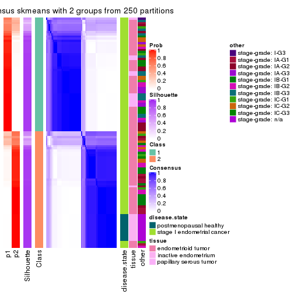</p>

</div>
<div id='tab-MAD-skmeans-consensus-heatmap-2'>
<pre><code class="r">consensus_heatmap(res, k = 3)
</code></pre>

<p>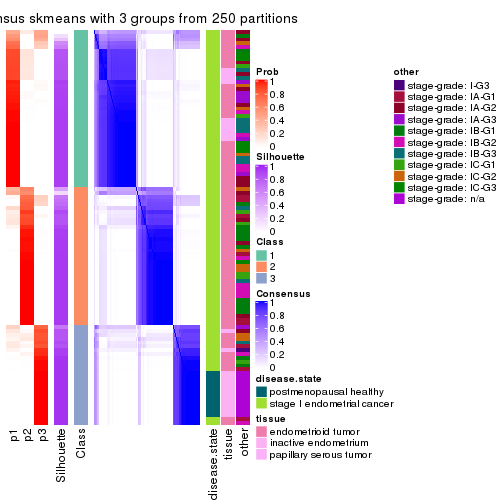</p>

</div>
<div id='tab-MAD-skmeans-consensus-heatmap-3'>
<pre><code class="r">consensus_heatmap(res, k = 4)
</code></pre>

<p>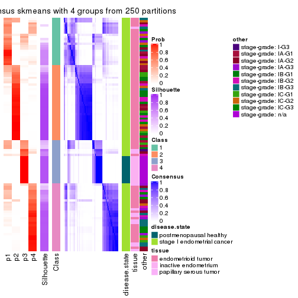</p>

</div>
<div id='tab-MAD-skmeans-consensus-heatmap-4'>
<pre><code class="r">consensus_heatmap(res, k = 5)
</code></pre>

<p>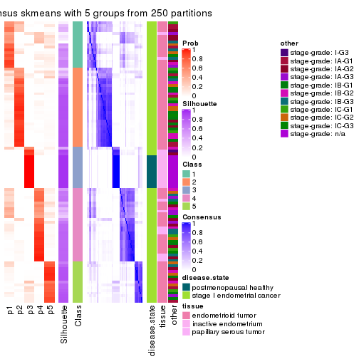</p>

</div>
<div id='tab-MAD-skmeans-consensus-heatmap-5'>
<pre><code class="r">consensus_heatmap(res, k = 6)
</code></pre>

<p>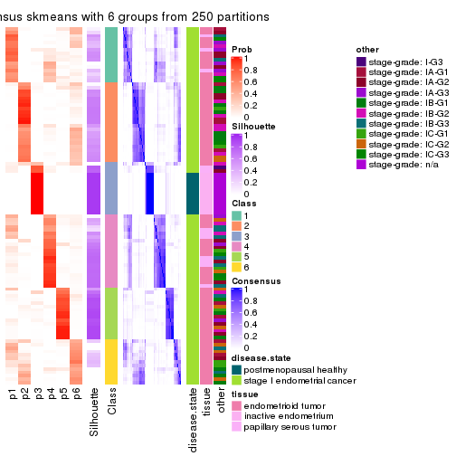</p>

</div>
</div>

Heatmaps for the membership of samples in all partitions to see how consistent they are:


<script>
$( function() {
	$( '#tabs-MAD-skmeans-membership-heatmap' ).tabs();
} );
</script>
<div id='tabs-MAD-skmeans-membership-heatmap'>
<ul>
<li><a href='#tab-MAD-skmeans-membership-heatmap-1'>k = 2</a></li>
<li><a href='#tab-MAD-skmeans-membership-heatmap-2'>k = 3</a></li>
<li><a href='#tab-MAD-skmeans-membership-heatmap-3'>k = 4</a></li>
<li><a href='#tab-MAD-skmeans-membership-heatmap-4'>k = 5</a></li>
<li><a href='#tab-MAD-skmeans-membership-heatmap-5'>k = 6</a></li>
</ul>
<div id='tab-MAD-skmeans-membership-heatmap-1'>
<pre><code class="r">membership_heatmap(res, k = 2)
</code></pre>

<p>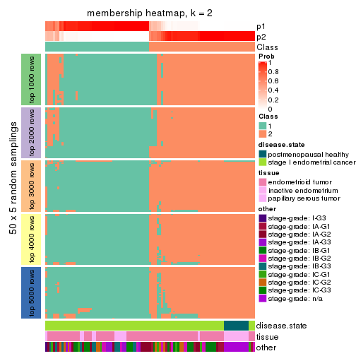</p>

</div>
<div id='tab-MAD-skmeans-membership-heatmap-2'>
<pre><code class="r">membership_heatmap(res, k = 3)
</code></pre>

<p>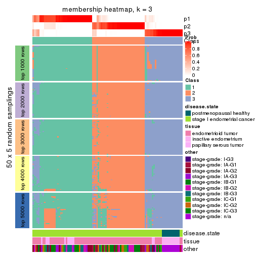</p>

</div>
<div id='tab-MAD-skmeans-membership-heatmap-3'>
<pre><code class="r">membership_heatmap(res, k = 4)
</code></pre>

<p>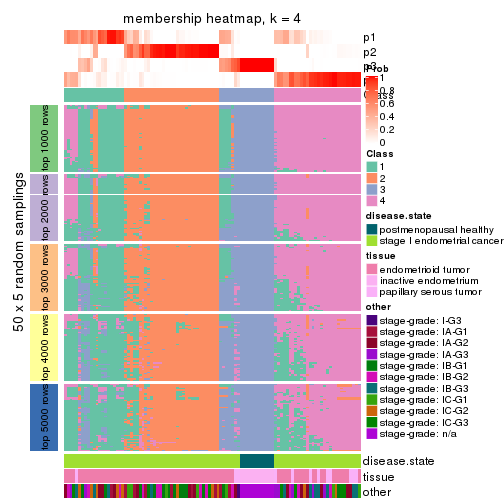</p>

</div>
<div id='tab-MAD-skmeans-membership-heatmap-4'>
<pre><code class="r">membership_heatmap(res, k = 5)
</code></pre>

<p>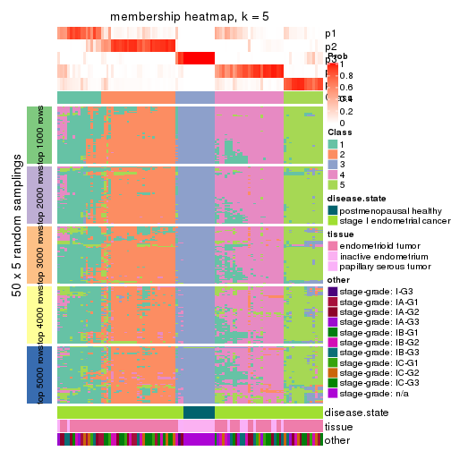</p>

</div>
<div id='tab-MAD-skmeans-membership-heatmap-5'>
<pre><code class="r">membership_heatmap(res, k = 6)
</code></pre>

<p>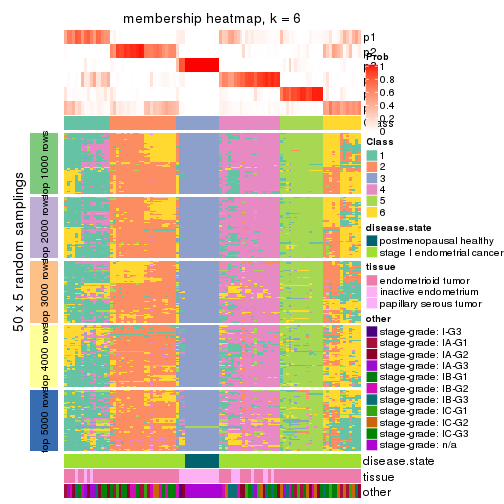</p>

</div>
</div>

As soon as we have had the classes for columns, we can look for signatures
which are significantly different between classes which can be candidate marks
for certain classes. Following are the heatmaps for signatures.


Signature heatmaps where rows are scaled:


<script>
$( function() {
	$( '#tabs-MAD-skmeans-get-signatures' ).tabs();
} );
</script>
<div id='tabs-MAD-skmeans-get-signatures'>
<ul>
<li><a href='#tab-MAD-skmeans-get-signatures-1'>k = 2</a></li>
<li><a href='#tab-MAD-skmeans-get-signatures-2'>k = 3</a></li>
<li><a href='#tab-MAD-skmeans-get-signatures-3'>k = 4</a></li>
<li><a href='#tab-MAD-skmeans-get-signatures-4'>k = 5</a></li>
<li><a href='#tab-MAD-skmeans-get-signatures-5'>k = 6</a></li>
</ul>
<div id='tab-MAD-skmeans-get-signatures-1'>
<pre><code class="r">get_signatures(res, k = 2)
</code></pre>

<p>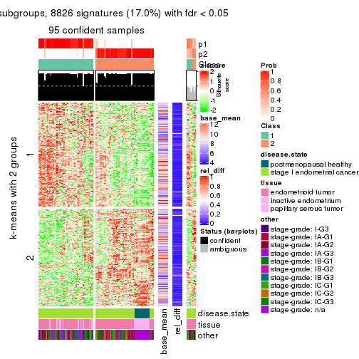</p>

</div>
<div id='tab-MAD-skmeans-get-signatures-2'>
<pre><code class="r">get_signatures(res, k = 3)
</code></pre>

<p>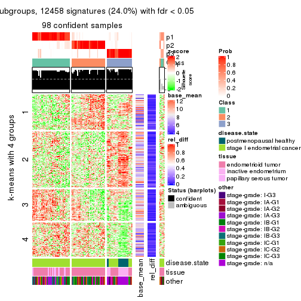</p>

</div>
<div id='tab-MAD-skmeans-get-signatures-3'>
<pre><code class="r">get_signatures(res, k = 4)
</code></pre>

<p>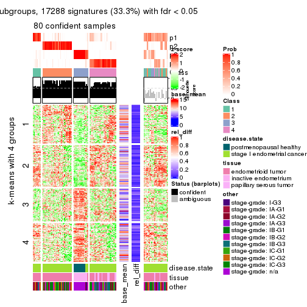</p>

</div>
<div id='tab-MAD-skmeans-get-signatures-4'>
<pre><code class="r">get_signatures(res, k = 5)
</code></pre>

<p>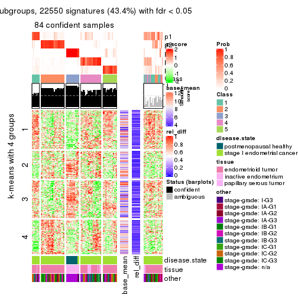</p>

</div>
<div id='tab-MAD-skmeans-get-signatures-5'>
<pre><code class="r">get_signatures(res, k = 6)
</code></pre>

<p>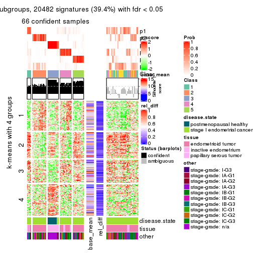</p>

</div>
</div>


Signature heatmaps where rows are not scaled:


<script>
$( function() {
	$( '#tabs-MAD-skmeans-get-signatures-no-scale' ).tabs();
} );
</script>
<div id='tabs-MAD-skmeans-get-signatures-no-scale'>
<ul>
<li><a href='#tab-MAD-skmeans-get-signatures-no-scale-1'>k = 2</a></li>
<li><a href='#tab-MAD-skmeans-get-signatures-no-scale-2'>k = 3</a></li>
<li><a href='#tab-MAD-skmeans-get-signatures-no-scale-3'>k = 4</a></li>
<li><a href='#tab-MAD-skmeans-get-signatures-no-scale-4'>k = 5</a></li>
<li><a href='#tab-MAD-skmeans-get-signatures-no-scale-5'>k = 6</a></li>
</ul>
<div id='tab-MAD-skmeans-get-signatures-no-scale-1'>
<pre><code class="r">get_signatures(res, k = 2, scale_rows = FALSE)
</code></pre>

<p>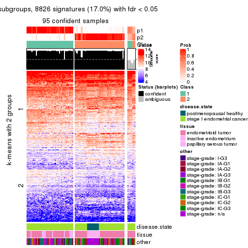</p>

</div>
<div id='tab-MAD-skmeans-get-signatures-no-scale-2'>
<pre><code class="r">get_signatures(res, k = 3, scale_rows = FALSE)
</code></pre>

<p>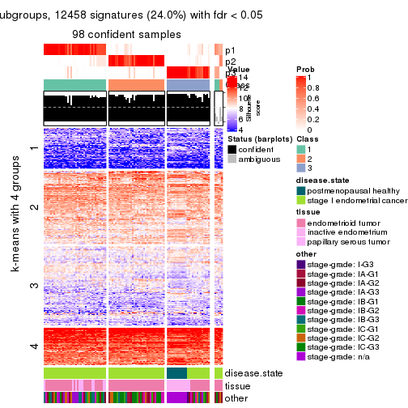</p>

</div>
<div id='tab-MAD-skmeans-get-signatures-no-scale-3'>
<pre><code class="r">get_signatures(res, k = 4, scale_rows = FALSE)
</code></pre>

<p>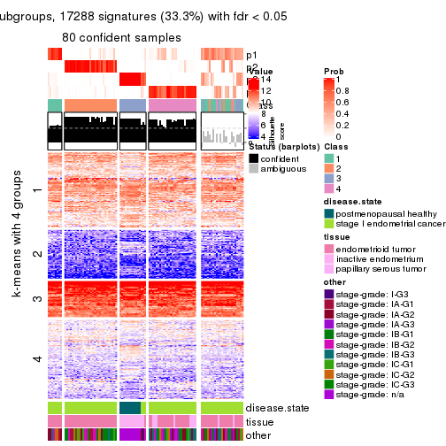</p>

</div>
<div id='tab-MAD-skmeans-get-signatures-no-scale-4'>
<pre><code class="r">get_signatures(res, k = 5, scale_rows = FALSE)
</code></pre>

<p>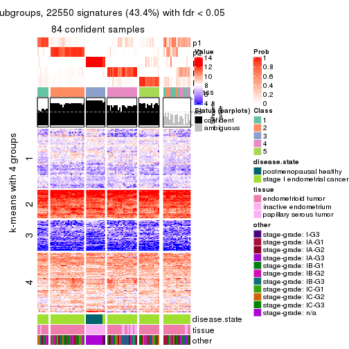</p>

</div>
<div id='tab-MAD-skmeans-get-signatures-no-scale-5'>
<pre><code class="r">get_signatures(res, k = 6, scale_rows = FALSE)
</code></pre>

<p>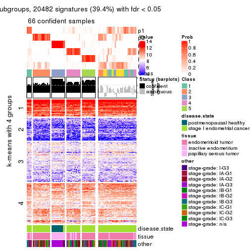</p>

</div>
</div>


Compare the overlap of signatures from different k:

```r
compare_signatures(res)
```

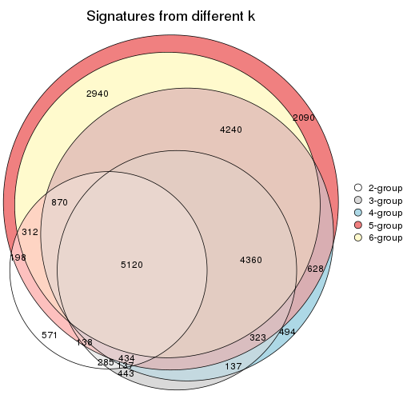

`get_signature()` returns a data frame invisibly. TO get the list of signatures, the function
call should be assigned to a variable explicitly. In following code, if `plot` argument is set
to `FALSE`, no heatmap is plotted while only the differential analysis is performed.

```r
# code only for demonstration
tb = get_signature(res, k = ..., plot = FALSE)
```

An example of the output of `tb` is:

```
#>   which_row         fdr    mean_1    mean_2 scaled_mean_1 scaled_mean_2 km
#> 1        38 0.042760348  8.373488  9.131774    -0.5533452     0.5164555  1
#> 2        40 0.018707592  7.106213  8.469186    -0.6173731     0.5762149  1
#> 3        55 0.019134737 10.221463 11.207825    -0.6159697     0.5749050  1
#> 4        59 0.006059896  5.921854  7.869574    -0.6899429     0.6439467  1
#> 5        60 0.018055526  8.928898 10.211722    -0.6204761     0.5791110  1
#> 6        98 0.009384629 15.714769 14.887706     0.6635654    -0.6193277  2
...
```

The columns in `tb` are:

1. `which_row`: row indices corresponding to the input matrix.
2. `fdr`: FDR for the differential test. 
3. `mean_x`: The mean value in group x.
4. `scaled_mean_x`: The mean value in group x after rows are scaled.
5. `km`: Row groups if k-means clustering is applied to rows.


UMAP plot which shows how samples are separated.


<script>
$( function() {
	$( '#tabs-MAD-skmeans-dimension-reduction' ).tabs();
} );
</script>
<div id='tabs-MAD-skmeans-dimension-reduction'>
<ul>
<li><a href='#tab-MAD-skmeans-dimension-reduction-1'>k = 2</a></li>
<li><a href='#tab-MAD-skmeans-dimension-reduction-2'>k = 3</a></li>
<li><a href='#tab-MAD-skmeans-dimension-reduction-3'>k = 4</a></li>
<li><a href='#tab-MAD-skmeans-dimension-reduction-4'>k = 5</a></li>
<li><a href='#tab-MAD-skmeans-dimension-reduction-5'>k = 6</a></li>
</ul>
<div id='tab-MAD-skmeans-dimension-reduction-1'>
<pre><code class="r">dimension_reduction(res, k = 2, method = &quot;UMAP&quot;)
</code></pre>

<p>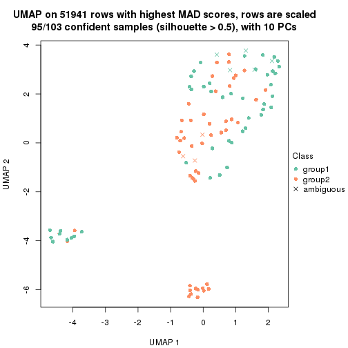</p>

</div>
<div id='tab-MAD-skmeans-dimension-reduction-2'>
<pre><code class="r">dimension_reduction(res, k = 3, method = &quot;UMAP&quot;)
</code></pre>

<p>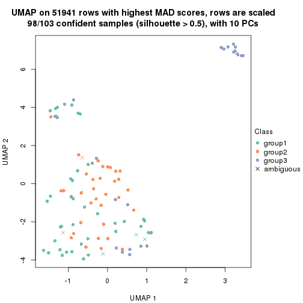</p>

</div>
<div id='tab-MAD-skmeans-dimension-reduction-3'>
<pre><code class="r">dimension_reduction(res, k = 4, method = &quot;UMAP&quot;)
</code></pre>

<p>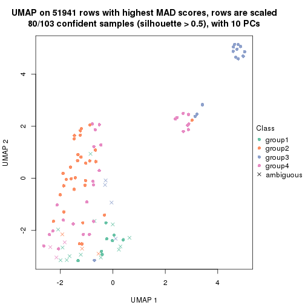</p>

</div>
<div id='tab-MAD-skmeans-dimension-reduction-4'>
<pre><code class="r">dimension_reduction(res, k = 5, method = &quot;UMAP&quot;)
</code></pre>

<p>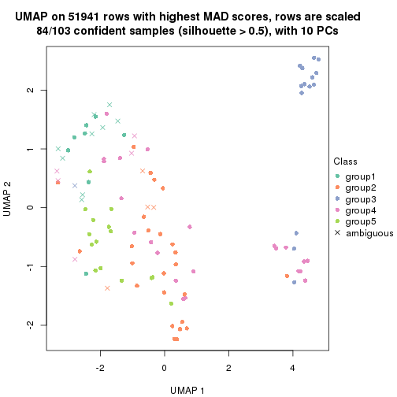</p>

</div>
<div id='tab-MAD-skmeans-dimension-reduction-5'>
<pre><code class="r">dimension_reduction(res, k = 6, method = &quot;UMAP&quot;)
</code></pre>

<p>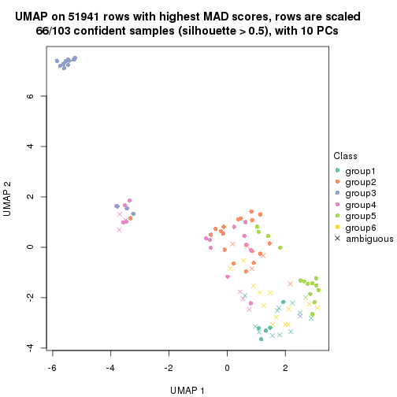</p>

</div>
</div>


Following heatmap shows how subgroups are split when increasing `k`:

```r
collect_classes(res)
```

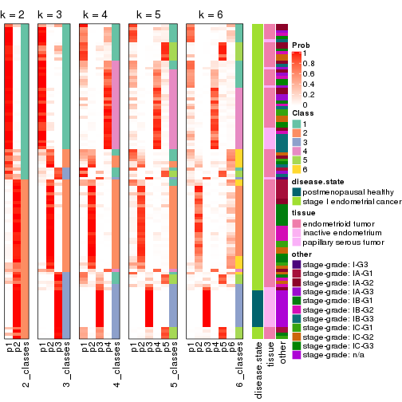


Test correlation between subgroups and known annotations. If the known
annotation is numeric, one-way ANOVA test is applied, and if the known
annotation is discrete, chi-squared contingency table test is applied.

```r
test_to_known_factors(res)
```

```
#>              n disease.state(p) tissue(p) other(p) k
#> MAD:skmeans 95         1.03e-03  3.96e-05 7.66e-07 2
#> MAD:skmeans 98         5.99e-09  4.25e-10 1.99e-08 3
#> MAD:skmeans 80         3.30e-13  2.34e-14 8.63e-11 4
#> MAD:skmeans 84         2.27e-14  2.37e-15 3.36e-08 5
#> MAD:skmeans 66         4.18e-11  4.68e-12 7.79e-06 6
```


If matrix rows can be associated to genes, consider to use `functional_enrichment(res,
...)` to perform function enrichment for the signature genes. See [this vignette](http://bioconductor.org/packages/devel/bioc/vignettes/cola/inst/doc/functional_enrichment.html) for more detailed explanations.


 

---------------------------------------------------


### MAD:pam


The object with results only for a single top-value method and a single partition method 
can be extracted as:

```r
res = res_list["MAD", "pam"]
# you can also extract it by
# res = res_list["MAD:pam"]
```

A summary of `res` and all the functions that can be applied to it:

```r
res
```

```
#> A 'ConsensusPartition' object with k = 2, 3, 4, 5, 6.
#>   On a matrix with 51941 rows and 103 columns.
#>   Top rows (1000, 2000, 3000, 4000, 5000) are extracted by 'MAD' method.
#>   Subgroups are detected by 'pam' method.
#>   Performed in total 1250 partitions by row resampling.
#>   Best k for subgroups seems to be 2.
#> 
#> Following methods can be applied to this 'ConsensusPartition' object:
#>  [1] "cola_report"             "collect_classes"         "collect_plots"          
#>  [4] "collect_stats"           "colnames"                "compare_signatures"     
#>  [7] "consensus_heatmap"       "dimension_reduction"     "functional_enrichment"  
#> [10] "get_anno_col"            "get_anno"                "get_classes"            
#> [13] "get_consensus"           "get_matrix"              "get_membership"         
#> [16] "get_param"               "get_signatures"          "get_stats"              
#> [19] "is_best_k"               "is_stable_k"             "membership_heatmap"     
#> [22] "ncol"                    "nrow"                    "plot_ecdf"              
#> [25] "rownames"                "select_partition_number" "show"                   
#> [28] "suggest_best_k"          "test_to_known_factors"
```

`collect_plots()` function collects all the plots made from `res` for all `k` (number of partitions)
into one single page to provide an easy and fast comparison between different `k`.

```r
collect_plots(res)
```

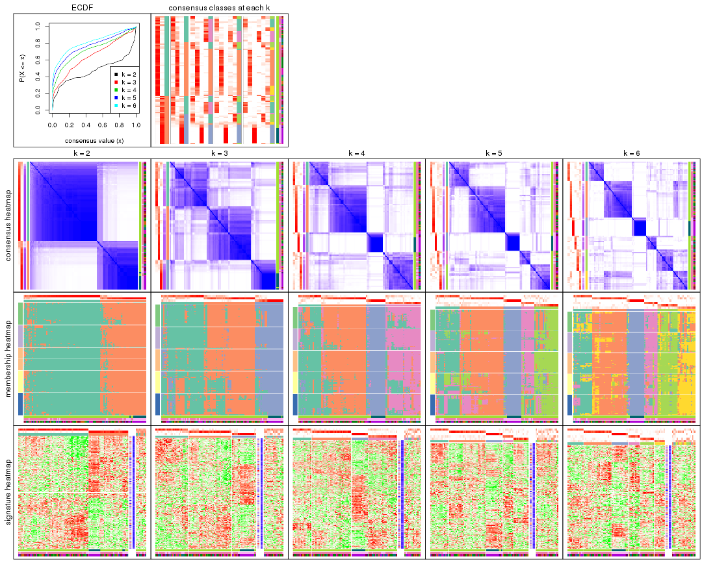

The plots are:

- The first row: a plot of the ECDF (empirical cumulative distribution
  function) curves of the consensus matrix for each `k` and the heatmap of
  predicted classes for each `k`.
- The second row: heatmaps of the consensus matrix for each `k`.
- The third row: heatmaps of the membership matrix for each `k`.
- The fouth row: heatmaps of the signatures for each `k`.

All the plots in panels can be made by individual functions and they are
plotted later in this section.

`select_partition_number()` produces several plots showing different
statistics for choosing "optimized" `k`. There are following statistics:

- ECDF curves of the consensus matrix for each `k`;
- 1-PAC. [The PAC
  score](https://en.wikipedia.org/wiki/Consensus_clustering#Over-interpretation_potential_of_consensus_clustering)
  measures the proportion of the ambiguous subgrouping.
- Mean silhouette score.
- Concordance. The mean probability of fiting the consensus class ids in all
  partitions.
- Area increased. Denote $A_k$ as the area under the ECDF curve for current
  `k`, the area increased is defined as $A_k - A_{k-1}$.
- Rand index. The percent of pairs of samples that are both in a same cluster
  or both are not in a same cluster in the partition of k and k-1.
- Jaccard index. The ratio of pairs of samples are both in a same cluster in
  the partition of k and k-1 and the pairs of samples are both in a same
  cluster in the partition k or k-1.

The detailed explanations of these statistics can be found in [the _cola_
vignette](http://bioconductor.org/packages/devel/bioc/vignettes/cola/inst/doc/cola.html#toc_13).

Generally speaking, lower PAC score, higher mean silhouette score or higher
concordance corresponds to better partition. Rand index and Jaccard index
measure how similar the current partition is compared to partition with `k-1`.
If they are too similar, we won't accept `k` is better than `k-1`.

```r
select_partition_number(res)
```

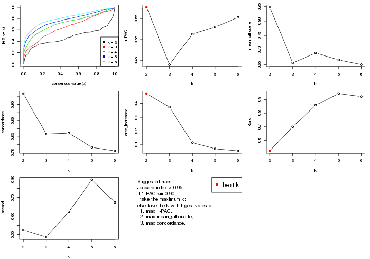

The numeric values for all these statistics can be obtained by `get_stats()`.

```r
get_stats(res)
```

```
#>   k 1-PAC mean_silhouette concordance area_increased  Rand Jaccard
#> 2 2 0.704           0.848       0.928         0.4739 0.525   0.525
#> 3 3 0.431           0.656       0.827         0.3738 0.700   0.486
#> 4 4 0.575           0.690       0.829         0.1124 0.857   0.624
#> 5 5 0.610           0.666       0.794         0.0679 0.943   0.796
#> 6 6 0.655           0.650       0.785         0.0530 0.921   0.674
```

`suggest_best_k()` suggests the best $k$ based on these statistics. The rules are as follows:

- All $k$ with Jaccard index larger than 0.95 are removed because increasing
  $k$ does not provide enough extra information. If all $k$ are removed, it is
  marked as no subgroup is detected.
- For all $k$ with 1-PAC score larger than 0.9, the maximal $k$ is taken as
  the best $k$, and other $k$ are marked as optional $k$.
- If it does not fit the second rule. The $k$ with the maximal vote of the
  highest 1-PAC score, highest mean silhouette, and highest concordance is
  taken as the best $k$.

```r
suggest_best_k(res)
```

```
#> [1] 2
```


Following shows the table of the partitions (You need to click the **show/hide
code output** link to see it). The membership matrix (columns with name `p*`)
is inferred by
[`clue::cl_consensus()`](https://www.rdocumentation.org/link/cl_consensus?package=clue)
function with the `SE` method. Basically the value in the membership matrix
represents the probability to belong to a certain group. The finall class
label for an item is determined with the group with highest probability it
belongs to.

In `get_classes()` function, the entropy is calculated from the membership
matrix and the silhouette score is calculated from the consensus matrix.


<script>
$( function() {
	$( '#tabs-MAD-pam-get-classes' ).tabs();
} );
</script>
<div id='tabs-MAD-pam-get-classes'>
<ul>
<li><a href='#tab-MAD-pam-get-classes-1'>k = 2</a></li>
<li><a href='#tab-MAD-pam-get-classes-2'>k = 3</a></li>
<li><a href='#tab-MAD-pam-get-classes-3'>k = 4</a></li>
<li><a href='#tab-MAD-pam-get-classes-4'>k = 5</a></li>
<li><a href='#tab-MAD-pam-get-classes-5'>k = 6</a></li>
</ul>

<div id='tab-MAD-pam-get-classes-1'>
<p><a id='tab-MAD-pam-get-classes-1-a' style='color:#0366d6' href='#'>show/hide code output</a></p>
<pre><code class="r">cbind(get_classes(res, k = 2), get_membership(res, k = 2))
</code></pre>

<pre><code>#&gt;           class entropy silhouette    p1    p2
#&gt; GSM425907     1  0.0000     0.9352 1.000 0.000
#&gt; GSM425908     1  0.0376     0.9345 0.996 0.004
#&gt; GSM425909     2  0.3431     0.8909 0.064 0.936
#&gt; GSM425910     1  0.7815     0.6880 0.768 0.232
#&gt; GSM425911     1  0.0938     0.9336 0.988 0.012
#&gt; GSM425912     1  0.0000     0.9352 1.000 0.000
#&gt; GSM425913     1  0.0938     0.9337 0.988 0.012
#&gt; GSM425914     1  0.0000     0.9352 1.000 0.000
#&gt; GSM425915     2  0.2778     0.8955 0.048 0.952
#&gt; GSM425874     1  0.0672     0.9336 0.992 0.008
#&gt; GSM425875     1  0.9970     0.0339 0.532 0.468
#&gt; GSM425876     2  0.9686     0.4313 0.396 0.604
#&gt; GSM425877     2  0.3114     0.8900 0.056 0.944
#&gt; GSM425878     1  0.0938     0.9342 0.988 0.012
#&gt; GSM425879     1  0.3114     0.9109 0.944 0.056
#&gt; GSM425880     2  0.0938     0.9035 0.012 0.988
#&gt; GSM425881     1  0.0376     0.9345 0.996 0.004
#&gt; GSM425882     1  0.0376     0.9345 0.996 0.004
#&gt; GSM425883     2  0.9977     0.2073 0.472 0.528
#&gt; GSM425884     2  0.4431     0.8674 0.092 0.908
#&gt; GSM425885     1  0.0672     0.9352 0.992 0.008
#&gt; GSM425848     1  0.6531     0.8047 0.832 0.168
#&gt; GSM425849     1  0.0672     0.9336 0.992 0.008
#&gt; GSM425850     1  0.0938     0.9352 0.988 0.012
#&gt; GSM425851     1  0.8327     0.6800 0.736 0.264
#&gt; GSM425852     2  0.0672     0.9035 0.008 0.992
#&gt; GSM425893     1  0.1633     0.9291 0.976 0.024
#&gt; GSM425894     1  0.0000     0.9352 1.000 0.000
#&gt; GSM425895     1  0.0000     0.9352 1.000 0.000
#&gt; GSM425896     1  0.0938     0.9338 0.988 0.012
#&gt; GSM425897     1  0.0376     0.9354 0.996 0.004
#&gt; GSM425898     1  0.2236     0.9225 0.964 0.036
#&gt; GSM425899     1  0.3274     0.9085 0.940 0.060
#&gt; GSM425900     1  0.5946     0.8305 0.856 0.144
#&gt; GSM425901     2  0.3431     0.8836 0.064 0.936
#&gt; GSM425902     1  0.3733     0.9013 0.928 0.072
#&gt; GSM425903     2  0.3879     0.8853 0.076 0.924
#&gt; GSM425904     2  0.0376     0.9028 0.004 0.996
#&gt; GSM425905     1  0.0000     0.9352 1.000 0.000
#&gt; GSM425906     1  0.0376     0.9352 0.996 0.004
#&gt; GSM425863     1  0.1184     0.9337 0.984 0.016
#&gt; GSM425864     1  0.0672     0.9350 0.992 0.008
#&gt; GSM425865     1  0.0000     0.9352 1.000 0.000
#&gt; GSM425866     2  0.9963     0.2237 0.464 0.536
#&gt; GSM425867     2  0.0376     0.9028 0.004 0.996
#&gt; GSM425868     1  0.0000     0.9352 1.000 0.000
#&gt; GSM425869     1  0.2778     0.9152 0.952 0.048
#&gt; GSM425870     2  0.3879     0.8858 0.076 0.924
#&gt; GSM425871     1  0.0672     0.9336 0.992 0.008
#&gt; GSM425872     1  0.0000     0.9352 1.000 0.000
#&gt; GSM425873     1  0.3879     0.8990 0.924 0.076
#&gt; GSM425843     2  0.7883     0.7229 0.236 0.764
#&gt; GSM425844     2  0.9833     0.3101 0.424 0.576
#&gt; GSM425845     1  0.9209     0.4762 0.664 0.336
#&gt; GSM425846     1  0.0000     0.9352 1.000 0.000
#&gt; GSM425847     1  0.0000     0.9352 1.000 0.000
#&gt; GSM425886     2  0.5842     0.8376 0.140 0.860
#&gt; GSM425887     1  0.0000     0.9352 1.000 0.000
#&gt; GSM425888     1  0.0376     0.9353 0.996 0.004
#&gt; GSM425889     2  0.5178     0.8506 0.116 0.884
#&gt; GSM425890     1  0.1414     0.9319 0.980 0.020
#&gt; GSM425891     1  0.3879     0.8963 0.924 0.076
#&gt; GSM425892     1  0.0000     0.9352 1.000 0.000
#&gt; GSM425853     1  0.5629     0.8496 0.868 0.132
#&gt; GSM425854     1  0.0000     0.9352 1.000 0.000
#&gt; GSM425855     2  0.2948     0.8943 0.052 0.948
#&gt; GSM425856     1  0.2423     0.9224 0.960 0.040
#&gt; GSM425857     1  0.6343     0.8197 0.840 0.160
#&gt; GSM425858     1  0.0000     0.9352 1.000 0.000
#&gt; GSM425859     1  0.0000     0.9352 1.000 0.000
#&gt; GSM425860     2  0.2948     0.8934 0.052 0.948
#&gt; GSM425861     1  0.0376     0.9345 0.996 0.004
#&gt; GSM425862     1  0.2778     0.9152 0.952 0.048
#&gt; GSM425837     1  0.9491     0.4211 0.632 0.368
#&gt; GSM425838     1  0.1633     0.9302 0.976 0.024
#&gt; GSM425839     1  0.3274     0.9063 0.940 0.060
#&gt; GSM425840     2  0.3584     0.8855 0.068 0.932
#&gt; GSM425841     1  0.0938     0.9348 0.988 0.012
#&gt; GSM425842     1  0.6048     0.8148 0.852 0.148
#&gt; GSM425917     2  0.0376     0.9028 0.004 0.996
#&gt; GSM425922     1  0.2043     0.9294 0.968 0.032
#&gt; GSM425919     2  0.0376     0.9028 0.004 0.996
#&gt; GSM425920     2  0.5842     0.8278 0.140 0.860
#&gt; GSM425923     1  0.9983     0.0318 0.524 0.476
#&gt; GSM425916     2  0.1184     0.9011 0.016 0.984
#&gt; GSM425918     1  0.1414     0.9332 0.980 0.020
#&gt; GSM425921     1  0.2423     0.9247 0.960 0.040
#&gt; GSM425925     1  0.1843     0.9303 0.972 0.028
#&gt; GSM425926     1  0.0938     0.9338 0.988 0.012
#&gt; GSM425927     2  0.9933     0.2573 0.452 0.548
#&gt; GSM425924     2  0.0376     0.9028 0.004 0.996
#&gt; GSM425928     2  0.0672     0.9038 0.008 0.992
#&gt; GSM425929     2  0.0672     0.9038 0.008 0.992
#&gt; GSM425930     2  0.0672     0.9038 0.008 0.992
#&gt; GSM425931     2  0.0376     0.9028 0.004 0.996
#&gt; GSM425932     2  0.0672     0.9038 0.008 0.992
#&gt; GSM425933     2  0.0672     0.9038 0.008 0.992
#&gt; GSM425934     2  0.0672     0.9038 0.008 0.992
#&gt; GSM425935     2  0.0672     0.9038 0.008 0.992
#&gt; GSM425936     2  0.0672     0.9038 0.008 0.992
#&gt; GSM425937     2  0.0672     0.9038 0.008 0.992
#&gt; GSM425938     2  0.0672     0.9038 0.008 0.992
#&gt; GSM425939     2  0.0672     0.9038 0.008 0.992
</code></pre>

<script>
$('#tab-MAD-pam-get-classes-1-a').parent().next().next().hide();
$('#tab-MAD-pam-get-classes-1-a').click(function(){
  $('#tab-MAD-pam-get-classes-1-a').parent().next().next().toggle();
  return(false);
});
</script>
</div>

<div id='tab-MAD-pam-get-classes-2'>
<p><a id='tab-MAD-pam-get-classes-2-a' style='color:#0366d6' href='#'>show/hide code output</a></p>
<pre><code class="r">cbind(get_classes(res, k = 3), get_membership(res, k = 3))
</code></pre>

<pre><code>#&gt;           class entropy silhouette    p1    p2    p3
#&gt; GSM425907     2  0.0747     0.8016 0.016 0.984 0.000
#&gt; GSM425908     2  0.1860     0.8005 0.052 0.948 0.000
#&gt; GSM425909     3  0.8055     0.2528 0.440 0.064 0.496
#&gt; GSM425910     2  0.8297     0.4551 0.348 0.560 0.092
#&gt; GSM425911     2  0.1529     0.8032 0.040 0.960 0.000
#&gt; GSM425912     2  0.5591     0.6412 0.304 0.696 0.000
#&gt; GSM425913     2  0.0829     0.8015 0.004 0.984 0.012
#&gt; GSM425914     2  0.5760     0.5962 0.328 0.672 0.000
#&gt; GSM425915     3  0.6283     0.7025 0.064 0.176 0.760
#&gt; GSM425874     1  0.5859     0.5621 0.656 0.344 0.000
#&gt; GSM425875     1  0.7785     0.4920 0.672 0.192 0.136
#&gt; GSM425876     1  0.9544     0.0235 0.464 0.328 0.208
#&gt; GSM425877     1  0.1129     0.7274 0.976 0.004 0.020
#&gt; GSM425878     1  0.5553     0.5359 0.724 0.272 0.004
#&gt; GSM425879     2  0.4139     0.7518 0.016 0.860 0.124
#&gt; GSM425880     1  0.6952    -0.1926 0.504 0.016 0.480
#&gt; GSM425881     2  0.4931     0.7182 0.232 0.768 0.000
#&gt; GSM425882     2  0.1964     0.8013 0.056 0.944 0.000
#&gt; GSM425883     1  0.1585     0.7315 0.964 0.028 0.008
#&gt; GSM425884     1  0.1585     0.7235 0.964 0.008 0.028
#&gt; GSM425885     2  0.3816     0.6540 0.148 0.852 0.000
#&gt; GSM425848     1  0.1031     0.7344 0.976 0.024 0.000
#&gt; GSM425849     1  0.0000     0.7281 1.000 0.000 0.000
#&gt; GSM425850     2  0.6298     0.4298 0.388 0.608 0.004
#&gt; GSM425851     1  0.8840     0.3330 0.456 0.428 0.116
#&gt; GSM425852     3  0.5493     0.6345 0.232 0.012 0.756
#&gt; GSM425893     2  0.6090     0.6529 0.264 0.716 0.020
#&gt; GSM425894     2  0.0000     0.7998 0.000 1.000 0.000
#&gt; GSM425895     2  0.1529     0.8033 0.040 0.960 0.000
#&gt; GSM425896     2  0.1031     0.8053 0.024 0.976 0.000
#&gt; GSM425897     2  0.1163     0.8052 0.028 0.972 0.000
#&gt; GSM425898     2  0.3038     0.7632 0.000 0.896 0.104
#&gt; GSM425899     2  0.4504     0.7326 0.196 0.804 0.000
#&gt; GSM425900     2  0.6388     0.6820 0.064 0.752 0.184
#&gt; GSM425901     3  0.8404     0.1757 0.452 0.084 0.464
#&gt; GSM425902     1  0.6608     0.4424 0.560 0.432 0.008
#&gt; GSM425903     3  0.9423     0.3222 0.320 0.196 0.484
#&gt; GSM425904     1  0.5884     0.4528 0.716 0.012 0.272
#&gt; GSM425905     2  0.1031     0.8036 0.024 0.976 0.000
#&gt; GSM425906     2  0.1031     0.8036 0.024 0.976 0.000
#&gt; GSM425863     1  0.0892     0.7339 0.980 0.020 0.000
#&gt; GSM425864     2  0.0592     0.8035 0.012 0.988 0.000
#&gt; GSM425865     2  0.1031     0.8036 0.024 0.976 0.000
#&gt; GSM425866     1  0.8729     0.3601 0.592 0.204 0.204
#&gt; GSM425867     3  0.2584     0.8183 0.064 0.008 0.928
#&gt; GSM425868     2  0.1031     0.7980 0.024 0.976 0.000
#&gt; GSM425869     2  0.0237     0.7998 0.000 0.996 0.004
#&gt; GSM425870     3  0.7147     0.6691 0.124 0.156 0.720
#&gt; GSM425871     2  0.6309    -0.2295 0.500 0.500 0.000
#&gt; GSM425872     2  0.2878     0.7863 0.096 0.904 0.000
#&gt; GSM425873     1  0.3851     0.6404 0.860 0.136 0.004
#&gt; GSM425843     1  0.0424     0.7289 0.992 0.000 0.008
#&gt; GSM425844     1  0.6974     0.6468 0.728 0.104 0.168
#&gt; GSM425845     2  0.8288     0.4817 0.332 0.572 0.096
#&gt; GSM425846     2  0.3941     0.7619 0.156 0.844 0.000
#&gt; GSM425847     2  0.4750     0.7316 0.216 0.784 0.000
#&gt; GSM425886     3  0.7447     0.6345 0.120 0.184 0.696
#&gt; GSM425887     2  0.5785     0.6060 0.332 0.668 0.000
#&gt; GSM425888     2  0.3941     0.7643 0.156 0.844 0.000
#&gt; GSM425889     1  0.5951     0.6296 0.764 0.040 0.196
#&gt; GSM425890     2  0.6305    -0.2455 0.484 0.516 0.000
#&gt; GSM425891     2  0.1636     0.8050 0.020 0.964 0.016
#&gt; GSM425892     2  0.0000     0.7998 0.000 1.000 0.000
#&gt; GSM425853     1  0.2384     0.7267 0.936 0.056 0.008
#&gt; GSM425854     2  0.0747     0.8016 0.016 0.984 0.000
#&gt; GSM425855     1  0.4645     0.6501 0.816 0.008 0.176
#&gt; GSM425856     2  0.6155     0.5875 0.328 0.664 0.008
#&gt; GSM425857     2  0.6001     0.5860 0.144 0.784 0.072
#&gt; GSM425858     2  0.4121     0.7594 0.168 0.832 0.000
#&gt; GSM425859     2  0.0592     0.7999 0.012 0.988 0.000
#&gt; GSM425860     3  0.6488     0.6836 0.064 0.192 0.744
#&gt; GSM425861     2  0.6180     0.4855 0.416 0.584 0.000
#&gt; GSM425862     1  0.5497     0.6143 0.708 0.292 0.000
#&gt; GSM425837     1  0.0000     0.7281 1.000 0.000 0.000
#&gt; GSM425838     1  0.5529     0.6026 0.704 0.296 0.000
#&gt; GSM425839     2  0.0237     0.7998 0.000 0.996 0.004
#&gt; GSM425840     1  0.3482     0.6875 0.872 0.000 0.128
#&gt; GSM425841     1  0.5905     0.5668 0.648 0.352 0.000
#&gt; GSM425842     1  0.1753     0.7238 0.952 0.048 0.000
#&gt; GSM425917     3  0.0000     0.8500 0.000 0.000 1.000
#&gt; GSM425922     1  0.6168     0.4664 0.588 0.412 0.000
#&gt; GSM425919     3  0.4469     0.7856 0.076 0.060 0.864
#&gt; GSM425920     1  0.6126     0.5531 0.712 0.020 0.268
#&gt; GSM425923     1  0.0424     0.7287 0.992 0.000 0.008
#&gt; GSM425916     1  0.5431     0.5385 0.716 0.000 0.284
#&gt; GSM425918     1  0.3941     0.6924 0.844 0.156 0.000
#&gt; GSM425921     1  0.5859     0.5608 0.656 0.344 0.000
#&gt; GSM425925     1  0.0892     0.7320 0.980 0.020 0.000
#&gt; GSM425926     1  0.5785     0.5760 0.668 0.332 0.000
#&gt; GSM425927     1  0.4636     0.6502 0.848 0.116 0.036
#&gt; GSM425924     3  0.1636     0.8378 0.020 0.016 0.964
#&gt; GSM425928     3  0.0000     0.8500 0.000 0.000 1.000
#&gt; GSM425929     3  0.0000     0.8500 0.000 0.000 1.000
#&gt; GSM425930     3  0.0000     0.8500 0.000 0.000 1.000
#&gt; GSM425931     3  0.0000     0.8500 0.000 0.000 1.000
#&gt; GSM425932     3  0.0000     0.8500 0.000 0.000 1.000
#&gt; GSM425933     3  0.0000     0.8500 0.000 0.000 1.000
#&gt; GSM425934     3  0.0000     0.8500 0.000 0.000 1.000
#&gt; GSM425935     3  0.0000     0.8500 0.000 0.000 1.000
#&gt; GSM425936     3  0.0000     0.8500 0.000 0.000 1.000
#&gt; GSM425937     3  0.0000     0.8500 0.000 0.000 1.000
#&gt; GSM425938     3  0.0000     0.8500 0.000 0.000 1.000
#&gt; GSM425939     3  0.0000     0.8500 0.000 0.000 1.000
</code></pre>

<script>
$('#tab-MAD-pam-get-classes-2-a').parent().next().next().hide();
$('#tab-MAD-pam-get-classes-2-a').click(function(){
  $('#tab-MAD-pam-get-classes-2-a').parent().next().next().toggle();
  return(false);
});
</script>
</div>

<div id='tab-MAD-pam-get-classes-3'>
<p><a id='tab-MAD-pam-get-classes-3-a' style='color:#0366d6' href='#'>show/hide code output</a></p>
<pre><code class="r">cbind(get_classes(res, k = 4), get_membership(res, k = 4))
</code></pre>

<pre><code>#&gt;           class entropy silhouette    p1    p2    p3    p4
#&gt; GSM425907     2  0.0000      0.850 0.000 1.000 0.000 0.000
#&gt; GSM425908     2  0.1109      0.852 0.028 0.968 0.000 0.004
#&gt; GSM425909     1  0.2965      0.740 0.892 0.036 0.072 0.000
#&gt; GSM425910     1  0.4632      0.509 0.688 0.308 0.000 0.004
#&gt; GSM425911     2  0.2466      0.831 0.096 0.900 0.000 0.004
#&gt; GSM425912     2  0.3791      0.751 0.200 0.796 0.000 0.004
#&gt; GSM425913     2  0.0524      0.852 0.008 0.988 0.004 0.000
#&gt; GSM425914     2  0.5060      0.354 0.412 0.584 0.000 0.004
#&gt; GSM425915     1  0.6327      0.630 0.652 0.132 0.216 0.000
#&gt; GSM425874     4  0.0469      0.713 0.000 0.012 0.000 0.988
#&gt; GSM425875     1  0.0188      0.720 0.996 0.000 0.000 0.004
#&gt; GSM425876     1  0.5726      0.644 0.728 0.196 0.024 0.052
#&gt; GSM425877     4  0.3668      0.727 0.188 0.000 0.004 0.808
#&gt; GSM425878     4  0.7910      0.249 0.316 0.320 0.000 0.364
#&gt; GSM425879     2  0.2400      0.842 0.028 0.924 0.044 0.004
#&gt; GSM425880     1  0.1302      0.725 0.956 0.000 0.044 0.000
#&gt; GSM425881     2  0.3751      0.759 0.196 0.800 0.000 0.004
#&gt; GSM425882     2  0.1661      0.844 0.052 0.944 0.000 0.004
#&gt; GSM425883     1  0.5832      0.490 0.708 0.040 0.028 0.224
#&gt; GSM425884     4  0.4804      0.602 0.384 0.000 0.000 0.616
#&gt; GSM425885     2  0.3523      0.744 0.032 0.856 0.000 0.112
#&gt; GSM425848     4  0.4008      0.710 0.244 0.000 0.000 0.756
#&gt; GSM425849     4  0.3610      0.730 0.200 0.000 0.000 0.800
#&gt; GSM425850     2  0.6639      0.527 0.160 0.640 0.004 0.196
#&gt; GSM425851     4  0.9171      0.295 0.084 0.268 0.244 0.404
#&gt; GSM425852     1  0.6148      0.468 0.636 0.000 0.280 0.084
#&gt; GSM425893     1  0.4522      0.561 0.680 0.320 0.000 0.000
#&gt; GSM425894     2  0.0376      0.851 0.004 0.992 0.000 0.004
#&gt; GSM425895     2  0.2216      0.829 0.092 0.908 0.000 0.000
#&gt; GSM425896     2  0.1398      0.851 0.040 0.956 0.000 0.004
#&gt; GSM425897     2  0.2197      0.838 0.080 0.916 0.000 0.004
#&gt; GSM425898     2  0.2494      0.832 0.048 0.916 0.036 0.000
#&gt; GSM425899     2  0.4088      0.692 0.232 0.764 0.000 0.004
#&gt; GSM425900     2  0.4245      0.774 0.116 0.820 0.064 0.000
#&gt; GSM425901     1  0.2189      0.728 0.932 0.020 0.044 0.004
#&gt; GSM425902     4  0.7182     -0.124 0.412 0.136 0.000 0.452
#&gt; GSM425903     1  0.2670      0.743 0.908 0.052 0.040 0.000
#&gt; GSM425904     1  0.1637      0.721 0.940 0.000 0.060 0.000
#&gt; GSM425905     2  0.0524      0.853 0.008 0.988 0.000 0.004
#&gt; GSM425906     2  0.0524      0.853 0.008 0.988 0.000 0.004
#&gt; GSM425863     4  0.4175      0.722 0.200 0.016 0.000 0.784
#&gt; GSM425864     2  0.0524      0.853 0.008 0.988 0.000 0.004
#&gt; GSM425865     2  0.0524      0.853 0.008 0.988 0.000 0.004
#&gt; GSM425866     1  0.0188      0.723 0.996 0.000 0.004 0.000
#&gt; GSM425867     3  0.5000     -0.131 0.496 0.000 0.504 0.000
#&gt; GSM425868     2  0.0000      0.850 0.000 1.000 0.000 0.000
#&gt; GSM425869     2  0.2011      0.825 0.000 0.920 0.000 0.080
#&gt; GSM425870     1  0.7325      0.440 0.516 0.152 0.328 0.004
#&gt; GSM425871     2  0.7222      0.119 0.172 0.528 0.000 0.300
#&gt; GSM425872     2  0.2530      0.821 0.112 0.888 0.000 0.000
#&gt; GSM425873     4  0.6160      0.592 0.316 0.072 0.000 0.612
#&gt; GSM425843     4  0.3907      0.715 0.232 0.000 0.000 0.768
#&gt; GSM425844     4  0.5287      0.723 0.144 0.036 0.044 0.776
#&gt; GSM425845     1  0.4576      0.611 0.728 0.260 0.012 0.000
#&gt; GSM425846     2  0.2216      0.830 0.092 0.908 0.000 0.000
#&gt; GSM425847     2  0.3448      0.786 0.168 0.828 0.000 0.004
#&gt; GSM425886     1  0.5820      0.622 0.696 0.100 0.204 0.000
#&gt; GSM425887     2  0.4655      0.597 0.312 0.684 0.000 0.004
#&gt; GSM425888     2  0.2149      0.833 0.088 0.912 0.000 0.000
#&gt; GSM425889     4  0.5296     -0.175 0.492 0.000 0.008 0.500
#&gt; GSM425890     4  0.5150      0.294 0.008 0.396 0.000 0.596
#&gt; GSM425891     2  0.0592      0.853 0.016 0.984 0.000 0.000
#&gt; GSM425892     2  0.0000      0.850 0.000 1.000 0.000 0.000
#&gt; GSM425853     1  0.3539      0.519 0.820 0.004 0.000 0.176
#&gt; GSM425854     2  0.0188      0.852 0.004 0.996 0.000 0.000
#&gt; GSM425855     4  0.4931      0.717 0.132 0.000 0.092 0.776
#&gt; GSM425856     1  0.2081      0.733 0.916 0.084 0.000 0.000
#&gt; GSM425857     1  0.4854      0.564 0.676 0.316 0.004 0.004
#&gt; GSM425858     2  0.2466      0.829 0.096 0.900 0.000 0.004
#&gt; GSM425859     2  0.0000      0.850 0.000 1.000 0.000 0.000
#&gt; GSM425860     2  0.9708     -0.195 0.212 0.348 0.280 0.160
#&gt; GSM425861     2  0.6943      0.421 0.264 0.576 0.000 0.160
#&gt; GSM425862     4  0.3885      0.690 0.092 0.064 0.000 0.844
#&gt; GSM425837     4  0.4431      0.675 0.304 0.000 0.000 0.696
#&gt; GSM425838     4  0.3056      0.719 0.040 0.072 0.000 0.888
#&gt; GSM425839     2  0.0000      0.850 0.000 1.000 0.000 0.000
#&gt; GSM425840     4  0.5397      0.703 0.212 0.000 0.068 0.720
#&gt; GSM425841     4  0.2469      0.704 0.000 0.108 0.000 0.892
#&gt; GSM425842     4  0.6186      0.554 0.352 0.064 0.000 0.584
#&gt; GSM425917     3  0.2011      0.858 0.000 0.000 0.920 0.080
#&gt; GSM425922     4  0.3801      0.577 0.000 0.220 0.000 0.780
#&gt; GSM425919     3  0.7439      0.492 0.096 0.116 0.648 0.140
#&gt; GSM425920     4  0.3652      0.730 0.064 0.008 0.060 0.868
#&gt; GSM425923     4  0.2149      0.738 0.088 0.000 0.000 0.912
#&gt; GSM425916     4  0.5018      0.702 0.144 0.000 0.088 0.768
#&gt; GSM425918     4  0.3372      0.742 0.096 0.036 0.000 0.868
#&gt; GSM425921     4  0.0188      0.712 0.000 0.004 0.000 0.996
#&gt; GSM425925     4  0.1854      0.728 0.048 0.012 0.000 0.940
#&gt; GSM425926     4  0.2334      0.713 0.004 0.088 0.000 0.908
#&gt; GSM425927     4  0.6530      0.640 0.248 0.068 0.028 0.656
#&gt; GSM425924     3  0.3615      0.822 0.016 0.036 0.872 0.076
#&gt; GSM425928     3  0.0000      0.920 0.000 0.000 1.000 0.000
#&gt; GSM425929     3  0.0000      0.920 0.000 0.000 1.000 0.000
#&gt; GSM425930     3  0.0188      0.917 0.004 0.000 0.996 0.000
#&gt; GSM425931     3  0.0000      0.920 0.000 0.000 1.000 0.000
#&gt; GSM425932     3  0.0000      0.920 0.000 0.000 1.000 0.000
#&gt; GSM425933     3  0.0000      0.920 0.000 0.000 1.000 0.000
#&gt; GSM425934     3  0.0000      0.920 0.000 0.000 1.000 0.000
#&gt; GSM425935     3  0.0000      0.920 0.000 0.000 1.000 0.000
#&gt; GSM425936     3  0.0000      0.920 0.000 0.000 1.000 0.000
#&gt; GSM425937     3  0.0000      0.920 0.000 0.000 1.000 0.000
#&gt; GSM425938     3  0.0000      0.920 0.000 0.000 1.000 0.000
#&gt; GSM425939     3  0.0000      0.920 0.000 0.000 1.000 0.000
</code></pre>

<script>
$('#tab-MAD-pam-get-classes-3-a').parent().next().next().hide();
$('#tab-MAD-pam-get-classes-3-a').click(function(){
  $('#tab-MAD-pam-get-classes-3-a').parent().next().next().toggle();
  return(false);
});
</script>
</div>

<div id='tab-MAD-pam-get-classes-4'>
<p><a id='tab-MAD-pam-get-classes-4-a' style='color:#0366d6' href='#'>show/hide code output</a></p>
<pre><code class="r">cbind(get_classes(res, k = 5), get_membership(res, k = 5))
</code></pre>

<pre><code>#&gt;           class entropy silhouette    p1    p2    p3    p4    p5
#&gt; GSM425907     2  0.0609      0.810 0.000 0.980 0.000 0.020 0.000
#&gt; GSM425908     2  0.1704      0.812 0.004 0.928 0.000 0.068 0.000
#&gt; GSM425909     5  0.0162      0.692 0.000 0.000 0.004 0.000 0.996
#&gt; GSM425910     5  0.7892      0.166 0.100 0.308 0.000 0.184 0.408
#&gt; GSM425911     2  0.4025      0.748 0.024 0.780 0.000 0.184 0.012
#&gt; GSM425912     2  0.6232      0.641 0.052 0.644 0.000 0.184 0.120
#&gt; GSM425913     2  0.0771      0.812 0.000 0.976 0.000 0.004 0.020
#&gt; GSM425914     2  0.7415      0.401 0.076 0.504 0.000 0.184 0.236
#&gt; GSM425915     5  0.4653      0.653 0.012 0.120 0.092 0.004 0.772
#&gt; GSM425874     4  0.3424      0.707 0.240 0.000 0.000 0.760 0.000
#&gt; GSM425875     5  0.2751      0.679 0.056 0.004 0.000 0.052 0.888
#&gt; GSM425876     5  0.8374      0.379 0.132 0.216 0.020 0.184 0.448
#&gt; GSM425877     1  0.4827      0.614 0.724 0.000 0.000 0.160 0.116
#&gt; GSM425878     1  0.7700      0.384 0.496 0.188 0.000 0.188 0.128
#&gt; GSM425879     2  0.2824      0.804 0.000 0.880 0.024 0.088 0.008
#&gt; GSM425880     5  0.0794      0.694 0.028 0.000 0.000 0.000 0.972
#&gt; GSM425881     2  0.6604      0.614 0.076 0.616 0.000 0.188 0.120
#&gt; GSM425882     2  0.3073      0.785 0.024 0.856 0.000 0.116 0.004
#&gt; GSM425883     5  0.5394      0.298 0.384 0.004 0.000 0.052 0.560
#&gt; GSM425884     1  0.3884      0.604 0.708 0.004 0.000 0.000 0.288
#&gt; GSM425885     2  0.4418      0.343 0.000 0.652 0.000 0.332 0.016
#&gt; GSM425848     1  0.3921      0.630 0.800 0.000 0.000 0.128 0.072
#&gt; GSM425849     1  0.3732      0.667 0.820 0.004 0.000 0.120 0.056
#&gt; GSM425850     2  0.7084      0.179 0.368 0.428 0.004 0.180 0.020
#&gt; GSM425851     1  0.7410      0.298 0.520 0.192 0.200 0.088 0.000
#&gt; GSM425852     5  0.5354      0.530 0.140 0.000 0.192 0.000 0.668
#&gt; GSM425893     5  0.6221      0.419 0.024 0.304 0.000 0.100 0.572
#&gt; GSM425894     2  0.1310      0.811 0.000 0.956 0.000 0.020 0.024
#&gt; GSM425895     2  0.3997      0.782 0.024 0.808 0.000 0.136 0.032
#&gt; GSM425896     2  0.2732      0.799 0.008 0.884 0.000 0.088 0.020
#&gt; GSM425897     2  0.2914      0.794 0.016 0.872 0.000 0.100 0.012
#&gt; GSM425898     2  0.3166      0.777 0.000 0.860 0.016 0.020 0.104
#&gt; GSM425899     2  0.4371      0.629 0.012 0.708 0.000 0.012 0.268
#&gt; GSM425900     2  0.4034      0.745 0.004 0.804 0.036 0.012 0.144
#&gt; GSM425901     5  0.0740      0.689 0.004 0.008 0.000 0.008 0.980
#&gt; GSM425902     4  0.4592      0.626 0.012 0.036 0.000 0.728 0.224
#&gt; GSM425903     5  0.0807      0.696 0.012 0.000 0.000 0.012 0.976
#&gt; GSM425904     5  0.0510      0.694 0.016 0.000 0.000 0.000 0.984
#&gt; GSM425905     2  0.0000      0.813 0.000 1.000 0.000 0.000 0.000
#&gt; GSM425906     2  0.0404      0.815 0.000 0.988 0.000 0.012 0.000
#&gt; GSM425863     1  0.3913      0.699 0.824 0.036 0.000 0.032 0.108
#&gt; GSM425864     2  0.0162      0.813 0.000 0.996 0.000 0.004 0.000
#&gt; GSM425865     2  0.0404      0.811 0.000 0.988 0.000 0.012 0.000
#&gt; GSM425866     5  0.1043      0.691 0.040 0.000 0.000 0.000 0.960
#&gt; GSM425867     5  0.4464      0.313 0.008 0.000 0.408 0.000 0.584
#&gt; GSM425868     2  0.0865      0.810 0.004 0.972 0.000 0.024 0.000
#&gt; GSM425869     2  0.2929      0.721 0.000 0.820 0.000 0.180 0.000
#&gt; GSM425870     5  0.8982      0.391 0.036 0.176 0.236 0.184 0.368
#&gt; GSM425871     1  0.6477      0.152 0.464 0.420 0.000 0.080 0.036
#&gt; GSM425872     2  0.3141      0.763 0.000 0.832 0.000 0.016 0.152
#&gt; GSM425873     1  0.5740      0.546 0.656 0.012 0.000 0.184 0.148
#&gt; GSM425843     1  0.1992      0.698 0.924 0.000 0.000 0.032 0.044
#&gt; GSM425844     1  0.3642      0.611 0.760 0.008 0.000 0.232 0.000
#&gt; GSM425845     5  0.4915      0.564 0.048 0.240 0.000 0.012 0.700
#&gt; GSM425846     2  0.3209      0.798 0.008 0.864 0.000 0.068 0.060
#&gt; GSM425847     2  0.5287      0.715 0.032 0.716 0.000 0.176 0.076
#&gt; GSM425886     5  0.4414      0.597 0.000 0.072 0.160 0.004 0.764
#&gt; GSM425887     2  0.6594      0.588 0.040 0.592 0.000 0.196 0.172
#&gt; GSM425888     2  0.3186      0.800 0.008 0.864 0.000 0.080 0.048
#&gt; GSM425889     4  0.5267      0.228 0.048 0.000 0.000 0.524 0.428
#&gt; GSM425890     4  0.5197      0.628 0.116 0.204 0.000 0.680 0.000
#&gt; GSM425891     2  0.0912      0.816 0.000 0.972 0.000 0.016 0.012
#&gt; GSM425892     2  0.0703      0.809 0.000 0.976 0.000 0.024 0.000
#&gt; GSM425853     5  0.3838      0.468 0.280 0.004 0.000 0.000 0.716
#&gt; GSM425854     2  0.1732      0.813 0.000 0.920 0.000 0.080 0.000
#&gt; GSM425855     1  0.4012      0.686 0.820 0.000 0.032 0.044 0.104
#&gt; GSM425856     5  0.2228      0.696 0.040 0.048 0.000 0.000 0.912
#&gt; GSM425857     5  0.3328      0.573 0.000 0.176 0.004 0.008 0.812
#&gt; GSM425858     2  0.3470      0.792 0.016 0.852 0.000 0.080 0.052
#&gt; GSM425859     2  0.0794      0.809 0.000 0.972 0.000 0.028 0.000
#&gt; GSM425860     2  0.9535      0.120 0.184 0.364 0.152 0.156 0.144
#&gt; GSM425861     2  0.7375      0.491 0.104 0.536 0.000 0.184 0.176
#&gt; GSM425862     4  0.5077      0.735 0.108 0.096 0.000 0.752 0.044
#&gt; GSM425837     1  0.3093      0.691 0.824 0.000 0.000 0.008 0.168
#&gt; GSM425838     4  0.3130      0.681 0.048 0.096 0.000 0.856 0.000
#&gt; GSM425839     2  0.0510      0.810 0.000 0.984 0.000 0.016 0.000
#&gt; GSM425840     1  0.3305      0.707 0.860 0.000 0.020 0.032 0.088
#&gt; GSM425841     4  0.4441      0.719 0.236 0.044 0.000 0.720 0.000
#&gt; GSM425842     1  0.7039      0.406 0.552 0.060 0.000 0.188 0.200
#&gt; GSM425917     3  0.3043      0.827 0.080 0.000 0.864 0.056 0.000
#&gt; GSM425922     4  0.3944      0.703 0.052 0.160 0.000 0.788 0.000
#&gt; GSM425919     3  0.7207      0.354 0.240 0.100 0.540 0.000 0.120
#&gt; GSM425920     1  0.2068      0.653 0.904 0.000 0.004 0.092 0.000
#&gt; GSM425923     1  0.3757      0.522 0.772 0.000 0.000 0.208 0.020
#&gt; GSM425916     1  0.3033      0.650 0.876 0.000 0.016 0.076 0.032
#&gt; GSM425918     1  0.2722      0.638 0.872 0.020 0.000 0.108 0.000
#&gt; GSM425921     4  0.3336      0.702 0.228 0.000 0.000 0.772 0.000
#&gt; GSM425925     4  0.4510      0.399 0.432 0.000 0.000 0.560 0.008
#&gt; GSM425926     4  0.4169      0.715 0.240 0.028 0.000 0.732 0.000
#&gt; GSM425927     1  0.2339      0.703 0.892 0.004 0.000 0.004 0.100
#&gt; GSM425924     3  0.5275      0.711 0.156 0.044 0.740 0.048 0.012
#&gt; GSM425928     3  0.0000      0.939 0.000 0.000 1.000 0.000 0.000
#&gt; GSM425929     3  0.0000      0.939 0.000 0.000 1.000 0.000 0.000
#&gt; GSM425930     3  0.0162      0.936 0.000 0.000 0.996 0.000 0.004
#&gt; GSM425931     3  0.0000      0.939 0.000 0.000 1.000 0.000 0.000
#&gt; GSM425932     3  0.0000      0.939 0.000 0.000 1.000 0.000 0.000
#&gt; GSM425933     3  0.0000      0.939 0.000 0.000 1.000 0.000 0.000
#&gt; GSM425934     3  0.0000      0.939 0.000 0.000 1.000 0.000 0.000
#&gt; GSM425935     3  0.0000      0.939 0.000 0.000 1.000 0.000 0.000
#&gt; GSM425936     3  0.0000      0.939 0.000 0.000 1.000 0.000 0.000
#&gt; GSM425937     3  0.0000      0.939 0.000 0.000 1.000 0.000 0.000
#&gt; GSM425938     3  0.0000      0.939 0.000 0.000 1.000 0.000 0.000
#&gt; GSM425939     3  0.0000      0.939 0.000 0.000 1.000 0.000 0.000
</code></pre>

<script>
$('#tab-MAD-pam-get-classes-4-a').parent().next().next().hide();
$('#tab-MAD-pam-get-classes-4-a').click(function(){
  $('#tab-MAD-pam-get-classes-4-a').parent().next().next().toggle();
  return(false);
});
</script>
</div>

<div id='tab-MAD-pam-get-classes-5'>
<p><a id='tab-MAD-pam-get-classes-5-a' style='color:#0366d6' href='#'>show/hide code output</a></p>
<pre><code class="r">cbind(get_classes(res, k = 6), get_membership(res, k = 6))
</code></pre>

<pre><code>#&gt;           class entropy silhouette    p1    p2    p3    p4    p5    p6
#&gt; GSM425907     2  0.1387    0.77871 0.000 0.932 0.000 0.000 0.000 0.068
#&gt; GSM425908     2  0.3023    0.64577 0.000 0.768 0.000 0.000 0.000 0.232
#&gt; GSM425909     5  0.0458    0.72979 0.000 0.000 0.000 0.000 0.984 0.016
#&gt; GSM425910     6  0.3448    0.62600 0.004 0.108 0.000 0.000 0.072 0.816
#&gt; GSM425911     6  0.3817    0.31533 0.000 0.432 0.000 0.000 0.000 0.568
#&gt; GSM425912     6  0.4277    0.50884 0.000 0.356 0.000 0.000 0.028 0.616
#&gt; GSM425913     2  0.1092    0.79227 0.000 0.960 0.000 0.000 0.020 0.020
#&gt; GSM425914     6  0.3551    0.66178 0.000 0.192 0.000 0.000 0.036 0.772
#&gt; GSM425915     5  0.4780    0.67340 0.000 0.072 0.088 0.000 0.740 0.100
#&gt; GSM425874     4  0.2053    0.77166 0.108 0.004 0.000 0.888 0.000 0.000
#&gt; GSM425875     5  0.3794    0.68282 0.028 0.000 0.000 0.000 0.724 0.248
#&gt; GSM425876     6  0.3469    0.61796 0.012 0.092 0.000 0.000 0.072 0.824
#&gt; GSM425877     1  0.3650    0.73041 0.812 0.000 0.000 0.056 0.020 0.112
#&gt; GSM425878     6  0.4613    0.41872 0.264 0.032 0.000 0.000 0.028 0.676
#&gt; GSM425879     2  0.3533    0.68616 0.000 0.776 0.020 0.000 0.008 0.196
#&gt; GSM425880     5  0.2613    0.74246 0.012 0.000 0.000 0.000 0.848 0.140
#&gt; GSM425881     6  0.3351    0.59433 0.000 0.288 0.000 0.000 0.000 0.712
#&gt; GSM425882     2  0.3851    0.05201 0.000 0.540 0.000 0.000 0.000 0.460
#&gt; GSM425883     5  0.5815    0.38668 0.200 0.000 0.000 0.000 0.472 0.328
#&gt; GSM425884     1  0.4781    0.63011 0.672 0.000 0.000 0.000 0.140 0.188
#&gt; GSM425885     2  0.5421    0.42143 0.008 0.632 0.000 0.264 0.044 0.052
#&gt; GSM425848     1  0.4128    0.68987 0.768 0.000 0.000 0.096 0.124 0.012
#&gt; GSM425849     1  0.4166    0.70699 0.760 0.000 0.000 0.124 0.008 0.108
#&gt; GSM425850     6  0.5330    0.54462 0.208 0.176 0.000 0.000 0.004 0.612
#&gt; GSM425851     1  0.7732    0.32667 0.476 0.156 0.188 0.112 0.000 0.068
#&gt; GSM425852     5  0.4645    0.66414 0.068 0.000 0.152 0.000 0.736 0.044
#&gt; GSM425893     5  0.5855   -0.04011 0.000 0.192 0.000 0.000 0.408 0.400
#&gt; GSM425894     2  0.1418    0.78586 0.000 0.944 0.000 0.000 0.032 0.024
#&gt; GSM425895     2  0.3969    0.49332 0.000 0.668 0.000 0.000 0.020 0.312
#&gt; GSM425896     2  0.3917    0.53361 0.000 0.692 0.000 0.000 0.024 0.284
#&gt; GSM425897     2  0.4109    0.19628 0.000 0.576 0.000 0.000 0.012 0.412
#&gt; GSM425898     2  0.2696    0.74049 0.000 0.856 0.000 0.000 0.116 0.028
#&gt; GSM425899     2  0.4234    0.59054 0.004 0.744 0.000 0.000 0.152 0.100
#&gt; GSM425900     2  0.3443    0.72959 0.000 0.832 0.032 0.000 0.096 0.040
#&gt; GSM425901     5  0.0748    0.72637 0.004 0.004 0.000 0.000 0.976 0.016
#&gt; GSM425902     4  0.2405    0.75450 0.004 0.016 0.000 0.880 0.100 0.000
#&gt; GSM425903     5  0.2631    0.71894 0.000 0.000 0.000 0.000 0.820 0.180
#&gt; GSM425904     5  0.1866    0.73798 0.008 0.000 0.000 0.000 0.908 0.084
#&gt; GSM425905     2  0.0713    0.78917 0.000 0.972 0.000 0.000 0.000 0.028
#&gt; GSM425906     2  0.1124    0.78689 0.000 0.956 0.000 0.000 0.008 0.036
#&gt; GSM425863     1  0.4126    0.74186 0.788 0.008 0.000 0.072 0.020 0.112
#&gt; GSM425864     2  0.1141    0.78572 0.000 0.948 0.000 0.000 0.000 0.052
#&gt; GSM425865     2  0.1765    0.77169 0.000 0.904 0.000 0.000 0.000 0.096
#&gt; GSM425866     5  0.2859    0.73846 0.016 0.000 0.000 0.000 0.828 0.156
#&gt; GSM425867     5  0.5335    0.31725 0.004 0.000 0.412 0.000 0.492 0.092
#&gt; GSM425868     2  0.1387    0.77902 0.000 0.932 0.000 0.000 0.000 0.068
#&gt; GSM425869     2  0.3215    0.62896 0.000 0.756 0.000 0.240 0.000 0.004
#&gt; GSM425870     6  0.6446    0.51199 0.000 0.148 0.120 0.000 0.164 0.568
#&gt; GSM425871     6  0.6011    0.17281 0.296 0.272 0.000 0.000 0.000 0.432
#&gt; GSM425872     2  0.2932    0.70494 0.000 0.820 0.000 0.000 0.164 0.016
#&gt; GSM425873     6  0.3602    0.42041 0.208 0.000 0.000 0.000 0.032 0.760
#&gt; GSM425843     1  0.1204    0.75858 0.944 0.000 0.000 0.000 0.000 0.056
#&gt; GSM425844     1  0.5363    0.32773 0.492 0.000 0.000 0.112 0.000 0.396
#&gt; GSM425845     5  0.5446    0.43298 0.000 0.144 0.000 0.000 0.540 0.316
#&gt; GSM425846     2  0.1958    0.76236 0.000 0.896 0.000 0.000 0.004 0.100
#&gt; GSM425847     2  0.3847    0.37118 0.000 0.644 0.000 0.000 0.008 0.348
#&gt; GSM425886     5  0.3106    0.69713 0.000 0.036 0.056 0.000 0.860 0.048
#&gt; GSM425887     6  0.4098    0.10448 0.000 0.496 0.000 0.000 0.008 0.496
#&gt; GSM425888     2  0.2020    0.76427 0.000 0.896 0.000 0.000 0.008 0.096
#&gt; GSM425889     4  0.5276   -0.00452 0.044 0.004 0.004 0.472 0.464 0.012
#&gt; GSM425890     4  0.5020    0.60864 0.120 0.128 0.000 0.708 0.000 0.044
#&gt; GSM425891     2  0.1297    0.79276 0.000 0.948 0.000 0.000 0.012 0.040
#&gt; GSM425892     2  0.1141    0.78350 0.000 0.948 0.000 0.000 0.000 0.052
#&gt; GSM425853     5  0.5749    0.48079 0.196 0.004 0.000 0.000 0.532 0.268
#&gt; GSM425854     2  0.1462    0.78177 0.000 0.936 0.000 0.000 0.008 0.056
#&gt; GSM425855     1  0.3771    0.74556 0.792 0.000 0.024 0.004 0.024 0.156
#&gt; GSM425856     5  0.3846    0.72912 0.016 0.048 0.000 0.000 0.784 0.152
#&gt; GSM425857     5  0.1716    0.70187 0.004 0.036 0.000 0.000 0.932 0.028
#&gt; GSM425858     2  0.2431    0.74094 0.000 0.860 0.000 0.000 0.008 0.132
#&gt; GSM425859     2  0.1327    0.78427 0.000 0.936 0.000 0.000 0.000 0.064
#&gt; GSM425860     6  0.6266    0.59326 0.044 0.148 0.124 0.000 0.052 0.632
#&gt; GSM425861     6  0.4747    0.36760 0.024 0.412 0.000 0.000 0.016 0.548
#&gt; GSM425862     4  0.3972    0.74725 0.084 0.100 0.000 0.796 0.012 0.008
#&gt; GSM425837     1  0.2795    0.75101 0.856 0.000 0.000 0.000 0.044 0.100
#&gt; GSM425838     4  0.4855    0.68110 0.064 0.104 0.000 0.732 0.000 0.100
#&gt; GSM425839     2  0.0622    0.78909 0.000 0.980 0.000 0.000 0.008 0.012
#&gt; GSM425840     1  0.3018    0.74891 0.816 0.000 0.012 0.000 0.004 0.168
#&gt; GSM425841     4  0.2214    0.77515 0.096 0.016 0.000 0.888 0.000 0.000
#&gt; GSM425842     6  0.3675    0.54196 0.128 0.016 0.000 0.000 0.052 0.804
#&gt; GSM425917     3  0.2956    0.80476 0.064 0.000 0.848 0.088 0.000 0.000
#&gt; GSM425922     4  0.0000    0.76948 0.000 0.000 0.000 1.000 0.000 0.000
#&gt; GSM425919     3  0.7719    0.25905 0.232 0.088 0.468 0.000 0.096 0.116
#&gt; GSM425920     1  0.3835    0.71376 0.776 0.000 0.000 0.112 0.000 0.112
#&gt; GSM425923     1  0.3398    0.65824 0.768 0.000 0.000 0.216 0.012 0.004
#&gt; GSM425916     1  0.3521    0.69230 0.812 0.000 0.008 0.120 0.000 0.060
#&gt; GSM425918     1  0.3268    0.69752 0.808 0.020 0.000 0.164 0.000 0.008
#&gt; GSM425921     4  0.0692    0.76273 0.020 0.000 0.000 0.976 0.000 0.004
#&gt; GSM425925     4  0.3565    0.52268 0.304 0.000 0.000 0.692 0.000 0.004
#&gt; GSM425926     4  0.2146    0.76820 0.116 0.004 0.000 0.880 0.000 0.000
#&gt; GSM425927     1  0.3457    0.72438 0.752 0.000 0.000 0.000 0.016 0.232
#&gt; GSM425924     3  0.6308    0.58681 0.096 0.032 0.652 0.076 0.012 0.132
#&gt; GSM425928     3  0.0000    0.92929 0.000 0.000 1.000 0.000 0.000 0.000
#&gt; GSM425929     3  0.0000    0.92929 0.000 0.000 1.000 0.000 0.000 0.000
#&gt; GSM425930     3  0.0146    0.92609 0.000 0.000 0.996 0.000 0.004 0.000
#&gt; GSM425931     3  0.0000    0.92929 0.000 0.000 1.000 0.000 0.000 0.000
#&gt; GSM425932     3  0.0000    0.92929 0.000 0.000 1.000 0.000 0.000 0.000
#&gt; GSM425933     3  0.0000    0.92929 0.000 0.000 1.000 0.000 0.000 0.000
#&gt; GSM425934     3  0.0000    0.92929 0.000 0.000 1.000 0.000 0.000 0.000
#&gt; GSM425935     3  0.0000    0.92929 0.000 0.000 1.000 0.000 0.000 0.000
#&gt; GSM425936     3  0.0000    0.92929 0.000 0.000 1.000 0.000 0.000 0.000
#&gt; GSM425937     3  0.0000    0.92929 0.000 0.000 1.000 0.000 0.000 0.000
#&gt; GSM425938     3  0.0000    0.92929 0.000 0.000 1.000 0.000 0.000 0.000
#&gt; GSM425939     3  0.0000    0.92929 0.000 0.000 1.000 0.000 0.000 0.000
</code></pre>

<script>
$('#tab-MAD-pam-get-classes-5-a').parent().next().next().hide();
$('#tab-MAD-pam-get-classes-5-a').click(function(){
  $('#tab-MAD-pam-get-classes-5-a').parent().next().next().toggle();
  return(false);
});
</script>
</div>
</div>

Heatmaps for the consensus matrix. It visualizes the probability of two
samples to be in a same group.


<script>
$( function() {
	$( '#tabs-MAD-pam-consensus-heatmap' ).tabs();
} );
</script>
<div id='tabs-MAD-pam-consensus-heatmap'>
<ul>
<li><a href='#tab-MAD-pam-consensus-heatmap-1'>k = 2</a></li>
<li><a href='#tab-MAD-pam-consensus-heatmap-2'>k = 3</a></li>
<li><a href='#tab-MAD-pam-consensus-heatmap-3'>k = 4</a></li>
<li><a href='#tab-MAD-pam-consensus-heatmap-4'>k = 5</a></li>
<li><a href='#tab-MAD-pam-consensus-heatmap-5'>k = 6</a></li>
</ul>
<div id='tab-MAD-pam-consensus-heatmap-1'>
<pre><code class="r">consensus_heatmap(res, k = 2)
</code></pre>

<p>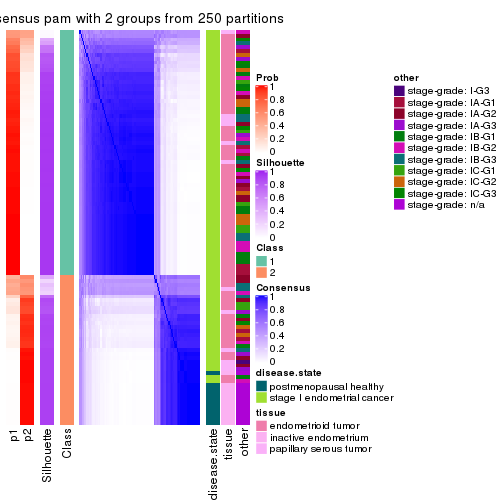</p>

</div>
<div id='tab-MAD-pam-consensus-heatmap-2'>
<pre><code class="r">consensus_heatmap(res, k = 3)
</code></pre>

<p>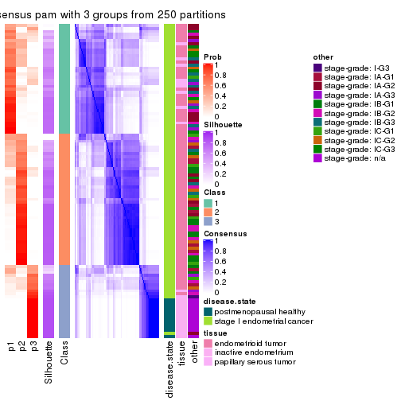</p>

</div>
<div id='tab-MAD-pam-consensus-heatmap-3'>
<pre><code class="r">consensus_heatmap(res, k = 4)
</code></pre>

<p>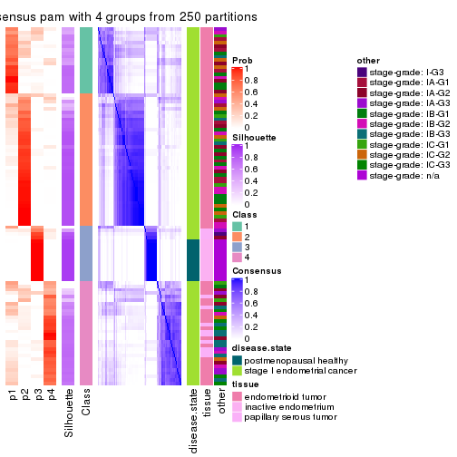</p>

</div>
<div id='tab-MAD-pam-consensus-heatmap-4'>
<pre><code class="r">consensus_heatmap(res, k = 5)
</code></pre>

<p>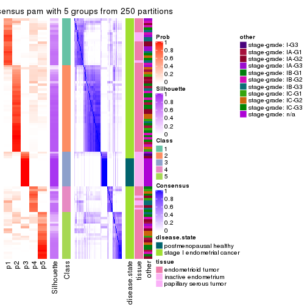</p>

</div>
<div id='tab-MAD-pam-consensus-heatmap-5'>
<pre><code class="r">consensus_heatmap(res, k = 6)
</code></pre>

<p>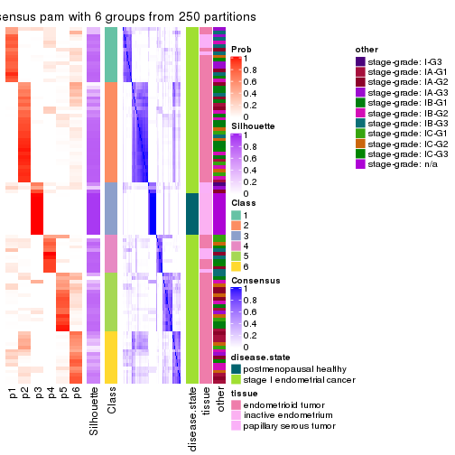</p>

</div>
</div>

Heatmaps for the membership of samples in all partitions to see how consistent they are:


<script>
$( function() {
	$( '#tabs-MAD-pam-membership-heatmap' ).tabs();
} );
</script>
<div id='tabs-MAD-pam-membership-heatmap'>
<ul>
<li><a href='#tab-MAD-pam-membership-heatmap-1'>k = 2</a></li>
<li><a href='#tab-MAD-pam-membership-heatmap-2'>k = 3</a></li>
<li><a href='#tab-MAD-pam-membership-heatmap-3'>k = 4</a></li>
<li><a href='#tab-MAD-pam-membership-heatmap-4'>k = 5</a></li>
<li><a href='#tab-MAD-pam-membership-heatmap-5'>k = 6</a></li>
</ul>
<div id='tab-MAD-pam-membership-heatmap-1'>
<pre><code class="r">membership_heatmap(res, k = 2)
</code></pre>

<p>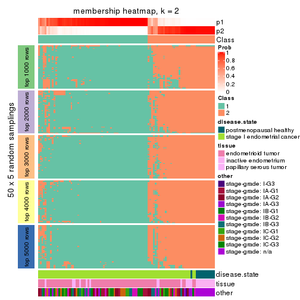</p>

</div>
<div id='tab-MAD-pam-membership-heatmap-2'>
<pre><code class="r">membership_heatmap(res, k = 3)
</code></pre>

<p>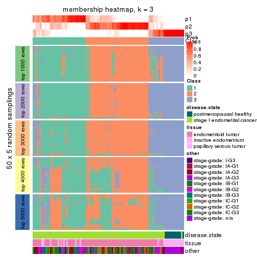</p>

</div>
<div id='tab-MAD-pam-membership-heatmap-3'>
<pre><code class="r">membership_heatmap(res, k = 4)
</code></pre>

<p>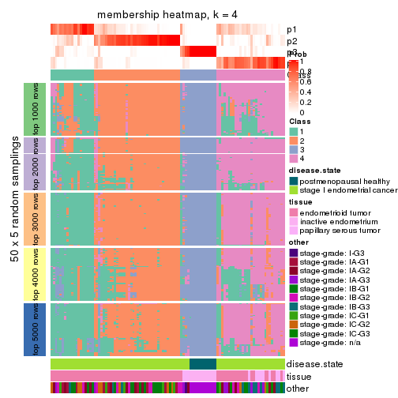</p>

</div>
<div id='tab-MAD-pam-membership-heatmap-4'>
<pre><code class="r">membership_heatmap(res, k = 5)
</code></pre>

<p>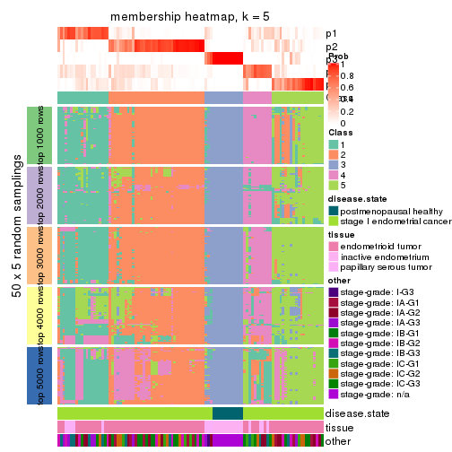</p>

</div>
<div id='tab-MAD-pam-membership-heatmap-5'>
<pre><code class="r">membership_heatmap(res, k = 6)
</code></pre>

<p>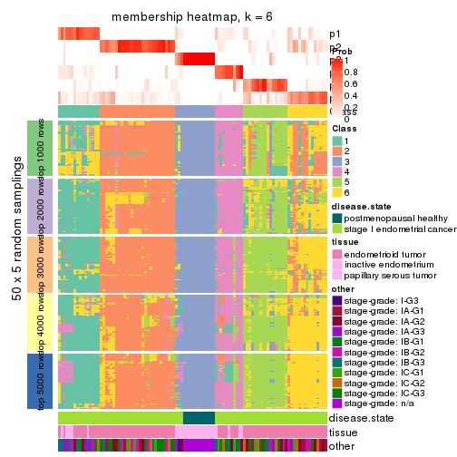</p>

</div>
</div>

As soon as we have had the classes for columns, we can look for signatures
which are significantly different between classes which can be candidate marks
for certain classes. Following are the heatmaps for signatures.


Signature heatmaps where rows are scaled:


<script>
$( function() {
	$( '#tabs-MAD-pam-get-signatures' ).tabs();
} );
</script>
<div id='tabs-MAD-pam-get-signatures'>
<ul>
<li><a href='#tab-MAD-pam-get-signatures-1'>k = 2</a></li>
<li><a href='#tab-MAD-pam-get-signatures-2'>k = 3</a></li>
<li><a href='#tab-MAD-pam-get-signatures-3'>k = 4</a></li>
<li><a href='#tab-MAD-pam-get-signatures-4'>k = 5</a></li>
<li><a href='#tab-MAD-pam-get-signatures-5'>k = 6</a></li>
</ul>
<div id='tab-MAD-pam-get-signatures-1'>
<pre><code class="r">get_signatures(res, k = 2)
</code></pre>

<p>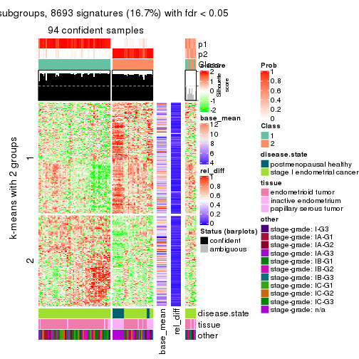</p>

</div>
<div id='tab-MAD-pam-get-signatures-2'>
<pre><code class="r">get_signatures(res, k = 3)
</code></pre>

<p>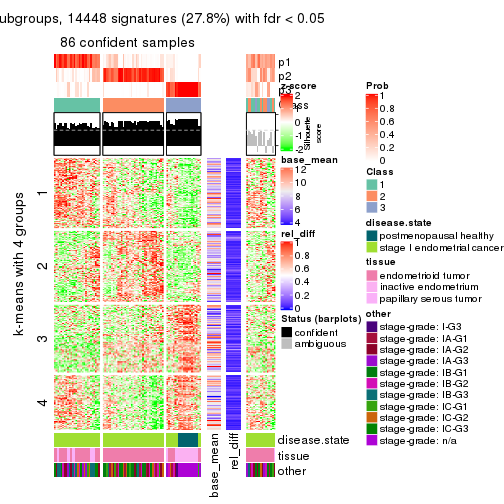</p>

</div>
<div id='tab-MAD-pam-get-signatures-3'>
<pre><code class="r">get_signatures(res, k = 4)
</code></pre>

<p>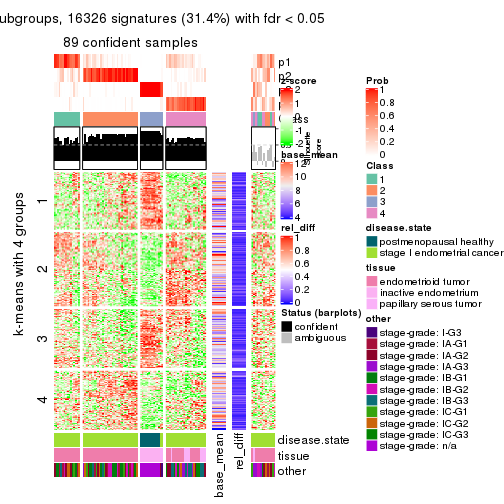</p>

</div>
<div id='tab-MAD-pam-get-signatures-4'>
<pre><code class="r">get_signatures(res, k = 5)
</code></pre>

<p>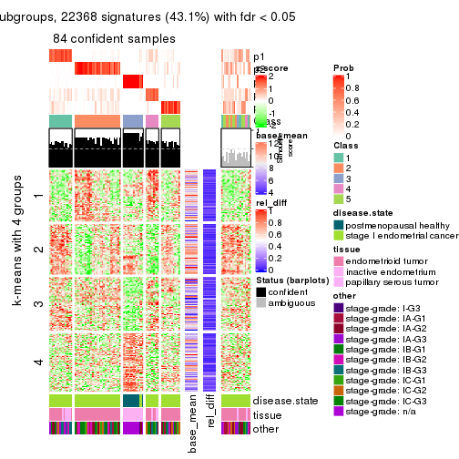</p>

</div>
<div id='tab-MAD-pam-get-signatures-5'>
<pre><code class="r">get_signatures(res, k = 6)
</code></pre>

<p>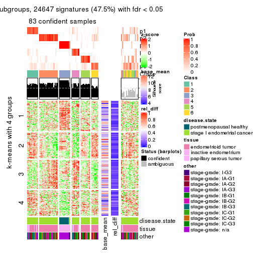</p>

</div>
</div>


Signature heatmaps where rows are not scaled:


<script>
$( function() {
	$( '#tabs-MAD-pam-get-signatures-no-scale' ).tabs();
} );
</script>
<div id='tabs-MAD-pam-get-signatures-no-scale'>
<ul>
<li><a href='#tab-MAD-pam-get-signatures-no-scale-1'>k = 2</a></li>
<li><a href='#tab-MAD-pam-get-signatures-no-scale-2'>k = 3</a></li>
<li><a href='#tab-MAD-pam-get-signatures-no-scale-3'>k = 4</a></li>
<li><a href='#tab-MAD-pam-get-signatures-no-scale-4'>k = 5</a></li>
<li><a href='#tab-MAD-pam-get-signatures-no-scale-5'>k = 6</a></li>
</ul>
<div id='tab-MAD-pam-get-signatures-no-scale-1'>
<pre><code class="r">get_signatures(res, k = 2, scale_rows = FALSE)
</code></pre>

<p>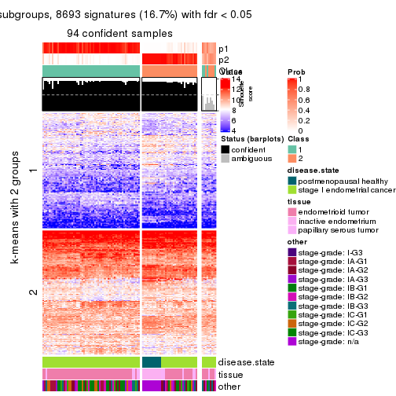</p>

</div>
<div id='tab-MAD-pam-get-signatures-no-scale-2'>
<pre><code class="r">get_signatures(res, k = 3, scale_rows = FALSE)
</code></pre>

<p>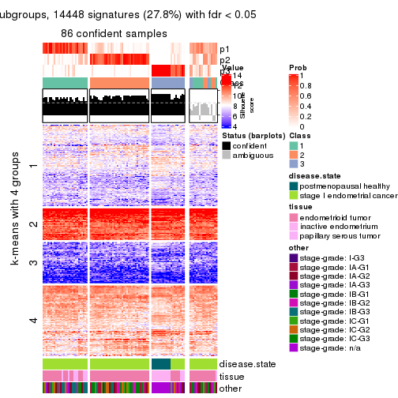</p>

</div>
<div id='tab-MAD-pam-get-signatures-no-scale-3'>
<pre><code class="r">get_signatures(res, k = 4, scale_rows = FALSE)
</code></pre>

<p>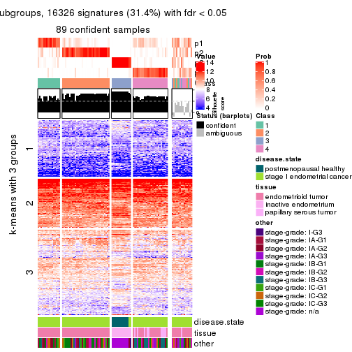</p>

</div>
<div id='tab-MAD-pam-get-signatures-no-scale-4'>
<pre><code class="r">get_signatures(res, k = 5, scale_rows = FALSE)
</code></pre>

<p>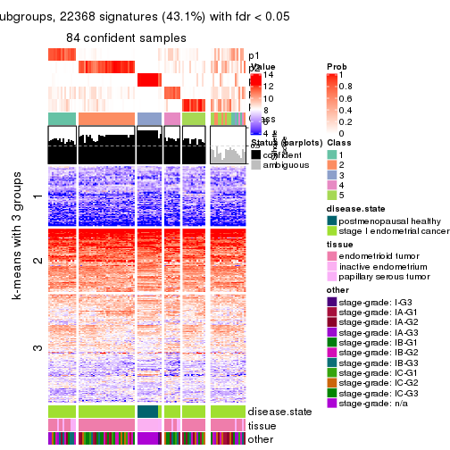</p>

</div>
<div id='tab-MAD-pam-get-signatures-no-scale-5'>
<pre><code class="r">get_signatures(res, k = 6, scale_rows = FALSE)
</code></pre>

<p>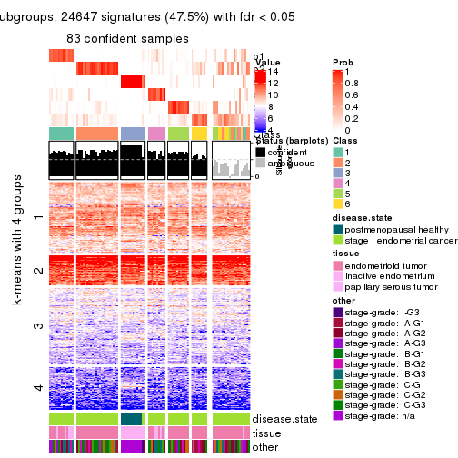</p>

</div>
</div>


Compare the overlap of signatures from different k:

```r
compare_signatures(res)
```

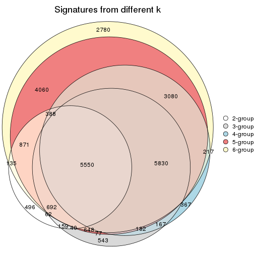

`get_signature()` returns a data frame invisibly. TO get the list of signatures, the function
call should be assigned to a variable explicitly. In following code, if `plot` argument is set
to `FALSE`, no heatmap is plotted while only the differential analysis is performed.

```r
# code only for demonstration
tb = get_signature(res, k = ..., plot = FALSE)
```

An example of the output of `tb` is:

```
#>   which_row         fdr    mean_1    mean_2 scaled_mean_1 scaled_mean_2 km
#> 1        38 0.042760348  8.373488  9.131774    -0.5533452     0.5164555  1
#> 2        40 0.018707592  7.106213  8.469186    -0.6173731     0.5762149  1
#> 3        55 0.019134737 10.221463 11.207825    -0.6159697     0.5749050  1
#> 4        59 0.006059896  5.921854  7.869574    -0.6899429     0.6439467  1
#> 5        60 0.018055526  8.928898 10.211722    -0.6204761     0.5791110  1
#> 6        98 0.009384629 15.714769 14.887706     0.6635654    -0.6193277  2
...
```

The columns in `tb` are:

1. `which_row`: row indices corresponding to the input matrix.
2. `fdr`: FDR for the differential test. 
3. `mean_x`: The mean value in group x.
4. `scaled_mean_x`: The mean value in group x after rows are scaled.
5. `km`: Row groups if k-means clustering is applied to rows.


UMAP plot which shows how samples are separated.


<script>
$( function() {
	$( '#tabs-MAD-pam-dimension-reduction' ).tabs();
} );
</script>
<div id='tabs-MAD-pam-dimension-reduction'>
<ul>
<li><a href='#tab-MAD-pam-dimension-reduction-1'>k = 2</a></li>
<li><a href='#tab-MAD-pam-dimension-reduction-2'>k = 3</a></li>
<li><a href='#tab-MAD-pam-dimension-reduction-3'>k = 4</a></li>
<li><a href='#tab-MAD-pam-dimension-reduction-4'>k = 5</a></li>
<li><a href='#tab-MAD-pam-dimension-reduction-5'>k = 6</a></li>
</ul>
<div id='tab-MAD-pam-dimension-reduction-1'>
<pre><code class="r">dimension_reduction(res, k = 2, method = &quot;UMAP&quot;)
</code></pre>

<p>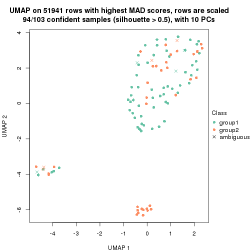</p>

</div>
<div id='tab-MAD-pam-dimension-reduction-2'>
<pre><code class="r">dimension_reduction(res, k = 3, method = &quot;UMAP&quot;)
</code></pre>

<p>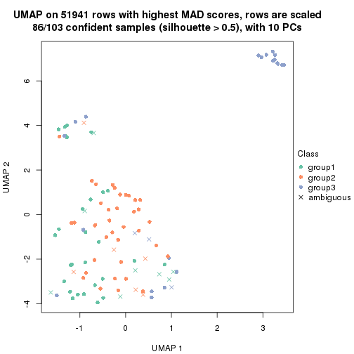</p>

</div>
<div id='tab-MAD-pam-dimension-reduction-3'>
<pre><code class="r">dimension_reduction(res, k = 4, method = &quot;UMAP&quot;)
</code></pre>

<p>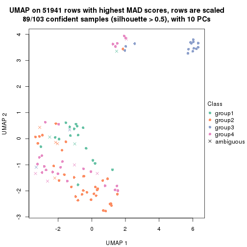</p>

</div>
<div id='tab-MAD-pam-dimension-reduction-4'>
<pre><code class="r">dimension_reduction(res, k = 5, method = &quot;UMAP&quot;)
</code></pre>

<p>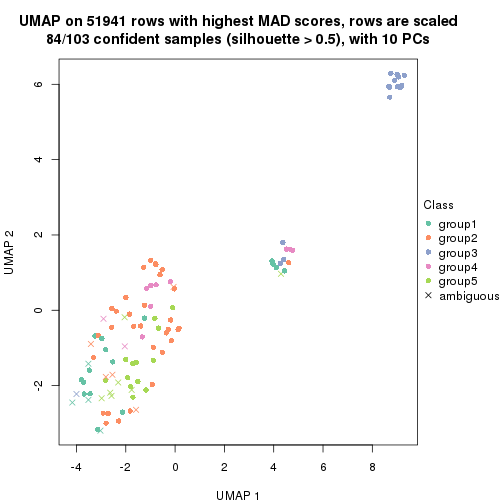</p>

</div>
<div id='tab-MAD-pam-dimension-reduction-5'>
<pre><code class="r">dimension_reduction(res, k = 6, method = &quot;UMAP&quot;)
</code></pre>

<p>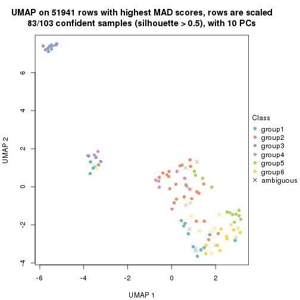</p>

</div>
</div>


Following heatmap shows how subgroups are split when increasing `k`:

```r
collect_classes(res)
```

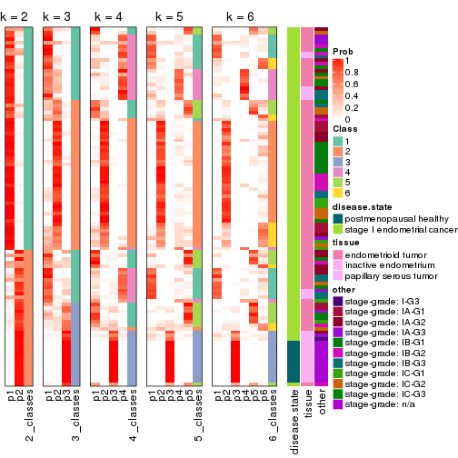


Test correlation between subgroups and known annotations. If the known
annotation is numeric, one-way ANOVA test is applied, and if the known
annotation is discrete, chi-squared contingency table test is applied.

```r
test_to_known_factors(res)
```

```
#>          n disease.state(p) tissue(p) other(p) k
#> MAD:pam 94         4.12e-06  1.42e-06 1.45e-03 2
#> MAD:pam 86         4.23e-10  1.42e-11 5.49e-10 3
#> MAD:pam 89         5.11e-16  1.04e-18 4.36e-13 4
#> MAD:pam 84         2.27e-14  9.12e-16 2.33e-09 5
#> MAD:pam 83         1.55e-13  3.27e-15 1.10e-08 6
```


If matrix rows can be associated to genes, consider to use `functional_enrichment(res,
...)` to perform function enrichment for the signature genes. See [this vignette](http://bioconductor.org/packages/devel/bioc/vignettes/cola/inst/doc/functional_enrichment.html) for more detailed explanations.


 

---------------------------------------------------


### MAD:mclust**


The object with results only for a single top-value method and a single partition method 
can be extracted as:

```r
res = res_list["MAD", "mclust"]
# you can also extract it by
# res = res_list["MAD:mclust"]
```

A summary of `res` and all the functions that can be applied to it:

```r
res
```

```
#> A 'ConsensusPartition' object with k = 2, 3, 4, 5, 6.
#>   On a matrix with 51941 rows and 103 columns.
#>   Top rows (1000, 2000, 3000, 4000, 5000) are extracted by 'MAD' method.
#>   Subgroups are detected by 'mclust' method.
#>   Performed in total 1250 partitions by row resampling.
#>   Best k for subgroups seems to be 3.
#> 
#> Following methods can be applied to this 'ConsensusPartition' object:
#>  [1] "cola_report"             "collect_classes"         "collect_plots"          
#>  [4] "collect_stats"           "colnames"                "compare_signatures"     
#>  [7] "consensus_heatmap"       "dimension_reduction"     "functional_enrichment"  
#> [10] "get_anno_col"            "get_anno"                "get_classes"            
#> [13] "get_consensus"           "get_matrix"              "get_membership"         
#> [16] "get_param"               "get_signatures"          "get_stats"              
#> [19] "is_best_k"               "is_stable_k"             "membership_heatmap"     
#> [22] "ncol"                    "nrow"                    "plot_ecdf"              
#> [25] "rownames"                "select_partition_number" "show"                   
#> [28] "suggest_best_k"          "test_to_known_factors"
```

`collect_plots()` function collects all the plots made from `res` for all `k` (number of partitions)
into one single page to provide an easy and fast comparison between different `k`.

```r
collect_plots(res)
```

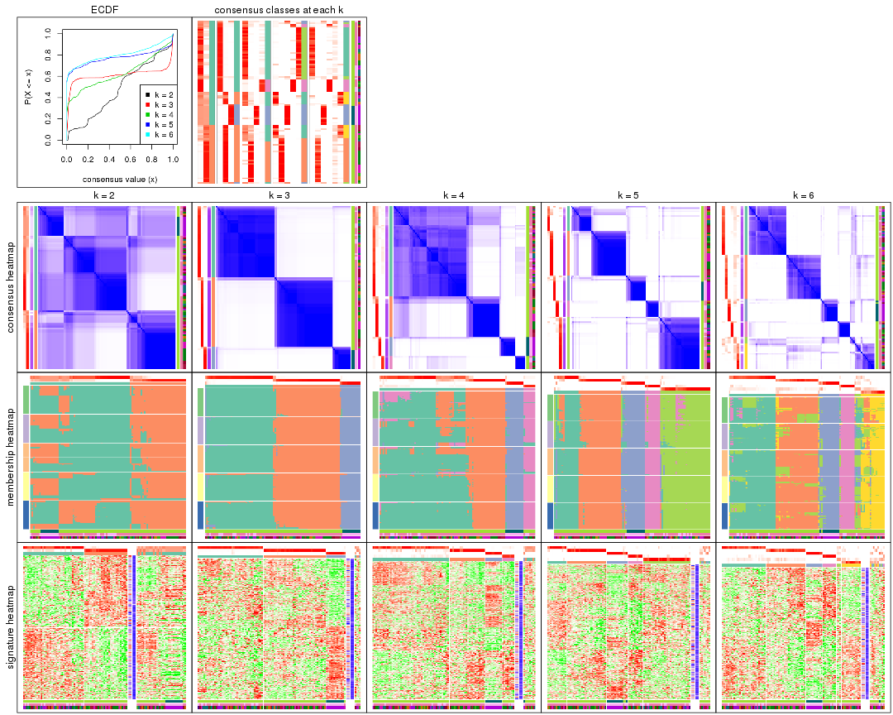

The plots are:

- The first row: a plot of the ECDF (empirical cumulative distribution
  function) curves of the consensus matrix for each `k` and the heatmap of
  predicted classes for each `k`.
- The second row: heatmaps of the consensus matrix for each `k`.
- The third row: heatmaps of the membership matrix for each `k`.
- The fouth row: heatmaps of the signatures for each `k`.

All the plots in panels can be made by individual functions and they are
plotted later in this section.

`select_partition_number()` produces several plots showing different
statistics for choosing "optimized" `k`. There are following statistics:

- ECDF curves of the consensus matrix for each `k`;
- 1-PAC. [The PAC
  score](https://en.wikipedia.org/wiki/Consensus_clustering#Over-interpretation_potential_of_consensus_clustering)
  measures the proportion of the ambiguous subgrouping.
- Mean silhouette score.
- Concordance. The mean probability of fiting the consensus class ids in all
  partitions.
- Area increased. Denote $A_k$ as the area under the ECDF curve for current
  `k`, the area increased is defined as $A_k - A_{k-1}$.
- Rand index. The percent of pairs of samples that are both in a same cluster
  or both are not in a same cluster in the partition of k and k-1.
- Jaccard index. The ratio of pairs of samples are both in a same cluster in
  the partition of k and k-1 and the pairs of samples are both in a same
  cluster in the partition k or k-1.

The detailed explanations of these statistics can be found in [the _cola_
vignette](http://bioconductor.org/packages/devel/bioc/vignettes/cola/inst/doc/cola.html#toc_13).

Generally speaking, lower PAC score, higher mean silhouette score or higher
concordance corresponds to better partition. Rand index and Jaccard index
measure how similar the current partition is compared to partition with `k-1`.
If they are too similar, we won't accept `k` is better than `k-1`.

```r
select_partition_number(res)
```

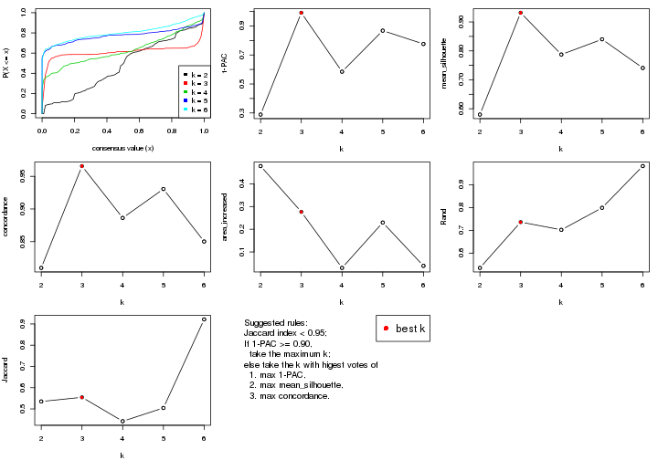

The numeric values for all these statistics can be obtained by `get_stats()`.

```r
get_stats(res)
```

```
#>   k 1-PAC mean_silhouette concordance area_increased  Rand Jaccard
#> 2 2 0.289           0.580       0.810         0.4784 0.535   0.535
#> 3 3 0.991           0.932       0.966         0.2768 0.736   0.555
#> 4 4 0.585           0.787       0.886         0.0298 0.702   0.442
#> 5 5 0.868           0.840       0.931         0.2295 0.799   0.504
#> 6 6 0.776           0.741       0.850         0.0389 0.982   0.921
```

`suggest_best_k()` suggests the best $k$ based on these statistics. The rules are as follows:

- All $k$ with Jaccard index larger than 0.95 are removed because increasing
  $k$ does not provide enough extra information. If all $k$ are removed, it is
  marked as no subgroup is detected.
- For all $k$ with 1-PAC score larger than 0.9, the maximal $k$ is taken as
  the best $k$, and other $k$ are marked as optional $k$.
- If it does not fit the second rule. The $k$ with the maximal vote of the
  highest 1-PAC score, highest mean silhouette, and highest concordance is
  taken as the best $k$.

```r
suggest_best_k(res)
```

```
#> [1] 3
```


Following shows the table of the partitions (You need to click the **show/hide
code output** link to see it). The membership matrix (columns with name `p*`)
is inferred by
[`clue::cl_consensus()`](https://www.rdocumentation.org/link/cl_consensus?package=clue)
function with the `SE` method. Basically the value in the membership matrix
represents the probability to belong to a certain group. The finall class
label for an item is determined with the group with highest probability it
belongs to.

In `get_classes()` function, the entropy is calculated from the membership
matrix and the silhouette score is calculated from the consensus matrix.


<script>
$( function() {
	$( '#tabs-MAD-mclust-get-classes' ).tabs();
} );
</script>
<div id='tabs-MAD-mclust-get-classes'>
<ul>
<li><a href='#tab-MAD-mclust-get-classes-1'>k = 2</a></li>
<li><a href='#tab-MAD-mclust-get-classes-2'>k = 3</a></li>
<li><a href='#tab-MAD-mclust-get-classes-3'>k = 4</a></li>
<li><a href='#tab-MAD-mclust-get-classes-4'>k = 5</a></li>
<li><a href='#tab-MAD-mclust-get-classes-5'>k = 6</a></li>
</ul>

<div id='tab-MAD-mclust-get-classes-1'>
<p><a id='tab-MAD-mclust-get-classes-1-a' style='color:#0366d6' href='#'>show/hide code output</a></p>
<pre><code class="r">cbind(get_classes(res, k = 2), get_membership(res, k = 2))
</code></pre>

<pre><code>#&gt;           class entropy silhouette    p1    p2
#&gt; GSM425907     2  0.1184     0.8550 0.016 0.984
#&gt; GSM425908     2  0.1184     0.8550 0.016 0.984
#&gt; GSM425909     1  0.9635     0.3751 0.612 0.388
#&gt; GSM425910     1  0.9954     0.1850 0.540 0.460
#&gt; GSM425911     2  0.3431     0.8165 0.064 0.936
#&gt; GSM425912     2  0.9209     0.4215 0.336 0.664
#&gt; GSM425913     2  0.1184     0.8550 0.016 0.984
#&gt; GSM425914     2  0.6623     0.7005 0.172 0.828
#&gt; GSM425915     2  0.7219     0.6174 0.200 0.800
#&gt; GSM425874     1  0.0000     0.6982 1.000 0.000
#&gt; GSM425875     1  0.6712     0.6452 0.824 0.176
#&gt; GSM425876     1  0.9775     0.2912 0.588 0.412
#&gt; GSM425877     1  0.0376     0.6984 0.996 0.004
#&gt; GSM425878     1  0.6801     0.6425 0.820 0.180
#&gt; GSM425879     2  0.1184     0.8550 0.016 0.984
#&gt; GSM425880     1  0.4815     0.6769 0.896 0.104
#&gt; GSM425881     2  0.9044     0.4519 0.320 0.680
#&gt; GSM425882     2  0.1184     0.8550 0.016 0.984
#&gt; GSM425883     1  0.6712     0.6518 0.824 0.176
#&gt; GSM425884     1  0.6712     0.6452 0.824 0.176
#&gt; GSM425885     1  0.8909     0.4655 0.692 0.308
#&gt; GSM425848     1  0.0376     0.6985 0.996 0.004
#&gt; GSM425849     1  0.6623     0.6477 0.828 0.172
#&gt; GSM425850     1  0.8608     0.5183 0.716 0.284
#&gt; GSM425851     1  0.0000     0.6982 1.000 0.000
#&gt; GSM425852     1  0.0672     0.6963 0.992 0.008
#&gt; GSM425893     2  0.3431     0.8164 0.064 0.936
#&gt; GSM425894     2  0.1184     0.8550 0.016 0.984
#&gt; GSM425895     2  0.1184     0.8550 0.016 0.984
#&gt; GSM425896     2  0.1184     0.8550 0.016 0.984
#&gt; GSM425897     2  0.1184     0.8550 0.016 0.984
#&gt; GSM425898     2  0.1184     0.8550 0.016 0.984
#&gt; GSM425899     2  0.9993    -0.0379 0.484 0.516
#&gt; GSM425900     2  0.1184     0.8550 0.016 0.984
#&gt; GSM425901     1  0.9522     0.3809 0.628 0.372
#&gt; GSM425902     1  0.0000     0.6982 1.000 0.000
#&gt; GSM425903     2  0.9393     0.3287 0.356 0.644
#&gt; GSM425904     1  0.0672     0.6983 0.992 0.008
#&gt; GSM425905     2  0.1184     0.8550 0.016 0.984
#&gt; GSM425906     2  0.1184     0.8550 0.016 0.984
#&gt; GSM425863     1  0.6801     0.6425 0.820 0.180
#&gt; GSM425864     2  0.1184     0.8550 0.016 0.984
#&gt; GSM425865     2  0.1184     0.8550 0.016 0.984
#&gt; GSM425866     1  0.6801     0.6425 0.820 0.180
#&gt; GSM425867     1  0.9635     0.4128 0.612 0.388
#&gt; GSM425868     2  0.1414     0.8522 0.020 0.980
#&gt; GSM425869     2  0.1184     0.8550 0.016 0.984
#&gt; GSM425870     2  0.6343     0.6850 0.160 0.840
#&gt; GSM425871     1  0.6801     0.6425 0.820 0.180
#&gt; GSM425872     2  0.1184     0.8550 0.016 0.984
#&gt; GSM425873     1  0.9323     0.3932 0.652 0.348
#&gt; GSM425843     1  0.6801     0.6425 0.820 0.180
#&gt; GSM425844     1  0.0000     0.6982 1.000 0.000
#&gt; GSM425845     1  0.9944     0.1950 0.544 0.456
#&gt; GSM425846     2  0.8861     0.4647 0.304 0.696
#&gt; GSM425847     1  0.9998     0.0848 0.508 0.492
#&gt; GSM425886     2  0.9963    -0.0980 0.464 0.536
#&gt; GSM425887     2  0.9170     0.4299 0.332 0.668
#&gt; GSM425888     2  0.9000     0.4588 0.316 0.684
#&gt; GSM425889     1  0.0000     0.6982 1.000 0.000
#&gt; GSM425890     1  0.0000     0.6982 1.000 0.000
#&gt; GSM425891     2  0.1184     0.8550 0.016 0.984
#&gt; GSM425892     2  0.1184     0.8550 0.016 0.984
#&gt; GSM425853     1  0.6801     0.6425 0.820 0.180
#&gt; GSM425854     2  0.1184     0.8550 0.016 0.984
#&gt; GSM425855     1  0.6623     0.6477 0.828 0.172
#&gt; GSM425856     1  0.6801     0.6425 0.820 0.180
#&gt; GSM425857     1  0.9522     0.3761 0.628 0.372
#&gt; GSM425858     2  0.4939     0.7698 0.108 0.892
#&gt; GSM425859     2  0.1184     0.8550 0.016 0.984
#&gt; GSM425860     1  0.9993     0.1147 0.516 0.484
#&gt; GSM425861     1  0.9983     0.1288 0.524 0.476
#&gt; GSM425862     1  0.0000     0.6982 1.000 0.000
#&gt; GSM425837     1  0.2778     0.6927 0.952 0.048
#&gt; GSM425838     1  0.0000     0.6982 1.000 0.000
#&gt; GSM425839     2  0.1184     0.8550 0.016 0.984
#&gt; GSM425840     1  0.6438     0.6520 0.836 0.164
#&gt; GSM425841     1  0.0000     0.6982 1.000 0.000
#&gt; GSM425842     1  0.7602     0.5994 0.780 0.220
#&gt; GSM425917     1  0.9909     0.2527 0.556 0.444
#&gt; GSM425922     1  0.0000     0.6982 1.000 0.000
#&gt; GSM425919     1  0.1633     0.6967 0.976 0.024
#&gt; GSM425920     1  0.2043     0.6956 0.968 0.032
#&gt; GSM425923     1  0.0000     0.6982 1.000 0.000
#&gt; GSM425916     1  0.0000     0.6982 1.000 0.000
#&gt; GSM425918     1  0.0000     0.6982 1.000 0.000
#&gt; GSM425921     1  0.0000     0.6982 1.000 0.000
#&gt; GSM425925     1  0.0376     0.6985 0.996 0.004
#&gt; GSM425926     1  0.0000     0.6982 1.000 0.000
#&gt; GSM425927     1  0.6801     0.6425 0.820 0.180
#&gt; GSM425924     1  0.8267     0.5246 0.740 0.260
#&gt; GSM425928     1  0.9993     0.1832 0.516 0.484
#&gt; GSM425929     1  0.9998     0.1826 0.508 0.492
#&gt; GSM425930     1  0.9998     0.1826 0.508 0.492
#&gt; GSM425931     1  0.9998     0.1826 0.508 0.492
#&gt; GSM425932     1  0.9998     0.1826 0.508 0.492
#&gt; GSM425933     1  0.9998     0.1826 0.508 0.492
#&gt; GSM425934     1  0.9998     0.1826 0.508 0.492
#&gt; GSM425935     1  0.9988     0.1830 0.520 0.480
#&gt; GSM425936     1  0.9998     0.1826 0.508 0.492
#&gt; GSM425937     1  0.9998     0.1826 0.508 0.492
#&gt; GSM425938     1  0.9993     0.1832 0.516 0.484
#&gt; GSM425939     1  0.9998     0.1826 0.508 0.492
</code></pre>

<script>
$('#tab-MAD-mclust-get-classes-1-a').parent().next().next().hide();
$('#tab-MAD-mclust-get-classes-1-a').click(function(){
  $('#tab-MAD-mclust-get-classes-1-a').parent().next().next().toggle();
  return(false);
});
</script>
</div>

<div id='tab-MAD-mclust-get-classes-2'>
<p><a id='tab-MAD-mclust-get-classes-2-a' style='color:#0366d6' href='#'>show/hide code output</a></p>
<pre><code class="r">cbind(get_classes(res, k = 3), get_membership(res, k = 3))
</code></pre>

<pre><code>#&gt;           class entropy silhouette    p1    p2    p3
#&gt; GSM425907     2  0.0000      0.961 0.000 1.000 0.000
#&gt; GSM425908     2  0.0000      0.961 0.000 1.000 0.000
#&gt; GSM425909     1  0.6843      0.704 0.740 0.116 0.144
#&gt; GSM425910     2  0.1643      0.936 0.044 0.956 0.000
#&gt; GSM425911     2  0.0237      0.961 0.004 0.996 0.000
#&gt; GSM425912     2  0.0892      0.955 0.020 0.980 0.000
#&gt; GSM425913     2  0.0000      0.961 0.000 1.000 0.000
#&gt; GSM425914     2  0.0424      0.960 0.008 0.992 0.000
#&gt; GSM425915     2  0.2866      0.892 0.008 0.916 0.076
#&gt; GSM425874     1  0.1015      0.965 0.980 0.008 0.012
#&gt; GSM425875     1  0.0424      0.971 0.992 0.008 0.000
#&gt; GSM425876     2  0.2165      0.913 0.064 0.936 0.000
#&gt; GSM425877     1  0.0424      0.971 0.992 0.008 0.000
#&gt; GSM425878     1  0.0424      0.971 0.992 0.008 0.000
#&gt; GSM425879     2  0.0000      0.961 0.000 1.000 0.000
#&gt; GSM425880     1  0.0424      0.971 0.992 0.008 0.000
#&gt; GSM425881     2  0.0892      0.955 0.020 0.980 0.000
#&gt; GSM425882     2  0.0000      0.961 0.000 1.000 0.000
#&gt; GSM425883     1  0.0892      0.969 0.980 0.020 0.000
#&gt; GSM425884     1  0.0424      0.971 0.992 0.008 0.000
#&gt; GSM425885     1  0.2569      0.942 0.936 0.032 0.032
#&gt; GSM425848     1  0.0747      0.971 0.984 0.016 0.000
#&gt; GSM425849     1  0.0747      0.971 0.984 0.016 0.000
#&gt; GSM425850     2  0.6079      0.385 0.388 0.612 0.000
#&gt; GSM425851     1  0.0747      0.971 0.984 0.016 0.000
#&gt; GSM425852     1  0.1491      0.964 0.968 0.016 0.016
#&gt; GSM425893     2  0.0237      0.961 0.004 0.996 0.000
#&gt; GSM425894     2  0.0000      0.961 0.000 1.000 0.000
#&gt; GSM425895     2  0.0000      0.961 0.000 1.000 0.000
#&gt; GSM425896     2  0.0000      0.961 0.000 1.000 0.000
#&gt; GSM425897     2  0.0000      0.961 0.000 1.000 0.000
#&gt; GSM425898     2  0.0000      0.961 0.000 1.000 0.000
#&gt; GSM425899     2  0.1031      0.953 0.024 0.976 0.000
#&gt; GSM425900     2  0.0237      0.961 0.004 0.996 0.000
#&gt; GSM425901     1  0.3967      0.893 0.884 0.044 0.072
#&gt; GSM425902     1  0.1182      0.967 0.976 0.012 0.012
#&gt; GSM425903     2  0.1289      0.947 0.032 0.968 0.000
#&gt; GSM425904     1  0.0592      0.971 0.988 0.012 0.000
#&gt; GSM425905     2  0.0000      0.961 0.000 1.000 0.000
#&gt; GSM425906     2  0.0237      0.961 0.004 0.996 0.000
#&gt; GSM425863     1  0.0424      0.971 0.992 0.008 0.000
#&gt; GSM425864     2  0.0000      0.961 0.000 1.000 0.000
#&gt; GSM425865     2  0.0000      0.961 0.000 1.000 0.000
#&gt; GSM425866     1  0.0592      0.970 0.988 0.012 0.000
#&gt; GSM425867     3  0.3502      0.875 0.084 0.020 0.896
#&gt; GSM425868     2  0.0000      0.961 0.000 1.000 0.000
#&gt; GSM425869     2  0.0000      0.961 0.000 1.000 0.000
#&gt; GSM425870     2  0.0424      0.960 0.008 0.992 0.000
#&gt; GSM425871     1  0.0747      0.971 0.984 0.016 0.000
#&gt; GSM425872     2  0.0000      0.961 0.000 1.000 0.000
#&gt; GSM425873     2  0.6252      0.220 0.444 0.556 0.000
#&gt; GSM425843     1  0.0424      0.971 0.992 0.008 0.000
#&gt; GSM425844     1  0.0592      0.971 0.988 0.012 0.000
#&gt; GSM425845     2  0.1529      0.940 0.040 0.960 0.000
#&gt; GSM425846     2  0.0892      0.955 0.020 0.980 0.000
#&gt; GSM425847     2  0.0892      0.955 0.020 0.980 0.000
#&gt; GSM425886     3  0.6448      0.457 0.012 0.352 0.636
#&gt; GSM425887     2  0.0892      0.955 0.020 0.980 0.000
#&gt; GSM425888     2  0.0892      0.955 0.020 0.980 0.000
#&gt; GSM425889     1  0.0747      0.971 0.984 0.016 0.000
#&gt; GSM425890     1  0.1337      0.968 0.972 0.016 0.012
#&gt; GSM425891     2  0.0000      0.961 0.000 1.000 0.000
#&gt; GSM425892     2  0.0000      0.961 0.000 1.000 0.000
#&gt; GSM425853     1  0.0424      0.971 0.992 0.008 0.000
#&gt; GSM425854     2  0.0000      0.961 0.000 1.000 0.000
#&gt; GSM425855     1  0.0424      0.971 0.992 0.008 0.000
#&gt; GSM425856     1  0.1031      0.966 0.976 0.024 0.000
#&gt; GSM425857     1  0.2569      0.942 0.936 0.032 0.032
#&gt; GSM425858     2  0.0892      0.955 0.020 0.980 0.000
#&gt; GSM425859     2  0.0000      0.961 0.000 1.000 0.000
#&gt; GSM425860     2  0.1031      0.953 0.024 0.976 0.000
#&gt; GSM425861     2  0.1529      0.940 0.040 0.960 0.000
#&gt; GSM425862     1  0.0747      0.971 0.984 0.016 0.000
#&gt; GSM425837     1  0.0424      0.971 0.992 0.008 0.000
#&gt; GSM425838     1  0.1015      0.965 0.980 0.008 0.012
#&gt; GSM425839     2  0.0000      0.961 0.000 1.000 0.000
#&gt; GSM425840     1  0.0424      0.971 0.992 0.008 0.000
#&gt; GSM425841     1  0.1015      0.965 0.980 0.008 0.012
#&gt; GSM425842     1  0.1163      0.963 0.972 0.028 0.000
#&gt; GSM425917     1  0.7021      0.219 0.544 0.020 0.436
#&gt; GSM425922     1  0.1015      0.965 0.980 0.008 0.012
#&gt; GSM425919     1  0.0424      0.971 0.992 0.008 0.000
#&gt; GSM425920     1  0.0424      0.971 0.992 0.008 0.000
#&gt; GSM425923     1  0.0747      0.971 0.984 0.016 0.000
#&gt; GSM425916     1  0.0747      0.971 0.984 0.016 0.000
#&gt; GSM425918     1  0.0592      0.971 0.988 0.012 0.000
#&gt; GSM425921     1  0.1015      0.965 0.980 0.008 0.012
#&gt; GSM425925     1  0.0747      0.971 0.984 0.016 0.000
#&gt; GSM425926     1  0.1015      0.965 0.980 0.008 0.012
#&gt; GSM425927     1  0.0592      0.970 0.988 0.012 0.000
#&gt; GSM425924     1  0.2527      0.941 0.936 0.020 0.044
#&gt; GSM425928     3  0.0983      0.952 0.004 0.016 0.980
#&gt; GSM425929     3  0.0237      0.960 0.000 0.004 0.996
#&gt; GSM425930     3  0.0237      0.960 0.000 0.004 0.996
#&gt; GSM425931     3  0.0237      0.960 0.000 0.004 0.996
#&gt; GSM425932     3  0.0237      0.960 0.000 0.004 0.996
#&gt; GSM425933     3  0.0237      0.960 0.000 0.004 0.996
#&gt; GSM425934     3  0.0237      0.960 0.000 0.004 0.996
#&gt; GSM425935     3  0.1129      0.949 0.004 0.020 0.976
#&gt; GSM425936     3  0.0237      0.960 0.000 0.004 0.996
#&gt; GSM425937     3  0.0237      0.960 0.000 0.004 0.996
#&gt; GSM425938     3  0.0983      0.952 0.004 0.016 0.980
#&gt; GSM425939     3  0.0237      0.960 0.000 0.004 0.996
</code></pre>

<script>
$('#tab-MAD-mclust-get-classes-2-a').parent().next().next().hide();
$('#tab-MAD-mclust-get-classes-2-a').click(function(){
  $('#tab-MAD-mclust-get-classes-2-a').parent().next().next().toggle();
  return(false);
});
</script>
</div>

<div id='tab-MAD-mclust-get-classes-3'>
<p><a id='tab-MAD-mclust-get-classes-3-a' style='color:#0366d6' href='#'>show/hide code output</a></p>
<pre><code class="r">cbind(get_classes(res, k = 4), get_membership(res, k = 4))
</code></pre>

<pre><code>#&gt;           class entropy silhouette    p1    p2    p3    p4
#&gt; GSM425907     2  0.0000      0.900 0.000 1.000 0.000 0.000
#&gt; GSM425908     2  0.0000      0.900 0.000 1.000 0.000 0.000
#&gt; GSM425909     1  0.3160      0.816 0.872 0.108 0.020 0.000
#&gt; GSM425910     1  0.4046      0.797 0.828 0.124 0.000 0.048
#&gt; GSM425911     2  0.5163     -0.220 0.480 0.516 0.000 0.004
#&gt; GSM425912     1  0.5320      0.458 0.572 0.416 0.000 0.012
#&gt; GSM425913     2  0.0000      0.900 0.000 1.000 0.000 0.000
#&gt; GSM425914     1  0.5125      0.523 0.604 0.388 0.000 0.008
#&gt; GSM425915     1  0.6197      0.662 0.660 0.268 0.052 0.020
#&gt; GSM425874     4  0.1389      0.974 0.048 0.000 0.000 0.952
#&gt; GSM425875     1  0.0000      0.824 1.000 0.000 0.000 0.000
#&gt; GSM425876     1  0.4046      0.797 0.828 0.124 0.000 0.048
#&gt; GSM425877     1  0.1940      0.813 0.924 0.000 0.000 0.076
#&gt; GSM425878     1  0.0000      0.824 1.000 0.000 0.000 0.000
#&gt; GSM425879     2  0.0000      0.900 0.000 1.000 0.000 0.000
#&gt; GSM425880     1  0.0000      0.824 1.000 0.000 0.000 0.000
#&gt; GSM425881     1  0.5329      0.449 0.568 0.420 0.000 0.012
#&gt; GSM425882     2  0.0000      0.900 0.000 1.000 0.000 0.000
#&gt; GSM425883     1  0.3239      0.826 0.880 0.052 0.000 0.068
#&gt; GSM425884     1  0.0000      0.824 1.000 0.000 0.000 0.000
#&gt; GSM425885     1  0.6750      0.667 0.628 0.168 0.004 0.200
#&gt; GSM425848     1  0.2654      0.802 0.888 0.004 0.000 0.108
#&gt; GSM425849     1  0.1489      0.823 0.952 0.004 0.000 0.044
#&gt; GSM425850     1  0.3354      0.814 0.872 0.084 0.000 0.044
#&gt; GSM425851     1  0.2831      0.797 0.876 0.004 0.000 0.120
#&gt; GSM425852     1  0.0592      0.828 0.984 0.016 0.000 0.000
#&gt; GSM425893     2  0.3837      0.619 0.224 0.776 0.000 0.000
#&gt; GSM425894     2  0.0000      0.900 0.000 1.000 0.000 0.000
#&gt; GSM425895     2  0.0000      0.900 0.000 1.000 0.000 0.000
#&gt; GSM425896     2  0.0188      0.895 0.004 0.996 0.000 0.000
#&gt; GSM425897     2  0.0000      0.900 0.000 1.000 0.000 0.000
#&gt; GSM425898     2  0.0000      0.900 0.000 1.000 0.000 0.000
#&gt; GSM425899     1  0.5756      0.534 0.592 0.372 0.000 0.036
#&gt; GSM425900     2  0.3942      0.598 0.236 0.764 0.000 0.000
#&gt; GSM425901     1  0.3444      0.818 0.868 0.104 0.012 0.016
#&gt; GSM425902     4  0.1389      0.974 0.048 0.000 0.000 0.952
#&gt; GSM425903     1  0.4153      0.792 0.820 0.132 0.000 0.048
#&gt; GSM425904     1  0.0000      0.824 1.000 0.000 0.000 0.000
#&gt; GSM425905     2  0.0000      0.900 0.000 1.000 0.000 0.000
#&gt; GSM425906     2  0.3569      0.673 0.196 0.804 0.000 0.000
#&gt; GSM425863     1  0.1557      0.818 0.944 0.000 0.000 0.056
#&gt; GSM425864     2  0.0000      0.900 0.000 1.000 0.000 0.000
#&gt; GSM425865     2  0.0000      0.900 0.000 1.000 0.000 0.000
#&gt; GSM425866     1  0.0000      0.824 1.000 0.000 0.000 0.000
#&gt; GSM425867     1  0.4188      0.799 0.824 0.112 0.064 0.000
#&gt; GSM425868     2  0.0000      0.900 0.000 1.000 0.000 0.000
#&gt; GSM425869     2  0.0000      0.900 0.000 1.000 0.000 0.000
#&gt; GSM425870     1  0.5598      0.587 0.628 0.344 0.020 0.008
#&gt; GSM425871     1  0.1824      0.819 0.936 0.004 0.000 0.060
#&gt; GSM425872     2  0.0000      0.900 0.000 1.000 0.000 0.000
#&gt; GSM425873     1  0.3674      0.808 0.852 0.104 0.000 0.044
#&gt; GSM425843     1  0.0188      0.824 0.996 0.000 0.000 0.004
#&gt; GSM425844     1  0.2401      0.809 0.904 0.004 0.000 0.092
#&gt; GSM425845     1  0.4046      0.797 0.828 0.124 0.000 0.048
#&gt; GSM425846     1  0.5277      0.355 0.532 0.460 0.000 0.008
#&gt; GSM425847     1  0.5623      0.646 0.660 0.292 0.000 0.048
#&gt; GSM425886     1  0.6444      0.638 0.628 0.272 0.096 0.004
#&gt; GSM425887     1  0.5329      0.448 0.568 0.420 0.000 0.012
#&gt; GSM425888     1  0.5353      0.419 0.556 0.432 0.000 0.012
#&gt; GSM425889     1  0.3494      0.766 0.824 0.004 0.000 0.172
#&gt; GSM425890     4  0.3257      0.815 0.152 0.004 0.000 0.844
#&gt; GSM425891     2  0.0000      0.900 0.000 1.000 0.000 0.000
#&gt; GSM425892     2  0.0000      0.900 0.000 1.000 0.000 0.000
#&gt; GSM425853     1  0.0000      0.824 1.000 0.000 0.000 0.000
#&gt; GSM425854     2  0.0000      0.900 0.000 1.000 0.000 0.000
#&gt; GSM425855     1  0.1637      0.818 0.940 0.000 0.000 0.060
#&gt; GSM425856     1  0.0000      0.824 1.000 0.000 0.000 0.000
#&gt; GSM425857     1  0.5442      0.787 0.756 0.116 0.008 0.120
#&gt; GSM425858     2  0.4994     -0.213 0.480 0.520 0.000 0.000
#&gt; GSM425859     2  0.0000      0.900 0.000 1.000 0.000 0.000
#&gt; GSM425860     1  0.4307      0.784 0.808 0.144 0.000 0.048
#&gt; GSM425861     1  0.5472      0.665 0.676 0.280 0.000 0.044
#&gt; GSM425862     1  0.2999      0.791 0.864 0.004 0.000 0.132
#&gt; GSM425837     1  0.1118      0.822 0.964 0.000 0.000 0.036
#&gt; GSM425838     4  0.1389      0.974 0.048 0.000 0.000 0.952
#&gt; GSM425839     2  0.0000      0.900 0.000 1.000 0.000 0.000
#&gt; GSM425840     1  0.0469      0.824 0.988 0.000 0.000 0.012
#&gt; GSM425841     4  0.1389      0.974 0.048 0.000 0.000 0.952
#&gt; GSM425842     1  0.0469      0.823 0.988 0.000 0.000 0.012
#&gt; GSM425917     1  0.6291      0.757 0.712 0.124 0.136 0.028
#&gt; GSM425922     4  0.1389      0.974 0.048 0.000 0.000 0.952
#&gt; GSM425919     1  0.0188      0.825 0.996 0.000 0.000 0.004
#&gt; GSM425920     1  0.1792      0.816 0.932 0.000 0.000 0.068
#&gt; GSM425923     1  0.2831      0.797 0.876 0.004 0.000 0.120
#&gt; GSM425916     1  0.2831      0.797 0.876 0.004 0.000 0.120
#&gt; GSM425918     1  0.2831      0.797 0.876 0.004 0.000 0.120
#&gt; GSM425921     4  0.1389      0.974 0.048 0.000 0.000 0.952
#&gt; GSM425925     1  0.2831      0.797 0.876 0.004 0.000 0.120
#&gt; GSM425926     4  0.1389      0.974 0.048 0.000 0.000 0.952
#&gt; GSM425927     1  0.0188      0.824 0.996 0.000 0.000 0.004
#&gt; GSM425924     1  0.3601      0.821 0.864 0.100 0.024 0.012
#&gt; GSM425928     3  0.0188      0.926 0.000 0.004 0.996 0.000
#&gt; GSM425929     3  0.0000      0.928 0.000 0.000 1.000 0.000
#&gt; GSM425930     3  0.1042      0.904 0.020 0.008 0.972 0.000
#&gt; GSM425931     3  0.0000      0.928 0.000 0.000 1.000 0.000
#&gt; GSM425932     3  0.0000      0.928 0.000 0.000 1.000 0.000
#&gt; GSM425933     3  0.0000      0.928 0.000 0.000 1.000 0.000
#&gt; GSM425934     3  0.1042      0.904 0.020 0.008 0.972 0.000
#&gt; GSM425935     3  0.6681      0.290 0.292 0.120 0.588 0.000
#&gt; GSM425936     3  0.0000      0.928 0.000 0.000 1.000 0.000
#&gt; GSM425937     3  0.0000      0.928 0.000 0.000 1.000 0.000
#&gt; GSM425938     3  0.0188      0.926 0.000 0.004 0.996 0.000
#&gt; GSM425939     3  0.0000      0.928 0.000 0.000 1.000 0.000
</code></pre>

<script>
$('#tab-MAD-mclust-get-classes-3-a').parent().next().next().hide();
$('#tab-MAD-mclust-get-classes-3-a').click(function(){
  $('#tab-MAD-mclust-get-classes-3-a').parent().next().next().toggle();
  return(false);
});
</script>
</div>

<div id='tab-MAD-mclust-get-classes-4'>
<p><a id='tab-MAD-mclust-get-classes-4-a' style='color:#0366d6' href='#'>show/hide code output</a></p>
<pre><code class="r">cbind(get_classes(res, k = 5), get_membership(res, k = 5))
</code></pre>

<pre><code>#&gt;           class entropy silhouette    p1    p2    p3    p4    p5
#&gt; GSM425907     2  0.0000      0.964 0.000 1.000 0.000 0.000 0.000
#&gt; GSM425908     2  0.0000      0.964 0.000 1.000 0.000 0.000 0.000
#&gt; GSM425909     5  0.7550     -0.162 0.056 0.196 0.352 0.000 0.396
#&gt; GSM425910     1  0.0000      0.814 1.000 0.000 0.000 0.000 0.000
#&gt; GSM425911     2  0.4171      0.368 0.396 0.604 0.000 0.000 0.000
#&gt; GSM425912     1  0.0000      0.814 1.000 0.000 0.000 0.000 0.000
#&gt; GSM425913     2  0.0000      0.964 0.000 1.000 0.000 0.000 0.000
#&gt; GSM425914     1  0.0000      0.814 1.000 0.000 0.000 0.000 0.000
#&gt; GSM425915     1  0.4452     -0.189 0.500 0.004 0.496 0.000 0.000
#&gt; GSM425874     4  0.0000      0.967 0.000 0.000 0.000 1.000 0.000
#&gt; GSM425875     5  0.0000      0.920 0.000 0.000 0.000 0.000 1.000
#&gt; GSM425876     1  0.0000      0.814 1.000 0.000 0.000 0.000 0.000
#&gt; GSM425877     5  0.0000      0.920 0.000 0.000 0.000 0.000 1.000
#&gt; GSM425878     5  0.0000      0.920 0.000 0.000 0.000 0.000 1.000
#&gt; GSM425879     2  0.0162      0.962 0.004 0.996 0.000 0.000 0.000
#&gt; GSM425880     5  0.0290      0.918 0.008 0.000 0.000 0.000 0.992
#&gt; GSM425881     1  0.3177      0.693 0.792 0.208 0.000 0.000 0.000
#&gt; GSM425882     2  0.0000      0.964 0.000 1.000 0.000 0.000 0.000
#&gt; GSM425883     5  0.1106      0.908 0.024 0.000 0.000 0.012 0.964
#&gt; GSM425884     5  0.0000      0.920 0.000 0.000 0.000 0.000 1.000
#&gt; GSM425885     4  0.1121      0.923 0.044 0.000 0.000 0.956 0.000
#&gt; GSM425848     5  0.0510      0.915 0.000 0.000 0.000 0.016 0.984
#&gt; GSM425849     5  0.0000      0.920 0.000 0.000 0.000 0.000 1.000
#&gt; GSM425850     1  0.4088      0.406 0.632 0.000 0.000 0.000 0.368
#&gt; GSM425851     5  0.2377      0.836 0.000 0.000 0.000 0.128 0.872
#&gt; GSM425852     5  0.1043      0.897 0.040 0.000 0.000 0.000 0.960
#&gt; GSM425893     2  0.3039      0.760 0.192 0.808 0.000 0.000 0.000
#&gt; GSM425894     2  0.0000      0.964 0.000 1.000 0.000 0.000 0.000
#&gt; GSM425895     2  0.0000      0.964 0.000 1.000 0.000 0.000 0.000
#&gt; GSM425896     2  0.0162      0.962 0.004 0.996 0.000 0.000 0.000
#&gt; GSM425897     2  0.0162      0.962 0.004 0.996 0.000 0.000 0.000
#&gt; GSM425898     2  0.0000      0.964 0.000 1.000 0.000 0.000 0.000
#&gt; GSM425899     2  0.1914      0.900 0.060 0.924 0.000 0.000 0.016
#&gt; GSM425900     2  0.0000      0.964 0.000 1.000 0.000 0.000 0.000
#&gt; GSM425901     3  0.7410      0.216 0.052 0.176 0.412 0.000 0.360
#&gt; GSM425902     4  0.0000      0.967 0.000 0.000 0.000 1.000 0.000
#&gt; GSM425903     1  0.0000      0.814 1.000 0.000 0.000 0.000 0.000
#&gt; GSM425904     5  0.0290      0.918 0.008 0.000 0.000 0.000 0.992
#&gt; GSM425905     2  0.0000      0.964 0.000 1.000 0.000 0.000 0.000
#&gt; GSM425906     2  0.0404      0.957 0.012 0.988 0.000 0.000 0.000
#&gt; GSM425863     5  0.0000      0.920 0.000 0.000 0.000 0.000 1.000
#&gt; GSM425864     2  0.0000      0.964 0.000 1.000 0.000 0.000 0.000
#&gt; GSM425865     2  0.0000      0.964 0.000 1.000 0.000 0.000 0.000
#&gt; GSM425866     5  0.0404      0.916 0.012 0.000 0.000 0.000 0.988
#&gt; GSM425867     3  0.4356      0.480 0.340 0.000 0.648 0.000 0.012
#&gt; GSM425868     2  0.0000      0.964 0.000 1.000 0.000 0.000 0.000
#&gt; GSM425869     2  0.0000      0.964 0.000 1.000 0.000 0.000 0.000
#&gt; GSM425870     1  0.0324      0.811 0.992 0.004 0.004 0.000 0.000
#&gt; GSM425871     5  0.0000      0.920 0.000 0.000 0.000 0.000 1.000
#&gt; GSM425872     2  0.0000      0.964 0.000 1.000 0.000 0.000 0.000
#&gt; GSM425873     1  0.2561      0.713 0.856 0.000 0.000 0.000 0.144
#&gt; GSM425843     5  0.0000      0.920 0.000 0.000 0.000 0.000 1.000
#&gt; GSM425844     5  0.0162      0.919 0.000 0.000 0.000 0.004 0.996
#&gt; GSM425845     1  0.0000      0.814 1.000 0.000 0.000 0.000 0.000
#&gt; GSM425846     2  0.1341      0.916 0.056 0.944 0.000 0.000 0.000
#&gt; GSM425847     1  0.0000      0.814 1.000 0.000 0.000 0.000 0.000
#&gt; GSM425886     3  0.5528      0.532 0.140 0.216 0.644 0.000 0.000
#&gt; GSM425887     1  0.3774      0.598 0.704 0.296 0.000 0.000 0.000
#&gt; GSM425888     1  0.4074      0.477 0.636 0.364 0.000 0.000 0.000
#&gt; GSM425889     5  0.3424      0.702 0.000 0.000 0.000 0.240 0.760
#&gt; GSM425890     4  0.0162      0.964 0.004 0.000 0.000 0.996 0.000
#&gt; GSM425891     2  0.0290      0.959 0.008 0.992 0.000 0.000 0.000
#&gt; GSM425892     2  0.0000      0.964 0.000 1.000 0.000 0.000 0.000
#&gt; GSM425853     5  0.0000      0.920 0.000 0.000 0.000 0.000 1.000
#&gt; GSM425854     2  0.0000      0.964 0.000 1.000 0.000 0.000 0.000
#&gt; GSM425855     5  0.0000      0.920 0.000 0.000 0.000 0.000 1.000
#&gt; GSM425856     5  0.0404      0.916 0.012 0.000 0.000 0.000 0.988
#&gt; GSM425857     4  0.3821      0.738 0.052 0.000 0.000 0.800 0.148
#&gt; GSM425858     2  0.2377      0.833 0.128 0.872 0.000 0.000 0.000
#&gt; GSM425859     2  0.0000      0.964 0.000 1.000 0.000 0.000 0.000
#&gt; GSM425860     1  0.0000      0.814 1.000 0.000 0.000 0.000 0.000
#&gt; GSM425861     1  0.4714      0.671 0.724 0.192 0.000 0.000 0.084
#&gt; GSM425862     5  0.3876      0.577 0.000 0.000 0.000 0.316 0.684
#&gt; GSM425837     5  0.0000      0.920 0.000 0.000 0.000 0.000 1.000
#&gt; GSM425838     4  0.0000      0.967 0.000 0.000 0.000 1.000 0.000
#&gt; GSM425839     2  0.0000      0.964 0.000 1.000 0.000 0.000 0.000
#&gt; GSM425840     5  0.0000      0.920 0.000 0.000 0.000 0.000 1.000
#&gt; GSM425841     4  0.0000      0.967 0.000 0.000 0.000 1.000 0.000
#&gt; GSM425842     5  0.3661      0.579 0.276 0.000 0.000 0.000 0.724
#&gt; GSM425917     3  0.3749      0.788 0.056 0.000 0.844 0.056 0.044
#&gt; GSM425922     4  0.0000      0.967 0.000 0.000 0.000 1.000 0.000
#&gt; GSM425919     5  0.0162      0.919 0.000 0.000 0.000 0.004 0.996
#&gt; GSM425920     5  0.0000      0.920 0.000 0.000 0.000 0.000 1.000
#&gt; GSM425923     5  0.2690      0.808 0.000 0.000 0.000 0.156 0.844
#&gt; GSM425916     5  0.1732      0.875 0.000 0.000 0.000 0.080 0.920
#&gt; GSM425918     5  0.1608      0.881 0.000 0.000 0.000 0.072 0.928
#&gt; GSM425921     4  0.0000      0.967 0.000 0.000 0.000 1.000 0.000
#&gt; GSM425925     5  0.2648      0.812 0.000 0.000 0.000 0.152 0.848
#&gt; GSM425926     4  0.0000      0.967 0.000 0.000 0.000 1.000 0.000
#&gt; GSM425927     5  0.0794      0.907 0.028 0.000 0.000 0.000 0.972
#&gt; GSM425924     5  0.3978      0.749 0.052 0.000 0.148 0.004 0.796
#&gt; GSM425928     3  0.0000      0.896 0.000 0.000 1.000 0.000 0.000
#&gt; GSM425929     3  0.0000      0.896 0.000 0.000 1.000 0.000 0.000
#&gt; GSM425930     3  0.0000      0.896 0.000 0.000 1.000 0.000 0.000
#&gt; GSM425931     3  0.0000      0.896 0.000 0.000 1.000 0.000 0.000
#&gt; GSM425932     3  0.0000      0.896 0.000 0.000 1.000 0.000 0.000
#&gt; GSM425933     3  0.0000      0.896 0.000 0.000 1.000 0.000 0.000
#&gt; GSM425934     3  0.0000      0.896 0.000 0.000 1.000 0.000 0.000
#&gt; GSM425935     3  0.0404      0.888 0.012 0.000 0.988 0.000 0.000
#&gt; GSM425936     3  0.0000      0.896 0.000 0.000 1.000 0.000 0.000
#&gt; GSM425937     3  0.0000      0.896 0.000 0.000 1.000 0.000 0.000
#&gt; GSM425938     3  0.0000      0.896 0.000 0.000 1.000 0.000 0.000
#&gt; GSM425939     3  0.0000      0.896 0.000 0.000 1.000 0.000 0.000
</code></pre>

<script>
$('#tab-MAD-mclust-get-classes-4-a').parent().next().next().hide();
$('#tab-MAD-mclust-get-classes-4-a').click(function(){
  $('#tab-MAD-mclust-get-classes-4-a').parent().next().next().toggle();
  return(false);
});
</script>
</div>

<div id='tab-MAD-mclust-get-classes-5'>
<p><a id='tab-MAD-mclust-get-classes-5-a' style='color:#0366d6' href='#'>show/hide code output</a></p>
<pre><code class="r">cbind(get_classes(res, k = 6), get_membership(res, k = 6))
</code></pre>

<pre><code>#&gt;           class entropy silhouette    p1    p2    p3    p4    p5    p6
#&gt; GSM425907     2  0.1444      0.847 0.000 0.928 0.000 0.000 0.072 0.000
#&gt; GSM425908     2  0.1327      0.844 0.000 0.936 0.000 0.000 0.064 0.000
#&gt; GSM425909     5  0.7115      0.682 0.200 0.092 0.196 0.000 0.496 0.016
#&gt; GSM425910     6  0.0363      0.708 0.000 0.000 0.000 0.000 0.012 0.988
#&gt; GSM425911     2  0.5822      0.375 0.000 0.492 0.000 0.000 0.232 0.276
#&gt; GSM425912     6  0.2838      0.701 0.000 0.004 0.000 0.000 0.188 0.808
#&gt; GSM425913     2  0.1765      0.854 0.000 0.904 0.000 0.000 0.096 0.000
#&gt; GSM425914     6  0.2562      0.704 0.000 0.000 0.000 0.000 0.172 0.828
#&gt; GSM425915     6  0.6351     -0.035 0.000 0.024 0.264 0.000 0.240 0.472
#&gt; GSM425874     4  0.0000      0.941 0.000 0.000 0.000 1.000 0.000 0.000
#&gt; GSM425875     1  0.1863      0.836 0.896 0.000 0.000 0.000 0.104 0.000
#&gt; GSM425876     6  0.0458      0.707 0.000 0.000 0.000 0.000 0.016 0.984
#&gt; GSM425877     1  0.0713      0.861 0.972 0.000 0.000 0.000 0.028 0.000
#&gt; GSM425878     1  0.0713      0.861 0.972 0.000 0.000 0.000 0.028 0.000
#&gt; GSM425879     2  0.2362      0.841 0.000 0.860 0.000 0.000 0.136 0.004
#&gt; GSM425880     1  0.1957      0.836 0.888 0.000 0.000 0.000 0.112 0.000
#&gt; GSM425881     6  0.5100      0.601 0.000 0.128 0.000 0.000 0.260 0.612
#&gt; GSM425882     2  0.2883      0.805 0.000 0.788 0.000 0.000 0.212 0.000
#&gt; GSM425883     1  0.1262      0.860 0.956 0.000 0.000 0.016 0.020 0.008
#&gt; GSM425884     1  0.1814      0.839 0.900 0.000 0.000 0.000 0.100 0.000
#&gt; GSM425885     4  0.0912      0.917 0.004 0.012 0.000 0.972 0.004 0.008
#&gt; GSM425848     1  0.2747      0.809 0.860 0.000 0.000 0.044 0.096 0.000
#&gt; GSM425849     1  0.0260      0.861 0.992 0.000 0.000 0.000 0.008 0.000
#&gt; GSM425850     6  0.5077      0.121 0.404 0.000 0.000 0.000 0.080 0.516
#&gt; GSM425851     1  0.3770      0.738 0.776 0.000 0.000 0.076 0.148 0.000
#&gt; GSM425852     1  0.3012      0.804 0.796 0.000 0.000 0.000 0.196 0.008
#&gt; GSM425893     2  0.5303      0.597 0.000 0.596 0.000 0.000 0.232 0.172
#&gt; GSM425894     2  0.1141      0.848 0.000 0.948 0.000 0.000 0.052 0.000
#&gt; GSM425895     2  0.0458      0.859 0.000 0.984 0.000 0.000 0.016 0.000
#&gt; GSM425896     2  0.2001      0.854 0.000 0.900 0.004 0.000 0.092 0.004
#&gt; GSM425897     2  0.2006      0.850 0.000 0.892 0.000 0.000 0.104 0.004
#&gt; GSM425898     2  0.0363      0.859 0.000 0.988 0.000 0.000 0.012 0.000
#&gt; GSM425899     2  0.3965      0.758 0.008 0.720 0.000 0.000 0.248 0.024
#&gt; GSM425900     2  0.3541      0.767 0.000 0.728 0.000 0.000 0.260 0.012
#&gt; GSM425901     5  0.6959      0.685 0.184 0.076 0.204 0.004 0.520 0.012
#&gt; GSM425902     4  0.0000      0.941 0.000 0.000 0.000 1.000 0.000 0.000
#&gt; GSM425903     6  0.0692      0.711 0.000 0.000 0.004 0.000 0.020 0.976
#&gt; GSM425904     1  0.2838      0.812 0.808 0.000 0.000 0.000 0.188 0.004
#&gt; GSM425905     2  0.1267      0.859 0.000 0.940 0.000 0.000 0.060 0.000
#&gt; GSM425906     2  0.3432      0.793 0.000 0.764 0.000 0.000 0.216 0.020
#&gt; GSM425863     1  0.0146      0.862 0.996 0.000 0.000 0.000 0.004 0.000
#&gt; GSM425864     2  0.1556      0.857 0.000 0.920 0.000 0.000 0.080 0.000
#&gt; GSM425865     2  0.0260      0.857 0.000 0.992 0.000 0.000 0.008 0.000
#&gt; GSM425866     1  0.2006      0.835 0.892 0.000 0.000 0.000 0.104 0.004
#&gt; GSM425867     3  0.6386     -0.063 0.060 0.000 0.416 0.000 0.112 0.412
#&gt; GSM425868     2  0.1327      0.844 0.000 0.936 0.000 0.000 0.064 0.000
#&gt; GSM425869     2  0.1327      0.844 0.000 0.936 0.000 0.000 0.064 0.000
#&gt; GSM425870     6  0.2163      0.713 0.000 0.008 0.004 0.000 0.096 0.892
#&gt; GSM425871     1  0.0146      0.862 0.996 0.000 0.000 0.000 0.004 0.000
#&gt; GSM425872     2  0.0865      0.860 0.000 0.964 0.000 0.000 0.036 0.000
#&gt; GSM425873     6  0.3796      0.534 0.140 0.000 0.000 0.000 0.084 0.776
#&gt; GSM425843     1  0.0632      0.862 0.976 0.000 0.000 0.000 0.024 0.000
#&gt; GSM425844     1  0.1765      0.830 0.904 0.000 0.000 0.000 0.096 0.000
#&gt; GSM425845     6  0.0260      0.708 0.000 0.000 0.000 0.000 0.008 0.992
#&gt; GSM425846     2  0.3929      0.738 0.000 0.700 0.000 0.000 0.272 0.028
#&gt; GSM425847     6  0.2278      0.718 0.000 0.004 0.000 0.000 0.128 0.868
#&gt; GSM425886     5  0.6528      0.168 0.000 0.116 0.380 0.000 0.432 0.072
#&gt; GSM425887     6  0.5718      0.514 0.000 0.204 0.000 0.000 0.284 0.512
#&gt; GSM425888     6  0.5788      0.481 0.000 0.224 0.000 0.000 0.276 0.500
#&gt; GSM425889     1  0.4932      0.566 0.644 0.000 0.000 0.228 0.128 0.000
#&gt; GSM425890     4  0.0000      0.941 0.000 0.000 0.000 1.000 0.000 0.000
#&gt; GSM425891     2  0.2964      0.810 0.000 0.792 0.000 0.000 0.204 0.004
#&gt; GSM425892     2  0.1141      0.848 0.000 0.948 0.000 0.000 0.052 0.000
#&gt; GSM425853     1  0.1863      0.836 0.896 0.000 0.000 0.000 0.104 0.000
#&gt; GSM425854     2  0.0547      0.856 0.000 0.980 0.000 0.000 0.020 0.000
#&gt; GSM425855     1  0.0146      0.862 0.996 0.000 0.000 0.000 0.004 0.000
#&gt; GSM425856     1  0.1863      0.836 0.896 0.000 0.000 0.000 0.104 0.000
#&gt; GSM425857     4  0.6193      0.166 0.148 0.000 0.020 0.504 0.320 0.008
#&gt; GSM425858     2  0.4692      0.665 0.000 0.644 0.000 0.000 0.276 0.080
#&gt; GSM425859     2  0.1327      0.844 0.000 0.936 0.000 0.000 0.064 0.000
#&gt; GSM425860     6  0.0146      0.710 0.000 0.000 0.000 0.000 0.004 0.996
#&gt; GSM425861     6  0.6789      0.513 0.136 0.116 0.000 0.000 0.252 0.496
#&gt; GSM425862     1  0.4851      0.502 0.632 0.000 0.000 0.272 0.096 0.000
#&gt; GSM425837     1  0.0260      0.862 0.992 0.000 0.000 0.000 0.008 0.000
#&gt; GSM425838     4  0.0000      0.941 0.000 0.000 0.000 1.000 0.000 0.000
#&gt; GSM425839     2  0.1007      0.850 0.000 0.956 0.000 0.000 0.044 0.000
#&gt; GSM425840     1  0.0146      0.862 0.996 0.000 0.000 0.000 0.004 0.000
#&gt; GSM425841     4  0.0000      0.941 0.000 0.000 0.000 1.000 0.000 0.000
#&gt; GSM425842     1  0.4855      0.438 0.640 0.000 0.000 0.000 0.104 0.256
#&gt; GSM425917     3  0.5119     -0.189 0.020 0.000 0.476 0.020 0.472 0.012
#&gt; GSM425922     4  0.0000      0.941 0.000 0.000 0.000 1.000 0.000 0.000
#&gt; GSM425919     1  0.1668      0.860 0.928 0.000 0.000 0.004 0.060 0.008
#&gt; GSM425920     1  0.0000      0.862 1.000 0.000 0.000 0.000 0.000 0.000
#&gt; GSM425923     1  0.3893      0.727 0.768 0.000 0.000 0.092 0.140 0.000
#&gt; GSM425916     1  0.3473      0.769 0.804 0.000 0.000 0.048 0.144 0.004
#&gt; GSM425918     1  0.2972      0.790 0.836 0.000 0.000 0.036 0.128 0.000
#&gt; GSM425921     4  0.0000      0.941 0.000 0.000 0.000 1.000 0.000 0.000
#&gt; GSM425925     1  0.2006      0.820 0.904 0.000 0.000 0.080 0.016 0.000
#&gt; GSM425926     4  0.0000      0.941 0.000 0.000 0.000 1.000 0.000 0.000
#&gt; GSM425927     1  0.2842      0.803 0.852 0.000 0.000 0.000 0.104 0.044
#&gt; GSM425924     5  0.5877      0.555 0.316 0.000 0.160 0.000 0.512 0.012
#&gt; GSM425928     3  0.1267      0.796 0.000 0.000 0.940 0.000 0.060 0.000
#&gt; GSM425929     3  0.0000      0.839 0.000 0.000 1.000 0.000 0.000 0.000
#&gt; GSM425930     3  0.0000      0.839 0.000 0.000 1.000 0.000 0.000 0.000
#&gt; GSM425931     3  0.0000      0.839 0.000 0.000 1.000 0.000 0.000 0.000
#&gt; GSM425932     3  0.0000      0.839 0.000 0.000 1.000 0.000 0.000 0.000
#&gt; GSM425933     3  0.0000      0.839 0.000 0.000 1.000 0.000 0.000 0.000
#&gt; GSM425934     3  0.0000      0.839 0.000 0.000 1.000 0.000 0.000 0.000
#&gt; GSM425935     3  0.3619      0.380 0.000 0.000 0.680 0.000 0.316 0.004
#&gt; GSM425936     3  0.0000      0.839 0.000 0.000 1.000 0.000 0.000 0.000
#&gt; GSM425937     3  0.0000      0.839 0.000 0.000 1.000 0.000 0.000 0.000
#&gt; GSM425938     3  0.1444      0.784 0.000 0.000 0.928 0.000 0.072 0.000
#&gt; GSM425939     3  0.0000      0.839 0.000 0.000 1.000 0.000 0.000 0.000
</code></pre>

<script>
$('#tab-MAD-mclust-get-classes-5-a').parent().next().next().hide();
$('#tab-MAD-mclust-get-classes-5-a').click(function(){
  $('#tab-MAD-mclust-get-classes-5-a').parent().next().next().toggle();
  return(false);
});
</script>
</div>
</div>

Heatmaps for the consensus matrix. It visualizes the probability of two
samples to be in a same group.


<script>
$( function() {
	$( '#tabs-MAD-mclust-consensus-heatmap' ).tabs();
} );
</script>
<div id='tabs-MAD-mclust-consensus-heatmap'>
<ul>
<li><a href='#tab-MAD-mclust-consensus-heatmap-1'>k = 2</a></li>
<li><a href='#tab-MAD-mclust-consensus-heatmap-2'>k = 3</a></li>
<li><a href='#tab-MAD-mclust-consensus-heatmap-3'>k = 4</a></li>
<li><a href='#tab-MAD-mclust-consensus-heatmap-4'>k = 5</a></li>
<li><a href='#tab-MAD-mclust-consensus-heatmap-5'>k = 6</a></li>
</ul>
<div id='tab-MAD-mclust-consensus-heatmap-1'>
<pre><code class="r">consensus_heatmap(res, k = 2)
</code></pre>

<p>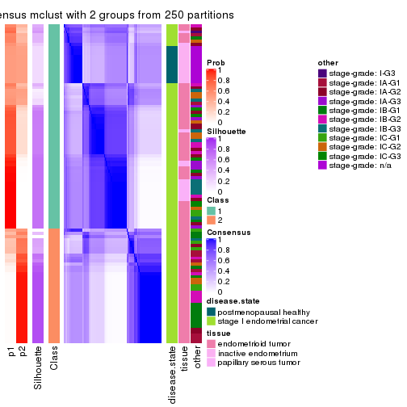</p>

</div>
<div id='tab-MAD-mclust-consensus-heatmap-2'>
<pre><code class="r">consensus_heatmap(res, k = 3)
</code></pre>

<p>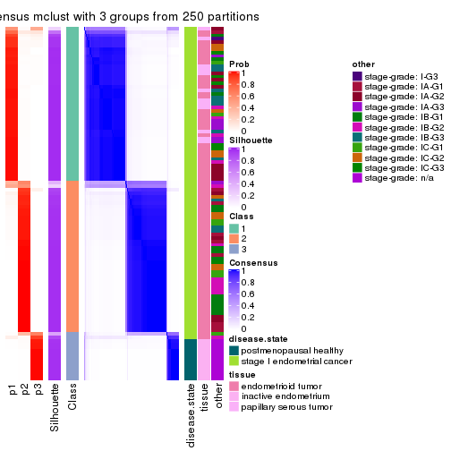</p>

</div>
<div id='tab-MAD-mclust-consensus-heatmap-3'>
<pre><code class="r">consensus_heatmap(res, k = 4)
</code></pre>

<p>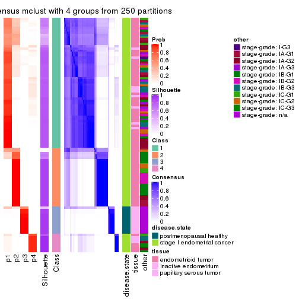</p>

</div>
<div id='tab-MAD-mclust-consensus-heatmap-4'>
<pre><code class="r">consensus_heatmap(res, k = 5)
</code></pre>

<p>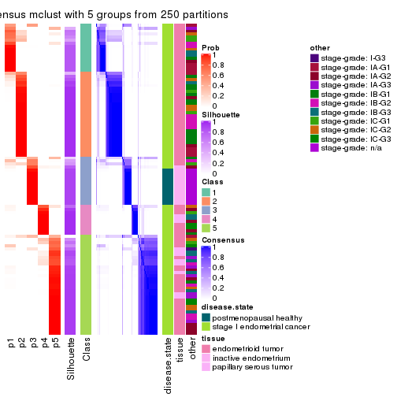</p>

</div>
<div id='tab-MAD-mclust-consensus-heatmap-5'>
<pre><code class="r">consensus_heatmap(res, k = 6)
</code></pre>

<p>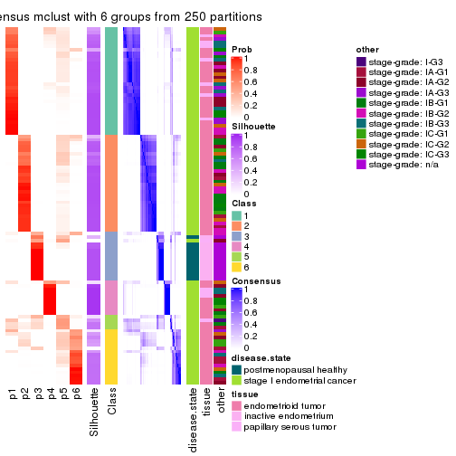</p>

</div>
</div>

Heatmaps for the membership of samples in all partitions to see how consistent they are:


<script>
$( function() {
	$( '#tabs-MAD-mclust-membership-heatmap' ).tabs();
} );
</script>
<div id='tabs-MAD-mclust-membership-heatmap'>
<ul>
<li><a href='#tab-MAD-mclust-membership-heatmap-1'>k = 2</a></li>
<li><a href='#tab-MAD-mclust-membership-heatmap-2'>k = 3</a></li>
<li><a href='#tab-MAD-mclust-membership-heatmap-3'>k = 4</a></li>
<li><a href='#tab-MAD-mclust-membership-heatmap-4'>k = 5</a></li>
<li><a href='#tab-MAD-mclust-membership-heatmap-5'>k = 6</a></li>
</ul>
<div id='tab-MAD-mclust-membership-heatmap-1'>
<pre><code class="r">membership_heatmap(res, k = 2)
</code></pre>

<p>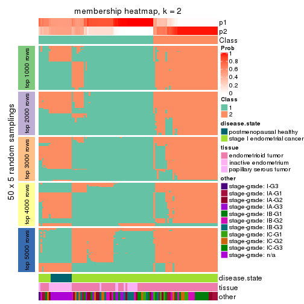</p>

</div>
<div id='tab-MAD-mclust-membership-heatmap-2'>
<pre><code class="r">membership_heatmap(res, k = 3)
</code></pre>

<p>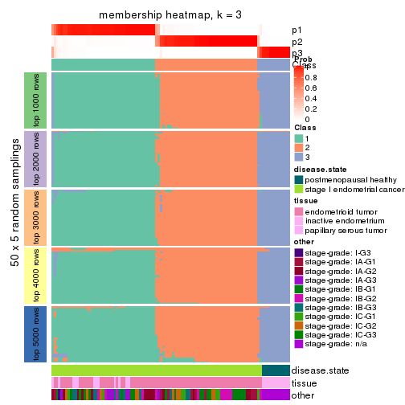</p>

</div>
<div id='tab-MAD-mclust-membership-heatmap-3'>
<pre><code class="r">membership_heatmap(res, k = 4)
</code></pre>

<p>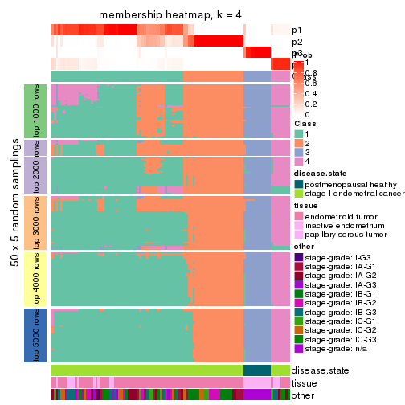</p>

</div>
<div id='tab-MAD-mclust-membership-heatmap-4'>
<pre><code class="r">membership_heatmap(res, k = 5)
</code></pre>

<p>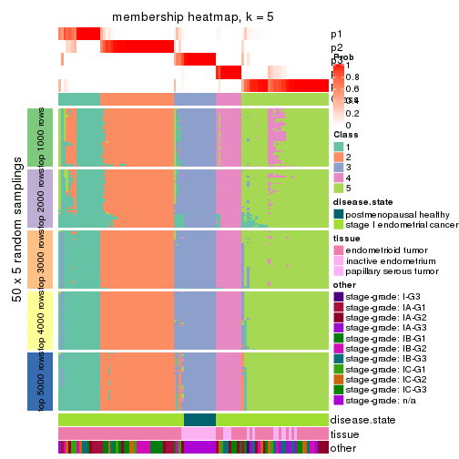</p>

</div>
<div id='tab-MAD-mclust-membership-heatmap-5'>
<pre><code class="r">membership_heatmap(res, k = 6)
</code></pre>

<p>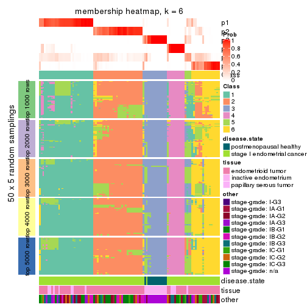</p>

</div>
</div>

As soon as we have had the classes for columns, we can look for signatures
which are significantly different between classes which can be candidate marks
for certain classes. Following are the heatmaps for signatures.


Signature heatmaps where rows are scaled:


<script>
$( function() {
	$( '#tabs-MAD-mclust-get-signatures' ).tabs();
} );
</script>
<div id='tabs-MAD-mclust-get-signatures'>
<ul>
<li><a href='#tab-MAD-mclust-get-signatures-1'>k = 2</a></li>
<li><a href='#tab-MAD-mclust-get-signatures-2'>k = 3</a></li>
<li><a href='#tab-MAD-mclust-get-signatures-3'>k = 4</a></li>
<li><a href='#tab-MAD-mclust-get-signatures-4'>k = 5</a></li>
<li><a href='#tab-MAD-mclust-get-signatures-5'>k = 6</a></li>
</ul>
<div id='tab-MAD-mclust-get-signatures-1'>
<pre><code class="r">get_signatures(res, k = 2)
</code></pre>

<p>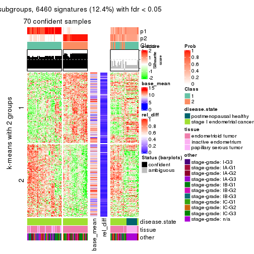</p>

</div>
<div id='tab-MAD-mclust-get-signatures-2'>
<pre><code class="r">get_signatures(res, k = 3)
</code></pre>

<p>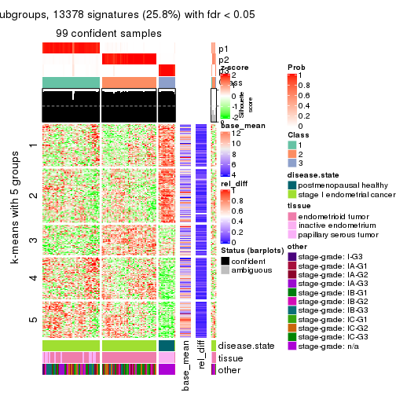</p>

</div>
<div id='tab-MAD-mclust-get-signatures-3'>
<pre><code class="r">get_signatures(res, k = 4)
</code></pre>

<p>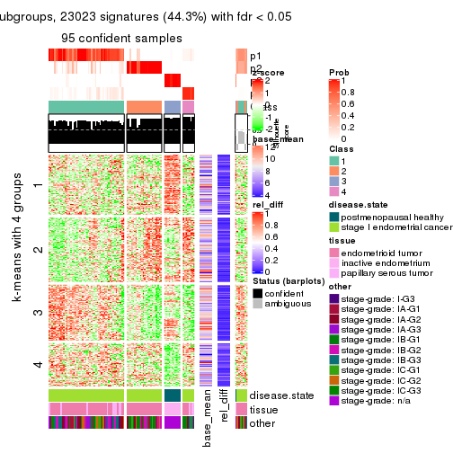</p>

</div>
<div id='tab-MAD-mclust-get-signatures-4'>
<pre><code class="r">get_signatures(res, k = 5)
</code></pre>

<p>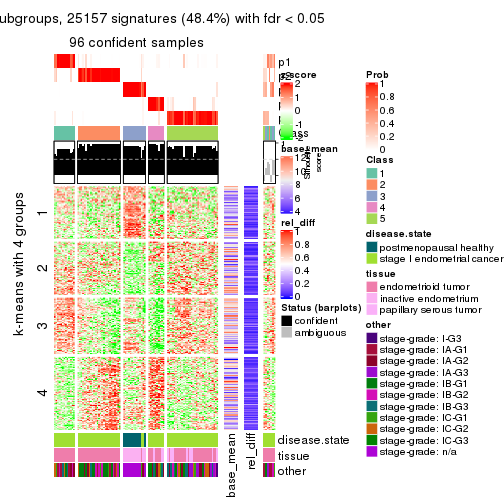</p>

</div>
<div id='tab-MAD-mclust-get-signatures-5'>
<pre><code class="r">get_signatures(res, k = 6)
</code></pre>

<p>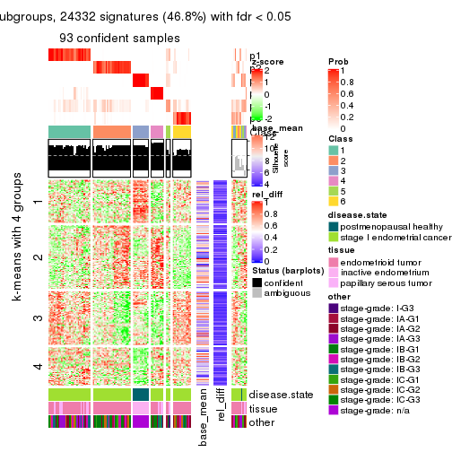</p>

</div>
</div>


Signature heatmaps where rows are not scaled:


<script>
$( function() {
	$( '#tabs-MAD-mclust-get-signatures-no-scale' ).tabs();
} );
</script>
<div id='tabs-MAD-mclust-get-signatures-no-scale'>
<ul>
<li><a href='#tab-MAD-mclust-get-signatures-no-scale-1'>k = 2</a></li>
<li><a href='#tab-MAD-mclust-get-signatures-no-scale-2'>k = 3</a></li>
<li><a href='#tab-MAD-mclust-get-signatures-no-scale-3'>k = 4</a></li>
<li><a href='#tab-MAD-mclust-get-signatures-no-scale-4'>k = 5</a></li>
<li><a href='#tab-MAD-mclust-get-signatures-no-scale-5'>k = 6</a></li>
</ul>
<div id='tab-MAD-mclust-get-signatures-no-scale-1'>
<pre><code class="r">get_signatures(res, k = 2, scale_rows = FALSE)
</code></pre>

<p>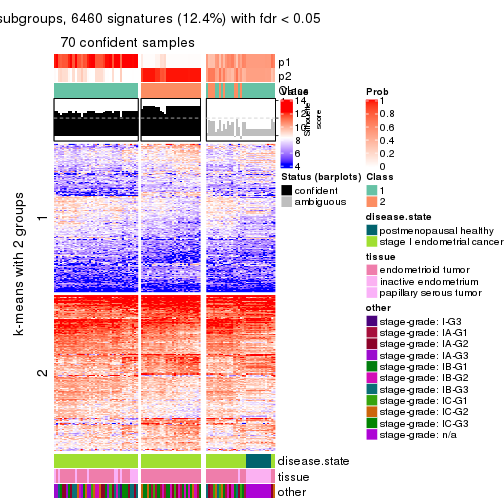</p>

</div>
<div id='tab-MAD-mclust-get-signatures-no-scale-2'>
<pre><code class="r">get_signatures(res, k = 3, scale_rows = FALSE)
</code></pre>

<p>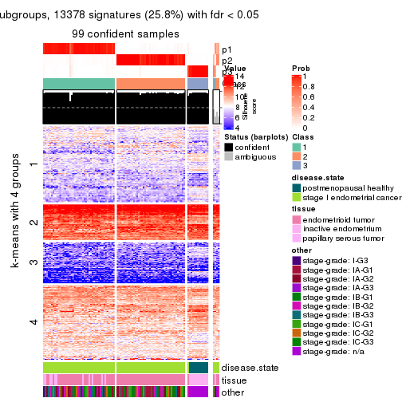</p>

</div>
<div id='tab-MAD-mclust-get-signatures-no-scale-3'>
<pre><code class="r">get_signatures(res, k = 4, scale_rows = FALSE)
</code></pre>

<p>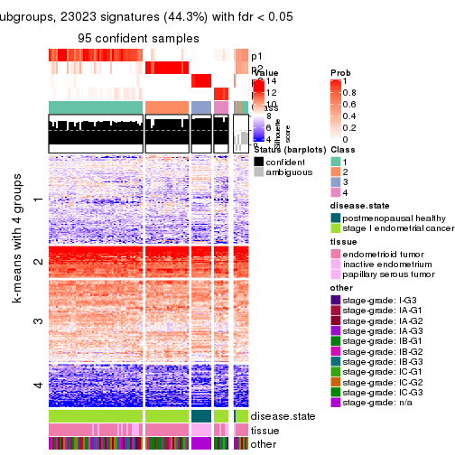</p>

</div>
<div id='tab-MAD-mclust-get-signatures-no-scale-4'>
<pre><code class="r">get_signatures(res, k = 5, scale_rows = FALSE)
</code></pre>

<p>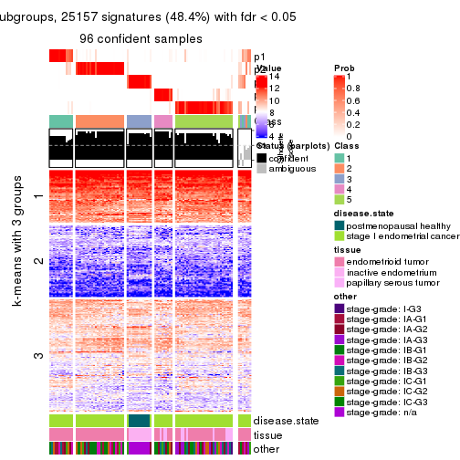</p>

</div>
<div id='tab-MAD-mclust-get-signatures-no-scale-5'>
<pre><code class="r">get_signatures(res, k = 6, scale_rows = FALSE)
</code></pre>

<p>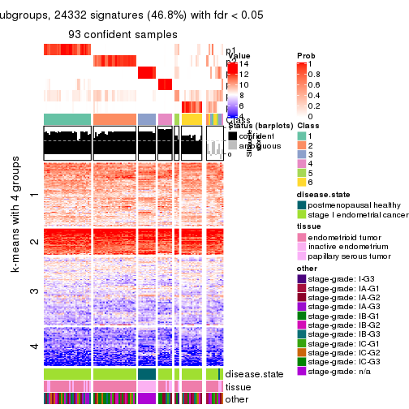</p>

</div>
</div>


Compare the overlap of signatures from different k:

```r
compare_signatures(res)
```

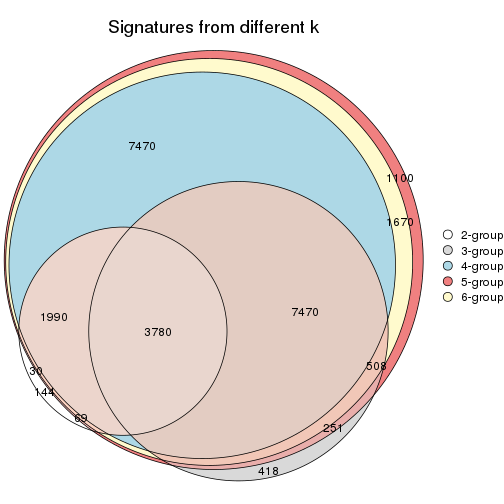

`get_signature()` returns a data frame invisibly. TO get the list of signatures, the function
call should be assigned to a variable explicitly. In following code, if `plot` argument is set
to `FALSE`, no heatmap is plotted while only the differential analysis is performed.

```r
# code only for demonstration
tb = get_signature(res, k = ..., plot = FALSE)
```

An example of the output of `tb` is:

```
#>   which_row         fdr    mean_1    mean_2 scaled_mean_1 scaled_mean_2 km
#> 1        38 0.042760348  8.373488  9.131774    -0.5533452     0.5164555  1
#> 2        40 0.018707592  7.106213  8.469186    -0.6173731     0.5762149  1
#> 3        55 0.019134737 10.221463 11.207825    -0.6159697     0.5749050  1
#> 4        59 0.006059896  5.921854  7.869574    -0.6899429     0.6439467  1
#> 5        60 0.018055526  8.928898 10.211722    -0.6204761     0.5791110  1
#> 6        98 0.009384629 15.714769 14.887706     0.6635654    -0.6193277  2
...
```

The columns in `tb` are:

1. `which_row`: row indices corresponding to the input matrix.
2. `fdr`: FDR for the differential test. 
3. `mean_x`: The mean value in group x.
4. `scaled_mean_x`: The mean value in group x after rows are scaled.
5. `km`: Row groups if k-means clustering is applied to rows.


UMAP plot which shows how samples are separated.


<script>
$( function() {
	$( '#tabs-MAD-mclust-dimension-reduction' ).tabs();
} );
</script>
<div id='tabs-MAD-mclust-dimension-reduction'>
<ul>
<li><a href='#tab-MAD-mclust-dimension-reduction-1'>k = 2</a></li>
<li><a href='#tab-MAD-mclust-dimension-reduction-2'>k = 3</a></li>
<li><a href='#tab-MAD-mclust-dimension-reduction-3'>k = 4</a></li>
<li><a href='#tab-MAD-mclust-dimension-reduction-4'>k = 5</a></li>
<li><a href='#tab-MAD-mclust-dimension-reduction-5'>k = 6</a></li>
</ul>
<div id='tab-MAD-mclust-dimension-reduction-1'>
<pre><code class="r">dimension_reduction(res, k = 2, method = &quot;UMAP&quot;)
</code></pre>

<p>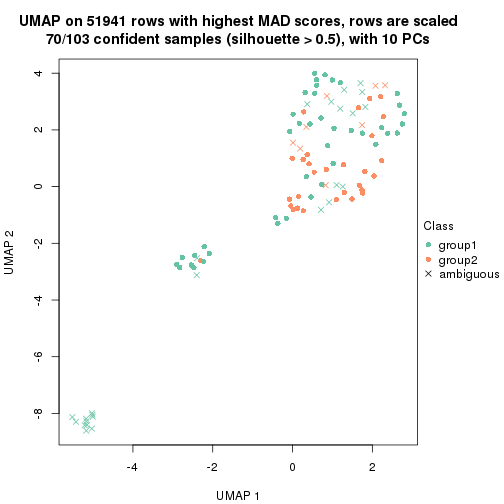</p>

</div>
<div id='tab-MAD-mclust-dimension-reduction-2'>
<pre><code class="r">dimension_reduction(res, k = 3, method = &quot;UMAP&quot;)
</code></pre>

<p>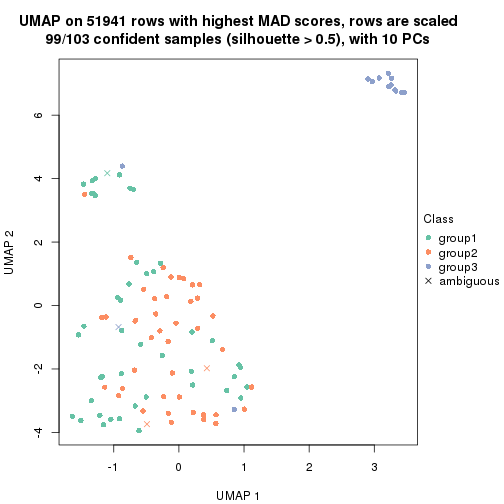</p>

</div>
<div id='tab-MAD-mclust-dimension-reduction-3'>
<pre><code class="r">dimension_reduction(res, k = 4, method = &quot;UMAP&quot;)
</code></pre>

<p>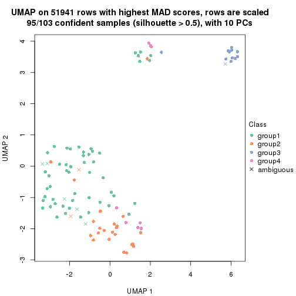</p>

</div>
<div id='tab-MAD-mclust-dimension-reduction-4'>
<pre><code class="r">dimension_reduction(res, k = 5, method = &quot;UMAP&quot;)
</code></pre>

<p>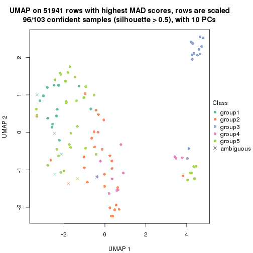</p>

</div>
<div id='tab-MAD-mclust-dimension-reduction-5'>
<pre><code class="r">dimension_reduction(res, k = 6, method = &quot;UMAP&quot;)
</code></pre>

<p>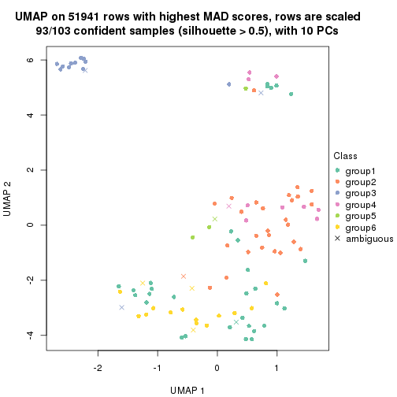</p>

</div>
</div>


Following heatmap shows how subgroups are split when increasing `k`:

```r
collect_classes(res)
```

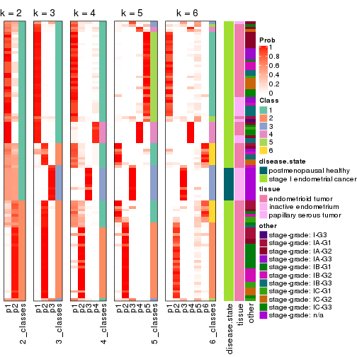


Test correlation between subgroups and known annotations. If the known
annotation is numeric, one-way ANOVA test is applied, and if the known
annotation is discrete, chi-squared contingency table test is applied.

```r
test_to_known_factors(res)
```

```
#>             n disease.state(p) tissue(p) other(p) k
#> MAD:mclust 70               NA  6.83e-03 1.87e-04 2
#> MAD:mclust 99         2.42e-20  1.26e-21 3.30e-16 3
#> MAD:mclust 95         1.85e-20  3.77e-20 4.27e-14 4
#> MAD:mclust 96         1.49e-16  7.09e-17 1.00e-11 5
#> MAD:mclust 93         1.57e-18  1.66e-18 4.09e-16 6
```


If matrix rows can be associated to genes, consider to use `functional_enrichment(res,
...)` to perform function enrichment for the signature genes. See [this vignette](http://bioconductor.org/packages/devel/bioc/vignettes/cola/inst/doc/functional_enrichment.html) for more detailed explanations.


 

---------------------------------------------------


### MAD:NMF


The object with results only for a single top-value method and a single partition method 
can be extracted as:

```r
res = res_list["MAD", "NMF"]
# you can also extract it by
# res = res_list["MAD:NMF"]
```

A summary of `res` and all the functions that can be applied to it:

```r
res
```

```
#> A 'ConsensusPartition' object with k = 2, 3, 4, 5, 6.
#>   On a matrix with 51941 rows and 103 columns.
#>   Top rows (1000, 2000, 3000, 4000, 5000) are extracted by 'MAD' method.
#>   Subgroups are detected by 'NMF' method.
#>   Performed in total 1250 partitions by row resampling.
#>   Best k for subgroups seems to be 2.
#> 
#> Following methods can be applied to this 'ConsensusPartition' object:
#>  [1] "cola_report"             "collect_classes"         "collect_plots"          
#>  [4] "collect_stats"           "colnames"                "compare_signatures"     
#>  [7] "consensus_heatmap"       "dimension_reduction"     "functional_enrichment"  
#> [10] "get_anno_col"            "get_anno"                "get_classes"            
#> [13] "get_consensus"           "get_matrix"              "get_membership"         
#> [16] "get_param"               "get_signatures"          "get_stats"              
#> [19] "is_best_k"               "is_stable_k"             "membership_heatmap"     
#> [22] "ncol"                    "nrow"                    "plot_ecdf"              
#> [25] "rownames"                "select_partition_number" "show"                   
#> [28] "suggest_best_k"          "test_to_known_factors"
```

`collect_plots()` function collects all the plots made from `res` for all `k` (number of partitions)
into one single page to provide an easy and fast comparison between different `k`.

```r
collect_plots(res)
```

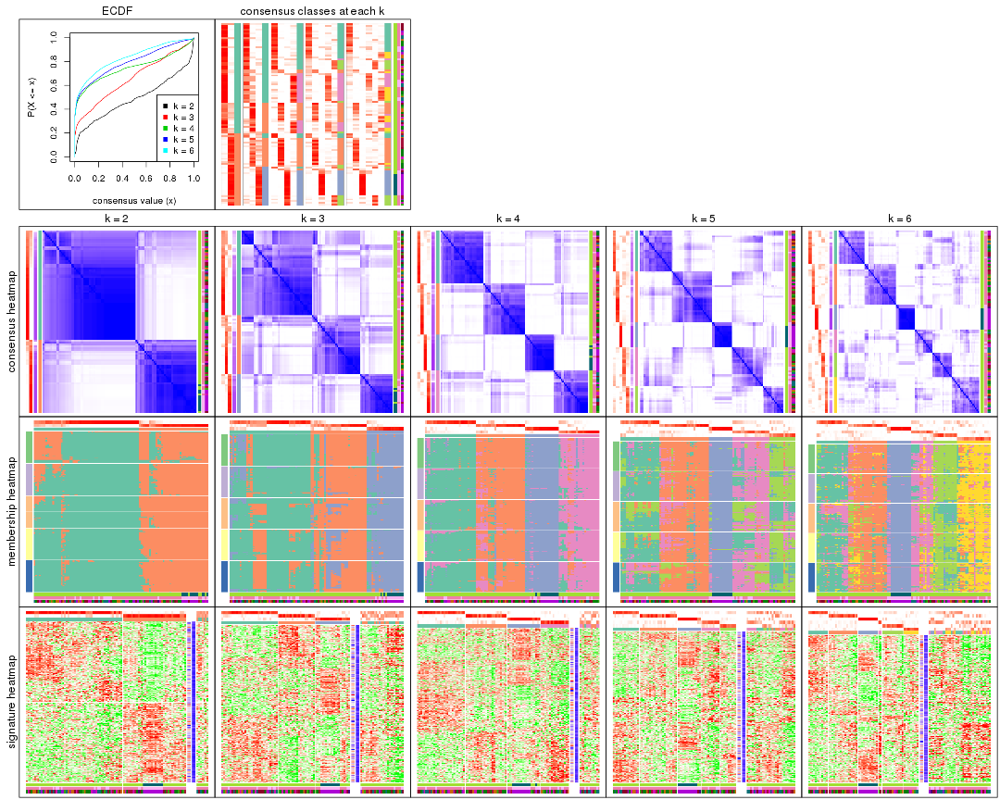

The plots are:

- The first row: a plot of the ECDF (empirical cumulative distribution
  function) curves of the consensus matrix for each `k` and the heatmap of
  predicted classes for each `k`.
- The second row: heatmaps of the consensus matrix for each `k`.
- The third row: heatmaps of the membership matrix for each `k`.
- The fouth row: heatmaps of the signatures for each `k`.

All the plots in panels can be made by individual functions and they are
plotted later in this section.

`select_partition_number()` produces several plots showing different
statistics for choosing "optimized" `k`. There are following statistics:

- ECDF curves of the consensus matrix for each `k`;
- 1-PAC. [The PAC
  score](https://en.wikipedia.org/wiki/Consensus_clustering#Over-interpretation_potential_of_consensus_clustering)
  measures the proportion of the ambiguous subgrouping.
- Mean silhouette score.
- Concordance. The mean probability of fiting the consensus class ids in all
  partitions.
- Area increased. Denote $A_k$ as the area under the ECDF curve for current
  `k`, the area increased is defined as $A_k - A_{k-1}$.
- Rand index. The percent of pairs of samples that are both in a same cluster
  or both are not in a same cluster in the partition of k and k-1.
- Jaccard index. The ratio of pairs of samples are both in a same cluster in
  the partition of k and k-1 and the pairs of samples are both in a same
  cluster in the partition k or k-1.

The detailed explanations of these statistics can be found in [the _cola_
vignette](http://bioconductor.org/packages/devel/bioc/vignettes/cola/inst/doc/cola.html#toc_13).

Generally speaking, lower PAC score, higher mean silhouette score or higher
concordance corresponds to better partition. Rand index and Jaccard index
measure how similar the current partition is compared to partition with `k-1`.
If they are too similar, we won't accept `k` is better than `k-1`.

```r
select_partition_number(res)
```

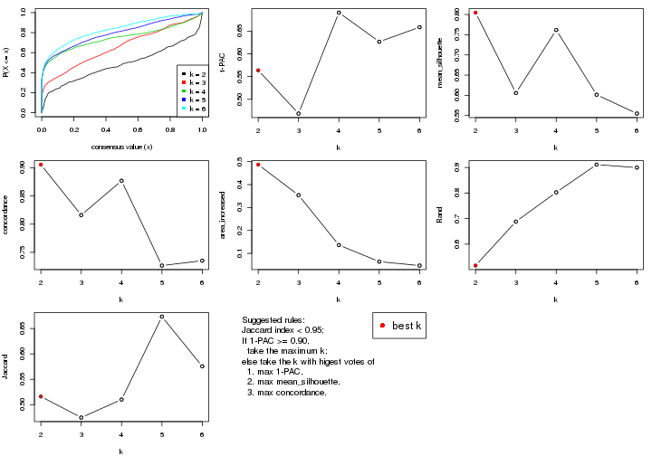

The numeric values for all these statistics can be obtained by `get_stats()`.

```r
get_stats(res)
```

```
#>   k 1-PAC mean_silhouette concordance area_increased  Rand Jaccard
#> 2 2 0.564           0.805       0.906         0.4869 0.516   0.516
#> 3 3 0.469           0.606       0.816         0.3538 0.688   0.475
#> 4 4 0.691           0.762       0.877         0.1362 0.803   0.510
#> 5 5 0.627           0.601       0.727         0.0640 0.911   0.673
#> 6 6 0.659           0.555       0.735         0.0469 0.899   0.576
```

`suggest_best_k()` suggests the best $k$ based on these statistics. The rules are as follows:

- All $k$ with Jaccard index larger than 0.95 are removed because increasing
  $k$ does not provide enough extra information. If all $k$ are removed, it is
  marked as no subgroup is detected.
- For all $k$ with 1-PAC score larger than 0.9, the maximal $k$ is taken as
  the best $k$, and other $k$ are marked as optional $k$.
- If it does not fit the second rule. The $k$ with the maximal vote of the
  highest 1-PAC score, highest mean silhouette, and highest concordance is
  taken as the best $k$.

```r
suggest_best_k(res)
```

```
#> [1] 2
```


Following shows the table of the partitions (You need to click the **show/hide
code output** link to see it). The membership matrix (columns with name `p*`)
is inferred by
[`clue::cl_consensus()`](https://www.rdocumentation.org/link/cl_consensus?package=clue)
function with the `SE` method. Basically the value in the membership matrix
represents the probability to belong to a certain group. The finall class
label for an item is determined with the group with highest probability it
belongs to.

In `get_classes()` function, the entropy is calculated from the membership
matrix and the silhouette score is calculated from the consensus matrix.


<script>
$( function() {
	$( '#tabs-MAD-NMF-get-classes' ).tabs();
} );
</script>
<div id='tabs-MAD-NMF-get-classes'>
<ul>
<li><a href='#tab-MAD-NMF-get-classes-1'>k = 2</a></li>
<li><a href='#tab-MAD-NMF-get-classes-2'>k = 3</a></li>
<li><a href='#tab-MAD-NMF-get-classes-3'>k = 4</a></li>
<li><a href='#tab-MAD-NMF-get-classes-4'>k = 5</a></li>
<li><a href='#tab-MAD-NMF-get-classes-5'>k = 6</a></li>
</ul>

<div id='tab-MAD-NMF-get-classes-1'>
<p><a id='tab-MAD-NMF-get-classes-1-a' style='color:#0366d6' href='#'>show/hide code output</a></p>
<pre><code class="r">cbind(get_classes(res, k = 2), get_membership(res, k = 2))
</code></pre>

<pre><code>#&gt;           class entropy silhouette    p1    p2
#&gt; GSM425907     2  0.3733     0.8734 0.072 0.928
#&gt; GSM425908     1  0.8813     0.6267 0.700 0.300
#&gt; GSM425909     2  0.8555     0.6288 0.280 0.720
#&gt; GSM425910     2  0.5946     0.8074 0.144 0.856
#&gt; GSM425911     2  0.1184     0.8992 0.016 0.984
#&gt; GSM425912     2  0.2043     0.8954 0.032 0.968
#&gt; GSM425913     2  0.4022     0.8678 0.080 0.920
#&gt; GSM425914     2  0.1414     0.8987 0.020 0.980
#&gt; GSM425915     2  0.0376     0.9004 0.004 0.996
#&gt; GSM425874     1  0.0000     0.8915 1.000 0.000
#&gt; GSM425875     1  0.0938     0.8877 0.988 0.012
#&gt; GSM425876     1  1.0000    -0.0423 0.500 0.500
#&gt; GSM425877     1  0.0938     0.8877 0.988 0.012
#&gt; GSM425878     1  0.0376     0.8907 0.996 0.004
#&gt; GSM425879     2  0.1843     0.8966 0.028 0.972
#&gt; GSM425880     1  0.4815     0.8256 0.896 0.104
#&gt; GSM425881     1  0.5946     0.8039 0.856 0.144
#&gt; GSM425882     1  0.9710     0.4218 0.600 0.400
#&gt; GSM425883     1  0.0376     0.8905 0.996 0.004
#&gt; GSM425884     1  0.2236     0.8751 0.964 0.036
#&gt; GSM425885     1  0.0376     0.8905 0.996 0.004
#&gt; GSM425848     1  0.0000     0.8915 1.000 0.000
#&gt; GSM425849     1  0.0000     0.8915 1.000 0.000
#&gt; GSM425850     1  0.0000     0.8915 1.000 0.000
#&gt; GSM425851     1  0.2423     0.8730 0.960 0.040
#&gt; GSM425852     2  0.9460     0.4703 0.364 0.636
#&gt; GSM425893     2  0.0938     0.8997 0.012 0.988
#&gt; GSM425894     1  0.8955     0.6065 0.688 0.312
#&gt; GSM425895     1  0.9087     0.5858 0.676 0.324
#&gt; GSM425896     2  0.1184     0.8997 0.016 0.984
#&gt; GSM425897     2  0.1633     0.8979 0.024 0.976
#&gt; GSM425898     1  0.8144     0.6941 0.748 0.252
#&gt; GSM425899     1  0.0000     0.8915 1.000 0.000
#&gt; GSM425900     2  0.9993    -0.0666 0.484 0.516
#&gt; GSM425901     2  0.9248     0.5259 0.340 0.660
#&gt; GSM425902     1  0.0000     0.8915 1.000 0.000
#&gt; GSM425903     2  0.2043     0.8940 0.032 0.968
#&gt; GSM425904     1  0.4562     0.8325 0.904 0.096
#&gt; GSM425905     2  0.5178     0.8335 0.116 0.884
#&gt; GSM425906     2  0.2043     0.8954 0.032 0.968
#&gt; GSM425863     1  0.0000     0.8915 1.000 0.000
#&gt; GSM425864     2  0.2236     0.8940 0.036 0.964
#&gt; GSM425865     2  0.6343     0.7820 0.160 0.840
#&gt; GSM425866     1  0.0938     0.8886 0.988 0.012
#&gt; GSM425867     2  0.5059     0.8316 0.112 0.888
#&gt; GSM425868     1  0.5842     0.8076 0.860 0.140
#&gt; GSM425869     1  0.7674     0.7276 0.776 0.224
#&gt; GSM425870     2  0.0000     0.8993 0.000 1.000
#&gt; GSM425871     1  0.0000     0.8915 1.000 0.000
#&gt; GSM425872     1  0.9286     0.5483 0.656 0.344
#&gt; GSM425873     1  0.0938     0.8886 0.988 0.012
#&gt; GSM425843     1  0.0000     0.8915 1.000 0.000
#&gt; GSM425844     1  0.0000     0.8915 1.000 0.000
#&gt; GSM425845     2  0.9993     0.1326 0.484 0.516
#&gt; GSM425846     1  0.1184     0.8853 0.984 0.016
#&gt; GSM425847     1  0.9795     0.3874 0.584 0.416
#&gt; GSM425886     2  0.0376     0.9004 0.004 0.996
#&gt; GSM425887     1  0.8713     0.6411 0.708 0.292
#&gt; GSM425888     1  0.6531     0.7833 0.832 0.168
#&gt; GSM425889     1  0.0000     0.8915 1.000 0.000
#&gt; GSM425890     1  0.0376     0.8907 0.996 0.004
#&gt; GSM425891     2  0.2603     0.8906 0.044 0.956
#&gt; GSM425892     2  0.8443     0.5963 0.272 0.728
#&gt; GSM425853     1  0.1843     0.8812 0.972 0.028
#&gt; GSM425854     1  0.7528     0.7360 0.784 0.216
#&gt; GSM425855     1  0.0000     0.8915 1.000 0.000
#&gt; GSM425856     1  0.1184     0.8869 0.984 0.016
#&gt; GSM425857     1  0.8555     0.6011 0.720 0.280
#&gt; GSM425858     1  0.6623     0.7801 0.828 0.172
#&gt; GSM425859     1  0.7815     0.7182 0.768 0.232
#&gt; GSM425860     2  0.4298     0.8720 0.088 0.912
#&gt; GSM425861     1  0.2043     0.8785 0.968 0.032
#&gt; GSM425862     1  0.0000     0.8915 1.000 0.000
#&gt; GSM425837     1  0.0938     0.8877 0.988 0.012
#&gt; GSM425838     1  0.0000     0.8915 1.000 0.000
#&gt; GSM425839     1  0.9608     0.4615 0.616 0.384
#&gt; GSM425840     1  0.0000     0.8915 1.000 0.000
#&gt; GSM425841     1  0.0000     0.8915 1.000 0.000
#&gt; GSM425842     1  0.0672     0.8897 0.992 0.008
#&gt; GSM425917     2  0.1184     0.9005 0.016 0.984
#&gt; GSM425922     1  0.0000     0.8915 1.000 0.000
#&gt; GSM425919     1  0.8016     0.6493 0.756 0.244
#&gt; GSM425920     1  0.0000     0.8915 1.000 0.000
#&gt; GSM425923     1  0.0672     0.8893 0.992 0.008
#&gt; GSM425916     1  0.2043     0.8766 0.968 0.032
#&gt; GSM425918     1  0.0376     0.8907 0.996 0.004
#&gt; GSM425921     1  0.0000     0.8915 1.000 0.000
#&gt; GSM425925     1  0.0000     0.8915 1.000 0.000
#&gt; GSM425926     1  0.0000     0.8915 1.000 0.000
#&gt; GSM425927     1  0.0672     0.8900 0.992 0.008
#&gt; GSM425924     2  0.5294     0.8304 0.120 0.880
#&gt; GSM425928     2  0.1184     0.9003 0.016 0.984
#&gt; GSM425929     2  0.0938     0.9007 0.012 0.988
#&gt; GSM425930     2  0.1184     0.9005 0.016 0.984
#&gt; GSM425931     2  0.1414     0.8992 0.020 0.980
#&gt; GSM425932     2  0.0376     0.9004 0.004 0.996
#&gt; GSM425933     2  0.0672     0.9008 0.008 0.992
#&gt; GSM425934     2  0.0000     0.8993 0.000 1.000
#&gt; GSM425935     2  0.0000     0.8993 0.000 1.000
#&gt; GSM425936     2  0.0000     0.8993 0.000 1.000
#&gt; GSM425937     2  0.1414     0.8992 0.020 0.980
#&gt; GSM425938     2  0.1184     0.9003 0.016 0.984
#&gt; GSM425939     2  0.1414     0.8992 0.020 0.980
</code></pre>

<script>
$('#tab-MAD-NMF-get-classes-1-a').parent().next().next().hide();
$('#tab-MAD-NMF-get-classes-1-a').click(function(){
  $('#tab-MAD-NMF-get-classes-1-a').parent().next().next().toggle();
  return(false);
});
</script>
</div>

<div id='tab-MAD-NMF-get-classes-2'>
<p><a id='tab-MAD-NMF-get-classes-2-a' style='color:#0366d6' href='#'>show/hide code output</a></p>
<pre><code class="r">cbind(get_classes(res, k = 3), get_membership(res, k = 3))
</code></pre>

<pre><code>#&gt;           class entropy silhouette    p1    p2    p3
#&gt; GSM425907     2  0.2878     0.7218 0.000 0.904 0.096
#&gt; GSM425908     2  0.0475     0.7438 0.004 0.992 0.004
#&gt; GSM425909     3  0.5932     0.7326 0.164 0.056 0.780
#&gt; GSM425910     1  0.7591     0.1405 0.544 0.044 0.412
#&gt; GSM425911     2  0.6302     0.2043 0.000 0.520 0.480
#&gt; GSM425912     2  0.9664     0.2394 0.296 0.460 0.244
#&gt; GSM425913     2  0.4235     0.6781 0.000 0.824 0.176
#&gt; GSM425914     2  0.9021     0.1238 0.132 0.452 0.416
#&gt; GSM425915     3  0.0829     0.8684 0.012 0.004 0.984
#&gt; GSM425874     1  0.6286     0.2946 0.536 0.464 0.000
#&gt; GSM425875     1  0.0592     0.7548 0.988 0.000 0.012
#&gt; GSM425876     1  0.6519     0.6283 0.760 0.108 0.132
#&gt; GSM425877     1  0.0747     0.7545 0.984 0.000 0.016
#&gt; GSM425878     1  0.0237     0.7548 0.996 0.004 0.000
#&gt; GSM425879     2  0.5621     0.5485 0.000 0.692 0.308
#&gt; GSM425880     1  0.5216     0.5439 0.740 0.000 0.260
#&gt; GSM425881     1  0.6260     0.1215 0.552 0.448 0.000
#&gt; GSM425882     2  0.0661     0.7437 0.004 0.988 0.008
#&gt; GSM425883     1  0.2711     0.7382 0.912 0.088 0.000
#&gt; GSM425884     1  0.3551     0.6917 0.868 0.000 0.132
#&gt; GSM425885     2  0.5431     0.3659 0.284 0.716 0.000
#&gt; GSM425848     1  0.5216     0.6018 0.740 0.260 0.000
#&gt; GSM425849     1  0.2165     0.7455 0.936 0.064 0.000
#&gt; GSM425850     1  0.0747     0.7530 0.984 0.016 0.000
#&gt; GSM425851     1  0.6810     0.6162 0.720 0.068 0.212
#&gt; GSM425852     3  0.6095     0.3629 0.392 0.000 0.608
#&gt; GSM425893     2  0.6307     0.1849 0.000 0.512 0.488
#&gt; GSM425894     2  0.0237     0.7430 0.004 0.996 0.000
#&gt; GSM425895     2  0.0829     0.7415 0.012 0.984 0.004
#&gt; GSM425896     2  0.4887     0.6424 0.000 0.772 0.228
#&gt; GSM425897     2  0.5254     0.6020 0.000 0.736 0.264
#&gt; GSM425898     2  0.0892     0.7354 0.020 0.980 0.000
#&gt; GSM425899     1  0.6111     0.4228 0.604 0.396 0.000
#&gt; GSM425900     2  0.5178     0.6425 0.164 0.808 0.028
#&gt; GSM425901     3  0.7500     0.6145 0.140 0.164 0.696
#&gt; GSM425902     1  0.6305     0.2513 0.516 0.484 0.000
#&gt; GSM425903     3  0.5244     0.6606 0.240 0.004 0.756
#&gt; GSM425904     1  0.4842     0.5945 0.776 0.000 0.224
#&gt; GSM425905     2  0.2796     0.7233 0.000 0.908 0.092
#&gt; GSM425906     2  0.6081     0.4902 0.004 0.652 0.344
#&gt; GSM425863     1  0.0892     0.7525 0.980 0.020 0.000
#&gt; GSM425864     2  0.4702     0.6521 0.000 0.788 0.212
#&gt; GSM425865     2  0.2165     0.7325 0.000 0.936 0.064
#&gt; GSM425866     1  0.1163     0.7516 0.972 0.000 0.028
#&gt; GSM425867     3  0.4750     0.6997 0.216 0.000 0.784
#&gt; GSM425868     2  0.2165     0.7024 0.064 0.936 0.000
#&gt; GSM425869     2  0.0592     0.7404 0.012 0.988 0.000
#&gt; GSM425870     3  0.5269     0.6274 0.016 0.200 0.784
#&gt; GSM425871     1  0.2356     0.7432 0.928 0.072 0.000
#&gt; GSM425872     2  0.0592     0.7403 0.012 0.988 0.000
#&gt; GSM425873     1  0.0747     0.7543 0.984 0.000 0.016
#&gt; GSM425843     1  0.0424     0.7546 0.992 0.000 0.008
#&gt; GSM425844     1  0.3116     0.7263 0.892 0.108 0.000
#&gt; GSM425845     1  0.5285     0.5683 0.752 0.004 0.244
#&gt; GSM425846     2  0.6154     0.0607 0.408 0.592 0.000
#&gt; GSM425847     1  0.7128     0.3459 0.620 0.344 0.036
#&gt; GSM425886     3  0.2796     0.8153 0.000 0.092 0.908
#&gt; GSM425887     2  0.6286     0.1108 0.464 0.536 0.000
#&gt; GSM425888     1  0.6274     0.1050 0.544 0.456 0.000
#&gt; GSM425889     1  0.4346     0.6768 0.816 0.184 0.000
#&gt; GSM425890     1  0.6305     0.2471 0.516 0.484 0.000
#&gt; GSM425891     2  0.5291     0.5982 0.000 0.732 0.268
#&gt; GSM425892     2  0.1529     0.7381 0.000 0.960 0.040
#&gt; GSM425853     1  0.1860     0.7444 0.948 0.000 0.052
#&gt; GSM425854     2  0.0592     0.7395 0.012 0.988 0.000
#&gt; GSM425855     1  0.1411     0.7514 0.964 0.036 0.000
#&gt; GSM425856     1  0.1031     0.7529 0.976 0.000 0.024
#&gt; GSM425857     2  0.9077     0.1728 0.152 0.508 0.340
#&gt; GSM425858     2  0.5327     0.4884 0.272 0.728 0.000
#&gt; GSM425859     2  0.0237     0.7430 0.004 0.996 0.000
#&gt; GSM425860     1  0.9282     0.0315 0.468 0.164 0.368
#&gt; GSM425861     1  0.4654     0.6148 0.792 0.208 0.000
#&gt; GSM425862     1  0.4887     0.6393 0.772 0.228 0.000
#&gt; GSM425837     1  0.0747     0.7541 0.984 0.000 0.016
#&gt; GSM425838     2  0.6305    -0.2059 0.484 0.516 0.000
#&gt; GSM425839     2  0.0237     0.7430 0.004 0.996 0.000
#&gt; GSM425840     1  0.0000     0.7545 1.000 0.000 0.000
#&gt; GSM425841     1  0.6307     0.2419 0.512 0.488 0.000
#&gt; GSM425842     1  0.0592     0.7546 0.988 0.000 0.012
#&gt; GSM425917     3  0.3193     0.8115 0.004 0.100 0.896
#&gt; GSM425922     1  0.6305     0.2511 0.516 0.484 0.000
#&gt; GSM425919     1  0.5968     0.3545 0.636 0.000 0.364
#&gt; GSM425920     1  0.0237     0.7546 0.996 0.000 0.004
#&gt; GSM425923     1  0.2774     0.7447 0.920 0.072 0.008
#&gt; GSM425916     1  0.4750     0.6023 0.784 0.000 0.216
#&gt; GSM425918     1  0.2165     0.7455 0.936 0.064 0.000
#&gt; GSM425921     1  0.6280     0.3035 0.540 0.460 0.000
#&gt; GSM425925     1  0.4178     0.6878 0.828 0.172 0.000
#&gt; GSM425926     1  0.6168     0.3937 0.588 0.412 0.000
#&gt; GSM425927     1  0.0592     0.7546 0.988 0.000 0.012
#&gt; GSM425924     3  0.3412     0.8021 0.124 0.000 0.876
#&gt; GSM425928     3  0.1751     0.8655 0.012 0.028 0.960
#&gt; GSM425929     3  0.0424     0.8688 0.008 0.000 0.992
#&gt; GSM425930     3  0.0592     0.8681 0.012 0.000 0.988
#&gt; GSM425931     3  0.1015     0.8694 0.012 0.008 0.980
#&gt; GSM425932     3  0.0424     0.8666 0.000 0.008 0.992
#&gt; GSM425933     3  0.0475     0.8688 0.004 0.004 0.992
#&gt; GSM425934     3  0.1411     0.8542 0.000 0.036 0.964
#&gt; GSM425935     3  0.3267     0.7865 0.000 0.116 0.884
#&gt; GSM425936     3  0.1031     0.8622 0.000 0.024 0.976
#&gt; GSM425937     3  0.0661     0.8692 0.008 0.004 0.988
#&gt; GSM425938     3  0.1031     0.8625 0.000 0.024 0.976
#&gt; GSM425939     3  0.0892     0.8653 0.020 0.000 0.980
</code></pre>

<script>
$('#tab-MAD-NMF-get-classes-2-a').parent().next().next().hide();
$('#tab-MAD-NMF-get-classes-2-a').click(function(){
  $('#tab-MAD-NMF-get-classes-2-a').parent().next().next().toggle();
  return(false);
});
</script>
</div>

<div id='tab-MAD-NMF-get-classes-3'>
<p><a id='tab-MAD-NMF-get-classes-3-a' style='color:#0366d6' href='#'>show/hide code output</a></p>
<pre><code class="r">cbind(get_classes(res, k = 4), get_membership(res, k = 4))
</code></pre>

<pre><code>#&gt;           class entropy silhouette    p1    p2    p3    p4
#&gt; GSM425907     2  0.4222     0.6602 0.000 0.728 0.000 0.272
#&gt; GSM425908     2  0.4977     0.2776 0.000 0.540 0.000 0.460
#&gt; GSM425909     3  0.3005     0.8993 0.048 0.008 0.900 0.044
#&gt; GSM425910     1  0.1356     0.8662 0.960 0.032 0.008 0.000
#&gt; GSM425911     2  0.0927     0.8162 0.016 0.976 0.008 0.000
#&gt; GSM425912     2  0.4456     0.6081 0.280 0.716 0.004 0.000
#&gt; GSM425913     2  0.0592     0.8199 0.000 0.984 0.000 0.016
#&gt; GSM425914     2  0.2654     0.7744 0.108 0.888 0.004 0.000
#&gt; GSM425915     3  0.0376     0.9490 0.004 0.004 0.992 0.000
#&gt; GSM425874     4  0.0188     0.8032 0.004 0.000 0.000 0.996
#&gt; GSM425875     1  0.1978     0.8757 0.928 0.000 0.004 0.068
#&gt; GSM425876     1  0.1305     0.8655 0.960 0.036 0.004 0.000
#&gt; GSM425877     1  0.3870     0.7495 0.788 0.000 0.004 0.208
#&gt; GSM425878     1  0.1716     0.8772 0.936 0.000 0.000 0.064
#&gt; GSM425879     2  0.0000     0.8190 0.000 1.000 0.000 0.000
#&gt; GSM425880     1  0.3900     0.8317 0.844 0.000 0.084 0.072
#&gt; GSM425881     2  0.4866     0.3878 0.404 0.596 0.000 0.000
#&gt; GSM425882     2  0.0657     0.8209 0.004 0.984 0.000 0.012
#&gt; GSM425883     4  0.4643     0.4583 0.344 0.000 0.000 0.656
#&gt; GSM425884     1  0.0707     0.8844 0.980 0.000 0.000 0.020
#&gt; GSM425885     4  0.1302     0.7741 0.000 0.044 0.000 0.956
#&gt; GSM425848     4  0.2704     0.7700 0.124 0.000 0.000 0.876
#&gt; GSM425849     1  0.2704     0.8407 0.876 0.000 0.000 0.124
#&gt; GSM425850     1  0.0469     0.8772 0.988 0.012 0.000 0.000
#&gt; GSM425851     4  0.6500     0.2769 0.080 0.000 0.376 0.544
#&gt; GSM425852     3  0.4524     0.7155 0.204 0.000 0.768 0.028
#&gt; GSM425893     2  0.0779     0.8170 0.004 0.980 0.016 0.000
#&gt; GSM425894     4  0.4585     0.3480 0.000 0.332 0.000 0.668
#&gt; GSM425895     2  0.2345     0.7982 0.000 0.900 0.000 0.100
#&gt; GSM425896     2  0.6068     0.6344 0.000 0.676 0.116 0.208
#&gt; GSM425897     2  0.0921     0.8192 0.000 0.972 0.000 0.028
#&gt; GSM425898     2  0.3873     0.7066 0.000 0.772 0.000 0.228
#&gt; GSM425899     4  0.3999     0.7642 0.140 0.036 0.000 0.824
#&gt; GSM425900     2  0.1022     0.8131 0.032 0.968 0.000 0.000
#&gt; GSM425901     3  0.3850     0.7756 0.004 0.004 0.804 0.188
#&gt; GSM425902     4  0.0000     0.8025 0.000 0.000 0.000 1.000
#&gt; GSM425903     1  0.4524     0.7035 0.768 0.028 0.204 0.000
#&gt; GSM425904     1  0.5783     0.6823 0.708 0.000 0.172 0.120
#&gt; GSM425905     2  0.0817     0.8195 0.000 0.976 0.000 0.024
#&gt; GSM425906     2  0.0921     0.8143 0.028 0.972 0.000 0.000
#&gt; GSM425863     1  0.1867     0.8742 0.928 0.000 0.000 0.072
#&gt; GSM425864     2  0.0921     0.8192 0.000 0.972 0.000 0.028
#&gt; GSM425865     2  0.1637     0.8126 0.000 0.940 0.000 0.060
#&gt; GSM425866     1  0.0707     0.8846 0.980 0.000 0.000 0.020
#&gt; GSM425867     3  0.2345     0.8733 0.100 0.000 0.900 0.000
#&gt; GSM425868     4  0.3528     0.6221 0.000 0.192 0.000 0.808
#&gt; GSM425869     4  0.3123     0.6687 0.000 0.156 0.000 0.844
#&gt; GSM425870     2  0.5856     0.2555 0.036 0.556 0.408 0.000
#&gt; GSM425871     1  0.1474     0.8820 0.948 0.000 0.000 0.052
#&gt; GSM425872     2  0.4164     0.6673 0.000 0.736 0.000 0.264
#&gt; GSM425873     1  0.0336     0.8786 0.992 0.008 0.000 0.000
#&gt; GSM425843     1  0.0707     0.8844 0.980 0.000 0.000 0.020
#&gt; GSM425844     4  0.4898     0.3070 0.416 0.000 0.000 0.584
#&gt; GSM425845     1  0.0895     0.8733 0.976 0.020 0.004 0.000
#&gt; GSM425846     4  0.6926     0.0834 0.112 0.392 0.000 0.496
#&gt; GSM425847     1  0.2831     0.7981 0.876 0.120 0.004 0.000
#&gt; GSM425886     3  0.1059     0.9414 0.000 0.012 0.972 0.016
#&gt; GSM425887     2  0.4134     0.6452 0.260 0.740 0.000 0.000
#&gt; GSM425888     2  0.4776     0.4540 0.376 0.624 0.000 0.000
#&gt; GSM425889     4  0.1716     0.7978 0.064 0.000 0.000 0.936
#&gt; GSM425890     4  0.0000     0.8025 0.000 0.000 0.000 1.000
#&gt; GSM425891     2  0.0000     0.8190 0.000 1.000 0.000 0.000
#&gt; GSM425892     2  0.4454     0.6102 0.000 0.692 0.000 0.308
#&gt; GSM425853     1  0.1356     0.8850 0.960 0.000 0.008 0.032
#&gt; GSM425854     2  0.2216     0.8021 0.000 0.908 0.000 0.092
#&gt; GSM425855     1  0.4040     0.6892 0.752 0.000 0.000 0.248
#&gt; GSM425856     1  0.1209     0.8851 0.964 0.000 0.004 0.032
#&gt; GSM425857     4  0.2861     0.7530 0.000 0.016 0.096 0.888
#&gt; GSM425858     2  0.1867     0.7991 0.072 0.928 0.000 0.000
#&gt; GSM425859     2  0.4304     0.6436 0.000 0.716 0.000 0.284
#&gt; GSM425860     1  0.2060     0.8509 0.932 0.052 0.016 0.000
#&gt; GSM425861     1  0.3123     0.7581 0.844 0.156 0.000 0.000
#&gt; GSM425862     4  0.1792     0.7966 0.068 0.000 0.000 0.932
#&gt; GSM425837     1  0.2149     0.8656 0.912 0.000 0.000 0.088
#&gt; GSM425838     4  0.0000     0.8025 0.000 0.000 0.000 1.000
#&gt; GSM425839     2  0.2081     0.8059 0.000 0.916 0.000 0.084
#&gt; GSM425840     1  0.2011     0.8698 0.920 0.000 0.000 0.080
#&gt; GSM425841     4  0.0000     0.8025 0.000 0.000 0.000 1.000
#&gt; GSM425842     1  0.0000     0.8807 1.000 0.000 0.000 0.000
#&gt; GSM425917     3  0.3306     0.8204 0.000 0.004 0.840 0.156
#&gt; GSM425922     4  0.0000     0.8025 0.000 0.000 0.000 1.000
#&gt; GSM425919     1  0.4139     0.7938 0.816 0.000 0.144 0.040
#&gt; GSM425920     1  0.2216     0.8645 0.908 0.000 0.000 0.092
#&gt; GSM425923     4  0.3583     0.7096 0.180 0.000 0.004 0.816
#&gt; GSM425916     1  0.7882    -0.0398 0.368 0.000 0.284 0.348
#&gt; GSM425918     4  0.4564     0.4988 0.328 0.000 0.000 0.672
#&gt; GSM425921     4  0.0469     0.8036 0.012 0.000 0.000 0.988
#&gt; GSM425925     4  0.4713     0.4378 0.360 0.000 0.000 0.640
#&gt; GSM425926     4  0.0707     0.8036 0.020 0.000 0.000 0.980
#&gt; GSM425927     1  0.0188     0.8817 0.996 0.000 0.000 0.004
#&gt; GSM425924     3  0.1109     0.9386 0.004 0.000 0.968 0.028
#&gt; GSM425928     3  0.0336     0.9500 0.000 0.000 0.992 0.008
#&gt; GSM425929     3  0.0000     0.9509 0.000 0.000 1.000 0.000
#&gt; GSM425930     3  0.0000     0.9509 0.000 0.000 1.000 0.000
#&gt; GSM425931     3  0.0336     0.9500 0.000 0.000 0.992 0.008
#&gt; GSM425932     3  0.0000     0.9509 0.000 0.000 1.000 0.000
#&gt; GSM425933     3  0.0000     0.9509 0.000 0.000 1.000 0.000
#&gt; GSM425934     3  0.0188     0.9496 0.000 0.004 0.996 0.000
#&gt; GSM425935     3  0.0804     0.9463 0.000 0.012 0.980 0.008
#&gt; GSM425936     3  0.0188     0.9504 0.000 0.000 0.996 0.004
#&gt; GSM425937     3  0.0000     0.9509 0.000 0.000 1.000 0.000
#&gt; GSM425938     3  0.0336     0.9500 0.000 0.000 0.992 0.008
#&gt; GSM425939     3  0.0000     0.9509 0.000 0.000 1.000 0.000
</code></pre>

<script>
$('#tab-MAD-NMF-get-classes-3-a').parent().next().next().hide();
$('#tab-MAD-NMF-get-classes-3-a').click(function(){
  $('#tab-MAD-NMF-get-classes-3-a').parent().next().next().toggle();
  return(false);
});
</script>
</div>

<div id='tab-MAD-NMF-get-classes-4'>
<p><a id='tab-MAD-NMF-get-classes-4-a' style='color:#0366d6' href='#'>show/hide code output</a></p>
<pre><code class="r">cbind(get_classes(res, k = 5), get_membership(res, k = 5))
</code></pre>

<pre><code>#&gt;           class entropy silhouette    p1    p2    p3    p4    p5
#&gt; GSM425907     2  0.6284     0.4004 0.000 0.508 0.000 0.320 0.172
#&gt; GSM425908     2  0.6370     0.2333 0.000 0.432 0.000 0.404 0.164
#&gt; GSM425909     5  0.2277     0.6765 0.016 0.000 0.052 0.016 0.916
#&gt; GSM425910     1  0.4468     0.4709 0.716 0.044 0.000 0.000 0.240
#&gt; GSM425911     2  0.0609     0.7631 0.000 0.980 0.000 0.000 0.020
#&gt; GSM425912     2  0.3534     0.5432 0.256 0.744 0.000 0.000 0.000
#&gt; GSM425913     2  0.0510     0.7685 0.000 0.984 0.000 0.016 0.000
#&gt; GSM425914     2  0.3445     0.6759 0.140 0.824 0.000 0.000 0.036
#&gt; GSM425915     5  0.4905     0.4935 0.040 0.000 0.336 0.000 0.624
#&gt; GSM425874     4  0.2848     0.6345 0.028 0.000 0.000 0.868 0.104
#&gt; GSM425875     5  0.3689     0.6293 0.256 0.000 0.004 0.000 0.740
#&gt; GSM425876     1  0.3682     0.6487 0.820 0.108 0.000 0.000 0.072
#&gt; GSM425877     1  0.4389     0.3149 0.624 0.000 0.004 0.368 0.004
#&gt; GSM425878     1  0.1701     0.7242 0.936 0.000 0.000 0.016 0.048
#&gt; GSM425879     2  0.1243     0.7702 0.000 0.960 0.004 0.028 0.008
#&gt; GSM425880     5  0.3696     0.6647 0.212 0.000 0.016 0.000 0.772
#&gt; GSM425881     2  0.3932     0.4189 0.328 0.672 0.000 0.000 0.000
#&gt; GSM425882     2  0.0404     0.7684 0.000 0.988 0.000 0.012 0.000
#&gt; GSM425883     4  0.4165     0.4500 0.320 0.000 0.000 0.672 0.008
#&gt; GSM425884     1  0.1701     0.7266 0.936 0.000 0.000 0.016 0.048
#&gt; GSM425885     4  0.4419     0.4604 0.000 0.020 0.000 0.668 0.312
#&gt; GSM425848     5  0.3053     0.5114 0.008 0.000 0.000 0.164 0.828
#&gt; GSM425849     1  0.3281     0.7083 0.848 0.000 0.000 0.092 0.060
#&gt; GSM425850     1  0.2616     0.7142 0.880 0.100 0.000 0.020 0.000
#&gt; GSM425851     4  0.6543     0.2794 0.192 0.000 0.316 0.488 0.004
#&gt; GSM425852     5  0.5361     0.6449 0.144 0.000 0.188 0.000 0.668
#&gt; GSM425893     2  0.4547     0.5654 0.000 0.712 0.024 0.012 0.252
#&gt; GSM425894     4  0.6219     0.2382 0.000 0.240 0.000 0.548 0.212
#&gt; GSM425895     2  0.4349     0.6974 0.000 0.756 0.000 0.176 0.068
#&gt; GSM425896     5  0.7308    -0.0666 0.000 0.276 0.032 0.256 0.436
#&gt; GSM425897     2  0.2238     0.7688 0.000 0.912 0.020 0.064 0.004
#&gt; GSM425898     2  0.4788     0.6516 0.000 0.696 0.000 0.240 0.064
#&gt; GSM425899     4  0.6599     0.5334 0.156 0.032 0.000 0.572 0.240
#&gt; GSM425900     2  0.0451     0.7645 0.004 0.988 0.000 0.000 0.008
#&gt; GSM425901     5  0.2149     0.6416 0.000 0.000 0.036 0.048 0.916
#&gt; GSM425902     4  0.3790     0.5297 0.000 0.004 0.000 0.724 0.272
#&gt; GSM425903     5  0.4599     0.6144 0.272 0.000 0.040 0.000 0.688
#&gt; GSM425904     5  0.3456     0.6760 0.184 0.000 0.016 0.000 0.800
#&gt; GSM425905     2  0.1331     0.7710 0.000 0.952 0.000 0.040 0.008
#&gt; GSM425906     2  0.0290     0.7625 0.008 0.992 0.000 0.000 0.000
#&gt; GSM425863     1  0.3051     0.6853 0.852 0.000 0.000 0.120 0.028
#&gt; GSM425864     2  0.2853     0.7623 0.000 0.880 0.004 0.076 0.040
#&gt; GSM425865     2  0.2561     0.7610 0.000 0.884 0.000 0.096 0.020
#&gt; GSM425866     5  0.4088     0.4629 0.368 0.000 0.000 0.000 0.632
#&gt; GSM425867     5  0.6233     0.3535 0.144 0.000 0.396 0.000 0.460
#&gt; GSM425868     4  0.4971     0.4806 0.000 0.144 0.000 0.712 0.144
#&gt; GSM425869     4  0.5222     0.4838 0.000 0.124 0.000 0.680 0.196
#&gt; GSM425870     2  0.4951     0.2238 0.012 0.556 0.420 0.000 0.012
#&gt; GSM425871     1  0.3628     0.5916 0.772 0.012 0.000 0.216 0.000
#&gt; GSM425872     2  0.4313     0.6802 0.000 0.732 0.000 0.228 0.040
#&gt; GSM425873     1  0.2141     0.7172 0.916 0.064 0.000 0.004 0.016
#&gt; GSM425843     1  0.1579     0.7329 0.944 0.000 0.000 0.024 0.032
#&gt; GSM425844     4  0.4410     0.2104 0.440 0.000 0.000 0.556 0.004
#&gt; GSM425845     1  0.4015     0.2838 0.652 0.000 0.000 0.000 0.348
#&gt; GSM425846     2  0.7564     0.2895 0.128 0.472 0.000 0.292 0.108
#&gt; GSM425847     1  0.4046     0.5585 0.696 0.296 0.000 0.008 0.000
#&gt; GSM425886     5  0.3575     0.6374 0.000 0.000 0.120 0.056 0.824
#&gt; GSM425887     2  0.2891     0.6598 0.176 0.824 0.000 0.000 0.000
#&gt; GSM425888     2  0.4653     0.4037 0.324 0.652 0.000 0.016 0.008
#&gt; GSM425889     4  0.5382     0.5942 0.120 0.000 0.000 0.656 0.224
#&gt; GSM425890     4  0.2588     0.6462 0.100 0.000 0.008 0.884 0.008
#&gt; GSM425891     2  0.0162     0.7657 0.000 0.996 0.000 0.004 0.000
#&gt; GSM425892     2  0.5655     0.5403 0.000 0.600 0.000 0.288 0.112
#&gt; GSM425853     1  0.4242     0.0630 0.572 0.000 0.000 0.000 0.428
#&gt; GSM425854     2  0.3289     0.7488 0.000 0.844 0.000 0.108 0.048
#&gt; GSM425855     1  0.4288     0.3973 0.664 0.000 0.000 0.324 0.012
#&gt; GSM425856     5  0.3700     0.6466 0.240 0.000 0.008 0.000 0.752
#&gt; GSM425857     5  0.3783     0.3740 0.000 0.000 0.008 0.252 0.740
#&gt; GSM425858     2  0.1638     0.7459 0.064 0.932 0.000 0.000 0.004
#&gt; GSM425859     2  0.5523     0.5217 0.000 0.592 0.000 0.320 0.088
#&gt; GSM425860     1  0.4116     0.6046 0.756 0.212 0.004 0.000 0.028
#&gt; GSM425861     1  0.4454     0.6005 0.708 0.260 0.000 0.028 0.004
#&gt; GSM425862     4  0.4968     0.6385 0.136 0.000 0.000 0.712 0.152
#&gt; GSM425837     1  0.2813     0.7111 0.876 0.000 0.000 0.040 0.084
#&gt; GSM425838     4  0.3662     0.5357 0.000 0.004 0.000 0.744 0.252
#&gt; GSM425839     2  0.3262     0.7467 0.000 0.840 0.000 0.124 0.036
#&gt; GSM425840     1  0.2462     0.6912 0.880 0.000 0.000 0.112 0.008
#&gt; GSM425841     4  0.2921     0.6025 0.004 0.004 0.000 0.844 0.148
#&gt; GSM425842     1  0.1741     0.7208 0.936 0.024 0.000 0.000 0.040
#&gt; GSM425917     3  0.5100     0.5100 0.056 0.000 0.652 0.288 0.004
#&gt; GSM425922     4  0.2488     0.6331 0.124 0.000 0.004 0.872 0.000
#&gt; GSM425919     1  0.6662     0.1718 0.480 0.000 0.276 0.240 0.004
#&gt; GSM425920     1  0.4335     0.4075 0.664 0.000 0.008 0.324 0.004
#&gt; GSM425923     4  0.4346     0.4585 0.304 0.000 0.012 0.680 0.004
#&gt; GSM425916     4  0.6724     0.2364 0.296 0.000 0.240 0.460 0.004
#&gt; GSM425918     4  0.4824     0.3269 0.380 0.000 0.020 0.596 0.004
#&gt; GSM425921     4  0.2629     0.6478 0.104 0.000 0.004 0.880 0.012
#&gt; GSM425925     4  0.4547     0.3227 0.400 0.000 0.000 0.588 0.012
#&gt; GSM425926     4  0.3307     0.6554 0.104 0.000 0.000 0.844 0.052
#&gt; GSM425927     1  0.1430     0.7215 0.944 0.000 0.000 0.052 0.004
#&gt; GSM425924     3  0.5183     0.5900 0.104 0.000 0.692 0.200 0.004
#&gt; GSM425928     3  0.0404     0.9265 0.000 0.000 0.988 0.012 0.000
#&gt; GSM425929     3  0.0000     0.9321 0.000 0.000 1.000 0.000 0.000
#&gt; GSM425930     3  0.0290     0.9288 0.000 0.000 0.992 0.000 0.008
#&gt; GSM425931     3  0.0162     0.9314 0.000 0.000 0.996 0.000 0.004
#&gt; GSM425932     3  0.0000     0.9321 0.000 0.000 1.000 0.000 0.000
#&gt; GSM425933     3  0.0000     0.9321 0.000 0.000 1.000 0.000 0.000
#&gt; GSM425934     3  0.0404     0.9263 0.000 0.012 0.988 0.000 0.000
#&gt; GSM425935     3  0.0566     0.9249 0.000 0.004 0.984 0.012 0.000
#&gt; GSM425936     3  0.0162     0.9310 0.000 0.004 0.996 0.000 0.000
#&gt; GSM425937     3  0.0162     0.9314 0.000 0.000 0.996 0.000 0.004
#&gt; GSM425938     3  0.0290     0.9285 0.000 0.000 0.992 0.000 0.008
#&gt; GSM425939     3  0.0162     0.9314 0.000 0.000 0.996 0.000 0.004
</code></pre>

<script>
$('#tab-MAD-NMF-get-classes-4-a').parent().next().next().hide();
$('#tab-MAD-NMF-get-classes-4-a').click(function(){
  $('#tab-MAD-NMF-get-classes-4-a').parent().next().next().toggle();
  return(false);
});
</script>
</div>

<div id='tab-MAD-NMF-get-classes-5'>
<p><a id='tab-MAD-NMF-get-classes-5-a' style='color:#0366d6' href='#'>show/hide code output</a></p>
<pre><code class="r">cbind(get_classes(res, k = 6), get_membership(res, k = 6))
</code></pre>

<pre><code>#&gt;           class entropy silhouette    p1    p2    p3    p4    p5    p6
#&gt; GSM425907     2  0.6883    0.29166 0.000 0.432 0.004 0.336 0.152 0.076
#&gt; GSM425908     4  0.6381   -0.00522 0.000 0.304 0.000 0.508 0.120 0.068
#&gt; GSM425909     5  0.1490    0.74902 0.004 0.000 0.024 0.016 0.948 0.008
#&gt; GSM425910     1  0.3421    0.54403 0.780 0.012 0.000 0.004 0.200 0.004
#&gt; GSM425911     2  0.3844    0.71203 0.048 0.800 0.004 0.012 0.132 0.004
#&gt; GSM425912     2  0.3432    0.59996 0.216 0.764 0.000 0.000 0.000 0.020
#&gt; GSM425913     2  0.1296    0.71479 0.000 0.948 0.004 0.004 0.000 0.044
#&gt; GSM425914     2  0.3168    0.65757 0.192 0.792 0.000 0.000 0.016 0.000
#&gt; GSM425915     5  0.3803    0.65086 0.020 0.000 0.252 0.000 0.724 0.004
#&gt; GSM425874     6  0.4559    0.27875 0.000 0.012 0.000 0.364 0.024 0.600
#&gt; GSM425875     5  0.5279    0.56552 0.200 0.000 0.000 0.000 0.604 0.196
#&gt; GSM425876     1  0.2421    0.70285 0.900 0.052 0.000 0.012 0.032 0.004
#&gt; GSM425877     1  0.5204    0.32444 0.560 0.000 0.004 0.356 0.004 0.076
#&gt; GSM425878     1  0.2355    0.69159 0.876 0.000 0.000 0.112 0.008 0.004
#&gt; GSM425879     2  0.2150    0.73726 0.000 0.912 0.004 0.044 0.036 0.004
#&gt; GSM425880     5  0.3018    0.74645 0.168 0.000 0.004 0.000 0.816 0.012
#&gt; GSM425881     2  0.4718    0.43197 0.316 0.616 0.000 0.000 0.000 0.068
#&gt; GSM425882     2  0.3172    0.73400 0.032 0.852 0.000 0.080 0.036 0.000
#&gt; GSM425883     6  0.5458    0.06066 0.096 0.000 0.008 0.400 0.000 0.496
#&gt; GSM425884     1  0.3043    0.67433 0.832 0.000 0.000 0.140 0.020 0.008
#&gt; GSM425885     4  0.6070    0.25860 0.000 0.032 0.000 0.552 0.236 0.180
#&gt; GSM425848     5  0.4296    0.47531 0.012 0.000 0.000 0.252 0.700 0.036
#&gt; GSM425849     6  0.4701    0.04573 0.480 0.000 0.000 0.008 0.028 0.484
#&gt; GSM425850     1  0.2295    0.71025 0.904 0.028 0.000 0.052 0.000 0.016
#&gt; GSM425851     4  0.4988    0.41806 0.212 0.000 0.096 0.676 0.004 0.012
#&gt; GSM425852     5  0.3864    0.72025 0.208 0.000 0.048 0.000 0.744 0.000
#&gt; GSM425893     2  0.4811    0.61210 0.020 0.672 0.004 0.048 0.256 0.000
#&gt; GSM425894     6  0.5583    0.46140 0.000 0.188 0.000 0.128 0.044 0.640
#&gt; GSM425895     2  0.4488    0.59120 0.000 0.704 0.000 0.052 0.016 0.228
#&gt; GSM425896     2  0.6771    0.19948 0.000 0.340 0.000 0.308 0.316 0.036
#&gt; GSM425897     2  0.2393    0.73586 0.000 0.892 0.000 0.064 0.040 0.004
#&gt; GSM425898     6  0.4249    0.39573 0.000 0.328 0.000 0.032 0.000 0.640
#&gt; GSM425899     6  0.1642    0.62488 0.028 0.000 0.000 0.004 0.032 0.936
#&gt; GSM425900     6  0.3983    0.58612 0.056 0.208 0.000 0.000 0.000 0.736
#&gt; GSM425901     5  0.1679    0.73758 0.000 0.000 0.016 0.036 0.936 0.012
#&gt; GSM425902     6  0.3317    0.57432 0.000 0.004 0.000 0.088 0.080 0.828
#&gt; GSM425903     5  0.3314    0.71598 0.224 0.000 0.012 0.000 0.764 0.000
#&gt; GSM425904     5  0.2933    0.76016 0.120 0.000 0.012 0.000 0.848 0.020
#&gt; GSM425905     2  0.1452    0.73299 0.000 0.948 0.000 0.020 0.012 0.020
#&gt; GSM425906     2  0.1781    0.70728 0.008 0.924 0.008 0.000 0.000 0.060
#&gt; GSM425863     6  0.3915    0.54509 0.236 0.000 0.000 0.016 0.016 0.732
#&gt; GSM425864     2  0.3175    0.72003 0.000 0.832 0.000 0.088 0.080 0.000
#&gt; GSM425865     2  0.2812    0.72636 0.000 0.856 0.000 0.096 0.048 0.000
#&gt; GSM425866     5  0.3719    0.67779 0.248 0.000 0.000 0.000 0.728 0.024
#&gt; GSM425867     5  0.5682    0.50561 0.180 0.000 0.316 0.000 0.504 0.000
#&gt; GSM425868     4  0.6017    0.20843 0.000 0.224 0.000 0.592 0.116 0.068
#&gt; GSM425869     6  0.5917    0.35210 0.000 0.080 0.000 0.248 0.080 0.592
#&gt; GSM425870     2  0.3931    0.63448 0.048 0.768 0.172 0.000 0.012 0.000
#&gt; GSM425871     1  0.3816    0.47137 0.688 0.000 0.000 0.296 0.000 0.016
#&gt; GSM425872     6  0.2760    0.61645 0.000 0.116 0.000 0.024 0.004 0.856
#&gt; GSM425873     1  0.0870    0.71312 0.972 0.012 0.000 0.012 0.000 0.004
#&gt; GSM425843     1  0.2432    0.70267 0.892 0.000 0.000 0.020 0.016 0.072
#&gt; GSM425844     4  0.4213    0.29277 0.340 0.000 0.004 0.636 0.000 0.020
#&gt; GSM425845     1  0.4445    0.05432 0.572 0.000 0.000 0.000 0.396 0.032
#&gt; GSM425846     6  0.2617    0.63165 0.032 0.080 0.000 0.004 0.004 0.880
#&gt; GSM425847     1  0.4071    0.48126 0.672 0.304 0.000 0.004 0.000 0.020
#&gt; GSM425886     5  0.2058    0.72380 0.000 0.000 0.036 0.056 0.908 0.000
#&gt; GSM425887     2  0.3786    0.61690 0.168 0.768 0.000 0.000 0.000 0.064
#&gt; GSM425888     6  0.5366    0.42193 0.144 0.292 0.000 0.000 0.000 0.564
#&gt; GSM425889     6  0.3221    0.60198 0.024 0.000 0.000 0.048 0.080 0.848
#&gt; GSM425890     4  0.2159    0.54313 0.072 0.000 0.000 0.904 0.012 0.012
#&gt; GSM425891     2  0.1080    0.71647 0.004 0.960 0.004 0.000 0.000 0.032
#&gt; GSM425892     2  0.5982    0.37885 0.000 0.496 0.000 0.340 0.144 0.020
#&gt; GSM425853     1  0.3817    0.03526 0.568 0.000 0.000 0.000 0.432 0.000
#&gt; GSM425854     2  0.3854    0.65895 0.000 0.780 0.000 0.044 0.016 0.160
#&gt; GSM425855     6  0.3652    0.57703 0.188 0.000 0.000 0.044 0.000 0.768
#&gt; GSM425856     5  0.3409    0.74955 0.144 0.000 0.004 0.000 0.808 0.044
#&gt; GSM425857     5  0.3804    0.52587 0.000 0.012 0.004 0.212 0.756 0.016
#&gt; GSM425858     6  0.5034    0.11062 0.072 0.456 0.000 0.000 0.000 0.472
#&gt; GSM425859     2  0.6346    0.51677 0.000 0.552 0.000 0.220 0.068 0.160
#&gt; GSM425860     1  0.3944    0.62013 0.796 0.124 0.008 0.000 0.016 0.056
#&gt; GSM425861     6  0.5886    0.23180 0.352 0.180 0.000 0.000 0.004 0.464
#&gt; GSM425862     6  0.5069    0.48325 0.024 0.000 0.000 0.208 0.096 0.672
#&gt; GSM425837     1  0.4878    0.65329 0.732 0.000 0.000 0.076 0.092 0.100
#&gt; GSM425838     4  0.4334    0.42102 0.000 0.028 0.000 0.752 0.160 0.060
#&gt; GSM425839     2  0.4425    0.46988 0.000 0.660 0.000 0.036 0.008 0.296
#&gt; GSM425840     1  0.3395    0.67527 0.824 0.000 0.000 0.048 0.012 0.116
#&gt; GSM425841     4  0.5128    0.00680 0.000 0.012 0.000 0.524 0.056 0.408
#&gt; GSM425842     1  0.1219    0.71148 0.948 0.000 0.000 0.048 0.004 0.000
#&gt; GSM425917     3  0.4933    0.32556 0.036 0.000 0.568 0.380 0.004 0.012
#&gt; GSM425922     4  0.3079    0.51379 0.056 0.000 0.004 0.844 0.000 0.096
#&gt; GSM425919     1  0.6708    0.06887 0.404 0.000 0.208 0.348 0.004 0.036
#&gt; GSM425920     1  0.5555    0.25513 0.528 0.000 0.016 0.372 0.004 0.080
#&gt; GSM425923     4  0.4271    0.43615 0.236 0.000 0.012 0.716 0.004 0.032
#&gt; GSM425916     4  0.5036    0.32028 0.304 0.000 0.048 0.624 0.004 0.020
#&gt; GSM425918     4  0.4637    0.36256 0.292 0.000 0.012 0.656 0.004 0.036
#&gt; GSM425921     4  0.4296    0.20991 0.016 0.000 0.004 0.628 0.004 0.348
#&gt; GSM425925     6  0.2724    0.60461 0.052 0.000 0.000 0.084 0.000 0.864
#&gt; GSM425926     6  0.4009    0.33756 0.000 0.004 0.000 0.356 0.008 0.632
#&gt; GSM425927     1  0.2213    0.70692 0.904 0.000 0.000 0.048 0.004 0.044
#&gt; GSM425924     3  0.5500    0.29761 0.100 0.000 0.552 0.336 0.004 0.008
#&gt; GSM425928     3  0.0632    0.90345 0.000 0.000 0.976 0.024 0.000 0.000
#&gt; GSM425929     3  0.0146    0.91835 0.000 0.004 0.996 0.000 0.000 0.000
#&gt; GSM425930     3  0.0000    0.91880 0.000 0.000 1.000 0.000 0.000 0.000
#&gt; GSM425931     3  0.0000    0.91880 0.000 0.000 1.000 0.000 0.000 0.000
#&gt; GSM425932     3  0.0146    0.91835 0.000 0.004 0.996 0.000 0.000 0.000
#&gt; GSM425933     3  0.0146    0.91835 0.000 0.004 0.996 0.000 0.000 0.000
#&gt; GSM425934     3  0.0260    0.91525 0.000 0.008 0.992 0.000 0.000 0.000
#&gt; GSM425935     3  0.0291    0.91767 0.000 0.004 0.992 0.004 0.000 0.000
#&gt; GSM425936     3  0.0146    0.91835 0.000 0.004 0.996 0.000 0.000 0.000
#&gt; GSM425937     3  0.0000    0.91880 0.000 0.000 1.000 0.000 0.000 0.000
#&gt; GSM425938     3  0.0146    0.91695 0.000 0.000 0.996 0.004 0.000 0.000
#&gt; GSM425939     3  0.0000    0.91880 0.000 0.000 1.000 0.000 0.000 0.000
</code></pre>

<script>
$('#tab-MAD-NMF-get-classes-5-a').parent().next().next().hide();
$('#tab-MAD-NMF-get-classes-5-a').click(function(){
  $('#tab-MAD-NMF-get-classes-5-a').parent().next().next().toggle();
  return(false);
});
</script>
</div>
</div>

Heatmaps for the consensus matrix. It visualizes the probability of two
samples to be in a same group.


<script>
$( function() {
	$( '#tabs-MAD-NMF-consensus-heatmap' ).tabs();
} );
</script>
<div id='tabs-MAD-NMF-consensus-heatmap'>
<ul>
<li><a href='#tab-MAD-NMF-consensus-heatmap-1'>k = 2</a></li>
<li><a href='#tab-MAD-NMF-consensus-heatmap-2'>k = 3</a></li>
<li><a href='#tab-MAD-NMF-consensus-heatmap-3'>k = 4</a></li>
<li><a href='#tab-MAD-NMF-consensus-heatmap-4'>k = 5</a></li>
<li><a href='#tab-MAD-NMF-consensus-heatmap-5'>k = 6</a></li>
</ul>
<div id='tab-MAD-NMF-consensus-heatmap-1'>
<pre><code class="r">consensus_heatmap(res, k = 2)
</code></pre>

<p>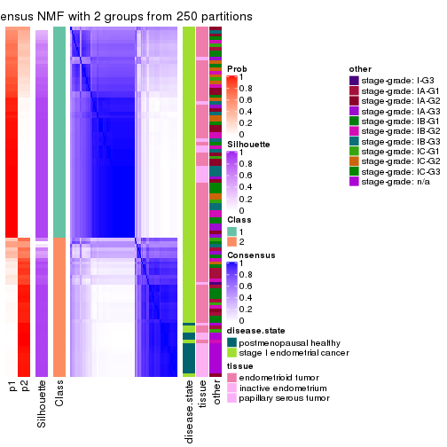</p>

</div>
<div id='tab-MAD-NMF-consensus-heatmap-2'>
<pre><code class="r">consensus_heatmap(res, k = 3)
</code></pre>

<p>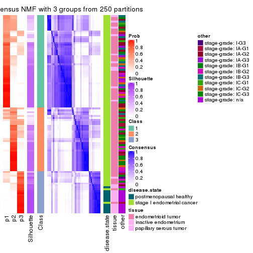</p>

</div>
<div id='tab-MAD-NMF-consensus-heatmap-3'>
<pre><code class="r">consensus_heatmap(res, k = 4)
</code></pre>

<p>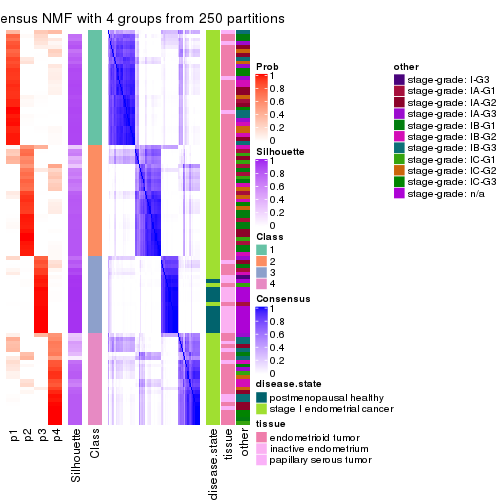</p>

</div>
<div id='tab-MAD-NMF-consensus-heatmap-4'>
<pre><code class="r">consensus_heatmap(res, k = 5)
</code></pre>

<p>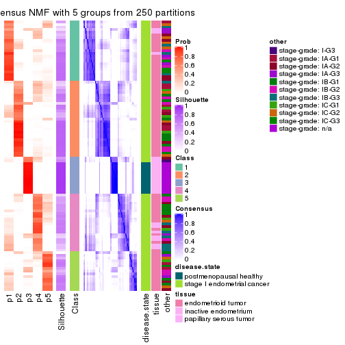</p>

</div>
<div id='tab-MAD-NMF-consensus-heatmap-5'>
<pre><code class="r">consensus_heatmap(res, k = 6)
</code></pre>

<p>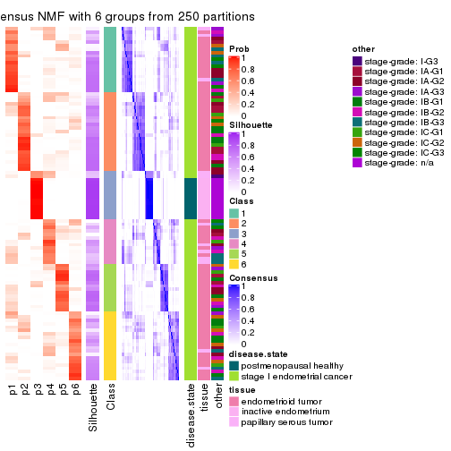</p>

</div>
</div>

Heatmaps for the membership of samples in all partitions to see how consistent they are:


<script>
$( function() {
	$( '#tabs-MAD-NMF-membership-heatmap' ).tabs();
} );
</script>
<div id='tabs-MAD-NMF-membership-heatmap'>
<ul>
<li><a href='#tab-MAD-NMF-membership-heatmap-1'>k = 2</a></li>
<li><a href='#tab-MAD-NMF-membership-heatmap-2'>k = 3</a></li>
<li><a href='#tab-MAD-NMF-membership-heatmap-3'>k = 4</a></li>
<li><a href='#tab-MAD-NMF-membership-heatmap-4'>k = 5</a></li>
<li><a href='#tab-MAD-NMF-membership-heatmap-5'>k = 6</a></li>
</ul>
<div id='tab-MAD-NMF-membership-heatmap-1'>
<pre><code class="r">membership_heatmap(res, k = 2)
</code></pre>

<p>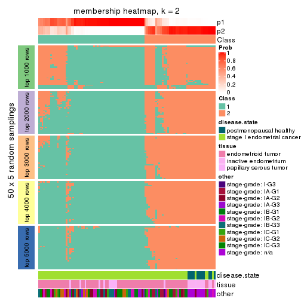</p>

</div>
<div id='tab-MAD-NMF-membership-heatmap-2'>
<pre><code class="r">membership_heatmap(res, k = 3)
</code></pre>

<p>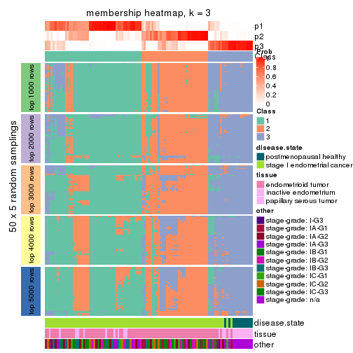</p>

</div>
<div id='tab-MAD-NMF-membership-heatmap-3'>
<pre><code class="r">membership_heatmap(res, k = 4)
</code></pre>

<p>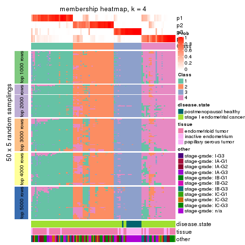</p>

</div>
<div id='tab-MAD-NMF-membership-heatmap-4'>
<pre><code class="r">membership_heatmap(res, k = 5)
</code></pre>

<p>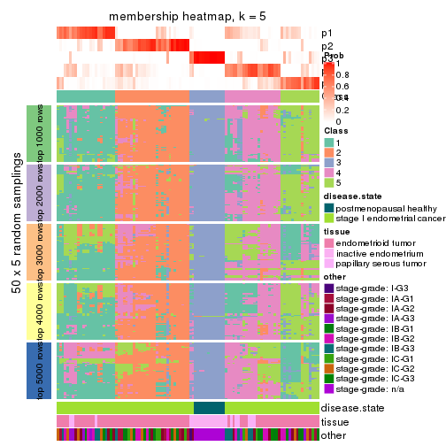</p>

</div>
<div id='tab-MAD-NMF-membership-heatmap-5'>
<pre><code class="r">membership_heatmap(res, k = 6)
</code></pre>

<p>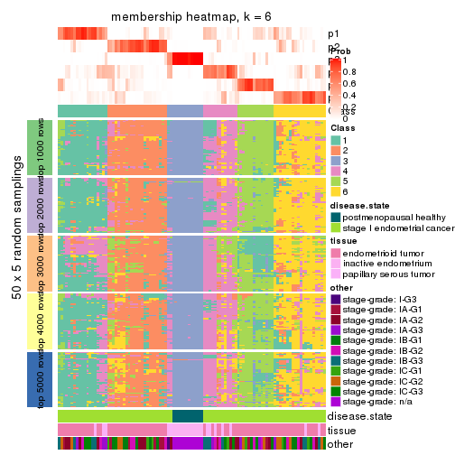</p>

</div>
</div>

As soon as we have had the classes for columns, we can look for signatures
which are significantly different between classes which can be candidate marks
for certain classes. Following are the heatmaps for signatures.


Signature heatmaps where rows are scaled:


<script>
$( function() {
	$( '#tabs-MAD-NMF-get-signatures' ).tabs();
} );
</script>
<div id='tabs-MAD-NMF-get-signatures'>
<ul>
<li><a href='#tab-MAD-NMF-get-signatures-1'>k = 2</a></li>
<li><a href='#tab-MAD-NMF-get-signatures-2'>k = 3</a></li>
<li><a href='#tab-MAD-NMF-get-signatures-3'>k = 4</a></li>
<li><a href='#tab-MAD-NMF-get-signatures-4'>k = 5</a></li>
<li><a href='#tab-MAD-NMF-get-signatures-5'>k = 6</a></li>
</ul>
<div id='tab-MAD-NMF-get-signatures-1'>
<pre><code class="r">get_signatures(res, k = 2)
</code></pre>

<p>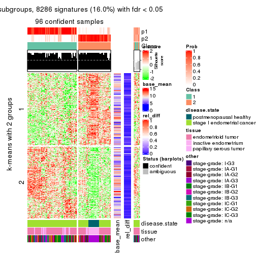</p>

</div>
<div id='tab-MAD-NMF-get-signatures-2'>
<pre><code class="r">get_signatures(res, k = 3)
</code></pre>

<p>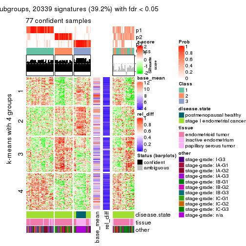</p>

</div>
<div id='tab-MAD-NMF-get-signatures-3'>
<pre><code class="r">get_signatures(res, k = 4)
</code></pre>

<p>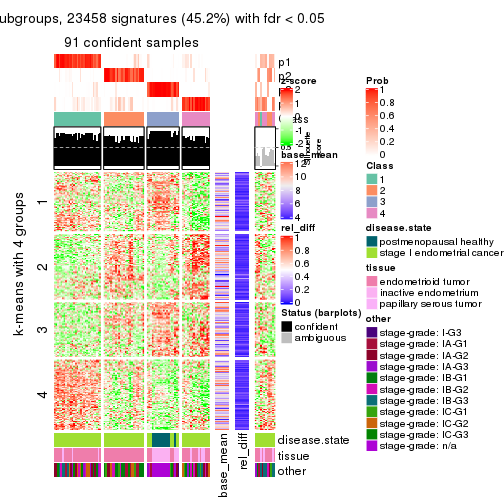</p>

</div>
<div id='tab-MAD-NMF-get-signatures-4'>
<pre><code class="r">get_signatures(res, k = 5)
</code></pre>

<p>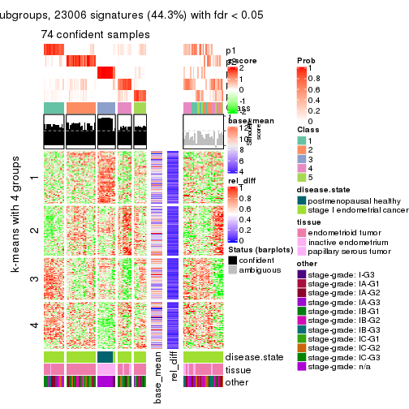</p>

</div>
<div id='tab-MAD-NMF-get-signatures-5'>
<pre><code class="r">get_signatures(res, k = 6)
</code></pre>

<p>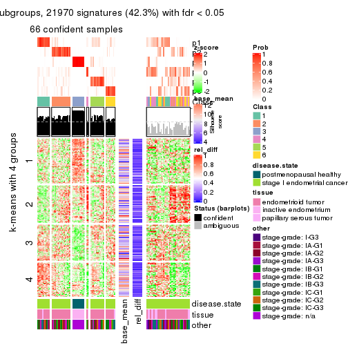</p>

</div>
</div>


Signature heatmaps where rows are not scaled:


<script>
$( function() {
	$( '#tabs-MAD-NMF-get-signatures-no-scale' ).tabs();
} );
</script>
<div id='tabs-MAD-NMF-get-signatures-no-scale'>
<ul>
<li><a href='#tab-MAD-NMF-get-signatures-no-scale-1'>k = 2</a></li>
<li><a href='#tab-MAD-NMF-get-signatures-no-scale-2'>k = 3</a></li>
<li><a href='#tab-MAD-NMF-get-signatures-no-scale-3'>k = 4</a></li>
<li><a href='#tab-MAD-NMF-get-signatures-no-scale-4'>k = 5</a></li>
<li><a href='#tab-MAD-NMF-get-signatures-no-scale-5'>k = 6</a></li>
</ul>
<div id='tab-MAD-NMF-get-signatures-no-scale-1'>
<pre><code class="r">get_signatures(res, k = 2, scale_rows = FALSE)
</code></pre>

<p>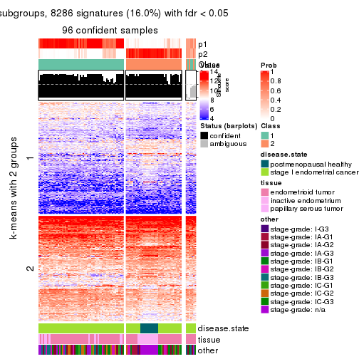</p>

</div>
<div id='tab-MAD-NMF-get-signatures-no-scale-2'>
<pre><code class="r">get_signatures(res, k = 3, scale_rows = FALSE)
</code></pre>

<p>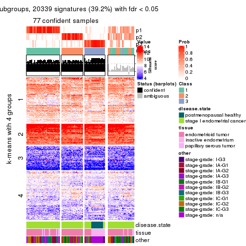</p>

</div>
<div id='tab-MAD-NMF-get-signatures-no-scale-3'>
<pre><code class="r">get_signatures(res, k = 4, scale_rows = FALSE)
</code></pre>

<p>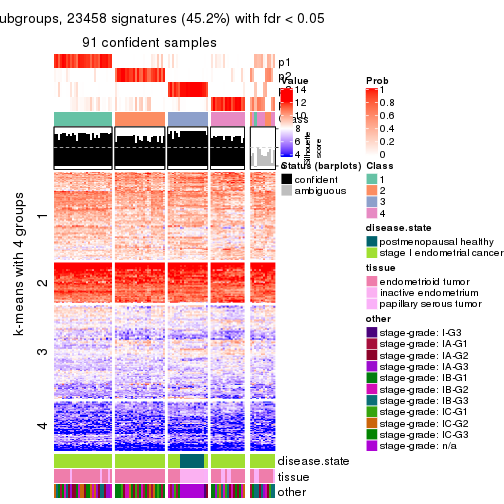</p>

</div>
<div id='tab-MAD-NMF-get-signatures-no-scale-4'>
<pre><code class="r">get_signatures(res, k = 5, scale_rows = FALSE)
</code></pre>

<p>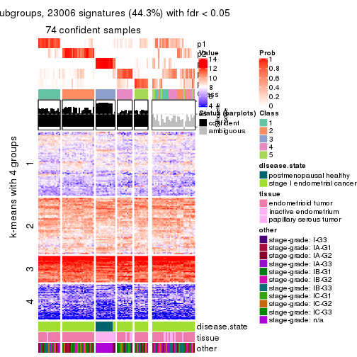</p>

</div>
<div id='tab-MAD-NMF-get-signatures-no-scale-5'>
<pre><code class="r">get_signatures(res, k = 6, scale_rows = FALSE)
</code></pre>

<p>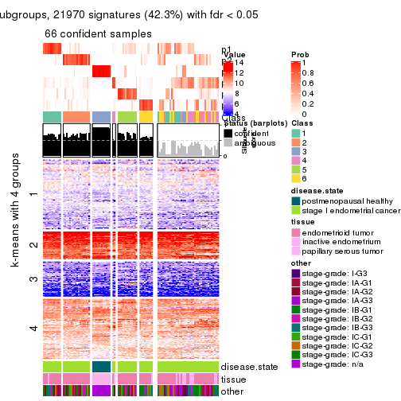</p>

</div>
</div>


Compare the overlap of signatures from different k:

```r
compare_signatures(res)
```

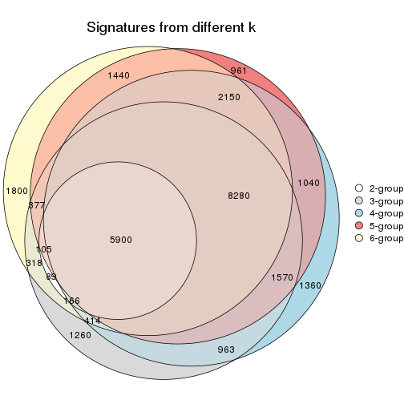

`get_signature()` returns a data frame invisibly. TO get the list of signatures, the function
call should be assigned to a variable explicitly. In following code, if `plot` argument is set
to `FALSE`, no heatmap is plotted while only the differential analysis is performed.

```r
# code only for demonstration
tb = get_signature(res, k = ..., plot = FALSE)
```

An example of the output of `tb` is:

```
#>   which_row         fdr    mean_1    mean_2 scaled_mean_1 scaled_mean_2 km
#> 1        38 0.042760348  8.373488  9.131774    -0.5533452     0.5164555  1
#> 2        40 0.018707592  7.106213  8.469186    -0.6173731     0.5762149  1
#> 3        55 0.019134737 10.221463 11.207825    -0.6159697     0.5749050  1
#> 4        59 0.006059896  5.921854  7.869574    -0.6899429     0.6439467  1
#> 5        60 0.018055526  8.928898 10.211722    -0.6204761     0.5791110  1
#> 6        98 0.009384629 15.714769 14.887706     0.6635654    -0.6193277  2
...
```

The columns in `tb` are:

1. `which_row`: row indices corresponding to the input matrix.
2. `fdr`: FDR for the differential test. 
3. `mean_x`: The mean value in group x.
4. `scaled_mean_x`: The mean value in group x after rows are scaled.
5. `km`: Row groups if k-means clustering is applied to rows.


UMAP plot which shows how samples are separated.


<script>
$( function() {
	$( '#tabs-MAD-NMF-dimension-reduction' ).tabs();
} );
</script>
<div id='tabs-MAD-NMF-dimension-reduction'>
<ul>
<li><a href='#tab-MAD-NMF-dimension-reduction-1'>k = 2</a></li>
<li><a href='#tab-MAD-NMF-dimension-reduction-2'>k = 3</a></li>
<li><a href='#tab-MAD-NMF-dimension-reduction-3'>k = 4</a></li>
<li><a href='#tab-MAD-NMF-dimension-reduction-4'>k = 5</a></li>
<li><a href='#tab-MAD-NMF-dimension-reduction-5'>k = 6</a></li>
</ul>
<div id='tab-MAD-NMF-dimension-reduction-1'>
<pre><code class="r">dimension_reduction(res, k = 2, method = &quot;UMAP&quot;)
</code></pre>

<p>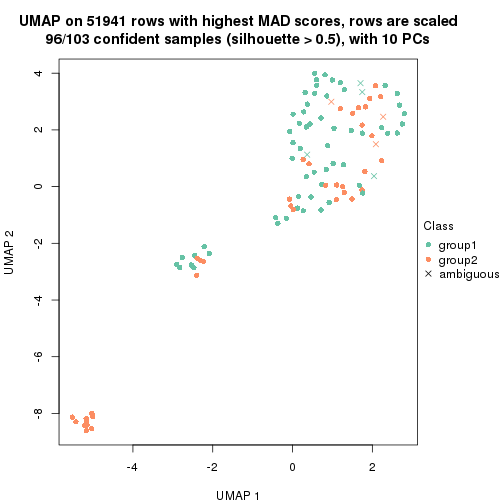</p>

</div>
<div id='tab-MAD-NMF-dimension-reduction-2'>
<pre><code class="r">dimension_reduction(res, k = 3, method = &quot;UMAP&quot;)
</code></pre>

<p>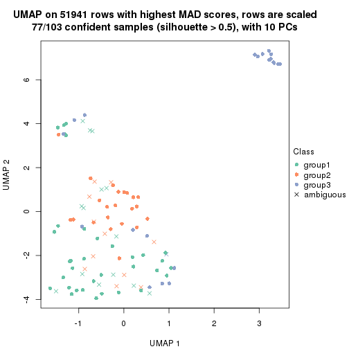</p>

</div>
<div id='tab-MAD-NMF-dimension-reduction-3'>
<pre><code class="r">dimension_reduction(res, k = 4, method = &quot;UMAP&quot;)
</code></pre>

<p>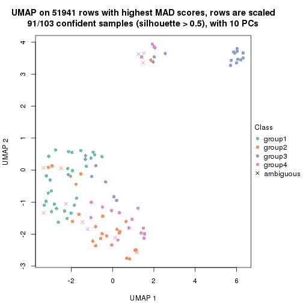</p>

</div>
<div id='tab-MAD-NMF-dimension-reduction-4'>
<pre><code class="r">dimension_reduction(res, k = 5, method = &quot;UMAP&quot;)
</code></pre>

<p>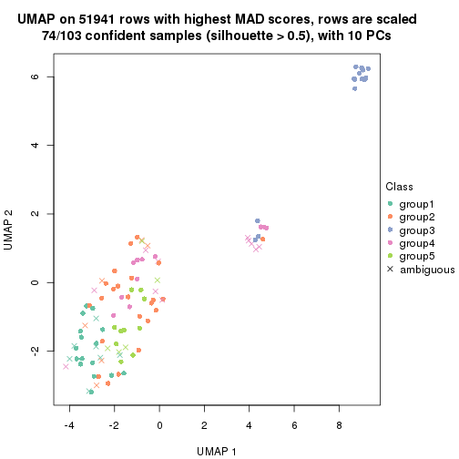</p>

</div>
<div id='tab-MAD-NMF-dimension-reduction-5'>
<pre><code class="r">dimension_reduction(res, k = 6, method = &quot;UMAP&quot;)
</code></pre>

<p>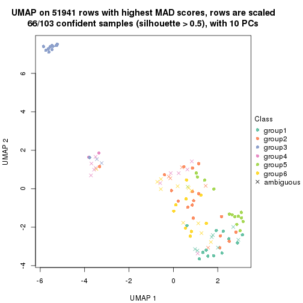</p>

</div>
</div>


Following heatmap shows how subgroups are split when increasing `k`:

```r
collect_classes(res)
```

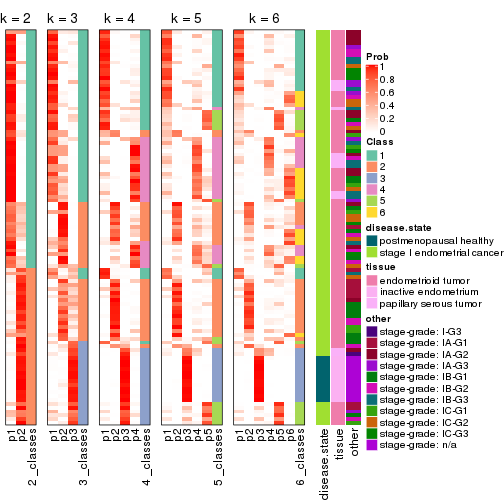


Test correlation between subgroups and known annotations. If the known
annotation is numeric, one-way ANOVA test is applied, and if the known
annotation is discrete, chi-squared contingency table test is applied.

```r
test_to_known_factors(res)
```

```
#>          n disease.state(p) tissue(p) other(p) k
#> MAD:NMF 96         2.05e-05  1.57e-05 3.00e-07 2
#> MAD:NMF 77         5.87e-09  1.01e-08 5.73e-08 3
#> MAD:NMF 91         1.26e-10  2.48e-10 4.65e-07 4
#> MAD:NMF 74         1.49e-12  9.01e-13 3.83e-08 5
#> MAD:NMF 66         6.95e-13  1.08e-12 1.76e-07 6
```


If matrix rows can be associated to genes, consider to use `functional_enrichment(res,
...)` to perform function enrichment for the signature genes. See [this vignette](http://bioconductor.org/packages/devel/bioc/vignettes/cola/inst/doc/functional_enrichment.html) for more detailed explanations.


 

---------------------------------------------------


### ATC:hclust


The object with results only for a single top-value method and a single partition method 
can be extracted as:

```r
res = res_list["ATC", "hclust"]
# you can also extract it by
# res = res_list["ATC:hclust"]
```

A summary of `res` and all the functions that can be applied to it:

```r
res
```

```
#> A 'ConsensusPartition' object with k = 2, 3, 4, 5, 6.
#>   On a matrix with 51941 rows and 103 columns.
#>   Top rows (1000, 2000, 3000, 4000, 5000) are extracted by 'ATC' method.
#>   Subgroups are detected by 'hclust' method.
#>   Performed in total 1250 partitions by row resampling.
#>   Best k for subgroups seems to be 3.
#> 
#> Following methods can be applied to this 'ConsensusPartition' object:
#>  [1] "cola_report"             "collect_classes"         "collect_plots"          
#>  [4] "collect_stats"           "colnames"                "compare_signatures"     
#>  [7] "consensus_heatmap"       "dimension_reduction"     "functional_enrichment"  
#> [10] "get_anno_col"            "get_anno"                "get_classes"            
#> [13] "get_consensus"           "get_matrix"              "get_membership"         
#> [16] "get_param"               "get_signatures"          "get_stats"              
#> [19] "is_best_k"               "is_stable_k"             "membership_heatmap"     
#> [22] "ncol"                    "nrow"                    "plot_ecdf"              
#> [25] "rownames"                "select_partition_number" "show"                   
#> [28] "suggest_best_k"          "test_to_known_factors"
```

`collect_plots()` function collects all the plots made from `res` for all `k` (number of partitions)
into one single page to provide an easy and fast comparison between different `k`.

```r
collect_plots(res)
```

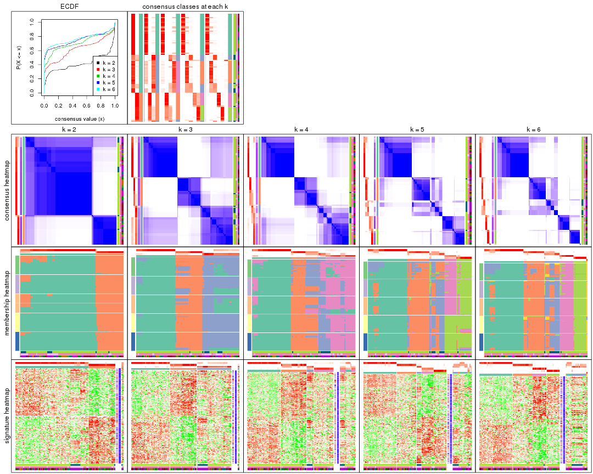

The plots are:

- The first row: a plot of the ECDF (empirical cumulative distribution
  function) curves of the consensus matrix for each `k` and the heatmap of
  predicted classes for each `k`.
- The second row: heatmaps of the consensus matrix for each `k`.
- The third row: heatmaps of the membership matrix for each `k`.
- The fouth row: heatmaps of the signatures for each `k`.

All the plots in panels can be made by individual functions and they are
plotted later in this section.

`select_partition_number()` produces several plots showing different
statistics for choosing "optimized" `k`. There are following statistics:

- ECDF curves of the consensus matrix for each `k`;
- 1-PAC. [The PAC
  score](https://en.wikipedia.org/wiki/Consensus_clustering#Over-interpretation_potential_of_consensus_clustering)
  measures the proportion of the ambiguous subgrouping.
- Mean silhouette score.
- Concordance. The mean probability of fiting the consensus class ids in all
  partitions.
- Area increased. Denote $A_k$ as the area under the ECDF curve for current
  `k`, the area increased is defined as $A_k - A_{k-1}$.
- Rand index. The percent of pairs of samples that are both in a same cluster
  or both are not in a same cluster in the partition of k and k-1.
- Jaccard index. The ratio of pairs of samples are both in a same cluster in
  the partition of k and k-1 and the pairs of samples are both in a same
  cluster in the partition k or k-1.

The detailed explanations of these statistics can be found in [the _cola_
vignette](http://bioconductor.org/packages/devel/bioc/vignettes/cola/inst/doc/cola.html#toc_13).

Generally speaking, lower PAC score, higher mean silhouette score or higher
concordance corresponds to better partition. Rand index and Jaccard index
measure how similar the current partition is compared to partition with `k-1`.
If they are too similar, we won't accept `k` is better than `k-1`.

```r
select_partition_number(res)
```

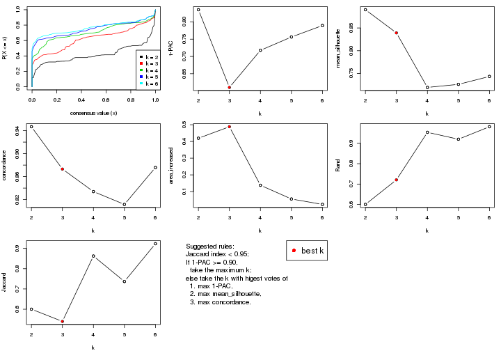

The numeric values for all these statistics can be obtained by `get_stats()`.

```r
get_stats(res)
```

```
#>   k 1-PAC mean_silhouette concordance area_increased  Rand Jaccard
#> 2 2 0.835           0.890       0.947         0.4192 0.600   0.600
#> 3 3 0.610           0.839       0.873         0.4880 0.721   0.540
#> 4 4 0.718           0.719       0.834         0.1378 0.954   0.862
#> 5 5 0.756           0.726       0.812         0.0557 0.920   0.737
#> 6 6 0.789           0.743       0.876         0.0232 0.981   0.923
```

`suggest_best_k()` suggests the best $k$ based on these statistics. The rules are as follows:

- All $k$ with Jaccard index larger than 0.95 are removed because increasing
  $k$ does not provide enough extra information. If all $k$ are removed, it is
  marked as no subgroup is detected.
- For all $k$ with 1-PAC score larger than 0.9, the maximal $k$ is taken as
  the best $k$, and other $k$ are marked as optional $k$.
- If it does not fit the second rule. The $k$ with the maximal vote of the
  highest 1-PAC score, highest mean silhouette, and highest concordance is
  taken as the best $k$.

```r
suggest_best_k(res)
```

```
#> [1] 3
```


Following shows the table of the partitions (You need to click the **show/hide
code output** link to see it). The membership matrix (columns with name `p*`)
is inferred by
[`clue::cl_consensus()`](https://www.rdocumentation.org/link/cl_consensus?package=clue)
function with the `SE` method. Basically the value in the membership matrix
represents the probability to belong to a certain group. The finall class
label for an item is determined with the group with highest probability it
belongs to.

In `get_classes()` function, the entropy is calculated from the membership
matrix and the silhouette score is calculated from the consensus matrix.


<script>
$( function() {
	$( '#tabs-ATC-hclust-get-classes' ).tabs();
} );
</script>
<div id='tabs-ATC-hclust-get-classes'>
<ul>
<li><a href='#tab-ATC-hclust-get-classes-1'>k = 2</a></li>
<li><a href='#tab-ATC-hclust-get-classes-2'>k = 3</a></li>
<li><a href='#tab-ATC-hclust-get-classes-3'>k = 4</a></li>
<li><a href='#tab-ATC-hclust-get-classes-4'>k = 5</a></li>
<li><a href='#tab-ATC-hclust-get-classes-5'>k = 6</a></li>
</ul>

<div id='tab-ATC-hclust-get-classes-1'>
<p><a id='tab-ATC-hclust-get-classes-1-a' style='color:#0366d6' href='#'>show/hide code output</a></p>
<pre><code class="r">cbind(get_classes(res, k = 2), get_membership(res, k = 2))
</code></pre>

<pre><code>#&gt;           class entropy silhouette    p1    p2
#&gt; GSM425907     2   0.000     0.9641 0.000 1.000
#&gt; GSM425908     2   0.000     0.9641 0.000 1.000
#&gt; GSM425909     2   0.163     0.9565 0.024 0.976
#&gt; GSM425910     1   0.000     0.9344 1.000 0.000
#&gt; GSM425911     1   0.224     0.9235 0.964 0.036
#&gt; GSM425912     1   0.000     0.9344 1.000 0.000
#&gt; GSM425913     1   0.891     0.6273 0.692 0.308
#&gt; GSM425914     1   0.000     0.9344 1.000 0.000
#&gt; GSM425915     1   0.000     0.9344 1.000 0.000
#&gt; GSM425874     2   0.000     0.9641 0.000 1.000
#&gt; GSM425875     1   0.000     0.9344 1.000 0.000
#&gt; GSM425876     1   0.000     0.9344 1.000 0.000
#&gt; GSM425877     1   0.000     0.9344 1.000 0.000
#&gt; GSM425878     1   0.000     0.9344 1.000 0.000
#&gt; GSM425879     1   0.358     0.9069 0.932 0.068
#&gt; GSM425880     1   0.000     0.9344 1.000 0.000
#&gt; GSM425881     1   0.000     0.9344 1.000 0.000
#&gt; GSM425882     1   0.358     0.9069 0.932 0.068
#&gt; GSM425883     1   0.000     0.9344 1.000 0.000
#&gt; GSM425884     1   0.000     0.9344 1.000 0.000
#&gt; GSM425885     2   0.000     0.9641 0.000 1.000
#&gt; GSM425848     1   0.482     0.8811 0.896 0.104
#&gt; GSM425849     1   0.000     0.9344 1.000 0.000
#&gt; GSM425850     1   0.000     0.9344 1.000 0.000
#&gt; GSM425851     1   0.494     0.8755 0.892 0.108
#&gt; GSM425852     1   0.224     0.9235 0.964 0.036
#&gt; GSM425893     1   0.358     0.9069 0.932 0.068
#&gt; GSM425894     2   0.118     0.9618 0.016 0.984
#&gt; GSM425895     1   0.358     0.9069 0.932 0.068
#&gt; GSM425896     2   0.000     0.9641 0.000 1.000
#&gt; GSM425897     1   1.000     0.1478 0.508 0.492
#&gt; GSM425898     2   0.722     0.7221 0.200 0.800
#&gt; GSM425899     1   0.358     0.9069 0.932 0.068
#&gt; GSM425900     1   0.000     0.9344 1.000 0.000
#&gt; GSM425901     2   0.163     0.9565 0.024 0.976
#&gt; GSM425902     2   0.163     0.9565 0.024 0.976
#&gt; GSM425903     1   0.000     0.9344 1.000 0.000
#&gt; GSM425904     1   0.000     0.9344 1.000 0.000
#&gt; GSM425905     2   0.118     0.9618 0.016 0.984
#&gt; GSM425906     1   0.000     0.9344 1.000 0.000
#&gt; GSM425863     1   0.000     0.9344 1.000 0.000
#&gt; GSM425864     2   0.118     0.9618 0.016 0.984
#&gt; GSM425865     2   0.118     0.9618 0.016 0.984
#&gt; GSM425866     1   0.000     0.9344 1.000 0.000
#&gt; GSM425867     1   0.000     0.9344 1.000 0.000
#&gt; GSM425868     2   0.000     0.9641 0.000 1.000
#&gt; GSM425869     2   0.000     0.9641 0.000 1.000
#&gt; GSM425870     1   0.000     0.9344 1.000 0.000
#&gt; GSM425871     1   0.278     0.9180 0.952 0.048
#&gt; GSM425872     1   0.358     0.9069 0.932 0.068
#&gt; GSM425873     1   0.000     0.9344 1.000 0.000
#&gt; GSM425843     1   0.000     0.9344 1.000 0.000
#&gt; GSM425844     1   0.891     0.6273 0.692 0.308
#&gt; GSM425845     1   0.000     0.9344 1.000 0.000
#&gt; GSM425846     1   0.278     0.9180 0.952 0.048
#&gt; GSM425847     1   0.000     0.9344 1.000 0.000
#&gt; GSM425886     2   0.163     0.9565 0.024 0.976
#&gt; GSM425887     1   0.000     0.9344 1.000 0.000
#&gt; GSM425888     1   0.000     0.9344 1.000 0.000
#&gt; GSM425889     1   0.000     0.9344 1.000 0.000
#&gt; GSM425890     2   0.000     0.9641 0.000 1.000
#&gt; GSM425891     1   0.358     0.9069 0.932 0.068
#&gt; GSM425892     2   0.118     0.9618 0.016 0.984
#&gt; GSM425853     1   0.000     0.9344 1.000 0.000
#&gt; GSM425854     1   0.482     0.8811 0.896 0.104
#&gt; GSM425855     1   0.000     0.9344 1.000 0.000
#&gt; GSM425856     1   0.204     0.9251 0.968 0.032
#&gt; GSM425857     2   0.000     0.9641 0.000 1.000
#&gt; GSM425858     1   0.000     0.9344 1.000 0.000
#&gt; GSM425859     2   0.000     0.9641 0.000 1.000
#&gt; GSM425860     1   0.000     0.9344 1.000 0.000
#&gt; GSM425861     1   0.000     0.9344 1.000 0.000
#&gt; GSM425862     1   0.358     0.9069 0.932 0.068
#&gt; GSM425837     1   0.000     0.9344 1.000 0.000
#&gt; GSM425838     2   0.000     0.9641 0.000 1.000
#&gt; GSM425839     2   0.118     0.9618 0.016 0.984
#&gt; GSM425840     1   0.000     0.9344 1.000 0.000
#&gt; GSM425841     2   0.000     0.9641 0.000 1.000
#&gt; GSM425842     1   0.000     0.9344 1.000 0.000
#&gt; GSM425917     1   0.891     0.6273 0.692 0.308
#&gt; GSM425922     2   0.000     0.9641 0.000 1.000
#&gt; GSM425919     1   0.000     0.9344 1.000 0.000
#&gt; GSM425920     1   0.000     0.9344 1.000 0.000
#&gt; GSM425923     1   0.184     0.9270 0.972 0.028
#&gt; GSM425916     1   0.000     0.9344 1.000 0.000
#&gt; GSM425918     1   0.184     0.9270 0.972 0.028
#&gt; GSM425921     2   0.000     0.9641 0.000 1.000
#&gt; GSM425925     1   0.278     0.9180 0.952 0.048
#&gt; GSM425926     2   0.118     0.9618 0.016 0.984
#&gt; GSM425927     1   0.000     0.9344 1.000 0.000
#&gt; GSM425924     1   0.891     0.6273 0.692 0.308
#&gt; GSM425928     2   0.000     0.9641 0.000 1.000
#&gt; GSM425929     1   0.184     0.9241 0.972 0.028
#&gt; GSM425930     1   0.184     0.9241 0.972 0.028
#&gt; GSM425931     1   0.909     0.5993 0.676 0.324
#&gt; GSM425932     1   0.184     0.9241 0.972 0.028
#&gt; GSM425933     1   0.881     0.6397 0.700 0.300
#&gt; GSM425934     1   0.184     0.9241 0.972 0.028
#&gt; GSM425935     2   0.993     0.0351 0.452 0.548
#&gt; GSM425936     1   0.909     0.5993 0.676 0.324
#&gt; GSM425937     1   0.909     0.5993 0.676 0.324
#&gt; GSM425938     1   0.909     0.5993 0.676 0.324
#&gt; GSM425939     1   0.184     0.9241 0.972 0.028
</code></pre>

<script>
$('#tab-ATC-hclust-get-classes-1-a').parent().next().next().hide();
$('#tab-ATC-hclust-get-classes-1-a').click(function(){
  $('#tab-ATC-hclust-get-classes-1-a').parent().next().next().toggle();
  return(false);
});
</script>
</div>

<div id='tab-ATC-hclust-get-classes-2'>
<p><a id='tab-ATC-hclust-get-classes-2-a' style='color:#0366d6' href='#'>show/hide code output</a></p>
<pre><code class="r">cbind(get_classes(res, k = 3), get_membership(res, k = 3))
</code></pre>

<pre><code>#&gt;           class entropy silhouette    p1    p2    p3
#&gt; GSM425907     2  0.0000      0.892 0.000 1.000 0.000
#&gt; GSM425908     2  0.0000      0.892 0.000 1.000 0.000
#&gt; GSM425909     2  0.4887      0.877 0.000 0.772 0.228
#&gt; GSM425910     1  0.0000      0.953 1.000 0.000 0.000
#&gt; GSM425911     3  0.5706      0.783 0.320 0.000 0.680
#&gt; GSM425912     1  0.0000      0.953 1.000 0.000 0.000
#&gt; GSM425913     3  0.1315      0.690 0.020 0.008 0.972
#&gt; GSM425914     1  0.0000      0.953 1.000 0.000 0.000
#&gt; GSM425915     1  0.4605      0.683 0.796 0.000 0.204
#&gt; GSM425874     2  0.0000      0.892 0.000 1.000 0.000
#&gt; GSM425875     1  0.0000      0.953 1.000 0.000 0.000
#&gt; GSM425876     1  0.0000      0.953 1.000 0.000 0.000
#&gt; GSM425877     1  0.0237      0.951 0.996 0.000 0.004
#&gt; GSM425878     1  0.0424      0.949 0.992 0.000 0.008
#&gt; GSM425879     3  0.5327      0.811 0.272 0.000 0.728
#&gt; GSM425880     1  0.2165      0.905 0.936 0.000 0.064
#&gt; GSM425881     1  0.0000      0.953 1.000 0.000 0.000
#&gt; GSM425882     3  0.5327      0.811 0.272 0.000 0.728
#&gt; GSM425883     3  0.6154      0.662 0.408 0.000 0.592
#&gt; GSM425884     1  0.0000      0.953 1.000 0.000 0.000
#&gt; GSM425885     2  0.0000      0.892 0.000 1.000 0.000
#&gt; GSM425848     3  0.5681      0.806 0.236 0.016 0.748
#&gt; GSM425849     1  0.0424      0.949 0.992 0.000 0.008
#&gt; GSM425850     1  0.4121      0.752 0.832 0.000 0.168
#&gt; GSM425851     3  0.4931      0.805 0.232 0.000 0.768
#&gt; GSM425852     3  0.5706      0.783 0.320 0.000 0.680
#&gt; GSM425893     3  0.5327      0.811 0.272 0.000 0.728
#&gt; GSM425894     2  0.4750      0.884 0.000 0.784 0.216
#&gt; GSM425895     3  0.5327      0.811 0.272 0.000 0.728
#&gt; GSM425896     2  0.0000      0.892 0.000 1.000 0.000
#&gt; GSM425897     3  0.4178      0.425 0.000 0.172 0.828
#&gt; GSM425898     2  0.6584      0.631 0.012 0.608 0.380
#&gt; GSM425899     3  0.5327      0.811 0.272 0.000 0.728
#&gt; GSM425900     1  0.4002      0.766 0.840 0.000 0.160
#&gt; GSM425901     2  0.4887      0.877 0.000 0.772 0.228
#&gt; GSM425902     2  0.4887      0.877 0.000 0.772 0.228
#&gt; GSM425903     1  0.0000      0.953 1.000 0.000 0.000
#&gt; GSM425904     1  0.2165      0.905 0.936 0.000 0.064
#&gt; GSM425905     2  0.4750      0.884 0.000 0.784 0.216
#&gt; GSM425906     1  0.4121      0.752 0.832 0.000 0.168
#&gt; GSM425863     1  0.0000      0.953 1.000 0.000 0.000
#&gt; GSM425864     2  0.4750      0.884 0.000 0.784 0.216
#&gt; GSM425865     2  0.4750      0.884 0.000 0.784 0.216
#&gt; GSM425866     1  0.1411      0.929 0.964 0.000 0.036
#&gt; GSM425867     1  0.0000      0.953 1.000 0.000 0.000
#&gt; GSM425868     2  0.2959      0.895 0.000 0.900 0.100
#&gt; GSM425869     2  0.0000      0.892 0.000 1.000 0.000
#&gt; GSM425870     1  0.0000      0.953 1.000 0.000 0.000
#&gt; GSM425871     3  0.5591      0.796 0.304 0.000 0.696
#&gt; GSM425872     3  0.5327      0.811 0.272 0.000 0.728
#&gt; GSM425873     1  0.0000      0.953 1.000 0.000 0.000
#&gt; GSM425843     1  0.0000      0.953 1.000 0.000 0.000
#&gt; GSM425844     3  0.1315      0.690 0.020 0.008 0.972
#&gt; GSM425845     1  0.0000      0.953 1.000 0.000 0.000
#&gt; GSM425846     3  0.5591      0.796 0.304 0.000 0.696
#&gt; GSM425847     1  0.0000      0.953 1.000 0.000 0.000
#&gt; GSM425886     2  0.4887      0.877 0.000 0.772 0.228
#&gt; GSM425887     1  0.1753      0.920 0.952 0.000 0.048
#&gt; GSM425888     1  0.0000      0.953 1.000 0.000 0.000
#&gt; GSM425889     1  0.3482      0.817 0.872 0.000 0.128
#&gt; GSM425890     2  0.0000      0.892 0.000 1.000 0.000
#&gt; GSM425891     3  0.5327      0.811 0.272 0.000 0.728
#&gt; GSM425892     2  0.4750      0.884 0.000 0.784 0.216
#&gt; GSM425853     1  0.1411      0.929 0.964 0.000 0.036
#&gt; GSM425854     3  0.5681      0.806 0.236 0.016 0.748
#&gt; GSM425855     1  0.0424      0.949 0.992 0.000 0.008
#&gt; GSM425856     3  0.5835      0.764 0.340 0.000 0.660
#&gt; GSM425857     2  0.0000      0.892 0.000 1.000 0.000
#&gt; GSM425858     1  0.0000      0.953 1.000 0.000 0.000
#&gt; GSM425859     2  0.3879      0.893 0.000 0.848 0.152
#&gt; GSM425860     1  0.0000      0.953 1.000 0.000 0.000
#&gt; GSM425861     1  0.0000      0.953 1.000 0.000 0.000
#&gt; GSM425862     3  0.5327      0.811 0.272 0.000 0.728
#&gt; GSM425837     1  0.0000      0.953 1.000 0.000 0.000
#&gt; GSM425838     2  0.0000      0.892 0.000 1.000 0.000
#&gt; GSM425839     2  0.4750      0.884 0.000 0.784 0.216
#&gt; GSM425840     1  0.0424      0.949 0.992 0.000 0.008
#&gt; GSM425841     2  0.0000      0.892 0.000 1.000 0.000
#&gt; GSM425842     1  0.0000      0.953 1.000 0.000 0.000
#&gt; GSM425917     3  0.1315      0.690 0.020 0.008 0.972
#&gt; GSM425922     2  0.0000      0.892 0.000 1.000 0.000
#&gt; GSM425919     1  0.0000      0.953 1.000 0.000 0.000
#&gt; GSM425920     1  0.4399      0.712 0.812 0.000 0.188
#&gt; GSM425923     3  0.5835      0.763 0.340 0.000 0.660
#&gt; GSM425916     3  0.6168      0.654 0.412 0.000 0.588
#&gt; GSM425918     3  0.5835      0.763 0.340 0.000 0.660
#&gt; GSM425921     2  0.0000      0.892 0.000 1.000 0.000
#&gt; GSM425925     3  0.5591      0.796 0.304 0.000 0.696
#&gt; GSM425926     2  0.4750      0.884 0.000 0.784 0.216
#&gt; GSM425927     1  0.0000      0.953 1.000 0.000 0.000
#&gt; GSM425924     3  0.1315      0.690 0.020 0.008 0.972
#&gt; GSM425928     2  0.3412      0.895 0.000 0.876 0.124
#&gt; GSM425929     3  0.5859      0.738 0.344 0.000 0.656
#&gt; GSM425930     3  0.5859      0.738 0.344 0.000 0.656
#&gt; GSM425931     3  0.0237      0.669 0.000 0.004 0.996
#&gt; GSM425932     3  0.5859      0.738 0.344 0.000 0.656
#&gt; GSM425933     3  0.0892      0.694 0.020 0.000 0.980
#&gt; GSM425934     3  0.5859      0.738 0.344 0.000 0.656
#&gt; GSM425935     3  0.4974      0.283 0.000 0.236 0.764
#&gt; GSM425936     3  0.0237      0.669 0.000 0.004 0.996
#&gt; GSM425937     3  0.0237      0.669 0.000 0.004 0.996
#&gt; GSM425938     3  0.0237      0.669 0.000 0.004 0.996
#&gt; GSM425939     3  0.5859      0.738 0.344 0.000 0.656
</code></pre>

<script>
$('#tab-ATC-hclust-get-classes-2-a').parent().next().next().hide();
$('#tab-ATC-hclust-get-classes-2-a').click(function(){
  $('#tab-ATC-hclust-get-classes-2-a').parent().next().next().toggle();
  return(false);
});
</script>
</div>

<div id='tab-ATC-hclust-get-classes-3'>
<p><a id='tab-ATC-hclust-get-classes-3-a' style='color:#0366d6' href='#'>show/hide code output</a></p>
<pre><code class="r">cbind(get_classes(res, k = 4), get_membership(res, k = 4))
</code></pre>

<pre><code>#&gt;           class entropy silhouette    p1    p2    p3    p4
#&gt; GSM425907     2  0.0000      0.744 0.000 1.000 0.000 0.000
#&gt; GSM425908     2  0.0817      0.749 0.000 0.976 0.024 0.000
#&gt; GSM425909     2  0.5360      0.700 0.000 0.552 0.436 0.012
#&gt; GSM425910     1  0.0000      0.924 1.000 0.000 0.000 0.000
#&gt; GSM425911     4  0.2216      0.763 0.092 0.000 0.000 0.908
#&gt; GSM425912     1  0.0000      0.924 1.000 0.000 0.000 0.000
#&gt; GSM425913     4  0.4543      0.190 0.000 0.000 0.324 0.676
#&gt; GSM425914     1  0.0000      0.924 1.000 0.000 0.000 0.000
#&gt; GSM425915     1  0.4830      0.362 0.608 0.000 0.000 0.392
#&gt; GSM425874     2  0.0817      0.749 0.000 0.976 0.024 0.000
#&gt; GSM425875     1  0.0000      0.924 1.000 0.000 0.000 0.000
#&gt; GSM425876     1  0.0000      0.924 1.000 0.000 0.000 0.000
#&gt; GSM425877     1  0.0469      0.919 0.988 0.000 0.000 0.012
#&gt; GSM425878     1  0.0592      0.918 0.984 0.000 0.000 0.016
#&gt; GSM425879     4  0.1807      0.769 0.052 0.000 0.008 0.940
#&gt; GSM425880     1  0.2011      0.874 0.920 0.000 0.000 0.080
#&gt; GSM425881     1  0.0000      0.924 1.000 0.000 0.000 0.000
#&gt; GSM425882     4  0.1807      0.769 0.052 0.000 0.008 0.940
#&gt; GSM425883     4  0.3852      0.682 0.180 0.000 0.012 0.808
#&gt; GSM425884     1  0.0000      0.924 1.000 0.000 0.000 0.000
#&gt; GSM425885     2  0.0000      0.744 0.000 1.000 0.000 0.000
#&gt; GSM425848     4  0.2224      0.739 0.032 0.000 0.040 0.928
#&gt; GSM425849     1  0.0592      0.918 0.984 0.000 0.000 0.016
#&gt; GSM425850     1  0.4624      0.487 0.660 0.000 0.000 0.340
#&gt; GSM425851     4  0.5549      0.480 0.048 0.000 0.280 0.672
#&gt; GSM425852     4  0.2216      0.763 0.092 0.000 0.000 0.908
#&gt; GSM425893     4  0.1807      0.769 0.052 0.000 0.008 0.940
#&gt; GSM425894     2  0.5229      0.710 0.000 0.564 0.428 0.008
#&gt; GSM425895     4  0.1807      0.769 0.052 0.000 0.008 0.940
#&gt; GSM425896     2  0.0817      0.749 0.000 0.976 0.024 0.000
#&gt; GSM425897     3  0.1637      0.554 0.000 0.000 0.940 0.060
#&gt; GSM425898     3  0.7564     -0.445 0.000 0.388 0.420 0.192
#&gt; GSM425899     4  0.1807      0.769 0.052 0.000 0.008 0.940
#&gt; GSM425900     1  0.4643      0.479 0.656 0.000 0.000 0.344
#&gt; GSM425901     2  0.5360      0.700 0.000 0.552 0.436 0.012
#&gt; GSM425902     2  0.5360      0.700 0.000 0.552 0.436 0.012
#&gt; GSM425903     1  0.0000      0.924 1.000 0.000 0.000 0.000
#&gt; GSM425904     1  0.2011      0.874 0.920 0.000 0.000 0.080
#&gt; GSM425905     2  0.5229      0.710 0.000 0.564 0.428 0.008
#&gt; GSM425906     1  0.4697      0.452 0.644 0.000 0.000 0.356
#&gt; GSM425863     1  0.0000      0.924 1.000 0.000 0.000 0.000
#&gt; GSM425864     2  0.5229      0.710 0.000 0.564 0.428 0.008
#&gt; GSM425865     2  0.5229      0.710 0.000 0.564 0.428 0.008
#&gt; GSM425866     1  0.1557      0.892 0.944 0.000 0.000 0.056
#&gt; GSM425867     1  0.0000      0.924 1.000 0.000 0.000 0.000
#&gt; GSM425868     2  0.3942      0.744 0.000 0.764 0.236 0.000
#&gt; GSM425869     2  0.0000      0.744 0.000 1.000 0.000 0.000
#&gt; GSM425870     1  0.0000      0.924 1.000 0.000 0.000 0.000
#&gt; GSM425871     4  0.1940      0.769 0.076 0.000 0.000 0.924
#&gt; GSM425872     4  0.1807      0.769 0.052 0.000 0.008 0.940
#&gt; GSM425873     1  0.0000      0.924 1.000 0.000 0.000 0.000
#&gt; GSM425843     1  0.0000      0.924 1.000 0.000 0.000 0.000
#&gt; GSM425844     4  0.4543      0.190 0.000 0.000 0.324 0.676
#&gt; GSM425845     1  0.0000      0.924 1.000 0.000 0.000 0.000
#&gt; GSM425846     4  0.1940      0.769 0.076 0.000 0.000 0.924
#&gt; GSM425847     1  0.0000      0.924 1.000 0.000 0.000 0.000
#&gt; GSM425886     2  0.5360      0.700 0.000 0.552 0.436 0.012
#&gt; GSM425887     1  0.1792      0.884 0.932 0.000 0.000 0.068
#&gt; GSM425888     1  0.0000      0.924 1.000 0.000 0.000 0.000
#&gt; GSM425889     1  0.4134      0.637 0.740 0.000 0.000 0.260
#&gt; GSM425890     2  0.0000      0.744 0.000 1.000 0.000 0.000
#&gt; GSM425891     4  0.1807      0.769 0.052 0.000 0.008 0.940
#&gt; GSM425892     2  0.5229      0.710 0.000 0.564 0.428 0.008
#&gt; GSM425853     1  0.1474      0.895 0.948 0.000 0.000 0.052
#&gt; GSM425854     4  0.2224      0.739 0.032 0.000 0.040 0.928
#&gt; GSM425855     1  0.0592      0.918 0.984 0.000 0.000 0.016
#&gt; GSM425856     4  0.2589      0.749 0.116 0.000 0.000 0.884
#&gt; GSM425857     2  0.0000      0.744 0.000 1.000 0.000 0.000
#&gt; GSM425858     1  0.0000      0.924 1.000 0.000 0.000 0.000
#&gt; GSM425859     2  0.4522      0.733 0.000 0.680 0.320 0.000
#&gt; GSM425860     1  0.0000      0.924 1.000 0.000 0.000 0.000
#&gt; GSM425861     1  0.0000      0.924 1.000 0.000 0.000 0.000
#&gt; GSM425862     4  0.1807      0.769 0.052 0.000 0.008 0.940
#&gt; GSM425837     1  0.0000      0.924 1.000 0.000 0.000 0.000
#&gt; GSM425838     2  0.0000      0.744 0.000 1.000 0.000 0.000
#&gt; GSM425839     2  0.5229      0.710 0.000 0.564 0.428 0.008
#&gt; GSM425840     1  0.0592      0.918 0.984 0.000 0.000 0.016
#&gt; GSM425841     2  0.1118      0.750 0.000 0.964 0.036 0.000
#&gt; GSM425842     1  0.0000      0.924 1.000 0.000 0.000 0.000
#&gt; GSM425917     4  0.4543      0.190 0.000 0.000 0.324 0.676
#&gt; GSM425922     2  0.0000      0.744 0.000 1.000 0.000 0.000
#&gt; GSM425919     1  0.0000      0.924 1.000 0.000 0.000 0.000
#&gt; GSM425920     1  0.4843      0.347 0.604 0.000 0.000 0.396
#&gt; GSM425923     4  0.3166      0.745 0.116 0.000 0.016 0.868
#&gt; GSM425916     4  0.3895      0.677 0.184 0.000 0.012 0.804
#&gt; GSM425918     4  0.3166      0.745 0.116 0.000 0.016 0.868
#&gt; GSM425921     2  0.0000      0.744 0.000 1.000 0.000 0.000
#&gt; GSM425925     4  0.1940      0.769 0.076 0.000 0.000 0.924
#&gt; GSM425926     2  0.5229      0.710 0.000 0.564 0.428 0.008
#&gt; GSM425927     1  0.0000      0.924 1.000 0.000 0.000 0.000
#&gt; GSM425924     4  0.4543      0.190 0.000 0.000 0.324 0.676
#&gt; GSM425928     2  0.4164      0.741 0.000 0.736 0.264 0.000
#&gt; GSM425929     4  0.6570      0.376 0.116 0.000 0.280 0.604
#&gt; GSM425930     4  0.6570      0.376 0.116 0.000 0.280 0.604
#&gt; GSM425931     3  0.4661      0.674 0.000 0.000 0.652 0.348
#&gt; GSM425932     4  0.6570      0.376 0.116 0.000 0.280 0.604
#&gt; GSM425933     3  0.4761      0.624 0.000 0.000 0.628 0.372
#&gt; GSM425934     4  0.6570      0.376 0.116 0.000 0.280 0.604
#&gt; GSM425935     3  0.4646      0.525 0.000 0.084 0.796 0.120
#&gt; GSM425936     3  0.4661      0.674 0.000 0.000 0.652 0.348
#&gt; GSM425937     3  0.4661      0.674 0.000 0.000 0.652 0.348
#&gt; GSM425938     3  0.4661      0.674 0.000 0.000 0.652 0.348
#&gt; GSM425939     4  0.6570      0.376 0.116 0.000 0.280 0.604
</code></pre>

<script>
$('#tab-ATC-hclust-get-classes-3-a').parent().next().next().hide();
$('#tab-ATC-hclust-get-classes-3-a').click(function(){
  $('#tab-ATC-hclust-get-classes-3-a').parent().next().next().toggle();
  return(false);
});
</script>
</div>

<div id='tab-ATC-hclust-get-classes-4'>
<p><a id='tab-ATC-hclust-get-classes-4-a' style='color:#0366d6' href='#'>show/hide code output</a></p>
<pre><code class="r">cbind(get_classes(res, k = 5), get_membership(res, k = 5))
</code></pre>

<pre><code>#&gt;           class entropy silhouette    p1    p2    p3    p4    p5
#&gt; GSM425907     4  0.3913     0.9613 0.000 0.000 0.000 0.676 0.324
#&gt; GSM425908     4  0.4138     0.9180 0.000 0.000 0.000 0.616 0.384
#&gt; GSM425909     5  0.0404     0.8631 0.000 0.000 0.012 0.000 0.988
#&gt; GSM425910     1  0.0000     0.8953 1.000 0.000 0.000 0.000 0.000
#&gt; GSM425911     2  0.0579     0.8395 0.000 0.984 0.008 0.000 0.008
#&gt; GSM425912     1  0.0000     0.8953 1.000 0.000 0.000 0.000 0.000
#&gt; GSM425913     3  0.4883     0.2812 0.000 0.464 0.516 0.004 0.016
#&gt; GSM425914     1  0.0000     0.8953 1.000 0.000 0.000 0.000 0.000
#&gt; GSM425915     1  0.5283     0.2902 0.508 0.444 0.048 0.000 0.000
#&gt; GSM425874     4  0.4138     0.9180 0.000 0.000 0.000 0.616 0.384
#&gt; GSM425875     1  0.0000     0.8953 1.000 0.000 0.000 0.000 0.000
#&gt; GSM425876     1  0.0000     0.8953 1.000 0.000 0.000 0.000 0.000
#&gt; GSM425877     1  0.1568     0.8778 0.944 0.020 0.036 0.000 0.000
#&gt; GSM425878     1  0.1907     0.8715 0.928 0.028 0.044 0.000 0.000
#&gt; GSM425879     2  0.1830     0.8485 0.000 0.924 0.068 0.000 0.008
#&gt; GSM425880     1  0.3339     0.8208 0.840 0.112 0.048 0.000 0.000
#&gt; GSM425881     1  0.0000     0.8953 1.000 0.000 0.000 0.000 0.000
#&gt; GSM425882     2  0.1764     0.8521 0.000 0.928 0.064 0.000 0.008
#&gt; GSM425883     2  0.2804     0.7219 0.044 0.884 0.068 0.004 0.000
#&gt; GSM425884     1  0.0000     0.8953 1.000 0.000 0.000 0.000 0.000
#&gt; GSM425885     4  0.3913     0.9613 0.000 0.000 0.000 0.676 0.324
#&gt; GSM425848     2  0.2632     0.8191 0.000 0.888 0.072 0.000 0.040
#&gt; GSM425849     1  0.1907     0.8715 0.928 0.028 0.044 0.000 0.000
#&gt; GSM425850     1  0.5154     0.4543 0.580 0.372 0.048 0.000 0.000
#&gt; GSM425851     2  0.4276     0.2470 0.000 0.616 0.380 0.000 0.004
#&gt; GSM425852     2  0.0579     0.8395 0.000 0.984 0.008 0.000 0.008
#&gt; GSM425893     2  0.1764     0.8521 0.000 0.928 0.064 0.000 0.008
#&gt; GSM425894     5  0.0000     0.8679 0.000 0.000 0.000 0.000 1.000
#&gt; GSM425895     2  0.1764     0.8521 0.000 0.928 0.064 0.000 0.008
#&gt; GSM425896     4  0.4138     0.9180 0.000 0.000 0.000 0.616 0.384
#&gt; GSM425897     3  0.7158     0.1079 0.000 0.016 0.392 0.320 0.272
#&gt; GSM425898     5  0.3318     0.5915 0.000 0.180 0.012 0.000 0.808
#&gt; GSM425899     2  0.1830     0.8485 0.000 0.924 0.068 0.000 0.008
#&gt; GSM425900     1  0.5176     0.4375 0.572 0.380 0.048 0.000 0.000
#&gt; GSM425901     5  0.0404     0.8631 0.000 0.000 0.012 0.000 0.988
#&gt; GSM425902     5  0.0404     0.8631 0.000 0.000 0.012 0.000 0.988
#&gt; GSM425903     1  0.0000     0.8953 1.000 0.000 0.000 0.000 0.000
#&gt; GSM425904     1  0.3339     0.8208 0.840 0.112 0.048 0.000 0.000
#&gt; GSM425905     5  0.0000     0.8679 0.000 0.000 0.000 0.000 1.000
#&gt; GSM425906     1  0.5204     0.4104 0.560 0.392 0.048 0.000 0.000
#&gt; GSM425863     1  0.0000     0.8953 1.000 0.000 0.000 0.000 0.000
#&gt; GSM425864     5  0.0000     0.8679 0.000 0.000 0.000 0.000 1.000
#&gt; GSM425865     5  0.0000     0.8679 0.000 0.000 0.000 0.000 1.000
#&gt; GSM425866     1  0.3019     0.8348 0.864 0.088 0.048 0.000 0.000
#&gt; GSM425867     1  0.0000     0.8953 1.000 0.000 0.000 0.000 0.000
#&gt; GSM425868     5  0.4138    -0.2301 0.000 0.000 0.000 0.384 0.616
#&gt; GSM425869     4  0.3913     0.9613 0.000 0.000 0.000 0.676 0.324
#&gt; GSM425870     1  0.0000     0.8953 1.000 0.000 0.000 0.000 0.000
#&gt; GSM425871     2  0.0693     0.8502 0.000 0.980 0.012 0.000 0.008
#&gt; GSM425872     2  0.1764     0.8521 0.000 0.928 0.064 0.000 0.008
#&gt; GSM425873     1  0.0000     0.8953 1.000 0.000 0.000 0.000 0.000
#&gt; GSM425843     1  0.0000     0.8953 1.000 0.000 0.000 0.000 0.000
#&gt; GSM425844     3  0.4883     0.2812 0.000 0.464 0.516 0.004 0.016
#&gt; GSM425845     1  0.0000     0.8953 1.000 0.000 0.000 0.000 0.000
#&gt; GSM425846     2  0.0693     0.8502 0.000 0.980 0.012 0.000 0.008
#&gt; GSM425847     1  0.0000     0.8953 1.000 0.000 0.000 0.000 0.000
#&gt; GSM425886     5  0.0404     0.8631 0.000 0.000 0.012 0.000 0.988
#&gt; GSM425887     1  0.3184     0.8284 0.852 0.100 0.048 0.000 0.000
#&gt; GSM425888     1  0.0000     0.8953 1.000 0.000 0.000 0.000 0.000
#&gt; GSM425889     1  0.4863     0.5874 0.656 0.296 0.048 0.000 0.000
#&gt; GSM425890     4  0.3913     0.9613 0.000 0.000 0.000 0.676 0.324
#&gt; GSM425891     2  0.1764     0.8521 0.000 0.928 0.064 0.000 0.008
#&gt; GSM425892     5  0.0000     0.8679 0.000 0.000 0.000 0.000 1.000
#&gt; GSM425853     1  0.2903     0.8395 0.872 0.080 0.048 0.000 0.000
#&gt; GSM425854     2  0.2632     0.8191 0.000 0.888 0.072 0.000 0.040
#&gt; GSM425855     1  0.1830     0.8732 0.932 0.028 0.040 0.000 0.000
#&gt; GSM425856     2  0.1299     0.8216 0.020 0.960 0.012 0.000 0.008
#&gt; GSM425857     4  0.3913     0.9613 0.000 0.000 0.000 0.676 0.324
#&gt; GSM425858     1  0.0162     0.8942 0.996 0.000 0.004 0.000 0.000
#&gt; GSM425859     5  0.2377     0.6850 0.000 0.000 0.000 0.128 0.872
#&gt; GSM425860     1  0.0000     0.8953 1.000 0.000 0.000 0.000 0.000
#&gt; GSM425861     1  0.0000     0.8953 1.000 0.000 0.000 0.000 0.000
#&gt; GSM425862     2  0.1764     0.8521 0.000 0.928 0.064 0.000 0.008
#&gt; GSM425837     1  0.0000     0.8953 1.000 0.000 0.000 0.000 0.000
#&gt; GSM425838     4  0.3913     0.9613 0.000 0.000 0.000 0.676 0.324
#&gt; GSM425839     5  0.0000     0.8679 0.000 0.000 0.000 0.000 1.000
#&gt; GSM425840     1  0.1907     0.8715 0.928 0.028 0.044 0.000 0.000
#&gt; GSM425841     4  0.4171     0.8992 0.000 0.000 0.000 0.604 0.396
#&gt; GSM425842     1  0.0000     0.8953 1.000 0.000 0.000 0.000 0.000
#&gt; GSM425917     3  0.4883     0.2812 0.000 0.464 0.516 0.004 0.016
#&gt; GSM425922     4  0.3913     0.9613 0.000 0.000 0.000 0.676 0.324
#&gt; GSM425919     1  0.0000     0.8953 1.000 0.000 0.000 0.000 0.000
#&gt; GSM425920     1  0.5271     0.3068 0.520 0.432 0.048 0.000 0.000
#&gt; GSM425923     2  0.2228     0.8027 0.004 0.900 0.092 0.004 0.000
#&gt; GSM425916     2  0.2878     0.7158 0.048 0.880 0.068 0.004 0.000
#&gt; GSM425918     2  0.2228     0.8027 0.004 0.900 0.092 0.004 0.000
#&gt; GSM425921     4  0.3913     0.9613 0.000 0.000 0.000 0.676 0.324
#&gt; GSM425925     2  0.0693     0.8502 0.000 0.980 0.012 0.000 0.008
#&gt; GSM425926     5  0.0000     0.8679 0.000 0.000 0.000 0.000 1.000
#&gt; GSM425927     1  0.0000     0.8953 1.000 0.000 0.000 0.000 0.000
#&gt; GSM425924     3  0.4883     0.2812 0.000 0.464 0.516 0.004 0.016
#&gt; GSM425928     5  0.4030    -0.0739 0.000 0.000 0.000 0.352 0.648
#&gt; GSM425929     3  0.5178     0.1068 0.040 0.480 0.480 0.000 0.000
#&gt; GSM425930     2  0.5178    -0.2043 0.040 0.480 0.480 0.000 0.000
#&gt; GSM425931     3  0.2864     0.5883 0.000 0.112 0.864 0.000 0.024
#&gt; GSM425932     3  0.5178     0.1068 0.040 0.480 0.480 0.000 0.000
#&gt; GSM425933     3  0.2471     0.5785 0.000 0.136 0.864 0.000 0.000
#&gt; GSM425934     3  0.5178     0.1068 0.040 0.480 0.480 0.000 0.000
#&gt; GSM425935     3  0.4530     0.1761 0.000 0.008 0.612 0.004 0.376
#&gt; GSM425936     3  0.2864     0.5883 0.000 0.112 0.864 0.000 0.024
#&gt; GSM425937     3  0.2864     0.5883 0.000 0.112 0.864 0.000 0.024
#&gt; GSM425938     3  0.2951     0.5877 0.000 0.112 0.860 0.000 0.028
#&gt; GSM425939     3  0.5178     0.1068 0.040 0.480 0.480 0.000 0.000
</code></pre>

<script>
$('#tab-ATC-hclust-get-classes-4-a').parent().next().next().hide();
$('#tab-ATC-hclust-get-classes-4-a').click(function(){
  $('#tab-ATC-hclust-get-classes-4-a').parent().next().next().toggle();
  return(false);
});
</script>
</div>

<div id='tab-ATC-hclust-get-classes-5'>
<p><a id='tab-ATC-hclust-get-classes-5-a' style='color:#0366d6' href='#'>show/hide code output</a></p>
<pre><code class="r">cbind(get_classes(res, k = 6), get_membership(res, k = 6))
</code></pre>

<pre><code>#&gt;           class entropy silhouette    p1    p2    p3    p4    p5    p6
#&gt; GSM425907     4  0.0000   9.07e-01 0.000 0.000 0.000 1.000 0.000 0.000
#&gt; GSM425908     4  0.1327   8.88e-01 0.000 0.000 0.000 0.936 0.064 0.000
#&gt; GSM425909     5  0.0146   9.49e-01 0.000 0.000 0.004 0.000 0.996 0.000
#&gt; GSM425910     1  0.0000   8.87e-01 1.000 0.000 0.000 0.000 0.000 0.000
#&gt; GSM425911     2  0.0951   8.43e-01 0.000 0.968 0.020 0.000 0.008 0.004
#&gt; GSM425912     1  0.0000   8.87e-01 1.000 0.000 0.000 0.000 0.000 0.000
#&gt; GSM425913     3  0.4694   3.51e-01 0.000 0.376 0.572 0.000 0.000 0.052
#&gt; GSM425914     1  0.0000   8.87e-01 1.000 0.000 0.000 0.000 0.000 0.000
#&gt; GSM425915     1  0.5294   3.03e-01 0.508 0.416 0.056 0.000 0.000 0.020
#&gt; GSM425874     4  0.1327   8.88e-01 0.000 0.000 0.000 0.936 0.064 0.000
#&gt; GSM425875     1  0.0000   8.87e-01 1.000 0.000 0.000 0.000 0.000 0.000
#&gt; GSM425876     1  0.0000   8.87e-01 1.000 0.000 0.000 0.000 0.000 0.000
#&gt; GSM425877     1  0.1511   8.69e-01 0.944 0.012 0.032 0.000 0.000 0.012
#&gt; GSM425878     1  0.1820   8.62e-01 0.928 0.012 0.044 0.000 0.000 0.016
#&gt; GSM425879     2  0.1500   8.63e-01 0.000 0.936 0.052 0.000 0.012 0.000
#&gt; GSM425880     1  0.3281   8.10e-01 0.840 0.088 0.056 0.000 0.000 0.016
#&gt; GSM425881     1  0.0000   8.87e-01 1.000 0.000 0.000 0.000 0.000 0.000
#&gt; GSM425882     2  0.1434   8.66e-01 0.000 0.940 0.048 0.000 0.012 0.000
#&gt; GSM425883     2  0.4133   6.68e-01 0.044 0.788 0.092 0.000 0.000 0.076
#&gt; GSM425884     1  0.0000   8.87e-01 1.000 0.000 0.000 0.000 0.000 0.000
#&gt; GSM425885     4  0.0000   9.07e-01 0.000 0.000 0.000 1.000 0.000 0.000
#&gt; GSM425848     2  0.2197   8.35e-01 0.000 0.900 0.056 0.000 0.044 0.000
#&gt; GSM425849     1  0.1820   8.62e-01 0.928 0.012 0.044 0.000 0.000 0.016
#&gt; GSM425850     1  0.5150   4.63e-01 0.580 0.344 0.056 0.000 0.000 0.020
#&gt; GSM425851     2  0.3911   2.35e-01 0.000 0.624 0.368 0.000 0.008 0.000
#&gt; GSM425852     2  0.0951   8.43e-01 0.000 0.968 0.020 0.000 0.008 0.004
#&gt; GSM425893     2  0.1434   8.66e-01 0.000 0.940 0.048 0.000 0.012 0.000
#&gt; GSM425894     5  0.0260   9.53e-01 0.000 0.000 0.000 0.008 0.992 0.000
#&gt; GSM425895     2  0.1434   8.66e-01 0.000 0.940 0.048 0.000 0.012 0.000
#&gt; GSM425896     4  0.1327   8.88e-01 0.000 0.000 0.000 0.936 0.064 0.000
#&gt; GSM425897     6  0.1501   0.00e+00 0.000 0.000 0.076 0.000 0.000 0.924
#&gt; GSM425898     5  0.2772   6.73e-01 0.000 0.180 0.004 0.000 0.816 0.000
#&gt; GSM425899     2  0.1500   8.63e-01 0.000 0.936 0.052 0.000 0.012 0.000
#&gt; GSM425900     1  0.5172   4.47e-01 0.572 0.352 0.056 0.000 0.000 0.020
#&gt; GSM425901     5  0.0146   9.49e-01 0.000 0.000 0.004 0.000 0.996 0.000
#&gt; GSM425902     5  0.0146   9.49e-01 0.000 0.000 0.004 0.000 0.996 0.000
#&gt; GSM425903     1  0.0000   8.87e-01 1.000 0.000 0.000 0.000 0.000 0.000
#&gt; GSM425904     1  0.3281   8.10e-01 0.840 0.088 0.056 0.000 0.000 0.016
#&gt; GSM425905     5  0.0260   9.53e-01 0.000 0.000 0.000 0.008 0.992 0.000
#&gt; GSM425906     1  0.5203   4.20e-01 0.560 0.364 0.056 0.000 0.000 0.020
#&gt; GSM425863     1  0.0000   8.87e-01 1.000 0.000 0.000 0.000 0.000 0.000
#&gt; GSM425864     5  0.0260   9.53e-01 0.000 0.000 0.000 0.008 0.992 0.000
#&gt; GSM425865     5  0.0260   9.53e-01 0.000 0.000 0.000 0.008 0.992 0.000
#&gt; GSM425866     1  0.2952   8.24e-01 0.864 0.068 0.052 0.000 0.000 0.016
#&gt; GSM425867     1  0.0000   8.87e-01 1.000 0.000 0.000 0.000 0.000 0.000
#&gt; GSM425868     4  0.3371   5.99e-01 0.000 0.000 0.000 0.708 0.292 0.000
#&gt; GSM425869     4  0.0000   9.07e-01 0.000 0.000 0.000 1.000 0.000 0.000
#&gt; GSM425870     1  0.0000   8.87e-01 1.000 0.000 0.000 0.000 0.000 0.000
#&gt; GSM425871     2  0.0260   8.58e-01 0.000 0.992 0.000 0.000 0.008 0.000
#&gt; GSM425872     2  0.1434   8.66e-01 0.000 0.940 0.048 0.000 0.012 0.000
#&gt; GSM425873     1  0.0000   8.87e-01 1.000 0.000 0.000 0.000 0.000 0.000
#&gt; GSM425843     1  0.0000   8.87e-01 1.000 0.000 0.000 0.000 0.000 0.000
#&gt; GSM425844     3  0.4694   3.51e-01 0.000 0.376 0.572 0.000 0.000 0.052
#&gt; GSM425845     1  0.0000   8.87e-01 1.000 0.000 0.000 0.000 0.000 0.000
#&gt; GSM425846     2  0.0260   8.58e-01 0.000 0.992 0.000 0.000 0.008 0.000
#&gt; GSM425847     1  0.0000   8.87e-01 1.000 0.000 0.000 0.000 0.000 0.000
#&gt; GSM425886     5  0.0146   9.49e-01 0.000 0.000 0.004 0.000 0.996 0.000
#&gt; GSM425887     1  0.3125   8.17e-01 0.852 0.076 0.056 0.000 0.000 0.016
#&gt; GSM425888     1  0.0000   8.87e-01 1.000 0.000 0.000 0.000 0.000 0.000
#&gt; GSM425889     1  0.4851   5.84e-01 0.656 0.268 0.056 0.000 0.000 0.020
#&gt; GSM425890     4  0.0000   9.07e-01 0.000 0.000 0.000 1.000 0.000 0.000
#&gt; GSM425891     2  0.1434   8.66e-01 0.000 0.940 0.048 0.000 0.012 0.000
#&gt; GSM425892     5  0.0260   9.53e-01 0.000 0.000 0.000 0.008 0.992 0.000
#&gt; GSM425853     1  0.2836   8.28e-01 0.872 0.060 0.052 0.000 0.000 0.016
#&gt; GSM425854     2  0.2197   8.35e-01 0.000 0.900 0.056 0.000 0.044 0.000
#&gt; GSM425855     1  0.1750   8.64e-01 0.932 0.012 0.040 0.000 0.000 0.016
#&gt; GSM425856     2  0.1579   8.24e-01 0.020 0.944 0.024 0.000 0.008 0.004
#&gt; GSM425857     4  0.0000   9.07e-01 0.000 0.000 0.000 1.000 0.000 0.000
#&gt; GSM425858     1  0.0146   8.86e-01 0.996 0.000 0.004 0.000 0.000 0.000
#&gt; GSM425859     5  0.2454   7.58e-01 0.000 0.000 0.000 0.160 0.840 0.000
#&gt; GSM425860     1  0.0000   8.87e-01 1.000 0.000 0.000 0.000 0.000 0.000
#&gt; GSM425861     1  0.0000   8.87e-01 1.000 0.000 0.000 0.000 0.000 0.000
#&gt; GSM425862     2  0.1434   8.66e-01 0.000 0.940 0.048 0.000 0.012 0.000
#&gt; GSM425837     1  0.0000   8.87e-01 1.000 0.000 0.000 0.000 0.000 0.000
#&gt; GSM425838     4  0.0000   9.07e-01 0.000 0.000 0.000 1.000 0.000 0.000
#&gt; GSM425839     5  0.0260   9.53e-01 0.000 0.000 0.000 0.008 0.992 0.000
#&gt; GSM425840     1  0.1820   8.62e-01 0.928 0.012 0.044 0.000 0.000 0.016
#&gt; GSM425841     4  0.1501   8.78e-01 0.000 0.000 0.000 0.924 0.076 0.000
#&gt; GSM425842     1  0.0000   8.87e-01 1.000 0.000 0.000 0.000 0.000 0.000
#&gt; GSM425917     3  0.4694   3.51e-01 0.000 0.376 0.572 0.000 0.000 0.052
#&gt; GSM425922     4  0.0000   9.07e-01 0.000 0.000 0.000 1.000 0.000 0.000
#&gt; GSM425919     1  0.0000   8.87e-01 1.000 0.000 0.000 0.000 0.000 0.000
#&gt; GSM425920     1  0.5279   3.20e-01 0.520 0.404 0.056 0.000 0.000 0.020
#&gt; GSM425923     2  0.3909   7.01e-01 0.004 0.772 0.148 0.000 0.000 0.076
#&gt; GSM425916     2  0.4196   6.62e-01 0.048 0.784 0.092 0.000 0.000 0.076
#&gt; GSM425918     2  0.3909   7.01e-01 0.004 0.772 0.148 0.000 0.000 0.076
#&gt; GSM425921     4  0.0000   9.07e-01 0.000 0.000 0.000 1.000 0.000 0.000
#&gt; GSM425925     2  0.0260   8.58e-01 0.000 0.992 0.000 0.000 0.008 0.000
#&gt; GSM425926     5  0.0260   9.53e-01 0.000 0.000 0.000 0.008 0.992 0.000
#&gt; GSM425927     1  0.0000   8.87e-01 1.000 0.000 0.000 0.000 0.000 0.000
#&gt; GSM425924     3  0.4694   3.51e-01 0.000 0.376 0.572 0.000 0.000 0.052
#&gt; GSM425928     4  0.3515   5.49e-01 0.000 0.000 0.000 0.676 0.324 0.000
#&gt; GSM425929     3  0.5108   2.51e-01 0.040 0.444 0.496 0.000 0.000 0.020
#&gt; GSM425930     3  0.5108   2.51e-01 0.040 0.444 0.496 0.000 0.000 0.020
#&gt; GSM425931     3  0.2384   4.15e-01 0.000 0.084 0.884 0.000 0.032 0.000
#&gt; GSM425932     3  0.5108   2.51e-01 0.040 0.444 0.496 0.000 0.000 0.020
#&gt; GSM425933     3  0.2165   4.20e-01 0.000 0.108 0.884 0.000 0.008 0.000
#&gt; GSM425934     3  0.5108   2.51e-01 0.040 0.444 0.496 0.000 0.000 0.020
#&gt; GSM425935     3  0.4138  -7.82e-06 0.000 0.004 0.616 0.012 0.368 0.000
#&gt; GSM425936     3  0.2384   4.15e-01 0.000 0.084 0.884 0.000 0.032 0.000
#&gt; GSM425937     3  0.2384   4.15e-01 0.000 0.084 0.884 0.000 0.032 0.000
#&gt; GSM425938     3  0.2457   4.13e-01 0.000 0.084 0.880 0.000 0.036 0.000
#&gt; GSM425939     3  0.5108   2.51e-01 0.040 0.444 0.496 0.000 0.000 0.020
</code></pre>

<script>
$('#tab-ATC-hclust-get-classes-5-a').parent().next().next().hide();
$('#tab-ATC-hclust-get-classes-5-a').click(function(){
  $('#tab-ATC-hclust-get-classes-5-a').parent().next().next().toggle();
  return(false);
});
</script>
</div>
</div>

Heatmaps for the consensus matrix. It visualizes the probability of two
samples to be in a same group.


<script>
$( function() {
	$( '#tabs-ATC-hclust-consensus-heatmap' ).tabs();
} );
</script>
<div id='tabs-ATC-hclust-consensus-heatmap'>
<ul>
<li><a href='#tab-ATC-hclust-consensus-heatmap-1'>k = 2</a></li>
<li><a href='#tab-ATC-hclust-consensus-heatmap-2'>k = 3</a></li>
<li><a href='#tab-ATC-hclust-consensus-heatmap-3'>k = 4</a></li>
<li><a href='#tab-ATC-hclust-consensus-heatmap-4'>k = 5</a></li>
<li><a href='#tab-ATC-hclust-consensus-heatmap-5'>k = 6</a></li>
</ul>
<div id='tab-ATC-hclust-consensus-heatmap-1'>
<pre><code class="r">consensus_heatmap(res, k = 2)
</code></pre>

<p>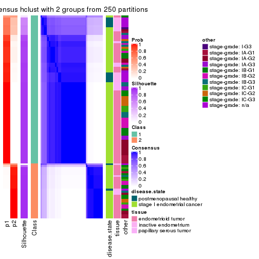</p>

</div>
<div id='tab-ATC-hclust-consensus-heatmap-2'>
<pre><code class="r">consensus_heatmap(res, k = 3)
</code></pre>

<p>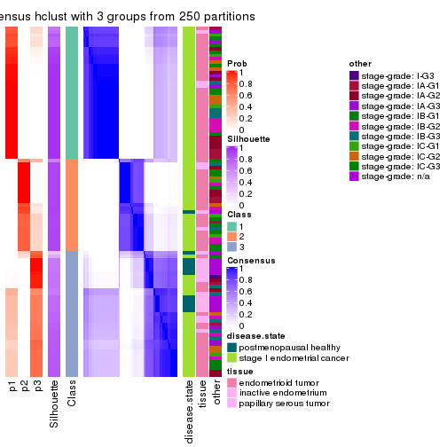</p>

</div>
<div id='tab-ATC-hclust-consensus-heatmap-3'>
<pre><code class="r">consensus_heatmap(res, k = 4)
</code></pre>

<p>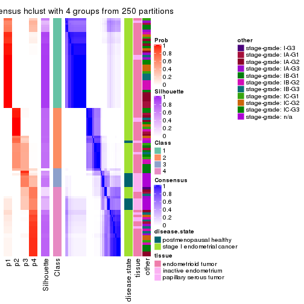</p>

</div>
<div id='tab-ATC-hclust-consensus-heatmap-4'>
<pre><code class="r">consensus_heatmap(res, k = 5)
</code></pre>

<p>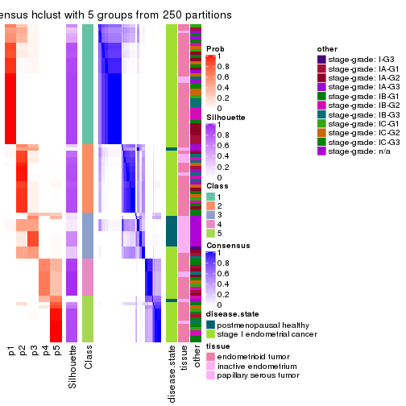</p>

</div>
<div id='tab-ATC-hclust-consensus-heatmap-5'>
<pre><code class="r">consensus_heatmap(res, k = 6)
</code></pre>

<p>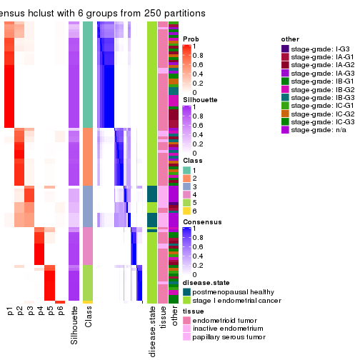</p>

</div>
</div>

Heatmaps for the membership of samples in all partitions to see how consistent they are:


<script>
$( function() {
	$( '#tabs-ATC-hclust-membership-heatmap' ).tabs();
} );
</script>
<div id='tabs-ATC-hclust-membership-heatmap'>
<ul>
<li><a href='#tab-ATC-hclust-membership-heatmap-1'>k = 2</a></li>
<li><a href='#tab-ATC-hclust-membership-heatmap-2'>k = 3</a></li>
<li><a href='#tab-ATC-hclust-membership-heatmap-3'>k = 4</a></li>
<li><a href='#tab-ATC-hclust-membership-heatmap-4'>k = 5</a></li>
<li><a href='#tab-ATC-hclust-membership-heatmap-5'>k = 6</a></li>
</ul>
<div id='tab-ATC-hclust-membership-heatmap-1'>
<pre><code class="r">membership_heatmap(res, k = 2)
</code></pre>

<p>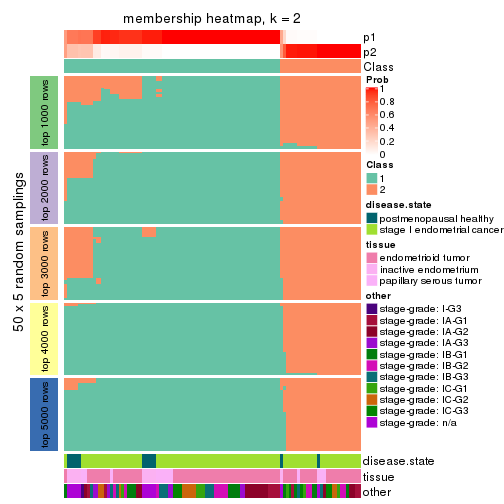</p>

</div>
<div id='tab-ATC-hclust-membership-heatmap-2'>
<pre><code class="r">membership_heatmap(res, k = 3)
</code></pre>

<p>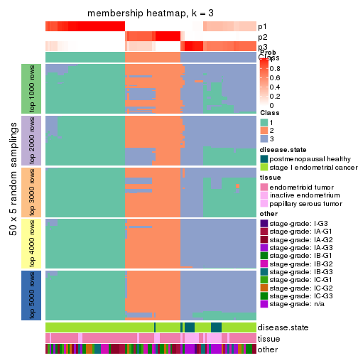</p>

</div>
<div id='tab-ATC-hclust-membership-heatmap-3'>
<pre><code class="r">membership_heatmap(res, k = 4)
</code></pre>

<p>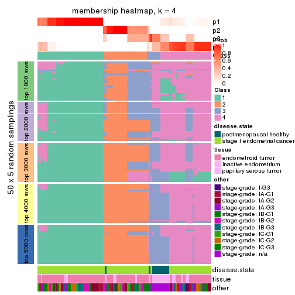</p>

</div>
<div id='tab-ATC-hclust-membership-heatmap-4'>
<pre><code class="r">membership_heatmap(res, k = 5)
</code></pre>

<p>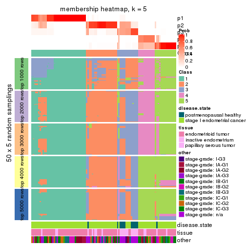</p>

</div>
<div id='tab-ATC-hclust-membership-heatmap-5'>
<pre><code class="r">membership_heatmap(res, k = 6)
</code></pre>

<p>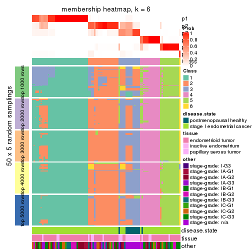</p>

</div>
</div>

As soon as we have had the classes for columns, we can look for signatures
which are significantly different between classes which can be candidate marks
for certain classes. Following are the heatmaps for signatures.


Signature heatmaps where rows are scaled:


<script>
$( function() {
	$( '#tabs-ATC-hclust-get-signatures' ).tabs();
} );
</script>
<div id='tabs-ATC-hclust-get-signatures'>
<ul>
<li><a href='#tab-ATC-hclust-get-signatures-1'>k = 2</a></li>
<li><a href='#tab-ATC-hclust-get-signatures-2'>k = 3</a></li>
<li><a href='#tab-ATC-hclust-get-signatures-3'>k = 4</a></li>
<li><a href='#tab-ATC-hclust-get-signatures-4'>k = 5</a></li>
<li><a href='#tab-ATC-hclust-get-signatures-5'>k = 6</a></li>
</ul>
<div id='tab-ATC-hclust-get-signatures-1'>
<pre><code class="r">get_signatures(res, k = 2)
</code></pre>

<p>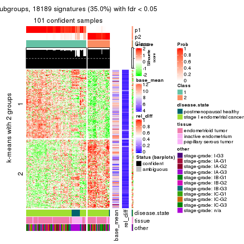</p>

</div>
<div id='tab-ATC-hclust-get-signatures-2'>
<pre><code class="r">get_signatures(res, k = 3)
</code></pre>

<p>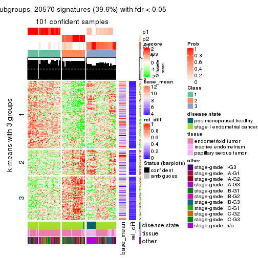</p>

</div>
<div id='tab-ATC-hclust-get-signatures-3'>
<pre><code class="r">get_signatures(res, k = 4)
</code></pre>

<p>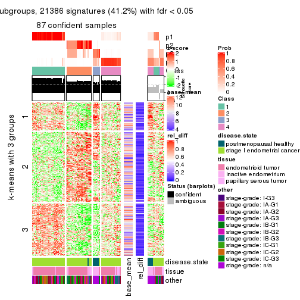</p>

</div>
<div id='tab-ATC-hclust-get-signatures-4'>
<pre><code class="r">get_signatures(res, k = 5)
</code></pre>

<p>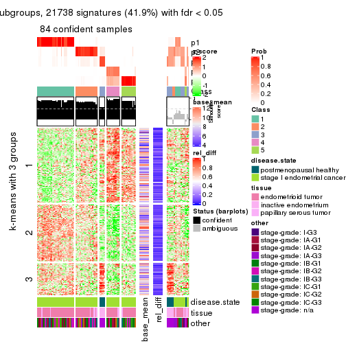</p>

</div>
<div id='tab-ATC-hclust-get-signatures-5'>
<pre><code class="r">get_signatures(res, k = 6)
</code></pre>

<p>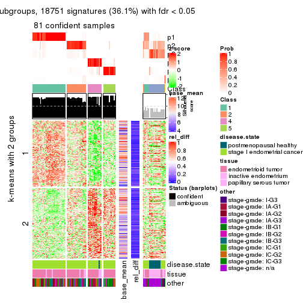</p>

</div>
</div>


Signature heatmaps where rows are not scaled:


<script>
$( function() {
	$( '#tabs-ATC-hclust-get-signatures-no-scale' ).tabs();
} );
</script>
<div id='tabs-ATC-hclust-get-signatures-no-scale'>
<ul>
<li><a href='#tab-ATC-hclust-get-signatures-no-scale-1'>k = 2</a></li>
<li><a href='#tab-ATC-hclust-get-signatures-no-scale-2'>k = 3</a></li>
<li><a href='#tab-ATC-hclust-get-signatures-no-scale-3'>k = 4</a></li>
<li><a href='#tab-ATC-hclust-get-signatures-no-scale-4'>k = 5</a></li>
<li><a href='#tab-ATC-hclust-get-signatures-no-scale-5'>k = 6</a></li>
</ul>
<div id='tab-ATC-hclust-get-signatures-no-scale-1'>
<pre><code class="r">get_signatures(res, k = 2, scale_rows = FALSE)
</code></pre>

<p>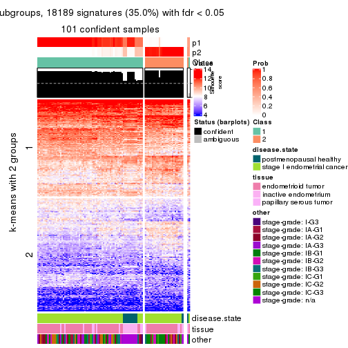</p>

</div>
<div id='tab-ATC-hclust-get-signatures-no-scale-2'>
<pre><code class="r">get_signatures(res, k = 3, scale_rows = FALSE)
</code></pre>

<p>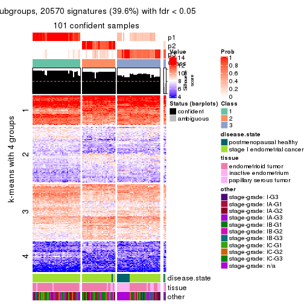</p>

</div>
<div id='tab-ATC-hclust-get-signatures-no-scale-3'>
<pre><code class="r">get_signatures(res, k = 4, scale_rows = FALSE)
</code></pre>

<p>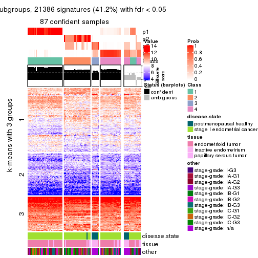</p>

</div>
<div id='tab-ATC-hclust-get-signatures-no-scale-4'>
<pre><code class="r">get_signatures(res, k = 5, scale_rows = FALSE)
</code></pre>

<p>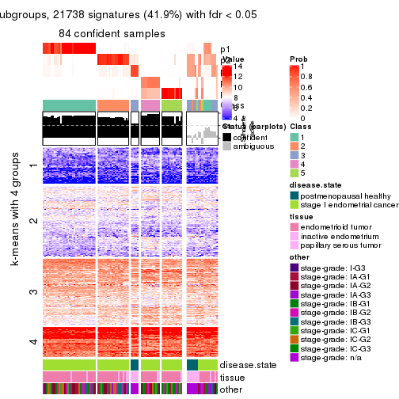</p>

</div>
<div id='tab-ATC-hclust-get-signatures-no-scale-5'>
<pre><code class="r">get_signatures(res, k = 6, scale_rows = FALSE)
</code></pre>

<p>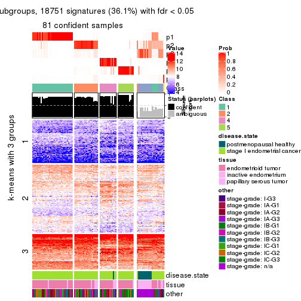</p>

</div>
</div>


Compare the overlap of signatures from different k:

```r
compare_signatures(res)
```

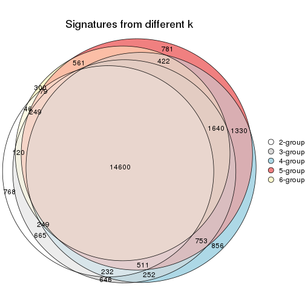

`get_signature()` returns a data frame invisibly. TO get the list of signatures, the function
call should be assigned to a variable explicitly. In following code, if `plot` argument is set
to `FALSE`, no heatmap is plotted while only the differential analysis is performed.

```r
# code only for demonstration
tb = get_signature(res, k = ..., plot = FALSE)
```

An example of the output of `tb` is:

```
#>   which_row         fdr    mean_1    mean_2 scaled_mean_1 scaled_mean_2 km
#> 1        38 0.042760348  8.373488  9.131774    -0.5533452     0.5164555  1
#> 2        40 0.018707592  7.106213  8.469186    -0.6173731     0.5762149  1
#> 3        55 0.019134737 10.221463 11.207825    -0.6159697     0.5749050  1
#> 4        59 0.006059896  5.921854  7.869574    -0.6899429     0.6439467  1
#> 5        60 0.018055526  8.928898 10.211722    -0.6204761     0.5791110  1
#> 6        98 0.009384629 15.714769 14.887706     0.6635654    -0.6193277  2
...
```

The columns in `tb` are:

1. `which_row`: row indices corresponding to the input matrix.
2. `fdr`: FDR for the differential test. 
3. `mean_x`: The mean value in group x.
4. `scaled_mean_x`: The mean value in group x after rows are scaled.
5. `km`: Row groups if k-means clustering is applied to rows.


UMAP plot which shows how samples are separated.


<script>
$( function() {
	$( '#tabs-ATC-hclust-dimension-reduction' ).tabs();
} );
</script>
<div id='tabs-ATC-hclust-dimension-reduction'>
<ul>
<li><a href='#tab-ATC-hclust-dimension-reduction-1'>k = 2</a></li>
<li><a href='#tab-ATC-hclust-dimension-reduction-2'>k = 3</a></li>
<li><a href='#tab-ATC-hclust-dimension-reduction-3'>k = 4</a></li>
<li><a href='#tab-ATC-hclust-dimension-reduction-4'>k = 5</a></li>
<li><a href='#tab-ATC-hclust-dimension-reduction-5'>k = 6</a></li>
</ul>
<div id='tab-ATC-hclust-dimension-reduction-1'>
<pre><code class="r">dimension_reduction(res, k = 2, method = &quot;UMAP&quot;)
</code></pre>

<p>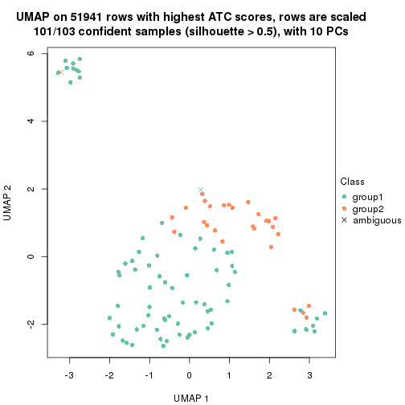</p>

</div>
<div id='tab-ATC-hclust-dimension-reduction-2'>
<pre><code class="r">dimension_reduction(res, k = 3, method = &quot;UMAP&quot;)
</code></pre>

<p>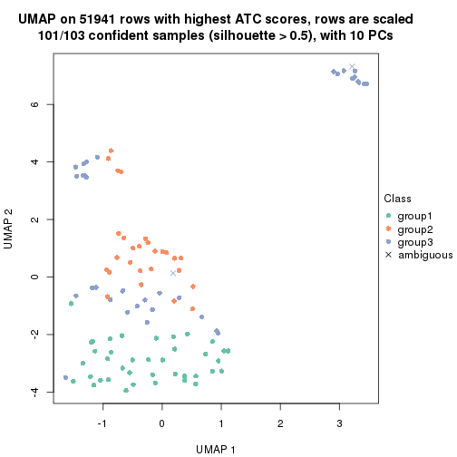</p>

</div>
<div id='tab-ATC-hclust-dimension-reduction-3'>
<pre><code class="r">dimension_reduction(res, k = 4, method = &quot;UMAP&quot;)
</code></pre>

<p>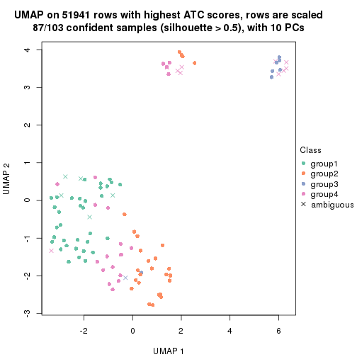</p>

</div>
<div id='tab-ATC-hclust-dimension-reduction-4'>
<pre><code class="r">dimension_reduction(res, k = 5, method = &quot;UMAP&quot;)
</code></pre>

<p>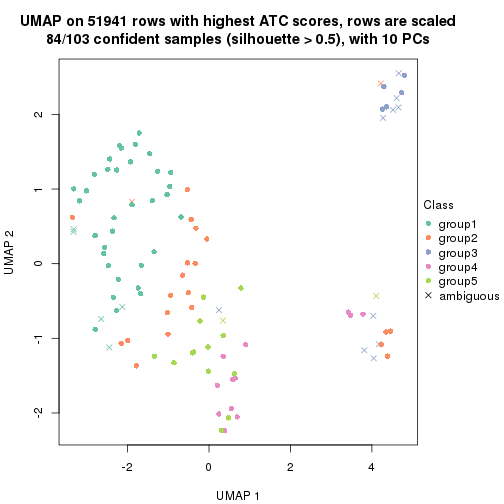</p>

</div>
<div id='tab-ATC-hclust-dimension-reduction-5'>
<pre><code class="r">dimension_reduction(res, k = 6, method = &quot;UMAP&quot;)
</code></pre>

<p>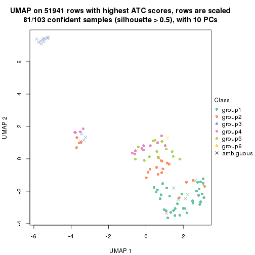</p>

</div>
</div>


Following heatmap shows how subgroups are split when increasing `k`:

```r
collect_classes(res)
```

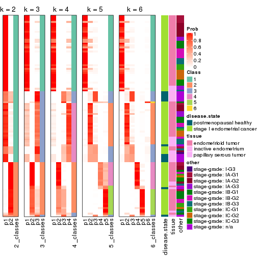


Test correlation between subgroups and known annotations. If the known
annotation is numeric, one-way ANOVA test is applied, and if the known
annotation is discrete, chi-squared contingency table test is applied.

```r
test_to_known_factors(res)
```

```
#>              n disease.state(p) tissue(p) other(p) k
#> ATC:hclust 101         2.98e-01  3.55e-01 3.52e-01 2
#> ATC:hclust 101         1.60e-04  3.58e-04 5.69e-02 3
#> ATC:hclust  87         1.79e-13  3.95e-12 2.20e-06 4
#> ATC:hclust  84         2.47e-17  1.73e-15 1.00e-08 5
#> ATC:hclust  81         1.83e-01  2.56e-01 6.02e-01 6
```


If matrix rows can be associated to genes, consider to use `functional_enrichment(res,
...)` to perform function enrichment for the signature genes. See [this vignette](http://bioconductor.org/packages/devel/bioc/vignettes/cola/inst/doc/functional_enrichment.html) for more detailed explanations.


 

---------------------------------------------------


### ATC:kmeans**


The object with results only for a single top-value method and a single partition method 
can be extracted as:

```r
res = res_list["ATC", "kmeans"]
# you can also extract it by
# res = res_list["ATC:kmeans"]
```

A summary of `res` and all the functions that can be applied to it:

```r
res
```

```
#> A 'ConsensusPartition' object with k = 2, 3, 4, 5, 6.
#>   On a matrix with 51941 rows and 103 columns.
#>   Top rows (1000, 2000, 3000, 4000, 5000) are extracted by 'ATC' method.
#>   Subgroups are detected by 'kmeans' method.
#>   Performed in total 1250 partitions by row resampling.
#>   Best k for subgroups seems to be 3.
#> 
#> Following methods can be applied to this 'ConsensusPartition' object:
#>  [1] "cola_report"             "collect_classes"         "collect_plots"          
#>  [4] "collect_stats"           "colnames"                "compare_signatures"     
#>  [7] "consensus_heatmap"       "dimension_reduction"     "functional_enrichment"  
#> [10] "get_anno_col"            "get_anno"                "get_classes"            
#> [13] "get_consensus"           "get_matrix"              "get_membership"         
#> [16] "get_param"               "get_signatures"          "get_stats"              
#> [19] "is_best_k"               "is_stable_k"             "membership_heatmap"     
#> [22] "ncol"                    "nrow"                    "plot_ecdf"              
#> [25] "rownames"                "select_partition_number" "show"                   
#> [28] "suggest_best_k"          "test_to_known_factors"
```

`collect_plots()` function collects all the plots made from `res` for all `k` (number of partitions)
into one single page to provide an easy and fast comparison between different `k`.

```r
collect_plots(res)
```

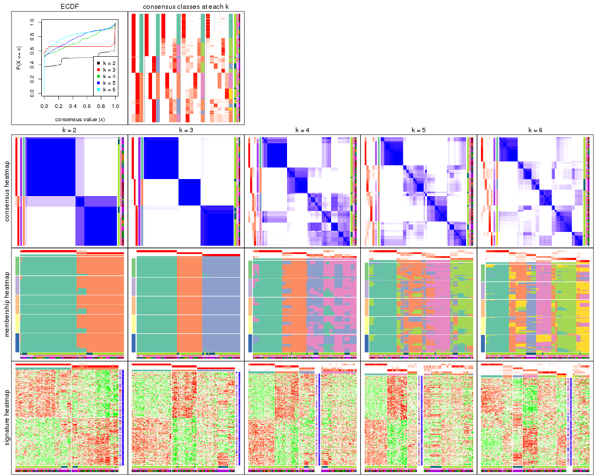

The plots are:

- The first row: a plot of the ECDF (empirical cumulative distribution
  function) curves of the consensus matrix for each `k` and the heatmap of
  predicted classes for each `k`.
- The second row: heatmaps of the consensus matrix for each `k`.
- The third row: heatmaps of the membership matrix for each `k`.
- The fouth row: heatmaps of the signatures for each `k`.

All the plots in panels can be made by individual functions and they are
plotted later in this section.

`select_partition_number()` produces several plots showing different
statistics for choosing "optimized" `k`. There are following statistics:

- ECDF curves of the consensus matrix for each `k`;
- 1-PAC. [The PAC
  score](https://en.wikipedia.org/wiki/Consensus_clustering#Over-interpretation_potential_of_consensus_clustering)
  measures the proportion of the ambiguous subgrouping.
- Mean silhouette score.
- Concordance. The mean probability of fiting the consensus class ids in all
  partitions.
- Area increased. Denote $A_k$ as the area under the ECDF curve for current
  `k`, the area increased is defined as $A_k - A_{k-1}$.
- Rand index. The percent of pairs of samples that are both in a same cluster
  or both are not in a same cluster in the partition of k and k-1.
- Jaccard index. The ratio of pairs of samples are both in a same cluster in
  the partition of k and k-1 and the pairs of samples are both in a same
  cluster in the partition k or k-1.

The detailed explanations of these statistics can be found in [the _cola_
vignette](http://bioconductor.org/packages/devel/bioc/vignettes/cola/inst/doc/cola.html#toc_13).

Generally speaking, lower PAC score, higher mean silhouette score or higher
concordance corresponds to better partition. Rand index and Jaccard index
measure how similar the current partition is compared to partition with `k-1`.
If they are too similar, we won't accept `k` is better than `k-1`.

```r
select_partition_number(res)
```

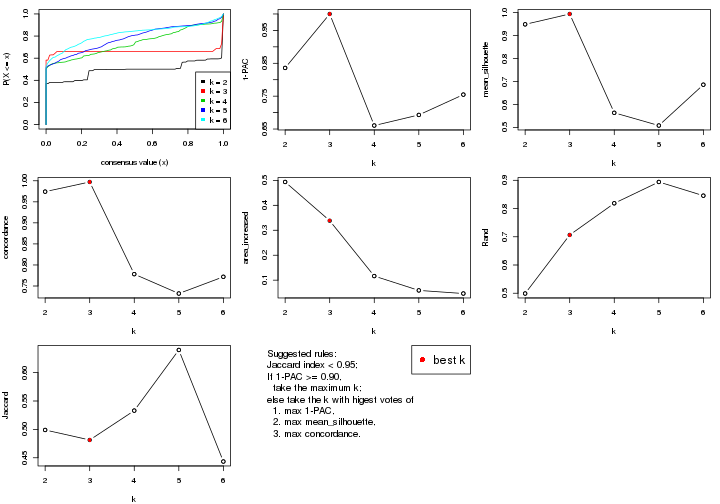

The numeric values for all these statistics can be obtained by `get_stats()`.

```r
get_stats(res)
```

```
#>   k 1-PAC mean_silhouette concordance area_increased  Rand Jaccard
#> 2 2 0.836           0.949       0.974         0.4937 0.499   0.499
#> 3 3 1.000           0.994       0.997         0.3383 0.706   0.481
#> 4 4 0.661           0.564       0.778         0.1165 0.819   0.533
#> 5 5 0.693           0.509       0.732         0.0590 0.894   0.640
#> 6 6 0.755           0.686       0.772         0.0465 0.846   0.443
```

`suggest_best_k()` suggests the best $k$ based on these statistics. The rules are as follows:

- All $k$ with Jaccard index larger than 0.95 are removed because increasing
  $k$ does not provide enough extra information. If all $k$ are removed, it is
  marked as no subgroup is detected.
- For all $k$ with 1-PAC score larger than 0.9, the maximal $k$ is taken as
  the best $k$, and other $k$ are marked as optional $k$.
- If it does not fit the second rule. The $k$ with the maximal vote of the
  highest 1-PAC score, highest mean silhouette, and highest concordance is
  taken as the best $k$.

```r
suggest_best_k(res)
```

```
#> [1] 3
```


Following shows the table of the partitions (You need to click the **show/hide
code output** link to see it). The membership matrix (columns with name `p*`)
is inferred by
[`clue::cl_consensus()`](https://www.rdocumentation.org/link/cl_consensus?package=clue)
function with the `SE` method. Basically the value in the membership matrix
represents the probability to belong to a certain group. The finall class
label for an item is determined with the group with highest probability it
belongs to.

In `get_classes()` function, the entropy is calculated from the membership
matrix and the silhouette score is calculated from the consensus matrix.


<script>
$( function() {
	$( '#tabs-ATC-kmeans-get-classes' ).tabs();
} );
</script>
<div id='tabs-ATC-kmeans-get-classes'>
<ul>
<li><a href='#tab-ATC-kmeans-get-classes-1'>k = 2</a></li>
<li><a href='#tab-ATC-kmeans-get-classes-2'>k = 3</a></li>
<li><a href='#tab-ATC-kmeans-get-classes-3'>k = 4</a></li>
<li><a href='#tab-ATC-kmeans-get-classes-4'>k = 5</a></li>
<li><a href='#tab-ATC-kmeans-get-classes-5'>k = 6</a></li>
</ul>

<div id='tab-ATC-kmeans-get-classes-1'>
<p><a id='tab-ATC-kmeans-get-classes-1-a' style='color:#0366d6' href='#'>show/hide code output</a></p>
<pre><code class="r">cbind(get_classes(res, k = 2), get_membership(res, k = 2))
</code></pre>

<pre><code>#&gt;           class entropy silhouette    p1    p2
#&gt; GSM425907     2  0.0000      0.947 0.000 1.000
#&gt; GSM425908     2  0.0000      0.947 0.000 1.000
#&gt; GSM425909     2  0.0000      0.947 0.000 1.000
#&gt; GSM425910     1  0.0000      0.994 1.000 0.000
#&gt; GSM425911     1  0.0000      0.994 1.000 0.000
#&gt; GSM425912     1  0.0000      0.994 1.000 0.000
#&gt; GSM425913     2  0.0000      0.947 0.000 1.000
#&gt; GSM425914     1  0.0000      0.994 1.000 0.000
#&gt; GSM425915     1  0.0000      0.994 1.000 0.000
#&gt; GSM425874     2  0.0000      0.947 0.000 1.000
#&gt; GSM425875     1  0.0000      0.994 1.000 0.000
#&gt; GSM425876     1  0.0000      0.994 1.000 0.000
#&gt; GSM425877     1  0.0000      0.994 1.000 0.000
#&gt; GSM425878     1  0.0000      0.994 1.000 0.000
#&gt; GSM425879     2  0.7950      0.741 0.240 0.760
#&gt; GSM425880     1  0.0000      0.994 1.000 0.000
#&gt; GSM425881     1  0.0000      0.994 1.000 0.000
#&gt; GSM425882     2  0.7950      0.741 0.240 0.760
#&gt; GSM425883     1  0.0000      0.994 1.000 0.000
#&gt; GSM425884     1  0.0000      0.994 1.000 0.000
#&gt; GSM425885     2  0.0000      0.947 0.000 1.000
#&gt; GSM425848     2  0.0000      0.947 0.000 1.000
#&gt; GSM425849     1  0.0000      0.994 1.000 0.000
#&gt; GSM425850     1  0.0000      0.994 1.000 0.000
#&gt; GSM425851     2  0.7950      0.741 0.240 0.760
#&gt; GSM425852     1  0.0000      0.994 1.000 0.000
#&gt; GSM425893     2  0.7950      0.741 0.240 0.760
#&gt; GSM425894     2  0.0000      0.947 0.000 1.000
#&gt; GSM425895     2  0.7950      0.741 0.240 0.760
#&gt; GSM425896     2  0.0000      0.947 0.000 1.000
#&gt; GSM425897     2  0.0000      0.947 0.000 1.000
#&gt; GSM425898     2  0.0000      0.947 0.000 1.000
#&gt; GSM425899     1  0.0000      0.994 1.000 0.000
#&gt; GSM425900     1  0.0000      0.994 1.000 0.000
#&gt; GSM425901     2  0.0000      0.947 0.000 1.000
#&gt; GSM425902     2  0.0000      0.947 0.000 1.000
#&gt; GSM425903     1  0.0000      0.994 1.000 0.000
#&gt; GSM425904     1  0.0000      0.994 1.000 0.000
#&gt; GSM425905     2  0.0000      0.947 0.000 1.000
#&gt; GSM425906     1  0.0000      0.994 1.000 0.000
#&gt; GSM425863     1  0.0000      0.994 1.000 0.000
#&gt; GSM425864     2  0.0000      0.947 0.000 1.000
#&gt; GSM425865     2  0.0000      0.947 0.000 1.000
#&gt; GSM425866     1  0.0000      0.994 1.000 0.000
#&gt; GSM425867     1  0.0000      0.994 1.000 0.000
#&gt; GSM425868     2  0.0000      0.947 0.000 1.000
#&gt; GSM425869     2  0.0000      0.947 0.000 1.000
#&gt; GSM425870     1  0.0000      0.994 1.000 0.000
#&gt; GSM425871     1  0.0000      0.994 1.000 0.000
#&gt; GSM425872     2  0.7950      0.741 0.240 0.760
#&gt; GSM425873     1  0.0000      0.994 1.000 0.000
#&gt; GSM425843     1  0.0000      0.994 1.000 0.000
#&gt; GSM425844     2  0.6343      0.823 0.160 0.840
#&gt; GSM425845     1  0.0000      0.994 1.000 0.000
#&gt; GSM425846     1  0.0000      0.994 1.000 0.000
#&gt; GSM425847     1  0.0000      0.994 1.000 0.000
#&gt; GSM425886     2  0.0000      0.947 0.000 1.000
#&gt; GSM425887     1  0.0000      0.994 1.000 0.000
#&gt; GSM425888     1  0.0000      0.994 1.000 0.000
#&gt; GSM425889     1  0.0000      0.994 1.000 0.000
#&gt; GSM425890     2  0.0000      0.947 0.000 1.000
#&gt; GSM425891     2  0.7950      0.741 0.240 0.760
#&gt; GSM425892     2  0.0000      0.947 0.000 1.000
#&gt; GSM425853     1  0.0000      0.994 1.000 0.000
#&gt; GSM425854     2  0.0000      0.947 0.000 1.000
#&gt; GSM425855     1  0.0000      0.994 1.000 0.000
#&gt; GSM425856     1  0.0000      0.994 1.000 0.000
#&gt; GSM425857     2  0.0000      0.947 0.000 1.000
#&gt; GSM425858     1  0.0000      0.994 1.000 0.000
#&gt; GSM425859     2  0.0000      0.947 0.000 1.000
#&gt; GSM425860     1  0.0000      0.994 1.000 0.000
#&gt; GSM425861     1  0.0000      0.994 1.000 0.000
#&gt; GSM425862     2  0.7950      0.741 0.240 0.760
#&gt; GSM425837     1  0.0000      0.994 1.000 0.000
#&gt; GSM425838     2  0.0000      0.947 0.000 1.000
#&gt; GSM425839     2  0.0000      0.947 0.000 1.000
#&gt; GSM425840     1  0.0000      0.994 1.000 0.000
#&gt; GSM425841     2  0.0000      0.947 0.000 1.000
#&gt; GSM425842     1  0.0000      0.994 1.000 0.000
#&gt; GSM425917     2  0.0000      0.947 0.000 1.000
#&gt; GSM425922     2  0.0000      0.947 0.000 1.000
#&gt; GSM425919     1  0.0000      0.994 1.000 0.000
#&gt; GSM425920     1  0.0000      0.994 1.000 0.000
#&gt; GSM425923     1  0.0000      0.994 1.000 0.000
#&gt; GSM425916     1  0.0000      0.994 1.000 0.000
#&gt; GSM425918     1  0.4562      0.884 0.904 0.096
#&gt; GSM425921     2  0.0000      0.947 0.000 1.000
#&gt; GSM425925     1  0.0000      0.994 1.000 0.000
#&gt; GSM425926     2  0.0000      0.947 0.000 1.000
#&gt; GSM425927     1  0.0000      0.994 1.000 0.000
#&gt; GSM425924     2  0.8327      0.705 0.264 0.736
#&gt; GSM425928     2  0.0000      0.947 0.000 1.000
#&gt; GSM425929     1  0.0000      0.994 1.000 0.000
#&gt; GSM425930     1  0.0000      0.994 1.000 0.000
#&gt; GSM425931     2  0.0000      0.947 0.000 1.000
#&gt; GSM425932     1  0.0000      0.994 1.000 0.000
#&gt; GSM425933     1  0.7376      0.712 0.792 0.208
#&gt; GSM425934     1  0.0000      0.994 1.000 0.000
#&gt; GSM425935     2  0.0000      0.947 0.000 1.000
#&gt; GSM425936     2  0.0000      0.947 0.000 1.000
#&gt; GSM425937     2  0.0938      0.939 0.012 0.988
#&gt; GSM425938     2  0.0000      0.947 0.000 1.000
#&gt; GSM425939     1  0.0000      0.994 1.000 0.000
</code></pre>

<script>
$('#tab-ATC-kmeans-get-classes-1-a').parent().next().next().hide();
$('#tab-ATC-kmeans-get-classes-1-a').click(function(){
  $('#tab-ATC-kmeans-get-classes-1-a').parent().next().next().toggle();
  return(false);
});
</script>
</div>

<div id='tab-ATC-kmeans-get-classes-2'>
<p><a id='tab-ATC-kmeans-get-classes-2-a' style='color:#0366d6' href='#'>show/hide code output</a></p>
<pre><code class="r">cbind(get_classes(res, k = 3), get_membership(res, k = 3))
</code></pre>

<pre><code>#&gt;           class entropy silhouette    p1 p2    p3
#&gt; GSM425907     2  0.0000      1.000 0.000  1 0.000
#&gt; GSM425908     2  0.0000      1.000 0.000  1 0.000
#&gt; GSM425909     3  0.0000      0.993 0.000  0 1.000
#&gt; GSM425910     1  0.0000      0.999 1.000  0 0.000
#&gt; GSM425911     3  0.0000      0.993 0.000  0 1.000
#&gt; GSM425912     1  0.0000      0.999 1.000  0 0.000
#&gt; GSM425913     3  0.0000      0.993 0.000  0 1.000
#&gt; GSM425914     1  0.0000      0.999 1.000  0 0.000
#&gt; GSM425915     3  0.0592      0.984 0.012  0 0.988
#&gt; GSM425874     2  0.0000      1.000 0.000  1 0.000
#&gt; GSM425875     1  0.0000      0.999 1.000  0 0.000
#&gt; GSM425876     1  0.0000      0.999 1.000  0 0.000
#&gt; GSM425877     1  0.0000      0.999 1.000  0 0.000
#&gt; GSM425878     1  0.0000      0.999 1.000  0 0.000
#&gt; GSM425879     3  0.0000      0.993 0.000  0 1.000
#&gt; GSM425880     1  0.0000      0.999 1.000  0 0.000
#&gt; GSM425881     1  0.0000      0.999 1.000  0 0.000
#&gt; GSM425882     3  0.0000      0.993 0.000  0 1.000
#&gt; GSM425883     1  0.0000      0.999 1.000  0 0.000
#&gt; GSM425884     1  0.0000      0.999 1.000  0 0.000
#&gt; GSM425885     2  0.0000      1.000 0.000  1 0.000
#&gt; GSM425848     3  0.0000      0.993 0.000  0 1.000
#&gt; GSM425849     1  0.0000      0.999 1.000  0 0.000
#&gt; GSM425850     1  0.0000      0.999 1.000  0 0.000
#&gt; GSM425851     3  0.0000      0.993 0.000  0 1.000
#&gt; GSM425852     3  0.0000      0.993 0.000  0 1.000
#&gt; GSM425893     3  0.0000      0.993 0.000  0 1.000
#&gt; GSM425894     2  0.0000      1.000 0.000  1 0.000
#&gt; GSM425895     3  0.0000      0.993 0.000  0 1.000
#&gt; GSM425896     2  0.0000      1.000 0.000  1 0.000
#&gt; GSM425897     3  0.0000      0.993 0.000  0 1.000
#&gt; GSM425898     3  0.0000      0.993 0.000  0 1.000
#&gt; GSM425899     3  0.0000      0.993 0.000  0 1.000
#&gt; GSM425900     1  0.0000      0.999 1.000  0 0.000
#&gt; GSM425901     2  0.0000      1.000 0.000  1 0.000
#&gt; GSM425902     2  0.0000      1.000 0.000  1 0.000
#&gt; GSM425903     1  0.0000      0.999 1.000  0 0.000
#&gt; GSM425904     1  0.0747      0.983 0.984  0 0.016
#&gt; GSM425905     2  0.0000      1.000 0.000  1 0.000
#&gt; GSM425906     1  0.0000      0.999 1.000  0 0.000
#&gt; GSM425863     1  0.0000      0.999 1.000  0 0.000
#&gt; GSM425864     2  0.0000      1.000 0.000  1 0.000
#&gt; GSM425865     2  0.0000      1.000 0.000  1 0.000
#&gt; GSM425866     1  0.0000      0.999 1.000  0 0.000
#&gt; GSM425867     1  0.0000      0.999 1.000  0 0.000
#&gt; GSM425868     2  0.0000      1.000 0.000  1 0.000
#&gt; GSM425869     2  0.0000      1.000 0.000  1 0.000
#&gt; GSM425870     1  0.0000      0.999 1.000  0 0.000
#&gt; GSM425871     3  0.0000      0.993 0.000  0 1.000
#&gt; GSM425872     3  0.0000      0.993 0.000  0 1.000
#&gt; GSM425873     1  0.0000      0.999 1.000  0 0.000
#&gt; GSM425843     1  0.0000      0.999 1.000  0 0.000
#&gt; GSM425844     3  0.0000      0.993 0.000  0 1.000
#&gt; GSM425845     1  0.0000      0.999 1.000  0 0.000
#&gt; GSM425846     3  0.0000      0.993 0.000  0 1.000
#&gt; GSM425847     1  0.0000      0.999 1.000  0 0.000
#&gt; GSM425886     3  0.0000      0.993 0.000  0 1.000
#&gt; GSM425887     1  0.0000      0.999 1.000  0 0.000
#&gt; GSM425888     1  0.0000      0.999 1.000  0 0.000
#&gt; GSM425889     1  0.0747      0.983 0.984  0 0.016
#&gt; GSM425890     2  0.0000      1.000 0.000  1 0.000
#&gt; GSM425891     3  0.0000      0.993 0.000  0 1.000
#&gt; GSM425892     2  0.0000      1.000 0.000  1 0.000
#&gt; GSM425853     1  0.0000      0.999 1.000  0 0.000
#&gt; GSM425854     3  0.0000      0.993 0.000  0 1.000
#&gt; GSM425855     1  0.0000      0.999 1.000  0 0.000
#&gt; GSM425856     3  0.1643      0.953 0.044  0 0.956
#&gt; GSM425857     2  0.0000      1.000 0.000  1 0.000
#&gt; GSM425858     1  0.0000      0.999 1.000  0 0.000
#&gt; GSM425859     2  0.0000      1.000 0.000  1 0.000
#&gt; GSM425860     1  0.0000      0.999 1.000  0 0.000
#&gt; GSM425861     1  0.0000      0.999 1.000  0 0.000
#&gt; GSM425862     3  0.0000      0.993 0.000  0 1.000
#&gt; GSM425837     1  0.0000      0.999 1.000  0 0.000
#&gt; GSM425838     2  0.0000      1.000 0.000  1 0.000
#&gt; GSM425839     2  0.0000      1.000 0.000  1 0.000
#&gt; GSM425840     1  0.0000      0.999 1.000  0 0.000
#&gt; GSM425841     2  0.0000      1.000 0.000  1 0.000
#&gt; GSM425842     1  0.0000      0.999 1.000  0 0.000
#&gt; GSM425917     3  0.0000      0.993 0.000  0 1.000
#&gt; GSM425922     2  0.0000      1.000 0.000  1 0.000
#&gt; GSM425919     1  0.0000      0.999 1.000  0 0.000
#&gt; GSM425920     1  0.0747      0.983 0.984  0 0.016
#&gt; GSM425923     3  0.0000      0.993 0.000  0 1.000
#&gt; GSM425916     1  0.0000      0.999 1.000  0 0.000
#&gt; GSM425918     3  0.0000      0.993 0.000  0 1.000
#&gt; GSM425921     2  0.0000      1.000 0.000  1 0.000
#&gt; GSM425925     3  0.1643      0.953 0.044  0 0.956
#&gt; GSM425926     2  0.0000      1.000 0.000  1 0.000
#&gt; GSM425927     1  0.0000      0.999 1.000  0 0.000
#&gt; GSM425924     3  0.0000      0.993 0.000  0 1.000
#&gt; GSM425928     2  0.0000      1.000 0.000  1 0.000
#&gt; GSM425929     3  0.1964      0.942 0.056  0 0.944
#&gt; GSM425930     3  0.0592      0.984 0.012  0 0.988
#&gt; GSM425931     3  0.0000      0.993 0.000  0 1.000
#&gt; GSM425932     3  0.0592      0.984 0.012  0 0.988
#&gt; GSM425933     3  0.0000      0.993 0.000  0 1.000
#&gt; GSM425934     3  0.1964      0.942 0.056  0 0.944
#&gt; GSM425935     2  0.0000      1.000 0.000  1 0.000
#&gt; GSM425936     3  0.0000      0.993 0.000  0 1.000
#&gt; GSM425937     3  0.0000      0.993 0.000  0 1.000
#&gt; GSM425938     3  0.0000      0.993 0.000  0 1.000
#&gt; GSM425939     3  0.0592      0.984 0.012  0 0.988
</code></pre>

<script>
$('#tab-ATC-kmeans-get-classes-2-a').parent().next().next().hide();
$('#tab-ATC-kmeans-get-classes-2-a').click(function(){
  $('#tab-ATC-kmeans-get-classes-2-a').parent().next().next().toggle();
  return(false);
});
</script>
</div>

<div id='tab-ATC-kmeans-get-classes-3'>
<p><a id='tab-ATC-kmeans-get-classes-3-a' style='color:#0366d6' href='#'>show/hide code output</a></p>
<pre><code class="r">cbind(get_classes(res, k = 4), get_membership(res, k = 4))
</code></pre>

<pre><code>#&gt;           class entropy silhouette    p1    p2    p3    p4
#&gt; GSM425907     2  0.0000     0.8959 0.000 1.000 0.000 0.000
#&gt; GSM425908     2  0.0000     0.8959 0.000 1.000 0.000 0.000
#&gt; GSM425909     3  0.4382     0.6919 0.000 0.000 0.704 0.296
#&gt; GSM425910     1  0.0000     0.9191 1.000 0.000 0.000 0.000
#&gt; GSM425911     4  0.2408     0.3359 0.000 0.000 0.104 0.896
#&gt; GSM425912     1  0.0000     0.9191 1.000 0.000 0.000 0.000
#&gt; GSM425913     3  0.3311     0.6887 0.000 0.000 0.828 0.172
#&gt; GSM425914     1  0.0000     0.9191 1.000 0.000 0.000 0.000
#&gt; GSM425915     4  0.0000     0.4345 0.000 0.000 0.000 1.000
#&gt; GSM425874     2  0.0000     0.8959 0.000 1.000 0.000 0.000
#&gt; GSM425875     1  0.3764     0.7086 0.784 0.000 0.000 0.216
#&gt; GSM425876     1  0.0000     0.9191 1.000 0.000 0.000 0.000
#&gt; GSM425877     1  0.0188     0.9161 0.996 0.000 0.000 0.004
#&gt; GSM425878     1  0.4040     0.6637 0.752 0.000 0.000 0.248
#&gt; GSM425879     4  0.4985    -0.4829 0.000 0.000 0.468 0.532
#&gt; GSM425880     4  0.4761     0.2181 0.372 0.000 0.000 0.628
#&gt; GSM425881     1  0.0000     0.9191 1.000 0.000 0.000 0.000
#&gt; GSM425882     4  0.4985    -0.4829 0.000 0.000 0.468 0.532
#&gt; GSM425883     4  0.6341     0.4289 0.212 0.000 0.136 0.652
#&gt; GSM425884     1  0.0000     0.9191 1.000 0.000 0.000 0.000
#&gt; GSM425885     2  0.0000     0.8959 0.000 1.000 0.000 0.000
#&gt; GSM425848     3  0.4679     0.6661 0.000 0.000 0.648 0.352
#&gt; GSM425849     1  0.4304     0.6054 0.716 0.000 0.000 0.284
#&gt; GSM425850     4  0.5000    -0.1502 0.500 0.000 0.000 0.500
#&gt; GSM425851     4  0.4989    -0.4879 0.000 0.000 0.472 0.528
#&gt; GSM425852     4  0.0000     0.4345 0.000 0.000 0.000 1.000
#&gt; GSM425893     4  0.4998    -0.5139 0.000 0.000 0.488 0.512
#&gt; GSM425894     2  0.3873     0.8156 0.000 0.772 0.228 0.000
#&gt; GSM425895     4  0.4992    -0.4982 0.000 0.000 0.476 0.524
#&gt; GSM425896     2  0.0000     0.8959 0.000 1.000 0.000 0.000
#&gt; GSM425897     3  0.2345     0.6604 0.000 0.000 0.900 0.100
#&gt; GSM425898     3  0.4382     0.6919 0.000 0.000 0.704 0.296
#&gt; GSM425899     4  0.2469     0.3297 0.000 0.000 0.108 0.892
#&gt; GSM425900     4  0.5000    -0.1379 0.496 0.000 0.000 0.504
#&gt; GSM425901     2  0.4761     0.6353 0.000 0.628 0.372 0.000
#&gt; GSM425902     2  0.4624     0.6896 0.000 0.660 0.340 0.000
#&gt; GSM425903     1  0.0000     0.9191 1.000 0.000 0.000 0.000
#&gt; GSM425904     4  0.3688     0.4730 0.208 0.000 0.000 0.792
#&gt; GSM425905     2  0.3688     0.8268 0.000 0.792 0.208 0.000
#&gt; GSM425906     1  0.4996     0.1480 0.516 0.000 0.000 0.484
#&gt; GSM425863     1  0.0000     0.9191 1.000 0.000 0.000 0.000
#&gt; GSM425864     2  0.3907     0.8130 0.000 0.768 0.232 0.000
#&gt; GSM425865     2  0.4624     0.6896 0.000 0.660 0.340 0.000
#&gt; GSM425866     1  0.4981     0.2071 0.536 0.000 0.000 0.464
#&gt; GSM425867     1  0.0000     0.9191 1.000 0.000 0.000 0.000
#&gt; GSM425868     2  0.0000     0.8959 0.000 1.000 0.000 0.000
#&gt; GSM425869     2  0.0000     0.8959 0.000 1.000 0.000 0.000
#&gt; GSM425870     1  0.0000     0.9191 1.000 0.000 0.000 0.000
#&gt; GSM425871     4  0.1474     0.4013 0.000 0.000 0.052 0.948
#&gt; GSM425872     4  0.4998    -0.5139 0.000 0.000 0.488 0.512
#&gt; GSM425873     1  0.0000     0.9191 1.000 0.000 0.000 0.000
#&gt; GSM425843     1  0.0000     0.9191 1.000 0.000 0.000 0.000
#&gt; GSM425844     3  0.4746     0.5609 0.000 0.000 0.632 0.368
#&gt; GSM425845     1  0.0000     0.9191 1.000 0.000 0.000 0.000
#&gt; GSM425846     4  0.2408     0.3427 0.000 0.000 0.104 0.896
#&gt; GSM425847     1  0.0000     0.9191 1.000 0.000 0.000 0.000
#&gt; GSM425886     3  0.4831     0.6869 0.000 0.016 0.704 0.280
#&gt; GSM425887     4  0.4843     0.1669 0.396 0.000 0.000 0.604
#&gt; GSM425888     1  0.0000     0.9191 1.000 0.000 0.000 0.000
#&gt; GSM425889     4  0.3649     0.4735 0.204 0.000 0.000 0.796
#&gt; GSM425890     2  0.0469     0.8914 0.000 0.988 0.012 0.000
#&gt; GSM425891     4  0.4985    -0.4829 0.000 0.000 0.468 0.532
#&gt; GSM425892     2  0.3688     0.8268 0.000 0.792 0.208 0.000
#&gt; GSM425853     4  0.4999    -0.1257 0.492 0.000 0.000 0.508
#&gt; GSM425854     3  0.4679     0.6661 0.000 0.000 0.648 0.352
#&gt; GSM425855     1  0.0000     0.9191 1.000 0.000 0.000 0.000
#&gt; GSM425856     4  0.0921     0.4485 0.028 0.000 0.000 0.972
#&gt; GSM425857     2  0.0000     0.8959 0.000 1.000 0.000 0.000
#&gt; GSM425858     1  0.3528     0.7373 0.808 0.000 0.000 0.192
#&gt; GSM425859     2  0.0000     0.8959 0.000 1.000 0.000 0.000
#&gt; GSM425860     1  0.0000     0.9191 1.000 0.000 0.000 0.000
#&gt; GSM425861     1  0.0000     0.9191 1.000 0.000 0.000 0.000
#&gt; GSM425862     4  0.4985    -0.4829 0.000 0.000 0.468 0.532
#&gt; GSM425837     1  0.0000     0.9191 1.000 0.000 0.000 0.000
#&gt; GSM425838     2  0.0000     0.8959 0.000 1.000 0.000 0.000
#&gt; GSM425839     2  0.4072     0.7959 0.000 0.748 0.252 0.000
#&gt; GSM425840     4  0.5000    -0.1502 0.500 0.000 0.000 0.500
#&gt; GSM425841     2  0.0000     0.8959 0.000 1.000 0.000 0.000
#&gt; GSM425842     1  0.0000     0.9191 1.000 0.000 0.000 0.000
#&gt; GSM425917     3  0.3123     0.6831 0.000 0.000 0.844 0.156
#&gt; GSM425922     2  0.0469     0.8914 0.000 0.988 0.012 0.000
#&gt; GSM425919     1  0.0000     0.9191 1.000 0.000 0.000 0.000
#&gt; GSM425920     4  0.4072     0.4537 0.252 0.000 0.000 0.748
#&gt; GSM425923     4  0.3688     0.3814 0.000 0.000 0.208 0.792
#&gt; GSM425916     4  0.6815     0.3027 0.284 0.000 0.136 0.580
#&gt; GSM425918     3  0.4713     0.5300 0.000 0.000 0.640 0.360
#&gt; GSM425921     2  0.0469     0.8914 0.000 0.988 0.012 0.000
#&gt; GSM425925     4  0.1256     0.4480 0.028 0.000 0.008 0.964
#&gt; GSM425926     2  0.3726     0.8245 0.000 0.788 0.212 0.000
#&gt; GSM425927     1  0.0000     0.9191 1.000 0.000 0.000 0.000
#&gt; GSM425924     3  0.4454     0.5874 0.000 0.000 0.692 0.308
#&gt; GSM425928     2  0.1792     0.8797 0.000 0.932 0.068 0.000
#&gt; GSM425929     4  0.4372     0.2965 0.004 0.000 0.268 0.728
#&gt; GSM425930     4  0.4193     0.2929 0.000 0.000 0.268 0.732
#&gt; GSM425931     3  0.4040     0.7057 0.000 0.000 0.752 0.248
#&gt; GSM425932     4  0.4193     0.2929 0.000 0.000 0.268 0.732
#&gt; GSM425933     3  0.4790     0.5551 0.000 0.000 0.620 0.380
#&gt; GSM425934     4  0.4372     0.2965 0.004 0.000 0.268 0.728
#&gt; GSM425935     3  0.4730     0.0473 0.000 0.364 0.636 0.000
#&gt; GSM425936     3  0.3975     0.7078 0.000 0.000 0.760 0.240
#&gt; GSM425937     3  0.4331     0.6785 0.000 0.000 0.712 0.288
#&gt; GSM425938     3  0.4072     0.7123 0.000 0.000 0.748 0.252
#&gt; GSM425939     4  0.4193     0.2929 0.000 0.000 0.268 0.732
</code></pre>

<script>
$('#tab-ATC-kmeans-get-classes-3-a').parent().next().next().hide();
$('#tab-ATC-kmeans-get-classes-3-a').click(function(){
  $('#tab-ATC-kmeans-get-classes-3-a').parent().next().next().toggle();
  return(false);
});
</script>
</div>

<div id='tab-ATC-kmeans-get-classes-4'>
<p><a id='tab-ATC-kmeans-get-classes-4-a' style='color:#0366d6' href='#'>show/hide code output</a></p>
<pre><code class="r">cbind(get_classes(res, k = 5), get_membership(res, k = 5))
</code></pre>

<pre><code>#&gt;           class entropy silhouette    p1    p2    p3    p4    p5
#&gt; GSM425907     4  0.0671    0.76930 0.000 0.000 0.004 0.980 0.016
#&gt; GSM425908     4  0.0451    0.77309 0.000 0.000 0.008 0.988 0.004
#&gt; GSM425909     2  0.3752    0.15957 0.000 0.708 0.292 0.000 0.000
#&gt; GSM425910     1  0.0703    0.88952 0.976 0.000 0.024 0.000 0.000
#&gt; GSM425911     2  0.3999    0.22396 0.000 0.656 0.000 0.000 0.344
#&gt; GSM425912     1  0.0290    0.89697 0.992 0.000 0.008 0.000 0.000
#&gt; GSM425913     3  0.5818    0.29924 0.000 0.444 0.464 0.000 0.092
#&gt; GSM425914     1  0.1082    0.88282 0.964 0.000 0.028 0.000 0.008
#&gt; GSM425915     5  0.3816    0.52148 0.000 0.304 0.000 0.000 0.696
#&gt; GSM425874     4  0.0162    0.77237 0.000 0.000 0.000 0.996 0.004
#&gt; GSM425875     1  0.4924    0.18219 0.552 0.000 0.028 0.000 0.420
#&gt; GSM425876     1  0.0290    0.89697 0.992 0.000 0.008 0.000 0.000
#&gt; GSM425877     1  0.3193    0.75356 0.840 0.000 0.028 0.000 0.132
#&gt; GSM425878     1  0.4948    0.12833 0.536 0.000 0.028 0.000 0.436
#&gt; GSM425879     2  0.0703    0.48254 0.000 0.976 0.000 0.000 0.024
#&gt; GSM425880     5  0.5870    0.61154 0.140 0.176 0.024 0.000 0.660
#&gt; GSM425881     1  0.0290    0.89697 0.992 0.000 0.008 0.000 0.000
#&gt; GSM425882     2  0.0703    0.48254 0.000 0.976 0.000 0.000 0.024
#&gt; GSM425883     5  0.6549    0.46240 0.072 0.080 0.260 0.000 0.588
#&gt; GSM425884     1  0.0290    0.89697 0.992 0.000 0.008 0.000 0.000
#&gt; GSM425885     4  0.0671    0.76930 0.000 0.000 0.004 0.980 0.016
#&gt; GSM425848     2  0.2471    0.35719 0.000 0.864 0.136 0.000 0.000
#&gt; GSM425849     1  0.4961    0.08382 0.524 0.000 0.028 0.000 0.448
#&gt; GSM425850     5  0.4456    0.49531 0.320 0.000 0.020 0.000 0.660
#&gt; GSM425851     2  0.0703    0.48254 0.000 0.976 0.000 0.000 0.024
#&gt; GSM425852     5  0.3913    0.50525 0.000 0.324 0.000 0.000 0.676
#&gt; GSM425893     2  0.0703    0.48254 0.000 0.976 0.000 0.000 0.024
#&gt; GSM425894     4  0.5484    0.57569 0.000 0.080 0.336 0.584 0.000
#&gt; GSM425895     2  0.0703    0.48254 0.000 0.976 0.000 0.000 0.024
#&gt; GSM425896     4  0.0451    0.77309 0.000 0.000 0.008 0.988 0.004
#&gt; GSM425897     3  0.5313    0.34447 0.000 0.388 0.556 0.000 0.056
#&gt; GSM425898     2  0.3661    0.18086 0.000 0.724 0.276 0.000 0.000
#&gt; GSM425899     2  0.4030    0.20760 0.000 0.648 0.000 0.000 0.352
#&gt; GSM425900     5  0.4456    0.49531 0.320 0.000 0.020 0.000 0.660
#&gt; GSM425901     4  0.6538    0.35366 0.000 0.208 0.340 0.452 0.000
#&gt; GSM425902     4  0.6469    0.38850 0.000 0.196 0.336 0.468 0.000
#&gt; GSM425903     1  0.0703    0.88952 0.976 0.000 0.024 0.000 0.000
#&gt; GSM425904     5  0.4941    0.58521 0.064 0.240 0.004 0.000 0.692
#&gt; GSM425905     4  0.5300    0.59355 0.000 0.068 0.328 0.604 0.000
#&gt; GSM425906     5  0.4630    0.52711 0.300 0.008 0.020 0.000 0.672
#&gt; GSM425863     1  0.0000    0.89610 1.000 0.000 0.000 0.000 0.000
#&gt; GSM425864     4  0.5671    0.55649 0.000 0.096 0.336 0.568 0.000
#&gt; GSM425865     4  0.6469    0.38850 0.000 0.196 0.336 0.468 0.000
#&gt; GSM425866     5  0.4703    0.44322 0.340 0.000 0.028 0.000 0.632
#&gt; GSM425867     1  0.0290    0.89697 0.992 0.000 0.008 0.000 0.000
#&gt; GSM425868     4  0.1300    0.77153 0.000 0.000 0.016 0.956 0.028
#&gt; GSM425869     4  0.0771    0.76922 0.000 0.000 0.004 0.976 0.020
#&gt; GSM425870     1  0.0703    0.88952 0.976 0.000 0.024 0.000 0.000
#&gt; GSM425871     2  0.4278   -0.08230 0.000 0.548 0.000 0.000 0.452
#&gt; GSM425872     2  0.0703    0.48254 0.000 0.976 0.000 0.000 0.024
#&gt; GSM425873     1  0.0290    0.89697 0.992 0.000 0.008 0.000 0.000
#&gt; GSM425843     1  0.0290    0.89697 0.992 0.000 0.008 0.000 0.000
#&gt; GSM425844     2  0.5759   -0.32379 0.000 0.520 0.388 0.000 0.092
#&gt; GSM425845     1  0.0162    0.89538 0.996 0.000 0.004 0.000 0.000
#&gt; GSM425846     2  0.4114    0.15089 0.000 0.624 0.000 0.000 0.376
#&gt; GSM425847     1  0.0290    0.89697 0.992 0.000 0.008 0.000 0.000
#&gt; GSM425886     2  0.4624    0.05146 0.000 0.636 0.340 0.024 0.000
#&gt; GSM425887     5  0.5243    0.62598 0.208 0.104 0.004 0.000 0.684
#&gt; GSM425888     1  0.0290    0.89697 0.992 0.000 0.008 0.000 0.000
#&gt; GSM425889     5  0.4879    0.59307 0.076 0.228 0.000 0.000 0.696
#&gt; GSM425890     4  0.1981    0.75359 0.000 0.000 0.028 0.924 0.048
#&gt; GSM425891     2  0.0703    0.48254 0.000 0.976 0.000 0.000 0.024
#&gt; GSM425892     4  0.5300    0.59355 0.000 0.068 0.328 0.604 0.000
#&gt; GSM425853     5  0.5130    0.53237 0.292 0.028 0.024 0.000 0.656
#&gt; GSM425854     2  0.2329    0.36450 0.000 0.876 0.124 0.000 0.000
#&gt; GSM425855     1  0.1300    0.87715 0.956 0.000 0.028 0.000 0.016
#&gt; GSM425856     5  0.3876    0.51365 0.000 0.316 0.000 0.000 0.684
#&gt; GSM425857     4  0.0671    0.76930 0.000 0.000 0.004 0.980 0.016
#&gt; GSM425858     1  0.4866    0.26204 0.580 0.000 0.028 0.000 0.392
#&gt; GSM425859     4  0.0955    0.77215 0.000 0.000 0.028 0.968 0.004
#&gt; GSM425860     1  0.0290    0.89697 0.992 0.000 0.008 0.000 0.000
#&gt; GSM425861     1  0.0703    0.88952 0.976 0.000 0.024 0.000 0.000
#&gt; GSM425862     2  0.0703    0.48254 0.000 0.976 0.000 0.000 0.024
#&gt; GSM425837     1  0.0000    0.89610 1.000 0.000 0.000 0.000 0.000
#&gt; GSM425838     4  0.0290    0.77239 0.000 0.000 0.000 0.992 0.008
#&gt; GSM425839     4  0.6186    0.47419 0.000 0.152 0.336 0.512 0.000
#&gt; GSM425840     5  0.4540    0.49136 0.320 0.000 0.024 0.000 0.656
#&gt; GSM425841     4  0.0955    0.77215 0.000 0.000 0.028 0.968 0.004
#&gt; GSM425842     1  0.0290    0.89697 0.992 0.000 0.008 0.000 0.000
#&gt; GSM425917     3  0.5883    0.37778 0.000 0.388 0.508 0.000 0.104
#&gt; GSM425922     4  0.1981    0.75359 0.000 0.000 0.028 0.924 0.048
#&gt; GSM425919     1  0.0290    0.89450 0.992 0.000 0.008 0.000 0.000
#&gt; GSM425920     5  0.5241    0.62495 0.152 0.148 0.004 0.000 0.696
#&gt; GSM425923     5  0.6726   -0.10157 0.000 0.252 0.360 0.000 0.388
#&gt; GSM425916     5  0.6505    0.47705 0.112 0.044 0.260 0.000 0.584
#&gt; GSM425918     2  0.6095   -0.35374 0.000 0.460 0.416 0.000 0.124
#&gt; GSM425921     4  0.1981    0.75359 0.000 0.000 0.028 0.924 0.048
#&gt; GSM425925     5  0.4074    0.45688 0.000 0.364 0.000 0.000 0.636
#&gt; GSM425926     4  0.5456    0.58268 0.000 0.080 0.328 0.592 0.000
#&gt; GSM425927     1  0.0290    0.89697 0.992 0.000 0.008 0.000 0.000
#&gt; GSM425924     2  0.5927   -0.39422 0.000 0.468 0.428 0.000 0.104
#&gt; GSM425928     4  0.3339    0.73620 0.000 0.000 0.112 0.840 0.048
#&gt; GSM425929     5  0.6141    0.23981 0.000 0.196 0.244 0.000 0.560
#&gt; GSM425930     5  0.6141    0.23981 0.000 0.196 0.244 0.000 0.560
#&gt; GSM425931     2  0.6418   -0.03426 0.000 0.472 0.344 0.000 0.184
#&gt; GSM425932     5  0.6141    0.23981 0.000 0.196 0.244 0.000 0.560
#&gt; GSM425933     2  0.6690    0.04446 0.000 0.432 0.300 0.000 0.268
#&gt; GSM425934     5  0.6141    0.23981 0.000 0.196 0.244 0.000 0.560
#&gt; GSM425935     3  0.7478   -0.10411 0.000 0.256 0.428 0.272 0.044
#&gt; GSM425936     2  0.6418   -0.03426 0.000 0.472 0.344 0.000 0.184
#&gt; GSM425937     2  0.6372    0.00544 0.000 0.492 0.324 0.000 0.184
#&gt; GSM425938     2  0.6062   -0.03625 0.000 0.564 0.268 0.000 0.168
#&gt; GSM425939     5  0.6141    0.23981 0.000 0.196 0.244 0.000 0.560
</code></pre>

<script>
$('#tab-ATC-kmeans-get-classes-4-a').parent().next().next().hide();
$('#tab-ATC-kmeans-get-classes-4-a').click(function(){
  $('#tab-ATC-kmeans-get-classes-4-a').parent().next().next().toggle();
  return(false);
});
</script>
</div>

<div id='tab-ATC-kmeans-get-classes-5'>
<p><a id='tab-ATC-kmeans-get-classes-5-a' style='color:#0366d6' href='#'>show/hide code output</a></p>
<pre><code class="r">cbind(get_classes(res, k = 6), get_membership(res, k = 6))
</code></pre>

<pre><code>#&gt;           class entropy silhouette    p1    p2    p3    p4    p5    p6
#&gt; GSM425907     4  0.3795     0.9400 0.000 0.000 0.004 0.632 0.000 0.364
#&gt; GSM425908     4  0.3899     0.9332 0.000 0.000 0.004 0.592 0.000 0.404
#&gt; GSM425909     6  0.6938     0.0951 0.000 0.152 0.064 0.236 0.028 0.520
#&gt; GSM425910     1  0.1818     0.9221 0.920 0.004 0.004 0.068 0.004 0.000
#&gt; GSM425911     5  0.7057    -0.2891 0.000 0.292 0.064 0.236 0.404 0.004
#&gt; GSM425912     1  0.0291     0.9448 0.992 0.000 0.004 0.004 0.000 0.000
#&gt; GSM425913     2  0.2714     0.3495 0.000 0.848 0.136 0.004 0.012 0.000
#&gt; GSM425914     1  0.2594     0.8951 0.884 0.004 0.004 0.068 0.040 0.000
#&gt; GSM425915     5  0.0508     0.7037 0.000 0.004 0.012 0.000 0.984 0.000
#&gt; GSM425874     4  0.3872     0.9381 0.000 0.000 0.004 0.604 0.000 0.392
#&gt; GSM425875     5  0.4452     0.6100 0.220 0.004 0.004 0.064 0.708 0.000
#&gt; GSM425876     1  0.0291     0.9448 0.992 0.000 0.004 0.004 0.000 0.000
#&gt; GSM425877     1  0.5150     0.2555 0.552 0.004 0.004 0.068 0.372 0.000
#&gt; GSM425878     5  0.4426     0.6137 0.216 0.004 0.004 0.064 0.712 0.000
#&gt; GSM425879     2  0.8399     0.6222 0.000 0.372 0.144 0.236 0.132 0.116
#&gt; GSM425880     5  0.0806     0.7127 0.008 0.000 0.000 0.020 0.972 0.000
#&gt; GSM425881     1  0.0291     0.9448 0.992 0.000 0.004 0.004 0.000 0.000
#&gt; GSM425882     2  0.8399     0.6222 0.000 0.372 0.144 0.236 0.132 0.116
#&gt; GSM425883     5  0.4785     0.2917 0.004 0.452 0.032 0.004 0.508 0.000
#&gt; GSM425884     1  0.0291     0.9448 0.992 0.000 0.004 0.004 0.000 0.000
#&gt; GSM425885     4  0.3795     0.9400 0.000 0.000 0.004 0.632 0.000 0.364
#&gt; GSM425848     2  0.8262     0.5115 0.000 0.352 0.084 0.236 0.096 0.232
#&gt; GSM425849     5  0.4399     0.6171 0.212 0.004 0.004 0.064 0.716 0.000
#&gt; GSM425850     5  0.2149     0.7025 0.104 0.000 0.004 0.004 0.888 0.000
#&gt; GSM425851     2  0.8375     0.6223 0.000 0.376 0.144 0.236 0.128 0.116
#&gt; GSM425852     5  0.0458     0.7018 0.000 0.000 0.016 0.000 0.984 0.000
#&gt; GSM425893     2  0.8375     0.6223 0.000 0.376 0.144 0.236 0.128 0.116
#&gt; GSM425894     6  0.0260     0.7164 0.000 0.000 0.000 0.008 0.000 0.992
#&gt; GSM425895     2  0.8406     0.6155 0.000 0.372 0.136 0.236 0.128 0.128
#&gt; GSM425896     4  0.3899     0.9332 0.000 0.000 0.004 0.592 0.000 0.404
#&gt; GSM425897     2  0.5890     0.2153 0.000 0.588 0.128 0.044 0.000 0.240
#&gt; GSM425898     6  0.6992     0.0754 0.000 0.160 0.064 0.236 0.028 0.512
#&gt; GSM425899     5  0.7022    -0.2880 0.000 0.296 0.060 0.236 0.404 0.004
#&gt; GSM425900     5  0.2604     0.7004 0.096 0.004 0.000 0.028 0.872 0.000
#&gt; GSM425901     6  0.1409     0.7404 0.000 0.032 0.008 0.012 0.000 0.948
#&gt; GSM425902     6  0.1409     0.7404 0.000 0.032 0.008 0.012 0.000 0.948
#&gt; GSM425903     1  0.2125     0.9147 0.908 0.004 0.004 0.068 0.016 0.000
#&gt; GSM425904     5  0.0405     0.7070 0.004 0.000 0.008 0.000 0.988 0.000
#&gt; GSM425905     6  0.0363     0.7098 0.000 0.000 0.000 0.012 0.000 0.988
#&gt; GSM425906     5  0.3018     0.6978 0.100 0.008 0.008 0.028 0.856 0.000
#&gt; GSM425863     1  0.0363     0.9438 0.988 0.000 0.000 0.012 0.000 0.000
#&gt; GSM425864     6  0.0405     0.7181 0.000 0.004 0.000 0.008 0.000 0.988
#&gt; GSM425865     6  0.1151     0.7394 0.000 0.032 0.012 0.000 0.000 0.956
#&gt; GSM425866     5  0.3355     0.6746 0.132 0.004 0.000 0.048 0.816 0.000
#&gt; GSM425867     1  0.0291     0.9448 0.992 0.000 0.004 0.004 0.000 0.000
#&gt; GSM425868     4  0.4936     0.9224 0.000 0.028 0.024 0.552 0.000 0.396
#&gt; GSM425869     4  0.3911     0.9398 0.000 0.000 0.008 0.624 0.000 0.368
#&gt; GSM425870     1  0.1818     0.9221 0.920 0.004 0.004 0.068 0.004 0.000
#&gt; GSM425871     5  0.6488    -0.1535 0.000 0.280 0.036 0.216 0.468 0.000
#&gt; GSM425872     2  0.8377     0.6200 0.000 0.376 0.144 0.236 0.124 0.120
#&gt; GSM425873     1  0.0291     0.9448 0.992 0.000 0.004 0.004 0.000 0.000
#&gt; GSM425843     1  0.0291     0.9448 0.992 0.000 0.004 0.004 0.000 0.000
#&gt; GSM425844     2  0.2290     0.3813 0.000 0.892 0.084 0.004 0.020 0.000
#&gt; GSM425845     1  0.1082     0.9367 0.956 0.000 0.004 0.040 0.000 0.000
#&gt; GSM425846     5  0.6800    -0.2534 0.000 0.292 0.052 0.236 0.420 0.000
#&gt; GSM425847     1  0.0291     0.9448 0.992 0.000 0.004 0.004 0.000 0.000
#&gt; GSM425886     6  0.5793     0.3213 0.000 0.084 0.040 0.236 0.016 0.624
#&gt; GSM425887     5  0.1049     0.7145 0.032 0.000 0.008 0.000 0.960 0.000
#&gt; GSM425888     1  0.0000     0.9447 1.000 0.000 0.000 0.000 0.000 0.000
#&gt; GSM425889     5  0.0665     0.7086 0.008 0.004 0.008 0.000 0.980 0.000
#&gt; GSM425890     4  0.4889     0.9148 0.000 0.028 0.028 0.596 0.000 0.348
#&gt; GSM425891     2  0.8399     0.6222 0.000 0.372 0.144 0.236 0.132 0.116
#&gt; GSM425892     6  0.0363     0.7098 0.000 0.000 0.000 0.012 0.000 0.988
#&gt; GSM425853     5  0.1500     0.7152 0.052 0.000 0.000 0.012 0.936 0.000
#&gt; GSM425854     2  0.8231     0.5273 0.000 0.364 0.084 0.236 0.096 0.220
#&gt; GSM425855     1  0.2973     0.8705 0.860 0.004 0.004 0.068 0.064 0.000
#&gt; GSM425856     5  0.0260     0.7047 0.000 0.000 0.008 0.000 0.992 0.000
#&gt; GSM425857     4  0.3795     0.9400 0.000 0.000 0.004 0.632 0.000 0.364
#&gt; GSM425858     5  0.4628     0.5826 0.240 0.004 0.004 0.068 0.684 0.000
#&gt; GSM425859     4  0.3955     0.9076 0.000 0.000 0.004 0.560 0.000 0.436
#&gt; GSM425860     1  0.0291     0.9445 0.992 0.000 0.004 0.004 0.000 0.000
#&gt; GSM425861     1  0.1818     0.9221 0.920 0.004 0.004 0.068 0.004 0.000
#&gt; GSM425862     2  0.8399     0.6222 0.000 0.372 0.144 0.236 0.132 0.116
#&gt; GSM425837     1  0.0547     0.9423 0.980 0.000 0.000 0.020 0.000 0.000
#&gt; GSM425838     4  0.3862     0.9390 0.000 0.000 0.004 0.608 0.000 0.388
#&gt; GSM425839     6  0.0508     0.7313 0.000 0.012 0.004 0.000 0.000 0.984
#&gt; GSM425840     5  0.3126     0.6909 0.104 0.004 0.004 0.044 0.844 0.000
#&gt; GSM425841     4  0.3950     0.9118 0.000 0.000 0.004 0.564 0.000 0.432
#&gt; GSM425842     1  0.0291     0.9448 0.992 0.000 0.004 0.004 0.000 0.000
#&gt; GSM425917     2  0.3100     0.3152 0.000 0.836 0.128 0.012 0.000 0.024
#&gt; GSM425922     4  0.4956     0.9143 0.000 0.028 0.032 0.592 0.000 0.348
#&gt; GSM425919     1  0.1152     0.9350 0.952 0.000 0.000 0.044 0.004 0.000
#&gt; GSM425920     5  0.1138     0.7117 0.024 0.004 0.012 0.000 0.960 0.000
#&gt; GSM425923     2  0.4108     0.2223 0.000 0.744 0.092 0.000 0.164 0.000
#&gt; GSM425916     5  0.4992     0.3160 0.020 0.444 0.024 0.004 0.508 0.000
#&gt; GSM425918     2  0.2494     0.3517 0.000 0.864 0.120 0.000 0.016 0.000
#&gt; GSM425921     4  0.4956     0.9143 0.000 0.028 0.032 0.592 0.000 0.348
#&gt; GSM425925     5  0.1777     0.6802 0.000 0.044 0.024 0.004 0.928 0.000
#&gt; GSM425926     6  0.0260     0.7164 0.000 0.000 0.000 0.008 0.000 0.992
#&gt; GSM425927     1  0.0291     0.9448 0.992 0.000 0.004 0.004 0.000 0.000
#&gt; GSM425924     2  0.2723     0.3454 0.000 0.852 0.128 0.004 0.016 0.000
#&gt; GSM425928     4  0.5105     0.8481 0.000 0.028 0.032 0.520 0.000 0.420
#&gt; GSM425929     3  0.2980     0.8100 0.000 0.008 0.800 0.000 0.192 0.000
#&gt; GSM425930     3  0.2980     0.8100 0.000 0.008 0.800 0.000 0.192 0.000
#&gt; GSM425931     3  0.3148     0.7401 0.000 0.092 0.840 0.000 0.004 0.064
#&gt; GSM425932     3  0.2948     0.8102 0.000 0.008 0.804 0.000 0.188 0.000
#&gt; GSM425933     3  0.1863     0.7786 0.000 0.044 0.920 0.000 0.036 0.000
#&gt; GSM425934     3  0.2980     0.8100 0.000 0.008 0.800 0.000 0.192 0.000
#&gt; GSM425935     6  0.3542     0.6435 0.000 0.052 0.160 0.000 0.000 0.788
#&gt; GSM425936     3  0.3148     0.7401 0.000 0.092 0.840 0.000 0.004 0.064
#&gt; GSM425937     3  0.2763     0.7519 0.000 0.088 0.868 0.000 0.008 0.036
#&gt; GSM425938     3  0.4610     0.5764 0.000 0.152 0.724 0.008 0.004 0.112
#&gt; GSM425939     3  0.2980     0.8100 0.000 0.008 0.800 0.000 0.192 0.000
</code></pre>

<script>
$('#tab-ATC-kmeans-get-classes-5-a').parent().next().next().hide();
$('#tab-ATC-kmeans-get-classes-5-a').click(function(){
  $('#tab-ATC-kmeans-get-classes-5-a').parent().next().next().toggle();
  return(false);
});
</script>
</div>
</div>

Heatmaps for the consensus matrix. It visualizes the probability of two
samples to be in a same group.


<script>
$( function() {
	$( '#tabs-ATC-kmeans-consensus-heatmap' ).tabs();
} );
</script>
<div id='tabs-ATC-kmeans-consensus-heatmap'>
<ul>
<li><a href='#tab-ATC-kmeans-consensus-heatmap-1'>k = 2</a></li>
<li><a href='#tab-ATC-kmeans-consensus-heatmap-2'>k = 3</a></li>
<li><a href='#tab-ATC-kmeans-consensus-heatmap-3'>k = 4</a></li>
<li><a href='#tab-ATC-kmeans-consensus-heatmap-4'>k = 5</a></li>
<li><a href='#tab-ATC-kmeans-consensus-heatmap-5'>k = 6</a></li>
</ul>
<div id='tab-ATC-kmeans-consensus-heatmap-1'>
<pre><code class="r">consensus_heatmap(res, k = 2)
</code></pre>

<p>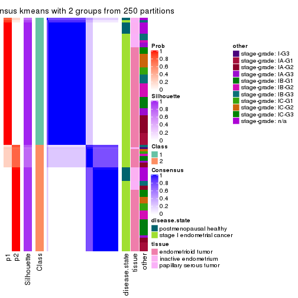</p>

</div>
<div id='tab-ATC-kmeans-consensus-heatmap-2'>
<pre><code class="r">consensus_heatmap(res, k = 3)
</code></pre>

<p>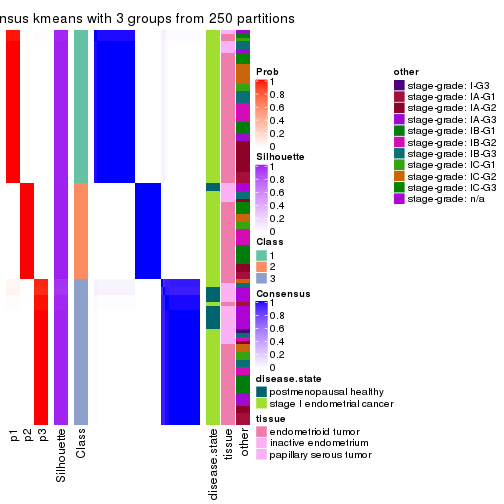</p>

</div>
<div id='tab-ATC-kmeans-consensus-heatmap-3'>
<pre><code class="r">consensus_heatmap(res, k = 4)
</code></pre>

<p>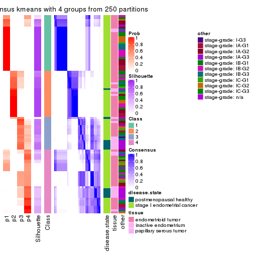</p>

</div>
<div id='tab-ATC-kmeans-consensus-heatmap-4'>
<pre><code class="r">consensus_heatmap(res, k = 5)
</code></pre>

<p>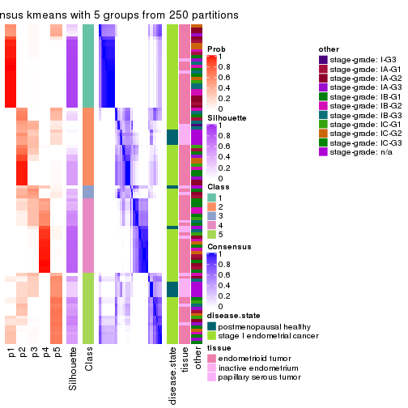</p>

</div>
<div id='tab-ATC-kmeans-consensus-heatmap-5'>
<pre><code class="r">consensus_heatmap(res, k = 6)
</code></pre>

<p>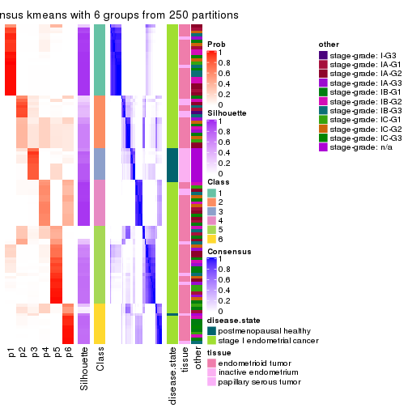</p>

</div>
</div>

Heatmaps for the membership of samples in all partitions to see how consistent they are:


<script>
$( function() {
	$( '#tabs-ATC-kmeans-membership-heatmap' ).tabs();
} );
</script>
<div id='tabs-ATC-kmeans-membership-heatmap'>
<ul>
<li><a href='#tab-ATC-kmeans-membership-heatmap-1'>k = 2</a></li>
<li><a href='#tab-ATC-kmeans-membership-heatmap-2'>k = 3</a></li>
<li><a href='#tab-ATC-kmeans-membership-heatmap-3'>k = 4</a></li>
<li><a href='#tab-ATC-kmeans-membership-heatmap-4'>k = 5</a></li>
<li><a href='#tab-ATC-kmeans-membership-heatmap-5'>k = 6</a></li>
</ul>
<div id='tab-ATC-kmeans-membership-heatmap-1'>
<pre><code class="r">membership_heatmap(res, k = 2)
</code></pre>

<p>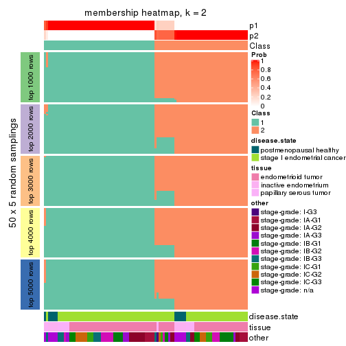</p>

</div>
<div id='tab-ATC-kmeans-membership-heatmap-2'>
<pre><code class="r">membership_heatmap(res, k = 3)
</code></pre>

<p>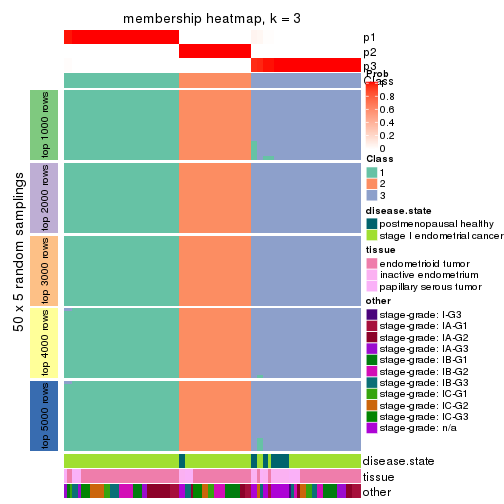</p>

</div>
<div id='tab-ATC-kmeans-membership-heatmap-3'>
<pre><code class="r">membership_heatmap(res, k = 4)
</code></pre>

<p>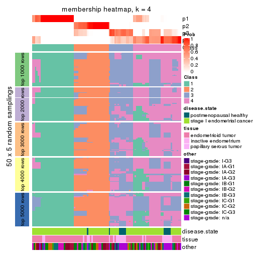</p>

</div>
<div id='tab-ATC-kmeans-membership-heatmap-4'>
<pre><code class="r">membership_heatmap(res, k = 5)
</code></pre>

<p>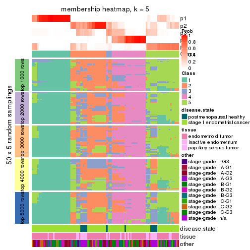</p>

</div>
<div id='tab-ATC-kmeans-membership-heatmap-5'>
<pre><code class="r">membership_heatmap(res, k = 6)
</code></pre>

<p>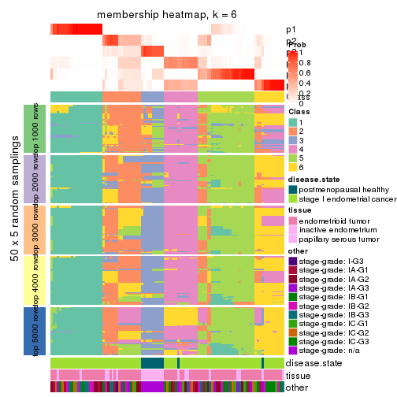</p>

</div>
</div>

As soon as we have had the classes for columns, we can look for signatures
which are significantly different between classes which can be candidate marks
for certain classes. Following are the heatmaps for signatures.


Signature heatmaps where rows are scaled:


<script>
$( function() {
	$( '#tabs-ATC-kmeans-get-signatures' ).tabs();
} );
</script>
<div id='tabs-ATC-kmeans-get-signatures'>
<ul>
<li><a href='#tab-ATC-kmeans-get-signatures-1'>k = 2</a></li>
<li><a href='#tab-ATC-kmeans-get-signatures-2'>k = 3</a></li>
<li><a href='#tab-ATC-kmeans-get-signatures-3'>k = 4</a></li>
<li><a href='#tab-ATC-kmeans-get-signatures-4'>k = 5</a></li>
<li><a href='#tab-ATC-kmeans-get-signatures-5'>k = 6</a></li>
</ul>
<div id='tab-ATC-kmeans-get-signatures-1'>
<pre><code class="r">get_signatures(res, k = 2)
</code></pre>

<p>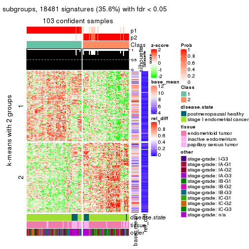</p>

</div>
<div id='tab-ATC-kmeans-get-signatures-2'>
<pre><code class="r">get_signatures(res, k = 3)
</code></pre>

<p>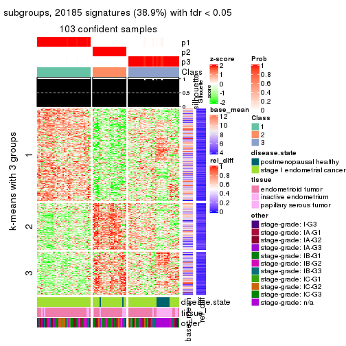</p>

</div>
<div id='tab-ATC-kmeans-get-signatures-3'>
<pre><code class="r">get_signatures(res, k = 4)
</code></pre>

<p>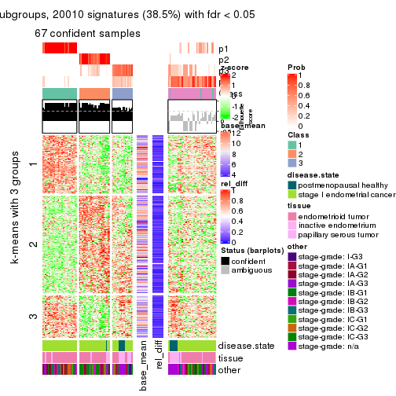</p>

</div>
<div id='tab-ATC-kmeans-get-signatures-4'>
<pre><code class="r">get_signatures(res, k = 5)
</code></pre>

<p>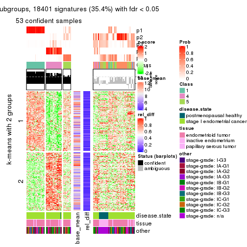</p>

</div>
<div id='tab-ATC-kmeans-get-signatures-5'>
<pre><code class="r">get_signatures(res, k = 6)
</code></pre>

<p>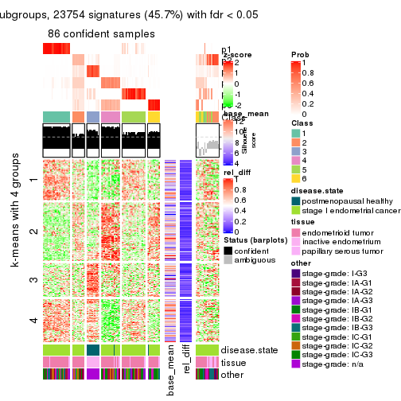</p>

</div>
</div>


Signature heatmaps where rows are not scaled:


<script>
$( function() {
	$( '#tabs-ATC-kmeans-get-signatures-no-scale' ).tabs();
} );
</script>
<div id='tabs-ATC-kmeans-get-signatures-no-scale'>
<ul>
<li><a href='#tab-ATC-kmeans-get-signatures-no-scale-1'>k = 2</a></li>
<li><a href='#tab-ATC-kmeans-get-signatures-no-scale-2'>k = 3</a></li>
<li><a href='#tab-ATC-kmeans-get-signatures-no-scale-3'>k = 4</a></li>
<li><a href='#tab-ATC-kmeans-get-signatures-no-scale-4'>k = 5</a></li>
<li><a href='#tab-ATC-kmeans-get-signatures-no-scale-5'>k = 6</a></li>
</ul>
<div id='tab-ATC-kmeans-get-signatures-no-scale-1'>
<pre><code class="r">get_signatures(res, k = 2, scale_rows = FALSE)
</code></pre>

<p>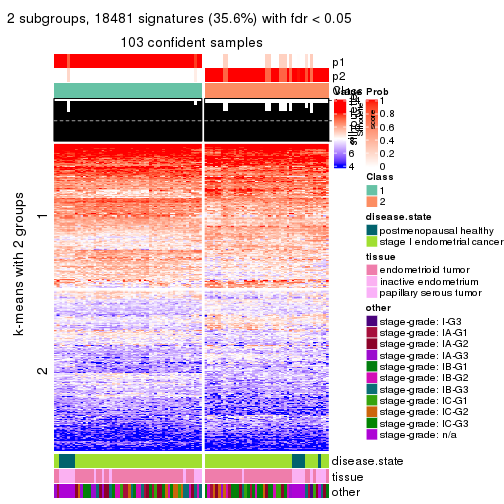</p>

</div>
<div id='tab-ATC-kmeans-get-signatures-no-scale-2'>
<pre><code class="r">get_signatures(res, k = 3, scale_rows = FALSE)
</code></pre>

<p>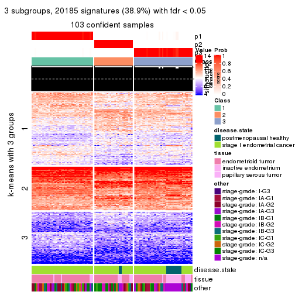</p>

</div>
<div id='tab-ATC-kmeans-get-signatures-no-scale-3'>
<pre><code class="r">get_signatures(res, k = 4, scale_rows = FALSE)
</code></pre>

<p>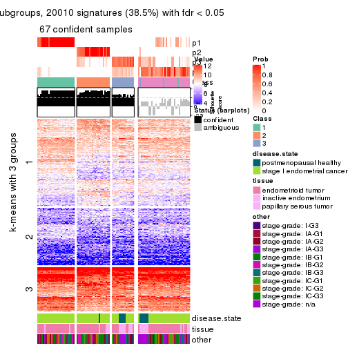</p>

</div>
<div id='tab-ATC-kmeans-get-signatures-no-scale-4'>
<pre><code class="r">get_signatures(res, k = 5, scale_rows = FALSE)
</code></pre>

<p>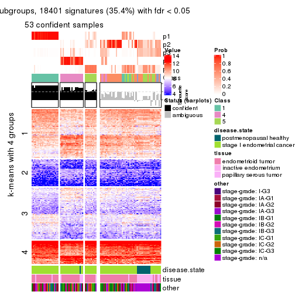</p>

</div>
<div id='tab-ATC-kmeans-get-signatures-no-scale-5'>
<pre><code class="r">get_signatures(res, k = 6, scale_rows = FALSE)
</code></pre>

<p>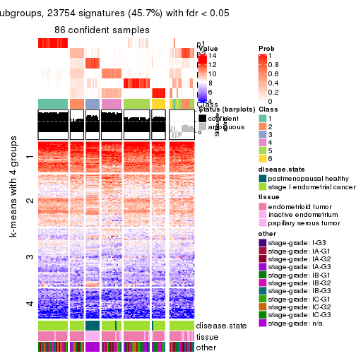</p>

</div>
</div>


Compare the overlap of signatures from different k:

```r
compare_signatures(res)
```

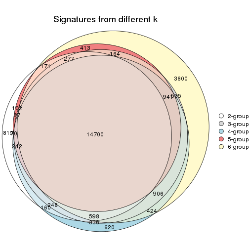

`get_signature()` returns a data frame invisibly. TO get the list of signatures, the function
call should be assigned to a variable explicitly. In following code, if `plot` argument is set
to `FALSE`, no heatmap is plotted while only the differential analysis is performed.

```r
# code only for demonstration
tb = get_signature(res, k = ..., plot = FALSE)
```

An example of the output of `tb` is:

```
#>   which_row         fdr    mean_1    mean_2 scaled_mean_1 scaled_mean_2 km
#> 1        38 0.042760348  8.373488  9.131774    -0.5533452     0.5164555  1
#> 2        40 0.018707592  7.106213  8.469186    -0.6173731     0.5762149  1
#> 3        55 0.019134737 10.221463 11.207825    -0.6159697     0.5749050  1
#> 4        59 0.006059896  5.921854  7.869574    -0.6899429     0.6439467  1
#> 5        60 0.018055526  8.928898 10.211722    -0.6204761     0.5791110  1
#> 6        98 0.009384629 15.714769 14.887706     0.6635654    -0.6193277  2
...
```

The columns in `tb` are:

1. `which_row`: row indices corresponding to the input matrix.
2. `fdr`: FDR for the differential test. 
3. `mean_x`: The mean value in group x.
4. `scaled_mean_x`: The mean value in group x after rows are scaled.
5. `km`: Row groups if k-means clustering is applied to rows.


UMAP plot which shows how samples are separated.


<script>
$( function() {
	$( '#tabs-ATC-kmeans-dimension-reduction' ).tabs();
} );
</script>
<div id='tabs-ATC-kmeans-dimension-reduction'>
<ul>
<li><a href='#tab-ATC-kmeans-dimension-reduction-1'>k = 2</a></li>
<li><a href='#tab-ATC-kmeans-dimension-reduction-2'>k = 3</a></li>
<li><a href='#tab-ATC-kmeans-dimension-reduction-3'>k = 4</a></li>
<li><a href='#tab-ATC-kmeans-dimension-reduction-4'>k = 5</a></li>
<li><a href='#tab-ATC-kmeans-dimension-reduction-5'>k = 6</a></li>
</ul>
<div id='tab-ATC-kmeans-dimension-reduction-1'>
<pre><code class="r">dimension_reduction(res, k = 2, method = &quot;UMAP&quot;)
</code></pre>

<p>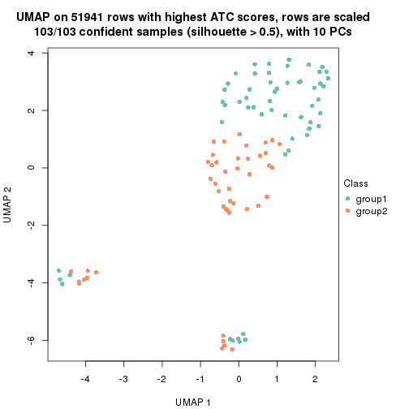</p>

</div>
<div id='tab-ATC-kmeans-dimension-reduction-2'>
<pre><code class="r">dimension_reduction(res, k = 3, method = &quot;UMAP&quot;)
</code></pre>

<p>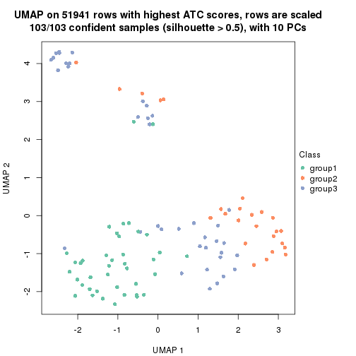</p>

</div>
<div id='tab-ATC-kmeans-dimension-reduction-3'>
<pre><code class="r">dimension_reduction(res, k = 4, method = &quot;UMAP&quot;)
</code></pre>

<p>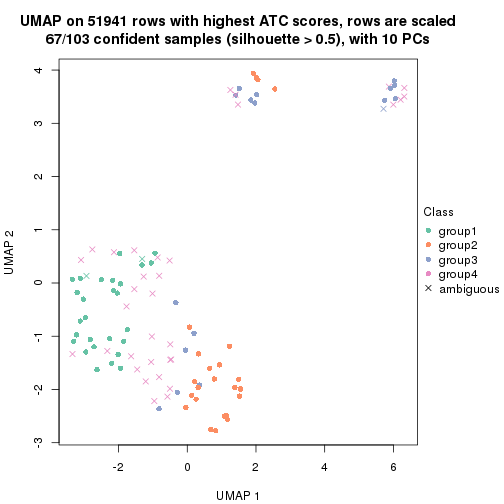</p>

</div>
<div id='tab-ATC-kmeans-dimension-reduction-4'>
<pre><code class="r">dimension_reduction(res, k = 5, method = &quot;UMAP&quot;)
</code></pre>

<p>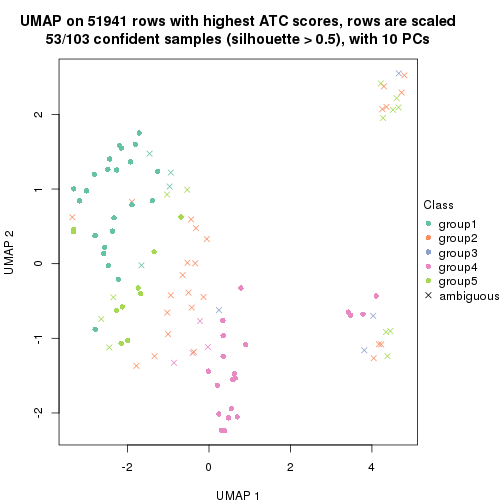</p>

</div>
<div id='tab-ATC-kmeans-dimension-reduction-5'>
<pre><code class="r">dimension_reduction(res, k = 6, method = &quot;UMAP&quot;)
</code></pre>

<p>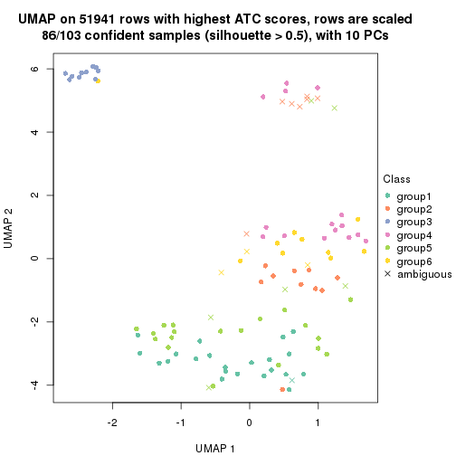</p>

</div>
</div>


Following heatmap shows how subgroups are split when increasing `k`:

```r
collect_classes(res)
```

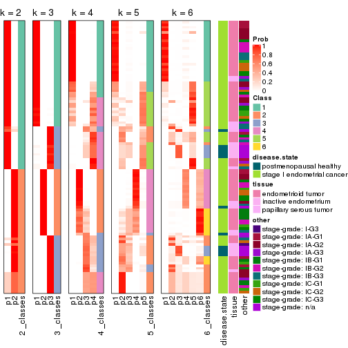


Test correlation between subgroups and known annotations. If the known
annotation is numeric, one-way ANOVA test is applied, and if the known
annotation is discrete, chi-squared contingency table test is applied.

```r
test_to_known_factors(res)
```

```
#>              n disease.state(p) tissue(p) other(p) k
#> ATC:kmeans 103         9.88e-01  9.19e-01 7.95e-01 2
#> ATC:kmeans 103         1.15e-03  6.16e-03 1.82e-01 3
#> ATC:kmeans  67         1.44e-03  3.95e-03 1.02e-01 4
#> ATC:kmeans  53         4.31e-01  6.96e-01 6.20e-01 5
#> ATC:kmeans  86         7.22e-14  1.51e-11 2.30e-06 6
```


If matrix rows can be associated to genes, consider to use `functional_enrichment(res,
...)` to perform function enrichment for the signature genes. See [this vignette](http://bioconductor.org/packages/devel/bioc/vignettes/cola/inst/doc/functional_enrichment.html) for more detailed explanations.


 

---------------------------------------------------


### ATC:skmeans*


The object with results only for a single top-value method and a single partition method 
can be extracted as:

```r
res = res_list["ATC", "skmeans"]
# you can also extract it by
# res = res_list["ATC:skmeans"]
```

A summary of `res` and all the functions that can be applied to it:

```r
res
```

```
#> A 'ConsensusPartition' object with k = 2, 3, 4, 5, 6.
#>   On a matrix with 51941 rows and 103 columns.
#>   Top rows (1000, 2000, 3000, 4000, 5000) are extracted by 'ATC' method.
#>   Subgroups are detected by 'skmeans' method.
#>   Performed in total 1250 partitions by row resampling.
#>   Best k for subgroups seems to be 5.
#> 
#> Following methods can be applied to this 'ConsensusPartition' object:
#>  [1] "cola_report"             "collect_classes"         "collect_plots"          
#>  [4] "collect_stats"           "colnames"                "compare_signatures"     
#>  [7] "consensus_heatmap"       "dimension_reduction"     "functional_enrichment"  
#> [10] "get_anno_col"            "get_anno"                "get_classes"            
#> [13] "get_consensus"           "get_matrix"              "get_membership"         
#> [16] "get_param"               "get_signatures"          "get_stats"              
#> [19] "is_best_k"               "is_stable_k"             "membership_heatmap"     
#> [22] "ncol"                    "nrow"                    "plot_ecdf"              
#> [25] "rownames"                "select_partition_number" "show"                   
#> [28] "suggest_best_k"          "test_to_known_factors"
```

`collect_plots()` function collects all the plots made from `res` for all `k` (number of partitions)
into one single page to provide an easy and fast comparison between different `k`.

```r
collect_plots(res)
```

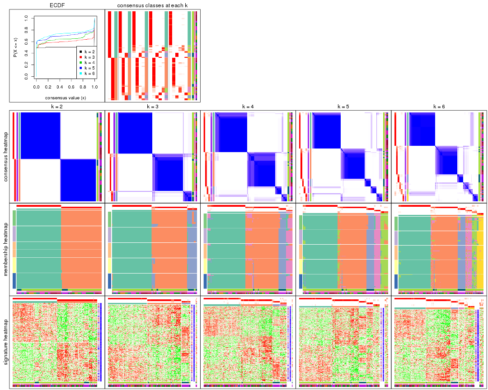

The plots are:

- The first row: a plot of the ECDF (empirical cumulative distribution
  function) curves of the consensus matrix for each `k` and the heatmap of
  predicted classes for each `k`.
- The second row: heatmaps of the consensus matrix for each `k`.
- The third row: heatmaps of the membership matrix for each `k`.
- The fouth row: heatmaps of the signatures for each `k`.

All the plots in panels can be made by individual functions and they are
plotted later in this section.

`select_partition_number()` produces several plots showing different
statistics for choosing "optimized" `k`. There are following statistics:

- ECDF curves of the consensus matrix for each `k`;
- 1-PAC. [The PAC
  score](https://en.wikipedia.org/wiki/Consensus_clustering#Over-interpretation_potential_of_consensus_clustering)
  measures the proportion of the ambiguous subgrouping.
- Mean silhouette score.
- Concordance. The mean probability of fiting the consensus class ids in all
  partitions.
- Area increased. Denote $A_k$ as the area under the ECDF curve for current
  `k`, the area increased is defined as $A_k - A_{k-1}$.
- Rand index. The percent of pairs of samples that are both in a same cluster
  or both are not in a same cluster in the partition of k and k-1.
- Jaccard index. The ratio of pairs of samples are both in a same cluster in
  the partition of k and k-1 and the pairs of samples are both in a same
  cluster in the partition k or k-1.

The detailed explanations of these statistics can be found in [the _cola_
vignette](http://bioconductor.org/packages/devel/bioc/vignettes/cola/inst/doc/cola.html#toc_13).

Generally speaking, lower PAC score, higher mean silhouette score or higher
concordance corresponds to better partition. Rand index and Jaccard index
measure how similar the current partition is compared to partition with `k-1`.
If they are too similar, we won't accept `k` is better than `k-1`.

```r
select_partition_number(res)
```

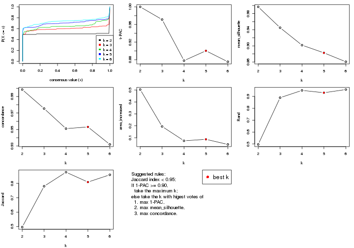

The numeric values for all these statistics can be obtained by `get_stats()`.

```r
get_stats(res)
```

```
#>   k 1-PAC mean_silhouette concordance area_increased  Rand Jaccard
#> 2 2 1.000           0.997       0.998         0.5040 0.496   0.496
#> 3 3 0.971           0.945       0.975         0.1946 0.889   0.780
#> 4 4 0.878           0.902       0.951         0.0747 0.951   0.877
#> 5 5 0.900           0.883       0.953         0.0869 0.931   0.809
#> 6 6 0.875           0.861       0.932         0.0442 0.958   0.859
```

`suggest_best_k()` suggests the best $k$ based on these statistics. The rules are as follows:

- All $k$ with Jaccard index larger than 0.95 are removed because increasing
  $k$ does not provide enough extra information. If all $k$ are removed, it is
  marked as no subgroup is detected.
- For all $k$ with 1-PAC score larger than 0.9, the maximal $k$ is taken as
  the best $k$, and other $k$ are marked as optional $k$.
- If it does not fit the second rule. The $k$ with the maximal vote of the
  highest 1-PAC score, highest mean silhouette, and highest concordance is
  taken as the best $k$.

```r
suggest_best_k(res)
```

```
#> [1] 5
#> attr(,"optional")
#> [1] 2 3
```

There is also optional best $k$ = 2 3 that is worth to check.

Following shows the table of the partitions (You need to click the **show/hide
code output** link to see it). The membership matrix (columns with name `p*`)
is inferred by
[`clue::cl_consensus()`](https://www.rdocumentation.org/link/cl_consensus?package=clue)
function with the `SE` method. Basically the value in the membership matrix
represents the probability to belong to a certain group. The finall class
label for an item is determined with the group with highest probability it
belongs to.

In `get_classes()` function, the entropy is calculated from the membership
matrix and the silhouette score is calculated from the consensus matrix.


<script>
$( function() {
	$( '#tabs-ATC-skmeans-get-classes' ).tabs();
} );
</script>
<div id='tabs-ATC-skmeans-get-classes'>
<ul>
<li><a href='#tab-ATC-skmeans-get-classes-1'>k = 2</a></li>
<li><a href='#tab-ATC-skmeans-get-classes-2'>k = 3</a></li>
<li><a href='#tab-ATC-skmeans-get-classes-3'>k = 4</a></li>
<li><a href='#tab-ATC-skmeans-get-classes-4'>k = 5</a></li>
<li><a href='#tab-ATC-skmeans-get-classes-5'>k = 6</a></li>
</ul>

<div id='tab-ATC-skmeans-get-classes-1'>
<p><a id='tab-ATC-skmeans-get-classes-1-a' style='color:#0366d6' href='#'>show/hide code output</a></p>
<pre><code class="r">cbind(get_classes(res, k = 2), get_membership(res, k = 2))
</code></pre>

<pre><code>#&gt;           class entropy silhouette    p1    p2
#&gt; GSM425907     2  0.0000      0.997 0.000 1.000
#&gt; GSM425908     2  0.0000      0.997 0.000 1.000
#&gt; GSM425909     2  0.0000      0.997 0.000 1.000
#&gt; GSM425910     1  0.0000      1.000 1.000 0.000
#&gt; GSM425911     1  0.0000      1.000 1.000 0.000
#&gt; GSM425912     1  0.0000      1.000 1.000 0.000
#&gt; GSM425913     2  0.0000      0.997 0.000 1.000
#&gt; GSM425914     1  0.0000      1.000 1.000 0.000
#&gt; GSM425915     1  0.0000      1.000 1.000 0.000
#&gt; GSM425874     2  0.0000      0.997 0.000 1.000
#&gt; GSM425875     1  0.0000      1.000 1.000 0.000
#&gt; GSM425876     1  0.0000      1.000 1.000 0.000
#&gt; GSM425877     1  0.0000      1.000 1.000 0.000
#&gt; GSM425878     1  0.0000      1.000 1.000 0.000
#&gt; GSM425879     2  0.0000      0.997 0.000 1.000
#&gt; GSM425880     1  0.0000      1.000 1.000 0.000
#&gt; GSM425881     1  0.0000      1.000 1.000 0.000
#&gt; GSM425882     2  0.0000      0.997 0.000 1.000
#&gt; GSM425883     1  0.0000      1.000 1.000 0.000
#&gt; GSM425884     1  0.0000      1.000 1.000 0.000
#&gt; GSM425885     2  0.0000      0.997 0.000 1.000
#&gt; GSM425848     2  0.0000      0.997 0.000 1.000
#&gt; GSM425849     1  0.0000      1.000 1.000 0.000
#&gt; GSM425850     1  0.0000      1.000 1.000 0.000
#&gt; GSM425851     2  0.0000      0.997 0.000 1.000
#&gt; GSM425852     1  0.0000      1.000 1.000 0.000
#&gt; GSM425893     2  0.0000      0.997 0.000 1.000
#&gt; GSM425894     2  0.0000      0.997 0.000 1.000
#&gt; GSM425895     2  0.0000      0.997 0.000 1.000
#&gt; GSM425896     2  0.0000      0.997 0.000 1.000
#&gt; GSM425897     2  0.0000      0.997 0.000 1.000
#&gt; GSM425898     2  0.0000      0.997 0.000 1.000
#&gt; GSM425899     1  0.0376      0.996 0.996 0.004
#&gt; GSM425900     1  0.0000      1.000 1.000 0.000
#&gt; GSM425901     2  0.0000      0.997 0.000 1.000
#&gt; GSM425902     2  0.0000      0.997 0.000 1.000
#&gt; GSM425903     1  0.0000      1.000 1.000 0.000
#&gt; GSM425904     1  0.0000      1.000 1.000 0.000
#&gt; GSM425905     2  0.0000      0.997 0.000 1.000
#&gt; GSM425906     1  0.0000      1.000 1.000 0.000
#&gt; GSM425863     1  0.0000      1.000 1.000 0.000
#&gt; GSM425864     2  0.0000      0.997 0.000 1.000
#&gt; GSM425865     2  0.0000      0.997 0.000 1.000
#&gt; GSM425866     1  0.0000      1.000 1.000 0.000
#&gt; GSM425867     1  0.0000      1.000 1.000 0.000
#&gt; GSM425868     2  0.0000      0.997 0.000 1.000
#&gt; GSM425869     2  0.0000      0.997 0.000 1.000
#&gt; GSM425870     1  0.0000      1.000 1.000 0.000
#&gt; GSM425871     1  0.0000      1.000 1.000 0.000
#&gt; GSM425872     2  0.0000      0.997 0.000 1.000
#&gt; GSM425873     1  0.0000      1.000 1.000 0.000
#&gt; GSM425843     1  0.0000      1.000 1.000 0.000
#&gt; GSM425844     2  0.0000      0.997 0.000 1.000
#&gt; GSM425845     1  0.0000      1.000 1.000 0.000
#&gt; GSM425846     1  0.0000      1.000 1.000 0.000
#&gt; GSM425847     1  0.0000      1.000 1.000 0.000
#&gt; GSM425886     2  0.0000      0.997 0.000 1.000
#&gt; GSM425887     1  0.0000      1.000 1.000 0.000
#&gt; GSM425888     1  0.0000      1.000 1.000 0.000
#&gt; GSM425889     1  0.0000      1.000 1.000 0.000
#&gt; GSM425890     2  0.0000      0.997 0.000 1.000
#&gt; GSM425891     2  0.0000      0.997 0.000 1.000
#&gt; GSM425892     2  0.0000      0.997 0.000 1.000
#&gt; GSM425853     1  0.0000      1.000 1.000 0.000
#&gt; GSM425854     2  0.0000      0.997 0.000 1.000
#&gt; GSM425855     1  0.0000      1.000 1.000 0.000
#&gt; GSM425856     1  0.0000      1.000 1.000 0.000
#&gt; GSM425857     2  0.0000      0.997 0.000 1.000
#&gt; GSM425858     1  0.0000      1.000 1.000 0.000
#&gt; GSM425859     2  0.0000      0.997 0.000 1.000
#&gt; GSM425860     1  0.0000      1.000 1.000 0.000
#&gt; GSM425861     1  0.0000      1.000 1.000 0.000
#&gt; GSM425862     2  0.0000      0.997 0.000 1.000
#&gt; GSM425837     1  0.0000      1.000 1.000 0.000
#&gt; GSM425838     2  0.0000      0.997 0.000 1.000
#&gt; GSM425839     2  0.0000      0.997 0.000 1.000
#&gt; GSM425840     1  0.0000      1.000 1.000 0.000
#&gt; GSM425841     2  0.0000      0.997 0.000 1.000
#&gt; GSM425842     1  0.0000      1.000 1.000 0.000
#&gt; GSM425917     2  0.0000      0.997 0.000 1.000
#&gt; GSM425922     2  0.0000      0.997 0.000 1.000
#&gt; GSM425919     1  0.0000      1.000 1.000 0.000
#&gt; GSM425920     1  0.0000      1.000 1.000 0.000
#&gt; GSM425923     1  0.0000      1.000 1.000 0.000
#&gt; GSM425916     1  0.0000      1.000 1.000 0.000
#&gt; GSM425918     2  0.6247      0.815 0.156 0.844
#&gt; GSM425921     2  0.0000      0.997 0.000 1.000
#&gt; GSM425925     1  0.0000      1.000 1.000 0.000
#&gt; GSM425926     2  0.0000      0.997 0.000 1.000
#&gt; GSM425927     1  0.0000      1.000 1.000 0.000
#&gt; GSM425924     2  0.0000      0.997 0.000 1.000
#&gt; GSM425928     2  0.0000      0.997 0.000 1.000
#&gt; GSM425929     1  0.0000      1.000 1.000 0.000
#&gt; GSM425930     1  0.0000      1.000 1.000 0.000
#&gt; GSM425931     2  0.0000      0.997 0.000 1.000
#&gt; GSM425932     1  0.0000      1.000 1.000 0.000
#&gt; GSM425933     2  0.0000      0.997 0.000 1.000
#&gt; GSM425934     1  0.0000      1.000 1.000 0.000
#&gt; GSM425935     2  0.0000      0.997 0.000 1.000
#&gt; GSM425936     2  0.0000      0.997 0.000 1.000
#&gt; GSM425937     2  0.0000      0.997 0.000 1.000
#&gt; GSM425938     2  0.0000      0.997 0.000 1.000
#&gt; GSM425939     1  0.0000      1.000 1.000 0.000
</code></pre>

<script>
$('#tab-ATC-skmeans-get-classes-1-a').parent().next().next().hide();
$('#tab-ATC-skmeans-get-classes-1-a').click(function(){
  $('#tab-ATC-skmeans-get-classes-1-a').parent().next().next().toggle();
  return(false);
});
</script>
</div>

<div id='tab-ATC-skmeans-get-classes-2'>
<p><a id='tab-ATC-skmeans-get-classes-2-a' style='color:#0366d6' href='#'>show/hide code output</a></p>
<pre><code class="r">cbind(get_classes(res, k = 3), get_membership(res, k = 3))
</code></pre>

<pre><code>#&gt;           class entropy silhouette    p1    p2    p3
#&gt; GSM425907     2  0.0000      0.965 0.000 1.000 0.000
#&gt; GSM425908     2  0.0000      0.965 0.000 1.000 0.000
#&gt; GSM425909     2  0.0000      0.965 0.000 1.000 0.000
#&gt; GSM425910     1  0.0000      0.996 1.000 0.000 0.000
#&gt; GSM425911     1  0.0000      0.996 1.000 0.000 0.000
#&gt; GSM425912     1  0.0000      0.996 1.000 0.000 0.000
#&gt; GSM425913     2  0.5650      0.561 0.000 0.688 0.312
#&gt; GSM425914     1  0.0000      0.996 1.000 0.000 0.000
#&gt; GSM425915     1  0.0000      0.996 1.000 0.000 0.000
#&gt; GSM425874     2  0.0000      0.965 0.000 1.000 0.000
#&gt; GSM425875     1  0.0000      0.996 1.000 0.000 0.000
#&gt; GSM425876     1  0.0000      0.996 1.000 0.000 0.000
#&gt; GSM425877     1  0.0000      0.996 1.000 0.000 0.000
#&gt; GSM425878     1  0.0000      0.996 1.000 0.000 0.000
#&gt; GSM425879     2  0.0000      0.965 0.000 1.000 0.000
#&gt; GSM425880     1  0.0000      0.996 1.000 0.000 0.000
#&gt; GSM425881     1  0.0000      0.996 1.000 0.000 0.000
#&gt; GSM425882     2  0.0000      0.965 0.000 1.000 0.000
#&gt; GSM425883     1  0.0000      0.996 1.000 0.000 0.000
#&gt; GSM425884     1  0.0000      0.996 1.000 0.000 0.000
#&gt; GSM425885     2  0.0000      0.965 0.000 1.000 0.000
#&gt; GSM425848     2  0.0000      0.965 0.000 1.000 0.000
#&gt; GSM425849     1  0.0000      0.996 1.000 0.000 0.000
#&gt; GSM425850     1  0.0000      0.996 1.000 0.000 0.000
#&gt; GSM425851     2  0.0000      0.965 0.000 1.000 0.000
#&gt; GSM425852     1  0.0237      0.992 0.996 0.000 0.004
#&gt; GSM425893     2  0.1411      0.938 0.000 0.964 0.036
#&gt; GSM425894     2  0.0000      0.965 0.000 1.000 0.000
#&gt; GSM425895     2  0.0000      0.965 0.000 1.000 0.000
#&gt; GSM425896     2  0.0000      0.965 0.000 1.000 0.000
#&gt; GSM425897     2  0.1529      0.934 0.000 0.960 0.040
#&gt; GSM425898     2  0.0000      0.965 0.000 1.000 0.000
#&gt; GSM425899     1  0.3482      0.818 0.872 0.128 0.000
#&gt; GSM425900     1  0.0000      0.996 1.000 0.000 0.000
#&gt; GSM425901     2  0.0000      0.965 0.000 1.000 0.000
#&gt; GSM425902     2  0.0000      0.965 0.000 1.000 0.000
#&gt; GSM425903     1  0.0000      0.996 1.000 0.000 0.000
#&gt; GSM425904     1  0.0000      0.996 1.000 0.000 0.000
#&gt; GSM425905     2  0.0000      0.965 0.000 1.000 0.000
#&gt; GSM425906     1  0.0000      0.996 1.000 0.000 0.000
#&gt; GSM425863     1  0.0000      0.996 1.000 0.000 0.000
#&gt; GSM425864     2  0.0000      0.965 0.000 1.000 0.000
#&gt; GSM425865     2  0.0000      0.965 0.000 1.000 0.000
#&gt; GSM425866     1  0.0000      0.996 1.000 0.000 0.000
#&gt; GSM425867     1  0.0000      0.996 1.000 0.000 0.000
#&gt; GSM425868     2  0.0000      0.965 0.000 1.000 0.000
#&gt; GSM425869     2  0.0000      0.965 0.000 1.000 0.000
#&gt; GSM425870     1  0.0000      0.996 1.000 0.000 0.000
#&gt; GSM425871     1  0.0000      0.996 1.000 0.000 0.000
#&gt; GSM425872     2  0.0000      0.965 0.000 1.000 0.000
#&gt; GSM425873     1  0.0000      0.996 1.000 0.000 0.000
#&gt; GSM425843     1  0.0000      0.996 1.000 0.000 0.000
#&gt; GSM425844     2  0.4750      0.725 0.000 0.784 0.216
#&gt; GSM425845     1  0.0000      0.996 1.000 0.000 0.000
#&gt; GSM425846     1  0.0000      0.996 1.000 0.000 0.000
#&gt; GSM425847     1  0.0000      0.996 1.000 0.000 0.000
#&gt; GSM425886     2  0.0000      0.965 0.000 1.000 0.000
#&gt; GSM425887     1  0.0000      0.996 1.000 0.000 0.000
#&gt; GSM425888     1  0.0000      0.996 1.000 0.000 0.000
#&gt; GSM425889     1  0.0000      0.996 1.000 0.000 0.000
#&gt; GSM425890     2  0.0000      0.965 0.000 1.000 0.000
#&gt; GSM425891     2  0.0000      0.965 0.000 1.000 0.000
#&gt; GSM425892     2  0.0000      0.965 0.000 1.000 0.000
#&gt; GSM425853     1  0.0000      0.996 1.000 0.000 0.000
#&gt; GSM425854     2  0.0000      0.965 0.000 1.000 0.000
#&gt; GSM425855     1  0.0000      0.996 1.000 0.000 0.000
#&gt; GSM425856     1  0.0000      0.996 1.000 0.000 0.000
#&gt; GSM425857     2  0.0000      0.965 0.000 1.000 0.000
#&gt; GSM425858     1  0.0000      0.996 1.000 0.000 0.000
#&gt; GSM425859     2  0.0000      0.965 0.000 1.000 0.000
#&gt; GSM425860     1  0.0000      0.996 1.000 0.000 0.000
#&gt; GSM425861     1  0.0000      0.996 1.000 0.000 0.000
#&gt; GSM425862     2  0.0000      0.965 0.000 1.000 0.000
#&gt; GSM425837     1  0.0000      0.996 1.000 0.000 0.000
#&gt; GSM425838     2  0.0000      0.965 0.000 1.000 0.000
#&gt; GSM425839     2  0.0000      0.965 0.000 1.000 0.000
#&gt; GSM425840     1  0.0000      0.996 1.000 0.000 0.000
#&gt; GSM425841     2  0.0000      0.965 0.000 1.000 0.000
#&gt; GSM425842     1  0.0000      0.996 1.000 0.000 0.000
#&gt; GSM425917     2  0.5650      0.561 0.000 0.688 0.312
#&gt; GSM425922     2  0.0000      0.965 0.000 1.000 0.000
#&gt; GSM425919     1  0.0000      0.996 1.000 0.000 0.000
#&gt; GSM425920     1  0.0000      0.996 1.000 0.000 0.000
#&gt; GSM425923     3  0.6062      0.403 0.384 0.000 0.616
#&gt; GSM425916     1  0.0000      0.996 1.000 0.000 0.000
#&gt; GSM425918     3  0.1643      0.891 0.000 0.044 0.956
#&gt; GSM425921     2  0.0000      0.965 0.000 1.000 0.000
#&gt; GSM425925     1  0.0000      0.996 1.000 0.000 0.000
#&gt; GSM425926     2  0.0000      0.965 0.000 1.000 0.000
#&gt; GSM425927     1  0.0000      0.996 1.000 0.000 0.000
#&gt; GSM425924     3  0.1643      0.891 0.000 0.044 0.956
#&gt; GSM425928     2  0.1411      0.938 0.000 0.964 0.036
#&gt; GSM425929     3  0.1529      0.909 0.040 0.000 0.960
#&gt; GSM425930     3  0.1529      0.909 0.040 0.000 0.960
#&gt; GSM425931     3  0.4002      0.784 0.000 0.160 0.840
#&gt; GSM425932     3  0.1529      0.909 0.040 0.000 0.960
#&gt; GSM425933     3  0.0000      0.900 0.000 0.000 1.000
#&gt; GSM425934     3  0.1529      0.909 0.040 0.000 0.960
#&gt; GSM425935     2  0.0747      0.953 0.000 0.984 0.016
#&gt; GSM425936     3  0.3941      0.789 0.000 0.156 0.844
#&gt; GSM425937     3  0.0000      0.900 0.000 0.000 1.000
#&gt; GSM425938     2  0.6260      0.216 0.000 0.552 0.448
#&gt; GSM425939     3  0.1529      0.909 0.040 0.000 0.960
</code></pre>

<script>
$('#tab-ATC-skmeans-get-classes-2-a').parent().next().next().hide();
$('#tab-ATC-skmeans-get-classes-2-a').click(function(){
  $('#tab-ATC-skmeans-get-classes-2-a').parent().next().next().toggle();
  return(false);
});
</script>
</div>

<div id='tab-ATC-skmeans-get-classes-3'>
<p><a id='tab-ATC-skmeans-get-classes-3-a' style='color:#0366d6' href='#'>show/hide code output</a></p>
<pre><code class="r">cbind(get_classes(res, k = 4), get_membership(res, k = 4))
</code></pre>

<pre><code>#&gt;           class entropy silhouette    p1    p2    p3    p4
#&gt; GSM425907     2  0.0000      0.949 0.000 1.000 0.000 0.000
#&gt; GSM425908     2  0.0000      0.949 0.000 1.000 0.000 0.000
#&gt; GSM425909     2  0.0000      0.949 0.000 1.000 0.000 0.000
#&gt; GSM425910     1  0.0000      0.974 1.000 0.000 0.000 0.000
#&gt; GSM425911     1  0.4050      0.771 0.808 0.000 0.024 0.168
#&gt; GSM425912     1  0.0000      0.974 1.000 0.000 0.000 0.000
#&gt; GSM425913     4  0.3448      0.717 0.000 0.168 0.004 0.828
#&gt; GSM425914     1  0.0000      0.974 1.000 0.000 0.000 0.000
#&gt; GSM425915     1  0.0000      0.974 1.000 0.000 0.000 0.000
#&gt; GSM425874     2  0.0000      0.949 0.000 1.000 0.000 0.000
#&gt; GSM425875     1  0.0000      0.974 1.000 0.000 0.000 0.000
#&gt; GSM425876     1  0.0000      0.974 1.000 0.000 0.000 0.000
#&gt; GSM425877     1  0.0000      0.974 1.000 0.000 0.000 0.000
#&gt; GSM425878     1  0.0000      0.974 1.000 0.000 0.000 0.000
#&gt; GSM425879     2  0.3355      0.828 0.000 0.836 0.004 0.160
#&gt; GSM425880     1  0.0188      0.971 0.996 0.000 0.000 0.004
#&gt; GSM425881     1  0.0000      0.974 1.000 0.000 0.000 0.000
#&gt; GSM425882     2  0.3402      0.824 0.000 0.832 0.004 0.164
#&gt; GSM425883     4  0.4543      0.535 0.324 0.000 0.000 0.676
#&gt; GSM425884     1  0.0000      0.974 1.000 0.000 0.000 0.000
#&gt; GSM425885     2  0.0000      0.949 0.000 1.000 0.000 0.000
#&gt; GSM425848     2  0.3355      0.828 0.000 0.836 0.004 0.160
#&gt; GSM425849     1  0.0000      0.974 1.000 0.000 0.000 0.000
#&gt; GSM425850     1  0.0000      0.974 1.000 0.000 0.000 0.000
#&gt; GSM425851     2  0.2408      0.879 0.000 0.896 0.000 0.104
#&gt; GSM425852     1  0.3577      0.792 0.832 0.000 0.156 0.012
#&gt; GSM425893     2  0.0524      0.944 0.000 0.988 0.004 0.008
#&gt; GSM425894     2  0.0000      0.949 0.000 1.000 0.000 0.000
#&gt; GSM425895     2  0.2401      0.887 0.000 0.904 0.004 0.092
#&gt; GSM425896     2  0.0000      0.949 0.000 1.000 0.000 0.000
#&gt; GSM425897     2  0.4088      0.660 0.000 0.764 0.004 0.232
#&gt; GSM425898     2  0.0000      0.949 0.000 1.000 0.000 0.000
#&gt; GSM425899     1  0.5891      0.631 0.724 0.088 0.016 0.172
#&gt; GSM425900     1  0.0000      0.974 1.000 0.000 0.000 0.000
#&gt; GSM425901     2  0.0000      0.949 0.000 1.000 0.000 0.000
#&gt; GSM425902     2  0.0000      0.949 0.000 1.000 0.000 0.000
#&gt; GSM425903     1  0.0000      0.974 1.000 0.000 0.000 0.000
#&gt; GSM425904     1  0.0000      0.974 1.000 0.000 0.000 0.000
#&gt; GSM425905     2  0.0000      0.949 0.000 1.000 0.000 0.000
#&gt; GSM425906     1  0.0000      0.974 1.000 0.000 0.000 0.000
#&gt; GSM425863     1  0.0000      0.974 1.000 0.000 0.000 0.000
#&gt; GSM425864     2  0.0000      0.949 0.000 1.000 0.000 0.000
#&gt; GSM425865     2  0.0000      0.949 0.000 1.000 0.000 0.000
#&gt; GSM425866     1  0.0000      0.974 1.000 0.000 0.000 0.000
#&gt; GSM425867     1  0.0000      0.974 1.000 0.000 0.000 0.000
#&gt; GSM425868     2  0.0000      0.949 0.000 1.000 0.000 0.000
#&gt; GSM425869     2  0.0000      0.949 0.000 1.000 0.000 0.000
#&gt; GSM425870     1  0.0000      0.974 1.000 0.000 0.000 0.000
#&gt; GSM425871     1  0.3547      0.812 0.840 0.000 0.016 0.144
#&gt; GSM425872     2  0.0000      0.949 0.000 1.000 0.000 0.000
#&gt; GSM425873     1  0.0000      0.974 1.000 0.000 0.000 0.000
#&gt; GSM425843     1  0.0000      0.974 1.000 0.000 0.000 0.000
#&gt; GSM425844     4  0.3448      0.717 0.000 0.168 0.004 0.828
#&gt; GSM425845     1  0.0000      0.974 1.000 0.000 0.000 0.000
#&gt; GSM425846     1  0.3925      0.770 0.808 0.000 0.016 0.176
#&gt; GSM425847     1  0.0000      0.974 1.000 0.000 0.000 0.000
#&gt; GSM425886     2  0.0000      0.949 0.000 1.000 0.000 0.000
#&gt; GSM425887     1  0.0000      0.974 1.000 0.000 0.000 0.000
#&gt; GSM425888     1  0.0000      0.974 1.000 0.000 0.000 0.000
#&gt; GSM425889     1  0.0000      0.974 1.000 0.000 0.000 0.000
#&gt; GSM425890     2  0.0336      0.945 0.000 0.992 0.000 0.008
#&gt; GSM425891     2  0.3355      0.828 0.000 0.836 0.004 0.160
#&gt; GSM425892     2  0.0000      0.949 0.000 1.000 0.000 0.000
#&gt; GSM425853     1  0.0000      0.974 1.000 0.000 0.000 0.000
#&gt; GSM425854     2  0.3355      0.828 0.000 0.836 0.004 0.160
#&gt; GSM425855     1  0.0000      0.974 1.000 0.000 0.000 0.000
#&gt; GSM425856     1  0.0937      0.954 0.976 0.000 0.012 0.012
#&gt; GSM425857     2  0.0000      0.949 0.000 1.000 0.000 0.000
#&gt; GSM425858     1  0.0000      0.974 1.000 0.000 0.000 0.000
#&gt; GSM425859     2  0.0000      0.949 0.000 1.000 0.000 0.000
#&gt; GSM425860     1  0.0000      0.974 1.000 0.000 0.000 0.000
#&gt; GSM425861     1  0.0000      0.974 1.000 0.000 0.000 0.000
#&gt; GSM425862     2  0.2149      0.893 0.000 0.912 0.000 0.088
#&gt; GSM425837     1  0.0000      0.974 1.000 0.000 0.000 0.000
#&gt; GSM425838     2  0.0000      0.949 0.000 1.000 0.000 0.000
#&gt; GSM425839     2  0.0000      0.949 0.000 1.000 0.000 0.000
#&gt; GSM425840     1  0.0000      0.974 1.000 0.000 0.000 0.000
#&gt; GSM425841     2  0.0000      0.949 0.000 1.000 0.000 0.000
#&gt; GSM425842     1  0.0000      0.974 1.000 0.000 0.000 0.000
#&gt; GSM425917     4  0.3494      0.713 0.000 0.172 0.004 0.824
#&gt; GSM425922     2  0.0336      0.945 0.000 0.992 0.000 0.008
#&gt; GSM425919     1  0.0000      0.974 1.000 0.000 0.000 0.000
#&gt; GSM425920     1  0.0000      0.974 1.000 0.000 0.000 0.000
#&gt; GSM425923     4  0.3907      0.656 0.140 0.000 0.032 0.828
#&gt; GSM425916     4  0.4522      0.539 0.320 0.000 0.000 0.680
#&gt; GSM425918     4  0.4168      0.696 0.000 0.080 0.092 0.828
#&gt; GSM425921     2  0.0336      0.945 0.000 0.992 0.000 0.008
#&gt; GSM425925     1  0.1297      0.944 0.964 0.000 0.016 0.020
#&gt; GSM425926     2  0.0000      0.949 0.000 1.000 0.000 0.000
#&gt; GSM425927     1  0.0000      0.974 1.000 0.000 0.000 0.000
#&gt; GSM425924     4  0.4168      0.695 0.000 0.080 0.092 0.828
#&gt; GSM425928     2  0.0524      0.943 0.000 0.988 0.004 0.008
#&gt; GSM425929     3  0.0707      0.908 0.020 0.000 0.980 0.000
#&gt; GSM425930     3  0.0707      0.908 0.020 0.000 0.980 0.000
#&gt; GSM425931     3  0.3528      0.685 0.000 0.192 0.808 0.000
#&gt; GSM425932     3  0.0707      0.908 0.020 0.000 0.980 0.000
#&gt; GSM425933     3  0.0657      0.897 0.000 0.004 0.984 0.012
#&gt; GSM425934     3  0.0707      0.908 0.020 0.000 0.980 0.000
#&gt; GSM425935     2  0.0188      0.947 0.000 0.996 0.004 0.000
#&gt; GSM425936     3  0.3808      0.705 0.000 0.176 0.812 0.012
#&gt; GSM425937     3  0.0657      0.897 0.000 0.004 0.984 0.012
#&gt; GSM425938     2  0.5339      0.301 0.000 0.600 0.384 0.016
#&gt; GSM425939     3  0.0707      0.908 0.020 0.000 0.980 0.000
</code></pre>

<script>
$('#tab-ATC-skmeans-get-classes-3-a').parent().next().next().hide();
$('#tab-ATC-skmeans-get-classes-3-a').click(function(){
  $('#tab-ATC-skmeans-get-classes-3-a').parent().next().next().toggle();
  return(false);
});
</script>
</div>

<div id='tab-ATC-skmeans-get-classes-4'>
<p><a id='tab-ATC-skmeans-get-classes-4-a' style='color:#0366d6' href='#'>show/hide code output</a></p>
<pre><code class="r">cbind(get_classes(res, k = 5), get_membership(res, k = 5))
</code></pre>

<pre><code>#&gt;           class entropy silhouette    p1    p2    p3    p4    p5
#&gt; GSM425907     2  0.0000    0.94702 0.000 1.000 0.000 0.000 0.000
#&gt; GSM425908     2  0.0000    0.94702 0.000 1.000 0.000 0.000 0.000
#&gt; GSM425909     2  0.0000    0.94702 0.000 1.000 0.000 0.000 0.000
#&gt; GSM425910     1  0.0000    0.97742 1.000 0.000 0.000 0.000 0.000
#&gt; GSM425911     5  0.0794    0.66048 0.028 0.000 0.000 0.000 0.972
#&gt; GSM425912     1  0.0000    0.97742 1.000 0.000 0.000 0.000 0.000
#&gt; GSM425913     4  0.0324    0.87961 0.000 0.004 0.000 0.992 0.004
#&gt; GSM425914     1  0.0000    0.97742 1.000 0.000 0.000 0.000 0.000
#&gt; GSM425915     1  0.0000    0.97742 1.000 0.000 0.000 0.000 0.000
#&gt; GSM425874     2  0.0000    0.94702 0.000 1.000 0.000 0.000 0.000
#&gt; GSM425875     1  0.0000    0.97742 1.000 0.000 0.000 0.000 0.000
#&gt; GSM425876     1  0.0000    0.97742 1.000 0.000 0.000 0.000 0.000
#&gt; GSM425877     1  0.0000    0.97742 1.000 0.000 0.000 0.000 0.000
#&gt; GSM425878     1  0.0000    0.97742 1.000 0.000 0.000 0.000 0.000
#&gt; GSM425879     5  0.2690    0.74282 0.000 0.156 0.000 0.000 0.844
#&gt; GSM425880     1  0.1043    0.94076 0.960 0.000 0.000 0.000 0.040
#&gt; GSM425881     1  0.0000    0.97742 1.000 0.000 0.000 0.000 0.000
#&gt; GSM425882     5  0.3210    0.73284 0.000 0.212 0.000 0.000 0.788
#&gt; GSM425883     4  0.3461    0.65142 0.224 0.000 0.000 0.772 0.004
#&gt; GSM425884     1  0.0000    0.97742 1.000 0.000 0.000 0.000 0.000
#&gt; GSM425885     2  0.0000    0.94702 0.000 1.000 0.000 0.000 0.000
#&gt; GSM425848     5  0.3586    0.67364 0.000 0.264 0.000 0.000 0.736
#&gt; GSM425849     1  0.0000    0.97742 1.000 0.000 0.000 0.000 0.000
#&gt; GSM425850     1  0.0000    0.97742 1.000 0.000 0.000 0.000 0.000
#&gt; GSM425851     2  0.3885    0.56798 0.000 0.724 0.000 0.008 0.268
#&gt; GSM425852     1  0.5915    0.38889 0.584 0.000 0.264 0.000 0.152
#&gt; GSM425893     2  0.1357    0.90497 0.000 0.948 0.004 0.000 0.048
#&gt; GSM425894     2  0.0000    0.94702 0.000 1.000 0.000 0.000 0.000
#&gt; GSM425895     2  0.4287    0.00355 0.000 0.540 0.000 0.000 0.460
#&gt; GSM425896     2  0.0000    0.94702 0.000 1.000 0.000 0.000 0.000
#&gt; GSM425897     2  0.2583    0.81227 0.000 0.864 0.000 0.132 0.004
#&gt; GSM425898     2  0.0000    0.94702 0.000 1.000 0.000 0.000 0.000
#&gt; GSM425899     5  0.0162    0.67192 0.004 0.000 0.000 0.000 0.996
#&gt; GSM425900     1  0.0000    0.97742 1.000 0.000 0.000 0.000 0.000
#&gt; GSM425901     2  0.0000    0.94702 0.000 1.000 0.000 0.000 0.000
#&gt; GSM425902     2  0.0000    0.94702 0.000 1.000 0.000 0.000 0.000
#&gt; GSM425903     1  0.0000    0.97742 1.000 0.000 0.000 0.000 0.000
#&gt; GSM425904     1  0.0000    0.97742 1.000 0.000 0.000 0.000 0.000
#&gt; GSM425905     2  0.0000    0.94702 0.000 1.000 0.000 0.000 0.000
#&gt; GSM425906     1  0.0000    0.97742 1.000 0.000 0.000 0.000 0.000
#&gt; GSM425863     1  0.0000    0.97742 1.000 0.000 0.000 0.000 0.000
#&gt; GSM425864     2  0.0000    0.94702 0.000 1.000 0.000 0.000 0.000
#&gt; GSM425865     2  0.0000    0.94702 0.000 1.000 0.000 0.000 0.000
#&gt; GSM425866     1  0.0000    0.97742 1.000 0.000 0.000 0.000 0.000
#&gt; GSM425867     1  0.0000    0.97742 1.000 0.000 0.000 0.000 0.000
#&gt; GSM425868     2  0.0000    0.94702 0.000 1.000 0.000 0.000 0.000
#&gt; GSM425869     2  0.0000    0.94702 0.000 1.000 0.000 0.000 0.000
#&gt; GSM425870     1  0.0000    0.97742 1.000 0.000 0.000 0.000 0.000
#&gt; GSM425871     5  0.4367    0.15612 0.416 0.000 0.000 0.004 0.580
#&gt; GSM425872     2  0.0000    0.94702 0.000 1.000 0.000 0.000 0.000
#&gt; GSM425873     1  0.0000    0.97742 1.000 0.000 0.000 0.000 0.000
#&gt; GSM425843     1  0.0000    0.97742 1.000 0.000 0.000 0.000 0.000
#&gt; GSM425844     4  0.0000    0.88158 0.000 0.000 0.000 1.000 0.000
#&gt; GSM425845     1  0.0000    0.97742 1.000 0.000 0.000 0.000 0.000
#&gt; GSM425846     5  0.0162    0.67192 0.004 0.000 0.000 0.000 0.996
#&gt; GSM425847     1  0.0000    0.97742 1.000 0.000 0.000 0.000 0.000
#&gt; GSM425886     2  0.0000    0.94702 0.000 1.000 0.000 0.000 0.000
#&gt; GSM425887     1  0.0000    0.97742 1.000 0.000 0.000 0.000 0.000
#&gt; GSM425888     1  0.0000    0.97742 1.000 0.000 0.000 0.000 0.000
#&gt; GSM425889     1  0.0000    0.97742 1.000 0.000 0.000 0.000 0.000
#&gt; GSM425890     2  0.0404    0.93917 0.000 0.988 0.000 0.012 0.000
#&gt; GSM425891     5  0.3039    0.74318 0.000 0.192 0.000 0.000 0.808
#&gt; GSM425892     2  0.0000    0.94702 0.000 1.000 0.000 0.000 0.000
#&gt; GSM425853     1  0.0000    0.97742 1.000 0.000 0.000 0.000 0.000
#&gt; GSM425854     5  0.3143    0.73872 0.000 0.204 0.000 0.000 0.796
#&gt; GSM425855     1  0.0000    0.97742 1.000 0.000 0.000 0.000 0.000
#&gt; GSM425856     1  0.2732    0.80860 0.840 0.000 0.000 0.000 0.160
#&gt; GSM425857     2  0.0000    0.94702 0.000 1.000 0.000 0.000 0.000
#&gt; GSM425858     1  0.0000    0.97742 1.000 0.000 0.000 0.000 0.000
#&gt; GSM425859     2  0.0000    0.94702 0.000 1.000 0.000 0.000 0.000
#&gt; GSM425860     1  0.0000    0.97742 1.000 0.000 0.000 0.000 0.000
#&gt; GSM425861     1  0.0000    0.97742 1.000 0.000 0.000 0.000 0.000
#&gt; GSM425862     2  0.3983    0.41497 0.000 0.660 0.000 0.000 0.340
#&gt; GSM425837     1  0.0000    0.97742 1.000 0.000 0.000 0.000 0.000
#&gt; GSM425838     2  0.0000    0.94702 0.000 1.000 0.000 0.000 0.000
#&gt; GSM425839     2  0.0000    0.94702 0.000 1.000 0.000 0.000 0.000
#&gt; GSM425840     1  0.0000    0.97742 1.000 0.000 0.000 0.000 0.000
#&gt; GSM425841     2  0.0000    0.94702 0.000 1.000 0.000 0.000 0.000
#&gt; GSM425842     1  0.0000    0.97742 1.000 0.000 0.000 0.000 0.000
#&gt; GSM425917     4  0.0324    0.87961 0.000 0.004 0.000 0.992 0.004
#&gt; GSM425922     2  0.0404    0.93917 0.000 0.988 0.000 0.012 0.000
#&gt; GSM425919     1  0.0000    0.97742 1.000 0.000 0.000 0.000 0.000
#&gt; GSM425920     1  0.0000    0.97742 1.000 0.000 0.000 0.000 0.000
#&gt; GSM425923     4  0.0162    0.88003 0.000 0.000 0.000 0.996 0.004
#&gt; GSM425916     4  0.3491    0.64561 0.228 0.000 0.000 0.768 0.004
#&gt; GSM425918     4  0.0000    0.88158 0.000 0.000 0.000 1.000 0.000
#&gt; GSM425921     2  0.0404    0.93917 0.000 0.988 0.000 0.012 0.000
#&gt; GSM425925     1  0.3730    0.61481 0.712 0.000 0.000 0.000 0.288
#&gt; GSM425926     2  0.0000    0.94702 0.000 1.000 0.000 0.000 0.000
#&gt; GSM425927     1  0.0000    0.97742 1.000 0.000 0.000 0.000 0.000
#&gt; GSM425924     4  0.0162    0.88113 0.000 0.000 0.000 0.996 0.004
#&gt; GSM425928     2  0.0566    0.93635 0.000 0.984 0.000 0.012 0.004
#&gt; GSM425929     3  0.0162    0.92003 0.004 0.000 0.996 0.000 0.000
#&gt; GSM425930     3  0.0162    0.92003 0.004 0.000 0.996 0.000 0.000
#&gt; GSM425931     3  0.3123    0.71052 0.000 0.184 0.812 0.000 0.004
#&gt; GSM425932     3  0.0000    0.91915 0.000 0.000 1.000 0.000 0.000
#&gt; GSM425933     3  0.0000    0.91915 0.000 0.000 1.000 0.000 0.000
#&gt; GSM425934     3  0.0162    0.92003 0.004 0.000 0.996 0.000 0.000
#&gt; GSM425935     2  0.0162    0.94438 0.000 0.996 0.000 0.000 0.004
#&gt; GSM425936     3  0.3086    0.71732 0.000 0.180 0.816 0.000 0.004
#&gt; GSM425937     3  0.0162    0.91800 0.000 0.000 0.996 0.000 0.004
#&gt; GSM425938     2  0.3706    0.65839 0.000 0.756 0.236 0.004 0.004
#&gt; GSM425939     3  0.0162    0.92003 0.004 0.000 0.996 0.000 0.000
</code></pre>

<script>
$('#tab-ATC-skmeans-get-classes-4-a').parent().next().next().hide();
$('#tab-ATC-skmeans-get-classes-4-a').click(function(){
  $('#tab-ATC-skmeans-get-classes-4-a').parent().next().next().toggle();
  return(false);
});
</script>
</div>

<div id='tab-ATC-skmeans-get-classes-5'>
<p><a id='tab-ATC-skmeans-get-classes-5-a' style='color:#0366d6' href='#'>show/hide code output</a></p>
<pre><code class="r">cbind(get_classes(res, k = 6), get_membership(res, k = 6))
</code></pre>

<pre><code>#&gt;           class entropy silhouette    p1    p2    p3    p4    p5    p6
#&gt; GSM425907     2  0.0000      0.935 0.000 1.000 0.000 0.000 0.000 0.000
#&gt; GSM425908     2  0.0000      0.935 0.000 1.000 0.000 0.000 0.000 0.000
#&gt; GSM425909     2  0.0000      0.935 0.000 1.000 0.000 0.000 0.000 0.000
#&gt; GSM425910     1  0.0000      0.988 1.000 0.000 0.000 0.000 0.000 0.000
#&gt; GSM425911     5  0.2814      0.399 0.008 0.000 0.000 0.172 0.820 0.000
#&gt; GSM425912     1  0.0000      0.988 1.000 0.000 0.000 0.000 0.000 0.000
#&gt; GSM425913     6  0.1421      0.855 0.000 0.000 0.000 0.028 0.028 0.944
#&gt; GSM425914     1  0.0000      0.988 1.000 0.000 0.000 0.000 0.000 0.000
#&gt; GSM425915     1  0.1267      0.923 0.940 0.000 0.000 0.000 0.060 0.000
#&gt; GSM425874     2  0.0000      0.935 0.000 1.000 0.000 0.000 0.000 0.000
#&gt; GSM425875     1  0.0000      0.988 1.000 0.000 0.000 0.000 0.000 0.000
#&gt; GSM425876     1  0.0000      0.988 1.000 0.000 0.000 0.000 0.000 0.000
#&gt; GSM425877     1  0.0146      0.987 0.996 0.000 0.000 0.000 0.004 0.000
#&gt; GSM425878     1  0.0260      0.984 0.992 0.000 0.000 0.000 0.008 0.000
#&gt; GSM425879     4  0.2201      0.728 0.000 0.052 0.000 0.900 0.048 0.000
#&gt; GSM425880     1  0.2378      0.797 0.848 0.000 0.000 0.000 0.152 0.000
#&gt; GSM425881     1  0.0146      0.987 0.996 0.000 0.000 0.000 0.004 0.000
#&gt; GSM425882     4  0.2672      0.712 0.000 0.052 0.000 0.868 0.080 0.000
#&gt; GSM425883     6  0.2762      0.615 0.196 0.000 0.000 0.000 0.000 0.804
#&gt; GSM425884     1  0.0146      0.987 0.996 0.000 0.000 0.000 0.004 0.000
#&gt; GSM425885     2  0.0000      0.935 0.000 1.000 0.000 0.000 0.000 0.000
#&gt; GSM425848     4  0.2003      0.749 0.000 0.116 0.000 0.884 0.000 0.000
#&gt; GSM425849     1  0.0146      0.987 0.996 0.000 0.000 0.000 0.004 0.000
#&gt; GSM425850     1  0.0000      0.988 1.000 0.000 0.000 0.000 0.000 0.000
#&gt; GSM425851     2  0.5794     -0.259 0.000 0.460 0.000 0.392 0.140 0.008
#&gt; GSM425852     5  0.5084      0.542 0.264 0.000 0.124 0.000 0.612 0.000
#&gt; GSM425893     2  0.4530      0.579 0.000 0.692 0.000 0.208 0.100 0.000
#&gt; GSM425894     2  0.0000      0.935 0.000 1.000 0.000 0.000 0.000 0.000
#&gt; GSM425895     4  0.3330      0.606 0.000 0.284 0.000 0.716 0.000 0.000
#&gt; GSM425896     2  0.0000      0.935 0.000 1.000 0.000 0.000 0.000 0.000
#&gt; GSM425897     2  0.2969      0.818 0.000 0.860 0.000 0.032 0.020 0.088
#&gt; GSM425898     2  0.0260      0.930 0.000 0.992 0.000 0.008 0.000 0.000
#&gt; GSM425899     4  0.3464      0.362 0.000 0.000 0.000 0.688 0.312 0.000
#&gt; GSM425900     1  0.0000      0.988 1.000 0.000 0.000 0.000 0.000 0.000
#&gt; GSM425901     2  0.0000      0.935 0.000 1.000 0.000 0.000 0.000 0.000
#&gt; GSM425902     2  0.0000      0.935 0.000 1.000 0.000 0.000 0.000 0.000
#&gt; GSM425903     1  0.0000      0.988 1.000 0.000 0.000 0.000 0.000 0.000
#&gt; GSM425904     1  0.1663      0.887 0.912 0.000 0.000 0.000 0.088 0.000
#&gt; GSM425905     2  0.0000      0.935 0.000 1.000 0.000 0.000 0.000 0.000
#&gt; GSM425906     1  0.0000      0.988 1.000 0.000 0.000 0.000 0.000 0.000
#&gt; GSM425863     1  0.0000      0.988 1.000 0.000 0.000 0.000 0.000 0.000
#&gt; GSM425864     2  0.0000      0.935 0.000 1.000 0.000 0.000 0.000 0.000
#&gt; GSM425865     2  0.0000      0.935 0.000 1.000 0.000 0.000 0.000 0.000
#&gt; GSM425866     1  0.0000      0.988 1.000 0.000 0.000 0.000 0.000 0.000
#&gt; GSM425867     1  0.0000      0.988 1.000 0.000 0.000 0.000 0.000 0.000
#&gt; GSM425868     2  0.0458      0.926 0.000 0.984 0.000 0.016 0.000 0.000
#&gt; GSM425869     2  0.0000      0.935 0.000 1.000 0.000 0.000 0.000 0.000
#&gt; GSM425870     1  0.0000      0.988 1.000 0.000 0.000 0.000 0.000 0.000
#&gt; GSM425871     5  0.4877      0.544 0.124 0.000 0.000 0.188 0.680 0.008
#&gt; GSM425872     2  0.3602      0.739 0.000 0.792 0.000 0.136 0.072 0.000
#&gt; GSM425873     1  0.0000      0.988 1.000 0.000 0.000 0.000 0.000 0.000
#&gt; GSM425843     1  0.0146      0.987 0.996 0.000 0.000 0.000 0.004 0.000
#&gt; GSM425844     6  0.0000      0.865 0.000 0.000 0.000 0.000 0.000 1.000
#&gt; GSM425845     1  0.0146      0.987 0.996 0.000 0.000 0.000 0.004 0.000
#&gt; GSM425846     5  0.3659      0.238 0.000 0.000 0.000 0.364 0.636 0.000
#&gt; GSM425847     1  0.0000      0.988 1.000 0.000 0.000 0.000 0.000 0.000
#&gt; GSM425886     2  0.0000      0.935 0.000 1.000 0.000 0.000 0.000 0.000
#&gt; GSM425887     1  0.0146      0.987 0.996 0.000 0.000 0.000 0.004 0.000
#&gt; GSM425888     1  0.0000      0.988 1.000 0.000 0.000 0.000 0.000 0.000
#&gt; GSM425889     1  0.0000      0.988 1.000 0.000 0.000 0.000 0.000 0.000
#&gt; GSM425890     2  0.0717      0.921 0.000 0.976 0.000 0.016 0.008 0.000
#&gt; GSM425891     4  0.3321      0.726 0.000 0.080 0.000 0.820 0.100 0.000
#&gt; GSM425892     2  0.0000      0.935 0.000 1.000 0.000 0.000 0.000 0.000
#&gt; GSM425853     1  0.0458      0.976 0.984 0.000 0.000 0.000 0.016 0.000
#&gt; GSM425854     4  0.2039      0.751 0.000 0.076 0.000 0.904 0.020 0.000
#&gt; GSM425855     1  0.0000      0.988 1.000 0.000 0.000 0.000 0.000 0.000
#&gt; GSM425856     5  0.3531      0.556 0.328 0.000 0.000 0.000 0.672 0.000
#&gt; GSM425857     2  0.0000      0.935 0.000 1.000 0.000 0.000 0.000 0.000
#&gt; GSM425858     1  0.0146      0.987 0.996 0.000 0.000 0.000 0.004 0.000
#&gt; GSM425859     2  0.0000      0.935 0.000 1.000 0.000 0.000 0.000 0.000
#&gt; GSM425860     1  0.0000      0.988 1.000 0.000 0.000 0.000 0.000 0.000
#&gt; GSM425861     1  0.0146      0.987 0.996 0.000 0.000 0.000 0.004 0.000
#&gt; GSM425862     4  0.5104      0.538 0.000 0.304 0.000 0.588 0.108 0.000
#&gt; GSM425837     1  0.0146      0.987 0.996 0.000 0.000 0.000 0.004 0.000
#&gt; GSM425838     2  0.0000      0.935 0.000 1.000 0.000 0.000 0.000 0.000
#&gt; GSM425839     2  0.0000      0.935 0.000 1.000 0.000 0.000 0.000 0.000
#&gt; GSM425840     1  0.0146      0.987 0.996 0.000 0.000 0.000 0.004 0.000
#&gt; GSM425841     2  0.0000      0.935 0.000 1.000 0.000 0.000 0.000 0.000
#&gt; GSM425842     1  0.0000      0.988 1.000 0.000 0.000 0.000 0.000 0.000
#&gt; GSM425917     6  0.1421      0.855 0.000 0.000 0.000 0.028 0.028 0.944
#&gt; GSM425922     2  0.0717      0.921 0.000 0.976 0.000 0.016 0.008 0.000
#&gt; GSM425919     1  0.0000      0.988 1.000 0.000 0.000 0.000 0.000 0.000
#&gt; GSM425920     1  0.0000      0.988 1.000 0.000 0.000 0.000 0.000 0.000
#&gt; GSM425923     6  0.0000      0.865 0.000 0.000 0.000 0.000 0.000 1.000
#&gt; GSM425916     6  0.2854      0.590 0.208 0.000 0.000 0.000 0.000 0.792
#&gt; GSM425918     6  0.0000      0.865 0.000 0.000 0.000 0.000 0.000 1.000
#&gt; GSM425921     2  0.0717      0.921 0.000 0.976 0.000 0.016 0.008 0.000
#&gt; GSM425925     5  0.4473      0.601 0.252 0.000 0.000 0.072 0.676 0.000
#&gt; GSM425926     2  0.0000      0.935 0.000 1.000 0.000 0.000 0.000 0.000
#&gt; GSM425927     1  0.0146      0.987 0.996 0.000 0.000 0.000 0.004 0.000
#&gt; GSM425924     6  0.0909      0.862 0.000 0.000 0.000 0.012 0.020 0.968
#&gt; GSM425928     2  0.1498      0.896 0.000 0.940 0.000 0.032 0.028 0.000
#&gt; GSM425929     3  0.0000      0.912 0.000 0.000 1.000 0.000 0.000 0.000
#&gt; GSM425930     3  0.0000      0.912 0.000 0.000 1.000 0.000 0.000 0.000
#&gt; GSM425931     3  0.4503      0.744 0.000 0.116 0.756 0.044 0.084 0.000
#&gt; GSM425932     3  0.0000      0.912 0.000 0.000 1.000 0.000 0.000 0.000
#&gt; GSM425933     3  0.0146      0.911 0.000 0.000 0.996 0.000 0.004 0.000
#&gt; GSM425934     3  0.0000      0.912 0.000 0.000 1.000 0.000 0.000 0.000
#&gt; GSM425935     2  0.2846      0.816 0.000 0.856 0.000 0.060 0.084 0.000
#&gt; GSM425936     3  0.4470      0.755 0.000 0.104 0.760 0.044 0.092 0.000
#&gt; GSM425937     3  0.2595      0.851 0.000 0.000 0.872 0.044 0.084 0.000
#&gt; GSM425938     2  0.5887      0.401 0.000 0.588 0.256 0.060 0.096 0.000
#&gt; GSM425939     3  0.0000      0.912 0.000 0.000 1.000 0.000 0.000 0.000
</code></pre>

<script>
$('#tab-ATC-skmeans-get-classes-5-a').parent().next().next().hide();
$('#tab-ATC-skmeans-get-classes-5-a').click(function(){
  $('#tab-ATC-skmeans-get-classes-5-a').parent().next().next().toggle();
  return(false);
});
</script>
</div>
</div>

Heatmaps for the consensus matrix. It visualizes the probability of two
samples to be in a same group.


<script>
$( function() {
	$( '#tabs-ATC-skmeans-consensus-heatmap' ).tabs();
} );
</script>
<div id='tabs-ATC-skmeans-consensus-heatmap'>
<ul>
<li><a href='#tab-ATC-skmeans-consensus-heatmap-1'>k = 2</a></li>
<li><a href='#tab-ATC-skmeans-consensus-heatmap-2'>k = 3</a></li>
<li><a href='#tab-ATC-skmeans-consensus-heatmap-3'>k = 4</a></li>
<li><a href='#tab-ATC-skmeans-consensus-heatmap-4'>k = 5</a></li>
<li><a href='#tab-ATC-skmeans-consensus-heatmap-5'>k = 6</a></li>
</ul>
<div id='tab-ATC-skmeans-consensus-heatmap-1'>
<pre><code class="r">consensus_heatmap(res, k = 2)
</code></pre>

<p>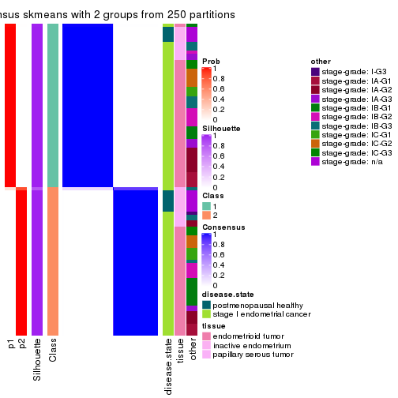</p>

</div>
<div id='tab-ATC-skmeans-consensus-heatmap-2'>
<pre><code class="r">consensus_heatmap(res, k = 3)
</code></pre>

<p>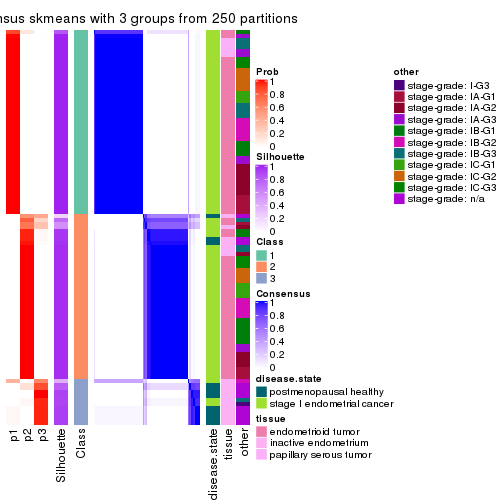</p>

</div>
<div id='tab-ATC-skmeans-consensus-heatmap-3'>
<pre><code class="r">consensus_heatmap(res, k = 4)
</code></pre>

<p>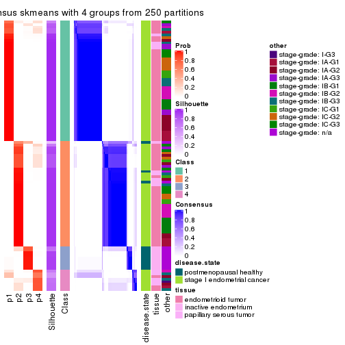</p>

</div>
<div id='tab-ATC-skmeans-consensus-heatmap-4'>
<pre><code class="r">consensus_heatmap(res, k = 5)
</code></pre>

<p>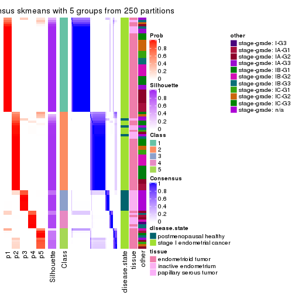</p>

</div>
<div id='tab-ATC-skmeans-consensus-heatmap-5'>
<pre><code class="r">consensus_heatmap(res, k = 6)
</code></pre>

<p>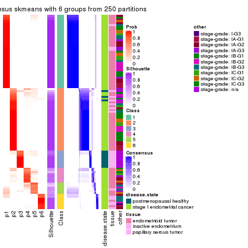</p>

</div>
</div>

Heatmaps for the membership of samples in all partitions to see how consistent they are:


<script>
$( function() {
	$( '#tabs-ATC-skmeans-membership-heatmap' ).tabs();
} );
</script>
<div id='tabs-ATC-skmeans-membership-heatmap'>
<ul>
<li><a href='#tab-ATC-skmeans-membership-heatmap-1'>k = 2</a></li>
<li><a href='#tab-ATC-skmeans-membership-heatmap-2'>k = 3</a></li>
<li><a href='#tab-ATC-skmeans-membership-heatmap-3'>k = 4</a></li>
<li><a href='#tab-ATC-skmeans-membership-heatmap-4'>k = 5</a></li>
<li><a href='#tab-ATC-skmeans-membership-heatmap-5'>k = 6</a></li>
</ul>
<div id='tab-ATC-skmeans-membership-heatmap-1'>
<pre><code class="r">membership_heatmap(res, k = 2)
</code></pre>

<p>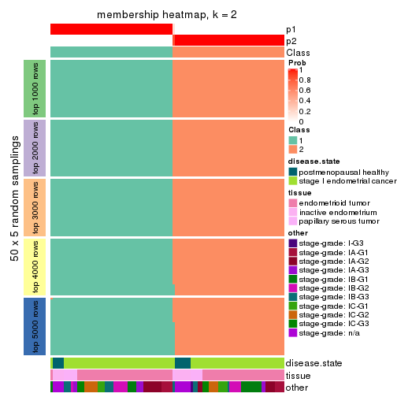</p>

</div>
<div id='tab-ATC-skmeans-membership-heatmap-2'>
<pre><code class="r">membership_heatmap(res, k = 3)
</code></pre>

<p>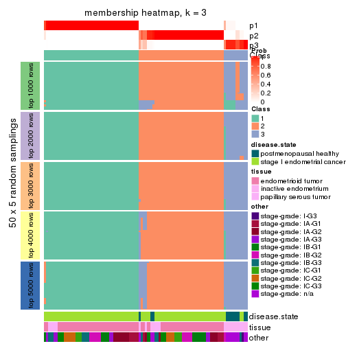</p>

</div>
<div id='tab-ATC-skmeans-membership-heatmap-3'>
<pre><code class="r">membership_heatmap(res, k = 4)
</code></pre>

<p>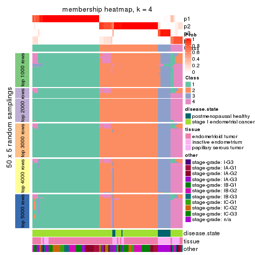</p>

</div>
<div id='tab-ATC-skmeans-membership-heatmap-4'>
<pre><code class="r">membership_heatmap(res, k = 5)
</code></pre>

<p>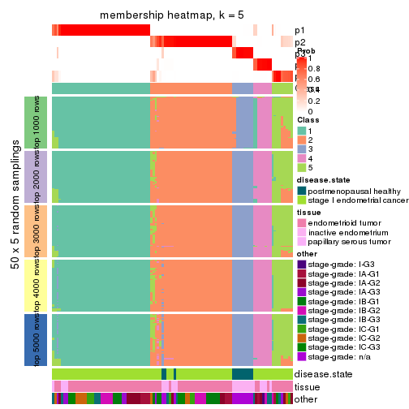</p>

</div>
<div id='tab-ATC-skmeans-membership-heatmap-5'>
<pre><code class="r">membership_heatmap(res, k = 6)
</code></pre>

<p>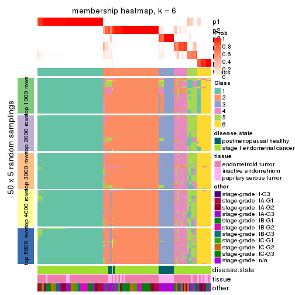</p>

</div>
</div>

As soon as we have had the classes for columns, we can look for signatures
which are significantly different between classes which can be candidate marks
for certain classes. Following are the heatmaps for signatures.


Signature heatmaps where rows are scaled:


<script>
$( function() {
	$( '#tabs-ATC-skmeans-get-signatures' ).tabs();
} );
</script>
<div id='tabs-ATC-skmeans-get-signatures'>
<ul>
<li><a href='#tab-ATC-skmeans-get-signatures-1'>k = 2</a></li>
<li><a href='#tab-ATC-skmeans-get-signatures-2'>k = 3</a></li>
<li><a href='#tab-ATC-skmeans-get-signatures-3'>k = 4</a></li>
<li><a href='#tab-ATC-skmeans-get-signatures-4'>k = 5</a></li>
<li><a href='#tab-ATC-skmeans-get-signatures-5'>k = 6</a></li>
</ul>
<div id='tab-ATC-skmeans-get-signatures-1'>
<pre><code class="r">get_signatures(res, k = 2)
</code></pre>

<p>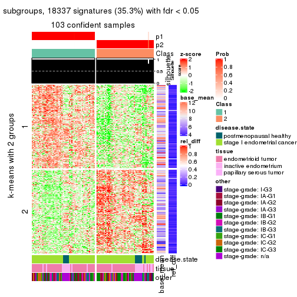</p>

</div>
<div id='tab-ATC-skmeans-get-signatures-2'>
<pre><code class="r">get_signatures(res, k = 3)
</code></pre>

<p>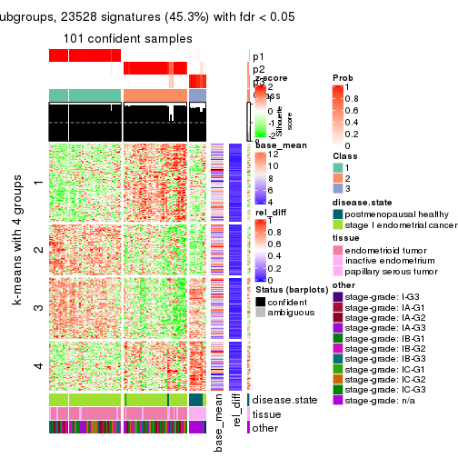</p>

</div>
<div id='tab-ATC-skmeans-get-signatures-3'>
<pre><code class="r">get_signatures(res, k = 4)
</code></pre>

<p>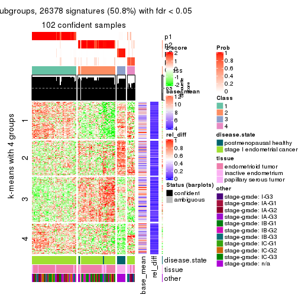</p>

</div>
<div id='tab-ATC-skmeans-get-signatures-4'>
<pre><code class="r">get_signatures(res, k = 5)
</code></pre>

<p>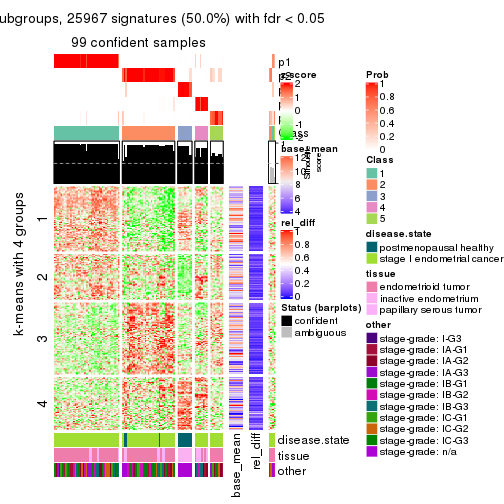</p>

</div>
<div id='tab-ATC-skmeans-get-signatures-5'>
<pre><code class="r">get_signatures(res, k = 6)
</code></pre>

<p>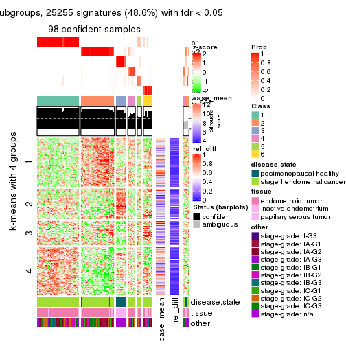</p>

</div>
</div>


Signature heatmaps where rows are not scaled:


<script>
$( function() {
	$( '#tabs-ATC-skmeans-get-signatures-no-scale' ).tabs();
} );
</script>
<div id='tabs-ATC-skmeans-get-signatures-no-scale'>
<ul>
<li><a href='#tab-ATC-skmeans-get-signatures-no-scale-1'>k = 2</a></li>
<li><a href='#tab-ATC-skmeans-get-signatures-no-scale-2'>k = 3</a></li>
<li><a href='#tab-ATC-skmeans-get-signatures-no-scale-3'>k = 4</a></li>
<li><a href='#tab-ATC-skmeans-get-signatures-no-scale-4'>k = 5</a></li>
<li><a href='#tab-ATC-skmeans-get-signatures-no-scale-5'>k = 6</a></li>
</ul>
<div id='tab-ATC-skmeans-get-signatures-no-scale-1'>
<pre><code class="r">get_signatures(res, k = 2, scale_rows = FALSE)
</code></pre>

<p>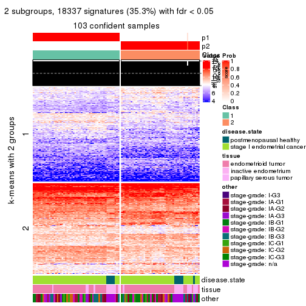</p>

</div>
<div id='tab-ATC-skmeans-get-signatures-no-scale-2'>
<pre><code class="r">get_signatures(res, k = 3, scale_rows = FALSE)
</code></pre>

<p>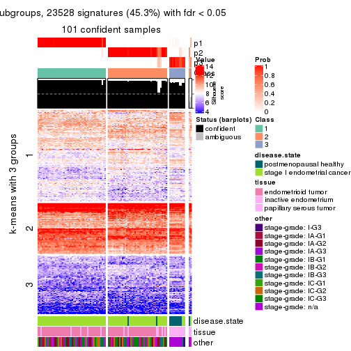</p>

</div>
<div id='tab-ATC-skmeans-get-signatures-no-scale-3'>
<pre><code class="r">get_signatures(res, k = 4, scale_rows = FALSE)
</code></pre>

<p>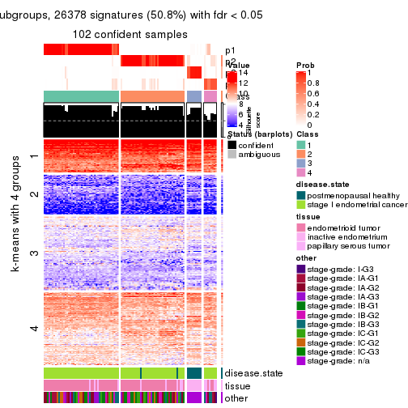</p>

</div>
<div id='tab-ATC-skmeans-get-signatures-no-scale-4'>
<pre><code class="r">get_signatures(res, k = 5, scale_rows = FALSE)
</code></pre>

<p>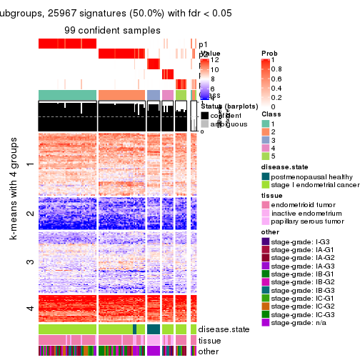</p>

</div>
<div id='tab-ATC-skmeans-get-signatures-no-scale-5'>
<pre><code class="r">get_signatures(res, k = 6, scale_rows = FALSE)
</code></pre>

<p>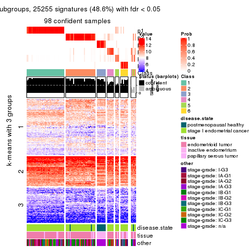</p>

</div>
</div>


Compare the overlap of signatures from different k:

```r
compare_signatures(res)
```

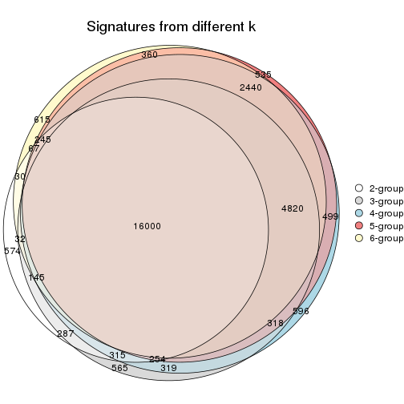

`get_signature()` returns a data frame invisibly. TO get the list of signatures, the function
call should be assigned to a variable explicitly. In following code, if `plot` argument is set
to `FALSE`, no heatmap is plotted while only the differential analysis is performed.

```r
# code only for demonstration
tb = get_signature(res, k = ..., plot = FALSE)
```

An example of the output of `tb` is:

```
#>   which_row         fdr    mean_1    mean_2 scaled_mean_1 scaled_mean_2 km
#> 1        38 0.042760348  8.373488  9.131774    -0.5533452     0.5164555  1
#> 2        40 0.018707592  7.106213  8.469186    -0.6173731     0.5762149  1
#> 3        55 0.019134737 10.221463 11.207825    -0.6159697     0.5749050  1
#> 4        59 0.006059896  5.921854  7.869574    -0.6899429     0.6439467  1
#> 5        60 0.018055526  8.928898 10.211722    -0.6204761     0.5791110  1
#> 6        98 0.009384629 15.714769 14.887706     0.6635654    -0.6193277  2
...
```

The columns in `tb` are:

1. `which_row`: row indices corresponding to the input matrix.
2. `fdr`: FDR for the differential test. 
3. `mean_x`: The mean value in group x.
4. `scaled_mean_x`: The mean value in group x after rows are scaled.
5. `km`: Row groups if k-means clustering is applied to rows.


UMAP plot which shows how samples are separated.


<script>
$( function() {
	$( '#tabs-ATC-skmeans-dimension-reduction' ).tabs();
} );
</script>
<div id='tabs-ATC-skmeans-dimension-reduction'>
<ul>
<li><a href='#tab-ATC-skmeans-dimension-reduction-1'>k = 2</a></li>
<li><a href='#tab-ATC-skmeans-dimension-reduction-2'>k = 3</a></li>
<li><a href='#tab-ATC-skmeans-dimension-reduction-3'>k = 4</a></li>
<li><a href='#tab-ATC-skmeans-dimension-reduction-4'>k = 5</a></li>
<li><a href='#tab-ATC-skmeans-dimension-reduction-5'>k = 6</a></li>
</ul>
<div id='tab-ATC-skmeans-dimension-reduction-1'>
<pre><code class="r">dimension_reduction(res, k = 2, method = &quot;UMAP&quot;)
</code></pre>

<p>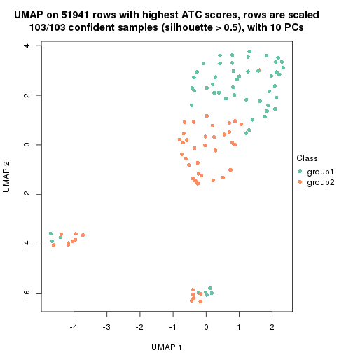</p>

</div>
<div id='tab-ATC-skmeans-dimension-reduction-2'>
<pre><code class="r">dimension_reduction(res, k = 3, method = &quot;UMAP&quot;)
</code></pre>

<p>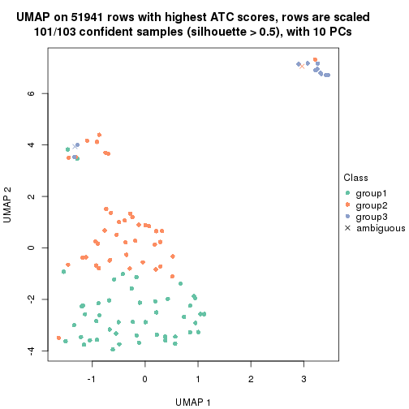</p>

</div>
<div id='tab-ATC-skmeans-dimension-reduction-3'>
<pre><code class="r">dimension_reduction(res, k = 4, method = &quot;UMAP&quot;)
</code></pre>

<p>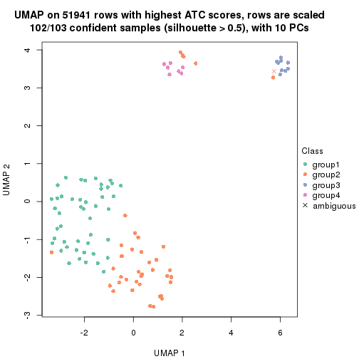</p>

</div>
<div id='tab-ATC-skmeans-dimension-reduction-4'>
<pre><code class="r">dimension_reduction(res, k = 5, method = &quot;UMAP&quot;)
</code></pre>

<p>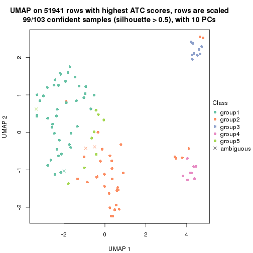</p>

</div>
<div id='tab-ATC-skmeans-dimension-reduction-5'>
<pre><code class="r">dimension_reduction(res, k = 6, method = &quot;UMAP&quot;)
</code></pre>

<p>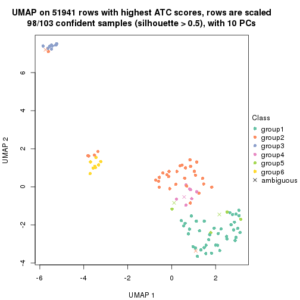</p>

</div>
</div>


Following heatmap shows how subgroups are split when increasing `k`:

```r
collect_classes(res)
```

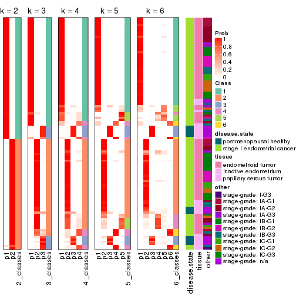


Test correlation between subgroups and known annotations. If the known
annotation is numeric, one-way ANOVA test is applied, and if the known
annotation is discrete, chi-squared contingency table test is applied.

```r
test_to_known_factors(res)
```

```
#>               n disease.state(p) tissue(p) other(p) k
#> ATC:skmeans 103         6.27e-01  7.00e-01 8.46e-01 2
#> ATC:skmeans 101         9.80e-15  6.60e-14 3.83e-09 3
#> ATC:skmeans 102         9.96e-18  5.60e-20 4.64e-11 4
#> ATC:skmeans  99         4.35e-15  7.05e-17 8.12e-08 5
#> ATC:skmeans  98         1.22e-15  4.09e-17 3.28e-08 6
```


If matrix rows can be associated to genes, consider to use `functional_enrichment(res,
...)` to perform function enrichment for the signature genes. See [this vignette](http://bioconductor.org/packages/devel/bioc/vignettes/cola/inst/doc/functional_enrichment.html) for more detailed explanations.


 

---------------------------------------------------


### ATC:pam**


The object with results only for a single top-value method and a single partition method 
can be extracted as:

```r
res = res_list["ATC", "pam"]
# you can also extract it by
# res = res_list["ATC:pam"]
```

A summary of `res` and all the functions that can be applied to it:

```r
res
```

```
#> A 'ConsensusPartition' object with k = 2, 3, 4, 5, 6.
#>   On a matrix with 51941 rows and 103 columns.
#>   Top rows (1000, 2000, 3000, 4000, 5000) are extracted by 'ATC' method.
#>   Subgroups are detected by 'pam' method.
#>   Performed in total 1250 partitions by row resampling.
#>   Best k for subgroups seems to be 3.
#> 
#> Following methods can be applied to this 'ConsensusPartition' object:
#>  [1] "cola_report"             "collect_classes"         "collect_plots"          
#>  [4] "collect_stats"           "colnames"                "compare_signatures"     
#>  [7] "consensus_heatmap"       "dimension_reduction"     "functional_enrichment"  
#> [10] "get_anno_col"            "get_anno"                "get_classes"            
#> [13] "get_consensus"           "get_matrix"              "get_membership"         
#> [16] "get_param"               "get_signatures"          "get_stats"              
#> [19] "is_best_k"               "is_stable_k"             "membership_heatmap"     
#> [22] "ncol"                    "nrow"                    "plot_ecdf"              
#> [25] "rownames"                "select_partition_number" "show"                   
#> [28] "suggest_best_k"          "test_to_known_factors"
```

`collect_plots()` function collects all the plots made from `res` for all `k` (number of partitions)
into one single page to provide an easy and fast comparison between different `k`.

```r
collect_plots(res)
```

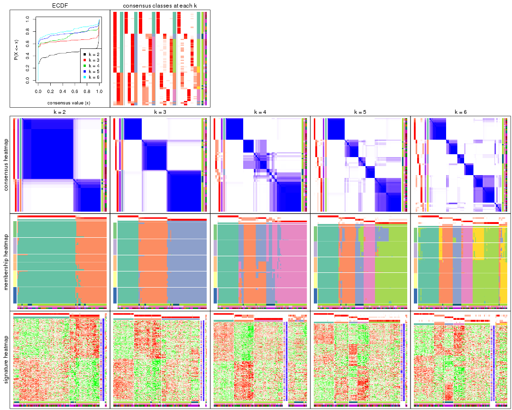

The plots are:

- The first row: a plot of the ECDF (empirical cumulative distribution
  function) curves of the consensus matrix for each `k` and the heatmap of
  predicted classes for each `k`.
- The second row: heatmaps of the consensus matrix for each `k`.
- The third row: heatmaps of the membership matrix for each `k`.
- The fouth row: heatmaps of the signatures for each `k`.

All the plots in panels can be made by individual functions and they are
plotted later in this section.

`select_partition_number()` produces several plots showing different
statistics for choosing "optimized" `k`. There are following statistics:

- ECDF curves of the consensus matrix for each `k`;
- 1-PAC. [The PAC
  score](https://en.wikipedia.org/wiki/Consensus_clustering#Over-interpretation_potential_of_consensus_clustering)
  measures the proportion of the ambiguous subgrouping.
- Mean silhouette score.
- Concordance. The mean probability of fiting the consensus class ids in all
  partitions.
- Area increased. Denote $A_k$ as the area under the ECDF curve for current
  `k`, the area increased is defined as $A_k - A_{k-1}$.
- Rand index. The percent of pairs of samples that are both in a same cluster
  or both are not in a same cluster in the partition of k and k-1.
- Jaccard index. The ratio of pairs of samples are both in a same cluster in
  the partition of k and k-1 and the pairs of samples are both in a same
  cluster in the partition k or k-1.

The detailed explanations of these statistics can be found in [the _cola_
vignette](http://bioconductor.org/packages/devel/bioc/vignettes/cola/inst/doc/cola.html#toc_13).

Generally speaking, lower PAC score, higher mean silhouette score or higher
concordance corresponds to better partition. Rand index and Jaccard index
measure how similar the current partition is compared to partition with `k-1`.
If they are too similar, we won't accept `k` is better than `k-1`.

```r
select_partition_number(res)
```

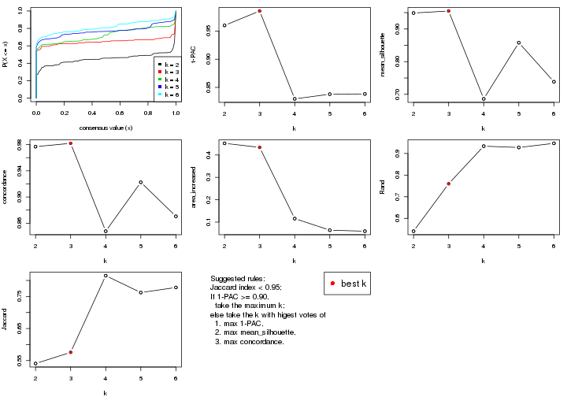

The numeric values for all these statistics can be obtained by `get_stats()`.

```r
get_stats(res)
```

```
#>   k 1-PAC mean_silhouette concordance area_increased  Rand Jaccard
#> 2 2 0.960           0.949       0.977         0.4521 0.541   0.541
#> 3 3 0.986           0.955       0.982         0.4340 0.760   0.576
#> 4 4 0.830           0.686       0.848         0.1156 0.934   0.815
#> 5 5 0.838           0.858       0.922         0.0638 0.928   0.762
#> 6 6 0.838           0.739       0.871         0.0592 0.947   0.778
```

`suggest_best_k()` suggests the best $k$ based on these statistics. The rules are as follows:

- All $k$ with Jaccard index larger than 0.95 are removed because increasing
  $k$ does not provide enough extra information. If all $k$ are removed, it is
  marked as no subgroup is detected.
- For all $k$ with 1-PAC score larger than 0.9, the maximal $k$ is taken as
  the best $k$, and other $k$ are marked as optional $k$.
- If it does not fit the second rule. The $k$ with the maximal vote of the
  highest 1-PAC score, highest mean silhouette, and highest concordance is
  taken as the best $k$.

```r
suggest_best_k(res)
```

```
#> [1] 3
#> attr(,"optional")
#> [1] 2
```

There is also optional best $k$ = 2 that is worth to check.

Following shows the table of the partitions (You need to click the **show/hide
code output** link to see it). The membership matrix (columns with name `p*`)
is inferred by
[`clue::cl_consensus()`](https://www.rdocumentation.org/link/cl_consensus?package=clue)
function with the `SE` method. Basically the value in the membership matrix
represents the probability to belong to a certain group. The finall class
label for an item is determined with the group with highest probability it
belongs to.

In `get_classes()` function, the entropy is calculated from the membership
matrix and the silhouette score is calculated from the consensus matrix.


<script>
$( function() {
	$( '#tabs-ATC-pam-get-classes' ).tabs();
} );
</script>
<div id='tabs-ATC-pam-get-classes'>
<ul>
<li><a href='#tab-ATC-pam-get-classes-1'>k = 2</a></li>
<li><a href='#tab-ATC-pam-get-classes-2'>k = 3</a></li>
<li><a href='#tab-ATC-pam-get-classes-3'>k = 4</a></li>
<li><a href='#tab-ATC-pam-get-classes-4'>k = 5</a></li>
<li><a href='#tab-ATC-pam-get-classes-5'>k = 6</a></li>
</ul>

<div id='tab-ATC-pam-get-classes-1'>
<p><a id='tab-ATC-pam-get-classes-1-a' style='color:#0366d6' href='#'>show/hide code output</a></p>
<pre><code class="r">cbind(get_classes(res, k = 2), get_membership(res, k = 2))
</code></pre>

<pre><code>#&gt;           class entropy silhouette    p1    p2
#&gt; GSM425907     2   0.000      0.952 0.000 1.000
#&gt; GSM425908     2   0.000      0.952 0.000 1.000
#&gt; GSM425909     2   0.224      0.932 0.036 0.964
#&gt; GSM425910     1   0.000      0.988 1.000 0.000
#&gt; GSM425911     1   0.000      0.988 1.000 0.000
#&gt; GSM425912     1   0.000      0.988 1.000 0.000
#&gt; GSM425913     1   0.925      0.455 0.660 0.340
#&gt; GSM425914     1   0.000      0.988 1.000 0.000
#&gt; GSM425915     1   0.000      0.988 1.000 0.000
#&gt; GSM425874     2   0.000      0.952 0.000 1.000
#&gt; GSM425875     1   0.000      0.988 1.000 0.000
#&gt; GSM425876     1   0.000      0.988 1.000 0.000
#&gt; GSM425877     1   0.000      0.988 1.000 0.000
#&gt; GSM425878     1   0.000      0.988 1.000 0.000
#&gt; GSM425879     1   0.141      0.974 0.980 0.020
#&gt; GSM425880     1   0.000      0.988 1.000 0.000
#&gt; GSM425881     1   0.000      0.988 1.000 0.000
#&gt; GSM425882     1   0.163      0.970 0.976 0.024
#&gt; GSM425883     1   0.000      0.988 1.000 0.000
#&gt; GSM425884     1   0.000      0.988 1.000 0.000
#&gt; GSM425885     2   0.000      0.952 0.000 1.000
#&gt; GSM425848     2   0.886      0.603 0.304 0.696
#&gt; GSM425849     1   0.000      0.988 1.000 0.000
#&gt; GSM425850     1   0.000      0.988 1.000 0.000
#&gt; GSM425851     1   0.653      0.790 0.832 0.168
#&gt; GSM425852     1   0.000      0.988 1.000 0.000
#&gt; GSM425893     1   0.163      0.970 0.976 0.024
#&gt; GSM425894     2   0.000      0.952 0.000 1.000
#&gt; GSM425895     1   0.141      0.974 0.980 0.020
#&gt; GSM425896     2   0.000      0.952 0.000 1.000
#&gt; GSM425897     2   0.327      0.914 0.060 0.940
#&gt; GSM425898     2   0.224      0.932 0.036 0.964
#&gt; GSM425899     1   0.000      0.988 1.000 0.000
#&gt; GSM425900     1   0.000      0.988 1.000 0.000
#&gt; GSM425901     2   0.000      0.952 0.000 1.000
#&gt; GSM425902     2   0.000      0.952 0.000 1.000
#&gt; GSM425903     1   0.000      0.988 1.000 0.000
#&gt; GSM425904     1   0.000      0.988 1.000 0.000
#&gt; GSM425905     2   0.000      0.952 0.000 1.000
#&gt; GSM425906     1   0.000      0.988 1.000 0.000
#&gt; GSM425863     1   0.000      0.988 1.000 0.000
#&gt; GSM425864     2   0.000      0.952 0.000 1.000
#&gt; GSM425865     2   0.000      0.952 0.000 1.000
#&gt; GSM425866     1   0.000      0.988 1.000 0.000
#&gt; GSM425867     1   0.000      0.988 1.000 0.000
#&gt; GSM425868     2   0.000      0.952 0.000 1.000
#&gt; GSM425869     2   0.000      0.952 0.000 1.000
#&gt; GSM425870     1   0.000      0.988 1.000 0.000
#&gt; GSM425871     1   0.000      0.988 1.000 0.000
#&gt; GSM425872     1   0.163      0.970 0.976 0.024
#&gt; GSM425873     1   0.000      0.988 1.000 0.000
#&gt; GSM425843     1   0.000      0.988 1.000 0.000
#&gt; GSM425844     1   0.141      0.974 0.980 0.020
#&gt; GSM425845     1   0.000      0.988 1.000 0.000
#&gt; GSM425846     1   0.000      0.988 1.000 0.000
#&gt; GSM425847     1   0.000      0.988 1.000 0.000
#&gt; GSM425886     2   0.000      0.952 0.000 1.000
#&gt; GSM425887     1   0.000      0.988 1.000 0.000
#&gt; GSM425888     1   0.000      0.988 1.000 0.000
#&gt; GSM425889     1   0.000      0.988 1.000 0.000
#&gt; GSM425890     2   0.000      0.952 0.000 1.000
#&gt; GSM425891     1   0.141      0.974 0.980 0.020
#&gt; GSM425892     2   0.000      0.952 0.000 1.000
#&gt; GSM425853     1   0.000      0.988 1.000 0.000
#&gt; GSM425854     2   0.680      0.792 0.180 0.820
#&gt; GSM425855     1   0.000      0.988 1.000 0.000
#&gt; GSM425856     1   0.000      0.988 1.000 0.000
#&gt; GSM425857     2   0.000      0.952 0.000 1.000
#&gt; GSM425858     1   0.000      0.988 1.000 0.000
#&gt; GSM425859     2   0.000      0.952 0.000 1.000
#&gt; GSM425860     1   0.000      0.988 1.000 0.000
#&gt; GSM425861     1   0.000      0.988 1.000 0.000
#&gt; GSM425862     1   0.141      0.974 0.980 0.020
#&gt; GSM425837     1   0.000      0.988 1.000 0.000
#&gt; GSM425838     2   0.000      0.952 0.000 1.000
#&gt; GSM425839     2   0.000      0.952 0.000 1.000
#&gt; GSM425840     1   0.000      0.988 1.000 0.000
#&gt; GSM425841     2   0.000      0.952 0.000 1.000
#&gt; GSM425842     1   0.000      0.988 1.000 0.000
#&gt; GSM425917     2   0.224      0.932 0.036 0.964
#&gt; GSM425922     2   0.000      0.952 0.000 1.000
#&gt; GSM425919     1   0.000      0.988 1.000 0.000
#&gt; GSM425920     1   0.000      0.988 1.000 0.000
#&gt; GSM425923     1   0.000      0.988 1.000 0.000
#&gt; GSM425916     1   0.000      0.988 1.000 0.000
#&gt; GSM425918     1   0.000      0.988 1.000 0.000
#&gt; GSM425921     2   0.000      0.952 0.000 1.000
#&gt; GSM425925     1   0.000      0.988 1.000 0.000
#&gt; GSM425926     2   0.000      0.952 0.000 1.000
#&gt; GSM425927     1   0.000      0.988 1.000 0.000
#&gt; GSM425924     1   0.141      0.974 0.980 0.020
#&gt; GSM425928     2   0.000      0.952 0.000 1.000
#&gt; GSM425929     1   0.000      0.988 1.000 0.000
#&gt; GSM425930     1   0.000      0.988 1.000 0.000
#&gt; GSM425931     2   0.833      0.672 0.264 0.736
#&gt; GSM425932     1   0.000      0.988 1.000 0.000
#&gt; GSM425933     1   0.141      0.974 0.980 0.020
#&gt; GSM425934     1   0.000      0.988 1.000 0.000
#&gt; GSM425935     2   0.000      0.952 0.000 1.000
#&gt; GSM425936     2   0.644      0.813 0.164 0.836
#&gt; GSM425937     2   0.994      0.214 0.456 0.544
#&gt; GSM425938     2   0.552      0.853 0.128 0.872
#&gt; GSM425939     1   0.000      0.988 1.000 0.000
</code></pre>

<script>
$('#tab-ATC-pam-get-classes-1-a').parent().next().next().hide();
$('#tab-ATC-pam-get-classes-1-a').click(function(){
  $('#tab-ATC-pam-get-classes-1-a').parent().next().next().toggle();
  return(false);
});
</script>
</div>

<div id='tab-ATC-pam-get-classes-2'>
<p><a id='tab-ATC-pam-get-classes-2-a' style='color:#0366d6' href='#'>show/hide code output</a></p>
<pre><code class="r">cbind(get_classes(res, k = 3), get_membership(res, k = 3))
</code></pre>

<pre><code>#&gt;           class entropy silhouette    p1    p2    p3
#&gt; GSM425907     2  0.0000     0.9645 0.000 1.000 0.000
#&gt; GSM425908     2  0.0000     0.9645 0.000 1.000 0.000
#&gt; GSM425909     2  0.1529     0.9346 0.000 0.960 0.040
#&gt; GSM425910     1  0.0000     0.9918 1.000 0.000 0.000
#&gt; GSM425911     3  0.0000     0.9829 0.000 0.000 1.000
#&gt; GSM425912     1  0.0000     0.9918 1.000 0.000 0.000
#&gt; GSM425913     3  0.0000     0.9829 0.000 0.000 1.000
#&gt; GSM425914     1  0.0000     0.9918 1.000 0.000 0.000
#&gt; GSM425915     3  0.0000     0.9829 0.000 0.000 1.000
#&gt; GSM425874     2  0.0000     0.9645 0.000 1.000 0.000
#&gt; GSM425875     3  0.0424     0.9765 0.008 0.000 0.992
#&gt; GSM425876     1  0.0000     0.9918 1.000 0.000 0.000
#&gt; GSM425877     1  0.0000     0.9918 1.000 0.000 0.000
#&gt; GSM425878     3  0.0237     0.9798 0.004 0.000 0.996
#&gt; GSM425879     3  0.0000     0.9829 0.000 0.000 1.000
#&gt; GSM425880     3  0.0000     0.9829 0.000 0.000 1.000
#&gt; GSM425881     1  0.0000     0.9918 1.000 0.000 0.000
#&gt; GSM425882     3  0.0000     0.9829 0.000 0.000 1.000
#&gt; GSM425883     3  0.0000     0.9829 0.000 0.000 1.000
#&gt; GSM425884     1  0.0000     0.9918 1.000 0.000 0.000
#&gt; GSM425885     2  0.0000     0.9645 0.000 1.000 0.000
#&gt; GSM425848     3  0.6291     0.0651 0.000 0.468 0.532
#&gt; GSM425849     3  0.1529     0.9471 0.040 0.000 0.960
#&gt; GSM425850     3  0.0000     0.9829 0.000 0.000 1.000
#&gt; GSM425851     3  0.0000     0.9829 0.000 0.000 1.000
#&gt; GSM425852     3  0.0000     0.9829 0.000 0.000 1.000
#&gt; GSM425893     3  0.0000     0.9829 0.000 0.000 1.000
#&gt; GSM425894     2  0.0000     0.9645 0.000 1.000 0.000
#&gt; GSM425895     3  0.0000     0.9829 0.000 0.000 1.000
#&gt; GSM425896     2  0.0000     0.9645 0.000 1.000 0.000
#&gt; GSM425897     2  0.2959     0.8771 0.000 0.900 0.100
#&gt; GSM425898     2  0.1529     0.9346 0.000 0.960 0.040
#&gt; GSM425899     3  0.0000     0.9829 0.000 0.000 1.000
#&gt; GSM425900     3  0.0000     0.9829 0.000 0.000 1.000
#&gt; GSM425901     2  0.0000     0.9645 0.000 1.000 0.000
#&gt; GSM425902     2  0.0000     0.9645 0.000 1.000 0.000
#&gt; GSM425903     1  0.3879     0.8153 0.848 0.000 0.152
#&gt; GSM425904     3  0.0000     0.9829 0.000 0.000 1.000
#&gt; GSM425905     2  0.0000     0.9645 0.000 1.000 0.000
#&gt; GSM425906     3  0.0000     0.9829 0.000 0.000 1.000
#&gt; GSM425863     1  0.0000     0.9918 1.000 0.000 0.000
#&gt; GSM425864     2  0.0000     0.9645 0.000 1.000 0.000
#&gt; GSM425865     2  0.0000     0.9645 0.000 1.000 0.000
#&gt; GSM425866     3  0.0000     0.9829 0.000 0.000 1.000
#&gt; GSM425867     1  0.0000     0.9918 1.000 0.000 0.000
#&gt; GSM425868     2  0.0000     0.9645 0.000 1.000 0.000
#&gt; GSM425869     2  0.0000     0.9645 0.000 1.000 0.000
#&gt; GSM425870     1  0.0000     0.9918 1.000 0.000 0.000
#&gt; GSM425871     3  0.0000     0.9829 0.000 0.000 1.000
#&gt; GSM425872     3  0.0000     0.9829 0.000 0.000 1.000
#&gt; GSM425873     1  0.0000     0.9918 1.000 0.000 0.000
#&gt; GSM425843     1  0.0000     0.9918 1.000 0.000 0.000
#&gt; GSM425844     3  0.0000     0.9829 0.000 0.000 1.000
#&gt; GSM425845     1  0.0000     0.9918 1.000 0.000 0.000
#&gt; GSM425846     3  0.0000     0.9829 0.000 0.000 1.000
#&gt; GSM425847     1  0.0000     0.9918 1.000 0.000 0.000
#&gt; GSM425886     2  0.0000     0.9645 0.000 1.000 0.000
#&gt; GSM425887     3  0.0000     0.9829 0.000 0.000 1.000
#&gt; GSM425888     1  0.0000     0.9918 1.000 0.000 0.000
#&gt; GSM425889     3  0.0000     0.9829 0.000 0.000 1.000
#&gt; GSM425890     2  0.0000     0.9645 0.000 1.000 0.000
#&gt; GSM425891     3  0.0000     0.9829 0.000 0.000 1.000
#&gt; GSM425892     2  0.0000     0.9645 0.000 1.000 0.000
#&gt; GSM425853     3  0.0000     0.9829 0.000 0.000 1.000
#&gt; GSM425854     2  0.3192     0.8645 0.000 0.888 0.112
#&gt; GSM425855     1  0.0000     0.9918 1.000 0.000 0.000
#&gt; GSM425856     3  0.0000     0.9829 0.000 0.000 1.000
#&gt; GSM425857     2  0.0000     0.9645 0.000 1.000 0.000
#&gt; GSM425858     1  0.0592     0.9798 0.988 0.000 0.012
#&gt; GSM425859     2  0.0000     0.9645 0.000 1.000 0.000
#&gt; GSM425860     1  0.0000     0.9918 1.000 0.000 0.000
#&gt; GSM425861     1  0.0000     0.9918 1.000 0.000 0.000
#&gt; GSM425862     3  0.0000     0.9829 0.000 0.000 1.000
#&gt; GSM425837     1  0.0000     0.9918 1.000 0.000 0.000
#&gt; GSM425838     2  0.0000     0.9645 0.000 1.000 0.000
#&gt; GSM425839     2  0.0000     0.9645 0.000 1.000 0.000
#&gt; GSM425840     3  0.1289     0.9550 0.032 0.000 0.968
#&gt; GSM425841     2  0.0000     0.9645 0.000 1.000 0.000
#&gt; GSM425842     1  0.0000     0.9918 1.000 0.000 0.000
#&gt; GSM425917     2  0.1529     0.9346 0.000 0.960 0.040
#&gt; GSM425922     2  0.0000     0.9645 0.000 1.000 0.000
#&gt; GSM425919     1  0.0000     0.9918 1.000 0.000 0.000
#&gt; GSM425920     3  0.0000     0.9829 0.000 0.000 1.000
#&gt; GSM425923     3  0.0000     0.9829 0.000 0.000 1.000
#&gt; GSM425916     3  0.1163     0.9587 0.028 0.000 0.972
#&gt; GSM425918     3  0.0000     0.9829 0.000 0.000 1.000
#&gt; GSM425921     2  0.0000     0.9645 0.000 1.000 0.000
#&gt; GSM425925     3  0.0000     0.9829 0.000 0.000 1.000
#&gt; GSM425926     2  0.0000     0.9645 0.000 1.000 0.000
#&gt; GSM425927     1  0.0000     0.9918 1.000 0.000 0.000
#&gt; GSM425924     3  0.0000     0.9829 0.000 0.000 1.000
#&gt; GSM425928     2  0.0000     0.9645 0.000 1.000 0.000
#&gt; GSM425929     3  0.0000     0.9829 0.000 0.000 1.000
#&gt; GSM425930     3  0.0000     0.9829 0.000 0.000 1.000
#&gt; GSM425931     3  0.3752     0.8197 0.000 0.144 0.856
#&gt; GSM425932     3  0.0000     0.9829 0.000 0.000 1.000
#&gt; GSM425933     3  0.0000     0.9829 0.000 0.000 1.000
#&gt; GSM425934     3  0.0000     0.9829 0.000 0.000 1.000
#&gt; GSM425935     2  0.0000     0.9645 0.000 1.000 0.000
#&gt; GSM425936     2  0.5859     0.4999 0.000 0.656 0.344
#&gt; GSM425937     3  0.0000     0.9829 0.000 0.000 1.000
#&gt; GSM425938     2  0.5560     0.5945 0.000 0.700 0.300
#&gt; GSM425939     3  0.0000     0.9829 0.000 0.000 1.000
</code></pre>

<script>
$('#tab-ATC-pam-get-classes-2-a').parent().next().next().hide();
$('#tab-ATC-pam-get-classes-2-a').click(function(){
  $('#tab-ATC-pam-get-classes-2-a').parent().next().next().toggle();
  return(false);
});
</script>
</div>

<div id='tab-ATC-pam-get-classes-3'>
<p><a id='tab-ATC-pam-get-classes-3-a' style='color:#0366d6' href='#'>show/hide code output</a></p>
<pre><code class="r">cbind(get_classes(res, k = 4), get_membership(res, k = 4))
</code></pre>

<pre><code>#&gt;           class entropy silhouette    p1    p2    p3    p4
#&gt; GSM425907     2  0.4994     0.6083 0.000 0.520 0.480 0.000
#&gt; GSM425908     2  0.4994     0.6083 0.000 0.520 0.480 0.000
#&gt; GSM425909     2  0.4004     0.3142 0.000 0.812 0.164 0.024
#&gt; GSM425910     1  0.0000     0.9908 1.000 0.000 0.000 0.000
#&gt; GSM425911     4  0.0000     0.8979 0.000 0.000 0.000 1.000
#&gt; GSM425912     1  0.0000     0.9908 1.000 0.000 0.000 0.000
#&gt; GSM425913     4  0.7273    -0.2098 0.000 0.400 0.148 0.452
#&gt; GSM425914     1  0.0000     0.9908 1.000 0.000 0.000 0.000
#&gt; GSM425915     4  0.0000     0.8979 0.000 0.000 0.000 1.000
#&gt; GSM425874     2  0.4994     0.6083 0.000 0.520 0.480 0.000
#&gt; GSM425875     4  0.0336     0.8919 0.008 0.000 0.000 0.992
#&gt; GSM425876     1  0.0000     0.9908 1.000 0.000 0.000 0.000
#&gt; GSM425877     1  0.0000     0.9908 1.000 0.000 0.000 0.000
#&gt; GSM425878     4  0.0188     0.8952 0.004 0.000 0.000 0.996
#&gt; GSM425879     4  0.0188     0.8960 0.000 0.004 0.000 0.996
#&gt; GSM425880     4  0.0000     0.8979 0.000 0.000 0.000 1.000
#&gt; GSM425881     1  0.0000     0.9908 1.000 0.000 0.000 0.000
#&gt; GSM425882     4  0.0188     0.8960 0.000 0.004 0.000 0.996
#&gt; GSM425883     4  0.0000     0.8979 0.000 0.000 0.000 1.000
#&gt; GSM425884     1  0.0000     0.9908 1.000 0.000 0.000 0.000
#&gt; GSM425885     2  0.4994     0.6083 0.000 0.520 0.480 0.000
#&gt; GSM425848     2  0.4933    -0.1488 0.000 0.568 0.000 0.432
#&gt; GSM425849     4  0.1211     0.8577 0.040 0.000 0.000 0.960
#&gt; GSM425850     4  0.0000     0.8979 0.000 0.000 0.000 1.000
#&gt; GSM425851     4  0.4801     0.5602 0.000 0.188 0.048 0.764
#&gt; GSM425852     4  0.0000     0.8979 0.000 0.000 0.000 1.000
#&gt; GSM425893     4  0.4431     0.3967 0.000 0.304 0.000 0.696
#&gt; GSM425894     2  0.0188     0.5413 0.000 0.996 0.004 0.000
#&gt; GSM425895     4  0.4961     0.0432 0.000 0.448 0.000 0.552
#&gt; GSM425896     2  0.4994     0.6083 0.000 0.520 0.480 0.000
#&gt; GSM425897     2  0.5172     0.0612 0.000 0.704 0.260 0.036
#&gt; GSM425898     2  0.3486     0.2846 0.000 0.812 0.000 0.188
#&gt; GSM425899     4  0.0000     0.8979 0.000 0.000 0.000 1.000
#&gt; GSM425900     4  0.0000     0.8979 0.000 0.000 0.000 1.000
#&gt; GSM425901     2  0.0000     0.5395 0.000 1.000 0.000 0.000
#&gt; GSM425902     2  0.0000     0.5395 0.000 1.000 0.000 0.000
#&gt; GSM425903     1  0.3074     0.7790 0.848 0.000 0.000 0.152
#&gt; GSM425904     4  0.0000     0.8979 0.000 0.000 0.000 1.000
#&gt; GSM425905     2  0.0000     0.5395 0.000 1.000 0.000 0.000
#&gt; GSM425906     4  0.0000     0.8979 0.000 0.000 0.000 1.000
#&gt; GSM425863     1  0.0000     0.9908 1.000 0.000 0.000 0.000
#&gt; GSM425864     2  0.0188     0.5413 0.000 0.996 0.004 0.000
#&gt; GSM425865     2  0.0000     0.5395 0.000 1.000 0.000 0.000
#&gt; GSM425866     4  0.0000     0.8979 0.000 0.000 0.000 1.000
#&gt; GSM425867     1  0.0000     0.9908 1.000 0.000 0.000 0.000
#&gt; GSM425868     2  0.4977     0.6061 0.000 0.540 0.460 0.000
#&gt; GSM425869     2  0.4994     0.6083 0.000 0.520 0.480 0.000
#&gt; GSM425870     1  0.0000     0.9908 1.000 0.000 0.000 0.000
#&gt; GSM425871     4  0.0000     0.8979 0.000 0.000 0.000 1.000
#&gt; GSM425872     4  0.0188     0.8960 0.000 0.004 0.000 0.996
#&gt; GSM425873     1  0.0000     0.9908 1.000 0.000 0.000 0.000
#&gt; GSM425843     1  0.0000     0.9908 1.000 0.000 0.000 0.000
#&gt; GSM425844     4  0.0188     0.8960 0.000 0.004 0.000 0.996
#&gt; GSM425845     1  0.0000     0.9908 1.000 0.000 0.000 0.000
#&gt; GSM425846     4  0.0000     0.8979 0.000 0.000 0.000 1.000
#&gt; GSM425847     1  0.0000     0.9908 1.000 0.000 0.000 0.000
#&gt; GSM425886     2  0.3486     0.3061 0.000 0.812 0.188 0.000
#&gt; GSM425887     4  0.0000     0.8979 0.000 0.000 0.000 1.000
#&gt; GSM425888     1  0.0000     0.9908 1.000 0.000 0.000 0.000
#&gt; GSM425889     4  0.0000     0.8979 0.000 0.000 0.000 1.000
#&gt; GSM425890     2  0.4994     0.6083 0.000 0.520 0.480 0.000
#&gt; GSM425891     4  0.0188     0.8960 0.000 0.004 0.000 0.996
#&gt; GSM425892     2  0.0188     0.5413 0.000 0.996 0.004 0.000
#&gt; GSM425853     4  0.0000     0.8979 0.000 0.000 0.000 1.000
#&gt; GSM425854     2  0.3486     0.2846 0.000 0.812 0.000 0.188
#&gt; GSM425855     1  0.0000     0.9908 1.000 0.000 0.000 0.000
#&gt; GSM425856     4  0.0000     0.8979 0.000 0.000 0.000 1.000
#&gt; GSM425857     2  0.4994     0.6083 0.000 0.520 0.480 0.000
#&gt; GSM425858     1  0.0469     0.9767 0.988 0.000 0.000 0.012
#&gt; GSM425859     2  0.4994     0.6083 0.000 0.520 0.480 0.000
#&gt; GSM425860     1  0.0000     0.9908 1.000 0.000 0.000 0.000
#&gt; GSM425861     1  0.0000     0.9908 1.000 0.000 0.000 0.000
#&gt; GSM425862     4  0.0469     0.8888 0.000 0.012 0.000 0.988
#&gt; GSM425837     1  0.0000     0.9908 1.000 0.000 0.000 0.000
#&gt; GSM425838     2  0.4994     0.6083 0.000 0.520 0.480 0.000
#&gt; GSM425839     2  0.0000     0.5395 0.000 1.000 0.000 0.000
#&gt; GSM425840     4  0.1022     0.8671 0.032 0.000 0.000 0.968
#&gt; GSM425841     2  0.4994     0.6083 0.000 0.520 0.480 0.000
#&gt; GSM425842     1  0.0000     0.9908 1.000 0.000 0.000 0.000
#&gt; GSM425917     2  0.4992    -0.4507 0.000 0.524 0.476 0.000
#&gt; GSM425922     2  0.4994     0.6083 0.000 0.520 0.480 0.000
#&gt; GSM425919     1  0.0000     0.9908 1.000 0.000 0.000 0.000
#&gt; GSM425920     4  0.0000     0.8979 0.000 0.000 0.000 1.000
#&gt; GSM425923     4  0.0000     0.8979 0.000 0.000 0.000 1.000
#&gt; GSM425916     4  0.0921     0.8713 0.028 0.000 0.000 0.972
#&gt; GSM425918     4  0.0000     0.8979 0.000 0.000 0.000 1.000
#&gt; GSM425921     2  0.4994     0.6083 0.000 0.520 0.480 0.000
#&gt; GSM425925     4  0.0000     0.8979 0.000 0.000 0.000 1.000
#&gt; GSM425926     2  0.0188     0.5413 0.000 0.996 0.004 0.000
#&gt; GSM425927     1  0.0000     0.9908 1.000 0.000 0.000 0.000
#&gt; GSM425924     4  0.0188     0.8960 0.000 0.004 0.000 0.996
#&gt; GSM425928     2  0.2921     0.3915 0.000 0.860 0.140 0.000
#&gt; GSM425929     4  0.4898     0.0184 0.000 0.000 0.416 0.584
#&gt; GSM425930     4  0.4564     0.3268 0.000 0.000 0.328 0.672
#&gt; GSM425931     3  0.5161     0.4489 0.000 0.476 0.520 0.004
#&gt; GSM425932     3  0.4994     0.2423 0.000 0.000 0.520 0.480
#&gt; GSM425933     3  0.4994     0.2423 0.000 0.000 0.520 0.480
#&gt; GSM425934     4  0.4898     0.0184 0.000 0.000 0.416 0.584
#&gt; GSM425935     2  0.4998    -0.4765 0.000 0.512 0.488 0.000
#&gt; GSM425936     3  0.4994     0.4440 0.000 0.480 0.520 0.000
#&gt; GSM425937     3  0.5682     0.4578 0.000 0.456 0.520 0.024
#&gt; GSM425938     3  0.4994     0.4440 0.000 0.480 0.520 0.000
#&gt; GSM425939     3  0.4994     0.2423 0.000 0.000 0.520 0.480
</code></pre>

<script>
$('#tab-ATC-pam-get-classes-3-a').parent().next().next().hide();
$('#tab-ATC-pam-get-classes-3-a').click(function(){
  $('#tab-ATC-pam-get-classes-3-a').parent().next().next().toggle();
  return(false);
});
</script>
</div>

<div id='tab-ATC-pam-get-classes-4'>
<p><a id='tab-ATC-pam-get-classes-4-a' style='color:#0366d6' href='#'>show/hide code output</a></p>
<pre><code class="r">cbind(get_classes(res, k = 5), get_membership(res, k = 5))
</code></pre>

<pre><code>#&gt;           class entropy silhouette    p1    p2    p3    p4    p5
#&gt; GSM425907     4  0.0000      0.979 0.000 0.000 0.000 1.000 0.000
#&gt; GSM425908     4  0.0162      0.978 0.000 0.004 0.000 0.996 0.000
#&gt; GSM425909     2  0.3224      0.743 0.000 0.824 0.016 0.000 0.160
#&gt; GSM425910     1  0.0000      0.990 1.000 0.000 0.000 0.000 0.000
#&gt; GSM425911     5  0.0671      0.826 0.000 0.004 0.016 0.000 0.980
#&gt; GSM425912     1  0.0000      0.990 1.000 0.000 0.000 0.000 0.000
#&gt; GSM425913     5  0.4360      0.546 0.000 0.064 0.184 0.000 0.752
#&gt; GSM425914     1  0.0000      0.990 1.000 0.000 0.000 0.000 0.000
#&gt; GSM425915     5  0.2732      0.874 0.000 0.000 0.160 0.000 0.840
#&gt; GSM425874     4  0.0404      0.975 0.000 0.012 0.000 0.988 0.000
#&gt; GSM425875     5  0.3013      0.871 0.008 0.000 0.160 0.000 0.832
#&gt; GSM425876     1  0.0000      0.990 1.000 0.000 0.000 0.000 0.000
#&gt; GSM425877     1  0.0000      0.990 1.000 0.000 0.000 0.000 0.000
#&gt; GSM425878     5  0.2890      0.872 0.004 0.000 0.160 0.000 0.836
#&gt; GSM425879     5  0.0671      0.826 0.000 0.004 0.016 0.000 0.980
#&gt; GSM425880     5  0.2732      0.874 0.000 0.000 0.160 0.000 0.840
#&gt; GSM425881     1  0.0000      0.990 1.000 0.000 0.000 0.000 0.000
#&gt; GSM425882     5  0.0898      0.822 0.000 0.008 0.020 0.000 0.972
#&gt; GSM425883     5  0.2732      0.874 0.000 0.000 0.160 0.000 0.840
#&gt; GSM425884     1  0.0000      0.990 1.000 0.000 0.000 0.000 0.000
#&gt; GSM425885     4  0.0000      0.979 0.000 0.000 0.000 1.000 0.000
#&gt; GSM425848     2  0.4682      0.322 0.000 0.564 0.016 0.000 0.420
#&gt; GSM425849     5  0.3731      0.843 0.040 0.000 0.160 0.000 0.800
#&gt; GSM425850     5  0.2732      0.874 0.000 0.000 0.160 0.000 0.840
#&gt; GSM425851     5  0.3246      0.631 0.000 0.008 0.184 0.000 0.808
#&gt; GSM425852     5  0.2890      0.874 0.000 0.004 0.160 0.000 0.836
#&gt; GSM425893     5  0.2914      0.729 0.000 0.052 0.076 0.000 0.872
#&gt; GSM425894     2  0.0162      0.870 0.000 0.996 0.000 0.004 0.000
#&gt; GSM425895     5  0.2777      0.708 0.000 0.120 0.016 0.000 0.864
#&gt; GSM425896     4  0.0290      0.977 0.000 0.008 0.000 0.992 0.000
#&gt; GSM425897     2  0.0510      0.861 0.000 0.984 0.000 0.000 0.016
#&gt; GSM425898     2  0.3224      0.743 0.000 0.824 0.016 0.000 0.160
#&gt; GSM425899     5  0.0671      0.826 0.000 0.004 0.016 0.000 0.980
#&gt; GSM425900     5  0.2732      0.874 0.000 0.000 0.160 0.000 0.840
#&gt; GSM425901     2  0.0162      0.870 0.000 0.996 0.000 0.004 0.000
#&gt; GSM425902     2  0.0162      0.870 0.000 0.996 0.000 0.004 0.000
#&gt; GSM425903     1  0.2648      0.765 0.848 0.000 0.000 0.000 0.152
#&gt; GSM425904     5  0.2732      0.874 0.000 0.000 0.160 0.000 0.840
#&gt; GSM425905     2  0.0162      0.870 0.000 0.996 0.000 0.004 0.000
#&gt; GSM425906     5  0.2732      0.874 0.000 0.000 0.160 0.000 0.840
#&gt; GSM425863     1  0.0000      0.990 1.000 0.000 0.000 0.000 0.000
#&gt; GSM425864     2  0.0162      0.870 0.000 0.996 0.000 0.004 0.000
#&gt; GSM425865     2  0.0162      0.870 0.000 0.996 0.000 0.004 0.000
#&gt; GSM425866     5  0.2732      0.874 0.000 0.000 0.160 0.000 0.840
#&gt; GSM425867     1  0.0000      0.990 1.000 0.000 0.000 0.000 0.000
#&gt; GSM425868     2  0.2813      0.733 0.000 0.832 0.000 0.168 0.000
#&gt; GSM425869     4  0.0000      0.979 0.000 0.000 0.000 1.000 0.000
#&gt; GSM425870     1  0.0000      0.990 1.000 0.000 0.000 0.000 0.000
#&gt; GSM425871     5  0.0771      0.829 0.000 0.004 0.020 0.000 0.976
#&gt; GSM425872     5  0.1251      0.811 0.000 0.008 0.036 0.000 0.956
#&gt; GSM425873     1  0.0000      0.990 1.000 0.000 0.000 0.000 0.000
#&gt; GSM425843     1  0.0000      0.990 1.000 0.000 0.000 0.000 0.000
#&gt; GSM425844     5  0.0671      0.826 0.000 0.004 0.016 0.000 0.980
#&gt; GSM425845     1  0.0000      0.990 1.000 0.000 0.000 0.000 0.000
#&gt; GSM425846     5  0.0510      0.828 0.000 0.000 0.016 0.000 0.984
#&gt; GSM425847     1  0.0000      0.990 1.000 0.000 0.000 0.000 0.000
#&gt; GSM425886     2  0.0000      0.868 0.000 1.000 0.000 0.000 0.000
#&gt; GSM425887     5  0.2732      0.874 0.000 0.000 0.160 0.000 0.840
#&gt; GSM425888     1  0.0000      0.990 1.000 0.000 0.000 0.000 0.000
#&gt; GSM425889     5  0.2732      0.874 0.000 0.000 0.160 0.000 0.840
#&gt; GSM425890     4  0.0703      0.964 0.000 0.024 0.000 0.976 0.000
#&gt; GSM425891     5  0.0671      0.826 0.000 0.004 0.016 0.000 0.980
#&gt; GSM425892     2  0.0162      0.870 0.000 0.996 0.000 0.004 0.000
#&gt; GSM425853     5  0.2732      0.874 0.000 0.000 0.160 0.000 0.840
#&gt; GSM425854     2  0.3381      0.728 0.000 0.808 0.016 0.000 0.176
#&gt; GSM425855     1  0.0162      0.986 0.996 0.000 0.000 0.000 0.004
#&gt; GSM425856     5  0.2732      0.874 0.000 0.000 0.160 0.000 0.840
#&gt; GSM425857     4  0.0000      0.979 0.000 0.000 0.000 1.000 0.000
#&gt; GSM425858     1  0.0510      0.972 0.984 0.000 0.000 0.000 0.016
#&gt; GSM425859     4  0.1792      0.915 0.000 0.084 0.000 0.916 0.000
#&gt; GSM425860     1  0.0000      0.990 1.000 0.000 0.000 0.000 0.000
#&gt; GSM425861     1  0.0000      0.990 1.000 0.000 0.000 0.000 0.000
#&gt; GSM425862     5  0.1205      0.810 0.000 0.004 0.040 0.000 0.956
#&gt; GSM425837     1  0.0000      0.990 1.000 0.000 0.000 0.000 0.000
#&gt; GSM425838     4  0.0000      0.979 0.000 0.000 0.000 1.000 0.000
#&gt; GSM425839     2  0.0162      0.870 0.000 0.996 0.000 0.004 0.000
#&gt; GSM425840     5  0.3577      0.851 0.032 0.000 0.160 0.000 0.808
#&gt; GSM425841     4  0.1908      0.908 0.000 0.092 0.000 0.908 0.000
#&gt; GSM425842     1  0.0000      0.990 1.000 0.000 0.000 0.000 0.000
#&gt; GSM425917     2  0.4897      0.162 0.000 0.516 0.460 0.000 0.024
#&gt; GSM425922     4  0.0000      0.979 0.000 0.000 0.000 1.000 0.000
#&gt; GSM425919     1  0.0000      0.990 1.000 0.000 0.000 0.000 0.000
#&gt; GSM425920     5  0.2732      0.874 0.000 0.000 0.160 0.000 0.840
#&gt; GSM425923     5  0.2732      0.874 0.000 0.000 0.160 0.000 0.840
#&gt; GSM425916     5  0.3495      0.854 0.028 0.000 0.160 0.000 0.812
#&gt; GSM425918     5  0.0880      0.846 0.000 0.000 0.032 0.000 0.968
#&gt; GSM425921     4  0.0000      0.979 0.000 0.000 0.000 1.000 0.000
#&gt; GSM425925     5  0.2732      0.874 0.000 0.000 0.160 0.000 0.840
#&gt; GSM425926     2  0.0162      0.870 0.000 0.996 0.000 0.004 0.000
#&gt; GSM425927     1  0.0000      0.990 1.000 0.000 0.000 0.000 0.000
#&gt; GSM425924     5  0.1478      0.832 0.000 0.000 0.064 0.000 0.936
#&gt; GSM425928     2  0.0324      0.868 0.000 0.992 0.004 0.004 0.000
#&gt; GSM425929     3  0.3003      0.723 0.000 0.000 0.812 0.000 0.188
#&gt; GSM425930     3  0.3561      0.608 0.000 0.000 0.740 0.000 0.260
#&gt; GSM425931     3  0.2732      0.706 0.000 0.000 0.840 0.000 0.160
#&gt; GSM425932     3  0.0510      0.766 0.000 0.000 0.984 0.000 0.016
#&gt; GSM425933     3  0.0510      0.766 0.000 0.000 0.984 0.000 0.016
#&gt; GSM425934     3  0.3003      0.723 0.000 0.000 0.812 0.000 0.188
#&gt; GSM425935     2  0.3949      0.546 0.000 0.696 0.300 0.004 0.000
#&gt; GSM425936     3  0.3284      0.626 0.000 0.148 0.828 0.000 0.024
#&gt; GSM425937     3  0.2732      0.706 0.000 0.000 0.840 0.000 0.160
#&gt; GSM425938     3  0.2848      0.706 0.000 0.004 0.840 0.000 0.156
#&gt; GSM425939     3  0.2561      0.758 0.000 0.000 0.856 0.000 0.144
</code></pre>

<script>
$('#tab-ATC-pam-get-classes-4-a').parent().next().next().hide();
$('#tab-ATC-pam-get-classes-4-a').click(function(){
  $('#tab-ATC-pam-get-classes-4-a').parent().next().next().toggle();
  return(false);
});
</script>
</div>

<div id='tab-ATC-pam-get-classes-5'>
<p><a id='tab-ATC-pam-get-classes-5-a' style='color:#0366d6' href='#'>show/hide code output</a></p>
<pre><code class="r">cbind(get_classes(res, k = 6), get_membership(res, k = 6))
</code></pre>

<pre><code>#&gt;           class entropy silhouette    p1    p2    p3    p4    p5    p6
#&gt; GSM425907     4  0.0000      0.940 0.000 0.000 0.000 1.000 0.000 0.000
#&gt; GSM425908     4  0.0146      0.938 0.000 0.004 0.000 0.996 0.000 0.000
#&gt; GSM425909     2  0.0146      0.367 0.000 0.996 0.000 0.000 0.000 0.004
#&gt; GSM425910     1  0.0632      0.924 0.976 0.000 0.000 0.000 0.024 0.000
#&gt; GSM425911     5  0.3804      0.622 0.000 0.424 0.000 0.000 0.576 0.000
#&gt; GSM425912     1  0.0000      0.937 1.000 0.000 0.000 0.000 0.000 0.000
#&gt; GSM425913     6  0.4950      0.492 0.000 0.344 0.080 0.000 0.000 0.576
#&gt; GSM425914     1  0.2697      0.764 0.812 0.000 0.000 0.000 0.188 0.000
#&gt; GSM425915     5  0.0000      0.747 0.000 0.000 0.000 0.000 1.000 0.000
#&gt; GSM425874     4  0.0405      0.934 0.000 0.008 0.000 0.988 0.000 0.004
#&gt; GSM425875     5  0.0146      0.746 0.004 0.000 0.000 0.000 0.996 0.000
#&gt; GSM425876     1  0.0000      0.937 1.000 0.000 0.000 0.000 0.000 0.000
#&gt; GSM425877     1  0.2048      0.839 0.880 0.000 0.000 0.000 0.120 0.000
#&gt; GSM425878     5  0.0146      0.744 0.004 0.000 0.000 0.000 0.996 0.000
#&gt; GSM425879     5  0.3804      0.622 0.000 0.424 0.000 0.000 0.576 0.000
#&gt; GSM425880     5  0.0000      0.747 0.000 0.000 0.000 0.000 1.000 0.000
#&gt; GSM425881     1  0.0000      0.937 1.000 0.000 0.000 0.000 0.000 0.000
#&gt; GSM425882     5  0.3804      0.622 0.000 0.424 0.000 0.000 0.576 0.000
#&gt; GSM425883     6  0.3847      0.364 0.000 0.000 0.000 0.000 0.456 0.544
#&gt; GSM425884     1  0.0000      0.937 1.000 0.000 0.000 0.000 0.000 0.000
#&gt; GSM425885     4  0.0000      0.940 0.000 0.000 0.000 1.000 0.000 0.000
#&gt; GSM425848     2  0.2003      0.166 0.000 0.884 0.000 0.000 0.116 0.000
#&gt; GSM425849     5  0.0937      0.709 0.040 0.000 0.000 0.000 0.960 0.000
#&gt; GSM425850     5  0.0000      0.747 0.000 0.000 0.000 0.000 1.000 0.000
#&gt; GSM425851     5  0.3804      0.622 0.000 0.424 0.000 0.000 0.576 0.000
#&gt; GSM425852     5  0.3563      0.653 0.000 0.336 0.000 0.000 0.664 0.000
#&gt; GSM425893     5  0.4552      0.608 0.000 0.388 0.040 0.000 0.572 0.000
#&gt; GSM425894     2  0.3804      0.809 0.000 0.576 0.000 0.000 0.000 0.424
#&gt; GSM425895     5  0.3817      0.613 0.000 0.432 0.000 0.000 0.568 0.000
#&gt; GSM425896     4  0.0260      0.936 0.000 0.008 0.000 0.992 0.000 0.000
#&gt; GSM425897     6  0.4057     -0.648 0.000 0.436 0.008 0.000 0.000 0.556
#&gt; GSM425898     2  0.0146      0.367 0.000 0.996 0.000 0.000 0.000 0.004
#&gt; GSM425899     5  0.3804      0.622 0.000 0.424 0.000 0.000 0.576 0.000
#&gt; GSM425900     5  0.0000      0.747 0.000 0.000 0.000 0.000 1.000 0.000
#&gt; GSM425901     2  0.3804      0.809 0.000 0.576 0.000 0.000 0.000 0.424
#&gt; GSM425902     2  0.3804      0.809 0.000 0.576 0.000 0.000 0.000 0.424
#&gt; GSM425903     1  0.2697      0.736 0.812 0.000 0.000 0.000 0.188 0.000
#&gt; GSM425904     5  0.0000      0.747 0.000 0.000 0.000 0.000 1.000 0.000
#&gt; GSM425905     2  0.3804      0.809 0.000 0.576 0.000 0.000 0.000 0.424
#&gt; GSM425906     5  0.0363      0.743 0.012 0.000 0.000 0.000 0.988 0.000
#&gt; GSM425863     1  0.0000      0.937 1.000 0.000 0.000 0.000 0.000 0.000
#&gt; GSM425864     2  0.3804      0.809 0.000 0.576 0.000 0.000 0.000 0.424
#&gt; GSM425865     2  0.3804      0.809 0.000 0.576 0.000 0.000 0.000 0.424
#&gt; GSM425866     5  0.0000      0.747 0.000 0.000 0.000 0.000 1.000 0.000
#&gt; GSM425867     1  0.0000      0.937 1.000 0.000 0.000 0.000 0.000 0.000
#&gt; GSM425868     2  0.4788      0.761 0.000 0.548 0.000 0.056 0.000 0.396
#&gt; GSM425869     4  0.0000      0.940 0.000 0.000 0.000 1.000 0.000 0.000
#&gt; GSM425870     1  0.0260      0.934 0.992 0.000 0.000 0.000 0.008 0.000
#&gt; GSM425871     5  0.3547      0.660 0.000 0.332 0.000 0.000 0.668 0.000
#&gt; GSM425872     5  0.3804      0.622 0.000 0.424 0.000 0.000 0.576 0.000
#&gt; GSM425873     1  0.0000      0.937 1.000 0.000 0.000 0.000 0.000 0.000
#&gt; GSM425843     1  0.0000      0.937 1.000 0.000 0.000 0.000 0.000 0.000
#&gt; GSM425844     6  0.3804      0.479 0.000 0.424 0.000 0.000 0.000 0.576
#&gt; GSM425845     1  0.0000      0.937 1.000 0.000 0.000 0.000 0.000 0.000
#&gt; GSM425846     5  0.3266      0.679 0.000 0.272 0.000 0.000 0.728 0.000
#&gt; GSM425847     1  0.0000      0.937 1.000 0.000 0.000 0.000 0.000 0.000
#&gt; GSM425886     2  0.4109      0.801 0.000 0.576 0.012 0.000 0.000 0.412
#&gt; GSM425887     5  0.0000      0.747 0.000 0.000 0.000 0.000 1.000 0.000
#&gt; GSM425888     1  0.0000      0.937 1.000 0.000 0.000 0.000 0.000 0.000
#&gt; GSM425889     5  0.0000      0.747 0.000 0.000 0.000 0.000 1.000 0.000
#&gt; GSM425890     4  0.0146      0.938 0.000 0.004 0.000 0.996 0.000 0.000
#&gt; GSM425891     5  0.3804      0.622 0.000 0.424 0.000 0.000 0.576 0.000
#&gt; GSM425892     2  0.3804      0.809 0.000 0.576 0.000 0.000 0.000 0.424
#&gt; GSM425853     5  0.0000      0.747 0.000 0.000 0.000 0.000 1.000 0.000
#&gt; GSM425854     2  0.0632      0.328 0.000 0.976 0.000 0.000 0.024 0.000
#&gt; GSM425855     1  0.3499      0.578 0.680 0.000 0.000 0.000 0.320 0.000
#&gt; GSM425856     5  0.0632      0.744 0.000 0.024 0.000 0.000 0.976 0.000
#&gt; GSM425857     4  0.0000      0.940 0.000 0.000 0.000 1.000 0.000 0.000
#&gt; GSM425858     1  0.3607      0.531 0.652 0.000 0.000 0.000 0.348 0.000
#&gt; GSM425859     4  0.3555      0.643 0.000 0.008 0.000 0.712 0.000 0.280
#&gt; GSM425860     1  0.0000      0.937 1.000 0.000 0.000 0.000 0.000 0.000
#&gt; GSM425861     1  0.0363      0.932 0.988 0.000 0.000 0.000 0.012 0.000
#&gt; GSM425862     5  0.3804      0.622 0.000 0.424 0.000 0.000 0.576 0.000
#&gt; GSM425837     1  0.0146      0.935 0.996 0.000 0.000 0.000 0.004 0.000
#&gt; GSM425838     4  0.0000      0.940 0.000 0.000 0.000 1.000 0.000 0.000
#&gt; GSM425839     2  0.3804      0.809 0.000 0.576 0.000 0.000 0.000 0.424
#&gt; GSM425840     5  0.0790      0.718 0.032 0.000 0.000 0.000 0.968 0.000
#&gt; GSM425841     4  0.3797      0.612 0.000 0.016 0.000 0.692 0.000 0.292
#&gt; GSM425842     1  0.0000      0.937 1.000 0.000 0.000 0.000 0.000 0.000
#&gt; GSM425917     6  0.4295      0.468 0.000 0.160 0.112 0.000 0.000 0.728
#&gt; GSM425922     4  0.0000      0.940 0.000 0.000 0.000 1.000 0.000 0.000
#&gt; GSM425919     1  0.0363      0.932 0.988 0.000 0.000 0.000 0.012 0.000
#&gt; GSM425920     5  0.0000      0.747 0.000 0.000 0.000 0.000 1.000 0.000
#&gt; GSM425923     6  0.5160      0.467 0.000 0.108 0.000 0.000 0.320 0.572
#&gt; GSM425916     6  0.3847      0.364 0.000 0.000 0.000 0.000 0.456 0.544
#&gt; GSM425918     6  0.5192      0.527 0.000 0.308 0.000 0.000 0.116 0.576
#&gt; GSM425921     4  0.0000      0.940 0.000 0.000 0.000 1.000 0.000 0.000
#&gt; GSM425925     5  0.1863      0.726 0.000 0.104 0.000 0.000 0.896 0.000
#&gt; GSM425926     2  0.3804      0.809 0.000 0.576 0.000 0.000 0.000 0.424
#&gt; GSM425927     1  0.0000      0.937 1.000 0.000 0.000 0.000 0.000 0.000
#&gt; GSM425924     6  0.5753      0.339 0.000 0.124 0.272 0.000 0.028 0.576
#&gt; GSM425928     2  0.3847      0.783 0.000 0.544 0.000 0.000 0.000 0.456
#&gt; GSM425929     3  0.1556      0.913 0.000 0.000 0.920 0.000 0.080 0.000
#&gt; GSM425930     3  0.1814      0.890 0.000 0.000 0.900 0.000 0.100 0.000
#&gt; GSM425931     3  0.0000      0.944 0.000 0.000 1.000 0.000 0.000 0.000
#&gt; GSM425932     3  0.0000      0.944 0.000 0.000 1.000 0.000 0.000 0.000
#&gt; GSM425933     3  0.0000      0.944 0.000 0.000 1.000 0.000 0.000 0.000
#&gt; GSM425934     3  0.1556      0.913 0.000 0.000 0.920 0.000 0.080 0.000
#&gt; GSM425935     6  0.6050     -0.509 0.000 0.312 0.276 0.000 0.000 0.412
#&gt; GSM425936     3  0.0000      0.944 0.000 0.000 1.000 0.000 0.000 0.000
#&gt; GSM425937     3  0.0000      0.944 0.000 0.000 1.000 0.000 0.000 0.000
#&gt; GSM425938     3  0.0000      0.944 0.000 0.000 1.000 0.000 0.000 0.000
#&gt; GSM425939     3  0.1501      0.916 0.000 0.000 0.924 0.000 0.076 0.000
</code></pre>

<script>
$('#tab-ATC-pam-get-classes-5-a').parent().next().next().hide();
$('#tab-ATC-pam-get-classes-5-a').click(function(){
  $('#tab-ATC-pam-get-classes-5-a').parent().next().next().toggle();
  return(false);
});
</script>
</div>
</div>

Heatmaps for the consensus matrix. It visualizes the probability of two
samples to be in a same group.


<script>
$( function() {
	$( '#tabs-ATC-pam-consensus-heatmap' ).tabs();
} );
</script>
<div id='tabs-ATC-pam-consensus-heatmap'>
<ul>
<li><a href='#tab-ATC-pam-consensus-heatmap-1'>k = 2</a></li>
<li><a href='#tab-ATC-pam-consensus-heatmap-2'>k = 3</a></li>
<li><a href='#tab-ATC-pam-consensus-heatmap-3'>k = 4</a></li>
<li><a href='#tab-ATC-pam-consensus-heatmap-4'>k = 5</a></li>
<li><a href='#tab-ATC-pam-consensus-heatmap-5'>k = 6</a></li>
</ul>
<div id='tab-ATC-pam-consensus-heatmap-1'>
<pre><code class="r">consensus_heatmap(res, k = 2)
</code></pre>

<p>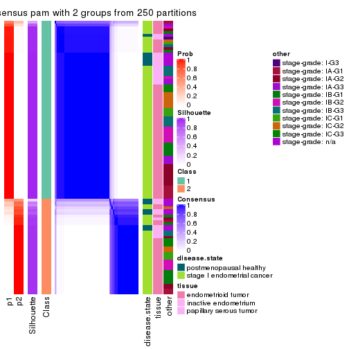</p>

</div>
<div id='tab-ATC-pam-consensus-heatmap-2'>
<pre><code class="r">consensus_heatmap(res, k = 3)
</code></pre>

<p>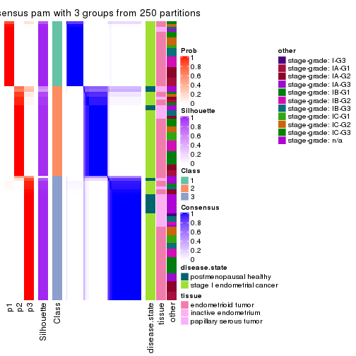</p>

</div>
<div id='tab-ATC-pam-consensus-heatmap-3'>
<pre><code class="r">consensus_heatmap(res, k = 4)
</code></pre>

<p>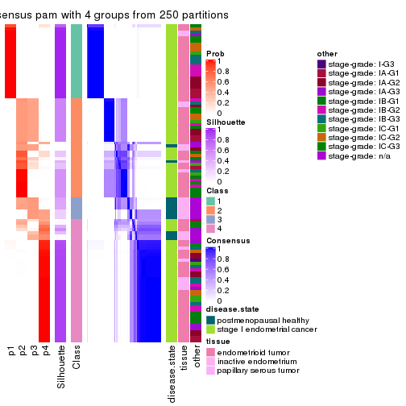</p>

</div>
<div id='tab-ATC-pam-consensus-heatmap-4'>
<pre><code class="r">consensus_heatmap(res, k = 5)
</code></pre>

<p>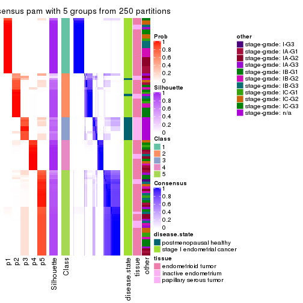</p>

</div>
<div id='tab-ATC-pam-consensus-heatmap-5'>
<pre><code class="r">consensus_heatmap(res, k = 6)
</code></pre>

<p>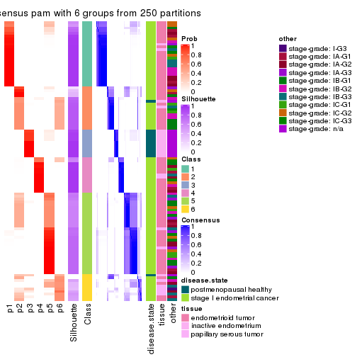</p>

</div>
</div>

Heatmaps for the membership of samples in all partitions to see how consistent they are:


<script>
$( function() {
	$( '#tabs-ATC-pam-membership-heatmap' ).tabs();
} );
</script>
<div id='tabs-ATC-pam-membership-heatmap'>
<ul>
<li><a href='#tab-ATC-pam-membership-heatmap-1'>k = 2</a></li>
<li><a href='#tab-ATC-pam-membership-heatmap-2'>k = 3</a></li>
<li><a href='#tab-ATC-pam-membership-heatmap-3'>k = 4</a></li>
<li><a href='#tab-ATC-pam-membership-heatmap-4'>k = 5</a></li>
<li><a href='#tab-ATC-pam-membership-heatmap-5'>k = 6</a></li>
</ul>
<div id='tab-ATC-pam-membership-heatmap-1'>
<pre><code class="r">membership_heatmap(res, k = 2)
</code></pre>

<p>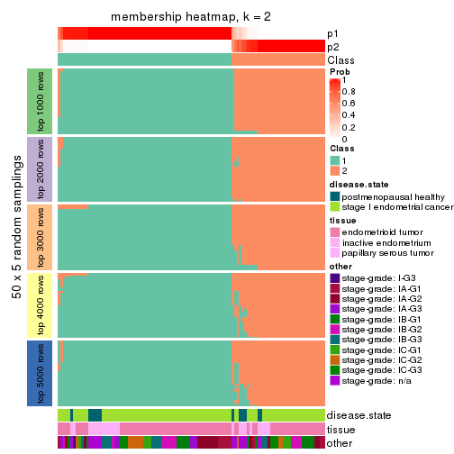</p>

</div>
<div id='tab-ATC-pam-membership-heatmap-2'>
<pre><code class="r">membership_heatmap(res, k = 3)
</code></pre>

<p>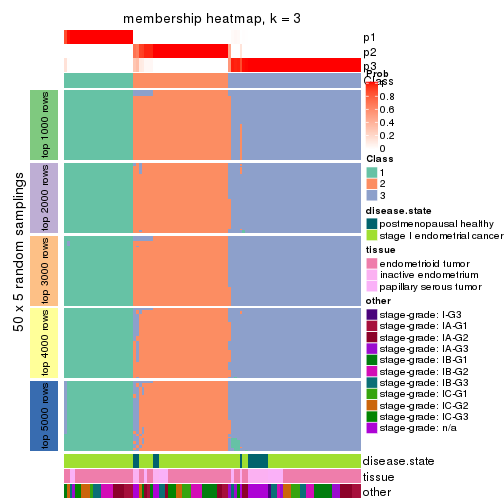</p>

</div>
<div id='tab-ATC-pam-membership-heatmap-3'>
<pre><code class="r">membership_heatmap(res, k = 4)
</code></pre>

<p>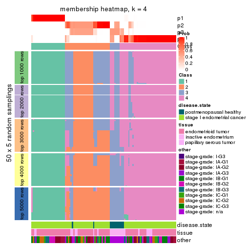</p>

</div>
<div id='tab-ATC-pam-membership-heatmap-4'>
<pre><code class="r">membership_heatmap(res, k = 5)
</code></pre>

<p>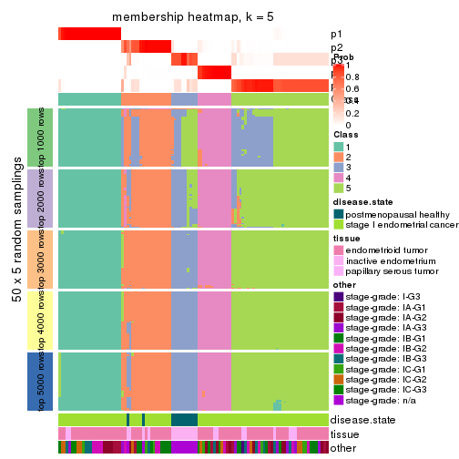</p>

</div>
<div id='tab-ATC-pam-membership-heatmap-5'>
<pre><code class="r">membership_heatmap(res, k = 6)
</code></pre>

<p>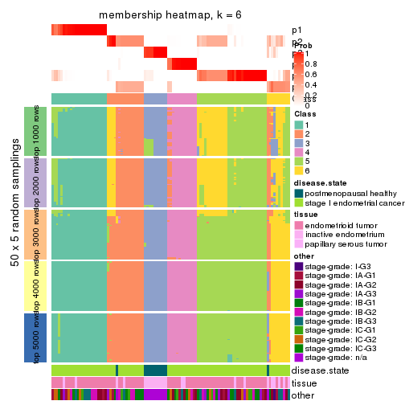</p>

</div>
</div>

As soon as we have had the classes for columns, we can look for signatures
which are significantly different between classes which can be candidate marks
for certain classes. Following are the heatmaps for signatures.


Signature heatmaps where rows are scaled:


<script>
$( function() {
	$( '#tabs-ATC-pam-get-signatures' ).tabs();
} );
</script>
<div id='tabs-ATC-pam-get-signatures'>
<ul>
<li><a href='#tab-ATC-pam-get-signatures-1'>k = 2</a></li>
<li><a href='#tab-ATC-pam-get-signatures-2'>k = 3</a></li>
<li><a href='#tab-ATC-pam-get-signatures-3'>k = 4</a></li>
<li><a href='#tab-ATC-pam-get-signatures-4'>k = 5</a></li>
<li><a href='#tab-ATC-pam-get-signatures-5'>k = 6</a></li>
</ul>
<div id='tab-ATC-pam-get-signatures-1'>
<pre><code class="r">get_signatures(res, k = 2)
</code></pre>

<p>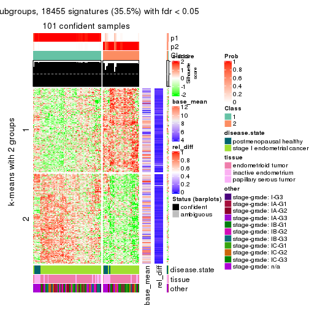</p>

</div>
<div id='tab-ATC-pam-get-signatures-2'>
<pre><code class="r">get_signatures(res, k = 3)
</code></pre>

<p>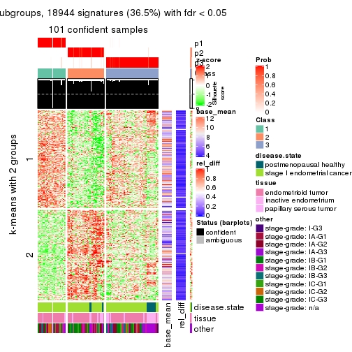</p>

</div>
<div id='tab-ATC-pam-get-signatures-3'>
<pre><code class="r">get_signatures(res, k = 4)
</code></pre>

<p>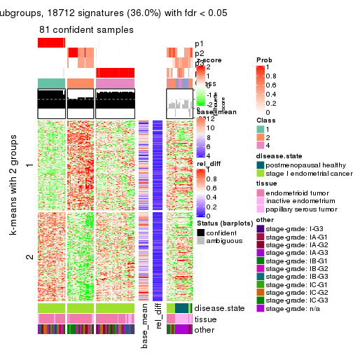</p>

</div>
<div id='tab-ATC-pam-get-signatures-4'>
<pre><code class="r">get_signatures(res, k = 5)
</code></pre>

<p>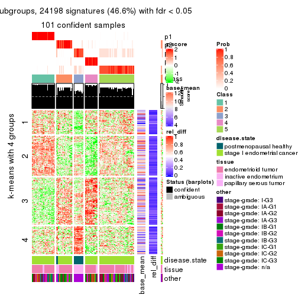</p>

</div>
<div id='tab-ATC-pam-get-signatures-5'>
<pre><code class="r">get_signatures(res, k = 6)
</code></pre>

<p>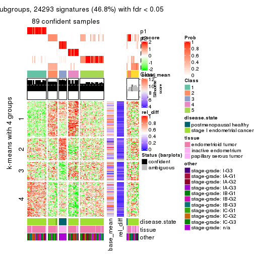</p>

</div>
</div>


Signature heatmaps where rows are not scaled:


<script>
$( function() {
	$( '#tabs-ATC-pam-get-signatures-no-scale' ).tabs();
} );
</script>
<div id='tabs-ATC-pam-get-signatures-no-scale'>
<ul>
<li><a href='#tab-ATC-pam-get-signatures-no-scale-1'>k = 2</a></li>
<li><a href='#tab-ATC-pam-get-signatures-no-scale-2'>k = 3</a></li>
<li><a href='#tab-ATC-pam-get-signatures-no-scale-3'>k = 4</a></li>
<li><a href='#tab-ATC-pam-get-signatures-no-scale-4'>k = 5</a></li>
<li><a href='#tab-ATC-pam-get-signatures-no-scale-5'>k = 6</a></li>
</ul>
<div id='tab-ATC-pam-get-signatures-no-scale-1'>
<pre><code class="r">get_signatures(res, k = 2, scale_rows = FALSE)
</code></pre>

<p>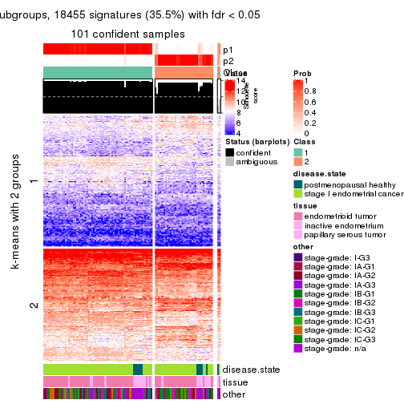</p>

</div>
<div id='tab-ATC-pam-get-signatures-no-scale-2'>
<pre><code class="r">get_signatures(res, k = 3, scale_rows = FALSE)
</code></pre>

<p>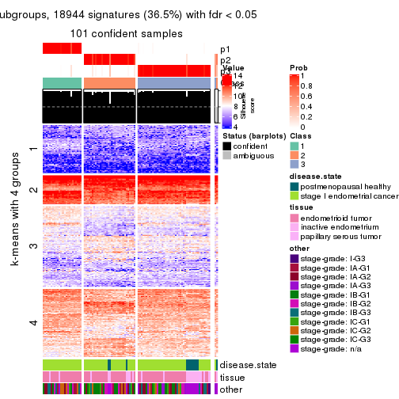</p>

</div>
<div id='tab-ATC-pam-get-signatures-no-scale-3'>
<pre><code class="r">get_signatures(res, k = 4, scale_rows = FALSE)
</code></pre>

<p>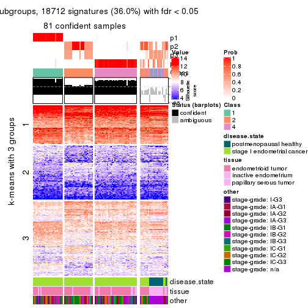</p>

</div>
<div id='tab-ATC-pam-get-signatures-no-scale-4'>
<pre><code class="r">get_signatures(res, k = 5, scale_rows = FALSE)
</code></pre>

<p>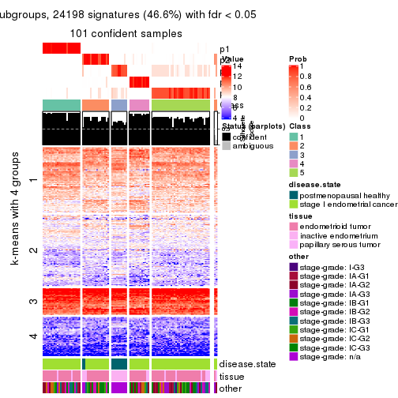</p>

</div>
<div id='tab-ATC-pam-get-signatures-no-scale-5'>
<pre><code class="r">get_signatures(res, k = 6, scale_rows = FALSE)
</code></pre>

<p>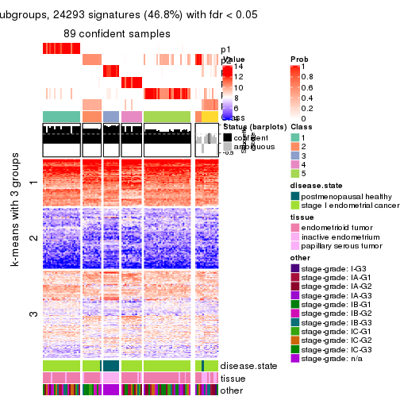</p>

</div>
</div>


Compare the overlap of signatures from different k:

```r
compare_signatures(res)
```

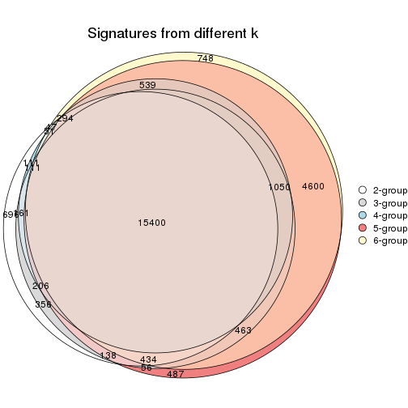

`get_signature()` returns a data frame invisibly. TO get the list of signatures, the function
call should be assigned to a variable explicitly. In following code, if `plot` argument is set
to `FALSE`, no heatmap is plotted while only the differential analysis is performed.

```r
# code only for demonstration
tb = get_signature(res, k = ..., plot = FALSE)
```

An example of the output of `tb` is:

```
#>   which_row         fdr    mean_1    mean_2 scaled_mean_1 scaled_mean_2 km
#> 1        38 0.042760348  8.373488  9.131774    -0.5533452     0.5164555  1
#> 2        40 0.018707592  7.106213  8.469186    -0.6173731     0.5762149  1
#> 3        55 0.019134737 10.221463 11.207825    -0.6159697     0.5749050  1
#> 4        59 0.006059896  5.921854  7.869574    -0.6899429     0.6439467  1
#> 5        60 0.018055526  8.928898 10.211722    -0.6204761     0.5791110  1
#> 6        98 0.009384629 15.714769 14.887706     0.6635654    -0.6193277  2
...
```

The columns in `tb` are:

1. `which_row`: row indices corresponding to the input matrix.
2. `fdr`: FDR for the differential test. 
3. `mean_x`: The mean value in group x.
4. `scaled_mean_x`: The mean value in group x after rows are scaled.
5. `km`: Row groups if k-means clustering is applied to rows.


UMAP plot which shows how samples are separated.


<script>
$( function() {
	$( '#tabs-ATC-pam-dimension-reduction' ).tabs();
} );
</script>
<div id='tabs-ATC-pam-dimension-reduction'>
<ul>
<li><a href='#tab-ATC-pam-dimension-reduction-1'>k = 2</a></li>
<li><a href='#tab-ATC-pam-dimension-reduction-2'>k = 3</a></li>
<li><a href='#tab-ATC-pam-dimension-reduction-3'>k = 4</a></li>
<li><a href='#tab-ATC-pam-dimension-reduction-4'>k = 5</a></li>
<li><a href='#tab-ATC-pam-dimension-reduction-5'>k = 6</a></li>
</ul>
<div id='tab-ATC-pam-dimension-reduction-1'>
<pre><code class="r">dimension_reduction(res, k = 2, method = &quot;UMAP&quot;)
</code></pre>

<p>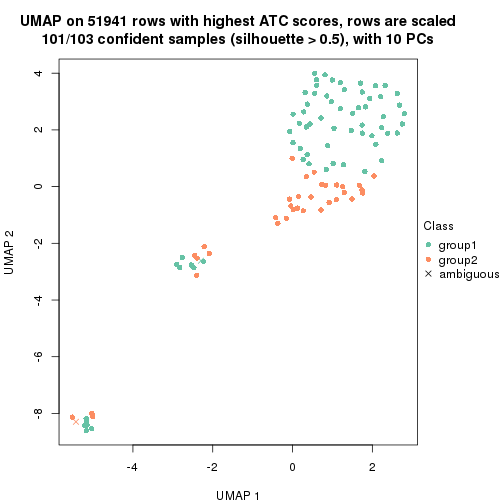</p>

</div>
<div id='tab-ATC-pam-dimension-reduction-2'>
<pre><code class="r">dimension_reduction(res, k = 3, method = &quot;UMAP&quot;)
</code></pre>

<p>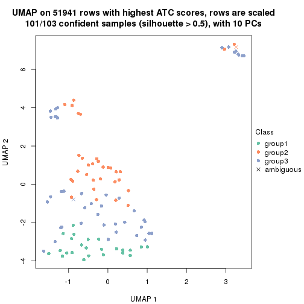</p>

</div>
<div id='tab-ATC-pam-dimension-reduction-3'>
<pre><code class="r">dimension_reduction(res, k = 4, method = &quot;UMAP&quot;)
</code></pre>

<p>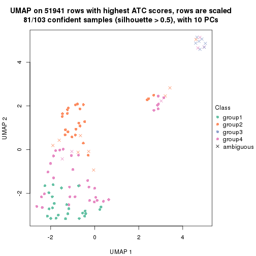</p>

</div>
<div id='tab-ATC-pam-dimension-reduction-4'>
<pre><code class="r">dimension_reduction(res, k = 5, method = &quot;UMAP&quot;)
</code></pre>

<p>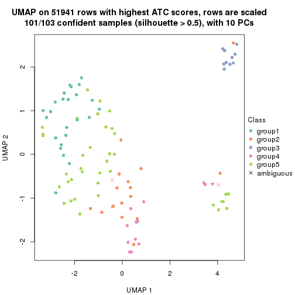</p>

</div>
<div id='tab-ATC-pam-dimension-reduction-5'>
<pre><code class="r">dimension_reduction(res, k = 6, method = &quot;UMAP&quot;)
</code></pre>

<p>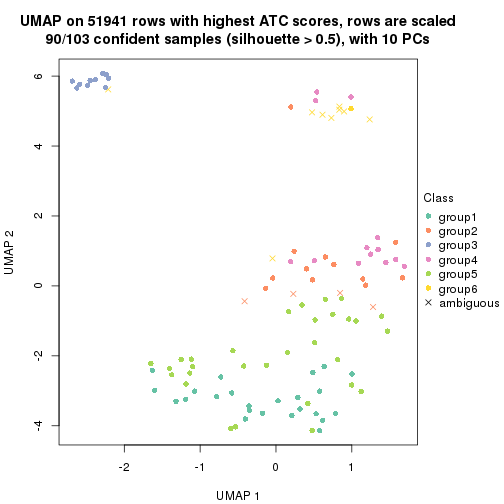</p>

</div>
</div>


Following heatmap shows how subgroups are split when increasing `k`:

```r
collect_classes(res)
```

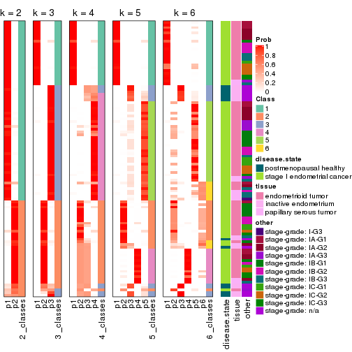


Test correlation between subgroups and known annotations. If the known
annotation is numeric, one-way ANOVA test is applied, and if the known
annotation is discrete, chi-squared contingency table test is applied.

```r
test_to_known_factors(res)
```

```
#>           n disease.state(p) tissue(p) other(p) k
#> ATC:pam 101         6.44e-01  7.28e-01 7.85e-01 2
#> ATC:pam 101         7.40e-02  1.96e-01 4.52e-01 3
#> ATC:pam  81               NA  5.92e-01 7.25e-01 4
#> ATC:pam 101         2.30e-17  3.45e-15 1.29e-08 5
#> ATC:pam  90         4.16e-16  1.65e-15 1.83e-08 6
```


If matrix rows can be associated to genes, consider to use `functional_enrichment(res,
...)` to perform function enrichment for the signature genes. See [this vignette](http://bioconductor.org/packages/devel/bioc/vignettes/cola/inst/doc/functional_enrichment.html) for more detailed explanations.


 

---------------------------------------------------


### ATC:mclust**


The object with results only for a single top-value method and a single partition method 
can be extracted as:

```r
res = res_list["ATC", "mclust"]
# you can also extract it by
# res = res_list["ATC:mclust"]
```

A summary of `res` and all the functions that can be applied to it:

```r
res
```

```
#> A 'ConsensusPartition' object with k = 2, 3, 4, 5, 6.
#>   On a matrix with 51941 rows and 103 columns.
#>   Top rows (1000, 2000, 3000, 4000, 5000) are extracted by 'ATC' method.
#>   Subgroups are detected by 'mclust' method.
#>   Performed in total 1250 partitions by row resampling.
#>   Best k for subgroups seems to be 3.
#> 
#> Following methods can be applied to this 'ConsensusPartition' object:
#>  [1] "cola_report"             "collect_classes"         "collect_plots"          
#>  [4] "collect_stats"           "colnames"                "compare_signatures"     
#>  [7] "consensus_heatmap"       "dimension_reduction"     "functional_enrichment"  
#> [10] "get_anno_col"            "get_anno"                "get_classes"            
#> [13] "get_consensus"           "get_matrix"              "get_membership"         
#> [16] "get_param"               "get_signatures"          "get_stats"              
#> [19] "is_best_k"               "is_stable_k"             "membership_heatmap"     
#> [22] "ncol"                    "nrow"                    "plot_ecdf"              
#> [25] "rownames"                "select_partition_number" "show"                   
#> [28] "suggest_best_k"          "test_to_known_factors"
```

`collect_plots()` function collects all the plots made from `res` for all `k` (number of partitions)
into one single page to provide an easy and fast comparison between different `k`.

```r
collect_plots(res)
```

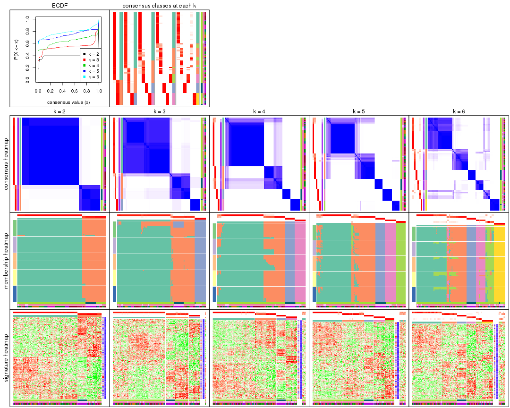

The plots are:

- The first row: a plot of the ECDF (empirical cumulative distribution
  function) curves of the consensus matrix for each `k` and the heatmap of
  predicted classes for each `k`.
- The second row: heatmaps of the consensus matrix for each `k`.
- The third row: heatmaps of the membership matrix for each `k`.
- The fouth row: heatmaps of the signatures for each `k`.

All the plots in panels can be made by individual functions and they are
plotted later in this section.

`select_partition_number()` produces several plots showing different
statistics for choosing "optimized" `k`. There are following statistics:

- ECDF curves of the consensus matrix for each `k`;
- 1-PAC. [The PAC
  score](https://en.wikipedia.org/wiki/Consensus_clustering#Over-interpretation_potential_of_consensus_clustering)
  measures the proportion of the ambiguous subgrouping.
- Mean silhouette score.
- Concordance. The mean probability of fiting the consensus class ids in all
  partitions.
- Area increased. Denote $A_k$ as the area under the ECDF curve for current
  `k`, the area increased is defined as $A_k - A_{k-1}$.
- Rand index. The percent of pairs of samples that are both in a same cluster
  or both are not in a same cluster in the partition of k and k-1.
- Jaccard index. The ratio of pairs of samples are both in a same cluster in
  the partition of k and k-1 and the pairs of samples are both in a same
  cluster in the partition k or k-1.

The detailed explanations of these statistics can be found in [the _cola_
vignette](http://bioconductor.org/packages/devel/bioc/vignettes/cola/inst/doc/cola.html#toc_13).

Generally speaking, lower PAC score, higher mean silhouette score or higher
concordance corresponds to better partition. Rand index and Jaccard index
measure how similar the current partition is compared to partition with `k-1`.
If they are too similar, we won't accept `k` is better than `k-1`.

```r
select_partition_number(res)
```

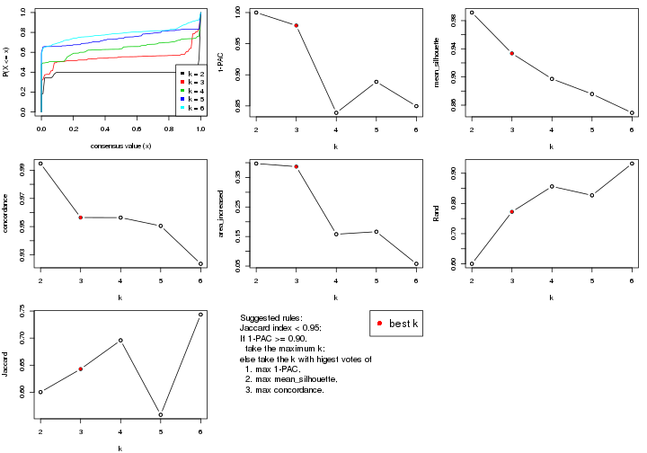

The numeric values for all these statistics can be obtained by `get_stats()`.

```r
get_stats(res)
```

```
#>   k 1-PAC mean_silhouette concordance area_increased  Rand Jaccard
#> 2 2 1.000           0.991       0.995         0.3972 0.600   0.600
#> 3 3 0.979           0.933       0.956         0.3868 0.772   0.643
#> 4 4 0.839           0.897       0.956         0.1579 0.856   0.696
#> 5 5 0.889           0.876       0.950         0.1664 0.827   0.558
#> 6 6 0.850           0.849       0.924         0.0576 0.932   0.744
```

`suggest_best_k()` suggests the best $k$ based on these statistics. The rules are as follows:

- All $k$ with Jaccard index larger than 0.95 are removed because increasing
  $k$ does not provide enough extra information. If all $k$ are removed, it is
  marked as no subgroup is detected.
- For all $k$ with 1-PAC score larger than 0.9, the maximal $k$ is taken as
  the best $k$, and other $k$ are marked as optional $k$.
- If it does not fit the second rule. The $k$ with the maximal vote of the
  highest 1-PAC score, highest mean silhouette, and highest concordance is
  taken as the best $k$.

```r
suggest_best_k(res)
```

```
#> [1] 3
#> attr(,"optional")
#> [1] 2
```

There is also optional best $k$ = 2 that is worth to check.

Following shows the table of the partitions (You need to click the **show/hide
code output** link to see it). The membership matrix (columns with name `p*`)
is inferred by
[`clue::cl_consensus()`](https://www.rdocumentation.org/link/cl_consensus?package=clue)
function with the `SE` method. Basically the value in the membership matrix
represents the probability to belong to a certain group. The finall class
label for an item is determined with the group with highest probability it
belongs to.

In `get_classes()` function, the entropy is calculated from the membership
matrix and the silhouette score is calculated from the consensus matrix.


<script>
$( function() {
	$( '#tabs-ATC-mclust-get-classes' ).tabs();
} );
</script>
<div id='tabs-ATC-mclust-get-classes'>
<ul>
<li><a href='#tab-ATC-mclust-get-classes-1'>k = 2</a></li>
<li><a href='#tab-ATC-mclust-get-classes-2'>k = 3</a></li>
<li><a href='#tab-ATC-mclust-get-classes-3'>k = 4</a></li>
<li><a href='#tab-ATC-mclust-get-classes-4'>k = 5</a></li>
<li><a href='#tab-ATC-mclust-get-classes-5'>k = 6</a></li>
</ul>

<div id='tab-ATC-mclust-get-classes-1'>
<p><a id='tab-ATC-mclust-get-classes-1-a' style='color:#0366d6' href='#'>show/hide code output</a></p>
<pre><code class="r">cbind(get_classes(res, k = 2), get_membership(res, k = 2))
</code></pre>

<pre><code>#&gt;           class entropy silhouette    p1    p2
#&gt; GSM425907     2  0.4022      0.924 0.080 0.920
#&gt; GSM425908     1  0.0938      0.989 0.988 0.012
#&gt; GSM425909     1  0.0000      0.999 1.000 0.000
#&gt; GSM425910     1  0.0000      0.999 1.000 0.000
#&gt; GSM425911     1  0.0000      0.999 1.000 0.000
#&gt; GSM425912     1  0.0000      0.999 1.000 0.000
#&gt; GSM425913     2  0.0000      0.984 0.000 1.000
#&gt; GSM425914     1  0.0000      0.999 1.000 0.000
#&gt; GSM425915     1  0.0000      0.999 1.000 0.000
#&gt; GSM425874     1  0.0938      0.989 0.988 0.012
#&gt; GSM425875     1  0.0000      0.999 1.000 0.000
#&gt; GSM425876     1  0.0000      0.999 1.000 0.000
#&gt; GSM425877     1  0.0000      0.999 1.000 0.000
#&gt; GSM425878     1  0.0000      0.999 1.000 0.000
#&gt; GSM425879     1  0.0000      0.999 1.000 0.000
#&gt; GSM425880     1  0.0000      0.999 1.000 0.000
#&gt; GSM425881     1  0.0000      0.999 1.000 0.000
#&gt; GSM425882     1  0.0000      0.999 1.000 0.000
#&gt; GSM425883     2  0.0000      0.984 0.000 1.000
#&gt; GSM425884     1  0.0000      0.999 1.000 0.000
#&gt; GSM425885     2  0.4161      0.920 0.084 0.916
#&gt; GSM425848     1  0.0000      0.999 1.000 0.000
#&gt; GSM425849     1  0.0000      0.999 1.000 0.000
#&gt; GSM425850     1  0.0000      0.999 1.000 0.000
#&gt; GSM425851     1  0.0000      0.999 1.000 0.000
#&gt; GSM425852     1  0.0000      0.999 1.000 0.000
#&gt; GSM425893     1  0.0000      0.999 1.000 0.000
#&gt; GSM425894     1  0.0000      0.999 1.000 0.000
#&gt; GSM425895     1  0.0000      0.999 1.000 0.000
#&gt; GSM425896     1  0.0938      0.989 0.988 0.012
#&gt; GSM425897     2  0.0000      0.984 0.000 1.000
#&gt; GSM425898     1  0.0000      0.999 1.000 0.000
#&gt; GSM425899     1  0.0000      0.999 1.000 0.000
#&gt; GSM425900     1  0.0000      0.999 1.000 0.000
#&gt; GSM425901     1  0.0000      0.999 1.000 0.000
#&gt; GSM425902     1  0.0000      0.999 1.000 0.000
#&gt; GSM425903     1  0.0000      0.999 1.000 0.000
#&gt; GSM425904     1  0.0000      0.999 1.000 0.000
#&gt; GSM425905     1  0.0672      0.992 0.992 0.008
#&gt; GSM425906     1  0.0000      0.999 1.000 0.000
#&gt; GSM425863     1  0.0000      0.999 1.000 0.000
#&gt; GSM425864     1  0.0000      0.999 1.000 0.000
#&gt; GSM425865     1  0.0000      0.999 1.000 0.000
#&gt; GSM425866     1  0.0000      0.999 1.000 0.000
#&gt; GSM425867     1  0.0000      0.999 1.000 0.000
#&gt; GSM425868     2  0.3431      0.939 0.064 0.936
#&gt; GSM425869     1  0.0938      0.989 0.988 0.012
#&gt; GSM425870     1  0.0000      0.999 1.000 0.000
#&gt; GSM425871     1  0.0000      0.999 1.000 0.000
#&gt; GSM425872     1  0.0000      0.999 1.000 0.000
#&gt; GSM425873     1  0.0000      0.999 1.000 0.000
#&gt; GSM425843     1  0.0000      0.999 1.000 0.000
#&gt; GSM425844     2  0.0000      0.984 0.000 1.000
#&gt; GSM425845     1  0.0000      0.999 1.000 0.000
#&gt; GSM425846     1  0.0000      0.999 1.000 0.000
#&gt; GSM425847     1  0.0000      0.999 1.000 0.000
#&gt; GSM425886     1  0.0000      0.999 1.000 0.000
#&gt; GSM425887     1  0.0000      0.999 1.000 0.000
#&gt; GSM425888     1  0.0000      0.999 1.000 0.000
#&gt; GSM425889     1  0.0000      0.999 1.000 0.000
#&gt; GSM425890     2  0.0000      0.984 0.000 1.000
#&gt; GSM425891     1  0.0000      0.999 1.000 0.000
#&gt; GSM425892     1  0.0000      0.999 1.000 0.000
#&gt; GSM425853     1  0.0000      0.999 1.000 0.000
#&gt; GSM425854     1  0.0000      0.999 1.000 0.000
#&gt; GSM425855     1  0.0000      0.999 1.000 0.000
#&gt; GSM425856     1  0.0000      0.999 1.000 0.000
#&gt; GSM425857     2  0.4022      0.924 0.080 0.920
#&gt; GSM425858     1  0.0000      0.999 1.000 0.000
#&gt; GSM425859     1  0.0938      0.989 0.988 0.012
#&gt; GSM425860     1  0.0000      0.999 1.000 0.000
#&gt; GSM425861     1  0.0000      0.999 1.000 0.000
#&gt; GSM425862     1  0.0000      0.999 1.000 0.000
#&gt; GSM425837     1  0.0000      0.999 1.000 0.000
#&gt; GSM425838     1  0.0938      0.989 0.988 0.012
#&gt; GSM425839     1  0.0000      0.999 1.000 0.000
#&gt; GSM425840     1  0.0000      0.999 1.000 0.000
#&gt; GSM425841     1  0.0938      0.989 0.988 0.012
#&gt; GSM425842     1  0.0000      0.999 1.000 0.000
#&gt; GSM425917     2  0.0000      0.984 0.000 1.000
#&gt; GSM425922     2  0.0000      0.984 0.000 1.000
#&gt; GSM425919     1  0.0000      0.999 1.000 0.000
#&gt; GSM425920     1  0.0000      0.999 1.000 0.000
#&gt; GSM425923     2  0.0000      0.984 0.000 1.000
#&gt; GSM425916     2  0.0000      0.984 0.000 1.000
#&gt; GSM425918     2  0.0000      0.984 0.000 1.000
#&gt; GSM425921     2  0.0000      0.984 0.000 1.000
#&gt; GSM425925     1  0.0000      0.999 1.000 0.000
#&gt; GSM425926     1  0.0938      0.989 0.988 0.012
#&gt; GSM425927     1  0.0000      0.999 1.000 0.000
#&gt; GSM425924     2  0.0000      0.984 0.000 1.000
#&gt; GSM425928     2  0.0000      0.984 0.000 1.000
#&gt; GSM425929     2  0.0938      0.983 0.012 0.988
#&gt; GSM425930     2  0.0938      0.983 0.012 0.988
#&gt; GSM425931     2  0.0938      0.983 0.012 0.988
#&gt; GSM425932     2  0.0938      0.983 0.012 0.988
#&gt; GSM425933     2  0.0938      0.983 0.012 0.988
#&gt; GSM425934     2  0.0938      0.983 0.012 0.988
#&gt; GSM425935     2  0.0938      0.983 0.012 0.988
#&gt; GSM425936     2  0.0938      0.983 0.012 0.988
#&gt; GSM425937     2  0.0938      0.983 0.012 0.988
#&gt; GSM425938     2  0.0938      0.983 0.012 0.988
#&gt; GSM425939     2  0.0938      0.983 0.012 0.988
</code></pre>

<script>
$('#tab-ATC-mclust-get-classes-1-a').parent().next().next().hide();
$('#tab-ATC-mclust-get-classes-1-a').click(function(){
  $('#tab-ATC-mclust-get-classes-1-a').parent().next().next().toggle();
  return(false);
});
</script>
</div>

<div id='tab-ATC-mclust-get-classes-2'>
<p><a id='tab-ATC-mclust-get-classes-2-a' style='color:#0366d6' href='#'>show/hide code output</a></p>
<pre><code class="r">cbind(get_classes(res, k = 3), get_membership(res, k = 3))
</code></pre>

<pre><code>#&gt;           class entropy silhouette    p1    p2    p3
#&gt; GSM425907     2  0.1289      0.888 0.032 0.968 0.000
#&gt; GSM425908     2  0.1643      0.888 0.044 0.956 0.000
#&gt; GSM425909     1  0.1753      0.960 0.952 0.048 0.000
#&gt; GSM425910     1  0.1163      0.963 0.972 0.028 0.000
#&gt; GSM425911     1  0.1163      0.971 0.972 0.028 0.000
#&gt; GSM425912     1  0.1163      0.963 0.972 0.028 0.000
#&gt; GSM425913     3  0.0000      1.000 0.000 0.000 1.000
#&gt; GSM425914     1  0.1163      0.963 0.972 0.028 0.000
#&gt; GSM425915     1  0.1163      0.971 0.972 0.028 0.000
#&gt; GSM425874     2  0.1643      0.888 0.044 0.956 0.000
#&gt; GSM425875     1  0.1163      0.971 0.972 0.028 0.000
#&gt; GSM425876     1  0.1163      0.963 0.972 0.028 0.000
#&gt; GSM425877     1  0.1163      0.963 0.972 0.028 0.000
#&gt; GSM425878     1  0.1163      0.971 0.972 0.028 0.000
#&gt; GSM425879     1  0.1163      0.971 0.972 0.028 0.000
#&gt; GSM425880     1  0.1163      0.971 0.972 0.028 0.000
#&gt; GSM425881     1  0.1163      0.963 0.972 0.028 0.000
#&gt; GSM425882     1  0.1163      0.971 0.972 0.028 0.000
#&gt; GSM425883     3  0.0000      1.000 0.000 0.000 1.000
#&gt; GSM425884     1  0.1163      0.963 0.972 0.028 0.000
#&gt; GSM425885     2  0.1289      0.888 0.032 0.968 0.000
#&gt; GSM425848     1  0.1289      0.969 0.968 0.032 0.000
#&gt; GSM425849     1  0.1163      0.971 0.972 0.028 0.000
#&gt; GSM425850     1  0.0424      0.970 0.992 0.008 0.000
#&gt; GSM425851     1  0.1163      0.971 0.972 0.028 0.000
#&gt; GSM425852     1  0.1163      0.971 0.972 0.028 0.000
#&gt; GSM425893     1  0.1482      0.968 0.968 0.020 0.012
#&gt; GSM425894     2  0.5178      0.630 0.256 0.744 0.000
#&gt; GSM425895     1  0.1163      0.971 0.972 0.028 0.000
#&gt; GSM425896     2  0.3412      0.805 0.124 0.876 0.000
#&gt; GSM425897     3  0.0000      1.000 0.000 0.000 1.000
#&gt; GSM425898     1  0.1529      0.965 0.960 0.040 0.000
#&gt; GSM425899     1  0.1163      0.971 0.972 0.028 0.000
#&gt; GSM425900     1  0.1163      0.971 0.972 0.028 0.000
#&gt; GSM425901     1  0.2261      0.944 0.932 0.068 0.000
#&gt; GSM425902     1  0.1753      0.960 0.952 0.048 0.000
#&gt; GSM425903     1  0.1163      0.963 0.972 0.028 0.000
#&gt; GSM425904     1  0.1163      0.971 0.972 0.028 0.000
#&gt; GSM425905     2  0.1860      0.882 0.052 0.948 0.000
#&gt; GSM425906     1  0.1964      0.945 0.944 0.000 0.056
#&gt; GSM425863     1  0.1163      0.963 0.972 0.028 0.000
#&gt; GSM425864     2  0.1643      0.888 0.044 0.956 0.000
#&gt; GSM425865     2  0.1643      0.888 0.044 0.956 0.000
#&gt; GSM425866     1  0.0592      0.970 0.988 0.012 0.000
#&gt; GSM425867     1  0.1163      0.963 0.972 0.028 0.000
#&gt; GSM425868     2  0.2537      0.875 0.000 0.920 0.080
#&gt; GSM425869     2  0.1643      0.888 0.044 0.956 0.000
#&gt; GSM425870     1  0.1163      0.963 0.972 0.028 0.000
#&gt; GSM425871     1  0.1163      0.971 0.972 0.028 0.000
#&gt; GSM425872     1  0.1163      0.971 0.972 0.028 0.000
#&gt; GSM425873     1  0.1163      0.963 0.972 0.028 0.000
#&gt; GSM425843     1  0.1163      0.963 0.972 0.028 0.000
#&gt; GSM425844     3  0.0000      1.000 0.000 0.000 1.000
#&gt; GSM425845     1  0.1163      0.963 0.972 0.028 0.000
#&gt; GSM425846     1  0.1163      0.971 0.972 0.028 0.000
#&gt; GSM425847     1  0.1163      0.963 0.972 0.028 0.000
#&gt; GSM425886     1  0.2959      0.910 0.900 0.100 0.000
#&gt; GSM425887     1  0.1163      0.971 0.972 0.028 0.000
#&gt; GSM425888     1  0.1163      0.963 0.972 0.028 0.000
#&gt; GSM425889     1  0.1163      0.971 0.972 0.028 0.000
#&gt; GSM425890     3  0.0000      1.000 0.000 0.000 1.000
#&gt; GSM425891     1  0.1163      0.971 0.972 0.028 0.000
#&gt; GSM425892     2  0.6260      0.226 0.448 0.552 0.000
#&gt; GSM425853     1  0.1163      0.971 0.972 0.028 0.000
#&gt; GSM425854     1  0.1163      0.971 0.972 0.028 0.000
#&gt; GSM425855     1  0.0424      0.970 0.992 0.008 0.000
#&gt; GSM425856     1  0.1163      0.971 0.972 0.028 0.000
#&gt; GSM425857     2  0.1289      0.888 0.032 0.968 0.000
#&gt; GSM425858     1  0.1163      0.963 0.972 0.028 0.000
#&gt; GSM425859     2  0.1643      0.888 0.044 0.956 0.000
#&gt; GSM425860     1  0.1163      0.963 0.972 0.028 0.000
#&gt; GSM425861     1  0.1163      0.963 0.972 0.028 0.000
#&gt; GSM425862     1  0.1163      0.971 0.972 0.028 0.000
#&gt; GSM425837     1  0.1163      0.963 0.972 0.028 0.000
#&gt; GSM425838     2  0.1643      0.888 0.044 0.956 0.000
#&gt; GSM425839     2  0.5706      0.539 0.320 0.680 0.000
#&gt; GSM425840     1  0.1163      0.971 0.972 0.028 0.000
#&gt; GSM425841     2  0.1643      0.888 0.044 0.956 0.000
#&gt; GSM425842     1  0.1163      0.963 0.972 0.028 0.000
#&gt; GSM425917     3  0.0000      1.000 0.000 0.000 1.000
#&gt; GSM425922     3  0.0000      1.000 0.000 0.000 1.000
#&gt; GSM425919     1  0.1163      0.963 0.972 0.028 0.000
#&gt; GSM425920     1  0.1964      0.945 0.944 0.000 0.056
#&gt; GSM425923     3  0.0000      1.000 0.000 0.000 1.000
#&gt; GSM425916     3  0.0000      1.000 0.000 0.000 1.000
#&gt; GSM425918     3  0.0000      1.000 0.000 0.000 1.000
#&gt; GSM425921     3  0.0000      1.000 0.000 0.000 1.000
#&gt; GSM425925     1  0.1163      0.971 0.972 0.028 0.000
#&gt; GSM425926     1  0.2959      0.910 0.900 0.100 0.000
#&gt; GSM425927     1  0.1163      0.963 0.972 0.028 0.000
#&gt; GSM425924     3  0.0000      1.000 0.000 0.000 1.000
#&gt; GSM425928     3  0.0000      1.000 0.000 0.000 1.000
#&gt; GSM425929     2  0.2448      0.876 0.000 0.924 0.076
#&gt; GSM425930     2  0.2448      0.876 0.000 0.924 0.076
#&gt; GSM425931     2  0.2448      0.876 0.000 0.924 0.076
#&gt; GSM425932     2  0.2448      0.876 0.000 0.924 0.076
#&gt; GSM425933     2  0.2448      0.876 0.000 0.924 0.076
#&gt; GSM425934     2  0.2448      0.876 0.000 0.924 0.076
#&gt; GSM425935     2  0.2448      0.876 0.000 0.924 0.076
#&gt; GSM425936     2  0.2448      0.876 0.000 0.924 0.076
#&gt; GSM425937     2  0.2448      0.876 0.000 0.924 0.076
#&gt; GSM425938     2  0.2448      0.876 0.000 0.924 0.076
#&gt; GSM425939     2  0.2448      0.876 0.000 0.924 0.076
</code></pre>

<script>
$('#tab-ATC-mclust-get-classes-2-a').parent().next().next().hide();
$('#tab-ATC-mclust-get-classes-2-a').click(function(){
  $('#tab-ATC-mclust-get-classes-2-a').parent().next().next().toggle();
  return(false);
});
</script>
</div>

<div id='tab-ATC-mclust-get-classes-3'>
<p><a id='tab-ATC-mclust-get-classes-3-a' style='color:#0366d6' href='#'>show/hide code output</a></p>
<pre><code class="r">cbind(get_classes(res, k = 4), get_membership(res, k = 4))
</code></pre>

<pre><code>#&gt;           class entropy silhouette    p1    p2 p3 p4
#&gt; GSM425907     2  0.0000      0.854 0.000 1.000  0  0
#&gt; GSM425908     2  0.0000      0.854 0.000 1.000  0  0
#&gt; GSM425909     2  0.3942      0.773 0.236 0.764  0  0
#&gt; GSM425910     1  0.0000      0.953 1.000 0.000  0  0
#&gt; GSM425911     1  0.0336      0.946 0.992 0.008  0  0
#&gt; GSM425912     1  0.0000      0.953 1.000 0.000  0  0
#&gt; GSM425913     4  0.0000      1.000 0.000 0.000  0  1
#&gt; GSM425914     1  0.0000      0.953 1.000 0.000  0  0
#&gt; GSM425915     1  0.0000      0.953 1.000 0.000  0  0
#&gt; GSM425874     2  0.0000      0.854 0.000 1.000  0  0
#&gt; GSM425875     1  0.0000      0.953 1.000 0.000  0  0
#&gt; GSM425876     1  0.0000      0.953 1.000 0.000  0  0
#&gt; GSM425877     1  0.0000      0.953 1.000 0.000  0  0
#&gt; GSM425878     1  0.0000      0.953 1.000 0.000  0  0
#&gt; GSM425879     1  0.4776      0.312 0.624 0.376  0  0
#&gt; GSM425880     1  0.0000      0.953 1.000 0.000  0  0
#&gt; GSM425881     1  0.0000      0.953 1.000 0.000  0  0
#&gt; GSM425882     1  0.0000      0.953 1.000 0.000  0  0
#&gt; GSM425883     4  0.0000      1.000 0.000 0.000  0  1
#&gt; GSM425884     1  0.0000      0.953 1.000 0.000  0  0
#&gt; GSM425885     2  0.0000      0.854 0.000 1.000  0  0
#&gt; GSM425848     2  0.4277      0.719 0.280 0.720  0  0
#&gt; GSM425849     1  0.0000      0.953 1.000 0.000  0  0
#&gt; GSM425850     1  0.0000      0.953 1.000 0.000  0  0
#&gt; GSM425851     1  0.0921      0.927 0.972 0.028  0  0
#&gt; GSM425852     1  0.0000      0.953 1.000 0.000  0  0
#&gt; GSM425893     1  0.0921      0.927 0.972 0.028  0  0
#&gt; GSM425894     2  0.3024      0.851 0.148 0.852  0  0
#&gt; GSM425895     1  0.4999     -0.126 0.508 0.492  0  0
#&gt; GSM425896     2  0.1302      0.856 0.044 0.956  0  0
#&gt; GSM425897     4  0.0000      1.000 0.000 0.000  0  1
#&gt; GSM425898     2  0.3569      0.817 0.196 0.804  0  0
#&gt; GSM425899     1  0.2704      0.816 0.876 0.124  0  0
#&gt; GSM425900     1  0.0000      0.953 1.000 0.000  0  0
#&gt; GSM425901     2  0.3311      0.838 0.172 0.828  0  0
#&gt; GSM425902     2  0.3219      0.843 0.164 0.836  0  0
#&gt; GSM425903     1  0.0000      0.953 1.000 0.000  0  0
#&gt; GSM425904     1  0.0000      0.953 1.000 0.000  0  0
#&gt; GSM425905     2  0.0188      0.854 0.004 0.996  0  0
#&gt; GSM425906     1  0.0000      0.953 1.000 0.000  0  0
#&gt; GSM425863     1  0.0000      0.953 1.000 0.000  0  0
#&gt; GSM425864     2  0.3123      0.848 0.156 0.844  0  0
#&gt; GSM425865     2  0.3123      0.848 0.156 0.844  0  0
#&gt; GSM425866     1  0.0000      0.953 1.000 0.000  0  0
#&gt; GSM425867     1  0.0000      0.953 1.000 0.000  0  0
#&gt; GSM425868     2  0.0000      0.854 0.000 1.000  0  0
#&gt; GSM425869     2  0.0000      0.854 0.000 1.000  0  0
#&gt; GSM425870     1  0.0000      0.953 1.000 0.000  0  0
#&gt; GSM425871     1  0.0000      0.953 1.000 0.000  0  0
#&gt; GSM425872     1  0.4624      0.414 0.660 0.340  0  0
#&gt; GSM425873     1  0.0000      0.953 1.000 0.000  0  0
#&gt; GSM425843     1  0.0000      0.953 1.000 0.000  0  0
#&gt; GSM425844     4  0.0000      1.000 0.000 0.000  0  1
#&gt; GSM425845     1  0.0000      0.953 1.000 0.000  0  0
#&gt; GSM425846     1  0.0188      0.949 0.996 0.004  0  0
#&gt; GSM425847     1  0.0000      0.953 1.000 0.000  0  0
#&gt; GSM425886     2  0.3486      0.824 0.188 0.812  0  0
#&gt; GSM425887     1  0.0000      0.953 1.000 0.000  0  0
#&gt; GSM425888     1  0.0000      0.953 1.000 0.000  0  0
#&gt; GSM425889     1  0.0000      0.953 1.000 0.000  0  0
#&gt; GSM425890     4  0.0000      1.000 0.000 0.000  0  1
#&gt; GSM425891     1  0.4998     -0.110 0.512 0.488  0  0
#&gt; GSM425892     2  0.3123      0.848 0.156 0.844  0  0
#&gt; GSM425853     1  0.0000      0.953 1.000 0.000  0  0
#&gt; GSM425854     2  0.4304      0.712 0.284 0.716  0  0
#&gt; GSM425855     1  0.0000      0.953 1.000 0.000  0  0
#&gt; GSM425856     1  0.0000      0.953 1.000 0.000  0  0
#&gt; GSM425857     2  0.0000      0.854 0.000 1.000  0  0
#&gt; GSM425858     1  0.0000      0.953 1.000 0.000  0  0
#&gt; GSM425859     2  0.0000      0.854 0.000 1.000  0  0
#&gt; GSM425860     1  0.0000      0.953 1.000 0.000  0  0
#&gt; GSM425861     1  0.0000      0.953 1.000 0.000  0  0
#&gt; GSM425862     1  0.4222      0.572 0.728 0.272  0  0
#&gt; GSM425837     1  0.0000      0.953 1.000 0.000  0  0
#&gt; GSM425838     2  0.0000      0.854 0.000 1.000  0  0
#&gt; GSM425839     2  0.3024      0.851 0.148 0.852  0  0
#&gt; GSM425840     1  0.0000      0.953 1.000 0.000  0  0
#&gt; GSM425841     2  0.0000      0.854 0.000 1.000  0  0
#&gt; GSM425842     1  0.0000      0.953 1.000 0.000  0  0
#&gt; GSM425917     4  0.0000      1.000 0.000 0.000  0  1
#&gt; GSM425922     4  0.0000      1.000 0.000 0.000  0  1
#&gt; GSM425919     1  0.0000      0.953 1.000 0.000  0  0
#&gt; GSM425920     1  0.0000      0.953 1.000 0.000  0  0
#&gt; GSM425923     4  0.0000      1.000 0.000 0.000  0  1
#&gt; GSM425916     4  0.0000      1.000 0.000 0.000  0  1
#&gt; GSM425918     4  0.0000      1.000 0.000 0.000  0  1
#&gt; GSM425921     4  0.0000      1.000 0.000 0.000  0  1
#&gt; GSM425925     1  0.0000      0.953 1.000 0.000  0  0
#&gt; GSM425926     2  0.0000      0.854 0.000 1.000  0  0
#&gt; GSM425927     1  0.0000      0.953 1.000 0.000  0  0
#&gt; GSM425924     4  0.0000      1.000 0.000 0.000  0  1
#&gt; GSM425928     4  0.0000      1.000 0.000 0.000  0  1
#&gt; GSM425929     3  0.0000      1.000 0.000 0.000  1  0
#&gt; GSM425930     3  0.0000      1.000 0.000 0.000  1  0
#&gt; GSM425931     3  0.0000      1.000 0.000 0.000  1  0
#&gt; GSM425932     3  0.0000      1.000 0.000 0.000  1  0
#&gt; GSM425933     3  0.0000      1.000 0.000 0.000  1  0
#&gt; GSM425934     3  0.0000      1.000 0.000 0.000  1  0
#&gt; GSM425935     3  0.0000      1.000 0.000 0.000  1  0
#&gt; GSM425936     3  0.0000      1.000 0.000 0.000  1  0
#&gt; GSM425937     3  0.0000      1.000 0.000 0.000  1  0
#&gt; GSM425938     3  0.0000      1.000 0.000 0.000  1  0
#&gt; GSM425939     3  0.0000      1.000 0.000 0.000  1  0
</code></pre>

<script>
$('#tab-ATC-mclust-get-classes-3-a').parent().next().next().hide();
$('#tab-ATC-mclust-get-classes-3-a').click(function(){
  $('#tab-ATC-mclust-get-classes-3-a').parent().next().next().toggle();
  return(false);
});
</script>
</div>

<div id='tab-ATC-mclust-get-classes-4'>
<p><a id='tab-ATC-mclust-get-classes-4-a' style='color:#0366d6' href='#'>show/hide code output</a></p>
<pre><code class="r">cbind(get_classes(res, k = 5), get_membership(res, k = 5))
</code></pre>

<pre><code>#&gt;           class entropy silhouette    p1    p2 p3 p4    p5
#&gt; GSM425907     5  0.0162     0.9958 0.000 0.004  0  0 0.996
#&gt; GSM425908     5  0.0290     0.9970 0.000 0.008  0  0 0.992
#&gt; GSM425909     2  0.0000     0.8795 0.000 1.000  0  0 0.000
#&gt; GSM425910     1  0.0000     0.9291 1.000 0.000  0  0 0.000
#&gt; GSM425911     2  0.0290     0.8767 0.008 0.992  0  0 0.000
#&gt; GSM425912     1  0.0000     0.9291 1.000 0.000  0  0 0.000
#&gt; GSM425913     4  0.0000     1.0000 0.000 0.000  0  1 0.000
#&gt; GSM425914     1  0.0000     0.9291 1.000 0.000  0  0 0.000
#&gt; GSM425915     1  0.0162     0.9257 0.996 0.004  0  0 0.000
#&gt; GSM425874     5  0.0290     0.9970 0.000 0.008  0  0 0.992
#&gt; GSM425875     1  0.3452     0.6485 0.756 0.244  0  0 0.000
#&gt; GSM425876     1  0.0000     0.9291 1.000 0.000  0  0 0.000
#&gt; GSM425877     1  0.0000     0.9291 1.000 0.000  0  0 0.000
#&gt; GSM425878     1  0.4238     0.3950 0.628 0.368  0  0 0.004
#&gt; GSM425879     2  0.0000     0.8795 0.000 1.000  0  0 0.000
#&gt; GSM425880     2  0.3266     0.7255 0.200 0.796  0  0 0.004
#&gt; GSM425881     1  0.0000     0.9291 1.000 0.000  0  0 0.000
#&gt; GSM425882     2  0.3796     0.5764 0.300 0.700  0  0 0.000
#&gt; GSM425883     4  0.0000     1.0000 0.000 0.000  0  1 0.000
#&gt; GSM425884     1  0.0000     0.9291 1.000 0.000  0  0 0.000
#&gt; GSM425885     5  0.0162     0.9958 0.000 0.004  0  0 0.996
#&gt; GSM425848     2  0.0162     0.8783 0.000 0.996  0  0 0.004
#&gt; GSM425849     1  0.4443     0.0685 0.524 0.472  0  0 0.004
#&gt; GSM425850     1  0.0000     0.9291 1.000 0.000  0  0 0.000
#&gt; GSM425851     1  0.4300     0.0792 0.524 0.476  0  0 0.000
#&gt; GSM425852     2  0.4161     0.3539 0.392 0.608  0  0 0.000
#&gt; GSM425893     2  0.3508     0.6417 0.252 0.748  0  0 0.000
#&gt; GSM425894     2  0.0000     0.8795 0.000 1.000  0  0 0.000
#&gt; GSM425895     2  0.0000     0.8795 0.000 1.000  0  0 0.000
#&gt; GSM425896     2  0.3612     0.5833 0.000 0.732  0  0 0.268
#&gt; GSM425897     4  0.0000     1.0000 0.000 0.000  0  1 0.000
#&gt; GSM425898     2  0.0000     0.8795 0.000 1.000  0  0 0.000
#&gt; GSM425899     2  0.0290     0.8767 0.008 0.992  0  0 0.000
#&gt; GSM425900     1  0.0000     0.9291 1.000 0.000  0  0 0.000
#&gt; GSM425901     2  0.0000     0.8795 0.000 1.000  0  0 0.000
#&gt; GSM425902     2  0.0000     0.8795 0.000 1.000  0  0 0.000
#&gt; GSM425903     1  0.0000     0.9291 1.000 0.000  0  0 0.000
#&gt; GSM425904     1  0.2732     0.7713 0.840 0.160  0  0 0.000
#&gt; GSM425905     2  0.3452     0.6231 0.000 0.756  0  0 0.244
#&gt; GSM425906     1  0.0000     0.9291 1.000 0.000  0  0 0.000
#&gt; GSM425863     1  0.0000     0.9291 1.000 0.000  0  0 0.000
#&gt; GSM425864     2  0.0000     0.8795 0.000 1.000  0  0 0.000
#&gt; GSM425865     2  0.0000     0.8795 0.000 1.000  0  0 0.000
#&gt; GSM425866     1  0.0000     0.9291 1.000 0.000  0  0 0.000
#&gt; GSM425867     1  0.0000     0.9291 1.000 0.000  0  0 0.000
#&gt; GSM425868     5  0.0162     0.9958 0.000 0.004  0  0 0.996
#&gt; GSM425869     5  0.0290     0.9970 0.000 0.008  0  0 0.992
#&gt; GSM425870     1  0.0000     0.9291 1.000 0.000  0  0 0.000
#&gt; GSM425871     1  0.4101     0.3929 0.628 0.372  0  0 0.000
#&gt; GSM425872     2  0.0162     0.8785 0.004 0.996  0  0 0.000
#&gt; GSM425873     1  0.0000     0.9291 1.000 0.000  0  0 0.000
#&gt; GSM425843     1  0.0000     0.9291 1.000 0.000  0  0 0.000
#&gt; GSM425844     4  0.0000     1.0000 0.000 0.000  0  1 0.000
#&gt; GSM425845     1  0.0000     0.9291 1.000 0.000  0  0 0.000
#&gt; GSM425846     2  0.2488     0.7921 0.124 0.872  0  0 0.004
#&gt; GSM425847     1  0.0000     0.9291 1.000 0.000  0  0 0.000
#&gt; GSM425886     2  0.0000     0.8795 0.000 1.000  0  0 0.000
#&gt; GSM425887     1  0.0000     0.9291 1.000 0.000  0  0 0.000
#&gt; GSM425888     1  0.0000     0.9291 1.000 0.000  0  0 0.000
#&gt; GSM425889     1  0.0000     0.9291 1.000 0.000  0  0 0.000
#&gt; GSM425890     4  0.0000     1.0000 0.000 0.000  0  1 0.000
#&gt; GSM425891     2  0.0000     0.8795 0.000 1.000  0  0 0.000
#&gt; GSM425892     2  0.0000     0.8795 0.000 1.000  0  0 0.000
#&gt; GSM425853     1  0.4074     0.4145 0.636 0.364  0  0 0.000
#&gt; GSM425854     2  0.0162     0.8783 0.000 0.996  0  0 0.004
#&gt; GSM425855     1  0.0000     0.9291 1.000 0.000  0  0 0.000
#&gt; GSM425856     2  0.3895     0.5350 0.320 0.680  0  0 0.000
#&gt; GSM425857     5  0.0162     0.9958 0.000 0.004  0  0 0.996
#&gt; GSM425858     1  0.0000     0.9291 1.000 0.000  0  0 0.000
#&gt; GSM425859     5  0.0290     0.9970 0.000 0.008  0  0 0.992
#&gt; GSM425860     1  0.0000     0.9291 1.000 0.000  0  0 0.000
#&gt; GSM425861     1  0.0000     0.9291 1.000 0.000  0  0 0.000
#&gt; GSM425862     2  0.0162     0.8785 0.004 0.996  0  0 0.000
#&gt; GSM425837     1  0.0000     0.9291 1.000 0.000  0  0 0.000
#&gt; GSM425838     5  0.0290     0.9970 0.000 0.008  0  0 0.992
#&gt; GSM425839     2  0.0000     0.8795 0.000 1.000  0  0 0.000
#&gt; GSM425840     1  0.0000     0.9291 1.000 0.000  0  0 0.000
#&gt; GSM425841     5  0.0290     0.9970 0.000 0.008  0  0 0.992
#&gt; GSM425842     1  0.0000     0.9291 1.000 0.000  0  0 0.000
#&gt; GSM425917     4  0.0000     1.0000 0.000 0.000  0  1 0.000
#&gt; GSM425922     4  0.0000     1.0000 0.000 0.000  0  1 0.000
#&gt; GSM425919     1  0.0000     0.9291 1.000 0.000  0  0 0.000
#&gt; GSM425920     1  0.0000     0.9291 1.000 0.000  0  0 0.000
#&gt; GSM425923     4  0.0000     1.0000 0.000 0.000  0  1 0.000
#&gt; GSM425916     4  0.0000     1.0000 0.000 0.000  0  1 0.000
#&gt; GSM425918     4  0.0000     1.0000 0.000 0.000  0  1 0.000
#&gt; GSM425921     4  0.0000     1.0000 0.000 0.000  0  1 0.000
#&gt; GSM425925     2  0.4359     0.2962 0.412 0.584  0  0 0.004
#&gt; GSM425926     5  0.0404     0.9882 0.000 0.012  0  0 0.988
#&gt; GSM425927     1  0.0000     0.9291 1.000 0.000  0  0 0.000
#&gt; GSM425924     4  0.0000     1.0000 0.000 0.000  0  1 0.000
#&gt; GSM425928     4  0.0000     1.0000 0.000 0.000  0  1 0.000
#&gt; GSM425929     3  0.0000     1.0000 0.000 0.000  1  0 0.000
#&gt; GSM425930     3  0.0000     1.0000 0.000 0.000  1  0 0.000
#&gt; GSM425931     3  0.0000     1.0000 0.000 0.000  1  0 0.000
#&gt; GSM425932     3  0.0000     1.0000 0.000 0.000  1  0 0.000
#&gt; GSM425933     3  0.0000     1.0000 0.000 0.000  1  0 0.000
#&gt; GSM425934     3  0.0000     1.0000 0.000 0.000  1  0 0.000
#&gt; GSM425935     3  0.0000     1.0000 0.000 0.000  1  0 0.000
#&gt; GSM425936     3  0.0000     1.0000 0.000 0.000  1  0 0.000
#&gt; GSM425937     3  0.0000     1.0000 0.000 0.000  1  0 0.000
#&gt; GSM425938     3  0.0000     1.0000 0.000 0.000  1  0 0.000
#&gt; GSM425939     3  0.0000     1.0000 0.000 0.000  1  0 0.000
</code></pre>

<script>
$('#tab-ATC-mclust-get-classes-4-a').parent().next().next().hide();
$('#tab-ATC-mclust-get-classes-4-a').click(function(){
  $('#tab-ATC-mclust-get-classes-4-a').parent().next().next().toggle();
  return(false);
});
</script>
</div>

<div id='tab-ATC-mclust-get-classes-5'>
<p><a id='tab-ATC-mclust-get-classes-5-a' style='color:#0366d6' href='#'>show/hide code output</a></p>
<pre><code class="r">cbind(get_classes(res, k = 6), get_membership(res, k = 6))
</code></pre>

<pre><code>#&gt;           class entropy silhouette    p1    p2    p3    p4    p5    p6
#&gt; GSM425907     4  0.0000      0.943 0.000 0.000 0.000 1.000 0.000 0.000
#&gt; GSM425908     4  0.1267      0.958 0.000 0.060 0.000 0.940 0.000 0.000
#&gt; GSM425909     2  0.0972      0.817 0.000 0.964 0.000 0.008 0.028 0.000
#&gt; GSM425910     1  0.1753      0.900 0.912 0.004 0.000 0.000 0.084 0.000
#&gt; GSM425911     2  0.2553      0.766 0.008 0.848 0.000 0.000 0.144 0.000
#&gt; GSM425912     1  0.0000      0.926 1.000 0.000 0.000 0.000 0.000 0.000
#&gt; GSM425913     6  0.0146      0.996 0.000 0.000 0.000 0.004 0.000 0.996
#&gt; GSM425914     1  0.2234      0.873 0.872 0.004 0.000 0.000 0.124 0.000
#&gt; GSM425915     1  0.2887      0.848 0.844 0.036 0.000 0.000 0.120 0.000
#&gt; GSM425874     4  0.1267      0.958 0.000 0.060 0.000 0.940 0.000 0.000
#&gt; GSM425875     1  0.2871      0.794 0.804 0.004 0.000 0.000 0.192 0.000
#&gt; GSM425876     1  0.0000      0.926 1.000 0.000 0.000 0.000 0.000 0.000
#&gt; GSM425877     1  0.1531      0.907 0.928 0.004 0.000 0.000 0.068 0.000
#&gt; GSM425878     5  0.2871      0.733 0.192 0.004 0.000 0.000 0.804 0.000
#&gt; GSM425879     2  0.2320      0.776 0.004 0.864 0.000 0.000 0.132 0.000
#&gt; GSM425880     5  0.2882      0.736 0.180 0.008 0.000 0.000 0.812 0.000
#&gt; GSM425881     1  0.0000      0.926 1.000 0.000 0.000 0.000 0.000 0.000
#&gt; GSM425882     2  0.5552      0.030 0.404 0.460 0.000 0.000 0.136 0.000
#&gt; GSM425883     6  0.0000      0.998 0.000 0.000 0.000 0.000 0.000 1.000
#&gt; GSM425884     1  0.0000      0.926 1.000 0.000 0.000 0.000 0.000 0.000
#&gt; GSM425885     4  0.0000      0.943 0.000 0.000 0.000 1.000 0.000 0.000
#&gt; GSM425848     5  0.3772      0.398 0.004 0.320 0.000 0.004 0.672 0.000
#&gt; GSM425849     5  0.2805      0.736 0.184 0.004 0.000 0.000 0.812 0.000
#&gt; GSM425850     1  0.1806      0.898 0.908 0.004 0.000 0.000 0.088 0.000
#&gt; GSM425851     2  0.3701      0.691 0.100 0.788 0.000 0.000 0.112 0.000
#&gt; GSM425852     2  0.5046      0.407 0.224 0.632 0.000 0.000 0.144 0.000
#&gt; GSM425893     2  0.2723      0.773 0.020 0.856 0.000 0.004 0.120 0.000
#&gt; GSM425894     2  0.0146      0.820 0.000 0.996 0.000 0.004 0.000 0.000
#&gt; GSM425895     2  0.1556      0.805 0.000 0.920 0.000 0.000 0.080 0.000
#&gt; GSM425896     2  0.3515      0.435 0.000 0.676 0.000 0.324 0.000 0.000
#&gt; GSM425897     6  0.0146      0.996 0.000 0.000 0.000 0.004 0.000 0.996
#&gt; GSM425898     2  0.0291      0.820 0.000 0.992 0.000 0.004 0.004 0.000
#&gt; GSM425899     2  0.3996      0.144 0.004 0.512 0.000 0.000 0.484 0.000
#&gt; GSM425900     1  0.2191      0.876 0.876 0.004 0.000 0.000 0.120 0.000
#&gt; GSM425901     2  0.0146      0.820 0.000 0.996 0.000 0.004 0.000 0.000
#&gt; GSM425902     2  0.0146      0.820 0.000 0.996 0.000 0.004 0.000 0.000
#&gt; GSM425903     1  0.2320      0.866 0.864 0.004 0.000 0.000 0.132 0.000
#&gt; GSM425904     1  0.3370      0.797 0.804 0.048 0.000 0.000 0.148 0.000
#&gt; GSM425905     2  0.3464      0.451 0.000 0.688 0.000 0.312 0.000 0.000
#&gt; GSM425906     1  0.0146      0.926 0.996 0.004 0.000 0.000 0.000 0.000
#&gt; GSM425863     1  0.0000      0.926 1.000 0.000 0.000 0.000 0.000 0.000
#&gt; GSM425864     2  0.0146      0.820 0.000 0.996 0.000 0.004 0.000 0.000
#&gt; GSM425865     2  0.0146      0.820 0.000 0.996 0.000 0.004 0.000 0.000
#&gt; GSM425866     1  0.2100      0.882 0.884 0.004 0.000 0.000 0.112 0.000
#&gt; GSM425867     1  0.0146      0.926 0.996 0.004 0.000 0.000 0.000 0.000
#&gt; GSM425868     4  0.0000      0.943 0.000 0.000 0.000 1.000 0.000 0.000
#&gt; GSM425869     4  0.1267      0.958 0.000 0.060 0.000 0.940 0.000 0.000
#&gt; GSM425870     1  0.0146      0.926 0.996 0.004 0.000 0.000 0.000 0.000
#&gt; GSM425871     5  0.2219      0.684 0.136 0.000 0.000 0.000 0.864 0.000
#&gt; GSM425872     2  0.2288      0.786 0.004 0.876 0.000 0.004 0.116 0.000
#&gt; GSM425873     1  0.0000      0.926 1.000 0.000 0.000 0.000 0.000 0.000
#&gt; GSM425843     1  0.0000      0.926 1.000 0.000 0.000 0.000 0.000 0.000
#&gt; GSM425844     6  0.0000      0.998 0.000 0.000 0.000 0.000 0.000 1.000
#&gt; GSM425845     1  0.0000      0.926 1.000 0.000 0.000 0.000 0.000 0.000
#&gt; GSM425846     5  0.0000      0.658 0.000 0.000 0.000 0.000 1.000 0.000
#&gt; GSM425847     1  0.0000      0.926 1.000 0.000 0.000 0.000 0.000 0.000
#&gt; GSM425886     2  0.0291      0.820 0.000 0.992 0.000 0.004 0.004 0.000
#&gt; GSM425887     1  0.1958      0.891 0.896 0.004 0.000 0.000 0.100 0.000
#&gt; GSM425888     1  0.0000      0.926 1.000 0.000 0.000 0.000 0.000 0.000
#&gt; GSM425889     1  0.2053      0.885 0.888 0.004 0.000 0.000 0.108 0.000
#&gt; GSM425890     6  0.0146      0.997 0.000 0.000 0.000 0.004 0.000 0.996
#&gt; GSM425891     2  0.1349      0.810 0.004 0.940 0.000 0.000 0.056 0.000
#&gt; GSM425892     2  0.0146      0.820 0.000 0.996 0.000 0.004 0.000 0.000
#&gt; GSM425853     5  0.3961      0.301 0.440 0.004 0.000 0.000 0.556 0.000
#&gt; GSM425854     5  0.3109      0.526 0.000 0.224 0.000 0.004 0.772 0.000
#&gt; GSM425855     1  0.2402      0.858 0.856 0.004 0.000 0.000 0.140 0.000
#&gt; GSM425856     5  0.4282      0.357 0.420 0.020 0.000 0.000 0.560 0.000
#&gt; GSM425857     4  0.0000      0.943 0.000 0.000 0.000 1.000 0.000 0.000
#&gt; GSM425858     1  0.1610      0.902 0.916 0.000 0.000 0.000 0.084 0.000
#&gt; GSM425859     4  0.1267      0.958 0.000 0.060 0.000 0.940 0.000 0.000
#&gt; GSM425860     1  0.0000      0.926 1.000 0.000 0.000 0.000 0.000 0.000
#&gt; GSM425861     1  0.0260      0.921 0.992 0.000 0.000 0.000 0.008 0.000
#&gt; GSM425862     2  0.2219      0.776 0.000 0.864 0.000 0.000 0.136 0.000
#&gt; GSM425837     1  0.0000      0.926 1.000 0.000 0.000 0.000 0.000 0.000
#&gt; GSM425838     4  0.1267      0.958 0.000 0.060 0.000 0.940 0.000 0.000
#&gt; GSM425839     2  0.0146      0.820 0.000 0.996 0.000 0.004 0.000 0.000
#&gt; GSM425840     1  0.2442      0.853 0.852 0.004 0.000 0.000 0.144 0.000
#&gt; GSM425841     4  0.1267      0.958 0.000 0.060 0.000 0.940 0.000 0.000
#&gt; GSM425842     1  0.0000      0.926 1.000 0.000 0.000 0.000 0.000 0.000
#&gt; GSM425917     6  0.0260      0.995 0.000 0.000 0.000 0.008 0.000 0.992
#&gt; GSM425922     6  0.0146      0.997 0.000 0.000 0.000 0.004 0.000 0.996
#&gt; GSM425919     1  0.0000      0.926 1.000 0.000 0.000 0.000 0.000 0.000
#&gt; GSM425920     1  0.0291      0.925 0.992 0.004 0.000 0.004 0.000 0.000
#&gt; GSM425923     6  0.0000      0.998 0.000 0.000 0.000 0.000 0.000 1.000
#&gt; GSM425916     6  0.0000      0.998 0.000 0.000 0.000 0.000 0.000 1.000
#&gt; GSM425918     6  0.0000      0.998 0.000 0.000 0.000 0.000 0.000 1.000
#&gt; GSM425921     6  0.0146      0.997 0.000 0.000 0.000 0.004 0.000 0.996
#&gt; GSM425925     5  0.0000      0.658 0.000 0.000 0.000 0.000 1.000 0.000
#&gt; GSM425926     4  0.3752      0.809 0.000 0.064 0.000 0.772 0.164 0.000
#&gt; GSM425927     1  0.0000      0.926 1.000 0.000 0.000 0.000 0.000 0.000
#&gt; GSM425924     6  0.0000      0.998 0.000 0.000 0.000 0.000 0.000 1.000
#&gt; GSM425928     6  0.0000      0.998 0.000 0.000 0.000 0.000 0.000 1.000
#&gt; GSM425929     3  0.0000      0.999 0.000 0.000 1.000 0.000 0.000 0.000
#&gt; GSM425930     3  0.0000      0.999 0.000 0.000 1.000 0.000 0.000 0.000
#&gt; GSM425931     3  0.0000      0.999 0.000 0.000 1.000 0.000 0.000 0.000
#&gt; GSM425932     3  0.0000      0.999 0.000 0.000 1.000 0.000 0.000 0.000
#&gt; GSM425933     3  0.0000      0.999 0.000 0.000 1.000 0.000 0.000 0.000
#&gt; GSM425934     3  0.0000      0.999 0.000 0.000 1.000 0.000 0.000 0.000
#&gt; GSM425935     3  0.0000      0.999 0.000 0.000 1.000 0.000 0.000 0.000
#&gt; GSM425936     3  0.0146      0.997 0.000 0.000 0.996 0.000 0.004 0.000
#&gt; GSM425937     3  0.0000      0.999 0.000 0.000 1.000 0.000 0.000 0.000
#&gt; GSM425938     3  0.0146      0.997 0.000 0.000 0.996 0.000 0.004 0.000
#&gt; GSM425939     3  0.0000      0.999 0.000 0.000 1.000 0.000 0.000 0.000
</code></pre>

<script>
$('#tab-ATC-mclust-get-classes-5-a').parent().next().next().hide();
$('#tab-ATC-mclust-get-classes-5-a').click(function(){
  $('#tab-ATC-mclust-get-classes-5-a').parent().next().next().toggle();
  return(false);
});
</script>
</div>
</div>

Heatmaps for the consensus matrix. It visualizes the probability of two
samples to be in a same group.


<script>
$( function() {
	$( '#tabs-ATC-mclust-consensus-heatmap' ).tabs();
} );
</script>
<div id='tabs-ATC-mclust-consensus-heatmap'>
<ul>
<li><a href='#tab-ATC-mclust-consensus-heatmap-1'>k = 2</a></li>
<li><a href='#tab-ATC-mclust-consensus-heatmap-2'>k = 3</a></li>
<li><a href='#tab-ATC-mclust-consensus-heatmap-3'>k = 4</a></li>
<li><a href='#tab-ATC-mclust-consensus-heatmap-4'>k = 5</a></li>
<li><a href='#tab-ATC-mclust-consensus-heatmap-5'>k = 6</a></li>
</ul>
<div id='tab-ATC-mclust-consensus-heatmap-1'>
<pre><code class="r">consensus_heatmap(res, k = 2)
</code></pre>

<p>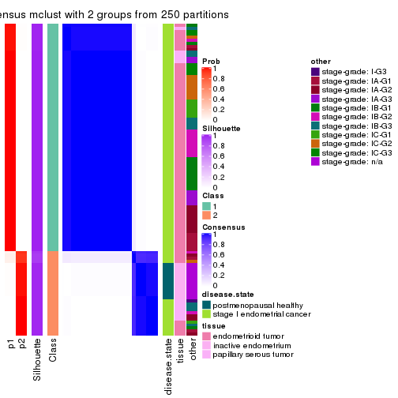</p>

</div>
<div id='tab-ATC-mclust-consensus-heatmap-2'>
<pre><code class="r">consensus_heatmap(res, k = 3)
</code></pre>

<p>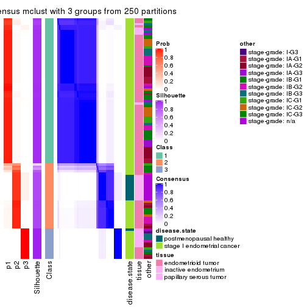</p>

</div>
<div id='tab-ATC-mclust-consensus-heatmap-3'>
<pre><code class="r">consensus_heatmap(res, k = 4)
</code></pre>

<p>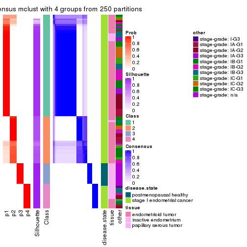</p>

</div>
<div id='tab-ATC-mclust-consensus-heatmap-4'>
<pre><code class="r">consensus_heatmap(res, k = 5)
</code></pre>

<p>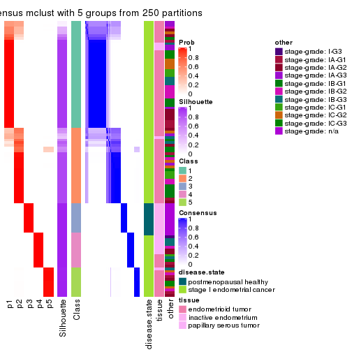</p>

</div>
<div id='tab-ATC-mclust-consensus-heatmap-5'>
<pre><code class="r">consensus_heatmap(res, k = 6)
</code></pre>

<p>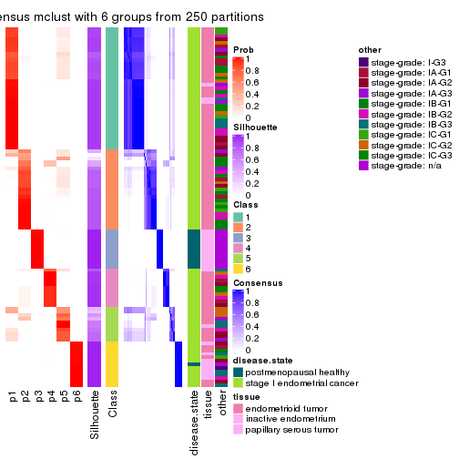</p>

</div>
</div>

Heatmaps for the membership of samples in all partitions to see how consistent they are:


<script>
$( function() {
	$( '#tabs-ATC-mclust-membership-heatmap' ).tabs();
} );
</script>
<div id='tabs-ATC-mclust-membership-heatmap'>
<ul>
<li><a href='#tab-ATC-mclust-membership-heatmap-1'>k = 2</a></li>
<li><a href='#tab-ATC-mclust-membership-heatmap-2'>k = 3</a></li>
<li><a href='#tab-ATC-mclust-membership-heatmap-3'>k = 4</a></li>
<li><a href='#tab-ATC-mclust-membership-heatmap-4'>k = 5</a></li>
<li><a href='#tab-ATC-mclust-membership-heatmap-5'>k = 6</a></li>
</ul>
<div id='tab-ATC-mclust-membership-heatmap-1'>
<pre><code class="r">membership_heatmap(res, k = 2)
</code></pre>

<p>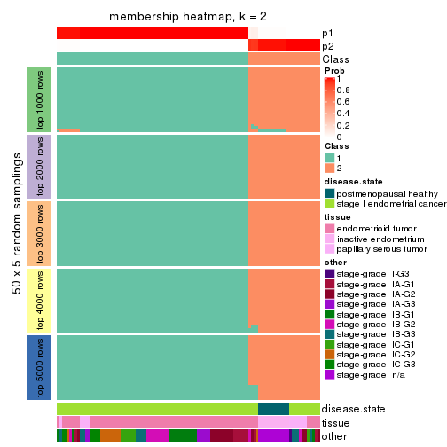</p>

</div>
<div id='tab-ATC-mclust-membership-heatmap-2'>
<pre><code class="r">membership_heatmap(res, k = 3)
</code></pre>

<p>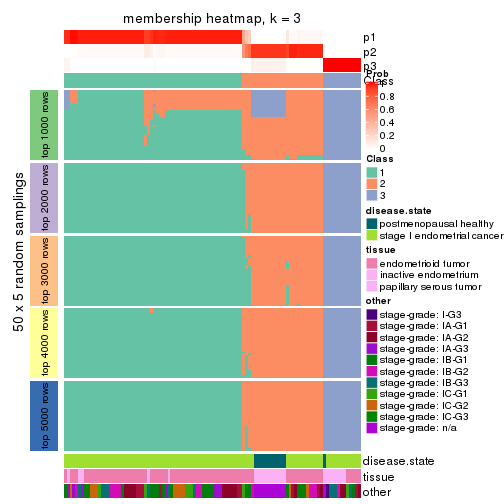</p>

</div>
<div id='tab-ATC-mclust-membership-heatmap-3'>
<pre><code class="r">membership_heatmap(res, k = 4)
</code></pre>

<p>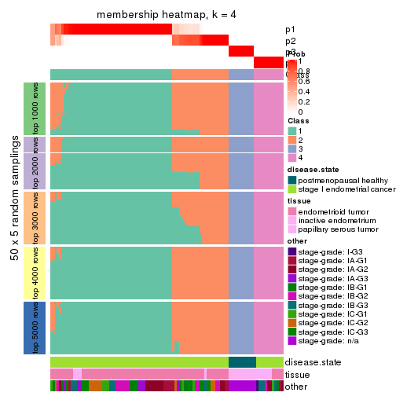</p>

</div>
<div id='tab-ATC-mclust-membership-heatmap-4'>
<pre><code class="r">membership_heatmap(res, k = 5)
</code></pre>

<p>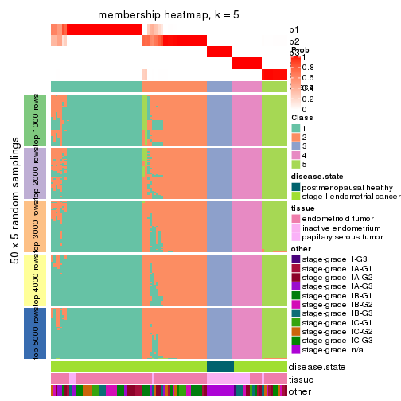</p>

</div>
<div id='tab-ATC-mclust-membership-heatmap-5'>
<pre><code class="r">membership_heatmap(res, k = 6)
</code></pre>

<p>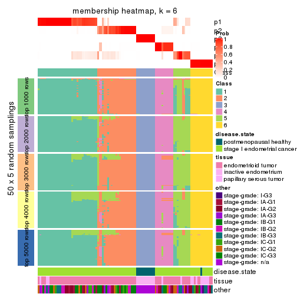</p>

</div>
</div>

As soon as we have had the classes for columns, we can look for signatures
which are significantly different between classes which can be candidate marks
for certain classes. Following are the heatmaps for signatures.


Signature heatmaps where rows are scaled:


<script>
$( function() {
	$( '#tabs-ATC-mclust-get-signatures' ).tabs();
} );
</script>
<div id='tabs-ATC-mclust-get-signatures'>
<ul>
<li><a href='#tab-ATC-mclust-get-signatures-1'>k = 2</a></li>
<li><a href='#tab-ATC-mclust-get-signatures-2'>k = 3</a></li>
<li><a href='#tab-ATC-mclust-get-signatures-3'>k = 4</a></li>
<li><a href='#tab-ATC-mclust-get-signatures-4'>k = 5</a></li>
<li><a href='#tab-ATC-mclust-get-signatures-5'>k = 6</a></li>
</ul>
<div id='tab-ATC-mclust-get-signatures-1'>
<pre><code class="r">get_signatures(res, k = 2)
</code></pre>

<p>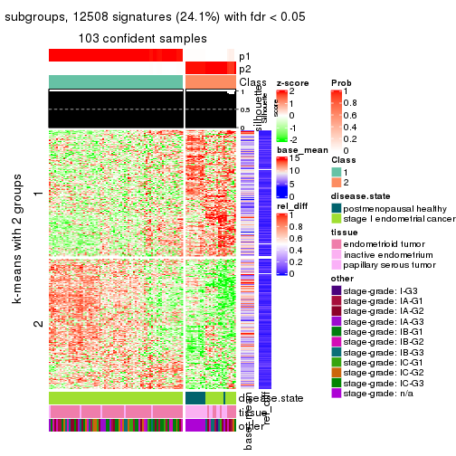</p>

</div>
<div id='tab-ATC-mclust-get-signatures-2'>
<pre><code class="r">get_signatures(res, k = 3)
</code></pre>

<p>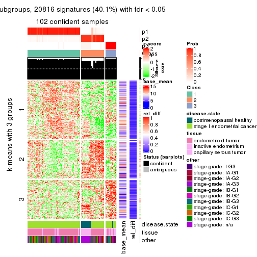</p>

</div>
<div id='tab-ATC-mclust-get-signatures-3'>
<pre><code class="r">get_signatures(res, k = 4)
</code></pre>

<p>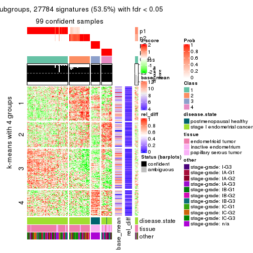</p>

</div>
<div id='tab-ATC-mclust-get-signatures-4'>
<pre><code class="r">get_signatures(res, k = 5)
</code></pre>

<p>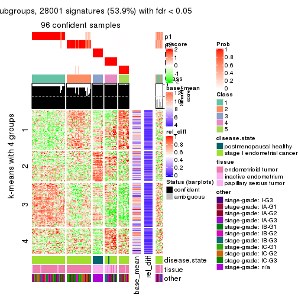</p>

</div>
<div id='tab-ATC-mclust-get-signatures-5'>
<pre><code class="r">get_signatures(res, k = 6)
</code></pre>

<p>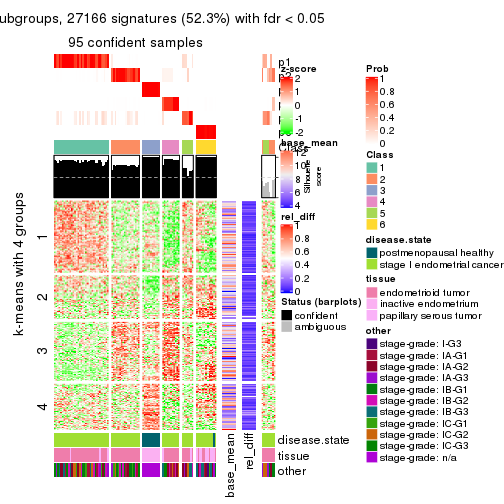</p>

</div>
</div>


Signature heatmaps where rows are not scaled:


<script>
$( function() {
	$( '#tabs-ATC-mclust-get-signatures-no-scale' ).tabs();
} );
</script>
<div id='tabs-ATC-mclust-get-signatures-no-scale'>
<ul>
<li><a href='#tab-ATC-mclust-get-signatures-no-scale-1'>k = 2</a></li>
<li><a href='#tab-ATC-mclust-get-signatures-no-scale-2'>k = 3</a></li>
<li><a href='#tab-ATC-mclust-get-signatures-no-scale-3'>k = 4</a></li>
<li><a href='#tab-ATC-mclust-get-signatures-no-scale-4'>k = 5</a></li>
<li><a href='#tab-ATC-mclust-get-signatures-no-scale-5'>k = 6</a></li>
</ul>
<div id='tab-ATC-mclust-get-signatures-no-scale-1'>
<pre><code class="r">get_signatures(res, k = 2, scale_rows = FALSE)
</code></pre>

<p>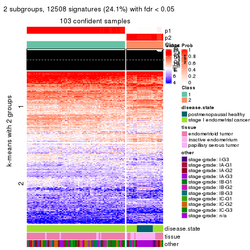</p>

</div>
<div id='tab-ATC-mclust-get-signatures-no-scale-2'>
<pre><code class="r">get_signatures(res, k = 3, scale_rows = FALSE)
</code></pre>

<p>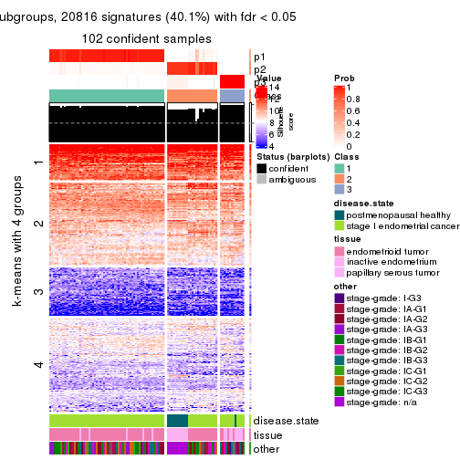</p>

</div>
<div id='tab-ATC-mclust-get-signatures-no-scale-3'>
<pre><code class="r">get_signatures(res, k = 4, scale_rows = FALSE)
</code></pre>

<p>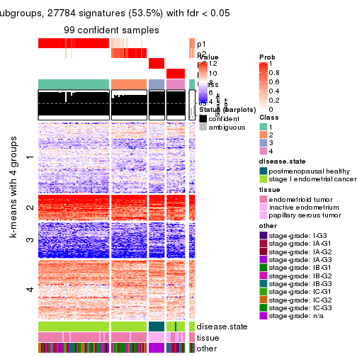</p>

</div>
<div id='tab-ATC-mclust-get-signatures-no-scale-4'>
<pre><code class="r">get_signatures(res, k = 5, scale_rows = FALSE)
</code></pre>

<p>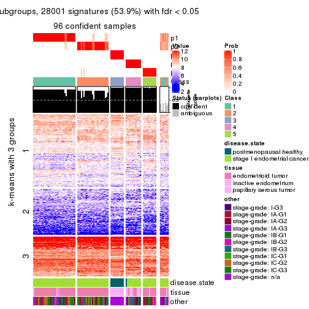</p>

</div>
<div id='tab-ATC-mclust-get-signatures-no-scale-5'>
<pre><code class="r">get_signatures(res, k = 6, scale_rows = FALSE)
</code></pre>

<p>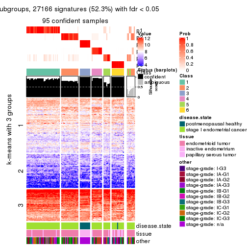</p>

</div>
</div>


Compare the overlap of signatures from different k:

```r
compare_signatures(res)
```

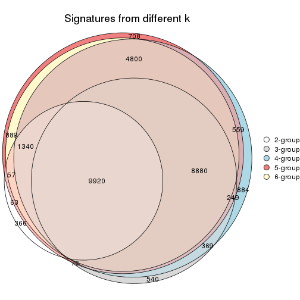

`get_signature()` returns a data frame invisibly. TO get the list of signatures, the function
call should be assigned to a variable explicitly. In following code, if `plot` argument is set
to `FALSE`, no heatmap is plotted while only the differential analysis is performed.

```r
# code only for demonstration
tb = get_signature(res, k = ..., plot = FALSE)
```

An example of the output of `tb` is:

```
#>   which_row         fdr    mean_1    mean_2 scaled_mean_1 scaled_mean_2 km
#> 1        38 0.042760348  8.373488  9.131774    -0.5533452     0.5164555  1
#> 2        40 0.018707592  7.106213  8.469186    -0.6173731     0.5762149  1
#> 3        55 0.019134737 10.221463 11.207825    -0.6159697     0.5749050  1
#> 4        59 0.006059896  5.921854  7.869574    -0.6899429     0.6439467  1
#> 5        60 0.018055526  8.928898 10.211722    -0.6204761     0.5791110  1
#> 6        98 0.009384629 15.714769 14.887706     0.6635654    -0.6193277  2
...
```

The columns in `tb` are:

1. `which_row`: row indices corresponding to the input matrix.
2. `fdr`: FDR for the differential test. 
3. `mean_x`: The mean value in group x.
4. `scaled_mean_x`: The mean value in group x after rows are scaled.
5. `km`: Row groups if k-means clustering is applied to rows.


UMAP plot which shows how samples are separated.


<script>
$( function() {
	$( '#tabs-ATC-mclust-dimension-reduction' ).tabs();
} );
</script>
<div id='tabs-ATC-mclust-dimension-reduction'>
<ul>
<li><a href='#tab-ATC-mclust-dimension-reduction-1'>k = 2</a></li>
<li><a href='#tab-ATC-mclust-dimension-reduction-2'>k = 3</a></li>
<li><a href='#tab-ATC-mclust-dimension-reduction-3'>k = 4</a></li>
<li><a href='#tab-ATC-mclust-dimension-reduction-4'>k = 5</a></li>
<li><a href='#tab-ATC-mclust-dimension-reduction-5'>k = 6</a></li>
</ul>
<div id='tab-ATC-mclust-dimension-reduction-1'>
<pre><code class="r">dimension_reduction(res, k = 2, method = &quot;UMAP&quot;)
</code></pre>

<p>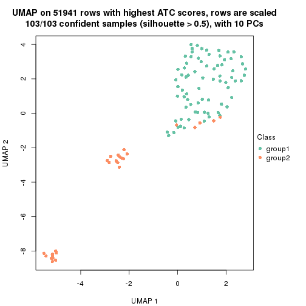</p>

</div>
<div id='tab-ATC-mclust-dimension-reduction-2'>
<pre><code class="r">dimension_reduction(res, k = 3, method = &quot;UMAP&quot;)
</code></pre>

<p>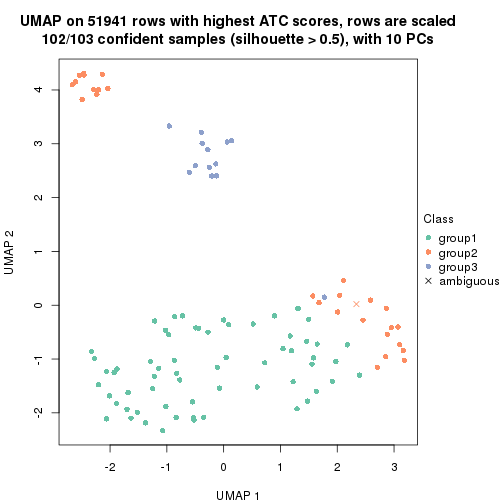</p>

</div>
<div id='tab-ATC-mclust-dimension-reduction-3'>
<pre><code class="r">dimension_reduction(res, k = 4, method = &quot;UMAP&quot;)
</code></pre>

<p>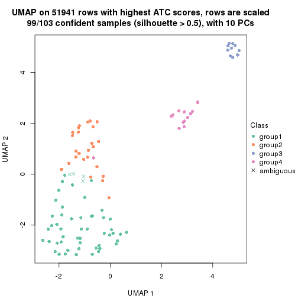</p>

</div>
<div id='tab-ATC-mclust-dimension-reduction-4'>
<pre><code class="r">dimension_reduction(res, k = 5, method = &quot;UMAP&quot;)
</code></pre>

<p>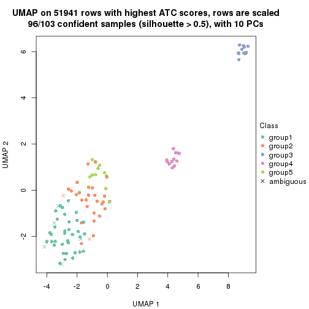</p>

</div>
<div id='tab-ATC-mclust-dimension-reduction-5'>
<pre><code class="r">dimension_reduction(res, k = 6, method = &quot;UMAP&quot;)
</code></pre>

<p>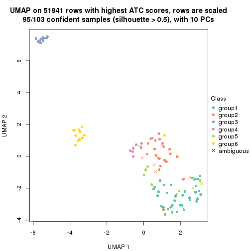</p>

</div>
</div>


Following heatmap shows how subgroups are split when increasing `k`:

```r
collect_classes(res)
```

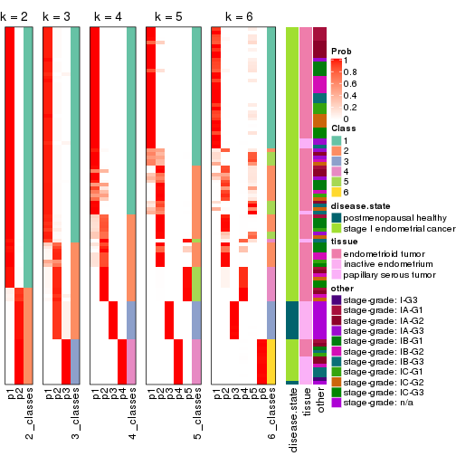


Test correlation between subgroups and known annotations. If the known
annotation is numeric, one-way ANOVA test is applied, and if the known
annotation is discrete, chi-squared contingency table test is applied.

```r
test_to_known_factors(res)
```

```
#>              n disease.state(p) tissue(p) other(p) k
#> ATC:mclust 103         1.30e-08  3.82e-11 1.52e-06 2
#> ATC:mclust 102         2.62e-07  2.37e-11 3.96e-05 3
#> ATC:mclust  99         1.86e-19  1.61e-22 9.29e-12 4
#> ATC:mclust  96         4.34e-18  2.56e-21 3.37e-10 5
#> ATC:mclust  95         3.42e-17  2.96e-19 7.66e-09 6
```


If matrix rows can be associated to genes, consider to use `functional_enrichment(res,
...)` to perform function enrichment for the signature genes. See [this vignette](http://bioconductor.org/packages/devel/bioc/vignettes/cola/inst/doc/functional_enrichment.html) for more detailed explanations.


 

---------------------------------------------------


### ATC:NMF**


The object with results only for a single top-value method and a single partition method 
can be extracted as:

```r
res = res_list["ATC", "NMF"]
# you can also extract it by
# res = res_list["ATC:NMF"]
```

A summary of `res` and all the functions that can be applied to it:

```r
res
```

```
#> A 'ConsensusPartition' object with k = 2, 3, 4, 5, 6.
#>   On a matrix with 51941 rows and 103 columns.
#>   Top rows (1000, 2000, 3000, 4000, 5000) are extracted by 'ATC' method.
#>   Subgroups are detected by 'NMF' method.
#>   Performed in total 1250 partitions by row resampling.
#>   Best k for subgroups seems to be 2.
#> 
#> Following methods can be applied to this 'ConsensusPartition' object:
#>  [1] "cola_report"             "collect_classes"         "collect_plots"          
#>  [4] "collect_stats"           "colnames"                "compare_signatures"     
#>  [7] "consensus_heatmap"       "dimension_reduction"     "functional_enrichment"  
#> [10] "get_anno_col"            "get_anno"                "get_classes"            
#> [13] "get_consensus"           "get_matrix"              "get_membership"         
#> [16] "get_param"               "get_signatures"          "get_stats"              
#> [19] "is_best_k"               "is_stable_k"             "membership_heatmap"     
#> [22] "ncol"                    "nrow"                    "plot_ecdf"              
#> [25] "rownames"                "select_partition_number" "show"                   
#> [28] "suggest_best_k"          "test_to_known_factors"
```

`collect_plots()` function collects all the plots made from `res` for all `k` (number of partitions)
into one single page to provide an easy and fast comparison between different `k`.

```r
collect_plots(res)
```

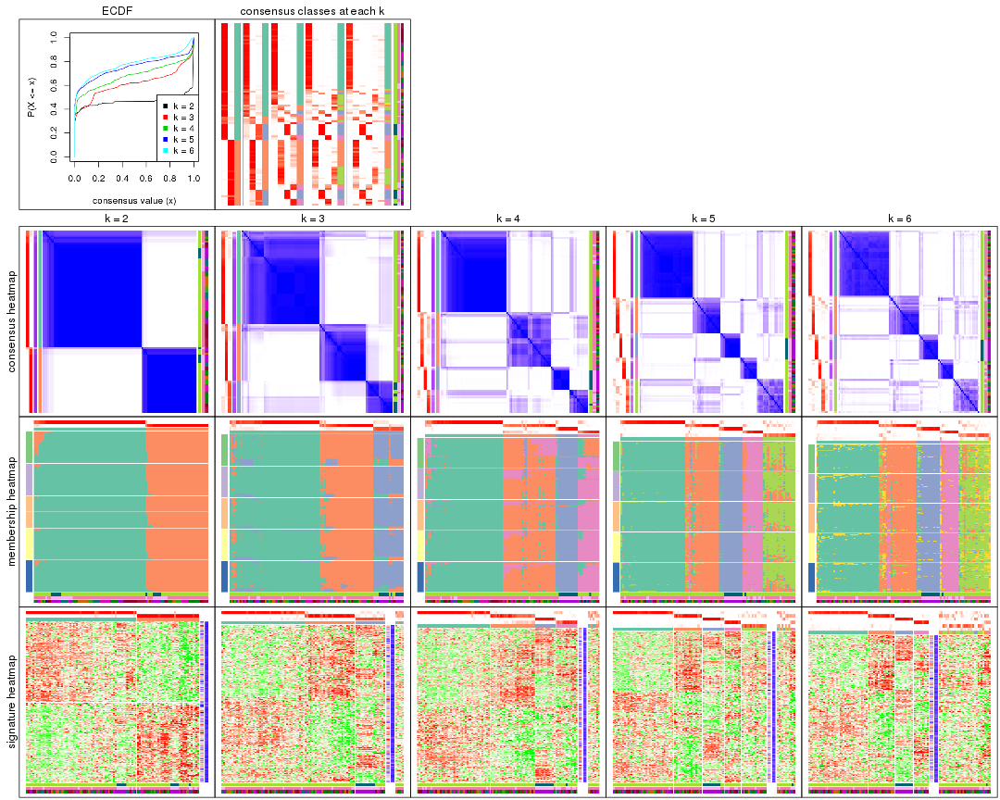

The plots are:

- The first row: a plot of the ECDF (empirical cumulative distribution
  function) curves of the consensus matrix for each `k` and the heatmap of
  predicted classes for each `k`.
- The second row: heatmaps of the consensus matrix for each `k`.
- The third row: heatmaps of the membership matrix for each `k`.
- The fouth row: heatmaps of the signatures for each `k`.

All the plots in panels can be made by individual functions and they are
plotted later in this section.

`select_partition_number()` produces several plots showing different
statistics for choosing "optimized" `k`. There are following statistics:

- ECDF curves of the consensus matrix for each `k`;
- 1-PAC. [The PAC
  score](https://en.wikipedia.org/wiki/Consensus_clustering#Over-interpretation_potential_of_consensus_clustering)
  measures the proportion of the ambiguous subgrouping.
- Mean silhouette score.
- Concordance. The mean probability of fiting the consensus class ids in all
  partitions.
- Area increased. Denote $A_k$ as the area under the ECDF curve for current
  `k`, the area increased is defined as $A_k - A_{k-1}$.
- Rand index. The percent of pairs of samples that are both in a same cluster
  or both are not in a same cluster in the partition of k and k-1.
- Jaccard index. The ratio of pairs of samples are both in a same cluster in
  the partition of k and k-1 and the pairs of samples are both in a same
  cluster in the partition k or k-1.

The detailed explanations of these statistics can be found in [the _cola_
vignette](http://bioconductor.org/packages/devel/bioc/vignettes/cola/inst/doc/cola.html#toc_13).

Generally speaking, lower PAC score, higher mean silhouette score or higher
concordance corresponds to better partition. Rand index and Jaccard index
measure how similar the current partition is compared to partition with `k-1`.
If they are too similar, we won't accept `k` is better than `k-1`.

```r
select_partition_number(res)
```

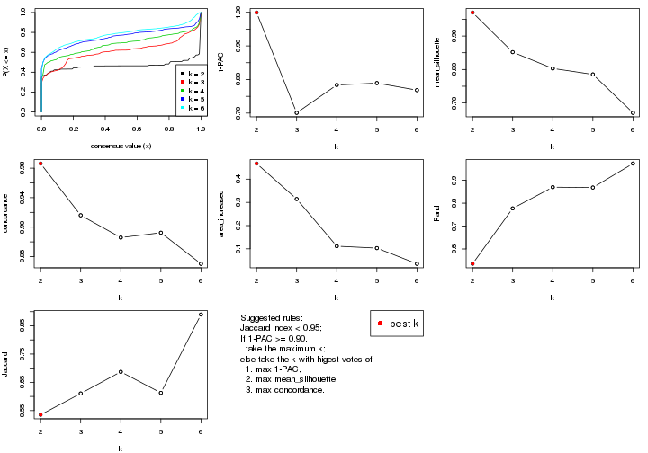

The numeric values for all these statistics can be obtained by `get_stats()`.

```r
get_stats(res)
```

```
#>   k 1-PAC mean_silhouette concordance area_increased  Rand Jaccard
#> 2 2 0.999           0.970       0.986         0.4671 0.535   0.535
#> 3 3 0.701           0.852       0.916         0.3143 0.777   0.611
#> 4 4 0.784           0.803       0.886         0.1114 0.870   0.687
#> 5 5 0.789           0.785       0.892         0.1031 0.868   0.613
#> 6 6 0.768           0.671       0.850         0.0355 0.973   0.890
```

`suggest_best_k()` suggests the best $k$ based on these statistics. The rules are as follows:

- All $k$ with Jaccard index larger than 0.95 are removed because increasing
  $k$ does not provide enough extra information. If all $k$ are removed, it is
  marked as no subgroup is detected.
- For all $k$ with 1-PAC score larger than 0.9, the maximal $k$ is taken as
  the best $k$, and other $k$ are marked as optional $k$.
- If it does not fit the second rule. The $k$ with the maximal vote of the
  highest 1-PAC score, highest mean silhouette, and highest concordance is
  taken as the best $k$.

```r
suggest_best_k(res)
```

```
#> [1] 2
```


Following shows the table of the partitions (You need to click the **show/hide
code output** link to see it). The membership matrix (columns with name `p*`)
is inferred by
[`clue::cl_consensus()`](https://www.rdocumentation.org/link/cl_consensus?package=clue)
function with the `SE` method. Basically the value in the membership matrix
represents the probability to belong to a certain group. The finall class
label for an item is determined with the group with highest probability it
belongs to.

In `get_classes()` function, the entropy is calculated from the membership
matrix and the silhouette score is calculated from the consensus matrix.


<script>
$( function() {
	$( '#tabs-ATC-NMF-get-classes' ).tabs();
} );
</script>
<div id='tabs-ATC-NMF-get-classes'>
<ul>
<li><a href='#tab-ATC-NMF-get-classes-1'>k = 2</a></li>
<li><a href='#tab-ATC-NMF-get-classes-2'>k = 3</a></li>
<li><a href='#tab-ATC-NMF-get-classes-3'>k = 4</a></li>
<li><a href='#tab-ATC-NMF-get-classes-4'>k = 5</a></li>
<li><a href='#tab-ATC-NMF-get-classes-5'>k = 6</a></li>
</ul>

<div id='tab-ATC-NMF-get-classes-1'>
<p><a id='tab-ATC-NMF-get-classes-1-a' style='color:#0366d6' href='#'>show/hide code output</a></p>
<pre><code class="r">cbind(get_classes(res, k = 2), get_membership(res, k = 2))
</code></pre>

<pre><code>#&gt;           class entropy silhouette    p1    p2
#&gt; GSM425907     2  0.0000      0.987 0.000 1.000
#&gt; GSM425908     2  0.0000      0.987 0.000 1.000
#&gt; GSM425909     2  0.0000      0.987 0.000 1.000
#&gt; GSM425910     1  0.0000      0.985 1.000 0.000
#&gt; GSM425911     1  0.0000      0.985 1.000 0.000
#&gt; GSM425912     1  0.0000      0.985 1.000 0.000
#&gt; GSM425913     2  0.2778      0.944 0.048 0.952
#&gt; GSM425914     1  0.0000      0.985 1.000 0.000
#&gt; GSM425915     1  0.0000      0.985 1.000 0.000
#&gt; GSM425874     2  0.0000      0.987 0.000 1.000
#&gt; GSM425875     1  0.0000      0.985 1.000 0.000
#&gt; GSM425876     1  0.0000      0.985 1.000 0.000
#&gt; GSM425877     1  0.0000      0.985 1.000 0.000
#&gt; GSM425878     1  0.0000      0.985 1.000 0.000
#&gt; GSM425879     1  0.0376      0.982 0.996 0.004
#&gt; GSM425880     1  0.0000      0.985 1.000 0.000
#&gt; GSM425881     1  0.0000      0.985 1.000 0.000
#&gt; GSM425882     1  0.0376      0.982 0.996 0.004
#&gt; GSM425883     1  0.0000      0.985 1.000 0.000
#&gt; GSM425884     1  0.0000      0.985 1.000 0.000
#&gt; GSM425885     2  0.0000      0.987 0.000 1.000
#&gt; GSM425848     2  0.2236      0.955 0.036 0.964
#&gt; GSM425849     1  0.0000      0.985 1.000 0.000
#&gt; GSM425850     1  0.0000      0.985 1.000 0.000
#&gt; GSM425851     1  0.7815      0.713 0.768 0.232
#&gt; GSM425852     1  0.0000      0.985 1.000 0.000
#&gt; GSM425893     1  0.3879      0.916 0.924 0.076
#&gt; GSM425894     2  0.0000      0.987 0.000 1.000
#&gt; GSM425895     1  0.7139      0.769 0.804 0.196
#&gt; GSM425896     2  0.0000      0.987 0.000 1.000
#&gt; GSM425897     2  0.0000      0.987 0.000 1.000
#&gt; GSM425898     2  0.0000      0.987 0.000 1.000
#&gt; GSM425899     1  0.0000      0.985 1.000 0.000
#&gt; GSM425900     1  0.0000      0.985 1.000 0.000
#&gt; GSM425901     2  0.0000      0.987 0.000 1.000
#&gt; GSM425902     2  0.0000      0.987 0.000 1.000
#&gt; GSM425903     1  0.0000      0.985 1.000 0.000
#&gt; GSM425904     1  0.0000      0.985 1.000 0.000
#&gt; GSM425905     2  0.0000      0.987 0.000 1.000
#&gt; GSM425906     1  0.0000      0.985 1.000 0.000
#&gt; GSM425863     1  0.0000      0.985 1.000 0.000
#&gt; GSM425864     2  0.0000      0.987 0.000 1.000
#&gt; GSM425865     2  0.0000      0.987 0.000 1.000
#&gt; GSM425866     1  0.0000      0.985 1.000 0.000
#&gt; GSM425867     1  0.0000      0.985 1.000 0.000
#&gt; GSM425868     2  0.0000      0.987 0.000 1.000
#&gt; GSM425869     2  0.0000      0.987 0.000 1.000
#&gt; GSM425870     1  0.0000      0.985 1.000 0.000
#&gt; GSM425871     1  0.0000      0.985 1.000 0.000
#&gt; GSM425872     1  0.5178      0.873 0.884 0.116
#&gt; GSM425873     1  0.0000      0.985 1.000 0.000
#&gt; GSM425843     1  0.0000      0.985 1.000 0.000
#&gt; GSM425844     1  0.7219      0.763 0.800 0.200
#&gt; GSM425845     1  0.0000      0.985 1.000 0.000
#&gt; GSM425846     1  0.0000      0.985 1.000 0.000
#&gt; GSM425847     1  0.0000      0.985 1.000 0.000
#&gt; GSM425886     2  0.0000      0.987 0.000 1.000
#&gt; GSM425887     1  0.0000      0.985 1.000 0.000
#&gt; GSM425888     1  0.0000      0.985 1.000 0.000
#&gt; GSM425889     1  0.0000      0.985 1.000 0.000
#&gt; GSM425890     2  0.0000      0.987 0.000 1.000
#&gt; GSM425891     1  0.2423      0.951 0.960 0.040
#&gt; GSM425892     2  0.0000      0.987 0.000 1.000
#&gt; GSM425853     1  0.0000      0.985 1.000 0.000
#&gt; GSM425854     2  0.2948      0.939 0.052 0.948
#&gt; GSM425855     1  0.0000      0.985 1.000 0.000
#&gt; GSM425856     1  0.0000      0.985 1.000 0.000
#&gt; GSM425857     2  0.0000      0.987 0.000 1.000
#&gt; GSM425858     1  0.0000      0.985 1.000 0.000
#&gt; GSM425859     2  0.0000      0.987 0.000 1.000
#&gt; GSM425860     1  0.0000      0.985 1.000 0.000
#&gt; GSM425861     1  0.0000      0.985 1.000 0.000
#&gt; GSM425862     1  0.3733      0.920 0.928 0.072
#&gt; GSM425837     1  0.0000      0.985 1.000 0.000
#&gt; GSM425838     2  0.0000      0.987 0.000 1.000
#&gt; GSM425839     2  0.0000      0.987 0.000 1.000
#&gt; GSM425840     1  0.0000      0.985 1.000 0.000
#&gt; GSM425841     2  0.0000      0.987 0.000 1.000
#&gt; GSM425842     1  0.0000      0.985 1.000 0.000
#&gt; GSM425917     2  0.0000      0.987 0.000 1.000
#&gt; GSM425922     2  0.0000      0.987 0.000 1.000
#&gt; GSM425919     1  0.0000      0.985 1.000 0.000
#&gt; GSM425920     1  0.0000      0.985 1.000 0.000
#&gt; GSM425923     1  0.0000      0.985 1.000 0.000
#&gt; GSM425916     1  0.0000      0.985 1.000 0.000
#&gt; GSM425918     1  0.0000      0.985 1.000 0.000
#&gt; GSM425921     2  0.0000      0.987 0.000 1.000
#&gt; GSM425925     1  0.0000      0.985 1.000 0.000
#&gt; GSM425926     2  0.0000      0.987 0.000 1.000
#&gt; GSM425927     1  0.0000      0.985 1.000 0.000
#&gt; GSM425924     1  0.0938      0.976 0.988 0.012
#&gt; GSM425928     2  0.0000      0.987 0.000 1.000
#&gt; GSM425929     1  0.0000      0.985 1.000 0.000
#&gt; GSM425930     1  0.0000      0.985 1.000 0.000
#&gt; GSM425931     2  0.0000      0.987 0.000 1.000
#&gt; GSM425932     1  0.0000      0.985 1.000 0.000
#&gt; GSM425933     1  0.0000      0.985 1.000 0.000
#&gt; GSM425934     1  0.0000      0.985 1.000 0.000
#&gt; GSM425935     2  0.0000      0.987 0.000 1.000
#&gt; GSM425936     2  0.0000      0.987 0.000 1.000
#&gt; GSM425937     2  0.9087      0.511 0.324 0.676
#&gt; GSM425938     2  0.0000      0.987 0.000 1.000
#&gt; GSM425939     1  0.0000      0.985 1.000 0.000
</code></pre>

<script>
$('#tab-ATC-NMF-get-classes-1-a').parent().next().next().hide();
$('#tab-ATC-NMF-get-classes-1-a').click(function(){
  $('#tab-ATC-NMF-get-classes-1-a').parent().next().next().toggle();
  return(false);
});
</script>
</div>

<div id='tab-ATC-NMF-get-classes-2'>
<p><a id='tab-ATC-NMF-get-classes-2-a' style='color:#0366d6' href='#'>show/hide code output</a></p>
<pre><code class="r">cbind(get_classes(res, k = 3), get_membership(res, k = 3))
</code></pre>

<pre><code>#&gt;           class entropy silhouette    p1    p2    p3
#&gt; GSM425907     2  0.0000      0.908 0.000 1.000 0.000
#&gt; GSM425908     2  0.0000      0.908 0.000 1.000 0.000
#&gt; GSM425909     2  0.2711      0.866 0.000 0.912 0.088
#&gt; GSM425910     1  0.0237      0.929 0.996 0.000 0.004
#&gt; GSM425911     1  0.3038      0.870 0.896 0.000 0.104
#&gt; GSM425912     1  0.0424      0.929 0.992 0.000 0.008
#&gt; GSM425913     3  0.3851      0.854 0.004 0.136 0.860
#&gt; GSM425914     1  0.0000      0.929 1.000 0.000 0.000
#&gt; GSM425915     1  0.0424      0.929 0.992 0.000 0.008
#&gt; GSM425874     2  0.0424      0.907 0.000 0.992 0.008
#&gt; GSM425875     1  0.0424      0.926 0.992 0.000 0.008
#&gt; GSM425876     1  0.0424      0.929 0.992 0.000 0.008
#&gt; GSM425877     1  0.0237      0.929 0.996 0.000 0.004
#&gt; GSM425878     1  0.0747      0.923 0.984 0.000 0.016
#&gt; GSM425879     1  0.6949      0.699 0.732 0.156 0.112
#&gt; GSM425880     1  0.3551      0.847 0.868 0.000 0.132
#&gt; GSM425881     1  0.0000      0.929 1.000 0.000 0.000
#&gt; GSM425882     1  0.3532      0.836 0.884 0.108 0.008
#&gt; GSM425883     1  0.3192      0.842 0.888 0.000 0.112
#&gt; GSM425884     1  0.0424      0.929 0.992 0.000 0.008
#&gt; GSM425885     2  0.0237      0.907 0.000 0.996 0.004
#&gt; GSM425848     2  0.5136      0.802 0.044 0.824 0.132
#&gt; GSM425849     1  0.2165      0.896 0.936 0.000 0.064
#&gt; GSM425850     1  0.0237      0.929 0.996 0.000 0.004
#&gt; GSM425851     2  0.4473      0.739 0.164 0.828 0.008
#&gt; GSM425852     1  0.1411      0.913 0.964 0.000 0.036
#&gt; GSM425893     1  0.8792     -0.049 0.456 0.432 0.112
#&gt; GSM425894     2  0.0000      0.908 0.000 1.000 0.000
#&gt; GSM425895     2  0.8071      0.314 0.380 0.548 0.072
#&gt; GSM425896     2  0.0000      0.908 0.000 1.000 0.000
#&gt; GSM425897     3  0.5926      0.553 0.000 0.356 0.644
#&gt; GSM425898     2  0.3965      0.830 0.008 0.860 0.132
#&gt; GSM425899     1  0.3965      0.841 0.860 0.008 0.132
#&gt; GSM425900     1  0.0237      0.929 0.996 0.000 0.004
#&gt; GSM425901     2  0.0237      0.908 0.000 0.996 0.004
#&gt; GSM425902     2  0.2261      0.879 0.000 0.932 0.068
#&gt; GSM425903     1  0.0237      0.929 0.996 0.000 0.004
#&gt; GSM425904     1  0.0000      0.929 1.000 0.000 0.000
#&gt; GSM425905     2  0.0747      0.904 0.000 0.984 0.016
#&gt; GSM425906     1  0.5016      0.653 0.760 0.000 0.240
#&gt; GSM425863     1  0.0424      0.929 0.992 0.000 0.008
#&gt; GSM425864     2  0.0000      0.908 0.000 1.000 0.000
#&gt; GSM425865     2  0.0000      0.908 0.000 1.000 0.000
#&gt; GSM425866     1  0.0000      0.929 1.000 0.000 0.000
#&gt; GSM425867     1  0.0424      0.929 0.992 0.000 0.008
#&gt; GSM425868     2  0.0592      0.902 0.000 0.988 0.012
#&gt; GSM425869     2  0.0000      0.908 0.000 1.000 0.000
#&gt; GSM425870     1  0.0424      0.929 0.992 0.000 0.008
#&gt; GSM425871     1  0.3340      0.857 0.880 0.000 0.120
#&gt; GSM425872     2  0.6189      0.438 0.364 0.632 0.004
#&gt; GSM425873     1  0.0424      0.929 0.992 0.000 0.008
#&gt; GSM425843     1  0.0237      0.929 0.996 0.000 0.004
#&gt; GSM425844     2  0.7065      0.527 0.276 0.672 0.052
#&gt; GSM425845     1  0.0237      0.928 0.996 0.000 0.004
#&gt; GSM425846     1  0.3965      0.841 0.860 0.008 0.132
#&gt; GSM425847     1  0.0424      0.929 0.992 0.000 0.008
#&gt; GSM425886     2  0.0000      0.908 0.000 1.000 0.000
#&gt; GSM425887     1  0.0237      0.928 0.996 0.000 0.004
#&gt; GSM425888     1  0.0237      0.929 0.996 0.000 0.004
#&gt; GSM425889     1  0.0237      0.929 0.996 0.000 0.004
#&gt; GSM425890     2  0.1289      0.892 0.000 0.968 0.032
#&gt; GSM425891     1  0.8352      0.354 0.568 0.332 0.100
#&gt; GSM425892     2  0.0237      0.908 0.000 0.996 0.004
#&gt; GSM425853     1  0.2959      0.873 0.900 0.000 0.100
#&gt; GSM425854     2  0.5538      0.787 0.060 0.808 0.132
#&gt; GSM425855     1  0.0000      0.929 1.000 0.000 0.000
#&gt; GSM425856     1  0.2448      0.889 0.924 0.000 0.076
#&gt; GSM425857     2  0.0000      0.908 0.000 1.000 0.000
#&gt; GSM425858     1  0.0237      0.928 0.996 0.000 0.004
#&gt; GSM425859     2  0.1289      0.897 0.000 0.968 0.032
#&gt; GSM425860     1  0.0237      0.929 0.996 0.000 0.004
#&gt; GSM425861     1  0.0000      0.929 1.000 0.000 0.000
#&gt; GSM425862     1  0.5835      0.472 0.660 0.340 0.000
#&gt; GSM425837     1  0.0424      0.929 0.992 0.000 0.008
#&gt; GSM425838     2  0.0000      0.908 0.000 1.000 0.000
#&gt; GSM425839     2  0.0000      0.908 0.000 1.000 0.000
#&gt; GSM425840     1  0.0000      0.929 1.000 0.000 0.000
#&gt; GSM425841     2  0.0000      0.908 0.000 1.000 0.000
#&gt; GSM425842     1  0.0424      0.929 0.992 0.000 0.008
#&gt; GSM425917     3  0.3686      0.850 0.000 0.140 0.860
#&gt; GSM425922     2  0.1163      0.895 0.000 0.972 0.028
#&gt; GSM425919     1  0.0424      0.929 0.992 0.000 0.008
#&gt; GSM425920     1  0.2066      0.893 0.940 0.000 0.060
#&gt; GSM425923     3  0.5058      0.755 0.244 0.000 0.756
#&gt; GSM425916     1  0.1163      0.918 0.972 0.000 0.028
#&gt; GSM425918     3  0.4233      0.854 0.160 0.004 0.836
#&gt; GSM425921     2  0.1163      0.895 0.000 0.972 0.028
#&gt; GSM425925     1  0.3551      0.847 0.868 0.000 0.132
#&gt; GSM425926     2  0.3784      0.833 0.004 0.864 0.132
#&gt; GSM425927     1  0.0237      0.929 0.996 0.000 0.004
#&gt; GSM425924     3  0.4270      0.868 0.116 0.024 0.860
#&gt; GSM425928     3  0.4654      0.790 0.000 0.208 0.792
#&gt; GSM425929     3  0.3879      0.861 0.152 0.000 0.848
#&gt; GSM425930     3  0.3941      0.859 0.156 0.000 0.844
#&gt; GSM425931     3  0.3752      0.851 0.000 0.144 0.856
#&gt; GSM425932     3  0.3686      0.865 0.140 0.000 0.860
#&gt; GSM425933     3  0.3686      0.865 0.140 0.000 0.860
#&gt; GSM425934     3  0.3879      0.861 0.152 0.000 0.848
#&gt; GSM425935     3  0.3879      0.845 0.000 0.152 0.848
#&gt; GSM425936     3  0.3752      0.850 0.000 0.144 0.856
#&gt; GSM425937     3  0.3965      0.857 0.008 0.132 0.860
#&gt; GSM425938     3  0.3851      0.855 0.004 0.136 0.860
#&gt; GSM425939     3  0.3879      0.862 0.152 0.000 0.848
</code></pre>

<script>
$('#tab-ATC-NMF-get-classes-2-a').parent().next().next().hide();
$('#tab-ATC-NMF-get-classes-2-a').click(function(){
  $('#tab-ATC-NMF-get-classes-2-a').parent().next().next().toggle();
  return(false);
});
</script>
</div>

<div id='tab-ATC-NMF-get-classes-3'>
<p><a id='tab-ATC-NMF-get-classes-3-a' style='color:#0366d6' href='#'>show/hide code output</a></p>
<pre><code class="r">cbind(get_classes(res, k = 4), get_membership(res, k = 4))
</code></pre>

<pre><code>#&gt;           class entropy silhouette    p1    p2    p3    p4
#&gt; GSM425907     2  0.4720      0.709 0.000 0.672 0.004 0.324
#&gt; GSM425908     2  0.4401      0.752 0.000 0.724 0.004 0.272
#&gt; GSM425909     2  0.0376      0.758 0.000 0.992 0.004 0.004
#&gt; GSM425910     1  0.0000      0.953 1.000 0.000 0.000 0.000
#&gt; GSM425911     1  0.5318      0.488 0.624 0.360 0.004 0.012
#&gt; GSM425912     1  0.0000      0.953 1.000 0.000 0.000 0.000
#&gt; GSM425913     4  0.0844      0.777 0.004 0.004 0.012 0.980
#&gt; GSM425914     1  0.0000      0.953 1.000 0.000 0.000 0.000
#&gt; GSM425915     1  0.3445      0.825 0.864 0.012 0.112 0.012
#&gt; GSM425874     2  0.4456      0.747 0.000 0.716 0.004 0.280
#&gt; GSM425875     1  0.0657      0.944 0.984 0.012 0.000 0.004
#&gt; GSM425876     1  0.0000      0.953 1.000 0.000 0.000 0.000
#&gt; GSM425877     1  0.0000      0.953 1.000 0.000 0.000 0.000
#&gt; GSM425878     1  0.0000      0.953 1.000 0.000 0.000 0.000
#&gt; GSM425879     2  0.5175      0.343 0.328 0.656 0.004 0.012
#&gt; GSM425880     1  0.1690      0.921 0.952 0.032 0.008 0.008
#&gt; GSM425881     1  0.0000      0.953 1.000 0.000 0.000 0.000
#&gt; GSM425882     1  0.1677      0.906 0.948 0.040 0.000 0.012
#&gt; GSM425883     4  0.4950      0.513 0.376 0.000 0.004 0.620
#&gt; GSM425884     1  0.0336      0.948 0.992 0.000 0.000 0.008
#&gt; GSM425885     2  0.4837      0.682 0.000 0.648 0.004 0.348
#&gt; GSM425848     2  0.0992      0.751 0.012 0.976 0.008 0.004
#&gt; GSM425849     1  0.0188      0.951 0.996 0.000 0.004 0.000
#&gt; GSM425850     1  0.0000      0.953 1.000 0.000 0.000 0.000
#&gt; GSM425851     2  0.7955      0.347 0.304 0.448 0.008 0.240
#&gt; GSM425852     3  0.7341      0.142 0.428 0.100 0.456 0.016
#&gt; GSM425893     2  0.7384      0.132 0.104 0.452 0.428 0.016
#&gt; GSM425894     2  0.3257      0.789 0.000 0.844 0.004 0.152
#&gt; GSM425895     2  0.2839      0.679 0.108 0.884 0.004 0.004
#&gt; GSM425896     2  0.4088      0.770 0.000 0.764 0.004 0.232
#&gt; GSM425897     4  0.0804      0.775 0.000 0.012 0.008 0.980
#&gt; GSM425898     2  0.0336      0.758 0.000 0.992 0.008 0.000
#&gt; GSM425899     1  0.5229      0.528 0.648 0.336 0.008 0.008
#&gt; GSM425900     1  0.0000      0.953 1.000 0.000 0.000 0.000
#&gt; GSM425901     2  0.1042      0.770 0.000 0.972 0.008 0.020
#&gt; GSM425902     2  0.0188      0.763 0.000 0.996 0.000 0.004
#&gt; GSM425903     1  0.0376      0.949 0.992 0.004 0.000 0.004
#&gt; GSM425904     1  0.0992      0.939 0.976 0.012 0.004 0.008
#&gt; GSM425905     2  0.3105      0.790 0.000 0.856 0.004 0.140
#&gt; GSM425906     3  0.4008      0.592 0.244 0.000 0.756 0.000
#&gt; GSM425863     1  0.0000      0.953 1.000 0.000 0.000 0.000
#&gt; GSM425864     2  0.2480      0.787 0.000 0.904 0.008 0.088
#&gt; GSM425865     2  0.4220      0.765 0.000 0.748 0.004 0.248
#&gt; GSM425866     1  0.0000      0.953 1.000 0.000 0.000 0.000
#&gt; GSM425867     1  0.0000      0.953 1.000 0.000 0.000 0.000
#&gt; GSM425868     2  0.5168      0.443 0.000 0.504 0.004 0.492
#&gt; GSM425869     2  0.4401      0.752 0.000 0.724 0.004 0.272
#&gt; GSM425870     1  0.0000      0.953 1.000 0.000 0.000 0.000
#&gt; GSM425871     1  0.0524      0.946 0.988 0.004 0.008 0.000
#&gt; GSM425872     2  0.5140      0.674 0.056 0.780 0.144 0.020
#&gt; GSM425873     1  0.0000      0.953 1.000 0.000 0.000 0.000
#&gt; GSM425843     1  0.0000      0.953 1.000 0.000 0.000 0.000
#&gt; GSM425844     4  0.1639      0.779 0.036 0.008 0.004 0.952
#&gt; GSM425845     1  0.0000      0.953 1.000 0.000 0.000 0.000
#&gt; GSM425846     1  0.4548      0.686 0.752 0.232 0.008 0.008
#&gt; GSM425847     1  0.0000      0.953 1.000 0.000 0.000 0.000
#&gt; GSM425886     2  0.1297      0.756 0.000 0.964 0.020 0.016
#&gt; GSM425887     1  0.0000      0.953 1.000 0.000 0.000 0.000
#&gt; GSM425888     1  0.0000      0.953 1.000 0.000 0.000 0.000
#&gt; GSM425889     1  0.0000      0.953 1.000 0.000 0.000 0.000
#&gt; GSM425890     4  0.1022      0.765 0.000 0.032 0.000 0.968
#&gt; GSM425891     2  0.3636      0.594 0.172 0.820 0.000 0.008
#&gt; GSM425892     2  0.2714      0.790 0.000 0.884 0.004 0.112
#&gt; GSM425853     1  0.0672      0.945 0.984 0.008 0.008 0.000
#&gt; GSM425854     2  0.2010      0.772 0.012 0.940 0.008 0.040
#&gt; GSM425855     1  0.0000      0.953 1.000 0.000 0.000 0.000
#&gt; GSM425856     1  0.1909      0.910 0.940 0.048 0.008 0.004
#&gt; GSM425857     2  0.4800      0.692 0.000 0.656 0.004 0.340
#&gt; GSM425858     1  0.0000      0.953 1.000 0.000 0.000 0.000
#&gt; GSM425859     2  0.3831      0.780 0.000 0.792 0.004 0.204
#&gt; GSM425860     1  0.0000      0.953 1.000 0.000 0.000 0.000
#&gt; GSM425861     1  0.0000      0.953 1.000 0.000 0.000 0.000
#&gt; GSM425862     1  0.6151      0.216 0.540 0.420 0.024 0.016
#&gt; GSM425837     1  0.0000      0.953 1.000 0.000 0.000 0.000
#&gt; GSM425838     2  0.4483      0.745 0.000 0.712 0.004 0.284
#&gt; GSM425839     2  0.2401      0.788 0.000 0.904 0.004 0.092
#&gt; GSM425840     1  0.0000      0.953 1.000 0.000 0.000 0.000
#&gt; GSM425841     2  0.4304      0.746 0.000 0.716 0.000 0.284
#&gt; GSM425842     1  0.0000      0.953 1.000 0.000 0.000 0.000
#&gt; GSM425917     4  0.0804      0.776 0.000 0.008 0.012 0.980
#&gt; GSM425922     4  0.2053      0.724 0.000 0.072 0.004 0.924
#&gt; GSM425919     1  0.0000      0.953 1.000 0.000 0.000 0.000
#&gt; GSM425920     1  0.0469      0.945 0.988 0.000 0.012 0.000
#&gt; GSM425923     4  0.4978      0.564 0.324 0.000 0.012 0.664
#&gt; GSM425916     4  0.4790      0.506 0.380 0.000 0.000 0.620
#&gt; GSM425918     4  0.4098      0.675 0.204 0.000 0.012 0.784
#&gt; GSM425921     4  0.2266      0.707 0.000 0.084 0.004 0.912
#&gt; GSM425925     1  0.1042      0.937 0.972 0.020 0.008 0.000
#&gt; GSM425926     2  0.3545      0.788 0.000 0.828 0.008 0.164
#&gt; GSM425927     1  0.0000      0.953 1.000 0.000 0.000 0.000
#&gt; GSM425924     4  0.2676      0.759 0.092 0.000 0.012 0.896
#&gt; GSM425928     4  0.1624      0.766 0.000 0.020 0.028 0.952
#&gt; GSM425929     3  0.0469      0.900 0.012 0.000 0.988 0.000
#&gt; GSM425930     3  0.0657      0.899 0.012 0.000 0.984 0.004
#&gt; GSM425931     3  0.0336      0.896 0.000 0.008 0.992 0.000
#&gt; GSM425932     3  0.0469      0.900 0.012 0.000 0.988 0.000
#&gt; GSM425933     3  0.0469      0.900 0.012 0.000 0.988 0.000
#&gt; GSM425934     3  0.0469      0.900 0.012 0.000 0.988 0.000
#&gt; GSM425935     3  0.0524      0.893 0.000 0.008 0.988 0.004
#&gt; GSM425936     3  0.0336      0.896 0.000 0.008 0.992 0.000
#&gt; GSM425937     3  0.0336      0.896 0.000 0.008 0.992 0.000
#&gt; GSM425938     3  0.0336      0.896 0.000 0.008 0.992 0.000
#&gt; GSM425939     3  0.0469      0.900 0.012 0.000 0.988 0.000
</code></pre>

<script>
$('#tab-ATC-NMF-get-classes-3-a').parent().next().next().hide();
$('#tab-ATC-NMF-get-classes-3-a').click(function(){
  $('#tab-ATC-NMF-get-classes-3-a').parent().next().next().toggle();
  return(false);
});
</script>
</div>

<div id='tab-ATC-NMF-get-classes-4'>
<p><a id='tab-ATC-NMF-get-classes-4-a' style='color:#0366d6' href='#'>show/hide code output</a></p>
<pre><code class="r">cbind(get_classes(res, k = 5), get_membership(res, k = 5))
</code></pre>

<pre><code>#&gt;           class entropy silhouette    p1    p2    p3    p4    p5
#&gt; GSM425907     2  0.0290      0.813 0.000 0.992 0.000 0.008 0.000
#&gt; GSM425908     2  0.0671      0.812 0.000 0.980 0.000 0.004 0.016
#&gt; GSM425909     5  0.2732      0.713 0.000 0.160 0.000 0.000 0.840
#&gt; GSM425910     1  0.0000      0.969 1.000 0.000 0.000 0.000 0.000
#&gt; GSM425911     5  0.3037      0.702 0.100 0.032 0.004 0.000 0.864
#&gt; GSM425912     1  0.0000      0.969 1.000 0.000 0.000 0.000 0.000
#&gt; GSM425913     4  0.0290      0.877 0.000 0.008 0.000 0.992 0.000
#&gt; GSM425914     1  0.0162      0.968 0.996 0.000 0.000 0.000 0.004
#&gt; GSM425915     3  0.4787      0.430 0.364 0.000 0.608 0.000 0.028
#&gt; GSM425874     2  0.0324      0.813 0.000 0.992 0.000 0.004 0.004
#&gt; GSM425875     1  0.0000      0.969 1.000 0.000 0.000 0.000 0.000
#&gt; GSM425876     1  0.0162      0.968 0.996 0.000 0.000 0.000 0.004
#&gt; GSM425877     1  0.0162      0.968 0.996 0.000 0.000 0.000 0.004
#&gt; GSM425878     1  0.0290      0.968 0.992 0.000 0.000 0.000 0.008
#&gt; GSM425879     5  0.1469      0.706 0.016 0.036 0.000 0.000 0.948
#&gt; GSM425880     1  0.1121      0.941 0.956 0.000 0.000 0.000 0.044
#&gt; GSM425881     1  0.0000      0.969 1.000 0.000 0.000 0.000 0.000
#&gt; GSM425882     1  0.4638      0.702 0.760 0.124 0.000 0.008 0.108
#&gt; GSM425883     4  0.0865      0.866 0.024 0.000 0.000 0.972 0.004
#&gt; GSM425884     1  0.0290      0.967 0.992 0.000 0.000 0.000 0.008
#&gt; GSM425885     2  0.0566      0.811 0.000 0.984 0.000 0.012 0.004
#&gt; GSM425848     5  0.3752      0.658 0.000 0.292 0.000 0.000 0.708
#&gt; GSM425849     1  0.0162      0.968 0.996 0.000 0.000 0.000 0.004
#&gt; GSM425850     1  0.0912      0.960 0.972 0.000 0.000 0.012 0.016
#&gt; GSM425851     2  0.3002      0.728 0.092 0.872 0.004 0.028 0.004
#&gt; GSM425852     3  0.5115      0.600 0.168 0.000 0.696 0.000 0.136
#&gt; GSM425893     2  0.7060      0.410 0.120 0.572 0.200 0.000 0.108
#&gt; GSM425894     2  0.2471      0.705 0.000 0.864 0.000 0.000 0.136
#&gt; GSM425895     2  0.4752      0.529 0.184 0.724 0.000 0.000 0.092
#&gt; GSM425896     2  0.0404      0.811 0.000 0.988 0.000 0.000 0.012
#&gt; GSM425897     4  0.1701      0.862 0.000 0.016 0.000 0.936 0.048
#&gt; GSM425898     5  0.2127      0.713 0.000 0.108 0.000 0.000 0.892
#&gt; GSM425899     5  0.3929      0.642 0.208 0.028 0.000 0.000 0.764
#&gt; GSM425900     1  0.0290      0.968 0.992 0.000 0.000 0.000 0.008
#&gt; GSM425901     5  0.3430      0.697 0.000 0.220 0.004 0.000 0.776
#&gt; GSM425902     5  0.4182      0.511 0.000 0.400 0.000 0.000 0.600
#&gt; GSM425903     1  0.0290      0.967 0.992 0.000 0.000 0.000 0.008
#&gt; GSM425904     1  0.0880      0.954 0.968 0.000 0.000 0.000 0.032
#&gt; GSM425905     2  0.3766      0.559 0.000 0.728 0.000 0.004 0.268
#&gt; GSM425906     3  0.3424      0.641 0.240 0.000 0.760 0.000 0.000
#&gt; GSM425863     1  0.0000      0.969 1.000 0.000 0.000 0.000 0.000
#&gt; GSM425864     5  0.4455      0.493 0.000 0.404 0.008 0.000 0.588
#&gt; GSM425865     2  0.1768      0.770 0.000 0.924 0.004 0.000 0.072
#&gt; GSM425866     1  0.0880      0.952 0.968 0.000 0.000 0.000 0.032
#&gt; GSM425867     1  0.0000      0.969 1.000 0.000 0.000 0.000 0.000
#&gt; GSM425868     2  0.1502      0.786 0.000 0.940 0.000 0.056 0.004
#&gt; GSM425869     2  0.0000      0.813 0.000 1.000 0.000 0.000 0.000
#&gt; GSM425870     1  0.1082      0.951 0.964 0.000 0.008 0.000 0.028
#&gt; GSM425871     5  0.4159      0.608 0.156 0.000 0.000 0.068 0.776
#&gt; GSM425872     5  0.4919      0.428 0.012 0.028 0.304 0.000 0.656
#&gt; GSM425873     1  0.0162      0.968 0.996 0.000 0.000 0.000 0.004
#&gt; GSM425843     1  0.0000      0.969 1.000 0.000 0.000 0.000 0.000
#&gt; GSM425844     4  0.0162      0.877 0.000 0.000 0.000 0.996 0.004
#&gt; GSM425845     1  0.0162      0.968 0.996 0.000 0.000 0.000 0.004
#&gt; GSM425846     5  0.1644      0.701 0.048 0.004 0.000 0.008 0.940
#&gt; GSM425847     1  0.0162      0.968 0.996 0.000 0.000 0.000 0.004
#&gt; GSM425886     5  0.6190      0.354 0.000 0.420 0.136 0.000 0.444
#&gt; GSM425887     1  0.0794      0.955 0.972 0.000 0.000 0.000 0.028
#&gt; GSM425888     1  0.0290      0.968 0.992 0.000 0.000 0.000 0.008
#&gt; GSM425889     1  0.0404      0.966 0.988 0.000 0.000 0.000 0.012
#&gt; GSM425890     4  0.2966      0.745 0.000 0.184 0.000 0.816 0.000
#&gt; GSM425891     5  0.4736      0.698 0.072 0.216 0.000 0.000 0.712
#&gt; GSM425892     2  0.0703      0.805 0.000 0.976 0.000 0.000 0.024
#&gt; GSM425853     1  0.4235      0.171 0.576 0.000 0.000 0.000 0.424
#&gt; GSM425854     5  0.3395      0.681 0.000 0.236 0.000 0.000 0.764
#&gt; GSM425855     1  0.0290      0.967 0.992 0.000 0.000 0.000 0.008
#&gt; GSM425856     5  0.3715      0.597 0.260 0.004 0.000 0.000 0.736
#&gt; GSM425857     2  0.0404      0.812 0.000 0.988 0.000 0.012 0.000
#&gt; GSM425858     1  0.0290      0.968 0.992 0.000 0.000 0.000 0.008
#&gt; GSM425859     2  0.3487      0.595 0.000 0.780 0.000 0.008 0.212
#&gt; GSM425860     1  0.0000      0.969 1.000 0.000 0.000 0.000 0.000
#&gt; GSM425861     1  0.1106      0.953 0.964 0.000 0.000 0.024 0.012
#&gt; GSM425862     2  0.4977      0.187 0.444 0.532 0.008 0.000 0.016
#&gt; GSM425837     1  0.0579      0.964 0.984 0.000 0.000 0.008 0.008
#&gt; GSM425838     2  0.0000      0.813 0.000 1.000 0.000 0.000 0.000
#&gt; GSM425839     5  0.3913      0.630 0.000 0.324 0.000 0.000 0.676
#&gt; GSM425840     1  0.0404      0.967 0.988 0.000 0.000 0.000 0.012
#&gt; GSM425841     2  0.0579      0.813 0.000 0.984 0.000 0.008 0.008
#&gt; GSM425842     1  0.0000      0.969 1.000 0.000 0.000 0.000 0.000
#&gt; GSM425917     4  0.0290      0.877 0.000 0.008 0.000 0.992 0.000
#&gt; GSM425922     4  0.4440      0.187 0.000 0.468 0.000 0.528 0.004
#&gt; GSM425919     1  0.0162      0.968 0.996 0.000 0.000 0.000 0.004
#&gt; GSM425920     1  0.2630      0.882 0.892 0.000 0.080 0.016 0.012
#&gt; GSM425923     4  0.0451      0.875 0.008 0.000 0.000 0.988 0.004
#&gt; GSM425916     4  0.1168      0.856 0.032 0.000 0.000 0.960 0.008
#&gt; GSM425918     4  0.0162      0.877 0.004 0.000 0.000 0.996 0.000
#&gt; GSM425921     2  0.4443     -0.112 0.000 0.524 0.000 0.472 0.004
#&gt; GSM425925     5  0.4375      0.267 0.420 0.000 0.000 0.004 0.576
#&gt; GSM425926     5  0.4313      0.548 0.000 0.356 0.000 0.008 0.636
#&gt; GSM425927     1  0.0162      0.968 0.996 0.000 0.000 0.000 0.004
#&gt; GSM425924     4  0.0000      0.877 0.000 0.000 0.000 1.000 0.000
#&gt; GSM425928     4  0.4425      0.401 0.000 0.392 0.008 0.600 0.000
#&gt; GSM425929     3  0.0000      0.901 0.000 0.000 1.000 0.000 0.000
#&gt; GSM425930     3  0.0000      0.901 0.000 0.000 1.000 0.000 0.000
#&gt; GSM425931     3  0.0000      0.901 0.000 0.000 1.000 0.000 0.000
#&gt; GSM425932     3  0.0000      0.901 0.000 0.000 1.000 0.000 0.000
#&gt; GSM425933     3  0.0000      0.901 0.000 0.000 1.000 0.000 0.000
#&gt; GSM425934     3  0.0000      0.901 0.000 0.000 1.000 0.000 0.000
#&gt; GSM425935     3  0.0404      0.894 0.000 0.012 0.988 0.000 0.000
#&gt; GSM425936     3  0.0162      0.899 0.000 0.000 0.996 0.004 0.000
#&gt; GSM425937     3  0.0000      0.901 0.000 0.000 1.000 0.000 0.000
#&gt; GSM425938     3  0.0290      0.897 0.000 0.000 0.992 0.008 0.000
#&gt; GSM425939     3  0.0000      0.901 0.000 0.000 1.000 0.000 0.000
</code></pre>

<script>
$('#tab-ATC-NMF-get-classes-4-a').parent().next().next().hide();
$('#tab-ATC-NMF-get-classes-4-a').click(function(){
  $('#tab-ATC-NMF-get-classes-4-a').parent().next().next().toggle();
  return(false);
});
</script>
</div>

<div id='tab-ATC-NMF-get-classes-5'>
<p><a id='tab-ATC-NMF-get-classes-5-a' style='color:#0366d6' href='#'>show/hide code output</a></p>
<pre><code class="r">cbind(get_classes(res, k = 6), get_membership(res, k = 6))
</code></pre>

<pre><code>#&gt;           class entropy silhouette    p1    p2    p3    p4    p5    p6
#&gt; GSM425907     2  0.0146     0.7826 0.000 0.996 0.000 0.000 0.000 0.004
#&gt; GSM425908     2  0.0914     0.7814 0.000 0.968 0.000 0.000 0.016 0.016
#&gt; GSM425909     5  0.3156     0.4769 0.000 0.072 0.020 0.000 0.852 0.056
#&gt; GSM425910     1  0.0964     0.9292 0.968 0.000 0.000 0.004 0.012 0.016
#&gt; GSM425911     5  0.3078     0.4544 0.032 0.024 0.012 0.000 0.868 0.064
#&gt; GSM425912     1  0.0922     0.9336 0.968 0.000 0.000 0.004 0.004 0.024
#&gt; GSM425913     4  0.0551     0.8426 0.000 0.008 0.004 0.984 0.000 0.004
#&gt; GSM425914     1  0.1390     0.9245 0.948 0.000 0.000 0.004 0.016 0.032
#&gt; GSM425915     3  0.5857     0.3593 0.252 0.000 0.592 0.000 0.100 0.056
#&gt; GSM425874     2  0.0603     0.7830 0.000 0.980 0.000 0.000 0.004 0.016
#&gt; GSM425875     1  0.1168     0.9267 0.956 0.000 0.000 0.000 0.016 0.028
#&gt; GSM425876     1  0.0748     0.9331 0.976 0.000 0.000 0.004 0.004 0.016
#&gt; GSM425877     1  0.0713     0.9327 0.972 0.000 0.000 0.000 0.000 0.028
#&gt; GSM425878     1  0.1151     0.9317 0.956 0.000 0.000 0.000 0.012 0.032
#&gt; GSM425879     5  0.2909     0.3930 0.000 0.012 0.004 0.000 0.828 0.156
#&gt; GSM425880     1  0.3293     0.7870 0.812 0.000 0.000 0.000 0.140 0.048
#&gt; GSM425881     1  0.0405     0.9323 0.988 0.000 0.000 0.000 0.004 0.008
#&gt; GSM425882     1  0.7236    -0.3135 0.356 0.264 0.008 0.000 0.064 0.308
#&gt; GSM425883     4  0.0520     0.8444 0.008 0.000 0.000 0.984 0.000 0.008
#&gt; GSM425884     1  0.1411     0.9181 0.936 0.000 0.000 0.004 0.000 0.060
#&gt; GSM425885     2  0.0922     0.7763 0.000 0.968 0.000 0.004 0.004 0.024
#&gt; GSM425848     5  0.3630     0.4966 0.004 0.176 0.000 0.000 0.780 0.040
#&gt; GSM425849     1  0.1010     0.9272 0.960 0.000 0.000 0.000 0.004 0.036
#&gt; GSM425850     1  0.1755     0.9254 0.932 0.000 0.000 0.008 0.032 0.028
#&gt; GSM425851     2  0.6665     0.4593 0.112 0.632 0.068 0.068 0.012 0.108
#&gt; GSM425852     3  0.6065     0.3562 0.108 0.000 0.576 0.000 0.248 0.068
#&gt; GSM425893     2  0.7558    -0.0548 0.056 0.408 0.144 0.000 0.068 0.324
#&gt; GSM425894     2  0.3383     0.5283 0.000 0.728 0.000 0.000 0.268 0.004
#&gt; GSM425895     2  0.3656     0.6612 0.108 0.808 0.000 0.000 0.072 0.012
#&gt; GSM425896     2  0.0692     0.7793 0.000 0.976 0.000 0.000 0.020 0.004
#&gt; GSM425897     4  0.4441     0.0949 0.000 0.004 0.004 0.508 0.012 0.472
#&gt; GSM425898     5  0.4039     0.3671 0.000 0.060 0.000 0.000 0.732 0.208
#&gt; GSM425899     5  0.2961     0.4367 0.080 0.012 0.000 0.000 0.860 0.048
#&gt; GSM425900     1  0.1408     0.9230 0.944 0.000 0.000 0.000 0.036 0.020
#&gt; GSM425901     5  0.3568     0.4911 0.000 0.128 0.040 0.000 0.812 0.020
#&gt; GSM425902     5  0.4602     0.3142 0.000 0.384 0.000 0.000 0.572 0.044
#&gt; GSM425903     1  0.1719     0.9143 0.924 0.000 0.000 0.000 0.016 0.060
#&gt; GSM425904     1  0.2803     0.8716 0.864 0.000 0.004 0.000 0.048 0.084
#&gt; GSM425905     2  0.4699     0.5111 0.000 0.668 0.000 0.000 0.104 0.228
#&gt; GSM425906     3  0.5100     0.2299 0.368 0.000 0.552 0.000 0.004 0.076
#&gt; GSM425863     1  0.1007     0.9307 0.956 0.000 0.000 0.000 0.000 0.044
#&gt; GSM425864     2  0.4114     0.0586 0.000 0.532 0.004 0.000 0.460 0.004
#&gt; GSM425865     2  0.1082     0.7734 0.000 0.956 0.000 0.000 0.040 0.004
#&gt; GSM425866     1  0.1909     0.9108 0.920 0.000 0.000 0.004 0.052 0.024
#&gt; GSM425867     1  0.1074     0.9276 0.960 0.000 0.000 0.000 0.012 0.028
#&gt; GSM425868     2  0.1515     0.7739 0.000 0.944 0.000 0.028 0.008 0.020
#&gt; GSM425869     2  0.0260     0.7825 0.000 0.992 0.000 0.000 0.000 0.008
#&gt; GSM425870     1  0.2376     0.8895 0.884 0.000 0.008 0.000 0.012 0.096
#&gt; GSM425871     6  0.6008     0.0000 0.044 0.004 0.000 0.100 0.296 0.556
#&gt; GSM425872     5  0.6486    -0.2443 0.008 0.012 0.240 0.000 0.424 0.316
#&gt; GSM425873     1  0.0508     0.9315 0.984 0.000 0.000 0.004 0.000 0.012
#&gt; GSM425843     1  0.0622     0.9308 0.980 0.000 0.000 0.000 0.008 0.012
#&gt; GSM425844     4  0.0748     0.8434 0.004 0.000 0.000 0.976 0.004 0.016
#&gt; GSM425845     1  0.0622     0.9333 0.980 0.000 0.000 0.000 0.012 0.008
#&gt; GSM425846     5  0.3650     0.2498 0.008 0.000 0.000 0.004 0.716 0.272
#&gt; GSM425847     1  0.0551     0.9326 0.984 0.000 0.000 0.004 0.004 0.008
#&gt; GSM425886     5  0.6351     0.1927 0.000 0.344 0.212 0.000 0.424 0.020
#&gt; GSM425887     1  0.2662     0.8526 0.856 0.000 0.000 0.000 0.024 0.120
#&gt; GSM425888     1  0.1204     0.9221 0.944 0.000 0.000 0.000 0.000 0.056
#&gt; GSM425889     1  0.2009     0.9055 0.904 0.000 0.004 0.000 0.008 0.084
#&gt; GSM425890     4  0.3104     0.6577 0.000 0.184 0.000 0.800 0.000 0.016
#&gt; GSM425891     5  0.4095     0.4832 0.088 0.152 0.000 0.000 0.756 0.004
#&gt; GSM425892     2  0.1285     0.7673 0.000 0.944 0.000 0.000 0.052 0.004
#&gt; GSM425853     5  0.4591     0.0192 0.452 0.000 0.000 0.004 0.516 0.028
#&gt; GSM425854     5  0.4878     0.4123 0.008 0.164 0.000 0.000 0.684 0.144
#&gt; GSM425855     1  0.0972     0.9322 0.964 0.000 0.000 0.000 0.008 0.028
#&gt; GSM425856     5  0.3697     0.3692 0.140 0.000 0.004 0.004 0.796 0.056
#&gt; GSM425857     2  0.0291     0.7816 0.000 0.992 0.000 0.004 0.000 0.004
#&gt; GSM425858     1  0.1003     0.9302 0.964 0.000 0.000 0.004 0.004 0.028
#&gt; GSM425859     2  0.2333     0.7364 0.000 0.884 0.000 0.000 0.092 0.024
#&gt; GSM425860     1  0.0767     0.9324 0.976 0.000 0.000 0.004 0.012 0.008
#&gt; GSM425861     1  0.1082     0.9265 0.956 0.000 0.000 0.004 0.000 0.040
#&gt; GSM425862     2  0.4834     0.2767 0.348 0.604 0.024 0.000 0.016 0.008
#&gt; GSM425837     1  0.0922     0.9326 0.968 0.000 0.000 0.004 0.004 0.024
#&gt; GSM425838     2  0.0000     0.7825 0.000 1.000 0.000 0.000 0.000 0.000
#&gt; GSM425839     5  0.3906     0.4648 0.000 0.216 0.008 0.000 0.744 0.032
#&gt; GSM425840     1  0.1644     0.9075 0.920 0.000 0.000 0.000 0.004 0.076
#&gt; GSM425841     2  0.0603     0.7829 0.000 0.980 0.000 0.000 0.004 0.016
#&gt; GSM425842     1  0.0777     0.9331 0.972 0.000 0.000 0.000 0.004 0.024
#&gt; GSM425917     4  0.0291     0.8444 0.000 0.004 0.000 0.992 0.000 0.004
#&gt; GSM425922     2  0.4403    -0.0122 0.000 0.508 0.000 0.468 0.000 0.024
#&gt; GSM425919     1  0.0858     0.9290 0.968 0.000 0.000 0.004 0.000 0.028
#&gt; GSM425920     1  0.4162     0.7233 0.760 0.000 0.128 0.008 0.000 0.104
#&gt; GSM425923     4  0.0405     0.8450 0.008 0.000 0.000 0.988 0.000 0.004
#&gt; GSM425916     4  0.0909     0.8373 0.012 0.000 0.000 0.968 0.000 0.020
#&gt; GSM425918     4  0.0291     0.8456 0.004 0.000 0.000 0.992 0.000 0.004
#&gt; GSM425921     2  0.4273     0.2649 0.000 0.596 0.000 0.380 0.000 0.024
#&gt; GSM425925     5  0.5442     0.0473 0.204 0.000 0.000 0.000 0.576 0.220
#&gt; GSM425926     5  0.5312     0.2692 0.000 0.364 0.000 0.000 0.524 0.112
#&gt; GSM425927     1  0.0692     0.9304 0.976 0.000 0.000 0.004 0.000 0.020
#&gt; GSM425924     4  0.0547     0.8397 0.000 0.000 0.000 0.980 0.000 0.020
#&gt; GSM425928     4  0.4810     0.3874 0.000 0.352 0.016 0.596 0.000 0.036
#&gt; GSM425929     3  0.0692     0.8423 0.000 0.000 0.976 0.004 0.000 0.020
#&gt; GSM425930     3  0.0458     0.8457 0.000 0.000 0.984 0.000 0.000 0.016
#&gt; GSM425931     3  0.0363     0.8465 0.000 0.000 0.988 0.000 0.000 0.012
#&gt; GSM425932     3  0.0146     0.8470 0.000 0.000 0.996 0.000 0.000 0.004
#&gt; GSM425933     3  0.0260     0.8467 0.000 0.000 0.992 0.000 0.000 0.008
#&gt; GSM425934     3  0.0363     0.8465 0.000 0.000 0.988 0.000 0.000 0.012
#&gt; GSM425935     3  0.2030     0.7752 0.000 0.064 0.908 0.000 0.000 0.028
#&gt; GSM425936     3  0.0692     0.8449 0.000 0.000 0.976 0.004 0.000 0.020
#&gt; GSM425937     3  0.0547     0.8443 0.000 0.000 0.980 0.000 0.000 0.020
#&gt; GSM425938     3  0.0692     0.8449 0.000 0.000 0.976 0.004 0.000 0.020
#&gt; GSM425939     3  0.0260     0.8466 0.000 0.000 0.992 0.000 0.000 0.008
</code></pre>

<script>
$('#tab-ATC-NMF-get-classes-5-a').parent().next().next().hide();
$('#tab-ATC-NMF-get-classes-5-a').click(function(){
  $('#tab-ATC-NMF-get-classes-5-a').parent().next().next().toggle();
  return(false);
});
</script>
</div>
</div>

Heatmaps for the consensus matrix. It visualizes the probability of two
samples to be in a same group.


<script>
$( function() {
	$( '#tabs-ATC-NMF-consensus-heatmap' ).tabs();
} );
</script>
<div id='tabs-ATC-NMF-consensus-heatmap'>
<ul>
<li><a href='#tab-ATC-NMF-consensus-heatmap-1'>k = 2</a></li>
<li><a href='#tab-ATC-NMF-consensus-heatmap-2'>k = 3</a></li>
<li><a href='#tab-ATC-NMF-consensus-heatmap-3'>k = 4</a></li>
<li><a href='#tab-ATC-NMF-consensus-heatmap-4'>k = 5</a></li>
<li><a href='#tab-ATC-NMF-consensus-heatmap-5'>k = 6</a></li>
</ul>
<div id='tab-ATC-NMF-consensus-heatmap-1'>
<pre><code class="r">consensus_heatmap(res, k = 2)
</code></pre>

<p></p>

</div>
<div id='tab-ATC-NMF-consensus-heatmap-2'>
<pre><code class="r">consensus_heatmap(res, k = 3)
</code></pre>

<p>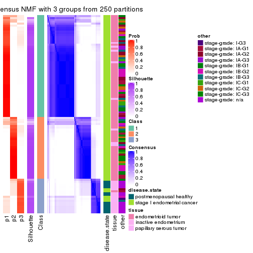</p>

</div>
<div id='tab-ATC-NMF-consensus-heatmap-3'>
<pre><code class="r">consensus_heatmap(res, k = 4)
</code></pre>

<p>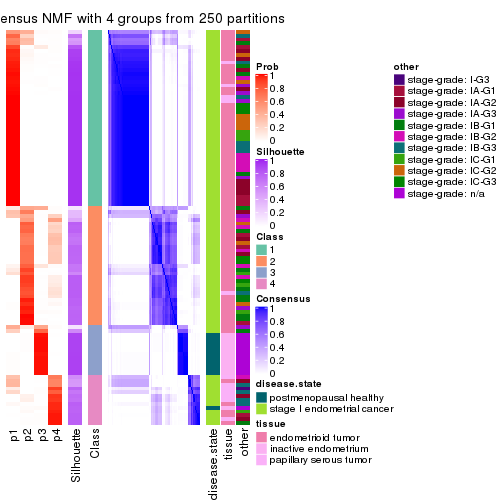</p>

</div>
<div id='tab-ATC-NMF-consensus-heatmap-4'>
<pre><code class="r">consensus_heatmap(res, k = 5)
</code></pre>

<p>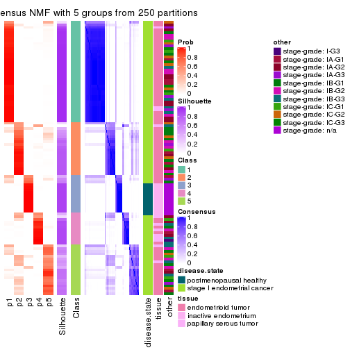</p>

</div>
<div id='tab-ATC-NMF-consensus-heatmap-5'>
<pre><code class="r">consensus_heatmap(res, k = 6)
</code></pre>

<p>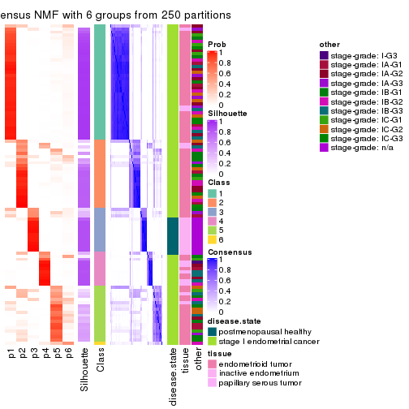</p>

</div>
</div>

Heatmaps for the membership of samples in all partitions to see how consistent they are:


<script>
$( function() {
	$( '#tabs-ATC-NMF-membership-heatmap' ).tabs();
} );
</script>
<div id='tabs-ATC-NMF-membership-heatmap'>
<ul>
<li><a href='#tab-ATC-NMF-membership-heatmap-1'>k = 2</a></li>
<li><a href='#tab-ATC-NMF-membership-heatmap-2'>k = 3</a></li>
<li><a href='#tab-ATC-NMF-membership-heatmap-3'>k = 4</a></li>
<li><a href='#tab-ATC-NMF-membership-heatmap-4'>k = 5</a></li>
<li><a href='#tab-ATC-NMF-membership-heatmap-5'>k = 6</a></li>
</ul>
<div id='tab-ATC-NMF-membership-heatmap-1'>
<pre><code class="r">membership_heatmap(res, k = 2)
</code></pre>

<p>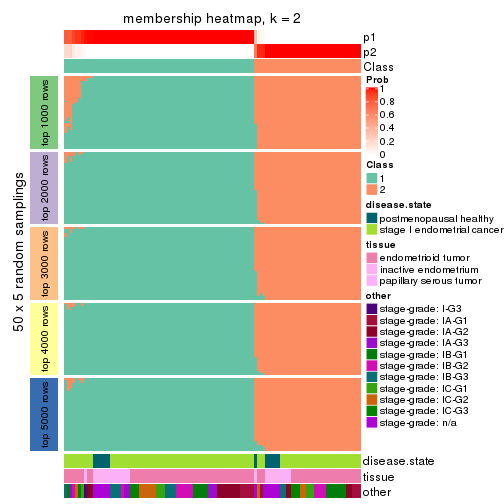</p>

</div>
<div id='tab-ATC-NMF-membership-heatmap-2'>
<pre><code class="r">membership_heatmap(res, k = 3)
</code></pre>

<p>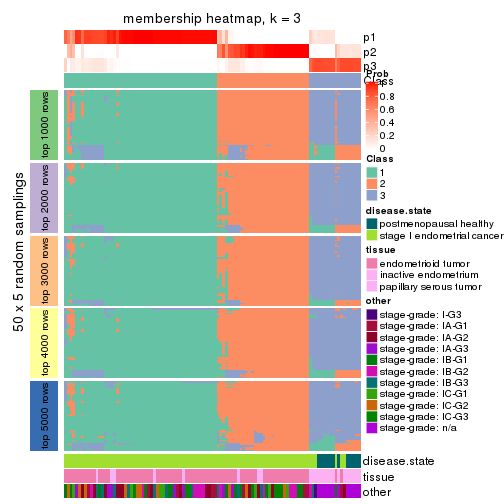</p>

</div>
<div id='tab-ATC-NMF-membership-heatmap-3'>
<pre><code class="r">membership_heatmap(res, k = 4)
</code></pre>

<p>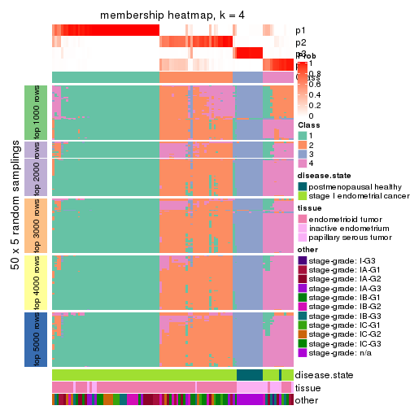</p>

</div>
<div id='tab-ATC-NMF-membership-heatmap-4'>
<pre><code class="r">membership_heatmap(res, k = 5)
</code></pre>

<p>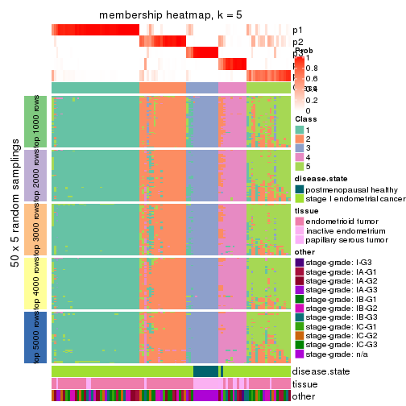</p>

</div>
<div id='tab-ATC-NMF-membership-heatmap-5'>
<pre><code class="r">membership_heatmap(res, k = 6)
</code></pre>

<p>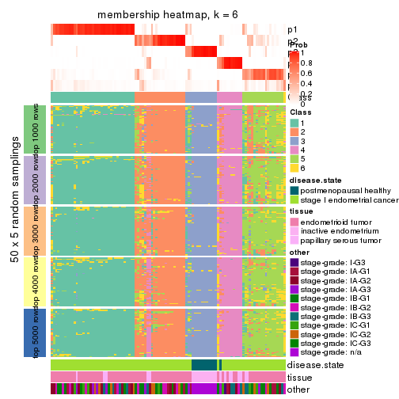</p>

</div>
</div>

As soon as we have had the classes for columns, we can look for signatures
which are significantly different between classes which can be candidate marks
for certain classes. Following are the heatmaps for signatures.


Signature heatmaps where rows are scaled:


<script>
$( function() {
	$( '#tabs-ATC-NMF-get-signatures' ).tabs();
} );
</script>
<div id='tabs-ATC-NMF-get-signatures'>
<ul>
<li><a href='#tab-ATC-NMF-get-signatures-1'>k = 2</a></li>
<li><a href='#tab-ATC-NMF-get-signatures-2'>k = 3</a></li>
<li><a href='#tab-ATC-NMF-get-signatures-3'>k = 4</a></li>
<li><a href='#tab-ATC-NMF-get-signatures-4'>k = 5</a></li>
<li><a href='#tab-ATC-NMF-get-signatures-5'>k = 6</a></li>
</ul>
<div id='tab-ATC-NMF-get-signatures-1'>
<pre><code class="r">get_signatures(res, k = 2)
</code></pre>

<p>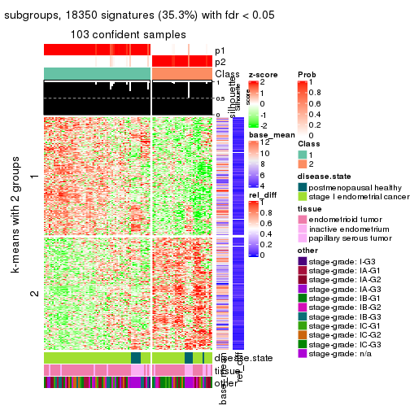</p>

</div>
<div id='tab-ATC-NMF-get-signatures-2'>
<pre><code class="r">get_signatures(res, k = 3)
</code></pre>

<p>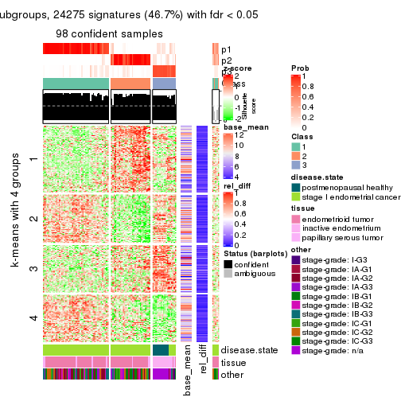</p>

</div>
<div id='tab-ATC-NMF-get-signatures-3'>
<pre><code class="r">get_signatures(res, k = 4)
</code></pre>

<p>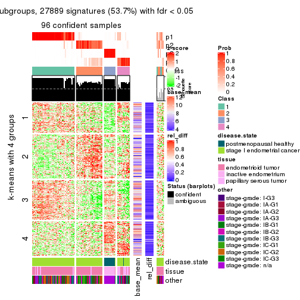</p>

</div>
<div id='tab-ATC-NMF-get-signatures-4'>
<pre><code class="r">get_signatures(res, k = 5)
</code></pre>

<p>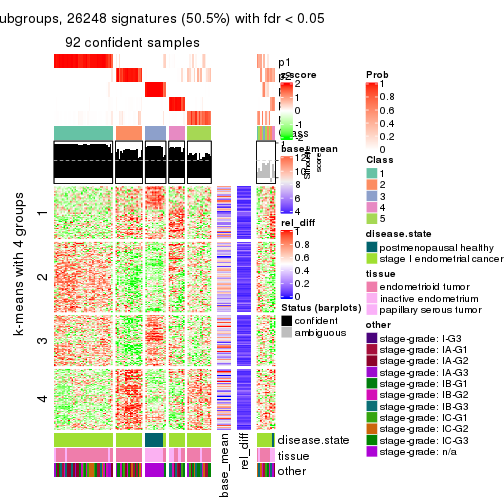</p>

</div>
<div id='tab-ATC-NMF-get-signatures-5'>
<pre><code class="r">get_signatures(res, k = 6)
</code></pre>

<p>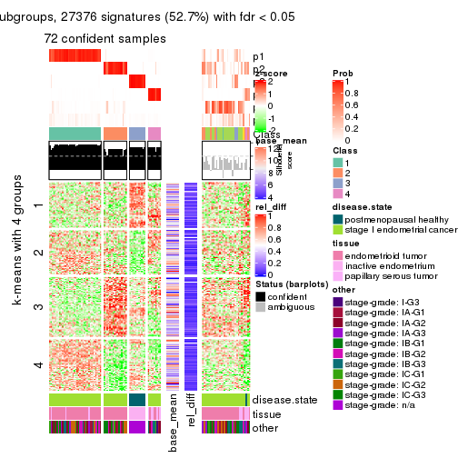</p>

</div>
</div>


Signature heatmaps where rows are not scaled:


<script>
$( function() {
	$( '#tabs-ATC-NMF-get-signatures-no-scale' ).tabs();
} );
</script>
<div id='tabs-ATC-NMF-get-signatures-no-scale'>
<ul>
<li><a href='#tab-ATC-NMF-get-signatures-no-scale-1'>k = 2</a></li>
<li><a href='#tab-ATC-NMF-get-signatures-no-scale-2'>k = 3</a></li>
<li><a href='#tab-ATC-NMF-get-signatures-no-scale-3'>k = 4</a></li>
<li><a href='#tab-ATC-NMF-get-signatures-no-scale-4'>k = 5</a></li>
<li><a href='#tab-ATC-NMF-get-signatures-no-scale-5'>k = 6</a></li>
</ul>
<div id='tab-ATC-NMF-get-signatures-no-scale-1'>
<pre><code class="r">get_signatures(res, k = 2, scale_rows = FALSE)
</code></pre>

<p>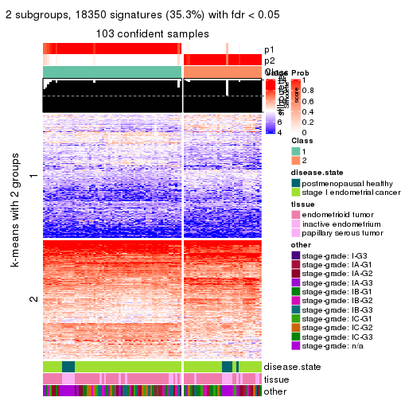</p>

</div>
<div id='tab-ATC-NMF-get-signatures-no-scale-2'>
<pre><code class="r">get_signatures(res, k = 3, scale_rows = FALSE)
</code></pre>

<p>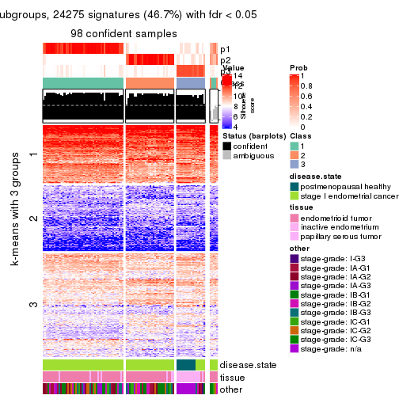</p>

</div>
<div id='tab-ATC-NMF-get-signatures-no-scale-3'>
<pre><code class="r">get_signatures(res, k = 4, scale_rows = FALSE)
</code></pre>

<p>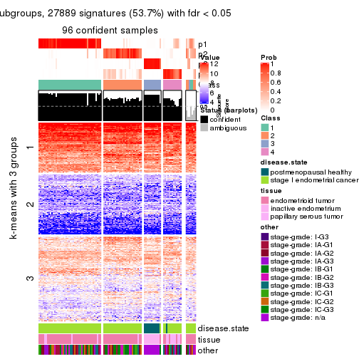</p>

</div>
<div id='tab-ATC-NMF-get-signatures-no-scale-4'>
<pre><code class="r">get_signatures(res, k = 5, scale_rows = FALSE)
</code></pre>

<p>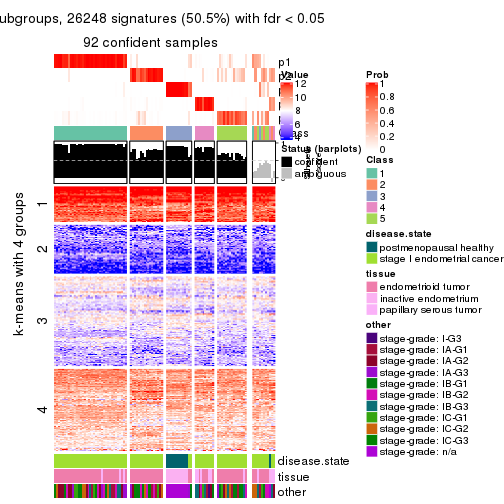</p>

</div>
<div id='tab-ATC-NMF-get-signatures-no-scale-5'>
<pre><code class="r">get_signatures(res, k = 6, scale_rows = FALSE)
</code></pre>

<p>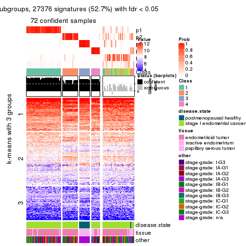</p>

</div>
</div>


Compare the overlap of signatures from different k:

```r
compare_signatures(res)
```

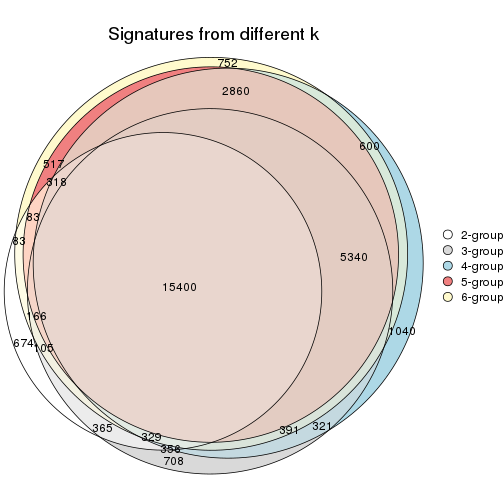

`get_signature()` returns a data frame invisibly. TO get the list of signatures, the function
call should be assigned to a variable explicitly. In following code, if `plot` argument is set
to `FALSE`, no heatmap is plotted while only the differential analysis is performed.

```r
# code only for demonstration
tb = get_signature(res, k = ..., plot = FALSE)
```

An example of the output of `tb` is:

```
#>   which_row         fdr    mean_1    mean_2 scaled_mean_1 scaled_mean_2 km
#> 1        38 0.042760348  8.373488  9.131774    -0.5533452     0.5164555  1
#> 2        40 0.018707592  7.106213  8.469186    -0.6173731     0.5762149  1
#> 3        55 0.019134737 10.221463 11.207825    -0.6159697     0.5749050  1
#> 4        59 0.006059896  5.921854  7.869574    -0.6899429     0.6439467  1
#> 5        60 0.018055526  8.928898 10.211722    -0.6204761     0.5791110  1
#> 6        98 0.009384629 15.714769 14.887706     0.6635654    -0.6193277  2
...
```

The columns in `tb` are:

1. `which_row`: row indices corresponding to the input matrix.
2. `fdr`: FDR for the differential test. 
3. `mean_x`: The mean value in group x.
4. `scaled_mean_x`: The mean value in group x after rows are scaled.
5. `km`: Row groups if k-means clustering is applied to rows.


UMAP plot which shows how samples are separated.


<script>
$( function() {
	$( '#tabs-ATC-NMF-dimension-reduction' ).tabs();
} );
</script>
<div id='tabs-ATC-NMF-dimension-reduction'>
<ul>
<li><a href='#tab-ATC-NMF-dimension-reduction-1'>k = 2</a></li>
<li><a href='#tab-ATC-NMF-dimension-reduction-2'>k = 3</a></li>
<li><a href='#tab-ATC-NMF-dimension-reduction-3'>k = 4</a></li>
<li><a href='#tab-ATC-NMF-dimension-reduction-4'>k = 5</a></li>
<li><a href='#tab-ATC-NMF-dimension-reduction-5'>k = 6</a></li>
</ul>
<div id='tab-ATC-NMF-dimension-reduction-1'>
<pre><code class="r">dimension_reduction(res, k = 2, method = &quot;UMAP&quot;)
</code></pre>

<p>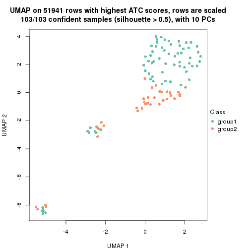</p>

</div>
<div id='tab-ATC-NMF-dimension-reduction-2'>
<pre><code class="r">dimension_reduction(res, k = 3, method = &quot;UMAP&quot;)
</code></pre>

<p>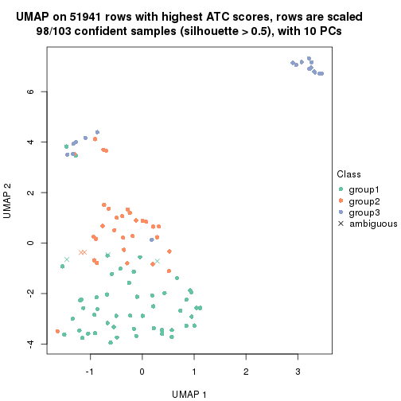</p>

</div>
<div id='tab-ATC-NMF-dimension-reduction-3'>
<pre><code class="r">dimension_reduction(res, k = 4, method = &quot;UMAP&quot;)
</code></pre>

<p>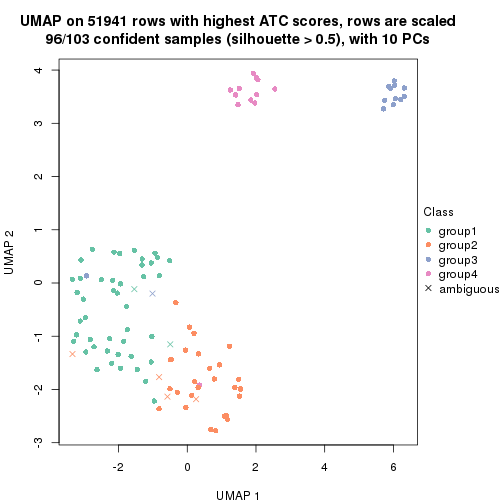</p>

</div>
<div id='tab-ATC-NMF-dimension-reduction-4'>
<pre><code class="r">dimension_reduction(res, k = 5, method = &quot;UMAP&quot;)
</code></pre>

<p>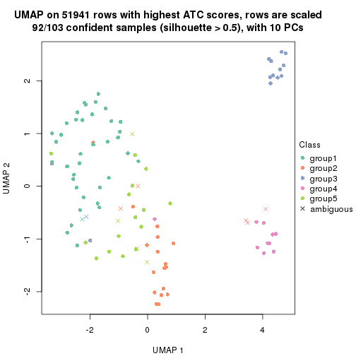</p>

</div>
<div id='tab-ATC-NMF-dimension-reduction-5'>
<pre><code class="r">dimension_reduction(res, k = 6, method = &quot;UMAP&quot;)
</code></pre>

<p>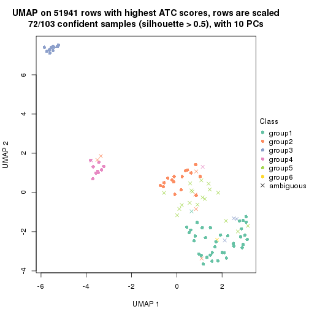</p>

</div>
</div>


Following heatmap shows how subgroups are split when increasing `k`:

```r
collect_classes(res)
```

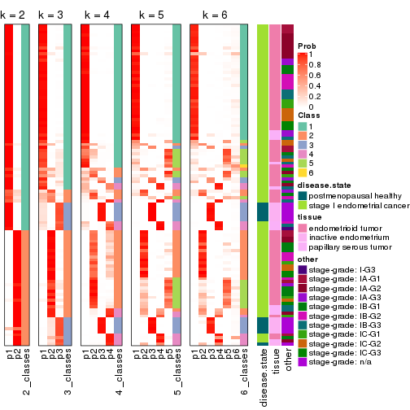


Test correlation between subgroups and known annotations. If the known
annotation is numeric, one-way ANOVA test is applied, and if the known
annotation is discrete, chi-squared contingency table test is applied.

```r
test_to_known_factors(res)
```

```
#>           n disease.state(p) tissue(p) other(p) k
#> ATC:NMF 103         4.46e-01  5.56e-01 7.07e-01 2
#> ATC:NMF  98         6.35e-14  8.69e-14 8.14e-08 3
#> ATC:NMF  96         4.60e-17  5.43e-20 3.74e-10 4
#> ATC:NMF  92         1.27e-15  2.21e-17 1.99e-07 5
#> ATC:NMF  72         1.59e-15  9.18e-18 5.34e-09 6
```


If matrix rows can be associated to genes, consider to use `functional_enrichment(res,
...)` to perform function enrichment for the signature genes. See [this vignette](http://bioconductor.org/packages/devel/bioc/vignettes/cola/inst/doc/functional_enrichment.html) for more detailed explanations.


 

## Session info


```r
sessionInfo()
```

```
#> R version 3.6.0 (2019-04-26)
#> Platform: x86_64-pc-linux-gnu (64-bit)
#> Running under: CentOS Linux 7 (Core)
#> 
#> Matrix products: default
#> BLAS:   /usr/lib64/libblas.so.3.4.2
#> LAPACK: /usr/lib64/liblapack.so.3.4.2
#> 
#> locale:
#>  [1] LC_CTYPE=en_GB.UTF-8       LC_NUMERIC=C               LC_TIME=en_GB.UTF-8       
#>  [4] LC_COLLATE=en_GB.UTF-8     LC_MONETARY=en_GB.UTF-8    LC_MESSAGES=en_GB.UTF-8   
#>  [7] LC_PAPER=en_GB.UTF-8       LC_NAME=C                  LC_ADDRESS=C              
#> [10] LC_TELEPHONE=C             LC_MEASUREMENT=en_GB.UTF-8 LC_IDENTIFICATION=C       
#> 
#> attached base packages:
#> [1] grid      stats     graphics  grDevices utils     datasets  methods   base     
#> 
#> other attached packages:
#> [1] genefilter_1.66.0    ComplexHeatmap_2.3.1 markdown_1.1         knitr_1.26          
#> [5] GetoptLong_0.1.7     cola_1.3.2          
#> 
#> loaded via a namespace (and not attached):
#>  [1] circlize_0.4.8       shape_1.4.4          xfun_0.11            slam_0.1-46         
#>  [5] lattice_0.20-38      splines_3.6.0        colorspace_1.4-1     vctrs_0.2.0         
#>  [9] stats4_3.6.0         blob_1.2.0           XML_3.98-1.20        survival_2.44-1.1   
#> [13] rlang_0.4.2          pillar_1.4.2         DBI_1.0.0            BiocGenerics_0.30.0 
#> [17] bit64_0.9-7          RColorBrewer_1.1-2   matrixStats_0.55.0   stringr_1.4.0       
#> [21] GlobalOptions_0.1.1  evaluate_0.14        memoise_1.1.0        Biobase_2.44.0      
#> [25] IRanges_2.18.3       parallel_3.6.0       AnnotationDbi_1.46.1 highr_0.8           
#> [29] Rcpp_1.0.3           xtable_1.8-4         backports_1.1.5      S4Vectors_0.22.1    
#> [33] annotate_1.62.0      skmeans_0.2-11       bit_1.1-14           microbenchmark_1.4-7
#> [37] brew_1.0-6           impute_1.58.0        rjson_0.2.20         png_0.1-7           
#> [41] digest_0.6.23        stringi_1.4.3        polyclip_1.10-0      clue_0.3-57         
#> [45] tools_3.6.0          bitops_1.0-6         magrittr_1.5         eulerr_6.0.0        
#> [49] RCurl_1.95-4.12      RSQLite_2.1.4        tibble_2.1.3         cluster_2.1.0       
#> [53] crayon_1.3.4         pkgconfig_2.0.3      zeallot_0.1.0        Matrix_1.2-17       
#> [57] xml2_1.2.2           httr_1.4.1           R6_2.4.1             mclust_5.4.5        
#> [61] compiler_3.6.0
```


